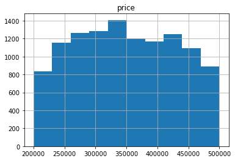

# King County Housing 

### Overview

The purpose of this notebook will be to explore the features that have the highest contribution to the market value of properties in King County Washington. Upon analyzing the King County house sales data, we will help local real estate agency to answer the questions from their clients, i.e. homeowners. In this kernel, I use various regression methods and try to predict the house prices.

### Importing Relavent Libraries


```python
import pandas as pd
import numpy as np
import matplotlib.pyplot as plt
import seaborn as sns
from statsmodels.formula.api import ols
from sklearn.model_selection import train_test_split
from sklearn.linear_model import LinearRegression
from sklearn.metrics import mean_squared_error

%matplotlib inline
```

### Importing Dataset


```python
data = pd.read_csv('kc_house_data.csv')
```

### Exploratory Data Analysis

Print the shape of the dataset


```python
print(data.shape)
data.head()
```

    (21597, 21)
    


<div>
<style scoped>
    .dataframe tbody tr th:only-of-type {
        vertical-align: middle;
    }

    .dataframe tbody tr th {
        vertical-align: top;
    }

    .dataframe thead th {
        text-align: right;
    }
</style>
<table border="1" class="dataframe">
  <thead>
    <tr style="text-align: right;">
      <th></th>
      <th>id</th>
      <th>date</th>
      <th>price</th>
      <th>bedrooms</th>
      <th>bathrooms</th>
      <th>sqft_living</th>
      <th>sqft_lot</th>
      <th>floors</th>
      <th>waterfront</th>
      <th>view</th>
      <th>...</th>
      <th>grade</th>
      <th>sqft_above</th>
      <th>sqft_basement</th>
      <th>yr_built</th>
      <th>yr_renovated</th>
      <th>zipcode</th>
      <th>lat</th>
      <th>long</th>
      <th>sqft_living15</th>
      <th>sqft_lot15</th>
    </tr>
  </thead>
  <tbody>
    <tr>
      <th>0</th>
      <td>7129300520</td>
      <td>10/13/2014</td>
      <td>221900.0</td>
      <td>3</td>
      <td>1.00</td>
      <td>1180</td>
      <td>5650</td>
      <td>1.0</td>
      <td>NaN</td>
      <td>NONE</td>
      <td>...</td>
      <td>7 Average</td>
      <td>1180</td>
      <td>0.0</td>
      <td>1955</td>
      <td>0.0</td>
      <td>98178</td>
      <td>47.5112</td>
      <td>-122.257</td>
      <td>1340</td>
      <td>5650</td>
    </tr>
    <tr>
      <th>1</th>
      <td>6414100192</td>
      <td>12/9/2014</td>
      <td>538000.0</td>
      <td>3</td>
      <td>2.25</td>
      <td>2570</td>
      <td>7242</td>
      <td>2.0</td>
      <td>NO</td>
      <td>NONE</td>
      <td>...</td>
      <td>7 Average</td>
      <td>2170</td>
      <td>400.0</td>
      <td>1951</td>
      <td>1991.0</td>
      <td>98125</td>
      <td>47.7210</td>
      <td>-122.319</td>
      <td>1690</td>
      <td>7639</td>
    </tr>
    <tr>
      <th>2</th>
      <td>5631500400</td>
      <td>2/25/2015</td>
      <td>180000.0</td>
      <td>2</td>
      <td>1.00</td>
      <td>770</td>
      <td>10000</td>
      <td>1.0</td>
      <td>NO</td>
      <td>NONE</td>
      <td>...</td>
      <td>6 Low Average</td>
      <td>770</td>
      <td>0.0</td>
      <td>1933</td>
      <td>NaN</td>
      <td>98028</td>
      <td>47.7379</td>
      <td>-122.233</td>
      <td>2720</td>
      <td>8062</td>
    </tr>
    <tr>
      <th>3</th>
      <td>2487200875</td>
      <td>12/9/2014</td>
      <td>604000.0</td>
      <td>4</td>
      <td>3.00</td>
      <td>1960</td>
      <td>5000</td>
      <td>1.0</td>
      <td>NO</td>
      <td>NONE</td>
      <td>...</td>
      <td>7 Average</td>
      <td>1050</td>
      <td>910.0</td>
      <td>1965</td>
      <td>0.0</td>
      <td>98136</td>
      <td>47.5208</td>
      <td>-122.393</td>
      <td>1360</td>
      <td>5000</td>
    </tr>
    <tr>
      <th>4</th>
      <td>1954400510</td>
      <td>2/18/2015</td>
      <td>510000.0</td>
      <td>3</td>
      <td>2.00</td>
      <td>1680</td>
      <td>8080</td>
      <td>1.0</td>
      <td>NO</td>
      <td>NONE</td>
      <td>...</td>
      <td>8 Good</td>
      <td>1680</td>
      <td>0.0</td>
      <td>1987</td>
      <td>0.0</td>
      <td>98074</td>
      <td>47.6168</td>
      <td>-122.045</td>
      <td>1800</td>
      <td>7503</td>
    </tr>
  </tbody>
</table>
<p>5 rows × 21 columns</p>
</div>


```python
data.info()
```

    <class 'pandas.core.frame.DataFrame'>
    RangeIndex: 21597 entries, 0 to 21596
    Data columns (total 21 columns):
     #   Column         Non-Null Count  Dtype  
    ---  ------         --------------  -----  
     0   id             21597 non-null  int64  
     1   date           21597 non-null  object 
     2   price          21597 non-null  float64
     3   bedrooms       21597 non-null  int64  
     4   bathrooms      21597 non-null  float64
     5   sqft_living    21597 non-null  int64  
     6   sqft_lot       21597 non-null  int64  
     7   floors         21597 non-null  float64
     8   waterfront     19221 non-null  object 
     9   view           21534 non-null  object 
     10  condition      21597 non-null  object 
     11  grade          21597 non-null  object 
     12  sqft_above     21597 non-null  int64  
     13  sqft_basement  21597 non-null  object 
     14  yr_built       21597 non-null  int64  
     15  yr_renovated   17755 non-null  float64
     16  zipcode        21597 non-null  int64  
     17  lat            21597 non-null  float64
     18  long           21597 non-null  float64
     19  sqft_living15  21597 non-null  int64  
     20  sqft_lot15     21597 non-null  int64  
    dtypes: float64(6), int64(9), object(6)
    memory usage: 3.5+ MB
    


```python
data.describe()
```


<div>
<style scoped>
    .dataframe tbody tr th:only-of-type {
        vertical-align: middle;
    }

    .dataframe tbody tr th {
        vertical-align: top;
    }

    .dataframe thead th {
        text-align: right;
    }
</style>
<table border="1" class="dataframe">
  <thead>
    <tr style="text-align: right;">
      <th></th>
      <th>id</th>
      <th>price</th>
      <th>bedrooms</th>
      <th>bathrooms</th>
      <th>sqft_living</th>
      <th>sqft_lot</th>
      <th>floors</th>
      <th>sqft_above</th>
      <th>yr_built</th>
      <th>yr_renovated</th>
      <th>zipcode</th>
      <th>lat</th>
      <th>long</th>
      <th>sqft_living15</th>
      <th>sqft_lot15</th>
    </tr>
  </thead>
  <tbody>
    <tr>
      <th>count</th>
      <td>2.159700e+04</td>
      <td>2.159700e+04</td>
      <td>21597.000000</td>
      <td>21597.000000</td>
      <td>21597.000000</td>
      <td>2.159700e+04</td>
      <td>21597.000000</td>
      <td>21597.000000</td>
      <td>21597.000000</td>
      <td>17755.000000</td>
      <td>21597.000000</td>
      <td>21597.000000</td>
      <td>21597.000000</td>
      <td>21597.000000</td>
      <td>21597.000000</td>
    </tr>
    <tr>
      <th>mean</th>
      <td>4.580474e+09</td>
      <td>5.402966e+05</td>
      <td>3.373200</td>
      <td>2.115826</td>
      <td>2080.321850</td>
      <td>1.509941e+04</td>
      <td>1.494096</td>
      <td>1788.596842</td>
      <td>1970.999676</td>
      <td>83.636778</td>
      <td>98077.951845</td>
      <td>47.560093</td>
      <td>-122.213982</td>
      <td>1986.620318</td>
      <td>12758.283512</td>
    </tr>
    <tr>
      <th>std</th>
      <td>2.876736e+09</td>
      <td>3.673681e+05</td>
      <td>0.926299</td>
      <td>0.768984</td>
      <td>918.106125</td>
      <td>4.141264e+04</td>
      <td>0.539683</td>
      <td>827.759761</td>
      <td>29.375234</td>
      <td>399.946414</td>
      <td>53.513072</td>
      <td>0.138552</td>
      <td>0.140724</td>
      <td>685.230472</td>
      <td>27274.441950</td>
    </tr>
    <tr>
      <th>min</th>
      <td>1.000102e+06</td>
      <td>7.800000e+04</td>
      <td>1.000000</td>
      <td>0.500000</td>
      <td>370.000000</td>
      <td>5.200000e+02</td>
      <td>1.000000</td>
      <td>370.000000</td>
      <td>1900.000000</td>
      <td>0.000000</td>
      <td>98001.000000</td>
      <td>47.155900</td>
      <td>-122.519000</td>
      <td>399.000000</td>
      <td>651.000000</td>
    </tr>
    <tr>
      <th>25%</th>
      <td>2.123049e+09</td>
      <td>3.220000e+05</td>
      <td>3.000000</td>
      <td>1.750000</td>
      <td>1430.000000</td>
      <td>5.040000e+03</td>
      <td>1.000000</td>
      <td>1190.000000</td>
      <td>1951.000000</td>
      <td>0.000000</td>
      <td>98033.000000</td>
      <td>47.471100</td>
      <td>-122.328000</td>
      <td>1490.000000</td>
      <td>5100.000000</td>
    </tr>
    <tr>
      <th>50%</th>
      <td>3.904930e+09</td>
      <td>4.500000e+05</td>
      <td>3.000000</td>
      <td>2.250000</td>
      <td>1910.000000</td>
      <td>7.618000e+03</td>
      <td>1.500000</td>
      <td>1560.000000</td>
      <td>1975.000000</td>
      <td>0.000000</td>
      <td>98065.000000</td>
      <td>47.571800</td>
      <td>-122.231000</td>
      <td>1840.000000</td>
      <td>7620.000000</td>
    </tr>
    <tr>
      <th>75%</th>
      <td>7.308900e+09</td>
      <td>6.450000e+05</td>
      <td>4.000000</td>
      <td>2.500000</td>
      <td>2550.000000</td>
      <td>1.068500e+04</td>
      <td>2.000000</td>
      <td>2210.000000</td>
      <td>1997.000000</td>
      <td>0.000000</td>
      <td>98118.000000</td>
      <td>47.678000</td>
      <td>-122.125000</td>
      <td>2360.000000</td>
      <td>10083.000000</td>
    </tr>
    <tr>
      <th>max</th>
      <td>9.900000e+09</td>
      <td>7.700000e+06</td>
      <td>33.000000</td>
      <td>8.000000</td>
      <td>13540.000000</td>
      <td>1.651359e+06</td>
      <td>3.500000</td>
      <td>9410.000000</td>
      <td>2015.000000</td>
      <td>2015.000000</td>
      <td>98199.000000</td>
      <td>47.777600</td>
      <td>-121.315000</td>
      <td>6210.000000</td>
      <td>871200.000000</td>
    </tr>
  </tbody>
</table>
</div>


Now we know the count, mean, standard deviation, min and max etc of each variable.


```python
data.columns
```


    Index(['id', 'date', 'price', 'bedrooms', 'bathrooms', 'sqft_living',
           'sqft_lot', 'floors', 'waterfront', 'view', 'condition', 'grade',
           'sqft_above', 'sqft_basement', 'yr_built', 'yr_renovated', 'zipcode',
           'lat', 'long', 'sqft_living15', 'sqft_lot15'],
          dtype='object')


### Column Names and Descriptions for King County Data Set
* `id` - Unique identifier for a house
* `date` - Date house was sold
* `price` - Sale price (prediction target)
* `bedrooms` - Number of bedrooms
* `bathrooms` - Number of bathrooms
* `sqft_living` - Square footage of living space in the home
* `sqft_lot` - Square footage of the lot
* `floors` - Number of floors (levels) in house
* `waterfront` - Whether the house is on a waterfront
  * Includes Duwamish, Elliott Bay, Puget Sound, Lake Union, Ship Canal, Lake Washington, Lake Sammamish, other lake, and river/slough waterfronts
* `view` - Quality of view from house
  * Includes views of Mt. Rainier, Olympics, Cascades, Territorial, Seattle Skyline, Puget Sound, Lake Washington, Lake Sammamish, small lake / river / creek, and other
* `condition` - How good the overall condition of the house is. Related to maintenance of house.
  * See the [King County Assessor Website](https://info.kingcounty.gov/assessor/esales/Glossary.aspx?type=r) for further explanation of each condition code
* `grade` - Overall grade of the house. Related to the construction and design of the house.
  * See the [King County Assessor Website](https://info.kingcounty.gov/assessor/esales/Glossary.aspx?type=r) for further explanation of each building grade code
* `sqft_above` - Square footage of house apart from basement
* `sqft_basement` - Square footage of the basement
* `yr_built` - Year when house was built
* `yr_renovated` - Year when house was renovated
* `zipcode` - ZIP Code used by the United States Postal Service
* `lat` - Latitude coordinate
* `long` - Longitude coordinate
* `sqft_living15` - The square footage of interior housing living space for the nearest 15 neighbors
* `sqft_lot15` - The square footage of the land lots of the nearest 15 neighbors

### Waterfront and View

For waterfront, we'll find out what the values are and fill them with 0.


```python
data.waterfront.value_counts()
```


    NO     19075
    YES      146
    Name: waterfront, dtype: int64


```python
data.waterfront.unique()
```


    array([nan, 'NO', 'YES'], dtype=object)


Because there are no values, we can assume they're not on the waterfront. A zero will signify no value in binary terms.


```python
# fill NaN values in waterfront columns with 0
values = {'view':0, 'waterfront':0}
data.fillna(value=values, inplace=True)
data['waterfront'].isna().sum()
```


    0


Let's map out the waterfront properties to get a visual. First we'll import folium to use it's maps.


```python
import folium
from folium import plugins
from folium.plugins import HeatMap
from folium.plugins import MarkerCluster
```

Next we'll assign the index and map out each waterfront property and in addition, allow the user the ability to click on each property and see a popup with price and square footage.


```python
waterfront = data[(data['waterfront'] == "YES")]

waterfront_map = folium.Map(location=[waterfront.lat.mean(), waterfront.long.mean()],
                           zoom_start=11,
                           tiles='openstreetmap')
for i in waterfront.index:
    lat = waterfront.lat[i]
    long = waterfront.long[i]
    price = waterfront.price[i]
    sqft_living = waterfront.sqft_living[i]
    marker=folium.Marker([lat, long]).add_to(waterfront_map)
    #add popup text with price and sqft_living for each property to see property values on waterfront
    popup_text = "Price: {}, Sqft: {}".format(price,sqft_living)
    popup = folium.Popup(popup_text, parse_html=True)
    marker = folium.Marker([lat, long], popup=popup).add_to(waterfront_map)
    
waterfront_map
```


<div style="width:100%;"><div style="position:relative;width:100%;height:0;padding-bottom:60%;"><span style="color:#565656">Make this Notebook Trusted to load map: File -> Trust Notebook</span><iframe srcdoc="&lt;!DOCTYPE html&gt;
&lt;html&gt;
&lt;head&gt;

    &lt;meta http-equiv=&quot;content-type&quot; content=&quot;text/html; charset=UTF-8&quot; /&gt;

        &lt;script&gt;
            L_NO_TOUCH = false;
            L_DISABLE_3D = false;
        &lt;/script&gt;

    &lt;style&gt;html, body {width: 100%;height: 100%;margin: 0;padding: 0;}&lt;/style&gt;
    &lt;style&gt;#map {position:absolute;top:0;bottom:0;right:0;left:0;}&lt;/style&gt;
    &lt;script src=&quot;https://cdn.jsdelivr.net/npm/leaflet@1.6.0/dist/leaflet.js&quot;&gt;&lt;/script&gt;
    &lt;script src=&quot;https://code.jquery.com/jquery-1.12.4.min.js&quot;&gt;&lt;/script&gt;
    &lt;script src=&quot;https://maxcdn.bootstrapcdn.com/bootstrap/3.2.0/js/bootstrap.min.js&quot;&gt;&lt;/script&gt;
    &lt;script src=&quot;https://cdnjs.cloudflare.com/ajax/libs/Leaflet.awesome-markers/2.0.2/leaflet.awesome-markers.js&quot;&gt;&lt;/script&gt;
    &lt;link rel=&quot;stylesheet&quot; href=&quot;https://cdn.jsdelivr.net/npm/leaflet@1.6.0/dist/leaflet.css&quot;/&gt;
    &lt;link rel=&quot;stylesheet&quot; href=&quot;https://maxcdn.bootstrapcdn.com/bootstrap/3.2.0/css/bootstrap.min.css&quot;/&gt;
    &lt;link rel=&quot;stylesheet&quot; href=&quot;https://maxcdn.bootstrapcdn.com/bootstrap/3.2.0/css/bootstrap-theme.min.css&quot;/&gt;
    &lt;link rel=&quot;stylesheet&quot; href=&quot;https://maxcdn.bootstrapcdn.com/font-awesome/4.6.3/css/font-awesome.min.css&quot;/&gt;
    &lt;link rel=&quot;stylesheet&quot; href=&quot;https://cdnjs.cloudflare.com/ajax/libs/Leaflet.awesome-markers/2.0.2/leaflet.awesome-markers.css&quot;/&gt;
    &lt;link rel=&quot;stylesheet&quot; href=&quot;https://cdn.jsdelivr.net/gh/python-visualization/folium/folium/templates/leaflet.awesome.rotate.min.css&quot;/&gt;

            &lt;meta name=&quot;viewport&quot; content=&quot;width=device-width,
                initial-scale=1.0, maximum-scale=1.0, user-scalable=no&quot; /&gt;
            &lt;style&gt;
                #map_72904f7f581fc69cee3abb4c50d2d800 {
                    position: relative;
                    width: 100.0%;
                    height: 100.0%;
                    left: 0.0%;
                    top: 0.0%;
                }
            &lt;/style&gt;

&lt;/head&gt;
&lt;body&gt;


            &lt;div class=&quot;folium-map&quot; id=&quot;map_72904f7f581fc69cee3abb4c50d2d800&quot; &gt;&lt;/div&gt;

&lt;/body&gt;
&lt;script&gt;


            var map_72904f7f581fc69cee3abb4c50d2d800 = L.map(
                &quot;map_72904f7f581fc69cee3abb4c50d2d800&quot;,
                {
                    center: [47.53967671232876, -122.2781643835617],
                    crs: L.CRS.EPSG3857,
                    zoom: 11,
                    zoomControl: true,
                    preferCanvas: false,
                }
            );


            var tile_layer_04c5f01a2f301242a1fddb8cee4599fa = L.tileLayer(
                &quot;https://{s}.tile.openstreetmap.org/{z}/{x}/{y}.png&quot;,
                {&quot;attribution&quot;: &quot;Data by \u0026copy; \u003ca href=\&quot;http://openstreetmap.org\&quot;\u003eOpenStreetMap\u003c/a\u003e, under \u003ca href=\&quot;http://www.openstreetmap.org/copyright\&quot;\u003eODbL\u003c/a\u003e.&quot;, &quot;detectRetina&quot;: false, &quot;maxNativeZoom&quot;: 18, &quot;maxZoom&quot;: 18, &quot;minZoom&quot;: 0, &quot;noWrap&quot;: false, &quot;opacity&quot;: 1, &quot;subdomains&quot;: &quot;abc&quot;, &quot;tms&quot;: false}
            ).addTo(map_72904f7f581fc69cee3abb4c50d2d800);


            var marker_0f96c8b19a6bd3ff7ad69ce01008b332 = L.marker(
                [47.4041, -122.451],
                {}
            ).addTo(map_72904f7f581fc69cee3abb4c50d2d800);


            var marker_f47bf329de8a746cf237123f317f4316 = L.marker(
                [47.4041, -122.451],
                {}
            ).addTo(map_72904f7f581fc69cee3abb4c50d2d800);


        var popup_d7a4e8055db82bbf807f2fc2b7d1940c = L.popup({&quot;maxWidth&quot;: &quot;100%&quot;});


                var html_4489f5e714d2c6095a7a4a55e5fe511f = $(`&lt;div id=&quot;html_4489f5e714d2c6095a7a4a55e5fe511f&quot; style=&quot;width: 100.0%; height: 100.0%;&quot;&gt;Price: 1350000.0, Sqft: 2753&lt;/div&gt;`)[0];
                popup_d7a4e8055db82bbf807f2fc2b7d1940c.setContent(html_4489f5e714d2c6095a7a4a55e5fe511f);


        marker_f47bf329de8a746cf237123f317f4316.bindPopup(popup_d7a4e8055db82bbf807f2fc2b7d1940c)
        ;


            var marker_ba89f7cfcc71ea06e3f2b93bc732b337 = L.marker(
                [47.4497, -122.375],
                {}
            ).addTo(map_72904f7f581fc69cee3abb4c50d2d800);


            var marker_0ce96d4a8b3a1ffa9ff06a58ee26842f = L.marker(
                [47.4497, -122.375],
                {}
            ).addTo(map_72904f7f581fc69cee3abb4c50d2d800);


        var popup_0c4f85c7dc7e087a69e18e51aab4608b = L.popup({&quot;maxWidth&quot;: &quot;100%&quot;});


                var html_cdbd7345466c4478497d2065e3060f9f = $(`&lt;div id=&quot;html_cdbd7345466c4478497d2065e3060f9f&quot; style=&quot;width: 100.0%; height: 100.0%;&quot;&gt;Price: 655000.0, Sqft: 1450&lt;/div&gt;`)[0];
                popup_0c4f85c7dc7e087a69e18e51aab4608b.setContent(html_cdbd7345466c4478497d2065e3060f9f);


        marker_0ce96d4a8b3a1ffa9ff06a58ee26842f.bindPopup(popup_0c4f85c7dc7e087a69e18e51aab4608b)
        ;


            var marker_e3ce2682a25ae5d4a29b40e3f5a68a45 = L.marker(
                [47.6338, -122.072],
                {}
            ).addTo(map_72904f7f581fc69cee3abb4c50d2d800);


            var marker_16aa092f550cd5262333ed0f832bba44 = L.marker(
                [47.6338, -122.072],
                {}
            ).addTo(map_72904f7f581fc69cee3abb4c50d2d800);


        var popup_2bcc9cd90577d17b7a766a40bde50b7e = L.popup({&quot;maxWidth&quot;: &quot;100%&quot;});


                var html_a63cf1b8633949d2952f639514b31c7b = $(`&lt;div id=&quot;html_a63cf1b8633949d2952f639514b31c7b&quot; style=&quot;width: 100.0%; height: 100.0%;&quot;&gt;Price: 2400000.0, Sqft: 3650&lt;/div&gt;`)[0];
                popup_2bcc9cd90577d17b7a766a40bde50b7e.setContent(html_a63cf1b8633949d2952f639514b31c7b);


        marker_16aa092f550cd5262333ed0f832bba44.bindPopup(popup_2bcc9cd90577d17b7a766a40bde50b7e)
        ;


            var marker_43944359e10d6584f3ae4d013840d358 = L.marker(
                [47.4683, -122.438],
                {}
            ).addTo(map_72904f7f581fc69cee3abb4c50d2d800);


            var marker_7cbe8d3e33c8bf1a6675fefdb9a20774 = L.marker(
                [47.4683, -122.438],
                {}
            ).addTo(map_72904f7f581fc69cee3abb4c50d2d800);


        var popup_e1500682cba08c3e2930bf9d68891df5 = L.popup({&quot;maxWidth&quot;: &quot;100%&quot;});


                var html_e41d0150d68aa90d11afef94366e4d61 = $(`&lt;div id=&quot;html_e41d0150d68aa90d11afef94366e4d61&quot; style=&quot;width: 100.0%; height: 100.0%;&quot;&gt;Price: 369900.0, Sqft: 760&lt;/div&gt;`)[0];
                popup_e1500682cba08c3e2930bf9d68891df5.setContent(html_e41d0150d68aa90d11afef94366e4d61);


        marker_7cbe8d3e33c8bf1a6675fefdb9a20774.bindPopup(popup_e1500682cba08c3e2930bf9d68891df5)
        ;


            var marker_ee59a51aed2f835bcda3e6b9fb91b262 = L.marker(
                [47.6053, -122.077],
                {}
            ).addTo(map_72904f7f581fc69cee3abb4c50d2d800);


            var marker_d1ece8696b39d13021e16174f9a4fbd4 = L.marker(
                [47.6053, -122.077],
                {}
            ).addTo(map_72904f7f581fc69cee3abb4c50d2d800);


        var popup_e0dd83ca83bb202312bd2693b3a5b575 = L.popup({&quot;maxWidth&quot;: &quot;100%&quot;});


                var html_aafbd2f1abb6e34a5cad105ee563f0d3 = $(`&lt;div id=&quot;html_aafbd2f1abb6e34a5cad105ee563f0d3&quot; style=&quot;width: 100.0%; height: 100.0%;&quot;&gt;Price: 3080000.0, Sqft: 4550&lt;/div&gt;`)[0];
                popup_e0dd83ca83bb202312bd2693b3a5b575.setContent(html_aafbd2f1abb6e34a5cad105ee563f0d3);


        marker_d1ece8696b39d13021e16174f9a4fbd4.bindPopup(popup_e0dd83ca83bb202312bd2693b3a5b575)
        ;


            var marker_a99051a5862b53d26028c5dabeba9cb9 = L.marker(
                [47.3844, -122.438],
                {}
            ).addTo(map_72904f7f581fc69cee3abb4c50d2d800);


            var marker_b9500ec18ffc8d3df15c31e00a53a26c = L.marker(
                [47.3844, -122.438],
                {}
            ).addTo(map_72904f7f581fc69cee3abb4c50d2d800);


        var popup_82375d132bf6cfa303071022ac0b5847 = L.popup({&quot;maxWidth&quot;: &quot;100%&quot;});


                var html_956b5169dc59015546253fa757db39de = $(`&lt;div id=&quot;html_956b5169dc59015546253fa757db39de&quot; style=&quot;width: 100.0%; height: 100.0%;&quot;&gt;Price: 705000.0, Sqft: 1970&lt;/div&gt;`)[0];
                popup_82375d132bf6cfa303071022ac0b5847.setContent(html_956b5169dc59015546253fa757db39de);


        marker_b9500ec18ffc8d3df15c31e00a53a26c.bindPopup(popup_82375d132bf6cfa303071022ac0b5847)
        ;


            var marker_de25ba4d160a7b31bbf8ca62119add77 = L.marker(
                [47.4169, -122.348],
                {}
            ).addTo(map_72904f7f581fc69cee3abb4c50d2d800);


            var marker_a5f73dfa05b9b1e991c1ab3542f6a42a = L.marker(
                [47.4169, -122.348],
                {}
            ).addTo(map_72904f7f581fc69cee3abb4c50d2d800);


        var popup_0ec9606f474a0322e8ff42acb823e72e = L.popup({&quot;maxWidth&quot;: &quot;100%&quot;});


                var html_820510c71035ad02a908306296bd9a8e = $(`&lt;div id=&quot;html_820510c71035ad02a908306296bd9a8e&quot; style=&quot;width: 100.0%; height: 100.0%;&quot;&gt;Price: 2130000.0, Sqft: 5403&lt;/div&gt;`)[0];
                popup_0ec9606f474a0322e8ff42acb823e72e.setContent(html_820510c71035ad02a908306296bd9a8e);


        marker_a5f73dfa05b9b1e991c1ab3542f6a42a.bindPopup(popup_0ec9606f474a0322e8ff42acb823e72e)
        ;


            var marker_5b711ebc98e0277cc4b91ba795a8b5d6 = L.marker(
                [47.7022, -122.224],
                {}
            ).addTo(map_72904f7f581fc69cee3abb4c50d2d800);


            var marker_325f52e73b9ca6a40de91f26aa3b0540 = L.marker(
                [47.7022, -122.224],
                {}
            ).addTo(map_72904f7f581fc69cee3abb4c50d2d800);


        var popup_ebc3b08d0d0766016ec6176702fbd4d5 = L.popup({&quot;maxWidth&quot;: &quot;100%&quot;});


                var html_cb98b679ce9e8422bbe7fbe86d17ed79 = $(`&lt;div id=&quot;html_cb98b679ce9e8422bbe7fbe86d17ed79&quot; style=&quot;width: 100.0%; height: 100.0%;&quot;&gt;Price: 3070000.0, Sqft: 3930&lt;/div&gt;`)[0];
                popup_ebc3b08d0d0766016ec6176702fbd4d5.setContent(html_cb98b679ce9e8422bbe7fbe86d17ed79);


        marker_325f52e73b9ca6a40de91f26aa3b0540.bindPopup(popup_ebc3b08d0d0766016ec6176702fbd4d5)
        ;


            var marker_4a20ce33ae063dbfa95f799e7df4d50f = L.marker(
                [47.502, -122.222],
                {}
            ).addTo(map_72904f7f581fc69cee3abb4c50d2d800);


            var marker_342aa7e93cbd9d399211b14cd0c4253b = L.marker(
                [47.502, -122.222],
                {}
            ).addTo(map_72904f7f581fc69cee3abb4c50d2d800);


        var popup_aca6110fb4e16f9393293eb5bb8ca4be = L.popup({&quot;maxWidth&quot;: &quot;100%&quot;});


                var html_8ada9a95e86710211912fd14ec8979ec = $(`&lt;div id=&quot;html_8ada9a95e86710211912fd14ec8979ec&quot; style=&quot;width: 100.0%; height: 100.0%;&quot;&gt;Price: 825000.0, Sqft: 1150&lt;/div&gt;`)[0];
                popup_aca6110fb4e16f9393293eb5bb8ca4be.setContent(html_8ada9a95e86710211912fd14ec8979ec);


        marker_342aa7e93cbd9d399211b14cd0c4253b.bindPopup(popup_aca6110fb4e16f9393293eb5bb8ca4be)
        ;


            var marker_5070681ed3c857b338592540b52bbe05 = L.marker(
                [47.7165, -122.259],
                {}
            ).addTo(map_72904f7f581fc69cee3abb4c50d2d800);


            var marker_50627be533810f3a0f71a833e525163f = L.marker(
                [47.7165, -122.259],
                {}
            ).addTo(map_72904f7f581fc69cee3abb4c50d2d800);


        var popup_5ebdc0f00e5f526feeeb04da1c2f06b0 = L.popup({&quot;maxWidth&quot;: &quot;100%&quot;});


                var html_373bf03166dca5de1166c271145cbc31 = $(`&lt;div id=&quot;html_373bf03166dca5de1166c271145cbc31&quot; style=&quot;width: 100.0%; height: 100.0%;&quot;&gt;Price: 1960000.0, Sqft: 3120&lt;/div&gt;`)[0];
                popup_5ebdc0f00e5f526feeeb04da1c2f06b0.setContent(html_373bf03166dca5de1166c271145cbc31);


        marker_50627be533810f3a0f71a833e525163f.bindPopup(popup_5ebdc0f00e5f526feeeb04da1c2f06b0)
        ;


            var marker_aca203b4a1724dc7f12061ef80a9bc66 = L.marker(
                [47.5105, -122.238],
                {}
            ).addTo(map_72904f7f581fc69cee3abb4c50d2d800);


            var marker_d1d3f0e97528d9e128672b92eab91034 = L.marker(
                [47.5105, -122.238],
                {}
            ).addTo(map_72904f7f581fc69cee3abb4c50d2d800);


        var popup_db7f4a26676d8ab7c407d2793401c4f4 = L.popup({&quot;maxWidth&quot;: &quot;100%&quot;});


                var html_4ec2ac75ef2adbaf7f7ae4c0a5822cfe = $(`&lt;div id=&quot;html_4ec2ac75ef2adbaf7f7ae4c0a5822cfe&quot; style=&quot;width: 100.0%; height: 100.0%;&quot;&gt;Price: 790000.0, Sqft: 2460&lt;/div&gt;`)[0];
                popup_db7f4a26676d8ab7c407d2793401c4f4.setContent(html_4ec2ac75ef2adbaf7f7ae4c0a5822cfe);


        marker_d1d3f0e97528d9e128672b92eab91034.bindPopup(popup_db7f4a26676d8ab7c407d2793401c4f4)
        ;


            var marker_4a9bfdd0ba67a60629b6971a10ac313a = L.marker(
                [47.6767, -122.211],
                {}
            ).addTo(map_72904f7f581fc69cee3abb4c50d2d800);


            var marker_4f7f11181341657f2bb5a9ea42beac97 = L.marker(
                [47.6767, -122.211],
                {}
            ).addTo(map_72904f7f581fc69cee3abb4c50d2d800);


        var popup_f1d044b8c50d8cb5aee590b26099aaa1 = L.popup({&quot;maxWidth&quot;: &quot;100%&quot;});


                var html_1b004764c0c8b8c4bbbc249294921b18 = $(`&lt;div id=&quot;html_1b004764c0c8b8c4bbbc249294921b18&quot; style=&quot;width: 100.0%; height: 100.0%;&quot;&gt;Price: 5110000.0, Sqft: 8010&lt;/div&gt;`)[0];
                popup_f1d044b8c50d8cb5aee590b26099aaa1.setContent(html_1b004764c0c8b8c4bbbc249294921b18);


        marker_4f7f11181341657f2bb5a9ea42beac97.bindPopup(popup_f1d044b8c50d8cb5aee590b26099aaa1)
        ;


            var marker_60b62ea4c26a6bd9f77ce34bf7939f70 = L.marker(
                [47.4339, -122.512],
                {}
            ).addTo(map_72904f7f581fc69cee3abb4c50d2d800);


            var marker_1d1fbcfc247915797f36425f48564f19 = L.marker(
                [47.4339, -122.512],
                {}
            ).addTo(map_72904f7f581fc69cee3abb4c50d2d800);


        var popup_5b43d8b59b62b7ef957388a110b6eecf = L.popup({&quot;maxWidth&quot;: &quot;100%&quot;});


                var html_354d712cef6bc1d07ed906edce97dd65 = $(`&lt;div id=&quot;html_354d712cef6bc1d07ed906edce97dd65&quot; style=&quot;width: 100.0%; height: 100.0%;&quot;&gt;Price: 290000.0, Sqft: 440&lt;/div&gt;`)[0];
                popup_5b43d8b59b62b7ef957388a110b6eecf.setContent(html_354d712cef6bc1d07ed906edce97dd65);


        marker_1d1fbcfc247915797f36425f48564f19.bindPopup(popup_5b43d8b59b62b7ef957388a110b6eecf)
        ;


            var marker_0599f172f1879fd27ed6cc37296ad4ec = L.marker(
                [47.4734, -122.365],
                {}
            ).addTo(map_72904f7f581fc69cee3abb4c50d2d800);


            var marker_1325c817bbe0d61e615bfc13c8dfdcd2 = L.marker(
                [47.4734, -122.365],
                {}
            ).addTo(map_72904f7f581fc69cee3abb4c50d2d800);


        var popup_cd358cd44e687d46c5e81e01dcb8fa83 = L.popup({&quot;maxWidth&quot;: &quot;100%&quot;});


                var html_50a85a3117360c7e3776fafc940f1313 = $(`&lt;div id=&quot;html_50a85a3117360c7e3776fafc940f1313&quot; style=&quot;width: 100.0%; height: 100.0%;&quot;&gt;Price: 995000.0, Sqft: 4380&lt;/div&gt;`)[0];
                popup_cd358cd44e687d46c5e81e01dcb8fa83.setContent(html_50a85a3117360c7e3776fafc940f1313);


        marker_1325c817bbe0d61e615bfc13c8dfdcd2.bindPopup(popup_cd358cd44e687d46c5e81e01dcb8fa83)
        ;


            var marker_9dd5fbbe536639a599629702ab4bd38f = L.marker(
                [47.5631, -122.21],
                {}
            ).addTo(map_72904f7f581fc69cee3abb4c50d2d800);


            var marker_d00561747cfa92204776391c2a6fc25a = L.marker(
                [47.5631, -122.21],
                {}
            ).addTo(map_72904f7f581fc69cee3abb4c50d2d800);


        var popup_cb27c7317649547914f0c20afb4e0f1a = L.popup({&quot;maxWidth&quot;: &quot;100%&quot;});


                var html_6309c8fce3601a00eb186e2ca2a76fd2 = $(`&lt;div id=&quot;html_6309c8fce3601a00eb186e2ca2a76fd2&quot; style=&quot;width: 100.0%; height: 100.0%;&quot;&gt;Price: 5300000.0, Sqft: 7390&lt;/div&gt;`)[0];
                popup_cb27c7317649547914f0c20afb4e0f1a.setContent(html_6309c8fce3601a00eb186e2ca2a76fd2);


        marker_d00561747cfa92204776391c2a6fc25a.bindPopup(popup_cb27c7317649547914f0c20afb4e0f1a)
        ;


            var marker_b725c9485f3a2a0e6312bfc3dfc7bc3e = L.marker(
                [47.6393, -122.097],
                {}
            ).addTo(map_72904f7f581fc69cee3abb4c50d2d800);


            var marker_99c78203b58037a077c4ab2e611e6ad9 = L.marker(
                [47.6393, -122.097],
                {}
            ).addTo(map_72904f7f581fc69cee3abb4c50d2d800);


        var popup_82fa50e4cc678e0b02adef0f0fe818a6 = L.popup({&quot;maxWidth&quot;: &quot;100%&quot;});


                var html_d8a6e55206b66f6bf38c860e4c57b7e1 = $(`&lt;div id=&quot;html_d8a6e55206b66f6bf38c860e4c57b7e1&quot; style=&quot;width: 100.0%; height: 100.0%;&quot;&gt;Price: 2200000.0, Sqft: 4640&lt;/div&gt;`)[0];
                popup_82fa50e4cc678e0b02adef0f0fe818a6.setContent(html_d8a6e55206b66f6bf38c860e4c57b7e1);


        marker_99c78203b58037a077c4ab2e611e6ad9.bindPopup(popup_82fa50e4cc678e0b02adef0f0fe818a6)
        ;


            var marker_660c59fe77e1a2a73562514a65958116 = L.marker(
                [47.7345, -122.285],
                {}
            ).addTo(map_72904f7f581fc69cee3abb4c50d2d800);


            var marker_d7fcbefa25695f33b52d9563259212fe = L.marker(
                [47.7345, -122.285],
                {}
            ).addTo(map_72904f7f581fc69cee3abb4c50d2d800);


        var popup_993e524b3f74e1b8d2924979155587b7 = L.popup({&quot;maxWidth&quot;: &quot;100%&quot;});


                var html_825671119ea07681ad6142ba82139d31 = $(`&lt;div id=&quot;html_825671119ea07681ad6142ba82139d31&quot; style=&quot;width: 100.0%; height: 100.0%;&quot;&gt;Price: 1180000.0, Sqft: 1770&lt;/div&gt;`)[0];
                popup_993e524b3f74e1b8d2924979155587b7.setContent(html_825671119ea07681ad6142ba82139d31);


        marker_d7fcbefa25695f33b52d9563259212fe.bindPopup(popup_993e524b3f74e1b8d2924979155587b7)
        ;


            var marker_2ce540c7b0ce30819178e58ce4f9a1df = L.marker(
                [47.5115, -122.246],
                {}
            ).addTo(map_72904f7f581fc69cee3abb4c50d2d800);


            var marker_429c25b09c8c0ecd3a3f42dea71f0e0b = L.marker(
                [47.5115, -122.246],
                {}
            ).addTo(map_72904f7f581fc69cee3abb4c50d2d800);


        var popup_2a59009577f26a1454aa2b2d9e6bbca2 = L.popup({&quot;maxWidth&quot;: &quot;100%&quot;});


                var html_05f5e04612d20096300dbe9de9a43b00 = $(`&lt;div id=&quot;html_05f5e04612d20096300dbe9de9a43b00&quot; style=&quot;width: 100.0%; height: 100.0%;&quot;&gt;Price: 1700000.0, Sqft: 3190&lt;/div&gt;`)[0];
                popup_2a59009577f26a1454aa2b2d9e6bbca2.setContent(html_05f5e04612d20096300dbe9de9a43b00);


        marker_429c25b09c8c0ecd3a3f42dea71f0e0b.bindPopup(popup_2a59009577f26a1454aa2b2d9e6bbca2)
        ;


            var marker_a030a84f19808b1c1848e658abf513d4 = L.marker(
                [47.645, -122.084],
                {}
            ).addTo(map_72904f7f581fc69cee3abb4c50d2d800);


            var marker_3f3b90d8cbf8eda9099478256e070aed = L.marker(
                [47.645, -122.084],
                {}
            ).addTo(map_72904f7f581fc69cee3abb4c50d2d800);


        var popup_122cfbef305d8173822bdd3d81d11ac8 = L.popup({&quot;maxWidth&quot;: &quot;100%&quot;});


                var html_d9b0f694bcc22460490cafcee4ea2fb7 = $(`&lt;div id=&quot;html_d9b0f694bcc22460490cafcee4ea2fb7&quot; style=&quot;width: 100.0%; height: 100.0%;&quot;&gt;Price: 960000.0, Sqft: 1730&lt;/div&gt;`)[0];
                popup_122cfbef305d8173822bdd3d81d11ac8.setContent(html_d9b0f694bcc22460490cafcee4ea2fb7);


        marker_3f3b90d8cbf8eda9099478256e070aed.bindPopup(popup_122cfbef305d8173822bdd3d81d11ac8)
        ;


            var marker_5fa4b9f2724e789a884bc84a42eb6fea = L.marker(
                [47.3853, -122.479],
                {}
            ).addTo(map_72904f7f581fc69cee3abb4c50d2d800);


            var marker_16c86c2b5300a9c72fec36f100371db3 = L.marker(
                [47.3853, -122.479],
                {}
            ).addTo(map_72904f7f581fc69cee3abb4c50d2d800);


        var popup_b42aab5a1beed9c890d097c5431d7f34 = L.popup({&quot;maxWidth&quot;: &quot;100%&quot;});


                var html_e8eb236daa9ec9c0bce5ff3e5456ddda = $(`&lt;div id=&quot;html_e8eb236daa9ec9c0bce5ff3e5456ddda&quot; style=&quot;width: 100.0%; height: 100.0%;&quot;&gt;Price: 480000.0, Sqft: 1008&lt;/div&gt;`)[0];
                popup_b42aab5a1beed9c890d097c5431d7f34.setContent(html_e8eb236daa9ec9c0bce5ff3e5456ddda);


        marker_16c86c2b5300a9c72fec36f100371db3.bindPopup(popup_b42aab5a1beed9c890d097c5431d7f34)
        ;


            var marker_4d1692251aef5e56062868e36f1d8205 = L.marker(
                [47.5779, -122.246],
                {}
            ).addTo(map_72904f7f581fc69cee3abb4c50d2d800);


            var marker_16a9c4f1a418b6f8f352b797654558a5 = L.marker(
                [47.5779, -122.246],
                {}
            ).addTo(map_72904f7f581fc69cee3abb4c50d2d800);


        var popup_b78c099b214152465b4dff22b45407e8 = L.popup({&quot;maxWidth&quot;: &quot;100%&quot;});


                var html_5d654b4dfc3da7acb0bcef0202e60665 = $(`&lt;div id=&quot;html_5d654b4dfc3da7acb0bcef0202e60665&quot; style=&quot;width: 100.0%; height: 100.0%;&quot;&gt;Price: 1200000.0, Sqft: 1560&lt;/div&gt;`)[0];
                popup_b78c099b214152465b4dff22b45407e8.setContent(html_5d654b4dfc3da7acb0bcef0202e60665);


        marker_16a9c4f1a418b6f8f352b797654558a5.bindPopup(popup_b78c099b214152465b4dff22b45407e8)
        ;


            var marker_549a7e95e828b6d8ed8dda3cd922640f = L.marker(
                [47.585, -122.222],
                {}
            ).addTo(map_72904f7f581fc69cee3abb4c50d2d800);


            var marker_d04c1adc6dbba4af3158e66cd6dc68a0 = L.marker(
                [47.585, -122.222],
                {}
            ).addTo(map_72904f7f581fc69cee3abb4c50d2d800);


        var popup_6f75198f9ace2b71820a351fc0ba5774 = L.popup({&quot;maxWidth&quot;: &quot;100%&quot;});


                var html_56d88b4336630b3a50fc81feb8b4e743 = $(`&lt;div id=&quot;html_56d88b4336630b3a50fc81feb8b4e743&quot; style=&quot;width: 100.0%; height: 100.0%;&quot;&gt;Price: 3850000.0, Sqft: 5770&lt;/div&gt;`)[0];
                popup_6f75198f9ace2b71820a351fc0ba5774.setContent(html_56d88b4336630b3a50fc81feb8b4e743);


        marker_d04c1adc6dbba4af3158e66cd6dc68a0.bindPopup(popup_6f75198f9ace2b71820a351fc0ba5774)
        ;


            var marker_7d49d9168c5a3abbc9fb82338e30122d = L.marker(
                [47.5883, -122.111],
                {}
            ).addTo(map_72904f7f581fc69cee3abb4c50d2d800);


            var marker_ea1dd5002c06b764aca43d8f60551f18 = L.marker(
                [47.5883, -122.111],
                {}
            ).addTo(map_72904f7f581fc69cee3abb4c50d2d800);


        var popup_d47ba6e8d5a494bb9c4c32b0344f9d24 = L.popup({&quot;maxWidth&quot;: &quot;100%&quot;});


                var html_347207b639cee9124b6f06e55ef570b2 = $(`&lt;div id=&quot;html_347207b639cee9124b6f06e55ef570b2&quot; style=&quot;width: 100.0%; height: 100.0%;&quot;&gt;Price: 1700000.0, Sqft: 2500&lt;/div&gt;`)[0];
                popup_d47ba6e8d5a494bb9c4c32b0344f9d24.setContent(html_347207b639cee9124b6f06e55ef570b2);


        marker_ea1dd5002c06b764aca43d8f60551f18.bindPopup(popup_d47ba6e8d5a494bb9c4c32b0344f9d24)
        ;


            var marker_18f291008c113e9de8df0f2e7e23ed23 = L.marker(
                [47.5487, -122.197],
                {}
            ).addTo(map_72904f7f581fc69cee3abb4c50d2d800);


            var marker_23623eda15b240c9afaf046da5009566 = L.marker(
                [47.5487, -122.197],
                {}
            ).addTo(map_72904f7f581fc69cee3abb4c50d2d800);


        var popup_636548a67d844dfb3a8b0bd50636a091 = L.popup({&quot;maxWidth&quot;: &quot;100%&quot;});


                var html_79577a165fa57c6296ac2b1b6d71a882 = $(`&lt;div id=&quot;html_79577a165fa57c6296ac2b1b6d71a882&quot; style=&quot;width: 100.0%; height: 100.0%;&quot;&gt;Price: 1650000.0, Sqft: 2690&lt;/div&gt;`)[0];
                popup_636548a67d844dfb3a8b0bd50636a091.setContent(html_79577a165fa57c6296ac2b1b6d71a882);


        marker_23623eda15b240c9afaf046da5009566.bindPopup(popup_636548a67d844dfb3a8b0bd50636a091)
        ;


            var marker_abe9f67bd2b65bb5f1e5e95f6700f5c1 = L.marker(
                [47.5684, -122.06],
                {}
            ).addTo(map_72904f7f581fc69cee3abb4c50d2d800);


            var marker_b3e0d28b7f5f4692a069dea2ad5c4f73 = L.marker(
                [47.5684, -122.06],
                {}
            ).addTo(map_72904f7f581fc69cee3abb4c50d2d800);


        var popup_53bb352af55dcabe5ba114f2d0d62cf7 = L.popup({&quot;maxWidth&quot;: &quot;100%&quot;});


                var html_4bf7b8cb3b4c0679f4435af23383ec6d = $(`&lt;div id=&quot;html_4bf7b8cb3b4c0679f4435af23383ec6d&quot; style=&quot;width: 100.0%; height: 100.0%;&quot;&gt;Price: 1370000.0, Sqft: 2700&lt;/div&gt;`)[0];
                popup_53bb352af55dcabe5ba114f2d0d62cf7.setContent(html_4bf7b8cb3b4c0679f4435af23383ec6d);


        marker_b3e0d28b7f5f4692a069dea2ad5c4f73.bindPopup(popup_53bb352af55dcabe5ba114f2d0d62cf7)
        ;


            var marker_6fa2fe58dcda1af6238202e6a144b0df = L.marker(
                [47.6042, -122.112],
                {}
            ).addTo(map_72904f7f581fc69cee3abb4c50d2d800);


            var marker_f9917f6c026767344fa1da9c74444b8c = L.marker(
                [47.6042, -122.112],
                {}
            ).addTo(map_72904f7f581fc69cee3abb4c50d2d800);


        var popup_5a9e9b1fd108faa73ba5b3c05e34451e = L.popup({&quot;maxWidth&quot;: &quot;100%&quot;});


                var html_f447b582c626e068af07d9edfe5f05e5 = $(`&lt;div id=&quot;html_f447b582c626e068af07d9edfe5f05e5&quot; style=&quot;width: 100.0%; height: 100.0%;&quot;&gt;Price: 3280000.0, Sqft: 6840&lt;/div&gt;`)[0];
                popup_5a9e9b1fd108faa73ba5b3c05e34451e.setContent(html_f447b582c626e068af07d9edfe5f05e5);


        marker_f9917f6c026767344fa1da9c74444b8c.bindPopup(popup_5a9e9b1fd108faa73ba5b3c05e34451e)
        ;


            var marker_c20853a4ba4dff4136137b861d4e3968 = L.marker(
                [47.7493, -122.28],
                {}
            ).addTo(map_72904f7f581fc69cee3abb4c50d2d800);


            var marker_849e51ea9b9ada2d8a1da950dd05851d = L.marker(
                [47.7493, -122.28],
                {}
            ).addTo(map_72904f7f581fc69cee3abb4c50d2d800);


        var popup_f14aea75301c2b9d44885824251bc1c4 = L.popup({&quot;maxWidth&quot;: &quot;100%&quot;});


                var html_0f33d3378c541efd301b30a8cdef17b8 = $(`&lt;div id=&quot;html_0f33d3378c541efd301b30a8cdef17b8&quot; style=&quot;width: 100.0%; height: 100.0%;&quot;&gt;Price: 4500000.0, Sqft: 6640&lt;/div&gt;`)[0];
                popup_f14aea75301c2b9d44885824251bc1c4.setContent(html_0f33d3378c541efd301b30a8cdef17b8);


        marker_849e51ea9b9ada2d8a1da950dd05851d.bindPopup(popup_f14aea75301c2b9d44885824251bc1c4)
        ;


            var marker_5b06a54b9ebf63080a4847f8b310a1b8 = L.marker(
                [47.5925, -122.287],
                {}
            ).addTo(map_72904f7f581fc69cee3abb4c50d2d800);


            var marker_979d4c8e6a1c90d18bcf49b3d4a5b421 = L.marker(
                [47.5925, -122.287],
                {}
            ).addTo(map_72904f7f581fc69cee3abb4c50d2d800);


        var popup_3a2254a00b92d8d5b06ff7de3c0f38cf = L.popup({&quot;maxWidth&quot;: &quot;100%&quot;});


                var html_1eec4790f3c0381eb2e694158ac24bf1 = $(`&lt;div id=&quot;html_1eec4790f3c0381eb2e694158ac24bf1&quot; style=&quot;width: 100.0%; height: 100.0%;&quot;&gt;Price: 3600000.0, Sqft: 5020&lt;/div&gt;`)[0];
                popup_3a2254a00b92d8d5b06ff7de3c0f38cf.setContent(html_1eec4790f3c0381eb2e694158ac24bf1);


        marker_979d4c8e6a1c90d18bcf49b3d4a5b421.bindPopup(popup_3a2254a00b92d8d5b06ff7de3c0f38cf)
        ;


            var marker_de20aae35d5feaa6c8a810dbd3afe76a = L.marker(
                [47.3782, -122.514],
                {}
            ).addTo(map_72904f7f581fc69cee3abb4c50d2d800);


            var marker_29506d29ed0075183b762b2162f4fba9 = L.marker(
                [47.3782, -122.514],
                {}
            ).addTo(map_72904f7f581fc69cee3abb4c50d2d800);


        var popup_da364d38dd5605b39d3034e8b8c4b2c2 = L.popup({&quot;maxWidth&quot;: &quot;100%&quot;});


                var html_0c3073a762ce06b72795d4c6f95a9d1f = $(`&lt;div id=&quot;html_0c3073a762ce06b72795d4c6f95a9d1f&quot; style=&quot;width: 100.0%; height: 100.0%;&quot;&gt;Price: 999000.0, Sqft: 2830&lt;/div&gt;`)[0];
                popup_da364d38dd5605b39d3034e8b8c4b2c2.setContent(html_0c3073a762ce06b72795d4c6f95a9d1f);


        marker_29506d29ed0075183b762b2162f4fba9.bindPopup(popup_da364d38dd5605b39d3034e8b8c4b2c2)
        ;


            var marker_bd8ca060872adc84886b5d2870131017 = L.marker(
                [47.4485, -122.369],
                {}
            ).addTo(map_72904f7f581fc69cee3abb4c50d2d800);


            var marker_ebbb2f3e265d944e0fc3f94b8c2105cf = L.marker(
                [47.4485, -122.369],
                {}
            ).addTo(map_72904f7f581fc69cee3abb4c50d2d800);


        var popup_a4a1cdfb7402eb75beabe51f45220cff = L.popup({&quot;maxWidth&quot;: &quot;100%&quot;});


                var html_84e0b6381da62999e8ce5ec6452b061f = $(`&lt;div id=&quot;html_84e0b6381da62999e8ce5ec6452b061f&quot; style=&quot;width: 100.0%; height: 100.0%;&quot;&gt;Price: 1900000.0, Sqft: 3690&lt;/div&gt;`)[0];
                popup_a4a1cdfb7402eb75beabe51f45220cff.setContent(html_84e0b6381da62999e8ce5ec6452b061f);


        marker_ebbb2f3e265d944e0fc3f94b8c2105cf.bindPopup(popup_a4a1cdfb7402eb75beabe51f45220cff)
        ;


            var marker_3179229913a158ef3a8c40f44b806ed5 = L.marker(
                [47.5117, -122.248],
                {}
            ).addTo(map_72904f7f581fc69cee3abb4c50d2d800);


            var marker_c7ff7190e332b4ae7446de9d99d4fa8c = L.marker(
                [47.5117, -122.248],
                {}
            ).addTo(map_72904f7f581fc69cee3abb4c50d2d800);


        var popup_02bdeed9961193e69e1ea912717c20b0 = L.popup({&quot;maxWidth&quot;: &quot;100%&quot;});


                var html_f42ed27ba62153c2e4352d4285a1545a = $(`&lt;div id=&quot;html_f42ed27ba62153c2e4352d4285a1545a&quot; style=&quot;width: 100.0%; height: 100.0%;&quot;&gt;Price: 700000.0, Sqft: 1160&lt;/div&gt;`)[0];
                popup_02bdeed9961193e69e1ea912717c20b0.setContent(html_f42ed27ba62153c2e4352d4285a1545a);


        marker_c7ff7190e332b4ae7446de9d99d4fa8c.bindPopup(popup_02bdeed9961193e69e1ea912717c20b0)
        ;


            var marker_35209a73e8d823d4f153a0d6b78401ac = L.marker(
                [47.5488, -122.197],
                {}
            ).addTo(map_72904f7f581fc69cee3abb4c50d2d800);


            var marker_110007155c2555c08f42511d7291008c = L.marker(
                [47.5488, -122.197],
                {}
            ).addTo(map_72904f7f581fc69cee3abb4c50d2d800);


        var popup_8935f65837e14bef226966f20ead4d61 = L.popup({&quot;maxWidth&quot;: &quot;100%&quot;});


                var html_e55b06ffa583665f3ba748fd5eacf8f5 = $(`&lt;div id=&quot;html_e55b06ffa583665f3ba748fd5eacf8f5&quot; style=&quot;width: 100.0%; height: 100.0%;&quot;&gt;Price: 1000000.0, Sqft: 2120&lt;/div&gt;`)[0];
                popup_8935f65837e14bef226966f20ead4d61.setContent(html_e55b06ffa583665f3ba748fd5eacf8f5);


        marker_110007155c2555c08f42511d7291008c.bindPopup(popup_8935f65837e14bef226966f20ead4d61)
        ;


            var marker_4a24c46111342f9b80b5c3571a9758bf = L.marker(
                [47.65, -122.214],
                {}
            ).addTo(map_72904f7f581fc69cee3abb4c50d2d800);


            var marker_13c58e94e08efcf70e3785a9877aa3be = L.marker(
                [47.65, -122.214],
                {}
            ).addTo(map_72904f7f581fc69cee3abb4c50d2d800);


        var popup_048b2327b0968173f0cbed1111c2121e = L.popup({&quot;maxWidth&quot;: &quot;100%&quot;});


                var html_3c0e79bb80631f40b1ae2f9d2f006469 = $(`&lt;div id=&quot;html_3c0e79bb80631f40b1ae2f9d2f006469&quot; style=&quot;width: 100.0%; height: 100.0%;&quot;&gt;Price: 7060000.0, Sqft: 10040&lt;/div&gt;`)[0];
                popup_048b2327b0968173f0cbed1111c2121e.setContent(html_3c0e79bb80631f40b1ae2f9d2f006469);


        marker_13c58e94e08efcf70e3785a9877aa3be.bindPopup(popup_048b2327b0968173f0cbed1111c2121e)
        ;


            var marker_2313c4a86d0a1b2a6084c895da01fbcd = L.marker(
                [47.3907, -122.448],
                {}
            ).addTo(map_72904f7f581fc69cee3abb4c50d2d800);


            var marker_41771db910f0835b1750f8ecbb590c8f = L.marker(
                [47.3907, -122.448],
                {}
            ).addTo(map_72904f7f581fc69cee3abb4c50d2d800);


        var popup_78fc47af5443f6a9bbb1d76256a9e67f = L.popup({&quot;maxWidth&quot;: &quot;100%&quot;});


                var html_3fb28799af42826d56276be22c456a31 = $(`&lt;div id=&quot;html_3fb28799af42826d56276be22c456a31&quot; style=&quot;width: 100.0%; height: 100.0%;&quot;&gt;Price: 1380000.0, Sqft: 3786&lt;/div&gt;`)[0];
                popup_78fc47af5443f6a9bbb1d76256a9e67f.setContent(html_3fb28799af42826d56276be22c456a31);


        marker_41771db910f0835b1750f8ecbb590c8f.bindPopup(popup_78fc47af5443f6a9bbb1d76256a9e67f)
        ;


            var marker_aad65ef6aa901ab0b4674fda9e9bbce4 = L.marker(
                [47.5884, -122.086],
                {}
            ).addTo(map_72904f7f581fc69cee3abb4c50d2d800);


            var marker_cb8c21e8d2a55d61acc29a3ef7cea9e6 = L.marker(
                [47.5884, -122.086],
                {}
            ).addTo(map_72904f7f581fc69cee3abb4c50d2d800);


        var popup_9c194f5ce03f0292fe3cb682665ff544 = L.popup({&quot;maxWidth&quot;: &quot;100%&quot;});


                var html_ba20b272319d147d59a54dcf6f24489a = $(`&lt;div id=&quot;html_ba20b272319d147d59a54dcf6f24489a&quot; style=&quot;width: 100.0%; height: 100.0%;&quot;&gt;Price: 2400000.0, Sqft: 3000&lt;/div&gt;`)[0];
                popup_9c194f5ce03f0292fe3cb682665ff544.setContent(html_ba20b272319d147d59a54dcf6f24489a);


        marker_cb8c21e8d2a55d61acc29a3ef7cea9e6.bindPopup(popup_9c194f5ce03f0292fe3cb682665ff544)
        ;


            var marker_d9e71752ce12718be0e75ed5bc329651 = L.marker(
                [47.6699, -122.416],
                {}
            ).addTo(map_72904f7f581fc69cee3abb4c50d2d800);


            var marker_80ae144ba96a86eb5229b22c24b5ee16 = L.marker(
                [47.6699, -122.416],
                {}
            ).addTo(map_72904f7f581fc69cee3abb4c50d2d800);


        var popup_3ce07818cae47428926a7a2d22ba02f2 = L.popup({&quot;maxWidth&quot;: &quot;100%&quot;});


                var html_b7624e2e38c4affe540cd493609d71f9 = $(`&lt;div id=&quot;html_b7624e2e38c4affe540cd493609d71f9&quot; style=&quot;width: 100.0%; height: 100.0%;&quot;&gt;Price: 1880000.0, Sqft: 3280&lt;/div&gt;`)[0];
                popup_3ce07818cae47428926a7a2d22ba02f2.setContent(html_b7624e2e38c4affe540cd493609d71f9);


        marker_80ae144ba96a86eb5229b22c24b5ee16.bindPopup(popup_3ce07818cae47428926a7a2d22ba02f2)
        ;


            var marker_e7341d789d2f29087a7f20747c862c2b = L.marker(
                [47.5169, -122.209],
                {}
            ).addTo(map_72904f7f581fc69cee3abb4c50d2d800);


            var marker_d6de16b1b419e5e7881a8c6fbba122d9 = L.marker(
                [47.5169, -122.209],
                {}
            ).addTo(map_72904f7f581fc69cee3abb4c50d2d800);


        var popup_44c9fb1a380d11f7e532fd8548da2d3c = L.popup({&quot;maxWidth&quot;: &quot;100%&quot;});


                var html_ca3beb2b9e1bd277a6d8045cf68a7aef = $(`&lt;div id=&quot;html_ca3beb2b9e1bd277a6d8045cf68a7aef&quot; style=&quot;width: 100.0%; height: 100.0%;&quot;&gt;Price: 1570000.0, Sqft: 2890&lt;/div&gt;`)[0];
                popup_44c9fb1a380d11f7e532fd8548da2d3c.setContent(html_ca3beb2b9e1bd277a6d8045cf68a7aef);


        marker_d6de16b1b419e5e7881a8c6fbba122d9.bindPopup(popup_44c9fb1a380d11f7e532fd8548da2d3c)
        ;


            var marker_f7773b9cac410f9704bae2bc13beed48 = L.marker(
                [47.488, -122.364],
                {}
            ).addTo(map_72904f7f581fc69cee3abb4c50d2d800);


            var marker_40ec8501fa623c040f7d6a1630031d80 = L.marker(
                [47.488, -122.364],
                {}
            ).addTo(map_72904f7f581fc69cee3abb4c50d2d800);


        var popup_caeb5861b2d29f857433009085eabbfb = L.popup({&quot;maxWidth&quot;: &quot;100%&quot;});


                var html_442f725d8007e6a2cb8f55c529bcf627 = $(`&lt;div id=&quot;html_442f725d8007e6a2cb8f55c529bcf627&quot; style=&quot;width: 100.0%; height: 100.0%;&quot;&gt;Price: 1160000.0, Sqft: 2490&lt;/div&gt;`)[0];
                popup_caeb5861b2d29f857433009085eabbfb.setContent(html_442f725d8007e6a2cb8f55c529bcf627);


        marker_40ec8501fa623c040f7d6a1630031d80.bindPopup(popup_caeb5861b2d29f857433009085eabbfb)
        ;


            var marker_ef7d18912a07463a332281febdb55af2 = L.marker(
                [47.3344, -122.37],
                {}
            ).addTo(map_72904f7f581fc69cee3abb4c50d2d800);


            var marker_0d332a10ae3a413c516bcc1107899c47 = L.marker(
                [47.3344, -122.37],
                {}
            ).addTo(map_72904f7f581fc69cee3abb4c50d2d800);


        var popup_db5bfb1537a1bece985cab7b3f403aa8 = L.popup({&quot;maxWidth&quot;: &quot;100%&quot;});


                var html_3cc384081ed36f0a151da1e5f98718d0 = $(`&lt;div id=&quot;html_3cc384081ed36f0a151da1e5f98718d0&quot; style=&quot;width: 100.0%; height: 100.0%;&quot;&gt;Price: 1150000.0, Sqft: 3230&lt;/div&gt;`)[0];
                popup_db5bfb1537a1bece985cab7b3f403aa8.setContent(html_3cc384081ed36f0a151da1e5f98718d0);


        marker_0d332a10ae3a413c516bcc1107899c47.bindPopup(popup_db5bfb1537a1bece985cab7b3f403aa8)
        ;


            var marker_7294236ce07099a9b200c83552debb25 = L.marker(
                [47.5596, -122.403],
                {}
            ).addTo(map_72904f7f581fc69cee3abb4c50d2d800);


            var marker_2b809ab92c4dd7f14c08eca27fd26b4c = L.marker(
                [47.5596, -122.403],
                {}
            ).addTo(map_72904f7f581fc69cee3abb4c50d2d800);


        var popup_741028ec42721c36b2c92b5f1108f5c9 = L.popup({&quot;maxWidth&quot;: &quot;100%&quot;});


                var html_56b49039728855c2a6f91c632ef24def = $(`&lt;div id=&quot;html_56b49039728855c2a6f91c632ef24def&quot; style=&quot;width: 100.0%; height: 100.0%;&quot;&gt;Price: 1710000.0, Sqft: 2490&lt;/div&gt;`)[0];
                popup_741028ec42721c36b2c92b5f1108f5c9.setContent(html_56b49039728855c2a6f91c632ef24def);


        marker_2b809ab92c4dd7f14c08eca27fd26b4c.bindPopup(popup_741028ec42721c36b2c92b5f1108f5c9)
        ;


            var marker_1124a2e32414bee9ee7e040869a7e2b9 = L.marker(
                [47.5682, -122.059],
                {}
            ).addTo(map_72904f7f581fc69cee3abb4c50d2d800);


            var marker_ef70e022b2b36b8880317b7b27995c5c = L.marker(
                [47.5682, -122.059],
                {}
            ).addTo(map_72904f7f581fc69cee3abb4c50d2d800);


        var popup_6c849cab3b2b6aa6009a2f8fefc07c67 = L.popup({&quot;maxWidth&quot;: &quot;100%&quot;});


                var html_3c888ff553f6e18a2f6295430c07f3bf = $(`&lt;div id=&quot;html_3c888ff553f6e18a2f6295430c07f3bf&quot; style=&quot;width: 100.0%; height: 100.0%;&quot;&gt;Price: 2000000.0, Sqft: 4580&lt;/div&gt;`)[0];
                popup_6c849cab3b2b6aa6009a2f8fefc07c67.setContent(html_3c888ff553f6e18a2f6295430c07f3bf);


        marker_ef70e022b2b36b8880317b7b27995c5c.bindPopup(popup_6c849cab3b2b6aa6009a2f8fefc07c67)
        ;


            var marker_d596a078dd66169563e41a56ad979d98 = L.marker(
                [47.5636, -122.231],
                {}
            ).addTo(map_72904f7f581fc69cee3abb4c50d2d800);


            var marker_5398228e7df91e24eb375aac3bc5e7b1 = L.marker(
                [47.5636, -122.231],
                {}
            ).addTo(map_72904f7f581fc69cee3abb4c50d2d800);


        var popup_9294b87d4cf0d641b048da05a37f8f28 = L.popup({&quot;maxWidth&quot;: &quot;100%&quot;});


                var html_5a5b816967f56de88eced7a9a69d1bcb = $(`&lt;div id=&quot;html_5a5b816967f56de88eced7a9a69d1bcb&quot; style=&quot;width: 100.0%; height: 100.0%;&quot;&gt;Price: 2490000.0, Sqft: 3440&lt;/div&gt;`)[0];
                popup_9294b87d4cf0d641b048da05a37f8f28.setContent(html_5a5b816967f56de88eced7a9a69d1bcb);


        marker_5398228e7df91e24eb375aac3bc5e7b1.bindPopup(popup_9294b87d4cf0d641b048da05a37f8f28)
        ;


            var marker_25fe51ffe299b0a7fc3057af4f0cd95d = L.marker(
                [47.5784, -122.076],
                {}
            ).addTo(map_72904f7f581fc69cee3abb4c50d2d800);


            var marker_4609c750ce8e0c906c5652728417a697 = L.marker(
                [47.5784, -122.076],
                {}
            ).addTo(map_72904f7f581fc69cee3abb4c50d2d800);


        var popup_fa4dc69230186ba6c685fc787bbad912 = L.popup({&quot;maxWidth&quot;: &quot;100%&quot;});


                var html_06f0f92456ff241de7ce15d25925d1a4 = $(`&lt;div id=&quot;html_06f0f92456ff241de7ce15d25925d1a4&quot; style=&quot;width: 100.0%; height: 100.0%;&quot;&gt;Price: 1850000.0, Sqft: 2800&lt;/div&gt;`)[0];
                popup_fa4dc69230186ba6c685fc787bbad912.setContent(html_06f0f92456ff241de7ce15d25925d1a4);


        marker_4609c750ce8e0c906c5652728417a697.bindPopup(popup_fa4dc69230186ba6c685fc787bbad912)
        ;


            var marker_6f6e887f0e1db9f2479f107537ccfde8 = L.marker(
                [47.3312, -122.503],
                {}
            ).addTo(map_72904f7f581fc69cee3abb4c50d2d800);


            var marker_ad5c16e98a99170bc9994a33720d3801 = L.marker(
                [47.3312, -122.503],
                {}
            ).addTo(map_72904f7f581fc69cee3abb4c50d2d800);


        var popup_c08572ace48bcbdb27ebe5317750bfab = L.popup({&quot;maxWidth&quot;: &quot;100%&quot;});


                var html_dfd1596fb5c7a5fd54fa10a380dcbfe2 = $(`&lt;div id=&quot;html_dfd1596fb5c7a5fd54fa10a380dcbfe2&quot; style=&quot;width: 100.0%; height: 100.0%;&quot;&gt;Price: 549000.0, Sqft: 2034&lt;/div&gt;`)[0];
                popup_c08572ace48bcbdb27ebe5317750bfab.setContent(html_dfd1596fb5c7a5fd54fa10a380dcbfe2);


        marker_ad5c16e98a99170bc9994a33720d3801.bindPopup(popup_c08572ace48bcbdb27ebe5317750bfab)
        ;


            var marker_ec8b74ea7e0a632fae9e7b42eb202d4b = L.marker(
                [47.5894, -122.111],
                {}
            ).addTo(map_72904f7f581fc69cee3abb4c50d2d800);


            var marker_d6c360d1980a315ad9a3aabc3685acfd = L.marker(
                [47.5894, -122.111],
                {}
            ).addTo(map_72904f7f581fc69cee3abb4c50d2d800);


        var popup_7e0cfb4509734ac070862a54cbbe87b5 = L.popup({&quot;maxWidth&quot;: &quot;100%&quot;});


                var html_283c375b3ebf6636b881566c0fd13421 = $(`&lt;div id=&quot;html_283c375b3ebf6636b881566c0fd13421&quot; style=&quot;width: 100.0%; height: 100.0%;&quot;&gt;Price: 1600000.0, Sqft: 2850&lt;/div&gt;`)[0];
                popup_7e0cfb4509734ac070862a54cbbe87b5.setContent(html_283c375b3ebf6636b881566c0fd13421);


        marker_d6c360d1980a315ad9a3aabc3685acfd.bindPopup(popup_7e0cfb4509734ac070862a54cbbe87b5)
        ;


            var marker_45c5f9b666c6a79ec632b2b297affa0e = L.marker(
                [47.7404, -122.284],
                {}
            ).addTo(map_72904f7f581fc69cee3abb4c50d2d800);


            var marker_ecc466f02929b09d74db0eccbfd607e3 = L.marker(
                [47.7404, -122.284],
                {}
            ).addTo(map_72904f7f581fc69cee3abb4c50d2d800);


        var popup_97ed73617da0929a3d8f64b7e1d36937 = L.popup({&quot;maxWidth&quot;: &quot;100%&quot;});


                var html_c2fc0e55d5147c921c49ede3f06d5de2 = $(`&lt;div id=&quot;html_c2fc0e55d5147c921c49ede3f06d5de2&quot; style=&quot;width: 100.0%; height: 100.0%;&quot;&gt;Price: 1850000.0, Sqft: 3830&lt;/div&gt;`)[0];
                popup_97ed73617da0929a3d8f64b7e1d36937.setContent(html_c2fc0e55d5147c921c49ede3f06d5de2);


        marker_ecc466f02929b09d74db0eccbfd607e3.bindPopup(popup_97ed73617da0929a3d8f64b7e1d36937)
        ;


            var marker_476635a132627d189840cc50e1a956cd = L.marker(
                [47.5033, -122.225],
                {}
            ).addTo(map_72904f7f581fc69cee3abb4c50d2d800);


            var marker_9268d00100b66920c8ddcdd9e570a100 = L.marker(
                [47.5033, -122.225],
                {}
            ).addTo(map_72904f7f581fc69cee3abb4c50d2d800);


        var popup_56e9275c2d9c10d8448fe92694e5117e = L.popup({&quot;maxWidth&quot;: &quot;100%&quot;});


                var html_18a8bec9f021a48b136a3c04f3479e24 = $(`&lt;div id=&quot;html_18a8bec9f021a48b136a3c04f3479e24&quot; style=&quot;width: 100.0%; height: 100.0%;&quot;&gt;Price: 1100000.0, Sqft: 3190&lt;/div&gt;`)[0];
                popup_56e9275c2d9c10d8448fe92694e5117e.setContent(html_18a8bec9f021a48b136a3c04f3479e24);


        marker_9268d00100b66920c8ddcdd9e570a100.bindPopup(popup_56e9275c2d9c10d8448fe92694e5117e)
        ;


            var marker_2f0fe1b0e6258e7a2ca93dec41351589 = L.marker(
                [47.4285, -122.511],
                {}
            ).addTo(map_72904f7f581fc69cee3abb4c50d2d800);


            var marker_cd4d4a3a7101f35065160d2101f4d767 = L.marker(
                [47.4285, -122.511],
                {}
            ).addTo(map_72904f7f581fc69cee3abb4c50d2d800);


        var popup_b0576d4435981eba639eaa0f5ff34617 = L.popup({&quot;maxWidth&quot;: &quot;100%&quot;});


                var html_ddbe2472f66210fc3b5da3417480bb46 = $(`&lt;div id=&quot;html_ddbe2472f66210fc3b5da3417480bb46&quot; style=&quot;width: 100.0%; height: 100.0%;&quot;&gt;Price: 340000.0, Sqft: 1060&lt;/div&gt;`)[0];
                popup_b0576d4435981eba639eaa0f5ff34617.setContent(html_ddbe2472f66210fc3b5da3417480bb46);


        marker_cd4d4a3a7101f35065160d2101f4d767.bindPopup(popup_b0576d4435981eba639eaa0f5ff34617)
        ;


            var marker_0c03411ca08861e8d5e788c86ac5ea5b = L.marker(
                [47.5554, -122.077],
                {}
            ).addTo(map_72904f7f581fc69cee3abb4c50d2d800);


            var marker_4f70e221c74d5f4bac6e6145f10e6da4 = L.marker(
                [47.5554, -122.077],
                {}
            ).addTo(map_72904f7f581fc69cee3abb4c50d2d800);


        var popup_688c2e180620146b4b952028ffcb8077 = L.popup({&quot;maxWidth&quot;: &quot;100%&quot;});


                var html_9564b2dcbc53dcf0d51b550fec0b7604 = $(`&lt;div id=&quot;html_9564b2dcbc53dcf0d51b550fec0b7604&quot; style=&quot;width: 100.0%; height: 100.0%;&quot;&gt;Price: 2200000.0, Sqft: 5990&lt;/div&gt;`)[0];
                popup_688c2e180620146b4b952028ffcb8077.setContent(html_9564b2dcbc53dcf0d51b550fec0b7604);


        marker_4f70e221c74d5f4bac6e6145f10e6da4.bindPopup(popup_688c2e180620146b4b952028ffcb8077)
        ;


            var marker_05ffd0ddc2b79919e99133c95a512358 = L.marker(
                [47.5379, -122.264],
                {}
            ).addTo(map_72904f7f581fc69cee3abb4c50d2d800);


            var marker_121c1b8d9bb27c2bb2dcb26170bb01f0 = L.marker(
                [47.5379, -122.264],
                {}
            ).addTo(map_72904f7f581fc69cee3abb4c50d2d800);


        var popup_548de061b84b25b3949aca7e6d034b56 = L.popup({&quot;maxWidth&quot;: &quot;100%&quot;});


                var html_f3179e73668f983c01d1ba0b97c417fa = $(`&lt;div id=&quot;html_f3179e73668f983c01d1ba0b97c417fa&quot; style=&quot;width: 100.0%; height: 100.0%;&quot;&gt;Price: 2900000.0, Sqft: 3750&lt;/div&gt;`)[0];
                popup_548de061b84b25b3949aca7e6d034b56.setContent(html_f3179e73668f983c01d1ba0b97c417fa);


        marker_121c1b8d9bb27c2bb2dcb26170bb01f0.bindPopup(popup_548de061b84b25b3949aca7e6d034b56)
        ;


            var marker_e5e402f70ae841b9b1578bcf59594879 = L.marker(
                [47.5489, -122.398],
                {}
            ).addTo(map_72904f7f581fc69cee3abb4c50d2d800);


            var marker_c1d3c6a6a7c5cdcf2b7b271461061d14 = L.marker(
                [47.5489, -122.398],
                {}
            ).addTo(map_72904f7f581fc69cee3abb4c50d2d800);


        var popup_f37973d35e39a96a9329a0b7633ec849 = L.popup({&quot;maxWidth&quot;: &quot;100%&quot;});


                var html_96986d537b482feaf00196de7b10d4b4 = $(`&lt;div id=&quot;html_96986d537b482feaf00196de7b10d4b4&quot; style=&quot;width: 100.0%; height: 100.0%;&quot;&gt;Price: 1340000.0, Sqft: 2130&lt;/div&gt;`)[0];
                popup_f37973d35e39a96a9329a0b7633ec849.setContent(html_96986d537b482feaf00196de7b10d4b4);


        marker_c1d3c6a6a7c5cdcf2b7b271461061d14.bindPopup(popup_f37973d35e39a96a9329a0b7633ec849)
        ;


            var marker_349a2c03307c9db5f1766b976475bcab = L.marker(
                [47.6515, -122.277],
                {}
            ).addTo(map_72904f7f581fc69cee3abb4c50d2d800);


            var marker_cf7144ba92f9eefec209719e8bea63a4 = L.marker(
                [47.6515, -122.277],
                {}
            ).addTo(map_72904f7f581fc69cee3abb4c50d2d800);


        var popup_e3b6a3a7b4cf165851ed494f9baa1942 = L.popup({&quot;maxWidth&quot;: &quot;100%&quot;});


                var html_70739147823791e2402a3fef93a614e5 = $(`&lt;div id=&quot;html_70739147823791e2402a3fef93a614e5&quot; style=&quot;width: 100.0%; height: 100.0%;&quot;&gt;Price: 3650000.0, Sqft: 5480&lt;/div&gt;`)[0];
                popup_e3b6a3a7b4cf165851ed494f9baa1942.setContent(html_70739147823791e2402a3fef93a614e5);


        marker_cf7144ba92f9eefec209719e8bea63a4.bindPopup(popup_e3b6a3a7b4cf165851ed494f9baa1942)
        ;


            var marker_fcfe9a6371c814bf8a5a230173a69d8e = L.marker(
                [47.5919, -122.251],
                {}
            ).addTo(map_72904f7f581fc69cee3abb4c50d2d800);


            var marker_c1a2edc7e94b4219552dc3cc397012a2 = L.marker(
                [47.5919, -122.251],
                {}
            ).addTo(map_72904f7f581fc69cee3abb4c50d2d800);


        var popup_90997627216b37d07395860f6d924d3e = L.popup({&quot;maxWidth&quot;: &quot;100%&quot;});


                var html_cf40dcbcc6352ffb71203e2bf0016c98 = $(`&lt;div id=&quot;html_cf40dcbcc6352ffb71203e2bf0016c98&quot; style=&quot;width: 100.0%; height: 100.0%;&quot;&gt;Price: 2700000.0, Sqft: 3831&lt;/div&gt;`)[0];
                popup_90997627216b37d07395860f6d924d3e.setContent(html_cf40dcbcc6352ffb71203e2bf0016c98);


        marker_c1a2edc7e94b4219552dc3cc397012a2.bindPopup(popup_90997627216b37d07395860f6d924d3e)
        ;


            var marker_cef04503c9d7f13c3178d3bf0c2df50f = L.marker(
                [47.5716, -122.204],
                {}
            ).addTo(map_72904f7f581fc69cee3abb4c50d2d800);


            var marker_b08fb35a711c6146dadf3f918019828a = L.marker(
                [47.5716, -122.204],
                {}
            ).addTo(map_72904f7f581fc69cee3abb4c50d2d800);


        var popup_6f31f301d4e24def02ec536a45fad091 = L.popup({&quot;maxWidth&quot;: &quot;100%&quot;});


                var html_2b25431cf2027e155958349dcca43d3e = $(`&lt;div id=&quot;html_2b25431cf2027e155958349dcca43d3e&quot; style=&quot;width: 100.0%; height: 100.0%;&quot;&gt;Price: 3100000.0, Sqft: 3920&lt;/div&gt;`)[0];
                popup_6f31f301d4e24def02ec536a45fad091.setContent(html_2b25431cf2027e155958349dcca43d3e);


        marker_b08fb35a711c6146dadf3f918019828a.bindPopup(popup_6f31f301d4e24def02ec536a45fad091)
        ;


            var marker_ed3297ee8e59de9489a6199ec84c9270 = L.marker(
                [47.6307, -122.088],
                {}
            ).addTo(map_72904f7f581fc69cee3abb4c50d2d800);


            var marker_4c21dfc0c55e86c03ba233cc39658493 = L.marker(
                [47.6307, -122.088],
                {}
            ).addTo(map_72904f7f581fc69cee3abb4c50d2d800);


        var popup_74267334555bca779fbc6bd35834b49c = L.popup({&quot;maxWidth&quot;: &quot;100%&quot;});


                var html_2abe7fea516b60087b8576694e4a458d = $(`&lt;div id=&quot;html_2abe7fea516b60087b8576694e4a458d&quot; style=&quot;width: 100.0%; height: 100.0%;&quot;&gt;Price: 1150000.0, Sqft: 2170&lt;/div&gt;`)[0];
                popup_74267334555bca779fbc6bd35834b49c.setContent(html_2abe7fea516b60087b8576694e4a458d);


        marker_4c21dfc0c55e86c03ba233cc39658493.bindPopup(popup_74267334555bca779fbc6bd35834b49c)
        ;


            var marker_6e03c8c942a97ece448e5f12b5fdd5d7 = L.marker(
                [47.5395, -122.21],
                {}
            ).addTo(map_72904f7f581fc69cee3abb4c50d2d800);


            var marker_45b4ffe708aeb58b2bf9bcc0c385d05a = L.marker(
                [47.5395, -122.21],
                {}
            ).addTo(map_72904f7f581fc69cee3abb4c50d2d800);


        var popup_afb384d2b4859a15a6c6f10013ef06d4 = L.popup({&quot;maxWidth&quot;: &quot;100%&quot;});


                var html_bb8c119e209f1cb2d81d90c2facb005f = $(`&lt;div id=&quot;html_bb8c119e209f1cb2d81d90c2facb005f&quot; style=&quot;width: 100.0%; height: 100.0%;&quot;&gt;Price: 1900000.0, Sqft: 3020&lt;/div&gt;`)[0];
                popup_afb384d2b4859a15a6c6f10013ef06d4.setContent(html_bb8c119e209f1cb2d81d90c2facb005f);


        marker_45b4ffe708aeb58b2bf9bcc0c385d05a.bindPopup(popup_afb384d2b4859a15a6c6f10013ef06d4)
        ;


            var marker_a2fb15c9dd27deb6cfd393c24a236853 = L.marker(
                [47.5348, -122.243],
                {}
            ).addTo(map_72904f7f581fc69cee3abb4c50d2d800);


            var marker_e0e13753e50a9334b8a5b3f203a08943 = L.marker(
                [47.5348, -122.243],
                {}
            ).addTo(map_72904f7f581fc69cee3abb4c50d2d800);


        var popup_1a495b36334eebba6f8cbe988cb58aba = L.popup({&quot;maxWidth&quot;: &quot;100%&quot;});


                var html_e0be28f94f8723b5a370ed599fcbe2e9 = $(`&lt;div id=&quot;html_e0be28f94f8723b5a370ed599fcbe2e9&quot; style=&quot;width: 100.0%; height: 100.0%;&quot;&gt;Price: 3400000.0, Sqft: 5230&lt;/div&gt;`)[0];
                popup_1a495b36334eebba6f8cbe988cb58aba.setContent(html_e0be28f94f8723b5a370ed599fcbe2e9);


        marker_e0e13753e50a9334b8a5b3f203a08943.bindPopup(popup_1a495b36334eebba6f8cbe988cb58aba)
        ;


            var marker_707ce4029ab5bfcf353e7161676edd18 = L.marker(
                [47.5571, -122.193],
                {}
            ).addTo(map_72904f7f581fc69cee3abb4c50d2d800);


            var marker_1acee21dff9e0b63d9ed46e6507560e0 = L.marker(
                [47.5571, -122.193],
                {}
            ).addTo(map_72904f7f581fc69cee3abb4c50d2d800);


        var popup_c2d387195d9affdf52c8ebc3d2c1478e = L.popup({&quot;maxWidth&quot;: &quot;100%&quot;});


                var html_fb9d50a4cf7c8d961f5a7bbdc8df6237 = $(`&lt;div id=&quot;html_fb9d50a4cf7c8d961f5a7bbdc8df6237&quot; style=&quot;width: 100.0%; height: 100.0%;&quot;&gt;Price: 1850000.0, Sqft: 4120&lt;/div&gt;`)[0];
                popup_c2d387195d9affdf52c8ebc3d2c1478e.setContent(html_fb9d50a4cf7c8d961f5a7bbdc8df6237);


        marker_1acee21dff9e0b63d9ed46e6507560e0.bindPopup(popup_c2d387195d9affdf52c8ebc3d2c1478e)
        ;


            var marker_a460b2ab33fb4e340ff0771c6ca25fcd = L.marker(
                [47.557, -122.21],
                {}
            ).addTo(map_72904f7f581fc69cee3abb4c50d2d800);


            var marker_b05d613c6be6261e8567c02f853d83fc = L.marker(
                [47.557, -122.21],
                {}
            ).addTo(map_72904f7f581fc69cee3abb4c50d2d800);


        var popup_fee8bdae293412c4e3306f56b07d11e4 = L.popup({&quot;maxWidth&quot;: &quot;100%&quot;});


                var html_4225f11cff31fb2e28c813db83fc9f0d = $(`&lt;div id=&quot;html_4225f11cff31fb2e28c813db83fc9f0d&quot; style=&quot;width: 100.0%; height: 100.0%;&quot;&gt;Price: 4670000.0, Sqft: 9640&lt;/div&gt;`)[0];
                popup_fee8bdae293412c4e3306f56b07d11e4.setContent(html_4225f11cff31fb2e28c813db83fc9f0d);


        marker_b05d613c6be6261e8567c02f853d83fc.bindPopup(popup_fee8bdae293412c4e3306f56b07d11e4)
        ;


            var marker_2fb16d2d5f559e129622f0f01de5cfff = L.marker(
                [47.3276, -122.389],
                {}
            ).addTo(map_72904f7f581fc69cee3abb4c50d2d800);


            var marker_fb046fcb57a93aa6a528760bd6633eeb = L.marker(
                [47.3276, -122.389],
                {}
            ).addTo(map_72904f7f581fc69cee3abb4c50d2d800);


        var popup_acdaadee1d85a95d30e58362294644bb = L.popup({&quot;maxWidth&quot;: &quot;100%&quot;});


                var html_e058932652c2bc6f1949fbcbeb9f26e5 = $(`&lt;div id=&quot;html_e058932652c2bc6f1949fbcbeb9f26e5&quot; style=&quot;width: 100.0%; height: 100.0%;&quot;&gt;Price: 503000.0, Sqft: 2860&lt;/div&gt;`)[0];
                popup_acdaadee1d85a95d30e58362294644bb.setContent(html_e058932652c2bc6f1949fbcbeb9f26e5);


        marker_fb046fcb57a93aa6a528760bd6633eeb.bindPopup(popup_acdaadee1d85a95d30e58362294644bb)
        ;


            var marker_a5da4c401672cecc88ad46cac98d9cc4 = L.marker(
                [47.5686, -122.06],
                {}
            ).addTo(map_72904f7f581fc69cee3abb4c50d2d800);


            var marker_8a9a4e34c95ccc23c7754bc0a802d83c = L.marker(
                [47.5686, -122.06],
                {}
            ).addTo(map_72904f7f581fc69cee3abb4c50d2d800);


        var popup_d6d7c4aefb4b64db2e2dc92751137410 = L.popup({&quot;maxWidth&quot;: &quot;100%&quot;});


                var html_f5c15c77d7c6e7ab693dc0fff98eaebb = $(`&lt;div id=&quot;html_f5c15c77d7c6e7ab693dc0fff98eaebb&quot; style=&quot;width: 100.0%; height: 100.0%;&quot;&gt;Price: 1450000.0, Sqft: 2070&lt;/div&gt;`)[0];
                popup_d6d7c4aefb4b64db2e2dc92751137410.setContent(html_f5c15c77d7c6e7ab693dc0fff98eaebb);


        marker_8a9a4e34c95ccc23c7754bc0a802d83c.bindPopup(popup_d6d7c4aefb4b64db2e2dc92751137410)
        ;


            var marker_c6788402fa776111ba3d69dc693d67ea = L.marker(
                [47.5193, -122.257],
                {}
            ).addTo(map_72904f7f581fc69cee3abb4c50d2d800);


            var marker_ea84fa6f39414862e6efcabf7786d323 = L.marker(
                [47.5193, -122.257],
                {}
            ).addTo(map_72904f7f581fc69cee3abb4c50d2d800);


        var popup_6824a7e89c206b31ec9b14d76eeda62f = L.popup({&quot;maxWidth&quot;: &quot;100%&quot;});


                var html_6961d9d4e56a22270142bf9d5d89a745 = $(`&lt;div id=&quot;html_6961d9d4e56a22270142bf9d5d89a745&quot; style=&quot;width: 100.0%; height: 100.0%;&quot;&gt;Price: 949950.0, Sqft: 2340&lt;/div&gt;`)[0];
                popup_6824a7e89c206b31ec9b14d76eeda62f.setContent(html_6961d9d4e56a22270142bf9d5d89a745);


        marker_ea84fa6f39414862e6efcabf7786d323.bindPopup(popup_6824a7e89c206b31ec9b14d76eeda62f)
        ;


            var marker_cb48fa0ab70fce557a63b54b2287d881 = L.marker(
                [47.3338, -122.511],
                {}
            ).addTo(map_72904f7f581fc69cee3abb4c50d2d800);


            var marker_8c90aba97d50637fcfbd61901f8e3fc4 = L.marker(
                [47.3338, -122.511],
                {}
            ).addTo(map_72904f7f581fc69cee3abb4c50d2d800);


        var popup_daa604249ec2015f84aa54814efd752f = L.popup({&quot;maxWidth&quot;: &quot;100%&quot;});


                var html_f569e9fc34e653f413f4921159b8795b = $(`&lt;div id=&quot;html_f569e9fc34e653f413f4921159b8795b&quot; style=&quot;width: 100.0%; height: 100.0%;&quot;&gt;Price: 400000.0, Sqft: 2090&lt;/div&gt;`)[0];
                popup_daa604249ec2015f84aa54814efd752f.setContent(html_f569e9fc34e653f413f4921159b8795b);


        marker_8c90aba97d50637fcfbd61901f8e3fc4.bindPopup(popup_daa604249ec2015f84aa54814efd752f)
        ;


            var marker_ceafb7247e083f6efc6a164155dbd47c = L.marker(
                [47.5814, -122.081],
                {}
            ).addTo(map_72904f7f581fc69cee3abb4c50d2d800);


            var marker_217113f5a9efce42cfa3b7afedae51b0 = L.marker(
                [47.5814, -122.081],
                {}
            ).addTo(map_72904f7f581fc69cee3abb4c50d2d800);


        var popup_e084829a250cd6099b540933061e8705 = L.popup({&quot;maxWidth&quot;: &quot;100%&quot;});


                var html_c35197fb1d6f4d26c4b21da0321cdbd6 = $(`&lt;div id=&quot;html_c35197fb1d6f4d26c4b21da0321cdbd6&quot; style=&quot;width: 100.0%; height: 100.0%;&quot;&gt;Price: 1250000.0, Sqft: 1810&lt;/div&gt;`)[0];
                popup_e084829a250cd6099b540933061e8705.setContent(html_c35197fb1d6f4d26c4b21da0321cdbd6);


        marker_217113f5a9efce42cfa3b7afedae51b0.bindPopup(popup_e084829a250cd6099b540933061e8705)
        ;


            var marker_c17f35c66c04e50f23e6185c82f2cf93 = L.marker(
                [47.5466, -122.197],
                {}
            ).addTo(map_72904f7f581fc69cee3abb4c50d2d800);


            var marker_ba493a726782bbe84508e00c292c1e4c = L.marker(
                [47.5466, -122.197],
                {}
            ).addTo(map_72904f7f581fc69cee3abb4c50d2d800);


        var popup_8948bec8b6bde78246cf5b31eefb2638 = L.popup({&quot;maxWidth&quot;: &quot;100%&quot;});


                var html_910121b83d07045a678c8531782cc112 = $(`&lt;div id=&quot;html_910121b83d07045a678c8531782cc112&quot; style=&quot;width: 100.0%; height: 100.0%;&quot;&gt;Price: 1800000.0, Sqft: 2790&lt;/div&gt;`)[0];
                popup_8948bec8b6bde78246cf5b31eefb2638.setContent(html_910121b83d07045a678c8531782cc112);


        marker_ba493a726782bbe84508e00c292c1e4c.bindPopup(popup_8948bec8b6bde78246cf5b31eefb2638)
        ;


            var marker_4f3fc8974727b0ed6a251621115f7c5e = L.marker(
                [47.3554, -122.324],
                {}
            ).addTo(map_72904f7f581fc69cee3abb4c50d2d800);


            var marker_b1bd2356023d7a6a6a6c4d242a6a0ed8 = L.marker(
                [47.3554, -122.324],
                {}
            ).addTo(map_72904f7f581fc69cee3abb4c50d2d800);


        var popup_650714aeff835862aaf1f7792442e8aa = L.popup({&quot;maxWidth&quot;: &quot;100%&quot;});


                var html_e89ba42f5df4bd56f71007591fc2cf70 = $(`&lt;div id=&quot;html_e89ba42f5df4bd56f71007591fc2cf70&quot; style=&quot;width: 100.0%; height: 100.0%;&quot;&gt;Price: 650000.0, Sqft: 2800&lt;/div&gt;`)[0];
                popup_650714aeff835862aaf1f7792442e8aa.setContent(html_e89ba42f5df4bd56f71007591fc2cf70);


        marker_b1bd2356023d7a6a6a6c4d242a6a0ed8.bindPopup(popup_650714aeff835862aaf1f7792442e8aa)
        ;


            var marker_b89d1419fc7cd17ab96b93fdecdb3b4d = L.marker(
                [47.7142, -122.277],
                {}
            ).addTo(map_72904f7f581fc69cee3abb4c50d2d800);


            var marker_a2f3d78f7bb3098c9a3c98bb64529dcb = L.marker(
                [47.7142, -122.277],
                {}
            ).addTo(map_72904f7f581fc69cee3abb4c50d2d800);


        var popup_c4cb5682bef7069ed6b4fc4848b60592 = L.popup({&quot;maxWidth&quot;: &quot;100%&quot;});


                var html_218aa2420810295b54228642b4ccd53d = $(`&lt;div id=&quot;html_218aa2420810295b54228642b4ccd53d&quot; style=&quot;width: 100.0%; height: 100.0%;&quot;&gt;Price: 1360000.0, Sqft: 2620&lt;/div&gt;`)[0];
                popup_c4cb5682bef7069ed6b4fc4848b60592.setContent(html_218aa2420810295b54228642b4ccd53d);


        marker_a2f3d78f7bb3098c9a3c98bb64529dcb.bindPopup(popup_c4cb5682bef7069ed6b4fc4848b60592)
        ;


            var marker_3673c892abce4515336a5699c609a046 = L.marker(
                [47.5287, -122.22],
                {}
            ).addTo(map_72904f7f581fc69cee3abb4c50d2d800);


            var marker_a07fa8202ff9cad74010fd3d1e6e3f39 = L.marker(
                [47.5287, -122.22],
                {}
            ).addTo(map_72904f7f581fc69cee3abb4c50d2d800);


        var popup_72bc150ecda9543d106682da1021b6c2 = L.popup({&quot;maxWidth&quot;: &quot;100%&quot;});


                var html_140059a6614ac03eac9c44c03f1d26fb = $(`&lt;div id=&quot;html_140059a6614ac03eac9c44c03f1d26fb&quot; style=&quot;width: 100.0%; height: 100.0%;&quot;&gt;Price: 1960000.0, Sqft: 3330&lt;/div&gt;`)[0];
                popup_72bc150ecda9543d106682da1021b6c2.setContent(html_140059a6614ac03eac9c44c03f1d26fb);


        marker_a07fa8202ff9cad74010fd3d1e6e3f39.bindPopup(popup_72bc150ecda9543d106682da1021b6c2)
        ;


            var marker_a1d549150b809a63244ea4a278e831c7 = L.marker(
                [47.7134, -122.277],
                {}
            ).addTo(map_72904f7f581fc69cee3abb4c50d2d800);


            var marker_abf4f10a7d7028302d77b7403c3c6fb0 = L.marker(
                [47.7134, -122.277],
                {}
            ).addTo(map_72904f7f581fc69cee3abb4c50d2d800);


        var popup_015556bb224fc7c604e9366bce37fcd0 = L.popup({&quot;maxWidth&quot;: &quot;100%&quot;});


                var html_3a31669e643c812a1020eecc1af886e2 = $(`&lt;div id=&quot;html_3a31669e643c812a1020eecc1af886e2&quot; style=&quot;width: 100.0%; height: 100.0%;&quot;&gt;Price: 1190000.0, Sqft: 2080&lt;/div&gt;`)[0];
                popup_015556bb224fc7c604e9366bce37fcd0.setContent(html_3a31669e643c812a1020eecc1af886e2);


        marker_abf4f10a7d7028302d77b7403c3c6fb0.bindPopup(popup_015556bb224fc7c604e9366bce37fcd0)
        ;


            var marker_981a3613525bd939266e2b4330d8ea90 = L.marker(
                [47.3311, -122.375],
                {}
            ).addTo(map_72904f7f581fc69cee3abb4c50d2d800);


            var marker_0b1665859331e39e343ff35ae484f1c5 = L.marker(
                [47.3311, -122.375],
                {}
            ).addTo(map_72904f7f581fc69cee3abb4c50d2d800);


        var popup_01961eff5e7e7a76d111710f6f1dc038 = L.popup({&quot;maxWidth&quot;: &quot;100%&quot;});


                var html_89aebbad677847793b24415839b78ae7 = $(`&lt;div id=&quot;html_89aebbad677847793b24415839b78ae7&quot; style=&quot;width: 100.0%; height: 100.0%;&quot;&gt;Price: 629000.0, Sqft: 1460&lt;/div&gt;`)[0];
                popup_01961eff5e7e7a76d111710f6f1dc038.setContent(html_89aebbad677847793b24415839b78ae7);


        marker_0b1665859331e39e343ff35ae484f1c5.bindPopup(popup_01961eff5e7e7a76d111710f6f1dc038)
        ;


            var marker_3a937ec2912e5af3a1300040d682bbe3 = L.marker(
                [47.4499, -122.376],
                {}
            ).addTo(map_72904f7f581fc69cee3abb4c50d2d800);


            var marker_a2bacb9c2714d29abe68971e8d87b944 = L.marker(
                [47.4499, -122.376],
                {}
            ).addTo(map_72904f7f581fc69cee3abb4c50d2d800);


        var popup_b6a852a2cfa36e1b4a601a989653409c = L.popup({&quot;maxWidth&quot;: &quot;100%&quot;});


                var html_44d0bfff5597cee1a8f123aa4d90e5c0 = $(`&lt;div id=&quot;html_44d0bfff5597cee1a8f123aa4d90e5c0&quot; style=&quot;width: 100.0%; height: 100.0%;&quot;&gt;Price: 985000.0, Sqft: 2720&lt;/div&gt;`)[0];
                popup_b6a852a2cfa36e1b4a601a989653409c.setContent(html_44d0bfff5597cee1a8f123aa4d90e5c0);


        marker_a2bacb9c2714d29abe68971e8d87b944.bindPopup(popup_b6a852a2cfa36e1b4a601a989653409c)
        ;


            var marker_319f03fa84593b82d75d81700057f0cd = L.marker(
                [47.6803, -122.214],
                {}
            ).addTo(map_72904f7f581fc69cee3abb4c50d2d800);


            var marker_eb22c0b63d5e99b84cf715548418ad36 = L.marker(
                [47.6803, -122.214],
                {}
            ).addTo(map_72904f7f581fc69cee3abb4c50d2d800);


        var popup_58c66efbfbc68aaefb5f627dd7656bf5 = L.popup({&quot;maxWidth&quot;: &quot;100%&quot;});


                var html_bd040cd3989d1e4a3f8cda95558da19f = $(`&lt;div id=&quot;html_bd040cd3989d1e4a3f8cda95558da19f&quot; style=&quot;width: 100.0%; height: 100.0%;&quot;&gt;Price: 2700000.0, Sqft: 4230&lt;/div&gt;`)[0];
                popup_58c66efbfbc68aaefb5f627dd7656bf5.setContent(html_bd040cd3989d1e4a3f8cda95558da19f);


        marker_eb22c0b63d5e99b84cf715548418ad36.bindPopup(popup_58c66efbfbc68aaefb5f627dd7656bf5)
        ;


            var marker_1f4ada3f189782f80da1d756ddd1c359 = L.marker(
                [47.6997, -122.24],
                {}
            ).addTo(map_72904f7f581fc69cee3abb4c50d2d800);


            var marker_23b21741ce058fc978512b0daf00f6b5 = L.marker(
                [47.6997, -122.24],
                {}
            ).addTo(map_72904f7f581fc69cee3abb4c50d2d800);


        var popup_79d2b082fd04749794120387762ea7cd = L.popup({&quot;maxWidth&quot;: &quot;100%&quot;});


                var html_47a76736feca743f500c9f74bf58c265 = $(`&lt;div id=&quot;html_47a76736feca743f500c9f74bf58c265&quot; style=&quot;width: 100.0%; height: 100.0%;&quot;&gt;Price: 3120000.0, Sqft: 4490&lt;/div&gt;`)[0];
                popup_79d2b082fd04749794120387762ea7cd.setContent(html_47a76736feca743f500c9f74bf58c265);


        marker_23b21741ce058fc978512b0daf00f6b5.bindPopup(popup_79d2b082fd04749794120387762ea7cd)
        ;


            var marker_f165a30019d63f93bc52c6a89001c5d7 = L.marker(
                [47.4414, -122.354],
                {}
            ).addTo(map_72904f7f581fc69cee3abb4c50d2d800);


            var marker_b9b1db5574dd4cb56207549b6b54e91b = L.marker(
                [47.4414, -122.354],
                {}
            ).addTo(map_72904f7f581fc69cee3abb4c50d2d800);


        var popup_82721e27e4c34f707fb5809b2e9619ca = L.popup({&quot;maxWidth&quot;: &quot;100%&quot;});


                var html_331bf4071f4adb8f01a6fb025852907e = $(`&lt;div id=&quot;html_331bf4071f4adb8f01a6fb025852907e&quot; style=&quot;width: 100.0%; height: 100.0%;&quot;&gt;Price: 1580000.0, Sqft: 2610&lt;/div&gt;`)[0];
                popup_82721e27e4c34f707fb5809b2e9619ca.setContent(html_331bf4071f4adb8f01a6fb025852907e);


        marker_b9b1db5574dd4cb56207549b6b54e91b.bindPopup(popup_82721e27e4c34f707fb5809b2e9619ca)
        ;


            var marker_17f2ba383b24af880823fca212cafec3 = L.marker(
                [47.525, -122.393],
                {}
            ).addTo(map_72904f7f581fc69cee3abb4c50d2d800);


            var marker_fe2c721f218f9e43188bc816b634df39 = L.marker(
                [47.525, -122.393],
                {}
            ).addTo(map_72904f7f581fc69cee3abb4c50d2d800);


        var popup_aac7140c89fc1f5a8379463302d26a9f = L.popup({&quot;maxWidth&quot;: &quot;100%&quot;});


                var html_f696da5cbf51fd72ce71ce974837b312 = $(`&lt;div id=&quot;html_f696da5cbf51fd72ce71ce974837b312&quot; style=&quot;width: 100.0%; height: 100.0%;&quot;&gt;Price: 1660000.0, Sqft: 3520&lt;/div&gt;`)[0];
                popup_aac7140c89fc1f5a8379463302d26a9f.setContent(html_f696da5cbf51fd72ce71ce974837b312);


        marker_fe2c721f218f9e43188bc816b634df39.bindPopup(popup_aac7140c89fc1f5a8379463302d26a9f)
        ;


            var marker_de5281c9f6834518c57c70c122410b47 = L.marker(
                [47.5495, -122.398],
                {}
            ).addTo(map_72904f7f581fc69cee3abb4c50d2d800);


            var marker_683094369839eac9665c2edc2b2b200a = L.marker(
                [47.5495, -122.398],
                {}
            ).addTo(map_72904f7f581fc69cee3abb4c50d2d800);


        var popup_636040351809e60f9d42f1dff92c5249 = L.popup({&quot;maxWidth&quot;: &quot;100%&quot;});


                var html_c4da85a842e88bdba5dbef4941f4e53a = $(`&lt;div id=&quot;html_c4da85a842e88bdba5dbef4941f4e53a&quot; style=&quot;width: 100.0%; height: 100.0%;&quot;&gt;Price: 1180000.0, Sqft: 1970&lt;/div&gt;`)[0];
                popup_636040351809e60f9d42f1dff92c5249.setContent(html_c4da85a842e88bdba5dbef4941f4e53a);


        marker_683094369839eac9665c2edc2b2b200a.bindPopup(popup_636040351809e60f9d42f1dff92c5249)
        ;


            var marker_2b4528fa602ee385973db39a5df8253e = L.marker(
                [47.5022, -122.223],
                {}
            ).addTo(map_72904f7f581fc69cee3abb4c50d2d800);


            var marker_096dd1ce5dd64db7814522759056236e = L.marker(
                [47.5022, -122.223],
                {}
            ).addTo(map_72904f7f581fc69cee3abb4c50d2d800);


        var popup_9964273b463825a5ceff1071515a725d = L.popup({&quot;maxWidth&quot;: &quot;100%&quot;});


                var html_de8e9e48f88bcb05c9605d8b71724414 = $(`&lt;div id=&quot;html_de8e9e48f88bcb05c9605d8b71724414&quot; style=&quot;width: 100.0%; height: 100.0%;&quot;&gt;Price: 750000.0, Sqft: 2640&lt;/div&gt;`)[0];
                popup_9964273b463825a5ceff1071515a725d.setContent(html_de8e9e48f88bcb05c9605d8b71724414);


        marker_096dd1ce5dd64db7814522759056236e.bindPopup(popup_9964273b463825a5ceff1071515a725d)
        ;


            var marker_4e39eecc2ae4ee86cba9036a32cb0f52 = L.marker(
                [47.661, -122.269],
                {}
            ).addTo(map_72904f7f581fc69cee3abb4c50d2d800);


            var marker_1122d3cbbd3efdb2f5e7d083c07163a8 = L.marker(
                [47.661, -122.269],
                {}
            ).addTo(map_72904f7f581fc69cee3abb4c50d2d800);


        var popup_333b19542f932534d8065cf1a86d39e0 = L.popup({&quot;maxWidth&quot;: &quot;100%&quot;});


                var html_4334c022fb76ef058cb769a52e68a451 = $(`&lt;div id=&quot;html_4334c022fb76ef058cb769a52e68a451&quot; style=&quot;width: 100.0%; height: 100.0%;&quot;&gt;Price: 2560000.0, Sqft: 5300&lt;/div&gt;`)[0];
                popup_333b19542f932534d8065cf1a86d39e0.setContent(html_4334c022fb76ef058cb769a52e68a451);


        marker_1122d3cbbd3efdb2f5e7d083c07163a8.bindPopup(popup_333b19542f932534d8065cf1a86d39e0)
        ;


            var marker_aba17dfc793cd495b9113a33c9801b02 = L.marker(
                [47.7011, -122.244],
                {}
            ).addTo(map_72904f7f581fc69cee3abb4c50d2d800);


            var marker_c104d0e460b315f0201092f11bc324fc = L.marker(
                [47.7011, -122.244],
                {}
            ).addTo(map_72904f7f581fc69cee3abb4c50d2d800);


        var popup_42968d133c04a177afc8fc4862e7f042 = L.popup({&quot;maxWidth&quot;: &quot;100%&quot;});


                var html_226f528118b89d02e21f5477569374d1 = $(`&lt;div id=&quot;html_226f528118b89d02e21f5477569374d1&quot; style=&quot;width: 100.0%; height: 100.0%;&quot;&gt;Price: 3000000.0, Sqft: 4850&lt;/div&gt;`)[0];
                popup_42968d133c04a177afc8fc4862e7f042.setContent(html_226f528118b89d02e21f5477569374d1);


        marker_c104d0e460b315f0201092f11bc324fc.bindPopup(popup_42968d133c04a177afc8fc4862e7f042)
        ;


            var marker_30b1e917fff0740eda4dbec9a67c2903 = L.marker(
                [47.6934, -122.271],
                {}
            ).addTo(map_72904f7f581fc69cee3abb4c50d2d800);


            var marker_511cee89f77d64735f8f73ad5a3645b8 = L.marker(
                [47.6934, -122.271],
                {}
            ).addTo(map_72904f7f581fc69cee3abb4c50d2d800);


        var popup_698311b56055aa153dee3a926169905f = L.popup({&quot;maxWidth&quot;: &quot;100%&quot;});


                var html_20fb49388f404623a24f0642d9ab14fa = $(`&lt;div id=&quot;html_20fb49388f404623a24f0642d9ab14fa&quot; style=&quot;width: 100.0%; height: 100.0%;&quot;&gt;Price: 2300000.0, Sqft: 4110&lt;/div&gt;`)[0];
                popup_698311b56055aa153dee3a926169905f.setContent(html_20fb49388f404623a24f0642d9ab14fa);


        marker_511cee89f77d64735f8f73ad5a3645b8.bindPopup(popup_698311b56055aa153dee3a926169905f)
        ;


            var marker_7db13b0448d09545876aea270adc664b = L.marker(
                [47.3881, -122.326],
                {}
            ).addTo(map_72904f7f581fc69cee3abb4c50d2d800);


            var marker_96e170666a683b2ad01aaebeae929858 = L.marker(
                [47.3881, -122.326],
                {}
            ).addTo(map_72904f7f581fc69cee3abb4c50d2d800);


        var popup_035bb0c754f0a69dd0e02e4669b452c5 = L.popup({&quot;maxWidth&quot;: &quot;100%&quot;});


                var html_aaac326faf48f9d4c66b7c5ca4a3a97b = $(`&lt;div id=&quot;html_aaac326faf48f9d4c66b7c5ca4a3a97b&quot; style=&quot;width: 100.0%; height: 100.0%;&quot;&gt;Price: 950000.0, Sqft: 3050&lt;/div&gt;`)[0];
                popup_035bb0c754f0a69dd0e02e4669b452c5.setContent(html_aaac326faf48f9d4c66b7c5ca4a3a97b);


        marker_96e170666a683b2ad01aaebeae929858.bindPopup(popup_035bb0c754f0a69dd0e02e4669b452c5)
        ;


            var marker_986f9c0bb9f460823f2adecd9d650161 = L.marker(
                [47.5968, -122.083],
                {}
            ).addTo(map_72904f7f581fc69cee3abb4c50d2d800);


            var marker_4eb02c5512e88215adf5fcbd1e36a393 = L.marker(
                [47.5968, -122.083],
                {}
            ).addTo(map_72904f7f581fc69cee3abb4c50d2d800);


        var popup_3ae2f71378eafaf0809ad617e5de0b56 = L.popup({&quot;maxWidth&quot;: &quot;100%&quot;});


                var html_5c92af6ca1ca396bcbd60a0cba78cdc7 = $(`&lt;div id=&quot;html_5c92af6ca1ca396bcbd60a0cba78cdc7&quot; style=&quot;width: 100.0%; height: 100.0%;&quot;&gt;Price: 2750000.0, Sqft: 4130&lt;/div&gt;`)[0];
                popup_3ae2f71378eafaf0809ad617e5de0b56.setContent(html_5c92af6ca1ca396bcbd60a0cba78cdc7);


        marker_4eb02c5512e88215adf5fcbd1e36a393.bindPopup(popup_3ae2f71378eafaf0809ad617e5de0b56)
        ;


            var marker_9a5025b7f5acd64cabfaf87356685da2 = L.marker(
                [47.3811, -122.325],
                {}
            ).addTo(map_72904f7f581fc69cee3abb4c50d2d800);


            var marker_2f4fd09e0bebe7f73be847abb13f2c3c = L.marker(
                [47.3811, -122.325],
                {}
            ).addTo(map_72904f7f581fc69cee3abb4c50d2d800);


        var popup_c5fe3fc2daedf94a26f5a91fe69ab424 = L.popup({&quot;maxWidth&quot;: &quot;100%&quot;});


                var html_f8f7e65c84ede08dba1f75417528854e = $(`&lt;div id=&quot;html_f8f7e65c84ede08dba1f75417528854e&quot; style=&quot;width: 100.0%; height: 100.0%;&quot;&gt;Price: 357000.0, Sqft: 2460&lt;/div&gt;`)[0];
                popup_c5fe3fc2daedf94a26f5a91fe69ab424.setContent(html_f8f7e65c84ede08dba1f75417528854e);


        marker_2f4fd09e0bebe7f73be847abb13f2c3c.bindPopup(popup_c5fe3fc2daedf94a26f5a91fe69ab424)
        ;


            var marker_e9f1835d522988dfea969e727f079f51 = L.marker(
                [47.4536, -122.376],
                {}
            ).addTo(map_72904f7f581fc69cee3abb4c50d2d800);


            var marker_1b7cc04ed8bc55b80d70a78833ff299e = L.marker(
                [47.4536, -122.376],
                {}
            ).addTo(map_72904f7f581fc69cee3abb4c50d2d800);


        var popup_5695d07bef56ba1f7d5b2da53b2d81e8 = L.popup({&quot;maxWidth&quot;: &quot;100%&quot;});


                var html_d85de45901aad6cf1c8644f4e7630dfa = $(`&lt;div id=&quot;html_d85de45901aad6cf1c8644f4e7630dfa&quot; style=&quot;width: 100.0%; height: 100.0%;&quot;&gt;Price: 770000.0, Sqft: 2050&lt;/div&gt;`)[0];
                popup_5695d07bef56ba1f7d5b2da53b2d81e8.setContent(html_d85de45901aad6cf1c8644f4e7630dfa);


        marker_1b7cc04ed8bc55b80d70a78833ff299e.bindPopup(popup_5695d07bef56ba1f7d5b2da53b2d81e8)
        ;


            var marker_6d86afdb89d544ebd6680cc378550388 = L.marker(
                [47.5924, -122.287],
                {}
            ).addTo(map_72904f7f581fc69cee3abb4c50d2d800);


            var marker_b0ce311b1336e7a964474b5a71208c7c = L.marker(
                [47.5924, -122.287],
                {}
            ).addTo(map_72904f7f581fc69cee3abb4c50d2d800);


        var popup_4e9c4bfcc20095f75ff46b61ef8e2133 = L.popup({&quot;maxWidth&quot;: &quot;100%&quot;});


                var html_6c258f797dfd7b0e0c92e5cfd93a4ca4 = $(`&lt;div id=&quot;html_6c258f797dfd7b0e0c92e5cfd93a4ca4&quot; style=&quot;width: 100.0%; height: 100.0%;&quot;&gt;Price: 1900000.0, Sqft: 3020&lt;/div&gt;`)[0];
                popup_4e9c4bfcc20095f75ff46b61ef8e2133.setContent(html_6c258f797dfd7b0e0c92e5cfd93a4ca4);


        marker_b0ce311b1336e7a964474b5a71208c7c.bindPopup(popup_4e9c4bfcc20095f75ff46b61ef8e2133)
        ;


            var marker_42463e13015a62339aa0b71639b07d57 = L.marker(
                [47.6092, -122.073],
                {}
            ).addTo(map_72904f7f581fc69cee3abb4c50d2d800);


            var marker_59675a6614827cef4e09a92c7c214e61 = L.marker(
                [47.6092, -122.073],
                {}
            ).addTo(map_72904f7f581fc69cee3abb4c50d2d800);


        var popup_350971a5bdcc75f2e3bcc8c94cdb0888 = L.popup({&quot;maxWidth&quot;: &quot;100%&quot;});


                var html_ac08eb1d9e57b0ced54f4be8de1ffd89 = $(`&lt;div id=&quot;html_ac08eb1d9e57b0ced54f4be8de1ffd89&quot; style=&quot;width: 100.0%; height: 100.0%;&quot;&gt;Price: 2000000.0, Sqft: 3490&lt;/div&gt;`)[0];
                popup_350971a5bdcc75f2e3bcc8c94cdb0888.setContent(html_ac08eb1d9e57b0ced54f4be8de1ffd89);


        marker_59675a6614827cef4e09a92c7c214e61.bindPopup(popup_350971a5bdcc75f2e3bcc8c94cdb0888)
        ;


            var marker_1d2032de9e9e3fd31240dd580cc62d9b = L.marker(
                [47.3571, -122.324],
                {}
            ).addTo(map_72904f7f581fc69cee3abb4c50d2d800);


            var marker_528f86ee9897001d64fb08822ae987bf = L.marker(
                [47.3571, -122.324],
                {}
            ).addTo(map_72904f7f581fc69cee3abb4c50d2d800);


        var popup_d5c3c73c6cf90520ed1841f11a8c9a76 = L.popup({&quot;maxWidth&quot;: &quot;100%&quot;});


                var html_80a3e4a62822908f4910682c53c1dd20 = $(`&lt;div id=&quot;html_80a3e4a62822908f4910682c53c1dd20&quot; style=&quot;width: 100.0%; height: 100.0%;&quot;&gt;Price: 835000.0, Sqft: 2790&lt;/div&gt;`)[0];
                popup_d5c3c73c6cf90520ed1841f11a8c9a76.setContent(html_80a3e4a62822908f4910682c53c1dd20);


        marker_528f86ee9897001d64fb08822ae987bf.bindPopup(popup_d5c3c73c6cf90520ed1841f11a8c9a76)
        ;


            var marker_aac0588f9d70aca04e8730799f5b4afd = L.marker(
                [47.4502, -122.378],
                {}
            ).addTo(map_72904f7f581fc69cee3abb4c50d2d800);


            var marker_affad64247dcf2a745e5bff2391aefec = L.marker(
                [47.4502, -122.378],
                {}
            ).addTo(map_72904f7f581fc69cee3abb4c50d2d800);


        var popup_07b5ab3d3bc8623dfdf0281a1dcec7d8 = L.popup({&quot;maxWidth&quot;: &quot;100%&quot;});


                var html_917299b3c52bfacd442198a3ef78667f = $(`&lt;div id=&quot;html_917299b3c52bfacd442198a3ef78667f&quot; style=&quot;width: 100.0%; height: 100.0%;&quot;&gt;Price: 685000.0, Sqft: 1550&lt;/div&gt;`)[0];
                popup_07b5ab3d3bc8623dfdf0281a1dcec7d8.setContent(html_917299b3c52bfacd442198a3ef78667f);


        marker_affad64247dcf2a745e5bff2391aefec.bindPopup(popup_07b5ab3d3bc8623dfdf0281a1dcec7d8)
        ;


            var marker_4cf270c1136d91e2f823014faee0e507 = L.marker(
                [47.3799, -122.325],
                {}
            ).addTo(map_72904f7f581fc69cee3abb4c50d2d800);


            var marker_cb5831fde80a5f3521677e9d0ef10ece = L.marker(
                [47.3799, -122.325],
                {}
            ).addTo(map_72904f7f581fc69cee3abb4c50d2d800);


        var popup_ac00687a59e52f0e3488d4d554475419 = L.popup({&quot;maxWidth&quot;: &quot;100%&quot;});


                var html_3d0033eb2a9cc1fc6c73488c03af074b = $(`&lt;div id=&quot;html_3d0033eb2a9cc1fc6c73488c03af074b&quot; style=&quot;width: 100.0%; height: 100.0%;&quot;&gt;Price: 500000.0, Sqft: 1760&lt;/div&gt;`)[0];
                popup_ac00687a59e52f0e3488d4d554475419.setContent(html_3d0033eb2a9cc1fc6c73488c03af074b);


        marker_cb5831fde80a5f3521677e9d0ef10ece.bindPopup(popup_ac00687a59e52f0e3488d4d554475419)
        ;


            var marker_e065e1d993beb6a272dc751a7d58f5bf = L.marker(
                [47.459, -122.504],
                {}
            ).addTo(map_72904f7f581fc69cee3abb4c50d2d800);


            var marker_ea084e7896e95ee63d5b516010ccb7ef = L.marker(
                [47.459, -122.504],
                {}
            ).addTo(map_72904f7f581fc69cee3abb4c50d2d800);


        var popup_56763b12e2b4ed076b48cee52072d4bf = L.popup({&quot;maxWidth&quot;: &quot;100%&quot;});


                var html_8c73e441b73a9910fb381ecc2fa52aef = $(`&lt;div id=&quot;html_8c73e441b73a9910fb381ecc2fa52aef&quot; style=&quot;width: 100.0%; height: 100.0%;&quot;&gt;Price: 635000.0, Sqft: 1940&lt;/div&gt;`)[0];
                popup_56763b12e2b4ed076b48cee52072d4bf.setContent(html_8c73e441b73a9910fb381ecc2fa52aef);


        marker_ea084e7896e95ee63d5b516010ccb7ef.bindPopup(popup_56763b12e2b4ed076b48cee52072d4bf)
        ;


            var marker_f518dfb39fc379a947fa873b8fd87fb7 = L.marker(
                [47.5696, -122.09],
                {}
            ).addTo(map_72904f7f581fc69cee3abb4c50d2d800);


            var marker_612444735004caaf4694ff2d8ca027e6 = L.marker(
                [47.5696, -122.09],
                {}
            ).addTo(map_72904f7f581fc69cee3abb4c50d2d800);


        var popup_df2a779ee353290337af0dd361ac2a21 = L.popup({&quot;maxWidth&quot;: &quot;100%&quot;});


                var html_50120dfa32059c78934cf56cb60404df = $(`&lt;div id=&quot;html_50120dfa32059c78934cf56cb60404df&quot; style=&quot;width: 100.0%; height: 100.0%;&quot;&gt;Price: 2600000.0, Sqft: 5270&lt;/div&gt;`)[0];
                popup_df2a779ee353290337af0dd361ac2a21.setContent(html_50120dfa32059c78934cf56cb60404df);


        marker_612444735004caaf4694ff2d8ca027e6.bindPopup(popup_df2a779ee353290337af0dd361ac2a21)
        ;


            var marker_3e7987817f478c95cec54609e3b2944a = L.marker(
                [47.6967, -122.216],
                {}
            ).addTo(map_72904f7f581fc69cee3abb4c50d2d800);


            var marker_59bef40d836e1c9023183cd911e5f14e = L.marker(
                [47.6967, -122.216],
                {}
            ).addTo(map_72904f7f581fc69cee3abb4c50d2d800);


        var popup_dc0129b9ed3d5056975dd81dc2cdbb7f = L.popup({&quot;maxWidth&quot;: &quot;100%&quot;});


                var html_f3e9a3a16e3ce4d1115792cc78205293 = $(`&lt;div id=&quot;html_f3e9a3a16e3ce4d1115792cc78205293&quot; style=&quot;width: 100.0%; height: 100.0%;&quot;&gt;Price: 3400000.0, Sqft: 4730&lt;/div&gt;`)[0];
                popup_dc0129b9ed3d5056975dd81dc2cdbb7f.setContent(html_f3e9a3a16e3ce4d1115792cc78205293);


        marker_59bef40d836e1c9023183cd911e5f14e.bindPopup(popup_dc0129b9ed3d5056975dd81dc2cdbb7f)
        ;


            var marker_a60f398869a7699f2181969d9b641f10 = L.marker(
                [47.605, -122.112],
                {}
            ).addTo(map_72904f7f581fc69cee3abb4c50d2d800);


            var marker_24642e71bd491cf9363f7b8185248402 = L.marker(
                [47.605, -122.112],
                {}
            ).addTo(map_72904f7f581fc69cee3abb4c50d2d800);


        var popup_fb0ef2c10a2ebbfe1e9d2ad27ca1afe7 = L.popup({&quot;maxWidth&quot;: &quot;100%&quot;});


                var html_fe09ff2a318eb2357d97cb6b21b97434 = $(`&lt;div id=&quot;html_fe09ff2a318eb2357d97cb6b21b97434&quot; style=&quot;width: 100.0%; height: 100.0%;&quot;&gt;Price: 3300000.0, Sqft: 6200&lt;/div&gt;`)[0];
                popup_fb0ef2c10a2ebbfe1e9d2ad27ca1afe7.setContent(html_fe09ff2a318eb2357d97cb6b21b97434);


        marker_24642e71bd491cf9363f7b8185248402.bindPopup(popup_fb0ef2c10a2ebbfe1e9d2ad27ca1afe7)
        ;


            var marker_0b504cc446d4c11096e04a8b9cff61a1 = L.marker(
                [47.4522, -122.378],
                {}
            ).addTo(map_72904f7f581fc69cee3abb4c50d2d800);


            var marker_03619427f82d7b895020f50442697205 = L.marker(
                [47.4522, -122.378],
                {}
            ).addTo(map_72904f7f581fc69cee3abb4c50d2d800);


        var popup_7d4aea127fc3cec47f00e3a9919cc04b = L.popup({&quot;maxWidth&quot;: &quot;100%&quot;});


                var html_ffdc3a142ee38d0c3037728f41b31254 = $(`&lt;div id=&quot;html_ffdc3a142ee38d0c3037728f41b31254&quot; style=&quot;width: 100.0%; height: 100.0%;&quot;&gt;Price: 947500.0, Sqft: 2980&lt;/div&gt;`)[0];
                popup_7d4aea127fc3cec47f00e3a9919cc04b.setContent(html_ffdc3a142ee38d0c3037728f41b31254);


        marker_03619427f82d7b895020f50442697205.bindPopup(popup_7d4aea127fc3cec47f00e3a9919cc04b)
        ;


            var marker_4bc2bf63ce340b387efed7c7f4aec67c = L.marker(
                [47.358, -122.446],
                {}
            ).addTo(map_72904f7f581fc69cee3abb4c50d2d800);


            var marker_17ccd0612ffe9c672012469fdd709c74 = L.marker(
                [47.358, -122.446],
                {}
            ).addTo(map_72904f7f581fc69cee3abb4c50d2d800);


        var popup_25aab99e94c0a43e25e86359bfbdedbd = L.popup({&quot;maxWidth&quot;: &quot;100%&quot;});


                var html_b5715564b2d3ac8b6b0da4e045fa0533 = $(`&lt;div id=&quot;html_b5715564b2d3ac8b6b0da4e045fa0533&quot; style=&quot;width: 100.0%; height: 100.0%;&quot;&gt;Price: 600000.0, Sqft: 1550&lt;/div&gt;`)[0];
                popup_25aab99e94c0a43e25e86359bfbdedbd.setContent(html_b5715564b2d3ac8b6b0da4e045fa0533);


        marker_17ccd0612ffe9c672012469fdd709c74.bindPopup(popup_25aab99e94c0a43e25e86359bfbdedbd)
        ;


            var marker_8e600921b4ac54eb03e3d804a83b47f4 = L.marker(
                [47.5516, -122.398],
                {}
            ).addTo(map_72904f7f581fc69cee3abb4c50d2d800);


            var marker_e42e696144dcc19b07a0fc2c93428278 = L.marker(
                [47.5516, -122.398],
                {}
            ).addTo(map_72904f7f581fc69cee3abb4c50d2d800);


        var popup_12f1e7e53c6035bc5cf00087c4fa9174 = L.popup({&quot;maxWidth&quot;: &quot;100%&quot;});


                var html_1dae4222d0568b98256c7d7605a76918 = $(`&lt;div id=&quot;html_1dae4222d0568b98256c7d7605a76918&quot; style=&quot;width: 100.0%; height: 100.0%;&quot;&gt;Price: 2230000.0, Sqft: 3620&lt;/div&gt;`)[0];
                popup_12f1e7e53c6035bc5cf00087c4fa9174.setContent(html_1dae4222d0568b98256c7d7605a76918);


        marker_e42e696144dcc19b07a0fc2c93428278.bindPopup(popup_12f1e7e53c6035bc5cf00087c4fa9174)
        ;


            var marker_ae115e036beca0acbf5e4bbd36d71ad2 = L.marker(
                [47.7729, -122.393],
                {}
            ).addTo(map_72904f7f581fc69cee3abb4c50d2d800);


            var marker_37875641b6f22636df1dc78aa345b7e9 = L.marker(
                [47.7729, -122.393],
                {}
            ).addTo(map_72904f7f581fc69cee3abb4c50d2d800);


        var popup_32397048cc8616f1932b5029ead2b224 = L.popup({&quot;maxWidth&quot;: &quot;100%&quot;});


                var html_69caa2cd2705152db9c43c0f6ce6c51b = $(`&lt;div id=&quot;html_69caa2cd2705152db9c43c0f6ce6c51b&quot; style=&quot;width: 100.0%; height: 100.0%;&quot;&gt;Price: 1300000.0, Sqft: 2910&lt;/div&gt;`)[0];
                popup_32397048cc8616f1932b5029ead2b224.setContent(html_69caa2cd2705152db9c43c0f6ce6c51b);


        marker_37875641b6f22636df1dc78aa345b7e9.bindPopup(popup_32397048cc8616f1932b5029ead2b224)
        ;


            var marker_9fa6fb71f368ce1e11aea4087064ed8b = L.marker(
                [47.5316, -122.263],
                {}
            ).addTo(map_72904f7f581fc69cee3abb4c50d2d800);


            var marker_37ace3f6ff0e8eab556890d2dd5c59a8 = L.marker(
                [47.5316, -122.263],
                {}
            ).addTo(map_72904f7f581fc69cee3abb4c50d2d800);


        var popup_1e51400def0935c92abfb34541a6d411 = L.popup({&quot;maxWidth&quot;: &quot;100%&quot;});


                var html_b0f8fd6b9ae52ce2c933b1befa3e941a = $(`&lt;div id=&quot;html_b0f8fd6b9ae52ce2c933b1befa3e941a&quot; style=&quot;width: 100.0%; height: 100.0%;&quot;&gt;Price: 1610000.0, Sqft: 5470&lt;/div&gt;`)[0];
                popup_1e51400def0935c92abfb34541a6d411.setContent(html_b0f8fd6b9ae52ce2c933b1befa3e941a);


        marker_37ace3f6ff0e8eab556890d2dd5c59a8.bindPopup(popup_1e51400def0935c92abfb34541a6d411)
        ;


            var marker_3392505ab4300017c492251eb0a0164e = L.marker(
                [47.5721, -122.239],
                {}
            ).addTo(map_72904f7f581fc69cee3abb4c50d2d800);


            var marker_7f91935c9507c958c3ff23f4f5773e0c = L.marker(
                [47.5721, -122.239],
                {}
            ).addTo(map_72904f7f581fc69cee3abb4c50d2d800);


        var popup_b39c4fc671c4814c499bd70e489a2961 = L.popup({&quot;maxWidth&quot;: &quot;100%&quot;});


                var html_c9052cb813cb2a90c003d2abf0750bbd = $(`&lt;div id=&quot;html_c9052cb813cb2a90c003d2abf0750bbd&quot; style=&quot;width: 100.0%; height: 100.0%;&quot;&gt;Price: 2600000.0, Sqft: 3410&lt;/div&gt;`)[0];
                popup_b39c4fc671c4814c499bd70e489a2961.setContent(html_c9052cb813cb2a90c003d2abf0750bbd);


        marker_7f91935c9507c958c3ff23f4f5773e0c.bindPopup(popup_b39c4fc671c4814c499bd70e489a2961)
        ;


            var marker_8babf0cf7edd02ebc2eff72f9a23ebb0 = L.marker(
                [47.4728, -122.497],
                {}
            ).addTo(map_72904f7f581fc69cee3abb4c50d2d800);


            var marker_2a8843a8b0c3122d96f805f7dc63f9f9 = L.marker(
                [47.4728, -122.497],
                {}
            ).addTo(map_72904f7f581fc69cee3abb4c50d2d800);


        var popup_5519717d92a80418d7892ee45376deeb = L.popup({&quot;maxWidth&quot;: &quot;100%&quot;});


                var html_db1c6c7794a2f447e86b56d124f23d27 = $(`&lt;div id=&quot;html_db1c6c7794a2f447e86b56d124f23d27&quot; style=&quot;width: 100.0%; height: 100.0%;&quot;&gt;Price: 465000.0, Sqft: 1494&lt;/div&gt;`)[0];
                popup_5519717d92a80418d7892ee45376deeb.setContent(html_db1c6c7794a2f447e86b56d124f23d27);


        marker_2a8843a8b0c3122d96f805f7dc63f9f9.bindPopup(popup_5519717d92a80418d7892ee45376deeb)
        ;


            var marker_2a2098b947cc2a2ffb16e50916549357 = L.marker(
                [47.6409, -122.241],
                {}
            ).addTo(map_72904f7f581fc69cee3abb4c50d2d800);


            var marker_9f0e07f77123d6bb34e92cdf5f49b11a = L.marker(
                [47.6409, -122.241],
                {}
            ).addTo(map_72904f7f581fc69cee3abb4c50d2d800);


        var popup_c76d49170a14e3c40a84ab78f568df2a = L.popup({&quot;maxWidth&quot;: &quot;100%&quot;});


                var html_546c2b53642a282e1358006c3c5ae4fd = $(`&lt;div id=&quot;html_546c2b53642a282e1358006c3c5ae4fd&quot; style=&quot;width: 100.0%; height: 100.0%;&quot;&gt;Price: 3640000.0, Sqft: 4830&lt;/div&gt;`)[0];
                popup_c76d49170a14e3c40a84ab78f568df2a.setContent(html_546c2b53642a282e1358006c3c5ae4fd);


        marker_9f0e07f77123d6bb34e92cdf5f49b11a.bindPopup(popup_c76d49170a14e3c40a84ab78f568df2a)
        ;


            var marker_efedfb736bffeb85649bd990ed381fd4 = L.marker(
                [47.3648, -122.325],
                {}
            ).addTo(map_72904f7f581fc69cee3abb4c50d2d800);


            var marker_17c0535f5916c93b392a4fb474ee7e2f = L.marker(
                [47.3648, -122.325],
                {}
            ).addTo(map_72904f7f581fc69cee3abb4c50d2d800);


        var popup_de2bc3cc9970aa47433c44327d2d6561 = L.popup({&quot;maxWidth&quot;: &quot;100%&quot;});


                var html_4e5d15a73c61d64791ffbf4bbe1443c6 = $(`&lt;div id=&quot;html_4e5d15a73c61d64791ffbf4bbe1443c6&quot; style=&quot;width: 100.0%; height: 100.0%;&quot;&gt;Price: 520000.0, Sqft: 1960&lt;/div&gt;`)[0];
                popup_de2bc3cc9970aa47433c44327d2d6561.setContent(html_4e5d15a73c61d64791ffbf4bbe1443c6);


        marker_17c0535f5916c93b392a4fb474ee7e2f.bindPopup(popup_de2bc3cc9970aa47433c44327d2d6561)
        ;


            var marker_f4699fce803bb98cb3938008f522d265 = L.marker(
                [47.5476, -122.399],
                {}
            ).addTo(map_72904f7f581fc69cee3abb4c50d2d800);


            var marker_8710ff69e86ce14e13f45cd63b8b3042 = L.marker(
                [47.5476, -122.399],
                {}
            ).addTo(map_72904f7f581fc69cee3abb4c50d2d800);


        var popup_28c69eb1bddb237197e3ec1995e2c59a = L.popup({&quot;maxWidth&quot;: &quot;100%&quot;});


                var html_9a05c426b9b82ccc3551d280d09f8320 = $(`&lt;div id=&quot;html_9a05c426b9b82ccc3551d280d09f8320&quot; style=&quot;width: 100.0%; height: 100.0%;&quot;&gt;Price: 658000.0, Sqft: 1010&lt;/div&gt;`)[0];
                popup_28c69eb1bddb237197e3ec1995e2c59a.setContent(html_9a05c426b9b82ccc3551d280d09f8320);


        marker_8710ff69e86ce14e13f45cd63b8b3042.bindPopup(popup_28c69eb1bddb237197e3ec1995e2c59a)
        ;


            var marker_fc1ced74b700a6a672e50ccdcd810c69 = L.marker(
                [47.5114, -122.245],
                {}
            ).addTo(map_72904f7f581fc69cee3abb4c50d2d800);


            var marker_9d9b57fc81a74855e9469dc5c5b4d580 = L.marker(
                [47.5114, -122.245],
                {}
            ).addTo(map_72904f7f581fc69cee3abb4c50d2d800);


        var popup_b209dcb3e923cf722c90b8837f9e009b = L.popup({&quot;maxWidth&quot;: &quot;100%&quot;});


                var html_758dd8567ba042f594771de058818817 = $(`&lt;div id=&quot;html_758dd8567ba042f594771de058818817&quot; style=&quot;width: 100.0%; height: 100.0%;&quot;&gt;Price: 840500.0, Sqft: 2290&lt;/div&gt;`)[0];
                popup_b209dcb3e923cf722c90b8837f9e009b.setContent(html_758dd8567ba042f594771de058818817);


        marker_9d9b57fc81a74855e9469dc5c5b4d580.bindPopup(popup_b209dcb3e923cf722c90b8837f9e009b)
        ;


            var marker_9c3c36ed5594f602caf1c156f7b436a4 = L.marker(
                [47.6163, -122.068],
                {}
            ).addTo(map_72904f7f581fc69cee3abb4c50d2d800);


            var marker_9ef08c7bce1cc77125e356a34f9a1267 = L.marker(
                [47.6163, -122.068],
                {}
            ).addTo(map_72904f7f581fc69cee3abb4c50d2d800);


        var popup_5b127f49d9e061c28bce1ab02f4937d9 = L.popup({&quot;maxWidth&quot;: &quot;100%&quot;});


                var html_6bc446ced79c57580cf049868505e951 = $(`&lt;div id=&quot;html_6bc446ced79c57580cf049868505e951&quot; style=&quot;width: 100.0%; height: 100.0%;&quot;&gt;Price: 1650000.0, Sqft: 2750&lt;/div&gt;`)[0];
                popup_5b127f49d9e061c28bce1ab02f4937d9.setContent(html_6bc446ced79c57580cf049868505e951);


        marker_9ef08c7bce1cc77125e356a34f9a1267.bindPopup(popup_5b127f49d9e061c28bce1ab02f4937d9)
        ;


            var marker_8431531573e27b29fe8fa79f98340235 = L.marker(
                [47.5928, -122.086],
                {}
            ).addTo(map_72904f7f581fc69cee3abb4c50d2d800);


            var marker_a403b806bca12ab7ff810f4a01435074 = L.marker(
                [47.5928, -122.086],
                {}
            ).addTo(map_72904f7f581fc69cee3abb4c50d2d800);


        var popup_fc4d36df1ec3393865701dd59d706a4d = L.popup({&quot;maxWidth&quot;: &quot;100%&quot;});


                var html_6d369db23973296e39721529c49d2def = $(`&lt;div id=&quot;html_6d369db23973296e39721529c49d2def&quot; style=&quot;width: 100.0%; height: 100.0%;&quot;&gt;Price: 3200000.0, Sqft: 7000&lt;/div&gt;`)[0];
                popup_fc4d36df1ec3393865701dd59d706a4d.setContent(html_6d369db23973296e39721529c49d2def);


        marker_a403b806bca12ab7ff810f4a01435074.bindPopup(popup_fc4d36df1ec3393865701dd59d706a4d)
        ;


            var marker_59b0e2b4f19b0c95c13de50e0172cbd6 = L.marker(
                [47.7519, -122.276],
                {}
            ).addTo(map_72904f7f581fc69cee3abb4c50d2d800);


            var marker_908914fdf7d2edab6dc70bdff9f39243 = L.marker(
                [47.7519, -122.276],
                {}
            ).addTo(map_72904f7f581fc69cee3abb4c50d2d800);


        var popup_f6aecefa6ef0793e93d2f4dae9f1b9a9 = L.popup({&quot;maxWidth&quot;: &quot;100%&quot;});


                var html_4fa84c66f595e1a1c55c24d0f70a2d2e = $(`&lt;div id=&quot;html_4fa84c66f595e1a1c55c24d0f70a2d2e&quot; style=&quot;width: 100.0%; height: 100.0%;&quot;&gt;Price: 1800000.0, Sqft: 4320&lt;/div&gt;`)[0];
                popup_f6aecefa6ef0793e93d2f4dae9f1b9a9.setContent(html_4fa84c66f595e1a1c55c24d0f70a2d2e);


        marker_908914fdf7d2edab6dc70bdff9f39243.bindPopup(popup_f6aecefa6ef0793e93d2f4dae9f1b9a9)
        ;


            var marker_60442a2e13ae414e9c561df660e3226f = L.marker(
                [47.7561, -122.271],
                {}
            ).addTo(map_72904f7f581fc69cee3abb4c50d2d800);


            var marker_e58b18897e4eefa1b20ed573a07593c0 = L.marker(
                [47.7561, -122.271],
                {}
            ).addTo(map_72904f7f581fc69cee3abb4c50d2d800);


        var popup_8afe26a6fbfa28a15bb41b68db6ade08 = L.popup({&quot;maxWidth&quot;: &quot;100%&quot;});


                var html_d01188f183147a05c44f7604ff1fa597 = $(`&lt;div id=&quot;html_d01188f183147a05c44f7604ff1fa597&quot; style=&quot;width: 100.0%; height: 100.0%;&quot;&gt;Price: 1680000.0, Sqft: 5170&lt;/div&gt;`)[0];
                popup_8afe26a6fbfa28a15bb41b68db6ade08.setContent(html_d01188f183147a05c44f7604ff1fa597);


        marker_e58b18897e4eefa1b20ed573a07593c0.bindPopup(popup_8afe26a6fbfa28a15bb41b68db6ade08)
        ;


            var marker_6ede699db706b478cd30ecfe869aca93 = L.marker(
                [47.4418, -122.354],
                {}
            ).addTo(map_72904f7f581fc69cee3abb4c50d2d800);


            var marker_d8b78aa822844d5ead66944bbce54ed4 = L.marker(
                [47.4418, -122.354],
                {}
            ).addTo(map_72904f7f581fc69cee3abb4c50d2d800);


        var popup_ce5a407019957d3a7f1aca2c323e1161 = L.popup({&quot;maxWidth&quot;: &quot;100%&quot;});


                var html_5aeb86736cd46f7fbbded0c32663eddd = $(`&lt;div id=&quot;html_5aeb86736cd46f7fbbded0c32663eddd&quot; style=&quot;width: 100.0%; height: 100.0%;&quot;&gt;Price: 1640000.0, Sqft: 4660&lt;/div&gt;`)[0];
                popup_ce5a407019957d3a7f1aca2c323e1161.setContent(html_5aeb86736cd46f7fbbded0c32663eddd);


        marker_d8b78aa822844d5ead66944bbce54ed4.bindPopup(popup_ce5a407019957d3a7f1aca2c323e1161)
        ;


            var marker_7e783b7ab1cc78305b32624bd887bc28 = L.marker(
                [47.5121, -122.248],
                {}
            ).addTo(map_72904f7f581fc69cee3abb4c50d2d800);


            var marker_0429164578ee9e4a20e11360de1b4213 = L.marker(
                [47.5121, -122.248],
                {}
            ).addTo(map_72904f7f581fc69cee3abb4c50d2d800);


        var popup_b6cc8560365ea13b4ce52d67769f51a1 = L.popup({&quot;maxWidth&quot;: &quot;100%&quot;});


                var html_b9f187ee4ab16959cbf30a1832e83121 = $(`&lt;div id=&quot;html_b9f187ee4ab16959cbf30a1832e83121&quot; style=&quot;width: 100.0%; height: 100.0%;&quot;&gt;Price: 700000.0, Sqft: 1950&lt;/div&gt;`)[0];
                popup_b6cc8560365ea13b4ce52d67769f51a1.setContent(html_b9f187ee4ab16959cbf30a1832e83121);


        marker_0429164578ee9e4a20e11360de1b4213.bindPopup(popup_b6cc8560365ea13b4ce52d67769f51a1)
        ;


            var marker_97059c1581540ad8e60fea9be34def4b = L.marker(
                [47.7308, -122.282],
                {}
            ).addTo(map_72904f7f581fc69cee3abb4c50d2d800);


            var marker_ad17df7f57baf98470a576d2d04729b0 = L.marker(
                [47.7308, -122.282],
                {}
            ).addTo(map_72904f7f581fc69cee3abb4c50d2d800);


        var popup_1445ea2bab226beb846f7d1194e6576f = L.popup({&quot;maxWidth&quot;: &quot;100%&quot;});


                var html_09daa04b6dd15a4f6e96e22394c7126b = $(`&lt;div id=&quot;html_09daa04b6dd15a4f6e96e22394c7126b&quot; style=&quot;width: 100.0%; height: 100.0%;&quot;&gt;Price: 1340000.0, Sqft: 2300&lt;/div&gt;`)[0];
                popup_1445ea2bab226beb846f7d1194e6576f.setContent(html_09daa04b6dd15a4f6e96e22394c7126b);


        marker_ad17df7f57baf98470a576d2d04729b0.bindPopup(popup_1445ea2bab226beb846f7d1194e6576f)
        ;


            var marker_16061eef936cae44f1fb9e0fdca5df42 = L.marker(
                [47.7434, -122.263],
                {}
            ).addTo(map_72904f7f581fc69cee3abb4c50d2d800);


            var marker_ff78d41a675f7bb95272b9a85c115497 = L.marker(
                [47.7434, -122.263],
                {}
            ).addTo(map_72904f7f581fc69cee3abb4c50d2d800);


        var popup_9f628c60f1e1b45d4fd925da9c08fcf8 = L.popup({&quot;maxWidth&quot;: &quot;100%&quot;});


                var html_345d307d51265a3976d9d91ecbee264f = $(`&lt;div id=&quot;html_345d307d51265a3976d9d91ecbee264f&quot; style=&quot;width: 100.0%; height: 100.0%;&quot;&gt;Price: 1600000.0, Sqft: 3370&lt;/div&gt;`)[0];
                popup_9f628c60f1e1b45d4fd925da9c08fcf8.setContent(html_345d307d51265a3976d9d91ecbee264f);


        marker_ff78d41a675f7bb95272b9a85c115497.bindPopup(popup_9f628c60f1e1b45d4fd925da9c08fcf8)
        ;


            var marker_829088a9e0ee9e592924a23e96d56b37 = L.marker(
                [47.4396, -122.353],
                {}
            ).addTo(map_72904f7f581fc69cee3abb4c50d2d800);


            var marker_cf1c6986b1c797f0a79b917a1747546c = L.marker(
                [47.4396, -122.353],
                {}
            ).addTo(map_72904f7f581fc69cee3abb4c50d2d800);


        var popup_513ad93f0e480742e494a765b214bf88 = L.popup({&quot;maxWidth&quot;: &quot;100%&quot;});


                var html_856a3b1906df80c1cad52eaf77f3a7e2 = $(`&lt;div id=&quot;html_856a3b1906df80c1cad52eaf77f3a7e2&quot; style=&quot;width: 100.0%; height: 100.0%;&quot;&gt;Price: 1310000.0, Sqft: 2680&lt;/div&gt;`)[0];
                popup_513ad93f0e480742e494a765b214bf88.setContent(html_856a3b1906df80c1cad52eaf77f3a7e2);


        marker_cf1c6986b1c797f0a79b917a1747546c.bindPopup(popup_513ad93f0e480742e494a765b214bf88)
        ;


            var marker_ba6b01fde2d07af41af46279209943b9 = L.marker(
                [47.502, -122.385],
                {}
            ).addTo(map_72904f7f581fc69cee3abb4c50d2d800);


            var marker_52d3f78a847e57e3cab8a06442c2900e = L.marker(
                [47.502, -122.385],
                {}
            ).addTo(map_72904f7f581fc69cee3abb4c50d2d800);


        var popup_58ce77cbcae7f6034de365e26f3b15a3 = L.popup({&quot;maxWidth&quot;: &quot;100%&quot;});


                var html_4de1778bc4afd86fe2413dfba464c16c = $(`&lt;div id=&quot;html_4de1778bc4afd86fe2413dfba464c16c&quot; style=&quot;width: 100.0%; height: 100.0%;&quot;&gt;Price: 1200000.0, Sqft: 2160&lt;/div&gt;`)[0];
                popup_58ce77cbcae7f6034de365e26f3b15a3.setContent(html_4de1778bc4afd86fe2413dfba464c16c);


        marker_52d3f78a847e57e3cab8a06442c2900e.bindPopup(popup_58ce77cbcae7f6034de365e26f3b15a3)
        ;


            var marker_4c537c276cdfd7f7fd9c0f2b6bb9c527 = L.marker(
                [47.5121, -122.248],
                {}
            ).addTo(map_72904f7f581fc69cee3abb4c50d2d800);


            var marker_ce3c264028db2807c068a82c37677515 = L.marker(
                [47.5121, -122.248],
                {}
            ).addTo(map_72904f7f581fc69cee3abb4c50d2d800);


        var popup_17dfb8981fc5e71e89fa5fbb98248e15 = L.popup({&quot;maxWidth&quot;: &quot;100%&quot;});


                var html_611d460a45f62eff3b62b8666a842ad2 = $(`&lt;div id=&quot;html_611d460a45f62eff3b62b8666a842ad2&quot; style=&quot;width: 100.0%; height: 100.0%;&quot;&gt;Price: 869000.0, Sqft: 1900&lt;/div&gt;`)[0];
                popup_17dfb8981fc5e71e89fa5fbb98248e15.setContent(html_611d460a45f62eff3b62b8666a842ad2);


        marker_ce3c264028db2807c068a82c37677515.bindPopup(popup_17dfb8981fc5e71e89fa5fbb98248e15)
        ;


            var marker_e3fc81dc0da00fea16e93df731010341 = L.marker(
                [47.4996, -122.378],
                {}
            ).addTo(map_72904f7f581fc69cee3abb4c50d2d800);


            var marker_cc92a45d78a21a7529c3cbe587954cd0 = L.marker(
                [47.4996, -122.378],
                {}
            ).addTo(map_72904f7f581fc69cee3abb4c50d2d800);


        var popup_df8f840bf094a7782e4d8a84e8f9b6d1 = L.popup({&quot;maxWidth&quot;: &quot;100%&quot;});


                var html_01aedac0f50015903a50049e033e3478 = $(`&lt;div id=&quot;html_01aedac0f50015903a50049e033e3478&quot; style=&quot;width: 100.0%; height: 100.0%;&quot;&gt;Price: 750000.0, Sqft: 2520&lt;/div&gt;`)[0];
                popup_df8f840bf094a7782e4d8a84e8f9b6d1.setContent(html_01aedac0f50015903a50049e033e3478);


        marker_cc92a45d78a21a7529c3cbe587954cd0.bindPopup(popup_df8f840bf094a7782e4d8a84e8f9b6d1)
        ;


            var marker_c91716b7437eebbf5e9bd991e1416cf4 = L.marker(
                [47.4557, -122.443],
                {}
            ).addTo(map_72904f7f581fc69cee3abb4c50d2d800);


            var marker_c50a1dd242cebca06f7c7b5dc1966bae = L.marker(
                [47.4557, -122.443],
                {}
            ).addTo(map_72904f7f581fc69cee3abb4c50d2d800);


        var popup_a92f56aded825f4d8e1dc29f9d769a89 = L.popup({&quot;maxWidth&quot;: &quot;100%&quot;});


                var html_6950bbcf7ece520fc98da16d2fa50da6 = $(`&lt;div id=&quot;html_6950bbcf7ece520fc98da16d2fa50da6&quot; style=&quot;width: 100.0%; height: 100.0%;&quot;&gt;Price: 340000.0, Sqft: 1200&lt;/div&gt;`)[0];
                popup_a92f56aded825f4d8e1dc29f9d769a89.setContent(html_6950bbcf7ece520fc98da16d2fa50da6);


        marker_c50a1dd242cebca06f7c7b5dc1966bae.bindPopup(popup_a92f56aded825f4d8e1dc29f9d769a89)
        ;


            var marker_e94228bbde417e8912d8a693afa1f0c6 = L.marker(
                [47.37300000000001, -122.464],
                {}
            ).addTo(map_72904f7f581fc69cee3abb4c50d2d800);


            var marker_858ce35ab898872f275079aa4a2855fa = L.marker(
                [47.37300000000001, -122.464],
                {}
            ).addTo(map_72904f7f581fc69cee3abb4c50d2d800);


        var popup_62d973b6194cda088637da4ddf5224d2 = L.popup({&quot;maxWidth&quot;: &quot;100%&quot;});


                var html_350ad2bd4364f6dfff748f423ebcfd8f = $(`&lt;div id=&quot;html_350ad2bd4364f6dfff748f423ebcfd8f&quot; style=&quot;width: 100.0%; height: 100.0%;&quot;&gt;Price: 800000.0, Sqft: 1730&lt;/div&gt;`)[0];
                popup_62d973b6194cda088637da4ddf5224d2.setContent(html_350ad2bd4364f6dfff748f423ebcfd8f);


        marker_858ce35ab898872f275079aa4a2855fa.bindPopup(popup_62d973b6194cda088637da4ddf5224d2)
        ;


            var marker_bc7d61369d22f65afd7fbdfcc68b2170 = L.marker(
                [47.4, -122.42],
                {}
            ).addTo(map_72904f7f581fc69cee3abb4c50d2d800);


            var marker_97db6e4a90f8d777d5090586ef11fe1c = L.marker(
                [47.4, -122.42],
                {}
            ).addTo(map_72904f7f581fc69cee3abb4c50d2d800);


        var popup_94971d9939b435aa935e4c749d4070df = L.popup({&quot;maxWidth&quot;: &quot;100%&quot;});


                var html_4648e081622cfdf3e1401417f6145503 = $(`&lt;div id=&quot;html_4648e081622cfdf3e1401417f6145503&quot; style=&quot;width: 100.0%; height: 100.0%;&quot;&gt;Price: 750000.0, Sqft: 2960&lt;/div&gt;`)[0];
                popup_94971d9939b435aa935e4c749d4070df.setContent(html_4648e081622cfdf3e1401417f6145503);


        marker_97db6e4a90f8d777d5090586ef11fe1c.bindPopup(popup_94971d9939b435aa935e4c749d4070df)
        ;


            var marker_0bc5631242b73d084e4ea17a6e62a5eb = L.marker(
                [47.4997, -122.379],
                {}
            ).addTo(map_72904f7f581fc69cee3abb4c50d2d800);


            var marker_48fee31fde3f434a7576f3b2e5e98c57 = L.marker(
                [47.4997, -122.379],
                {}
            ).addTo(map_72904f7f581fc69cee3abb4c50d2d800);


        var popup_cf3544d29382203b33f33c91d863d726 = L.popup({&quot;maxWidth&quot;: &quot;100%&quot;});


                var html_c5b8ec73dd2b325afad98017ea551485 = $(`&lt;div id=&quot;html_c5b8ec73dd2b325afad98017ea551485&quot; style=&quot;width: 100.0%; height: 100.0%;&quot;&gt;Price: 540000.0, Sqft: 2600&lt;/div&gt;`)[0];
                popup_cf3544d29382203b33f33c91d863d726.setContent(html_c5b8ec73dd2b325afad98017ea551485);


        marker_48fee31fde3f434a7576f3b2e5e98c57.bindPopup(popup_cf3544d29382203b33f33c91d863d726)
        ;


            var marker_4f85aa52fb44d08684596ddcdceac536 = L.marker(
                [47.4558, -122.371],
                {}
            ).addTo(map_72904f7f581fc69cee3abb4c50d2d800);


            var marker_8c7a2eda94ef7b48feb88264c3d0d9cf = L.marker(
                [47.4558, -122.371],
                {}
            ).addTo(map_72904f7f581fc69cee3abb4c50d2d800);


        var popup_7cea497f5b71a2466f13ffba059b48c1 = L.popup({&quot;maxWidth&quot;: &quot;100%&quot;});


                var html_3ae15815b5374ec902a32f6eda40a753 = $(`&lt;div id=&quot;html_3ae15815b5374ec902a32f6eda40a753&quot; style=&quot;width: 100.0%; height: 100.0%;&quot;&gt;Price: 2510000.0, Sqft: 5480&lt;/div&gt;`)[0];
                popup_7cea497f5b71a2466f13ffba059b48c1.setContent(html_3ae15815b5374ec902a32f6eda40a753);


        marker_8c7a2eda94ef7b48feb88264c3d0d9cf.bindPopup(popup_7cea497f5b71a2466f13ffba059b48c1)
        ;


            var marker_52470e2eea83d67a1beddfc57a6d1636 = L.marker(
                [47.3573, -122.324],
                {}
            ).addTo(map_72904f7f581fc69cee3abb4c50d2d800);


            var marker_3ae987aa7df672f2c5a02d3ceda5d93c = L.marker(
                [47.3573, -122.324],
                {}
            ).addTo(map_72904f7f581fc69cee3abb4c50d2d800);


        var popup_af5ea1ea58a7cea0fc9b9e5889185377 = L.popup({&quot;maxWidth&quot;: &quot;100%&quot;});


                var html_cd8e20facd1aa6a8a02bfaa5a1309d1c = $(`&lt;div id=&quot;html_cd8e20facd1aa6a8a02bfaa5a1309d1c&quot; style=&quot;width: 100.0%; height: 100.0%;&quot;&gt;Price: 820000.0, Sqft: 2990&lt;/div&gt;`)[0];
                popup_af5ea1ea58a7cea0fc9b9e5889185377.setContent(html_cd8e20facd1aa6a8a02bfaa5a1309d1c);


        marker_3ae987aa7df672f2c5a02d3ceda5d93c.bindPopup(popup_af5ea1ea58a7cea0fc9b9e5889185377)
        ;


            var marker_d38bb9d015e973af63dc2b9e78fd6525 = L.marker(
                [47.7087, -122.276],
                {}
            ).addTo(map_72904f7f581fc69cee3abb4c50d2d800);


            var marker_1cf7141a51cf8c58fc0ee469e07be81c = L.marker(
                [47.7087, -122.276],
                {}
            ).addTo(map_72904f7f581fc69cee3abb4c50d2d800);


        var popup_695640944caebc750a3911365d124409 = L.popup({&quot;maxWidth&quot;: &quot;100%&quot;});


                var html_8c044dca739a7ec538a6489e0ce9770b = $(`&lt;div id=&quot;html_8c044dca739a7ec538a6489e0ce9770b&quot; style=&quot;width: 100.0%; height: 100.0%;&quot;&gt;Price: 2050000.0, Sqft: 3580&lt;/div&gt;`)[0];
                popup_695640944caebc750a3911365d124409.setContent(html_8c044dca739a7ec538a6489e0ce9770b);


        marker_1cf7141a51cf8c58fc0ee469e07be81c.bindPopup(popup_695640944caebc750a3911365d124409)
        ;


            var marker_fa40775ccf3e2dcde23e5168800357f8 = L.marker(
                [47.4969, -122.376],
                {}
            ).addTo(map_72904f7f581fc69cee3abb4c50d2d800);


            var marker_0135e3fdf7b4e6b8f4c0263514e6e646 = L.marker(
                [47.4969, -122.376],
                {}
            ).addTo(map_72904f7f581fc69cee3abb4c50d2d800);


        var popup_305f7063092bb7e0c3462e6c129d0965 = L.popup({&quot;maxWidth&quot;: &quot;100%&quot;});


                var html_610446baba9cac8359237d0b5ecf5560 = $(`&lt;div id=&quot;html_610446baba9cac8359237d0b5ecf5560&quot; style=&quot;width: 100.0%; height: 100.0%;&quot;&gt;Price: 975000.0, Sqft: 2520&lt;/div&gt;`)[0];
                popup_305f7063092bb7e0c3462e6c129d0965.setContent(html_610446baba9cac8359237d0b5ecf5560);


        marker_0135e3fdf7b4e6b8f4c0263514e6e646.bindPopup(popup_305f7063092bb7e0c3462e6c129d0965)
        ;


            var marker_454f3c236f9d7035e9f06b92c912cf00 = L.marker(
                [47.70399999999999, -122.245],
                {}
            ).addTo(map_72904f7f581fc69cee3abb4c50d2d800);


            var marker_86889458c52acfc4b5326ea1fb5eef80 = L.marker(
                [47.70399999999999, -122.245],
                {}
            ).addTo(map_72904f7f581fc69cee3abb4c50d2d800);


        var popup_a4219311eb6d0768c4567bb97c8abd32 = L.popup({&quot;maxWidth&quot;: &quot;100%&quot;});


                var html_0cb04c2d5be28602d16994068bb6caed = $(`&lt;div id=&quot;html_0cb04c2d5be28602d16994068bb6caed&quot; style=&quot;width: 100.0%; height: 100.0%;&quot;&gt;Price: 1600000.0, Sqft: 2980&lt;/div&gt;`)[0];
                popup_a4219311eb6d0768c4567bb97c8abd32.setContent(html_0cb04c2d5be28602d16994068bb6caed);


        marker_86889458c52acfc4b5326ea1fb5eef80.bindPopup(popup_a4219311eb6d0768c4567bb97c8abd32)
        ;


            var marker_444e15cc0a26c8d8c68ae2e93d2443d8 = L.marker(
                [47.404, -122.447],
                {}
            ).addTo(map_72904f7f581fc69cee3abb4c50d2d800);


            var marker_0d6d08d1b59cde0d6838908fd83f40c6 = L.marker(
                [47.404, -122.447],
                {}
            ).addTo(map_72904f7f581fc69cee3abb4c50d2d800);


        var popup_bb15cf534ea33f829d2b86fe9575ece9 = L.popup({&quot;maxWidth&quot;: &quot;100%&quot;});


                var html_86bf4e095c8a5065ee9c82d60001d67b = $(`&lt;div id=&quot;html_86bf4e095c8a5065ee9c82d60001d67b&quot; style=&quot;width: 100.0%; height: 100.0%;&quot;&gt;Price: 528000.0, Sqft: 840&lt;/div&gt;`)[0];
                popup_bb15cf534ea33f829d2b86fe9575ece9.setContent(html_86bf4e095c8a5065ee9c82d60001d67b);


        marker_0d6d08d1b59cde0d6838908fd83f40c6.bindPopup(popup_bb15cf534ea33f829d2b86fe9575ece9)
        ;


            var marker_0b2ba0075a230f36f3dae3ddcb1bc6bf = L.marker(
                [47.6083, -122.11],
                {}
            ).addTo(map_72904f7f581fc69cee3abb4c50d2d800);


            var marker_e55da7e68c5f743cba5e545bad346c36 = L.marker(
                [47.6083, -122.11],
                {}
            ).addTo(map_72904f7f581fc69cee3abb4c50d2d800);


        var popup_2c8ace5bbb5f483bb50741c4044c2d7a = L.popup({&quot;maxWidth&quot;: &quot;100%&quot;});


                var html_05531899736a176e3c0e126a521013b7 = $(`&lt;div id=&quot;html_05531899736a176e3c0e126a521013b7&quot; style=&quot;width: 100.0%; height: 100.0%;&quot;&gt;Price: 3300000.0, Sqft: 4220&lt;/div&gt;`)[0];
                popup_2c8ace5bbb5f483bb50741c4044c2d7a.setContent(html_05531899736a176e3c0e126a521013b7);


        marker_e55da7e68c5f743cba5e545bad346c36.bindPopup(popup_2c8ace5bbb5f483bb50741c4044c2d7a)
        ;


            var marker_e7905fc1ae78d4fb0a92885c11584d74 = L.marker(
                [47.4716, -122.445],
                {}
            ).addTo(map_72904f7f581fc69cee3abb4c50d2d800);


            var marker_10a1fb3b33348179a065835fbc797577 = L.marker(
                [47.4716, -122.445],
                {}
            ).addTo(map_72904f7f581fc69cee3abb4c50d2d800);


        var popup_cc50e6af90cf98fc8cb2c62346b69e3f = L.popup({&quot;maxWidth&quot;: &quot;100%&quot;});


                var html_b199aad98c93d11d1dd3c5949f73e144 = $(`&lt;div id=&quot;html_b199aad98c93d11d1dd3c5949f73e144&quot; style=&quot;width: 100.0%; height: 100.0%;&quot;&gt;Price: 285000.0, Sqft: 1060&lt;/div&gt;`)[0];
                popup_cc50e6af90cf98fc8cb2c62346b69e3f.setContent(html_b199aad98c93d11d1dd3c5949f73e144);


        marker_10a1fb3b33348179a065835fbc797577.bindPopup(popup_cc50e6af90cf98fc8cb2c62346b69e3f)
        ;


            var marker_1c5640db719e96aa481a1329c4fa0c36 = L.marker(
                [47.572, -122.102],
                {}
            ).addTo(map_72904f7f581fc69cee3abb4c50d2d800);


            var marker_2db9a107ddc3350357f048550220c237 = L.marker(
                [47.572, -122.102],
                {}
            ).addTo(map_72904f7f581fc69cee3abb4c50d2d800);


        var popup_038829180d5c1e32f722d09a538396a8 = L.popup({&quot;maxWidth&quot;: &quot;100%&quot;});


                var html_79829cadfa3ea8e2fcda6b8a6f824e63 = $(`&lt;div id=&quot;html_79829cadfa3ea8e2fcda6b8a6f824e63&quot; style=&quot;width: 100.0%; height: 100.0%;&quot;&gt;Price: 2700000.0, Sqft: 4420&lt;/div&gt;`)[0];
                popup_038829180d5c1e32f722d09a538396a8.setContent(html_79829cadfa3ea8e2fcda6b8a6f824e63);


        marker_2db9a107ddc3350357f048550220c237.bindPopup(popup_038829180d5c1e32f722d09a538396a8)
        ;


            var marker_8e36a751f147b1edc28cf709884c4a6a = L.marker(
                [47.6608, -122.269],
                {}
            ).addTo(map_72904f7f581fc69cee3abb4c50d2d800);


            var marker_678f52e0b88e8c85d59b3a1b6824f9d3 = L.marker(
                [47.6608, -122.269],
                {}
            ).addTo(map_72904f7f581fc69cee3abb4c50d2d800);


        var popup_93d6de2d5376aa4fbb8fb0064e3ea48f = L.popup({&quot;maxWidth&quot;: &quot;100%&quot;});


                var html_b7c638df24add74a75cb95f85fbe2cb7 = $(`&lt;div id=&quot;html_b7c638df24add74a75cb95f85fbe2cb7&quot; style=&quot;width: 100.0%; height: 100.0%;&quot;&gt;Price: 2950000.0, Sqft: 3890&lt;/div&gt;`)[0];
                popup_93d6de2d5376aa4fbb8fb0064e3ea48f.setContent(html_b7c638df24add74a75cb95f85fbe2cb7);


        marker_678f52e0b88e8c85d59b3a1b6824f9d3.bindPopup(popup_93d6de2d5376aa4fbb8fb0064e3ea48f)
        ;


            var marker_4c7f1b782ccd4d12dc1f8084d3d48d80 = L.marker(
                [47.3509, -122.323],
                {}
            ).addTo(map_72904f7f581fc69cee3abb4c50d2d800);


            var marker_3a98db1367cc4b137899102a0b1a4a31 = L.marker(
                [47.3509, -122.323],
                {}
            ).addTo(map_72904f7f581fc69cee3abb4c50d2d800);


        var popup_737b0d1898a5c05824ab80cc6111945a = L.popup({&quot;maxWidth&quot;: &quot;100%&quot;});


                var html_5f6c6635441a0eeb4fa459ca98db7703 = $(`&lt;div id=&quot;html_5f6c6635441a0eeb4fa459ca98db7703&quot; style=&quot;width: 100.0%; height: 100.0%;&quot;&gt;Price: 570000.0, Sqft: 720&lt;/div&gt;`)[0];
                popup_737b0d1898a5c05824ab80cc6111945a.setContent(html_5f6c6635441a0eeb4fa459ca98db7703);


        marker_3a98db1367cc4b137899102a0b1a4a31.bindPopup(popup_737b0d1898a5c05824ab80cc6111945a)
        ;


            var marker_38d8af29f071cd4bb523ec225fa897c2 = L.marker(
                [47.3535, -122.323],
                {}
            ).addTo(map_72904f7f581fc69cee3abb4c50d2d800);


            var marker_ee8b7c5da26594abbb36bbff33fc2e7d = L.marker(
                [47.3535, -122.323],
                {}
            ).addTo(map_72904f7f581fc69cee3abb4c50d2d800);


        var popup_b542bd3485371aad77c990254da30560 = L.popup({&quot;maxWidth&quot;: &quot;100%&quot;});


                var html_1070f410a56a16632665b19fa0eefae0 = $(`&lt;div id=&quot;html_1070f410a56a16632665b19fa0eefae0&quot; style=&quot;width: 100.0%; height: 100.0%;&quot;&gt;Price: 1230000.0, Sqft: 3120&lt;/div&gt;`)[0];
                popup_b542bd3485371aad77c990254da30560.setContent(html_1070f410a56a16632665b19fa0eefae0);


        marker_ee8b7c5da26594abbb36bbff33fc2e7d.bindPopup(popup_b542bd3485371aad77c990254da30560)
        ;


            var marker_5cc9a7caab088ee1b7c4ad9a0d6f1393 = L.marker(
                [47.6361, -122.093],
                {}
            ).addTo(map_72904f7f581fc69cee3abb4c50d2d800);


            var marker_08ec354938e7559c288e498994207dbc = L.marker(
                [47.6361, -122.093],
                {}
            ).addTo(map_72904f7f581fc69cee3abb4c50d2d800);


        var popup_c3cd6596aa21ed90a2a8536221b8d438 = L.popup({&quot;maxWidth&quot;: &quot;100%&quot;});


                var html_e4819d263b81e23b1237cdf43d6ebe0c = $(`&lt;div id=&quot;html_e4819d263b81e23b1237cdf43d6ebe0c&quot; style=&quot;width: 100.0%; height: 100.0%;&quot;&gt;Price: 1700000.0, Sqft: 2810&lt;/div&gt;`)[0];
                popup_c3cd6596aa21ed90a2a8536221b8d438.setContent(html_e4819d263b81e23b1237cdf43d6ebe0c);


        marker_08ec354938e7559c288e498994207dbc.bindPopup(popup_c3cd6596aa21ed90a2a8536221b8d438)
        ;


            var marker_26db0835908cff878e2192e2ce626a80 = L.marker(
                [47.7265, -122.281],
                {}
            ).addTo(map_72904f7f581fc69cee3abb4c50d2d800);


            var marker_762ac38b019889f8332616a8fb05a938 = L.marker(
                [47.7265, -122.281],
                {}
            ).addTo(map_72904f7f581fc69cee3abb4c50d2d800);


        var popup_f409f0c8da39d3b4f03f01d1dc5e2b26 = L.popup({&quot;maxWidth&quot;: &quot;100%&quot;});


                var html_f898488e298487c6a4a1f3e2afc6b8b3 = $(`&lt;div id=&quot;html_f898488e298487c6a4a1f3e2afc6b8b3&quot; style=&quot;width: 100.0%; height: 100.0%;&quot;&gt;Price: 1680000.0, Sqft: 3490&lt;/div&gt;`)[0];
                popup_f409f0c8da39d3b4f03f01d1dc5e2b26.setContent(html_f898488e298487c6a4a1f3e2afc6b8b3);


        marker_762ac38b019889f8332616a8fb05a938.bindPopup(popup_f409f0c8da39d3b4f03f01d1dc5e2b26)
        ;


            var marker_944bbf394d9ce7832ecbc157b56bdf77 = L.marker(
                [47.4551, -122.373],
                {}
            ).addTo(map_72904f7f581fc69cee3abb4c50d2d800);


            var marker_d32c80ae3fda2a2733c1a1e312afc9fa = L.marker(
                [47.4551, -122.373],
                {}
            ).addTo(map_72904f7f581fc69cee3abb4c50d2d800);


        var popup_d28bd74279bd6b82612b5c743a62f5d9 = L.popup({&quot;maxWidth&quot;: &quot;100%&quot;});


                var html_2b0a7163b700e0b9e1b2724ca29fb3dd = $(`&lt;div id=&quot;html_2b0a7163b700e0b9e1b2724ca29fb3dd&quot; style=&quot;width: 100.0%; height: 100.0%;&quot;&gt;Price: 380000.0, Sqft: 1980&lt;/div&gt;`)[0];
                popup_d28bd74279bd6b82612b5c743a62f5d9.setContent(html_2b0a7163b700e0b9e1b2724ca29fb3dd);


        marker_d32c80ae3fda2a2733c1a1e312afc9fa.bindPopup(popup_d28bd74279bd6b82612b5c743a62f5d9)
        ;


            var marker_c3d044e84bec724db91ae89048449f73 = L.marker(
                [47.5895, -122.111],
                {}
            ).addTo(map_72904f7f581fc69cee3abb4c50d2d800);


            var marker_bf56d13de2a7cdc2bf06456260c9e2c7 = L.marker(
                [47.5895, -122.111],
                {}
            ).addTo(map_72904f7f581fc69cee3abb4c50d2d800);


        var popup_990b9e06970e4ae1b4bd747094d1d1eb = L.popup({&quot;maxWidth&quot;: &quot;100%&quot;});


                var html_ee7f024a360b33af4e918fe0f1fa2916 = $(`&lt;div id=&quot;html_ee7f024a360b33af4e918fe0f1fa2916&quot; style=&quot;width: 100.0%; height: 100.0%;&quot;&gt;Price: 1400000.0, Sqft: 3130&lt;/div&gt;`)[0];
                popup_990b9e06970e4ae1b4bd747094d1d1eb.setContent(html_ee7f024a360b33af4e918fe0f1fa2916);


        marker_bf56d13de2a7cdc2bf06456260c9e2c7.bindPopup(popup_990b9e06970e4ae1b4bd747094d1d1eb)
        ;


            var marker_6e1630151df294e9491d947059f56cd2 = L.marker(
                [47.4012, -122.425],
                {}
            ).addTo(map_72904f7f581fc69cee3abb4c50d2d800);


            var marker_d208296833d5af9533fa55ea1ea32c56 = L.marker(
                [47.4012, -122.425],
                {}
            ).addTo(map_72904f7f581fc69cee3abb4c50d2d800);


        var popup_395fda1117faf2218910a1af8c18b54c = L.popup({&quot;maxWidth&quot;: &quot;100%&quot;});


                var html_51b9590b79e0509bf395d223a984dbcb = $(`&lt;div id=&quot;html_51b9590b79e0509bf395d223a984dbcb&quot; style=&quot;width: 100.0%; height: 100.0%;&quot;&gt;Price: 385000.0, Sqft: 830&lt;/div&gt;`)[0];
                popup_395fda1117faf2218910a1af8c18b54c.setContent(html_51b9590b79e0509bf395d223a984dbcb);


        marker_d208296833d5af9533fa55ea1ea32c56.bindPopup(popup_395fda1117faf2218910a1af8c18b54c)
        ;


            var marker_681cb5aa8d4396738bbb6677d711ee05 = L.marker(
                [47.3979, -122.465],
                {}
            ).addTo(map_72904f7f581fc69cee3abb4c50d2d800);


            var marker_23266df00fbe0c23cb5dbad2361bce40 = L.marker(
                [47.3979, -122.465],
                {}
            ).addTo(map_72904f7f581fc69cee3abb4c50d2d800);


        var popup_a12bf88f088d2d17e0625623037c3255 = L.popup({&quot;maxWidth&quot;: &quot;100%&quot;});


                var html_24ff67fc489a9b7182737ccb25bf6b53 = $(`&lt;div id=&quot;html_24ff67fc489a9b7182737ccb25bf6b53&quot; style=&quot;width: 100.0%; height: 100.0%;&quot;&gt;Price: 615000.0, Sqft: 2040&lt;/div&gt;`)[0];
                popup_a12bf88f088d2d17e0625623037c3255.setContent(html_24ff67fc489a9b7182737ccb25bf6b53);


        marker_23266df00fbe0c23cb5dbad2361bce40.bindPopup(popup_a12bf88f088d2d17e0625623037c3255)
        ;


            var marker_dbaf3bbd51cbf050a51c4362fbb90374 = L.marker(
                [47.5036, -122.387],
                {}
            ).addTo(map_72904f7f581fc69cee3abb4c50d2d800);


            var marker_5a1b6aef2220b46038390e133aeedfee = L.marker(
                [47.5036, -122.387],
                {}
            ).addTo(map_72904f7f581fc69cee3abb4c50d2d800);


        var popup_94014145b9b4718c5f053ca5c1d0e5ff = L.popup({&quot;maxWidth&quot;: &quot;100%&quot;});


                var html_5f7b34a6d1fc79ef92822e06d824fb4a = $(`&lt;div id=&quot;html_5f7b34a6d1fc79ef92822e06d824fb4a&quot; style=&quot;width: 100.0%; height: 100.0%;&quot;&gt;Price: 1410000.0, Sqft: 2180&lt;/div&gt;`)[0];
                popup_94014145b9b4718c5f053ca5c1d0e5ff.setContent(html_5f7b34a6d1fc79ef92822e06d824fb4a);


        marker_5a1b6aef2220b46038390e133aeedfee.bindPopup(popup_94014145b9b4718c5f053ca5c1d0e5ff)
        ;


            var marker_02832283fee9eea466fe2df376ef3896 = L.marker(
                [47.7336, -122.284],
                {}
            ).addTo(map_72904f7f581fc69cee3abb4c50d2d800);


            var marker_688dc30863f9f28620a27f223c8a2934 = L.marker(
                [47.7336, -122.284],
                {}
            ).addTo(map_72904f7f581fc69cee3abb4c50d2d800);


        var popup_bc936d145a8b99fbe099cf451f17be3a = L.popup({&quot;maxWidth&quot;: &quot;100%&quot;});


                var html_dce7ad1bd85ec47e08ae05ad6b016751 = $(`&lt;div id=&quot;html_dce7ad1bd85ec47e08ae05ad6b016751&quot; style=&quot;width: 100.0%; height: 100.0%;&quot;&gt;Price: 1150000.0, Sqft: 1760&lt;/div&gt;`)[0];
                popup_bc936d145a8b99fbe099cf451f17be3a.setContent(html_dce7ad1bd85ec47e08ae05ad6b016751);


        marker_688dc30863f9f28620a27f223c8a2934.bindPopup(popup_bc936d145a8b99fbe099cf451f17be3a)
        ;


            var marker_2a34539341c5a6e2ac3f6bbfb7b73f6e = L.marker(
                [47.45, -122.377],
                {}
            ).addTo(map_72904f7f581fc69cee3abb4c50d2d800);


            var marker_fada1f682c6edc7a7189a76b85e4d096 = L.marker(
                [47.45, -122.377],
                {}
            ).addTo(map_72904f7f581fc69cee3abb4c50d2d800);


        var popup_a28210550e7d415a9066514a64222caa = L.popup({&quot;maxWidth&quot;: &quot;100%&quot;});


                var html_ee9c816a771d23ed6d23057365d97054 = $(`&lt;div id=&quot;html_ee9c816a771d23ed6d23057365d97054&quot; style=&quot;width: 100.0%; height: 100.0%;&quot;&gt;Price: 988500.0, Sqft: 2015&lt;/div&gt;`)[0];
                popup_a28210550e7d415a9066514a64222caa.setContent(html_ee9c816a771d23ed6d23057365d97054);


        marker_fada1f682c6edc7a7189a76b85e4d096.bindPopup(popup_a28210550e7d415a9066514a64222caa)
        ;


            var marker_87bfb2ffee0fb7856af0b4947113c657 = L.marker(
                [47.6318, -122.071],
                {}
            ).addTo(map_72904f7f581fc69cee3abb4c50d2d800);


            var marker_7fb23eb96e9cfdd212c3fb2f45c16413 = L.marker(
                [47.6318, -122.071],
                {}
            ).addTo(map_72904f7f581fc69cee3abb4c50d2d800);


        var popup_b6a3a908b390fa54cd47099df10b2eff = L.popup({&quot;maxWidth&quot;: &quot;100%&quot;});


                var html_01609891d68a7f244b8c27e833065052 = $(`&lt;div id=&quot;html_01609891d68a7f244b8c27e833065052&quot; style=&quot;width: 100.0%; height: 100.0%;&quot;&gt;Price: 1900000.0, Sqft: 2830&lt;/div&gt;`)[0];
                popup_b6a3a908b390fa54cd47099df10b2eff.setContent(html_01609891d68a7f244b8c27e833065052);


        marker_7fb23eb96e9cfdd212c3fb2f45c16413.bindPopup(popup_b6a3a908b390fa54cd47099df10b2eff)
        ;


            var marker_5b1bd73f4003614b47daed7963cfa1b7 = L.marker(
                [47.5283, -122.205],
                {}
            ).addTo(map_72904f7f581fc69cee3abb4c50d2d800);


            var marker_1419a61d0f962f7751cc15af4bf74c88 = L.marker(
                [47.5283, -122.205],
                {}
            ).addTo(map_72904f7f581fc69cee3abb4c50d2d800);


        var popup_28dc12464a1d3a5f9eb72f891f596763 = L.popup({&quot;maxWidth&quot;: &quot;100%&quot;});


                var html_7d2e31431b7225c96df073ae89ba7a62 = $(`&lt;div id=&quot;html_7d2e31431b7225c96df073ae89ba7a62&quot; style=&quot;width: 100.0%; height: 100.0%;&quot;&gt;Price: 3000000.0, Sqft: 4410&lt;/div&gt;`)[0];
                popup_28dc12464a1d3a5f9eb72f891f596763.setContent(html_7d2e31431b7225c96df073ae89ba7a62);


        marker_1419a61d0f962f7751cc15af4bf74c88.bindPopup(popup_28dc12464a1d3a5f9eb72f891f596763)
        ;


            var marker_1aa9ffa8e326ee0e0a1613e4f5595416 = L.marker(
                [47.5724, -122.104],
                {}
            ).addTo(map_72904f7f581fc69cee3abb4c50d2d800);


            var marker_b8b13b7936e269ac41fa8c816d1475f0 = L.marker(
                [47.5724, -122.104],
                {}
            ).addTo(map_72904f7f581fc69cee3abb4c50d2d800);


        var popup_c49fb02af10a06bce4a3d44ca1c88071 = L.popup({&quot;maxWidth&quot;: &quot;100%&quot;});


                var html_9724477c3175beea462af0d01c6ba8ac = $(`&lt;div id=&quot;html_9724477c3175beea462af0d01c6ba8ac&quot; style=&quot;width: 100.0%; height: 100.0%;&quot;&gt;Price: 2300000.0, Sqft: 4360&lt;/div&gt;`)[0];
                popup_c49fb02af10a06bce4a3d44ca1c88071.setContent(html_9724477c3175beea462af0d01c6ba8ac);


        marker_b8b13b7936e269ac41fa8c816d1475f0.bindPopup(popup_c49fb02af10a06bce4a3d44ca1c88071)
        ;


            var marker_f190de8a61c653d33869a648b6610071 = L.marker(
                [47.5285, -122.205],
                {}
            ).addTo(map_72904f7f581fc69cee3abb4c50d2d800);


            var marker_41a5aeceb7bf03926104ab3aa852fed3 = L.marker(
                [47.5285, -122.205],
                {}
            ).addTo(map_72904f7f581fc69cee3abb4c50d2d800);


        var popup_bff9ea532298b1181d8726908ae776b4 = L.popup({&quot;maxWidth&quot;: &quot;100%&quot;});


                var html_335dd34005261f5c2a1a64af16aea8f7 = $(`&lt;div id=&quot;html_335dd34005261f5c2a1a64af16aea8f7&quot; style=&quot;width: 100.0%; height: 100.0%;&quot;&gt;Price: 2230000.0, Sqft: 3760&lt;/div&gt;`)[0];
                popup_bff9ea532298b1181d8726908ae776b4.setContent(html_335dd34005261f5c2a1a64af16aea8f7);


        marker_41a5aeceb7bf03926104ab3aa852fed3.bindPopup(popup_bff9ea532298b1181d8726908ae776b4)
        ;


            var marker_f8c124e7e8dda602ab5033a696b11056 = L.marker(
                [47.5943, -122.11],
                {}
            ).addTo(map_72904f7f581fc69cee3abb4c50d2d800);


            var marker_75bce49901f7852c0f79cb870c7b5c0a = L.marker(
                [47.5943, -122.11],
                {}
            ).addTo(map_72904f7f581fc69cee3abb4c50d2d800);


        var popup_196dd1014449da96a741c9cd940b848b = L.popup({&quot;maxWidth&quot;: &quot;100%&quot;});


                var html_2294dc4700dd80e58938f80beae8c2b6 = $(`&lt;div id=&quot;html_2294dc4700dd80e58938f80beae8c2b6&quot; style=&quot;width: 100.0%; height: 100.0%;&quot;&gt;Price: 3570000.0, Sqft: 4850&lt;/div&gt;`)[0];
                popup_196dd1014449da96a741c9cd940b848b.setContent(html_2294dc4700dd80e58938f80beae8c2b6);


        marker_75bce49901f7852c0f79cb870c7b5c0a.bindPopup(popup_196dd1014449da96a741c9cd940b848b)
        ;


&lt;/script&gt;
&lt;/html&gt;" style="position:absolute;width:100%;height:100%;left:0;top:0;border:none !important;" allowfullscreen webkitallowfullscreen mozallowfullscreen></iframe></div></div>


```python
len(waterfront)
```


    146


### View

Let's see if there's overlap for waterfront and view. We'll start with finding the unique values in the variable view.


```python
data.view.unique()
```


    array(['NONE', 0, 'GOOD', 'EXCELLENT', 'AVERAGE', 'FAIR'], dtype=object)


Next, we'll convert the string values to numeric values.


```python
pd.options.mode.chained_assignment = None  # default='warn'
#Convert string values to numeric values
data.view[data.view == 'NONE'] = 0
data.view[data.view == 'AVERAGE'] = 1
data.view[data.view == 'FAIR'] = 2
data.view[data.view == 'GOOD'] = 3
data.view[data.view == 'EXCELLENT'] = 4
data['view'].unique()
```


    array([0, 3, 4, 1, 2], dtype=object)


Then import the variable view with a value of greater than or equal to 2 ("fair") and allow for that same popup we created for each property when plotting "waterfront".


```python
view = data[(data['view'] >= 2)]
view_map = folium.Map(location=[view.lat.mean(), view.long.mean()],
                           zoom_start=11,
                           tiles='openstreetmap')
for i in view.index:
    lat = view.lat[i]
    long = view.long[i]
    price = view.price[i]
    sqft_living = view.sqft_living[i]
    marker=folium.Marker([lat, long]).add_to(view_map)
    popup_text = "Price: {}, Sqft: {}".format(price,sqft_living)
    popup = folium.Popup(popup_text, parse_html=True)
    marker = folium.Marker([lat, long], popup=popup).add_to(view_map)
    
view_map
```


<div style="width:100%;"><div style="position:relative;width:100%;height:0;padding-bottom:60%;"><span style="color:#565656">Make this Notebook Trusted to load map: File -> Trust Notebook</span><iframe srcdoc="&lt;!DOCTYPE html&gt;
&lt;html&gt;
&lt;head&gt;

    &lt;meta http-equiv=&quot;content-type&quot; content=&quot;text/html; charset=UTF-8&quot; /&gt;

        &lt;script&gt;
            L_NO_TOUCH = false;
            L_DISABLE_3D = false;
        &lt;/script&gt;

    &lt;style&gt;html, body {width: 100%;height: 100%;margin: 0;padding: 0;}&lt;/style&gt;
    &lt;style&gt;#map {position:absolute;top:0;bottom:0;right:0;left:0;}&lt;/style&gt;
    &lt;script src=&quot;https://cdn.jsdelivr.net/npm/leaflet@1.6.0/dist/leaflet.js&quot;&gt;&lt;/script&gt;
    &lt;script src=&quot;https://code.jquery.com/jquery-1.12.4.min.js&quot;&gt;&lt;/script&gt;
    &lt;script src=&quot;https://maxcdn.bootstrapcdn.com/bootstrap/3.2.0/js/bootstrap.min.js&quot;&gt;&lt;/script&gt;
    &lt;script src=&quot;https://cdnjs.cloudflare.com/ajax/libs/Leaflet.awesome-markers/2.0.2/leaflet.awesome-markers.js&quot;&gt;&lt;/script&gt;
    &lt;link rel=&quot;stylesheet&quot; href=&quot;https://cdn.jsdelivr.net/npm/leaflet@1.6.0/dist/leaflet.css&quot;/&gt;
    &lt;link rel=&quot;stylesheet&quot; href=&quot;https://maxcdn.bootstrapcdn.com/bootstrap/3.2.0/css/bootstrap.min.css&quot;/&gt;
    &lt;link rel=&quot;stylesheet&quot; href=&quot;https://maxcdn.bootstrapcdn.com/bootstrap/3.2.0/css/bootstrap-theme.min.css&quot;/&gt;
    &lt;link rel=&quot;stylesheet&quot; href=&quot;https://maxcdn.bootstrapcdn.com/font-awesome/4.6.3/css/font-awesome.min.css&quot;/&gt;
    &lt;link rel=&quot;stylesheet&quot; href=&quot;https://cdnjs.cloudflare.com/ajax/libs/Leaflet.awesome-markers/2.0.2/leaflet.awesome-markers.css&quot;/&gt;
    &lt;link rel=&quot;stylesheet&quot; href=&quot;https://cdn.jsdelivr.net/gh/python-visualization/folium/folium/templates/leaflet.awesome.rotate.min.css&quot;/&gt;

            &lt;meta name=&quot;viewport&quot; content=&quot;width=device-width,
                initial-scale=1.0, maximum-scale=1.0, user-scalable=no&quot; /&gt;
            &lt;style&gt;
                #map_1f324fb4b6ae3fffd339e33e68c1a842 {
                    position: relative;
                    width: 100.0%;
                    height: 100.0%;
                    left: 0.0%;
                    top: 0.0%;
                }
            &lt;/style&gt;

&lt;/head&gt;
&lt;body&gt;


            &lt;div class=&quot;folium-map&quot; id=&quot;map_1f324fb4b6ae3fffd339e33e68c1a842&quot; &gt;&lt;/div&gt;

&lt;/body&gt;
&lt;script&gt;


            var map_1f324fb4b6ae3fffd339e33e68c1a842 = L.map(
                &quot;map_1f324fb4b6ae3fffd339e33e68c1a842&quot;,
                {
                    center: [47.564736623376675, -122.26108917748924],
                    crs: L.CRS.EPSG3857,
                    zoom: 11,
                    zoomControl: true,
                    preferCanvas: false,
                }
            );


            var tile_layer_3dcee31062e6a951a9f852f40128d4c8 = L.tileLayer(
                &quot;https://{s}.tile.openstreetmap.org/{z}/{x}/{y}.png&quot;,
                {&quot;attribution&quot;: &quot;Data by \u0026copy; \u003ca href=\&quot;http://openstreetmap.org\&quot;\u003eOpenStreetMap\u003c/a\u003e, under \u003ca href=\&quot;http://www.openstreetmap.org/copyright\&quot;\u003eODbL\u003c/a\u003e.&quot;, &quot;detectRetina&quot;: false, &quot;maxNativeZoom&quot;: 18, &quot;maxZoom&quot;: 18, &quot;minZoom&quot;: 0, &quot;noWrap&quot;: false, &quot;opacity&quot;: 1, &quot;subdomains&quot;: &quot;abc&quot;, &quot;tms&quot;: false}
            ).addTo(map_1f324fb4b6ae3fffd339e33e68c1a842);


            var marker_bcc383618aed9f35ae0d3374b3d3d7d6 = L.marker(
                [47.5714, -122.375],
                {}
            ).addTo(map_1f324fb4b6ae3fffd339e33e68c1a842);


            var marker_8890b56f5cb3ddc68c139988aefdec3f = L.marker(
                [47.5714, -122.375],
                {}
            ).addTo(map_1f324fb4b6ae3fffd339e33e68c1a842);


        var popup_fa1a63e41b98ed5ff7bc11ef6369951f = L.popup({&quot;maxWidth&quot;: &quot;100%&quot;});


                var html_07278c6acc73e549fd608448d07bc415 = $(`&lt;div id=&quot;html_07278c6acc73e549fd608448d07bc415&quot; style=&quot;width: 100.0%; height: 100.0%;&quot;&gt;Price: 650000.0, Sqft: 2950&lt;/div&gt;`)[0];
                popup_fa1a63e41b98ed5ff7bc11ef6369951f.setContent(html_07278c6acc73e549fd608448d07bc415);


        marker_8890b56f5cb3ddc68c139988aefdec3f.bindPopup(popup_fa1a63e41b98ed5ff7bc11ef6369951f)
        ;


            var marker_410a858f6a9b9529de33855ef441a18a = L.marker(
                [47.5316, -122.233],
                {}
            ).addTo(map_1f324fb4b6ae3fffd339e33e68c1a842);


            var marker_d65eed4dceb89c60faabd65263888cbe = L.marker(
                [47.5316, -122.233],
                {}
            ).addTo(map_1f324fb4b6ae3fffd339e33e68c1a842);


        var popup_f1f1d47ef585d9eae37bc266bc42d603 = L.popup({&quot;maxWidth&quot;: &quot;100%&quot;});


                var html_14a8d6afc96f60c1486b2e91763961b1 = $(`&lt;div id=&quot;html_14a8d6afc96f60c1486b2e91763961b1&quot; style=&quot;width: 100.0%; height: 100.0%;&quot;&gt;Price: 2000000.0, Sqft: 3050&lt;/div&gt;`)[0];
                popup_f1f1d47ef585d9eae37bc266bc42d603.setContent(html_14a8d6afc96f60c1486b2e91763961b1);


        marker_d65eed4dceb89c60faabd65263888cbe.bindPopup(popup_f1f1d47ef585d9eae37bc266bc42d603)
        ;


            var marker_31dcad14ab3549df95182a95ef13a2b3 = L.marker(
                [47.588, -122.116],
                {}
            ).addTo(map_1f324fb4b6ae3fffd339e33e68c1a842);


            var marker_2fb6c5f165e89fdbb7b64fdaf693c006 = L.marker(
                [47.588, -122.116],
                {}
            ).addTo(map_1f324fb4b6ae3fffd339e33e68c1a842);


        var popup_b5ebcfec0ebd902ed9da44d3aaf155bd = L.popup({&quot;maxWidth&quot;: &quot;100%&quot;});


                var html_046b05a952c1f0e7587baa9b098b5a1d = $(`&lt;div id=&quot;html_046b05a952c1f0e7587baa9b098b5a1d&quot; style=&quot;width: 100.0%; height: 100.0%;&quot;&gt;Price: 951000.0, Sqft: 3250&lt;/div&gt;`)[0];
                popup_b5ebcfec0ebd902ed9da44d3aaf155bd.setContent(html_046b05a952c1f0e7587baa9b098b5a1d);


        marker_2fb6c5f165e89fdbb7b64fdaf693c006.bindPopup(popup_b5ebcfec0ebd902ed9da44d3aaf155bd)
        ;


            var marker_317c5aadd8c7a0ddcf56d08ee59f439f = L.marker(
                [47.4336, -122.339],
                {}
            ).addTo(map_1f324fb4b6ae3fffd339e33e68c1a842);


            var marker_dbe5018a4b8007bbfb4498ef27abca7f = L.marker(
                [47.4336, -122.339],
                {}
            ).addTo(map_1f324fb4b6ae3fffd339e33e68c1a842);


        var popup_b03b250e12c1b036f8b2a69d96462dcd = L.popup({&quot;maxWidth&quot;: &quot;100%&quot;});


                var html_c45d336ced52f7e1f179b95181545286 = $(`&lt;div id=&quot;html_c45d336ced52f7e1f179b95181545286&quot; style=&quot;width: 100.0%; height: 100.0%;&quot;&gt;Price: 650000.0, Sqft: 2150&lt;/div&gt;`)[0];
                popup_b03b250e12c1b036f8b2a69d96462dcd.setContent(html_c45d336ced52f7e1f179b95181545286);


        marker_dbe5018a4b8007bbfb4498ef27abca7f.bindPopup(popup_b03b250e12c1b036f8b2a69d96462dcd)
        ;


            var marker_d9789fd4bf5fe5ddad887e98cfa2b6f2 = L.marker(
                [47.562, -122.162],
                {}
            ).addTo(map_1f324fb4b6ae3fffd339e33e68c1a842);


            var marker_91882f4a89b61ff312db24eab2529e41 = L.marker(
                [47.562, -122.162],
                {}
            ).addTo(map_1f324fb4b6ae3fffd339e33e68c1a842);


        var popup_d469f15c13c75377dc42031689455118 = L.popup({&quot;maxWidth&quot;: &quot;100%&quot;});


                var html_3b74dc4350604f4113be43d1c199f37f = $(`&lt;div id=&quot;html_3b74dc4350604f4113be43d1c199f37f&quot; style=&quot;width: 100.0%; height: 100.0%;&quot;&gt;Price: 2250000.0, Sqft: 5180&lt;/div&gt;`)[0];
                popup_d469f15c13c75377dc42031689455118.setContent(html_3b74dc4350604f4113be43d1c199f37f);


        marker_91882f4a89b61ff312db24eab2529e41.bindPopup(popup_d469f15c13c75377dc42031689455118)
        ;


            var marker_c4a51acfbdabcee971a48a399203c324 = L.marker(
                [47.5673, -122.21],
                {}
            ).addTo(map_1f324fb4b6ae3fffd339e33e68c1a842);


            var marker_3c98f8221950b8f20f59cfd67966cceb = L.marker(
                [47.5673, -122.21],
                {}
            ).addTo(map_1f324fb4b6ae3fffd339e33e68c1a842);


        var popup_139dca5b363dc1a9d75c7559aff57443 = L.popup({&quot;maxWidth&quot;: &quot;100%&quot;});


                var html_47514a08560edf74a08a3215fe45cb18 = $(`&lt;div id=&quot;html_47514a08560edf74a08a3215fe45cb18&quot; style=&quot;width: 100.0%; height: 100.0%;&quot;&gt;Price: 1510000.0, Sqft: 3300&lt;/div&gt;`)[0];
                popup_139dca5b363dc1a9d75c7559aff57443.setContent(html_47514a08560edf74a08a3215fe45cb18);


        marker_3c98f8221950b8f20f59cfd67966cceb.bindPopup(popup_139dca5b363dc1a9d75c7559aff57443)
        ;


            var marker_1c20479f55596307dba11f8425451f3f = L.marker(
                [47.5884, -122.291],
                {}
            ).addTo(map_1f324fb4b6ae3fffd339e33e68c1a842);


            var marker_56bfc69a091534b74da67cc0231069d1 = L.marker(
                [47.5884, -122.291],
                {}
            ).addTo(map_1f324fb4b6ae3fffd339e33e68c1a842);


        var popup_519900e4e685c67efa449b02f4171b92 = L.popup({&quot;maxWidth&quot;: &quot;100%&quot;});


                var html_b95de1bc89154a12420ca8117b8d27b5 = $(`&lt;div id=&quot;html_b95de1bc89154a12420ca8117b8d27b5&quot; style=&quot;width: 100.0%; height: 100.0%;&quot;&gt;Price: 1070000.0, Sqft: 3900&lt;/div&gt;`)[0];
                popup_519900e4e685c67efa449b02f4171b92.setContent(html_b95de1bc89154a12420ca8117b8d27b5);


        marker_56bfc69a091534b74da67cc0231069d1.bindPopup(popup_519900e4e685c67efa449b02f4171b92)
        ;


            var marker_696edc9f0c56729d31717e9796454112 = L.marker(
                [47.4497, -122.375],
                {}
            ).addTo(map_1f324fb4b6ae3fffd339e33e68c1a842);


            var marker_e3e021a868e48d93d11ceb69d1ea01cb = L.marker(
                [47.4497, -122.375],
                {}
            ).addTo(map_1f324fb4b6ae3fffd339e33e68c1a842);


        var popup_7095645637971cf1f23582fd2eabd71c = L.popup({&quot;maxWidth&quot;: &quot;100%&quot;});


                var html_e897073a2520c09f80c151333e64e378 = $(`&lt;div id=&quot;html_e897073a2520c09f80c151333e64e378&quot; style=&quot;width: 100.0%; height: 100.0%;&quot;&gt;Price: 655000.0, Sqft: 1450&lt;/div&gt;`)[0];
                popup_7095645637971cf1f23582fd2eabd71c.setContent(html_e897073a2520c09f80c151333e64e378);


        marker_e3e021a868e48d93d11ceb69d1ea01cb.bindPopup(popup_7095645637971cf1f23582fd2eabd71c)
        ;


            var marker_9ed1026d78e2080d8bc7f2cc2623a8f1 = L.marker(
                [47.6338, -122.072],
                {}
            ).addTo(map_1f324fb4b6ae3fffd339e33e68c1a842);


            var marker_5002010b6b195967064e51330363011b = L.marker(
                [47.6338, -122.072],
                {}
            ).addTo(map_1f324fb4b6ae3fffd339e33e68c1a842);


        var popup_7c95dbc6b6e7cc3f878d58d55da8b55a = L.popup({&quot;maxWidth&quot;: &quot;100%&quot;});


                var html_fedefc9940a9922147658101a1f4215a = $(`&lt;div id=&quot;html_fedefc9940a9922147658101a1f4215a&quot; style=&quot;width: 100.0%; height: 100.0%;&quot;&gt;Price: 2400000.0, Sqft: 3650&lt;/div&gt;`)[0];
                popup_7c95dbc6b6e7cc3f878d58d55da8b55a.setContent(html_fedefc9940a9922147658101a1f4215a);


        marker_5002010b6b195967064e51330363011b.bindPopup(popup_7c95dbc6b6e7cc3f878d58d55da8b55a)
        ;


            var marker_668d772ab623feada63fce175773923f = L.marker(
                [47.4683, -122.438],
                {}
            ).addTo(map_1f324fb4b6ae3fffd339e33e68c1a842);


            var marker_3dfd7b313ba1649f04394e45ba8f628d = L.marker(
                [47.4683, -122.438],
                {}
            ).addTo(map_1f324fb4b6ae3fffd339e33e68c1a842);


        var popup_0fb690a102304d64129436c5482971db = L.popup({&quot;maxWidth&quot;: &quot;100%&quot;});


                var html_4a4dfd739fa51499ed935a0be61b6dda = $(`&lt;div id=&quot;html_4a4dfd739fa51499ed935a0be61b6dda&quot; style=&quot;width: 100.0%; height: 100.0%;&quot;&gt;Price: 369900.0, Sqft: 760&lt;/div&gt;`)[0];
                popup_0fb690a102304d64129436c5482971db.setContent(html_4a4dfd739fa51499ed935a0be61b6dda);


        marker_3dfd7b313ba1649f04394e45ba8f628d.bindPopup(popup_0fb690a102304d64129436c5482971db)
        ;


            var marker_597403d6787b28935379b496ff3f09fc = L.marker(
                [47.6166, -122.287],
                {}
            ).addTo(map_1f324fb4b6ae3fffd339e33e68c1a842);


            var marker_16b7757ff42090891d1177430302fb4f = L.marker(
                [47.6166, -122.287],
                {}
            ).addTo(map_1f324fb4b6ae3fffd339e33e68c1a842);


        var popup_244bccb54a5db209de11503b1501f7a1 = L.popup({&quot;maxWidth&quot;: &quot;100%&quot;});


                var html_c98778501df14473aa794542ffa2e947 = $(`&lt;div id=&quot;html_c98778501df14473aa794542ffa2e947&quot; style=&quot;width: 100.0%; height: 100.0%;&quot;&gt;Price: 2050000.0, Sqft: 3830&lt;/div&gt;`)[0];
                popup_244bccb54a5db209de11503b1501f7a1.setContent(html_c98778501df14473aa794542ffa2e947);


        marker_16b7757ff42090891d1177430302fb4f.bindPopup(popup_244bccb54a5db209de11503b1501f7a1)
        ;


            var marker_ea5ea14dfbd96ba3421539d5847d9fd0 = L.marker(
                [47.5717, -122.375],
                {}
            ).addTo(map_1f324fb4b6ae3fffd339e33e68c1a842);


            var marker_74e9fc06743f76b9b25c643bee13daa3 = L.marker(
                [47.5717, -122.375],
                {}
            ).addTo(map_1f324fb4b6ae3fffd339e33e68c1a842);


        var popup_8a2b4c165c55d13585b93ca3c4bf1909 = L.popup({&quot;maxWidth&quot;: &quot;100%&quot;});


                var html_1d2349eb75dbf885a60681be4873ee2a = $(`&lt;div id=&quot;html_1d2349eb75dbf885a60681be4873ee2a&quot; style=&quot;width: 100.0%; height: 100.0%;&quot;&gt;Price: 550000.0, Sqft: 1970&lt;/div&gt;`)[0];
                popup_8a2b4c165c55d13585b93ca3c4bf1909.setContent(html_1d2349eb75dbf885a60681be4873ee2a);


        marker_74e9fc06743f76b9b25c643bee13daa3.bindPopup(popup_8a2b4c165c55d13585b93ca3c4bf1909)
        ;


            var marker_b583d47f8082f804ec312582312ffd0e = L.marker(
                [47.6053, -122.077],
                {}
            ).addTo(map_1f324fb4b6ae3fffd339e33e68c1a842);


            var marker_f1fd882e04ae90484fb01792e8e976aa = L.marker(
                [47.6053, -122.077],
                {}
            ).addTo(map_1f324fb4b6ae3fffd339e33e68c1a842);


        var popup_9e4befa6651bd6827d365d55efac665f = L.popup({&quot;maxWidth&quot;: &quot;100%&quot;});


                var html_20ad0384c42e7bd490b248c71d8e50cd = $(`&lt;div id=&quot;html_20ad0384c42e7bd490b248c71d8e50cd&quot; style=&quot;width: 100.0%; height: 100.0%;&quot;&gt;Price: 3080000.0, Sqft: 4550&lt;/div&gt;`)[0];
                popup_9e4befa6651bd6827d365d55efac665f.setContent(html_20ad0384c42e7bd490b248c71d8e50cd);


        marker_f1fd882e04ae90484fb01792e8e976aa.bindPopup(popup_9e4befa6651bd6827d365d55efac665f)
        ;


            var marker_1667f68c6e7027ed7cf3ed7dd4c55a37 = L.marker(
                [47.6345, -122.367],
                {}
            ).addTo(map_1f324fb4b6ae3fffd339e33e68c1a842);


            var marker_f24f4431cf77a7692b3311415ebd5e7b = L.marker(
                [47.6345, -122.367],
                {}
            ).addTo(map_1f324fb4b6ae3fffd339e33e68c1a842);


        var popup_a0a8c0f0b003720ad62c4045a4a70ed0 = L.popup({&quot;maxWidth&quot;: &quot;100%&quot;});


                var html_c2b7fac79ccbf968d8313c18a130271d = $(`&lt;div id=&quot;html_c2b7fac79ccbf968d8313c18a130271d&quot; style=&quot;width: 100.0%; height: 100.0%;&quot;&gt;Price: 2380000.0, Sqft: 3650&lt;/div&gt;`)[0];
                popup_a0a8c0f0b003720ad62c4045a4a70ed0.setContent(html_c2b7fac79ccbf968d8313c18a130271d);


        marker_f24f4431cf77a7692b3311415ebd5e7b.bindPopup(popup_a0a8c0f0b003720ad62c4045a4a70ed0)
        ;


            var marker_5985da381ce2e36b0ec2f2a24b01cd8d = L.marker(
                [47.5503, -122.102],
                {}
            ).addTo(map_1f324fb4b6ae3fffd339e33e68c1a842);


            var marker_84792a5b96f15514507ccbd49cf842e9 = L.marker(
                [47.5503, -122.102],
                {}
            ).addTo(map_1f324fb4b6ae3fffd339e33e68c1a842);


        var popup_0eaa47c25d9dfbbba82bc461e6b06b7f = L.popup({&quot;maxWidth&quot;: &quot;100%&quot;});


                var html_ed80eeb1b396bef43da0b75e577de507 = $(`&lt;div id=&quot;html_ed80eeb1b396bef43da0b75e577de507&quot; style=&quot;width: 100.0%; height: 100.0%;&quot;&gt;Price: 1380000.0, Sqft: 4290&lt;/div&gt;`)[0];
                popup_0eaa47c25d9dfbbba82bc461e6b06b7f.setContent(html_ed80eeb1b396bef43da0b75e577de507);


        marker_84792a5b96f15514507ccbd49cf842e9.bindPopup(popup_0eaa47c25d9dfbbba82bc461e6b06b7f)
        ;


            var marker_1bbbb3800a70ebce217339609f1eac25 = L.marker(
                [47.5503, -122.102],
                {}
            ).addTo(map_1f324fb4b6ae3fffd339e33e68c1a842);


            var marker_0aea0c5c0731c16e58b4e21ed61a11ec = L.marker(
                [47.5503, -122.102],
                {}
            ).addTo(map_1f324fb4b6ae3fffd339e33e68c1a842);


        var popup_022bc504ea40314bbb825d955fcfb83b = L.popup({&quot;maxWidth&quot;: &quot;100%&quot;});


                var html_0f80b0172f0383f99cc80d786c3589c9 = $(`&lt;div id=&quot;html_0f80b0172f0383f99cc80d786c3589c9&quot; style=&quot;width: 100.0%; height: 100.0%;&quot;&gt;Price: 1400000.0, Sqft: 4290&lt;/div&gt;`)[0];
                popup_022bc504ea40314bbb825d955fcfb83b.setContent(html_0f80b0172f0383f99cc80d786c3589c9);


        marker_0aea0c5c0731c16e58b4e21ed61a11ec.bindPopup(popup_022bc504ea40314bbb825d955fcfb83b)
        ;


            var marker_ab4f6118bd1964f05f95d18f726b8109 = L.marker(
                [47.5634, -122.213],
                {}
            ).addTo(map_1f324fb4b6ae3fffd339e33e68c1a842);


            var marker_ac07e9bf8dca36f59de60edff83403d7 = L.marker(
                [47.5634, -122.213],
                {}
            ).addTo(map_1f324fb4b6ae3fffd339e33e68c1a842);


        var popup_0fdcfd5498c693e85843118d76162ed5 = L.popup({&quot;maxWidth&quot;: &quot;100%&quot;});


                var html_a2d86c4ecd0a4515826a234f61463350 = $(`&lt;div id=&quot;html_a2d86c4ecd0a4515826a234f61463350&quot; style=&quot;width: 100.0%; height: 100.0%;&quot;&gt;Price: 1120000.0, Sqft: 3840&lt;/div&gt;`)[0];
                popup_0fdcfd5498c693e85843118d76162ed5.setContent(html_a2d86c4ecd0a4515826a234f61463350);


        marker_ac07e9bf8dca36f59de60edff83403d7.bindPopup(popup_0fdcfd5498c693e85843118d76162ed5)
        ;


            var marker_4418b3751d187b21e793e8de43f54c9f = L.marker(
                [47.401, -122.026],
                {}
            ).addTo(map_1f324fb4b6ae3fffd339e33e68c1a842);


            var marker_dc187bcbf87468b2a1b24f96e064caa9 = L.marker(
                [47.401, -122.026],
                {}
            ).addTo(map_1f324fb4b6ae3fffd339e33e68c1a842);


        var popup_86bf2930755730749c6cda698307cc7e = L.popup({&quot;maxWidth&quot;: &quot;100%&quot;});


                var html_4ff092c2574f1aefadf682bdfabeafc4 = $(`&lt;div id=&quot;html_4ff092c2574f1aefadf682bdfabeafc4&quot; style=&quot;width: 100.0%; height: 100.0%;&quot;&gt;Price: 840000.0, Sqft: 2840&lt;/div&gt;`)[0];
                popup_86bf2930755730749c6cda698307cc7e.setContent(html_4ff092c2574f1aefadf682bdfabeafc4);


        marker_dc187bcbf87468b2a1b24f96e064caa9.bindPopup(popup_86bf2930755730749c6cda698307cc7e)
        ;


            var marker_977dd59d25544781a8258cefe56c377b = L.marker(
                [47.3844, -122.438],
                {}
            ).addTo(map_1f324fb4b6ae3fffd339e33e68c1a842);


            var marker_7ba57208bfac8a8550582b1ea273deab = L.marker(
                [47.3844, -122.438],
                {}
            ).addTo(map_1f324fb4b6ae3fffd339e33e68c1a842);


        var popup_538cefc12e3a45c5442e77734f89b2d6 = L.popup({&quot;maxWidth&quot;: &quot;100%&quot;});


                var html_256879971f15fcf51cc373cc643bb81c = $(`&lt;div id=&quot;html_256879971f15fcf51cc373cc643bb81c&quot; style=&quot;width: 100.0%; height: 100.0%;&quot;&gt;Price: 705000.0, Sqft: 1970&lt;/div&gt;`)[0];
                popup_538cefc12e3a45c5442e77734f89b2d6.setContent(html_256879971f15fcf51cc373cc643bb81c);


        marker_7ba57208bfac8a8550582b1ea273deab.bindPopup(popup_538cefc12e3a45c5442e77734f89b2d6)
        ;


            var marker_c8d39a33fad7df0a966a050d77ebd9b6 = L.marker(
                [47.717, -122.281],
                {}
            ).addTo(map_1f324fb4b6ae3fffd339e33e68c1a842);


            var marker_da040288b5f54d94c52c983a8f97ec64 = L.marker(
                [47.717, -122.281],
                {}
            ).addTo(map_1f324fb4b6ae3fffd339e33e68c1a842);


        var popup_5f0ae0dbab37a93d63b3f7df2f59edd7 = L.popup({&quot;maxWidth&quot;: &quot;100%&quot;});


                var html_e6286bcd60a5df7da72f43014e8171a3 = $(`&lt;div id=&quot;html_e6286bcd60a5df7da72f43014e8171a3&quot; style=&quot;width: 100.0%; height: 100.0%;&quot;&gt;Price: 1200000.0, Sqft: 4110&lt;/div&gt;`)[0];
                popup_5f0ae0dbab37a93d63b3f7df2f59edd7.setContent(html_e6286bcd60a5df7da72f43014e8171a3);


        marker_da040288b5f54d94c52c983a8f97ec64.bindPopup(popup_5f0ae0dbab37a93d63b3f7df2f59edd7)
        ;


            var marker_81ac44841bf18ecc1d7e168c30340276 = L.marker(
                [47.5645, -122.082],
                {}
            ).addTo(map_1f324fb4b6ae3fffd339e33e68c1a842);


            var marker_cf9910e4929c0434b0a5397d7bf1e671 = L.marker(
                [47.5645, -122.082],
                {}
            ).addTo(map_1f324fb4b6ae3fffd339e33e68c1a842);


        var popup_767d2bec9b7f8ad7ef0aa11549aaa5c2 = L.popup({&quot;maxWidth&quot;: &quot;100%&quot;});


                var html_e94cb679945b06d4b85c5e0f914ebc4d = $(`&lt;div id=&quot;html_e94cb679945b06d4b85c5e0f914ebc4d&quot; style=&quot;width: 100.0%; height: 100.0%;&quot;&gt;Price: 1280000.0, Sqft: 3400&lt;/div&gt;`)[0];
                popup_767d2bec9b7f8ad7ef0aa11549aaa5c2.setContent(html_e94cb679945b06d4b85c5e0f914ebc4d);


        marker_cf9910e4929c0434b0a5397d7bf1e671.bindPopup(popup_767d2bec9b7f8ad7ef0aa11549aaa5c2)
        ;


            var marker_578d4478579962e0eba8739b9f58b500 = L.marker(
                [47.4734, -122.186],
                {}
            ).addTo(map_1f324fb4b6ae3fffd339e33e68c1a842);


            var marker_e52224287837773b9c61149552bcfdb9 = L.marker(
                [47.4734, -122.186],
                {}
            ).addTo(map_1f324fb4b6ae3fffd339e33e68c1a842);


        var popup_ca3a97f3dc0dc1dd0c2acc409d6e79b3 = L.popup({&quot;maxWidth&quot;: &quot;100%&quot;});


                var html_208bbaee9233c46cb09f0e737753425c = $(`&lt;div id=&quot;html_208bbaee9233c46cb09f0e737753425c&quot; style=&quot;width: 100.0%; height: 100.0%;&quot;&gt;Price: 370000.0, Sqft: 1680&lt;/div&gt;`)[0];
                popup_ca3a97f3dc0dc1dd0c2acc409d6e79b3.setContent(html_208bbaee9233c46cb09f0e737753425c);


        marker_e52224287837773b9c61149552bcfdb9.bindPopup(popup_ca3a97f3dc0dc1dd0c2acc409d6e79b3)
        ;


            var marker_37f6d6999d2a735044a2fff56c334151 = L.marker(
                [47.6033, -121.943],
                {}
            ).addTo(map_1f324fb4b6ae3fffd339e33e68c1a842);


            var marker_8d0ca22129772c5469f273591b158a6b = L.marker(
                [47.6033, -121.943],
                {}
            ).addTo(map_1f324fb4b6ae3fffd339e33e68c1a842);


        var popup_36c8423af80637f6be3cf5568e222f7d = L.popup({&quot;maxWidth&quot;: &quot;100%&quot;});


                var html_ba4379d4e2a9f12c33bff73f94b9ce38 = $(`&lt;div id=&quot;html_ba4379d4e2a9f12c33bff73f94b9ce38&quot; style=&quot;width: 100.0%; height: 100.0%;&quot;&gt;Price: 1600000.0, Sqft: 6050&lt;/div&gt;`)[0];
                popup_36c8423af80637f6be3cf5568e222f7d.setContent(html_ba4379d4e2a9f12c33bff73f94b9ce38);


        marker_8d0ca22129772c5469f273591b158a6b.bindPopup(popup_36c8423af80637f6be3cf5568e222f7d)
        ;


            var marker_5dbb83e1f49f5dfe299159449735d084 = L.marker(
                [47.4169, -122.348],
                {}
            ).addTo(map_1f324fb4b6ae3fffd339e33e68c1a842);


            var marker_408eebca2d122087a23c249b1b0cd269 = L.marker(
                [47.4169, -122.348],
                {}
            ).addTo(map_1f324fb4b6ae3fffd339e33e68c1a842);


        var popup_768b6349fd09e3ca8422031a6b37c704 = L.popup({&quot;maxWidth&quot;: &quot;100%&quot;});


                var html_542ea4d98399c2c9850eec380caf5aa8 = $(`&lt;div id=&quot;html_542ea4d98399c2c9850eec380caf5aa8&quot; style=&quot;width: 100.0%; height: 100.0%;&quot;&gt;Price: 2130000.0, Sqft: 5403&lt;/div&gt;`)[0];
                popup_768b6349fd09e3ca8422031a6b37c704.setContent(html_542ea4d98399c2c9850eec380caf5aa8);


        marker_408eebca2d122087a23c249b1b0cd269.bindPopup(popup_768b6349fd09e3ca8422031a6b37c704)
        ;


            var marker_d965f7f53c9ece48fcf1e4104c098ce2 = L.marker(
                [47.6452, -122.411],
                {}
            ).addTo(map_1f324fb4b6ae3fffd339e33e68c1a842);


            var marker_1dbfaf15ae84e3765c28f44af3036510 = L.marker(
                [47.6452, -122.411],
                {}
            ).addTo(map_1f324fb4b6ae3fffd339e33e68c1a842);


        var popup_fcb2f90d7d41be90af10537a76cadacf = L.popup({&quot;maxWidth&quot;: &quot;100%&quot;});


                var html_40fce3dbc09cd1e5327dd5c2b198dfcf = $(`&lt;div id=&quot;html_40fce3dbc09cd1e5327dd5c2b198dfcf&quot; style=&quot;width: 100.0%; height: 100.0%;&quot;&gt;Price: 1450000.0, Sqft: 4380&lt;/div&gt;`)[0];
                popup_fcb2f90d7d41be90af10537a76cadacf.setContent(html_40fce3dbc09cd1e5327dd5c2b198dfcf);


        marker_1dbfaf15ae84e3765c28f44af3036510.bindPopup(popup_fcb2f90d7d41be90af10537a76cadacf)
        ;


            var marker_ee11224850eab583b99b345226599472 = L.marker(
                [47.5146, -122.117],
                {}
            ).addTo(map_1f324fb4b6ae3fffd339e33e68c1a842);


            var marker_7d24bf473e6aaa7a28076dba83e453ac = L.marker(
                [47.5146, -122.117],
                {}
            ).addTo(map_1f324fb4b6ae3fffd339e33e68c1a842);


        var popup_6f62e76e6e995ade138e2d1b151c4bf3 = L.popup({&quot;maxWidth&quot;: &quot;100%&quot;});


                var html_f3face31e3db3defcf66f0bcf5ed6bcb = $(`&lt;div id=&quot;html_f3face31e3db3defcf66f0bcf5ed6bcb&quot; style=&quot;width: 100.0%; height: 100.0%;&quot;&gt;Price: 725000.0, Sqft: 2990&lt;/div&gt;`)[0];
                popup_6f62e76e6e995ade138e2d1b151c4bf3.setContent(html_f3face31e3db3defcf66f0bcf5ed6bcb);


        marker_7d24bf473e6aaa7a28076dba83e453ac.bindPopup(popup_6f62e76e6e995ade138e2d1b151c4bf3)
        ;


            var marker_53df1194f9fd9fbb2705b9663786d894 = L.marker(
                [47.5666, -122.231],
                {}
            ).addTo(map_1f324fb4b6ae3fffd339e33e68c1a842);


            var marker_61340b46763dfad40593c1f27e2381a9 = L.marker(
                [47.5666, -122.231],
                {}
            ).addTo(map_1f324fb4b6ae3fffd339e33e68c1a842);


        var popup_7cfed9dd8d2f85e97d36e857889320a0 = L.popup({&quot;maxWidth&quot;: &quot;100%&quot;});


                var html_873c2ae3d90b3b6494412808dce29a32 = $(`&lt;div id=&quot;html_873c2ae3d90b3b6494412808dce29a32&quot; style=&quot;width: 100.0%; height: 100.0%;&quot;&gt;Price: 1950000.0, Sqft: 4640&lt;/div&gt;`)[0];
                popup_7cfed9dd8d2f85e97d36e857889320a0.setContent(html_873c2ae3d90b3b6494412808dce29a32);


        marker_61340b46763dfad40593c1f27e2381a9.bindPopup(popup_7cfed9dd8d2f85e97d36e857889320a0)
        ;


            var marker_6de7fa442691a25344386302296a891e = L.marker(
                [47.573, -122.409],
                {}
            ).addTo(map_1f324fb4b6ae3fffd339e33e68c1a842);


            var marker_afd3be50bb9e975e60a35f31b1ebf6ee = L.marker(
                [47.573, -122.409],
                {}
            ).addTo(map_1f324fb4b6ae3fffd339e33e68c1a842);


        var popup_f7628f845efa41991a0c509838bcc913 = L.popup({&quot;maxWidth&quot;: &quot;100%&quot;});


                var html_5e72c19ce9a3ec5132fc636abf1dbe74 = $(`&lt;div id=&quot;html_5e72c19ce9a3ec5132fc636abf1dbe74&quot; style=&quot;width: 100.0%; height: 100.0%;&quot;&gt;Price: 730000.0, Sqft: 2130&lt;/div&gt;`)[0];
                popup_f7628f845efa41991a0c509838bcc913.setContent(html_5e72c19ce9a3ec5132fc636abf1dbe74);


        marker_afd3be50bb9e975e60a35f31b1ebf6ee.bindPopup(popup_f7628f845efa41991a0c509838bcc913)
        ;


            var marker_c10f099d990da70f8f094e4dec57f2d4 = L.marker(
                [47.6821, -122.273],
                {}
            ).addTo(map_1f324fb4b6ae3fffd339e33e68c1a842);


            var marker_931a4ed074f89078c9f37418a2198d42 = L.marker(
                [47.6821, -122.273],
                {}
            ).addTo(map_1f324fb4b6ae3fffd339e33e68c1a842);


        var popup_31e3c62ce55cc59a472be3c972290864 = L.popup({&quot;maxWidth&quot;: &quot;100%&quot;});


                var html_e0965de85afabe0dd6000d84e0ecf8a2 = $(`&lt;div id=&quot;html_e0965de85afabe0dd6000d84e0ecf8a2&quot; style=&quot;width: 100.0%; height: 100.0%;&quot;&gt;Price: 1040000.0, Sqft: 1900&lt;/div&gt;`)[0];
                popup_31e3c62ce55cc59a472be3c972290864.setContent(html_e0965de85afabe0dd6000d84e0ecf8a2);


        marker_931a4ed074f89078c9f37418a2198d42.bindPopup(popup_31e3c62ce55cc59a472be3c972290864)
        ;


            var marker_0657de973cb0ed706c8a787180ff49f3 = L.marker(
                [47.7605, -122.267],
                {}
            ).addTo(map_1f324fb4b6ae3fffd339e33e68c1a842);


            var marker_d6eeb1ae39eb8e3116ba448ad119c05b = L.marker(
                [47.7605, -122.267],
                {}
            ).addTo(map_1f324fb4b6ae3fffd339e33e68c1a842);


        var popup_1f6cb8075e960aae5198476cd8131fa5 = L.popup({&quot;maxWidth&quot;: &quot;100%&quot;});


                var html_7556a60b316b4a5f17ffc1d382a5ec01 = $(`&lt;div id=&quot;html_7556a60b316b4a5f17ffc1d382a5ec01&quot; style=&quot;width: 100.0%; height: 100.0%;&quot;&gt;Price: 650000.0, Sqft: 2690&lt;/div&gt;`)[0];
                popup_1f6cb8075e960aae5198476cd8131fa5.setContent(html_7556a60b316b4a5f17ffc1d382a5ec01);


        marker_d6eeb1ae39eb8e3116ba448ad119c05b.bindPopup(popup_1f6cb8075e960aae5198476cd8131fa5)
        ;


            var marker_76748d9066e92866d061fdccd3aa6a5a = L.marker(
                [47.5818, -122.402],
                {}
            ).addTo(map_1f324fb4b6ae3fffd339e33e68c1a842);


            var marker_60219a15fa8da9489e147acf91b6ee0f = L.marker(
                [47.5818, -122.402],
                {}
            ).addTo(map_1f324fb4b6ae3fffd339e33e68c1a842);


        var popup_a74d15d8ad93a8049fd03d32fb337d94 = L.popup({&quot;maxWidth&quot;: &quot;100%&quot;});


                var html_2f8a393cf27fb4e74ecaf8f3605793e8 = $(`&lt;div id=&quot;html_2f8a393cf27fb4e74ecaf8f3605793e8&quot; style=&quot;width: 100.0%; height: 100.0%;&quot;&gt;Price: 729500.0, Sqft: 1660&lt;/div&gt;`)[0];
                popup_a74d15d8ad93a8049fd03d32fb337d94.setContent(html_2f8a393cf27fb4e74ecaf8f3605793e8);


        marker_60219a15fa8da9489e147acf91b6ee0f.bindPopup(popup_a74d15d8ad93a8049fd03d32fb337d94)
        ;


            var marker_028d707143ea77aac87e20d27bf2037a = L.marker(
                [47.7022, -122.224],
                {}
            ).addTo(map_1f324fb4b6ae3fffd339e33e68c1a842);


            var marker_9d33b47ad09bf39c7140f1916bc31929 = L.marker(
                [47.7022, -122.224],
                {}
            ).addTo(map_1f324fb4b6ae3fffd339e33e68c1a842);


        var popup_c5a7db5c9bf7a8a4b6d9f2f04a37ed1d = L.popup({&quot;maxWidth&quot;: &quot;100%&quot;});


                var html_e7c24410e8a58dca93ab300b64272d1a = $(`&lt;div id=&quot;html_e7c24410e8a58dca93ab300b64272d1a&quot; style=&quot;width: 100.0%; height: 100.0%;&quot;&gt;Price: 3070000.0, Sqft: 3930&lt;/div&gt;`)[0];
                popup_c5a7db5c9bf7a8a4b6d9f2f04a37ed1d.setContent(html_e7c24410e8a58dca93ab300b64272d1a);


        marker_9d33b47ad09bf39c7140f1916bc31929.bindPopup(popup_c5a7db5c9bf7a8a4b6d9f2f04a37ed1d)
        ;


            var marker_da7fdd72db5607ab8cb189972b33ac1d = L.marker(
                [47.6462, -122.318],
                {}
            ).addTo(map_1f324fb4b6ae3fffd339e33e68c1a842);


            var marker_ddb0ca71dcf717b2e97d4e96fd5fbd0d = L.marker(
                [47.6462, -122.318],
                {}
            ).addTo(map_1f324fb4b6ae3fffd339e33e68c1a842);


        var popup_72eb0a7afa84e1ab1f994da520eaae5f = L.popup({&quot;maxWidth&quot;: &quot;100%&quot;});


                var html_24374066fc5985384eb7dc1744d44769 = $(`&lt;div id=&quot;html_24374066fc5985384eb7dc1744d44769&quot; style=&quot;width: 100.0%; height: 100.0%;&quot;&gt;Price: 865000.0, Sqft: 1800&lt;/div&gt;`)[0];
                popup_72eb0a7afa84e1ab1f994da520eaae5f.setContent(html_24374066fc5985384eb7dc1744d44769);


        marker_ddb0ca71dcf717b2e97d4e96fd5fbd0d.bindPopup(popup_72eb0a7afa84e1ab1f994da520eaae5f)
        ;


            var marker_c90b14eaa88c30c8ebacf35bb0e98596 = L.marker(
                [47.4862, -122.224],
                {}
            ).addTo(map_1f324fb4b6ae3fffd339e33e68c1a842);


            var marker_c5973a7c3d2a5f024daa4d3bf1001534 = L.marker(
                [47.4862, -122.224],
                {}
            ).addTo(map_1f324fb4b6ae3fffd339e33e68c1a842);


        var popup_7e613c11c208f700b1aff43d1579b28d = L.popup({&quot;maxWidth&quot;: &quot;100%&quot;});


                var html_662686b5acaf1b67d3ae81b9d5a49c60 = $(`&lt;div id=&quot;html_662686b5acaf1b67d3ae81b9d5a49c60&quot; style=&quot;width: 100.0%; height: 100.0%;&quot;&gt;Price: 373000.0, Sqft: 1830&lt;/div&gt;`)[0];
                popup_7e613c11c208f700b1aff43d1579b28d.setContent(html_662686b5acaf1b67d3ae81b9d5a49c60);


        marker_c5973a7c3d2a5f024daa4d3bf1001534.bindPopup(popup_7e613c11c208f700b1aff43d1579b28d)
        ;


            var marker_d19afe1670f633f5197905d4dac6109b = L.marker(
                [47.5896, -122.083],
                {}
            ).addTo(map_1f324fb4b6ae3fffd339e33e68c1a842);


            var marker_3f9e28bc030b5da5810a9eacaf0ca998 = L.marker(
                [47.5896, -122.083],
                {}
            ).addTo(map_1f324fb4b6ae3fffd339e33e68c1a842);


        var popup_b62a8163a9c944017f20837b3c231571 = L.popup({&quot;maxWidth&quot;: &quot;100%&quot;});


                var html_04987307aed8a50c793fa0ebf67601c6 = $(`&lt;div id=&quot;html_04987307aed8a50c793fa0ebf67601c6&quot; style=&quot;width: 100.0%; height: 100.0%;&quot;&gt;Price: 700000.0, Sqft: 2830&lt;/div&gt;`)[0];
                popup_b62a8163a9c944017f20837b3c231571.setContent(html_04987307aed8a50c793fa0ebf67601c6);


        marker_3f9e28bc030b5da5810a9eacaf0ca998.bindPopup(popup_b62a8163a9c944017f20837b3c231571)
        ;


            var marker_7627a86d7727f8ca956694fee274c1e7 = L.marker(
                [47.7646, -122.271],
                {}
            ).addTo(map_1f324fb4b6ae3fffd339e33e68c1a842);


            var marker_c9b9f22a2637c9cbd6435fbc402ce65e = L.marker(
                [47.7646, -122.271],
                {}
            ).addTo(map_1f324fb4b6ae3fffd339e33e68c1a842);


        var popup_e50a2fe2d20c45ef45deb308e1e0faa3 = L.popup({&quot;maxWidth&quot;: &quot;100%&quot;});


                var html_e8a2fbe56fcf518de781aeccc6fc9bd2 = $(`&lt;div id=&quot;html_e8a2fbe56fcf518de781aeccc6fc9bd2&quot; style=&quot;width: 100.0%; height: 100.0%;&quot;&gt;Price: 550000.0, Sqft: 2480&lt;/div&gt;`)[0];
                popup_e50a2fe2d20c45ef45deb308e1e0faa3.setContent(html_e8a2fbe56fcf518de781aeccc6fc9bd2);


        marker_c9b9f22a2637c9cbd6435fbc402ce65e.bindPopup(popup_e50a2fe2d20c45ef45deb308e1e0faa3)
        ;


            var marker_11aaf985389ea5754dfe5f2a8bd4418c = L.marker(
                [47.4908, -122.225],
                {}
            ).addTo(map_1f324fb4b6ae3fffd339e33e68c1a842);


            var marker_eb737f00427e4d4968fe42029a2ead73 = L.marker(
                [47.4908, -122.225],
                {}
            ).addTo(map_1f324fb4b6ae3fffd339e33e68c1a842);


        var popup_7b057126cb5aa3a1930437b96eec49da = L.popup({&quot;maxWidth&quot;: &quot;100%&quot;});


                var html_822414f9efa23a55f3baf0dd7bcc462f = $(`&lt;div id=&quot;html_822414f9efa23a55f3baf0dd7bcc462f&quot; style=&quot;width: 100.0%; height: 100.0%;&quot;&gt;Price: 501000.0, Sqft: 1970&lt;/div&gt;`)[0];
                popup_7b057126cb5aa3a1930437b96eec49da.setContent(html_822414f9efa23a55f3baf0dd7bcc462f);


        marker_eb737f00427e4d4968fe42029a2ead73.bindPopup(popup_7b057126cb5aa3a1930437b96eec49da)
        ;


            var marker_0edd41cd2b369b5a7485e9b790367bff = L.marker(
                [47.5793, -122.402],
                {}
            ).addTo(map_1f324fb4b6ae3fffd339e33e68c1a842);


            var marker_65638f7a6969821135c16f1a4a4a3f27 = L.marker(
                [47.5793, -122.402],
                {}
            ).addTo(map_1f324fb4b6ae3fffd339e33e68c1a842);


        var popup_2574af8c86dd256ddba84641824871f4 = L.popup({&quot;maxWidth&quot;: &quot;100%&quot;});


                var html_6776695988cf7dcdbbf72e7d59454295 = $(`&lt;div id=&quot;html_6776695988cf7dcdbbf72e7d59454295&quot; style=&quot;width: 100.0%; height: 100.0%;&quot;&gt;Price: 650000.0, Sqft: 2010&lt;/div&gt;`)[0];
                popup_2574af8c86dd256ddba84641824871f4.setContent(html_6776695988cf7dcdbbf72e7d59454295);


        marker_65638f7a6969821135c16f1a4a4a3f27.bindPopup(popup_2574af8c86dd256ddba84641824871f4)
        ;


            var marker_b6d275eddb8c1741629403696b1ccfe1 = L.marker(
                [47.6988, -122.387],
                {}
            ).addTo(map_1f324fb4b6ae3fffd339e33e68c1a842);


            var marker_245ed4c615b107717865c7627c694c0b = L.marker(
                [47.6988, -122.387],
                {}
            ).addTo(map_1f324fb4b6ae3fffd339e33e68c1a842);


        var popup_57a0467587e9c01a230b01a0aced0485 = L.popup({&quot;maxWidth&quot;: &quot;100%&quot;});


                var html_e2a69177baec620475381bf445c95d96 = $(`&lt;div id=&quot;html_e2a69177baec620475381bf445c95d96&quot; style=&quot;width: 100.0%; height: 100.0%;&quot;&gt;Price: 517500.0, Sqft: 1430&lt;/div&gt;`)[0];
                popup_57a0467587e9c01a230b01a0aced0485.setContent(html_e2a69177baec620475381bf445c95d96);


        marker_245ed4c615b107717865c7627c694c0b.bindPopup(popup_57a0467587e9c01a230b01a0aced0485)
        ;


            var marker_a032d18e0f2eef5f625b785ef5dbe65d = L.marker(
                [47.5671, -122.405],
                {}
            ).addTo(map_1f324fb4b6ae3fffd339e33e68c1a842);


            var marker_688b905676ea45fdcff85b25a0902caf = L.marker(
                [47.5671, -122.405],
                {}
            ).addTo(map_1f324fb4b6ae3fffd339e33e68c1a842);


        var popup_d8f42e457015c714c03e7b7756f40e3b = L.popup({&quot;maxWidth&quot;: &quot;100%&quot;});


                var html_aaf91a6ed7191202003f5fef4d61e23f = $(`&lt;div id=&quot;html_aaf91a6ed7191202003f5fef4d61e23f&quot; style=&quot;width: 100.0%; height: 100.0%;&quot;&gt;Price: 950000.0, Sqft: 2150&lt;/div&gt;`)[0];
                popup_d8f42e457015c714c03e7b7756f40e3b.setContent(html_aaf91a6ed7191202003f5fef4d61e23f);


        marker_688b905676ea45fdcff85b25a0902caf.bindPopup(popup_d8f42e457015c714c03e7b7756f40e3b)
        ;


            var marker_890ccb1a33a938f6f9b36cc6e012b072 = L.marker(
                [47.5912, -122.384],
                {}
            ).addTo(map_1f324fb4b6ae3fffd339e33e68c1a842);


            var marker_4fc45bcfcde1e4e8f2d8d180c6bb5fd2 = L.marker(
                [47.5912, -122.384],
                {}
            ).addTo(map_1f324fb4b6ae3fffd339e33e68c1a842);


        var popup_52f946fdd5d10e887e66d513beed7f01 = L.popup({&quot;maxWidth&quot;: &quot;100%&quot;});


                var html_06aa8a9171ec34a82dd1d9bb45a03509 = $(`&lt;div id=&quot;html_06aa8a9171ec34a82dd1d9bb45a03509&quot; style=&quot;width: 100.0%; height: 100.0%;&quot;&gt;Price: 1310000.0, Sqft: 3950&lt;/div&gt;`)[0];
                popup_52f946fdd5d10e887e66d513beed7f01.setContent(html_06aa8a9171ec34a82dd1d9bb45a03509);


        marker_4fc45bcfcde1e4e8f2d8d180c6bb5fd2.bindPopup(popup_52f946fdd5d10e887e66d513beed7f01)
        ;


            var marker_4c61236ed3dad4b2cb676e9faf71bb4c = L.marker(
                [47.6196, -122.286],
                {}
            ).addTo(map_1f324fb4b6ae3fffd339e33e68c1a842);


            var marker_a5a763b5b63337524f6aa6c1bc454b2b = L.marker(
                [47.6196, -122.286],
                {}
            ).addTo(map_1f324fb4b6ae3fffd339e33e68c1a842);


        var popup_7fd9108ab6d88c5504673722e70bb677 = L.popup({&quot;maxWidth&quot;: &quot;100%&quot;});


                var html_46d2e5e5d0abf7cc0f13a55cd8a27ce2 = $(`&lt;div id=&quot;html_46d2e5e5d0abf7cc0f13a55cd8a27ce2&quot; style=&quot;width: 100.0%; height: 100.0%;&quot;&gt;Price: 2250000.0, Sqft: 4860&lt;/div&gt;`)[0];
                popup_7fd9108ab6d88c5504673722e70bb677.setContent(html_46d2e5e5d0abf7cc0f13a55cd8a27ce2);


        marker_a5a763b5b63337524f6aa6c1bc454b2b.bindPopup(popup_7fd9108ab6d88c5504673722e70bb677)
        ;


            var marker_3ad7a8ced7b61a7c3c47dfde5e2b57d4 = L.marker(
                [47.5619, -122.162],
                {}
            ).addTo(map_1f324fb4b6ae3fffd339e33e68c1a842);


            var marker_4266104215ac1f358a21a328db872e31 = L.marker(
                [47.5619, -122.162],
                {}
            ).addTo(map_1f324fb4b6ae3fffd339e33e68c1a842);


        var popup_e624bf749d85b34ae25ed1916e2b5f6b = L.popup({&quot;maxWidth&quot;: &quot;100%&quot;});


                var html_4578fb750aeeb8d328cf236a6e517dde = $(`&lt;div id=&quot;html_4578fb750aeeb8d328cf236a6e517dde&quot; style=&quot;width: 100.0%; height: 100.0%;&quot;&gt;Price: 1220000.0, Sqft: 3190&lt;/div&gt;`)[0];
                popup_e624bf749d85b34ae25ed1916e2b5f6b.setContent(html_4578fb750aeeb8d328cf236a6e517dde);


        marker_4266104215ac1f358a21a328db872e31.bindPopup(popup_e624bf749d85b34ae25ed1916e2b5f6b)
        ;


            var marker_050caf52ee95b9929b1b6574790d8bf2 = L.marker(
                [47.6898, -122.327],
                {}
            ).addTo(map_1f324fb4b6ae3fffd339e33e68c1a842);


            var marker_18d853711542d251283eb001fce528f2 = L.marker(
                [47.6898, -122.327],
                {}
            ).addTo(map_1f324fb4b6ae3fffd339e33e68c1a842);


        var popup_1bdba3a0bc1bd8a2ad98915463eb47e1 = L.popup({&quot;maxWidth&quot;: &quot;100%&quot;});


                var html_9f069bfbb1b15725218233a508736727 = $(`&lt;div id=&quot;html_9f069bfbb1b15725218233a508736727&quot; style=&quot;width: 100.0%; height: 100.0%;&quot;&gt;Price: 595000.0, Sqft: 1910&lt;/div&gt;`)[0];
                popup_1bdba3a0bc1bd8a2ad98915463eb47e1.setContent(html_9f069bfbb1b15725218233a508736727);


        marker_18d853711542d251283eb001fce528f2.bindPopup(popup_1bdba3a0bc1bd8a2ad98915463eb47e1)
        ;


            var marker_a3d4819ad4e045863d243f2f761b48ad = L.marker(
                [47.5081, -122.093],
                {}
            ).addTo(map_1f324fb4b6ae3fffd339e33e68c1a842);


            var marker_89f8a6426dcda6b7a44824c96f248f09 = L.marker(
                [47.5081, -122.093],
                {}
            ).addTo(map_1f324fb4b6ae3fffd339e33e68c1a842);


        var popup_f3f8c55b09fad54f2ddd9c17cccb94be = L.popup({&quot;maxWidth&quot;: &quot;100%&quot;});


                var html_4bde4e4c096380b3eb4aeae328b3400e = $(`&lt;div id=&quot;html_4bde4e4c096380b3eb4aeae328b3400e&quot; style=&quot;width: 100.0%; height: 100.0%;&quot;&gt;Price: 425000.0, Sqft: 1520&lt;/div&gt;`)[0];
                popup_f3f8c55b09fad54f2ddd9c17cccb94be.setContent(html_4bde4e4c096380b3eb4aeae328b3400e);


        marker_89f8a6426dcda6b7a44824c96f248f09.bindPopup(popup_f3f8c55b09fad54f2ddd9c17cccb94be)
        ;


            var marker_31820529a68a0905c6235c7f3368e365 = L.marker(
                [47.5134, -122.2],
                {}
            ).addTo(map_1f324fb4b6ae3fffd339e33e68c1a842);


            var marker_aaaa767a4d5876862dc0636d0f5c6809 = L.marker(
                [47.5134, -122.2],
                {}
            ).addTo(map_1f324fb4b6ae3fffd339e33e68c1a842);


        var popup_9664331975b552e5169d80f10090aa17 = L.popup({&quot;maxWidth&quot;: &quot;100%&quot;});


                var html_94cc876691b307f78dcb6479fbe6830f = $(`&lt;div id=&quot;html_94cc876691b307f78dcb6479fbe6830f&quot; style=&quot;width: 100.0%; height: 100.0%;&quot;&gt;Price: 839900.0, Sqft: 3810&lt;/div&gt;`)[0];
                popup_9664331975b552e5169d80f10090aa17.setContent(html_94cc876691b307f78dcb6479fbe6830f);


        marker_aaaa767a4d5876862dc0636d0f5c6809.bindPopup(popup_9664331975b552e5169d80f10090aa17)
        ;


            var marker_089b292c5a0236554ede472ac34d4044 = L.marker(
                [47.6597, -122.204],
                {}
            ).addTo(map_1f324fb4b6ae3fffd339e33e68c1a842);


            var marker_e9298253e5624df433771f4648f592fc = L.marker(
                [47.6597, -122.204],
                {}
            ).addTo(map_1f324fb4b6ae3fffd339e33e68c1a842);


        var popup_cd3e6ba1325b2872c93e61346e676bc6 = L.popup({&quot;maxWidth&quot;: &quot;100%&quot;});


                var html_ed7f7c9b57891360d96989889f553089 = $(`&lt;div id=&quot;html_ed7f7c9b57891360d96989889f553089&quot; style=&quot;width: 100.0%; height: 100.0%;&quot;&gt;Price: 990000.0, Sqft: 2780&lt;/div&gt;`)[0];
                popup_cd3e6ba1325b2872c93e61346e676bc6.setContent(html_ed7f7c9b57891360d96989889f553089);


        marker_e9298253e5624df433771f4648f592fc.bindPopup(popup_cd3e6ba1325b2872c93e61346e676bc6)
        ;


            var marker_3aae46d33083aecd6e764c3ed07672a8 = L.marker(
                [47.6972, -122.4],
                {}
            ).addTo(map_1f324fb4b6ae3fffd339e33e68c1a842);


            var marker_4aed7fcdd3a95e9394d7c44979be7068 = L.marker(
                [47.6972, -122.4],
                {}
            ).addTo(map_1f324fb4b6ae3fffd339e33e68c1a842);


        var popup_824e0a54425ba8c1f653e19fab0d361b = L.popup({&quot;maxWidth&quot;: &quot;100%&quot;});


                var html_37a4bb4c0b0e374752910bb6359714a6 = $(`&lt;div id=&quot;html_37a4bb4c0b0e374752910bb6359714a6&quot; style=&quot;width: 100.0%; height: 100.0%;&quot;&gt;Price: 1200000.0, Sqft: 3660&lt;/div&gt;`)[0];
                popup_824e0a54425ba8c1f653e19fab0d361b.setContent(html_37a4bb4c0b0e374752910bb6359714a6);


        marker_4aed7fcdd3a95e9394d7c44979be7068.bindPopup(popup_824e0a54425ba8c1f653e19fab0d361b)
        ;


            var marker_991b24ded1d9079f417f5e19c8803f04 = L.marker(
                [47.5446, -122.382],
                {}
            ).addTo(map_1f324fb4b6ae3fffd339e33e68c1a842);


            var marker_50e54c2d9fc565156cc88dfc2ab83164 = L.marker(
                [47.5446, -122.382],
                {}
            ).addTo(map_1f324fb4b6ae3fffd339e33e68c1a842);


        var popup_baa2af8f38c688d69f983ea47eba92a4 = L.popup({&quot;maxWidth&quot;: &quot;100%&quot;});


                var html_84e688f9dd004de6f29b5984f9721f37 = $(`&lt;div id=&quot;html_84e688f9dd004de6f29b5984f9721f37&quot; style=&quot;width: 100.0%; height: 100.0%;&quot;&gt;Price: 570000.0, Sqft: 1490&lt;/div&gt;`)[0];
                popup_baa2af8f38c688d69f983ea47eba92a4.setContent(html_84e688f9dd004de6f29b5984f9721f37);


        marker_50e54c2d9fc565156cc88dfc2ab83164.bindPopup(popup_baa2af8f38c688d69f983ea47eba92a4)
        ;


            var marker_ef414302fa198f293436449862bf7d05 = L.marker(
                [47.6617, -122.356],
                {}
            ).addTo(map_1f324fb4b6ae3fffd339e33e68c1a842);


            var marker_75a7f49a3851cb2ba92cf8425f6ca31d = L.marker(
                [47.6617, -122.356],
                {}
            ).addTo(map_1f324fb4b6ae3fffd339e33e68c1a842);


        var popup_b0b18d6ebc8944b7b31b86e2fe479489 = L.popup({&quot;maxWidth&quot;: &quot;100%&quot;});


                var html_224c8a3df4fc0c5901b4bab19a9054a9 = $(`&lt;div id=&quot;html_224c8a3df4fc0c5901b4bab19a9054a9&quot; style=&quot;width: 100.0%; height: 100.0%;&quot;&gt;Price: 720000.0, Sqft: 2020&lt;/div&gt;`)[0];
                popup_b0b18d6ebc8944b7b31b86e2fe479489.setContent(html_224c8a3df4fc0c5901b4bab19a9054a9);


        marker_75a7f49a3851cb2ba92cf8425f6ca31d.bindPopup(popup_b0b18d6ebc8944b7b31b86e2fe479489)
        ;


            var marker_20660f16b2cd8063e7d2aaebcab5a657 = L.marker(
                [47.4999, -122.368],
                {}
            ).addTo(map_1f324fb4b6ae3fffd339e33e68c1a842);


            var marker_492eb4a340c93ffe117655469382ca96 = L.marker(
                [47.4999, -122.368],
                {}
            ).addTo(map_1f324fb4b6ae3fffd339e33e68c1a842);


        var popup_8a75555cfbb8a3deff29e09b1a1d0a71 = L.popup({&quot;maxWidth&quot;: &quot;100%&quot;});


                var html_16651bb5d1eeb3ec7faff891f3056c41 = $(`&lt;div id=&quot;html_16651bb5d1eeb3ec7faff891f3056c41&quot; style=&quot;width: 100.0%; height: 100.0%;&quot;&gt;Price: 335000.0, Sqft: 1570&lt;/div&gt;`)[0];
                popup_8a75555cfbb8a3deff29e09b1a1d0a71.setContent(html_16651bb5d1eeb3ec7faff891f3056c41);


        marker_492eb4a340c93ffe117655469382ca96.bindPopup(popup_8a75555cfbb8a3deff29e09b1a1d0a71)
        ;


            var marker_4a2f3850ad86a5a606c76669b2fad1a3 = L.marker(
                [47.7289, -122.283],
                {}
            ).addTo(map_1f324fb4b6ae3fffd339e33e68c1a842);


            var marker_c75f68600061ab2a20b4b59d316901fb = L.marker(
                [47.7289, -122.283],
                {}
            ).addTo(map_1f324fb4b6ae3fffd339e33e68c1a842);


        var popup_e741439204b859b1c02a117f5712d6ed = L.popup({&quot;maxWidth&quot;: &quot;100%&quot;});


                var html_e2af3ceabdf372ebe3cc1296ee004d99 = $(`&lt;div id=&quot;html_e2af3ceabdf372ebe3cc1296ee004d99&quot; style=&quot;width: 100.0%; height: 100.0%;&quot;&gt;Price: 397500.0, Sqft: 1510&lt;/div&gt;`)[0];
                popup_e741439204b859b1c02a117f5712d6ed.setContent(html_e2af3ceabdf372ebe3cc1296ee004d99);


        marker_c75f68600061ab2a20b4b59d316901fb.bindPopup(popup_e741439204b859b1c02a117f5712d6ed)
        ;


            var marker_f11cac66926b533954067b490543a75f = L.marker(
                [47.7293, -122.284],
                {}
            ).addTo(map_1f324fb4b6ae3fffd339e33e68c1a842);


            var marker_1bed8d9d26d45fbdbd2bc9d6d61a57b1 = L.marker(
                [47.7293, -122.284],
                {}
            ).addTo(map_1f324fb4b6ae3fffd339e33e68c1a842);


        var popup_95b7badbf448e23ce0ee7c021ab64751 = L.popup({&quot;maxWidth&quot;: &quot;100%&quot;});


                var html_44c51e4b6e4a967aecaf9d88e551073d = $(`&lt;div id=&quot;html_44c51e4b6e4a967aecaf9d88e551073d&quot; style=&quot;width: 100.0%; height: 100.0%;&quot;&gt;Price: 645000.0, Sqft: 2780&lt;/div&gt;`)[0];
                popup_95b7badbf448e23ce0ee7c021ab64751.setContent(html_44c51e4b6e4a967aecaf9d88e551073d);


        marker_1bed8d9d26d45fbdbd2bc9d6d61a57b1.bindPopup(popup_95b7badbf448e23ce0ee7c021ab64751)
        ;


            var marker_69cb6e279cca274d3f9074ed8fd97ede = L.marker(
                [47.5747, -122.283],
                {}
            ).addTo(map_1f324fb4b6ae3fffd339e33e68c1a842);


            var marker_f5f15f688382fbdb058cb87051f894c1 = L.marker(
                [47.5747, -122.283],
                {}
            ).addTo(map_1f324fb4b6ae3fffd339e33e68c1a842);


        var popup_6547e08cba7dd33f4f94ccd743dcedbf = L.popup({&quot;maxWidth&quot;: &quot;100%&quot;});


                var html_7c907edcac107c06a77249e760b357ca = $(`&lt;div id=&quot;html_7c907edcac107c06a77249e760b357ca&quot; style=&quot;width: 100.0%; height: 100.0%;&quot;&gt;Price: 2450000.0, Sqft: 4250&lt;/div&gt;`)[0];
                popup_6547e08cba7dd33f4f94ccd743dcedbf.setContent(html_7c907edcac107c06a77249e760b357ca);


        marker_f5f15f688382fbdb058cb87051f894c1.bindPopup(popup_6547e08cba7dd33f4f94ccd743dcedbf)
        ;


            var marker_ab138bff99d0e8ae0543d36b837b50a9 = L.marker(
                [47.6327, -122.395],
                {}
            ).addTo(map_1f324fb4b6ae3fffd339e33e68c1a842);


            var marker_03bed7ddee25e84ba6fc0f4461570242 = L.marker(
                [47.6327, -122.395],
                {}
            ).addTo(map_1f324fb4b6ae3fffd339e33e68c1a842);


        var popup_a122f916148f8ff3be2d7b6e74b71278 = L.popup({&quot;maxWidth&quot;: &quot;100%&quot;});


                var html_0fa68fbe7a151291ec820dfb427bec51 = $(`&lt;div id=&quot;html_0fa68fbe7a151291ec820dfb427bec51&quot; style=&quot;width: 100.0%; height: 100.0%;&quot;&gt;Price: 980000.0, Sqft: 3680&lt;/div&gt;`)[0];
                popup_a122f916148f8ff3be2d7b6e74b71278.setContent(html_0fa68fbe7a151291ec820dfb427bec51);


        marker_03bed7ddee25e84ba6fc0f4461570242.bindPopup(popup_a122f916148f8ff3be2d7b6e74b71278)
        ;


            var marker_d1b5239487367e302b8741342da3f17d = L.marker(
                [47.5271, -122.386],
                {}
            ).addTo(map_1f324fb4b6ae3fffd339e33e68c1a842);


            var marker_65e6cecf799628b29c207c2747f2dce3 = L.marker(
                [47.5271, -122.386],
                {}
            ).addTo(map_1f324fb4b6ae3fffd339e33e68c1a842);


        var popup_1063615acd98c33a8a3384fc34c30ede = L.popup({&quot;maxWidth&quot;: &quot;100%&quot;});


                var html_85700a44ba861299a8f66701d153f610 = $(`&lt;div id=&quot;html_85700a44ba861299a8f66701d153f610&quot; style=&quot;width: 100.0%; height: 100.0%;&quot;&gt;Price: 790000.0, Sqft: 2840&lt;/div&gt;`)[0];
                popup_1063615acd98c33a8a3384fc34c30ede.setContent(html_85700a44ba861299a8f66701d153f610);


        marker_65e6cecf799628b29c207c2747f2dce3.bindPopup(popup_1063615acd98c33a8a3384fc34c30ede)
        ;


            var marker_9cc8a1229391f9c9471a5fb2704a8497 = L.marker(
                [47.5634, -122.156],
                {}
            ).addTo(map_1f324fb4b6ae3fffd339e33e68c1a842);


            var marker_1f39a17a37407441b9ed91f9bbda410b = L.marker(
                [47.5634, -122.156],
                {}
            ).addTo(map_1f324fb4b6ae3fffd339e33e68c1a842);


        var popup_687e50d7ea8d13aa381ee75cecade408 = L.popup({&quot;maxWidth&quot;: &quot;100%&quot;});


                var html_812ecdde62cff0a5fc08d308e0cf9a77 = $(`&lt;div id=&quot;html_812ecdde62cff0a5fc08d308e0cf9a77&quot; style=&quot;width: 100.0%; height: 100.0%;&quot;&gt;Price: 1240000.0, Sqft: 2680&lt;/div&gt;`)[0];
                popup_687e50d7ea8d13aa381ee75cecade408.setContent(html_812ecdde62cff0a5fc08d308e0cf9a77);


        marker_1f39a17a37407441b9ed91f9bbda410b.bindPopup(popup_687e50d7ea8d13aa381ee75cecade408)
        ;


            var marker_82ed890c9c5e828964a5a25d7d9d52be = L.marker(
                [47.502, -122.222],
                {}
            ).addTo(map_1f324fb4b6ae3fffd339e33e68c1a842);


            var marker_06ea7861af4a79d8478b2389584e8272 = L.marker(
                [47.502, -122.222],
                {}
            ).addTo(map_1f324fb4b6ae3fffd339e33e68c1a842);


        var popup_ce02641dfd7a790124c772770c2cd231 = L.popup({&quot;maxWidth&quot;: &quot;100%&quot;});


                var html_4f61a025c46e1b1b85fdd5ca71e50ea1 = $(`&lt;div id=&quot;html_4f61a025c46e1b1b85fdd5ca71e50ea1&quot; style=&quot;width: 100.0%; height: 100.0%;&quot;&gt;Price: 825000.0, Sqft: 1150&lt;/div&gt;`)[0];
                popup_ce02641dfd7a790124c772770c2cd231.setContent(html_4f61a025c46e1b1b85fdd5ca71e50ea1);


        marker_06ea7861af4a79d8478b2389584e8272.bindPopup(popup_ce02641dfd7a790124c772770c2cd231)
        ;


            var marker_63537636bdb0221a6d9d8b486547c27e = L.marker(
                [47.7408, -122.216],
                {}
            ).addTo(map_1f324fb4b6ae3fffd339e33e68c1a842);


            var marker_c7ac1d9d2186d4a4304eda599d1fcd7c = L.marker(
                [47.7408, -122.216],
                {}
            ).addTo(map_1f324fb4b6ae3fffd339e33e68c1a842);


        var popup_56e9e5f5fbbc75b6de3b553058a7efb1 = L.popup({&quot;maxWidth&quot;: &quot;100%&quot;});


                var html_0d60fb24a20231450ec3e99b9f66191b = $(`&lt;div id=&quot;html_0d60fb24a20231450ec3e99b9f66191b&quot; style=&quot;width: 100.0%; height: 100.0%;&quot;&gt;Price: 605000.0, Sqft: 2570&lt;/div&gt;`)[0];
                popup_56e9e5f5fbbc75b6de3b553058a7efb1.setContent(html_0d60fb24a20231450ec3e99b9f66191b);


        marker_c7ac1d9d2186d4a4304eda599d1fcd7c.bindPopup(popup_56e9e5f5fbbc75b6de3b553058a7efb1)
        ;


            var marker_2bff6f056e9a87a4388ad198064c4ca8 = L.marker(
                [47.7165, -122.259],
                {}
            ).addTo(map_1f324fb4b6ae3fffd339e33e68c1a842);


            var marker_7b91dc9556cd00d1f979b934b3804cdc = L.marker(
                [47.7165, -122.259],
                {}
            ).addTo(map_1f324fb4b6ae3fffd339e33e68c1a842);


        var popup_341d4a5926d80b8fad32a7d6006c4f2f = L.popup({&quot;maxWidth&quot;: &quot;100%&quot;});


                var html_a7bfcc7e40ef6121c68675b4f1762c0d = $(`&lt;div id=&quot;html_a7bfcc7e40ef6121c68675b4f1762c0d&quot; style=&quot;width: 100.0%; height: 100.0%;&quot;&gt;Price: 1960000.0, Sqft: 3120&lt;/div&gt;`)[0];
                popup_341d4a5926d80b8fad32a7d6006c4f2f.setContent(html_a7bfcc7e40ef6121c68675b4f1762c0d);


        marker_7b91dc9556cd00d1f979b934b3804cdc.bindPopup(popup_341d4a5926d80b8fad32a7d6006c4f2f)
        ;


            var marker_40edab2ac1ec3b4513bbc5a5f31f5900 = L.marker(
                [47.5105, -122.238],
                {}
            ).addTo(map_1f324fb4b6ae3fffd339e33e68c1a842);


            var marker_49313c86ddc10482e54af54694145587 = L.marker(
                [47.5105, -122.238],
                {}
            ).addTo(map_1f324fb4b6ae3fffd339e33e68c1a842);


        var popup_6bc13344d64288e27eee0d7e1df31ce9 = L.popup({&quot;maxWidth&quot;: &quot;100%&quot;});


                var html_5b2e4dd8d41042b583f691e794b0b674 = $(`&lt;div id=&quot;html_5b2e4dd8d41042b583f691e794b0b674&quot; style=&quot;width: 100.0%; height: 100.0%;&quot;&gt;Price: 790000.0, Sqft: 2460&lt;/div&gt;`)[0];
                popup_6bc13344d64288e27eee0d7e1df31ce9.setContent(html_5b2e4dd8d41042b583f691e794b0b674);


        marker_49313c86ddc10482e54af54694145587.bindPopup(popup_6bc13344d64288e27eee0d7e1df31ce9)
        ;


            var marker_4ed8f310229a05ff01472d0ce5d0e1e2 = L.marker(
                [47.6849, -122.273],
                {}
            ).addTo(map_1f324fb4b6ae3fffd339e33e68c1a842);


            var marker_4f185152e95d8d8b736147fd54e8496a = L.marker(
                [47.6849, -122.273],
                {}
            ).addTo(map_1f324fb4b6ae3fffd339e33e68c1a842);


        var popup_356323a52a8c89abc2c9b3f6782c581e = L.popup({&quot;maxWidth&quot;: &quot;100%&quot;});


                var html_a586404b1dd4d2ad60d67e359695521f = $(`&lt;div id=&quot;html_a586404b1dd4d2ad60d67e359695521f&quot; style=&quot;width: 100.0%; height: 100.0%;&quot;&gt;Price: 1750000.0, Sqft: 3460&lt;/div&gt;`)[0];
                popup_356323a52a8c89abc2c9b3f6782c581e.setContent(html_a586404b1dd4d2ad60d67e359695521f);


        marker_4f185152e95d8d8b736147fd54e8496a.bindPopup(popup_356323a52a8c89abc2c9b3f6782c581e)
        ;


            var marker_590d9cf687be60451315977459830182 = L.marker(
                [47.6767, -122.211],
                {}
            ).addTo(map_1f324fb4b6ae3fffd339e33e68c1a842);


            var marker_2777bb4893c70c63b62db3ad0dc37f37 = L.marker(
                [47.6767, -122.211],
                {}
            ).addTo(map_1f324fb4b6ae3fffd339e33e68c1a842);


        var popup_e91d821a0e1a538d921013878fbaddc9 = L.popup({&quot;maxWidth&quot;: &quot;100%&quot;});


                var html_99fde6cf0d5ab3b9bd7fd7f2bf195973 = $(`&lt;div id=&quot;html_99fde6cf0d5ab3b9bd7fd7f2bf195973&quot; style=&quot;width: 100.0%; height: 100.0%;&quot;&gt;Price: 5110000.0, Sqft: 8010&lt;/div&gt;`)[0];
                popup_e91d821a0e1a538d921013878fbaddc9.setContent(html_99fde6cf0d5ab3b9bd7fd7f2bf195973);


        marker_2777bb4893c70c63b62db3ad0dc37f37.bindPopup(popup_e91d821a0e1a538d921013878fbaddc9)
        ;


            var marker_270b3ebae259909f3ed9890340aa90ba = L.marker(
                [47.4339, -122.512],
                {}
            ).addTo(map_1f324fb4b6ae3fffd339e33e68c1a842);


            var marker_c9eb8778400db56410ca537e45e6e3f5 = L.marker(
                [47.4339, -122.512],
                {}
            ).addTo(map_1f324fb4b6ae3fffd339e33e68c1a842);


        var popup_de02de120f3668e7bc82d860de1d4ec8 = L.popup({&quot;maxWidth&quot;: &quot;100%&quot;});


                var html_df8e0558873a5733e7280f185b4a9411 = $(`&lt;div id=&quot;html_df8e0558873a5733e7280f185b4a9411&quot; style=&quot;width: 100.0%; height: 100.0%;&quot;&gt;Price: 290000.0, Sqft: 440&lt;/div&gt;`)[0];
                popup_de02de120f3668e7bc82d860de1d4ec8.setContent(html_df8e0558873a5733e7280f185b4a9411);


        marker_c9eb8778400db56410ca537e45e6e3f5.bindPopup(popup_de02de120f3668e7bc82d860de1d4ec8)
        ;


            var marker_fb1698c1f60009bbb7e63c06256d4d51 = L.marker(
                [47.4092, -122.33],
                {}
            ).addTo(map_1f324fb4b6ae3fffd339e33e68c1a842);


            var marker_f6bd8699cc6ffcd0f94dc6a7fbe9e489 = L.marker(
                [47.4092, -122.33],
                {}
            ).addTo(map_1f324fb4b6ae3fffd339e33e68c1a842);


        var popup_b47e2a4b936b43789a265ed57ce48119 = L.popup({&quot;maxWidth&quot;: &quot;100%&quot;});


                var html_9a8676cfd9831cbab2425520c83ab43a = $(`&lt;div id=&quot;html_9a8676cfd9831cbab2425520c83ab43a&quot; style=&quot;width: 100.0%; height: 100.0%;&quot;&gt;Price: 328000.0, Sqft: 3380&lt;/div&gt;`)[0];
                popup_b47e2a4b936b43789a265ed57ce48119.setContent(html_9a8676cfd9831cbab2425520c83ab43a);


        marker_f6bd8699cc6ffcd0f94dc6a7fbe9e489.bindPopup(popup_b47e2a4b936b43789a265ed57ce48119)
        ;


            var marker_82c37fdbeb81427556e92e6ede9a48f1 = L.marker(
                [47.6851, -122.209],
                {}
            ).addTo(map_1f324fb4b6ae3fffd339e33e68c1a842);


            var marker_c55ce3065923a0978a01a53b2f077886 = L.marker(
                [47.6851, -122.209],
                {}
            ).addTo(map_1f324fb4b6ae3fffd339e33e68c1a842);


        var popup_b103b1afebcb3babe272723ce3cebefc = L.popup({&quot;maxWidth&quot;: &quot;100%&quot;});


                var html_980ef24c6ba3317f5a9cfc15923d62a9 = $(`&lt;div id=&quot;html_980ef24c6ba3317f5a9cfc15923d62a9&quot; style=&quot;width: 100.0%; height: 100.0%;&quot;&gt;Price: 949000.0, Sqft: 2490&lt;/div&gt;`)[0];
                popup_b103b1afebcb3babe272723ce3cebefc.setContent(html_980ef24c6ba3317f5a9cfc15923d62a9);


        marker_c55ce3065923a0978a01a53b2f077886.bindPopup(popup_b103b1afebcb3babe272723ce3cebefc)
        ;


            var marker_dacff370663067602536413c5459fbde = L.marker(
                [47.617, -122.282],
                {}
            ).addTo(map_1f324fb4b6ae3fffd339e33e68c1a842);


            var marker_c95b800a5230e88a4d0e57c53e470a7a = L.marker(
                [47.617, -122.282],
                {}
            ).addTo(map_1f324fb4b6ae3fffd339e33e68c1a842);


        var popup_de8b74a97691b3893d7ff0b7f4f44dea = L.popup({&quot;maxWidth&quot;: &quot;100%&quot;});


                var html_ecd18fdc99daa8ad330f7e77c9c1fe38 = $(`&lt;div id=&quot;html_ecd18fdc99daa8ad330f7e77c9c1fe38&quot; style=&quot;width: 100.0%; height: 100.0%;&quot;&gt;Price: 1880000.0, Sqft: 4110&lt;/div&gt;`)[0];
                popup_de8b74a97691b3893d7ff0b7f4f44dea.setContent(html_ecd18fdc99daa8ad330f7e77c9c1fe38);


        marker_c95b800a5230e88a4d0e57c53e470a7a.bindPopup(popup_de8b74a97691b3893d7ff0b7f4f44dea)
        ;


            var marker_5dc21112c6cf199e63b760164708c3eb = L.marker(
                [47.4734, -122.365],
                {}
            ).addTo(map_1f324fb4b6ae3fffd339e33e68c1a842);


            var marker_14a59aac0bd16c2a88af5d791cf5ec61 = L.marker(
                [47.4734, -122.365],
                {}
            ).addTo(map_1f324fb4b6ae3fffd339e33e68c1a842);


        var popup_5a80ca353bd0466bfdc2baf9d12e9408 = L.popup({&quot;maxWidth&quot;: &quot;100%&quot;});


                var html_56f844b6f5edf810e9c348aa0199b51a = $(`&lt;div id=&quot;html_56f844b6f5edf810e9c348aa0199b51a&quot; style=&quot;width: 100.0%; height: 100.0%;&quot;&gt;Price: 995000.0, Sqft: 4380&lt;/div&gt;`)[0];
                popup_5a80ca353bd0466bfdc2baf9d12e9408.setContent(html_56f844b6f5edf810e9c348aa0199b51a);


        marker_14a59aac0bd16c2a88af5d791cf5ec61.bindPopup(popup_5a80ca353bd0466bfdc2baf9d12e9408)
        ;


            var marker_79f0b77f2b54b89e146891b306eb6425 = L.marker(
                [47.4132, -122.328],
                {}
            ).addTo(map_1f324fb4b6ae3fffd339e33e68c1a842);


            var marker_f3ec2f1171ef2d13a77c9d354b9aa475 = L.marker(
                [47.4132, -122.328],
                {}
            ).addTo(map_1f324fb4b6ae3fffd339e33e68c1a842);


        var popup_180c7678dd5f2c4b7cda973ef34906d1 = L.popup({&quot;maxWidth&quot;: &quot;100%&quot;});


                var html_a8d311ba852ff7cee864f3f02eef455b = $(`&lt;div id=&quot;html_a8d311ba852ff7cee864f3f02eef455b&quot; style=&quot;width: 100.0%; height: 100.0%;&quot;&gt;Price: 470000.0, Sqft: 2680&lt;/div&gt;`)[0];
                popup_180c7678dd5f2c4b7cda973ef34906d1.setContent(html_a8d311ba852ff7cee864f3f02eef455b);


        marker_f3ec2f1171ef2d13a77c9d354b9aa475.bindPopup(popup_180c7678dd5f2c4b7cda973ef34906d1)
        ;


            var marker_5a282fa5ed50767811035cee697b86b1 = L.marker(
                [47.4117, -122.333],
                {}
            ).addTo(map_1f324fb4b6ae3fffd339e33e68c1a842);


            var marker_f2ee03ee01346e656b260bc8c2e2bc46 = L.marker(
                [47.4117, -122.333],
                {}
            ).addTo(map_1f324fb4b6ae3fffd339e33e68c1a842);


        var popup_92bbdd02745e6d1a8d8e82de25d55c9e = L.popup({&quot;maxWidth&quot;: &quot;100%&quot;});


                var html_bae067ab1df6faacf38d529e34f0e9ca = $(`&lt;div id=&quot;html_bae067ab1df6faacf38d529e34f0e9ca&quot; style=&quot;width: 100.0%; height: 100.0%;&quot;&gt;Price: 425000.0, Sqft: 2440&lt;/div&gt;`)[0];
                popup_92bbdd02745e6d1a8d8e82de25d55c9e.setContent(html_bae067ab1df6faacf38d529e34f0e9ca);


        marker_f2ee03ee01346e656b260bc8c2e2bc46.bindPopup(popup_92bbdd02745e6d1a8d8e82de25d55c9e)
        ;


            var marker_23eaa8e373b64db40a09765f8a1c6092 = L.marker(
                [47.6712, -122.409],
                {}
            ).addTo(map_1f324fb4b6ae3fffd339e33e68c1a842);


            var marker_f4dee2b4fe2d3f41dd1f39ac44edaecb = L.marker(
                [47.6712, -122.409],
                {}
            ).addTo(map_1f324fb4b6ae3fffd339e33e68c1a842);


        var popup_a7f12a70ca6fb5458266196f2545d843 = L.popup({&quot;maxWidth&quot;: &quot;100%&quot;});


                var html_a55ba8ab7f3c79133f8f2cbabe9f5a90 = $(`&lt;div id=&quot;html_a55ba8ab7f3c79133f8f2cbabe9f5a90&quot; style=&quot;width: 100.0%; height: 100.0%;&quot;&gt;Price: 805000.0, Sqft: 1550&lt;/div&gt;`)[0];
                popup_a7f12a70ca6fb5458266196f2545d843.setContent(html_a55ba8ab7f3c79133f8f2cbabe9f5a90);


        marker_f4dee2b4fe2d3f41dd1f39ac44edaecb.bindPopup(popup_a7f12a70ca6fb5458266196f2545d843)
        ;


            var marker_87386feb4da45ba7f8c6dc1bd92f3a42 = L.marker(
                [47.648, -122.395],
                {}
            ).addTo(map_1f324fb4b6ae3fffd339e33e68c1a842);


            var marker_185cb12a965601050fc5d73ddb525b45 = L.marker(
                [47.648, -122.395],
                {}
            ).addTo(map_1f324fb4b6ae3fffd339e33e68c1a842);


        var popup_a24cb127d71889a43687722f59bca71b = L.popup({&quot;maxWidth&quot;: &quot;100%&quot;});


                var html_089f7ea709b942ca2a311677b3128af6 = $(`&lt;div id=&quot;html_089f7ea709b942ca2a311677b3128af6&quot; style=&quot;width: 100.0%; height: 100.0%;&quot;&gt;Price: 815000.0, Sqft: 2310&lt;/div&gt;`)[0];
                popup_a24cb127d71889a43687722f59bca71b.setContent(html_089f7ea709b942ca2a311677b3128af6);


        marker_185cb12a965601050fc5d73ddb525b45.bindPopup(popup_a24cb127d71889a43687722f59bca71b)
        ;


            var marker_c0492f11e7821608485405afb2478f42 = L.marker(
                [47.6393, -122.097],
                {}
            ).addTo(map_1f324fb4b6ae3fffd339e33e68c1a842);


            var marker_394f4b39465285ac857c7dab3647eb64 = L.marker(
                [47.6393, -122.097],
                {}
            ).addTo(map_1f324fb4b6ae3fffd339e33e68c1a842);


        var popup_2f86dab19af63d058f4fca55321681b8 = L.popup({&quot;maxWidth&quot;: &quot;100%&quot;});


                var html_6b214fd1c755f20ef51477573f8f602b = $(`&lt;div id=&quot;html_6b214fd1c755f20ef51477573f8f602b&quot; style=&quot;width: 100.0%; height: 100.0%;&quot;&gt;Price: 2200000.0, Sqft: 4640&lt;/div&gt;`)[0];
                popup_2f86dab19af63d058f4fca55321681b8.setContent(html_6b214fd1c755f20ef51477573f8f602b);


        marker_394f4b39465285ac857c7dab3647eb64.bindPopup(popup_2f86dab19af63d058f4fca55321681b8)
        ;


            var marker_2cf1b49e163303a4219e64a37053a35c = L.marker(
                [47.4389, -122.351],
                {}
            ).addTo(map_1f324fb4b6ae3fffd339e33e68c1a842);


            var marker_056bab9c8c801747abfe77c6bd622887 = L.marker(
                [47.4389, -122.351],
                {}
            ).addTo(map_1f324fb4b6ae3fffd339e33e68c1a842);


        var popup_e7f9a01da713b81f914a71788ee539d5 = L.popup({&quot;maxWidth&quot;: &quot;100%&quot;});


                var html_f8752dd7532a7fb7f25616442d81a528 = $(`&lt;div id=&quot;html_f8752dd7532a7fb7f25616442d81a528&quot; style=&quot;width: 100.0%; height: 100.0%;&quot;&gt;Price: 1130000.0, Sqft: 2790&lt;/div&gt;`)[0];
                popup_e7f9a01da713b81f914a71788ee539d5.setContent(html_f8752dd7532a7fb7f25616442d81a528);


        marker_056bab9c8c801747abfe77c6bd622887.bindPopup(popup_e7f9a01da713b81f914a71788ee539d5)
        ;


            var marker_e671fcd826fe66262e7cefd2069eda42 = L.marker(
                [47.6621, -122.189],
                {}
            ).addTo(map_1f324fb4b6ae3fffd339e33e68c1a842);


            var marker_e014541ae826bb439fab4ccfe1f5f1b6 = L.marker(
                [47.6621, -122.189],
                {}
            ).addTo(map_1f324fb4b6ae3fffd339e33e68c1a842);


        var popup_1ecd18df013b10efc41faa335a982665 = L.popup({&quot;maxWidth&quot;: &quot;100%&quot;});


                var html_e833164bca16bd816cd2bda08d04c68b = $(`&lt;div id=&quot;html_e833164bca16bd816cd2bda08d04c68b&quot; style=&quot;width: 100.0%; height: 100.0%;&quot;&gt;Price: 685000.0, Sqft: 2210&lt;/div&gt;`)[0];
                popup_1ecd18df013b10efc41faa335a982665.setContent(html_e833164bca16bd816cd2bda08d04c68b);


        marker_e014541ae826bb439fab4ccfe1f5f1b6.bindPopup(popup_1ecd18df013b10efc41faa335a982665)
        ;


            var marker_0bc12717fbfaa2b07a6631ec0ded4a3f = L.marker(
                [47.7345, -122.285],
                {}
            ).addTo(map_1f324fb4b6ae3fffd339e33e68c1a842);


            var marker_0d30c5b0bc3ad02aed190b004341644a = L.marker(
                [47.7345, -122.285],
                {}
            ).addTo(map_1f324fb4b6ae3fffd339e33e68c1a842);


        var popup_0dd6dbe4fc3c1aa3d48ebe0421557f30 = L.popup({&quot;maxWidth&quot;: &quot;100%&quot;});


                var html_f1831e61f5f04c593356dfec0d1b789a = $(`&lt;div id=&quot;html_f1831e61f5f04c593356dfec0d1b789a&quot; style=&quot;width: 100.0%; height: 100.0%;&quot;&gt;Price: 1180000.0, Sqft: 1770&lt;/div&gt;`)[0];
                popup_0dd6dbe4fc3c1aa3d48ebe0421557f30.setContent(html_f1831e61f5f04c593356dfec0d1b789a);


        marker_0d30c5b0bc3ad02aed190b004341644a.bindPopup(popup_0dd6dbe4fc3c1aa3d48ebe0421557f30)
        ;


            var marker_502facd6902033e80dadb95312d18fba = L.marker(
                [47.5115, -122.246],
                {}
            ).addTo(map_1f324fb4b6ae3fffd339e33e68c1a842);


            var marker_ffcd89e7ef46f6f2e7bd9272c7c325fd = L.marker(
                [47.5115, -122.246],
                {}
            ).addTo(map_1f324fb4b6ae3fffd339e33e68c1a842);


        var popup_34dee8684f4a5186163da6791b88e5ba = L.popup({&quot;maxWidth&quot;: &quot;100%&quot;});


                var html_32cfc1b2ca9abdd0dbcef9b71a7e3081 = $(`&lt;div id=&quot;html_32cfc1b2ca9abdd0dbcef9b71a7e3081&quot; style=&quot;width: 100.0%; height: 100.0%;&quot;&gt;Price: 1700000.0, Sqft: 3190&lt;/div&gt;`)[0];
                popup_34dee8684f4a5186163da6791b88e5ba.setContent(html_32cfc1b2ca9abdd0dbcef9b71a7e3081);


        marker_ffcd89e7ef46f6f2e7bd9272c7c325fd.bindPopup(popup_34dee8684f4a5186163da6791b88e5ba)
        ;


            var marker_8183b2cd2b560d4d34fb7997b0b23aa4 = L.marker(
                [47.6408, -122.41],
                {}
            ).addTo(map_1f324fb4b6ae3fffd339e33e68c1a842);


            var marker_76698153e85f2354415d55898064a493 = L.marker(
                [47.6408, -122.41],
                {}
            ).addTo(map_1f324fb4b6ae3fffd339e33e68c1a842);


        var popup_8be36d987f73e4df5a919061936bc52b = L.popup({&quot;maxWidth&quot;: &quot;100%&quot;});


                var html_16a0b816e6aff361bf16eba58c1f434b = $(`&lt;div id=&quot;html_16a0b816e6aff361bf16eba58c1f434b&quot; style=&quot;width: 100.0%; height: 100.0%;&quot;&gt;Price: 1400000.0, Sqft: 4040&lt;/div&gt;`)[0];
                popup_8be36d987f73e4df5a919061936bc52b.setContent(html_16a0b816e6aff361bf16eba58c1f434b);


        marker_76698153e85f2354415d55898064a493.bindPopup(popup_8be36d987f73e4df5a919061936bc52b)
        ;


            var marker_d47b5f68c8b7d81b048e105189696da1 = L.marker(
                [47.5959, -122.293],
                {}
            ).addTo(map_1f324fb4b6ae3fffd339e33e68c1a842);


            var marker_1231a989c1a9641dfeba167843c6b0f1 = L.marker(
                [47.5959, -122.293],
                {}
            ).addTo(map_1f324fb4b6ae3fffd339e33e68c1a842);


        var popup_491249eb0b43d6ea3513a6a619e47fb8 = L.popup({&quot;maxWidth&quot;: &quot;100%&quot;});


                var html_1aff0c8667e4d9831573968536fec103 = $(`&lt;div id=&quot;html_1aff0c8667e4d9831573968536fec103&quot; style=&quot;width: 100.0%; height: 100.0%;&quot;&gt;Price: 535000.0, Sqft: 2040&lt;/div&gt;`)[0];
                popup_491249eb0b43d6ea3513a6a619e47fb8.setContent(html_1aff0c8667e4d9831573968536fec103);


        marker_1231a989c1a9641dfeba167843c6b0f1.bindPopup(popup_491249eb0b43d6ea3513a6a619e47fb8)
        ;


            var marker_7e7c5c4ba6d8d33d0235ce1833bd2c6d = L.marker(
                [47.6191, -122.099],
                {}
            ).addTo(map_1f324fb4b6ae3fffd339e33e68c1a842);


            var marker_b701267630906d5908ae620d1530b331 = L.marker(
                [47.6191, -122.099],
                {}
            ).addTo(map_1f324fb4b6ae3fffd339e33e68c1a842);


        var popup_6f25f98a426714824b53b58878b1f28f = L.popup({&quot;maxWidth&quot;: &quot;100%&quot;});


                var html_0e02f23323d9eedc80272686444cbbb2 = $(`&lt;div id=&quot;html_0e02f23323d9eedc80272686444cbbb2&quot; style=&quot;width: 100.0%; height: 100.0%;&quot;&gt;Price: 1360000.0, Sqft: 3600&lt;/div&gt;`)[0];
                popup_6f25f98a426714824b53b58878b1f28f.setContent(html_0e02f23323d9eedc80272686444cbbb2);


        marker_b701267630906d5908ae620d1530b331.bindPopup(popup_6f25f98a426714824b53b58878b1f28f)
        ;


            var marker_f2b70d1e11e732d9d97126d7002d0aee = L.marker(
                [47.6232, -122.22],
                {}
            ).addTo(map_1f324fb4b6ae3fffd339e33e68c1a842);


            var marker_f9ff80b63173456a9ea65f93a3eb0e03 = L.marker(
                [47.6232, -122.22],
                {}
            ).addTo(map_1f324fb4b6ae3fffd339e33e68c1a842);


        var popup_02f20e57e5daae3ceb75326f611bdc12 = L.popup({&quot;maxWidth&quot;: &quot;100%&quot;});


                var html_2766516af2809c8f9092b381bd7f5c3d = $(`&lt;div id=&quot;html_2766516af2809c8f9092b381bd7f5c3d&quot; style=&quot;width: 100.0%; height: 100.0%;&quot;&gt;Price: 5350000.0, Sqft: 8000&lt;/div&gt;`)[0];
                popup_02f20e57e5daae3ceb75326f611bdc12.setContent(html_2766516af2809c8f9092b381bd7f5c3d);


        marker_f9ff80b63173456a9ea65f93a3eb0e03.bindPopup(popup_02f20e57e5daae3ceb75326f611bdc12)
        ;


            var marker_18ee8c6b79a82524128e5a44809f7e54 = L.marker(
                [47.506, -122.241],
                {}
            ).addTo(map_1f324fb4b6ae3fffd339e33e68c1a842);


            var marker_0c9da0b60bc4564e217644eff7bfc0d3 = L.marker(
                [47.506, -122.241],
                {}
            ).addTo(map_1f324fb4b6ae3fffd339e33e68c1a842);


        var popup_87699baccea01f7dc6d6c2fb159dd347 = L.popup({&quot;maxWidth&quot;: &quot;100%&quot;});


                var html_66d2ad32fce3d0ff7c84f1af1781252c = $(`&lt;div id=&quot;html_66d2ad32fce3d0ff7c84f1af1781252c&quot; style=&quot;width: 100.0%; height: 100.0%;&quot;&gt;Price: 612000.0, Sqft: 3840&lt;/div&gt;`)[0];
                popup_87699baccea01f7dc6d6c2fb159dd347.setContent(html_66d2ad32fce3d0ff7c84f1af1781252c);


        marker_0c9da0b60bc4564e217644eff7bfc0d3.bindPopup(popup_87699baccea01f7dc6d6c2fb159dd347)
        ;


            var marker_24bd5adceea234cf057c1776e0841eb1 = L.marker(
                [47.6981, -122.4],
                {}
            ).addTo(map_1f324fb4b6ae3fffd339e33e68c1a842);


            var marker_6d6a338249a6edb9544814616afccf69 = L.marker(
                [47.6981, -122.4],
                {}
            ).addTo(map_1f324fb4b6ae3fffd339e33e68c1a842);


        var popup_49efc83b340e33e7fe7f94a70402b19f = L.popup({&quot;maxWidth&quot;: &quot;100%&quot;});


                var html_2857bd2bdcda55fe767bc905b5b62eca = $(`&lt;div id=&quot;html_2857bd2bdcda55fe767bc905b5b62eca&quot; style=&quot;width: 100.0%; height: 100.0%;&quot;&gt;Price: 657500.0, Sqft: 1620&lt;/div&gt;`)[0];
                popup_49efc83b340e33e7fe7f94a70402b19f.setContent(html_2857bd2bdcda55fe767bc905b5b62eca);


        marker_6d6a338249a6edb9544814616afccf69.bindPopup(popup_49efc83b340e33e7fe7f94a70402b19f)
        ;


            var marker_1417e64862e26aaca209e19510ae0b72 = L.marker(
                [47.5364, -121.858],
                {}
            ).addTo(map_1f324fb4b6ae3fffd339e33e68c1a842);


            var marker_b4f25bc1e75c964e6e8eb0a8112c5459 = L.marker(
                [47.5364, -121.858],
                {}
            ).addTo(map_1f324fb4b6ae3fffd339e33e68c1a842);


        var popup_b3257de16842c60a280f4ba6774ec565 = L.popup({&quot;maxWidth&quot;: &quot;100%&quot;});


                var html_d00ad8078b7b850520630d80c643003d = $(`&lt;div id=&quot;html_d00ad8078b7b850520630d80c643003d&quot; style=&quot;width: 100.0%; height: 100.0%;&quot;&gt;Price: 937500.0, Sqft: 4210&lt;/div&gt;`)[0];
                popup_b3257de16842c60a280f4ba6774ec565.setContent(html_d00ad8078b7b850520630d80c643003d);


        marker_b4f25bc1e75c964e6e8eb0a8112c5459.bindPopup(popup_b3257de16842c60a280f4ba6774ec565)
        ;


            var marker_099e618ace3e4b5cfb15a09ef7fd3e19 = L.marker(
                [47.5286, -122.383],
                {}
            ).addTo(map_1f324fb4b6ae3fffd339e33e68c1a842);


            var marker_c9ace2e74c60bb6a2c5b42cecd77e985 = L.marker(
                [47.5286, -122.383],
                {}
            ).addTo(map_1f324fb4b6ae3fffd339e33e68c1a842);


        var popup_0d5cd46346f78a15b272594b8606550e = L.popup({&quot;maxWidth&quot;: &quot;100%&quot;});


                var html_e164d17a913a2e9691beb9e8f5384430 = $(`&lt;div id=&quot;html_e164d17a913a2e9691beb9e8f5384430&quot; style=&quot;width: 100.0%; height: 100.0%;&quot;&gt;Price: 453500.0, Sqft: 1710&lt;/div&gt;`)[0];
                popup_0d5cd46346f78a15b272594b8606550e.setContent(html_e164d17a913a2e9691beb9e8f5384430);


        marker_c9ace2e74c60bb6a2c5b42cecd77e985.bindPopup(popup_0d5cd46346f78a15b272594b8606550e)
        ;


            var marker_0378afae5bcbe80abd14e069ca1d8ebf = L.marker(
                [47.5947, -122.288],
                {}
            ).addTo(map_1f324fb4b6ae3fffd339e33e68c1a842);


            var marker_9bf4f958255711851c0c9a4883dd2c2a = L.marker(
                [47.5947, -122.288],
                {}
            ).addTo(map_1f324fb4b6ae3fffd339e33e68c1a842);


        var popup_bce6170c193f4a71e83783d8e7de1dff = L.popup({&quot;maxWidth&quot;: &quot;100%&quot;});


                var html_ff663e7101d644b39806f709c7074df8 = $(`&lt;div id=&quot;html_ff663e7101d644b39806f709c7074df8&quot; style=&quot;width: 100.0%; height: 100.0%;&quot;&gt;Price: 1050000.0, Sqft: 2920&lt;/div&gt;`)[0];
                popup_bce6170c193f4a71e83783d8e7de1dff.setContent(html_ff663e7101d644b39806f709c7074df8);


        marker_9bf4f958255711851c0c9a4883dd2c2a.bindPopup(popup_bce6170c193f4a71e83783d8e7de1dff)
        ;


            var marker_e2f23b4500243bdf9ae4ce072ed7366c = L.marker(
                [47.5743, -122.238],
                {}
            ).addTo(map_1f324fb4b6ae3fffd339e33e68c1a842);


            var marker_6ccf1f4bf60c7f61d341bd724e1edee5 = L.marker(
                [47.5743, -122.238],
                {}
            ).addTo(map_1f324fb4b6ae3fffd339e33e68c1a842);


        var popup_ee139566b674a1f36a93576818f0e002 = L.popup({&quot;maxWidth&quot;: &quot;100%&quot;});


                var html_db1540a31bc68aded75c0302726c8978 = $(`&lt;div id=&quot;html_db1540a31bc68aded75c0302726c8978&quot; style=&quot;width: 100.0%; height: 100.0%;&quot;&gt;Price: 800000.0, Sqft: 2350&lt;/div&gt;`)[0];
                popup_ee139566b674a1f36a93576818f0e002.setContent(html_db1540a31bc68aded75c0302726c8978);


        marker_6ccf1f4bf60c7f61d341bd724e1edee5.bindPopup(popup_ee139566b674a1f36a93576818f0e002)
        ;


            var marker_a22df15d9ccc7fc45b4c1b500653d3f0 = L.marker(
                [47.645, -122.084],
                {}
            ).addTo(map_1f324fb4b6ae3fffd339e33e68c1a842);


            var marker_4b982c87f89d67f9ab892e044cabd65e = L.marker(
                [47.645, -122.084],
                {}
            ).addTo(map_1f324fb4b6ae3fffd339e33e68c1a842);


        var popup_96c66abfbb97c6fb37c81000d1b7ac35 = L.popup({&quot;maxWidth&quot;: &quot;100%&quot;});


                var html_7a5f91c5ef0b191d1f0c236c8bd912c1 = $(`&lt;div id=&quot;html_7a5f91c5ef0b191d1f0c236c8bd912c1&quot; style=&quot;width: 100.0%; height: 100.0%;&quot;&gt;Price: 960000.0, Sqft: 1730&lt;/div&gt;`)[0];
                popup_96c66abfbb97c6fb37c81000d1b7ac35.setContent(html_7a5f91c5ef0b191d1f0c236c8bd912c1);


        marker_4b982c87f89d67f9ab892e044cabd65e.bindPopup(popup_96c66abfbb97c6fb37c81000d1b7ac35)
        ;


            var marker_401f485986cb27f8b25215022b1b077e = L.marker(
                [47.5744, -122.283],
                {}
            ).addTo(map_1f324fb4b6ae3fffd339e33e68c1a842);


            var marker_e7d6179f646cc70cbcb0d6345ebed215 = L.marker(
                [47.5744, -122.283],
                {}
            ).addTo(map_1f324fb4b6ae3fffd339e33e68c1a842);


        var popup_a6d9b5aa46a7e72f327235620d63760f = L.popup({&quot;maxWidth&quot;: &quot;100%&quot;});


                var html_a026daa6acad257ac00ed5b98e242b28 = $(`&lt;div id=&quot;html_a026daa6acad257ac00ed5b98e242b28&quot; style=&quot;width: 100.0%; height: 100.0%;&quot;&gt;Price: 2250000.0, Sqft: 4440&lt;/div&gt;`)[0];
                popup_a6d9b5aa46a7e72f327235620d63760f.setContent(html_a026daa6acad257ac00ed5b98e242b28);


        marker_e7d6179f646cc70cbcb0d6345ebed215.bindPopup(popup_a6d9b5aa46a7e72f327235620d63760f)
        ;


            var marker_7f9887fd4b126c637d2a22679d20bde9 = L.marker(
                [47.7073, -122.244],
                {}
            ).addTo(map_1f324fb4b6ae3fffd339e33e68c1a842);


            var marker_18db7484d1c7b5179613ca3cc1fd8ec8 = L.marker(
                [47.7073, -122.244],
                {}
            ).addTo(map_1f324fb4b6ae3fffd339e33e68c1a842);


        var popup_010172a33bd87c475024b9ba28b42f6d = L.popup({&quot;maxWidth&quot;: &quot;100%&quot;});


                var html_7e0d1b7fee15cb14ae26e09008aaf6ba = $(`&lt;div id=&quot;html_7e0d1b7fee15cb14ae26e09008aaf6ba&quot; style=&quot;width: 100.0%; height: 100.0%;&quot;&gt;Price: 874150.0, Sqft: 3530&lt;/div&gt;`)[0];
                popup_010172a33bd87c475024b9ba28b42f6d.setContent(html_7e0d1b7fee15cb14ae26e09008aaf6ba);


        marker_18db7484d1c7b5179613ca3cc1fd8ec8.bindPopup(popup_010172a33bd87c475024b9ba28b42f6d)
        ;


            var marker_cd2de4cbaa5597b2994728529ecfb423 = L.marker(
                [47.5275, -122.383],
                {}
            ).addTo(map_1f324fb4b6ae3fffd339e33e68c1a842);


            var marker_07089f53be961f0d300e786304ae3128 = L.marker(
                [47.5275, -122.383],
                {}
            ).addTo(map_1f324fb4b6ae3fffd339e33e68c1a842);


        var popup_b97f5eae956364404554e6a1012ff19d = L.popup({&quot;maxWidth&quot;: &quot;100%&quot;});


                var html_a9de31d4f6155515c86bb3df1a53755a = $(`&lt;div id=&quot;html_a9de31d4f6155515c86bb3df1a53755a&quot; style=&quot;width: 100.0%; height: 100.0%;&quot;&gt;Price: 360000.0, Sqft: 1180&lt;/div&gt;`)[0];
                popup_b97f5eae956364404554e6a1012ff19d.setContent(html_a9de31d4f6155515c86bb3df1a53755a);


        marker_07089f53be961f0d300e786304ae3128.bindPopup(popup_b97f5eae956364404554e6a1012ff19d)
        ;


            var marker_d44b9ff45b681bb31e08babfb1b0dc4e = L.marker(
                [47.2313, -122.023],
                {}
            ).addTo(map_1f324fb4b6ae3fffd339e33e68c1a842);


            var marker_ecbe99142cf403a2db32319bde6dfa7f = L.marker(
                [47.2313, -122.023],
                {}
            ).addTo(map_1f324fb4b6ae3fffd339e33e68c1a842);


        var popup_eb536ee445faa95611bcc46e4e0e0600 = L.popup({&quot;maxWidth&quot;: &quot;100%&quot;});


                var html_40f71627df821656057d56553eb9ceb3 = $(`&lt;div id=&quot;html_40f71627df821656057d56553eb9ceb3&quot; style=&quot;width: 100.0%; height: 100.0%;&quot;&gt;Price: 700000.0, Sqft: 1300&lt;/div&gt;`)[0];
                popup_eb536ee445faa95611bcc46e4e0e0600.setContent(html_40f71627df821656057d56553eb9ceb3);


        marker_ecbe99142cf403a2db32319bde6dfa7f.bindPopup(popup_eb536ee445faa95611bcc46e4e0e0600)
        ;


            var marker_9c1dee314409f43d1d8e87bd51d0bc23 = L.marker(
                [47.5832, -122.399],
                {}
            ).addTo(map_1f324fb4b6ae3fffd339e33e68c1a842);


            var marker_1e5f1732faf697519e52112a30a24614 = L.marker(
                [47.5832, -122.399],
                {}
            ).addTo(map_1f324fb4b6ae3fffd339e33e68c1a842);


        var popup_999ca362d433387a1134c2f2b0c3426b = L.popup({&quot;maxWidth&quot;: &quot;100%&quot;});


                var html_32f6895a92ed1f48a65e82ebb0a285b3 = $(`&lt;div id=&quot;html_32f6895a92ed1f48a65e82ebb0a285b3&quot; style=&quot;width: 100.0%; height: 100.0%;&quot;&gt;Price: 252000.0, Sqft: 680&lt;/div&gt;`)[0];
                popup_999ca362d433387a1134c2f2b0c3426b.setContent(html_32f6895a92ed1f48a65e82ebb0a285b3);


        marker_1e5f1732faf697519e52112a30a24614.bindPopup(popup_999ca362d433387a1134c2f2b0c3426b)
        ;


            var marker_cadf5f389b2accbeeb514415106fdfcd = L.marker(
                [47.5655, -122.394],
                {}
            ).addTo(map_1f324fb4b6ae3fffd339e33e68c1a842);


            var marker_bc942a9cd0f4cca8a9e7f979654cc912 = L.marker(
                [47.5655, -122.394],
                {}
            ).addTo(map_1f324fb4b6ae3fffd339e33e68c1a842);


        var popup_f549f6e1c0d06b955d72516a0ed6dcd1 = L.popup({&quot;maxWidth&quot;: &quot;100%&quot;});


                var html_0b250e1c1004bfa61d3e55e24674d3f9 = $(`&lt;div id=&quot;html_0b250e1c1004bfa61d3e55e24674d3f9&quot; style=&quot;width: 100.0%; height: 100.0%;&quot;&gt;Price: 451555.0, Sqft: 1320&lt;/div&gt;`)[0];
                popup_f549f6e1c0d06b955d72516a0ed6dcd1.setContent(html_0b250e1c1004bfa61d3e55e24674d3f9);


        marker_bc942a9cd0f4cca8a9e7f979654cc912.bindPopup(popup_f549f6e1c0d06b955d72516a0ed6dcd1)
        ;


            var marker_eec5e57ceb854802a8d7c43f75112709 = L.marker(
                [47.4922, -122.365],
                {}
            ).addTo(map_1f324fb4b6ae3fffd339e33e68c1a842);


            var marker_b01ada6f9dcdf722c7675c1218fdc5c5 = L.marker(
                [47.4922, -122.365],
                {}
            ).addTo(map_1f324fb4b6ae3fffd339e33e68c1a842);


        var popup_70530538f3feef235e1e932f931f34a9 = L.popup({&quot;maxWidth&quot;: &quot;100%&quot;});


                var html_b7facbf4c4d74929a6a19de915183323 = $(`&lt;div id=&quot;html_b7facbf4c4d74929a6a19de915183323&quot; style=&quot;width: 100.0%; height: 100.0%;&quot;&gt;Price: 545000.0, Sqft: 2370&lt;/div&gt;`)[0];
                popup_70530538f3feef235e1e932f931f34a9.setContent(html_b7facbf4c4d74929a6a19de915183323);


        marker_b01ada6f9dcdf722c7675c1218fdc5c5.bindPopup(popup_70530538f3feef235e1e932f931f34a9)
        ;


            var marker_9b0d7fc48e47a228617c749a53b35db0 = L.marker(
                [47.6878, -122.215],
                {}
            ).addTo(map_1f324fb4b6ae3fffd339e33e68c1a842);


            var marker_62b07064befaa2916ba68603563fd681 = L.marker(
                [47.6878, -122.215],
                {}
            ).addTo(map_1f324fb4b6ae3fffd339e33e68c1a842);


        var popup_37cc30cd018d7da4d14ef87680c775b3 = L.popup({&quot;maxWidth&quot;: &quot;100%&quot;});


                var html_07f52406fb096b5c950ac932d228f90b = $(`&lt;div id=&quot;html_07f52406fb096b5c950ac932d228f90b&quot; style=&quot;width: 100.0%; height: 100.0%;&quot;&gt;Price: 2350000.0, Sqft: 4370&lt;/div&gt;`)[0];
                popup_37cc30cd018d7da4d14ef87680c775b3.setContent(html_07f52406fb096b5c950ac932d228f90b);


        marker_62b07064befaa2916ba68603563fd681.bindPopup(popup_37cc30cd018d7da4d14ef87680c775b3)
        ;


            var marker_184f6241f876d054251e3c9002138143 = L.marker(
                [47.5294, -122.386],
                {}
            ).addTo(map_1f324fb4b6ae3fffd339e33e68c1a842);


            var marker_47df93d038ce11f2cfccee1975654c93 = L.marker(
                [47.5294, -122.386],
                {}
            ).addTo(map_1f324fb4b6ae3fffd339e33e68c1a842);


        var popup_afcc6b94c35ac20e3592c166cb75da0a = L.popup({&quot;maxWidth&quot;: &quot;100%&quot;});


                var html_d91d1f657589c202e8b3f13bbfe6dc0a = $(`&lt;div id=&quot;html_d91d1f657589c202e8b3f13bbfe6dc0a&quot; style=&quot;width: 100.0%; height: 100.0%;&quot;&gt;Price: 389950.0, Sqft: 820&lt;/div&gt;`)[0];
                popup_afcc6b94c35ac20e3592c166cb75da0a.setContent(html_d91d1f657589c202e8b3f13bbfe6dc0a);


        marker_47df93d038ce11f2cfccee1975654c93.bindPopup(popup_afcc6b94c35ac20e3592c166cb75da0a)
        ;


            var marker_1826927418742d2cea2290f35bea477f = L.marker(
                [47.5071, -122.387],
                {}
            ).addTo(map_1f324fb4b6ae3fffd339e33e68c1a842);


            var marker_b2ee292147971dfb9bdb5de9ffe8043a = L.marker(
                [47.5071, -122.387],
                {}
            ).addTo(map_1f324fb4b6ae3fffd339e33e68c1a842);


        var popup_92aa120d7d761378a5ac93a1c3840f05 = L.popup({&quot;maxWidth&quot;: &quot;100%&quot;});


                var html_29fc76e595e7dd9209fb2a64b94a425a = $(`&lt;div id=&quot;html_29fc76e595e7dd9209fb2a64b94a425a&quot; style=&quot;width: 100.0%; height: 100.0%;&quot;&gt;Price: 550000.0, Sqft: 2030&lt;/div&gt;`)[0];
                popup_92aa120d7d761378a5ac93a1c3840f05.setContent(html_29fc76e595e7dd9209fb2a64b94a425a);


        marker_b2ee292147971dfb9bdb5de9ffe8043a.bindPopup(popup_92aa120d7d761378a5ac93a1c3840f05)
        ;


            var marker_3fdf99ba3b99c97eb2a79df77b47a2a3 = L.marker(
                [47.6499, -122.37],
                {}
            ).addTo(map_1f324fb4b6ae3fffd339e33e68c1a842);


            var marker_eea7a091b5907f7ef35cbad63a4a398a = L.marker(
                [47.6499, -122.37],
                {}
            ).addTo(map_1f324fb4b6ae3fffd339e33e68c1a842);


        var popup_141c0fd4efb809372499b2b558a80b99 = L.popup({&quot;maxWidth&quot;: &quot;100%&quot;});


                var html_8841c21546afc3a1c2d92d1627ce5611 = $(`&lt;div id=&quot;html_8841c21546afc3a1c2d92d1627ce5611&quot; style=&quot;width: 100.0%; height: 100.0%;&quot;&gt;Price: 1530000.0, Sqft: 3620&lt;/div&gt;`)[0];
                popup_141c0fd4efb809372499b2b558a80b99.setContent(html_8841c21546afc3a1c2d92d1627ce5611);


        marker_eea7a091b5907f7ef35cbad63a4a398a.bindPopup(popup_141c0fd4efb809372499b2b558a80b99)
        ;


            var marker_43e0434d9223a8be96bc458934fbea63 = L.marker(
                [47.5671, -122.157],
                {}
            ).addTo(map_1f324fb4b6ae3fffd339e33e68c1a842);


            var marker_b77203cf452c6dc897c8ae98c20cfe88 = L.marker(
                [47.5671, -122.157],
                {}
            ).addTo(map_1f324fb4b6ae3fffd339e33e68c1a842);


        var popup_1a4dbd040463b6ae047a7979edc6aae9 = L.popup({&quot;maxWidth&quot;: &quot;100%&quot;});


                var html_3dcf10f3883c87053dc062a52ff13853 = $(`&lt;div id=&quot;html_3dcf10f3883c87053dc062a52ff13853&quot; style=&quot;width: 100.0%; height: 100.0%;&quot;&gt;Price: 1100000.0, Sqft: 3830&lt;/div&gt;`)[0];
                popup_1a4dbd040463b6ae047a7979edc6aae9.setContent(html_3dcf10f3883c87053dc062a52ff13853);


        marker_b77203cf452c6dc897c8ae98c20cfe88.bindPopup(popup_1a4dbd040463b6ae047a7979edc6aae9)
        ;


            var marker_ddd9acef69718fdcfd8cce980a0d4ad5 = L.marker(
                [47.506, -122.384],
                {}
            ).addTo(map_1f324fb4b6ae3fffd339e33e68c1a842);


            var marker_1c20264c8cbb065b3777eb15f76b5576 = L.marker(
                [47.506, -122.384],
                {}
            ).addTo(map_1f324fb4b6ae3fffd339e33e68c1a842);


        var popup_c60345be5a698755a845787ed9b31f01 = L.popup({&quot;maxWidth&quot;: &quot;100%&quot;});


                var html_27f9e88ed453eddaab8f20d4b660b751 = $(`&lt;div id=&quot;html_27f9e88ed453eddaab8f20d4b660b751&quot; style=&quot;width: 100.0%; height: 100.0%;&quot;&gt;Price: 720000.0, Sqft: 2020&lt;/div&gt;`)[0];
                popup_c60345be5a698755a845787ed9b31f01.setContent(html_27f9e88ed453eddaab8f20d4b660b751);


        marker_1c20264c8cbb065b3777eb15f76b5576.bindPopup(popup_c60345be5a698755a845787ed9b31f01)
        ;


            var marker_5f2c803d3a9f6450e112bce4e41517f3 = L.marker(
                [47.6482, -122.412],
                {}
            ).addTo(map_1f324fb4b6ae3fffd339e33e68c1a842);


            var marker_5cb4a9c6299160c3fe2031dac1585099 = L.marker(
                [47.6482, -122.412],
                {}
            ).addTo(map_1f324fb4b6ae3fffd339e33e68c1a842);


        var popup_3ab20eed8704e333740fec28b4663506 = L.popup({&quot;maxWidth&quot;: &quot;100%&quot;});


                var html_02af2801d413ddc3767cd71adda1f760 = $(`&lt;div id=&quot;html_02af2801d413ddc3767cd71adda1f760&quot; style=&quot;width: 100.0%; height: 100.0%;&quot;&gt;Price: 1570000.0, Sqft: 5620&lt;/div&gt;`)[0];
                popup_3ab20eed8704e333740fec28b4663506.setContent(html_02af2801d413ddc3767cd71adda1f760);


        marker_5cb4a9c6299160c3fe2031dac1585099.bindPopup(popup_3ab20eed8704e333740fec28b4663506)
        ;


            var marker_fd76977096319a27e08c4fbb08c635ff = L.marker(
                [47.4285, -122.345],
                {}
            ).addTo(map_1f324fb4b6ae3fffd339e33e68c1a842);


            var marker_75d88b518946baf6312c8593c5055d65 = L.marker(
                [47.4285, -122.345],
                {}
            ).addTo(map_1f324fb4b6ae3fffd339e33e68c1a842);


        var popup_3ca957da07d606aeedc7d623a539afe3 = L.popup({&quot;maxWidth&quot;: &quot;100%&quot;});


                var html_23bb2144ebf67a1fde6160d89a032659 = $(`&lt;div id=&quot;html_23bb2144ebf67a1fde6160d89a032659&quot; style=&quot;width: 100.0%; height: 100.0%;&quot;&gt;Price: 500000.0, Sqft: 2230&lt;/div&gt;`)[0];
                popup_3ca957da07d606aeedc7d623a539afe3.setContent(html_23bb2144ebf67a1fde6160d89a032659);


        marker_75d88b518946baf6312c8593c5055d65.bindPopup(popup_3ca957da07d606aeedc7d623a539afe3)
        ;


            var marker_a1c47a1da60055b34a84ed0bc23c3bbc = L.marker(
                [47.584, -122.077],
                {}
            ).addTo(map_1f324fb4b6ae3fffd339e33e68c1a842);


            var marker_3f798829d3f13f992cadf563f0c8dc2a = L.marker(
                [47.584, -122.077],
                {}
            ).addTo(map_1f324fb4b6ae3fffd339e33e68c1a842);


        var popup_a3a9654d64f3c89d7397b0c31102bf47 = L.popup({&quot;maxWidth&quot;: &quot;100%&quot;});


                var html_8122661abbc655403f671a4ed94edfb9 = $(`&lt;div id=&quot;html_8122661abbc655403f671a4ed94edfb9&quot; style=&quot;width: 100.0%; height: 100.0%;&quot;&gt;Price: 765000.0, Sqft: 2620&lt;/div&gt;`)[0];
                popup_a3a9654d64f3c89d7397b0c31102bf47.setContent(html_8122661abbc655403f671a4ed94edfb9);


        marker_3f798829d3f13f992cadf563f0c8dc2a.bindPopup(popup_a3a9654d64f3c89d7397b0c31102bf47)
        ;


            var marker_e4fea22562ceceb6efaf939d2c420dab = L.marker(
                [47.5289, -122.391],
                {}
            ).addTo(map_1f324fb4b6ae3fffd339e33e68c1a842);


            var marker_404f2e584426bc428423886dd30d1f45 = L.marker(
                [47.5289, -122.391],
                {}
            ).addTo(map_1f324fb4b6ae3fffd339e33e68c1a842);


        var popup_f4fa8d86c0204913e4f4806a12fa033e = L.popup({&quot;maxWidth&quot;: &quot;100%&quot;});


                var html_e5edceefcc859122f609532a97cdc0af = $(`&lt;div id=&quot;html_e5edceefcc859122f609532a97cdc0af&quot; style=&quot;width: 100.0%; height: 100.0%;&quot;&gt;Price: 590000.0, Sqft: 3030&lt;/div&gt;`)[0];
                popup_f4fa8d86c0204913e4f4806a12fa033e.setContent(html_e5edceefcc859122f609532a97cdc0af);


        marker_404f2e584426bc428423886dd30d1f45.bindPopup(popup_f4fa8d86c0204913e4f4806a12fa033e)
        ;


            var marker_99d78334ee7c856ff0b2ea7c748146c2 = L.marker(
                [47.4514, -122.273],
                {}
            ).addTo(map_1f324fb4b6ae3fffd339e33e68c1a842);


            var marker_5bcfec951356fa05cc998bebf49e76a5 = L.marker(
                [47.4514, -122.273],
                {}
            ).addTo(map_1f324fb4b6ae3fffd339e33e68c1a842);


        var popup_eb6d9ab01372945ed4e644b8647ea5f6 = L.popup({&quot;maxWidth&quot;: &quot;100%&quot;});


                var html_a3b07077b6a7d8bf19739173fb6578ee = $(`&lt;div id=&quot;html_a3b07077b6a7d8bf19739173fb6578ee&quot; style=&quot;width: 100.0%; height: 100.0%;&quot;&gt;Price: 598800.0, Sqft: 4470&lt;/div&gt;`)[0];
                popup_eb6d9ab01372945ed4e644b8647ea5f6.setContent(html_a3b07077b6a7d8bf19739173fb6578ee);


        marker_5bcfec951356fa05cc998bebf49e76a5.bindPopup(popup_eb6d9ab01372945ed4e644b8647ea5f6)
        ;


            var marker_d68d2c63d181ffeaa9bd49e87d4586a3 = L.marker(
                [47.5846, -122.29],
                {}
            ).addTo(map_1f324fb4b6ae3fffd339e33e68c1a842);


            var marker_6d26bf8ed5d8ee786c510d1feeaf8d3e = L.marker(
                [47.5846, -122.29],
                {}
            ).addTo(map_1f324fb4b6ae3fffd339e33e68c1a842);


        var popup_221c3f42b47e897a0968b3c5bc29f328 = L.popup({&quot;maxWidth&quot;: &quot;100%&quot;});


                var html_07117909354b776134ed721bc44f798b = $(`&lt;div id=&quot;html_07117909354b776134ed721bc44f798b&quot; style=&quot;width: 100.0%; height: 100.0%;&quot;&gt;Price: 1250000.0, Sqft: 3190&lt;/div&gt;`)[0];
                popup_221c3f42b47e897a0968b3c5bc29f328.setContent(html_07117909354b776134ed721bc44f798b);


        marker_6d26bf8ed5d8ee786c510d1feeaf8d3e.bindPopup(popup_221c3f42b47e897a0968b3c5bc29f328)
        ;


            var marker_508515db5683bcb5db877809784b25ca = L.marker(
                [47.5854, -122.114],
                {}
            ).addTo(map_1f324fb4b6ae3fffd339e33e68c1a842);


            var marker_7fa41fc89159700ed2598a32e5e86c63 = L.marker(
                [47.5854, -122.114],
                {}
            ).addTo(map_1f324fb4b6ae3fffd339e33e68c1a842);


        var popup_7f7871a13cbbd72bad3f7c2d9f9cea18 = L.popup({&quot;maxWidth&quot;: &quot;100%&quot;});


                var html_5279d64b8c46e04e542dc936c511aab7 = $(`&lt;div id=&quot;html_5279d64b8c46e04e542dc936c511aab7&quot; style=&quot;width: 100.0%; height: 100.0%;&quot;&gt;Price: 930000.0, Sqft: 2900&lt;/div&gt;`)[0];
                popup_7f7871a13cbbd72bad3f7c2d9f9cea18.setContent(html_5279d64b8c46e04e542dc936c511aab7);


        marker_7fa41fc89159700ed2598a32e5e86c63.bindPopup(popup_7f7871a13cbbd72bad3f7c2d9f9cea18)
        ;


            var marker_a76f60bcc05faeb12c2d1095f31234e6 = L.marker(
                [47.3853, -122.479],
                {}
            ).addTo(map_1f324fb4b6ae3fffd339e33e68c1a842);


            var marker_b3a3756450ebd5c996997ec367f50c77 = L.marker(
                [47.3853, -122.479],
                {}
            ).addTo(map_1f324fb4b6ae3fffd339e33e68c1a842);


        var popup_5160fb1664339fff5aac23a3c3e7957a = L.popup({&quot;maxWidth&quot;: &quot;100%&quot;});


                var html_96926796086b6e8d8f0e06e61f3abee8 = $(`&lt;div id=&quot;html_96926796086b6e8d8f0e06e61f3abee8&quot; style=&quot;width: 100.0%; height: 100.0%;&quot;&gt;Price: 480000.0, Sqft: 1008&lt;/div&gt;`)[0];
                popup_5160fb1664339fff5aac23a3c3e7957a.setContent(html_96926796086b6e8d8f0e06e61f3abee8);


        marker_b3a3756450ebd5c996997ec367f50c77.bindPopup(popup_5160fb1664339fff5aac23a3c3e7957a)
        ;


            var marker_fbcab476c6307251004568b65d4be8a3 = L.marker(
                [47.4414, -122.272],
                {}
            ).addTo(map_1f324fb4b6ae3fffd339e33e68c1a842);


            var marker_f68dbb3ad3e02360d9ed6d3d0427b74d = L.marker(
                [47.4414, -122.272],
                {}
            ).addTo(map_1f324fb4b6ae3fffd339e33e68c1a842);


        var popup_adf319ef431978941beeb199a8410447 = L.popup({&quot;maxWidth&quot;: &quot;100%&quot;});


                var html_80786d8f0b808e9f84133f80b8fc9391 = $(`&lt;div id=&quot;html_80786d8f0b808e9f84133f80b8fc9391&quot; style=&quot;width: 100.0%; height: 100.0%;&quot;&gt;Price: 345000.0, Sqft: 2280&lt;/div&gt;`)[0];
                popup_adf319ef431978941beeb199a8410447.setContent(html_80786d8f0b808e9f84133f80b8fc9391);


        marker_f68dbb3ad3e02360d9ed6d3d0427b74d.bindPopup(popup_adf319ef431978941beeb199a8410447)
        ;


            var marker_2e6879faf7395351254c17b4c7ca25a8 = L.marker(
                [47.4891, -122.19],
                {}
            ).addTo(map_1f324fb4b6ae3fffd339e33e68c1a842);


            var marker_0fe4a6a00fcba5082582d172a553fcfc = L.marker(
                [47.4891, -122.19],
                {}
            ).addTo(map_1f324fb4b6ae3fffd339e33e68c1a842);


        var popup_d001ad03db943fb4c37196168a1fea79 = L.popup({&quot;maxWidth&quot;: &quot;100%&quot;});


                var html_a213030b41690c8bc473c1583d820338 = $(`&lt;div id=&quot;html_a213030b41690c8bc473c1583d820338&quot; style=&quot;width: 100.0%; height: 100.0%;&quot;&gt;Price: 471750.0, Sqft: 3790&lt;/div&gt;`)[0];
                popup_d001ad03db943fb4c37196168a1fea79.setContent(html_a213030b41690c8bc473c1583d820338);


        marker_0fe4a6a00fcba5082582d172a553fcfc.bindPopup(popup_d001ad03db943fb4c37196168a1fea79)
        ;


            var marker_a5086d1859e663d8a5fcaaddbc2edf2b = L.marker(
                [47.739, -122.264],
                {}
            ).addTo(map_1f324fb4b6ae3fffd339e33e68c1a842);


            var marker_ec254ef99ea102c41612b3855979eb8f = L.marker(
                [47.739, -122.264],
                {}
            ).addTo(map_1f324fb4b6ae3fffd339e33e68c1a842);


        var popup_e1543a1cce652bef709a91a2f2d01f75 = L.popup({&quot;maxWidth&quot;: &quot;100%&quot;});


                var html_83964181b24c6c6613de7c11c5c59787 = $(`&lt;div id=&quot;html_83964181b24c6c6613de7c11c5c59787&quot; style=&quot;width: 100.0%; height: 100.0%;&quot;&gt;Price: 830000.0, Sqft: 2760&lt;/div&gt;`)[0];
                popup_e1543a1cce652bef709a91a2f2d01f75.setContent(html_83964181b24c6c6613de7c11c5c59787);


        marker_ec254ef99ea102c41612b3855979eb8f.bindPopup(popup_e1543a1cce652bef709a91a2f2d01f75)
        ;


            var marker_9d45064264ebc5a5864a309a5b62b2e5 = L.marker(
                [47.6702, -122.26],
                {}
            ).addTo(map_1f324fb4b6ae3fffd339e33e68c1a842);


            var marker_835d285af400a4532d137ea5108db147 = L.marker(
                [47.6702, -122.26],
                {}
            ).addTo(map_1f324fb4b6ae3fffd339e33e68c1a842);


        var popup_14ce6f2ecea2ae2ff6d92a6a1e66c003 = L.popup({&quot;maxWidth&quot;: &quot;100%&quot;});


                var html_01a5928aaa8fbff75e8d7a2647084b2b = $(`&lt;div id=&quot;html_01a5928aaa8fbff75e8d7a2647084b2b&quot; style=&quot;width: 100.0%; height: 100.0%;&quot;&gt;Price: 2530000.0, Sqft: 5040&lt;/div&gt;`)[0];
                popup_14ce6f2ecea2ae2ff6d92a6a1e66c003.setContent(html_01a5928aaa8fbff75e8d7a2647084b2b);


        marker_835d285af400a4532d137ea5108db147.bindPopup(popup_14ce6f2ecea2ae2ff6d92a6a1e66c003)
        ;


            var marker_a86e63d3f7cb7df187d20b5681625d32 = L.marker(
                [47.54, -122.382],
                {}
            ).addTo(map_1f324fb4b6ae3fffd339e33e68c1a842);


            var marker_6f85b7483376224e403bf7bf3795b6d2 = L.marker(
                [47.54, -122.382],
                {}
            ).addTo(map_1f324fb4b6ae3fffd339e33e68c1a842);


        var popup_66b4ecf83c0f0c589406ce9b8ba45ea0 = L.popup({&quot;maxWidth&quot;: &quot;100%&quot;});


                var html_0e498bca4cae9407c570d9d363dfff4b = $(`&lt;div id=&quot;html_0e498bca4cae9407c570d9d363dfff4b&quot; style=&quot;width: 100.0%; height: 100.0%;&quot;&gt;Price: 767500.0, Sqft: 2410&lt;/div&gt;`)[0];
                popup_66b4ecf83c0f0c589406ce9b8ba45ea0.setContent(html_0e498bca4cae9407c570d9d363dfff4b);


        marker_6f85b7483376224e403bf7bf3795b6d2.bindPopup(popup_66b4ecf83c0f0c589406ce9b8ba45ea0)
        ;


            var marker_37267d7186546e9d81c4bc860327fbd0 = L.marker(
                [47.5779, -122.246],
                {}
            ).addTo(map_1f324fb4b6ae3fffd339e33e68c1a842);


            var marker_ee5d21b42926854e473655cfe2123f87 = L.marker(
                [47.5779, -122.246],
                {}
            ).addTo(map_1f324fb4b6ae3fffd339e33e68c1a842);


        var popup_29e5cd90f18d33ad12da06b0124e0e8f = L.popup({&quot;maxWidth&quot;: &quot;100%&quot;});


                var html_903629092862f00f66e55676aadef2f7 = $(`&lt;div id=&quot;html_903629092862f00f66e55676aadef2f7&quot; style=&quot;width: 100.0%; height: 100.0%;&quot;&gt;Price: 1200000.0, Sqft: 1560&lt;/div&gt;`)[0];
                popup_29e5cd90f18d33ad12da06b0124e0e8f.setContent(html_903629092862f00f66e55676aadef2f7);


        marker_ee5d21b42926854e473655cfe2123f87.bindPopup(popup_29e5cd90f18d33ad12da06b0124e0e8f)
        ;


            var marker_9e4fd5feb59fdc40981c6f4edd685fed = L.marker(
                [47.585, -122.222],
                {}
            ).addTo(map_1f324fb4b6ae3fffd339e33e68c1a842);


            var marker_b7bd4837c3f6022bc3fdfed5305537f7 = L.marker(
                [47.585, -122.222],
                {}
            ).addTo(map_1f324fb4b6ae3fffd339e33e68c1a842);


        var popup_4ba27e39e2aa5981dd30c1368cf96588 = L.popup({&quot;maxWidth&quot;: &quot;100%&quot;});


                var html_497c8811647fb7dafdb4b0c7608c5437 = $(`&lt;div id=&quot;html_497c8811647fb7dafdb4b0c7608c5437&quot; style=&quot;width: 100.0%; height: 100.0%;&quot;&gt;Price: 3850000.0, Sqft: 5770&lt;/div&gt;`)[0];
                popup_4ba27e39e2aa5981dd30c1368cf96588.setContent(html_497c8811647fb7dafdb4b0c7608c5437);


        marker_b7bd4837c3f6022bc3fdfed5305537f7.bindPopup(popup_4ba27e39e2aa5981dd30c1368cf96588)
        ;


            var marker_ff6d27deddf7c4fccc5bb6df4e296974 = L.marker(
                [47.5826, -122.246],
                {}
            ).addTo(map_1f324fb4b6ae3fffd339e33e68c1a842);


            var marker_70e679af7c42f391ccf443c0f5594380 = L.marker(
                [47.5826, -122.246],
                {}
            ).addTo(map_1f324fb4b6ae3fffd339e33e68c1a842);


        var popup_9492640a3e15acb428dcb36b2e20a435 = L.popup({&quot;maxWidth&quot;: &quot;100%&quot;});


                var html_81281a4e55e129b0323cafe2e2f3ea5e = $(`&lt;div id=&quot;html_81281a4e55e129b0323cafe2e2f3ea5e&quot; style=&quot;width: 100.0%; height: 100.0%;&quot;&gt;Price: 1030000.0, Sqft: 2640&lt;/div&gt;`)[0];
                popup_9492640a3e15acb428dcb36b2e20a435.setContent(html_81281a4e55e129b0323cafe2e2f3ea5e);


        marker_70e679af7c42f391ccf443c0f5594380.bindPopup(popup_9492640a3e15acb428dcb36b2e20a435)
        ;


            var marker_175586c7fe9b7613e7dfc5dafa077172 = L.marker(
                [47.5744, -122.307],
                {}
            ).addTo(map_1f324fb4b6ae3fffd339e33e68c1a842);


            var marker_896e4cc53af4f4c1cfcd83c7f2830fb3 = L.marker(
                [47.5744, -122.307],
                {}
            ).addTo(map_1f324fb4b6ae3fffd339e33e68c1a842);


        var popup_cfa709348c845f6170b58d59dd84c33e = L.popup({&quot;maxWidth&quot;: &quot;100%&quot;});


                var html_37d3281b2f6ca0d68012d9ffca33906c = $(`&lt;div id=&quot;html_37d3281b2f6ca0d68012d9ffca33906c&quot; style=&quot;width: 100.0%; height: 100.0%;&quot;&gt;Price: 688000.0, Sqft: 3000&lt;/div&gt;`)[0];
                popup_cfa709348c845f6170b58d59dd84c33e.setContent(html_37d3281b2f6ca0d68012d9ffca33906c);


        marker_896e4cc53af4f4c1cfcd83c7f2830fb3.bindPopup(popup_cfa709348c845f6170b58d59dd84c33e)
        ;


            var marker_7717d2f7918fa6d797b2d3477b8ce896 = L.marker(
                [47.5833, -122.073],
                {}
            ).addTo(map_1f324fb4b6ae3fffd339e33e68c1a842);


            var marker_341be7b8d94082fb44af42620229b61a = L.marker(
                [47.5833, -122.073],
                {}
            ).addTo(map_1f324fb4b6ae3fffd339e33e68c1a842);


        var popup_657bf2fca0eb7b386900905c35168f2e = L.popup({&quot;maxWidth&quot;: &quot;100%&quot;});


                var html_2591dc48dddbaa5968def1a694870c10 = $(`&lt;div id=&quot;html_2591dc48dddbaa5968def1a694870c10&quot; style=&quot;width: 100.0%; height: 100.0%;&quot;&gt;Price: 585000.0, Sqft: 3180&lt;/div&gt;`)[0];
                popup_657bf2fca0eb7b386900905c35168f2e.setContent(html_2591dc48dddbaa5968def1a694870c10);


        marker_341be7b8d94082fb44af42620229b61a.bindPopup(popup_657bf2fca0eb7b386900905c35168f2e)
        ;


            var marker_a99214ffd5b72d1d451e87814d6858d3 = L.marker(
                [47.6565, -122.278],
                {}
            ).addTo(map_1f324fb4b6ae3fffd339e33e68c1a842);


            var marker_063c0abd74a0f8bbd554c8d06da1d402 = L.marker(
                [47.6565, -122.278],
                {}
            ).addTo(map_1f324fb4b6ae3fffd339e33e68c1a842);


        var popup_64c36e0680ed66c364ceeec15b12ecf8 = L.popup({&quot;maxWidth&quot;: &quot;100%&quot;});


                var html_924803aa61c5469d9b86e675853b2f34 = $(`&lt;div id=&quot;html_924803aa61c5469d9b86e675853b2f34&quot; style=&quot;width: 100.0%; height: 100.0%;&quot;&gt;Price: 1740000.0, Sqft: 3040&lt;/div&gt;`)[0];
                popup_64c36e0680ed66c364ceeec15b12ecf8.setContent(html_924803aa61c5469d9b86e675853b2f34);


        marker_063c0abd74a0f8bbd554c8d06da1d402.bindPopup(popup_64c36e0680ed66c364ceeec15b12ecf8)
        ;


            var marker_d0d18e271433256f968ba3d5c3fb9118 = L.marker(
                [47.5883, -122.111],
                {}
            ).addTo(map_1f324fb4b6ae3fffd339e33e68c1a842);


            var marker_a45f551f57a2ff713b4cbcd65e632d74 = L.marker(
                [47.5883, -122.111],
                {}
            ).addTo(map_1f324fb4b6ae3fffd339e33e68c1a842);


        var popup_f0e60de916a115e1dd529d7e1e33cb14 = L.popup({&quot;maxWidth&quot;: &quot;100%&quot;});


                var html_5c169360d8bd543d429b653fb7927e50 = $(`&lt;div id=&quot;html_5c169360d8bd543d429b653fb7927e50&quot; style=&quot;width: 100.0%; height: 100.0%;&quot;&gt;Price: 1700000.0, Sqft: 2500&lt;/div&gt;`)[0];
                popup_f0e60de916a115e1dd529d7e1e33cb14.setContent(html_5c169360d8bd543d429b653fb7927e50);


        marker_a45f551f57a2ff713b4cbcd65e632d74.bindPopup(popup_f0e60de916a115e1dd529d7e1e33cb14)
        ;


            var marker_d7be3badf3cf5c2ab5c1b1579e9d1e3d = L.marker(
                [47.4725, -122.202],
                {}
            ).addTo(map_1f324fb4b6ae3fffd339e33e68c1a842);


            var marker_f0bfef7b2ec5e34210dffbcee1b5a51e = L.marker(
                [47.4725, -122.202],
                {}
            ).addTo(map_1f324fb4b6ae3fffd339e33e68c1a842);


        var popup_27d6ee3ea4de569be60d39e3542826fb = L.popup({&quot;maxWidth&quot;: &quot;100%&quot;});


                var html_03ab213b56b4356e348bfb6625866776 = $(`&lt;div id=&quot;html_03ab213b56b4356e348bfb6625866776&quot; style=&quot;width: 100.0%; height: 100.0%;&quot;&gt;Price: 280950.0, Sqft: 1390&lt;/div&gt;`)[0];
                popup_27d6ee3ea4de569be60d39e3542826fb.setContent(html_03ab213b56b4356e348bfb6625866776);


        marker_f0bfef7b2ec5e34210dffbcee1b5a51e.bindPopup(popup_27d6ee3ea4de569be60d39e3542826fb)
        ;


            var marker_d5dc88b4fa22b331c2f76d7a6c147d95 = L.marker(
                [47.5487, -122.197],
                {}
            ).addTo(map_1f324fb4b6ae3fffd339e33e68c1a842);


            var marker_03b49f3752753c09c5bb963b2bbdd9b6 = L.marker(
                [47.5487, -122.197],
                {}
            ).addTo(map_1f324fb4b6ae3fffd339e33e68c1a842);


        var popup_2a0a3f8bd3f1ee88ee853408c65762b2 = L.popup({&quot;maxWidth&quot;: &quot;100%&quot;});


                var html_232ca41a6ef183e353843f9d4747d91b = $(`&lt;div id=&quot;html_232ca41a6ef183e353843f9d4747d91b&quot; style=&quot;width: 100.0%; height: 100.0%;&quot;&gt;Price: 1650000.0, Sqft: 2690&lt;/div&gt;`)[0];
                popup_2a0a3f8bd3f1ee88ee853408c65762b2.setContent(html_232ca41a6ef183e353843f9d4747d91b);


        marker_03b49f3752753c09c5bb963b2bbdd9b6.bindPopup(popup_2a0a3f8bd3f1ee88ee853408c65762b2)
        ;


            var marker_fbc5104948f132ce4b7d3e586fc852e3 = L.marker(
                [47.7425, -122.289],
                {}
            ).addTo(map_1f324fb4b6ae3fffd339e33e68c1a842);


            var marker_a686637c20a0b62629ba492b32872375 = L.marker(
                [47.7425, -122.289],
                {}
            ).addTo(map_1f324fb4b6ae3fffd339e33e68c1a842);


        var popup_c6d7b485a91dd470eb3fdb2dd88b37a8 = L.popup({&quot;maxWidth&quot;: &quot;100%&quot;});


                var html_59f049f8238c31fc4589abc6443582f0 = $(`&lt;div id=&quot;html_59f049f8238c31fc4589abc6443582f0&quot; style=&quot;width: 100.0%; height: 100.0%;&quot;&gt;Price: 700000.0, Sqft: 2870&lt;/div&gt;`)[0];
                popup_c6d7b485a91dd470eb3fdb2dd88b37a8.setContent(html_59f049f8238c31fc4589abc6443582f0);


        marker_a686637c20a0b62629ba492b32872375.bindPopup(popup_c6d7b485a91dd470eb3fdb2dd88b37a8)
        ;


            var marker_6648b156e798aef8bb65f7b28de15c70 = L.marker(
                [47.3714, -122.431],
                {}
            ).addTo(map_1f324fb4b6ae3fffd339e33e68c1a842);


            var marker_49aa0214477644a311744c065d4c8373 = L.marker(
                [47.3714, -122.431],
                {}
            ).addTo(map_1f324fb4b6ae3fffd339e33e68c1a842);


        var popup_184f4f36d0bcc691a65d743a2427b2d7 = L.popup({&quot;maxWidth&quot;: &quot;100%&quot;});


                var html_3868768b2f4c4baf015fdc38d4993593 = $(`&lt;div id=&quot;html_3868768b2f4c4baf015fdc38d4993593&quot; style=&quot;width: 100.0%; height: 100.0%;&quot;&gt;Price: 453000.0, Sqft: 2300&lt;/div&gt;`)[0];
                popup_184f4f36d0bcc691a65d743a2427b2d7.setContent(html_3868768b2f4c4baf015fdc38d4993593);


        marker_49aa0214477644a311744c065d4c8373.bindPopup(popup_184f4f36d0bcc691a65d743a2427b2d7)
        ;


            var marker_86c6bab5c818eb0dd270f507f8c3d6c6 = L.marker(
                [47.5524, -122.112],
                {}
            ).addTo(map_1f324fb4b6ae3fffd339e33e68c1a842);


            var marker_93fb3fda73ce72159737271caa0a39ae = L.marker(
                [47.5524, -122.112],
                {}
            ).addTo(map_1f324fb4b6ae3fffd339e33e68c1a842);


        var popup_777d5bee29d738c5870928e4196067b7 = L.popup({&quot;maxWidth&quot;: &quot;100%&quot;});


                var html_89a3e743eec274affa4dfff65172217d = $(`&lt;div id=&quot;html_89a3e743eec274affa4dfff65172217d&quot; style=&quot;width: 100.0%; height: 100.0%;&quot;&gt;Price: 1760000.0, Sqft: 6055&lt;/div&gt;`)[0];
                popup_777d5bee29d738c5870928e4196067b7.setContent(html_89a3e743eec274affa4dfff65172217d);


        marker_93fb3fda73ce72159737271caa0a39ae.bindPopup(popup_777d5bee29d738c5870928e4196067b7)
        ;


            var marker_f4cfef7ae21fc109701d982e3dc21836 = L.marker(
                [47.5922, -122.207],
                {}
            ).addTo(map_1f324fb4b6ae3fffd339e33e68c1a842);


            var marker_6a4c4031b700e29ecbfa86ce03cf6260 = L.marker(
                [47.5922, -122.207],
                {}
            ).addTo(map_1f324fb4b6ae3fffd339e33e68c1a842);


        var popup_f76f248c6a194e35f8909fa1c3ae5aee = L.popup({&quot;maxWidth&quot;: &quot;100%&quot;});


                var html_e29dda6246a272bbbd66e63209eb01ca = $(`&lt;div id=&quot;html_e29dda6246a272bbbd66e63209eb01ca&quot; style=&quot;width: 100.0%; height: 100.0%;&quot;&gt;Price: 2750000.0, Sqft: 6300&lt;/div&gt;`)[0];
                popup_f76f248c6a194e35f8909fa1c3ae5aee.setContent(html_e29dda6246a272bbbd66e63209eb01ca);


        marker_6a4c4031b700e29ecbfa86ce03cf6260.bindPopup(popup_f76f248c6a194e35f8909fa1c3ae5aee)
        ;


            var marker_fa2aae3bca473dc89a538a30d4f6dd96 = L.marker(
                [47.5684, -122.06],
                {}
            ).addTo(map_1f324fb4b6ae3fffd339e33e68c1a842);


            var marker_ef66a99352ffbb7afe2a4919e30ec5d0 = L.marker(
                [47.5684, -122.06],
                {}
            ).addTo(map_1f324fb4b6ae3fffd339e33e68c1a842);


        var popup_f8162dee7938ace2b218a82c93204a3e = L.popup({&quot;maxWidth&quot;: &quot;100%&quot;});


                var html_cecb8c1ce1687933438fb4cb2ebfef61 = $(`&lt;div id=&quot;html_cecb8c1ce1687933438fb4cb2ebfef61&quot; style=&quot;width: 100.0%; height: 100.0%;&quot;&gt;Price: 1370000.0, Sqft: 2700&lt;/div&gt;`)[0];
                popup_f8162dee7938ace2b218a82c93204a3e.setContent(html_cecb8c1ce1687933438fb4cb2ebfef61);


        marker_ef66a99352ffbb7afe2a4919e30ec5d0.bindPopup(popup_f8162dee7938ace2b218a82c93204a3e)
        ;


            var marker_b85bd819824f9e9cdb28bb6a6b52b0b2 = L.marker(
                [47.3053, -122.0],
                {}
            ).addTo(map_1f324fb4b6ae3fffd339e33e68c1a842);


            var marker_d4f6eed33dfeb278c3e420a7bb4c7001 = L.marker(
                [47.3053, -122.0],
                {}
            ).addTo(map_1f324fb4b6ae3fffd339e33e68c1a842);


        var popup_d7ca4bdd5716f13d3003516d2b7d27d2 = L.popup({&quot;maxWidth&quot;: &quot;100%&quot;});


                var html_a29f690e74648e38819bf1d053148b6c = $(`&lt;div id=&quot;html_a29f690e74648e38819bf1d053148b6c&quot; style=&quot;width: 100.0%; height: 100.0%;&quot;&gt;Price: 520000.0, Sqft: 2280&lt;/div&gt;`)[0];
                popup_d7ca4bdd5716f13d3003516d2b7d27d2.setContent(html_a29f690e74648e38819bf1d053148b6c);


        marker_d4f6eed33dfeb278c3e420a7bb4c7001.bindPopup(popup_d7ca4bdd5716f13d3003516d2b7d27d2)
        ;


            var marker_c4eca067b0e6e3fd2287ed4f89f6f418 = L.marker(
                [47.7443, -122.26],
                {}
            ).addTo(map_1f324fb4b6ae3fffd339e33e68c1a842);


            var marker_9e52ecd443e9556f8886a5517dcf00d0 = L.marker(
                [47.7443, -122.26],
                {}
            ).addTo(map_1f324fb4b6ae3fffd339e33e68c1a842);


        var popup_925b83aa92376495c19350f2c081f3fd = L.popup({&quot;maxWidth&quot;: &quot;100%&quot;});


                var html_950f416a1bdbe0a5673ae1cc07516e58 = $(`&lt;div id=&quot;html_950f416a1bdbe0a5673ae1cc07516e58&quot; style=&quot;width: 100.0%; height: 100.0%;&quot;&gt;Price: 618000.0, Sqft: 3200&lt;/div&gt;`)[0];
                popup_925b83aa92376495c19350f2c081f3fd.setContent(html_950f416a1bdbe0a5673ae1cc07516e58);


        marker_9e52ecd443e9556f8886a5517dcf00d0.bindPopup(popup_925b83aa92376495c19350f2c081f3fd)
        ;


            var marker_a48cfa22ec864d49ac9d6a3f145598eb = L.marker(
                [47.7088, -122.302],
                {}
            ).addTo(map_1f324fb4b6ae3fffd339e33e68c1a842);


            var marker_d5437853af5e7ab6810d91d107e6bfcb = L.marker(
                [47.7088, -122.302],
                {}
            ).addTo(map_1f324fb4b6ae3fffd339e33e68c1a842);


        var popup_ed263dfc316d25e3a402afd22fa8b997 = L.popup({&quot;maxWidth&quot;: &quot;100%&quot;});


                var html_1462aa8b01a299cd3762b6b9385283f3 = $(`&lt;div id=&quot;html_1462aa8b01a299cd3762b6b9385283f3&quot; style=&quot;width: 100.0%; height: 100.0%;&quot;&gt;Price: 500000.0, Sqft: 2260&lt;/div&gt;`)[0];
                popup_ed263dfc316d25e3a402afd22fa8b997.setContent(html_1462aa8b01a299cd3762b6b9385283f3);


        marker_d5437853af5e7ab6810d91d107e6bfcb.bindPopup(popup_ed263dfc316d25e3a402afd22fa8b997)
        ;


            var marker_49408816b1f8bbebff445ca9e88e976e = L.marker(
                [47.5825, -122.4],
                {}
            ).addTo(map_1f324fb4b6ae3fffd339e33e68c1a842);


            var marker_13fc794397f785b5a3bf75bb7afba01b = L.marker(
                [47.5825, -122.4],
                {}
            ).addTo(map_1f324fb4b6ae3fffd339e33e68c1a842);


        var popup_d27990aaedcd84081cf9bd7221c9ce55 = L.popup({&quot;maxWidth&quot;: &quot;100%&quot;});


                var html_478939aa382bb0f83ff6c92eedff1173 = $(`&lt;div id=&quot;html_478939aa382bb0f83ff6c92eedff1173&quot; style=&quot;width: 100.0%; height: 100.0%;&quot;&gt;Price: 1100000.0, Sqft: 2220&lt;/div&gt;`)[0];
                popup_d27990aaedcd84081cf9bd7221c9ce55.setContent(html_478939aa382bb0f83ff6c92eedff1173);


        marker_13fc794397f785b5a3bf75bb7afba01b.bindPopup(popup_d27990aaedcd84081cf9bd7221c9ce55)
        ;


            var marker_a5a29a19f57e25f4a1b8298ae2547758 = L.marker(
                [47.5115, -122.256],
                {}
            ).addTo(map_1f324fb4b6ae3fffd339e33e68c1a842);


            var marker_8d9db2b9f17fc2ade063a0c1a9d16bb7 = L.marker(
                [47.5115, -122.256],
                {}
            ).addTo(map_1f324fb4b6ae3fffd339e33e68c1a842);


        var popup_9ce4ac480c4ccff33990d1a7548e4aeb = L.popup({&quot;maxWidth&quot;: &quot;100%&quot;});


                var html_d0e22f6da7485e03c4d42a9d7bacaf79 = $(`&lt;div id=&quot;html_d0e22f6da7485e03c4d42a9d7bacaf79&quot; style=&quot;width: 100.0%; height: 100.0%;&quot;&gt;Price: 400000.0, Sqft: 2350&lt;/div&gt;`)[0];
                popup_9ce4ac480c4ccff33990d1a7548e4aeb.setContent(html_d0e22f6da7485e03c4d42a9d7bacaf79);


        marker_8d9db2b9f17fc2ade063a0c1a9d16bb7.bindPopup(popup_9ce4ac480c4ccff33990d1a7548e4aeb)
        ;


            var marker_27ad2185fb179062e672ff81de8fb00b = L.marker(
                [47.3357, -122.336],
                {}
            ).addTo(map_1f324fb4b6ae3fffd339e33e68c1a842);


            var marker_77e97c8ad7909eeee7a53b8c072162b6 = L.marker(
                [47.3357, -122.336],
                {}
            ).addTo(map_1f324fb4b6ae3fffd339e33e68c1a842);


        var popup_3833f006ac0a18cd0f29646b208626a0 = L.popup({&quot;maxWidth&quot;: &quot;100%&quot;});


                var html_69d6119fe0ffad1b70c9d80d9eb6baee = $(`&lt;div id=&quot;html_69d6119fe0ffad1b70c9d80d9eb6baee&quot; style=&quot;width: 100.0%; height: 100.0%;&quot;&gt;Price: 350000.0, Sqft: 2990&lt;/div&gt;`)[0];
                popup_3833f006ac0a18cd0f29646b208626a0.setContent(html_69d6119fe0ffad1b70c9d80d9eb6baee);


        marker_77e97c8ad7909eeee7a53b8c072162b6.bindPopup(popup_3833f006ac0a18cd0f29646b208626a0)
        ;


            var marker_350b2bb19a4e65e934ccc71a83f910c9 = L.marker(
                [47.6042, -122.112],
                {}
            ).addTo(map_1f324fb4b6ae3fffd339e33e68c1a842);


            var marker_bb713833ed1475c59e7fcc8fe5425969 = L.marker(
                [47.6042, -122.112],
                {}
            ).addTo(map_1f324fb4b6ae3fffd339e33e68c1a842);


        var popup_07a3ab4b681bc7d67046a076c2de304a = L.popup({&quot;maxWidth&quot;: &quot;100%&quot;});


                var html_56b40e7c5ea48d89d46f6c3aeb326555 = $(`&lt;div id=&quot;html_56b40e7c5ea48d89d46f6c3aeb326555&quot; style=&quot;width: 100.0%; height: 100.0%;&quot;&gt;Price: 3280000.0, Sqft: 6840&lt;/div&gt;`)[0];
                popup_07a3ab4b681bc7d67046a076c2de304a.setContent(html_56b40e7c5ea48d89d46f6c3aeb326555);


        marker_bb713833ed1475c59e7fcc8fe5425969.bindPopup(popup_07a3ab4b681bc7d67046a076c2de304a)
        ;


            var marker_ced496b6a1b47224830671b94b94b9cc = L.marker(
                [47.5696, -122.156],
                {}
            ).addTo(map_1f324fb4b6ae3fffd339e33e68c1a842);


            var marker_11cc0b5eaf28cef7b1ba159f19b303e0 = L.marker(
                [47.5696, -122.156],
                {}
            ).addTo(map_1f324fb4b6ae3fffd339e33e68c1a842);


        var popup_cf31578172378980077c72cfe5b119e0 = L.popup({&quot;maxWidth&quot;: &quot;100%&quot;});


                var html_3be9622a9bdfc9707b1b5bb058175569 = $(`&lt;div id=&quot;html_3be9622a9bdfc9707b1b5bb058175569&quot; style=&quot;width: 100.0%; height: 100.0%;&quot;&gt;Price: 1130000.0, Sqft: 3880&lt;/div&gt;`)[0];
                popup_cf31578172378980077c72cfe5b119e0.setContent(html_3be9622a9bdfc9707b1b5bb058175569);


        marker_11cc0b5eaf28cef7b1ba159f19b303e0.bindPopup(popup_cf31578172378980077c72cfe5b119e0)
        ;


            var marker_e050b25f1aa80a0523163bbe51ad015c = L.marker(
                [47.6396, -122.409],
                {}
            ).addTo(map_1f324fb4b6ae3fffd339e33e68c1a842);


            var marker_d41b5fd3004a369554915b4843cbc78a = L.marker(
                [47.6396, -122.409],
                {}
            ).addTo(map_1f324fb4b6ae3fffd339e33e68c1a842);


        var popup_04f4707cfc4e6f39ee895295c2fbc99d = L.popup({&quot;maxWidth&quot;: &quot;100%&quot;});


                var html_aa5d29a04c726a6d4b7ec2bf4027a6e1 = $(`&lt;div id=&quot;html_aa5d29a04c726a6d4b7ec2bf4027a6e1&quot; style=&quot;width: 100.0%; height: 100.0%;&quot;&gt;Price: 1220000.0, Sqft: 3960&lt;/div&gt;`)[0];
                popup_04f4707cfc4e6f39ee895295c2fbc99d.setContent(html_aa5d29a04c726a6d4b7ec2bf4027a6e1);


        marker_d41b5fd3004a369554915b4843cbc78a.bindPopup(popup_04f4707cfc4e6f39ee895295c2fbc99d)
        ;


            var marker_3754a386caa039f82ab177b2de60ed59 = L.marker(
                [47.458, -122.368],
                {}
            ).addTo(map_1f324fb4b6ae3fffd339e33e68c1a842);


            var marker_24d9bb7d88c0586a85afdbe548b6f31b = L.marker(
                [47.458, -122.368],
                {}
            ).addTo(map_1f324fb4b6ae3fffd339e33e68c1a842);


        var popup_c71a74f042d56a91f82f85c0e08956cb = L.popup({&quot;maxWidth&quot;: &quot;100%&quot;});


                var html_92c61e901a0541ca832508620040f8ed = $(`&lt;div id=&quot;html_92c61e901a0541ca832508620040f8ed&quot; style=&quot;width: 100.0%; height: 100.0%;&quot;&gt;Price: 1050000.0, Sqft: 3190&lt;/div&gt;`)[0];
                popup_c71a74f042d56a91f82f85c0e08956cb.setContent(html_92c61e901a0541ca832508620040f8ed);


        marker_24d9bb7d88c0586a85afdbe548b6f31b.bindPopup(popup_c71a74f042d56a91f82f85c0e08956cb)
        ;


            var marker_546e62072d32a28d0b3bf800133e616c = L.marker(
                [47.5829, -122.247],
                {}
            ).addTo(map_1f324fb4b6ae3fffd339e33e68c1a842);


            var marker_a2c188bf5e913a5b3cb0db996276b6e7 = L.marker(
                [47.5829, -122.247],
                {}
            ).addTo(map_1f324fb4b6ae3fffd339e33e68c1a842);


        var popup_6d843133a3415d651399a286b937a1b6 = L.popup({&quot;maxWidth&quot;: &quot;100%&quot;});


                var html_4b8a35d541d1348bb09d7f10fdae2c43 = $(`&lt;div id=&quot;html_4b8a35d541d1348bb09d7f10fdae2c43&quot; style=&quot;width: 100.0%; height: 100.0%;&quot;&gt;Price: 1700000.0, Sqft: 4930&lt;/div&gt;`)[0];
                popup_6d843133a3415d651399a286b937a1b6.setContent(html_4b8a35d541d1348bb09d7f10fdae2c43);


        marker_a2c188bf5e913a5b3cb0db996276b6e7.bindPopup(popup_6d843133a3415d651399a286b937a1b6)
        ;


            var marker_cae68b0c7d3d3d4676750b6211995c6d = L.marker(
                [47.5875, -122.382],
                {}
            ).addTo(map_1f324fb4b6ae3fffd339e33e68c1a842);


            var marker_d5d5b7b402d2a88df9475e8975958bdc = L.marker(
                [47.5875, -122.382],
                {}
            ).addTo(map_1f324fb4b6ae3fffd339e33e68c1a842);


        var popup_8f817fb0f1ae27963751d3061acc0372 = L.popup({&quot;maxWidth&quot;: &quot;100%&quot;});


                var html_51f6f1ea059de68fd0aa2f545df7c64e = $(`&lt;div id=&quot;html_51f6f1ea059de68fd0aa2f545df7c64e&quot; style=&quot;width: 100.0%; height: 100.0%;&quot;&gt;Price: 1280000.0, Sqft: 3160&lt;/div&gt;`)[0];
                popup_8f817fb0f1ae27963751d3061acc0372.setContent(html_51f6f1ea059de68fd0aa2f545df7c64e);


        marker_d5d5b7b402d2a88df9475e8975958bdc.bindPopup(popup_8f817fb0f1ae27963751d3061acc0372)
        ;


            var marker_01cb1869c78f9a6596872acf94d4f879 = L.marker(
                [47.4612, -122.365],
                {}
            ).addTo(map_1f324fb4b6ae3fffd339e33e68c1a842);


            var marker_856a21a38594310371ac4e1836568e5b = L.marker(
                [47.4612, -122.365],
                {}
            ).addTo(map_1f324fb4b6ae3fffd339e33e68c1a842);


        var popup_27f918c4134dbd4fb4a2b72928a63f48 = L.popup({&quot;maxWidth&quot;: &quot;100%&quot;});


                var html_3f4051bbc966081c3a5a420f1e110688 = $(`&lt;div id=&quot;html_3f4051bbc966081c3a5a420f1e110688&quot; style=&quot;width: 100.0%; height: 100.0%;&quot;&gt;Price: 565000.0, Sqft: 2730&lt;/div&gt;`)[0];
                popup_27f918c4134dbd4fb4a2b72928a63f48.setContent(html_3f4051bbc966081c3a5a420f1e110688);


        marker_856a21a38594310371ac4e1836568e5b.bindPopup(popup_27f918c4134dbd4fb4a2b72928a63f48)
        ;


            var marker_ec1e3df378c35430e38b0759161d3e3d = L.marker(
                [47.7701, -122.389],
                {}
            ).addTo(map_1f324fb4b6ae3fffd339e33e68c1a842);


            var marker_97fa6d0acfd4a606d5ad186837fcebbe = L.marker(
                [47.7701, -122.389],
                {}
            ).addTo(map_1f324fb4b6ae3fffd339e33e68c1a842);


        var popup_2f38bbd80134cc17c474d4563a6c42a3 = L.popup({&quot;maxWidth&quot;: &quot;100%&quot;});


                var html_3dc58c027ec846429055623b235eccd5 = $(`&lt;div id=&quot;html_3dc58c027ec846429055623b235eccd5&quot; style=&quot;width: 100.0%; height: 100.0%;&quot;&gt;Price: 715000.0, Sqft: 3050&lt;/div&gt;`)[0];
                popup_2f38bbd80134cc17c474d4563a6c42a3.setContent(html_3dc58c027ec846429055623b235eccd5);


        marker_97fa6d0acfd4a606d5ad186837fcebbe.bindPopup(popup_2f38bbd80134cc17c474d4563a6c42a3)
        ;


            var marker_5af1884dae1624dfcedf236c3969e88e = L.marker(
                [47.3424, -122.326],
                {}
            ).addTo(map_1f324fb4b6ae3fffd339e33e68c1a842);


            var marker_f20d03778307237fd21e37f1eb322808 = L.marker(
                [47.3424, -122.326],
                {}
            ).addTo(map_1f324fb4b6ae3fffd339e33e68c1a842);


        var popup_8aa36e4bcb2dd418d24ba766865fec65 = L.popup({&quot;maxWidth&quot;: &quot;100%&quot;});


                var html_9269d599bcf08778dcc01eaaebf5260c = $(`&lt;div id=&quot;html_9269d599bcf08778dcc01eaaebf5260c&quot; style=&quot;width: 100.0%; height: 100.0%;&quot;&gt;Price: 649000.0, Sqft: 3410&lt;/div&gt;`)[0];
                popup_8aa36e4bcb2dd418d24ba766865fec65.setContent(html_9269d599bcf08778dcc01eaaebf5260c);


        marker_f20d03778307237fd21e37f1eb322808.bindPopup(popup_8aa36e4bcb2dd418d24ba766865fec65)
        ;


            var marker_f9a555d843334ce074c00a9fcff252f1 = L.marker(
                [47.5605, -122.158],
                {}
            ).addTo(map_1f324fb4b6ae3fffd339e33e68c1a842);


            var marker_fc403ff941b68ee3fae114090d0ed691 = L.marker(
                [47.5605, -122.158],
                {}
            ).addTo(map_1f324fb4b6ae3fffd339e33e68c1a842);


        var popup_f667e54fba1123e3e83b602f5cbf4d59 = L.popup({&quot;maxWidth&quot;: &quot;100%&quot;});


                var html_08b8cd9af5e2e0acaec4fce81cd9b44a = $(`&lt;div id=&quot;html_08b8cd9af5e2e0acaec4fce81cd9b44a&quot; style=&quot;width: 100.0%; height: 100.0%;&quot;&gt;Price: 1620000.0, Sqft: 3900&lt;/div&gt;`)[0];
                popup_f667e54fba1123e3e83b602f5cbf4d59.setContent(html_08b8cd9af5e2e0acaec4fce81cd9b44a);


        marker_fc403ff941b68ee3fae114090d0ed691.bindPopup(popup_f667e54fba1123e3e83b602f5cbf4d59)
        ;


            var marker_c16c9911f1d4b264bd80f461c2de4d07 = L.marker(
                [47.5605, -122.158],
                {}
            ).addTo(map_1f324fb4b6ae3fffd339e33e68c1a842);


            var marker_b4f35015c9945787640999698799e001 = L.marker(
                [47.5605, -122.158],
                {}
            ).addTo(map_1f324fb4b6ae3fffd339e33e68c1a842);


        var popup_7805d0df68c4396ad18437b2e76ce1f2 = L.popup({&quot;maxWidth&quot;: &quot;100%&quot;});


                var html_bffa7ea39bf822b49afdec93ca721991 = $(`&lt;div id=&quot;html_bffa7ea39bf822b49afdec93ca721991&quot; style=&quot;width: 100.0%; height: 100.0%;&quot;&gt;Price: 1650000.0, Sqft: 3900&lt;/div&gt;`)[0];
                popup_7805d0df68c4396ad18437b2e76ce1f2.setContent(html_bffa7ea39bf822b49afdec93ca721991);


        marker_b4f35015c9945787640999698799e001.bindPopup(popup_7805d0df68c4396ad18437b2e76ce1f2)
        ;


            var marker_f40b320ad793bc76fa093cef090219ef = L.marker(
                [47.3672, -122.312],
                {}
            ).addTo(map_1f324fb4b6ae3fffd339e33e68c1a842);


            var marker_d1aeba6bc4233dbedb5b35c4819dc147 = L.marker(
                [47.3672, -122.312],
                {}
            ).addTo(map_1f324fb4b6ae3fffd339e33e68c1a842);


        var popup_3873cc461297380b2eb28a0002f3d5eb = L.popup({&quot;maxWidth&quot;: &quot;100%&quot;});


                var html_40d90def8b6d321179b2c5c3e18c229d = $(`&lt;div id=&quot;html_40d90def8b6d321179b2c5c3e18c229d&quot; style=&quot;width: 100.0%; height: 100.0%;&quot;&gt;Price: 279900.0, Sqft: 1580&lt;/div&gt;`)[0];
                popup_3873cc461297380b2eb28a0002f3d5eb.setContent(html_40d90def8b6d321179b2c5c3e18c229d);


        marker_d1aeba6bc4233dbedb5b35c4819dc147.bindPopup(popup_3873cc461297380b2eb28a0002f3d5eb)
        ;


            var marker_07eee668ee6b19f68b04f2c620c65254 = L.marker(
                [47.7493, -122.28],
                {}
            ).addTo(map_1f324fb4b6ae3fffd339e33e68c1a842);


            var marker_b97ca2f309402bd22dc14477244ee98a = L.marker(
                [47.7493, -122.28],
                {}
            ).addTo(map_1f324fb4b6ae3fffd339e33e68c1a842);


        var popup_650e66b1f0b4810a12c5a3cb277405b0 = L.popup({&quot;maxWidth&quot;: &quot;100%&quot;});


                var html_25552c75387d2bf7cc7eb4e29adf4076 = $(`&lt;div id=&quot;html_25552c75387d2bf7cc7eb4e29adf4076&quot; style=&quot;width: 100.0%; height: 100.0%;&quot;&gt;Price: 4500000.0, Sqft: 6640&lt;/div&gt;`)[0];
                popup_650e66b1f0b4810a12c5a3cb277405b0.setContent(html_25552c75387d2bf7cc7eb4e29adf4076);


        marker_b97ca2f309402bd22dc14477244ee98a.bindPopup(popup_650e66b1f0b4810a12c5a3cb277405b0)
        ;


            var marker_cab3284b03594193d13e565849bcbda5 = L.marker(
                [47.6765, -122.404],
                {}
            ).addTo(map_1f324fb4b6ae3fffd339e33e68c1a842);


            var marker_0f01eb103313a792c21b09b78c3a6872 = L.marker(
                [47.6765, -122.404],
                {}
            ).addTo(map_1f324fb4b6ae3fffd339e33e68c1a842);


        var popup_5c44e59a1aca3555387e522e8f292a37 = L.popup({&quot;maxWidth&quot;: &quot;100%&quot;});


                var html_665043f164144771ffc56fa42573bc2b = $(`&lt;div id=&quot;html_665043f164144771ffc56fa42573bc2b&quot; style=&quot;width: 100.0%; height: 100.0%;&quot;&gt;Price: 840000.0, Sqft: 2930&lt;/div&gt;`)[0];
                popup_5c44e59a1aca3555387e522e8f292a37.setContent(html_665043f164144771ffc56fa42573bc2b);


        marker_0f01eb103313a792c21b09b78c3a6872.bindPopup(popup_5c44e59a1aca3555387e522e8f292a37)
        ;


            var marker_86414d63cfee08bf7a8b5a08afcb5d2e = L.marker(
                [47.3995, -122.318],
                {}
            ).addTo(map_1f324fb4b6ae3fffd339e33e68c1a842);


            var marker_ec2fba456e39372bff228aff2d64c94d = L.marker(
                [47.3995, -122.318],
                {}
            ).addTo(map_1f324fb4b6ae3fffd339e33e68c1a842);


        var popup_a94514cb9da332f4f5be6e3fe421727b = L.popup({&quot;maxWidth&quot;: &quot;100%&quot;});


                var html_510864491152ab4f96a6e6e634db9be3 = $(`&lt;div id=&quot;html_510864491152ab4f96a6e6e634db9be3&quot; style=&quot;width: 100.0%; height: 100.0%;&quot;&gt;Price: 418200.0, Sqft: 2240&lt;/div&gt;`)[0];
                popup_a94514cb9da332f4f5be6e3fe421727b.setContent(html_510864491152ab4f96a6e6e634db9be3);


        marker_ec2fba456e39372bff228aff2d64c94d.bindPopup(popup_a94514cb9da332f4f5be6e3fe421727b)
        ;


            var marker_6fbb369dd31d5966b507cacb90533b49 = L.marker(
                [47.5373, -121.865],
                {}
            ).addTo(map_1f324fb4b6ae3fffd339e33e68c1a842);


            var marker_e2de33db85ddc1957a3cf9d8347b9340 = L.marker(
                [47.5373, -121.865],
                {}
            ).addTo(map_1f324fb4b6ae3fffd339e33e68c1a842);


        var popup_0e59dd31729e1864ce57c4e4c0a421fc = L.popup({&quot;maxWidth&quot;: &quot;100%&quot;});


                var html_10822199e493603486dc9b3bfb3c9b0f = $(`&lt;div id=&quot;html_10822199e493603486dc9b3bfb3c9b0f&quot; style=&quot;width: 100.0%; height: 100.0%;&quot;&gt;Price: 1110000.0, Sqft: 7350&lt;/div&gt;`)[0];
                popup_0e59dd31729e1864ce57c4e4c0a421fc.setContent(html_10822199e493603486dc9b3bfb3c9b0f);


        marker_e2de33db85ddc1957a3cf9d8347b9340.bindPopup(popup_0e59dd31729e1864ce57c4e4c0a421fc)
        ;


            var marker_98173858047b875c2deafd4579d4fa90 = L.marker(
                [47.6935, -122.28],
                {}
            ).addTo(map_1f324fb4b6ae3fffd339e33e68c1a842);


            var marker_f9e6c5e463204a738da2d41b50e1bbe0 = L.marker(
                [47.6935, -122.28],
                {}
            ).addTo(map_1f324fb4b6ae3fffd339e33e68c1a842);


        var popup_a3cd0fba0128dbca69832ab7c8fbd833 = L.popup({&quot;maxWidth&quot;: &quot;100%&quot;});


                var html_f02e8dc2fe1f235318281f3cbde706a0 = $(`&lt;div id=&quot;html_f02e8dc2fe1f235318281f3cbde706a0&quot; style=&quot;width: 100.0%; height: 100.0%;&quot;&gt;Price: 779000.0, Sqft: 3250&lt;/div&gt;`)[0];
                popup_a3cd0fba0128dbca69832ab7c8fbd833.setContent(html_f02e8dc2fe1f235318281f3cbde706a0);


        marker_f9e6c5e463204a738da2d41b50e1bbe0.bindPopup(popup_a3cd0fba0128dbca69832ab7c8fbd833)
        ;


            var marker_50c2e41b2e788f960b6d6c4361676632 = L.marker(
                [47.6813, -122.275],
                {}
            ).addTo(map_1f324fb4b6ae3fffd339e33e68c1a842);


            var marker_3a430e123a4e765050434dd162cf881c = L.marker(
                [47.6813, -122.275],
                {}
            ).addTo(map_1f324fb4b6ae3fffd339e33e68c1a842);


        var popup_60f0df7b92ae89030c2cb5264ad776d3 = L.popup({&quot;maxWidth&quot;: &quot;100%&quot;});


                var html_eb2e80ff74cc752da007048eea4f5e2e = $(`&lt;div id=&quot;html_eb2e80ff74cc752da007048eea4f5e2e&quot; style=&quot;width: 100.0%; height: 100.0%;&quot;&gt;Price: 810000.0, Sqft: 2870&lt;/div&gt;`)[0];
                popup_60f0df7b92ae89030c2cb5264ad776d3.setContent(html_eb2e80ff74cc752da007048eea4f5e2e);


        marker_3a430e123a4e765050434dd162cf881c.bindPopup(popup_60f0df7b92ae89030c2cb5264ad776d3)
        ;


            var marker_fb648de0fefc9c53351aaed1bfd3d7a1 = L.marker(
                [47.7736, -122.371],
                {}
            ).addTo(map_1f324fb4b6ae3fffd339e33e68c1a842);


            var marker_1db6d8f84e8aac8fdef07c78af3b6b18 = L.marker(
                [47.7736, -122.371],
                {}
            ).addTo(map_1f324fb4b6ae3fffd339e33e68c1a842);


        var popup_72a0c17a47a75716b8f8ff61e841648b = L.popup({&quot;maxWidth&quot;: &quot;100%&quot;});


                var html_550000f237ba1279e54e1e1b8d61b5b1 = $(`&lt;div id=&quot;html_550000f237ba1279e54e1e1b8d61b5b1&quot; style=&quot;width: 100.0%; height: 100.0%;&quot;&gt;Price: 722500.0, Sqft: 3700&lt;/div&gt;`)[0];
                popup_72a0c17a47a75716b8f8ff61e841648b.setContent(html_550000f237ba1279e54e1e1b8d61b5b1);


        marker_1db6d8f84e8aac8fdef07c78af3b6b18.bindPopup(popup_72a0c17a47a75716b8f8ff61e841648b)
        ;


            var marker_01f71104b3f7506d3d7dacf9323145dd = L.marker(
                [47.7011, -122.206],
                {}
            ).addTo(map_1f324fb4b6ae3fffd339e33e68c1a842);


            var marker_254a9b97ebc9f73a0730db39d3f6d1c5 = L.marker(
                [47.7011, -122.206],
                {}
            ).addTo(map_1f324fb4b6ae3fffd339e33e68c1a842);


        var popup_b9f4497a3da3f4c633ffbfa8deaf97eb = L.popup({&quot;maxWidth&quot;: &quot;100%&quot;});


                var html_b23ffc4e15a69d49ff14dbd877e7ed87 = $(`&lt;div id=&quot;html_b23ffc4e15a69d49ff14dbd877e7ed87&quot; style=&quot;width: 100.0%; height: 100.0%;&quot;&gt;Price: 678000.0, Sqft: 2770&lt;/div&gt;`)[0];
                popup_b9f4497a3da3f4c633ffbfa8deaf97eb.setContent(html_b23ffc4e15a69d49ff14dbd877e7ed87);


        marker_254a9b97ebc9f73a0730db39d3f6d1c5.bindPopup(popup_b9f4497a3da3f4c633ffbfa8deaf97eb)
        ;


            var marker_5280323a228775c8c16d623a98e8ca6c = L.marker(
                [47.4504, -122.377],
                {}
            ).addTo(map_1f324fb4b6ae3fffd339e33e68c1a842);


            var marker_ce114bee2ed05340227359884c6ec300 = L.marker(
                [47.4504, -122.377],
                {}
            ).addTo(map_1f324fb4b6ae3fffd339e33e68c1a842);


        var popup_b36c62d66408dbc202bee8fccfdb7e3f = L.popup({&quot;maxWidth&quot;: &quot;100%&quot;});


                var html_c763cb5732a5dff78acd97acba3d48c1 = $(`&lt;div id=&quot;html_c763cb5732a5dff78acd97acba3d48c1&quot; style=&quot;width: 100.0%; height: 100.0%;&quot;&gt;Price: 669000.0, Sqft: 1950&lt;/div&gt;`)[0];
                popup_b36c62d66408dbc202bee8fccfdb7e3f.setContent(html_c763cb5732a5dff78acd97acba3d48c1);


        marker_ce114bee2ed05340227359884c6ec300.bindPopup(popup_b36c62d66408dbc202bee8fccfdb7e3f)
        ;


            var marker_6e1f2adeccf8beb8672e62b1b322851c = L.marker(
                [47.6807, -122.267],
                {}
            ).addTo(map_1f324fb4b6ae3fffd339e33e68c1a842);


            var marker_f590903cef847f3991d0f700553cd3de = L.marker(
                [47.6807, -122.267],
                {}
            ).addTo(map_1f324fb4b6ae3fffd339e33e68c1a842);


        var popup_672bf9a6e409ae6edf06940018c5ae7c = L.popup({&quot;maxWidth&quot;: &quot;100%&quot;});


                var html_8c7f6adc8ee9d152cdb95ba8b82c9119 = $(`&lt;div id=&quot;html_8c7f6adc8ee9d152cdb95ba8b82c9119&quot; style=&quot;width: 100.0%; height: 100.0%;&quot;&gt;Price: 925000.0, Sqft: 2440&lt;/div&gt;`)[0];
                popup_672bf9a6e409ae6edf06940018c5ae7c.setContent(html_8c7f6adc8ee9d152cdb95ba8b82c9119);


        marker_f590903cef847f3991d0f700553cd3de.bindPopup(popup_672bf9a6e409ae6edf06940018c5ae7c)
        ;


            var marker_efb9c412ff8983a59076f5a2d6bb34b5 = L.marker(
                [47.5806, -122.244],
                {}
            ).addTo(map_1f324fb4b6ae3fffd339e33e68c1a842);


            var marker_9ab8ada5e214c4c00e14211c9d21b634 = L.marker(
                [47.5806, -122.244],
                {}
            ).addTo(map_1f324fb4b6ae3fffd339e33e68c1a842);


        var popup_bc512c9d47a39adf88aa8bf648fc4651 = L.popup({&quot;maxWidth&quot;: &quot;100%&quot;});


                var html_43fe6814e26984333346c0346c42b19a = $(`&lt;div id=&quot;html_43fe6814e26984333346c0346c42b19a&quot; style=&quot;width: 100.0%; height: 100.0%;&quot;&gt;Price: 1400000.0, Sqft: 3080&lt;/div&gt;`)[0];
                popup_bc512c9d47a39adf88aa8bf648fc4651.setContent(html_43fe6814e26984333346c0346c42b19a);


        marker_9ab8ada5e214c4c00e14211c9d21b634.bindPopup(popup_bc512c9d47a39adf88aa8bf648fc4651)
        ;


            var marker_ca61c303078be446b41eae9a73cff16e = L.marker(
                [47.5925, -122.287],
                {}
            ).addTo(map_1f324fb4b6ae3fffd339e33e68c1a842);


            var marker_5ca43b663314e55b79133dbeef044c80 = L.marker(
                [47.5925, -122.287],
                {}
            ).addTo(map_1f324fb4b6ae3fffd339e33e68c1a842);


        var popup_719a7e6d2d360d687a6ebdcb6542d0cf = L.popup({&quot;maxWidth&quot;: &quot;100%&quot;});


                var html_2a74fd028862f8bfe99cca15eeef4feb = $(`&lt;div id=&quot;html_2a74fd028862f8bfe99cca15eeef4feb&quot; style=&quot;width: 100.0%; height: 100.0%;&quot;&gt;Price: 3600000.0, Sqft: 5020&lt;/div&gt;`)[0];
                popup_719a7e6d2d360d687a6ebdcb6542d0cf.setContent(html_2a74fd028862f8bfe99cca15eeef4feb);


        marker_5ca43b663314e55b79133dbeef044c80.bindPopup(popup_719a7e6d2d360d687a6ebdcb6542d0cf)
        ;


            var marker_baddbc8e3856e8120a9d3af660b8f271 = L.marker(
                [47.4355, -122.272],
                {}
            ).addTo(map_1f324fb4b6ae3fffd339e33e68c1a842);


            var marker_ea802a17a55828f9938571160517cb14 = L.marker(
                [47.4355, -122.272],
                {}
            ).addTo(map_1f324fb4b6ae3fffd339e33e68c1a842);


        var popup_c9f1ff5885afa4ef5a56fb7027b214f5 = L.popup({&quot;maxWidth&quot;: &quot;100%&quot;});


                var html_cc60779c151f4ed2e1c8b5fdfcecbd79 = $(`&lt;div id=&quot;html_cc60779c151f4ed2e1c8b5fdfcecbd79&quot; style=&quot;width: 100.0%; height: 100.0%;&quot;&gt;Price: 325000.0, Sqft: 2630&lt;/div&gt;`)[0];
                popup_c9f1ff5885afa4ef5a56fb7027b214f5.setContent(html_cc60779c151f4ed2e1c8b5fdfcecbd79);


        marker_ea802a17a55828f9938571160517cb14.bindPopup(popup_c9f1ff5885afa4ef5a56fb7027b214f5)
        ;


            var marker_59c00f8ee74ee58050a1bc6113278ea0 = L.marker(
                [47.2221, -122.059],
                {}
            ).addTo(map_1f324fb4b6ae3fffd339e33e68c1a842);


            var marker_e24dfdf3a4a487edfcef9e72127e6345 = L.marker(
                [47.2221, -122.059],
                {}
            ).addTo(map_1f324fb4b6ae3fffd339e33e68c1a842);


        var popup_1b8ed327ed83f7ef5010baa891ff54fa = L.popup({&quot;maxWidth&quot;: &quot;100%&quot;});


                var html_8d04648c27879ed7c344388e78dd33c9 = $(`&lt;div id=&quot;html_8d04648c27879ed7c344388e78dd33c9&quot; style=&quot;width: 100.0%; height: 100.0%;&quot;&gt;Price: 474000.0, Sqft: 1050&lt;/div&gt;`)[0];
                popup_1b8ed327ed83f7ef5010baa891ff54fa.setContent(html_8d04648c27879ed7c344388e78dd33c9);


        marker_e24dfdf3a4a487edfcef9e72127e6345.bindPopup(popup_1b8ed327ed83f7ef5010baa891ff54fa)
        ;


            var marker_23b4bfedc6ded40bb27b826389c984ea = L.marker(
                [47.7716, -122.392],
                {}
            ).addTo(map_1f324fb4b6ae3fffd339e33e68c1a842);


            var marker_af0c32e782aad01142ca2f83a0f148f6 = L.marker(
                [47.7716, -122.392],
                {}
            ).addTo(map_1f324fb4b6ae3fffd339e33e68c1a842);


        var popup_3995d710d71a8c46dc49ef56be70c1d2 = L.popup({&quot;maxWidth&quot;: &quot;100%&quot;});


                var html_2506453b52a4b3cda6c9d80135ce66a1 = $(`&lt;div id=&quot;html_2506453b52a4b3cda6c9d80135ce66a1&quot; style=&quot;width: 100.0%; height: 100.0%;&quot;&gt;Price: 580000.0, Sqft: 1860&lt;/div&gt;`)[0];
                popup_3995d710d71a8c46dc49ef56be70c1d2.setContent(html_2506453b52a4b3cda6c9d80135ce66a1);


        marker_af0c32e782aad01142ca2f83a0f148f6.bindPopup(popup_3995d710d71a8c46dc49ef56be70c1d2)
        ;


            var marker_314af247319bfe71c6e34e3d26d8e67e = L.marker(
                [47.3782, -122.514],
                {}
            ).addTo(map_1f324fb4b6ae3fffd339e33e68c1a842);


            var marker_1661cbfed1dc065b7d7e2fd6a14359ba = L.marker(
                [47.3782, -122.514],
                {}
            ).addTo(map_1f324fb4b6ae3fffd339e33e68c1a842);


        var popup_2827f561e58e88bb25041538826fcce0 = L.popup({&quot;maxWidth&quot;: &quot;100%&quot;});


                var html_3782d5dbf1861148998f6f308cbeab21 = $(`&lt;div id=&quot;html_3782d5dbf1861148998f6f308cbeab21&quot; style=&quot;width: 100.0%; height: 100.0%;&quot;&gt;Price: 999000.0, Sqft: 2830&lt;/div&gt;`)[0];
                popup_2827f561e58e88bb25041538826fcce0.setContent(html_3782d5dbf1861148998f6f308cbeab21);


        marker_1661cbfed1dc065b7d7e2fd6a14359ba.bindPopup(popup_2827f561e58e88bb25041538826fcce0)
        ;


            var marker_bfa608e86c54288e0765b3a1c7c675db = L.marker(
                [47.6725, -122.272],
                {}
            ).addTo(map_1f324fb4b6ae3fffd339e33e68c1a842);


            var marker_33c038354cc24c2bea5a39ce3166a4c5 = L.marker(
                [47.6725, -122.272],
                {}
            ).addTo(map_1f324fb4b6ae3fffd339e33e68c1a842);


        var popup_d4fe7f675e2072c332aac2790bb2a05b = L.popup({&quot;maxWidth&quot;: &quot;100%&quot;});


                var html_4daf830c9548314757f12be8a47b90a0 = $(`&lt;div id=&quot;html_4daf830c9548314757f12be8a47b90a0&quot; style=&quot;width: 100.0%; height: 100.0%;&quot;&gt;Price: 650000.0, Sqft: 1630&lt;/div&gt;`)[0];
                popup_d4fe7f675e2072c332aac2790bb2a05b.setContent(html_4daf830c9548314757f12be8a47b90a0);


        marker_33c038354cc24c2bea5a39ce3166a4c5.bindPopup(popup_d4fe7f675e2072c332aac2790bb2a05b)
        ;


            var marker_7a2b4ec1a8ba282260ba901726247679 = L.marker(
                [47.574, -122.415],
                {}
            ).addTo(map_1f324fb4b6ae3fffd339e33e68c1a842);


            var marker_ab311c849d1485e89989620074d9d575 = L.marker(
                [47.574, -122.415],
                {}
            ).addTo(map_1f324fb4b6ae3fffd339e33e68c1a842);


        var popup_04f6d92118ef32e64ce98c6a430a4e1a = L.popup({&quot;maxWidth&quot;: &quot;100%&quot;});


                var html_c0406e68bdaad30ed1eddbc3e946bc15 = $(`&lt;div id=&quot;html_c0406e68bdaad30ed1eddbc3e946bc15&quot; style=&quot;width: 100.0%; height: 100.0%;&quot;&gt;Price: 991700.0, Sqft: 2290&lt;/div&gt;`)[0];
                popup_04f6d92118ef32e64ce98c6a430a4e1a.setContent(html_c0406e68bdaad30ed1eddbc3e946bc15);


        marker_ab311c849d1485e89989620074d9d575.bindPopup(popup_04f6d92118ef32e64ce98c6a430a4e1a)
        ;


            var marker_9d42d3994ae6ef99357b078de74154a1 = L.marker(
                [47.4948, -122.37],
                {}
            ).addTo(map_1f324fb4b6ae3fffd339e33e68c1a842);


            var marker_f66d492ea198391c9debd5e194123f09 = L.marker(
                [47.4948, -122.37],
                {}
            ).addTo(map_1f324fb4b6ae3fffd339e33e68c1a842);


        var popup_64efff6d013fadf2fea16902f13a40de = L.popup({&quot;maxWidth&quot;: &quot;100%&quot;});


                var html_3230b03be723dfa6513e448c76c31a3a = $(`&lt;div id=&quot;html_3230b03be723dfa6513e448c76c31a3a&quot; style=&quot;width: 100.0%; height: 100.0%;&quot;&gt;Price: 765000.0, Sqft: 2440&lt;/div&gt;`)[0];
                popup_64efff6d013fadf2fea16902f13a40de.setContent(html_3230b03be723dfa6513e448c76c31a3a);


        marker_f66d492ea198391c9debd5e194123f09.bindPopup(popup_64efff6d013fadf2fea16902f13a40de)
        ;


            var marker_94fbcbe02fc700add5bbbe135ae5d872 = L.marker(
                [47.59, -122.229],
                {}
            ).addTo(map_1f324fb4b6ae3fffd339e33e68c1a842);


            var marker_7db98b24381a7bb2e909753fa10674a1 = L.marker(
                [47.59, -122.229],
                {}
            ).addTo(map_1f324fb4b6ae3fffd339e33e68c1a842);


        var popup_971a352ad56997007ccbc70310b6e930 = L.popup({&quot;maxWidth&quot;: &quot;100%&quot;});


                var html_05d71aacb05b5ff48f7ac496c71d37bc = $(`&lt;div id=&quot;html_05d71aacb05b5ff48f7ac496c71d37bc&quot; style=&quot;width: 100.0%; height: 100.0%;&quot;&gt;Price: 2300000.0, Sqft: 4070&lt;/div&gt;`)[0];
                popup_971a352ad56997007ccbc70310b6e930.setContent(html_05d71aacb05b5ff48f7ac496c71d37bc);


        marker_7db98b24381a7bb2e909753fa10674a1.bindPopup(popup_971a352ad56997007ccbc70310b6e930)
        ;


            var marker_0a5e9ba143b9bca5e2cbb75cf332a585 = L.marker(
                [47.7431, -122.286],
                {}
            ).addTo(map_1f324fb4b6ae3fffd339e33e68c1a842);


            var marker_40f2c086442c3ee41f8c02108b6d6e24 = L.marker(
                [47.7431, -122.286],
                {}
            ).addTo(map_1f324fb4b6ae3fffd339e33e68c1a842);


        var popup_ca47b439974de995ff64251ff6c8c544 = L.popup({&quot;maxWidth&quot;: &quot;100%&quot;});


                var html_70c5298276586d2b4a5b60cedc1f1299 = $(`&lt;div id=&quot;html_70c5298276586d2b4a5b60cedc1f1299&quot; style=&quot;width: 100.0%; height: 100.0%;&quot;&gt;Price: 790000.0, Sqft: 2050&lt;/div&gt;`)[0];
                popup_ca47b439974de995ff64251ff6c8c544.setContent(html_70c5298276586d2b4a5b60cedc1f1299);


        marker_40f2c086442c3ee41f8c02108b6d6e24.bindPopup(popup_ca47b439974de995ff64251ff6c8c544)
        ;


            var marker_9a2c53c31250f16c2262828cd688d11f = L.marker(
                [47.7246, -122.284],
                {}
            ).addTo(map_1f324fb4b6ae3fffd339e33e68c1a842);


            var marker_a6da630d20b752e9a3cb40267714da92 = L.marker(
                [47.7246, -122.284],
                {}
            ).addTo(map_1f324fb4b6ae3fffd339e33e68c1a842);


        var popup_7dfe5babaabdc1ea421e7def87cbc023 = L.popup({&quot;maxWidth&quot;: &quot;100%&quot;});


                var html_d3d2a6fffbc88c3be5176968b443e07c = $(`&lt;div id=&quot;html_d3d2a6fffbc88c3be5176968b443e07c&quot; style=&quot;width: 100.0%; height: 100.0%;&quot;&gt;Price: 985000.0, Sqft: 3890&lt;/div&gt;`)[0];
                popup_7dfe5babaabdc1ea421e7def87cbc023.setContent(html_d3d2a6fffbc88c3be5176968b443e07c);


        marker_a6da630d20b752e9a3cb40267714da92.bindPopup(popup_7dfe5babaabdc1ea421e7def87cbc023)
        ;


            var marker_32eef3bea8838241a869a0ff3637b6ca = L.marker(
                [47.5437, -122.395],
                {}
            ).addTo(map_1f324fb4b6ae3fffd339e33e68c1a842);


            var marker_282dc6e3491b7c5f9d69d6352208879c = L.marker(
                [47.5437, -122.395],
                {}
            ).addTo(map_1f324fb4b6ae3fffd339e33e68c1a842);


        var popup_4dfa03dc5444471e7ecf9601dbfdd6c7 = L.popup({&quot;maxWidth&quot;: &quot;100%&quot;});


                var html_7311e8505d9849f815a4b41ece62f45f = $(`&lt;div id=&quot;html_7311e8505d9849f815a4b41ece62f45f&quot; style=&quot;width: 100.0%; height: 100.0%;&quot;&gt;Price: 870000.0, Sqft: 2940&lt;/div&gt;`)[0];
                popup_4dfa03dc5444471e7ecf9601dbfdd6c7.setContent(html_7311e8505d9849f815a4b41ece62f45f);


        marker_282dc6e3491b7c5f9d69d6352208879c.bindPopup(popup_4dfa03dc5444471e7ecf9601dbfdd6c7)
        ;


            var marker_cb875a2d24fccf1a5a4a064f49975e63 = L.marker(
                [47.6474, -122.412],
                {}
            ).addTo(map_1f324fb4b6ae3fffd339e33e68c1a842);


            var marker_9892282efd8b14e5c9050da6d556a401 = L.marker(
                [47.6474, -122.412],
                {}
            ).addTo(map_1f324fb4b6ae3fffd339e33e68c1a842);


        var popup_97e5f0243a71849702a3488b54baca76 = L.popup({&quot;maxWidth&quot;: &quot;100%&quot;});


                var html_d3ad1f7ea41ce7392a80aa062bc6b49f = $(`&lt;div id=&quot;html_d3ad1f7ea41ce7392a80aa062bc6b49f&quot; style=&quot;width: 100.0%; height: 100.0%;&quot;&gt;Price: 765000.0, Sqft: 2440&lt;/div&gt;`)[0];
                popup_97e5f0243a71849702a3488b54baca76.setContent(html_d3ad1f7ea41ce7392a80aa062bc6b49f);


        marker_9892282efd8b14e5c9050da6d556a401.bindPopup(popup_97e5f0243a71849702a3488b54baca76)
        ;


            var marker_4965f4699f7c3bbc0dad84d85ae6b3e3 = L.marker(
                [47.4485, -122.369],
                {}
            ).addTo(map_1f324fb4b6ae3fffd339e33e68c1a842);


            var marker_5976d3fead248298f9bb603796bf1e5c = L.marker(
                [47.4485, -122.369],
                {}
            ).addTo(map_1f324fb4b6ae3fffd339e33e68c1a842);


        var popup_1a8ed442a3fbfa84e4354a8378e0386d = L.popup({&quot;maxWidth&quot;: &quot;100%&quot;});


                var html_cabb661b1982db9ea8d8b49ca3e275ea = $(`&lt;div id=&quot;html_cabb661b1982db9ea8d8b49ca3e275ea&quot; style=&quot;width: 100.0%; height: 100.0%;&quot;&gt;Price: 1900000.0, Sqft: 3690&lt;/div&gt;`)[0];
                popup_1a8ed442a3fbfa84e4354a8378e0386d.setContent(html_cabb661b1982db9ea8d8b49ca3e275ea);


        marker_5976d3fead248298f9bb603796bf1e5c.bindPopup(popup_1a8ed442a3fbfa84e4354a8378e0386d)
        ;


            var marker_a3ea4ff346e75484dda3371352a69d2b = L.marker(
                [47.7767, -122.378],
                {}
            ).addTo(map_1f324fb4b6ae3fffd339e33e68c1a842);


            var marker_694a7abff065c0d7b972e2ec8ab2c996 = L.marker(
                [47.7767, -122.378],
                {}
            ).addTo(map_1f324fb4b6ae3fffd339e33e68c1a842);


        var popup_d2de7f1b6ee0f29976758c4b6a08e761 = L.popup({&quot;maxWidth&quot;: &quot;100%&quot;});


                var html_5429dac2075a1df2ac3bb2f447f5b971 = $(`&lt;div id=&quot;html_5429dac2075a1df2ac3bb2f447f5b971&quot; style=&quot;width: 100.0%; height: 100.0%;&quot;&gt;Price: 485000.0, Sqft: 1840&lt;/div&gt;`)[0];
                popup_d2de7f1b6ee0f29976758c4b6a08e761.setContent(html_5429dac2075a1df2ac3bb2f447f5b971);


        marker_694a7abff065c0d7b972e2ec8ab2c996.bindPopup(popup_d2de7f1b6ee0f29976758c4b6a08e761)
        ;


            var marker_ced20048c5f4c265c72e4eea32a9dba3 = L.marker(
                [47.5117, -122.248],
                {}
            ).addTo(map_1f324fb4b6ae3fffd339e33e68c1a842);


            var marker_af4d4e67e9e5e87c4a8e7e090abe22ef = L.marker(
                [47.5117, -122.248],
                {}
            ).addTo(map_1f324fb4b6ae3fffd339e33e68c1a842);


        var popup_eb3420b1c84ed60f9f53f4cbfdc811f1 = L.popup({&quot;maxWidth&quot;: &quot;100%&quot;});


                var html_3aaf2893d8410444ecf870cfccdb067d = $(`&lt;div id=&quot;html_3aaf2893d8410444ecf870cfccdb067d&quot; style=&quot;width: 100.0%; height: 100.0%;&quot;&gt;Price: 700000.0, Sqft: 1160&lt;/div&gt;`)[0];
                popup_eb3420b1c84ed60f9f53f4cbfdc811f1.setContent(html_3aaf2893d8410444ecf870cfccdb067d);


        marker_af4d4e67e9e5e87c4a8e7e090abe22ef.bindPopup(popup_eb3420b1c84ed60f9f53f4cbfdc811f1)
        ;


            var marker_3dc9a13d43b3fca74010a69df689a2c2 = L.marker(
                [47.5183, -122.265],
                {}
            ).addTo(map_1f324fb4b6ae3fffd339e33e68c1a842);


            var marker_d62956e61671fb20a0175c95c64d05d2 = L.marker(
                [47.5183, -122.265],
                {}
            ).addTo(map_1f324fb4b6ae3fffd339e33e68c1a842);


        var popup_58e83af73ab2d7a97cff5dd1be03a12e = L.popup({&quot;maxWidth&quot;: &quot;100%&quot;});


                var html_a8e1e68e354c99aeb06a5352027c4705 = $(`&lt;div id=&quot;html_a8e1e68e354c99aeb06a5352027c4705&quot; style=&quot;width: 100.0%; height: 100.0%;&quot;&gt;Price: 285000.0, Sqft: 1760&lt;/div&gt;`)[0];
                popup_58e83af73ab2d7a97cff5dd1be03a12e.setContent(html_a8e1e68e354c99aeb06a5352027c4705);


        marker_d62956e61671fb20a0175c95c64d05d2.bindPopup(popup_58e83af73ab2d7a97cff5dd1be03a12e)
        ;


            var marker_456946b9625d081b0ea015e4c1f827b0 = L.marker(
                [47.5232, -122.383],
                {}
            ).addTo(map_1f324fb4b6ae3fffd339e33e68c1a842);


            var marker_5ea5481f7d042711f46128b1933d7fd7 = L.marker(
                [47.5232, -122.383],
                {}
            ).addTo(map_1f324fb4b6ae3fffd339e33e68c1a842);


        var popup_e1d031984f07c1f0324bbec69a21ef2e = L.popup({&quot;maxWidth&quot;: &quot;100%&quot;});


                var html_8d2cdaf9601b1df733c4efdec643ec38 = $(`&lt;div id=&quot;html_8d2cdaf9601b1df733c4efdec643ec38&quot; style=&quot;width: 100.0%; height: 100.0%;&quot;&gt;Price: 1140000.0, Sqft: 3370&lt;/div&gt;`)[0];
                popup_e1d031984f07c1f0324bbec69a21ef2e.setContent(html_8d2cdaf9601b1df733c4efdec643ec38);


        marker_5ea5481f7d042711f46128b1933d7fd7.bindPopup(popup_e1d031984f07c1f0324bbec69a21ef2e)
        ;


            var marker_3e1a0373a6c8ad3d5c433acccef85a2a = L.marker(
                [47.26300000000001, -122.216],
                {}
            ).addTo(map_1f324fb4b6ae3fffd339e33e68c1a842);


            var marker_ade1b4c88258d33c90b9529c1d7ecbc6 = L.marker(
                [47.26300000000001, -122.216],
                {}
            ).addTo(map_1f324fb4b6ae3fffd339e33e68c1a842);


        var popup_519d6f49b9f3655fc7698e1445985768 = L.popup({&quot;maxWidth&quot;: &quot;100%&quot;});


                var html_705026d1497eb93e7e14494fc019d3f2 = $(`&lt;div id=&quot;html_705026d1497eb93e7e14494fc019d3f2&quot; style=&quot;width: 100.0%; height: 100.0%;&quot;&gt;Price: 537000.0, Sqft: 4883&lt;/div&gt;`)[0];
                popup_519d6f49b9f3655fc7698e1445985768.setContent(html_705026d1497eb93e7e14494fc019d3f2);


        marker_ade1b4c88258d33c90b9529c1d7ecbc6.bindPopup(popup_519d6f49b9f3655fc7698e1445985768)
        ;


            var marker_5e3a99586b2619bce6d98136a57fbf66 = L.marker(
                [47.6602, -122.188],
                {}
            ).addTo(map_1f324fb4b6ae3fffd339e33e68c1a842);


            var marker_646b8919e89167d19116533ef9a1ebd0 = L.marker(
                [47.6602, -122.188],
                {}
            ).addTo(map_1f324fb4b6ae3fffd339e33e68c1a842);


        var popup_d6f36446b4345b5960a692cb120e2120 = L.popup({&quot;maxWidth&quot;: &quot;100%&quot;});


                var html_75d319c9ca23fd3ce95447e8419a9b90 = $(`&lt;div id=&quot;html_75d319c9ca23fd3ce95447e8419a9b90&quot; style=&quot;width: 100.0%; height: 100.0%;&quot;&gt;Price: 555565.0, Sqft: 1670&lt;/div&gt;`)[0];
                popup_d6f36446b4345b5960a692cb120e2120.setContent(html_75d319c9ca23fd3ce95447e8419a9b90);


        marker_646b8919e89167d19116533ef9a1ebd0.bindPopup(popup_d6f36446b4345b5960a692cb120e2120)
        ;


            var marker_4cb19b493567ff7fea34485a5bd97e12 = L.marker(
                [47.4486, -122.353],
                {}
            ).addTo(map_1f324fb4b6ae3fffd339e33e68c1a842);


            var marker_cb7451e209e4831feda8006f7a556649 = L.marker(
                [47.4486, -122.353],
                {}
            ).addTo(map_1f324fb4b6ae3fffd339e33e68c1a842);


        var popup_819fadecaeee9de993c266a3d462889c = L.popup({&quot;maxWidth&quot;: &quot;100%&quot;});


                var html_750e2a010ad7886f94bc01d41e18ecd4 = $(`&lt;div id=&quot;html_750e2a010ad7886f94bc01d41e18ecd4&quot; style=&quot;width: 100.0%; height: 100.0%;&quot;&gt;Price: 350000.0, Sqft: 3070&lt;/div&gt;`)[0];
                popup_819fadecaeee9de993c266a3d462889c.setContent(html_750e2a010ad7886f94bc01d41e18ecd4);


        marker_cb7451e209e4831feda8006f7a556649.bindPopup(popup_819fadecaeee9de993c266a3d462889c)
        ;


            var marker_99f0a5ca462c46458aa81a4a36ab8111 = L.marker(
                [47.5488, -122.197],
                {}
            ).addTo(map_1f324fb4b6ae3fffd339e33e68c1a842);


            var marker_bb98ffd63335c4f5b98254c93fb59e99 = L.marker(
                [47.5488, -122.197],
                {}
            ).addTo(map_1f324fb4b6ae3fffd339e33e68c1a842);


        var popup_42787f25b873d170060a10352ffb0161 = L.popup({&quot;maxWidth&quot;: &quot;100%&quot;});


                var html_23f16d62d36b42b00662656837921974 = $(`&lt;div id=&quot;html_23f16d62d36b42b00662656837921974&quot; style=&quot;width: 100.0%; height: 100.0%;&quot;&gt;Price: 1000000.0, Sqft: 2120&lt;/div&gt;`)[0];
                popup_42787f25b873d170060a10352ffb0161.setContent(html_23f16d62d36b42b00662656837921974);


        marker_bb98ffd63335c4f5b98254c93fb59e99.bindPopup(popup_42787f25b873d170060a10352ffb0161)
        ;


            var marker_b6ac0e4dc0389220809c4c062fef6fb1 = L.marker(
                [47.6068, -122.112],
                {}
            ).addTo(map_1f324fb4b6ae3fffd339e33e68c1a842);


            var marker_32f2b442b9d74e519d590a1d4ac98f84 = L.marker(
                [47.6068, -122.112],
                {}
            ).addTo(map_1f324fb4b6ae3fffd339e33e68c1a842);


        var popup_773915085197240b75e28e26d975a77c = L.popup({&quot;maxWidth&quot;: &quot;100%&quot;});


                var html_71120bc7a1121965a93d6cec4a0fb9c1 = $(`&lt;div id=&quot;html_71120bc7a1121965a93d6cec4a0fb9c1&quot; style=&quot;width: 100.0%; height: 100.0%;&quot;&gt;Price: 600000.0, Sqft: 2100&lt;/div&gt;`)[0];
                popup_773915085197240b75e28e26d975a77c.setContent(html_71120bc7a1121965a93d6cec4a0fb9c1);


        marker_32f2b442b9d74e519d590a1d4ac98f84.bindPopup(popup_773915085197240b75e28e26d975a77c)
        ;


            var marker_673dfa6391687999cb6034ec2ddcb75a = L.marker(
                [47.6203, -122.212],
                {}
            ).addTo(map_1f324fb4b6ae3fffd339e33e68c1a842);


            var marker_e0a75acadb05a01a1ac3d29732e4d8ff = L.marker(
                [47.6203, -122.212],
                {}
            ).addTo(map_1f324fb4b6ae3fffd339e33e68c1a842);


        var popup_d1eeafddd1f6da3788111807d5b6726a = L.popup({&quot;maxWidth&quot;: &quot;100%&quot;});


                var html_28becb43b451ddcdb493de26de66442c = $(`&lt;div id=&quot;html_28becb43b451ddcdb493de26de66442c&quot; style=&quot;width: 100.0%; height: 100.0%;&quot;&gt;Price: 1970000.0, Sqft: 3940&lt;/div&gt;`)[0];
                popup_d1eeafddd1f6da3788111807d5b6726a.setContent(html_28becb43b451ddcdb493de26de66442c);


        marker_e0a75acadb05a01a1ac3d29732e4d8ff.bindPopup(popup_d1eeafddd1f6da3788111807d5b6726a)
        ;


            var marker_fccf67852acb63b4d317dbf41b709488 = L.marker(
                [47.5157, -122.116],
                {}
            ).addTo(map_1f324fb4b6ae3fffd339e33e68c1a842);


            var marker_34a167803ee40f380e6740d551430d42 = L.marker(
                [47.5157, -122.116],
                {}
            ).addTo(map_1f324fb4b6ae3fffd339e33e68c1a842);


        var popup_d0c29c023a76b5990dd143d0253c4c5e = L.popup({&quot;maxWidth&quot;: &quot;100%&quot;});


                var html_bcfa41385a057fe7d41cf53648ce7d8c = $(`&lt;div id=&quot;html_bcfa41385a057fe7d41cf53648ce7d8c&quot; style=&quot;width: 100.0%; height: 100.0%;&quot;&gt;Price: 725000.0, Sqft: 3940&lt;/div&gt;`)[0];
                popup_d0c29c023a76b5990dd143d0253c4c5e.setContent(html_bcfa41385a057fe7d41cf53648ce7d8c);


        marker_34a167803ee40f380e6740d551430d42.bindPopup(popup_d0c29c023a76b5990dd143d0253c4c5e)
        ;


            var marker_34544a037f6a0f48664ce5611ed8e809 = L.marker(
                [47.5333, -122.388],
                {}
            ).addTo(map_1f324fb4b6ae3fffd339e33e68c1a842);


            var marker_c48cc5620790b000ad5de30e61e94338 = L.marker(
                [47.5333, -122.388],
                {}
            ).addTo(map_1f324fb4b6ae3fffd339e33e68c1a842);


        var popup_c2e44f95bbe04e2b625420289d33528e = L.popup({&quot;maxWidth&quot;: &quot;100%&quot;});


                var html_0116fe753e07c6cccec8903023321e9f = $(`&lt;div id=&quot;html_0116fe753e07c6cccec8903023321e9f&quot; style=&quot;width: 100.0%; height: 100.0%;&quot;&gt;Price: 700000.0, Sqft: 930&lt;/div&gt;`)[0];
                popup_c2e44f95bbe04e2b625420289d33528e.setContent(html_0116fe753e07c6cccec8903023321e9f);


        marker_c48cc5620790b000ad5de30e61e94338.bindPopup(popup_c2e44f95bbe04e2b625420289d33528e)
        ;


            var marker_4d292a6c7febc01c5a948d33a58bb788 = L.marker(
                [47.6044, -122.284],
                {}
            ).addTo(map_1f324fb4b6ae3fffd339e33e68c1a842);


            var marker_a07a011972d81b68b0a17f7aea21bb64 = L.marker(
                [47.6044, -122.284],
                {}
            ).addTo(map_1f324fb4b6ae3fffd339e33e68c1a842);


        var popup_adec5242c4a431d995711ee1c3dcdf04 = L.popup({&quot;maxWidth&quot;: &quot;100%&quot;});


                var html_888e0260a2979371d2655090539147eb = $(`&lt;div id=&quot;html_888e0260a2979371d2655090539147eb&quot; style=&quot;width: 100.0%; height: 100.0%;&quot;&gt;Price: 921000.0, Sqft: 2310&lt;/div&gt;`)[0];
                popup_adec5242c4a431d995711ee1c3dcdf04.setContent(html_888e0260a2979371d2655090539147eb);


        marker_a07a011972d81b68b0a17f7aea21bb64.bindPopup(popup_adec5242c4a431d995711ee1c3dcdf04)
        ;


            var marker_5720270c98d4cc092f04831715a9b967 = L.marker(
                [47.6134, -122.112],
                {}
            ).addTo(map_1f324fb4b6ae3fffd339e33e68c1a842);


            var marker_72d96482b7c7b00b7cb2449c55303e88 = L.marker(
                [47.6134, -122.112],
                {}
            ).addTo(map_1f324fb4b6ae3fffd339e33e68c1a842);


        var popup_852bcec9fb3d9193905ea46864a5d22a = L.popup({&quot;maxWidth&quot;: &quot;100%&quot;});


                var html_66d5a9b92906d86fe502e129d5f5e7c4 = $(`&lt;div id=&quot;html_66d5a9b92906d86fe502e129d5f5e7c4&quot; style=&quot;width: 100.0%; height: 100.0%;&quot;&gt;Price: 905000.0, Sqft: 3100&lt;/div&gt;`)[0];
                popup_852bcec9fb3d9193905ea46864a5d22a.setContent(html_66d5a9b92906d86fe502e129d5f5e7c4);


        marker_72d96482b7c7b00b7cb2449c55303e88.bindPopup(popup_852bcec9fb3d9193905ea46864a5d22a)
        ;


            var marker_e639ddf25d92ba344ff437da722276be = L.marker(
                [47.4029, -122.321],
                {}
            ).addTo(map_1f324fb4b6ae3fffd339e33e68c1a842);


            var marker_6905e12e5e3fd17db9d9259573313c43 = L.marker(
                [47.4029, -122.321],
                {}
            ).addTo(map_1f324fb4b6ae3fffd339e33e68c1a842);


        var popup_7063c34a4f41191de868750dfc23a86e = L.popup({&quot;maxWidth&quot;: &quot;100%&quot;});


                var html_347583fc59dc317336f097ecca6c5a1e = $(`&lt;div id=&quot;html_347583fc59dc317336f097ecca6c5a1e&quot; style=&quot;width: 100.0%; height: 100.0%;&quot;&gt;Price: 406000.0, Sqft: 1920&lt;/div&gt;`)[0];
                popup_7063c34a4f41191de868750dfc23a86e.setContent(html_347583fc59dc317336f097ecca6c5a1e);


        marker_6905e12e5e3fd17db9d9259573313c43.bindPopup(popup_7063c34a4f41191de868750dfc23a86e)
        ;


            var marker_2c7947e0c062f33d6c52903d898a30ed = L.marker(
                [47.5426, -121.995],
                {}
            ).addTo(map_1f324fb4b6ae3fffd339e33e68c1a842);


            var marker_dd4e451aa1a241e11a970a677e5fbb2f = L.marker(
                [47.5426, -121.995],
                {}
            ).addTo(map_1f324fb4b6ae3fffd339e33e68c1a842);


        var popup_93e2faf9312679338dc997d5792f4df1 = L.popup({&quot;maxWidth&quot;: &quot;100%&quot;});


                var html_95d10b4e0d987db2739e4dd87e4049c8 = $(`&lt;div id=&quot;html_95d10b4e0d987db2739e4dd87e4049c8&quot; style=&quot;width: 100.0%; height: 100.0%;&quot;&gt;Price: 970000.0, Sqft: 3890&lt;/div&gt;`)[0];
                popup_93e2faf9312679338dc997d5792f4df1.setContent(html_95d10b4e0d987db2739e4dd87e4049c8);


        marker_dd4e451aa1a241e11a970a677e5fbb2f.bindPopup(popup_93e2faf9312679338dc997d5792f4df1)
        ;


            var marker_53ea0c126c3021ce1466600016b63270 = L.marker(
                [47.5809, -122.191],
                {}
            ).addTo(map_1f324fb4b6ae3fffd339e33e68c1a842);


            var marker_aafc7821f30b21462240a1aad2b4bb37 = L.marker(
                [47.5809, -122.191],
                {}
            ).addTo(map_1f324fb4b6ae3fffd339e33e68c1a842);


        var popup_c8644db27f15a33f79e9242c08a06e10 = L.popup({&quot;maxWidth&quot;: &quot;100%&quot;});


                var html_53cae28d44dcd8643cb14a56be9b3d0d = $(`&lt;div id=&quot;html_53cae28d44dcd8643cb14a56be9b3d0d&quot; style=&quot;width: 100.0%; height: 100.0%;&quot;&gt;Price: 1100000.0, Sqft: 2200&lt;/div&gt;`)[0];
                popup_c8644db27f15a33f79e9242c08a06e10.setContent(html_53cae28d44dcd8643cb14a56be9b3d0d);


        marker_aafc7821f30b21462240a1aad2b4bb37.bindPopup(popup_c8644db27f15a33f79e9242c08a06e10)
        ;


            var marker_3e51bb4ea7005c7731599a3518a50205 = L.marker(
                [47.5657, -122.23],
                {}
            ).addTo(map_1f324fb4b6ae3fffd339e33e68c1a842);


            var marker_dbce1a5e316a56b2a007a8af2f423b57 = L.marker(
                [47.5657, -122.23],
                {}
            ).addTo(map_1f324fb4b6ae3fffd339e33e68c1a842);


        var popup_8e75a450e666a74ab7bfa6f926636b79 = L.popup({&quot;maxWidth&quot;: &quot;100%&quot;});


                var html_452463d28bedbfd124b0d0cb2dd1678d = $(`&lt;div id=&quot;html_452463d28bedbfd124b0d0cb2dd1678d&quot; style=&quot;width: 100.0%; height: 100.0%;&quot;&gt;Price: 1280000.0, Sqft: 3560&lt;/div&gt;`)[0];
                popup_8e75a450e666a74ab7bfa6f926636b79.setContent(html_452463d28bedbfd124b0d0cb2dd1678d);


        marker_dbce1a5e316a56b2a007a8af2f423b57.bindPopup(popup_8e75a450e666a74ab7bfa6f926636b79)
        ;


            var marker_6378e5c68c55ab1b6e0248aa27cd6c88 = L.marker(
                [47.5707, -122.359],
                {}
            ).addTo(map_1f324fb4b6ae3fffd339e33e68c1a842);


            var marker_614ba8fe3f78c15e418df47d77f3e991 = L.marker(
                [47.5707, -122.359],
                {}
            ).addTo(map_1f324fb4b6ae3fffd339e33e68c1a842);


        var popup_89f47246dba0be07c43963f3b2066b49 = L.popup({&quot;maxWidth&quot;: &quot;100%&quot;});


                var html_9034d7c22d2a42d203a41e640f659c60 = $(`&lt;div id=&quot;html_9034d7c22d2a42d203a41e640f659c60&quot; style=&quot;width: 100.0%; height: 100.0%;&quot;&gt;Price: 355000.0, Sqft: 1140&lt;/div&gt;`)[0];
                popup_89f47246dba0be07c43963f3b2066b49.setContent(html_9034d7c22d2a42d203a41e640f659c60);


        marker_614ba8fe3f78c15e418df47d77f3e991.bindPopup(popup_89f47246dba0be07c43963f3b2066b49)
        ;


            var marker_2d839c6efd0ffb1699804a103f62f568 = L.marker(
                [47.6074, -122.213],
                {}
            ).addTo(map_1f324fb4b6ae3fffd339e33e68c1a842);


            var marker_a42ab9778408ea6ce69c07cfa8293a32 = L.marker(
                [47.6074, -122.213],
                {}
            ).addTo(map_1f324fb4b6ae3fffd339e33e68c1a842);


        var popup_3d00e8139a0251b5ab9bb43842688479 = L.popup({&quot;maxWidth&quot;: &quot;100%&quot;});


                var html_5f9f24d6c5b241b6e7e86474b040b241 = $(`&lt;div id=&quot;html_5f9f24d6c5b241b6e7e86474b040b241&quot; style=&quot;width: 100.0%; height: 100.0%;&quot;&gt;Price: 1230000.0, Sqft: 2200&lt;/div&gt;`)[0];
                popup_3d00e8139a0251b5ab9bb43842688479.setContent(html_5f9f24d6c5b241b6e7e86474b040b241);


        marker_a42ab9778408ea6ce69c07cfa8293a32.bindPopup(popup_3d00e8139a0251b5ab9bb43842688479)
        ;


            var marker_8afeee69eaa24bdae1f0bd3c7d40a1c2 = L.marker(
                [47.558, -122.266],
                {}
            ).addTo(map_1f324fb4b6ae3fffd339e33e68c1a842);


            var marker_df03845cb3d775e8fc9c0b66404e4183 = L.marker(
                [47.558, -122.266],
                {}
            ).addTo(map_1f324fb4b6ae3fffd339e33e68c1a842);


        var popup_a5b45173069d755a89e9e8e0b31d02c9 = L.popup({&quot;maxWidth&quot;: &quot;100%&quot;});


                var html_31dae4054b7565a354addabaf0a22a15 = $(`&lt;div id=&quot;html_31dae4054b7565a354addabaf0a22a15&quot; style=&quot;width: 100.0%; height: 100.0%;&quot;&gt;Price: 805000.0, Sqft: 2350&lt;/div&gt;`)[0];
                popup_a5b45173069d755a89e9e8e0b31d02c9.setContent(html_31dae4054b7565a354addabaf0a22a15);


        marker_df03845cb3d775e8fc9c0b66404e4183.bindPopup(popup_a5b45173069d755a89e9e8e0b31d02c9)
        ;


            var marker_2d569b675a1e960ecb6cbcc368e097e3 = L.marker(
                [47.5498, -122.214],
                {}
            ).addTo(map_1f324fb4b6ae3fffd339e33e68c1a842);


            var marker_ea7e9730b7cfefa57b4f49ada5fae4e6 = L.marker(
                [47.5498, -122.214],
                {}
            ).addTo(map_1f324fb4b6ae3fffd339e33e68c1a842);


        var popup_2d0dd21abc95370568e2507e971f4ab1 = L.popup({&quot;maxWidth&quot;: &quot;100%&quot;});


                var html_b48b67c0a1ec40f76429656270e63346 = $(`&lt;div id=&quot;html_b48b67c0a1ec40f76429656270e63346&quot; style=&quot;width: 100.0%; height: 100.0%;&quot;&gt;Price: 980000.0, Sqft: 2260&lt;/div&gt;`)[0];
                popup_2d0dd21abc95370568e2507e971f4ab1.setContent(html_b48b67c0a1ec40f76429656270e63346);


        marker_ea7e9730b7cfefa57b4f49ada5fae4e6.bindPopup(popup_2d0dd21abc95370568e2507e971f4ab1)
        ;


            var marker_5eb66018aa5c03d00ffc8044ae38c7cd = L.marker(
                [47.5808, -122.189],
                {}
            ).addTo(map_1f324fb4b6ae3fffd339e33e68c1a842);


            var marker_6460c55b37711f2ad4ac5961ad328e19 = L.marker(
                [47.5808, -122.189],
                {}
            ).addTo(map_1f324fb4b6ae3fffd339e33e68c1a842);


        var popup_dfe37eb13b46a8de119051d6d110ac4c = L.popup({&quot;maxWidth&quot;: &quot;100%&quot;});


                var html_4748f44ae56b2a9302082882d2662d32 = $(`&lt;div id=&quot;html_4748f44ae56b2a9302082882d2662d32&quot; style=&quot;width: 100.0%; height: 100.0%;&quot;&gt;Price: 569000.0, Sqft: 1230&lt;/div&gt;`)[0];
                popup_dfe37eb13b46a8de119051d6d110ac4c.setContent(html_4748f44ae56b2a9302082882d2662d32);


        marker_6460c55b37711f2ad4ac5961ad328e19.bindPopup(popup_dfe37eb13b46a8de119051d6d110ac4c)
        ;


            var marker_e8dd0101d38ff63958f2aa0423c96f94 = L.marker(
                [47.5795, -122.285],
                {}
            ).addTo(map_1f324fb4b6ae3fffd339e33e68c1a842);


            var marker_e6a594606c75f6c2b60e76fedf8c2131 = L.marker(
                [47.5795, -122.285],
                {}
            ).addTo(map_1f324fb4b6ae3fffd339e33e68c1a842);


        var popup_aa0b016c9d9e706e1b8aec8b3794a61e = L.popup({&quot;maxWidth&quot;: &quot;100%&quot;});


                var html_4f209aeff9be38ca2e47e6a82d85df08 = $(`&lt;div id=&quot;html_4f209aeff9be38ca2e47e6a82d85df08&quot; style=&quot;width: 100.0%; height: 100.0%;&quot;&gt;Price: 2100000.0, Sqft: 5340&lt;/div&gt;`)[0];
                popup_aa0b016c9d9e706e1b8aec8b3794a61e.setContent(html_4f209aeff9be38ca2e47e6a82d85df08);


        marker_e6a594606c75f6c2b60e76fedf8c2131.bindPopup(popup_aa0b016c9d9e706e1b8aec8b3794a61e)
        ;


            var marker_b48fe9221f100987d65022cff1a3d84d = L.marker(
                [47.5672, -122.111],
                {}
            ).addTo(map_1f324fb4b6ae3fffd339e33e68c1a842);


            var marker_1327a147d4037e5e2c97ab3f026c9b68 = L.marker(
                [47.5672, -122.111],
                {}
            ).addTo(map_1f324fb4b6ae3fffd339e33e68c1a842);


        var popup_83dcf1ef064c4a3aec1894763760b388 = L.popup({&quot;maxWidth&quot;: &quot;100%&quot;});


                var html_db84f0445289ba75ebe235c0873af0ad = $(`&lt;div id=&quot;html_db84f0445289ba75ebe235c0873af0ad&quot; style=&quot;width: 100.0%; height: 100.0%;&quot;&gt;Price: 805000.0, Sqft: 3160&lt;/div&gt;`)[0];
                popup_83dcf1ef064c4a3aec1894763760b388.setContent(html_db84f0445289ba75ebe235c0873af0ad);


        marker_1327a147d4037e5e2c97ab3f026c9b68.bindPopup(popup_83dcf1ef064c4a3aec1894763760b388)
        ;


            var marker_3c6898c765d79c91dbd5781de2db2a24 = L.marker(
                [47.5243, -122.204],
                {}
            ).addTo(map_1f324fb4b6ae3fffd339e33e68c1a842);


            var marker_a43d7a368c997e6840aa3ca9dd3f78d8 = L.marker(
                [47.5243, -122.204],
                {}
            ).addTo(map_1f324fb4b6ae3fffd339e33e68c1a842);


        var popup_3d944ce9cd8455e019511d0d2294eb00 = L.popup({&quot;maxWidth&quot;: &quot;100%&quot;});


                var html_118d7e59b2fba4fa024f947c65f05017 = $(`&lt;div id=&quot;html_118d7e59b2fba4fa024f947c65f05017&quot; style=&quot;width: 100.0%; height: 100.0%;&quot;&gt;Price: 539950.0, Sqft: 2190&lt;/div&gt;`)[0];
                popup_3d944ce9cd8455e019511d0d2294eb00.setContent(html_118d7e59b2fba4fa024f947c65f05017);


        marker_a43d7a368c997e6840aa3ca9dd3f78d8.bindPopup(popup_3d944ce9cd8455e019511d0d2294eb00)
        ;


            var marker_36563f9c3379c38907538eb74a328662 = L.marker(
                [47.5577, -122.399],
                {}
            ).addTo(map_1f324fb4b6ae3fffd339e33e68c1a842);


            var marker_18e51a9060e84601ac4924bdb211041b = L.marker(
                [47.5577, -122.399],
                {}
            ).addTo(map_1f324fb4b6ae3fffd339e33e68c1a842);


        var popup_23c708347b03afb65ac4a5fdb7f67461 = L.popup({&quot;maxWidth&quot;: &quot;100%&quot;});


                var html_e09b6c5caddbcc5cc029342d2fcb7c5c = $(`&lt;div id=&quot;html_e09b6c5caddbcc5cc029342d2fcb7c5c&quot; style=&quot;width: 100.0%; height: 100.0%;&quot;&gt;Price: 521000.0, Sqft: 1050&lt;/div&gt;`)[0];
                popup_23c708347b03afb65ac4a5fdb7f67461.setContent(html_e09b6c5caddbcc5cc029342d2fcb7c5c);


        marker_18e51a9060e84601ac4924bdb211041b.bindPopup(popup_23c708347b03afb65ac4a5fdb7f67461)
        ;


            var marker_7e159f89662204f659599582f1d58d59 = L.marker(
                [47.5922, -122.388],
                {}
            ).addTo(map_1f324fb4b6ae3fffd339e33e68c1a842);


            var marker_eb6f7c7f3c2a9af58663c56893dc8449 = L.marker(
                [47.5922, -122.388],
                {}
            ).addTo(map_1f324fb4b6ae3fffd339e33e68c1a842);


        var popup_48026d03772ce18dd1f7f7f4fd8f1fea = L.popup({&quot;maxWidth&quot;: &quot;100%&quot;});


                var html_1a5e0211c60592dac338791641e7710c = $(`&lt;div id=&quot;html_1a5e0211c60592dac338791641e7710c&quot; style=&quot;width: 100.0%; height: 100.0%;&quot;&gt;Price: 1600000.0, Sqft: 3780&lt;/div&gt;`)[0];
                popup_48026d03772ce18dd1f7f7f4fd8f1fea.setContent(html_1a5e0211c60592dac338791641e7710c);


        marker_eb6f7c7f3c2a9af58663c56893dc8449.bindPopup(popup_48026d03772ce18dd1f7f7f4fd8f1fea)
        ;


            var marker_35b16dbdf564cc3a91654053d35d167a = L.marker(
                [47.6933, -122.272],
                {}
            ).addTo(map_1f324fb4b6ae3fffd339e33e68c1a842);


            var marker_51d03ddd1890363fab6dc53ea12f6304 = L.marker(
                [47.6933, -122.272],
                {}
            ).addTo(map_1f324fb4b6ae3fffd339e33e68c1a842);


        var popup_ea6b32a958a91fcd1bfb365f269ab6b1 = L.popup({&quot;maxWidth&quot;: &quot;100%&quot;});


                var html_0ccdf0beebdc26ccf0f471c208b31e11 = $(`&lt;div id=&quot;html_0ccdf0beebdc26ccf0f471c208b31e11&quot; style=&quot;width: 100.0%; height: 100.0%;&quot;&gt;Price: 870000.0, Sqft: 3010&lt;/div&gt;`)[0];
                popup_ea6b32a958a91fcd1bfb365f269ab6b1.setContent(html_0ccdf0beebdc26ccf0f471c208b31e11);


        marker_51d03ddd1890363fab6dc53ea12f6304.bindPopup(popup_ea6b32a958a91fcd1bfb365f269ab6b1)
        ;


            var marker_36c3820c58c8a4bbf73809d064fcddf5 = L.marker(
                [47.5591, -122.268],
                {}
            ).addTo(map_1f324fb4b6ae3fffd339e33e68c1a842);


            var marker_7e74d1e3da1305d75a598c652eed63b8 = L.marker(
                [47.5591, -122.268],
                {}
            ).addTo(map_1f324fb4b6ae3fffd339e33e68c1a842);


        var popup_10d413c761849d4c82f3f7766159e246 = L.popup({&quot;maxWidth&quot;: &quot;100%&quot;});


                var html_aab3121278353ecc5bc4b659224963e9 = $(`&lt;div id=&quot;html_aab3121278353ecc5bc4b659224963e9&quot; style=&quot;width: 100.0%; height: 100.0%;&quot;&gt;Price: 510000.0, Sqft: 1060&lt;/div&gt;`)[0];
                popup_10d413c761849d4c82f3f7766159e246.setContent(html_aab3121278353ecc5bc4b659224963e9);


        marker_7e74d1e3da1305d75a598c652eed63b8.bindPopup(popup_10d413c761849d4c82f3f7766159e246)
        ;


            var marker_f596194e8f8144a60ff41c81cdbc5503 = L.marker(
                [47.4485, -122.355],
                {}
            ).addTo(map_1f324fb4b6ae3fffd339e33e68c1a842);


            var marker_fa96fc3ffa879a7b24f34ad52727697e = L.marker(
                [47.4485, -122.355],
                {}
            ).addTo(map_1f324fb4b6ae3fffd339e33e68c1a842);


        var popup_b3389e4f1334c400454facd80fd66c79 = L.popup({&quot;maxWidth&quot;: &quot;100%&quot;});


                var html_6cad503eb8c3959b58de2c9ad3847ab7 = $(`&lt;div id=&quot;html_6cad503eb8c3959b58de2c9ad3847ab7&quot; style=&quot;width: 100.0%; height: 100.0%;&quot;&gt;Price: 525000.0, Sqft: 2870&lt;/div&gt;`)[0];
                popup_b3389e4f1334c400454facd80fd66c79.setContent(html_6cad503eb8c3959b58de2c9ad3847ab7);


        marker_fa96fc3ffa879a7b24f34ad52727697e.bindPopup(popup_b3389e4f1334c400454facd80fd66c79)
        ;


            var marker_6ee15bdaeb86b47e49941e7ff9b5c70e = L.marker(
                [47.5641, -122.393],
                {}
            ).addTo(map_1f324fb4b6ae3fffd339e33e68c1a842);


            var marker_62304d77342748f8de66737bab6d008b = L.marker(
                [47.5641, -122.393],
                {}
            ).addTo(map_1f324fb4b6ae3fffd339e33e68c1a842);


        var popup_922f743a0f79d97018f06fc455f8f1f9 = L.popup({&quot;maxWidth&quot;: &quot;100%&quot;});


                var html_2bfb6af181ea64088d4e151c384d1be7 = $(`&lt;div id=&quot;html_2bfb6af181ea64088d4e151c384d1be7&quot; style=&quot;width: 100.0%; height: 100.0%;&quot;&gt;Price: 475000.0, Sqft: 2280&lt;/div&gt;`)[0];
                popup_922f743a0f79d97018f06fc455f8f1f9.setContent(html_2bfb6af181ea64088d4e151c384d1be7);


        marker_62304d77342748f8de66737bab6d008b.bindPopup(popup_922f743a0f79d97018f06fc455f8f1f9)
        ;


            var marker_6cbb053b34835dd6de060be3dd4b5b08 = L.marker(
                [47.6799, -122.268],
                {}
            ).addTo(map_1f324fb4b6ae3fffd339e33e68c1a842);


            var marker_0f88006999af08aa3e743ef4feb33136 = L.marker(
                [47.6799, -122.268],
                {}
            ).addTo(map_1f324fb4b6ae3fffd339e33e68c1a842);


        var popup_2ec85f86d90147f9285fcc203858240e = L.popup({&quot;maxWidth&quot;: &quot;100%&quot;});


                var html_0d4dc2487a87d8c54f61c09e20e59762 = $(`&lt;div id=&quot;html_0d4dc2487a87d8c54f61c09e20e59762&quot; style=&quot;width: 100.0%; height: 100.0%;&quot;&gt;Price: 1240000.0, Sqft: 3010&lt;/div&gt;`)[0];
                popup_2ec85f86d90147f9285fcc203858240e.setContent(html_0d4dc2487a87d8c54f61c09e20e59762);


        marker_0f88006999af08aa3e743ef4feb33136.bindPopup(popup_2ec85f86d90147f9285fcc203858240e)
        ;


            var marker_6589886c8d23327fd6849f7316bb5480 = L.marker(
                [47.7429, -122.285],
                {}
            ).addTo(map_1f324fb4b6ae3fffd339e33e68c1a842);


            var marker_9308fd77984ab500f7f53fc7ecd02c5a = L.marker(
                [47.7429, -122.285],
                {}
            ).addTo(map_1f324fb4b6ae3fffd339e33e68c1a842);


        var popup_4582130694dab2afd79d5b61b683e254 = L.popup({&quot;maxWidth&quot;: &quot;100%&quot;});


                var html_3d7b1648fd7a9d2c2336e977715a4a31 = $(`&lt;div id=&quot;html_3d7b1648fd7a9d2c2336e977715a4a31&quot; style=&quot;width: 100.0%; height: 100.0%;&quot;&gt;Price: 795000.0, Sqft: 2570&lt;/div&gt;`)[0];
                popup_4582130694dab2afd79d5b61b683e254.setContent(html_3d7b1648fd7a9d2c2336e977715a4a31);


        marker_9308fd77984ab500f7f53fc7ecd02c5a.bindPopup(popup_4582130694dab2afd79d5b61b683e254)
        ;


            var marker_cbbc7f78e7ef3f30475c63099a465506 = L.marker(
                [47.6561, -122.274],
                {}
            ).addTo(map_1f324fb4b6ae3fffd339e33e68c1a842);


            var marker_dbd4447411f2f2e3a1e24d0632b6cc8d = L.marker(
                [47.6561, -122.274],
                {}
            ).addTo(map_1f324fb4b6ae3fffd339e33e68c1a842);


        var popup_bdb7e06ae95e5406dd212b025f4d6377 = L.popup({&quot;maxWidth&quot;: &quot;100%&quot;});


                var html_f590c963b5388f5b8bf0ffd31acf42da = $(`&lt;div id=&quot;html_f590c963b5388f5b8bf0ffd31acf42da&quot; style=&quot;width: 100.0%; height: 100.0%;&quot;&gt;Price: 1740000.0, Sqft: 3300&lt;/div&gt;`)[0];
                popup_bdb7e06ae95e5406dd212b025f4d6377.setContent(html_f590c963b5388f5b8bf0ffd31acf42da);


        marker_dbd4447411f2f2e3a1e24d0632b6cc8d.bindPopup(popup_bdb7e06ae95e5406dd212b025f4d6377)
        ;


            var marker_7fbae4d4ea878456971ca76a103c8b2e = L.marker(
                [47.3509, -122.323],
                {}
            ).addTo(map_1f324fb4b6ae3fffd339e33e68c1a842);


            var marker_8ecdb1af993dd291602cfc700f596e17 = L.marker(
                [47.3509, -122.323],
                {}
            ).addTo(map_1f324fb4b6ae3fffd339e33e68c1a842);


        var popup_1bc58936cffe29debf88d2f3efda2899 = L.popup({&quot;maxWidth&quot;: &quot;100%&quot;});


                var html_de45b55384bd67e66acf487e9893d9f3 = $(`&lt;div id=&quot;html_de45b55384bd67e66acf487e9893d9f3&quot; style=&quot;width: 100.0%; height: 100.0%;&quot;&gt;Price: 449900.0, Sqft: 2780&lt;/div&gt;`)[0];
                popup_1bc58936cffe29debf88d2f3efda2899.setContent(html_de45b55384bd67e66acf487e9893d9f3);


        marker_8ecdb1af993dd291602cfc700f596e17.bindPopup(popup_1bc58936cffe29debf88d2f3efda2899)
        ;


            var marker_41d4f82d01a24391a780acdb9bf8dac4 = L.marker(
                [47.7614, -122.229],
                {}
            ).addTo(map_1f324fb4b6ae3fffd339e33e68c1a842);


            var marker_c90967bfabb41817679e6b1a1de462ae = L.marker(
                [47.7614, -122.229],
                {}
            ).addTo(map_1f324fb4b6ae3fffd339e33e68c1a842);


        var popup_71740878faf9ededec4e11cd52fbaaad = L.popup({&quot;maxWidth&quot;: &quot;100%&quot;});


                var html_9ded0cb38918608b89e36239d3fb98ae = $(`&lt;div id=&quot;html_9ded0cb38918608b89e36239d3fb98ae&quot; style=&quot;width: 100.0%; height: 100.0%;&quot;&gt;Price: 374950.0, Sqft: 2540&lt;/div&gt;`)[0];
                popup_71740878faf9ededec4e11cd52fbaaad.setContent(html_9ded0cb38918608b89e36239d3fb98ae);


        marker_c90967bfabb41817679e6b1a1de462ae.bindPopup(popup_71740878faf9ededec4e11cd52fbaaad)
        ;


            var marker_eadb1c60b193dcdb1f046477c3862482 = L.marker(
                [47.7084, -122.277],
                {}
            ).addTo(map_1f324fb4b6ae3fffd339e33e68c1a842);


            var marker_06682f0c04d9b2eecc41f6ac201952f7 = L.marker(
                [47.7084, -122.277],
                {}
            ).addTo(map_1f324fb4b6ae3fffd339e33e68c1a842);


        var popup_43d4378ec9cf403d31b71f1e54b5fa69 = L.popup({&quot;maxWidth&quot;: &quot;100%&quot;});


                var html_747065e0287cc4116401fe5c7310d3f0 = $(`&lt;div id=&quot;html_747065e0287cc4116401fe5c7310d3f0&quot; style=&quot;width: 100.0%; height: 100.0%;&quot;&gt;Price: 775000.0, Sqft: 2740&lt;/div&gt;`)[0];
                popup_43d4378ec9cf403d31b71f1e54b5fa69.setContent(html_747065e0287cc4116401fe5c7310d3f0);


        marker_06682f0c04d9b2eecc41f6ac201952f7.bindPopup(popup_43d4378ec9cf403d31b71f1e54b5fa69)
        ;


            var marker_b52726dcf704fa4b6fc3ba0a34e06f78 = L.marker(
                [47.3865, -122.322],
                {}
            ).addTo(map_1f324fb4b6ae3fffd339e33e68c1a842);


            var marker_6c1a3f07e7960a1e7020f457e0f5e8f4 = L.marker(
                [47.3865, -122.322],
                {}
            ).addTo(map_1f324fb4b6ae3fffd339e33e68c1a842);


        var popup_9cdbfbc54b1a71a559cbf6a988094171 = L.popup({&quot;maxWidth&quot;: &quot;100%&quot;});


                var html_c95254798be819c5bf90e2da52b0fcb9 = $(`&lt;div id=&quot;html_c95254798be819c5bf90e2da52b0fcb9&quot; style=&quot;width: 100.0%; height: 100.0%;&quot;&gt;Price: 239000.0, Sqft: 1210&lt;/div&gt;`)[0];
                popup_9cdbfbc54b1a71a559cbf6a988094171.setContent(html_c95254798be819c5bf90e2da52b0fcb9);


        marker_6c1a3f07e7960a1e7020f457e0f5e8f4.bindPopup(popup_9cdbfbc54b1a71a559cbf6a988094171)
        ;


            var marker_ceab1d2e4f7d8025c131219c370a4dad = L.marker(
                [47.3551, -122.475],
                {}
            ).addTo(map_1f324fb4b6ae3fffd339e33e68c1a842);


            var marker_01a62cddbaec4293ef2b8a9595319834 = L.marker(
                [47.3551, -122.475],
                {}
            ).addTo(map_1f324fb4b6ae3fffd339e33e68c1a842);


        var popup_0922d3e336998e101bd60009db6d97b4 = L.popup({&quot;maxWidth&quot;: &quot;100%&quot;});


                var html_b27a399823ff570696bdf212f3e55033 = $(`&lt;div id=&quot;html_b27a399823ff570696bdf212f3e55033&quot; style=&quot;width: 100.0%; height: 100.0%;&quot;&gt;Price: 429592.0, Sqft: 1992&lt;/div&gt;`)[0];
                popup_0922d3e336998e101bd60009db6d97b4.setContent(html_b27a399823ff570696bdf212f3e55033);


        marker_01a62cddbaec4293ef2b8a9595319834.bindPopup(popup_0922d3e336998e101bd60009db6d97b4)
        ;


            var marker_4d1605654a409bc027c459c74cbb0a2e = L.marker(
                [47.6841, -122.213],
                {}
            ).addTo(map_1f324fb4b6ae3fffd339e33e68c1a842);


            var marker_4a914b67fa913271e0050d7aa787f21c = L.marker(
                [47.6841, -122.213],
                {}
            ).addTo(map_1f324fb4b6ae3fffd339e33e68c1a842);


        var popup_35d2fdac27f7dc1fa27c5456c988d646 = L.popup({&quot;maxWidth&quot;: &quot;100%&quot;});


                var html_eb1b62c47a41c4b424d26ced4993f4e6 = $(`&lt;div id=&quot;html_eb1b62c47a41c4b424d26ced4993f4e6&quot; style=&quot;width: 100.0%; height: 100.0%;&quot;&gt;Price: 830000.0, Sqft: 1150&lt;/div&gt;`)[0];
                popup_35d2fdac27f7dc1fa27c5456c988d646.setContent(html_eb1b62c47a41c4b424d26ced4993f4e6);


        marker_4a914b67fa913271e0050d7aa787f21c.bindPopup(popup_35d2fdac27f7dc1fa27c5456c988d646)
        ;


            var marker_aabef46d88c4ea3adcf1080bf545778d = L.marker(
                [47.5265, -122.202],
                {}
            ).addTo(map_1f324fb4b6ae3fffd339e33e68c1a842);


            var marker_e9849ce15a2af8ba7a5274876f5695c0 = L.marker(
                [47.5265, -122.202],
                {}
            ).addTo(map_1f324fb4b6ae3fffd339e33e68c1a842);


        var popup_952900f5ac50a8d36e5b07f19339ac74 = L.popup({&quot;maxWidth&quot;: &quot;100%&quot;});


                var html_4ab50e2463184f4353058073c399ae52 = $(`&lt;div id=&quot;html_4ab50e2463184f4353058073c399ae52&quot; style=&quot;width: 100.0%; height: 100.0%;&quot;&gt;Price: 585000.0, Sqft: 3000&lt;/div&gt;`)[0];
                popup_952900f5ac50a8d36e5b07f19339ac74.setContent(html_4ab50e2463184f4353058073c399ae52);


        marker_e9849ce15a2af8ba7a5274876f5695c0.bindPopup(popup_952900f5ac50a8d36e5b07f19339ac74)
        ;


            var marker_f5eae5bafaa9a7fbc8638162fe8f893b = L.marker(
                [47.5298, -122.344],
                {}
            ).addTo(map_1f324fb4b6ae3fffd339e33e68c1a842);


            var marker_6063e0bc83e33b939639ce303b29eec2 = L.marker(
                [47.5298, -122.344],
                {}
            ).addTo(map_1f324fb4b6ae3fffd339e33e68c1a842);


        var popup_b595eecbd914f2cc6025d8dcf454e943 = L.popup({&quot;maxWidth&quot;: &quot;100%&quot;});


                var html_e75910fd33379cf79f8f3d19f27a3894 = $(`&lt;div id=&quot;html_e75910fd33379cf79f8f3d19f27a3894&quot; style=&quot;width: 100.0%; height: 100.0%;&quot;&gt;Price: 495000.0, Sqft: 2500&lt;/div&gt;`)[0];
                popup_b595eecbd914f2cc6025d8dcf454e943.setContent(html_e75910fd33379cf79f8f3d19f27a3894);


        marker_6063e0bc83e33b939639ce303b29eec2.bindPopup(popup_b595eecbd914f2cc6025d8dcf454e943)
        ;


            var marker_a1af5761a24edb212a5b9f5347816667 = L.marker(
                [47.2124, -122.005],
                {}
            ).addTo(map_1f324fb4b6ae3fffd339e33e68c1a842);


            var marker_37f1c24c4a925fd7f0b2e2b1e113e113 = L.marker(
                [47.2124, -122.005],
                {}
            ).addTo(map_1f324fb4b6ae3fffd339e33e68c1a842);


        var popup_7a3c57c926a207f91f3a9762006debe8 = L.popup({&quot;maxWidth&quot;: &quot;100%&quot;});


                var html_2b42dbdd1323235f4007cb6ab5ac32a2 = $(`&lt;div id=&quot;html_2b42dbdd1323235f4007cb6ab5ac32a2&quot; style=&quot;width: 100.0%; height: 100.0%;&quot;&gt;Price: 535000.0, Sqft: 2880&lt;/div&gt;`)[0];
                popup_7a3c57c926a207f91f3a9762006debe8.setContent(html_2b42dbdd1323235f4007cb6ab5ac32a2);


        marker_37f1c24c4a925fd7f0b2e2b1e113e113.bindPopup(popup_7a3c57c926a207f91f3a9762006debe8)
        ;


            var marker_721daaf0d4acdc401c15cafd34a5e101 = L.marker(
                [47.5826, -122.378],
                {}
            ).addTo(map_1f324fb4b6ae3fffd339e33e68c1a842);


            var marker_259746c257078e209d114f997879af62 = L.marker(
                [47.5826, -122.378],
                {}
            ).addTo(map_1f324fb4b6ae3fffd339e33e68c1a842);


        var popup_3ecdb769b67d4fdfcbe903dbc9face51 = L.popup({&quot;maxWidth&quot;: &quot;100%&quot;});


                var html_6e67e91d1fe4efe78ac4fc1470be18fd = $(`&lt;div id=&quot;html_6e67e91d1fe4efe78ac4fc1470be18fd&quot; style=&quot;width: 100.0%; height: 100.0%;&quot;&gt;Price: 790000.0, Sqft: 2390&lt;/div&gt;`)[0];
                popup_3ecdb769b67d4fdfcbe903dbc9face51.setContent(html_6e67e91d1fe4efe78ac4fc1470be18fd);


        marker_259746c257078e209d114f997879af62.bindPopup(popup_3ecdb769b67d4fdfcbe903dbc9face51)
        ;


            var marker_2328d8c759337067b94792fd0b9e2156 = L.marker(
                [47.5317, -122.233],
                {}
            ).addTo(map_1f324fb4b6ae3fffd339e33e68c1a842);


            var marker_5ef9551dc16bc71d8f7eb144be6f1623 = L.marker(
                [47.5317, -122.233],
                {}
            ).addTo(map_1f324fb4b6ae3fffd339e33e68c1a842);


        var popup_a3f4479cc458464a50fc3af5e2e02eb0 = L.popup({&quot;maxWidth&quot;: &quot;100%&quot;});


                var html_7ee03fdac5e6b9687abfa66efab536d1 = $(`&lt;div id=&quot;html_7ee03fdac5e6b9687abfa66efab536d1&quot; style=&quot;width: 100.0%; height: 100.0%;&quot;&gt;Price: 2950000.0, Sqft: 6240&lt;/div&gt;`)[0];
                popup_a3f4479cc458464a50fc3af5e2e02eb0.setContent(html_7ee03fdac5e6b9687abfa66efab536d1);


        marker_5ef9551dc16bc71d8f7eb144be6f1623.bindPopup(popup_a3f4479cc458464a50fc3af5e2e02eb0)
        ;


            var marker_88e7f86dc5e8e8763f77ad2d9fec6272 = L.marker(
                [47.7458, -122.287],
                {}
            ).addTo(map_1f324fb4b6ae3fffd339e33e68c1a842);


            var marker_bd964aabc1748c4595cee0fb5bdac6a3 = L.marker(
                [47.7458, -122.287],
                {}
            ).addTo(map_1f324fb4b6ae3fffd339e33e68c1a842);


        var popup_aea76c152bbd8fbbff760ce1f4d400c9 = L.popup({&quot;maxWidth&quot;: &quot;100%&quot;});


                var html_fcbd110179a6572dc4f0c42ab7e6695e = $(`&lt;div id=&quot;html_fcbd110179a6572dc4f0c42ab7e6695e&quot; style=&quot;width: 100.0%; height: 100.0%;&quot;&gt;Price: 440000.0, Sqft: 2840&lt;/div&gt;`)[0];
                popup_aea76c152bbd8fbbff760ce1f4d400c9.setContent(html_fcbd110179a6572dc4f0c42ab7e6695e);


        marker_bd964aabc1748c4595cee0fb5bdac6a3.bindPopup(popup_aea76c152bbd8fbbff760ce1f4d400c9)
        ;


            var marker_ce5643ac2f4a36905b293a665b8b56de = L.marker(
                [47.6389, -122.098],
                {}
            ).addTo(map_1f324fb4b6ae3fffd339e33e68c1a842);


            var marker_26eac6837829474bc0cf98aeab9e7f18 = L.marker(
                [47.6389, -122.098],
                {}
            ).addTo(map_1f324fb4b6ae3fffd339e33e68c1a842);


        var popup_5b04843af762b9febf9832922e1c45a3 = L.popup({&quot;maxWidth&quot;: &quot;100%&quot;});


                var html_581b90dc6db5bdcbc90d61c3a804d327 = $(`&lt;div id=&quot;html_581b90dc6db5bdcbc90d61c3a804d327&quot; style=&quot;width: 100.0%; height: 100.0%;&quot;&gt;Price: 695500.0, Sqft: 2510&lt;/div&gt;`)[0];
                popup_5b04843af762b9febf9832922e1c45a3.setContent(html_581b90dc6db5bdcbc90d61c3a804d327);


        marker_26eac6837829474bc0cf98aeab9e7f18.bindPopup(popup_5b04843af762b9febf9832922e1c45a3)
        ;


            var marker_d131135dc1a41c0078167ae2247f41a4 = L.marker(
                [47.3907, -122.448],
                {}
            ).addTo(map_1f324fb4b6ae3fffd339e33e68c1a842);


            var marker_7c8b972d219c6b0f3bfeba8946e4976d = L.marker(
                [47.3907, -122.448],
                {}
            ).addTo(map_1f324fb4b6ae3fffd339e33e68c1a842);


        var popup_e938b550ac77b4543692fc8bda6dbd4b = L.popup({&quot;maxWidth&quot;: &quot;100%&quot;});


                var html_58dc61426fbeae6cb755a3bb39bfdd2a = $(`&lt;div id=&quot;html_58dc61426fbeae6cb755a3bb39bfdd2a&quot; style=&quot;width: 100.0%; height: 100.0%;&quot;&gt;Price: 1380000.0, Sqft: 3786&lt;/div&gt;`)[0];
                popup_e938b550ac77b4543692fc8bda6dbd4b.setContent(html_58dc61426fbeae6cb755a3bb39bfdd2a);


        marker_7c8b972d219c6b0f3bfeba8946e4976d.bindPopup(popup_e938b550ac77b4543692fc8bda6dbd4b)
        ;


            var marker_c8a9381921c565e5cc6435b522b40dbf = L.marker(
                [47.6499, -122.088],
                {}
            ).addTo(map_1f324fb4b6ae3fffd339e33e68c1a842);


            var marker_e6be11f80006cd18f0e983d03894d4dc = L.marker(
                [47.6499, -122.088],
                {}
            ).addTo(map_1f324fb4b6ae3fffd339e33e68c1a842);


        var popup_09988b387b5ede15c0326cddbe38aeef = L.popup({&quot;maxWidth&quot;: &quot;100%&quot;});


                var html_7f5f11603d6cd11884d77217f96e2133 = $(`&lt;div id=&quot;html_7f5f11603d6cd11884d77217f96e2133&quot; style=&quot;width: 100.0%; height: 100.0%;&quot;&gt;Price: 550000.0, Sqft: 2410&lt;/div&gt;`)[0];
                popup_09988b387b5ede15c0326cddbe38aeef.setContent(html_7f5f11603d6cd11884d77217f96e2133);


        marker_e6be11f80006cd18f0e983d03894d4dc.bindPopup(popup_09988b387b5ede15c0326cddbe38aeef)
        ;


            var marker_fe796bcaa595e37b95ae555241ffb7ee = L.marker(
                [47.6499, -122.088],
                {}
            ).addTo(map_1f324fb4b6ae3fffd339e33e68c1a842);


            var marker_fc5cd692db1a42c9b12691fa587f3573 = L.marker(
                [47.6499, -122.088],
                {}
            ).addTo(map_1f324fb4b6ae3fffd339e33e68c1a842);


        var popup_c7e1f902d655565400af327a486d0848 = L.popup({&quot;maxWidth&quot;: &quot;100%&quot;});


                var html_d96a66b5860c66f493aed5a46da2f949 = $(`&lt;div id=&quot;html_d96a66b5860c66f493aed5a46da2f949&quot; style=&quot;width: 100.0%; height: 100.0%;&quot;&gt;Price: 550000.0, Sqft: 2410&lt;/div&gt;`)[0];
                popup_c7e1f902d655565400af327a486d0848.setContent(html_d96a66b5860c66f493aed5a46da2f949);


        marker_fc5cd692db1a42c9b12691fa587f3573.bindPopup(popup_c7e1f902d655565400af327a486d0848)
        ;


            var marker_438c27266c9f1e9e184d37a28bfb8687 = L.marker(
                [47.7394, -122.288],
                {}
            ).addTo(map_1f324fb4b6ae3fffd339e33e68c1a842);


            var marker_7e9984457c26881da49f830574959f56 = L.marker(
                [47.7394, -122.288],
                {}
            ).addTo(map_1f324fb4b6ae3fffd339e33e68c1a842);


        var popup_5d82b64b1962a58c6d4f3e8451a91d88 = L.popup({&quot;maxWidth&quot;: &quot;100%&quot;});


                var html_c02f7c3ea9fb1e47b6c66716653c775f = $(`&lt;div id=&quot;html_c02f7c3ea9fb1e47b6c66716653c775f&quot; style=&quot;width: 100.0%; height: 100.0%;&quot;&gt;Price: 432000.0, Sqft: 1470&lt;/div&gt;`)[0];
                popup_5d82b64b1962a58c6d4f3e8451a91d88.setContent(html_c02f7c3ea9fb1e47b6c66716653c775f);


        marker_7e9984457c26881da49f830574959f56.bindPopup(popup_5d82b64b1962a58c6d4f3e8451a91d88)
        ;


            var marker_5bfa7f9c9314bbf6acd3005b49ed756b = L.marker(
                [47.6819, -122.271],
                {}
            ).addTo(map_1f324fb4b6ae3fffd339e33e68c1a842);


            var marker_94903b72bf4f41a2edec40acce85b8c3 = L.marker(
                [47.6819, -122.271],
                {}
            ).addTo(map_1f324fb4b6ae3fffd339e33e68c1a842);


        var popup_4e46145ce2ee708becbc50bc749ccfc6 = L.popup({&quot;maxWidth&quot;: &quot;100%&quot;});


                var html_f196b15b060b0216232b6f35f1828c28 = $(`&lt;div id=&quot;html_f196b15b060b0216232b6f35f1828c28&quot; style=&quot;width: 100.0%; height: 100.0%;&quot;&gt;Price: 750000.0, Sqft: 1950&lt;/div&gt;`)[0];
                popup_4e46145ce2ee708becbc50bc749ccfc6.setContent(html_f196b15b060b0216232b6f35f1828c28);


        marker_94903b72bf4f41a2edec40acce85b8c3.bindPopup(popup_4e46145ce2ee708becbc50bc749ccfc6)
        ;


            var marker_291cb0b51ee0915229e8c45c2a4b5dbe = L.marker(
                [47.5884, -122.086],
                {}
            ).addTo(map_1f324fb4b6ae3fffd339e33e68c1a842);


            var marker_7d08bbe5f3b42fad41443cdf0d0dcbef = L.marker(
                [47.5884, -122.086],
                {}
            ).addTo(map_1f324fb4b6ae3fffd339e33e68c1a842);


        var popup_571167771c81a4768fb48cf169df91cd = L.popup({&quot;maxWidth&quot;: &quot;100%&quot;});


                var html_efc442e863fb6c08e5ea4443a4b0eb83 = $(`&lt;div id=&quot;html_efc442e863fb6c08e5ea4443a4b0eb83&quot; style=&quot;width: 100.0%; height: 100.0%;&quot;&gt;Price: 2400000.0, Sqft: 3000&lt;/div&gt;`)[0];
                popup_571167771c81a4768fb48cf169df91cd.setContent(html_efc442e863fb6c08e5ea4443a4b0eb83);


        marker_7d08bbe5f3b42fad41443cdf0d0dcbef.bindPopup(popup_571167771c81a4768fb48cf169df91cd)
        ;


            var marker_e62e9f6055226cb29c1d4c9e58d10ae6 = L.marker(
                [47.6313, -122.369],
                {}
            ).addTo(map_1f324fb4b6ae3fffd339e33e68c1a842);


            var marker_bd9a1530b412a25022d46ae89f3841f7 = L.marker(
                [47.6313, -122.369],
                {}
            ).addTo(map_1f324fb4b6ae3fffd339e33e68c1a842);


        var popup_58f83d3c19575f2ee668e7acbbfc528f = L.popup({&quot;maxWidth&quot;: &quot;100%&quot;});


                var html_c5178452f9746e03aff6b0160312d114 = $(`&lt;div id=&quot;html_c5178452f9746e03aff6b0160312d114&quot; style=&quot;width: 100.0%; height: 100.0%;&quot;&gt;Price: 1390000.0, Sqft: 2490&lt;/div&gt;`)[0];
                popup_58f83d3c19575f2ee668e7acbbfc528f.setContent(html_c5178452f9746e03aff6b0160312d114);


        marker_bd9a1530b412a25022d46ae89f3841f7.bindPopup(popup_58f83d3c19575f2ee668e7acbbfc528f)
        ;


            var marker_589f4e35285235c0b582a726cee62212 = L.marker(
                [47.6166, -122.22],
                {}
            ).addTo(map_1f324fb4b6ae3fffd339e33e68c1a842);


            var marker_345bc73f07644e36e5a19b8784656f43 = L.marker(
                [47.6166, -122.22],
                {}
            ).addTo(map_1f324fb4b6ae3fffd339e33e68c1a842);


        var popup_831e8958d88809218b3e7d3a35b0b887 = L.popup({&quot;maxWidth&quot;: &quot;100%&quot;});


                var html_92e88936e48417da7fe18a631db4b84d = $(`&lt;div id=&quot;html_92e88936e48417da7fe18a631db4b84d&quot; style=&quot;width: 100.0%; height: 100.0%;&quot;&gt;Price: 979000.0, Sqft: 1700&lt;/div&gt;`)[0];
                popup_831e8958d88809218b3e7d3a35b0b887.setContent(html_92e88936e48417da7fe18a631db4b84d);


        marker_345bc73f07644e36e5a19b8784656f43.bindPopup(popup_831e8958d88809218b3e7d3a35b0b887)
        ;


            var marker_2ed858dc6ffef8aa75a5779853aa27c8 = L.marker(
                [47.7598, -122.372],
                {}
            ).addTo(map_1f324fb4b6ae3fffd339e33e68c1a842);


            var marker_f61078046c9ac68c1cf82c555808f207 = L.marker(
                [47.7598, -122.372],
                {}
            ).addTo(map_1f324fb4b6ae3fffd339e33e68c1a842);


        var popup_0014cd4925c6dafde129d68cd32f2fb8 = L.popup({&quot;maxWidth&quot;: &quot;100%&quot;});


                var html_580a0c8e81aef6a084334f61a7aa024b = $(`&lt;div id=&quot;html_580a0c8e81aef6a084334f61a7aa024b&quot; style=&quot;width: 100.0%; height: 100.0%;&quot;&gt;Price: 937500.0, Sqft: 3130&lt;/div&gt;`)[0];
                popup_0014cd4925c6dafde129d68cd32f2fb8.setContent(html_580a0c8e81aef6a084334f61a7aa024b);


        marker_f61078046c9ac68c1cf82c555808f207.bindPopup(popup_0014cd4925c6dafde129d68cd32f2fb8)
        ;


            var marker_c182df8214b6c575a422a3045473820d = L.marker(
                [47.5101, -122.246],
                {}
            ).addTo(map_1f324fb4b6ae3fffd339e33e68c1a842);


            var marker_a44c3ee1244a7777175ab47ef3e4f73d = L.marker(
                [47.5101, -122.246],
                {}
            ).addTo(map_1f324fb4b6ae3fffd339e33e68c1a842);


        var popup_932e4d9ace837a50ecb9f8e37c0d46a6 = L.popup({&quot;maxWidth&quot;: &quot;100%&quot;});


                var html_64a9a3a7cc55e27406e5d8287fa2c4c6 = $(`&lt;div id=&quot;html_64a9a3a7cc55e27406e5d8287fa2c4c6&quot; style=&quot;width: 100.0%; height: 100.0%;&quot;&gt;Price: 360000.0, Sqft: 1960&lt;/div&gt;`)[0];
                popup_932e4d9ace837a50ecb9f8e37c0d46a6.setContent(html_64a9a3a7cc55e27406e5d8287fa2c4c6);


        marker_a44c3ee1244a7777175ab47ef3e4f73d.bindPopup(popup_932e4d9ace837a50ecb9f8e37c0d46a6)
        ;


            var marker_5987b3ee010f6df7c3d37ab2d8e48ffa = L.marker(
                [47.6599, -122.269],
                {}
            ).addTo(map_1f324fb4b6ae3fffd339e33e68c1a842);


            var marker_16248ed90bd22f64a56c1f1e4d2ae9d6 = L.marker(
                [47.6599, -122.269],
                {}
            ).addTo(map_1f324fb4b6ae3fffd339e33e68c1a842);


        var popup_dc1478e11d0657aaef56e17012f85dea = L.popup({&quot;maxWidth&quot;: &quot;100%&quot;});


                var html_11b4b9db977c10fc2d50ea3f9774e954 = $(`&lt;div id=&quot;html_11b4b9db977c10fc2d50ea3f9774e954&quot; style=&quot;width: 100.0%; height: 100.0%;&quot;&gt;Price: 1600000.0, Sqft: 3680&lt;/div&gt;`)[0];
                popup_dc1478e11d0657aaef56e17012f85dea.setContent(html_11b4b9db977c10fc2d50ea3f9774e954);


        marker_16248ed90bd22f64a56c1f1e4d2ae9d6.bindPopup(popup_dc1478e11d0657aaef56e17012f85dea)
        ;


            var marker_ab4cc0e2189476eea3474d7bea5a6514 = L.marker(
                [47.7288, -122.37],
                {}
            ).addTo(map_1f324fb4b6ae3fffd339e33e68c1a842);


            var marker_9aa73c3dc6560de867c93a164dad5f5b = L.marker(
                [47.7288, -122.37],
                {}
            ).addTo(map_1f324fb4b6ae3fffd339e33e68c1a842);


        var popup_a234f8ee4267223a71ded54dae01d4ad = L.popup({&quot;maxWidth&quot;: &quot;100%&quot;});


                var html_6bebc8ffb483e8cb0035ca3f56da9183 = $(`&lt;div id=&quot;html_6bebc8ffb483e8cb0035ca3f56da9183&quot; style=&quot;width: 100.0%; height: 100.0%;&quot;&gt;Price: 2880000.0, Sqft: 5760&lt;/div&gt;`)[0];
                popup_a234f8ee4267223a71ded54dae01d4ad.setContent(html_6bebc8ffb483e8cb0035ca3f56da9183);


        marker_9aa73c3dc6560de867c93a164dad5f5b.bindPopup(popup_a234f8ee4267223a71ded54dae01d4ad)
        ;


            var marker_146709c0572394247c1d976acb18de29 = L.marker(
                [47.5129, -122.388],
                {}
            ).addTo(map_1f324fb4b6ae3fffd339e33e68c1a842);


            var marker_f00bed51fec28873d57346e51dcce993 = L.marker(
                [47.5129, -122.388],
                {}
            ).addTo(map_1f324fb4b6ae3fffd339e33e68c1a842);


        var popup_41435ca8050d14559b140cf52a807c71 = L.popup({&quot;maxWidth&quot;: &quot;100%&quot;});


                var html_1690e3da26aa211449dcb6e576dd8e7e = $(`&lt;div id=&quot;html_1690e3da26aa211449dcb6e576dd8e7e&quot; style=&quot;width: 100.0%; height: 100.0%;&quot;&gt;Price: 665900.0, Sqft: 2870&lt;/div&gt;`)[0];
                popup_41435ca8050d14559b140cf52a807c71.setContent(html_1690e3da26aa211449dcb6e576dd8e7e);


        marker_f00bed51fec28873d57346e51dcce993.bindPopup(popup_41435ca8050d14559b140cf52a807c71)
        ;


            var marker_af552ee26d6a7c66c8f52c9e22cac212 = L.marker(
                [47.6699, -122.416],
                {}
            ).addTo(map_1f324fb4b6ae3fffd339e33e68c1a842);


            var marker_9a481120beddcc0bf5f161d0889e5d32 = L.marker(
                [47.6699, -122.416],
                {}
            ).addTo(map_1f324fb4b6ae3fffd339e33e68c1a842);


        var popup_e72cca68e0c5931b39e2da2aa764303f = L.popup({&quot;maxWidth&quot;: &quot;100%&quot;});


                var html_560821001c283d37b5c7a2ef10a6298c = $(`&lt;div id=&quot;html_560821001c283d37b5c7a2ef10a6298c&quot; style=&quot;width: 100.0%; height: 100.0%;&quot;&gt;Price: 1880000.0, Sqft: 3280&lt;/div&gt;`)[0];
                popup_e72cca68e0c5931b39e2da2aa764303f.setContent(html_560821001c283d37b5c7a2ef10a6298c);


        marker_9a481120beddcc0bf5f161d0889e5d32.bindPopup(popup_e72cca68e0c5931b39e2da2aa764303f)
        ;


            var marker_545c22bce3f351c3bf64ea9bc6dc6001 = L.marker(
                [47.5169, -122.209],
                {}
            ).addTo(map_1f324fb4b6ae3fffd339e33e68c1a842);


            var marker_a32a835d119d2bbfc66c5446dd4f10a5 = L.marker(
                [47.5169, -122.209],
                {}
            ).addTo(map_1f324fb4b6ae3fffd339e33e68c1a842);


        var popup_730f164d7ffdab68d041a6088906e2d4 = L.popup({&quot;maxWidth&quot;: &quot;100%&quot;});


                var html_40a7f5c16fb52d0836eeec9c32e71b08 = $(`&lt;div id=&quot;html_40a7f5c16fb52d0836eeec9c32e71b08&quot; style=&quot;width: 100.0%; height: 100.0%;&quot;&gt;Price: 1570000.0, Sqft: 2890&lt;/div&gt;`)[0];
                popup_730f164d7ffdab68d041a6088906e2d4.setContent(html_40a7f5c16fb52d0836eeec9c32e71b08);


        marker_a32a835d119d2bbfc66c5446dd4f10a5.bindPopup(popup_730f164d7ffdab68d041a6088906e2d4)
        ;


            var marker_00c8cc7e6058905394e4f2e05ee7fad0 = L.marker(
                [47.6472, -122.373],
                {}
            ).addTo(map_1f324fb4b6ae3fffd339e33e68c1a842);


            var marker_ca3bc88541d9f22c7cf8bfc9b79ad314 = L.marker(
                [47.6472, -122.373],
                {}
            ).addTo(map_1f324fb4b6ae3fffd339e33e68c1a842);


        var popup_81d7d703212a699a8e21265e2bdcb0a6 = L.popup({&quot;maxWidth&quot;: &quot;100%&quot;});


                var html_6f5553df642a145417e0876d10ace801 = $(`&lt;div id=&quot;html_6f5553df642a145417e0876d10ace801&quot; style=&quot;width: 100.0%; height: 100.0%;&quot;&gt;Price: 1010000.0, Sqft: 1920&lt;/div&gt;`)[0];
                popup_81d7d703212a699a8e21265e2bdcb0a6.setContent(html_6f5553df642a145417e0876d10ace801);


        marker_ca3bc88541d9f22c7cf8bfc9b79ad314.bindPopup(popup_81d7d703212a699a8e21265e2bdcb0a6)
        ;


            var marker_14410a240d16971fe62f84435d013b63 = L.marker(
                [47.5837, -122.399],
                {}
            ).addTo(map_1f324fb4b6ae3fffd339e33e68c1a842);


            var marker_3549d60b59f53140ff81373a7a18f69e = L.marker(
                [47.5837, -122.399],
                {}
            ).addTo(map_1f324fb4b6ae3fffd339e33e68c1a842);


        var popup_c0916f98f52b7a3533b491fa06dff061 = L.popup({&quot;maxWidth&quot;: &quot;100%&quot;});


                var html_2c3361830b8b736bfd3307a667f0c079 = $(`&lt;div id=&quot;html_2c3361830b8b736bfd3307a667f0c079&quot; style=&quot;width: 100.0%; height: 100.0%;&quot;&gt;Price: 1300000.0, Sqft: 3902&lt;/div&gt;`)[0];
                popup_c0916f98f52b7a3533b491fa06dff061.setContent(html_2c3361830b8b736bfd3307a667f0c079);


        marker_3549d60b59f53140ff81373a7a18f69e.bindPopup(popup_c0916f98f52b7a3533b491fa06dff061)
        ;


            var marker_a1345a77b9c182e9638a429a3c516d80 = L.marker(
                [47.6344, -122.215],
                {}
            ).addTo(map_1f324fb4b6ae3fffd339e33e68c1a842);


            var marker_a1fc43a614a6f923a6e6b8db7001065b = L.marker(
                [47.6344, -122.215],
                {}
            ).addTo(map_1f324fb4b6ae3fffd339e33e68c1a842);


        var popup_8a11fe22851a037942dba08a74506494 = L.popup({&quot;maxWidth&quot;: &quot;100%&quot;});


                var html_d74963879a13d13ebec62ef730c82806 = $(`&lt;div id=&quot;html_d74963879a13d13ebec62ef730c82806&quot; style=&quot;width: 100.0%; height: 100.0%;&quot;&gt;Price: 2400000.0, Sqft: 4140&lt;/div&gt;`)[0];
                popup_8a11fe22851a037942dba08a74506494.setContent(html_d74963879a13d13ebec62ef730c82806);


        marker_a1fc43a614a6f923a6e6b8db7001065b.bindPopup(popup_8a11fe22851a037942dba08a74506494)
        ;


            var marker_1456337c68eaf1e71f50cfd277622a3d = L.marker(
                [47.5489, -122.216],
                {}
            ).addTo(map_1f324fb4b6ae3fffd339e33e68c1a842);


            var marker_dbfdd3421b600c6460d52dffdefdbfd8 = L.marker(
                [47.5489, -122.216],
                {}
            ).addTo(map_1f324fb4b6ae3fffd339e33e68c1a842);


        var popup_1948a2afc487b15f9b5ad80d92d4473d = L.popup({&quot;maxWidth&quot;: &quot;100%&quot;});


                var html_0b626119304f6b6d19caaf12258e3c56 = $(`&lt;div id=&quot;html_0b626119304f6b6d19caaf12258e3c56&quot; style=&quot;width: 100.0%; height: 100.0%;&quot;&gt;Price: 1280000.0, Sqft: 2720&lt;/div&gt;`)[0];
                popup_1948a2afc487b15f9b5ad80d92d4473d.setContent(html_0b626119304f6b6d19caaf12258e3c56);


        marker_dbfdd3421b600c6460d52dffdefdbfd8.bindPopup(popup_1948a2afc487b15f9b5ad80d92d4473d)
        ;


            var marker_4b065fa8fe361c64e79934e3c5996c72 = L.marker(
                [47.488, -122.364],
                {}
            ).addTo(map_1f324fb4b6ae3fffd339e33e68c1a842);


            var marker_9a23e499e33042c7fa2a7d634a788cb2 = L.marker(
                [47.488, -122.364],
                {}
            ).addTo(map_1f324fb4b6ae3fffd339e33e68c1a842);


        var popup_601fd68478987af5e4d44389e877ab76 = L.popup({&quot;maxWidth&quot;: &quot;100%&quot;});


                var html_96ca04e52bfac8d73048174f08512b08 = $(`&lt;div id=&quot;html_96ca04e52bfac8d73048174f08512b08&quot; style=&quot;width: 100.0%; height: 100.0%;&quot;&gt;Price: 1160000.0, Sqft: 2490&lt;/div&gt;`)[0];
                popup_601fd68478987af5e4d44389e877ab76.setContent(html_96ca04e52bfac8d73048174f08512b08);


        marker_9a23e499e33042c7fa2a7d634a788cb2.bindPopup(popup_601fd68478987af5e4d44389e877ab76)
        ;


            var marker_cbf3619a6e2e5c60feae334589550140 = L.marker(
                [47.6442, -122.406],
                {}
            ).addTo(map_1f324fb4b6ae3fffd339e33e68c1a842);


            var marker_d92f63fa9470b1c2a4cacea37c56b4e5 = L.marker(
                [47.6442, -122.406],
                {}
            ).addTo(map_1f324fb4b6ae3fffd339e33e68c1a842);


        var popup_9f62193a7cab606e8989bcbc66d98309 = L.popup({&quot;maxWidth&quot;: &quot;100%&quot;});


                var html_6755121b3d50c8a3d3d4bbe70880e581 = $(`&lt;div id=&quot;html_6755121b3d50c8a3d3d4bbe70880e581&quot; style=&quot;width: 100.0%; height: 100.0%;&quot;&gt;Price: 834500.0, Sqft: 2780&lt;/div&gt;`)[0];
                popup_9f62193a7cab606e8989bcbc66d98309.setContent(html_6755121b3d50c8a3d3d4bbe70880e581);


        marker_d92f63fa9470b1c2a4cacea37c56b4e5.bindPopup(popup_9f62193a7cab606e8989bcbc66d98309)
        ;


            var marker_43f725b3baacbe16441594b1f6f8d546 = L.marker(
                [47.7222, -122.367],
                {}
            ).addTo(map_1f324fb4b6ae3fffd339e33e68c1a842);


            var marker_492f39a296e8cf113bf4068fe186fe80 = L.marker(
                [47.7222, -122.367],
                {}
            ).addTo(map_1f324fb4b6ae3fffd339e33e68c1a842);


        var popup_bd611b58141beb153bb04ca05e9a94dd = L.popup({&quot;maxWidth&quot;: &quot;100%&quot;});


                var html_e10243d4cfe03f2db1a1fc6d39d812c4 = $(`&lt;div id=&quot;html_e10243d4cfe03f2db1a1fc6d39d812c4&quot; style=&quot;width: 100.0%; height: 100.0%;&quot;&gt;Price: 1080000.0, Sqft: 3500&lt;/div&gt;`)[0];
                popup_bd611b58141beb153bb04ca05e9a94dd.setContent(html_e10243d4cfe03f2db1a1fc6d39d812c4);


        marker_492f39a296e8cf113bf4068fe186fe80.bindPopup(popup_bd611b58141beb153bb04ca05e9a94dd)
        ;


            var marker_09d4e5c6ed2c7d4d14e2d93e7da9bf5d = L.marker(
                [47.3227, -122.384],
                {}
            ).addTo(map_1f324fb4b6ae3fffd339e33e68c1a842);


            var marker_40503c9bf3b8eb7badfee8ad79177575 = L.marker(
                [47.3227, -122.384],
                {}
            ).addTo(map_1f324fb4b6ae3fffd339e33e68c1a842);


        var popup_bfbaa1367d57022f2b4d1a41e88e10fb = L.popup({&quot;maxWidth&quot;: &quot;100%&quot;});


                var html_986dee6c4056f3a8815f16037e21098a = $(`&lt;div id=&quot;html_986dee6c4056f3a8815f16037e21098a&quot; style=&quot;width: 100.0%; height: 100.0%;&quot;&gt;Price: 560000.0, Sqft: 2930&lt;/div&gt;`)[0];
                popup_bfbaa1367d57022f2b4d1a41e88e10fb.setContent(html_986dee6c4056f3a8815f16037e21098a);


        marker_40503c9bf3b8eb7badfee8ad79177575.bindPopup(popup_bfbaa1367d57022f2b4d1a41e88e10fb)
        ;


            var marker_9097d030623c6713af9957f4d47ff277 = L.marker(
                [47.5589, -122.264],
                {}
            ).addTo(map_1f324fb4b6ae3fffd339e33e68c1a842);


            var marker_2c8b2cae466d0ab64d8744067fb141f7 = L.marker(
                [47.5589, -122.264],
                {}
            ).addTo(map_1f324fb4b6ae3fffd339e33e68c1a842);


        var popup_2d91f23c73b756598a1b721005eafdb4 = L.popup({&quot;maxWidth&quot;: &quot;100%&quot;});


                var html_0e61399ea1661a046c04c583f19b580a = $(`&lt;div id=&quot;html_0e61399ea1661a046c04c583f19b580a&quot; style=&quot;width: 100.0%; height: 100.0%;&quot;&gt;Price: 705000.0, Sqft: 1780&lt;/div&gt;`)[0];
                popup_2d91f23c73b756598a1b721005eafdb4.setContent(html_0e61399ea1661a046c04c583f19b580a);


        marker_2c8b2cae466d0ab64d8744067fb141f7.bindPopup(popup_2d91f23c73b756598a1b721005eafdb4)
        ;


            var marker_719a0ed09d6ceabb862e48c7f810d69d = L.marker(
                [47.1991, -122.013],
                {}
            ).addTo(map_1f324fb4b6ae3fffd339e33e68c1a842);


            var marker_db9bb0cc843b9aa781d8e187a88fbb26 = L.marker(
                [47.1991, -122.013],
                {}
            ).addTo(map_1f324fb4b6ae3fffd339e33e68c1a842);


        var popup_42123dca2aad0c79b5df5dd8e178c5ed = L.popup({&quot;maxWidth&quot;: &quot;100%&quot;});


                var html_a51cb7f1467f17ae56fa11cb5ea4b136 = $(`&lt;div id=&quot;html_a51cb7f1467f17ae56fa11cb5ea4b136&quot; style=&quot;width: 100.0%; height: 100.0%;&quot;&gt;Price: 380000.0, Sqft: 1600&lt;/div&gt;`)[0];
                popup_42123dca2aad0c79b5df5dd8e178c5ed.setContent(html_a51cb7f1467f17ae56fa11cb5ea4b136);


        marker_db9bb0cc843b9aa781d8e187a88fbb26.bindPopup(popup_42123dca2aad0c79b5df5dd8e178c5ed)
        ;


            var marker_9b5e49ca482c3bd687bea5e91e8d9244 = L.marker(
                [47.6991, -122.235],
                {}
            ).addTo(map_1f324fb4b6ae3fffd339e33e68c1a842);


            var marker_621fe263ef6943ba6703ddb122ead10d = L.marker(
                [47.6991, -122.235],
                {}
            ).addTo(map_1f324fb4b6ae3fffd339e33e68c1a842);


        var popup_82f025635262460ce3abe53be20eaa35 = L.popup({&quot;maxWidth&quot;: &quot;100%&quot;});


                var html_9452ffd46ab0aa3ef82167640e65576a = $(`&lt;div id=&quot;html_9452ffd46ab0aa3ef82167640e65576a&quot; style=&quot;width: 100.0%; height: 100.0%;&quot;&gt;Price: 2130000.0, Sqft: 3190&lt;/div&gt;`)[0];
                popup_82f025635262460ce3abe53be20eaa35.setContent(html_9452ffd46ab0aa3ef82167640e65576a);


        marker_621fe263ef6943ba6703ddb122ead10d.bindPopup(popup_82f025635262460ce3abe53be20eaa35)
        ;


            var marker_4966c26fa4901498b60781cbb9a00f33 = L.marker(
                [47.6423, -122.375],
                {}
            ).addTo(map_1f324fb4b6ae3fffd339e33e68c1a842);


            var marker_2ffe5c1d6ef0c2d3790b12c11a65dd21 = L.marker(
                [47.6423, -122.375],
                {}
            ).addTo(map_1f324fb4b6ae3fffd339e33e68c1a842);


        var popup_16a248665668341a157c58ede4e978af = L.popup({&quot;maxWidth&quot;: &quot;100%&quot;});


                var html_9f6a5d25573b6e4b409fba4c99a42a29 = $(`&lt;div id=&quot;html_9f6a5d25573b6e4b409fba4c99a42a29&quot; style=&quot;width: 100.0%; height: 100.0%;&quot;&gt;Price: 659950.0, Sqft: 1610&lt;/div&gt;`)[0];
                popup_16a248665668341a157c58ede4e978af.setContent(html_9f6a5d25573b6e4b409fba4c99a42a29);


        marker_2ffe5c1d6ef0c2d3790b12c11a65dd21.bindPopup(popup_16a248665668341a157c58ede4e978af)
        ;


            var marker_6a4284fba1295ce8ab3379e95b9d43bc = L.marker(
                [47.6646, -122.202],
                {}
            ).addTo(map_1f324fb4b6ae3fffd339e33e68c1a842);


            var marker_e67887a8d3968754af99894c264db84e = L.marker(
                [47.6646, -122.202],
                {}
            ).addTo(map_1f324fb4b6ae3fffd339e33e68c1a842);


        var popup_59b65ade47438091f7ee3bcc2353d320 = L.popup({&quot;maxWidth&quot;: &quot;100%&quot;});


                var html_4b256a4ff1bffc203772cccf88d72eed = $(`&lt;div id=&quot;html_4b256a4ff1bffc203772cccf88d72eed&quot; style=&quot;width: 100.0%; height: 100.0%;&quot;&gt;Price: 660000.0, Sqft: 960&lt;/div&gt;`)[0];
                popup_59b65ade47438091f7ee3bcc2353d320.setContent(html_4b256a4ff1bffc203772cccf88d72eed);


        marker_e67887a8d3968754af99894c264db84e.bindPopup(popup_59b65ade47438091f7ee3bcc2353d320)
        ;


            var marker_fc977bb5fa17f5f8bd075bb3dce9b4a4 = L.marker(
                [47.3344, -122.37],
                {}
            ).addTo(map_1f324fb4b6ae3fffd339e33e68c1a842);


            var marker_e9574b3b6fefea30a800040e28d8d4a9 = L.marker(
                [47.3344, -122.37],
                {}
            ).addTo(map_1f324fb4b6ae3fffd339e33e68c1a842);


        var popup_a5e82132c8f69b97ea7938ab8401430c = L.popup({&quot;maxWidth&quot;: &quot;100%&quot;});


                var html_319625cb6aa0c21c23fdd85391e2b06d = $(`&lt;div id=&quot;html_319625cb6aa0c21c23fdd85391e2b06d&quot; style=&quot;width: 100.0%; height: 100.0%;&quot;&gt;Price: 1150000.0, Sqft: 3230&lt;/div&gt;`)[0];
                popup_a5e82132c8f69b97ea7938ab8401430c.setContent(html_319625cb6aa0c21c23fdd85391e2b06d);


        marker_e9574b3b6fefea30a800040e28d8d4a9.bindPopup(popup_a5e82132c8f69b97ea7938ab8401430c)
        ;


            var marker_cef08eeab8faab410c380d0e66afff90 = L.marker(
                [47.5123, -122.39],
                {}
            ).addTo(map_1f324fb4b6ae3fffd339e33e68c1a842);


            var marker_74dfd0646453903b8e8234d71d52327d = L.marker(
                [47.5123, -122.39],
                {}
            ).addTo(map_1f324fb4b6ae3fffd339e33e68c1a842);


        var popup_e03ddbebeb9822d35886579cc854f27b = L.popup({&quot;maxWidth&quot;: &quot;100%&quot;});


                var html_c46821319a2f2f655303da7e7abcf153 = $(`&lt;div id=&quot;html_c46821319a2f2f655303da7e7abcf153&quot; style=&quot;width: 100.0%; height: 100.0%;&quot;&gt;Price: 1050000.0, Sqft: 3250&lt;/div&gt;`)[0];
                popup_e03ddbebeb9822d35886579cc854f27b.setContent(html_c46821319a2f2f655303da7e7abcf153);


        marker_74dfd0646453903b8e8234d71d52327d.bindPopup(popup_e03ddbebeb9822d35886579cc854f27b)
        ;


            var marker_19c3f222be088c4a09719a0615668512 = L.marker(
                [47.4398, -121.738],
                {}
            ).addTo(map_1f324fb4b6ae3fffd339e33e68c1a842);


            var marker_ea2ca0c78103fcd41926a70d6bcfe6fb = L.marker(
                [47.4398, -121.738],
                {}
            ).addTo(map_1f324fb4b6ae3fffd339e33e68c1a842);


        var popup_5835659d28d69540247c53620d9a0309 = L.popup({&quot;maxWidth&quot;: &quot;100%&quot;});


                var html_7789edc7bffcf651c5f88849e028b3b4 = $(`&lt;div id=&quot;html_7789edc7bffcf651c5f88849e028b3b4&quot; style=&quot;width: 100.0%; height: 100.0%;&quot;&gt;Price: 480000.0, Sqft: 3370&lt;/div&gt;`)[0];
                popup_5835659d28d69540247c53620d9a0309.setContent(html_7789edc7bffcf651c5f88849e028b3b4);


        marker_ea2ca0c78103fcd41926a70d6bcfe6fb.bindPopup(popup_5835659d28d69540247c53620d9a0309)
        ;


            var marker_dcd43e301188c23498c0c1c748dcfa86 = L.marker(
                [47.56800000000001, -122.153],
                {}
            ).addTo(map_1f324fb4b6ae3fffd339e33e68c1a842);


            var marker_cd9f3c3d9cd6dd3b5e6103feef6b84a6 = L.marker(
                [47.56800000000001, -122.153],
                {}
            ).addTo(map_1f324fb4b6ae3fffd339e33e68c1a842);


        var popup_ef7dbc15438b03245ce6a160435fb7d6 = L.popup({&quot;maxWidth&quot;: &quot;100%&quot;});


                var html_d9f02e520ce3c907fb05e2b814e81de2 = $(`&lt;div id=&quot;html_d9f02e520ce3c907fb05e2b814e81de2&quot; style=&quot;width: 100.0%; height: 100.0%;&quot;&gt;Price: 1090000.0, Sqft: 3460&lt;/div&gt;`)[0];
                popup_ef7dbc15438b03245ce6a160435fb7d6.setContent(html_d9f02e520ce3c907fb05e2b814e81de2);


        marker_cd9f3c3d9cd6dd3b5e6103feef6b84a6.bindPopup(popup_ef7dbc15438b03245ce6a160435fb7d6)
        ;


            var marker_ebd22d40b16a7e6a9d470014179a9156 = L.marker(
                [47.5811, -122.4],
                {}
            ).addTo(map_1f324fb4b6ae3fffd339e33e68c1a842);


            var marker_4fb87acfb49f52b0b5136879d0672b58 = L.marker(
                [47.5811, -122.4],
                {}
            ).addTo(map_1f324fb4b6ae3fffd339e33e68c1a842);


        var popup_6eb898ededa01e620dfdc0484b22fe5b = L.popup({&quot;maxWidth&quot;: &quot;100%&quot;});


                var html_12db5f98e0b743299d7a1c2e879a1024 = $(`&lt;div id=&quot;html_12db5f98e0b743299d7a1c2e879a1024&quot; style=&quot;width: 100.0%; height: 100.0%;&quot;&gt;Price: 2050000.0, Sqft: 4280&lt;/div&gt;`)[0];
                popup_6eb898ededa01e620dfdc0484b22fe5b.setContent(html_12db5f98e0b743299d7a1c2e879a1024);


        marker_4fb87acfb49f52b0b5136879d0672b58.bindPopup(popup_6eb898ededa01e620dfdc0484b22fe5b)
        ;


            var marker_8e26d4a3404226f232c79283e2584191 = L.marker(
                [47.5596, -122.403],
                {}
            ).addTo(map_1f324fb4b6ae3fffd339e33e68c1a842);


            var marker_c5ba050dffa9cd14575cb5f655e56fe7 = L.marker(
                [47.5596, -122.403],
                {}
            ).addTo(map_1f324fb4b6ae3fffd339e33e68c1a842);


        var popup_47de69ed8015a0f4edd390f4decdd3cc = L.popup({&quot;maxWidth&quot;: &quot;100%&quot;});


                var html_a54c5a9b70fe5e78d3318c515dba65dd = $(`&lt;div id=&quot;html_a54c5a9b70fe5e78d3318c515dba65dd&quot; style=&quot;width: 100.0%; height: 100.0%;&quot;&gt;Price: 1710000.0, Sqft: 2490&lt;/div&gt;`)[0];
                popup_47de69ed8015a0f4edd390f4decdd3cc.setContent(html_a54c5a9b70fe5e78d3318c515dba65dd);


        marker_c5ba050dffa9cd14575cb5f655e56fe7.bindPopup(popup_47de69ed8015a0f4edd390f4decdd3cc)
        ;


            var marker_1d1f38f41286ef87b10794c3d7ce95e9 = L.marker(
                [47.4857, -122.361],
                {}
            ).addTo(map_1f324fb4b6ae3fffd339e33e68c1a842);


            var marker_580b2b6dcc385c8aa0e9d115c51b133a = L.marker(
                [47.4857, -122.361],
                {}
            ).addTo(map_1f324fb4b6ae3fffd339e33e68c1a842);


        var popup_0912ca1c0b220f60457a1d392ccb7dd8 = L.popup({&quot;maxWidth&quot;: &quot;100%&quot;});


                var html_e8028b28fca4ffe2be1c4974d3e15da6 = $(`&lt;div id=&quot;html_e8028b28fca4ffe2be1c4974d3e15da6&quot; style=&quot;width: 100.0%; height: 100.0%;&quot;&gt;Price: 1340000.0, Sqft: 2730&lt;/div&gt;`)[0];
                popup_0912ca1c0b220f60457a1d392ccb7dd8.setContent(html_e8028b28fca4ffe2be1c4974d3e15da6);


        marker_580b2b6dcc385c8aa0e9d115c51b133a.bindPopup(popup_0912ca1c0b220f60457a1d392ccb7dd8)
        ;


            var marker_8f8dce1dbf3cd71b4597d93afbee701d = L.marker(
                [47.397, -122.321],
                {}
            ).addTo(map_1f324fb4b6ae3fffd339e33e68c1a842);


            var marker_1b06e1bfef1054adce594a6d1dd8f80e = L.marker(
                [47.397, -122.321],
                {}
            ).addTo(map_1f324fb4b6ae3fffd339e33e68c1a842);


        var popup_7149334267526e7070ba09bfcf6c35c9 = L.popup({&quot;maxWidth&quot;: &quot;100%&quot;});


                var html_6dadd87517b990ee6be94b282cd9da0c = $(`&lt;div id=&quot;html_6dadd87517b990ee6be94b282cd9da0c&quot; style=&quot;width: 100.0%; height: 100.0%;&quot;&gt;Price: 402000.0, Sqft: 2700&lt;/div&gt;`)[0];
                popup_7149334267526e7070ba09bfcf6c35c9.setContent(html_6dadd87517b990ee6be94b282cd9da0c);


        marker_1b06e1bfef1054adce594a6d1dd8f80e.bindPopup(popup_7149334267526e7070ba09bfcf6c35c9)
        ;


            var marker_d360c2ac27c693aa6916c2382120d1b1 = L.marker(
                [47.7588, -122.376],
                {}
            ).addTo(map_1f324fb4b6ae3fffd339e33e68c1a842);


            var marker_e312e8ddd0b72de4d7765a9e70eefb03 = L.marker(
                [47.7588, -122.376],
                {}
            ).addTo(map_1f324fb4b6ae3fffd339e33e68c1a842);


        var popup_8acd6780565d9a87d83a963d1cd8734c = L.popup({&quot;maxWidth&quot;: &quot;100%&quot;});


                var html_50a32abb26de9892c5474a12baa28428 = $(`&lt;div id=&quot;html_50a32abb26de9892c5474a12baa28428&quot; style=&quot;width: 100.0%; height: 100.0%;&quot;&gt;Price: 1250000.0, Sqft: 3670&lt;/div&gt;`)[0];
                popup_8acd6780565d9a87d83a963d1cd8734c.setContent(html_50a32abb26de9892c5474a12baa28428);


        marker_e312e8ddd0b72de4d7765a9e70eefb03.bindPopup(popup_8acd6780565d9a87d83a963d1cd8734c)
        ;


            var marker_e6fc00005e44f5377fbcae7568ee7ab0 = L.marker(
                [47.7211, -122.283],
                {}
            ).addTo(map_1f324fb4b6ae3fffd339e33e68c1a842);


            var marker_f39cf092ffb5c12305eb420b2ee30327 = L.marker(
                [47.7211, -122.283],
                {}
            ).addTo(map_1f324fb4b6ae3fffd339e33e68c1a842);


        var popup_b5df39184063fe32255c38d2426fbb85 = L.popup({&quot;maxWidth&quot;: &quot;100%&quot;});


                var html_90ac53eae6186b5f8188618607dd9411 = $(`&lt;div id=&quot;html_90ac53eae6186b5f8188618607dd9411&quot; style=&quot;width: 100.0%; height: 100.0%;&quot;&gt;Price: 925000.0, Sqft: 4420&lt;/div&gt;`)[0];
                popup_b5df39184063fe32255c38d2426fbb85.setContent(html_90ac53eae6186b5f8188618607dd9411);


        marker_f39cf092ffb5c12305eb420b2ee30327.bindPopup(popup_b5df39184063fe32255c38d2426fbb85)
        ;


            var marker_92c38487b9508672b7b4274472293dbc = L.marker(
                [47.5682, -122.059],
                {}
            ).addTo(map_1f324fb4b6ae3fffd339e33e68c1a842);


            var marker_98f177bc4e0c30fdbf34ad5dd9f195fd = L.marker(
                [47.5682, -122.059],
                {}
            ).addTo(map_1f324fb4b6ae3fffd339e33e68c1a842);


        var popup_ca06417e23460939519b5309b11546a1 = L.popup({&quot;maxWidth&quot;: &quot;100%&quot;});


                var html_514a38fc60d2f56dc96d34601566717d = $(`&lt;div id=&quot;html_514a38fc60d2f56dc96d34601566717d&quot; style=&quot;width: 100.0%; height: 100.0%;&quot;&gt;Price: 2000000.0, Sqft: 4580&lt;/div&gt;`)[0];
                popup_ca06417e23460939519b5309b11546a1.setContent(html_514a38fc60d2f56dc96d34601566717d);


        marker_98f177bc4e0c30fdbf34ad5dd9f195fd.bindPopup(popup_ca06417e23460939519b5309b11546a1)
        ;


            var marker_f2877f1336b97d58e415ecfbf09abe7c = L.marker(
                [47.6411, -122.371],
                {}
            ).addTo(map_1f324fb4b6ae3fffd339e33e68c1a842);


            var marker_f3ac6f31769888a01ed9963eacebd7a5 = L.marker(
                [47.6411, -122.371],
                {}
            ).addTo(map_1f324fb4b6ae3fffd339e33e68c1a842);


        var popup_d2d67197d8470c28c6bf38ba7441b153 = L.popup({&quot;maxWidth&quot;: &quot;100%&quot;});


                var html_f3a1467eb735c36a41d97b78e555f1c0 = $(`&lt;div id=&quot;html_f3a1467eb735c36a41d97b78e555f1c0&quot; style=&quot;width: 100.0%; height: 100.0%;&quot;&gt;Price: 1240000.0, Sqft: 1670&lt;/div&gt;`)[0];
                popup_d2d67197d8470c28c6bf38ba7441b153.setContent(html_f3a1467eb735c36a41d97b78e555f1c0);


        marker_f3ac6f31769888a01ed9963eacebd7a5.bindPopup(popup_d2d67197d8470c28c6bf38ba7441b153)
        ;


            var marker_50c4afc1a1d39033917bfe3d18bbcc1d = L.marker(
                [47.6384, -122.404],
                {}
            ).addTo(map_1f324fb4b6ae3fffd339e33e68c1a842);


            var marker_0c938db2b84fe660e65ceffd705031a1 = L.marker(
                [47.6384, -122.404],
                {}
            ).addTo(map_1f324fb4b6ae3fffd339e33e68c1a842);


        var popup_3e928c8e86fb3171460e2d6f792ea51a = L.popup({&quot;maxWidth&quot;: &quot;100%&quot;});


                var html_2bb902cfadd03648907fc1eb2976fe40 = $(`&lt;div id=&quot;html_2bb902cfadd03648907fc1eb2976fe40&quot; style=&quot;width: 100.0%; height: 100.0%;&quot;&gt;Price: 875000.0, Sqft: 2720&lt;/div&gt;`)[0];
                popup_3e928c8e86fb3171460e2d6f792ea51a.setContent(html_2bb902cfadd03648907fc1eb2976fe40);


        marker_0c938db2b84fe660e65ceffd705031a1.bindPopup(popup_3e928c8e86fb3171460e2d6f792ea51a)
        ;


            var marker_5edefdfe6013dc72551489feff26ff3f = L.marker(
                [47.5892, -122.383],
                {}
            ).addTo(map_1f324fb4b6ae3fffd339e33e68c1a842);


            var marker_6b0bdde02c1050168ef7f7920e3475fe = L.marker(
                [47.5892, -122.383],
                {}
            ).addTo(map_1f324fb4b6ae3fffd339e33e68c1a842);


        var popup_4a2204214382aa9b3f116bf8db3713fe = L.popup({&quot;maxWidth&quot;: &quot;100%&quot;});


                var html_1958f21806c9933be856ed53df94f8ae = $(`&lt;div id=&quot;html_1958f21806c9933be856ed53df94f8ae&quot; style=&quot;width: 100.0%; height: 100.0%;&quot;&gt;Price: 1260000.0, Sqft: 2700&lt;/div&gt;`)[0];
                popup_4a2204214382aa9b3f116bf8db3713fe.setContent(html_1958f21806c9933be856ed53df94f8ae);


        marker_6b0bdde02c1050168ef7f7920e3475fe.bindPopup(popup_4a2204214382aa9b3f116bf8db3713fe)
        ;


            var marker_5c9a1fe917f460187e09e2163703634b = L.marker(
                [47.4278, -122.343],
                {}
            ).addTo(map_1f324fb4b6ae3fffd339e33e68c1a842);


            var marker_78808a6a7c76bfea44b9a9496d38fd63 = L.marker(
                [47.4278, -122.343],
                {}
            ).addTo(map_1f324fb4b6ae3fffd339e33e68c1a842);


        var popup_f09375302e045b123880d47eb533a93f = L.popup({&quot;maxWidth&quot;: &quot;100%&quot;});


                var html_793fee241c2085c95e59977ecf9eb577 = $(`&lt;div id=&quot;html_793fee241c2085c95e59977ecf9eb577&quot; style=&quot;width: 100.0%; height: 100.0%;&quot;&gt;Price: 530000.0, Sqft: 2410&lt;/div&gt;`)[0];
                popup_f09375302e045b123880d47eb533a93f.setContent(html_793fee241c2085c95e59977ecf9eb577);


        marker_78808a6a7c76bfea44b9a9496d38fd63.bindPopup(popup_f09375302e045b123880d47eb533a93f)
        ;


            var marker_8771a01460f434558412b6c43bad2d77 = L.marker(
                [47.3459, -122.326],
                {}
            ).addTo(map_1f324fb4b6ae3fffd339e33e68c1a842);


            var marker_788de85740b3a0bb88a91e6eed09e148 = L.marker(
                [47.3459, -122.326],
                {}
            ).addTo(map_1f324fb4b6ae3fffd339e33e68c1a842);


        var popup_38d85240d077e88613c91aec2e68406e = L.popup({&quot;maxWidth&quot;: &quot;100%&quot;});


                var html_97983a6e1e1a58c1619fd6eb992fc18d = $(`&lt;div id=&quot;html_97983a6e1e1a58c1619fd6eb992fc18d&quot; style=&quot;width: 100.0%; height: 100.0%;&quot;&gt;Price: 421000.0, Sqft: 1930&lt;/div&gt;`)[0];
                popup_38d85240d077e88613c91aec2e68406e.setContent(html_97983a6e1e1a58c1619fd6eb992fc18d);


        marker_788de85740b3a0bb88a91e6eed09e148.bindPopup(popup_38d85240d077e88613c91aec2e68406e)
        ;


            var marker_914f058f55c13f803f1413b8b51c190f = L.marker(
                [47.1958, -121.974],
                {}
            ).addTo(map_1f324fb4b6ae3fffd339e33e68c1a842);


            var marker_12f4fc87c8baf213c08ff42f3623af4c = L.marker(
                [47.1958, -121.974],
                {}
            ).addTo(map_1f324fb4b6ae3fffd339e33e68c1a842);


        var popup_3af580c96d43dd7de58fc45fab6484d7 = L.popup({&quot;maxWidth&quot;: &quot;100%&quot;});


                var html_de0a6edd020cd789d301d4f5d5940d25 = $(`&lt;div id=&quot;html_de0a6edd020cd789d301d4f5d5940d25&quot; style=&quot;width: 100.0%; height: 100.0%;&quot;&gt;Price: 293000.0, Sqft: 2019&lt;/div&gt;`)[0];
                popup_3af580c96d43dd7de58fc45fab6484d7.setContent(html_de0a6edd020cd789d301d4f5d5940d25);


        marker_12f4fc87c8baf213c08ff42f3623af4c.bindPopup(popup_3af580c96d43dd7de58fc45fab6484d7)
        ;


            var marker_d73289c4c9c80d34fd75ce329511d1d4 = L.marker(
                [47.2119, -122.001],
                {}
            ).addTo(map_1f324fb4b6ae3fffd339e33e68c1a842);


            var marker_6cf5d39c1f9214898c0ee7e162f2944a = L.marker(
                [47.2119, -122.001],
                {}
            ).addTo(map_1f324fb4b6ae3fffd339e33e68c1a842);


        var popup_75a5cf7c1d667d5686f4e842f7450017 = L.popup({&quot;maxWidth&quot;: &quot;100%&quot;});


                var html_fcfd0e0ef299ae85a801f1ef25b9c5e0 = $(`&lt;div id=&quot;html_fcfd0e0ef299ae85a801f1ef25b9c5e0&quot; style=&quot;width: 100.0%; height: 100.0%;&quot;&gt;Price: 370000.0, Sqft: 2490&lt;/div&gt;`)[0];
                popup_75a5cf7c1d667d5686f4e842f7450017.setContent(html_fcfd0e0ef299ae85a801f1ef25b9c5e0);


        marker_6cf5d39c1f9214898c0ee7e162f2944a.bindPopup(popup_75a5cf7c1d667d5686f4e842f7450017)
        ;


            var marker_b7b2323805a637873f28ebd21815b15a = L.marker(
                [47.5396, -122.214],
                {}
            ).addTo(map_1f324fb4b6ae3fffd339e33e68c1a842);


            var marker_1e23684372d26abb22e0cc32e0b1e7bb = L.marker(
                [47.5396, -122.214],
                {}
            ).addTo(map_1f324fb4b6ae3fffd339e33e68c1a842);


        var popup_45ede08ad17a8552074006bf739cf897 = L.popup({&quot;maxWidth&quot;: &quot;100%&quot;});


                var html_7fda000d282bdff71a3ec35977b19887 = $(`&lt;div id=&quot;html_7fda000d282bdff71a3ec35977b19887&quot; style=&quot;width: 100.0%; height: 100.0%;&quot;&gt;Price: 1130000.0, Sqft: 4300&lt;/div&gt;`)[0];
                popup_45ede08ad17a8552074006bf739cf897.setContent(html_7fda000d282bdff71a3ec35977b19887);


        marker_1e23684372d26abb22e0cc32e0b1e7bb.bindPopup(popup_45ede08ad17a8552074006bf739cf897)
        ;


            var marker_da8658b5d922360ffde7055ea860ba95 = L.marker(
                [47.5636, -122.231],
                {}
            ).addTo(map_1f324fb4b6ae3fffd339e33e68c1a842);


            var marker_8ccf5134fe52ac5431a2d5e50aefa0de = L.marker(
                [47.5636, -122.231],
                {}
            ).addTo(map_1f324fb4b6ae3fffd339e33e68c1a842);


        var popup_30718dd1395cc8257c5c42f0c6bc482c = L.popup({&quot;maxWidth&quot;: &quot;100%&quot;});


                var html_7013bd085da70d1fd89bfc50e8430ac1 = $(`&lt;div id=&quot;html_7013bd085da70d1fd89bfc50e8430ac1&quot; style=&quot;width: 100.0%; height: 100.0%;&quot;&gt;Price: 2490000.0, Sqft: 3440&lt;/div&gt;`)[0];
                popup_30718dd1395cc8257c5c42f0c6bc482c.setContent(html_7013bd085da70d1fd89bfc50e8430ac1);


        marker_8ccf5134fe52ac5431a2d5e50aefa0de.bindPopup(popup_30718dd1395cc8257c5c42f0c6bc482c)
        ;


            var marker_e505c046e01889b51d7ba6272eb14d3f = L.marker(
                [47.5767, -122.378],
                {}
            ).addTo(map_1f324fb4b6ae3fffd339e33e68c1a842);


            var marker_d90daca48b0723206b7ce1ee1c79085e = L.marker(
                [47.5767, -122.378],
                {}
            ).addTo(map_1f324fb4b6ae3fffd339e33e68c1a842);


        var popup_b600b1f02d4a788b628fad47e4df48fc = L.popup({&quot;maxWidth&quot;: &quot;100%&quot;});


                var html_16142a11c195684a551d7ab1eafe2c0f = $(`&lt;div id=&quot;html_16142a11c195684a551d7ab1eafe2c0f&quot; style=&quot;width: 100.0%; height: 100.0%;&quot;&gt;Price: 810000.0, Sqft: 2150&lt;/div&gt;`)[0];
                popup_b600b1f02d4a788b628fad47e4df48fc.setContent(html_16142a11c195684a551d7ab1eafe2c0f);


        marker_d90daca48b0723206b7ce1ee1c79085e.bindPopup(popup_b600b1f02d4a788b628fad47e4df48fc)
        ;


            var marker_0b2ba5145f102217136d7561381fb817 = L.marker(
                [47.4556, -122.372],
                {}
            ).addTo(map_1f324fb4b6ae3fffd339e33e68c1a842);


            var marker_e36f5d6d4af929858fcf322460c70815 = L.marker(
                [47.4556, -122.372],
                {}
            ).addTo(map_1f324fb4b6ae3fffd339e33e68c1a842);


        var popup_62d7fe07f9d6525b0d37cc4baba083fe = L.popup({&quot;maxWidth&quot;: &quot;100%&quot;});


                var html_8699a75afe163c808bb401e3e3c08e3b = $(`&lt;div id=&quot;html_8699a75afe163c808bb401e3e3c08e3b&quot; style=&quot;width: 100.0%; height: 100.0%;&quot;&gt;Price: 1040000.0, Sqft: 3450&lt;/div&gt;`)[0];
                popup_62d7fe07f9d6525b0d37cc4baba083fe.setContent(html_8699a75afe163c808bb401e3e3c08e3b);


        marker_e36f5d6d4af929858fcf322460c70815.bindPopup(popup_62d7fe07f9d6525b0d37cc4baba083fe)
        ;


            var marker_70152146fbb70c4e9674b0a5fe7db377 = L.marker(
                [47.5727, -122.409],
                {}
            ).addTo(map_1f324fb4b6ae3fffd339e33e68c1a842);


            var marker_945d29b301de5ae1699ce69a54f183c3 = L.marker(
                [47.5727, -122.409],
                {}
            ).addTo(map_1f324fb4b6ae3fffd339e33e68c1a842);


        var popup_ea462e5dc19e648e4293f86e82a22602 = L.popup({&quot;maxWidth&quot;: &quot;100%&quot;});


                var html_487b4225a4e96eb64aaf9ee55e282fba = $(`&lt;div id=&quot;html_487b4225a4e96eb64aaf9ee55e282fba&quot; style=&quot;width: 100.0%; height: 100.0%;&quot;&gt;Price: 1350000.0, Sqft: 3440&lt;/div&gt;`)[0];
                popup_ea462e5dc19e648e4293f86e82a22602.setContent(html_487b4225a4e96eb64aaf9ee55e282fba);


        marker_945d29b301de5ae1699ce69a54f183c3.bindPopup(popup_ea462e5dc19e648e4293f86e82a22602)
        ;


            var marker_ad746aa4bc2c7bbcff3cdc71629f6982 = L.marker(
                [47.7018, -122.381],
                {}
            ).addTo(map_1f324fb4b6ae3fffd339e33e68c1a842);


            var marker_371c53c3afb88bae43b5454fea23786b = L.marker(
                [47.7018, -122.381],
                {}
            ).addTo(map_1f324fb4b6ae3fffd339e33e68c1a842);


        var popup_1f7e18c5d60dc69da9c1882843c29806 = L.popup({&quot;maxWidth&quot;: &quot;100%&quot;});


                var html_33cb621c7542e4e78d2cef27783c84f8 = $(`&lt;div id=&quot;html_33cb621c7542e4e78d2cef27783c84f8&quot; style=&quot;width: 100.0%; height: 100.0%;&quot;&gt;Price: 1470000.0, Sqft: 2480&lt;/div&gt;`)[0];
                popup_1f7e18c5d60dc69da9c1882843c29806.setContent(html_33cb621c7542e4e78d2cef27783c84f8);


        marker_371c53c3afb88bae43b5454fea23786b.bindPopup(popup_1f7e18c5d60dc69da9c1882843c29806)
        ;


            var marker_5ada147143f8d022b26bb0a86109d84a = L.marker(
                [47.5784, -122.076],
                {}
            ).addTo(map_1f324fb4b6ae3fffd339e33e68c1a842);


            var marker_2e803b228175c6ce9eef2754653b5d95 = L.marker(
                [47.5784, -122.076],
                {}
            ).addTo(map_1f324fb4b6ae3fffd339e33e68c1a842);


        var popup_c85eca52059ddcfa8636f8a0b86727ec = L.popup({&quot;maxWidth&quot;: &quot;100%&quot;});


                var html_9ee32e79af73ca115c985c3ea6077c10 = $(`&lt;div id=&quot;html_9ee32e79af73ca115c985c3ea6077c10&quot; style=&quot;width: 100.0%; height: 100.0%;&quot;&gt;Price: 1850000.0, Sqft: 2800&lt;/div&gt;`)[0];
                popup_c85eca52059ddcfa8636f8a0b86727ec.setContent(html_9ee32e79af73ca115c985c3ea6077c10);


        marker_2e803b228175c6ce9eef2754653b5d95.bindPopup(popup_c85eca52059ddcfa8636f8a0b86727ec)
        ;


            var marker_3efbc1e0f06e62d8d166e1bf223b5fee = L.marker(
                [47.6981, -121.875],
                {}
            ).addTo(map_1f324fb4b6ae3fffd339e33e68c1a842);


            var marker_e532ebe01d6985cc98e7f213f69c36a1 = L.marker(
                [47.6981, -121.875],
                {}
            ).addTo(map_1f324fb4b6ae3fffd339e33e68c1a842);


        var popup_3e077f68c2a5bc81fe45e7cc5ef37fb0 = L.popup({&quot;maxWidth&quot;: &quot;100%&quot;});


                var html_2b91733d0d9b7e459581888dafb322a6 = $(`&lt;div id=&quot;html_2b91733d0d9b7e459581888dafb322a6&quot; style=&quot;width: 100.0%; height: 100.0%;&quot;&gt;Price: 154000.0, Sqft: 1040&lt;/div&gt;`)[0];
                popup_3e077f68c2a5bc81fe45e7cc5ef37fb0.setContent(html_2b91733d0d9b7e459581888dafb322a6);


        marker_e532ebe01d6985cc98e7f213f69c36a1.bindPopup(popup_3e077f68c2a5bc81fe45e7cc5ef37fb0)
        ;


            var marker_99a585931b19ea865e471478d72b58b2 = L.marker(
                [47.4519, -122.375],
                {}
            ).addTo(map_1f324fb4b6ae3fffd339e33e68c1a842);


            var marker_bf190422c8e25642ba26f80e49d724e7 = L.marker(
                [47.4519, -122.375],
                {}
            ).addTo(map_1f324fb4b6ae3fffd339e33e68c1a842);


        var popup_aa1f766d886f81d50ba06d8cde00ce97 = L.popup({&quot;maxWidth&quot;: &quot;100%&quot;});


                var html_df60e8dafac63f757d61047cd0214d3d = $(`&lt;div id=&quot;html_df60e8dafac63f757d61047cd0214d3d&quot; style=&quot;width: 100.0%; height: 100.0%;&quot;&gt;Price: 480000.0, Sqft: 2220&lt;/div&gt;`)[0];
                popup_aa1f766d886f81d50ba06d8cde00ce97.setContent(html_df60e8dafac63f757d61047cd0214d3d);


        marker_bf190422c8e25642ba26f80e49d724e7.bindPopup(popup_aa1f766d886f81d50ba06d8cde00ce97)
        ;


            var marker_7fbc8d47029da4ae5d76a9618cbfc855 = L.marker(
                [47.5424, -122.391],
                {}
            ).addTo(map_1f324fb4b6ae3fffd339e33e68c1a842);


            var marker_fae3239e8003e7f6ccd97a7027e074f9 = L.marker(
                [47.5424, -122.391],
                {}
            ).addTo(map_1f324fb4b6ae3fffd339e33e68c1a842);


        var popup_4aec33189cc0ed5b3439d48944dcc8de = L.popup({&quot;maxWidth&quot;: &quot;100%&quot;});


                var html_7172be3099331f99fdfa7211f54ad55e = $(`&lt;div id=&quot;html_7172be3099331f99fdfa7211f54ad55e&quot; style=&quot;width: 100.0%; height: 100.0%;&quot;&gt;Price: 616000.0, Sqft: 2130&lt;/div&gt;`)[0];
                popup_4aec33189cc0ed5b3439d48944dcc8de.setContent(html_7172be3099331f99fdfa7211f54ad55e);


        marker_fae3239e8003e7f6ccd97a7027e074f9.bindPopup(popup_4aec33189cc0ed5b3439d48944dcc8de)
        ;


            var marker_60cc7dfa3ea3b9c024329b72aeffad3e = L.marker(
                [47.7435, -122.292],
                {}
            ).addTo(map_1f324fb4b6ae3fffd339e33e68c1a842);


            var marker_e6de0700c03dbf4699b34d2295003d6b = L.marker(
                [47.7435, -122.292],
                {}
            ).addTo(map_1f324fb4b6ae3fffd339e33e68c1a842);


        var popup_e31129452a4d37ed274b4d67c1e97de5 = L.popup({&quot;maxWidth&quot;: &quot;100%&quot;});


                var html_bf4abfeb0e2b5e4e8cd7be487ca283c3 = $(`&lt;div id=&quot;html_bf4abfeb0e2b5e4e8cd7be487ca283c3&quot; style=&quot;width: 100.0%; height: 100.0%;&quot;&gt;Price: 600000.0, Sqft: 2080&lt;/div&gt;`)[0];
                popup_e31129452a4d37ed274b4d67c1e97de5.setContent(html_bf4abfeb0e2b5e4e8cd7be487ca283c3);


        marker_e6de0700c03dbf4699b34d2295003d6b.bindPopup(popup_e31129452a4d37ed274b4d67c1e97de5)
        ;


            var marker_92e75e4965e029efef38efd8a4f8c8c6 = L.marker(
                [47.3338, -122.341],
                {}
            ).addTo(map_1f324fb4b6ae3fffd339e33e68c1a842);


            var marker_615e46a78a17a4e685f8393116c1073d = L.marker(
                [47.3338, -122.341],
                {}
            ).addTo(map_1f324fb4b6ae3fffd339e33e68c1a842);


        var popup_da73248c58dcddcd2720fd6f208bc6df = L.popup({&quot;maxWidth&quot;: &quot;100%&quot;});


                var html_7991eab8a72702633c897259fec3c3fe = $(`&lt;div id=&quot;html_7991eab8a72702633c897259fec3c3fe&quot; style=&quot;width: 100.0%; height: 100.0%;&quot;&gt;Price: 268000.0, Sqft: 1370&lt;/div&gt;`)[0];
                popup_da73248c58dcddcd2720fd6f208bc6df.setContent(html_7991eab8a72702633c897259fec3c3fe);


        marker_615e46a78a17a4e685f8393116c1073d.bindPopup(popup_da73248c58dcddcd2720fd6f208bc6df)
        ;


            var marker_f74f59bab9d5b5b7c72043357ed406d5 = L.marker(
                [47.5696, -122.36],
                {}
            ).addTo(map_1f324fb4b6ae3fffd339e33e68c1a842);


            var marker_d26ddcb7002b49d673083552d504ca57 = L.marker(
                [47.5696, -122.36],
                {}
            ).addTo(map_1f324fb4b6ae3fffd339e33e68c1a842);


        var popup_fec3d85f8595a0b4d1aa8862279d1445 = L.popup({&quot;maxWidth&quot;: &quot;100%&quot;});


                var html_de4caf53b1bd3cca19e2af395647673d = $(`&lt;div id=&quot;html_de4caf53b1bd3cca19e2af395647673d&quot; style=&quot;width: 100.0%; height: 100.0%;&quot;&gt;Price: 255000.0, Sqft: 810&lt;/div&gt;`)[0];
                popup_fec3d85f8595a0b4d1aa8862279d1445.setContent(html_de4caf53b1bd3cca19e2af395647673d);


        marker_d26ddcb7002b49d673083552d504ca57.bindPopup(popup_fec3d85f8595a0b4d1aa8862279d1445)
        ;


            var marker_a36753172818f20bd530ba57de491850 = L.marker(
                [47.5462, -122.112],
                {}
            ).addTo(map_1f324fb4b6ae3fffd339e33e68c1a842);


            var marker_6a9a9adde2ec01d202158e113d4c3e6e = L.marker(
                [47.5462, -122.112],
                {}
            ).addTo(map_1f324fb4b6ae3fffd339e33e68c1a842);


        var popup_ba56f31e069cdac1f5044928a7988f5e = L.popup({&quot;maxWidth&quot;: &quot;100%&quot;});


                var html_1ac0b2929eaacf9c996a43c7a0fb54e3 = $(`&lt;div id=&quot;html_1ac0b2929eaacf9c996a43c7a0fb54e3&quot; style=&quot;width: 100.0%; height: 100.0%;&quot;&gt;Price: 952000.0, Sqft: 3490&lt;/div&gt;`)[0];
                popup_ba56f31e069cdac1f5044928a7988f5e.setContent(html_1ac0b2929eaacf9c996a43c7a0fb54e3);


        marker_6a9a9adde2ec01d202158e113d4c3e6e.bindPopup(popup_ba56f31e069cdac1f5044928a7988f5e)
        ;


            var marker_e871beb11e05bd860541b20aa88a0eca = L.marker(
                [47.3312, -122.503],
                {}
            ).addTo(map_1f324fb4b6ae3fffd339e33e68c1a842);


            var marker_baeff44fe2bb75b9850294d5b0221e28 = L.marker(
                [47.3312, -122.503],
                {}
            ).addTo(map_1f324fb4b6ae3fffd339e33e68c1a842);


        var popup_b8d1befbe2712161e808e954e5202d9e = L.popup({&quot;maxWidth&quot;: &quot;100%&quot;});


                var html_ee4f3c4d3e33640824b640c99932f1a5 = $(`&lt;div id=&quot;html_ee4f3c4d3e33640824b640c99932f1a5&quot; style=&quot;width: 100.0%; height: 100.0%;&quot;&gt;Price: 549000.0, Sqft: 2034&lt;/div&gt;`)[0];
                popup_b8d1befbe2712161e808e954e5202d9e.setContent(html_ee4f3c4d3e33640824b640c99932f1a5);


        marker_baeff44fe2bb75b9850294d5b0221e28.bindPopup(popup_b8d1befbe2712161e808e954e5202d9e)
        ;


            var marker_4521d25221fa92ee8a4a104606371c71 = L.marker(
                [47.7058, -122.379],
                {}
            ).addTo(map_1f324fb4b6ae3fffd339e33e68c1a842);


            var marker_749756022c01cec8499c49aad83a8edb = L.marker(
                [47.7058, -122.379],
                {}
            ).addTo(map_1f324fb4b6ae3fffd339e33e68c1a842);


        var popup_d2ea21123ed0d63e3607781e0b2636f5 = L.popup({&quot;maxWidth&quot;: &quot;100%&quot;});


                var html_fdde5ba146b88327f963290c1813da41 = $(`&lt;div id=&quot;html_fdde5ba146b88327f963290c1813da41&quot; style=&quot;width: 100.0%; height: 100.0%;&quot;&gt;Price: 1000000.0, Sqft: 3180&lt;/div&gt;`)[0];
                popup_d2ea21123ed0d63e3607781e0b2636f5.setContent(html_fdde5ba146b88327f963290c1813da41);


        marker_749756022c01cec8499c49aad83a8edb.bindPopup(popup_d2ea21123ed0d63e3607781e0b2636f5)
        ;


            var marker_c3af67d206146f6ca2ad9c9b5ecad001 = L.marker(
                [47.6653, -122.27],
                {}
            ).addTo(map_1f324fb4b6ae3fffd339e33e68c1a842);


            var marker_c07a709d1a53ce7a77b9e59ecf337bd3 = L.marker(
                [47.6653, -122.27],
                {}
            ).addTo(map_1f324fb4b6ae3fffd339e33e68c1a842);


        var popup_b1087da89da9cdcfaae0050eb3592843 = L.popup({&quot;maxWidth&quot;: &quot;100%&quot;});


                var html_47d422f27913efa70fad2665ebb2cc3f = $(`&lt;div id=&quot;html_47d422f27913efa70fad2665ebb2cc3f&quot; style=&quot;width: 100.0%; height: 100.0%;&quot;&gt;Price: 1000000.0, Sqft: 1510&lt;/div&gt;`)[0];
                popup_b1087da89da9cdcfaae0050eb3592843.setContent(html_47d422f27913efa70fad2665ebb2cc3f);


        marker_c07a709d1a53ce7a77b9e59ecf337bd3.bindPopup(popup_b1087da89da9cdcfaae0050eb3592843)
        ;


            var marker_9940eb9e1ca2f72ce476eaf2fac1d759 = L.marker(
                [47.5202, -122.393],
                {}
            ).addTo(map_1f324fb4b6ae3fffd339e33e68c1a842);


            var marker_91d38eb0ea5636d94ee0532843e41c16 = L.marker(
                [47.5202, -122.393],
                {}
            ).addTo(map_1f324fb4b6ae3fffd339e33e68c1a842);


        var popup_4411ab41286c665c0eb82d07c5d7e057 = L.popup({&quot;maxWidth&quot;: &quot;100%&quot;});


                var html_46232b7c67f987c813f9a425923d864e = $(`&lt;div id=&quot;html_46232b7c67f987c813f9a425923d864e&quot; style=&quot;width: 100.0%; height: 100.0%;&quot;&gt;Price: 815000.0, Sqft: 3230&lt;/div&gt;`)[0];
                popup_4411ab41286c665c0eb82d07c5d7e057.setContent(html_46232b7c67f987c813f9a425923d864e);


        marker_91d38eb0ea5636d94ee0532843e41c16.bindPopup(popup_4411ab41286c665c0eb82d07c5d7e057)
        ;


            var marker_29de35826b62e4e7b5907c9be2131f32 = L.marker(
                [47.5226, -122.382],
                {}
            ).addTo(map_1f324fb4b6ae3fffd339e33e68c1a842);


            var marker_07fdc5c4db552c571cc8119aec3c86db = L.marker(
                [47.5226, -122.382],
                {}
            ).addTo(map_1f324fb4b6ae3fffd339e33e68c1a842);


        var popup_758771b13fc02c25f42fe83347de5126 = L.popup({&quot;maxWidth&quot;: &quot;100%&quot;});


                var html_6ac3628b0e573d1afde7d43c2e7c5021 = $(`&lt;div id=&quot;html_6ac3628b0e573d1afde7d43c2e7c5021&quot; style=&quot;width: 100.0%; height: 100.0%;&quot;&gt;Price: 690000.0, Sqft: 2070&lt;/div&gt;`)[0];
                popup_758771b13fc02c25f42fe83347de5126.setContent(html_6ac3628b0e573d1afde7d43c2e7c5021);


        marker_07fdc5c4db552c571cc8119aec3c86db.bindPopup(popup_758771b13fc02c25f42fe83347de5126)
        ;


            var marker_f0b35af8c27aaf42f0f7a7210eb0a2be = L.marker(
                [47.4487, -122.352],
                {}
            ).addTo(map_1f324fb4b6ae3fffd339e33e68c1a842);


            var marker_20418f9f59239d6af942eb157d99521a = L.marker(
                [47.4487, -122.352],
                {}
            ).addTo(map_1f324fb4b6ae3fffd339e33e68c1a842);


        var popup_7cf49facea3b81a12b9004f05c663350 = L.popup({&quot;maxWidth&quot;: &quot;100%&quot;});


                var html_0e574933da29bf66f95ba8e17c624a68 = $(`&lt;div id=&quot;html_0e574933da29bf66f95ba8e17c624a68&quot; style=&quot;width: 100.0%; height: 100.0%;&quot;&gt;Price: 519000.0, Sqft: 2570&lt;/div&gt;`)[0];
                popup_7cf49facea3b81a12b9004f05c663350.setContent(html_0e574933da29bf66f95ba8e17c624a68);


        marker_20418f9f59239d6af942eb157d99521a.bindPopup(popup_7cf49facea3b81a12b9004f05c663350)
        ;


            var marker_7650f6a0f174c8f7fc908043bbd63e8e = L.marker(
                [47.4522, -122.118],
                {}
            ).addTo(map_1f324fb4b6ae3fffd339e33e68c1a842);


            var marker_7ee6f96162440fe6788f35b3178d43db = L.marker(
                [47.4522, -122.118],
                {}
            ).addTo(map_1f324fb4b6ae3fffd339e33e68c1a842);


        var popup_37a8a9449baa588822f8c6f83e27ae5b = L.popup({&quot;maxWidth&quot;: &quot;100%&quot;});


                var html_db6184c33932fa5d13c9435014c29dec = $(`&lt;div id=&quot;html_db6184c33932fa5d13c9435014c29dec&quot; style=&quot;width: 100.0%; height: 100.0%;&quot;&gt;Price: 550000.0, Sqft: 3080&lt;/div&gt;`)[0];
                popup_37a8a9449baa588822f8c6f83e27ae5b.setContent(html_db6184c33932fa5d13c9435014c29dec);


        marker_7ee6f96162440fe6788f35b3178d43db.bindPopup(popup_37a8a9449baa588822f8c6f83e27ae5b)
        ;


            var marker_d6ef0a42838b9e43fd20bd03b9109fcf = L.marker(
                [47.5601, -122.16],
                {}
            ).addTo(map_1f324fb4b6ae3fffd339e33e68c1a842);


            var marker_d0783b3362a735f695c52b50db1952f5 = L.marker(
                [47.5601, -122.16],
                {}
            ).addTo(map_1f324fb4b6ae3fffd339e33e68c1a842);


        var popup_e4ad8792bdd7d2047b75d40389c8b8ab = L.popup({&quot;maxWidth&quot;: &quot;100%&quot;});


                var html_af1dd95a88845e40f8c15c4c77799242 = $(`&lt;div id=&quot;html_af1dd95a88845e40f8c15c4c77799242&quot; style=&quot;width: 100.0%; height: 100.0%;&quot;&gt;Price: 1390000.0, Sqft: 5700&lt;/div&gt;`)[0];
                popup_e4ad8792bdd7d2047b75d40389c8b8ab.setContent(html_af1dd95a88845e40f8c15c4c77799242);


        marker_d0783b3362a735f695c52b50db1952f5.bindPopup(popup_e4ad8792bdd7d2047b75d40389c8b8ab)
        ;


            var marker_2ed529f50a173ad4e7d2f0514f29e553 = L.marker(
                [47.3809, -122.13],
                {}
            ).addTo(map_1f324fb4b6ae3fffd339e33e68c1a842);


            var marker_99a74c5c758ffc7d5da67fed89e7461e = L.marker(
                [47.3809, -122.13],
                {}
            ).addTo(map_1f324fb4b6ae3fffd339e33e68c1a842);


        var popup_6a51f316be5ae34d30bae571b9e08eb9 = L.popup({&quot;maxWidth&quot;: &quot;100%&quot;});


                var html_8e003108b628554a31000a31b0dd8941 = $(`&lt;div id=&quot;html_8e003108b628554a31000a31b0dd8941&quot; style=&quot;width: 100.0%; height: 100.0%;&quot;&gt;Price: 859000.0, Sqft: 2920&lt;/div&gt;`)[0];
                popup_6a51f316be5ae34d30bae571b9e08eb9.setContent(html_8e003108b628554a31000a31b0dd8941);


        marker_99a74c5c758ffc7d5da67fed89e7461e.bindPopup(popup_6a51f316be5ae34d30bae571b9e08eb9)
        ;


            var marker_95554232a1d4d0fb26752f962bc4e007 = L.marker(
                [47.3978, -122.322],
                {}
            ).addTo(map_1f324fb4b6ae3fffd339e33e68c1a842);


            var marker_02d064df36764dad9091529922acec20 = L.marker(
                [47.3978, -122.322],
                {}
            ).addTo(map_1f324fb4b6ae3fffd339e33e68c1a842);


        var popup_676eb1dfce9b41482a8f0c7060d6ec1a = L.popup({&quot;maxWidth&quot;: &quot;100%&quot;});


                var html_bb825aedfab4f33468587edd5d9c13f0 = $(`&lt;div id=&quot;html_bb825aedfab4f33468587edd5d9c13f0&quot; style=&quot;width: 100.0%; height: 100.0%;&quot;&gt;Price: 400000.0, Sqft: 3350&lt;/div&gt;`)[0];
                popup_676eb1dfce9b41482a8f0c7060d6ec1a.setContent(html_bb825aedfab4f33468587edd5d9c13f0);


        marker_02d064df36764dad9091529922acec20.bindPopup(popup_676eb1dfce9b41482a8f0c7060d6ec1a)
        ;


            var marker_4986390e87fe0f6a4f3cca0485cbad41 = L.marker(
                [47.4125, -122.33],
                {}
            ).addTo(map_1f324fb4b6ae3fffd339e33e68c1a842);


            var marker_95c02fb6c15e3d017cd0cf79433fe1f7 = L.marker(
                [47.4125, -122.33],
                {}
            ).addTo(map_1f324fb4b6ae3fffd339e33e68c1a842);


        var popup_4b351ef7a91a0d25008d2e1e8fce3141 = L.popup({&quot;maxWidth&quot;: &quot;100%&quot;});


                var html_ee5c19608cf8837def4e8ca14df14fac = $(`&lt;div id=&quot;html_ee5c19608cf8837def4e8ca14df14fac&quot; style=&quot;width: 100.0%; height: 100.0%;&quot;&gt;Price: 308130.0, Sqft: 2300&lt;/div&gt;`)[0];
                popup_4b351ef7a91a0d25008d2e1e8fce3141.setContent(html_ee5c19608cf8837def4e8ca14df14fac);


        marker_95c02fb6c15e3d017cd0cf79433fe1f7.bindPopup(popup_4b351ef7a91a0d25008d2e1e8fce3141)
        ;


            var marker_e9ea6d88fd235e49a85c48000d756b9f = L.marker(
                [47.4544, -122.366],
                {}
            ).addTo(map_1f324fb4b6ae3fffd339e33e68c1a842);


            var marker_d98d25a5141d58f1ecf17d9ca78faccf = L.marker(
                [47.4544, -122.366],
                {}
            ).addTo(map_1f324fb4b6ae3fffd339e33e68c1a842);


        var popup_183df1ba21698b1ef72d997189a55cc2 = L.popup({&quot;maxWidth&quot;: &quot;100%&quot;});


                var html_b003e9f6d563f94f5b7fd20b31fad58c = $(`&lt;div id=&quot;html_b003e9f6d563f94f5b7fd20b31fad58c&quot; style=&quot;width: 100.0%; height: 100.0%;&quot;&gt;Price: 540000.0, Sqft: 2100&lt;/div&gt;`)[0];
                popup_183df1ba21698b1ef72d997189a55cc2.setContent(html_b003e9f6d563f94f5b7fd20b31fad58c);


        marker_d98d25a5141d58f1ecf17d9ca78faccf.bindPopup(popup_183df1ba21698b1ef72d997189a55cc2)
        ;


            var marker_bf5a8cf101da6f8a50a8665299605954 = L.marker(
                [47.543, -122.29],
                {}
            ).addTo(map_1f324fb4b6ae3fffd339e33e68c1a842);


            var marker_ced8970e2a00e67a52d981688b53bda9 = L.marker(
                [47.543, -122.29],
                {}
            ).addTo(map_1f324fb4b6ae3fffd339e33e68c1a842);


        var popup_e718e640768e0e2c1f7d1ff57d2c2191 = L.popup({&quot;maxWidth&quot;: &quot;100%&quot;});


                var html_6ee33893f47515bd4060bcf7d4e7dc36 = $(`&lt;div id=&quot;html_6ee33893f47515bd4060bcf7d4e7dc36&quot; style=&quot;width: 100.0%; height: 100.0%;&quot;&gt;Price: 370000.0, Sqft: 2220&lt;/div&gt;`)[0];
                popup_e718e640768e0e2c1f7d1ff57d2c2191.setContent(html_6ee33893f47515bd4060bcf7d4e7dc36);


        marker_ced8970e2a00e67a52d981688b53bda9.bindPopup(popup_e718e640768e0e2c1f7d1ff57d2c2191)
        ;


            var marker_b2905767eb6620c22555d148f19fa6c0 = L.marker(
                [47.6964, -122.4],
                {}
            ).addTo(map_1f324fb4b6ae3fffd339e33e68c1a842);


            var marker_1f7e3265fa07b121a96e137971b675d5 = L.marker(
                [47.6964, -122.4],
                {}
            ).addTo(map_1f324fb4b6ae3fffd339e33e68c1a842);


        var popup_980ec1767e2c12f5ed8a0a2a4ed021c2 = L.popup({&quot;maxWidth&quot;: &quot;100%&quot;});


                var html_0aba945ba5d49ae3cd5c963a1d7cf52e = $(`&lt;div id=&quot;html_0aba945ba5d49ae3cd5c963a1d7cf52e&quot; style=&quot;width: 100.0%; height: 100.0%;&quot;&gt;Price: 582000.0, Sqft: 2120&lt;/div&gt;`)[0];
                popup_980ec1767e2c12f5ed8a0a2a4ed021c2.setContent(html_0aba945ba5d49ae3cd5c963a1d7cf52e);


        marker_1f7e3265fa07b121a96e137971b675d5.bindPopup(popup_980ec1767e2c12f5ed8a0a2a4ed021c2)
        ;


            var marker_92517cef83d304304258602eff7d89af = L.marker(
                [47.395, -122.311],
                {}
            ).addTo(map_1f324fb4b6ae3fffd339e33e68c1a842);


            var marker_01adbb4c3411caf5b0254733ced50b6f = L.marker(
                [47.395, -122.311],
                {}
            ).addTo(map_1f324fb4b6ae3fffd339e33e68c1a842);


        var popup_b3c1480a69926d4de868c3d3dab342b8 = L.popup({&quot;maxWidth&quot;: &quot;100%&quot;});


                var html_cc1d69d9645280e203362678d41a533d = $(`&lt;div id=&quot;html_cc1d69d9645280e203362678d41a533d&quot; style=&quot;width: 100.0%; height: 100.0%;&quot;&gt;Price: 407000.0, Sqft: 2810&lt;/div&gt;`)[0];
                popup_b3c1480a69926d4de868c3d3dab342b8.setContent(html_cc1d69d9645280e203362678d41a533d);


        marker_01adbb4c3411caf5b0254733ced50b6f.bindPopup(popup_b3c1480a69926d4de868c3d3dab342b8)
        ;


            var marker_a15f528e711e5c70d8d359ff323ff0c2 = L.marker(
                [47.3244, -122.379],
                {}
            ).addTo(map_1f324fb4b6ae3fffd339e33e68c1a842);


            var marker_2d5a88cfe25f805a07c32b99e86150cf = L.marker(
                [47.3244, -122.379],
                {}
            ).addTo(map_1f324fb4b6ae3fffd339e33e68c1a842);


        var popup_d99e149e940d02d979243fadffbe3255 = L.popup({&quot;maxWidth&quot;: &quot;100%&quot;});


                var html_3f6808a48f2f10fbdf32d78f7dcd1dc5 = $(`&lt;div id=&quot;html_3f6808a48f2f10fbdf32d78f7dcd1dc5&quot; style=&quot;width: 100.0%; height: 100.0%;&quot;&gt;Price: 600000.0, Sqft: 3580&lt;/div&gt;`)[0];
                popup_d99e149e940d02d979243fadffbe3255.setContent(html_3f6808a48f2f10fbdf32d78f7dcd1dc5);


        marker_2d5a88cfe25f805a07c32b99e86150cf.bindPopup(popup_d99e149e940d02d979243fadffbe3255)
        ;


            var marker_fc4c3a8976875dc8716c3fa9ffe0809d = L.marker(
                [47.61600000000001, -122.103],
                {}
            ).addTo(map_1f324fb4b6ae3fffd339e33e68c1a842);


            var marker_23293148f2a0b7d629f68b4249993a6e = L.marker(
                [47.61600000000001, -122.103],
                {}
            ).addTo(map_1f324fb4b6ae3fffd339e33e68c1a842);


        var popup_2ac1908a267c4090a98d3dadcabe3282 = L.popup({&quot;maxWidth&quot;: &quot;100%&quot;});


                var html_011429eb78655eb3f632ade9fea550b0 = $(`&lt;div id=&quot;html_011429eb78655eb3f632ade9fea550b0&quot; style=&quot;width: 100.0%; height: 100.0%;&quot;&gt;Price: 899000.0, Sqft: 2290&lt;/div&gt;`)[0];
                popup_2ac1908a267c4090a98d3dadcabe3282.setContent(html_011429eb78655eb3f632ade9fea550b0);


        marker_23293148f2a0b7d629f68b4249993a6e.bindPopup(popup_2ac1908a267c4090a98d3dadcabe3282)
        ;


            var marker_5679f86f09d1b5cc5375b059ebf5cf89 = L.marker(
                [47.5567, -122.273],
                {}
            ).addTo(map_1f324fb4b6ae3fffd339e33e68c1a842);


            var marker_d52befdffa87a01cb1e70a1293378b6b = L.marker(
                [47.5567, -122.273],
                {}
            ).addTo(map_1f324fb4b6ae3fffd339e33e68c1a842);


        var popup_db188bd217b56101a2db28d0df0fe8fd = L.popup({&quot;maxWidth&quot;: &quot;100%&quot;});


                var html_b0d95956fc93433859e7964fe38ce4fa = $(`&lt;div id=&quot;html_b0d95956fc93433859e7964fe38ce4fa&quot; style=&quot;width: 100.0%; height: 100.0%;&quot;&gt;Price: 425000.0, Sqft: 1150&lt;/div&gt;`)[0];
                popup_db188bd217b56101a2db28d0df0fe8fd.setContent(html_b0d95956fc93433859e7964fe38ce4fa);


        marker_d52befdffa87a01cb1e70a1293378b6b.bindPopup(popup_db188bd217b56101a2db28d0df0fe8fd)
        ;


            var marker_b85ff45e2198fd1e9923452e5faaf7aa = L.marker(
                [47.5841, -122.383],
                {}
            ).addTo(map_1f324fb4b6ae3fffd339e33e68c1a842);


            var marker_8bcfcf1c2ffaf540ba888606d87928c3 = L.marker(
                [47.5841, -122.383],
                {}
            ).addTo(map_1f324fb4b6ae3fffd339e33e68c1a842);


        var popup_994e05194397cb5af0a710a4c7e3560d = L.popup({&quot;maxWidth&quot;: &quot;100%&quot;});


                var html_91a1ac390518041abe32520bd192a184 = $(`&lt;div id=&quot;html_91a1ac390518041abe32520bd192a184&quot; style=&quot;width: 100.0%; height: 100.0%;&quot;&gt;Price: 719000.0, Sqft: 1690&lt;/div&gt;`)[0];
                popup_994e05194397cb5af0a710a4c7e3560d.setContent(html_91a1ac390518041abe32520bd192a184);


        marker_8bcfcf1c2ffaf540ba888606d87928c3.bindPopup(popup_994e05194397cb5af0a710a4c7e3560d)
        ;


            var marker_fc09acb9488d957d6b9c0fb3618e1fec = L.marker(
                [47.5694, -122.283],
                {}
            ).addTo(map_1f324fb4b6ae3fffd339e33e68c1a842);


            var marker_ba566606e6db8231c2b81a373a0bbc62 = L.marker(
                [47.5694, -122.283],
                {}
            ).addTo(map_1f324fb4b6ae3fffd339e33e68c1a842);


        var popup_5136f7468e48223cbffcce0909765c88 = L.popup({&quot;maxWidth&quot;: &quot;100%&quot;});


                var html_fcdabf0294922926c29d6a232e669bc2 = $(`&lt;div id=&quot;html_fcdabf0294922926c29d6a232e669bc2&quot; style=&quot;width: 100.0%; height: 100.0%;&quot;&gt;Price: 1090000.0, Sqft: 2830&lt;/div&gt;`)[0];
                popup_5136f7468e48223cbffcce0909765c88.setContent(html_fcdabf0294922926c29d6a232e669bc2);


        marker_ba566606e6db8231c2b81a373a0bbc62.bindPopup(popup_5136f7468e48223cbffcce0909765c88)
        ;


            var marker_b90bb4b7d12163805ee0fc059c6c81ce = L.marker(
                [47.6144, -122.228],
                {}
            ).addTo(map_1f324fb4b6ae3fffd339e33e68c1a842);


            var marker_4358a303eb7f0dad151cad64a562d7e8 = L.marker(
                [47.6144, -122.228],
                {}
            ).addTo(map_1f324fb4b6ae3fffd339e33e68c1a842);


        var popup_36456b5413ee4dcdb922aded28339356 = L.popup({&quot;maxWidth&quot;: &quot;100%&quot;});


                var html_2f40f018178db13665446eba000a7583 = $(`&lt;div id=&quot;html_2f40f018178db13665446eba000a7583&quot; style=&quot;width: 100.0%; height: 100.0%;&quot;&gt;Price: 1880000.0, Sqft: 2620&lt;/div&gt;`)[0];
                popup_36456b5413ee4dcdb922aded28339356.setContent(html_2f40f018178db13665446eba000a7583);


        marker_4358a303eb7f0dad151cad64a562d7e8.bindPopup(popup_36456b5413ee4dcdb922aded28339356)
        ;


            var marker_051adb6ea7e6b0224b6a9ad639646f58 = L.marker(
                [47.6285, -122.361],
                {}
            ).addTo(map_1f324fb4b6ae3fffd339e33e68c1a842);


            var marker_d2faa0899017a373e6887c82d82e7e6c = L.marker(
                [47.6285, -122.361],
                {}
            ).addTo(map_1f324fb4b6ae3fffd339e33e68c1a842);


        var popup_d3c3261e0fa0dfa872026b2ab1da4d4d = L.popup({&quot;maxWidth&quot;: &quot;100%&quot;});


                var html_cefa11d845f4a6f3af60ae624b4725f1 = $(`&lt;div id=&quot;html_cefa11d845f4a6f3af60ae624b4725f1&quot; style=&quot;width: 100.0%; height: 100.0%;&quot;&gt;Price: 2400000.0, Sqft: 3410&lt;/div&gt;`)[0];
                popup_d3c3261e0fa0dfa872026b2ab1da4d4d.setContent(html_cefa11d845f4a6f3af60ae624b4725f1);


        marker_d2faa0899017a373e6887c82d82e7e6c.bindPopup(popup_d3c3261e0fa0dfa872026b2ab1da4d4d)
        ;


            var marker_0926eb5b3c8693e57d6a41b6d3a802dc = L.marker(
                [47.6723, -122.263],
                {}
            ).addTo(map_1f324fb4b6ae3fffd339e33e68c1a842);


            var marker_04e47a718726ac94dd2d2598eb8c936e = L.marker(
                [47.6723, -122.263],
                {}
            ).addTo(map_1f324fb4b6ae3fffd339e33e68c1a842);


        var popup_cbc86b1a15ecec3c8e405491b103df28 = L.popup({&quot;maxWidth&quot;: &quot;100%&quot;});


                var html_f22b8239df195da780c8a6d917bcf5e8 = $(`&lt;div id=&quot;html_f22b8239df195da780c8a6d917bcf5e8&quot; style=&quot;width: 100.0%; height: 100.0%;&quot;&gt;Price: 874000.0, Sqft: 2860&lt;/div&gt;`)[0];
                popup_cbc86b1a15ecec3c8e405491b103df28.setContent(html_f22b8239df195da780c8a6d917bcf5e8);


        marker_04e47a718726ac94dd2d2598eb8c936e.bindPopup(popup_cbc86b1a15ecec3c8e405491b103df28)
        ;


            var marker_6aa13d46076d48d16c14d4c28331a897 = L.marker(
                [47.3566, -122.32],
                {}
            ).addTo(map_1f324fb4b6ae3fffd339e33e68c1a842);


            var marker_4cb7897a96c0d339ffbd8e51b3f0d9fa = L.marker(
                [47.3566, -122.32],
                {}
            ).addTo(map_1f324fb4b6ae3fffd339e33e68c1a842);


        var popup_b478090344a78e2b3eb34cb7f43da8f3 = L.popup({&quot;maxWidth&quot;: &quot;100%&quot;});


                var html_fbb71f695969dacb04f7ae0c711fcadb = $(`&lt;div id=&quot;html_fbb71f695969dacb04f7ae0c711fcadb&quot; style=&quot;width: 100.0%; height: 100.0%;&quot;&gt;Price: 604700.0, Sqft: 2750&lt;/div&gt;`)[0];
                popup_b478090344a78e2b3eb34cb7f43da8f3.setContent(html_fbb71f695969dacb04f7ae0c711fcadb);


        marker_4cb7897a96c0d339ffbd8e51b3f0d9fa.bindPopup(popup_b478090344a78e2b3eb34cb7f43da8f3)
        ;


            var marker_b13e48efcf8d63b42db1c09de2e0cb10 = L.marker(
                [47.5865, -122.397],
                {}
            ).addTo(map_1f324fb4b6ae3fffd339e33e68c1a842);


            var marker_2ff14364aaaab8830a0a140c7f70d487 = L.marker(
                [47.5865, -122.397],
                {}
            ).addTo(map_1f324fb4b6ae3fffd339e33e68c1a842);


        var popup_ce633f15decbef0e0b3f07d054d062bd = L.popup({&quot;maxWidth&quot;: &quot;100%&quot;});


                var html_3b4ea12fe57d3a4eee5c1a81e96530c1 = $(`&lt;div id=&quot;html_3b4ea12fe57d3a4eee5c1a81e96530c1&quot; style=&quot;width: 100.0%; height: 100.0%;&quot;&gt;Price: 800000.0, Sqft: 2100&lt;/div&gt;`)[0];
                popup_ce633f15decbef0e0b3f07d054d062bd.setContent(html_3b4ea12fe57d3a4eee5c1a81e96530c1);


        marker_2ff14364aaaab8830a0a140c7f70d487.bindPopup(popup_ce633f15decbef0e0b3f07d054d062bd)
        ;


            var marker_1cb56788e24732274ab604e103150de3 = L.marker(
                [47.5894, -122.111],
                {}
            ).addTo(map_1f324fb4b6ae3fffd339e33e68c1a842);


            var marker_ad64258586b744e32921b5a119e59495 = L.marker(
                [47.5894, -122.111],
                {}
            ).addTo(map_1f324fb4b6ae3fffd339e33e68c1a842);


        var popup_166c27db44dcc8094feff0c4fa8bb453 = L.popup({&quot;maxWidth&quot;: &quot;100%&quot;});


                var html_368bac406fdde10e0d27156b4db1b05f = $(`&lt;div id=&quot;html_368bac406fdde10e0d27156b4db1b05f&quot; style=&quot;width: 100.0%; height: 100.0%;&quot;&gt;Price: 1600000.0, Sqft: 2850&lt;/div&gt;`)[0];
                popup_166c27db44dcc8094feff0c4fa8bb453.setContent(html_368bac406fdde10e0d27156b4db1b05f);


        marker_ad64258586b744e32921b5a119e59495.bindPopup(popup_166c27db44dcc8094feff0c4fa8bb453)
        ;


            var marker_66f674bde93b2768270c3199367cf938 = L.marker(
                [47.3117, -122.254],
                {}
            ).addTo(map_1f324fb4b6ae3fffd339e33e68c1a842);


            var marker_34494ac3b57d6dc8ea4ff4cf3b66a4cc = L.marker(
                [47.3117, -122.254],
                {}
            ).addTo(map_1f324fb4b6ae3fffd339e33e68c1a842);


        var popup_3b422834b3672879f4b651529faf1180 = L.popup({&quot;maxWidth&quot;: &quot;100%&quot;});


                var html_e82b2be892c7de00c7a1e1e75b6f908a = $(`&lt;div id=&quot;html_e82b2be892c7de00c7a1e1e75b6f908a&quot; style=&quot;width: 100.0%; height: 100.0%;&quot;&gt;Price: 430000.0, Sqft: 3860&lt;/div&gt;`)[0];
                popup_3b422834b3672879f4b651529faf1180.setContent(html_e82b2be892c7de00c7a1e1e75b6f908a);


        marker_34494ac3b57d6dc8ea4ff4cf3b66a4cc.bindPopup(popup_3b422834b3672879f4b651529faf1180)
        ;


            var marker_b91846f97c3c235b3f01042a123ca967 = L.marker(
                [47.5789, -122.076],
                {}
            ).addTo(map_1f324fb4b6ae3fffd339e33e68c1a842);


            var marker_60ca8ec3c9b1043870bf97f7b1c2bc9c = L.marker(
                [47.5789, -122.076],
                {}
            ).addTo(map_1f324fb4b6ae3fffd339e33e68c1a842);


        var popup_b95c9e8d901cfe0ac06c5435faf9628d = L.popup({&quot;maxWidth&quot;: &quot;100%&quot;});


                var html_5dff049b7697ca7857d9462cc4901e02 = $(`&lt;div id=&quot;html_5dff049b7697ca7857d9462cc4901e02&quot; style=&quot;width: 100.0%; height: 100.0%;&quot;&gt;Price: 1520000.0, Sqft: 2610&lt;/div&gt;`)[0];
                popup_b95c9e8d901cfe0ac06c5435faf9628d.setContent(html_5dff049b7697ca7857d9462cc4901e02);


        marker_60ca8ec3c9b1043870bf97f7b1c2bc9c.bindPopup(popup_b95c9e8d901cfe0ac06c5435faf9628d)
        ;


            var marker_55da73b43b3d66dd4c5bdf4e1141890f = L.marker(
                [47.7065, -122.279],
                {}
            ).addTo(map_1f324fb4b6ae3fffd339e33e68c1a842);


            var marker_0446a63c8224cf5e62ee1cc8982c6583 = L.marker(
                [47.7065, -122.279],
                {}
            ).addTo(map_1f324fb4b6ae3fffd339e33e68c1a842);


        var popup_914e461ee5272875ecb90086f898767e = L.popup({&quot;maxWidth&quot;: &quot;100%&quot;});


                var html_d3dfdb98740c9ead621bfbdd912e4456 = $(`&lt;div id=&quot;html_d3dfdb98740c9ead621bfbdd912e4456&quot; style=&quot;width: 100.0%; height: 100.0%;&quot;&gt;Price: 675000.0, Sqft: 2220&lt;/div&gt;`)[0];
                popup_914e461ee5272875ecb90086f898767e.setContent(html_d3dfdb98740c9ead621bfbdd912e4456);


        marker_0446a63c8224cf5e62ee1cc8982c6583.bindPopup(popup_914e461ee5272875ecb90086f898767e)
        ;


            var marker_d6ce9b06e31c1f5ed0f46854924da7e5 = L.marker(
                [47.6605, -122.27],
                {}
            ).addTo(map_1f324fb4b6ae3fffd339e33e68c1a842);


            var marker_dae66b0bf42f71c98bda53a2458596fd = L.marker(
                [47.6605, -122.27],
                {}
            ).addTo(map_1f324fb4b6ae3fffd339e33e68c1a842);


        var popup_dd11a38731ead1971db7028c1f7a3a17 = L.popup({&quot;maxWidth&quot;: &quot;100%&quot;});


                var html_ed414f02c46b09607e3c5bff7b5ffd95 = $(`&lt;div id=&quot;html_ed414f02c46b09607e3c5bff7b5ffd95&quot; style=&quot;width: 100.0%; height: 100.0%;&quot;&gt;Price: 1620000.0, Sqft: 3490&lt;/div&gt;`)[0];
                popup_dd11a38731ead1971db7028c1f7a3a17.setContent(html_ed414f02c46b09607e3c5bff7b5ffd95);


        marker_dae66b0bf42f71c98bda53a2458596fd.bindPopup(popup_dd11a38731ead1971db7028c1f7a3a17)
        ;


            var marker_8abc76d3e8fc4538bc268792eaee9272 = L.marker(
                [47.6418, -122.372],
                {}
            ).addTo(map_1f324fb4b6ae3fffd339e33e68c1a842);


            var marker_6a39b6a4e48516d458682da150d94cdb = L.marker(
                [47.6418, -122.372],
                {}
            ).addTo(map_1f324fb4b6ae3fffd339e33e68c1a842);


        var popup_69d6b6a32cacea9622b049236362b939 = L.popup({&quot;maxWidth&quot;: &quot;100%&quot;});


                var html_e4a83f69377b3cc5d4470bdd797725e5 = $(`&lt;div id=&quot;html_e4a83f69377b3cc5d4470bdd797725e5&quot; style=&quot;width: 100.0%; height: 100.0%;&quot;&gt;Price: 800000.0, Sqft: 2690&lt;/div&gt;`)[0];
                popup_69d6b6a32cacea9622b049236362b939.setContent(html_e4a83f69377b3cc5d4470bdd797725e5);


        marker_6a39b6a4e48516d458682da150d94cdb.bindPopup(popup_69d6b6a32cacea9622b049236362b939)
        ;


            var marker_567fbd73e6f96a919a9a65fd03ea0466 = L.marker(
                [47.7404, -122.284],
                {}
            ).addTo(map_1f324fb4b6ae3fffd339e33e68c1a842);


            var marker_e968390fcfee5f66725a31fff731c948 = L.marker(
                [47.7404, -122.284],
                {}
            ).addTo(map_1f324fb4b6ae3fffd339e33e68c1a842);


        var popup_7b5870120cf9e98590cb74927a529db0 = L.popup({&quot;maxWidth&quot;: &quot;100%&quot;});


                var html_2c6dae5b6918e82d81a0bdc1e7abb7ea = $(`&lt;div id=&quot;html_2c6dae5b6918e82d81a0bdc1e7abb7ea&quot; style=&quot;width: 100.0%; height: 100.0%;&quot;&gt;Price: 1850000.0, Sqft: 3830&lt;/div&gt;`)[0];
                popup_7b5870120cf9e98590cb74927a529db0.setContent(html_2c6dae5b6918e82d81a0bdc1e7abb7ea);


        marker_e968390fcfee5f66725a31fff731c948.bindPopup(popup_7b5870120cf9e98590cb74927a529db0)
        ;


            var marker_def458ec100b143139a7c119bc2baf95 = L.marker(
                [47.5033, -122.225],
                {}
            ).addTo(map_1f324fb4b6ae3fffd339e33e68c1a842);


            var marker_57d2c1f19bbc7850cebf8b1b02aacdff = L.marker(
                [47.5033, -122.225],
                {}
            ).addTo(map_1f324fb4b6ae3fffd339e33e68c1a842);


        var popup_f014ed78e7e378189e6a9758203f3486 = L.popup({&quot;maxWidth&quot;: &quot;100%&quot;});


                var html_dfa3bb9c1b167d2afd108c0ea9c70f61 = $(`&lt;div id=&quot;html_dfa3bb9c1b167d2afd108c0ea9c70f61&quot; style=&quot;width: 100.0%; height: 100.0%;&quot;&gt;Price: 1100000.0, Sqft: 3190&lt;/div&gt;`)[0];
                popup_f014ed78e7e378189e6a9758203f3486.setContent(html_dfa3bb9c1b167d2afd108c0ea9c70f61);


        marker_57d2c1f19bbc7850cebf8b1b02aacdff.bindPopup(popup_f014ed78e7e378189e6a9758203f3486)
        ;


            var marker_114068d8912ed194a793b06838104732 = L.marker(
                [47.6398, -122.05],
                {}
            ).addTo(map_1f324fb4b6ae3fffd339e33e68c1a842);


            var marker_2baf11e292dd88f73382615ed87e78e1 = L.marker(
                [47.6398, -122.05],
                {}
            ).addTo(map_1f324fb4b6ae3fffd339e33e68c1a842);


        var popup_82371d9478dbb8e3e93ca40485d542b9 = L.popup({&quot;maxWidth&quot;: &quot;100%&quot;});


                var html_fc20e90a8bdf3cae22610b8cf09ac55f = $(`&lt;div id=&quot;html_fc20e90a8bdf3cae22610b8cf09ac55f&quot; style=&quot;width: 100.0%; height: 100.0%;&quot;&gt;Price: 810000.0, Sqft: 3280&lt;/div&gt;`)[0];
                popup_82371d9478dbb8e3e93ca40485d542b9.setContent(html_fc20e90a8bdf3cae22610b8cf09ac55f);


        marker_2baf11e292dd88f73382615ed87e78e1.bindPopup(popup_82371d9478dbb8e3e93ca40485d542b9)
        ;


            var marker_550ad22135773d2b4e70269dd49105e3 = L.marker(
                [47.6055, -122.285],
                {}
            ).addTo(map_1f324fb4b6ae3fffd339e33e68c1a842);


            var marker_c33e14c0ecb2e68fb37532e6de770fb3 = L.marker(
                [47.6055, -122.285],
                {}
            ).addTo(map_1f324fb4b6ae3fffd339e33e68c1a842);


        var popup_eb15bf44ddbe9bce178d80345f0094c6 = L.popup({&quot;maxWidth&quot;: &quot;100%&quot;});


                var html_4f7dc8b68ff055d43fba420da615b000 = $(`&lt;div id=&quot;html_4f7dc8b68ff055d43fba420da615b000&quot; style=&quot;width: 100.0%; height: 100.0%;&quot;&gt;Price: 1700000.0, Sqft: 2600&lt;/div&gt;`)[0];
                popup_eb15bf44ddbe9bce178d80345f0094c6.setContent(html_4f7dc8b68ff055d43fba420da615b000);


        marker_c33e14c0ecb2e68fb37532e6de770fb3.bindPopup(popup_eb15bf44ddbe9bce178d80345f0094c6)
        ;


            var marker_7907537082e3a98c0ae6b8e2c138ada9 = L.marker(
                [47.581, -122.246],
                {}
            ).addTo(map_1f324fb4b6ae3fffd339e33e68c1a842);


            var marker_d0e6aa390e26349d991f513cbfd3f3dd = L.marker(
                [47.581, -122.246],
                {}
            ).addTo(map_1f324fb4b6ae3fffd339e33e68c1a842);


        var popup_f312aa59ed708efdd636ccacbc36dcf8 = L.popup({&quot;maxWidth&quot;: &quot;100%&quot;});


                var html_c892c265ed8637f2a5de40518440e38d = $(`&lt;div id=&quot;html_c892c265ed8637f2a5de40518440e38d&quot; style=&quot;width: 100.0%; height: 100.0%;&quot;&gt;Price: 1800000.0, Sqft: 4060&lt;/div&gt;`)[0];
                popup_f312aa59ed708efdd636ccacbc36dcf8.setContent(html_c892c265ed8637f2a5de40518440e38d);


        marker_d0e6aa390e26349d991f513cbfd3f3dd.bindPopup(popup_f312aa59ed708efdd636ccacbc36dcf8)
        ;


            var marker_629528fb167e97c9a1503abbaeeb7124 = L.marker(
                [47.5886, -122.288],
                {}
            ).addTo(map_1f324fb4b6ae3fffd339e33e68c1a842);


            var marker_4b7a28132aa7f039182a219de6417eeb = L.marker(
                [47.5886, -122.288],
                {}
            ).addTo(map_1f324fb4b6ae3fffd339e33e68c1a842);


        var popup_5bb6ce7824fd7233e61c6bd30f0a8bf4 = L.popup({&quot;maxWidth&quot;: &quot;100%&quot;});


                var html_1b5f9de75975902c232d22d668ea2dd7 = $(`&lt;div id=&quot;html_1b5f9de75975902c232d22d668ea2dd7&quot; style=&quot;width: 100.0%; height: 100.0%;&quot;&gt;Price: 759000.0, Sqft: 2260&lt;/div&gt;`)[0];
                popup_5bb6ce7824fd7233e61c6bd30f0a8bf4.setContent(html_1b5f9de75975902c232d22d668ea2dd7);


        marker_4b7a28132aa7f039182a219de6417eeb.bindPopup(popup_5bb6ce7824fd7233e61c6bd30f0a8bf4)
        ;


            var marker_cb32ef77b76b1225eb47ccf0a726375c = L.marker(
                [47.7591, -122.376],
                {}
            ).addTo(map_1f324fb4b6ae3fffd339e33e68c1a842);


            var marker_9e07327ec8364f17adc5a739ea353bf3 = L.marker(
                [47.7591, -122.376],
                {}
            ).addTo(map_1f324fb4b6ae3fffd339e33e68c1a842);


        var popup_d5535bc3b4398f2188b7496bb931a9bf = L.popup({&quot;maxWidth&quot;: &quot;100%&quot;});


                var html_40ca5280f3a3ebdcec23e60b3f6fe5c4 = $(`&lt;div id=&quot;html_40ca5280f3a3ebdcec23e60b3f6fe5c4&quot; style=&quot;width: 100.0%; height: 100.0%;&quot;&gt;Price: 1530000.0, Sqft: 4720&lt;/div&gt;`)[0];
                popup_d5535bc3b4398f2188b7496bb931a9bf.setContent(html_40ca5280f3a3ebdcec23e60b3f6fe5c4);


        marker_9e07327ec8364f17adc5a739ea353bf3.bindPopup(popup_d5535bc3b4398f2188b7496bb931a9bf)
        ;


            var marker_dfae662fb66ac0f75ae3a5e2e37f09cb = L.marker(
                [47.6149, -122.287],
                {}
            ).addTo(map_1f324fb4b6ae3fffd339e33e68c1a842);


            var marker_003de90c9c8c5aa9902239a4a0f30bc4 = L.marker(
                [47.6149, -122.287],
                {}
            ).addTo(map_1f324fb4b6ae3fffd339e33e68c1a842);


        var popup_d8fd6ca0a1546a237fa1906898de6c66 = L.popup({&quot;maxWidth&quot;: &quot;100%&quot;});


                var html_73528ac1c256c6768f8705b4c0f93f89 = $(`&lt;div id=&quot;html_73528ac1c256c6768f8705b4c0f93f89&quot; style=&quot;width: 100.0%; height: 100.0%;&quot;&gt;Price: 1730000.0, Sqft: 3470&lt;/div&gt;`)[0];
                popup_d8fd6ca0a1546a237fa1906898de6c66.setContent(html_73528ac1c256c6768f8705b4c0f93f89);


        marker_003de90c9c8c5aa9902239a4a0f30bc4.bindPopup(popup_d8fd6ca0a1546a237fa1906898de6c66)
        ;


            var marker_12a89d53f0f6a3856fa494fa3726a0d8 = L.marker(
                [47.5811, -122.404],
                {}
            ).addTo(map_1f324fb4b6ae3fffd339e33e68c1a842);


            var marker_b6d2dc062b3341f541cf1bae3f1fed1c = L.marker(
                [47.5811, -122.404],
                {}
            ).addTo(map_1f324fb4b6ae3fffd339e33e68c1a842);


        var popup_d02776a6a3679176e26f638164b6dc34 = L.popup({&quot;maxWidth&quot;: &quot;100%&quot;});


                var html_2a4294fbd54355796cfa7b5c0cc5c78f = $(`&lt;div id=&quot;html_2a4294fbd54355796cfa7b5c0cc5c78f&quot; style=&quot;width: 100.0%; height: 100.0%;&quot;&gt;Price: 483500.0, Sqft: 1200&lt;/div&gt;`)[0];
                popup_d02776a6a3679176e26f638164b6dc34.setContent(html_2a4294fbd54355796cfa7b5c0cc5c78f);


        marker_b6d2dc062b3341f541cf1bae3f1fed1c.bindPopup(popup_d02776a6a3679176e26f638164b6dc34)
        ;


            var marker_c6b5528963984dd9bc6406a585354afe = L.marker(
                [47.6771, -122.358],
                {}
            ).addTo(map_1f324fb4b6ae3fffd339e33e68c1a842);


            var marker_035624dffdf1fc35d8d9cbdfed210828 = L.marker(
                [47.6771, -122.358],
                {}
            ).addTo(map_1f324fb4b6ae3fffd339e33e68c1a842);


        var popup_7c50bd0e7b5dcb5a7b76e1482b55b54a = L.popup({&quot;maxWidth&quot;: &quot;100%&quot;});


                var html_4113dd0076f3b70c5b405299a72e6638 = $(`&lt;div id=&quot;html_4113dd0076f3b70c5b405299a72e6638&quot; style=&quot;width: 100.0%; height: 100.0%;&quot;&gt;Price: 695000.0, Sqft: 2360&lt;/div&gt;`)[0];
                popup_7c50bd0e7b5dcb5a7b76e1482b55b54a.setContent(html_4113dd0076f3b70c5b405299a72e6638);


        marker_035624dffdf1fc35d8d9cbdfed210828.bindPopup(popup_7c50bd0e7b5dcb5a7b76e1482b55b54a)
        ;


            var marker_81b8d313b92c690186c9306bb28e0ef4 = L.marker(
                [47.4003, -122.422],
                {}
            ).addTo(map_1f324fb4b6ae3fffd339e33e68c1a842);


            var marker_e5f5eff99f1873195339713838f04d9c = L.marker(
                [47.4003, -122.422],
                {}
            ).addTo(map_1f324fb4b6ae3fffd339e33e68c1a842);


        var popup_6509b565f81e6865a842291fdd04eb51 = L.popup({&quot;maxWidth&quot;: &quot;100%&quot;});


                var html_d39bf09608c7bafbe9dc0ec3e9cdcf86 = $(`&lt;div id=&quot;html_d39bf09608c7bafbe9dc0ec3e9cdcf86&quot; style=&quot;width: 100.0%; height: 100.0%;&quot;&gt;Price: 663000.0, Sqft: 2480&lt;/div&gt;`)[0];
                popup_6509b565f81e6865a842291fdd04eb51.setContent(html_d39bf09608c7bafbe9dc0ec3e9cdcf86);


        marker_e5f5eff99f1873195339713838f04d9c.bindPopup(popup_6509b565f81e6865a842291fdd04eb51)
        ;


            var marker_e4c2be15283732e584310bb137a0afc7 = L.marker(
                [47.5355, -122.242],
                {}
            ).addTo(map_1f324fb4b6ae3fffd339e33e68c1a842);


            var marker_e4e6144b28268b655c84890ba2f20c05 = L.marker(
                [47.5355, -122.242],
                {}
            ).addTo(map_1f324fb4b6ae3fffd339e33e68c1a842);


        var popup_3324e44f9bf5465a9dacf76632525fe8 = L.popup({&quot;maxWidth&quot;: &quot;100%&quot;});


                var html_a800e119d6c0ab47f791f4bf1d774280 = $(`&lt;div id=&quot;html_a800e119d6c0ab47f791f4bf1d774280&quot; style=&quot;width: 100.0%; height: 100.0%;&quot;&gt;Price: 1560000.0, Sqft: 3730&lt;/div&gt;`)[0];
                popup_3324e44f9bf5465a9dacf76632525fe8.setContent(html_a800e119d6c0ab47f791f4bf1d774280);


        marker_e4e6144b28268b655c84890ba2f20c05.bindPopup(popup_3324e44f9bf5465a9dacf76632525fe8)
        ;


            var marker_5c1160ea08b3d6d2501564d9325733f2 = L.marker(
                [47.5878, -122.381],
                {}
            ).addTo(map_1f324fb4b6ae3fffd339e33e68c1a842);


            var marker_f52d3de25118046cb4b1085cc27ebedf = L.marker(
                [47.5878, -122.381],
                {}
            ).addTo(map_1f324fb4b6ae3fffd339e33e68c1a842);


        var popup_76bf1a3bbf758aeb5b394d1102d8d80f = L.popup({&quot;maxWidth&quot;: &quot;100%&quot;});


                var html_5ad65070018cd57722b70bd9d7a93c8a = $(`&lt;div id=&quot;html_5ad65070018cd57722b70bd9d7a93c8a&quot; style=&quot;width: 100.0%; height: 100.0%;&quot;&gt;Price: 1050000.0, Sqft: 2880&lt;/div&gt;`)[0];
                popup_76bf1a3bbf758aeb5b394d1102d8d80f.setContent(html_5ad65070018cd57722b70bd9d7a93c8a);


        marker_f52d3de25118046cb4b1085cc27ebedf.bindPopup(popup_76bf1a3bbf758aeb5b394d1102d8d80f)
        ;


            var marker_2cd97b6da8ff73d434550518eacbb574 = L.marker(
                [47.409, -122.333],
                {}
            ).addTo(map_1f324fb4b6ae3fffd339e33e68c1a842);


            var marker_c8ff24c38a1047e835b6078edea0fbc6 = L.marker(
                [47.409, -122.333],
                {}
            ).addTo(map_1f324fb4b6ae3fffd339e33e68c1a842);


        var popup_3897fc4c74df21899cbb98c6d5d917f4 = L.popup({&quot;maxWidth&quot;: &quot;100%&quot;});


                var html_d2a39ce191ec6fa4b52be372600686a5 = $(`&lt;div id=&quot;html_d2a39ce191ec6fa4b52be372600686a5&quot; style=&quot;width: 100.0%; height: 100.0%;&quot;&gt;Price: 700000.0, Sqft: 3270&lt;/div&gt;`)[0];
                popup_3897fc4c74df21899cbb98c6d5d917f4.setContent(html_d2a39ce191ec6fa4b52be372600686a5);


        marker_c8ff24c38a1047e835b6078edea0fbc6.bindPopup(popup_3897fc4c74df21899cbb98c6d5d917f4)
        ;


            var marker_a0ca068b0a63cba02f7a3f368a9561b0 = L.marker(
                [47.5677, -122.317],
                {}
            ).addTo(map_1f324fb4b6ae3fffd339e33e68c1a842);


            var marker_d2010c9e19cfc1e18aeb4a22ed30f2ec = L.marker(
                [47.5677, -122.317],
                {}
            ).addTo(map_1f324fb4b6ae3fffd339e33e68c1a842);


        var popup_16428c21a6df2e93483c4165329256f6 = L.popup({&quot;maxWidth&quot;: &quot;100%&quot;});


                var html_dc743212bb6053558ec9e10ef8050121 = $(`&lt;div id=&quot;html_dc743212bb6053558ec9e10ef8050121&quot; style=&quot;width: 100.0%; height: 100.0%;&quot;&gt;Price: 330000.0, Sqft: 1750&lt;/div&gt;`)[0];
                popup_16428c21a6df2e93483c4165329256f6.setContent(html_dc743212bb6053558ec9e10ef8050121);


        marker_d2010c9e19cfc1e18aeb4a22ed30f2ec.bindPopup(popup_16428c21a6df2e93483c4165329256f6)
        ;


            var marker_4f495cd32c1ff58dede9194545e5fb65 = L.marker(
                [47.5612, -122.229],
                {}
            ).addTo(map_1f324fb4b6ae3fffd339e33e68c1a842);


            var marker_cbf6c66fc5c1c3619180dae6fc1394b0 = L.marker(
                [47.5612, -122.229],
                {}
            ).addTo(map_1f324fb4b6ae3fffd339e33e68c1a842);


        var popup_b14b5d8b143d6f0ff18f3a992eac3d13 = L.popup({&quot;maxWidth&quot;: &quot;100%&quot;});


                var html_bb6d97992e0824b56b791430a1336b80 = $(`&lt;div id=&quot;html_bb6d97992e0824b56b791430a1336b80&quot; style=&quot;width: 100.0%; height: 100.0%;&quot;&gt;Price: 2200000.0, Sqft: 4250&lt;/div&gt;`)[0];
                popup_b14b5d8b143d6f0ff18f3a992eac3d13.setContent(html_bb6d97992e0824b56b791430a1336b80);


        marker_cbf6c66fc5c1c3619180dae6fc1394b0.bindPopup(popup_b14b5d8b143d6f0ff18f3a992eac3d13)
        ;


            var marker_a5545f66dac9d35beae24a1139f42b8a = L.marker(
                [47.7021, -122.233],
                {}
            ).addTo(map_1f324fb4b6ae3fffd339e33e68c1a842);


            var marker_760138708019f0ea200d481474d1ae70 = L.marker(
                [47.7021, -122.233],
                {}
            ).addTo(map_1f324fb4b6ae3fffd339e33e68c1a842);


        var popup_99cec70c2e15b153bcbd342996c9095b = L.popup({&quot;maxWidth&quot;: &quot;100%&quot;});


                var html_53532cb04d3a20469c93e3a9a43092c2 = $(`&lt;div id=&quot;html_53532cb04d3a20469c93e3a9a43092c2&quot; style=&quot;width: 100.0%; height: 100.0%;&quot;&gt;Price: 704111.0, Sqft: 2460&lt;/div&gt;`)[0];
                popup_99cec70c2e15b153bcbd342996c9095b.setContent(html_53532cb04d3a20469c93e3a9a43092c2);


        marker_760138708019f0ea200d481474d1ae70.bindPopup(popup_99cec70c2e15b153bcbd342996c9095b)
        ;


            var marker_e7786cbeb354c1ed1354457ee0f8f09e = L.marker(
                [47.4088, -122.089],
                {}
            ).addTo(map_1f324fb4b6ae3fffd339e33e68c1a842);


            var marker_caeb045b0819a8cd33b82b123c970482 = L.marker(
                [47.4088, -122.089],
                {}
            ).addTo(map_1f324fb4b6ae3fffd339e33e68c1a842);


        var popup_e03a923925e5a62b6048870f6bb0b092 = L.popup({&quot;maxWidth&quot;: &quot;100%&quot;});


                var html_468783bef23af7db88238fba58855962 = $(`&lt;div id=&quot;html_468783bef23af7db88238fba58855962&quot; style=&quot;width: 100.0%; height: 100.0%;&quot;&gt;Price: 589950.0, Sqft: 2790&lt;/div&gt;`)[0];
                popup_e03a923925e5a62b6048870f6bb0b092.setContent(html_468783bef23af7db88238fba58855962);


        marker_caeb045b0819a8cd33b82b123c970482.bindPopup(popup_e03a923925e5a62b6048870f6bb0b092)
        ;


            var marker_31e53ca88773d340003147b7aa5fbd3d = L.marker(
                [47.7599, -122.375],
                {}
            ).addTo(map_1f324fb4b6ae3fffd339e33e68c1a842);


            var marker_c87ee7dad889413e9cf2d01de80effba = L.marker(
                [47.7599, -122.375],
                {}
            ).addTo(map_1f324fb4b6ae3fffd339e33e68c1a842);


        var popup_0fe1152ce22e049ff4c6dfe42fc01829 = L.popup({&quot;maxWidth&quot;: &quot;100%&quot;});


                var html_3a62c399c01232bc172ce19eca206812 = $(`&lt;div id=&quot;html_3a62c399c01232bc172ce19eca206812&quot; style=&quot;width: 100.0%; height: 100.0%;&quot;&gt;Price: 1060000.0, Sqft: 2980&lt;/div&gt;`)[0];
                popup_0fe1152ce22e049ff4c6dfe42fc01829.setContent(html_3a62c399c01232bc172ce19eca206812);


        marker_c87ee7dad889413e9cf2d01de80effba.bindPopup(popup_0fe1152ce22e049ff4c6dfe42fc01829)
        ;


            var marker_c9a90d4c93d6c3101c1ac6a6475e7294 = L.marker(
                [47.5538, -121.958],
                {}
            ).addTo(map_1f324fb4b6ae3fffd339e33e68c1a842);


            var marker_bf3c4a02d7c8e26f991dff62f42251d7 = L.marker(
                [47.5538, -121.958],
                {}
            ).addTo(map_1f324fb4b6ae3fffd339e33e68c1a842);


        var popup_cc42a9db8093a241743caab4a4cd9576 = L.popup({&quot;maxWidth&quot;: &quot;100%&quot;});


                var html_8a43fcb075cc482e37430fae3e54923b = $(`&lt;div id=&quot;html_8a43fcb075cc482e37430fae3e54923b&quot; style=&quot;width: 100.0%; height: 100.0%;&quot;&gt;Price: 460000.0, Sqft: 1960&lt;/div&gt;`)[0];
                popup_cc42a9db8093a241743caab4a4cd9576.setContent(html_8a43fcb075cc482e37430fae3e54923b);


        marker_bf3c4a02d7c8e26f991dff62f42251d7.bindPopup(popup_cc42a9db8093a241743caab4a4cd9576)
        ;


            var marker_a2ff2121e512867bf49580d3ef71d580 = L.marker(
                [47.7213, -122.365],
                {}
            ).addTo(map_1f324fb4b6ae3fffd339e33e68c1a842);


            var marker_d72fc76129556533fcda93d280eb682a = L.marker(
                [47.7213, -122.365],
                {}
            ).addTo(map_1f324fb4b6ae3fffd339e33e68c1a842);


        var popup_ca6107678ca018101e930219e7a8f1c2 = L.popup({&quot;maxWidth&quot;: &quot;100%&quot;});


                var html_43ce6809be162d95fd61acd1f3410f1f = $(`&lt;div id=&quot;html_43ce6809be162d95fd61acd1f3410f1f&quot; style=&quot;width: 100.0%; height: 100.0%;&quot;&gt;Price: 606000.0, Sqft: 1970&lt;/div&gt;`)[0];
                popup_ca6107678ca018101e930219e7a8f1c2.setContent(html_43ce6809be162d95fd61acd1f3410f1f);


        marker_d72fc76129556533fcda93d280eb682a.bindPopup(popup_ca6107678ca018101e930219e7a8f1c2)
        ;


            var marker_2ac8cc7c83ccfdafa1b8abc80bae55aa = L.marker(
                [47.5554, -122.077],
                {}
            ).addTo(map_1f324fb4b6ae3fffd339e33e68c1a842);


            var marker_22c3715bcd28a1e65e8912e83c34c273 = L.marker(
                [47.5554, -122.077],
                {}
            ).addTo(map_1f324fb4b6ae3fffd339e33e68c1a842);


        var popup_1af9adcc57333c8cb60734f9e5be77a4 = L.popup({&quot;maxWidth&quot;: &quot;100%&quot;});


                var html_b0e59244c1bd62440b44eef758cf646c = $(`&lt;div id=&quot;html_b0e59244c1bd62440b44eef758cf646c&quot; style=&quot;width: 100.0%; height: 100.0%;&quot;&gt;Price: 2200000.0, Sqft: 5990&lt;/div&gt;`)[0];
                popup_1af9adcc57333c8cb60734f9e5be77a4.setContent(html_b0e59244c1bd62440b44eef758cf646c);


        marker_22c3715bcd28a1e65e8912e83c34c273.bindPopup(popup_1af9adcc57333c8cb60734f9e5be77a4)
        ;


            var marker_8fefa190b334db840b2e21d4dd74e0e7 = L.marker(
                [47.5233, -122.386],
                {}
            ).addTo(map_1f324fb4b6ae3fffd339e33e68c1a842);


            var marker_dab84afd3ccafa1c9abb59b4b39c5c24 = L.marker(
                [47.5233, -122.386],
                {}
            ).addTo(map_1f324fb4b6ae3fffd339e33e68c1a842);


        var popup_16107fe962ad62285d576b35a3e2a398 = L.popup({&quot;maxWidth&quot;: &quot;100%&quot;});


                var html_0374d96c3a49c6866ce7f480d4ca1460 = $(`&lt;div id=&quot;html_0374d96c3a49c6866ce7f480d4ca1460&quot; style=&quot;width: 100.0%; height: 100.0%;&quot;&gt;Price: 560000.0, Sqft: 1810&lt;/div&gt;`)[0];
                popup_16107fe962ad62285d576b35a3e2a398.setContent(html_0374d96c3a49c6866ce7f480d4ca1460);


        marker_dab84afd3ccafa1c9abb59b4b39c5c24.bindPopup(popup_16107fe962ad62285d576b35a3e2a398)
        ;


            var marker_1c03015db6ff11c53533e21c7dddbe00 = L.marker(
                [47.5654, -122.158],
                {}
            ).addTo(map_1f324fb4b6ae3fffd339e33e68c1a842);


            var marker_aa24a5b25a255d67092f3aea12c404a9 = L.marker(
                [47.5654, -122.158],
                {}
            ).addTo(map_1f324fb4b6ae3fffd339e33e68c1a842);


        var popup_fdfd23c33f57bf24f45fd16b4b4c079a = L.popup({&quot;maxWidth&quot;: &quot;100%&quot;});


                var html_81432c71527aead9b53ff79a8e0c75e6 = $(`&lt;div id=&quot;html_81432c71527aead9b53ff79a8e0c75e6&quot; style=&quot;width: 100.0%; height: 100.0%;&quot;&gt;Price: 1450000.0, Sqft: 3940&lt;/div&gt;`)[0];
                popup_fdfd23c33f57bf24f45fd16b4b4c079a.setContent(html_81432c71527aead9b53ff79a8e0c75e6);


        marker_aa24a5b25a255d67092f3aea12c404a9.bindPopup(popup_fdfd23c33f57bf24f45fd16b4b4c079a)
        ;


            var marker_e9d4db74fc661b7eea3e75c58ca5c6e5 = L.marker(
                [47.5876, -122.204],
                {}
            ).addTo(map_1f324fb4b6ae3fffd339e33e68c1a842);


            var marker_29f7b9a363db53e2069b7c8325e77da4 = L.marker(
                [47.5876, -122.204],
                {}
            ).addTo(map_1f324fb4b6ae3fffd339e33e68c1a842);


        var popup_755567e46f5416a0e80a429b9c5dfcab = L.popup({&quot;maxWidth&quot;: &quot;100%&quot;});


                var html_ece373ab2addd682dabfbe4ed9eb3b3a = $(`&lt;div id=&quot;html_ece373ab2addd682dabfbe4ed9eb3b3a&quot; style=&quot;width: 100.0%; height: 100.0%;&quot;&gt;Price: 1970000.0, Sqft: 4370&lt;/div&gt;`)[0];
                popup_755567e46f5416a0e80a429b9c5dfcab.setContent(html_ece373ab2addd682dabfbe4ed9eb3b3a);


        marker_29f7b9a363db53e2069b7c8325e77da4.bindPopup(popup_755567e46f5416a0e80a429b9c5dfcab)
        ;


            var marker_5027c36ef7e4aaad4a95f09a3544cfca = L.marker(
                [47.5333, -121.859],
                {}
            ).addTo(map_1f324fb4b6ae3fffd339e33e68c1a842);


            var marker_1f7552ec42f789041f36661863b1b9d6 = L.marker(
                [47.5333, -121.859],
                {}
            ).addTo(map_1f324fb4b6ae3fffd339e33e68c1a842);


        var popup_0e9a79284f3957ea1101a3080bf2f4f3 = L.popup({&quot;maxWidth&quot;: &quot;100%&quot;});


                var html_1bdd1b553d99de4efdb1f0626756c819 = $(`&lt;div id=&quot;html_1bdd1b553d99de4efdb1f0626756c819&quot; style=&quot;width: 100.0%; height: 100.0%;&quot;&gt;Price: 675000.0, Sqft: 2920&lt;/div&gt;`)[0];
                popup_0e9a79284f3957ea1101a3080bf2f4f3.setContent(html_1bdd1b553d99de4efdb1f0626756c819);


        marker_1f7552ec42f789041f36661863b1b9d6.bindPopup(popup_0e9a79284f3957ea1101a3080bf2f4f3)
        ;


            var marker_e724bd39920739dd357bdc5608014d14 = L.marker(
                [47.5496, -122.12],
                {}
            ).addTo(map_1f324fb4b6ae3fffd339e33e68c1a842);


            var marker_fe34f76699e7eb4418eb636502b05cb6 = L.marker(
                [47.5496, -122.12],
                {}
            ).addTo(map_1f324fb4b6ae3fffd339e33e68c1a842);


        var popup_4c132d6f23c6f8872afdd00121f1525c = L.popup({&quot;maxWidth&quot;: &quot;100%&quot;});


                var html_201f4de69457c19c49bca230f21ce4db = $(`&lt;div id=&quot;html_201f4de69457c19c49bca230f21ce4db&quot; style=&quot;width: 100.0%; height: 100.0%;&quot;&gt;Price: 1440000.0, Sqft: 4970&lt;/div&gt;`)[0];
                popup_4c132d6f23c6f8872afdd00121f1525c.setContent(html_201f4de69457c19c49bca230f21ce4db);


        marker_fe34f76699e7eb4418eb636502b05cb6.bindPopup(popup_4c132d6f23c6f8872afdd00121f1525c)
        ;


            var marker_bc0f31f00ca5b204fdb9ccdab6abe0a0 = L.marker(
                [47.5095, -122.247],
                {}
            ).addTo(map_1f324fb4b6ae3fffd339e33e68c1a842);


            var marker_e702c183d19c5bb59c5872c619af6d72 = L.marker(
                [47.5095, -122.247],
                {}
            ).addTo(map_1f324fb4b6ae3fffd339e33e68c1a842);


        var popup_fe4e7b652910db6969114a4e8e18a467 = L.popup({&quot;maxWidth&quot;: &quot;100%&quot;});


                var html_40e9e9acec7dbe6f5a0aecef1aa364cd = $(`&lt;div id=&quot;html_40e9e9acec7dbe6f5a0aecef1aa364cd&quot; style=&quot;width: 100.0%; height: 100.0%;&quot;&gt;Price: 800000.0, Sqft: 4940&lt;/div&gt;`)[0];
                popup_fe4e7b652910db6969114a4e8e18a467.setContent(html_40e9e9acec7dbe6f5a0aecef1aa364cd);


        marker_e702c183d19c5bb59c5872c619af6d72.bindPopup(popup_fe4e7b652910db6969114a4e8e18a467)
        ;


            var marker_a026017fb33761da4a0db1edb9975cbd = L.marker(
                [47.5379, -122.264],
                {}
            ).addTo(map_1f324fb4b6ae3fffd339e33e68c1a842);


            var marker_73ee59a7a9241bf1b823a46b8ac55531 = L.marker(
                [47.5379, -122.264],
                {}
            ).addTo(map_1f324fb4b6ae3fffd339e33e68c1a842);


        var popup_1a07420abff94bd232a343298c24ba25 = L.popup({&quot;maxWidth&quot;: &quot;100%&quot;});


                var html_d8f820ede02e5871da6826fe3d693291 = $(`&lt;div id=&quot;html_d8f820ede02e5871da6826fe3d693291&quot; style=&quot;width: 100.0%; height: 100.0%;&quot;&gt;Price: 2900000.0, Sqft: 3750&lt;/div&gt;`)[0];
                popup_1a07420abff94bd232a343298c24ba25.setContent(html_d8f820ede02e5871da6826fe3d693291);


        marker_73ee59a7a9241bf1b823a46b8ac55531.bindPopup(popup_1a07420abff94bd232a343298c24ba25)
        ;


            var marker_ce2a0bf3dbccbb2f03bc5bb1eb129f31 = L.marker(
                [47.5506, -122.395],
                {}
            ).addTo(map_1f324fb4b6ae3fffd339e33e68c1a842);


            var marker_8192df02ba5328e8977ee1411f6129b1 = L.marker(
                [47.5506, -122.395],
                {}
            ).addTo(map_1f324fb4b6ae3fffd339e33e68c1a842);


        var popup_aaefa93e3f7704642a428e6730dee6ef = L.popup({&quot;maxWidth&quot;: &quot;100%&quot;});


                var html_3dd750762763d21090dd941496f6c7ef = $(`&lt;div id=&quot;html_3dd750762763d21090dd941496f6c7ef&quot; style=&quot;width: 100.0%; height: 100.0%;&quot;&gt;Price: 695000.0, Sqft: 2560&lt;/div&gt;`)[0];
                popup_aaefa93e3f7704642a428e6730dee6ef.setContent(html_3dd750762763d21090dd941496f6c7ef);


        marker_8192df02ba5328e8977ee1411f6129b1.bindPopup(popup_aaefa93e3f7704642a428e6730dee6ef)
        ;


            var marker_ae70618e89856b0c34228016f6276767 = L.marker(
                [47.5755, -122.07],
                {}
            ).addTo(map_1f324fb4b6ae3fffd339e33e68c1a842);


            var marker_1e07bbb7ecfe9fbcaf31562f59f9f443 = L.marker(
                [47.5755, -122.07],
                {}
            ).addTo(map_1f324fb4b6ae3fffd339e33e68c1a842);


        var popup_52087c5e6a3f719e0225dddb8807fa2e = L.popup({&quot;maxWidth&quot;: &quot;100%&quot;});


                var html_79c6444303156cb353a7579cfc1afcf5 = $(`&lt;div id=&quot;html_79c6444303156cb353a7579cfc1afcf5&quot; style=&quot;width: 100.0%; height: 100.0%;&quot;&gt;Price: 795000.0, Sqft: 3230&lt;/div&gt;`)[0];
                popup_52087c5e6a3f719e0225dddb8807fa2e.setContent(html_79c6444303156cb353a7579cfc1afcf5);


        marker_1e07bbb7ecfe9fbcaf31562f59f9f443.bindPopup(popup_52087c5e6a3f719e0225dddb8807fa2e)
        ;


            var marker_4d71688edfd16a4687ee1fbe68695192 = L.marker(
                [47.6656, -122.406],
                {}
            ).addTo(map_1f324fb4b6ae3fffd339e33e68c1a842);


            var marker_24d5f0c368c582121a73f76e1eb6bbd4 = L.marker(
                [47.6656, -122.406],
                {}
            ).addTo(map_1f324fb4b6ae3fffd339e33e68c1a842);


        var popup_ce65bb1ffb790d8b86624f1840705c26 = L.popup({&quot;maxWidth&quot;: &quot;100%&quot;});


                var html_4f19eb8e3dea768dc16d38f2f7604860 = $(`&lt;div id=&quot;html_4f19eb8e3dea768dc16d38f2f7604860&quot; style=&quot;width: 100.0%; height: 100.0%;&quot;&gt;Price: 775000.0, Sqft: 3140&lt;/div&gt;`)[0];
                popup_ce65bb1ffb790d8b86624f1840705c26.setContent(html_4f19eb8e3dea768dc16d38f2f7604860);


        marker_24d5f0c368c582121a73f76e1eb6bbd4.bindPopup(popup_ce65bb1ffb790d8b86624f1840705c26)
        ;


            var marker_b48967ca0c8c8fa6be7b92d4b30f7832 = L.marker(
                [47.7597, -122.263],
                {}
            ).addTo(map_1f324fb4b6ae3fffd339e33e68c1a842);


            var marker_3921508a15a7b208f2ec41f0411d9b0a = L.marker(
                [47.7597, -122.263],
                {}
            ).addTo(map_1f324fb4b6ae3fffd339e33e68c1a842);


        var popup_a27e53773f8e875cbaf1dd2c4b1fa219 = L.popup({&quot;maxWidth&quot;: &quot;100%&quot;});


                var html_492567e0fa15acad20c9732c7130ab4b = $(`&lt;div id=&quot;html_492567e0fa15acad20c9732c7130ab4b&quot; style=&quot;width: 100.0%; height: 100.0%;&quot;&gt;Price: 480000.0, Sqft: 1760&lt;/div&gt;`)[0];
                popup_a27e53773f8e875cbaf1dd2c4b1fa219.setContent(html_492567e0fa15acad20c9732c7130ab4b);


        marker_3921508a15a7b208f2ec41f0411d9b0a.bindPopup(popup_a27e53773f8e875cbaf1dd2c4b1fa219)
        ;


            var marker_bc5ed14e00f672a7e76bac68ca4de4d4 = L.marker(
                [47.7597, -122.263],
                {}
            ).addTo(map_1f324fb4b6ae3fffd339e33e68c1a842);


            var marker_7aab0ce45fc70afec133d4e0c98c7eb3 = L.marker(
                [47.7597, -122.263],
                {}
            ).addTo(map_1f324fb4b6ae3fffd339e33e68c1a842);


        var popup_f025feb5d664db788bfcf0d43a195e65 = L.popup({&quot;maxWidth&quot;: &quot;100%&quot;});


                var html_fb68b65af389b7f617595b6c26f06393 = $(`&lt;div id=&quot;html_fb68b65af389b7f617595b6c26f06393&quot; style=&quot;width: 100.0%; height: 100.0%;&quot;&gt;Price: 647500.0, Sqft: 1760&lt;/div&gt;`)[0];
                popup_f025feb5d664db788bfcf0d43a195e65.setContent(html_fb68b65af389b7f617595b6c26f06393);


        marker_7aab0ce45fc70afec133d4e0c98c7eb3.bindPopup(popup_f025feb5d664db788bfcf0d43a195e65)
        ;


            var marker_96f98c0d8707db973967bcc16bede49c = L.marker(
                [47.5925, -122.391],
                {}
            ).addTo(map_1f324fb4b6ae3fffd339e33e68c1a842);


            var marker_c41b888bb9e1978db2a99d5e4d7160ac = L.marker(
                [47.5925, -122.391],
                {}
            ).addTo(map_1f324fb4b6ae3fffd339e33e68c1a842);


        var popup_7b5505bd28427bc7bdb9e1722e0ea570 = L.popup({&quot;maxWidth&quot;: &quot;100%&quot;});


                var html_9df353bff26f05c4ebb0e8afa20cf218 = $(`&lt;div id=&quot;html_9df353bff26f05c4ebb0e8afa20cf218&quot; style=&quot;width: 100.0%; height: 100.0%;&quot;&gt;Price: 810000.0, Sqft: 2000&lt;/div&gt;`)[0];
                popup_7b5505bd28427bc7bdb9e1722e0ea570.setContent(html_9df353bff26f05c4ebb0e8afa20cf218);


        marker_c41b888bb9e1978db2a99d5e4d7160ac.bindPopup(popup_7b5505bd28427bc7bdb9e1722e0ea570)
        ;


            var marker_81106cdb62a1f966a07ac240e867cb8d = L.marker(
                [47.5643, -122.16],
                {}
            ).addTo(map_1f324fb4b6ae3fffd339e33e68c1a842);


            var marker_308b6fe66d9422ca1a049b10f3eead70 = L.marker(
                [47.5643, -122.16],
                {}
            ).addTo(map_1f324fb4b6ae3fffd339e33e68c1a842);


        var popup_dd788d7142dc3b22862dafa92c9d167a = L.popup({&quot;maxWidth&quot;: &quot;100%&quot;});


                var html_4e79d071dc11330dafe7fc728e1b2693 = $(`&lt;div id=&quot;html_4e79d071dc11330dafe7fc728e1b2693&quot; style=&quot;width: 100.0%; height: 100.0%;&quot;&gt;Price: 998160.0, Sqft: 3010&lt;/div&gt;`)[0];
                popup_dd788d7142dc3b22862dafa92c9d167a.setContent(html_4e79d071dc11330dafe7fc728e1b2693);


        marker_308b6fe66d9422ca1a049b10f3eead70.bindPopup(popup_dd788d7142dc3b22862dafa92c9d167a)
        ;


            var marker_3d50e0fa0d59784589e8477283ac1f5b = L.marker(
                [47.6582, -122.122],
                {}
            ).addTo(map_1f324fb4b6ae3fffd339e33e68c1a842);


            var marker_aa78580049c5f4231c02f9a1a8304c25 = L.marker(
                [47.6582, -122.122],
                {}
            ).addTo(map_1f324fb4b6ae3fffd339e33e68c1a842);


        var popup_eff54247115797c262c5df66006c108a = L.popup({&quot;maxWidth&quot;: &quot;100%&quot;});


                var html_ca1e254fe1fb8c0cca85240a32577d8e = $(`&lt;div id=&quot;html_ca1e254fe1fb8c0cca85240a32577d8e&quot; style=&quot;width: 100.0%; height: 100.0%;&quot;&gt;Price: 817500.0, Sqft: 3600&lt;/div&gt;`)[0];
                popup_eff54247115797c262c5df66006c108a.setContent(html_ca1e254fe1fb8c0cca85240a32577d8e);


        marker_aa78580049c5f4231c02f9a1a8304c25.bindPopup(popup_eff54247115797c262c5df66006c108a)
        ;


            var marker_769d11357d28f2b0c8e4280b1193e4fd = L.marker(
                [47.5506, -122.101],
                {}
            ).addTo(map_1f324fb4b6ae3fffd339e33e68c1a842);


            var marker_102cf770ecf176dc5395f317daab7bf3 = L.marker(
                [47.5506, -122.101],
                {}
            ).addTo(map_1f324fb4b6ae3fffd339e33e68c1a842);


        var popup_f33004aca616eeea9b03c2b64aa889d2 = L.popup({&quot;maxWidth&quot;: &quot;100%&quot;});


                var html_b9effeee6112048f2a53a0584c6a1f01 = $(`&lt;div id=&quot;html_b9effeee6112048f2a53a0584c6a1f01&quot; style=&quot;width: 100.0%; height: 100.0%;&quot;&gt;Price: 1150000.0, Sqft: 3780&lt;/div&gt;`)[0];
                popup_f33004aca616eeea9b03c2b64aa889d2.setContent(html_b9effeee6112048f2a53a0584c6a1f01);


        marker_102cf770ecf176dc5395f317daab7bf3.bindPopup(popup_f33004aca616eeea9b03c2b64aa889d2)
        ;


            var marker_cba3c2de4d536564524e034b58d54603 = L.marker(
                [47.5489, -122.398],
                {}
            ).addTo(map_1f324fb4b6ae3fffd339e33e68c1a842);


            var marker_b3092cf5d27962107f22463c1f3e17f6 = L.marker(
                [47.5489, -122.398],
                {}
            ).addTo(map_1f324fb4b6ae3fffd339e33e68c1a842);


        var popup_9dce3a1ef9995e4d864d778e42f01499 = L.popup({&quot;maxWidth&quot;: &quot;100%&quot;});


                var html_bc378b2783b6908aac04fa811dfd7c66 = $(`&lt;div id=&quot;html_bc378b2783b6908aac04fa811dfd7c66&quot; style=&quot;width: 100.0%; height: 100.0%;&quot;&gt;Price: 1340000.0, Sqft: 2130&lt;/div&gt;`)[0];
                popup_9dce3a1ef9995e4d864d778e42f01499.setContent(html_bc378b2783b6908aac04fa811dfd7c66);


        marker_b3092cf5d27962107f22463c1f3e17f6.bindPopup(popup_9dce3a1ef9995e4d864d778e42f01499)
        ;


            var marker_adeab64447fe3cfc035d601cbd7950d3 = L.marker(
                [47.35, -122.322],
                {}
            ).addTo(map_1f324fb4b6ae3fffd339e33e68c1a842);


            var marker_3e0bbd216c95d26b953720fe4e520ff5 = L.marker(
                [47.35, -122.322],
                {}
            ).addTo(map_1f324fb4b6ae3fffd339e33e68c1a842);


        var popup_81c4d04a2eca60ab4162ebcdacc930a7 = L.popup({&quot;maxWidth&quot;: &quot;100%&quot;});


                var html_ecbd1c6e404754e2eaa7b3119cfea071 = $(`&lt;div id=&quot;html_ecbd1c6e404754e2eaa7b3119cfea071&quot; style=&quot;width: 100.0%; height: 100.0%;&quot;&gt;Price: 217000.0, Sqft: 730&lt;/div&gt;`)[0];
                popup_81c4d04a2eca60ab4162ebcdacc930a7.setContent(html_ecbd1c6e404754e2eaa7b3119cfea071);


        marker_3e0bbd216c95d26b953720fe4e520ff5.bindPopup(popup_81c4d04a2eca60ab4162ebcdacc930a7)
        ;


            var marker_5be96fb5415a95061f97908d40d166ed = L.marker(
                [47.3733, -122.422],
                {}
            ).addTo(map_1f324fb4b6ae3fffd339e33e68c1a842);


            var marker_82efa0387223c5fa386978aa7d37fee7 = L.marker(
                [47.3733, -122.422],
                {}
            ).addTo(map_1f324fb4b6ae3fffd339e33e68c1a842);


        var popup_d21392693b901b4147c9deed513aea7c = L.popup({&quot;maxWidth&quot;: &quot;100%&quot;});


                var html_eb670e43e8ae0fa2c90a60c680ead603 = $(`&lt;div id=&quot;html_eb670e43e8ae0fa2c90a60c680ead603&quot; style=&quot;width: 100.0%; height: 100.0%;&quot;&gt;Price: 545000.0, Sqft: 3160&lt;/div&gt;`)[0];
                popup_d21392693b901b4147c9deed513aea7c.setContent(html_eb670e43e8ae0fa2c90a60c680ead603);


        marker_82efa0387223c5fa386978aa7d37fee7.bindPopup(popup_d21392693b901b4147c9deed513aea7c)
        ;


            var marker_cad2e48aae82e35a0ba7dce40072def3 = L.marker(
                [47.6413, -122.405],
                {}
            ).addTo(map_1f324fb4b6ae3fffd339e33e68c1a842);


            var marker_9f99231691666c19e0d5ac632b2b3b68 = L.marker(
                [47.6413, -122.405],
                {}
            ).addTo(map_1f324fb4b6ae3fffd339e33e68c1a842);


        var popup_115b0b25602ce6f592e141583fabba6f = L.popup({&quot;maxWidth&quot;: &quot;100%&quot;});


                var html_3c0710bc36c577908fd2a0624bb01c45 = $(`&lt;div id=&quot;html_3c0710bc36c577908fd2a0624bb01c45&quot; style=&quot;width: 100.0%; height: 100.0%;&quot;&gt;Price: 1930000.0, Sqft: 3950&lt;/div&gt;`)[0];
                popup_115b0b25602ce6f592e141583fabba6f.setContent(html_3c0710bc36c577908fd2a0624bb01c45);


        marker_9f99231691666c19e0d5ac632b2b3b68.bindPopup(popup_115b0b25602ce6f592e141583fabba6f)
        ;


            var marker_bb935eb6e0fefc7c8566fdb7bf7f2316 = L.marker(
                [47.7097, -122.013],
                {}
            ).addTo(map_1f324fb4b6ae3fffd339e33e68c1a842);


            var marker_e71536c58f8e3327018dbfb81d6dd8f0 = L.marker(
                [47.7097, -122.013],
                {}
            ).addTo(map_1f324fb4b6ae3fffd339e33e68c1a842);


        var popup_4e3c85774fe98f84a27954b4a68ca2b4 = L.popup({&quot;maxWidth&quot;: &quot;100%&quot;});


                var html_f9d57b982f50765483ab943afe71c27a = $(`&lt;div id=&quot;html_f9d57b982f50765483ab943afe71c27a&quot; style=&quot;width: 100.0%; height: 100.0%;&quot;&gt;Price: 1940000.0, Sqft: 7220&lt;/div&gt;`)[0];
                popup_4e3c85774fe98f84a27954b4a68ca2b4.setContent(html_f9d57b982f50765483ab943afe71c27a);


        marker_e71536c58f8e3327018dbfb81d6dd8f0.bindPopup(popup_4e3c85774fe98f84a27954b4a68ca2b4)
        ;


            var marker_c78e6514fde5086d5b13987f1489d69c = L.marker(
                [47.6515, -122.277],
                {}
            ).addTo(map_1f324fb4b6ae3fffd339e33e68c1a842);


            var marker_35609484f5348b871d2f8f3714a57b1a = L.marker(
                [47.6515, -122.277],
                {}
            ).addTo(map_1f324fb4b6ae3fffd339e33e68c1a842);


        var popup_6a56cd548623a4e8e1a53107f9542a89 = L.popup({&quot;maxWidth&quot;: &quot;100%&quot;});


                var html_d629041d8c5ec6ea2ba9ee5cf94101a4 = $(`&lt;div id=&quot;html_d629041d8c5ec6ea2ba9ee5cf94101a4&quot; style=&quot;width: 100.0%; height: 100.0%;&quot;&gt;Price: 3650000.0, Sqft: 5480&lt;/div&gt;`)[0];
                popup_6a56cd548623a4e8e1a53107f9542a89.setContent(html_d629041d8c5ec6ea2ba9ee5cf94101a4);


        marker_35609484f5348b871d2f8f3714a57b1a.bindPopup(popup_6a56cd548623a4e8e1a53107f9542a89)
        ;


            var marker_e4bcc4f211ac6c2b3096ecf924e345f8 = L.marker(
                [47.5799, -122.4],
                {}
            ).addTo(map_1f324fb4b6ae3fffd339e33e68c1a842);


            var marker_e44d6cc3691b26e0078161c90a11b18e = L.marker(
                [47.5799, -122.4],
                {}
            ).addTo(map_1f324fb4b6ae3fffd339e33e68c1a842);


        var popup_8c340aed0938633ab290040d2afc1268 = L.popup({&quot;maxWidth&quot;: &quot;100%&quot;});


                var html_02230e9c9bba11199960fada22c6b3ad = $(`&lt;div id=&quot;html_02230e9c9bba11199960fada22c6b3ad&quot; style=&quot;width: 100.0%; height: 100.0%;&quot;&gt;Price: 1020000.0, Sqft: 2920&lt;/div&gt;`)[0];
                popup_8c340aed0938633ab290040d2afc1268.setContent(html_02230e9c9bba11199960fada22c6b3ad);


        marker_e44d6cc3691b26e0078161c90a11b18e.bindPopup(popup_8c340aed0938633ab290040d2afc1268)
        ;


            var marker_7f936d86229b9b3132ce97dd1662d87a = L.marker(
                [47.5886, -122.287],
                {}
            ).addTo(map_1f324fb4b6ae3fffd339e33e68c1a842);


            var marker_d60933b662a4d7bf7a79f6049016657b = L.marker(
                [47.5886, -122.287],
                {}
            ).addTo(map_1f324fb4b6ae3fffd339e33e68c1a842);


        var popup_1150fa5f1d5e2343854cfebe9b05d701 = L.popup({&quot;maxWidth&quot;: &quot;100%&quot;});


                var html_8cc93599f21e29d73af7e68f3e74f6db = $(`&lt;div id=&quot;html_8cc93599f21e29d73af7e68f3e74f6db&quot; style=&quot;width: 100.0%; height: 100.0%;&quot;&gt;Price: 1240000.0, Sqft: 3330&lt;/div&gt;`)[0];
                popup_1150fa5f1d5e2343854cfebe9b05d701.setContent(html_8cc93599f21e29d73af7e68f3e74f6db);


        marker_d60933b662a4d7bf7a79f6049016657b.bindPopup(popup_1150fa5f1d5e2343854cfebe9b05d701)
        ;


            var marker_f0c30597f60f0e93a1eadae1ce3a7d29 = L.marker(
                [47.338, -122.333],
                {}
            ).addTo(map_1f324fb4b6ae3fffd339e33e68c1a842);


            var marker_65e3c29fb38dfde3bafa36a0f40ad3f6 = L.marker(
                [47.338, -122.333],
                {}
            ).addTo(map_1f324fb4b6ae3fffd339e33e68c1a842);


        var popup_091cb4f2a337f2be462cb1505358284b = L.popup({&quot;maxWidth&quot;: &quot;100%&quot;});


                var html_13ca217d4d3ec635ecc06c55e5656fab = $(`&lt;div id=&quot;html_13ca217d4d3ec635ecc06c55e5656fab&quot; style=&quot;width: 100.0%; height: 100.0%;&quot;&gt;Price: 560000.0, Sqft: 2720&lt;/div&gt;`)[0];
                popup_091cb4f2a337f2be462cb1505358284b.setContent(html_13ca217d4d3ec635ecc06c55e5656fab);


        marker_65e3c29fb38dfde3bafa36a0f40ad3f6.bindPopup(popup_091cb4f2a337f2be462cb1505358284b)
        ;


            var marker_d8c83c68dbd9471532daf39103a0e0b1 = L.marker(
                [47.6819, -122.208],
                {}
            ).addTo(map_1f324fb4b6ae3fffd339e33e68c1a842);


            var marker_d508aede8de691fc86b9da7d867d62f1 = L.marker(
                [47.6819, -122.208],
                {}
            ).addTo(map_1f324fb4b6ae3fffd339e33e68c1a842);


        var popup_27d3f5b895c0c89a663900e860381eac = L.popup({&quot;maxWidth&quot;: &quot;100%&quot;});


                var html_f06a87fd389b9d2543d91fa348702a92 = $(`&lt;div id=&quot;html_f06a87fd389b9d2543d91fa348702a92&quot; style=&quot;width: 100.0%; height: 100.0%;&quot;&gt;Price: 1340000.0, Sqft: 2980&lt;/div&gt;`)[0];
                popup_27d3f5b895c0c89a663900e860381eac.setContent(html_f06a87fd389b9d2543d91fa348702a92);


        marker_d508aede8de691fc86b9da7d867d62f1.bindPopup(popup_27d3f5b895c0c89a663900e860381eac)
        ;


            var marker_7177a893250bf838fe8a883c5e9f75e3 = L.marker(
                [47.2674, -122.072],
                {}
            ).addTo(map_1f324fb4b6ae3fffd339e33e68c1a842);


            var marker_83f4202804f11aea0276eb240b87c99e = L.marker(
                [47.2674, -122.072],
                {}
            ).addTo(map_1f324fb4b6ae3fffd339e33e68c1a842);


        var popup_3bb6bb16f81253ade7b44084ed5bd80c = L.popup({&quot;maxWidth&quot;: &quot;100%&quot;});


                var html_f8f0ed9f978676a78e03cc9a60bb3523 = $(`&lt;div id=&quot;html_f8f0ed9f978676a78e03cc9a60bb3523&quot; style=&quot;width: 100.0%; height: 100.0%;&quot;&gt;Price: 500000.0, Sqft: 2110&lt;/div&gt;`)[0];
                popup_3bb6bb16f81253ade7b44084ed5bd80c.setContent(html_f8f0ed9f978676a78e03cc9a60bb3523);


        marker_83f4202804f11aea0276eb240b87c99e.bindPopup(popup_3bb6bb16f81253ade7b44084ed5bd80c)
        ;


            var marker_4bacb718a27d05d2910174be7744a513 = L.marker(
                [47.6188, -122.064],
                {}
            ).addTo(map_1f324fb4b6ae3fffd339e33e68c1a842);


            var marker_52f67e59120d828e5cb54f7e8412479e = L.marker(
                [47.6188, -122.064],
                {}
            ).addTo(map_1f324fb4b6ae3fffd339e33e68c1a842);


        var popup_30446ccea195a9d4196979b3d8ed3256 = L.popup({&quot;maxWidth&quot;: &quot;100%&quot;});


                var html_14d8abd3d6cde3e85675b067faab6b26 = $(`&lt;div id=&quot;html_14d8abd3d6cde3e85675b067faab6b26&quot; style=&quot;width: 100.0%; height: 100.0%;&quot;&gt;Price: 532500.0, Sqft: 2160&lt;/div&gt;`)[0];
                popup_30446ccea195a9d4196979b3d8ed3256.setContent(html_14d8abd3d6cde3e85675b067faab6b26);


        marker_52f67e59120d828e5cb54f7e8412479e.bindPopup(popup_30446ccea195a9d4196979b3d8ed3256)
        ;


            var marker_b00e022d5f1c84c05ae1ff3614b91213 = L.marker(
                [47.5375, -122.07],
                {}
            ).addTo(map_1f324fb4b6ae3fffd339e33e68c1a842);


            var marker_2713b7329dfb6bb8549575f227ba8b33 = L.marker(
                [47.5375, -122.07],
                {}
            ).addTo(map_1f324fb4b6ae3fffd339e33e68c1a842);


        var popup_a558f05a0bdca644cd8b894e59e272dd = L.popup({&quot;maxWidth&quot;: &quot;100%&quot;});


                var html_ad52b15285ed9ff337eac713e216a82c = $(`&lt;div id=&quot;html_ad52b15285ed9ff337eac713e216a82c&quot; style=&quot;width: 100.0%; height: 100.0%;&quot;&gt;Price: 1350000.0, Sqft: 4740&lt;/div&gt;`)[0];
                popup_a558f05a0bdca644cd8b894e59e272dd.setContent(html_ad52b15285ed9ff337eac713e216a82c);


        marker_2713b7329dfb6bb8549575f227ba8b33.bindPopup(popup_a558f05a0bdca644cd8b894e59e272dd)
        ;


            var marker_1235cf76ed67090a6e6ca825f5fa8b74 = L.marker(
                [47.7757, -122.391],
                {}
            ).addTo(map_1f324fb4b6ae3fffd339e33e68c1a842);


            var marker_f35fcbaeb8d78908e44e7ce32fb9e470 = L.marker(
                [47.7757, -122.391],
                {}
            ).addTo(map_1f324fb4b6ae3fffd339e33e68c1a842);


        var popup_3240368e4185f61197c34282816da1ed = L.popup({&quot;maxWidth&quot;: &quot;100%&quot;});


                var html_ab112c9c75dd4fe3f18877579ee28edc = $(`&lt;div id=&quot;html_ab112c9c75dd4fe3f18877579ee28edc&quot; style=&quot;width: 100.0%; height: 100.0%;&quot;&gt;Price: 941500.0, Sqft: 3490&lt;/div&gt;`)[0];
                popup_3240368e4185f61197c34282816da1ed.setContent(html_ab112c9c75dd4fe3f18877579ee28edc);


        marker_f35fcbaeb8d78908e44e7ce32fb9e470.bindPopup(popup_3240368e4185f61197c34282816da1ed)
        ;


            var marker_1db42de846cef1501119f9839b731bc4 = L.marker(
                [47.5495, -122.377],
                {}
            ).addTo(map_1f324fb4b6ae3fffd339e33e68c1a842);


            var marker_85310db0798f4940e26d54665250026a = L.marker(
                [47.5495, -122.377],
                {}
            ).addTo(map_1f324fb4b6ae3fffd339e33e68c1a842);


        var popup_5e04cd565a5f46d7eb39cedd9349ad63 = L.popup({&quot;maxWidth&quot;: &quot;100%&quot;});


                var html_a55fbcc76f4fc4388e501f0a1dfd02d2 = $(`&lt;div id=&quot;html_a55fbcc76f4fc4388e501f0a1dfd02d2&quot; style=&quot;width: 100.0%; height: 100.0%;&quot;&gt;Price: 463000.0, Sqft: 1250&lt;/div&gt;`)[0];
                popup_5e04cd565a5f46d7eb39cedd9349ad63.setContent(html_a55fbcc76f4fc4388e501f0a1dfd02d2);


        marker_85310db0798f4940e26d54665250026a.bindPopup(popup_5e04cd565a5f46d7eb39cedd9349ad63)
        ;


            var marker_d64a2b8d2cacdfe601d131948aaf7c3d = L.marker(
                [47.6918, -122.216],
                {}
            ).addTo(map_1f324fb4b6ae3fffd339e33e68c1a842);


            var marker_13cd01dc460dc699707b643b17cfa378 = L.marker(
                [47.6918, -122.216],
                {}
            ).addTo(map_1f324fb4b6ae3fffd339e33e68c1a842);


        var popup_6c0003c7614d2c45fe2682c8b86d5249 = L.popup({&quot;maxWidth&quot;: &quot;100%&quot;});


                var html_4d4cd6a7ff3fc7b032e6bd5973f5efcf = $(`&lt;div id=&quot;html_4d4cd6a7ff3fc7b032e6bd5973f5efcf&quot; style=&quot;width: 100.0%; height: 100.0%;&quot;&gt;Price: 1100000.0, Sqft: 2190&lt;/div&gt;`)[0];
                popup_6c0003c7614d2c45fe2682c8b86d5249.setContent(html_4d4cd6a7ff3fc7b032e6bd5973f5efcf);


        marker_13cd01dc460dc699707b643b17cfa378.bindPopup(popup_6c0003c7614d2c45fe2682c8b86d5249)
        ;


            var marker_85aa5328c11d6c1ec973bb6bbd2681e8 = L.marker(
                [47.7648, -122.37],
                {}
            ).addTo(map_1f324fb4b6ae3fffd339e33e68c1a842);


            var marker_94e200f665791e07fd765ea2fb32dfcd = L.marker(
                [47.7648, -122.37],
                {}
            ).addTo(map_1f324fb4b6ae3fffd339e33e68c1a842);


        var popup_38973f46a0e7a224692bc5d5cac398ff = L.popup({&quot;maxWidth&quot;: &quot;100%&quot;});


                var html_150c991639e416cbb6ea75d779885dbc = $(`&lt;div id=&quot;html_150c991639e416cbb6ea75d779885dbc&quot; style=&quot;width: 100.0%; height: 100.0%;&quot;&gt;Price: 620000.0, Sqft: 1680&lt;/div&gt;`)[0];
                popup_38973f46a0e7a224692bc5d5cac398ff.setContent(html_150c991639e416cbb6ea75d779885dbc);


        marker_94e200f665791e07fd765ea2fb32dfcd.bindPopup(popup_38973f46a0e7a224692bc5d5cac398ff)
        ;


            var marker_6649b86c5b0b02f1794c9c66abbf1605 = L.marker(
                [47.4006, -122.322],
                {}
            ).addTo(map_1f324fb4b6ae3fffd339e33e68c1a842);


            var marker_c24ab8bc2496266217ff197ff2153ee7 = L.marker(
                [47.4006, -122.322],
                {}
            ).addTo(map_1f324fb4b6ae3fffd339e33e68c1a842);


        var popup_ac4dca57c5ccac76d1f703c0005f4367 = L.popup({&quot;maxWidth&quot;: &quot;100%&quot;});


                var html_6bce3944041649b5c59ae2f3177350f6 = $(`&lt;div id=&quot;html_6bce3944041649b5c59ae2f3177350f6&quot; style=&quot;width: 100.0%; height: 100.0%;&quot;&gt;Price: 385000.0, Sqft: 2960&lt;/div&gt;`)[0];
                popup_ac4dca57c5ccac76d1f703c0005f4367.setContent(html_6bce3944041649b5c59ae2f3177350f6);


        marker_c24ab8bc2496266217ff197ff2153ee7.bindPopup(popup_ac4dca57c5ccac76d1f703c0005f4367)
        ;


            var marker_d8cd2a4d6464942119197a80e835f06c = L.marker(
                [47.6899, -122.217],
                {}
            ).addTo(map_1f324fb4b6ae3fffd339e33e68c1a842);


            var marker_2fb97cb6e7b51607300dc25502a9a836 = L.marker(
                [47.6899, -122.217],
                {}
            ).addTo(map_1f324fb4b6ae3fffd339e33e68c1a842);


        var popup_c1351953154990b4aa4fcdb3dc886844 = L.popup({&quot;maxWidth&quot;: &quot;100%&quot;});


                var html_366962e269147eb7b2e67274ce83c638 = $(`&lt;div id=&quot;html_366962e269147eb7b2e67274ce83c638&quot; style=&quot;width: 100.0%; height: 100.0%;&quot;&gt;Price: 2650000.0, Sqft: 4700&lt;/div&gt;`)[0];
                popup_c1351953154990b4aa4fcdb3dc886844.setContent(html_366962e269147eb7b2e67274ce83c638);


        marker_2fb97cb6e7b51607300dc25502a9a836.bindPopup(popup_c1351953154990b4aa4fcdb3dc886844)
        ;


            var marker_18b4930d99fd8ec6a1d5aa5183f1f818 = L.marker(
                [47.5619, -122.405],
                {}
            ).addTo(map_1f324fb4b6ae3fffd339e33e68c1a842);


            var marker_311ba43d2ddbff9487e7a090cf5dcb43 = L.marker(
                [47.5619, -122.405],
                {}
            ).addTo(map_1f324fb4b6ae3fffd339e33e68c1a842);


        var popup_5f6ca8f9e98b2a17bef2b80238d246ac = L.popup({&quot;maxWidth&quot;: &quot;100%&quot;});


                var html_641b3a7e4bf7d22b2ba4065c2758c256 = $(`&lt;div id=&quot;html_641b3a7e4bf7d22b2ba4065c2758c256&quot; style=&quot;width: 100.0%; height: 100.0%;&quot;&gt;Price: 969000.0, Sqft: 2450&lt;/div&gt;`)[0];
                popup_5f6ca8f9e98b2a17bef2b80238d246ac.setContent(html_641b3a7e4bf7d22b2ba4065c2758c256);


        marker_311ba43d2ddbff9487e7a090cf5dcb43.bindPopup(popup_5f6ca8f9e98b2a17bef2b80238d246ac)
        ;


            var marker_1e846d5f6604696e4ea8f3f90d0a4ded = L.marker(
                [47.5919, -122.251],
                {}
            ).addTo(map_1f324fb4b6ae3fffd339e33e68c1a842);


            var marker_a8eb5120610294bdb5bfbd78060e13bf = L.marker(
                [47.5919, -122.251],
                {}
            ).addTo(map_1f324fb4b6ae3fffd339e33e68c1a842);


        var popup_1ca403d8ea46ed6f82ff4961dbec0ca8 = L.popup({&quot;maxWidth&quot;: &quot;100%&quot;});


                var html_a1fe066ad74dfec28000f104f9d49f5c = $(`&lt;div id=&quot;html_a1fe066ad74dfec28000f104f9d49f5c&quot; style=&quot;width: 100.0%; height: 100.0%;&quot;&gt;Price: 2700000.0, Sqft: 3831&lt;/div&gt;`)[0];
                popup_1ca403d8ea46ed6f82ff4961dbec0ca8.setContent(html_a1fe066ad74dfec28000f104f9d49f5c);


        marker_a8eb5120610294bdb5bfbd78060e13bf.bindPopup(popup_1ca403d8ea46ed6f82ff4961dbec0ca8)
        ;


            var marker_ef753694118f601a6f9866ac174ffa67 = L.marker(
                [47.4948, -121.776],
                {}
            ).addTo(map_1f324fb4b6ae3fffd339e33e68c1a842);


            var marker_85f73c03d625de410878c6720bf7bb89 = L.marker(
                [47.4948, -121.776],
                {}
            ).addTo(map_1f324fb4b6ae3fffd339e33e68c1a842);


        var popup_87c75e41e6f9a6ec068d340ffd33bb61 = L.popup({&quot;maxWidth&quot;: &quot;100%&quot;});


                var html_d975ad1386b355bf5961360aff993961 = $(`&lt;div id=&quot;html_d975ad1386b355bf5961360aff993961&quot; style=&quot;width: 100.0%; height: 100.0%;&quot;&gt;Price: 340000.0, Sqft: 1410&lt;/div&gt;`)[0];
                popup_87c75e41e6f9a6ec068d340ffd33bb61.setContent(html_d975ad1386b355bf5961360aff993961);


        marker_85f73c03d625de410878c6720bf7bb89.bindPopup(popup_87c75e41e6f9a6ec068d340ffd33bb61)
        ;


            var marker_4b20cb7421cf47d5d493bf89e4d1237e = L.marker(
                [47.5501, -122.261],
                {}
            ).addTo(map_1f324fb4b6ae3fffd339e33e68c1a842);


            var marker_5ad1c227a55a4a6effb865e237d47e8f = L.marker(
                [47.5501, -122.261],
                {}
            ).addTo(map_1f324fb4b6ae3fffd339e33e68c1a842);


        var popup_5761b4a540b22cd3cf42e6564a288a34 = L.popup({&quot;maxWidth&quot;: &quot;100%&quot;});


                var html_62d6ee4d27d3cbf1df322ad9bd5bb8d3 = $(`&lt;div id=&quot;html_62d6ee4d27d3cbf1df322ad9bd5bb8d3&quot; style=&quot;width: 100.0%; height: 100.0%;&quot;&gt;Price: 350000.0, Sqft: 3380&lt;/div&gt;`)[0];
                popup_5761b4a540b22cd3cf42e6564a288a34.setContent(html_62d6ee4d27d3cbf1df322ad9bd5bb8d3);


        marker_5ad1c227a55a4a6effb865e237d47e8f.bindPopup(popup_5761b4a540b22cd3cf42e6564a288a34)
        ;


            var marker_10c6ccddad018f608653dc017b7cb3cd = L.marker(
                [47.5427, -122.265],
                {}
            ).addTo(map_1f324fb4b6ae3fffd339e33e68c1a842);


            var marker_6b6d0c2e3e1a17ac09180702bc5ed691 = L.marker(
                [47.5427, -122.265],
                {}
            ).addTo(map_1f324fb4b6ae3fffd339e33e68c1a842);


        var popup_2bfd660af4104af4a1f006d8f744f973 = L.popup({&quot;maxWidth&quot;: &quot;100%&quot;});


                var html_931fd753284a69bbcd49901d620b0416 = $(`&lt;div id=&quot;html_931fd753284a69bbcd49901d620b0416&quot; style=&quot;width: 100.0%; height: 100.0%;&quot;&gt;Price: 1440000.0, Sqft: 4410&lt;/div&gt;`)[0];
                popup_2bfd660af4104af4a1f006d8f744f973.setContent(html_931fd753284a69bbcd49901d620b0416);


        marker_6b6d0c2e3e1a17ac09180702bc5ed691.bindPopup(popup_2bfd660af4104af4a1f006d8f744f973)
        ;


            var marker_a7baf7bad7fb9e2bccbb31ffc5ed5ce4 = L.marker(
                [47.6855, -122.19],
                {}
            ).addTo(map_1f324fb4b6ae3fffd339e33e68c1a842);


            var marker_740caa689563727bac1fba5b82efe22d = L.marker(
                [47.6855, -122.19],
                {}
            ).addTo(map_1f324fb4b6ae3fffd339e33e68c1a842);


        var popup_d75b3ddaf132ee4957d00ca904959084 = L.popup({&quot;maxWidth&quot;: &quot;100%&quot;});


                var html_aede4f108758d59c67a93f4805ae1836 = $(`&lt;div id=&quot;html_aede4f108758d59c67a93f4805ae1836&quot; style=&quot;width: 100.0%; height: 100.0%;&quot;&gt;Price: 1060000.0, Sqft: 3850&lt;/div&gt;`)[0];
                popup_d75b3ddaf132ee4957d00ca904959084.setContent(html_aede4f108758d59c67a93f4805ae1836);


        marker_740caa689563727bac1fba5b82efe22d.bindPopup(popup_d75b3ddaf132ee4957d00ca904959084)
        ;


            var marker_57b7177740456b5e49b7bf00a35cbc4c = L.marker(
                [47.7243, -122.21],
                {}
            ).addTo(map_1f324fb4b6ae3fffd339e33e68c1a842);


            var marker_477f13087e9a713fb285cfe55e11ffd3 = L.marker(
                [47.7243, -122.21],
                {}
            ).addTo(map_1f324fb4b6ae3fffd339e33e68c1a842);


        var popup_6d24b6bef74b435423b0347c5ad4c5cc = L.popup({&quot;maxWidth&quot;: &quot;100%&quot;});


                var html_6872d2837e78e162d7cf0b7ec5bfc5d3 = $(`&lt;div id=&quot;html_6872d2837e78e162d7cf0b7ec5bfc5d3&quot; style=&quot;width: 100.0%; height: 100.0%;&quot;&gt;Price: 439000.0, Sqft: 1830&lt;/div&gt;`)[0];
                popup_6d24b6bef74b435423b0347c5ad4c5cc.setContent(html_6872d2837e78e162d7cf0b7ec5bfc5d3);


        marker_477f13087e9a713fb285cfe55e11ffd3.bindPopup(popup_6d24b6bef74b435423b0347c5ad4c5cc)
        ;


            var marker_383d9e010271a2be521200ee5ec23e4f = L.marker(
                [47.5137, -122.252],
                {}
            ).addTo(map_1f324fb4b6ae3fffd339e33e68c1a842);


            var marker_d6231cfdb0f2f7f7d18706cd03dd0acc = L.marker(
                [47.5137, -122.252],
                {}
            ).addTo(map_1f324fb4b6ae3fffd339e33e68c1a842);


        var popup_ff823d59127bbcd889dab28948bc4ab3 = L.popup({&quot;maxWidth&quot;: &quot;100%&quot;});


                var html_222b5ae41297509584cf72a281ad98c6 = $(`&lt;div id=&quot;html_222b5ae41297509584cf72a281ad98c6&quot; style=&quot;width: 100.0%; height: 100.0%;&quot;&gt;Price: 495000.0, Sqft: 2380&lt;/div&gt;`)[0];
                popup_ff823d59127bbcd889dab28948bc4ab3.setContent(html_222b5ae41297509584cf72a281ad98c6);


        marker_d6231cfdb0f2f7f7d18706cd03dd0acc.bindPopup(popup_ff823d59127bbcd889dab28948bc4ab3)
        ;


            var marker_7a8154e608463d68f2c4ce3014334cc3 = L.marker(
                [47.3241, -122.378],
                {}
            ).addTo(map_1f324fb4b6ae3fffd339e33e68c1a842);


            var marker_3c1159a6e41018572fec778e4749e4ce = L.marker(
                [47.3241, -122.378],
                {}
            ).addTo(map_1f324fb4b6ae3fffd339e33e68c1a842);


        var popup_1e76d75af7af3c544d56ef67f0b843f6 = L.popup({&quot;maxWidth&quot;: &quot;100%&quot;});


                var html_47d2840c1a516755012aa57c4e1c3b42 = $(`&lt;div id=&quot;html_47d2840c1a516755012aa57c4e1c3b42&quot; style=&quot;width: 100.0%; height: 100.0%;&quot;&gt;Price: 625000.0, Sqft: 4240&lt;/div&gt;`)[0];
                popup_1e76d75af7af3c544d56ef67f0b843f6.setContent(html_47d2840c1a516755012aa57c4e1c3b42);


        marker_3c1159a6e41018572fec778e4749e4ce.bindPopup(popup_1e76d75af7af3c544d56ef67f0b843f6)
        ;


            var marker_8d2c24016297afb98731c5de4224bd49 = L.marker(
                [47.5513, -122.109],
                {}
            ).addTo(map_1f324fb4b6ae3fffd339e33e68c1a842);


            var marker_904a66b63d9635edf7e8ec784c2b9404 = L.marker(
                [47.5513, -122.109],
                {}
            ).addTo(map_1f324fb4b6ae3fffd339e33e68c1a842);


        var popup_00b361d36a24f37fd87310102f58a206 = L.popup({&quot;maxWidth&quot;: &quot;100%&quot;});


                var html_e5913e6fa1c6a8cdf3bdda23902cadb8 = $(`&lt;div id=&quot;html_e5913e6fa1c6a8cdf3bdda23902cadb8&quot; style=&quot;width: 100.0%; height: 100.0%;&quot;&gt;Price: 1490000.0, Sqft: 5180&lt;/div&gt;`)[0];
                popup_00b361d36a24f37fd87310102f58a206.setContent(html_e5913e6fa1c6a8cdf3bdda23902cadb8);


        marker_904a66b63d9635edf7e8ec784c2b9404.bindPopup(popup_00b361d36a24f37fd87310102f58a206)
        ;


            var marker_c41f94c2e6b540bfd87303ee14c65050 = L.marker(
                [47.6578, -122.286],
                {}
            ).addTo(map_1f324fb4b6ae3fffd339e33e68c1a842);


            var marker_1b344fa368e5e72dc7e18cfabd2b05a7 = L.marker(
                [47.6578, -122.286],
                {}
            ).addTo(map_1f324fb4b6ae3fffd339e33e68c1a842);


        var popup_e1c3c5428131196e02679f8383388f45 = L.popup({&quot;maxWidth&quot;: &quot;100%&quot;});


                var html_4aa1094052739916498076b7e84c5549 = $(`&lt;div id=&quot;html_4aa1094052739916498076b7e84c5549&quot; style=&quot;width: 100.0%; height: 100.0%;&quot;&gt;Price: 1400000.0, Sqft: 4010&lt;/div&gt;`)[0];
                popup_e1c3c5428131196e02679f8383388f45.setContent(html_4aa1094052739916498076b7e84c5549);


        marker_1b344fa368e5e72dc7e18cfabd2b05a7.bindPopup(popup_e1c3c5428131196e02679f8383388f45)
        ;


            var marker_eefb0f5463c7e0dbba7b3b2736f13627 = L.marker(
                [47.515, -122.117],
                {}
            ).addTo(map_1f324fb4b6ae3fffd339e33e68c1a842);


            var marker_e50cea6a62ab80aca7feb05da1677d75 = L.marker(
                [47.515, -122.117],
                {}
            ).addTo(map_1f324fb4b6ae3fffd339e33e68c1a842);


        var popup_b0fe44d05c9cc09e46817f2a6f9d9650 = L.popup({&quot;maxWidth&quot;: &quot;100%&quot;});


                var html_4fed1600c346e2d1d7aee9f0ed2ebe70 = $(`&lt;div id=&quot;html_4fed1600c346e2d1d7aee9f0ed2ebe70&quot; style=&quot;width: 100.0%; height: 100.0%;&quot;&gt;Price: 736500.0, Sqft: 3180&lt;/div&gt;`)[0];
                popup_b0fe44d05c9cc09e46817f2a6f9d9650.setContent(html_4fed1600c346e2d1d7aee9f0ed2ebe70);


        marker_e50cea6a62ab80aca7feb05da1677d75.bindPopup(popup_b0fe44d05c9cc09e46817f2a6f9d9650)
        ;


            var marker_3d4ce93731104bc5a2281974c2119621 = L.marker(
                [47.5634, -122.128],
                {}
            ).addTo(map_1f324fb4b6ae3fffd339e33e68c1a842);


            var marker_11176465339f7718356275a60c66111c = L.marker(
                [47.5634, -122.128],
                {}
            ).addTo(map_1f324fb4b6ae3fffd339e33e68c1a842);


        var popup_38bbc02a1f5b4364e47f230b95172674 = L.popup({&quot;maxWidth&quot;: &quot;100%&quot;});


                var html_ced2da16b87bd5994e735c92ab5e6f9b = $(`&lt;div id=&quot;html_ced2da16b87bd5994e735c92ab5e6f9b&quot; style=&quot;width: 100.0%; height: 100.0%;&quot;&gt;Price: 648000.0, Sqft: 2170&lt;/div&gt;`)[0];
                popup_38bbc02a1f5b4364e47f230b95172674.setContent(html_ced2da16b87bd5994e735c92ab5e6f9b);


        marker_11176465339f7718356275a60c66111c.bindPopup(popup_38bbc02a1f5b4364e47f230b95172674)
        ;


            var marker_8c531fec0c78bfad8ed2e0da585e0b92 = L.marker(
                [47.5175, -122.205],
                {}
            ).addTo(map_1f324fb4b6ae3fffd339e33e68c1a842);


            var marker_a91924b4d5edc11076837a9724e0fd29 = L.marker(
                [47.5175, -122.205],
                {}
            ).addTo(map_1f324fb4b6ae3fffd339e33e68c1a842);


        var popup_6c55c8ea4b32e84312e0e2ab3603749e = L.popup({&quot;maxWidth&quot;: &quot;100%&quot;});


                var html_46445c4842f9deca16eb8ed0c16ead20 = $(`&lt;div id=&quot;html_46445c4842f9deca16eb8ed0c16ead20&quot; style=&quot;width: 100.0%; height: 100.0%;&quot;&gt;Price: 583000.0, Sqft: 2600&lt;/div&gt;`)[0];
                popup_6c55c8ea4b32e84312e0e2ab3603749e.setContent(html_46445c4842f9deca16eb8ed0c16ead20);


        marker_a91924b4d5edc11076837a9724e0fd29.bindPopup(popup_6c55c8ea4b32e84312e0e2ab3603749e)
        ;


            var marker_9c823e23aa51a32d50df2a5a0ebddfb6 = L.marker(
                [47.5424, -122.381],
                {}
            ).addTo(map_1f324fb4b6ae3fffd339e33e68c1a842);


            var marker_774074c3de0284e955f450b156389ad0 = L.marker(
                [47.5424, -122.381],
                {}
            ).addTo(map_1f324fb4b6ae3fffd339e33e68c1a842);


        var popup_75a05e4693423d1044e22bdef4abf0e4 = L.popup({&quot;maxWidth&quot;: &quot;100%&quot;});


                var html_15be2e52cad6a412825b0e839937752f = $(`&lt;div id=&quot;html_15be2e52cad6a412825b0e839937752f&quot; style=&quot;width: 100.0%; height: 100.0%;&quot;&gt;Price: 750000.0, Sqft: 3150&lt;/div&gt;`)[0];
                popup_75a05e4693423d1044e22bdef4abf0e4.setContent(html_15be2e52cad6a412825b0e839937752f);


        marker_774074c3de0284e955f450b156389ad0.bindPopup(popup_75a05e4693423d1044e22bdef4abf0e4)
        ;


            var marker_0bf753cc91188c3f131ca654822cc023 = L.marker(
                [47.7443, -122.114],
                {}
            ).addTo(map_1f324fb4b6ae3fffd339e33e68c1a842);


            var marker_387d0579b5b00922840b448af2533f9c = L.marker(
                [47.7443, -122.114],
                {}
            ).addTo(map_1f324fb4b6ae3fffd339e33e68c1a842);


        var popup_436431d18908722b24138f3f312785c1 = L.popup({&quot;maxWidth&quot;: &quot;100%&quot;});


                var html_3dd8338ae89544938911e5d325fca4c0 = $(`&lt;div id=&quot;html_3dd8338ae89544938911e5d325fca4c0&quot; style=&quot;width: 100.0%; height: 100.0%;&quot;&gt;Price: 605000.0, Sqft: 2670&lt;/div&gt;`)[0];
                popup_436431d18908722b24138f3f312785c1.setContent(html_3dd8338ae89544938911e5d325fca4c0);


        marker_387d0579b5b00922840b448af2533f9c.bindPopup(popup_436431d18908722b24138f3f312785c1)
        ;


            var marker_e66d47359bc15abe154e9ff44b25ae4f = L.marker(
                [47.5426, -122.262],
                {}
            ).addTo(map_1f324fb4b6ae3fffd339e33e68c1a842);


            var marker_8691991635819630959fe2c9723eb14e = L.marker(
                [47.5426, -122.262],
                {}
            ).addTo(map_1f324fb4b6ae3fffd339e33e68c1a842);


        var popup_1077e6437e4fa9f05f71211f114591e6 = L.popup({&quot;maxWidth&quot;: &quot;100%&quot;});


                var html_314156747e9fd7cf9a2c698c20f1f193 = $(`&lt;div id=&quot;html_314156747e9fd7cf9a2c698c20f1f193&quot; style=&quot;width: 100.0%; height: 100.0%;&quot;&gt;Price: 802500.0, Sqft: 1950&lt;/div&gt;`)[0];
                popup_1077e6437e4fa9f05f71211f114591e6.setContent(html_314156747e9fd7cf9a2c698c20f1f193);


        marker_8691991635819630959fe2c9723eb14e.bindPopup(popup_1077e6437e4fa9f05f71211f114591e6)
        ;


            var marker_08c8afa7551943999197e550b1832f10 = L.marker(
                [47.4145, -122.44],
                {}
            ).addTo(map_1f324fb4b6ae3fffd339e33e68c1a842);


            var marker_8bc7c035b347f38db4a9bf9ba0c99a81 = L.marker(
                [47.4145, -122.44],
                {}
            ).addTo(map_1f324fb4b6ae3fffd339e33e68c1a842);


        var popup_222e8901b8bade005ff500bf137b55a4 = L.popup({&quot;maxWidth&quot;: &quot;100%&quot;});


                var html_439c932dd192424859f67fc821e64640 = $(`&lt;div id=&quot;html_439c932dd192424859f67fc821e64640&quot; style=&quot;width: 100.0%; height: 100.0%;&quot;&gt;Price: 649000.0, Sqft: 2090&lt;/div&gt;`)[0];
                popup_222e8901b8bade005ff500bf137b55a4.setContent(html_439c932dd192424859f67fc821e64640);


        marker_8bc7c035b347f38db4a9bf9ba0c99a81.bindPopup(popup_222e8901b8bade005ff500bf137b55a4)
        ;


            var marker_6655861e1a53818952a5402ad2b40abb = L.marker(
                [47.7684, -122.254],
                {}
            ).addTo(map_1f324fb4b6ae3fffd339e33e68c1a842);


            var marker_cb26b39295e780b5786f3ca9d2e28ac6 = L.marker(
                [47.7684, -122.254],
                {}
            ).addTo(map_1f324fb4b6ae3fffd339e33e68c1a842);


        var popup_6afd19aace4f2ff5f6306e30cd68d0c3 = L.popup({&quot;maxWidth&quot;: &quot;100%&quot;});


                var html_3818e1c5104e51558dc0314eba90d902 = $(`&lt;div id=&quot;html_3818e1c5104e51558dc0314eba90d902&quot; style=&quot;width: 100.0%; height: 100.0%;&quot;&gt;Price: 490000.0, Sqft: 2650&lt;/div&gt;`)[0];
                popup_6afd19aace4f2ff5f6306e30cd68d0c3.setContent(html_3818e1c5104e51558dc0314eba90d902);


        marker_cb26b39295e780b5786f3ca9d2e28ac6.bindPopup(popup_6afd19aace4f2ff5f6306e30cd68d0c3)
        ;


            var marker_5139d5fbbf8acc78810b0bcf3b5299aa = L.marker(
                [47.6855, -122.269],
                {}
            ).addTo(map_1f324fb4b6ae3fffd339e33e68c1a842);


            var marker_3f42bf7721de176898ffda65cf96bf85 = L.marker(
                [47.6855, -122.269],
                {}
            ).addTo(map_1f324fb4b6ae3fffd339e33e68c1a842);


        var popup_49f4782648666faaeedb4e7b92d2057b = L.popup({&quot;maxWidth&quot;: &quot;100%&quot;});


                var html_727e47f1816e9a95243e2ecfaed8e280 = $(`&lt;div id=&quot;html_727e47f1816e9a95243e2ecfaed8e280&quot; style=&quot;width: 100.0%; height: 100.0%;&quot;&gt;Price: 1500000.0, Sqft: 3860&lt;/div&gt;`)[0];
                popup_49f4782648666faaeedb4e7b92d2057b.setContent(html_727e47f1816e9a95243e2ecfaed8e280);


        marker_3f42bf7721de176898ffda65cf96bf85.bindPopup(popup_49f4782648666faaeedb4e7b92d2057b)
        ;


            var marker_9671d914d63dabb762f0b917f447f0a9 = L.marker(
                [47.5385, -121.896],
                {}
            ).addTo(map_1f324fb4b6ae3fffd339e33e68c1a842);


            var marker_ba5e25e74516a5399fc74e4de9b2f906 = L.marker(
                [47.5385, -121.896],
                {}
            ).addTo(map_1f324fb4b6ae3fffd339e33e68c1a842);


        var popup_e6870a4e99640d14c322fe28fd470a94 = L.popup({&quot;maxWidth&quot;: &quot;100%&quot;});


                var html_1e6effc522803f18745a692b88997bb8 = $(`&lt;div id=&quot;html_1e6effc522803f18745a692b88997bb8&quot; style=&quot;width: 100.0%; height: 100.0%;&quot;&gt;Price: 1650000.0, Sqft: 3920&lt;/div&gt;`)[0];
                popup_e6870a4e99640d14c322fe28fd470a94.setContent(html_1e6effc522803f18745a692b88997bb8);


        marker_ba5e25e74516a5399fc74e4de9b2f906.bindPopup(popup_e6870a4e99640d14c322fe28fd470a94)
        ;


            var marker_e9f6e1f5113b68adb03d8befcdc507d7 = L.marker(
                [47.24100000000001, -121.979],
                {}
            ).addTo(map_1f324fb4b6ae3fffd339e33e68c1a842);


            var marker_326a44c62f148de4675a0c50e506bee2 = L.marker(
                [47.24100000000001, -121.979],
                {}
            ).addTo(map_1f324fb4b6ae3fffd339e33e68c1a842);


        var popup_858546df1297781bc0fedf2fc04b6892 = L.popup({&quot;maxWidth&quot;: &quot;100%&quot;});


                var html_d8ba51ae0377c8a19990aba5ec02e201 = $(`&lt;div id=&quot;html_d8ba51ae0377c8a19990aba5ec02e201&quot; style=&quot;width: 100.0%; height: 100.0%;&quot;&gt;Price: 473000.0, Sqft: 4370&lt;/div&gt;`)[0];
                popup_858546df1297781bc0fedf2fc04b6892.setContent(html_d8ba51ae0377c8a19990aba5ec02e201);


        marker_326a44c62f148de4675a0c50e506bee2.bindPopup(popup_858546df1297781bc0fedf2fc04b6892)
        ;


            var marker_6d3668a930d75e27ebe89fe850e2354b = L.marker(
                [47.5832, -122.29],
                {}
            ).addTo(map_1f324fb4b6ae3fffd339e33e68c1a842);


            var marker_e4b748f8be7263fa1018bb8627ad1ec6 = L.marker(
                [47.5832, -122.29],
                {}
            ).addTo(map_1f324fb4b6ae3fffd339e33e68c1a842);


        var popup_05fe261444178adbe44dea3b68da6a89 = L.popup({&quot;maxWidth&quot;: &quot;100%&quot;});


                var html_83bc01240b27eb40e4cd94cdb4031047 = $(`&lt;div id=&quot;html_83bc01240b27eb40e4cd94cdb4031047&quot; style=&quot;width: 100.0%; height: 100.0%;&quot;&gt;Price: 1740000.0, Sqft: 4870&lt;/div&gt;`)[0];
                popup_05fe261444178adbe44dea3b68da6a89.setContent(html_83bc01240b27eb40e4cd94cdb4031047);


        marker_e4b748f8be7263fa1018bb8627ad1ec6.bindPopup(popup_05fe261444178adbe44dea3b68da6a89)
        ;


            var marker_79ff8273d09171b3d477a286d9d05a6e = L.marker(
                [47.344, -122.331],
                {}
            ).addTo(map_1f324fb4b6ae3fffd339e33e68c1a842);


            var marker_95447f7744a339c621ee37f738f35f33 = L.marker(
                [47.344, -122.331],
                {}
            ).addTo(map_1f324fb4b6ae3fffd339e33e68c1a842);


        var popup_8775f2f24dbfe5580682606fa619c11a = L.popup({&quot;maxWidth&quot;: &quot;100%&quot;});


                var html_ff774add7e789fb930733ee392051bdf = $(`&lt;div id=&quot;html_ff774add7e789fb930733ee392051bdf&quot; style=&quot;width: 100.0%; height: 100.0%;&quot;&gt;Price: 361000.0, Sqft: 1100&lt;/div&gt;`)[0];
                popup_8775f2f24dbfe5580682606fa619c11a.setContent(html_ff774add7e789fb930733ee392051bdf);


        marker_95447f7744a339c621ee37f738f35f33.bindPopup(popup_8775f2f24dbfe5580682606fa619c11a)
        ;


            var marker_5fcc3235b020b81c569c79ba19caf787 = L.marker(
                [47.2558, -122.024],
                {}
            ).addTo(map_1f324fb4b6ae3fffd339e33e68c1a842);


            var marker_9f4c2ae38a9f197b92c022d5a50ef9d2 = L.marker(
                [47.2558, -122.024],
                {}
            ).addTo(map_1f324fb4b6ae3fffd339e33e68c1a842);


        var popup_c6493a946330d17e461141ab1aa30440 = L.popup({&quot;maxWidth&quot;: &quot;100%&quot;});


                var html_2822feee5c7848e476f5c2a1e5144bc9 = $(`&lt;div id=&quot;html_2822feee5c7848e476f5c2a1e5144bc9&quot; style=&quot;width: 100.0%; height: 100.0%;&quot;&gt;Price: 305000.0, Sqft: 1590&lt;/div&gt;`)[0];
                popup_c6493a946330d17e461141ab1aa30440.setContent(html_2822feee5c7848e476f5c2a1e5144bc9);


        marker_9f4c2ae38a9f197b92c022d5a50ef9d2.bindPopup(popup_c6493a946330d17e461141ab1aa30440)
        ;


            var marker_9c4c04062c794f60f586b4583143c183 = L.marker(
                [47.7039, -122.385],
                {}
            ).addTo(map_1f324fb4b6ae3fffd339e33e68c1a842);


            var marker_dc78f5b215d689d6067b38f7563b11db = L.marker(
                [47.7039, -122.385],
                {}
            ).addTo(map_1f324fb4b6ae3fffd339e33e68c1a842);


        var popup_58471555569fe513a8c96df448dd7816 = L.popup({&quot;maxWidth&quot;: &quot;100%&quot;});


                var html_3d1aace9fbd95c2214336982ae96bc18 = $(`&lt;div id=&quot;html_3d1aace9fbd95c2214336982ae96bc18&quot; style=&quot;width: 100.0%; height: 100.0%;&quot;&gt;Price: 1430000.0, Sqft: 2710&lt;/div&gt;`)[0];
                popup_58471555569fe513a8c96df448dd7816.setContent(html_3d1aace9fbd95c2214336982ae96bc18);


        marker_dc78f5b215d689d6067b38f7563b11db.bindPopup(popup_58471555569fe513a8c96df448dd7816)
        ;


            var marker_488d766ce6f5db17c6fb202980bf0959 = L.marker(
                [47.56100000000001, -122.398],
                {}
            ).addTo(map_1f324fb4b6ae3fffd339e33e68c1a842);


            var marker_61e535ceba17774896a8af20ab7aff2c = L.marker(
                [47.56100000000001, -122.398],
                {}
            ).addTo(map_1f324fb4b6ae3fffd339e33e68c1a842);


        var popup_362f0c830dedf0e82cb09b418b09ba27 = L.popup({&quot;maxWidth&quot;: &quot;100%&quot;});


                var html_780e1dd49df0219001297316242e3c43 = $(`&lt;div id=&quot;html_780e1dd49df0219001297316242e3c43&quot; style=&quot;width: 100.0%; height: 100.0%;&quot;&gt;Price: 721000.0, Sqft: 2680&lt;/div&gt;`)[0];
                popup_362f0c830dedf0e82cb09b418b09ba27.setContent(html_780e1dd49df0219001297316242e3c43);


        marker_61e535ceba17774896a8af20ab7aff2c.bindPopup(popup_362f0c830dedf0e82cb09b418b09ba27)
        ;


            var marker_e4621d5e8acbfd5ce3827a60d7b7e22f = L.marker(
                [47.5443, -121.994],
                {}
            ).addTo(map_1f324fb4b6ae3fffd339e33e68c1a842);


            var marker_48483231548a87c59d5ae2a6f1045237 = L.marker(
                [47.5443, -121.994],
                {}
            ).addTo(map_1f324fb4b6ae3fffd339e33e68c1a842);


        var popup_e35f057356d83e26428f5a744f05eb87 = L.popup({&quot;maxWidth&quot;: &quot;100%&quot;});


                var html_f0d58550b8d1a8bf7f7d207959c66fc8 = $(`&lt;div id=&quot;html_f0d58550b8d1a8bf7f7d207959c66fc8&quot; style=&quot;width: 100.0%; height: 100.0%;&quot;&gt;Price: 1300000.0, Sqft: 4270&lt;/div&gt;`)[0];
                popup_e35f057356d83e26428f5a744f05eb87.setContent(html_f0d58550b8d1a8bf7f7d207959c66fc8);


        marker_48483231548a87c59d5ae2a6f1045237.bindPopup(popup_e35f057356d83e26428f5a744f05eb87)
        ;


            var marker_4965bde1e08c3ecd5732886e82d10799 = L.marker(
                [47.45399999999999, -122.373],
                {}
            ).addTo(map_1f324fb4b6ae3fffd339e33e68c1a842);


            var marker_24076b0c6b80d708c5ac922ed477a01b = L.marker(
                [47.45399999999999, -122.373],
                {}
            ).addTo(map_1f324fb4b6ae3fffd339e33e68c1a842);


        var popup_34fd5d617537fd75ce61ca9374fe4a7a = L.popup({&quot;maxWidth&quot;: &quot;100%&quot;});


                var html_11991e249aa4d5a7bdaf682572e713df = $(`&lt;div id=&quot;html_11991e249aa4d5a7bdaf682572e713df&quot; style=&quot;width: 100.0%; height: 100.0%;&quot;&gt;Price: 995000.0, Sqft: 2780&lt;/div&gt;`)[0];
                popup_34fd5d617537fd75ce61ca9374fe4a7a.setContent(html_11991e249aa4d5a7bdaf682572e713df);


        marker_24076b0c6b80d708c5ac922ed477a01b.bindPopup(popup_34fd5d617537fd75ce61ca9374fe4a7a)
        ;


            var marker_9e67f116d52f3c4b5445aa2df3a5d296 = L.marker(
                [47.6298, -122.323],
                {}
            ).addTo(map_1f324fb4b6ae3fffd339e33e68c1a842);


            var marker_2d019862d914a81542156f49b17e8e12 = L.marker(
                [47.6298, -122.323],
                {}
            ).addTo(map_1f324fb4b6ae3fffd339e33e68c1a842);


        var popup_29ac30d9cd47469c3203f51e27ec5e70 = L.popup({&quot;maxWidth&quot;: &quot;100%&quot;});


                var html_79f0fa4f7b3ab0ae8ad35a09ff489035 = $(`&lt;div id=&quot;html_79f0fa4f7b3ab0ae8ad35a09ff489035&quot; style=&quot;width: 100.0%; height: 100.0%;&quot;&gt;Price: 7700000.0, Sqft: 12050&lt;/div&gt;`)[0];
                popup_29ac30d9cd47469c3203f51e27ec5e70.setContent(html_79f0fa4f7b3ab0ae8ad35a09ff489035);


        marker_2d019862d914a81542156f49b17e8e12.bindPopup(popup_29ac30d9cd47469c3203f51e27ec5e70)
        ;


            var marker_48e3f1893d1d25c8ed2a0a3020b155db = L.marker(
                [47.5507, -122.113],
                {}
            ).addTo(map_1f324fb4b6ae3fffd339e33e68c1a842);


            var marker_765f958a91dee218b27a6b6182e2ba27 = L.marker(
                [47.5507, -122.113],
                {}
            ).addTo(map_1f324fb4b6ae3fffd339e33e68c1a842);


        var popup_e5cbb62ab29b566707121bf2e4d2ce20 = L.popup({&quot;maxWidth&quot;: &quot;100%&quot;});


                var html_e047550c3ffb779cad0adbe31f4c4224 = $(`&lt;div id=&quot;html_e047550c3ffb779cad0adbe31f4c4224&quot; style=&quot;width: 100.0%; height: 100.0%;&quot;&gt;Price: 1620000.0, Sqft: 4250&lt;/div&gt;`)[0];
                popup_e5cbb62ab29b566707121bf2e4d2ce20.setContent(html_e047550c3ffb779cad0adbe31f4c4224);


        marker_765f958a91dee218b27a6b6182e2ba27.bindPopup(popup_e5cbb62ab29b566707121bf2e4d2ce20)
        ;


            var marker_54334ad378f40521aa3051204c91511e = L.marker(
                [47.5638, -122.105],
                {}
            ).addTo(map_1f324fb4b6ae3fffd339e33e68c1a842);


            var marker_86c46604f3049cc643093df714cd24d8 = L.marker(
                [47.5638, -122.105],
                {}
            ).addTo(map_1f324fb4b6ae3fffd339e33e68c1a842);


        var popup_0c73eed28b8dc9f303949f6154db15d9 = L.popup({&quot;maxWidth&quot;: &quot;100%&quot;});


                var html_b5b37ece3c8bd2e25658e67b2a9b616a = $(`&lt;div id=&quot;html_b5b37ece3c8bd2e25658e67b2a9b616a&quot; style=&quot;width: 100.0%; height: 100.0%;&quot;&gt;Price: 1200000.0, Sqft: 3420&lt;/div&gt;`)[0];
                popup_0c73eed28b8dc9f303949f6154db15d9.setContent(html_b5b37ece3c8bd2e25658e67b2a9b616a);


        marker_86c46604f3049cc643093df714cd24d8.bindPopup(popup_0c73eed28b8dc9f303949f6154db15d9)
        ;


            var marker_c9e85746e85b03d778ee11e8eba12888 = L.marker(
                [47.6634, -122.359],
                {}
            ).addTo(map_1f324fb4b6ae3fffd339e33e68c1a842);


            var marker_4e5539489c26dc5fcaa87484f4fe7c03 = L.marker(
                [47.6634, -122.359],
                {}
            ).addTo(map_1f324fb4b6ae3fffd339e33e68c1a842);


        var popup_75813161381e273975ba9a4a85a427ad = L.popup({&quot;maxWidth&quot;: &quot;100%&quot;});


                var html_ac0c2c5e6e0977c7bed661cec45d3557 = $(`&lt;div id=&quot;html_ac0c2c5e6e0977c7bed661cec45d3557&quot; style=&quot;width: 100.0%; height: 100.0%;&quot;&gt;Price: 767500.0, Sqft: 2210&lt;/div&gt;`)[0];
                popup_75813161381e273975ba9a4a85a427ad.setContent(html_ac0c2c5e6e0977c7bed661cec45d3557);


        marker_4e5539489c26dc5fcaa87484f4fe7c03.bindPopup(popup_75813161381e273975ba9a4a85a427ad)
        ;


            var marker_483316b71b156d3d912cfc7198bce5ae = L.marker(
                [47.4603, -122.365],
                {}
            ).addTo(map_1f324fb4b6ae3fffd339e33e68c1a842);


            var marker_ed1d85e85798d2828493f5d49bcea1ab = L.marker(
                [47.4603, -122.365],
                {}
            ).addTo(map_1f324fb4b6ae3fffd339e33e68c1a842);


        var popup_8af511b1abb34cf7e682bdf456fbd65c = L.popup({&quot;maxWidth&quot;: &quot;100%&quot;});


                var html_268f65b69cd058da522b98e8039fe0ad = $(`&lt;div id=&quot;html_268f65b69cd058da522b98e8039fe0ad&quot; style=&quot;width: 100.0%; height: 100.0%;&quot;&gt;Price: 474950.0, Sqft: 2030&lt;/div&gt;`)[0];
                popup_8af511b1abb34cf7e682bdf456fbd65c.setContent(html_268f65b69cd058da522b98e8039fe0ad);


        marker_ed1d85e85798d2828493f5d49bcea1ab.bindPopup(popup_8af511b1abb34cf7e682bdf456fbd65c)
        ;


            var marker_06103e4a2c71f39f585aa2ea46d1d315 = L.marker(
                [47.5716, -122.204],
                {}
            ).addTo(map_1f324fb4b6ae3fffd339e33e68c1a842);


            var marker_2d62d36f1887f10c9a5eed2b3a0d5088 = L.marker(
                [47.5716, -122.204],
                {}
            ).addTo(map_1f324fb4b6ae3fffd339e33e68c1a842);


        var popup_e8d03340ce0b658b8ac7d3241bb116be = L.popup({&quot;maxWidth&quot;: &quot;100%&quot;});


                var html_cee371cd4fe767d4c33db8c89a824372 = $(`&lt;div id=&quot;html_cee371cd4fe767d4c33db8c89a824372&quot; style=&quot;width: 100.0%; height: 100.0%;&quot;&gt;Price: 3100000.0, Sqft: 3920&lt;/div&gt;`)[0];
                popup_e8d03340ce0b658b8ac7d3241bb116be.setContent(html_cee371cd4fe767d4c33db8c89a824372);


        marker_2d62d36f1887f10c9a5eed2b3a0d5088.bindPopup(popup_e8d03340ce0b658b8ac7d3241bb116be)
        ;


            var marker_d7b457fe6bfa7527dee607f9fad999ad = L.marker(
                [47.6147, -122.285],
                {}
            ).addTo(map_1f324fb4b6ae3fffd339e33e68c1a842);


            var marker_d1374601539b23c92b49791de17f3dcb = L.marker(
                [47.6147, -122.285],
                {}
            ).addTo(map_1f324fb4b6ae3fffd339e33e68c1a842);


        var popup_ae547e51eba12a5f35027e9fddb5cab6 = L.popup({&quot;maxWidth&quot;: &quot;100%&quot;});


                var html_198a43886093db418742545671303d88 = $(`&lt;div id=&quot;html_198a43886093db418742545671303d88&quot; style=&quot;width: 100.0%; height: 100.0%;&quot;&gt;Price: 1540000.0, Sqft: 2850&lt;/div&gt;`)[0];
                popup_ae547e51eba12a5f35027e9fddb5cab6.setContent(html_198a43886093db418742545671303d88);


        marker_d1374601539b23c92b49791de17f3dcb.bindPopup(popup_ae547e51eba12a5f35027e9fddb5cab6)
        ;


            var marker_43f29e05eb09cce7575023f436ec2e62 = L.marker(
                [47.6983, -122.397],
                {}
            ).addTo(map_1f324fb4b6ae3fffd339e33e68c1a842);


            var marker_e7e86d3c9b3d516c15e2e06181b536da = L.marker(
                [47.6983, -122.397],
                {}
            ).addTo(map_1f324fb4b6ae3fffd339e33e68c1a842);


        var popup_0cac1c77806534872eaff9337e473661 = L.popup({&quot;maxWidth&quot;: &quot;100%&quot;});


                var html_1201b72c005514a2314a8926a94cf926 = $(`&lt;div id=&quot;html_1201b72c005514a2314a8926a94cf926&quot; style=&quot;width: 100.0%; height: 100.0%;&quot;&gt;Price: 922000.0, Sqft: 2620&lt;/div&gt;`)[0];
                popup_0cac1c77806534872eaff9337e473661.setContent(html_1201b72c005514a2314a8926a94cf926);


        marker_e7e86d3c9b3d516c15e2e06181b536da.bindPopup(popup_0cac1c77806534872eaff9337e473661)
        ;


            var marker_1c52af8a46594f5ff2845207f775eaa4 = L.marker(
                [47.5662, -122.404],
                {}
            ).addTo(map_1f324fb4b6ae3fffd339e33e68c1a842);


            var marker_03eaf96075cb29b9429812b3444a24d0 = L.marker(
                [47.5662, -122.404],
                {}
            ).addTo(map_1f324fb4b6ae3fffd339e33e68c1a842);


        var popup_5fb342fe792ad7ff6fdd545ed230e0ec = L.popup({&quot;maxWidth&quot;: &quot;100%&quot;});


                var html_89c552317ac88a8c058a40bbaf0d0735 = $(`&lt;div id=&quot;html_89c552317ac88a8c058a40bbaf0d0735&quot; style=&quot;width: 100.0%; height: 100.0%;&quot;&gt;Price: 849000.0, Sqft: 2160&lt;/div&gt;`)[0];
                popup_5fb342fe792ad7ff6fdd545ed230e0ec.setContent(html_89c552317ac88a8c058a40bbaf0d0735);


        marker_03eaf96075cb29b9429812b3444a24d0.bindPopup(popup_5fb342fe792ad7ff6fdd545ed230e0ec)
        ;


            var marker_0ceaf428236dd81f8cc90cc090991a34 = L.marker(
                [47.66, -122.282],
                {}
            ).addTo(map_1f324fb4b6ae3fffd339e33e68c1a842);


            var marker_60daac01096b3d9a9555dbb7e270a4f3 = L.marker(
                [47.66, -122.282],
                {}
            ).addTo(map_1f324fb4b6ae3fffd339e33e68c1a842);


        var popup_8df3d616028ff3bdd3d86920b82ba05e = L.popup({&quot;maxWidth&quot;: &quot;100%&quot;});


                var html_6b328177b32ed6c74d6582357dd881d7 = $(`&lt;div id=&quot;html_6b328177b32ed6c74d6582357dd881d7&quot; style=&quot;width: 100.0%; height: 100.0%;&quot;&gt;Price: 907000.0, Sqft: 1340&lt;/div&gt;`)[0];
                popup_8df3d616028ff3bdd3d86920b82ba05e.setContent(html_6b328177b32ed6c74d6582357dd881d7);


        marker_60daac01096b3d9a9555dbb7e270a4f3.bindPopup(popup_8df3d616028ff3bdd3d86920b82ba05e)
        ;


            var marker_4bdec7120c934dbd71eb34ef7fec17df = L.marker(
                [47.584, -122.375],
                {}
            ).addTo(map_1f324fb4b6ae3fffd339e33e68c1a842);


            var marker_e5512949e34bf02ae24a34ac5c47b035 = L.marker(
                [47.584, -122.375],
                {}
            ).addTo(map_1f324fb4b6ae3fffd339e33e68c1a842);


        var popup_6a501996e116a48b940d0dbc7e909092 = L.popup({&quot;maxWidth&quot;: &quot;100%&quot;});


                var html_0c565286759564b4a9706a13bc3b2c1d = $(`&lt;div id=&quot;html_0c565286759564b4a9706a13bc3b2c1d&quot; style=&quot;width: 100.0%; height: 100.0%;&quot;&gt;Price: 295000.0, Sqft: 720&lt;/div&gt;`)[0];
                popup_6a501996e116a48b940d0dbc7e909092.setContent(html_0c565286759564b4a9706a13bc3b2c1d);


        marker_e5512949e34bf02ae24a34ac5c47b035.bindPopup(popup_6a501996e116a48b940d0dbc7e909092)
        ;


            var marker_a2b196396692ada8a17b8b539c09f720 = L.marker(
                [47.643, -122.412],
                {}
            ).addTo(map_1f324fb4b6ae3fffd339e33e68c1a842);


            var marker_54ef2cee5083eed6d7e6306f08fa81a9 = L.marker(
                [47.643, -122.412],
                {}
            ).addTo(map_1f324fb4b6ae3fffd339e33e68c1a842);


        var popup_80d5daeef57954740233fce4348a16cf = L.popup({&quot;maxWidth&quot;: &quot;100%&quot;});


                var html_fbf2aa3beeb5ab14f670e3fea6b343c8 = $(`&lt;div id=&quot;html_fbf2aa3beeb5ab14f670e3fea6b343c8&quot; style=&quot;width: 100.0%; height: 100.0%;&quot;&gt;Price: 1070000.0, Sqft: 2320&lt;/div&gt;`)[0];
                popup_80d5daeef57954740233fce4348a16cf.setContent(html_fbf2aa3beeb5ab14f670e3fea6b343c8);


        marker_54ef2cee5083eed6d7e6306f08fa81a9.bindPopup(popup_80d5daeef57954740233fce4348a16cf)
        ;


            var marker_0856090f531445dd38723d63eaa38ba3 = L.marker(
                [47.6826, -122.274],
                {}
            ).addTo(map_1f324fb4b6ae3fffd339e33e68c1a842);


            var marker_9da9ea05b40248083001c41bdc29b50e = L.marker(
                [47.6826, -122.274],
                {}
            ).addTo(map_1f324fb4b6ae3fffd339e33e68c1a842);


        var popup_622ac59609bfe27a6249474baa8daf87 = L.popup({&quot;maxWidth&quot;: &quot;100%&quot;});


                var html_caf8575e8b1fa21401190ae2d8f35474 = $(`&lt;div id=&quot;html_caf8575e8b1fa21401190ae2d8f35474&quot; style=&quot;width: 100.0%; height: 100.0%;&quot;&gt;Price: 1180000.0, Sqft: 3200&lt;/div&gt;`)[0];
                popup_622ac59609bfe27a6249474baa8daf87.setContent(html_caf8575e8b1fa21401190ae2d8f35474);


        marker_9da9ea05b40248083001c41bdc29b50e.bindPopup(popup_622ac59609bfe27a6249474baa8daf87)
        ;


            var marker_d062cf5dd2f0a1c5eada16f032b336f8 = L.marker(
                [47.511, -122.251],
                {}
            ).addTo(map_1f324fb4b6ae3fffd339e33e68c1a842);


            var marker_198fa56333d952df3e4d83e055ca64aa = L.marker(
                [47.511, -122.251],
                {}
            ).addTo(map_1f324fb4b6ae3fffd339e33e68c1a842);


        var popup_fbdd3b089436980a9a9941fd2415b5f3 = L.popup({&quot;maxWidth&quot;: &quot;100%&quot;});


                var html_e7a99a9171c755f59ecbb40a7b07de99 = $(`&lt;div id=&quot;html_e7a99a9171c755f59ecbb40a7b07de99&quot; style=&quot;width: 100.0%; height: 100.0%;&quot;&gt;Price: 552000.0, Sqft: 3160&lt;/div&gt;`)[0];
                popup_fbdd3b089436980a9a9941fd2415b5f3.setContent(html_e7a99a9171c755f59ecbb40a7b07de99);


        marker_198fa56333d952df3e4d83e055ca64aa.bindPopup(popup_fbdd3b089436980a9a9941fd2415b5f3)
        ;


            var marker_6455d189532c42128083ef464cfd7a56 = L.marker(
                [47.5348, -122.241],
                {}
            ).addTo(map_1f324fb4b6ae3fffd339e33e68c1a842);


            var marker_e728276d1608818b84d84ef0afa1421a = L.marker(
                [47.5348, -122.241],
                {}
            ).addTo(map_1f324fb4b6ae3fffd339e33e68c1a842);


        var popup_6d74f0327f798201c8d6bc738b8fbd2c = L.popup({&quot;maxWidth&quot;: &quot;100%&quot;});


                var html_66617a88bb099e50135d53783112bd8b = $(`&lt;div id=&quot;html_66617a88bb099e50135d53783112bd8b&quot; style=&quot;width: 100.0%; height: 100.0%;&quot;&gt;Price: 1600000.0, Sqft: 4050&lt;/div&gt;`)[0];
                popup_6d74f0327f798201c8d6bc738b8fbd2c.setContent(html_66617a88bb099e50135d53783112bd8b);


        marker_e728276d1608818b84d84ef0afa1421a.bindPopup(popup_6d74f0327f798201c8d6bc738b8fbd2c)
        ;


            var marker_cc3b88d6c7ae87d49314d20cdd7d45e5 = L.marker(
                [47.56, -122.144],
                {}
            ).addTo(map_1f324fb4b6ae3fffd339e33e68c1a842);


            var marker_637d17100cdef4d30a8de4fc2339e5d6 = L.marker(
                [47.56, -122.144],
                {}
            ).addTo(map_1f324fb4b6ae3fffd339e33e68c1a842);


        var popup_61715a7ce16835a5f2c1a66be2666e29 = L.popup({&quot;maxWidth&quot;: &quot;100%&quot;});


                var html_5a960f82af2d510ca203c21b0e41aba2 = $(`&lt;div id=&quot;html_5a960f82af2d510ca203c21b0e41aba2&quot; style=&quot;width: 100.0%; height: 100.0%;&quot;&gt;Price: 1310000.0, Sqft: 3650&lt;/div&gt;`)[0];
                popup_61715a7ce16835a5f2c1a66be2666e29.setContent(html_5a960f82af2d510ca203c21b0e41aba2);


        marker_637d17100cdef4d30a8de4fc2339e5d6.bindPopup(popup_61715a7ce16835a5f2c1a66be2666e29)
        ;


            var marker_b21242ffe700d7595e044a9faaa942e9 = L.marker(
                [47.5917, -122.29],
                {}
            ).addTo(map_1f324fb4b6ae3fffd339e33e68c1a842);


            var marker_e5a281e681ef68695833cf905adcde69 = L.marker(
                [47.5917, -122.29],
                {}
            ).addTo(map_1f324fb4b6ae3fffd339e33e68c1a842);


        var popup_b7343051a0eb0dec11bd98ef644a8755 = L.popup({&quot;maxWidth&quot;: &quot;100%&quot;});


                var html_343720f979e6db9c770eb6cf7779cd7e = $(`&lt;div id=&quot;html_343720f979e6db9c770eb6cf7779cd7e&quot; style=&quot;width: 100.0%; height: 100.0%;&quot;&gt;Price: 825000.0, Sqft: 2290&lt;/div&gt;`)[0];
                popup_b7343051a0eb0dec11bd98ef644a8755.setContent(html_343720f979e6db9c770eb6cf7779cd7e);


        marker_e5a281e681ef68695833cf905adcde69.bindPopup(popup_b7343051a0eb0dec11bd98ef644a8755)
        ;


            var marker_b25185d2d5f15597bda8df3e19fca982 = L.marker(
                [47.5155, -122.255],
                {}
            ).addTo(map_1f324fb4b6ae3fffd339e33e68c1a842);


            var marker_f5dfc0e71721d30371dc382f635f60c0 = L.marker(
                [47.5155, -122.255],
                {}
            ).addTo(map_1f324fb4b6ae3fffd339e33e68c1a842);


        var popup_c6e4aa113002b3585fb200893bdb4089 = L.popup({&quot;maxWidth&quot;: &quot;100%&quot;});


                var html_fbe3264f9afe28c31d8d9e244d4930e2 = $(`&lt;div id=&quot;html_fbe3264f9afe28c31d8d9e244d4930e2&quot; style=&quot;width: 100.0%; height: 100.0%;&quot;&gt;Price: 245000.0, Sqft: 1120&lt;/div&gt;`)[0];
                popup_c6e4aa113002b3585fb200893bdb4089.setContent(html_fbe3264f9afe28c31d8d9e244d4930e2);


        marker_f5dfc0e71721d30371dc382f635f60c0.bindPopup(popup_c6e4aa113002b3585fb200893bdb4089)
        ;


            var marker_5e3b026541fd6602829cf29a8aee29d4 = L.marker(
                [47.576, -122.214],
                {}
            ).addTo(map_1f324fb4b6ae3fffd339e33e68c1a842);


            var marker_79768f54e2a9990f31301b3431e42674 = L.marker(
                [47.576, -122.214],
                {}
            ).addTo(map_1f324fb4b6ae3fffd339e33e68c1a842);


        var popup_64a1441faf8881fb369976f2351bb570 = L.popup({&quot;maxWidth&quot;: &quot;100%&quot;});


                var html_87edc69cd0fbd737cae3a3b0fa72c296 = $(`&lt;div id=&quot;html_87edc69cd0fbd737cae3a3b0fa72c296&quot; style=&quot;width: 100.0%; height: 100.0%;&quot;&gt;Price: 1610000.0, Sqft: 3920&lt;/div&gt;`)[0];
                popup_64a1441faf8881fb369976f2351bb570.setContent(html_87edc69cd0fbd737cae3a3b0fa72c296);


        marker_79768f54e2a9990f31301b3431e42674.bindPopup(popup_64a1441faf8881fb369976f2351bb570)
        ;


            var marker_22a42bf6b75472c53051d7cbe65c4b95 = L.marker(
                [47.4089, -122.459],
                {}
            ).addTo(map_1f324fb4b6ae3fffd339e33e68c1a842);


            var marker_5833661691ca88d597d6bf309e190247 = L.marker(
                [47.4089, -122.459],
                {}
            ).addTo(map_1f324fb4b6ae3fffd339e33e68c1a842);


        var popup_83d972bec6590909b25e03f61ca0c72d = L.popup({&quot;maxWidth&quot;: &quot;100%&quot;});


                var html_6beada9e47f6b5a4b250c839d2b3bcc1 = $(`&lt;div id=&quot;html_6beada9e47f6b5a4b250c839d2b3bcc1&quot; style=&quot;width: 100.0%; height: 100.0%;&quot;&gt;Price: 645000.0, Sqft: 2120&lt;/div&gt;`)[0];
                popup_83d972bec6590909b25e03f61ca0c72d.setContent(html_6beada9e47f6b5a4b250c839d2b3bcc1);


        marker_5833661691ca88d597d6bf309e190247.bindPopup(popup_83d972bec6590909b25e03f61ca0c72d)
        ;


            var marker_9a14c584bff58803a3b3c30f695567eb = L.marker(
                [47.6344, -122.369],
                {}
            ).addTo(map_1f324fb4b6ae3fffd339e33e68c1a842);


            var marker_329e3aad5c914026a5a542ff326ef502 = L.marker(
                [47.6344, -122.369],
                {}
            ).addTo(map_1f324fb4b6ae3fffd339e33e68c1a842);


        var popup_30524698564d061d9afcefd1f4b3925e = L.popup({&quot;maxWidth&quot;: &quot;100%&quot;});


                var html_efae4c7d8fe150842bfa18e21f3ca99a = $(`&lt;div id=&quot;html_efae4c7d8fe150842bfa18e21f3ca99a&quot; style=&quot;width: 100.0%; height: 100.0%;&quot;&gt;Price: 1320000.0, Sqft: 2120&lt;/div&gt;`)[0];
                popup_30524698564d061d9afcefd1f4b3925e.setContent(html_efae4c7d8fe150842bfa18e21f3ca99a);


        marker_329e3aad5c914026a5a542ff326ef502.bindPopup(popup_30524698564d061d9afcefd1f4b3925e)
        ;


            var marker_6da820ba181bcae2909eb7fafb196f26 = L.marker(
                [47.3342, -122.34],
                {}
            ).addTo(map_1f324fb4b6ae3fffd339e33e68c1a842);


            var marker_a197c5b3c27853f2c267ee9f1dfb11fa = L.marker(
                [47.3342, -122.34],
                {}
            ).addTo(map_1f324fb4b6ae3fffd339e33e68c1a842);


        var popup_157e0af0e19cc5c71d103a5e8667d7cf = L.popup({&quot;maxWidth&quot;: &quot;100%&quot;});


                var html_8a26dafdfd754a565df58244cb6dfbc5 = $(`&lt;div id=&quot;html_8a26dafdfd754a565df58244cb6dfbc5&quot; style=&quot;width: 100.0%; height: 100.0%;&quot;&gt;Price: 320000.0, Sqft: 2000&lt;/div&gt;`)[0];
                popup_157e0af0e19cc5c71d103a5e8667d7cf.setContent(html_8a26dafdfd754a565df58244cb6dfbc5);


        marker_a197c5b3c27853f2c267ee9f1dfb11fa.bindPopup(popup_157e0af0e19cc5c71d103a5e8667d7cf)
        ;


            var marker_b160f0111b68f86c2b0ac8a4b3b99a2e = L.marker(
                [47.6839, -122.19],
                {}
            ).addTo(map_1f324fb4b6ae3fffd339e33e68c1a842);


            var marker_6074f190827325639e86ae17d163f75d = L.marker(
                [47.6839, -122.19],
                {}
            ).addTo(map_1f324fb4b6ae3fffd339e33e68c1a842);


        var popup_6e0b656e2d1d1cc16c7ef7149526847c = L.popup({&quot;maxWidth&quot;: &quot;100%&quot;});


                var html_963f98dfb4d48bbcf6d7812f2f67e687 = $(`&lt;div id=&quot;html_963f98dfb4d48bbcf6d7812f2f67e687&quot; style=&quot;width: 100.0%; height: 100.0%;&quot;&gt;Price: 860000.0, Sqft: 3380&lt;/div&gt;`)[0];
                popup_6e0b656e2d1d1cc16c7ef7149526847c.setContent(html_963f98dfb4d48bbcf6d7812f2f67e687);


        marker_6074f190827325639e86ae17d163f75d.bindPopup(popup_6e0b656e2d1d1cc16c7ef7149526847c)
        ;


            var marker_c9c9918feb0225947d92a7abe234f535 = L.marker(
                [47.7081, -122.277],
                {}
            ).addTo(map_1f324fb4b6ae3fffd339e33e68c1a842);


            var marker_1366c0ae5a6228ea634f0b988c8900bc = L.marker(
                [47.7081, -122.277],
                {}
            ).addTo(map_1f324fb4b6ae3fffd339e33e68c1a842);


        var popup_64745ca432e973b7c077a0d60d1d9df0 = L.popup({&quot;maxWidth&quot;: &quot;100%&quot;});


                var html_28a4fb2a49d5c002ba0cb0c0a92d0536 = $(`&lt;div id=&quot;html_28a4fb2a49d5c002ba0cb0c0a92d0536&quot; style=&quot;width: 100.0%; height: 100.0%;&quot;&gt;Price: 715000.0, Sqft: 3420&lt;/div&gt;`)[0];
                popup_64745ca432e973b7c077a0d60d1d9df0.setContent(html_28a4fb2a49d5c002ba0cb0c0a92d0536);


        marker_1366c0ae5a6228ea634f0b988c8900bc.bindPopup(popup_64745ca432e973b7c077a0d60d1d9df0)
        ;


            var marker_92c8e64bd0e0bfbe58bb11feb3f03b2b = L.marker(
                [47.632, -122.369],
                {}
            ).addTo(map_1f324fb4b6ae3fffd339e33e68c1a842);


            var marker_c39cdd328c77481f1b9e20737116abe2 = L.marker(
                [47.632, -122.369],
                {}
            ).addTo(map_1f324fb4b6ae3fffd339e33e68c1a842);


        var popup_a5c9ca377ea79c63623e5998c5534a24 = L.popup({&quot;maxWidth&quot;: &quot;100%&quot;});


                var html_3163441faa138abdc3529a86fcd17979 = $(`&lt;div id=&quot;html_3163441faa138abdc3529a86fcd17979&quot; style=&quot;width: 100.0%; height: 100.0%;&quot;&gt;Price: 1450000.0, Sqft: 3200&lt;/div&gt;`)[0];
                popup_a5c9ca377ea79c63623e5998c5534a24.setContent(html_3163441faa138abdc3529a86fcd17979);


        marker_c39cdd328c77481f1b9e20737116abe2.bindPopup(popup_a5c9ca377ea79c63623e5998c5534a24)
        ;


            var marker_59611349ac0df332755debad4d9bf378 = L.marker(
                [47.4419, -121.736],
                {}
            ).addTo(map_1f324fb4b6ae3fffd339e33e68c1a842);


            var marker_2207b8579615749acc9ea5cae84717ee = L.marker(
                [47.4419, -121.736],
                {}
            ).addTo(map_1f324fb4b6ae3fffd339e33e68c1a842);


        var popup_c0b9941f3cba40d367511203d4acd985 = L.popup({&quot;maxWidth&quot;: &quot;100%&quot;});


                var html_7dbaec07088a3bc04a04e46539f78f5d = $(`&lt;div id=&quot;html_7dbaec07088a3bc04a04e46539f78f5d&quot; style=&quot;width: 100.0%; height: 100.0%;&quot;&gt;Price: 830000.0, Sqft: 3820&lt;/div&gt;`)[0];
                popup_c0b9941f3cba40d367511203d4acd985.setContent(html_7dbaec07088a3bc04a04e46539f78f5d);


        marker_2207b8579615749acc9ea5cae84717ee.bindPopup(popup_c0b9941f3cba40d367511203d4acd985)
        ;


            var marker_3cfca2dd72c0aab1c095dffdd30912ae = L.marker(
                [47.6301, -122.369],
                {}
            ).addTo(map_1f324fb4b6ae3fffd339e33e68c1a842);


            var marker_80f3da2975ce25466361b68c02ad1dbd = L.marker(
                [47.6301, -122.369],
                {}
            ).addTo(map_1f324fb4b6ae3fffd339e33e68c1a842);


        var popup_525ad2fd83e33f15aace76433a204c82 = L.popup({&quot;maxWidth&quot;: &quot;100%&quot;});


                var html_e69a5338e25b9c7329334f8bb2807ad8 = $(`&lt;div id=&quot;html_e69a5338e25b9c7329334f8bb2807ad8&quot; style=&quot;width: 100.0%; height: 100.0%;&quot;&gt;Price: 1470000.0, Sqft: 4230&lt;/div&gt;`)[0];
                popup_525ad2fd83e33f15aace76433a204c82.setContent(html_e69a5338e25b9c7329334f8bb2807ad8);


        marker_80f3da2975ce25466361b68c02ad1dbd.bindPopup(popup_525ad2fd83e33f15aace76433a204c82)
        ;


            var marker_7ae25c79a26d7d1dbc844042608422f1 = L.marker(
                [47.7205, -122.26],
                {}
            ).addTo(map_1f324fb4b6ae3fffd339e33e68c1a842);


            var marker_d12bbe512d35d4a7b857ceebc3b49c19 = L.marker(
                [47.7205, -122.26],
                {}
            ).addTo(map_1f324fb4b6ae3fffd339e33e68c1a842);


        var popup_fd7061fb4c85c5267754a0a622725e4e = L.popup({&quot;maxWidth&quot;: &quot;100%&quot;});


                var html_9baf23995f949875d8a829dbd5d68004 = $(`&lt;div id=&quot;html_9baf23995f949875d8a829dbd5d68004&quot; style=&quot;width: 100.0%; height: 100.0%;&quot;&gt;Price: 2150000.0, Sqft: 3470&lt;/div&gt;`)[0];
                popup_fd7061fb4c85c5267754a0a622725e4e.setContent(html_9baf23995f949875d8a829dbd5d68004);


        marker_d12bbe512d35d4a7b857ceebc3b49c19.bindPopup(popup_fd7061fb4c85c5267754a0a622725e4e)
        ;


            var marker_9e84e17bb1f4af0eb981defc47e9c0fb = L.marker(
                [47.6828, -122.267],
                {}
            ).addTo(map_1f324fb4b6ae3fffd339e33e68c1a842);


            var marker_6a79fcb28bea6ee6d776e35a34b14ec5 = L.marker(
                [47.6828, -122.267],
                {}
            ).addTo(map_1f324fb4b6ae3fffd339e33e68c1a842);


        var popup_ac5b074fd6f1880a09735a25f3af5321 = L.popup({&quot;maxWidth&quot;: &quot;100%&quot;});


                var html_6d69c915b105d62b57079dc306a453d3 = $(`&lt;div id=&quot;html_6d69c915b105d62b57079dc306a453d3&quot; style=&quot;width: 100.0%; height: 100.0%;&quot;&gt;Price: 775000.0, Sqft: 2010&lt;/div&gt;`)[0];
                popup_ac5b074fd6f1880a09735a25f3af5321.setContent(html_6d69c915b105d62b57079dc306a453d3);


        marker_6a79fcb28bea6ee6d776e35a34b14ec5.bindPopup(popup_ac5b074fd6f1880a09735a25f3af5321)
        ;


            var marker_6780dbeb12310dcb9cf2223aedc6b766 = L.marker(
                [47.6506, -122.202],
                {}
            ).addTo(map_1f324fb4b6ae3fffd339e33e68c1a842);


            var marker_f6d98806c5dda1f30ed4291c2e9b1196 = L.marker(
                [47.6506, -122.202],
                {}
            ).addTo(map_1f324fb4b6ae3fffd339e33e68c1a842);


        var popup_902cba624a43770b183d35409c6a6c4b = L.popup({&quot;maxWidth&quot;: &quot;100%&quot;});


                var html_bbfda0447ebda08296f9483e7ed60215 = $(`&lt;div id=&quot;html_bbfda0447ebda08296f9483e7ed60215&quot; style=&quot;width: 100.0%; height: 100.0%;&quot;&gt;Price: 815000.0, Sqft: 2415&lt;/div&gt;`)[0];
                popup_902cba624a43770b183d35409c6a6c4b.setContent(html_bbfda0447ebda08296f9483e7ed60215);


        marker_f6d98806c5dda1f30ed4291c2e9b1196.bindPopup(popup_902cba624a43770b183d35409c6a6c4b)
        ;


            var marker_164c878be923a91af0ccf346784b4991 = L.marker(
                [47.3525, -122.002],
                {}
            ).addTo(map_1f324fb4b6ae3fffd339e33e68c1a842);


            var marker_012d74311d30c5fb96e0c1dca20ebf61 = L.marker(
                [47.3525, -122.002],
                {}
            ).addTo(map_1f324fb4b6ae3fffd339e33e68c1a842);


        var popup_be88ce7ad42d4c518c4b0fdee4e4d2a4 = L.popup({&quot;maxWidth&quot;: &quot;100%&quot;});


                var html_4ec40c0460b58e6e30b1930f2d3e93fc = $(`&lt;div id=&quot;html_4ec40c0460b58e6e30b1930f2d3e93fc&quot; style=&quot;width: 100.0%; height: 100.0%;&quot;&gt;Price: 775000.0, Sqft: 3750&lt;/div&gt;`)[0];
                popup_be88ce7ad42d4c518c4b0fdee4e4d2a4.setContent(html_4ec40c0460b58e6e30b1930f2d3e93fc);


        marker_012d74311d30c5fb96e0c1dca20ebf61.bindPopup(popup_be88ce7ad42d4c518c4b0fdee4e4d2a4)
        ;


            var marker_e0b2407c4b5181f3d4101bdb1c9808d8 = L.marker(
                [47.5044, -122.235],
                {}
            ).addTo(map_1f324fb4b6ae3fffd339e33e68c1a842);


            var marker_98e67262226fe810a09b233abddf03d6 = L.marker(
                [47.5044, -122.235],
                {}
            ).addTo(map_1f324fb4b6ae3fffd339e33e68c1a842);


        var popup_29a30eea06fd7089a9a46901eeb6742f = L.popup({&quot;maxWidth&quot;: &quot;100%&quot;});


                var html_55263bf3a33751bb1b67ed634f78926c = $(`&lt;div id=&quot;html_55263bf3a33751bb1b67ed634f78926c&quot; style=&quot;width: 100.0%; height: 100.0%;&quot;&gt;Price: 472000.0, Sqft: 2180&lt;/div&gt;`)[0];
                popup_29a30eea06fd7089a9a46901eeb6742f.setContent(html_55263bf3a33751bb1b67ed634f78926c);


        marker_98e67262226fe810a09b233abddf03d6.bindPopup(popup_29a30eea06fd7089a9a46901eeb6742f)
        ;


            var marker_67e6299a2eaa6286d827a08a6b1874fa = L.marker(
                [47.5531, -122.131],
                {}
            ).addTo(map_1f324fb4b6ae3fffd339e33e68c1a842);


            var marker_e5d13852bb395d942421b61647cb4517 = L.marker(
                [47.5531, -122.131],
                {}
            ).addTo(map_1f324fb4b6ae3fffd339e33e68c1a842);


        var popup_105bb8fe4b977d9f1620e59802361683 = L.popup({&quot;maxWidth&quot;: &quot;100%&quot;});


                var html_e21fbf5fa6b24c01f7a77885f3877a5a = $(`&lt;div id=&quot;html_e21fbf5fa6b24c01f7a77885f3877a5a&quot; style=&quot;width: 100.0%; height: 100.0%;&quot;&gt;Price: 1150000.0, Sqft: 3160&lt;/div&gt;`)[0];
                popup_105bb8fe4b977d9f1620e59802361683.setContent(html_e21fbf5fa6b24c01f7a77885f3877a5a);


        marker_e5d13852bb395d942421b61647cb4517.bindPopup(popup_105bb8fe4b977d9f1620e59802361683)
        ;


            var marker_03ac8bb218e0445b0238d0a308681812 = L.marker(
                [47.5726, -122.373],
                {}
            ).addTo(map_1f324fb4b6ae3fffd339e33e68c1a842);


            var marker_2c12bab3d0a6a0ba93c4067c49e8ac6b = L.marker(
                [47.5726, -122.373],
                {}
            ).addTo(map_1f324fb4b6ae3fffd339e33e68c1a842);


        var popup_f40ed6a52da0e894b051f89e09411cbe = L.popup({&quot;maxWidth&quot;: &quot;100%&quot;});


                var html_c77e0b070bcc0d2d351cefd2aeb2c5b2 = $(`&lt;div id=&quot;html_c77e0b070bcc0d2d351cefd2aeb2c5b2&quot; style=&quot;width: 100.0%; height: 100.0%;&quot;&gt;Price: 745000.0, Sqft: 2400&lt;/div&gt;`)[0];
                popup_f40ed6a52da0e894b051f89e09411cbe.setContent(html_c77e0b070bcc0d2d351cefd2aeb2c5b2);


        marker_2c12bab3d0a6a0ba93c4067c49e8ac6b.bindPopup(popup_f40ed6a52da0e894b051f89e09411cbe)
        ;


            var marker_10406d89fed81e360f129a40d80627d4 = L.marker(
                [47.5459, -122.265],
                {}
            ).addTo(map_1f324fb4b6ae3fffd339e33e68c1a842);


            var marker_98bfe3f39c5a49587bfd31af1d182bc8 = L.marker(
                [47.5459, -122.265],
                {}
            ).addTo(map_1f324fb4b6ae3fffd339e33e68c1a842);


        var popup_858a415152c875cffd6c6a4848149a88 = L.popup({&quot;maxWidth&quot;: &quot;100%&quot;});


                var html_4e19b24ec0cd3130b1c69b7ae6bfa5cf = $(`&lt;div id=&quot;html_4e19b24ec0cd3130b1c69b7ae6bfa5cf&quot; style=&quot;width: 100.0%; height: 100.0%;&quot;&gt;Price: 712500.0, Sqft: 2420&lt;/div&gt;`)[0];
                popup_858a415152c875cffd6c6a4848149a88.setContent(html_4e19b24ec0cd3130b1c69b7ae6bfa5cf);


        marker_98bfe3f39c5a49587bfd31af1d182bc8.bindPopup(popup_858a415152c875cffd6c6a4848149a88)
        ;


            var marker_9e8d79f65fdd856a70032df106c7ffdc = L.marker(
                [47.5521, -122.115],
                {}
            ).addTo(map_1f324fb4b6ae3fffd339e33e68c1a842);


            var marker_ea4edc50e9132f9a0cfe89613442a53d = L.marker(
                [47.5521, -122.115],
                {}
            ).addTo(map_1f324fb4b6ae3fffd339e33e68c1a842);


        var popup_9e2af6be7c6a3fb23718cb69d42d5222 = L.popup({&quot;maxWidth&quot;: &quot;100%&quot;});


                var html_cec1e57b745a82b93bfbe8bf3a0f5bfd = $(`&lt;div id=&quot;html_cec1e57b745a82b93bfbe8bf3a0f5bfd&quot; style=&quot;width: 100.0%; height: 100.0%;&quot;&gt;Price: 1210000.0, Sqft: 4560&lt;/div&gt;`)[0];
                popup_9e2af6be7c6a3fb23718cb69d42d5222.setContent(html_cec1e57b745a82b93bfbe8bf3a0f5bfd);


        marker_ea4edc50e9132f9a0cfe89613442a53d.bindPopup(popup_9e2af6be7c6a3fb23718cb69d42d5222)
        ;


            var marker_a59cf1077953a893665ac35ee7d3a299 = L.marker(
                [47.5521, -122.115],
                {}
            ).addTo(map_1f324fb4b6ae3fffd339e33e68c1a842);


            var marker_b49e8f38d98bb7508f21d4ce1f6503d7 = L.marker(
                [47.5521, -122.115],
                {}
            ).addTo(map_1f324fb4b6ae3fffd339e33e68c1a842);


        var popup_2f86317772f910e8b18e774c28bc382f = L.popup({&quot;maxWidth&quot;: &quot;100%&quot;});


                var html_69c7379d109f15efdcc3b6298642ea60 = $(`&lt;div id=&quot;html_69c7379d109f15efdcc3b6298642ea60&quot; style=&quot;width: 100.0%; height: 100.0%;&quot;&gt;Price: 1200000.0, Sqft: 4560&lt;/div&gt;`)[0];
                popup_2f86317772f910e8b18e774c28bc382f.setContent(html_69c7379d109f15efdcc3b6298642ea60);


        marker_b49e8f38d98bb7508f21d4ce1f6503d7.bindPopup(popup_2f86317772f910e8b18e774c28bc382f)
        ;


            var marker_03a8008c87654718c039f61fe80793ac = L.marker(
                [47.7214, -122.285],
                {}
            ).addTo(map_1f324fb4b6ae3fffd339e33e68c1a842);


            var marker_dfb263cbebd8a570cb87841d729e84a5 = L.marker(
                [47.7214, -122.285],
                {}
            ).addTo(map_1f324fb4b6ae3fffd339e33e68c1a842);


        var popup_6ec4cf5c394feea2d128e369de7056fb = L.popup({&quot;maxWidth&quot;: &quot;100%&quot;});


                var html_3312eac9db560d9dfd7d988d521478da = $(`&lt;div id=&quot;html_3312eac9db560d9dfd7d988d521478da&quot; style=&quot;width: 100.0%; height: 100.0%;&quot;&gt;Price: 942000.0, Sqft: 3160&lt;/div&gt;`)[0];
                popup_6ec4cf5c394feea2d128e369de7056fb.setContent(html_3312eac9db560d9dfd7d988d521478da);


        marker_dfb263cbebd8a570cb87841d729e84a5.bindPopup(popup_6ec4cf5c394feea2d128e369de7056fb)
        ;


            var marker_d3bbc5eac02b5895885bb71e46b61f64 = L.marker(
                [47.4933, -122.367],
                {}
            ).addTo(map_1f324fb4b6ae3fffd339e33e68c1a842);


            var marker_ae6382ffa7c59749fafd22f44cf6099e = L.marker(
                [47.4933, -122.367],
                {}
            ).addTo(map_1f324fb4b6ae3fffd339e33e68c1a842);


        var popup_a299bf89cd5cbd09b771ab489a1beb74 = L.popup({&quot;maxWidth&quot;: &quot;100%&quot;});


                var html_0f70595180c1f1044fe865e11a551355 = $(`&lt;div id=&quot;html_0f70595180c1f1044fe865e11a551355&quot; style=&quot;width: 100.0%; height: 100.0%;&quot;&gt;Price: 625000.0, Sqft: 2168&lt;/div&gt;`)[0];
                popup_a299bf89cd5cbd09b771ab489a1beb74.setContent(html_0f70595180c1f1044fe865e11a551355);


        marker_ae6382ffa7c59749fafd22f44cf6099e.bindPopup(popup_a299bf89cd5cbd09b771ab489a1beb74)
        ;


            var marker_e09cd396ba6ca37796b292ff8cefa5d7 = L.marker(
                [47.5395, -122.21],
                {}
            ).addTo(map_1f324fb4b6ae3fffd339e33e68c1a842);


            var marker_383bcc30c9148a5c178856d06169563c = L.marker(
                [47.5395, -122.21],
                {}
            ).addTo(map_1f324fb4b6ae3fffd339e33e68c1a842);


        var popup_a6ac316260cf6bcdbeb4bfd9fa272dc2 = L.popup({&quot;maxWidth&quot;: &quot;100%&quot;});


                var html_4ab51ad172671ab93bc5582ec604348e = $(`&lt;div id=&quot;html_4ab51ad172671ab93bc5582ec604348e&quot; style=&quot;width: 100.0%; height: 100.0%;&quot;&gt;Price: 1900000.0, Sqft: 3020&lt;/div&gt;`)[0];
                popup_a6ac316260cf6bcdbeb4bfd9fa272dc2.setContent(html_4ab51ad172671ab93bc5582ec604348e);


        marker_383bcc30c9148a5c178856d06169563c.bindPopup(popup_a6ac316260cf6bcdbeb4bfd9fa272dc2)
        ;


            var marker_0c064839f4095b21adea81ca3b5ea823 = L.marker(
                [47.6305, -122.354],
                {}
            ).addTo(map_1f324fb4b6ae3fffd339e33e68c1a842);


            var marker_a1f4023c1fdc3d9f0af67e906e187ac0 = L.marker(
                [47.6305, -122.354],
                {}
            ).addTo(map_1f324fb4b6ae3fffd339e33e68c1a842);


        var popup_f64962f64231c42c223721136d8a4690 = L.popup({&quot;maxWidth&quot;: &quot;100%&quot;});


                var html_be712b937f784f31de672a092bc8b6b6 = $(`&lt;div id=&quot;html_be712b937f784f31de672a092bc8b6b6&quot; style=&quot;width: 100.0%; height: 100.0%;&quot;&gt;Price: 2900000.0, Sqft: 4580&lt;/div&gt;`)[0];
                popup_f64962f64231c42c223721136d8a4690.setContent(html_be712b937f784f31de672a092bc8b6b6);


        marker_a1f4023c1fdc3d9f0af67e906e187ac0.bindPopup(popup_f64962f64231c42c223721136d8a4690)
        ;


            var marker_6ce8dd9fd48df9db55f68797dad4b03a = L.marker(
                [47.6336, -122.397],
                {}
            ).addTo(map_1f324fb4b6ae3fffd339e33e68c1a842);


            var marker_b3cec13168f337ee695f0d8e5e4eeeca = L.marker(
                [47.6336, -122.397],
                {}
            ).addTo(map_1f324fb4b6ae3fffd339e33e68c1a842);


        var popup_e5a9c90ff3b03b735b3e51a3310c14e8 = L.popup({&quot;maxWidth&quot;: &quot;100%&quot;});


                var html_1ff4f6518d29031b7a8d38183efe609a = $(`&lt;div id=&quot;html_1ff4f6518d29031b7a8d38183efe609a&quot; style=&quot;width: 100.0%; height: 100.0%;&quot;&gt;Price: 895000.0, Sqft: 1700&lt;/div&gt;`)[0];
                popup_e5a9c90ff3b03b735b3e51a3310c14e8.setContent(html_1ff4f6518d29031b7a8d38183efe609a);


        marker_b3cec13168f337ee695f0d8e5e4eeeca.bindPopup(popup_e5a9c90ff3b03b735b3e51a3310c14e8)
        ;


            var marker_f9d2ce272af76a1a72908e66ec8b0a08 = L.marker(
                [47.5348, -122.243],
                {}
            ).addTo(map_1f324fb4b6ae3fffd339e33e68c1a842);


            var marker_8b74ea137a8c6b1d3d4d45fd40e0c6e0 = L.marker(
                [47.5348, -122.243],
                {}
            ).addTo(map_1f324fb4b6ae3fffd339e33e68c1a842);


        var popup_78b338b8a90448e771b82ce128ccd245 = L.popup({&quot;maxWidth&quot;: &quot;100%&quot;});


                var html_4e07171ffa1ddc0b175797cee2a1fb38 = $(`&lt;div id=&quot;html_4e07171ffa1ddc0b175797cee2a1fb38&quot; style=&quot;width: 100.0%; height: 100.0%;&quot;&gt;Price: 3400000.0, Sqft: 5230&lt;/div&gt;`)[0];
                popup_78b338b8a90448e771b82ce128ccd245.setContent(html_4e07171ffa1ddc0b175797cee2a1fb38);


        marker_8b74ea137a8c6b1d3d4d45fd40e0c6e0.bindPopup(popup_78b338b8a90448e771b82ce128ccd245)
        ;


            var marker_0b037b9d056b07cc5cc946e7e230c902 = L.marker(
                [47.3382, -122.257],
                {}
            ).addTo(map_1f324fb4b6ae3fffd339e33e68c1a842);


            var marker_6a79d9e3753114c0d313993ab99640ff = L.marker(
                [47.3382, -122.257],
                {}
            ).addTo(map_1f324fb4b6ae3fffd339e33e68c1a842);


        var popup_8e0c16559cb0ae48e4bb52e2319c2ca6 = L.popup({&quot;maxWidth&quot;: &quot;100%&quot;});


                var html_c5518e784186ed0d6d0445b740694088 = $(`&lt;div id=&quot;html_c5518e784186ed0d6d0445b740694088&quot; style=&quot;width: 100.0%; height: 100.0%;&quot;&gt;Price: 259900.0, Sqft: 1560&lt;/div&gt;`)[0];
                popup_8e0c16559cb0ae48e4bb52e2319c2ca6.setContent(html_c5518e784186ed0d6d0445b740694088);


        marker_6a79d9e3753114c0d313993ab99640ff.bindPopup(popup_8e0c16559cb0ae48e4bb52e2319c2ca6)
        ;


            var marker_214571708623d1f33f76d0c728d5add6 = L.marker(
                [47.5581, -122.385],
                {}
            ).addTo(map_1f324fb4b6ae3fffd339e33e68c1a842);


            var marker_0c4317b1f4d9ae483502b0ba6283e611 = L.marker(
                [47.5581, -122.385],
                {}
            ).addTo(map_1f324fb4b6ae3fffd339e33e68c1a842);


        var popup_9a44e84835acbe5ac2d92d67be113d85 = L.popup({&quot;maxWidth&quot;: &quot;100%&quot;});


                var html_0d0bcb4e891daa712bef0093bda5f9f9 = $(`&lt;div id=&quot;html_0d0bcb4e891daa712bef0093bda5f9f9&quot; style=&quot;width: 100.0%; height: 100.0%;&quot;&gt;Price: 920000.0, Sqft: 3820&lt;/div&gt;`)[0];
                popup_9a44e84835acbe5ac2d92d67be113d85.setContent(html_0d0bcb4e891daa712bef0093bda5f9f9);


        marker_0c4317b1f4d9ae483502b0ba6283e611.bindPopup(popup_9a44e84835acbe5ac2d92d67be113d85)
        ;


            var marker_0d224fd740a4d2bf3c753d72c88771f7 = L.marker(
                [47.5571, -122.193],
                {}
            ).addTo(map_1f324fb4b6ae3fffd339e33e68c1a842);


            var marker_07c388236c3096c505486674eaec735d = L.marker(
                [47.5571, -122.193],
                {}
            ).addTo(map_1f324fb4b6ae3fffd339e33e68c1a842);


        var popup_c5c76fb7f233ae1dfd94cfe1a5c7bdf3 = L.popup({&quot;maxWidth&quot;: &quot;100%&quot;});


                var html_034f4830c80238c29e24611c2e5e244b = $(`&lt;div id=&quot;html_034f4830c80238c29e24611c2e5e244b&quot; style=&quot;width: 100.0%; height: 100.0%;&quot;&gt;Price: 1850000.0, Sqft: 4120&lt;/div&gt;`)[0];
                popup_c5c76fb7f233ae1dfd94cfe1a5c7bdf3.setContent(html_034f4830c80238c29e24611c2e5e244b);


        marker_07c388236c3096c505486674eaec735d.bindPopup(popup_c5c76fb7f233ae1dfd94cfe1a5c7bdf3)
        ;


            var marker_665983ed50d394b07759f8f008ab0f1d = L.marker(
                [47.557, -122.21],
                {}
            ).addTo(map_1f324fb4b6ae3fffd339e33e68c1a842);


            var marker_bbe08cc1bea9c66ab506678a30dcbe7a = L.marker(
                [47.557, -122.21],
                {}
            ).addTo(map_1f324fb4b6ae3fffd339e33e68c1a842);


        var popup_25d94c897cd9aedcd45a3ded68ad20b6 = L.popup({&quot;maxWidth&quot;: &quot;100%&quot;});


                var html_11ef38eba2a0ca842e55dc71ec103a0e = $(`&lt;div id=&quot;html_11ef38eba2a0ca842e55dc71ec103a0e&quot; style=&quot;width: 100.0%; height: 100.0%;&quot;&gt;Price: 4670000.0, Sqft: 9640&lt;/div&gt;`)[0];
                popup_25d94c897cd9aedcd45a3ded68ad20b6.setContent(html_11ef38eba2a0ca842e55dc71ec103a0e);


        marker_bbe08cc1bea9c66ab506678a30dcbe7a.bindPopup(popup_25d94c897cd9aedcd45a3ded68ad20b6)
        ;


            var marker_571e783c8e6d5d129dcfbff3e5fc2103 = L.marker(
                [47.554, -122.151],
                {}
            ).addTo(map_1f324fb4b6ae3fffd339e33e68c1a842);


            var marker_c8690224edcbb1cad348d818e8e35f44 = L.marker(
                [47.554, -122.151],
                {}
            ).addTo(map_1f324fb4b6ae3fffd339e33e68c1a842);


        var popup_51318b8cd53298bbd5185cbe5d3ae6f6 = L.popup({&quot;maxWidth&quot;: &quot;100%&quot;});


                var html_71b01a9c207ae6d9cc35e204d45dafa7 = $(`&lt;div id=&quot;html_71b01a9c207ae6d9cc35e204d45dafa7&quot; style=&quot;width: 100.0%; height: 100.0%;&quot;&gt;Price: 1510000.0, Sqft: 4010&lt;/div&gt;`)[0];
                popup_51318b8cd53298bbd5185cbe5d3ae6f6.setContent(html_71b01a9c207ae6d9cc35e204d45dafa7);


        marker_c8690224edcbb1cad348d818e8e35f44.bindPopup(popup_51318b8cd53298bbd5185cbe5d3ae6f6)
        ;


            var marker_1acc90c8ee18a2168f097ea8ce75affd = L.marker(
                [47.6124, -122.06],
                {}
            ).addTo(map_1f324fb4b6ae3fffd339e33e68c1a842);


            var marker_bb20475a2defae55f377eda8d8036bb0 = L.marker(
                [47.6124, -122.06],
                {}
            ).addTo(map_1f324fb4b6ae3fffd339e33e68c1a842);


        var popup_1a3481342d23d4af68f2422fc97979be = L.popup({&quot;maxWidth&quot;: &quot;100%&quot;});


                var html_b92f855be0801fa0463d893ed68f1526 = $(`&lt;div id=&quot;html_b92f855be0801fa0463d893ed68f1526&quot; style=&quot;width: 100.0%; height: 100.0%;&quot;&gt;Price: 865000.0, Sqft: 3380&lt;/div&gt;`)[0];
                popup_1a3481342d23d4af68f2422fc97979be.setContent(html_b92f855be0801fa0463d893ed68f1526);


        marker_bb20475a2defae55f377eda8d8036bb0.bindPopup(popup_1a3481342d23d4af68f2422fc97979be)
        ;


            var marker_9404a7126d50fb3e00d431d879b06ded = L.marker(
                [47.5732, -122.413],
                {}
            ).addTo(map_1f324fb4b6ae3fffd339e33e68c1a842);


            var marker_29e8da119a476f53e333c7fa02139c06 = L.marker(
                [47.5732, -122.413],
                {}
            ).addTo(map_1f324fb4b6ae3fffd339e33e68c1a842);


        var popup_d7992f31072478cdeace8c8a62ec4958 = L.popup({&quot;maxWidth&quot;: &quot;100%&quot;});


                var html_e0c7ecf7470fc711cc2db742fc608491 = $(`&lt;div id=&quot;html_e0c7ecf7470fc711cc2db742fc608491&quot; style=&quot;width: 100.0%; height: 100.0%;&quot;&gt;Price: 477500.0, Sqft: 2090&lt;/div&gt;`)[0];
                popup_d7992f31072478cdeace8c8a62ec4958.setContent(html_e0c7ecf7470fc711cc2db742fc608491);


        marker_29e8da119a476f53e333c7fa02139c06.bindPopup(popup_d7992f31072478cdeace8c8a62ec4958)
        ;


            var marker_b608f3141fe6066e092dc7781af8f563 = L.marker(
                [47.5914, -122.385],
                {}
            ).addTo(map_1f324fb4b6ae3fffd339e33e68c1a842);


            var marker_4d39acf97c58021ced5756f3aa71bcc5 = L.marker(
                [47.5914, -122.385],
                {}
            ).addTo(map_1f324fb4b6ae3fffd339e33e68c1a842);


        var popup_80dc0c9451a0e456412bd87e8cbe5723 = L.popup({&quot;maxWidth&quot;: &quot;100%&quot;});


                var html_45de6326328be742c11ccc6b70dcaa4b = $(`&lt;div id=&quot;html_45de6326328be742c11ccc6b70dcaa4b&quot; style=&quot;width: 100.0%; height: 100.0%;&quot;&gt;Price: 1250000.0, Sqft: 4120&lt;/div&gt;`)[0];
                popup_80dc0c9451a0e456412bd87e8cbe5723.setContent(html_45de6326328be742c11ccc6b70dcaa4b);


        marker_4d39acf97c58021ced5756f3aa71bcc5.bindPopup(popup_80dc0c9451a0e456412bd87e8cbe5723)
        ;


            var marker_104e589199fab9d76fea6ac95bc7338c = L.marker(
                [47.3276, -122.389],
                {}
            ).addTo(map_1f324fb4b6ae3fffd339e33e68c1a842);


            var marker_be5510554733d07058b9ced0dba4e15a = L.marker(
                [47.3276, -122.389],
                {}
            ).addTo(map_1f324fb4b6ae3fffd339e33e68c1a842);


        var popup_1d9e58ab8e965e2f86ec44047f7ad6bd = L.popup({&quot;maxWidth&quot;: &quot;100%&quot;});


                var html_462a193d15005c58d92b5dff3faa3c92 = $(`&lt;div id=&quot;html_462a193d15005c58d92b5dff3faa3c92&quot; style=&quot;width: 100.0%; height: 100.0%;&quot;&gt;Price: 503000.0, Sqft: 2860&lt;/div&gt;`)[0];
                popup_1d9e58ab8e965e2f86ec44047f7ad6bd.setContent(html_462a193d15005c58d92b5dff3faa3c92);


        marker_be5510554733d07058b9ced0dba4e15a.bindPopup(popup_1d9e58ab8e965e2f86ec44047f7ad6bd)
        ;


            var marker_fdcb4de90c9b752b29b3e3681bd9ae29 = L.marker(
                [47.5686, -122.06],
                {}
            ).addTo(map_1f324fb4b6ae3fffd339e33e68c1a842);


            var marker_06afe5b0f66744751fb1258de0407a70 = L.marker(
                [47.5686, -122.06],
                {}
            ).addTo(map_1f324fb4b6ae3fffd339e33e68c1a842);


        var popup_93603eb3321d3f4fdc4a07314ad46d44 = L.popup({&quot;maxWidth&quot;: &quot;100%&quot;});


                var html_861d8bb163e134a456a7719c30492d78 = $(`&lt;div id=&quot;html_861d8bb163e134a456a7719c30492d78&quot; style=&quot;width: 100.0%; height: 100.0%;&quot;&gt;Price: 1450000.0, Sqft: 2070&lt;/div&gt;`)[0];
                popup_93603eb3321d3f4fdc4a07314ad46d44.setContent(html_861d8bb163e134a456a7719c30492d78);


        marker_06afe5b0f66744751fb1258de0407a70.bindPopup(popup_93603eb3321d3f4fdc4a07314ad46d44)
        ;


            var marker_39f077d374b203ace7dec423281b9fb9 = L.marker(
                [47.5888, -122.392],
                {}
            ).addTo(map_1f324fb4b6ae3fffd339e33e68c1a842);


            var marker_fd20ed26c0739f1723434f6f252f7d01 = L.marker(
                [47.5888, -122.392],
                {}
            ).addTo(map_1f324fb4b6ae3fffd339e33e68c1a842);


        var popup_4e1740db00336511f6e66b252039a479 = L.popup({&quot;maxWidth&quot;: &quot;100%&quot;});


                var html_01a7168cca3010efc3cbf2febc59971b = $(`&lt;div id=&quot;html_01a7168cca3010efc3cbf2febc59971b&quot; style=&quot;width: 100.0%; height: 100.0%;&quot;&gt;Price: 1630000.0, Sqft: 4410&lt;/div&gt;`)[0];
                popup_4e1740db00336511f6e66b252039a479.setContent(html_01a7168cca3010efc3cbf2febc59971b);


        marker_fd20ed26c0739f1723434f6f252f7d01.bindPopup(popup_4e1740db00336511f6e66b252039a479)
        ;


            var marker_7a80a247462176de428d2a2f259d98da = L.marker(
                [47.6735, -122.405],
                {}
            ).addTo(map_1f324fb4b6ae3fffd339e33e68c1a842);


            var marker_340018951a2fd4cd6f0baa271cc5381f = L.marker(
                [47.6735, -122.405],
                {}
            ).addTo(map_1f324fb4b6ae3fffd339e33e68c1a842);


        var popup_c7d0b2bdc575cfa68900ea9771af4ffb = L.popup({&quot;maxWidth&quot;: &quot;100%&quot;});


                var html_0781be6f9108ce6816daea7304b72bbb = $(`&lt;div id=&quot;html_0781be6f9108ce6816daea7304b72bbb&quot; style=&quot;width: 100.0%; height: 100.0%;&quot;&gt;Price: 732000.0, Sqft: 2330&lt;/div&gt;`)[0];
                popup_c7d0b2bdc575cfa68900ea9771af4ffb.setContent(html_0781be6f9108ce6816daea7304b72bbb);


        marker_340018951a2fd4cd6f0baa271cc5381f.bindPopup(popup_c7d0b2bdc575cfa68900ea9771af4ffb)
        ;


            var marker_7222624adec79edfb6c4260db260245f = L.marker(
                [47.3401, -121.946],
                {}
            ).addTo(map_1f324fb4b6ae3fffd339e33e68c1a842);


            var marker_325ef4d2c0522850ec672c3fc42e68e8 = L.marker(
                [47.3401, -121.946],
                {}
            ).addTo(map_1f324fb4b6ae3fffd339e33e68c1a842);


        var popup_0c2f5bf9d952d8d8f007fe3d12d557f9 = L.popup({&quot;maxWidth&quot;: &quot;100%&quot;});


                var html_b8f876b1c373e85d820867d4a0ab74e7 = $(`&lt;div id=&quot;html_b8f876b1c373e85d820867d4a0ab74e7&quot; style=&quot;width: 100.0%; height: 100.0%;&quot;&gt;Price: 579000.0, Sqft: 3160&lt;/div&gt;`)[0];
                popup_0c2f5bf9d952d8d8f007fe3d12d557f9.setContent(html_b8f876b1c373e85d820867d4a0ab74e7);


        marker_325ef4d2c0522850ec672c3fc42e68e8.bindPopup(popup_0c2f5bf9d952d8d8f007fe3d12d557f9)
        ;


            var marker_72d947deeffc8740a57f69ec4230e545 = L.marker(
                [47.7108, -122.279],
                {}
            ).addTo(map_1f324fb4b6ae3fffd339e33e68c1a842);


            var marker_bb0e4cb44426d17868d01aa6ce160075 = L.marker(
                [47.7108, -122.279],
                {}
            ).addTo(map_1f324fb4b6ae3fffd339e33e68c1a842);


        var popup_e180ba140e929566dccf17561e93450d = L.popup({&quot;maxWidth&quot;: &quot;100%&quot;});


                var html_df419971f3807d217f520bb81d8c739f = $(`&lt;div id=&quot;html_df419971f3807d217f520bb81d8c739f&quot; style=&quot;width: 100.0%; height: 100.0%;&quot;&gt;Price: 688000.0, Sqft: 2250&lt;/div&gt;`)[0];
                popup_e180ba140e929566dccf17561e93450d.setContent(html_df419971f3807d217f520bb81d8c739f);


        marker_bb0e4cb44426d17868d01aa6ce160075.bindPopup(popup_e180ba140e929566dccf17561e93450d)
        ;


            var marker_94bf51b4c7df88f8c901f4d0ba0b4f9e = L.marker(
                [47.5193, -122.257],
                {}
            ).addTo(map_1f324fb4b6ae3fffd339e33e68c1a842);


            var marker_2ed569058aac28cbcf901559c04442e4 = L.marker(
                [47.5193, -122.257],
                {}
            ).addTo(map_1f324fb4b6ae3fffd339e33e68c1a842);


        var popup_a08a7b2e805dd5cab6dab1fc67e48d15 = L.popup({&quot;maxWidth&quot;: &quot;100%&quot;});


                var html_704722b02e888e81556c84ef0fddd784 = $(`&lt;div id=&quot;html_704722b02e888e81556c84ef0fddd784&quot; style=&quot;width: 100.0%; height: 100.0%;&quot;&gt;Price: 949950.0, Sqft: 2340&lt;/div&gt;`)[0];
                popup_a08a7b2e805dd5cab6dab1fc67e48d15.setContent(html_704722b02e888e81556c84ef0fddd784);


        marker_2ed569058aac28cbcf901559c04442e4.bindPopup(popup_a08a7b2e805dd5cab6dab1fc67e48d15)
        ;


            var marker_37fdb37f23760e5018abab4eb917fe2c = L.marker(
                [47.5373, -122.395],
                {}
            ).addTo(map_1f324fb4b6ae3fffd339e33e68c1a842);


            var marker_1b5bd2873bdb533cb7d0e9b42c2612ba = L.marker(
                [47.5373, -122.395],
                {}
            ).addTo(map_1f324fb4b6ae3fffd339e33e68c1a842);


        var popup_f5b2ab701d7c9d3b1c02e4b190e4d519 = L.popup({&quot;maxWidth&quot;: &quot;100%&quot;});


                var html_935f1b14685292a51d5d3a169f0eb979 = $(`&lt;div id=&quot;html_935f1b14685292a51d5d3a169f0eb979&quot; style=&quot;width: 100.0%; height: 100.0%;&quot;&gt;Price: 585000.0, Sqft: 2230&lt;/div&gt;`)[0];
                popup_f5b2ab701d7c9d3b1c02e4b190e4d519.setContent(html_935f1b14685292a51d5d3a169f0eb979);


        marker_1b5bd2873bdb533cb7d0e9b42c2612ba.bindPopup(popup_f5b2ab701d7c9d3b1c02e4b190e4d519)
        ;


            var marker_b8d3dea328bddee514040e93be69662d = L.marker(
                [47.5682, -122.274],
                {}
            ).addTo(map_1f324fb4b6ae3fffd339e33e68c1a842);


            var marker_f2ee71d47bbd1432b4d1b2b8835e77a2 = L.marker(
                [47.5682, -122.274],
                {}
            ).addTo(map_1f324fb4b6ae3fffd339e33e68c1a842);


        var popup_3b53d8a30ae1355753be4a259315b325 = L.popup({&quot;maxWidth&quot;: &quot;100%&quot;});


                var html_3c7b1c1a6d4539090ac5480c9a41c544 = $(`&lt;div id=&quot;html_3c7b1c1a6d4539090ac5480c9a41c544&quot; style=&quot;width: 100.0%; height: 100.0%;&quot;&gt;Price: 910000.0, Sqft: 2890&lt;/div&gt;`)[0];
                popup_3b53d8a30ae1355753be4a259315b325.setContent(html_3c7b1c1a6d4539090ac5480c9a41c544);


        marker_f2ee71d47bbd1432b4d1b2b8835e77a2.bindPopup(popup_3b53d8a30ae1355753be4a259315b325)
        ;


            var marker_6bbe494374d0ecf02af65fd540d9b4c3 = L.marker(
                [47.6995, -122.383],
                {}
            ).addTo(map_1f324fb4b6ae3fffd339e33e68c1a842);


            var marker_36cd1cc9a757f31be75f752441d6b0a9 = L.marker(
                [47.6995, -122.383],
                {}
            ).addTo(map_1f324fb4b6ae3fffd339e33e68c1a842);


        var popup_5530de1f163ae18bd023faf549ef403c = L.popup({&quot;maxWidth&quot;: &quot;100%&quot;});


                var html_f6627ebe85524bac218dda7a09af6759 = $(`&lt;div id=&quot;html_f6627ebe85524bac218dda7a09af6759&quot; style=&quot;width: 100.0%; height: 100.0%;&quot;&gt;Price: 660000.0, Sqft: 1750&lt;/div&gt;`)[0];
                popup_5530de1f163ae18bd023faf549ef403c.setContent(html_f6627ebe85524bac218dda7a09af6759);


        marker_36cd1cc9a757f31be75f752441d6b0a9.bindPopup(popup_5530de1f163ae18bd023faf549ef403c)
        ;


            var marker_b84689eab34ec9c1aeda368dc4245245 = L.marker(
                [47.3338, -122.511],
                {}
            ).addTo(map_1f324fb4b6ae3fffd339e33e68c1a842);


            var marker_bf6cb459aadc78b9d0492255e2607476 = L.marker(
                [47.3338, -122.511],
                {}
            ).addTo(map_1f324fb4b6ae3fffd339e33e68c1a842);


        var popup_c04e7f0e2beafd4ea88e12534670805b = L.popup({&quot;maxWidth&quot;: &quot;100%&quot;});


                var html_e43ba1c5671ef0ea1e1240045e4e0892 = $(`&lt;div id=&quot;html_e43ba1c5671ef0ea1e1240045e4e0892&quot; style=&quot;width: 100.0%; height: 100.0%;&quot;&gt;Price: 400000.0, Sqft: 2090&lt;/div&gt;`)[0];
                popup_c04e7f0e2beafd4ea88e12534670805b.setContent(html_e43ba1c5671ef0ea1e1240045e4e0892);


        marker_bf6cb459aadc78b9d0492255e2607476.bindPopup(popup_c04e7f0e2beafd4ea88e12534670805b)
        ;


            var marker_f3e9da56c5557ff91f0629ca71c51969 = L.marker(
                [47.5953, -122.294],
                {}
            ).addTo(map_1f324fb4b6ae3fffd339e33e68c1a842);


            var marker_e04894bec72506f85dbc3bfffeb405ff = L.marker(
                [47.5953, -122.294],
                {}
            ).addTo(map_1f324fb4b6ae3fffd339e33e68c1a842);


        var popup_c72208d90ecdbca35c3ab3b377d7a0b9 = L.popup({&quot;maxWidth&quot;: &quot;100%&quot;});


                var html_c27a4fff1b98684d3e19bee5537e4826 = $(`&lt;div id=&quot;html_c27a4fff1b98684d3e19bee5537e4826&quot; style=&quot;width: 100.0%; height: 100.0%;&quot;&gt;Price: 577500.0, Sqft: 2330&lt;/div&gt;`)[0];
                popup_c72208d90ecdbca35c3ab3b377d7a0b9.setContent(html_c27a4fff1b98684d3e19bee5537e4826);


        marker_e04894bec72506f85dbc3bfffeb405ff.bindPopup(popup_c72208d90ecdbca35c3ab3b377d7a0b9)
        ;


            var marker_adb2b8f42648cd5d3428ad9a14946384 = L.marker(
                [47.5581, -122.156],
                {}
            ).addTo(map_1f324fb4b6ae3fffd339e33e68c1a842);


            var marker_a3f565bd13f31a627325c950b2002617 = L.marker(
                [47.5581, -122.156],
                {}
            ).addTo(map_1f324fb4b6ae3fffd339e33e68c1a842);


        var popup_529239491215145fe91d1aac2dd11114 = L.popup({&quot;maxWidth&quot;: &quot;100%&quot;});


                var html_f4485cf81d7b012623a518813e453848 = $(`&lt;div id=&quot;html_f4485cf81d7b012623a518813e453848&quot; style=&quot;width: 100.0%; height: 100.0%;&quot;&gt;Price: 1220000.0, Sqft: 3670&lt;/div&gt;`)[0];
                popup_529239491215145fe91d1aac2dd11114.setContent(html_f4485cf81d7b012623a518813e453848);


        marker_a3f565bd13f31a627325c950b2002617.bindPopup(popup_529239491215145fe91d1aac2dd11114)
        ;


            var marker_2729d00fdc8364045e14f2b784adeb40 = L.marker(
                [47.6417, -122.411],
                {}
            ).addTo(map_1f324fb4b6ae3fffd339e33e68c1a842);


            var marker_ee0855299168ddef2f93e4bca4878e29 = L.marker(
                [47.6417, -122.411],
                {}
            ).addTo(map_1f324fb4b6ae3fffd339e33e68c1a842);


        var popup_6d9e0d64b91065e56f022d3d2bc0ef86 = L.popup({&quot;maxWidth&quot;: &quot;100%&quot;});


                var html_dfde765d14f3ccec33eb3d3bbf9cb955 = $(`&lt;div id=&quot;html_dfde765d14f3ccec33eb3d3bbf9cb955&quot; style=&quot;width: 100.0%; height: 100.0%;&quot;&gt;Price: 1660000.0, Sqft: 3080&lt;/div&gt;`)[0];
                popup_6d9e0d64b91065e56f022d3d2bc0ef86.setContent(html_dfde765d14f3ccec33eb3d3bbf9cb955);


        marker_ee0855299168ddef2f93e4bca4878e29.bindPopup(popup_6d9e0d64b91065e56f022d3d2bc0ef86)
        ;


            var marker_eca273d9389f12fbc43899541c12880a = L.marker(
                [47.6525, -122.087],
                {}
            ).addTo(map_1f324fb4b6ae3fffd339e33e68c1a842);


            var marker_96afc9d3fd02606e86623e8c88293fe8 = L.marker(
                [47.6525, -122.087],
                {}
            ).addTo(map_1f324fb4b6ae3fffd339e33e68c1a842);


        var popup_0e3f43e837e8f82b6bcaf31e7c0f314c = L.popup({&quot;maxWidth&quot;: &quot;100%&quot;});


                var html_9e613f2d186c3bfe40bf69641334dd62 = $(`&lt;div id=&quot;html_9e613f2d186c3bfe40bf69641334dd62&quot; style=&quot;width: 100.0%; height: 100.0%;&quot;&gt;Price: 500000.0, Sqft: 2420&lt;/div&gt;`)[0];
                popup_0e3f43e837e8f82b6bcaf31e7c0f314c.setContent(html_9e613f2d186c3bfe40bf69641334dd62);


        marker_96afc9d3fd02606e86623e8c88293fe8.bindPopup(popup_0e3f43e837e8f82b6bcaf31e7c0f314c)
        ;


            var marker_10a47392f4a8fcc46a9e1cfce43b665c = L.marker(
                [47.5169, -122.255],
                {}
            ).addTo(map_1f324fb4b6ae3fffd339e33e68c1a842);


            var marker_8abc029795a3a5319565554b27eb103d = L.marker(
                [47.5169, -122.255],
                {}
            ).addTo(map_1f324fb4b6ae3fffd339e33e68c1a842);


        var popup_96fc5867cd1a78908848a248bd8ff034 = L.popup({&quot;maxWidth&quot;: &quot;100%&quot;});


                var html_e629c88d15d9ec7aa6807ed8faa49451 = $(`&lt;div id=&quot;html_e629c88d15d9ec7aa6807ed8faa49451&quot; style=&quot;width: 100.0%; height: 100.0%;&quot;&gt;Price: 408000.0, Sqft: 1420&lt;/div&gt;`)[0];
                popup_96fc5867cd1a78908848a248bd8ff034.setContent(html_e629c88d15d9ec7aa6807ed8faa49451);


        marker_8abc029795a3a5319565554b27eb103d.bindPopup(popup_96fc5867cd1a78908848a248bd8ff034)
        ;


            var marker_1faf18ede45a2d248f72ffb17c6da4f4 = L.marker(
                [47.5282, -122.391],
                {}
            ).addTo(map_1f324fb4b6ae3fffd339e33e68c1a842);


            var marker_83833f473cdd75a84b9583f580c96f5f = L.marker(
                [47.5282, -122.391],
                {}
            ).addTo(map_1f324fb4b6ae3fffd339e33e68c1a842);


        var popup_1448aae1606e06fd78f72ee61071894b = L.popup({&quot;maxWidth&quot;: &quot;100%&quot;});


                var html_a97314a1a80354e2e977a080d2f6bf48 = $(`&lt;div id=&quot;html_a97314a1a80354e2e977a080d2f6bf48&quot; style=&quot;width: 100.0%; height: 100.0%;&quot;&gt;Price: 510000.0, Sqft: 1730&lt;/div&gt;`)[0];
                popup_1448aae1606e06fd78f72ee61071894b.setContent(html_a97314a1a80354e2e977a080d2f6bf48);


        marker_83833f473cdd75a84b9583f580c96f5f.bindPopup(popup_1448aae1606e06fd78f72ee61071894b)
        ;


            var marker_5266fa89310675e09f0733d606822811 = L.marker(
                [47.5663, -122.163],
                {}
            ).addTo(map_1f324fb4b6ae3fffd339e33e68c1a842);


            var marker_2676cdd98e72593a8effdb6918879530 = L.marker(
                [47.5663, -122.163],
                {}
            ).addTo(map_1f324fb4b6ae3fffd339e33e68c1a842);


        var popup_22b150b85f82fa9a4f45a8df89530c6f = L.popup({&quot;maxWidth&quot;: &quot;100%&quot;});


                var html_bcad2355db500e5e4081adf6a23b335d = $(`&lt;div id=&quot;html_bcad2355db500e5e4081adf6a23b335d&quot; style=&quot;width: 100.0%; height: 100.0%;&quot;&gt;Price: 871000.0, Sqft: 2150&lt;/div&gt;`)[0];
                popup_22b150b85f82fa9a4f45a8df89530c6f.setContent(html_bcad2355db500e5e4081adf6a23b335d);


        marker_2676cdd98e72593a8effdb6918879530.bindPopup(popup_22b150b85f82fa9a4f45a8df89530c6f)
        ;


            var marker_44115e889711f79a3a5ebe2da79400ac = L.marker(
                [47.6069, -122.112],
                {}
            ).addTo(map_1f324fb4b6ae3fffd339e33e68c1a842);


            var marker_2c553e3e57bb1b3c4de0d6b825494815 = L.marker(
                [47.6069, -122.112],
                {}
            ).addTo(map_1f324fb4b6ae3fffd339e33e68c1a842);


        var popup_413c20ff7459d90e12592642fa7ad832 = L.popup({&quot;maxWidth&quot;: &quot;100%&quot;});


                var html_9f2bd427d79b10dfca3c040b26f027a3 = $(`&lt;div id=&quot;html_9f2bd427d79b10dfca3c040b26f027a3&quot; style=&quot;width: 100.0%; height: 100.0%;&quot;&gt;Price: 515000.0, Sqft: 1580&lt;/div&gt;`)[0];
                popup_413c20ff7459d90e12592642fa7ad832.setContent(html_9f2bd427d79b10dfca3c040b26f027a3);


        marker_2c553e3e57bb1b3c4de0d6b825494815.bindPopup(popup_413c20ff7459d90e12592642fa7ad832)
        ;


            var marker_25192bae93da4d3830185d234770aa06 = L.marker(
                [47.5479, -122.212],
                {}
            ).addTo(map_1f324fb4b6ae3fffd339e33e68c1a842);


            var marker_1ac92dedd168feb643e2d13f740e7ee9 = L.marker(
                [47.5479, -122.212],
                {}
            ).addTo(map_1f324fb4b6ae3fffd339e33e68c1a842);


        var popup_9ae0178fc2ec914a4ab8ab974d300eba = L.popup({&quot;maxWidth&quot;: &quot;100%&quot;});


                var html_a80f0a08eead2f3d3d6b51974ed22a43 = $(`&lt;div id=&quot;html_a80f0a08eead2f3d3d6b51974ed22a43&quot; style=&quot;width: 100.0%; height: 100.0%;&quot;&gt;Price: 1300000.0, Sqft: 3490&lt;/div&gt;`)[0];
                popup_9ae0178fc2ec914a4ab8ab974d300eba.setContent(html_a80f0a08eead2f3d3d6b51974ed22a43);


        marker_1ac92dedd168feb643e2d13f740e7ee9.bindPopup(popup_9ae0178fc2ec914a4ab8ab974d300eba)
        ;


            var marker_780b4ed699fd491e2d81750f17ad0359 = L.marker(
                [47.7303, -122.287],
                {}
            ).addTo(map_1f324fb4b6ae3fffd339e33e68c1a842);


            var marker_351b9db57d82b38f4bccd35a7930420f = L.marker(
                [47.7303, -122.287],
                {}
            ).addTo(map_1f324fb4b6ae3fffd339e33e68c1a842);


        var popup_f8b3c74ade3db7a34f2511ab8f76dfde = L.popup({&quot;maxWidth&quot;: &quot;100%&quot;});


                var html_5e19f328e5309633dff911c43ec00274 = $(`&lt;div id=&quot;html_5e19f328e5309633dff911c43ec00274&quot; style=&quot;width: 100.0%; height: 100.0%;&quot;&gt;Price: 587450.0, Sqft: 2190&lt;/div&gt;`)[0];
                popup_f8b3c74ade3db7a34f2511ab8f76dfde.setContent(html_5e19f328e5309633dff911c43ec00274);


        marker_351b9db57d82b38f4bccd35a7930420f.bindPopup(popup_f8b3c74ade3db7a34f2511ab8f76dfde)
        ;


            var marker_c91631c1aa9a965cf250c180ba0590a2 = L.marker(
                [47.6795, -121.991],
                {}
            ).addTo(map_1f324fb4b6ae3fffd339e33e68c1a842);


            var marker_4a1a7f4c7c3518f3e024eb23ddf2c53f = L.marker(
                [47.6795, -121.991],
                {}
            ).addTo(map_1f324fb4b6ae3fffd339e33e68c1a842);


        var popup_fa6b9dcebdae53c5a0ded34cb91ad19e = L.popup({&quot;maxWidth&quot;: &quot;100%&quot;});


                var html_e28383458ad64a2233db0ed6ea41f6ca = $(`&lt;div id=&quot;html_e28383458ad64a2233db0ed6ea41f6ca&quot; style=&quot;width: 100.0%; height: 100.0%;&quot;&gt;Price: 2140000.0, Sqft: 5150&lt;/div&gt;`)[0];
                popup_fa6b9dcebdae53c5a0ded34cb91ad19e.setContent(html_e28383458ad64a2233db0ed6ea41f6ca);


        marker_4a1a7f4c7c3518f3e024eb23ddf2c53f.bindPopup(popup_fa6b9dcebdae53c5a0ded34cb91ad19e)
        ;


            var marker_2fd22353da237776a3a477568a13c1f9 = L.marker(
                [47.5814, -122.081],
                {}
            ).addTo(map_1f324fb4b6ae3fffd339e33e68c1a842);


            var marker_17fc566665c9bd73b4ba60998215d1ae = L.marker(
                [47.5814, -122.081],
                {}
            ).addTo(map_1f324fb4b6ae3fffd339e33e68c1a842);


        var popup_3dbb5726e3eab8e6b05b7ebbecf3e268 = L.popup({&quot;maxWidth&quot;: &quot;100%&quot;});


                var html_40c9e5ab6e51fce86159e4e63aec989a = $(`&lt;div id=&quot;html_40c9e5ab6e51fce86159e4e63aec989a&quot; style=&quot;width: 100.0%; height: 100.0%;&quot;&gt;Price: 1250000.0, Sqft: 1810&lt;/div&gt;`)[0];
                popup_3dbb5726e3eab8e6b05b7ebbecf3e268.setContent(html_40c9e5ab6e51fce86159e4e63aec989a);


        marker_17fc566665c9bd73b4ba60998215d1ae.bindPopup(popup_3dbb5726e3eab8e6b05b7ebbecf3e268)
        ;


            var marker_461b4c63efe6bdb9794c5b3b86ad912b = L.marker(
                [47.3351, -122.362],
                {}
            ).addTo(map_1f324fb4b6ae3fffd339e33e68c1a842);


            var marker_c75588b871a2f246ff6e4420e1b24734 = L.marker(
                [47.3351, -122.362],
                {}
            ).addTo(map_1f324fb4b6ae3fffd339e33e68c1a842);


        var popup_ebb98041631d7198807de7e0147d02ad = L.popup({&quot;maxWidth&quot;: &quot;100%&quot;});


                var html_044916e62ea7e01d85adc73862b45e0e = $(`&lt;div id=&quot;html_044916e62ea7e01d85adc73862b45e0e&quot; style=&quot;width: 100.0%; height: 100.0%;&quot;&gt;Price: 425000.0, Sqft: 3610&lt;/div&gt;`)[0];
                popup_ebb98041631d7198807de7e0147d02ad.setContent(html_044916e62ea7e01d85adc73862b45e0e);


        marker_c75588b871a2f246ff6e4420e1b24734.bindPopup(popup_ebb98041631d7198807de7e0147d02ad)
        ;


            var marker_e4ff68c52836698eea659612e02666cf = L.marker(
                [47.3743, -122.421],
                {}
            ).addTo(map_1f324fb4b6ae3fffd339e33e68c1a842);


            var marker_edff69bc9364dee96788b85a6caee5e9 = L.marker(
                [47.3743, -122.421],
                {}
            ).addTo(map_1f324fb4b6ae3fffd339e33e68c1a842);


        var popup_b52f6fcbcafaf2802558e8afa9aa8f55 = L.popup({&quot;maxWidth&quot;: &quot;100%&quot;});


                var html_0e23af64311f62b86598527c4ddadca2 = $(`&lt;div id=&quot;html_0e23af64311f62b86598527c4ddadca2&quot; style=&quot;width: 100.0%; height: 100.0%;&quot;&gt;Price: 695000.0, Sqft: 2632&lt;/div&gt;`)[0];
                popup_b52f6fcbcafaf2802558e8afa9aa8f55.setContent(html_0e23af64311f62b86598527c4ddadca2);


        marker_edff69bc9364dee96788b85a6caee5e9.bindPopup(popup_b52f6fcbcafaf2802558e8afa9aa8f55)
        ;


            var marker_c87040737bdf2f4f64592e375ac3eb4b = L.marker(
                [47.5734, -122.375],
                {}
            ).addTo(map_1f324fb4b6ae3fffd339e33e68c1a842);


            var marker_7b98d1ca613a3e5e1460aa31e69bc04d = L.marker(
                [47.5734, -122.375],
                {}
            ).addTo(map_1f324fb4b6ae3fffd339e33e68c1a842);


        var popup_c2dba32017112966e7df3c61d1bf32ba = L.popup({&quot;maxWidth&quot;: &quot;100%&quot;});


                var html_189867b0319e3d66431e6ea7ce0fa310 = $(`&lt;div id=&quot;html_189867b0319e3d66431e6ea7ce0fa310&quot; style=&quot;width: 100.0%; height: 100.0%;&quot;&gt;Price: 549950.0, Sqft: 2380&lt;/div&gt;`)[0];
                popup_c2dba32017112966e7df3c61d1bf32ba.setContent(html_189867b0319e3d66431e6ea7ce0fa310);


        marker_7b98d1ca613a3e5e1460aa31e69bc04d.bindPopup(popup_c2dba32017112966e7df3c61d1bf32ba)
        ;


            var marker_821d74f2314eeba1d70ca070164f418e = L.marker(
                [47.6264, -122.364],
                {}
            ).addTo(map_1f324fb4b6ae3fffd339e33e68c1a842);


            var marker_21d5718fa718cc439c4ac8a26f61af5f = L.marker(
                [47.6264, -122.364],
                {}
            ).addTo(map_1f324fb4b6ae3fffd339e33e68c1a842);


        var popup_f51e5d3e113fd2a1af1fbb53d90548c5 = L.popup({&quot;maxWidth&quot;: &quot;100%&quot;});


                var html_b4e84b52c600d68a54e586e57a7a0308 = $(`&lt;div id=&quot;html_b4e84b52c600d68a54e586e57a7a0308&quot; style=&quot;width: 100.0%; height: 100.0%;&quot;&gt;Price: 1240000.0, Sqft: 2660&lt;/div&gt;`)[0];
                popup_f51e5d3e113fd2a1af1fbb53d90548c5.setContent(html_b4e84b52c600d68a54e586e57a7a0308);


        marker_21d5718fa718cc439c4ac8a26f61af5f.bindPopup(popup_f51e5d3e113fd2a1af1fbb53d90548c5)
        ;


            var marker_d4130a0808da3b6eb056f0e0328863f8 = L.marker(
                [47.5655, -122.114],
                {}
            ).addTo(map_1f324fb4b6ae3fffd339e33e68c1a842);


            var marker_e2e2dd8716381fe46f8ebd1b76e43ce4 = L.marker(
                [47.5655, -122.114],
                {}
            ).addTo(map_1f324fb4b6ae3fffd339e33e68c1a842);


        var popup_8e12e18a23a58135412130c0589a91bb = L.popup({&quot;maxWidth&quot;: &quot;100%&quot;});


                var html_0728fa2ae36f17a5226c850031b7190e = $(`&lt;div id=&quot;html_0728fa2ae36f17a5226c850031b7190e&quot; style=&quot;width: 100.0%; height: 100.0%;&quot;&gt;Price: 1110000.0, Sqft: 3320&lt;/div&gt;`)[0];
                popup_8e12e18a23a58135412130c0589a91bb.setContent(html_0728fa2ae36f17a5226c850031b7190e);


        marker_e2e2dd8716381fe46f8ebd1b76e43ce4.bindPopup(popup_8e12e18a23a58135412130c0589a91bb)
        ;


            var marker_70ad81442c80004335ca59455a344a1c = L.marker(
                [47.6142, -122.065],
                {}
            ).addTo(map_1f324fb4b6ae3fffd339e33e68c1a842);


            var marker_3cbf3f787be90a37a6fc0f8ca7e454d4 = L.marker(
                [47.6142, -122.065],
                {}
            ).addTo(map_1f324fb4b6ae3fffd339e33e68c1a842);


        var popup_5042cba8d0be48df94c5654540f9562c = L.popup({&quot;maxWidth&quot;: &quot;100%&quot;});


                var html_cc9585bee473ec0b1c67fc1275ab14d6 = $(`&lt;div id=&quot;html_cc9585bee473ec0b1c67fc1275ab14d6&quot; style=&quot;width: 100.0%; height: 100.0%;&quot;&gt;Price: 750000.0, Sqft: 3120&lt;/div&gt;`)[0];
                popup_5042cba8d0be48df94c5654540f9562c.setContent(html_cc9585bee473ec0b1c67fc1275ab14d6);


        marker_3cbf3f787be90a37a6fc0f8ca7e454d4.bindPopup(popup_5042cba8d0be48df94c5654540f9562c)
        ;


            var marker_7f4ee03e34c8ba6e6bf40b022bba2ef6 = L.marker(
                [47.334, -122.332],
                {}
            ).addTo(map_1f324fb4b6ae3fffd339e33e68c1a842);


            var marker_70621d82b52f2ff92e5034542d2254c5 = L.marker(
                [47.334, -122.332],
                {}
            ).addTo(map_1f324fb4b6ae3fffd339e33e68c1a842);


        var popup_3778b8a43f3b3c9595b6a5440f18dd33 = L.popup({&quot;maxWidth&quot;: &quot;100%&quot;});


                var html_87702d9adb98922acf7060ae84401455 = $(`&lt;div id=&quot;html_87702d9adb98922acf7060ae84401455&quot; style=&quot;width: 100.0%; height: 100.0%;&quot;&gt;Price: 560000.0, Sqft: 3080&lt;/div&gt;`)[0];
                popup_3778b8a43f3b3c9595b6a5440f18dd33.setContent(html_87702d9adb98922acf7060ae84401455);


        marker_70621d82b52f2ff92e5034542d2254c5.bindPopup(popup_3778b8a43f3b3c9595b6a5440f18dd33)
        ;


            var marker_4f8c0038ae92202b210adaa1d13d49a4 = L.marker(
                [47.7074, -122.246],
                {}
            ).addTo(map_1f324fb4b6ae3fffd339e33e68c1a842);


            var marker_96a2e947639058fe2842486c2dfe3101 = L.marker(
                [47.7074, -122.246],
                {}
            ).addTo(map_1f324fb4b6ae3fffd339e33e68c1a842);


        var popup_570d70b4a0392c309ebc42ec0c1ca6d4 = L.popup({&quot;maxWidth&quot;: &quot;100%&quot;});


                var html_6b802d084be377a1d897412d2c13a615 = $(`&lt;div id=&quot;html_6b802d084be377a1d897412d2c13a615&quot; style=&quot;width: 100.0%; height: 100.0%;&quot;&gt;Price: 795000.0, Sqft: 2420&lt;/div&gt;`)[0];
                popup_570d70b4a0392c309ebc42ec0c1ca6d4.setContent(html_6b802d084be377a1d897412d2c13a615);


        marker_96a2e947639058fe2842486c2dfe3101.bindPopup(popup_570d70b4a0392c309ebc42ec0c1ca6d4)
        ;


            var marker_7228acd3cd6ab12cfb6283693b7cfd36 = L.marker(
                [47.7704, -122.386],
                {}
            ).addTo(map_1f324fb4b6ae3fffd339e33e68c1a842);


            var marker_290d2c92410ed8ad57000577c679601a = L.marker(
                [47.7704, -122.386],
                {}
            ).addTo(map_1f324fb4b6ae3fffd339e33e68c1a842);


        var popup_67b40563782ce1539453529cd002bd84 = L.popup({&quot;maxWidth&quot;: &quot;100%&quot;});


                var html_0f66714b8d70237419b2345c6ae0b7ec = $(`&lt;div id=&quot;html_0f66714b8d70237419b2345c6ae0b7ec&quot; style=&quot;width: 100.0%; height: 100.0%;&quot;&gt;Price: 775000.0, Sqft: 2880&lt;/div&gt;`)[0];
                popup_67b40563782ce1539453529cd002bd84.setContent(html_0f66714b8d70237419b2345c6ae0b7ec);


        marker_290d2c92410ed8ad57000577c679601a.bindPopup(popup_67b40563782ce1539453529cd002bd84)
        ;


            var marker_84898c2a9b7d4c8fcf83cf367e0966a4 = L.marker(
                [47.4022, -122.464],
                {}
            ).addTo(map_1f324fb4b6ae3fffd339e33e68c1a842);


            var marker_957820e7a4e93b2b1efcc353d3675e8e = L.marker(
                [47.4022, -122.464],
                {}
            ).addTo(map_1f324fb4b6ae3fffd339e33e68c1a842);


        var popup_84e73df92cc9df7063ce38239684f59a = L.popup({&quot;maxWidth&quot;: &quot;100%&quot;});


                var html_b8f94d8783178ba83b1d3ea85171c93f = $(`&lt;div id=&quot;html_b8f94d8783178ba83b1d3ea85171c93f&quot; style=&quot;width: 100.0%; height: 100.0%;&quot;&gt;Price: 645000.0, Sqft: 1995&lt;/div&gt;`)[0];
                popup_84e73df92cc9df7063ce38239684f59a.setContent(html_b8f94d8783178ba83b1d3ea85171c93f);


        marker_957820e7a4e93b2b1efcc353d3675e8e.bindPopup(popup_84e73df92cc9df7063ce38239684f59a)
        ;


            var marker_b1ce36739e4299736e998a3ce492b70b = L.marker(
                [47.7058, -122.278],
                {}
            ).addTo(map_1f324fb4b6ae3fffd339e33e68c1a842);


            var marker_21bdc4f6a50dd8e227661c2146db96d4 = L.marker(
                [47.7058, -122.278],
                {}
            ).addTo(map_1f324fb4b6ae3fffd339e33e68c1a842);


        var popup_09f7261bac1b56dda6720e25019e3b1b = L.popup({&quot;maxWidth&quot;: &quot;100%&quot;});


                var html_8786477e61e9e418c9485d6ef48701a1 = $(`&lt;div id=&quot;html_8786477e61e9e418c9485d6ef48701a1&quot; style=&quot;width: 100.0%; height: 100.0%;&quot;&gt;Price: 699950.0, Sqft: 2070&lt;/div&gt;`)[0];
                popup_09f7261bac1b56dda6720e25019e3b1b.setContent(html_8786477e61e9e418c9485d6ef48701a1);


        marker_21bdc4f6a50dd8e227661c2146db96d4.bindPopup(popup_09f7261bac1b56dda6720e25019e3b1b)
        ;


            var marker_025e57aea60a7299ee6731b034174483 = L.marker(
                [47.2077, -122.016],
                {}
            ).addTo(map_1f324fb4b6ae3fffd339e33e68c1a842);


            var marker_dbb6a0bad7ecc01b0b3ffa9cfd336e6c = L.marker(
                [47.2077, -122.016],
                {}
            ).addTo(map_1f324fb4b6ae3fffd339e33e68c1a842);


        var popup_517cc29d11a74544d60ed2918a61e3a6 = L.popup({&quot;maxWidth&quot;: &quot;100%&quot;});


                var html_e03dc30f1974eb72dc8484b985cceddd = $(`&lt;div id=&quot;html_e03dc30f1974eb72dc8484b985cceddd&quot; style=&quot;width: 100.0%; height: 100.0%;&quot;&gt;Price: 299990.0, Sqft: 1570&lt;/div&gt;`)[0];
                popup_517cc29d11a74544d60ed2918a61e3a6.setContent(html_e03dc30f1974eb72dc8484b985cceddd);


        marker_dbb6a0bad7ecc01b0b3ffa9cfd336e6c.bindPopup(popup_517cc29d11a74544d60ed2918a61e3a6)
        ;


            var marker_62b6fe02be82bd1d97944cc92f56b322 = L.marker(
                [47.4992, -122.06],
                {}
            ).addTo(map_1f324fb4b6ae3fffd339e33e68c1a842);


            var marker_2fd802ef796cd0bd4b441611f02cfa84 = L.marker(
                [47.4992, -122.06],
                {}
            ).addTo(map_1f324fb4b6ae3fffd339e33e68c1a842);


        var popup_0ed78d44da3e9eee454a61199ab8e4da = L.popup({&quot;maxWidth&quot;: &quot;100%&quot;});


                var html_5f5c6ab7ec9975aba12e4f72cf775033 = $(`&lt;div id=&quot;html_5f5c6ab7ec9975aba12e4f72cf775033&quot; style=&quot;width: 100.0%; height: 100.0%;&quot;&gt;Price: 833450.0, Sqft: 4460&lt;/div&gt;`)[0];
                popup_0ed78d44da3e9eee454a61199ab8e4da.setContent(html_5f5c6ab7ec9975aba12e4f72cf775033);


        marker_2fd802ef796cd0bd4b441611f02cfa84.bindPopup(popup_0ed78d44da3e9eee454a61199ab8e4da)
        ;


            var marker_68a3b6b858bfbc686e5b213c5ce2c97f = L.marker(
                [47.4137, -122.439],
                {}
            ).addTo(map_1f324fb4b6ae3fffd339e33e68c1a842);


            var marker_482df287af403281a55a8d2d92af3ff1 = L.marker(
                [47.4137, -122.439],
                {}
            ).addTo(map_1f324fb4b6ae3fffd339e33e68c1a842);


        var popup_065fe317df0551e5550456fbb37bce6d = L.popup({&quot;maxWidth&quot;: &quot;100%&quot;});


                var html_60150503b8f8165571b8bb7b10511af4 = $(`&lt;div id=&quot;html_60150503b8f8165571b8bb7b10511af4&quot; style=&quot;width: 100.0%; height: 100.0%;&quot;&gt;Price: 445000.0, Sqft: 1890&lt;/div&gt;`)[0];
                popup_065fe317df0551e5550456fbb37bce6d.setContent(html_60150503b8f8165571b8bb7b10511af4);


        marker_482df287af403281a55a8d2d92af3ff1.bindPopup(popup_065fe317df0551e5550456fbb37bce6d)
        ;


            var marker_d6123a0b29e1afd7c75b3a29bd9a47a7 = L.marker(
                [47.5433, -122.384],
                {}
            ).addTo(map_1f324fb4b6ae3fffd339e33e68c1a842);


            var marker_bf65a7da4e5e09cc9c51541fc48a20c4 = L.marker(
                [47.5433, -122.384],
                {}
            ).addTo(map_1f324fb4b6ae3fffd339e33e68c1a842);


        var popup_35e5086a90e084c2234045cb623dd23e = L.popup({&quot;maxWidth&quot;: &quot;100%&quot;});


                var html_1d71e4214907b7123e7f5435e26470e4 = $(`&lt;div id=&quot;html_1d71e4214907b7123e7f5435e26470e4&quot; style=&quot;width: 100.0%; height: 100.0%;&quot;&gt;Price: 690000.0, Sqft: 2360&lt;/div&gt;`)[0];
                popup_35e5086a90e084c2234045cb623dd23e.setContent(html_1d71e4214907b7123e7f5435e26470e4);


        marker_bf65a7da4e5e09cc9c51541fc48a20c4.bindPopup(popup_35e5086a90e084c2234045cb623dd23e)
        ;


            var marker_98920edc638609f207caffa0cc121c99 = L.marker(
                [47.5462, -122.265],
                {}
            ).addTo(map_1f324fb4b6ae3fffd339e33e68c1a842);


            var marker_d0701601bcc7bc7dbdbb2246269fc64a = L.marker(
                [47.5462, -122.265],
                {}
            ).addTo(map_1f324fb4b6ae3fffd339e33e68c1a842);


        var popup_7f37e72128c51d828e53e938defc7712 = L.popup({&quot;maxWidth&quot;: &quot;100%&quot;});


                var html_ea5e4085bdcbd29037836228429dd1d9 = $(`&lt;div id=&quot;html_ea5e4085bdcbd29037836228429dd1d9&quot; style=&quot;width: 100.0%; height: 100.0%;&quot;&gt;Price: 1490000.0, Sqft: 4430&lt;/div&gt;`)[0];
                popup_7f37e72128c51d828e53e938defc7712.setContent(html_ea5e4085bdcbd29037836228429dd1d9);


        marker_d0701601bcc7bc7dbdbb2246269fc64a.bindPopup(popup_7f37e72128c51d828e53e938defc7712)
        ;


            var marker_57f9d72e76ea9b0c0f2925959eddf2f2 = L.marker(
                [47.5373, -122.07],
                {}
            ).addTo(map_1f324fb4b6ae3fffd339e33e68c1a842);


            var marker_16daadefdfadcd08c79b88407d4b9b3e = L.marker(
                [47.5373, -122.07],
                {}
            ).addTo(map_1f324fb4b6ae3fffd339e33e68c1a842);


        var popup_cd8548ed0cdfa237dba9971520b71834 = L.popup({&quot;maxWidth&quot;: &quot;100%&quot;});


                var html_d951a673fcccf1df385d3874c2394ac2 = $(`&lt;div id=&quot;html_d951a673fcccf1df385d3874c2394ac2&quot; style=&quot;width: 100.0%; height: 100.0%;&quot;&gt;Price: 1200000.0, Sqft: 4610&lt;/div&gt;`)[0];
                popup_cd8548ed0cdfa237dba9971520b71834.setContent(html_d951a673fcccf1df385d3874c2394ac2);


        marker_16daadefdfadcd08c79b88407d4b9b3e.bindPopup(popup_cd8548ed0cdfa237dba9971520b71834)
        ;


            var marker_c51e4275306f81de485c2bb718fe2a2e = L.marker(
                [47.5644, -122.153],
                {}
            ).addTo(map_1f324fb4b6ae3fffd339e33e68c1a842);


            var marker_5517fa07a913d2d7cf072b28de0af2e3 = L.marker(
                [47.5644, -122.153],
                {}
            ).addTo(map_1f324fb4b6ae3fffd339e33e68c1a842);


        var popup_42d7d4992eff671eb16ac3534076673e = L.popup({&quot;maxWidth&quot;: &quot;100%&quot;});


                var html_2f43f29d6d7b75cd4b8b23e747730991 = $(`&lt;div id=&quot;html_2f43f29d6d7b75cd4b8b23e747730991&quot; style=&quot;width: 100.0%; height: 100.0%;&quot;&gt;Price: 895000.0, Sqft: 2750&lt;/div&gt;`)[0];
                popup_42d7d4992eff671eb16ac3534076673e.setContent(html_2f43f29d6d7b75cd4b8b23e747730991);


        marker_5517fa07a913d2d7cf072b28de0af2e3.bindPopup(popup_42d7d4992eff671eb16ac3534076673e)
        ;


            var marker_38baab65ea5895951b7f944153654641 = L.marker(
                [47.5466, -122.197],
                {}
            ).addTo(map_1f324fb4b6ae3fffd339e33e68c1a842);


            var marker_e956e24e459f0c777e01bc6a64b12898 = L.marker(
                [47.5466, -122.197],
                {}
            ).addTo(map_1f324fb4b6ae3fffd339e33e68c1a842);


        var popup_37bd2efcc78a5912ff3acb867697fe6a = L.popup({&quot;maxWidth&quot;: &quot;100%&quot;});


                var html_52cca2e8b82bcadc284ca82489a15de5 = $(`&lt;div id=&quot;html_52cca2e8b82bcadc284ca82489a15de5&quot; style=&quot;width: 100.0%; height: 100.0%;&quot;&gt;Price: 1800000.0, Sqft: 2790&lt;/div&gt;`)[0];
                popup_37bd2efcc78a5912ff3acb867697fe6a.setContent(html_52cca2e8b82bcadc284ca82489a15de5);


        marker_e956e24e459f0c777e01bc6a64b12898.bindPopup(popup_37bd2efcc78a5912ff3acb867697fe6a)
        ;


            var marker_a591f33a7fc34b7421ae40b9d92402b2 = L.marker(
                [47.3716, -122.321],
                {}
            ).addTo(map_1f324fb4b6ae3fffd339e33e68c1a842);


            var marker_3c4c0878712d9c457a2309239fa61385 = L.marker(
                [47.3716, -122.321],
                {}
            ).addTo(map_1f324fb4b6ae3fffd339e33e68c1a842);


        var popup_b5d66d4275dff2e7125e4bb6b7f8b6e7 = L.popup({&quot;maxWidth&quot;: &quot;100%&quot;});


                var html_6186f0a296f265060ea5dc3d09f9bd66 = $(`&lt;div id=&quot;html_6186f0a296f265060ea5dc3d09f9bd66&quot; style=&quot;width: 100.0%; height: 100.0%;&quot;&gt;Price: 550000.0, Sqft: 3070&lt;/div&gt;`)[0];
                popup_b5d66d4275dff2e7125e4bb6b7f8b6e7.setContent(html_6186f0a296f265060ea5dc3d09f9bd66);


        marker_3c4c0878712d9c457a2309239fa61385.bindPopup(popup_b5d66d4275dff2e7125e4bb6b7f8b6e7)
        ;


            var marker_3f8cd3a0cd9b0731a67a03aaa9f9b1af = L.marker(
                [47.6406, -122.412],
                {}
            ).addTo(map_1f324fb4b6ae3fffd339e33e68c1a842);


            var marker_6aa0aba07fea26bc86f1dc9b3c66d3d8 = L.marker(
                [47.6406, -122.412],
                {}
            ).addTo(map_1f324fb4b6ae3fffd339e33e68c1a842);


        var popup_e2fb1effd4a4758cf31ae8f8479f346e = L.popup({&quot;maxWidth&quot;: &quot;100%&quot;});


                var html_d97542616e325be27ceb198273276190 = $(`&lt;div id=&quot;html_d97542616e325be27ceb198273276190&quot; style=&quot;width: 100.0%; height: 100.0%;&quot;&gt;Price: 1250000.0, Sqft: 2920&lt;/div&gt;`)[0];
                popup_e2fb1effd4a4758cf31ae8f8479f346e.setContent(html_d97542616e325be27ceb198273276190);


        marker_6aa0aba07fea26bc86f1dc9b3c66d3d8.bindPopup(popup_e2fb1effd4a4758cf31ae8f8479f346e)
        ;


            var marker_503218eb0103d4ae6fd869d2a4e75dff = L.marker(
                [47.53, -122.388],
                {}
            ).addTo(map_1f324fb4b6ae3fffd339e33e68c1a842);


            var marker_78df2207eb191f3b41e5402bc015b173 = L.marker(
                [47.53, -122.388],
                {}
            ).addTo(map_1f324fb4b6ae3fffd339e33e68c1a842);


        var popup_9ea22d3eb1cd2559d13ed66bc62fe9d1 = L.popup({&quot;maxWidth&quot;: &quot;100%&quot;});


                var html_785cbb64f55726760e36c22cd610fe4c = $(`&lt;div id=&quot;html_785cbb64f55726760e36c22cd610fe4c&quot; style=&quot;width: 100.0%; height: 100.0%;&quot;&gt;Price: 699950.0, Sqft: 2230&lt;/div&gt;`)[0];
                popup_9ea22d3eb1cd2559d13ed66bc62fe9d1.setContent(html_785cbb64f55726760e36c22cd610fe4c);


        marker_78df2207eb191f3b41e5402bc015b173.bindPopup(popup_9ea22d3eb1cd2559d13ed66bc62fe9d1)
        ;


            var marker_e6e440e2f8c95206c3636ddee481df39 = L.marker(
                [47.5627, -122.156],
                {}
            ).addTo(map_1f324fb4b6ae3fffd339e33e68c1a842);


            var marker_99bfe4287c5e93437e5105b0167799f6 = L.marker(
                [47.5627, -122.156],
                {}
            ).addTo(map_1f324fb4b6ae3fffd339e33e68c1a842);


        var popup_87d96d85aa87814ee0ed7b93bbb9b829 = L.popup({&quot;maxWidth&quot;: &quot;100%&quot;});


                var html_397e3f598bfd6cca93b683bc039cfbdf = $(`&lt;div id=&quot;html_397e3f598bfd6cca93b683bc039cfbdf&quot; style=&quot;width: 100.0%; height: 100.0%;&quot;&gt;Price: 1370000.0, Sqft: 3720&lt;/div&gt;`)[0];
                popup_87d96d85aa87814ee0ed7b93bbb9b829.setContent(html_397e3f598bfd6cca93b683bc039cfbdf);


        marker_99bfe4287c5e93437e5105b0167799f6.bindPopup(popup_87d96d85aa87814ee0ed7b93bbb9b829)
        ;


            var marker_9db698a02b28180a10262bf0974ce734 = L.marker(
                [47.5667, -122.155],
                {}
            ).addTo(map_1f324fb4b6ae3fffd339e33e68c1a842);


            var marker_b82e09f14bc0f3b8ab93bc5699115628 = L.marker(
                [47.5667, -122.155],
                {}
            ).addTo(map_1f324fb4b6ae3fffd339e33e68c1a842);


        var popup_defa88a1ac4a57bfb558d0cffd97fe0a = L.popup({&quot;maxWidth&quot;: &quot;100%&quot;});


                var html_300fca0961f4b913600eb5f1b7906ee1 = $(`&lt;div id=&quot;html_300fca0961f4b913600eb5f1b7906ee1&quot; style=&quot;width: 100.0%; height: 100.0%;&quot;&gt;Price: 1100000.0, Sqft: 2660&lt;/div&gt;`)[0];
                popup_defa88a1ac4a57bfb558d0cffd97fe0a.setContent(html_300fca0961f4b913600eb5f1b7906ee1);


        marker_b82e09f14bc0f3b8ab93bc5699115628.bindPopup(popup_defa88a1ac4a57bfb558d0cffd97fe0a)
        ;


            var marker_46e33a0bbff5178e36ec963a66afebca = L.marker(
                [47.3357, -122.351],
                {}
            ).addTo(map_1f324fb4b6ae3fffd339e33e68c1a842);


            var marker_64577d075fae483a35aa353ecb36f4fd = L.marker(
                [47.3357, -122.351],
                {}
            ).addTo(map_1f324fb4b6ae3fffd339e33e68c1a842);


        var popup_9c2274fb719d95648f485999981c59c8 = L.popup({&quot;maxWidth&quot;: &quot;100%&quot;});


                var html_fd5e0539488c92e5cbea5e72df5de41e = $(`&lt;div id=&quot;html_fd5e0539488c92e5cbea5e72df5de41e&quot; style=&quot;width: 100.0%; height: 100.0%;&quot;&gt;Price: 565000.0, Sqft: 3210&lt;/div&gt;`)[0];
                popup_9c2274fb719d95648f485999981c59c8.setContent(html_fd5e0539488c92e5cbea5e72df5de41e);


        marker_64577d075fae483a35aa353ecb36f4fd.bindPopup(popup_9c2274fb719d95648f485999981c59c8)
        ;


            var marker_aa5b157f87a282d2234b409fc7e445eb = L.marker(
                [47.7678, -122.254],
                {}
            ).addTo(map_1f324fb4b6ae3fffd339e33e68c1a842);


            var marker_b6d9769617c87e6986e9beb9940fdacf = L.marker(
                [47.7678, -122.254],
                {}
            ).addTo(map_1f324fb4b6ae3fffd339e33e68c1a842);


        var popup_448f527a95c0cd2fea2bf8b94be5d261 = L.popup({&quot;maxWidth&quot;: &quot;100%&quot;});


                var html_5b4f4d1e568a8c3d66acd1976cfa5073 = $(`&lt;div id=&quot;html_5b4f4d1e568a8c3d66acd1976cfa5073&quot; style=&quot;width: 100.0%; height: 100.0%;&quot;&gt;Price: 603500.0, Sqft: 4060&lt;/div&gt;`)[0];
                popup_448f527a95c0cd2fea2bf8b94be5d261.setContent(html_5b4f4d1e568a8c3d66acd1976cfa5073);


        marker_b6d9769617c87e6986e9beb9940fdacf.bindPopup(popup_448f527a95c0cd2fea2bf8b94be5d261)
        ;


            var marker_b6d49e936045e0a0df134bbcb0269535 = L.marker(
                [47.2123, -122.005],
                {}
            ).addTo(map_1f324fb4b6ae3fffd339e33e68c1a842);


            var marker_e00d4f54c39a09cb3e16364d20231b9d = L.marker(
                [47.2123, -122.005],
                {}
            ).addTo(map_1f324fb4b6ae3fffd339e33e68c1a842);


        var popup_b25dcd9b8d1adda13d2eadce869c448a = L.popup({&quot;maxWidth&quot;: &quot;100%&quot;});


                var html_e5eee95bee3adcb9a03ca8fd67789c07 = $(`&lt;div id=&quot;html_e5eee95bee3adcb9a03ca8fd67789c07&quot; style=&quot;width: 100.0%; height: 100.0%;&quot;&gt;Price: 525000.0, Sqft: 3450&lt;/div&gt;`)[0];
                popup_b25dcd9b8d1adda13d2eadce869c448a.setContent(html_e5eee95bee3adcb9a03ca8fd67789c07);


        marker_e00d4f54c39a09cb3e16364d20231b9d.bindPopup(popup_b25dcd9b8d1adda13d2eadce869c448a)
        ;


            var marker_e48f0c5f4604b532c28919a5d5d18fd8 = L.marker(
                [47.6574, -122.278],
                {}
            ).addTo(map_1f324fb4b6ae3fffd339e33e68c1a842);


            var marker_ec414b9fc4cd807bea23e4cf65cc9073 = L.marker(
                [47.6574, -122.278],
                {}
            ).addTo(map_1f324fb4b6ae3fffd339e33e68c1a842);


        var popup_dd17a16cc1fe1e4d2406a6f821eeeaf8 = L.popup({&quot;maxWidth&quot;: &quot;100%&quot;});


                var html_367cfcb24fd866d530693378db7048eb = $(`&lt;div id=&quot;html_367cfcb24fd866d530693378db7048eb&quot; style=&quot;width: 100.0%; height: 100.0%;&quot;&gt;Price: 1330000.0, Sqft: 2280&lt;/div&gt;`)[0];
                popup_dd17a16cc1fe1e4d2406a6f821eeeaf8.setContent(html_367cfcb24fd866d530693378db7048eb);


        marker_ec414b9fc4cd807bea23e4cf65cc9073.bindPopup(popup_dd17a16cc1fe1e4d2406a6f821eeeaf8)
        ;


            var marker_5dad3a01d7e50c641b2f8d628ac3ca7b = L.marker(
                [47.2309, -122.009],
                {}
            ).addTo(map_1f324fb4b6ae3fffd339e33e68c1a842);


            var marker_174c56711ddf8380210eb9f7614a4e92 = L.marker(
                [47.2309, -122.009],
                {}
            ).addTo(map_1f324fb4b6ae3fffd339e33e68c1a842);


        var popup_b8fd96c0f9d8f0e8f1a72cd5e42fd59f = L.popup({&quot;maxWidth&quot;: &quot;100%&quot;});


                var html_be126669b7a9180a3faf1705910570ee = $(`&lt;div id=&quot;html_be126669b7a9180a3faf1705910570ee&quot; style=&quot;width: 100.0%; height: 100.0%;&quot;&gt;Price: 475000.0, Sqft: 1790&lt;/div&gt;`)[0];
                popup_b8fd96c0f9d8f0e8f1a72cd5e42fd59f.setContent(html_be126669b7a9180a3faf1705910570ee);


        marker_174c56711ddf8380210eb9f7614a4e92.bindPopup(popup_b8fd96c0f9d8f0e8f1a72cd5e42fd59f)
        ;


            var marker_db8d9d1a696d19363d6e6e3228b71400 = L.marker(
                [47.5782, -122.4],
                {}
            ).addTo(map_1f324fb4b6ae3fffd339e33e68c1a842);


            var marker_14a58ccc127aac11c8f7aeb2db1eb322 = L.marker(
                [47.5782, -122.4],
                {}
            ).addTo(map_1f324fb4b6ae3fffd339e33e68c1a842);


        var popup_39683b1113736f811db2c01fd6a0f97f = L.popup({&quot;maxWidth&quot;: &quot;100%&quot;});


                var html_f0b1ef528b855082c916e2de504bbfcc = $(`&lt;div id=&quot;html_f0b1ef528b855082c916e2de504bbfcc&quot; style=&quot;width: 100.0%; height: 100.0%;&quot;&gt;Price: 611206.0, Sqft: 1940&lt;/div&gt;`)[0];
                popup_39683b1113736f811db2c01fd6a0f97f.setContent(html_f0b1ef528b855082c916e2de504bbfcc);


        marker_14a58ccc127aac11c8f7aeb2db1eb322.bindPopup(popup_39683b1113736f811db2c01fd6a0f97f)
        ;


            var marker_0069ef22bf983a733df7fc6f543c3867 = L.marker(
                [47.7609, -122.26],
                {}
            ).addTo(map_1f324fb4b6ae3fffd339e33e68c1a842);


            var marker_9f4060c2b67c0f4883a182d58e068f7e = L.marker(
                [47.7609, -122.26],
                {}
            ).addTo(map_1f324fb4b6ae3fffd339e33e68c1a842);


        var popup_682213eaec5bead78270eceea57b4d3e = L.popup({&quot;maxWidth&quot;: &quot;100%&quot;});


                var html_660ee298e8016fdde8c8966ebd84064b = $(`&lt;div id=&quot;html_660ee298e8016fdde8c8966ebd84064b&quot; style=&quot;width: 100.0%; height: 100.0%;&quot;&gt;Price: 450000.0, Sqft: 2820&lt;/div&gt;`)[0];
                popup_682213eaec5bead78270eceea57b4d3e.setContent(html_660ee298e8016fdde8c8966ebd84064b);


        marker_9f4060c2b67c0f4883a182d58e068f7e.bindPopup(popup_682213eaec5bead78270eceea57b4d3e)
        ;


            var marker_839b290a2bbe2e31e32dfb6a369ef107 = L.marker(
                [47.5684, -122.06],
                {}
            ).addTo(map_1f324fb4b6ae3fffd339e33e68c1a842);


            var marker_a3f737819e787ffe9d7ed1bff8af5573 = L.marker(
                [47.5684, -122.06],
                {}
            ).addTo(map_1f324fb4b6ae3fffd339e33e68c1a842);


        var popup_3e871cf702f37d3b219659ce9aacf4c6 = L.popup({&quot;maxWidth&quot;: &quot;100%&quot;});


                var html_19a8965e4203bac99d1c58885d85e76c = $(`&lt;div id=&quot;html_19a8965e4203bac99d1c58885d85e76c&quot; style=&quot;width: 100.0%; height: 100.0%;&quot;&gt;Price: 1080000.0, Sqft: 1550&lt;/div&gt;`)[0];
                popup_3e871cf702f37d3b219659ce9aacf4c6.setContent(html_19a8965e4203bac99d1c58885d85e76c);


        marker_a3f737819e787ffe9d7ed1bff8af5573.bindPopup(popup_3e871cf702f37d3b219659ce9aacf4c6)
        ;


            var marker_a60802496a3a807ce63a3cc6e7779057 = L.marker(
                [47.4874, -122.223],
                {}
            ).addTo(map_1f324fb4b6ae3fffd339e33e68c1a842);


            var marker_08dd84a7a362ef48346115f4dbab7523 = L.marker(
                [47.4874, -122.223],
                {}
            ).addTo(map_1f324fb4b6ae3fffd339e33e68c1a842);


        var popup_879dbdb159f89b27193e070157faf707 = L.popup({&quot;maxWidth&quot;: &quot;100%&quot;});


                var html_e4df23af07edb3b485cfa6de7126ed3c = $(`&lt;div id=&quot;html_e4df23af07edb3b485cfa6de7126ed3c&quot; style=&quot;width: 100.0%; height: 100.0%;&quot;&gt;Price: 439000.0, Sqft: 2880&lt;/div&gt;`)[0];
                popup_879dbdb159f89b27193e070157faf707.setContent(html_e4df23af07edb3b485cfa6de7126ed3c);


        marker_08dd84a7a362ef48346115f4dbab7523.bindPopup(popup_879dbdb159f89b27193e070157faf707)
        ;


            var marker_80a06864516496407e7b073e16180987 = L.marker(
                [47.3449, -122.329],
                {}
            ).addTo(map_1f324fb4b6ae3fffd339e33e68c1a842);


            var marker_afdb8b2b364de6945a576ea94112fb26 = L.marker(
                [47.3449, -122.329],
                {}
            ).addTo(map_1f324fb4b6ae3fffd339e33e68c1a842);


        var popup_00fe1caff9e8d32a7fc0488ce5181e8e = L.popup({&quot;maxWidth&quot;: &quot;100%&quot;});


                var html_f9df7d32e1b95778b20388e6c65b0fbf = $(`&lt;div id=&quot;html_f9df7d32e1b95778b20388e6c65b0fbf&quot; style=&quot;width: 100.0%; height: 100.0%;&quot;&gt;Price: 625000.0, Sqft: 1990&lt;/div&gt;`)[0];
                popup_00fe1caff9e8d32a7fc0488ce5181e8e.setContent(html_f9df7d32e1b95778b20388e6c65b0fbf);


        marker_afdb8b2b364de6945a576ea94112fb26.bindPopup(popup_00fe1caff9e8d32a7fc0488ce5181e8e)
        ;


            var marker_0bff6b37167f24d168e607f793ab281e = L.marker(
                [47.3554, -122.324],
                {}
            ).addTo(map_1f324fb4b6ae3fffd339e33e68c1a842);


            var marker_15720641b4b5f4f20694ebbe3e43c185 = L.marker(
                [47.3554, -122.324],
                {}
            ).addTo(map_1f324fb4b6ae3fffd339e33e68c1a842);


        var popup_26380bd1512e0f8e5e2ab8de41da2141 = L.popup({&quot;maxWidth&quot;: &quot;100%&quot;});


                var html_4e9a54f5758288792cb602b0d4c52a2d = $(`&lt;div id=&quot;html_4e9a54f5758288792cb602b0d4c52a2d&quot; style=&quot;width: 100.0%; height: 100.0%;&quot;&gt;Price: 650000.0, Sqft: 2800&lt;/div&gt;`)[0];
                popup_26380bd1512e0f8e5e2ab8de41da2141.setContent(html_4e9a54f5758288792cb602b0d4c52a2d);


        marker_15720641b4b5f4f20694ebbe3e43c185.bindPopup(popup_26380bd1512e0f8e5e2ab8de41da2141)
        ;


            var marker_28c12392fda5db10790289cf505da313 = L.marker(
                [47.5131, -122.256],
                {}
            ).addTo(map_1f324fb4b6ae3fffd339e33e68c1a842);


            var marker_94bf822f82514c39ab172c424955b8b2 = L.marker(
                [47.5131, -122.256],
                {}
            ).addTo(map_1f324fb4b6ae3fffd339e33e68c1a842);


        var popup_1eca07180a5e6307f06c80898cbbe5e7 = L.popup({&quot;maxWidth&quot;: &quot;100%&quot;});


                var html_88663566217bc0103e5bde8de787a232 = $(`&lt;div id=&quot;html_88663566217bc0103e5bde8de787a232&quot; style=&quot;width: 100.0%; height: 100.0%;&quot;&gt;Price: 675000.0, Sqft: 2670&lt;/div&gt;`)[0];
                popup_1eca07180a5e6307f06c80898cbbe5e7.setContent(html_88663566217bc0103e5bde8de787a232);


        marker_94bf822f82514c39ab172c424955b8b2.bindPopup(popup_1eca07180a5e6307f06c80898cbbe5e7)
        ;


            var marker_8205463763b6ba65671d2eac57a867d0 = L.marker(
                [47.7142, -122.277],
                {}
            ).addTo(map_1f324fb4b6ae3fffd339e33e68c1a842);


            var marker_98666ff8a8066ca2b4780e38e8b585b4 = L.marker(
                [47.7142, -122.277],
                {}
            ).addTo(map_1f324fb4b6ae3fffd339e33e68c1a842);


        var popup_d403c7ddadbd491acaa27d500af10054 = L.popup({&quot;maxWidth&quot;: &quot;100%&quot;});


                var html_765ebdf8a34233ef7036fd14c4de9b62 = $(`&lt;div id=&quot;html_765ebdf8a34233ef7036fd14c4de9b62&quot; style=&quot;width: 100.0%; height: 100.0%;&quot;&gt;Price: 1360000.0, Sqft: 2620&lt;/div&gt;`)[0];
                popup_d403c7ddadbd491acaa27d500af10054.setContent(html_765ebdf8a34233ef7036fd14c4de9b62);


        marker_98666ff8a8066ca2b4780e38e8b585b4.bindPopup(popup_d403c7ddadbd491acaa27d500af10054)
        ;


            var marker_9236ea3dcb4ca41f12c7ea62cad0800c = L.marker(
                [47.7262, -122.282],
                {}
            ).addTo(map_1f324fb4b6ae3fffd339e33e68c1a842);


            var marker_bbf7f2467b7a452c62ac3f4adddcd4ac = L.marker(
                [47.7262, -122.282],
                {}
            ).addTo(map_1f324fb4b6ae3fffd339e33e68c1a842);


        var popup_340aabf2b2ea41acaa62ff8374de9db5 = L.popup({&quot;maxWidth&quot;: &quot;100%&quot;});


                var html_830faabbea25c43ae1744597fec72889 = $(`&lt;div id=&quot;html_830faabbea25c43ae1744597fec72889&quot; style=&quot;width: 100.0%; height: 100.0%;&quot;&gt;Price: 860000.0, Sqft: 4500&lt;/div&gt;`)[0];
                popup_340aabf2b2ea41acaa62ff8374de9db5.setContent(html_830faabbea25c43ae1744597fec72889);


        marker_bbf7f2467b7a452c62ac3f4adddcd4ac.bindPopup(popup_340aabf2b2ea41acaa62ff8374de9db5)
        ;


            var marker_afbb8dd9bf178cf84e369214d6b57a1e = L.marker(
                [47.5717, -122.409],
                {}
            ).addTo(map_1f324fb4b6ae3fffd339e33e68c1a842);


            var marker_6b24511a3267e5e6e5bedd898e662431 = L.marker(
                [47.5717, -122.409],
                {}
            ).addTo(map_1f324fb4b6ae3fffd339e33e68c1a842);


        var popup_12eb3b0a272a6860b20170a54f018143 = L.popup({&quot;maxWidth&quot;: &quot;100%&quot;});


                var html_2486de350d803935514abd8bb5df2645 = $(`&lt;div id=&quot;html_2486de350d803935514abd8bb5df2645&quot; style=&quot;width: 100.0%; height: 100.0%;&quot;&gt;Price: 1400000.0, Sqft: 4300&lt;/div&gt;`)[0];
                popup_12eb3b0a272a6860b20170a54f018143.setContent(html_2486de350d803935514abd8bb5df2645);


        marker_6b24511a3267e5e6e5bedd898e662431.bindPopup(popup_12eb3b0a272a6860b20170a54f018143)
        ;


            var marker_ccd41393a3dc25ed2c5aa9366881dce5 = L.marker(
                [47.3488, -122.304],
                {}
            ).addTo(map_1f324fb4b6ae3fffd339e33e68c1a842);


            var marker_060ded8599c5ac0847be13153b227bde = L.marker(
                [47.3488, -122.304],
                {}
            ).addTo(map_1f324fb4b6ae3fffd339e33e68c1a842);


        var popup_c27303dc896408cfcd71097e6198c020 = L.popup({&quot;maxWidth&quot;: &quot;100%&quot;});


                var html_3d2f614010c6425f112bcf175af2b469 = $(`&lt;div id=&quot;html_3d2f614010c6425f112bcf175af2b469&quot; style=&quot;width: 100.0%; height: 100.0%;&quot;&gt;Price: 284850.0, Sqft: 1590&lt;/div&gt;`)[0];
                popup_c27303dc896408cfcd71097e6198c020.setContent(html_3d2f614010c6425f112bcf175af2b469);


        marker_060ded8599c5ac0847be13153b227bde.bindPopup(popup_c27303dc896408cfcd71097e6198c020)
        ;


            var marker_b3cba35e04bc159532f6415e48c0adf0 = L.marker(
                [47.4013, -122.321],
                {}
            ).addTo(map_1f324fb4b6ae3fffd339e33e68c1a842);


            var marker_f5aa12184f4e9e8d9dc7b932c28eb677 = L.marker(
                [47.4013, -122.321],
                {}
            ).addTo(map_1f324fb4b6ae3fffd339e33e68c1a842);


        var popup_087524b59e7b27e89bd670a3e74ce827 = L.popup({&quot;maxWidth&quot;: &quot;100%&quot;});


                var html_826985e531d35e6f9d7116cee039f50f = $(`&lt;div id=&quot;html_826985e531d35e6f9d7116cee039f50f&quot; style=&quot;width: 100.0%; height: 100.0%;&quot;&gt;Price: 325000.0, Sqft: 1590&lt;/div&gt;`)[0];
                popup_087524b59e7b27e89bd670a3e74ce827.setContent(html_826985e531d35e6f9d7116cee039f50f);


        marker_f5aa12184f4e9e8d9dc7b932c28eb677.bindPopup(popup_087524b59e7b27e89bd670a3e74ce827)
        ;


            var marker_083a062af77dcc73f4869b689c1b7f7e = L.marker(
                [47.5287, -122.22],
                {}
            ).addTo(map_1f324fb4b6ae3fffd339e33e68c1a842);


            var marker_7fd28a16c2021ea036eaa217ba2c2bf0 = L.marker(
                [47.5287, -122.22],
                {}
            ).addTo(map_1f324fb4b6ae3fffd339e33e68c1a842);


        var popup_88f22bfa47febf3ebb3316f447aa9247 = L.popup({&quot;maxWidth&quot;: &quot;100%&quot;});


                var html_2ebd9fc1917bc6dd656d08db1ee6cf01 = $(`&lt;div id=&quot;html_2ebd9fc1917bc6dd656d08db1ee6cf01&quot; style=&quot;width: 100.0%; height: 100.0%;&quot;&gt;Price: 1960000.0, Sqft: 3330&lt;/div&gt;`)[0];
                popup_88f22bfa47febf3ebb3316f447aa9247.setContent(html_2ebd9fc1917bc6dd656d08db1ee6cf01);


        marker_7fd28a16c2021ea036eaa217ba2c2bf0.bindPopup(popup_88f22bfa47febf3ebb3316f447aa9247)
        ;


            var marker_d96cee5805459521ced5c159a5361ced = L.marker(
                [47.5465, -122.398],
                {}
            ).addTo(map_1f324fb4b6ae3fffd339e33e68c1a842);


            var marker_e063bb332bf7d32940605cc5d27963c2 = L.marker(
                [47.5465, -122.398],
                {}
            ).addTo(map_1f324fb4b6ae3fffd339e33e68c1a842);


        var popup_ea6703b63b89c51ee917c927e467f346 = L.popup({&quot;maxWidth&quot;: &quot;100%&quot;});


                var html_430d7de40563137b879461fec2b2b1cb = $(`&lt;div id=&quot;html_430d7de40563137b879461fec2b2b1cb&quot; style=&quot;width: 100.0%; height: 100.0%;&quot;&gt;Price: 975000.0, Sqft: 2530&lt;/div&gt;`)[0];
                popup_ea6703b63b89c51ee917c927e467f346.setContent(html_430d7de40563137b879461fec2b2b1cb);


        marker_e063bb332bf7d32940605cc5d27963c2.bindPopup(popup_ea6703b63b89c51ee917c927e467f346)
        ;


            var marker_b69738c27495444237b6815a53a7cc48 = L.marker(
                [47.3581, -122.266],
                {}
            ).addTo(map_1f324fb4b6ae3fffd339e33e68c1a842);


            var marker_1e5e395d2c42874081d56a966a1eb25f = L.marker(
                [47.3581, -122.266],
                {}
            ).addTo(map_1f324fb4b6ae3fffd339e33e68c1a842);


        var popup_bb39c68d8b3f16d9dcb422b10eb0cb40 = L.popup({&quot;maxWidth&quot;: &quot;100%&quot;});


                var html_7b8705360823f307b484626536524ebf = $(`&lt;div id=&quot;html_7b8705360823f307b484626536524ebf&quot; style=&quot;width: 100.0%; height: 100.0%;&quot;&gt;Price: 400000.0, Sqft: 2740&lt;/div&gt;`)[0];
                popup_bb39c68d8b3f16d9dcb422b10eb0cb40.setContent(html_7b8705360823f307b484626536524ebf);


        marker_1e5e395d2c42874081d56a966a1eb25f.bindPopup(popup_bb39c68d8b3f16d9dcb422b10eb0cb40)
        ;


            var marker_26da599ac63d13ad01eb43b35add3126 = L.marker(
                [47.1808, -122.023],
                {}
            ).addTo(map_1f324fb4b6ae3fffd339e33e68c1a842);


            var marker_e51eb6905875e02eea508ec0320e8ff8 = L.marker(
                [47.1808, -122.023],
                {}
            ).addTo(map_1f324fb4b6ae3fffd339e33e68c1a842);


        var popup_05d4ef22810c2209618d9d35a8de7bb1 = L.popup({&quot;maxWidth&quot;: &quot;100%&quot;});


                var html_e0f77aef4e91d523cbc5acac5e3784c7 = $(`&lt;div id=&quot;html_e0f77aef4e91d523cbc5acac5e3784c7&quot; style=&quot;width: 100.0%; height: 100.0%;&quot;&gt;Price: 350000.0, Sqft: 1570&lt;/div&gt;`)[0];
                popup_05d4ef22810c2209618d9d35a8de7bb1.setContent(html_e0f77aef4e91d523cbc5acac5e3784c7);


        marker_e51eb6905875e02eea508ec0320e8ff8.bindPopup(popup_05d4ef22810c2209618d9d35a8de7bb1)
        ;


            var marker_72fa9a115b20ab8f900d4d95c766d234 = L.marker(
                [47.5603, -122.158],
                {}
            ).addTo(map_1f324fb4b6ae3fffd339e33e68c1a842);


            var marker_21d02c7e8abdddf03347233982de9d58 = L.marker(
                [47.5603, -122.158],
                {}
            ).addTo(map_1f324fb4b6ae3fffd339e33e68c1a842);


        var popup_c4c1dbed3824bfecaf3af20c0eb6fd70 = L.popup({&quot;maxWidth&quot;: &quot;100%&quot;});


                var html_0a3996cc2ce4613b0fb8328fc0fd49d8 = $(`&lt;div id=&quot;html_0a3996cc2ce4613b0fb8328fc0fd49d8&quot; style=&quot;width: 100.0%; height: 100.0%;&quot;&gt;Price: 1100000.0, Sqft: 3310&lt;/div&gt;`)[0];
                popup_c4c1dbed3824bfecaf3af20c0eb6fd70.setContent(html_0a3996cc2ce4613b0fb8328fc0fd49d8);


        marker_21d02c7e8abdddf03347233982de9d58.bindPopup(popup_c4c1dbed3824bfecaf3af20c0eb6fd70)
        ;


            var marker_abe7de82aa9e4d4deb06b19c3f94c308 = L.marker(
                [47.5858, -122.112],
                {}
            ).addTo(map_1f324fb4b6ae3fffd339e33e68c1a842);


            var marker_41430efb5bc46351a3d6100eedbf69f8 = L.marker(
                [47.5858, -122.112],
                {}
            ).addTo(map_1f324fb4b6ae3fffd339e33e68c1a842);


        var popup_20dc3bff1f68c572c64529a2fb9c23a1 = L.popup({&quot;maxWidth&quot;: &quot;100%&quot;});


                var html_d3bca667ce956f0f7e097155b4cc5fa4 = $(`&lt;div id=&quot;html_d3bca667ce956f0f7e097155b4cc5fa4&quot; style=&quot;width: 100.0%; height: 100.0%;&quot;&gt;Price: 750000.0, Sqft: 3240&lt;/div&gt;`)[0];
                popup_20dc3bff1f68c572c64529a2fb9c23a1.setContent(html_d3bca667ce956f0f7e097155b4cc5fa4);


        marker_41430efb5bc46351a3d6100eedbf69f8.bindPopup(popup_20dc3bff1f68c572c64529a2fb9c23a1)
        ;


            var marker_0c55980c508a13a3a4e3ac7a5ce5dbbd = L.marker(
                [47.5264, -122.384],
                {}
            ).addTo(map_1f324fb4b6ae3fffd339e33e68c1a842);


            var marker_0da5791deb376ab8f702bf784e5ee0d9 = L.marker(
                [47.5264, -122.384],
                {}
            ).addTo(map_1f324fb4b6ae3fffd339e33e68c1a842);


        var popup_db9aff72338c3cb68ee291605ac2447f = L.popup({&quot;maxWidth&quot;: &quot;100%&quot;});


                var html_59e9cb75bcb5712aea3082b3bcd920af = $(`&lt;div id=&quot;html_59e9cb75bcb5712aea3082b3bcd920af&quot; style=&quot;width: 100.0%; height: 100.0%;&quot;&gt;Price: 700000.0, Sqft: 1620&lt;/div&gt;`)[0];
                popup_db9aff72338c3cb68ee291605ac2447f.setContent(html_59e9cb75bcb5712aea3082b3bcd920af);


        marker_0da5791deb376ab8f702bf784e5ee0d9.bindPopup(popup_db9aff72338c3cb68ee291605ac2447f)
        ;


            var marker_8e5e524605d1973a1f7ae8c2d537ba1f = L.marker(
                [47.7134, -122.277],
                {}
            ).addTo(map_1f324fb4b6ae3fffd339e33e68c1a842);


            var marker_263184ee9de0c4216eb3ef0def0a7aeb = L.marker(
                [47.7134, -122.277],
                {}
            ).addTo(map_1f324fb4b6ae3fffd339e33e68c1a842);


        var popup_e689978a9cfbda03d45f2d1736353ef7 = L.popup({&quot;maxWidth&quot;: &quot;100%&quot;});


                var html_cece2d58170d6bc4a9099c58096ff16c = $(`&lt;div id=&quot;html_cece2d58170d6bc4a9099c58096ff16c&quot; style=&quot;width: 100.0%; height: 100.0%;&quot;&gt;Price: 1190000.0, Sqft: 2080&lt;/div&gt;`)[0];
                popup_e689978a9cfbda03d45f2d1736353ef7.setContent(html_cece2d58170d6bc4a9099c58096ff16c);


        marker_263184ee9de0c4216eb3ef0def0a7aeb.bindPopup(popup_e689978a9cfbda03d45f2d1736353ef7)
        ;


            var marker_8223fa318c8c1c8285e4b27c476d4567 = L.marker(
                [47.6305, -122.24],
                {}
            ).addTo(map_1f324fb4b6ae3fffd339e33e68c1a842);


            var marker_c215bc7cb0c86c07f560bd936e2d39a5 = L.marker(
                [47.6305, -122.24],
                {}
            ).addTo(map_1f324fb4b6ae3fffd339e33e68c1a842);


        var popup_937ac8d9ecfa7c65ef8a70c546452f4f = L.popup({&quot;maxWidth&quot;: &quot;100%&quot;});


                var html_efc25ed2a863817e350264d751100f9c = $(`&lt;div id=&quot;html_efc25ed2a863817e350264d751100f9c&quot; style=&quot;width: 100.0%; height: 100.0%;&quot;&gt;Price: 6890000.0, Sqft: 9890&lt;/div&gt;`)[0];
                popup_937ac8d9ecfa7c65ef8a70c546452f4f.setContent(html_efc25ed2a863817e350264d751100f9c);


        marker_c215bc7cb0c86c07f560bd936e2d39a5.bindPopup(popup_937ac8d9ecfa7c65ef8a70c546452f4f)
        ;


            var marker_d30ab8be30aa5fdcd260fa401d7b96a3 = L.marker(
                [47.5512, -122.11],
                {}
            ).addTo(map_1f324fb4b6ae3fffd339e33e68c1a842);


            var marker_89b1066bfb6274cdc6c477f14dbf3724 = L.marker(
                [47.5512, -122.11],
                {}
            ).addTo(map_1f324fb4b6ae3fffd339e33e68c1a842);


        var popup_8a7a122202c10a750913c10075baf7bb = L.popup({&quot;maxWidth&quot;: &quot;100%&quot;});


                var html_87149ee7b221cb0d3f08ee99d7c6748a = $(`&lt;div id=&quot;html_87149ee7b221cb0d3f08ee99d7c6748a&quot; style=&quot;width: 100.0%; height: 100.0%;&quot;&gt;Price: 1680000.0, Sqft: 5770&lt;/div&gt;`)[0];
                popup_8a7a122202c10a750913c10075baf7bb.setContent(html_87149ee7b221cb0d3f08ee99d7c6748a);


        marker_89b1066bfb6274cdc6c477f14dbf3724.bindPopup(popup_8a7a122202c10a750913c10075baf7bb)
        ;


            var marker_95196f86a940c18c06a4799d6cf16df2 = L.marker(
                [47.6598, -122.355],
                {}
            ).addTo(map_1f324fb4b6ae3fffd339e33e68c1a842);


            var marker_47db88ca84c7b023489b41c6292cb561 = L.marker(
                [47.6598, -122.355],
                {}
            ).addTo(map_1f324fb4b6ae3fffd339e33e68c1a842);


        var popup_0f9b54dce20acfb1a60bdf6c916e2ccf = L.popup({&quot;maxWidth&quot;: &quot;100%&quot;});


                var html_902b34371b936096657067f539562284 = $(`&lt;div id=&quot;html_902b34371b936096657067f539562284&quot; style=&quot;width: 100.0%; height: 100.0%;&quot;&gt;Price: 715000.0, Sqft: 2080&lt;/div&gt;`)[0];
                popup_0f9b54dce20acfb1a60bdf6c916e2ccf.setContent(html_902b34371b936096657067f539562284);


        marker_47db88ca84c7b023489b41c6292cb561.bindPopup(popup_0f9b54dce20acfb1a60bdf6c916e2ccf)
        ;


            var marker_83f5a6066e288a3e2f076e60f14475b2 = L.marker(
                [47.6598, -122.355],
                {}
            ).addTo(map_1f324fb4b6ae3fffd339e33e68c1a842);


            var marker_369427f8299acf28a58a034263715cec = L.marker(
                [47.6598, -122.355],
                {}
            ).addTo(map_1f324fb4b6ae3fffd339e33e68c1a842);


        var popup_924bcf7b80742867f6ae6cc134be5d58 = L.popup({&quot;maxWidth&quot;: &quot;100%&quot;});


                var html_a7743eaf4f7dc289f10b1571907ba567 = $(`&lt;div id=&quot;html_a7743eaf4f7dc289f10b1571907ba567&quot; style=&quot;width: 100.0%; height: 100.0%;&quot;&gt;Price: 780000.0, Sqft: 2080&lt;/div&gt;`)[0];
                popup_924bcf7b80742867f6ae6cc134be5d58.setContent(html_a7743eaf4f7dc289f10b1571907ba567);


        marker_369427f8299acf28a58a034263715cec.bindPopup(popup_924bcf7b80742867f6ae6cc134be5d58)
        ;


            var marker_108f0a8264d127f9246a6e4431f0d341 = L.marker(
                [47.5087, -122.25],
                {}
            ).addTo(map_1f324fb4b6ae3fffd339e33e68c1a842);


            var marker_2ac5fd6b3aca982cdb3b50ef6e734dd1 = L.marker(
                [47.5087, -122.25],
                {}
            ).addTo(map_1f324fb4b6ae3fffd339e33e68c1a842);


        var popup_ef8c33694f58e8f1110722efa7994017 = L.popup({&quot;maxWidth&quot;: &quot;100%&quot;});


                var html_e93302937f17b57b8d99e6f90afb6c7d = $(`&lt;div id=&quot;html_e93302937f17b57b8d99e6f90afb6c7d&quot; style=&quot;width: 100.0%; height: 100.0%;&quot;&gt;Price: 323000.0, Sqft: 1830&lt;/div&gt;`)[0];
                popup_ef8c33694f58e8f1110722efa7994017.setContent(html_e93302937f17b57b8d99e6f90afb6c7d);


        marker_2ac5fd6b3aca982cdb3b50ef6e734dd1.bindPopup(popup_ef8c33694f58e8f1110722efa7994017)
        ;


            var marker_14c6c0e1fed420b9afc5ff11c837b309 = L.marker(
                [47.6071, -122.212],
                {}
            ).addTo(map_1f324fb4b6ae3fffd339e33e68c1a842);


            var marker_616d252ca65303f1c4d80d4f1daae7a5 = L.marker(
                [47.6071, -122.212],
                {}
            ).addTo(map_1f324fb4b6ae3fffd339e33e68c1a842);


        var popup_46aaedbfdefa703a54083237a9f2f29d = L.popup({&quot;maxWidth&quot;: &quot;100%&quot;});


                var html_e5193d4dc709b082a2862c916922217a = $(`&lt;div id=&quot;html_e5193d4dc709b082a2862c916922217a&quot; style=&quot;width: 100.0%; height: 100.0%;&quot;&gt;Price: 2580000.0, Sqft: 5540&lt;/div&gt;`)[0];
                popup_46aaedbfdefa703a54083237a9f2f29d.setContent(html_e5193d4dc709b082a2862c916922217a);


        marker_616d252ca65303f1c4d80d4f1daae7a5.bindPopup(popup_46aaedbfdefa703a54083237a9f2f29d)
        ;


            var marker_2691ff41ce6f08b4ed0cfc9ba3132d1f = L.marker(
                [47.4409, -122.348],
                {}
            ).addTo(map_1f324fb4b6ae3fffd339e33e68c1a842);


            var marker_11f94d50b0b2496103b062cf5d72022a = L.marker(
                [47.4409, -122.348],
                {}
            ).addTo(map_1f324fb4b6ae3fffd339e33e68c1a842);


        var popup_3f999ed53196efa44348e868605d92ae = L.popup({&quot;maxWidth&quot;: &quot;100%&quot;});


                var html_b670bb1c7ff8d5cc40a4db362630198d = $(`&lt;div id=&quot;html_b670bb1c7ff8d5cc40a4db362630198d&quot; style=&quot;width: 100.0%; height: 100.0%;&quot;&gt;Price: 355000.0, Sqft: 2230&lt;/div&gt;`)[0];
                popup_3f999ed53196efa44348e868605d92ae.setContent(html_b670bb1c7ff8d5cc40a4db362630198d);


        marker_11f94d50b0b2496103b062cf5d72022a.bindPopup(popup_3f999ed53196efa44348e868605d92ae)
        ;


            var marker_d943964cba9e96342844e458067e2922 = L.marker(
                [47.5788, -122.396],
                {}
            ).addTo(map_1f324fb4b6ae3fffd339e33e68c1a842);


            var marker_0aa0086234b93df1007466df702c3245 = L.marker(
                [47.5788, -122.396],
                {}
            ).addTo(map_1f324fb4b6ae3fffd339e33e68c1a842);


        var popup_3cd4ea4023a003e9745d0a31b41bbc98 = L.popup({&quot;maxWidth&quot;: &quot;100%&quot;});


                var html_4ea5275ed89753a14fd0a92333ed56f3 = $(`&lt;div id=&quot;html_4ea5275ed89753a14fd0a92333ed56f3&quot; style=&quot;width: 100.0%; height: 100.0%;&quot;&gt;Price: 593000.0, Sqft: 2000&lt;/div&gt;`)[0];
                popup_3cd4ea4023a003e9745d0a31b41bbc98.setContent(html_4ea5275ed89753a14fd0a92333ed56f3);


        marker_0aa0086234b93df1007466df702c3245.bindPopup(popup_3cd4ea4023a003e9745d0a31b41bbc98)
        ;


            var marker_97995dceb39585c9459f3ed9e7c119ef = L.marker(
                [47.6313, -122.368],
                {}
            ).addTo(map_1f324fb4b6ae3fffd339e33e68c1a842);


            var marker_0338ea88baa4b7d9741ed6313c6ae3dc = L.marker(
                [47.6313, -122.368],
                {}
            ).addTo(map_1f324fb4b6ae3fffd339e33e68c1a842);


        var popup_1c0c2d9919300a1cf601b01e92f4e6df = L.popup({&quot;maxWidth&quot;: &quot;100%&quot;});


                var html_b4e94b0e9627d693e7d13894f786f2ab = $(`&lt;div id=&quot;html_b4e94b0e9627d693e7d13894f786f2ab&quot; style=&quot;width: 100.0%; height: 100.0%;&quot;&gt;Price: 600000.0, Sqft: 1180&lt;/div&gt;`)[0];
                popup_1c0c2d9919300a1cf601b01e92f4e6df.setContent(html_b4e94b0e9627d693e7d13894f786f2ab);


        marker_0338ea88baa4b7d9741ed6313c6ae3dc.bindPopup(popup_1c0c2d9919300a1cf601b01e92f4e6df)
        ;


            var marker_88da96aa369d6b4bc5f46e2bb1132795 = L.marker(
                [47.3293, -122.364],
                {}
            ).addTo(map_1f324fb4b6ae3fffd339e33e68c1a842);


            var marker_7fc0e1feadc38a9878fcaeb8f2f68628 = L.marker(
                [47.3293, -122.364],
                {}
            ).addTo(map_1f324fb4b6ae3fffd339e33e68c1a842);


        var popup_01b084a32aa55cb4e8449e4146106b41 = L.popup({&quot;maxWidth&quot;: &quot;100%&quot;});


                var html_1825a20c8cb06a62e7c8842346a0f175 = $(`&lt;div id=&quot;html_1825a20c8cb06a62e7c8842346a0f175&quot; style=&quot;width: 100.0%; height: 100.0%;&quot;&gt;Price: 1280000.0, Sqft: 5844&lt;/div&gt;`)[0];
                popup_01b084a32aa55cb4e8449e4146106b41.setContent(html_1825a20c8cb06a62e7c8842346a0f175);


        marker_7fc0e1feadc38a9878fcaeb8f2f68628.bindPopup(popup_01b084a32aa55cb4e8449e4146106b41)
        ;


            var marker_19952764d58b2bd8ad030cfc2f8f833f = L.marker(
                [47.7028, -122.385],
                {}
            ).addTo(map_1f324fb4b6ae3fffd339e33e68c1a842);


            var marker_ccf98e6073d5c82c19879dcb1ecbdf95 = L.marker(
                [47.7028, -122.385],
                {}
            ).addTo(map_1f324fb4b6ae3fffd339e33e68c1a842);


        var popup_0bccf26798c4e2de351204bc99bcc784 = L.popup({&quot;maxWidth&quot;: &quot;100%&quot;});


                var html_d5653d78c1eca40795d069053817f229 = $(`&lt;div id=&quot;html_d5653d78c1eca40795d069053817f229&quot; style=&quot;width: 100.0%; height: 100.0%;&quot;&gt;Price: 1300000.0, Sqft: 2040&lt;/div&gt;`)[0];
                popup_0bccf26798c4e2de351204bc99bcc784.setContent(html_d5653d78c1eca40795d069053817f229);


        marker_ccf98e6073d5c82c19879dcb1ecbdf95.bindPopup(popup_0bccf26798c4e2de351204bc99bcc784)
        ;


            var marker_f438acbda4c5e59debec20cd65b61b80 = L.marker(
                [47.5871, -122.173],
                {}
            ).addTo(map_1f324fb4b6ae3fffd339e33e68c1a842);


            var marker_9ba47d3b21f67af1d91f90650927908e = L.marker(
                [47.5871, -122.173],
                {}
            ).addTo(map_1f324fb4b6ae3fffd339e33e68c1a842);


        var popup_7e4ad7799b7d98d06828fc03a730d12f = L.popup({&quot;maxWidth&quot;: &quot;100%&quot;});


                var html_e5aea9bb8855d78cc4e1a4f5e4e4a51a = $(`&lt;div id=&quot;html_e5aea9bb8855d78cc4e1a4f5e4e4a51a&quot; style=&quot;width: 100.0%; height: 100.0%;&quot;&gt;Price: 788000.0, Sqft: 2910&lt;/div&gt;`)[0];
                popup_7e4ad7799b7d98d06828fc03a730d12f.setContent(html_e5aea9bb8855d78cc4e1a4f5e4e4a51a);


        marker_9ba47d3b21f67af1d91f90650927908e.bindPopup(popup_7e4ad7799b7d98d06828fc03a730d12f)
        ;


            var marker_629cd8c9b5b0af0ad21cff16abda9e6c = L.marker(
                [47.5536, -122.228],
                {}
            ).addTo(map_1f324fb4b6ae3fffd339e33e68c1a842);


            var marker_d974378fa1d9863f44b8950953d887bd = L.marker(
                [47.5536, -122.228],
                {}
            ).addTo(map_1f324fb4b6ae3fffd339e33e68c1a842);


        var popup_5075acd17e095247dd3d097ff628bda2 = L.popup({&quot;maxWidth&quot;: &quot;100%&quot;});


                var html_5dcd42cffbef88191800cd0aaa6d8530 = $(`&lt;div id=&quot;html_5dcd42cffbef88191800cd0aaa6d8530&quot; style=&quot;width: 100.0%; height: 100.0%;&quot;&gt;Price: 1800000.0, Sqft: 5270&lt;/div&gt;`)[0];
                popup_5075acd17e095247dd3d097ff628bda2.setContent(html_5dcd42cffbef88191800cd0aaa6d8530);


        marker_d974378fa1d9863f44b8950953d887bd.bindPopup(popup_5075acd17e095247dd3d097ff628bda2)
        ;


            var marker_c35044b44ca4da2e706cfa8eff1d8f50 = L.marker(
                [47.6712, -122.272],
                {}
            ).addTo(map_1f324fb4b6ae3fffd339e33e68c1a842);


            var marker_6d9634bf60fa23c89e77e23ac10a24bc = L.marker(
                [47.6712, -122.272],
                {}
            ).addTo(map_1f324fb4b6ae3fffd339e33e68c1a842);


        var popup_41e5a2b95cc792ac1cdde86deb05856c = L.popup({&quot;maxWidth&quot;: &quot;100%&quot;});


                var html_50da2f1e03b1a1642ff9f1fb7eac4c27 = $(`&lt;div id=&quot;html_50da2f1e03b1a1642ff9f1fb7eac4c27&quot; style=&quot;width: 100.0%; height: 100.0%;&quot;&gt;Price: 1540000.0, Sqft: 2920&lt;/div&gt;`)[0];
                popup_41e5a2b95cc792ac1cdde86deb05856c.setContent(html_50da2f1e03b1a1642ff9f1fb7eac4c27);


        marker_6d9634bf60fa23c89e77e23ac10a24bc.bindPopup(popup_41e5a2b95cc792ac1cdde86deb05856c)
        ;


            var marker_0af0d2d9e1bceedad85d5809d179000a = L.marker(
                [47.5601, -122.378],
                {}
            ).addTo(map_1f324fb4b6ae3fffd339e33e68c1a842);


            var marker_c6e929e90710e9ad1a01a3691f5847e4 = L.marker(
                [47.5601, -122.378],
                {}
            ).addTo(map_1f324fb4b6ae3fffd339e33e68c1a842);


        var popup_426da517d96bce1b886b142b8e150af1 = L.popup({&quot;maxWidth&quot;: &quot;100%&quot;});


                var html_bfd43aab4a2662664debbd19580ac2ba = $(`&lt;div id=&quot;html_bfd43aab4a2662664debbd19580ac2ba&quot; style=&quot;width: 100.0%; height: 100.0%;&quot;&gt;Price: 675000.0, Sqft: 2460&lt;/div&gt;`)[0];
                popup_426da517d96bce1b886b142b8e150af1.setContent(html_bfd43aab4a2662664debbd19580ac2ba);


        marker_c6e929e90710e9ad1a01a3691f5847e4.bindPopup(popup_426da517d96bce1b886b142b8e150af1)
        ;


            var marker_756bda17f4741753ec2db3e8b922660d = L.marker(
                [47.337, -122.321],
                {}
            ).addTo(map_1f324fb4b6ae3fffd339e33e68c1a842);


            var marker_44818c497ef04af08bbee203cf403ea5 = L.marker(
                [47.337, -122.321],
                {}
            ).addTo(map_1f324fb4b6ae3fffd339e33e68c1a842);


        var popup_2b8fe25c86db61b6b4a941ca9756e867 = L.popup({&quot;maxWidth&quot;: &quot;100%&quot;});


                var html_a5aad9f01c83b9fa9577fd17da7b4153 = $(`&lt;div id=&quot;html_a5aad9f01c83b9fa9577fd17da7b4153&quot; style=&quot;width: 100.0%; height: 100.0%;&quot;&gt;Price: 460000.0, Sqft: 2680&lt;/div&gt;`)[0];
                popup_2b8fe25c86db61b6b4a941ca9756e867.setContent(html_a5aad9f01c83b9fa9577fd17da7b4153);


        marker_44818c497ef04af08bbee203cf403ea5.bindPopup(popup_2b8fe25c86db61b6b4a941ca9756e867)
        ;


            var marker_2f8199cb284a6b0af589df04ee2442fd = L.marker(
                [47.4363, -122.342],
                {}
            ).addTo(map_1f324fb4b6ae3fffd339e33e68c1a842);


            var marker_15e95f9516f9495cbb8363c43016f209 = L.marker(
                [47.4363, -122.342],
                {}
            ).addTo(map_1f324fb4b6ae3fffd339e33e68c1a842);


        var popup_992858f37372b1e181d4a1416e96e007 = L.popup({&quot;maxWidth&quot;: &quot;100%&quot;});


                var html_9a01b16bfae8d4e7bbcbdb92210f66a7 = $(`&lt;div id=&quot;html_9a01b16bfae8d4e7bbcbdb92210f66a7&quot; style=&quot;width: 100.0%; height: 100.0%;&quot;&gt;Price: 765000.0, Sqft: 3140&lt;/div&gt;`)[0];
                popup_992858f37372b1e181d4a1416e96e007.setContent(html_9a01b16bfae8d4e7bbcbdb92210f66a7);


        marker_15e95f9516f9495cbb8363c43016f209.bindPopup(popup_992858f37372b1e181d4a1416e96e007)
        ;


            var marker_440b0ff934cd97092f5808f134b8a1be = L.marker(
                [47.7031, -122.224],
                {}
            ).addTo(map_1f324fb4b6ae3fffd339e33e68c1a842);


            var marker_2627aadb75c7ef1167f9b02f5aa93474 = L.marker(
                [47.7031, -122.224],
                {}
            ).addTo(map_1f324fb4b6ae3fffd339e33e68c1a842);


        var popup_de2d91d1e3156a7efeed3c4eafe37ee2 = L.popup({&quot;maxWidth&quot;: &quot;100%&quot;});


                var html_22771a33e0bbef097f7ce71979416dbb = $(`&lt;div id=&quot;html_22771a33e0bbef097f7ce71979416dbb&quot; style=&quot;width: 100.0%; height: 100.0%;&quot;&gt;Price: 608095.0, Sqft: 2680&lt;/div&gt;`)[0];
                popup_de2d91d1e3156a7efeed3c4eafe37ee2.setContent(html_22771a33e0bbef097f7ce71979416dbb);


        marker_2627aadb75c7ef1167f9b02f5aa93474.bindPopup(popup_de2d91d1e3156a7efeed3c4eafe37ee2)
        ;


            var marker_b9b27410325d25968ab4a672541234ab = L.marker(
                [47.5399, -122.385],
                {}
            ).addTo(map_1f324fb4b6ae3fffd339e33e68c1a842);


            var marker_adce5293bec0f57e8b69fadc5c049da1 = L.marker(
                [47.5399, -122.385],
                {}
            ).addTo(map_1f324fb4b6ae3fffd339e33e68c1a842);


        var popup_7ce8e5c20c10126c1a922bc8345da0ed = L.popup({&quot;maxWidth&quot;: &quot;100%&quot;});


                var html_096bfb705bd6571451dc7e6d3d22ff69 = $(`&lt;div id=&quot;html_096bfb705bd6571451dc7e6d3d22ff69&quot; style=&quot;width: 100.0%; height: 100.0%;&quot;&gt;Price: 514000.0, Sqft: 1720&lt;/div&gt;`)[0];
                popup_7ce8e5c20c10126c1a922bc8345da0ed.setContent(html_096bfb705bd6571451dc7e6d3d22ff69);


        marker_adce5293bec0f57e8b69fadc5c049da1.bindPopup(popup_7ce8e5c20c10126c1a922bc8345da0ed)
        ;


            var marker_73dc7c7986a80ca9fa7cddd7ba4dd0d7 = L.marker(
                [47.5844, -122.081],
                {}
            ).addTo(map_1f324fb4b6ae3fffd339e33e68c1a842);


            var marker_ae595890e3c73da5db1be08550b444ab = L.marker(
                [47.5844, -122.081],
                {}
            ).addTo(map_1f324fb4b6ae3fffd339e33e68c1a842);


        var popup_4a20adc6bc8d4f64a07d2361129b94f8 = L.popup({&quot;maxWidth&quot;: &quot;100%&quot;});


                var html_dbeee63601a90724d02394a8ff2bc4b0 = $(`&lt;div id=&quot;html_dbeee63601a90724d02394a8ff2bc4b0&quot; style=&quot;width: 100.0%; height: 100.0%;&quot;&gt;Price: 1140000.0, Sqft: 2780&lt;/div&gt;`)[0];
                popup_4a20adc6bc8d4f64a07d2361129b94f8.setContent(html_dbeee63601a90724d02394a8ff2bc4b0);


        marker_ae595890e3c73da5db1be08550b444ab.bindPopup(popup_4a20adc6bc8d4f64a07d2361129b94f8)
        ;


            var marker_583d330047d65663bfb726ffda1abbd8 = L.marker(
                [47.5445, -122.266],
                {}
            ).addTo(map_1f324fb4b6ae3fffd339e33e68c1a842);


            var marker_8b9a231675bc0787087a8823aa1ebf93 = L.marker(
                [47.5445, -122.266],
                {}
            ).addTo(map_1f324fb4b6ae3fffd339e33e68c1a842);


        var popup_27fa374a1d23e6a162ae2979d0d49cd5 = L.popup({&quot;maxWidth&quot;: &quot;100%&quot;});


                var html_44161f3dccf02d6dae3289b4d99572dd = $(`&lt;div id=&quot;html_44161f3dccf02d6dae3289b4d99572dd&quot; style=&quot;width: 100.0%; height: 100.0%;&quot;&gt;Price: 1080000.0, Sqft: 3890&lt;/div&gt;`)[0];
                popup_27fa374a1d23e6a162ae2979d0d49cd5.setContent(html_44161f3dccf02d6dae3289b4d99572dd);


        marker_8b9a231675bc0787087a8823aa1ebf93.bindPopup(popup_27fa374a1d23e6a162ae2979d0d49cd5)
        ;


            var marker_6ca569d14054f8fd37221f451ce5ecbc = L.marker(
                [47.6985, -122.229],
                {}
            ).addTo(map_1f324fb4b6ae3fffd339e33e68c1a842);


            var marker_1263e12d95f8e83942fbd62032b026c8 = L.marker(
                [47.6985, -122.229],
                {}
            ).addTo(map_1f324fb4b6ae3fffd339e33e68c1a842);


        var popup_d99927a2bd3770b37d24332d46a7cb21 = L.popup({&quot;maxWidth&quot;: &quot;100%&quot;});


                var html_00821f634ca1cde3fa7296e39787b24c = $(`&lt;div id=&quot;html_00821f634ca1cde3fa7296e39787b24c&quot; style=&quot;width: 100.0%; height: 100.0%;&quot;&gt;Price: 435000.0, Sqft: 750&lt;/div&gt;`)[0];
                popup_d99927a2bd3770b37d24332d46a7cb21.setContent(html_00821f634ca1cde3fa7296e39787b24c);


        marker_1263e12d95f8e83942fbd62032b026c8.bindPopup(popup_d99927a2bd3770b37d24332d46a7cb21)
        ;


            var marker_38521cf21f3b8d2c28b70b4e4d07e9a7 = L.marker(
                [47.5671, -122.404],
                {}
            ).addTo(map_1f324fb4b6ae3fffd339e33e68c1a842);


            var marker_2616168277f3ef6280341d2e56e913f9 = L.marker(
                [47.5671, -122.404],
                {}
            ).addTo(map_1f324fb4b6ae3fffd339e33e68c1a842);


        var popup_20a825a66b23bfae7ab9b9a30537e306 = L.popup({&quot;maxWidth&quot;: &quot;100%&quot;});


                var html_e7b795564446b56dd2d4576ca19915af = $(`&lt;div id=&quot;html_e7b795564446b56dd2d4576ca19915af&quot; style=&quot;width: 100.0%; height: 100.0%;&quot;&gt;Price: 875000.0, Sqft: 2520&lt;/div&gt;`)[0];
                popup_20a825a66b23bfae7ab9b9a30537e306.setContent(html_e7b795564446b56dd2d4576ca19915af);


        marker_2616168277f3ef6280341d2e56e913f9.bindPopup(popup_20a825a66b23bfae7ab9b9a30537e306)
        ;


            var marker_10da769523eda2aecf0bcdb8118f857b = L.marker(
                [47.5552, -122.296],
                {}
            ).addTo(map_1f324fb4b6ae3fffd339e33e68c1a842);


            var marker_49519c0c2fa3895bc5d9986cf3be1648 = L.marker(
                [47.5552, -122.296],
                {}
            ).addTo(map_1f324fb4b6ae3fffd339e33e68c1a842);


        var popup_8b15062775eb9e51f4433fc8cc3be38f = L.popup({&quot;maxWidth&quot;: &quot;100%&quot;});


                var html_71b5d8e266540cbbe1533f1b4bf64e56 = $(`&lt;div id=&quot;html_71b5d8e266540cbbe1533f1b4bf64e56&quot; style=&quot;width: 100.0%; height: 100.0%;&quot;&gt;Price: 491000.0, Sqft: 1660&lt;/div&gt;`)[0];
                popup_8b15062775eb9e51f4433fc8cc3be38f.setContent(html_71b5d8e266540cbbe1533f1b4bf64e56);


        marker_49519c0c2fa3895bc5d9986cf3be1648.bindPopup(popup_8b15062775eb9e51f4433fc8cc3be38f)
        ;


            var marker_80c2cf418cc2064fbfdcad88f1f3f829 = L.marker(
                [47.5398, -121.869],
                {}
            ).addTo(map_1f324fb4b6ae3fffd339e33e68c1a842);


            var marker_09f3cb752f416db4cf9e8154a775fb35 = L.marker(
                [47.5398, -121.869],
                {}
            ).addTo(map_1f324fb4b6ae3fffd339e33e68c1a842);


        var popup_b0553cc296c50c29ccd7b22c84aa74d3 = L.popup({&quot;maxWidth&quot;: &quot;100%&quot;});


                var html_3071fec5cd15c678ed1c44e598acf273 = $(`&lt;div id=&quot;html_3071fec5cd15c678ed1c44e598acf273&quot; style=&quot;width: 100.0%; height: 100.0%;&quot;&gt;Price: 1140000.0, Sqft: 5960&lt;/div&gt;`)[0];
                popup_b0553cc296c50c29ccd7b22c84aa74d3.setContent(html_3071fec5cd15c678ed1c44e598acf273);


        marker_09f3cb752f416db4cf9e8154a775fb35.bindPopup(popup_b0553cc296c50c29ccd7b22c84aa74d3)
        ;


            var marker_f22d103fea771b577df5ba4d28a05b27 = L.marker(
                [47.3311, -122.375],
                {}
            ).addTo(map_1f324fb4b6ae3fffd339e33e68c1a842);


            var marker_eae782f48081266b1f317a60917335fb = L.marker(
                [47.3311, -122.375],
                {}
            ).addTo(map_1f324fb4b6ae3fffd339e33e68c1a842);


        var popup_4b117cb067525b7feb3d7bc0f39ec29e = L.popup({&quot;maxWidth&quot;: &quot;100%&quot;});


                var html_884862fd5ce5209f32638eea6797b600 = $(`&lt;div id=&quot;html_884862fd5ce5209f32638eea6797b600&quot; style=&quot;width: 100.0%; height: 100.0%;&quot;&gt;Price: 629000.0, Sqft: 1460&lt;/div&gt;`)[0];
                popup_4b117cb067525b7feb3d7bc0f39ec29e.setContent(html_884862fd5ce5209f32638eea6797b600);


        marker_eae782f48081266b1f317a60917335fb.bindPopup(popup_4b117cb067525b7feb3d7bc0f39ec29e)
        ;


            var marker_9aa2af7aab4b26d1af9c40073db53ae6 = L.marker(
                [47.5623, -122.106],
                {}
            ).addTo(map_1f324fb4b6ae3fffd339e33e68c1a842);


            var marker_77fc101504df6b86b13d53e63323d2c0 = L.marker(
                [47.5623, -122.106],
                {}
            ).addTo(map_1f324fb4b6ae3fffd339e33e68c1a842);


        var popup_cda9b9fdee1c4aa535ef2678f2338c56 = L.popup({&quot;maxWidth&quot;: &quot;100%&quot;});


                var html_a3c7353f546bc795e21efe75ae6a7471 = $(`&lt;div id=&quot;html_a3c7353f546bc795e21efe75ae6a7471&quot; style=&quot;width: 100.0%; height: 100.0%;&quot;&gt;Price: 960000.0, Sqft: 3110&lt;/div&gt;`)[0];
                popup_cda9b9fdee1c4aa535ef2678f2338c56.setContent(html_a3c7353f546bc795e21efe75ae6a7471);


        marker_77fc101504df6b86b13d53e63323d2c0.bindPopup(popup_cda9b9fdee1c4aa535ef2678f2338c56)
        ;


            var marker_681af1e89e1cfad5c215c8393539d160 = L.marker(
                [47.6985, -122.382],
                {}
            ).addTo(map_1f324fb4b6ae3fffd339e33e68c1a842);


            var marker_e5ffdcef5cb1c4ce3e0f94d162fbbd88 = L.marker(
                [47.6985, -122.382],
                {}
            ).addTo(map_1f324fb4b6ae3fffd339e33e68c1a842);


        var popup_50a3f947782c94e036098cc2591ce312 = L.popup({&quot;maxWidth&quot;: &quot;100%&quot;});


                var html_d579ba7d91164b645470ddd77c1185dd = $(`&lt;div id=&quot;html_d579ba7d91164b645470ddd77c1185dd&quot; style=&quot;width: 100.0%; height: 100.0%;&quot;&gt;Price: 720000.0, Sqft: 2530&lt;/div&gt;`)[0];
                popup_50a3f947782c94e036098cc2591ce312.setContent(html_d579ba7d91164b645470ddd77c1185dd);


        marker_e5ffdcef5cb1c4ce3e0f94d162fbbd88.bindPopup(popup_50a3f947782c94e036098cc2591ce312)
        ;


            var marker_03f702f9d03122b77cea22d78055627f = L.marker(
                [47.6995, -122.397],
                {}
            ).addTo(map_1f324fb4b6ae3fffd339e33e68c1a842);


            var marker_f137a0003d2173d35c9eff14f296870d = L.marker(
                [47.6995, -122.397],
                {}
            ).addTo(map_1f324fb4b6ae3fffd339e33e68c1a842);


        var popup_d11a4741f7c4cf6466e97298ed6417b0 = L.popup({&quot;maxWidth&quot;: &quot;100%&quot;});


                var html_223e7c0bcbb21649ea148d5a7ea482ab = $(`&lt;div id=&quot;html_223e7c0bcbb21649ea148d5a7ea482ab&quot; style=&quot;width: 100.0%; height: 100.0%;&quot;&gt;Price: 1280000.0, Sqft: 2850&lt;/div&gt;`)[0];
                popup_d11a4741f7c4cf6466e97298ed6417b0.setContent(html_223e7c0bcbb21649ea148d5a7ea482ab);


        marker_f137a0003d2173d35c9eff14f296870d.bindPopup(popup_d11a4741f7c4cf6466e97298ed6417b0)
        ;


            var marker_a9a81d9adfd12752a84353bb1d36b702 = L.marker(
                [47.3204, -122.387],
                {}
            ).addTo(map_1f324fb4b6ae3fffd339e33e68c1a842);


            var marker_1d4a4c2cdd132d15edab028db6cd73f2 = L.marker(
                [47.3204, -122.387],
                {}
            ).addTo(map_1f324fb4b6ae3fffd339e33e68c1a842);


        var popup_7d2ca73ca2438dff7693f4879517224f = L.popup({&quot;maxWidth&quot;: &quot;100%&quot;});


                var html_89f1eeafe8a123f28bdf5ddb47e4650e = $(`&lt;div id=&quot;html_89f1eeafe8a123f28bdf5ddb47e4650e&quot; style=&quot;width: 100.0%; height: 100.0%;&quot;&gt;Price: 374950.0, Sqft: 2540&lt;/div&gt;`)[0];
                popup_7d2ca73ca2438dff7693f4879517224f.setContent(html_89f1eeafe8a123f28bdf5ddb47e4650e);


        marker_1d4a4c2cdd132d15edab028db6cd73f2.bindPopup(popup_7d2ca73ca2438dff7693f4879517224f)
        ;


            var marker_67d74e4c0939f02d2f13df5be6841ca1 = L.marker(
                [47.5938, -122.174],
                {}
            ).addTo(map_1f324fb4b6ae3fffd339e33e68c1a842);


            var marker_a1a8f7a05646747bcdfb1f0916abbc55 = L.marker(
                [47.5938, -122.174],
                {}
            ).addTo(map_1f324fb4b6ae3fffd339e33e68c1a842);


        var popup_f2877b82d9a00001f14c129b46bd09c0 = L.popup({&quot;maxWidth&quot;: &quot;100%&quot;});


                var html_78b2d80f3b68c7d0c4b4fdaa075af0e9 = $(`&lt;div id=&quot;html_78b2d80f3b68c7d0c4b4fdaa075af0e9&quot; style=&quot;width: 100.0%; height: 100.0%;&quot;&gt;Price: 799000.0, Sqft: 2500&lt;/div&gt;`)[0];
                popup_f2877b82d9a00001f14c129b46bd09c0.setContent(html_78b2d80f3b68c7d0c4b4fdaa075af0e9);


        marker_a1a8f7a05646747bcdfb1f0916abbc55.bindPopup(popup_f2877b82d9a00001f14c129b46bd09c0)
        ;


            var marker_89736aa6a0475b22364bb601fff102d1 = L.marker(
                [47.5185, -121.878],
                {}
            ).addTo(map_1f324fb4b6ae3fffd339e33e68c1a842);


            var marker_4994067ee19ff9c100abb32bbdc8794e = L.marker(
                [47.5185, -121.878],
                {}
            ).addTo(map_1f324fb4b6ae3fffd339e33e68c1a842);


        var popup_fd0bbbc19477d7383c66f85294d660ff = L.popup({&quot;maxWidth&quot;: &quot;100%&quot;});


                var html_c0a34aec865208f318bced9b925f3032 = $(`&lt;div id=&quot;html_c0a34aec865208f318bced9b925f3032&quot; style=&quot;width: 100.0%; height: 100.0%;&quot;&gt;Price: 425590.0, Sqft: 1940&lt;/div&gt;`)[0];
                popup_fd0bbbc19477d7383c66f85294d660ff.setContent(html_c0a34aec865208f318bced9b925f3032);


        marker_4994067ee19ff9c100abb32bbdc8794e.bindPopup(popup_fd0bbbc19477d7383c66f85294d660ff)
        ;


            var marker_a7a17a44b221b5a4f0ac73194172c338 = L.marker(
                [47.5758, -122.242],
                {}
            ).addTo(map_1f324fb4b6ae3fffd339e33e68c1a842);


            var marker_97d2c78decd3a088655722abf4c78b12 = L.marker(
                [47.5758, -122.242],
                {}
            ).addTo(map_1f324fb4b6ae3fffd339e33e68c1a842);


        var popup_499baf5469dc38a489fcac7ed790a326 = L.popup({&quot;maxWidth&quot;: &quot;100%&quot;});


                var html_b2785d1a819b30f2a69f65b6a47915af = $(`&lt;div id=&quot;html_b2785d1a819b30f2a69f65b6a47915af&quot; style=&quot;width: 100.0%; height: 100.0%;&quot;&gt;Price: 1900000.0, Sqft: 6510&lt;/div&gt;`)[0];
                popup_499baf5469dc38a489fcac7ed790a326.setContent(html_b2785d1a819b30f2a69f65b6a47915af);


        marker_97d2c78decd3a088655722abf4c78b12.bindPopup(popup_499baf5469dc38a489fcac7ed790a326)
        ;


            var marker_d3f2e164c7ccc1d21d6785bf46a0dfc0 = L.marker(
                [47.7035, -122.385],
                {}
            ).addTo(map_1f324fb4b6ae3fffd339e33e68c1a842);


            var marker_722c6f1e77cc25f581c376dcceb73641 = L.marker(
                [47.7035, -122.385],
                {}
            ).addTo(map_1f324fb4b6ae3fffd339e33e68c1a842);


        var popup_ebd4721f070b1f8a4d5e902d8b909792 = L.popup({&quot;maxWidth&quot;: &quot;100%&quot;});


                var html_fab78fcd90f8980a4062510894c51b48 = $(`&lt;div id=&quot;html_fab78fcd90f8980a4062510894c51b48&quot; style=&quot;width: 100.0%; height: 100.0%;&quot;&gt;Price: 1330000.0, Sqft: 2960&lt;/div&gt;`)[0];
                popup_ebd4721f070b1f8a4d5e902d8b909792.setContent(html_fab78fcd90f8980a4062510894c51b48);


        marker_722c6f1e77cc25f581c376dcceb73641.bindPopup(popup_ebd4721f070b1f8a4d5e902d8b909792)
        ;


            var marker_53dca5d1b95156d7405320cb96b6ba38 = L.marker(
                [47.528, -122.224],
                {}
            ).addTo(map_1f324fb4b6ae3fffd339e33e68c1a842);


            var marker_f8cd407c784f00bc62352bb2bed5fb47 = L.marker(
                [47.528, -122.224],
                {}
            ).addTo(map_1f324fb4b6ae3fffd339e33e68c1a842);


        var popup_c86e4fa6e8e6ed99d4b7ceb9d0ec200f = L.popup({&quot;maxWidth&quot;: &quot;100%&quot;});


                var html_2479b65e2aa82377e5a93a87547c537a = $(`&lt;div id=&quot;html_2479b65e2aa82377e5a93a87547c537a&quot; style=&quot;width: 100.0%; height: 100.0%;&quot;&gt;Price: 896000.0, Sqft: 2520&lt;/div&gt;`)[0];
                popup_c86e4fa6e8e6ed99d4b7ceb9d0ec200f.setContent(html_2479b65e2aa82377e5a93a87547c537a);


        marker_f8cd407c784f00bc62352bb2bed5fb47.bindPopup(popup_c86e4fa6e8e6ed99d4b7ceb9d0ec200f)
        ;


            var marker_66e52b327dd12f955cda8306b05f245b = L.marker(
                [47.359, -122.452],
                {}
            ).addTo(map_1f324fb4b6ae3fffd339e33e68c1a842);


            var marker_ba8bf759d58b3917fbed1e10181f8be7 = L.marker(
                [47.359, -122.452],
                {}
            ).addTo(map_1f324fb4b6ae3fffd339e33e68c1a842);


        var popup_4f73318940bcb328d8cc2efa48143642 = L.popup({&quot;maxWidth&quot;: &quot;100%&quot;});


                var html_a4ab15ff3f0220f1ef50402f26705e27 = $(`&lt;div id=&quot;html_a4ab15ff3f0220f1ef50402f26705e27&quot; style=&quot;width: 100.0%; height: 100.0%;&quot;&gt;Price: 485000.0, Sqft: 1946&lt;/div&gt;`)[0];
                popup_4f73318940bcb328d8cc2efa48143642.setContent(html_a4ab15ff3f0220f1ef50402f26705e27);


        marker_ba8bf759d58b3917fbed1e10181f8be7.bindPopup(popup_4f73318940bcb328d8cc2efa48143642)
        ;


            var marker_82d7d1f12de47f62d20236f48167d3bf = L.marker(
                [47.4499, -122.376],
                {}
            ).addTo(map_1f324fb4b6ae3fffd339e33e68c1a842);


            var marker_ca1c6d37d30355c674643e914e2b7770 = L.marker(
                [47.4499, -122.376],
                {}
            ).addTo(map_1f324fb4b6ae3fffd339e33e68c1a842);


        var popup_93b8f2b6b4bcb5d25cd90ac903b009a3 = L.popup({&quot;maxWidth&quot;: &quot;100%&quot;});


                var html_058381414807ee6af4461363b446cd16 = $(`&lt;div id=&quot;html_058381414807ee6af4461363b446cd16&quot; style=&quot;width: 100.0%; height: 100.0%;&quot;&gt;Price: 985000.0, Sqft: 2720&lt;/div&gt;`)[0];
                popup_93b8f2b6b4bcb5d25cd90ac903b009a3.setContent(html_058381414807ee6af4461363b446cd16);


        marker_ca1c6d37d30355c674643e914e2b7770.bindPopup(popup_93b8f2b6b4bcb5d25cd90ac903b009a3)
        ;


            var marker_44fdca3a09ecef0dfd90b1e2eeb1dea0 = L.marker(
                [47.6388, -122.409],
                {}
            ).addTo(map_1f324fb4b6ae3fffd339e33e68c1a842);


            var marker_68325767093b17379ceebd6509a97fc3 = L.marker(
                [47.6388, -122.409],
                {}
            ).addTo(map_1f324fb4b6ae3fffd339e33e68c1a842);


        var popup_d522cf343db9fe283dd1e6d35af5ede6 = L.popup({&quot;maxWidth&quot;: &quot;100%&quot;});


                var html_81707a67741c1605ea6256e0e3eb71cb = $(`&lt;div id=&quot;html_81707a67741c1605ea6256e0e3eb71cb&quot; style=&quot;width: 100.0%; height: 100.0%;&quot;&gt;Price: 1400000.0, Sqft: 2020&lt;/div&gt;`)[0];
                popup_d522cf343db9fe283dd1e6d35af5ede6.setContent(html_81707a67741c1605ea6256e0e3eb71cb);


        marker_68325767093b17379ceebd6509a97fc3.bindPopup(popup_d522cf343db9fe283dd1e6d35af5ede6)
        ;


            var marker_0ef091f13384f3e360f05760ec9d4722 = L.marker(
                [47.6803, -122.214],
                {}
            ).addTo(map_1f324fb4b6ae3fffd339e33e68c1a842);


            var marker_41c5c01fd34af04ef9ce1c3c2042df25 = L.marker(
                [47.6803, -122.214],
                {}
            ).addTo(map_1f324fb4b6ae3fffd339e33e68c1a842);


        var popup_ba0bd8557ebd8b8757b7980623e4582a = L.popup({&quot;maxWidth&quot;: &quot;100%&quot;});


                var html_72c95e27e4af8f56551d1812a8e0072d = $(`&lt;div id=&quot;html_72c95e27e4af8f56551d1812a8e0072d&quot; style=&quot;width: 100.0%; height: 100.0%;&quot;&gt;Price: 2700000.0, Sqft: 4230&lt;/div&gt;`)[0];
                popup_ba0bd8557ebd8b8757b7980623e4582a.setContent(html_72c95e27e4af8f56551d1812a8e0072d);


        marker_41c5c01fd34af04ef9ce1c3c2042df25.bindPopup(popup_ba0bd8557ebd8b8757b7980623e4582a)
        ;


            var marker_1f312ecd0b17046c3936f8d950dc5d89 = L.marker(
                [47.4626, -121.739],
                {}
            ).addTo(map_1f324fb4b6ae3fffd339e33e68c1a842);


            var marker_6aa47f0035fdc55a3f4515f0f70cf73e = L.marker(
                [47.4626, -121.739],
                {}
            ).addTo(map_1f324fb4b6ae3fffd339e33e68c1a842);


        var popup_42e79d5579f97e84529b36e3ac85213d = L.popup({&quot;maxWidth&quot;: &quot;100%&quot;});


                var html_8e894084207f2540c2aef676aeac77f4 = $(`&lt;div id=&quot;html_8e894084207f2540c2aef676aeac77f4&quot; style=&quot;width: 100.0%; height: 100.0%;&quot;&gt;Price: 800000.0, Sqft: 4600&lt;/div&gt;`)[0];
                popup_42e79d5579f97e84529b36e3ac85213d.setContent(html_8e894084207f2540c2aef676aeac77f4);


        marker_6aa47f0035fdc55a3f4515f0f70cf73e.bindPopup(popup_42e79d5579f97e84529b36e3ac85213d)
        ;


            var marker_0337cb1b4ed5c43b9d5bf9b295641fbc = L.marker(
                [47.5881, -122.113],
                {}
            ).addTo(map_1f324fb4b6ae3fffd339e33e68c1a842);


            var marker_ce47ab284f2b70152270ae28c6a349c0 = L.marker(
                [47.5881, -122.113],
                {}
            ).addTo(map_1f324fb4b6ae3fffd339e33e68c1a842);


        var popup_18727cb0ea086aa68d746bcea4794d9a = L.popup({&quot;maxWidth&quot;: &quot;100%&quot;});


                var html_2d87970c150e5d078e4cfc425ac9abf5 = $(`&lt;div id=&quot;html_2d87970c150e5d078e4cfc425ac9abf5&quot; style=&quot;width: 100.0%; height: 100.0%;&quot;&gt;Price: 750000.0, Sqft: 2820&lt;/div&gt;`)[0];
                popup_18727cb0ea086aa68d746bcea4794d9a.setContent(html_2d87970c150e5d078e4cfc425ac9abf5);


        marker_ce47ab284f2b70152270ae28c6a349c0.bindPopup(popup_18727cb0ea086aa68d746bcea4794d9a)
        ;


            var marker_daa6ec6d2d43817849d66c3f967a9201 = L.marker(
                [47.7473, -122.261],
                {}
            ).addTo(map_1f324fb4b6ae3fffd339e33e68c1a842);


            var marker_377877ebd9c2b40bac543e33c3cdd8f8 = L.marker(
                [47.7473, -122.261],
                {}
            ).addTo(map_1f324fb4b6ae3fffd339e33e68c1a842);


        var popup_78ebc82d4ba008faa37a4de86866061c = L.popup({&quot;maxWidth&quot;: &quot;100%&quot;});


                var html_c3ad510ede16db1c6253df2088a9c7e3 = $(`&lt;div id=&quot;html_c3ad510ede16db1c6253df2088a9c7e3&quot; style=&quot;width: 100.0%; height: 100.0%;&quot;&gt;Price: 680000.0, Sqft: 2200&lt;/div&gt;`)[0];
                popup_78ebc82d4ba008faa37a4de86866061c.setContent(html_c3ad510ede16db1c6253df2088a9c7e3);


        marker_377877ebd9c2b40bac543e33c3cdd8f8.bindPopup(popup_78ebc82d4ba008faa37a4de86866061c)
        ;


            var marker_6902873636859baccf2eb525768ef269 = L.marker(
                [47.3632, -122.324],
                {}
            ).addTo(map_1f324fb4b6ae3fffd339e33e68c1a842);


            var marker_c739a27e7c522c862d4bb9a276864425 = L.marker(
                [47.3632, -122.324],
                {}
            ).addTo(map_1f324fb4b6ae3fffd339e33e68c1a842);


        var popup_d7bd4ab44f4c22dd45d9be93795e5665 = L.popup({&quot;maxWidth&quot;: &quot;100%&quot;});


                var html_9268315121188b341abb7f4d6c9e6edf = $(`&lt;div id=&quot;html_9268315121188b341abb7f4d6c9e6edf&quot; style=&quot;width: 100.0%; height: 100.0%;&quot;&gt;Price: 600000.0, Sqft: 2080&lt;/div&gt;`)[0];
                popup_d7bd4ab44f4c22dd45d9be93795e5665.setContent(html_9268315121188b341abb7f4d6c9e6edf);


        marker_c739a27e7c522c862d4bb9a276864425.bindPopup(popup_d7bd4ab44f4c22dd45d9be93795e5665)
        ;


            var marker_5449e8f19cba56a5b985e662bf6d0011 = L.marker(
                [47.5431, -122.112],
                {}
            ).addTo(map_1f324fb4b6ae3fffd339e33e68c1a842);


            var marker_2145570577e2b80c9a858358e6c769f3 = L.marker(
                [47.5431, -122.112],
                {}
            ).addTo(map_1f324fb4b6ae3fffd339e33e68c1a842);


        var popup_2317a2b5e5eed5f05c47ca7c72e6c0e2 = L.popup({&quot;maxWidth&quot;: &quot;100%&quot;});


                var html_c1fafeec3625cd1d324e37c10cc4abdd = $(`&lt;div id=&quot;html_c1fafeec3625cd1d324e37c10cc4abdd&quot; style=&quot;width: 100.0%; height: 100.0%;&quot;&gt;Price: 2980000.0, Sqft: 7400&lt;/div&gt;`)[0];
                popup_2317a2b5e5eed5f05c47ca7c72e6c0e2.setContent(html_c1fafeec3625cd1d324e37c10cc4abdd);


        marker_2145570577e2b80c9a858358e6c769f3.bindPopup(popup_2317a2b5e5eed5f05c47ca7c72e6c0e2)
        ;


            var marker_04705cbf2e64238c9edcf9d10b847d51 = L.marker(
                [47.6992, -122.387],
                {}
            ).addTo(map_1f324fb4b6ae3fffd339e33e68c1a842);


            var marker_e1fd3bf98f7eb956541bbf20bded2221 = L.marker(
                [47.6992, -122.387],
                {}
            ).addTo(map_1f324fb4b6ae3fffd339e33e68c1a842);


        var popup_38ecd957fe57f63aa6de99ebcfe0da99 = L.popup({&quot;maxWidth&quot;: &quot;100%&quot;});


                var html_febd84df68d887110476b32a006de4c5 = $(`&lt;div id=&quot;html_febd84df68d887110476b32a006de4c5&quot; style=&quot;width: 100.0%; height: 100.0%;&quot;&gt;Price: 808000.0, Sqft: 2550&lt;/div&gt;`)[0];
                popup_38ecd957fe57f63aa6de99ebcfe0da99.setContent(html_febd84df68d887110476b32a006de4c5);


        marker_e1fd3bf98f7eb956541bbf20bded2221.bindPopup(popup_38ecd957fe57f63aa6de99ebcfe0da99)
        ;


            var marker_4a0c712aee1c77c4bb32c54fef967f75 = L.marker(
                [47.6052, -122.064],
                {}
            ).addTo(map_1f324fb4b6ae3fffd339e33e68c1a842);


            var marker_e08c0217025df7a5ebc73649340e8704 = L.marker(
                [47.6052, -122.064],
                {}
            ).addTo(map_1f324fb4b6ae3fffd339e33e68c1a842);


        var popup_b241b054b03ad6154d6380aa91457a7a = L.popup({&quot;maxWidth&quot;: &quot;100%&quot;});


                var html_74d80a6f1123c0573c37811597a1a12b = $(`&lt;div id=&quot;html_74d80a6f1123c0573c37811597a1a12b&quot; style=&quot;width: 100.0%; height: 100.0%;&quot;&gt;Price: 1230000.0, Sqft: 5730&lt;/div&gt;`)[0];
                popup_b241b054b03ad6154d6380aa91457a7a.setContent(html_74d80a6f1123c0573c37811597a1a12b);


        marker_e08c0217025df7a5ebc73649340e8704.bindPopup(popup_b241b054b03ad6154d6380aa91457a7a)
        ;


            var marker_ec37c268ca35934772c278c1cb82b007 = L.marker(
                [47.3996, -122.32],
                {}
            ).addTo(map_1f324fb4b6ae3fffd339e33e68c1a842);


            var marker_613516dd79f69d0601b9b0c1611c69ee = L.marker(
                [47.3996, -122.32],
                {}
            ).addTo(map_1f324fb4b6ae3fffd339e33e68c1a842);


        var popup_c24248b5e88e99663f01b8f866cf73e1 = L.popup({&quot;maxWidth&quot;: &quot;100%&quot;});


                var html_da56478d7a91a650838cb57b288a0862 = $(`&lt;div id=&quot;html_da56478d7a91a650838cb57b288a0862&quot; style=&quot;width: 100.0%; height: 100.0%;&quot;&gt;Price: 405000.0, Sqft: 2470&lt;/div&gt;`)[0];
                popup_c24248b5e88e99663f01b8f866cf73e1.setContent(html_da56478d7a91a650838cb57b288a0862);


        marker_613516dd79f69d0601b9b0c1611c69ee.bindPopup(popup_c24248b5e88e99663f01b8f866cf73e1)
        ;


            var marker_f86f5098586e448aecb76f9ab405911c = L.marker(
                [47.547, -122.111],
                {}
            ).addTo(map_1f324fb4b6ae3fffd339e33e68c1a842);


            var marker_4e49fff317f12e10fdf94c9dadd8b2ef = L.marker(
                [47.547, -122.111],
                {}
            ).addTo(map_1f324fb4b6ae3fffd339e33e68c1a842);


        var popup_2af6a56b8b01827cf2db9c64d6b28938 = L.popup({&quot;maxWidth&quot;: &quot;100%&quot;});


                var html_4a3a3e8fa79fdb9a2de92fcda3a6ef8e = $(`&lt;div id=&quot;html_4a3a3e8fa79fdb9a2de92fcda3a6ef8e&quot; style=&quot;width: 100.0%; height: 100.0%;&quot;&gt;Price: 740000.0, Sqft: 3440&lt;/div&gt;`)[0];
                popup_2af6a56b8b01827cf2db9c64d6b28938.setContent(html_4a3a3e8fa79fdb9a2de92fcda3a6ef8e);


        marker_4e49fff317f12e10fdf94c9dadd8b2ef.bindPopup(popup_2af6a56b8b01827cf2db9c64d6b28938)
        ;


            var marker_3e9e9aeb13a2fddf0cf87ac29c993878 = L.marker(
                [47.6985, -122.387],
                {}
            ).addTo(map_1f324fb4b6ae3fffd339e33e68c1a842);


            var marker_d1b1e0f03f9088f7f9d8bea0a1f10fd5 = L.marker(
                [47.6985, -122.387],
                {}
            ).addTo(map_1f324fb4b6ae3fffd339e33e68c1a842);


        var popup_2f75cf5e2d4e3fbbebe601a501720a35 = L.popup({&quot;maxWidth&quot;: &quot;100%&quot;});


                var html_96f943a417d118e4bef9c199892ab51b = $(`&lt;div id=&quot;html_96f943a417d118e4bef9c199892ab51b&quot; style=&quot;width: 100.0%; height: 100.0%;&quot;&gt;Price: 750000.0, Sqft: 2280&lt;/div&gt;`)[0];
                popup_2f75cf5e2d4e3fbbebe601a501720a35.setContent(html_96f943a417d118e4bef9c199892ab51b);


        marker_d1b1e0f03f9088f7f9d8bea0a1f10fd5.bindPopup(popup_2f75cf5e2d4e3fbbebe601a501720a35)
        ;


            var marker_6bfb50120268a578362bf6f2b60e25e2 = L.marker(
                [47.6997, -122.24],
                {}
            ).addTo(map_1f324fb4b6ae3fffd339e33e68c1a842);


            var marker_1a564ee9c0e6f3ed25d9e2ab926676a7 = L.marker(
                [47.6997, -122.24],
                {}
            ).addTo(map_1f324fb4b6ae3fffd339e33e68c1a842);


        var popup_c43d390c79edc7f959e139d20e6e3823 = L.popup({&quot;maxWidth&quot;: &quot;100%&quot;});


                var html_1abc8ff959721570c9a00830e9d8d6dc = $(`&lt;div id=&quot;html_1abc8ff959721570c9a00830e9d8d6dc&quot; style=&quot;width: 100.0%; height: 100.0%;&quot;&gt;Price: 3120000.0, Sqft: 4490&lt;/div&gt;`)[0];
                popup_c43d390c79edc7f959e139d20e6e3823.setContent(html_1abc8ff959721570c9a00830e9d8d6dc);


        marker_1a564ee9c0e6f3ed25d9e2ab926676a7.bindPopup(popup_c43d390c79edc7f959e139d20e6e3823)
        ;


            var marker_091e1f857ac87e63b016329076c93869 = L.marker(
                [47.6291, -122.363],
                {}
            ).addTo(map_1f324fb4b6ae3fffd339e33e68c1a842);


            var marker_fa1bf9aaf3fc65b6138ad2b7662db426 = L.marker(
                [47.6291, -122.363],
                {}
            ).addTo(map_1f324fb4b6ae3fffd339e33e68c1a842);


        var popup_81755b03b20bd1aa3f234e428de7f327 = L.popup({&quot;maxWidth&quot;: &quot;100%&quot;});


                var html_f81777fefd7ca0b062b084f2a893d95f = $(`&lt;div id=&quot;html_f81777fefd7ca0b062b084f2a893d95f&quot; style=&quot;width: 100.0%; height: 100.0%;&quot;&gt;Price: 2000000.0, Sqft: 2870&lt;/div&gt;`)[0];
                popup_81755b03b20bd1aa3f234e428de7f327.setContent(html_f81777fefd7ca0b062b084f2a893d95f);


        marker_fa1bf9aaf3fc65b6138ad2b7662db426.bindPopup(popup_81755b03b20bd1aa3f234e428de7f327)
        ;


            var marker_4e18957ee9ebc12a390717d4d8767acb = L.marker(
                [47.7019, -122.243],
                {}
            ).addTo(map_1f324fb4b6ae3fffd339e33e68c1a842);


            var marker_5a1ca11ab9a54e8969f218aa1d222b00 = L.marker(
                [47.7019, -122.243],
                {}
            ).addTo(map_1f324fb4b6ae3fffd339e33e68c1a842);


        var popup_69387d40545976e03f375304635b27d6 = L.popup({&quot;maxWidth&quot;: &quot;100%&quot;});


                var html_bfc2eb9305b7c6120b619606bbc04db5 = $(`&lt;div id=&quot;html_bfc2eb9305b7c6120b619606bbc04db5&quot; style=&quot;width: 100.0%; height: 100.0%;&quot;&gt;Price: 901000.0, Sqft: 3030&lt;/div&gt;`)[0];
                popup_69387d40545976e03f375304635b27d6.setContent(html_bfc2eb9305b7c6120b619606bbc04db5);


        marker_5a1ca11ab9a54e8969f218aa1d222b00.bindPopup(popup_69387d40545976e03f375304635b27d6)
        ;


            var marker_5d0646a331af43094db338d31864a1d4 = L.marker(
                [47.4959, -122.367],
                {}
            ).addTo(map_1f324fb4b6ae3fffd339e33e68c1a842);


            var marker_84b88bf8e9e0f412d49c512d5606a6b3 = L.marker(
                [47.4959, -122.367],
                {}
            ).addTo(map_1f324fb4b6ae3fffd339e33e68c1a842);


        var popup_d2e824cc2997667adb36167274b4bf52 = L.popup({&quot;maxWidth&quot;: &quot;100%&quot;});


                var html_32618c4071b5f86d90c855e14d4b8671 = $(`&lt;div id=&quot;html_32618c4071b5f86d90c855e14d4b8671&quot; style=&quot;width: 100.0%; height: 100.0%;&quot;&gt;Price: 465000.0, Sqft: 2330&lt;/div&gt;`)[0];
                popup_d2e824cc2997667adb36167274b4bf52.setContent(html_32618c4071b5f86d90c855e14d4b8671);


        marker_84b88bf8e9e0f412d49c512d5606a6b3.bindPopup(popup_d2e824cc2997667adb36167274b4bf52)
        ;


            var marker_4d5ae35825039fbb6ce822661f2070f4 = L.marker(
                [47.6667, -122.356],
                {}
            ).addTo(map_1f324fb4b6ae3fffd339e33e68c1a842);


            var marker_073d0eeb7a05e183059ad0e85e5433a5 = L.marker(
                [47.6667, -122.356],
                {}
            ).addTo(map_1f324fb4b6ae3fffd339e33e68c1a842);


        var popup_f54c59e0de22b7665a6d0c8003f05cf5 = L.popup({&quot;maxWidth&quot;: &quot;100%&quot;});


                var html_e17896e232d6e648758bba88d70dfdda = $(`&lt;div id=&quot;html_e17896e232d6e648758bba88d70dfdda&quot; style=&quot;width: 100.0%; height: 100.0%;&quot;&gt;Price: 525000.0, Sqft: 1080&lt;/div&gt;`)[0];
                popup_f54c59e0de22b7665a6d0c8003f05cf5.setContent(html_e17896e232d6e648758bba88d70dfdda);


        marker_073d0eeb7a05e183059ad0e85e5433a5.bindPopup(popup_f54c59e0de22b7665a6d0c8003f05cf5)
        ;


            var marker_c454fde8f3128ef06d2409f71ac14bf7 = L.marker(
                [47.3579, -122.446],
                {}
            ).addTo(map_1f324fb4b6ae3fffd339e33e68c1a842);


            var marker_7024fd76ae7c2ff25e5f1970e06ad92d = L.marker(
                [47.3579, -122.446],
                {}
            ).addTo(map_1f324fb4b6ae3fffd339e33e68c1a842);


        var popup_d6ab25e80d7a14e1c797738b5c968811 = L.popup({&quot;maxWidth&quot;: &quot;100%&quot;});


                var html_982f79bfe00a153e23f5e2cbe2f43303 = $(`&lt;div id=&quot;html_982f79bfe00a153e23f5e2cbe2f43303&quot; style=&quot;width: 100.0%; height: 100.0%;&quot;&gt;Price: 367000.0, Sqft: 2000&lt;/div&gt;`)[0];
                popup_d6ab25e80d7a14e1c797738b5c968811.setContent(html_982f79bfe00a153e23f5e2cbe2f43303);


        marker_7024fd76ae7c2ff25e5f1970e06ad92d.bindPopup(popup_d6ab25e80d7a14e1c797738b5c968811)
        ;


            var marker_fd5dd2a28fcc0b4acc239ec44989d2da = L.marker(
                [47.355, -122.319],
                {}
            ).addTo(map_1f324fb4b6ae3fffd339e33e68c1a842);


            var marker_bb10a08f0d921c072a4e7fbaf938ede7 = L.marker(
                [47.355, -122.319],
                {}
            ).addTo(map_1f324fb4b6ae3fffd339e33e68c1a842);


        var popup_74881dfa391fb6d86938bb74427af80c = L.popup({&quot;maxWidth&quot;: &quot;100%&quot;});


                var html_5e1142060326b152390316d27d72c46f = $(`&lt;div id=&quot;html_5e1142060326b152390316d27d72c46f&quot; style=&quot;width: 100.0%; height: 100.0%;&quot;&gt;Price: 799000.0, Sqft: 3290&lt;/div&gt;`)[0];
                popup_74881dfa391fb6d86938bb74427af80c.setContent(html_5e1142060326b152390316d27d72c46f);


        marker_bb10a08f0d921c072a4e7fbaf938ede7.bindPopup(popup_74881dfa391fb6d86938bb74427af80c)
        ;


            var marker_d40fe4d45dae24c70b4632947562be72 = L.marker(
                [47.7665, -122.372],
                {}
            ).addTo(map_1f324fb4b6ae3fffd339e33e68c1a842);


            var marker_abcfbd5815150aef57608114463350f7 = L.marker(
                [47.7665, -122.372],
                {}
            ).addTo(map_1f324fb4b6ae3fffd339e33e68c1a842);


        var popup_4e57dc96a5b1bf2f878a21d6d85e154b = L.popup({&quot;maxWidth&quot;: &quot;100%&quot;});


                var html_47c98b9a4485672e06f65bc250cdfc06 = $(`&lt;div id=&quot;html_47c98b9a4485672e06f65bc250cdfc06&quot; style=&quot;width: 100.0%; height: 100.0%;&quot;&gt;Price: 892500.0, Sqft: 2120&lt;/div&gt;`)[0];
                popup_4e57dc96a5b1bf2f878a21d6d85e154b.setContent(html_47c98b9a4485672e06f65bc250cdfc06);


        marker_abcfbd5815150aef57608114463350f7.bindPopup(popup_4e57dc96a5b1bf2f878a21d6d85e154b)
        ;


            var marker_e8ccf14032593e035c45c21a9cd0108f = L.marker(
                [47.5847, -122.081],
                {}
            ).addTo(map_1f324fb4b6ae3fffd339e33e68c1a842);


            var marker_3287ded958c0aeba3ddc36839d895167 = L.marker(
                [47.5847, -122.081],
                {}
            ).addTo(map_1f324fb4b6ae3fffd339e33e68c1a842);


        var popup_cdc84152b7c859ddf7896e657b50223f = L.popup({&quot;maxWidth&quot;: &quot;100%&quot;});


                var html_f6fb0f1e2671334e07ca20adf6ee09a4 = $(`&lt;div id=&quot;html_f6fb0f1e2671334e07ca20adf6ee09a4&quot; style=&quot;width: 100.0%; height: 100.0%;&quot;&gt;Price: 950000.0, Sqft: 3100&lt;/div&gt;`)[0];
                popup_cdc84152b7c859ddf7896e657b50223f.setContent(html_f6fb0f1e2671334e07ca20adf6ee09a4);


        marker_3287ded958c0aeba3ddc36839d895167.bindPopup(popup_cdc84152b7c859ddf7896e657b50223f)
        ;


            var marker_d776566af81675c30de98146d3e2f3b5 = L.marker(
                [47.7398, -122.167],
                {}
            ).addTo(map_1f324fb4b6ae3fffd339e33e68c1a842);


            var marker_61bf07365556dd36dd7d9327ac4919b4 = L.marker(
                [47.7398, -122.167],
                {}
            ).addTo(map_1f324fb4b6ae3fffd339e33e68c1a842);


        var popup_f64170f9c447c04728ebae429ccae7b0 = L.popup({&quot;maxWidth&quot;: &quot;100%&quot;});


                var html_6460bdc575849d6e9f8d8218f15e89e1 = $(`&lt;div id=&quot;html_6460bdc575849d6e9f8d8218f15e89e1&quot; style=&quot;width: 100.0%; height: 100.0%;&quot;&gt;Price: 730000.0, Sqft: 3760&lt;/div&gt;`)[0];
                popup_f64170f9c447c04728ebae429ccae7b0.setContent(html_6460bdc575849d6e9f8d8218f15e89e1);


        marker_61bf07365556dd36dd7d9327ac4919b4.bindPopup(popup_f64170f9c447c04728ebae429ccae7b0)
        ;


            var marker_5b6934dd5c4303b6d88275fedb8b9f64 = L.marker(
                [47.5073, -122.234],
                {}
            ).addTo(map_1f324fb4b6ae3fffd339e33e68c1a842);


            var marker_7356b671df172e90172f29ac0a0656b2 = L.marker(
                [47.5073, -122.234],
                {}
            ).addTo(map_1f324fb4b6ae3fffd339e33e68c1a842);


        var popup_e5196102c1f15330d134efb96fe1bbbb = L.popup({&quot;maxWidth&quot;: &quot;100%&quot;});


                var html_5dab0f18d83b8c69a1d82664ad96ca9e = $(`&lt;div id=&quot;html_5dab0f18d83b8c69a1d82664ad96ca9e&quot; style=&quot;width: 100.0%; height: 100.0%;&quot;&gt;Price: 415000.0, Sqft: 2170&lt;/div&gt;`)[0];
                popup_e5196102c1f15330d134efb96fe1bbbb.setContent(html_5dab0f18d83b8c69a1d82664ad96ca9e);


        marker_7356b671df172e90172f29ac0a0656b2.bindPopup(popup_e5196102c1f15330d134efb96fe1bbbb)
        ;


            var marker_b75a8bdb9b37026c1b6f11f4b7db8cf5 = L.marker(
                [47.5364, -121.856],
                {}
            ).addTo(map_1f324fb4b6ae3fffd339e33e68c1a842);


            var marker_383c7b0e1cc493fd82071ba8bebec2ba = L.marker(
                [47.5364, -121.856],
                {}
            ).addTo(map_1f324fb4b6ae3fffd339e33e68c1a842);


        var popup_d00810623b3f9608ebcb7a968bce792a = L.popup({&quot;maxWidth&quot;: &quot;100%&quot;});


                var html_17b8d3422631fe690628612f9d7db7df = $(`&lt;div id=&quot;html_17b8d3422631fe690628612f9d7db7df&quot; style=&quot;width: 100.0%; height: 100.0%;&quot;&gt;Price: 1010000.0, Sqft: 3430&lt;/div&gt;`)[0];
                popup_d00810623b3f9608ebcb7a968bce792a.setContent(html_17b8d3422631fe690628612f9d7db7df);


        marker_383c7b0e1cc493fd82071ba8bebec2ba.bindPopup(popup_d00810623b3f9608ebcb7a968bce792a)
        ;


            var marker_0b5d6094c05495f0d39c9861e748fb8a = L.marker(
                [47.5319, -122.238],
                {}
            ).addTo(map_1f324fb4b6ae3fffd339e33e68c1a842);


            var marker_b6c5c8a01b6b5f5acf6d60a11e8bf667 = L.marker(
                [47.5319, -122.238],
                {}
            ).addTo(map_1f324fb4b6ae3fffd339e33e68c1a842);


        var popup_f703aba7be39fa609451516ad81ae63b = L.popup({&quot;maxWidth&quot;: &quot;100%&quot;});


                var html_57d745be8ca8e5c85dde57d0c7e2d6c4 = $(`&lt;div id=&quot;html_57d745be8ca8e5c85dde57d0c7e2d6c4&quot; style=&quot;width: 100.0%; height: 100.0%;&quot;&gt;Price: 1050000.0, Sqft: 3470&lt;/div&gt;`)[0];
                popup_f703aba7be39fa609451516ad81ae63b.setContent(html_57d745be8ca8e5c85dde57d0c7e2d6c4);


        marker_b6c5c8a01b6b5f5acf6d60a11e8bf667.bindPopup(popup_f703aba7be39fa609451516ad81ae63b)
        ;


            var marker_54e163526c2a88981affbf5ffdddd3b3 = L.marker(
                [47.6773, -122.403],
                {}
            ).addTo(map_1f324fb4b6ae3fffd339e33e68c1a842);


            var marker_d920ac7f9058a694253229065509e59d = L.marker(
                [47.6773, -122.403],
                {}
            ).addTo(map_1f324fb4b6ae3fffd339e33e68c1a842);


        var popup_2bb0820f0c918fb141f1647a87017903 = L.popup({&quot;maxWidth&quot;: &quot;100%&quot;});


                var html_86c04965aa864c0f3f14369f0611ff49 = $(`&lt;div id=&quot;html_86c04965aa864c0f3f14369f0611ff49&quot; style=&quot;width: 100.0%; height: 100.0%;&quot;&gt;Price: 1330000.0, Sqft: 3370&lt;/div&gt;`)[0];
                popup_2bb0820f0c918fb141f1647a87017903.setContent(html_86c04965aa864c0f3f14369f0611ff49);


        marker_d920ac7f9058a694253229065509e59d.bindPopup(popup_2bb0820f0c918fb141f1647a87017903)
        ;


            var marker_ffae58333d1153f12e873c68ac4fbc1e = L.marker(
                [47.5374, -122.388],
                {}
            ).addTo(map_1f324fb4b6ae3fffd339e33e68c1a842);


            var marker_43ea94abc17795b86d6d9c4fa4002718 = L.marker(
                [47.5374, -122.388],
                {}
            ).addTo(map_1f324fb4b6ae3fffd339e33e68c1a842);


        var popup_4873adb184b55c0f0f9d6f78a14df58d = L.popup({&quot;maxWidth&quot;: &quot;100%&quot;});


                var html_5897d8b0d73b06e8bf7000b62799ebb3 = $(`&lt;div id=&quot;html_5897d8b0d73b06e8bf7000b62799ebb3&quot; style=&quot;width: 100.0%; height: 100.0%;&quot;&gt;Price: 925500.0, Sqft: 1970&lt;/div&gt;`)[0];
                popup_4873adb184b55c0f0f9d6f78a14df58d.setContent(html_5897d8b0d73b06e8bf7000b62799ebb3);


        marker_43ea94abc17795b86d6d9c4fa4002718.bindPopup(popup_4873adb184b55c0f0f9d6f78a14df58d)
        ;


            var marker_2dd70fb0ea9290951644d74c75e2111a = L.marker(
                [47.4357, -122.343],
                {}
            ).addTo(map_1f324fb4b6ae3fffd339e33e68c1a842);


            var marker_33bf8a646fb396087d849012ccac78e9 = L.marker(
                [47.4357, -122.343],
                {}
            ).addTo(map_1f324fb4b6ae3fffd339e33e68c1a842);


        var popup_81ad1380ea7effbab80441ddffde10ac = L.popup({&quot;maxWidth&quot;: &quot;100%&quot;});


                var html_2a130141b52605b7d5535916d742779b = $(`&lt;div id=&quot;html_2a130141b52605b7d5535916d742779b&quot; style=&quot;width: 100.0%; height: 100.0%;&quot;&gt;Price: 699950.0, Sqft: 3674&lt;/div&gt;`)[0];
                popup_81ad1380ea7effbab80441ddffde10ac.setContent(html_2a130141b52605b7d5535916d742779b);


        marker_33bf8a646fb396087d849012ccac78e9.bindPopup(popup_81ad1380ea7effbab80441ddffde10ac)
        ;


            var marker_a1c6e1e3e238879acbe70598c0ce9c8b = L.marker(
                [47.6398, -122.39],
                {}
            ).addTo(map_1f324fb4b6ae3fffd339e33e68c1a842);


            var marker_8e627ebf58664dec72387e0312f248b5 = L.marker(
                [47.6398, -122.39],
                {}
            ).addTo(map_1f324fb4b6ae3fffd339e33e68c1a842);


        var popup_4ba3748e609d38db554fec0eb7771fbe = L.popup({&quot;maxWidth&quot;: &quot;100%&quot;});


                var html_f0e8612dfb7f4d39b823c6d78c527f3e = $(`&lt;div id=&quot;html_f0e8612dfb7f4d39b823c6d78c527f3e&quot; style=&quot;width: 100.0%; height: 100.0%;&quot;&gt;Price: 1310000.0, Sqft: 3200&lt;/div&gt;`)[0];
                popup_4ba3748e609d38db554fec0eb7771fbe.setContent(html_f0e8612dfb7f4d39b823c6d78c527f3e);


        marker_8e627ebf58664dec72387e0312f248b5.bindPopup(popup_4ba3748e609d38db554fec0eb7771fbe)
        ;


            var marker_a05616b49c30201a8539d2feaf4d205f = L.marker(
                [47.4938, -122.364],
                {}
            ).addTo(map_1f324fb4b6ae3fffd339e33e68c1a842);


            var marker_b39234664653a476fbcde54bb6cc0dc6 = L.marker(
                [47.4938, -122.364],
                {}
            ).addTo(map_1f324fb4b6ae3fffd339e33e68c1a842);


        var popup_64c145fbd483a0bb3bf4e1405c29b4cf = L.popup({&quot;maxWidth&quot;: &quot;100%&quot;});


                var html_4976fa005e481c2b22a8769e58b5e134 = $(`&lt;div id=&quot;html_4976fa005e481c2b22a8769e58b5e134&quot; style=&quot;width: 100.0%; height: 100.0%;&quot;&gt;Price: 725000.0, Sqft: 2750&lt;/div&gt;`)[0];
                popup_64c145fbd483a0bb3bf4e1405c29b4cf.setContent(html_4976fa005e481c2b22a8769e58b5e134);


        marker_b39234664653a476fbcde54bb6cc0dc6.bindPopup(popup_64c145fbd483a0bb3bf4e1405c29b4cf)
        ;


            var marker_b15eb99160944a97515e8669f4415848 = L.marker(
                [47.5326, -122.181],
                {}
            ).addTo(map_1f324fb4b6ae3fffd339e33e68c1a842);


            var marker_11a7db9128c9c0b7231dc318e9098c87 = L.marker(
                [47.5326, -122.181],
                {}
            ).addTo(map_1f324fb4b6ae3fffd339e33e68c1a842);


        var popup_f53c0e6cf8b141ec7f9e2c90bf06505d = L.popup({&quot;maxWidth&quot;: &quot;100%&quot;});


                var html_62d11b9ac2d4186c8464ecb6b9ba04a3 = $(`&lt;div id=&quot;html_62d11b9ac2d4186c8464ecb6b9ba04a3&quot; style=&quot;width: 100.0%; height: 100.0%;&quot;&gt;Price: 710000.0, Sqft: 3220&lt;/div&gt;`)[0];
                popup_f53c0e6cf8b141ec7f9e2c90bf06505d.setContent(html_62d11b9ac2d4186c8464ecb6b9ba04a3);


        marker_11a7db9128c9c0b7231dc318e9098c87.bindPopup(popup_f53c0e6cf8b141ec7f9e2c90bf06505d)
        ;


            var marker_a9f1a75315b236c0154c5ae2150bfb87 = L.marker(
                [47.646, -122.39],
                {}
            ).addTo(map_1f324fb4b6ae3fffd339e33e68c1a842);


            var marker_e8935013fa5a02c726a3d3915a5a59f0 = L.marker(
                [47.646, -122.39],
                {}
            ).addTo(map_1f324fb4b6ae3fffd339e33e68c1a842);


        var popup_8ab4eae689bc62e6b4b5960f5c46029b = L.popup({&quot;maxWidth&quot;: &quot;100%&quot;});


                var html_68ce60d27d8d6f264a227a374a5ef6b7 = $(`&lt;div id=&quot;html_68ce60d27d8d6f264a227a374a5ef6b7&quot; style=&quot;width: 100.0%; height: 100.0%;&quot;&gt;Price: 976000.0, Sqft: 3120&lt;/div&gt;`)[0];
                popup_8ab4eae689bc62e6b4b5960f5c46029b.setContent(html_68ce60d27d8d6f264a227a374a5ef6b7);


        marker_e8935013fa5a02c726a3d3915a5a59f0.bindPopup(popup_8ab4eae689bc62e6b4b5960f5c46029b)
        ;


            var marker_1e4023de3e838e4541cf54d2214f7d5a = L.marker(
                [47.6996, -122.391],
                {}
            ).addTo(map_1f324fb4b6ae3fffd339e33e68c1a842);


            var marker_13fc6e596d01276a32cfe6074c4f5628 = L.marker(
                [47.6996, -122.391],
                {}
            ).addTo(map_1f324fb4b6ae3fffd339e33e68c1a842);


        var popup_7da7300e60ae1b789ff1ca7d82d537ef = L.popup({&quot;maxWidth&quot;: &quot;100%&quot;});


                var html_3e5f50c4f5aee60745b451e3c9126f5a = $(`&lt;div id=&quot;html_3e5f50c4f5aee60745b451e3c9126f5a&quot; style=&quot;width: 100.0%; height: 100.0%;&quot;&gt;Price: 715500.0, Sqft: 2410&lt;/div&gt;`)[0];
                popup_7da7300e60ae1b789ff1ca7d82d537ef.setContent(html_3e5f50c4f5aee60745b451e3c9126f5a);


        marker_13fc6e596d01276a32cfe6074c4f5628.bindPopup(popup_7da7300e60ae1b789ff1ca7d82d537ef)
        ;


            var marker_8f9a04d10bb5354de3b641a6b10b9f0f = L.marker(
                [47.3429, -122.33],
                {}
            ).addTo(map_1f324fb4b6ae3fffd339e33e68c1a842);


            var marker_9b49e246f2377b8b3762f8195a586e67 = L.marker(
                [47.3429, -122.33],
                {}
            ).addTo(map_1f324fb4b6ae3fffd339e33e68c1a842);


        var popup_3ba5851d1be41335999dc9c406e27228 = L.popup({&quot;maxWidth&quot;: &quot;100%&quot;});


                var html_b814abe3566673d4d2459446c04474a7 = $(`&lt;div id=&quot;html_b814abe3566673d4d2459446c04474a7&quot; style=&quot;width: 100.0%; height: 100.0%;&quot;&gt;Price: 819000.0, Sqft: 3176&lt;/div&gt;`)[0];
                popup_3ba5851d1be41335999dc9c406e27228.setContent(html_b814abe3566673d4d2459446c04474a7);


        marker_9b49e246f2377b8b3762f8195a586e67.bindPopup(popup_3ba5851d1be41335999dc9c406e27228)
        ;


            var marker_a5ecf0b5c1f0733d9065c63c65743369 = L.marker(
                [47.4884, -122.363],
                {}
            ).addTo(map_1f324fb4b6ae3fffd339e33e68c1a842);


            var marker_04077e6177f3b432762591829bf02955 = L.marker(
                [47.4884, -122.363],
                {}
            ).addTo(map_1f324fb4b6ae3fffd339e33e68c1a842);


        var popup_fbeece9f8cccca23b240f4177d90aa0a = L.popup({&quot;maxWidth&quot;: &quot;100%&quot;});


                var html_e2b478e230bf9b498ca3f89d3c8e278a = $(`&lt;div id=&quot;html_e2b478e230bf9b498ca3f89d3c8e278a&quot; style=&quot;width: 100.0%; height: 100.0%;&quot;&gt;Price: 945000.0, Sqft: 2420&lt;/div&gt;`)[0];
                popup_fbeece9f8cccca23b240f4177d90aa0a.setContent(html_e2b478e230bf9b498ca3f89d3c8e278a);


        marker_04077e6177f3b432762591829bf02955.bindPopup(popup_fbeece9f8cccca23b240f4177d90aa0a)
        ;


            var marker_a5f1bf7780591791d9e89917adf9592c = L.marker(
                [47.4414, -122.354],
                {}
            ).addTo(map_1f324fb4b6ae3fffd339e33e68c1a842);


            var marker_5ff1bd9fbdd5d941c1b7b29074eb10f0 = L.marker(
                [47.4414, -122.354],
                {}
            ).addTo(map_1f324fb4b6ae3fffd339e33e68c1a842);


        var popup_a75ab3f5e87cc5ff42c979572a191c5b = L.popup({&quot;maxWidth&quot;: &quot;100%&quot;});


                var html_e33925f8d9001030c9407308ff0bd012 = $(`&lt;div id=&quot;html_e33925f8d9001030c9407308ff0bd012&quot; style=&quot;width: 100.0%; height: 100.0%;&quot;&gt;Price: 1580000.0, Sqft: 2610&lt;/div&gt;`)[0];
                popup_a75ab3f5e87cc5ff42c979572a191c5b.setContent(html_e33925f8d9001030c9407308ff0bd012);


        marker_5ff1bd9fbdd5d941c1b7b29074eb10f0.bindPopup(popup_a75ab3f5e87cc5ff42c979572a191c5b)
        ;


            var marker_fef5e9606417aedbc3b854534deaf393 = L.marker(
                [47.5815, -122.398],
                {}
            ).addTo(map_1f324fb4b6ae3fffd339e33e68c1a842);


            var marker_e9bbcd91cecdc68f311392996d8542d9 = L.marker(
                [47.5815, -122.398],
                {}
            ).addTo(map_1f324fb4b6ae3fffd339e33e68c1a842);


        var popup_cb47f69c72cf6b5ed1db408ea34dec33 = L.popup({&quot;maxWidth&quot;: &quot;100%&quot;});


                var html_b0938ad7751f7925b816e46a8f1ea5ce = $(`&lt;div id=&quot;html_b0938ad7751f7925b816e46a8f1ea5ce&quot; style=&quot;width: 100.0%; height: 100.0%;&quot;&gt;Price: 1250000.0, Sqft: 3760&lt;/div&gt;`)[0];
                popup_cb47f69c72cf6b5ed1db408ea34dec33.setContent(html_b0938ad7751f7925b816e46a8f1ea5ce);


        marker_e9bbcd91cecdc68f311392996d8542d9.bindPopup(popup_cb47f69c72cf6b5ed1db408ea34dec33)
        ;


            var marker_65171d1c8a5760b98b2154707833e75a = L.marker(
                [47.3213, -122.385],
                {}
            ).addTo(map_1f324fb4b6ae3fffd339e33e68c1a842);


            var marker_980397b3d75daf6bbc297cdb78cabb4b = L.marker(
                [47.3213, -122.385],
                {}
            ).addTo(map_1f324fb4b6ae3fffd339e33e68c1a842);


        var popup_cc0c27414237b6a45beba9258d5fbc26 = L.popup({&quot;maxWidth&quot;: &quot;100%&quot;});


                var html_818aab728f04b1638a8c6fae8f44902a = $(`&lt;div id=&quot;html_818aab728f04b1638a8c6fae8f44902a&quot; style=&quot;width: 100.0%; height: 100.0%;&quot;&gt;Price: 299950.0, Sqft: 1790&lt;/div&gt;`)[0];
                popup_cc0c27414237b6a45beba9258d5fbc26.setContent(html_818aab728f04b1638a8c6fae8f44902a);


        marker_980397b3d75daf6bbc297cdb78cabb4b.bindPopup(popup_cc0c27414237b6a45beba9258d5fbc26)
        ;


            var marker_a9c6dd64a23381a1fde6c73509382e78 = L.marker(
                [47.5511, -122.23],
                {}
            ).addTo(map_1f324fb4b6ae3fffd339e33e68c1a842);


            var marker_3fb03fa23905001d623183510cca1800 = L.marker(
                [47.5511, -122.23],
                {}
            ).addTo(map_1f324fb4b6ae3fffd339e33e68c1a842);


        var popup_041fe5b64e96f6dd66664d48bd6c9630 = L.popup({&quot;maxWidth&quot;: &quot;100%&quot;});


                var html_4fdd2d5b3d19ae43cadcc94080b0bef9 = $(`&lt;div id=&quot;html_4fdd2d5b3d19ae43cadcc94080b0bef9&quot; style=&quot;width: 100.0%; height: 100.0%;&quot;&gt;Price: 550000.0, Sqft: 1830&lt;/div&gt;`)[0];
                popup_041fe5b64e96f6dd66664d48bd6c9630.setContent(html_4fdd2d5b3d19ae43cadcc94080b0bef9);


        marker_3fb03fa23905001d623183510cca1800.bindPopup(popup_041fe5b64e96f6dd66664d48bd6c9630)
        ;


            var marker_09bd907c7e37af8899f4505b65f9ac1d = L.marker(
                [47.639, -122.21],
                {}
            ).addTo(map_1f324fb4b6ae3fffd339e33e68c1a842);


            var marker_1db53905830a894ab89c9a501e76fd49 = L.marker(
                [47.639, -122.21],
                {}
            ).addTo(map_1f324fb4b6ae3fffd339e33e68c1a842);


        var popup_854299d68acede13c05c88aa1c456a24 = L.popup({&quot;maxWidth&quot;: &quot;100%&quot;});


                var html_295c84ff78c334e2fd4209f46f552bd4 = $(`&lt;div id=&quot;html_295c84ff78c334e2fd4209f46f552bd4&quot; style=&quot;width: 100.0%; height: 100.0%;&quot;&gt;Price: 1580000.0, Sqft: 3980&lt;/div&gt;`)[0];
                popup_854299d68acede13c05c88aa1c456a24.setContent(html_295c84ff78c334e2fd4209f46f552bd4);


        marker_1db53905830a894ab89c9a501e76fd49.bindPopup(popup_854299d68acede13c05c88aa1c456a24)
        ;


            var marker_538ba02616f3d2632ed708e81f07315f = L.marker(
                [47.34, -122.327],
                {}
            ).addTo(map_1f324fb4b6ae3fffd339e33e68c1a842);


            var marker_be0a936328cf7431f33557074b5d1595 = L.marker(
                [47.34, -122.327],
                {}
            ).addTo(map_1f324fb4b6ae3fffd339e33e68c1a842);


        var popup_8105611daf6ae4fe90b40b71bc194564 = L.popup({&quot;maxWidth&quot;: &quot;100%&quot;});


                var html_9374aeee58d543ec726723b96ddfb6b8 = $(`&lt;div id=&quot;html_9374aeee58d543ec726723b96ddfb6b8&quot; style=&quot;width: 100.0%; height: 100.0%;&quot;&gt;Price: 465000.0, Sqft: 4250&lt;/div&gt;`)[0];
                popup_8105611daf6ae4fe90b40b71bc194564.setContent(html_9374aeee58d543ec726723b96ddfb6b8);


        marker_be0a936328cf7431f33557074b5d1595.bindPopup(popup_8105611daf6ae4fe90b40b71bc194564)
        ;


            var marker_f164faf3e8ee79a63e6c273ddd67850c = L.marker(
                [47.5585, -122.215],
                {}
            ).addTo(map_1f324fb4b6ae3fffd339e33e68c1a842);


            var marker_933e89e8654845cd1e0567a3fb8356cb = L.marker(
                [47.5585, -122.215],
                {}
            ).addTo(map_1f324fb4b6ae3fffd339e33e68c1a842);


        var popup_c35af11fe9245836e84ba125ce9c64f5 = L.popup({&quot;maxWidth&quot;: &quot;100%&quot;});


                var html_ec82c0997cef6a17339170b9eb2b8a84 = $(`&lt;div id=&quot;html_ec82c0997cef6a17339170b9eb2b8a84&quot; style=&quot;width: 100.0%; height: 100.0%;&quot;&gt;Price: 699000.0, Sqft: 2740&lt;/div&gt;`)[0];
                popup_c35af11fe9245836e84ba125ce9c64f5.setContent(html_ec82c0997cef6a17339170b9eb2b8a84);


        marker_933e89e8654845cd1e0567a3fb8356cb.bindPopup(popup_c35af11fe9245836e84ba125ce9c64f5)
        ;


            var marker_d674cbe89a5043c75812e72de9857c6b = L.marker(
                [47.495, -121.776],
                {}
            ).addTo(map_1f324fb4b6ae3fffd339e33e68c1a842);


            var marker_8cd3eb45e28649e2d6831e2b47c7366e = L.marker(
                [47.495, -121.776],
                {}
            ).addTo(map_1f324fb4b6ae3fffd339e33e68c1a842);


        var popup_4298f86884fb60c67435806a47b05593 = L.popup({&quot;maxWidth&quot;: &quot;100%&quot;});


                var html_fee4e744e220b4286e35a76a1fbd757b = $(`&lt;div id=&quot;html_fee4e744e220b4286e35a76a1fbd757b&quot; style=&quot;width: 100.0%; height: 100.0%;&quot;&gt;Price: 324000.0, Sqft: 1540&lt;/div&gt;`)[0];
                popup_4298f86884fb60c67435806a47b05593.setContent(html_fee4e744e220b4286e35a76a1fbd757b);


        marker_8cd3eb45e28649e2d6831e2b47c7366e.bindPopup(popup_4298f86884fb60c67435806a47b05593)
        ;


            var marker_9c398d566ca8b1459e2f18c0df64bbbd = L.marker(
                [47.5868, -122.116],
                {}
            ).addTo(map_1f324fb4b6ae3fffd339e33e68c1a842);


            var marker_3042e2c0a327c8673a27e82f255f26ca = L.marker(
                [47.5868, -122.116],
                {}
            ).addTo(map_1f324fb4b6ae3fffd339e33e68c1a842);


        var popup_7e290c9b19c6bedcfa3b347ae908386c = L.popup({&quot;maxWidth&quot;: &quot;100%&quot;});


                var html_01e51d3c54257dc2707be384c1496f93 = $(`&lt;div id=&quot;html_01e51d3c54257dc2707be384c1496f93&quot; style=&quot;width: 100.0%; height: 100.0%;&quot;&gt;Price: 851000.0, Sqft: 2660&lt;/div&gt;`)[0];
                popup_7e290c9b19c6bedcfa3b347ae908386c.setContent(html_01e51d3c54257dc2707be384c1496f93);


        marker_3042e2c0a327c8673a27e82f255f26ca.bindPopup(popup_7e290c9b19c6bedcfa3b347ae908386c)
        ;


            var marker_34654874cb9638b02aad340e98a8ed02 = L.marker(
                [47.4403, -122.271],
                {}
            ).addTo(map_1f324fb4b6ae3fffd339e33e68c1a842);


            var marker_af30366ce61c94a32bfbc006599b6968 = L.marker(
                [47.4403, -122.271],
                {}
            ).addTo(map_1f324fb4b6ae3fffd339e33e68c1a842);


        var popup_6dbf8979d369dbbcf469556d8e9aedd2 = L.popup({&quot;maxWidth&quot;: &quot;100%&quot;});


                var html_83400647361e7aee12fdc19d7b01a56b = $(`&lt;div id=&quot;html_83400647361e7aee12fdc19d7b01a56b&quot; style=&quot;width: 100.0%; height: 100.0%;&quot;&gt;Price: 265000.0, Sqft: 1330&lt;/div&gt;`)[0];
                popup_6dbf8979d369dbbcf469556d8e9aedd2.setContent(html_83400647361e7aee12fdc19d7b01a56b);


        marker_af30366ce61c94a32bfbc006599b6968.bindPopup(popup_6dbf8979d369dbbcf469556d8e9aedd2)
        ;


            var marker_5f4c787365ded55769f740096655584c = L.marker(
                [47.5858, -122.379],
                {}
            ).addTo(map_1f324fb4b6ae3fffd339e33e68c1a842);


            var marker_11eb84f07de7d39cb59411c69427cdd2 = L.marker(
                [47.5858, -122.379],
                {}
            ).addTo(map_1f324fb4b6ae3fffd339e33e68c1a842);


        var popup_c56aa7bafd89070358b695fbf4002b72 = L.popup({&quot;maxWidth&quot;: &quot;100%&quot;});


                var html_75fdc8b5137d684ca7cdc5d96e09d29c = $(`&lt;div id=&quot;html_75fdc8b5137d684ca7cdc5d96e09d29c&quot; style=&quot;width: 100.0%; height: 100.0%;&quot;&gt;Price: 870000.0, Sqft: 3340&lt;/div&gt;`)[0];
                popup_c56aa7bafd89070358b695fbf4002b72.setContent(html_75fdc8b5137d684ca7cdc5d96e09d29c);


        marker_11eb84f07de7d39cb59411c69427cdd2.bindPopup(popup_c56aa7bafd89070358b695fbf4002b72)
        ;


            var marker_d5638221f84332a1d3d2c19fe971f86f = L.marker(
                [47.525, -122.393],
                {}
            ).addTo(map_1f324fb4b6ae3fffd339e33e68c1a842);


            var marker_5c7be9a9b0da7e3be925f4b32f9c47f4 = L.marker(
                [47.525, -122.393],
                {}
            ).addTo(map_1f324fb4b6ae3fffd339e33e68c1a842);


        var popup_5e38220b9063a6d993151608059d45fc = L.popup({&quot;maxWidth&quot;: &quot;100%&quot;});


                var html_abba58c5d60d5a464fec9043e7832ccb = $(`&lt;div id=&quot;html_abba58c5d60d5a464fec9043e7832ccb&quot; style=&quot;width: 100.0%; height: 100.0%;&quot;&gt;Price: 1660000.0, Sqft: 3520&lt;/div&gt;`)[0];
                popup_5e38220b9063a6d993151608059d45fc.setContent(html_abba58c5d60d5a464fec9043e7832ccb);


        marker_5c7be9a9b0da7e3be925f4b32f9c47f4.bindPopup(popup_5e38220b9063a6d993151608059d45fc)
        ;


            var marker_aea2c94602ad8954ecd4a4dd2e4cde8b = L.marker(
                [47.5571, -122.08],
                {}
            ).addTo(map_1f324fb4b6ae3fffd339e33e68c1a842);


            var marker_4dbcf284c7995ebe0f0ec7248ae08d61 = L.marker(
                [47.5571, -122.08],
                {}
            ).addTo(map_1f324fb4b6ae3fffd339e33e68c1a842);


        var popup_c5cf5a5c35ecf4819d29634dcdca8b07 = L.popup({&quot;maxWidth&quot;: &quot;100%&quot;});


                var html_2d63f191b1feb5287e549ad035c3f38c = $(`&lt;div id=&quot;html_2d63f191b1feb5287e549ad035c3f38c&quot; style=&quot;width: 100.0%; height: 100.0%;&quot;&gt;Price: 450000.0, Sqft: 3150&lt;/div&gt;`)[0];
                popup_c5cf5a5c35ecf4819d29634dcdca8b07.setContent(html_2d63f191b1feb5287e549ad035c3f38c);


        marker_4dbcf284c7995ebe0f0ec7248ae08d61.bindPopup(popup_c5cf5a5c35ecf4819d29634dcdca8b07)
        ;


            var marker_bcdbf4b344eb68d7547928583b80b638 = L.marker(
                [47.4961, -122.366],
                {}
            ).addTo(map_1f324fb4b6ae3fffd339e33e68c1a842);


            var marker_bd50945f3c436e5755522a556507116d = L.marker(
                [47.4961, -122.366],
                {}
            ).addTo(map_1f324fb4b6ae3fffd339e33e68c1a842);


        var popup_a5b37b7324200741f0758875f56184b1 = L.popup({&quot;maxWidth&quot;: &quot;100%&quot;});


                var html_ec0ea608f919e793e60d0a1491cee8b9 = $(`&lt;div id=&quot;html_ec0ea608f919e793e60d0a1491cee8b9&quot; style=&quot;width: 100.0%; height: 100.0%;&quot;&gt;Price: 545000.0, Sqft: 2180&lt;/div&gt;`)[0];
                popup_a5b37b7324200741f0758875f56184b1.setContent(html_ec0ea608f919e793e60d0a1491cee8b9);


        marker_bd50945f3c436e5755522a556507116d.bindPopup(popup_a5b37b7324200741f0758875f56184b1)
        ;


            var marker_c5b0a6e9fe078115677777c628125393 = L.marker(
                [47.5495, -122.398],
                {}
            ).addTo(map_1f324fb4b6ae3fffd339e33e68c1a842);


            var marker_479803f142b09a6277cf40760fa3f2ec = L.marker(
                [47.5495, -122.398],
                {}
            ).addTo(map_1f324fb4b6ae3fffd339e33e68c1a842);


        var popup_05051d5ef610f16625df7fbebaed1e23 = L.popup({&quot;maxWidth&quot;: &quot;100%&quot;});


                var html_6a6b850fad4e7d36db8933104bb1b758 = $(`&lt;div id=&quot;html_6a6b850fad4e7d36db8933104bb1b758&quot; style=&quot;width: 100.0%; height: 100.0%;&quot;&gt;Price: 1180000.0, Sqft: 1970&lt;/div&gt;`)[0];
                popup_05051d5ef610f16625df7fbebaed1e23.setContent(html_6a6b850fad4e7d36db8933104bb1b758);


        marker_479803f142b09a6277cf40760fa3f2ec.bindPopup(popup_05051d5ef610f16625df7fbebaed1e23)
        ;


            var marker_4be006cc1c2a09ec39b9aa2c98df113e = L.marker(
                [47.5022, -122.223],
                {}
            ).addTo(map_1f324fb4b6ae3fffd339e33e68c1a842);


            var marker_7cffde80fbdd5a62a288303263b37328 = L.marker(
                [47.5022, -122.223],
                {}
            ).addTo(map_1f324fb4b6ae3fffd339e33e68c1a842);


        var popup_b281a629c9381ed917bea4d6c3e00762 = L.popup({&quot;maxWidth&quot;: &quot;100%&quot;});


                var html_a32510d5e21ebcec7c5e9a23ee74eb4e = $(`&lt;div id=&quot;html_a32510d5e21ebcec7c5e9a23ee74eb4e&quot; style=&quot;width: 100.0%; height: 100.0%;&quot;&gt;Price: 750000.0, Sqft: 2640&lt;/div&gt;`)[0];
                popup_b281a629c9381ed917bea4d6c3e00762.setContent(html_a32510d5e21ebcec7c5e9a23ee74eb4e);


        marker_7cffde80fbdd5a62a288303263b37328.bindPopup(popup_b281a629c9381ed917bea4d6c3e00762)
        ;


            var marker_e8fbc13a12ebacf28fb11ebff42d1a46 = L.marker(
                [47.6792, -122.273],
                {}
            ).addTo(map_1f324fb4b6ae3fffd339e33e68c1a842);


            var marker_e813fb1f069ef56bda83516b02e8c24c = L.marker(
                [47.6792, -122.273],
                {}
            ).addTo(map_1f324fb4b6ae3fffd339e33e68c1a842);


        var popup_2a2f4b47fd474c30ede28a7db899b729 = L.popup({&quot;maxWidth&quot;: &quot;100%&quot;});


                var html_84d68942dc6a60c29bec5db4e8f24732 = $(`&lt;div id=&quot;html_84d68942dc6a60c29bec5db4e8f24732&quot; style=&quot;width: 100.0%; height: 100.0%;&quot;&gt;Price: 1230000.0, Sqft: 3240&lt;/div&gt;`)[0];
                popup_2a2f4b47fd474c30ede28a7db899b729.setContent(html_84d68942dc6a60c29bec5db4e8f24732);


        marker_e813fb1f069ef56bda83516b02e8c24c.bindPopup(popup_2a2f4b47fd474c30ede28a7db899b729)
        ;


            var marker_81ad9ce2eee021cec7080a2e1479de0b = L.marker(
                [47.6085, -122.311],
                {}
            ).addTo(map_1f324fb4b6ae3fffd339e33e68c1a842);


            var marker_451ea360c0e79b834ff11ecdb5cb8f0a = L.marker(
                [47.6085, -122.311],
                {}
            ).addTo(map_1f324fb4b6ae3fffd339e33e68c1a842);


        var popup_e93b9b9a0d36db3e136bc8e84c82b877 = L.popup({&quot;maxWidth&quot;: &quot;100%&quot;});


                var html_42adcd972d3633988391da728a9d392c = $(`&lt;div id=&quot;html_42adcd972d3633988391da728a9d392c&quot; style=&quot;width: 100.0%; height: 100.0%;&quot;&gt;Price: 640000.0, Sqft: 1740&lt;/div&gt;`)[0];
                popup_e93b9b9a0d36db3e136bc8e84c82b877.setContent(html_42adcd972d3633988391da728a9d392c);


        marker_451ea360c0e79b834ff11ecdb5cb8f0a.bindPopup(popup_e93b9b9a0d36db3e136bc8e84c82b877)
        ;


            var marker_8f60d8f23f1b4e787ddb5eacad465990 = L.marker(
                [47.7011, -122.244],
                {}
            ).addTo(map_1f324fb4b6ae3fffd339e33e68c1a842);


            var marker_8b84bb1f361a01141f6da5bf8478733b = L.marker(
                [47.7011, -122.244],
                {}
            ).addTo(map_1f324fb4b6ae3fffd339e33e68c1a842);


        var popup_2117c7ffd77f10b551bdfceefa2c7b47 = L.popup({&quot;maxWidth&quot;: &quot;100%&quot;});


                var html_cb078e1c0f43531e47c14c54b833e8f5 = $(`&lt;div id=&quot;html_cb078e1c0f43531e47c14c54b833e8f5&quot; style=&quot;width: 100.0%; height: 100.0%;&quot;&gt;Price: 3000000.0, Sqft: 4850&lt;/div&gt;`)[0];
                popup_2117c7ffd77f10b551bdfceefa2c7b47.setContent(html_cb078e1c0f43531e47c14c54b833e8f5);


        marker_8b84bb1f361a01141f6da5bf8478733b.bindPopup(popup_2117c7ffd77f10b551bdfceefa2c7b47)
        ;


            var marker_c214b4dbe4851a3b7b99f71a5d187d06 = L.marker(
                [47.5435, -122.26],
                {}
            ).addTo(map_1f324fb4b6ae3fffd339e33e68c1a842);


            var marker_3607a9d1aed267fb808a936fb754d80f = L.marker(
                [47.5435, -122.26],
                {}
            ).addTo(map_1f324fb4b6ae3fffd339e33e68c1a842);


        var popup_9ad49998f5134ecc5558f2e0db4a0dd3 = L.popup({&quot;maxWidth&quot;: &quot;100%&quot;});


                var html_c838b3fdb05377f9389c01b8f4031b72 = $(`&lt;div id=&quot;html_c838b3fdb05377f9389c01b8f4031b72&quot; style=&quot;width: 100.0%; height: 100.0%;&quot;&gt;Price: 951000.0, Sqft: 3400&lt;/div&gt;`)[0];
                popup_9ad49998f5134ecc5558f2e0db4a0dd3.setContent(html_c838b3fdb05377f9389c01b8f4031b72);


        marker_3607a9d1aed267fb808a936fb754d80f.bindPopup(popup_9ad49998f5134ecc5558f2e0db4a0dd3)
        ;


            var marker_5c76e8c147a6a974da9e3cafc38a280d = L.marker(
                [47.6865, -122.266],
                {}
            ).addTo(map_1f324fb4b6ae3fffd339e33e68c1a842);


            var marker_d099086509f6a068045029063373bcaf = L.marker(
                [47.6865, -122.266],
                {}
            ).addTo(map_1f324fb4b6ae3fffd339e33e68c1a842);


        var popup_6df64c3b04ef9d2324d0d688a640c0f7 = L.popup({&quot;maxWidth&quot;: &quot;100%&quot;});


                var html_4162593aa41359bc94e7bfb35a2d331c = $(`&lt;div id=&quot;html_4162593aa41359bc94e7bfb35a2d331c&quot; style=&quot;width: 100.0%; height: 100.0%;&quot;&gt;Price: 1400000.0, Sqft: 3700&lt;/div&gt;`)[0];
                popup_6df64c3b04ef9d2324d0d688a640c0f7.setContent(html_4162593aa41359bc94e7bfb35a2d331c);


        marker_d099086509f6a068045029063373bcaf.bindPopup(popup_6df64c3b04ef9d2324d0d688a640c0f7)
        ;


            var marker_c370a0416a467a73aef3692576456ddd = L.marker(
                [47.7142, -122.281],
                {}
            ).addTo(map_1f324fb4b6ae3fffd339e33e68c1a842);


            var marker_c97ad28a26d2d1db4ddc034e59a50419 = L.marker(
                [47.7142, -122.281],
                {}
            ).addTo(map_1f324fb4b6ae3fffd339e33e68c1a842);


        var popup_2fdde442edb3c6ac5b6a76f0725b1c09 = L.popup({&quot;maxWidth&quot;: &quot;100%&quot;});


                var html_b7bf5a13ffb163b1a73f959bb1c9a803 = $(`&lt;div id=&quot;html_b7bf5a13ffb163b1a73f959bb1c9a803&quot; style=&quot;width: 100.0%; height: 100.0%;&quot;&gt;Price: 498000.0, Sqft: 2360&lt;/div&gt;`)[0];
                popup_2fdde442edb3c6ac5b6a76f0725b1c09.setContent(html_b7bf5a13ffb163b1a73f959bb1c9a803);


        marker_c97ad28a26d2d1db4ddc034e59a50419.bindPopup(popup_2fdde442edb3c6ac5b6a76f0725b1c09)
        ;


            var marker_11014c98a2596d92bf2de7797bbabb73 = L.marker(
                [47.6659, -122.359],
                {}
            ).addTo(map_1f324fb4b6ae3fffd339e33e68c1a842);


            var marker_f4425acba3ce31217653c4e3a4c65a9c = L.marker(
                [47.6659, -122.359],
                {}
            ).addTo(map_1f324fb4b6ae3fffd339e33e68c1a842);


        var popup_e80ebce20271cbb3040b47613bfefea3 = L.popup({&quot;maxWidth&quot;: &quot;100%&quot;});


                var html_f3b6b2e76fb8d3d25cbd54c53f4f54a0 = $(`&lt;div id=&quot;html_f3b6b2e76fb8d3d25cbd54c53f4f54a0&quot; style=&quot;width: 100.0%; height: 100.0%;&quot;&gt;Price: 700000.0, Sqft: 1940&lt;/div&gt;`)[0];
                popup_e80ebce20271cbb3040b47613bfefea3.setContent(html_f3b6b2e76fb8d3d25cbd54c53f4f54a0);


        marker_f4425acba3ce31217653c4e3a4c65a9c.bindPopup(popup_e80ebce20271cbb3040b47613bfefea3)
        ;


            var marker_399265f7ec6432a418f288749c40594c = L.marker(
                [47.3594, -122.322],
                {}
            ).addTo(map_1f324fb4b6ae3fffd339e33e68c1a842);


            var marker_f91256516ee2bd626c5c9eb3bc5ba0f9 = L.marker(
                [47.3594, -122.322],
                {}
            ).addTo(map_1f324fb4b6ae3fffd339e33e68c1a842);


        var popup_373a443be25b06195e28d293a472cbfe = L.popup({&quot;maxWidth&quot;: &quot;100%&quot;});


                var html_63fa0a9bc967f6aac717a28ffe59854d = $(`&lt;div id=&quot;html_63fa0a9bc967f6aac717a28ffe59854d&quot; style=&quot;width: 100.0%; height: 100.0%;&quot;&gt;Price: 420000.0, Sqft: 2280&lt;/div&gt;`)[0];
                popup_373a443be25b06195e28d293a472cbfe.setContent(html_63fa0a9bc967f6aac717a28ffe59854d);


        marker_f91256516ee2bd626c5c9eb3bc5ba0f9.bindPopup(popup_373a443be25b06195e28d293a472cbfe)
        ;


            var marker_3e2092106894bc2806a2c0b6ce93aef6 = L.marker(
                [47.5473, -122.211],
                {}
            ).addTo(map_1f324fb4b6ae3fffd339e33e68c1a842);


            var marker_e59891fb2bfc7322750e0b992e076476 = L.marker(
                [47.5473, -122.211],
                {}
            ).addTo(map_1f324fb4b6ae3fffd339e33e68c1a842);


        var popup_6d2e1906c217bcc7b3934ddd25a875c1 = L.popup({&quot;maxWidth&quot;: &quot;100%&quot;});


                var html_e8ffa1a9cedc81728d29aad488dd7011 = $(`&lt;div id=&quot;html_e8ffa1a9cedc81728d29aad488dd7011&quot; style=&quot;width: 100.0%; height: 100.0%;&quot;&gt;Price: 1710000.0, Sqft: 4290&lt;/div&gt;`)[0];
                popup_6d2e1906c217bcc7b3934ddd25a875c1.setContent(html_e8ffa1a9cedc81728d29aad488dd7011);


        marker_e59891fb2bfc7322750e0b992e076476.bindPopup(popup_6d2e1906c217bcc7b3934ddd25a875c1)
        ;


            var marker_386fc2456ec5c5aa285f0c32cee78b94 = L.marker(
                [47.6934, -122.271],
                {}
            ).addTo(map_1f324fb4b6ae3fffd339e33e68c1a842);


            var marker_a2f134aa261184c6503b798c2e36b827 = L.marker(
                [47.6934, -122.271],
                {}
            ).addTo(map_1f324fb4b6ae3fffd339e33e68c1a842);


        var popup_a688552891b058105476db7643452324 = L.popup({&quot;maxWidth&quot;: &quot;100%&quot;});


                var html_38939ec4690e17e291e3c7a7ed37c3e4 = $(`&lt;div id=&quot;html_38939ec4690e17e291e3c7a7ed37c3e4&quot; style=&quot;width: 100.0%; height: 100.0%;&quot;&gt;Price: 2300000.0, Sqft: 4110&lt;/div&gt;`)[0];
                popup_a688552891b058105476db7643452324.setContent(html_38939ec4690e17e291e3c7a7ed37c3e4);


        marker_a2f134aa261184c6503b798c2e36b827.bindPopup(popup_a688552891b058105476db7643452324)
        ;


            var marker_5f83a1a5454e19b02d688586192c901a = L.marker(
                [47.3881, -122.326],
                {}
            ).addTo(map_1f324fb4b6ae3fffd339e33e68c1a842);


            var marker_3947f69dbd12a2c69b42df1699da41fc = L.marker(
                [47.3881, -122.326],
                {}
            ).addTo(map_1f324fb4b6ae3fffd339e33e68c1a842);


        var popup_75c67fc1338bf6cfe705542ce81c3683 = L.popup({&quot;maxWidth&quot;: &quot;100%&quot;});


                var html_809869cf9f370aeabec5ac495a7c87ac = $(`&lt;div id=&quot;html_809869cf9f370aeabec5ac495a7c87ac&quot; style=&quot;width: 100.0%; height: 100.0%;&quot;&gt;Price: 950000.0, Sqft: 3050&lt;/div&gt;`)[0];
                popup_75c67fc1338bf6cfe705542ce81c3683.setContent(html_809869cf9f370aeabec5ac495a7c87ac);


        marker_3947f69dbd12a2c69b42df1699da41fc.bindPopup(popup_75c67fc1338bf6cfe705542ce81c3683)
        ;


            var marker_1a18b12c8686ccda734000b1da42b4aa = L.marker(
                [47.5968, -122.083],
                {}
            ).addTo(map_1f324fb4b6ae3fffd339e33e68c1a842);


            var marker_a1fd480b629b71aa2d767a0391beddf9 = L.marker(
                [47.5968, -122.083],
                {}
            ).addTo(map_1f324fb4b6ae3fffd339e33e68c1a842);


        var popup_dce77a442554de27918d940f955b5c91 = L.popup({&quot;maxWidth&quot;: &quot;100%&quot;});


                var html_2cd14f9c5ce2cdf3df74c0c64269177d = $(`&lt;div id=&quot;html_2cd14f9c5ce2cdf3df74c0c64269177d&quot; style=&quot;width: 100.0%; height: 100.0%;&quot;&gt;Price: 2750000.0, Sqft: 4130&lt;/div&gt;`)[0];
                popup_dce77a442554de27918d940f955b5c91.setContent(html_2cd14f9c5ce2cdf3df74c0c64269177d);


        marker_a1fd480b629b71aa2d767a0391beddf9.bindPopup(popup_dce77a442554de27918d940f955b5c91)
        ;


            var marker_75f3f15c1694b5c6bcbe1b8644351b58 = L.marker(
                [47.5397, -122.385],
                {}
            ).addTo(map_1f324fb4b6ae3fffd339e33e68c1a842);


            var marker_79c30ba7bb11e49243631e861b0e32d5 = L.marker(
                [47.5397, -122.385],
                {}
            ).addTo(map_1f324fb4b6ae3fffd339e33e68c1a842);


        var popup_4dd4a1c24add2ce32503c529ff46e482 = L.popup({&quot;maxWidth&quot;: &quot;100%&quot;});


                var html_6eb6a02ed029564ff277e1787d2bf08f = $(`&lt;div id=&quot;html_6eb6a02ed029564ff277e1787d2bf08f&quot; style=&quot;width: 100.0%; height: 100.0%;&quot;&gt;Price: 360000.0, Sqft: 1120&lt;/div&gt;`)[0];
                popup_4dd4a1c24add2ce32503c529ff46e482.setContent(html_6eb6a02ed029564ff277e1787d2bf08f);


        marker_79c30ba7bb11e49243631e861b0e32d5.bindPopup(popup_4dd4a1c24add2ce32503c529ff46e482)
        ;


            var marker_949250275c68630b5e7c16f2b9773f9c = L.marker(
                [47.6815, -122.269],
                {}
            ).addTo(map_1f324fb4b6ae3fffd339e33e68c1a842);


            var marker_6d1e561bcb6dd7aa3534e4e6a57c2fe7 = L.marker(
                [47.6815, -122.269],
                {}
            ).addTo(map_1f324fb4b6ae3fffd339e33e68c1a842);


        var popup_705b7c3ec5b5de93eae0cb9647310d39 = L.popup({&quot;maxWidth&quot;: &quot;100%&quot;});


                var html_9f647c47c9d3ecde0b46b04401fe3163 = $(`&lt;div id=&quot;html_9f647c47c9d3ecde0b46b04401fe3163&quot; style=&quot;width: 100.0%; height: 100.0%;&quot;&gt;Price: 650000.0, Sqft: 1820&lt;/div&gt;`)[0];
                popup_705b7c3ec5b5de93eae0cb9647310d39.setContent(html_9f647c47c9d3ecde0b46b04401fe3163);


        marker_6d1e561bcb6dd7aa3534e4e6a57c2fe7.bindPopup(popup_705b7c3ec5b5de93eae0cb9647310d39)
        ;


            var marker_80a0860ceeb1051a9b11bfaf9514a8e3 = L.marker(
                [47.5168, -122.256],
                {}
            ).addTo(map_1f324fb4b6ae3fffd339e33e68c1a842);


            var marker_cf0f4f1cf95943fece3c18bd34800d1d = L.marker(
                [47.5168, -122.256],
                {}
            ).addTo(map_1f324fb4b6ae3fffd339e33e68c1a842);


        var popup_75ab75232ec163ae31a78c12d6ccee7c = L.popup({&quot;maxWidth&quot;: &quot;100%&quot;});


                var html_2326c70f5dfccdfa2381f1d53dac9d09 = $(`&lt;div id=&quot;html_2326c70f5dfccdfa2381f1d53dac9d09&quot; style=&quot;width: 100.0%; height: 100.0%;&quot;&gt;Price: 420000.0, Sqft: 1780&lt;/div&gt;`)[0];
                popup_75ab75232ec163ae31a78c12d6ccee7c.setContent(html_2326c70f5dfccdfa2381f1d53dac9d09);


        marker_cf0f4f1cf95943fece3c18bd34800d1d.bindPopup(popup_75ab75232ec163ae31a78c12d6ccee7c)
        ;


            var marker_831fba16afae45ccf178804188c7c71e = L.marker(
                [47.6205, -122.214],
                {}
            ).addTo(map_1f324fb4b6ae3fffd339e33e68c1a842);


            var marker_4ba02663c747e607d3ca400bb20c1b36 = L.marker(
                [47.6205, -122.214],
                {}
            ).addTo(map_1f324fb4b6ae3fffd339e33e68c1a842);


        var popup_74fdb3e31e51148a6782af299d4ec626 = L.popup({&quot;maxWidth&quot;: &quot;100%&quot;});


                var html_5e905047c58353057ee849c852fbb173 = $(`&lt;div id=&quot;html_5e905047c58353057ee849c852fbb173&quot; style=&quot;width: 100.0%; height: 100.0%;&quot;&gt;Price: 3200000.0, Sqft: 4560&lt;/div&gt;`)[0];
                popup_74fdb3e31e51148a6782af299d4ec626.setContent(html_5e905047c58353057ee849c852fbb173);


        marker_4ba02663c747e607d3ca400bb20c1b36.bindPopup(popup_74fdb3e31e51148a6782af299d4ec626)
        ;


            var marker_6b22786f466643a6f37545702fd6b6ff = L.marker(
                [47.3811, -122.325],
                {}
            ).addTo(map_1f324fb4b6ae3fffd339e33e68c1a842);


            var marker_48a878a099158772a7269d7bba7ef4c8 = L.marker(
                [47.3811, -122.325],
                {}
            ).addTo(map_1f324fb4b6ae3fffd339e33e68c1a842);


        var popup_945c237b27c66ffaf5cac49e2f9d0cdf = L.popup({&quot;maxWidth&quot;: &quot;100%&quot;});


                var html_4c44e39b306eb0ea525a74f5c588193f = $(`&lt;div id=&quot;html_4c44e39b306eb0ea525a74f5c588193f&quot; style=&quot;width: 100.0%; height: 100.0%;&quot;&gt;Price: 357000.0, Sqft: 2460&lt;/div&gt;`)[0];
                popup_945c237b27c66ffaf5cac49e2f9d0cdf.setContent(html_4c44e39b306eb0ea525a74f5c588193f);


        marker_48a878a099158772a7269d7bba7ef4c8.bindPopup(popup_945c237b27c66ffaf5cac49e2f9d0cdf)
        ;


            var marker_ee065fedb8d14967fefe7c35f8718869 = L.marker(
                [47.768, -122.388],
                {}
            ).addTo(map_1f324fb4b6ae3fffd339e33e68c1a842);


            var marker_66bfa1cb9a5ebfb40d34c8d0c3736ff0 = L.marker(
                [47.768, -122.388],
                {}
            ).addTo(map_1f324fb4b6ae3fffd339e33e68c1a842);


        var popup_4b3c2cb8c0739e4f0e9264f2c740d351 = L.popup({&quot;maxWidth&quot;: &quot;100%&quot;});


                var html_69d0c2bb441aca3bfd993e5cb5419335 = $(`&lt;div id=&quot;html_69d0c2bb441aca3bfd993e5cb5419335&quot; style=&quot;width: 100.0%; height: 100.0%;&quot;&gt;Price: 850000.0, Sqft: 3090&lt;/div&gt;`)[0];
                popup_4b3c2cb8c0739e4f0e9264f2c740d351.setContent(html_69d0c2bb441aca3bfd993e5cb5419335);


        marker_66bfa1cb9a5ebfb40d34c8d0c3736ff0.bindPopup(popup_4b3c2cb8c0739e4f0e9264f2c740d351)
        ;


            var marker_14a261972b21b45404f57e3631b0fd6e = L.marker(
                [47.6402, -122.371],
                {}
            ).addTo(map_1f324fb4b6ae3fffd339e33e68c1a842);


            var marker_abd448d8fbfcaa05ed481fa373f63199 = L.marker(
                [47.6402, -122.371],
                {}
            ).addTo(map_1f324fb4b6ae3fffd339e33e68c1a842);


        var popup_03dec5fa6f4596e95eb4d3aa690e9c92 = L.popup({&quot;maxWidth&quot;: &quot;100%&quot;});


                var html_af47495f60d912a009b3577b49481739 = $(`&lt;div id=&quot;html_af47495f60d912a009b3577b49481739&quot; style=&quot;width: 100.0%; height: 100.0%;&quot;&gt;Price: 613000.0, Sqft: 1170&lt;/div&gt;`)[0];
                popup_03dec5fa6f4596e95eb4d3aa690e9c92.setContent(html_af47495f60d912a009b3577b49481739);


        marker_abd448d8fbfcaa05ed481fa373f63199.bindPopup(popup_03dec5fa6f4596e95eb4d3aa690e9c92)
        ;


            var marker_177163852d441bdec8188d00acf02716 = L.marker(
                [47.438, -122.349],
                {}
            ).addTo(map_1f324fb4b6ae3fffd339e33e68c1a842);


            var marker_cbdf4435e8b8b037fbe75f9ae71d737f = L.marker(
                [47.438, -122.349],
                {}
            ).addTo(map_1f324fb4b6ae3fffd339e33e68c1a842);


        var popup_7719f299ff2e4b20618434ee3f1b62ea = L.popup({&quot;maxWidth&quot;: &quot;100%&quot;});


                var html_f390ce5db8e44ad7b92140486c008dc8 = $(`&lt;div id=&quot;html_f390ce5db8e44ad7b92140486c008dc8&quot; style=&quot;width: 100.0%; height: 100.0%;&quot;&gt;Price: 425000.0, Sqft: 1570&lt;/div&gt;`)[0];
                popup_7719f299ff2e4b20618434ee3f1b62ea.setContent(html_f390ce5db8e44ad7b92140486c008dc8);


        marker_cbdf4435e8b8b037fbe75f9ae71d737f.bindPopup(popup_7719f299ff2e4b20618434ee3f1b62ea)
        ;


            var marker_ac1f6e1c1116251876e8d367156aed6f = L.marker(
                [47.7606, -122.37],
                {}
            ).addTo(map_1f324fb4b6ae3fffd339e33e68c1a842);


            var marker_458ee6195ce5aa601f3e47f96023c220 = L.marker(
                [47.7606, -122.37],
                {}
            ).addTo(map_1f324fb4b6ae3fffd339e33e68c1a842);


        var popup_543ff1d10739f4d0db39ee261b4cf90e = L.popup({&quot;maxWidth&quot;: &quot;100%&quot;});


                var html_9afe31b24d775a3ddffb9d76a2c711a2 = $(`&lt;div id=&quot;html_9afe31b24d775a3ddffb9d76a2c711a2&quot; style=&quot;width: 100.0%; height: 100.0%;&quot;&gt;Price: 1250000.0, Sqft: 2960&lt;/div&gt;`)[0];
                popup_543ff1d10739f4d0db39ee261b4cf90e.setContent(html_9afe31b24d775a3ddffb9d76a2c711a2);


        marker_458ee6195ce5aa601f3e47f96023c220.bindPopup(popup_543ff1d10739f4d0db39ee261b4cf90e)
        ;


            var marker_40337f33ece0326b9a1a78a45e351927 = L.marker(
                [47.7298, -122.286],
                {}
            ).addTo(map_1f324fb4b6ae3fffd339e33e68c1a842);


            var marker_2d9d90fd9024dbcf824026bcc1b97bf7 = L.marker(
                [47.7298, -122.286],
                {}
            ).addTo(map_1f324fb4b6ae3fffd339e33e68c1a842);


        var popup_e5a40acdaae07ca959d3fac32a3768a8 = L.popup({&quot;maxWidth&quot;: &quot;100%&quot;});


                var html_f5ef5a39f891656b872174f977b20697 = $(`&lt;div id=&quot;html_f5ef5a39f891656b872174f977b20697&quot; style=&quot;width: 100.0%; height: 100.0%;&quot;&gt;Price: 350000.0, Sqft: 1150&lt;/div&gt;`)[0];
                popup_e5a40acdaae07ca959d3fac32a3768a8.setContent(html_f5ef5a39f891656b872174f977b20697);


        marker_2d9d90fd9024dbcf824026bcc1b97bf7.bindPopup(popup_e5a40acdaae07ca959d3fac32a3768a8)
        ;


            var marker_63238d08c6d9f087704120094642bb4b = L.marker(
                [47.5739, -122.069],
                {}
            ).addTo(map_1f324fb4b6ae3fffd339e33e68c1a842);


            var marker_9e0cdb81615ec6d07d31cfa1a20bce4a = L.marker(
                [47.5739, -122.069],
                {}
            ).addTo(map_1f324fb4b6ae3fffd339e33e68c1a842);


        var popup_f382deeed3a872922370ccf16d1a1330 = L.popup({&quot;maxWidth&quot;: &quot;100%&quot;});


                var html_ca1e3b2379703348d779c676619725fa = $(`&lt;div id=&quot;html_ca1e3b2379703348d779c676619725fa&quot; style=&quot;width: 100.0%; height: 100.0%;&quot;&gt;Price: 968000.0, Sqft: 3610&lt;/div&gt;`)[0];
                popup_f382deeed3a872922370ccf16d1a1330.setContent(html_ca1e3b2379703348d779c676619725fa);


        marker_9e0cdb81615ec6d07d31cfa1a20bce4a.bindPopup(popup_f382deeed3a872922370ccf16d1a1330)
        ;


            var marker_63ee7f41b83f35b712cae41f858a0a55 = L.marker(
                [47.5078, -122.251],
                {}
            ).addTo(map_1f324fb4b6ae3fffd339e33e68c1a842);


            var marker_949f99b785a6ff68f1bd521564a8e011 = L.marker(
                [47.5078, -122.251],
                {}
            ).addTo(map_1f324fb4b6ae3fffd339e33e68c1a842);


        var popup_eb67591794fe4984f0451fb5ceaee9db = L.popup({&quot;maxWidth&quot;: &quot;100%&quot;});


                var html_1ee643d5c66ab7ddd459e4263da73e07 = $(`&lt;div id=&quot;html_1ee643d5c66ab7ddd459e4263da73e07&quot; style=&quot;width: 100.0%; height: 100.0%;&quot;&gt;Price: 272000.0, Sqft: 1040&lt;/div&gt;`)[0];
                popup_eb67591794fe4984f0451fb5ceaee9db.setContent(html_1ee643d5c66ab7ddd459e4263da73e07);


        marker_949f99b785a6ff68f1bd521564a8e011.bindPopup(popup_eb67591794fe4984f0451fb5ceaee9db)
        ;


            var marker_84280908b41cd927afa01f8a96d3eb72 = L.marker(
                [47.5665, -122.21],
                {}
            ).addTo(map_1f324fb4b6ae3fffd339e33e68c1a842);


            var marker_aea6f7ea063d90a78ea5f02e728b02ee = L.marker(
                [47.5665, -122.21],
                {}
            ).addTo(map_1f324fb4b6ae3fffd339e33e68c1a842);


        var popup_1792e659c49212bcb2024f96d3ad33f6 = L.popup({&quot;maxWidth&quot;: &quot;100%&quot;});


                var html_86b874d348b3b5399813bd06bfb46591 = $(`&lt;div id=&quot;html_86b874d348b3b5399813bd06bfb46591&quot; style=&quot;width: 100.0%; height: 100.0%;&quot;&gt;Price: 1730000.0, Sqft: 5000&lt;/div&gt;`)[0];
                popup_1792e659c49212bcb2024f96d3ad33f6.setContent(html_86b874d348b3b5399813bd06bfb46591);


        marker_aea6f7ea063d90a78ea5f02e728b02ee.bindPopup(popup_1792e659c49212bcb2024f96d3ad33f6)
        ;


            var marker_9b741a216995d3ca2ee6ed57dd9b6125 = L.marker(
                [47.5933, -122.292],
                {}
            ).addTo(map_1f324fb4b6ae3fffd339e33e68c1a842);


            var marker_35410f8b0d98455ea45dc56642529f78 = L.marker(
                [47.5933, -122.292],
                {}
            ).addTo(map_1f324fb4b6ae3fffd339e33e68c1a842);


        var popup_4610d1f1fa5ce711f391e9b07b0a9085 = L.popup({&quot;maxWidth&quot;: &quot;100%&quot;});


                var html_2afb51d87343a8de22f0436ca066bbe2 = $(`&lt;div id=&quot;html_2afb51d87343a8de22f0436ca066bbe2&quot; style=&quot;width: 100.0%; height: 100.0%;&quot;&gt;Price: 1400000.0, Sqft: 2980&lt;/div&gt;`)[0];
                popup_4610d1f1fa5ce711f391e9b07b0a9085.setContent(html_2afb51d87343a8de22f0436ca066bbe2);


        marker_35410f8b0d98455ea45dc56642529f78.bindPopup(popup_4610d1f1fa5ce711f391e9b07b0a9085)
        ;


            var marker_2963e20338b89c231ea090ac231cffb2 = L.marker(
                [47.2458, -122.002],
                {}
            ).addTo(map_1f324fb4b6ae3fffd339e33e68c1a842);


            var marker_528f2fb335c52ab76ca9c4a097b6cfbf = L.marker(
                [47.2458, -122.002],
                {}
            ).addTo(map_1f324fb4b6ae3fffd339e33e68c1a842);


        var popup_49277ad6f44029b2785730ea9aeae4af = L.popup({&quot;maxWidth&quot;: &quot;100%&quot;});


                var html_2b914522fbd303d2e7fd6900d6b22f4d = $(`&lt;div id=&quot;html_2b914522fbd303d2e7fd6900d6b22f4d&quot; style=&quot;width: 100.0%; height: 100.0%;&quot;&gt;Price: 705000.0, Sqft: 2200&lt;/div&gt;`)[0];
                popup_49277ad6f44029b2785730ea9aeae4af.setContent(html_2b914522fbd303d2e7fd6900d6b22f4d);


        marker_528f2fb335c52ab76ca9c4a097b6cfbf.bindPopup(popup_49277ad6f44029b2785730ea9aeae4af)
        ;


            var marker_f31d40c77a93318900c421a6d60423c0 = L.marker(
                [47.6792, -122.404],
                {}
            ).addTo(map_1f324fb4b6ae3fffd339e33e68c1a842);


            var marker_1ae35bdccad2c5178fefe1aaf8e6e032 = L.marker(
                [47.6792, -122.404],
                {}
            ).addTo(map_1f324fb4b6ae3fffd339e33e68c1a842);


        var popup_b06d02021ff3440711bf6100f3b2a0e2 = L.popup({&quot;maxWidth&quot;: &quot;100%&quot;});


                var html_5c223684139fdb199b304990f61f431d = $(`&lt;div id=&quot;html_5c223684139fdb199b304990f61f431d&quot; style=&quot;width: 100.0%; height: 100.0%;&quot;&gt;Price: 1370000.0, Sqft: 2460&lt;/div&gt;`)[0];
                popup_b06d02021ff3440711bf6100f3b2a0e2.setContent(html_5c223684139fdb199b304990f61f431d);


        marker_1ae35bdccad2c5178fefe1aaf8e6e032.bindPopup(popup_b06d02021ff3440711bf6100f3b2a0e2)
        ;


            var marker_8cb79176d576c2ee42238757ee893f2d = L.marker(
                [47.7081, -122.276],
                {}
            ).addTo(map_1f324fb4b6ae3fffd339e33e68c1a842);


            var marker_6531541bad946071dcaeb464b810c530 = L.marker(
                [47.7081, -122.276],
                {}
            ).addTo(map_1f324fb4b6ae3fffd339e33e68c1a842);


        var popup_065d7e834889294b2bc49bfcecd33531 = L.popup({&quot;maxWidth&quot;: &quot;100%&quot;});


                var html_9a2a2c5dbbc8a69a52fbd1dc8390203d = $(`&lt;div id=&quot;html_9a2a2c5dbbc8a69a52fbd1dc8390203d&quot; style=&quot;width: 100.0%; height: 100.0%;&quot;&gt;Price: 590000.0, Sqft: 2160&lt;/div&gt;`)[0];
                popup_065d7e834889294b2bc49bfcecd33531.setContent(html_9a2a2c5dbbc8a69a52fbd1dc8390203d);


        marker_6531541bad946071dcaeb464b810c530.bindPopup(popup_065d7e834889294b2bc49bfcecd33531)
        ;


            var marker_b610cb975e7e8fdc66b84f0c607dedc2 = L.marker(
                [47.7282, -122.372],
                {}
            ).addTo(map_1f324fb4b6ae3fffd339e33e68c1a842);


            var marker_b16d2a8a39fd5f81011324de4d13ef91 = L.marker(
                [47.7282, -122.372],
                {}
            ).addTo(map_1f324fb4b6ae3fffd339e33e68c1a842);


        var popup_44812643b0d97bed4c3ef6b3a6b04c1c = L.popup({&quot;maxWidth&quot;: &quot;100%&quot;});


                var html_9d8855e86c64b5583a845a5c3359e638 = $(`&lt;div id=&quot;html_9d8855e86c64b5583a845a5c3359e638&quot; style=&quot;width: 100.0%; height: 100.0%;&quot;&gt;Price: 1580000.0, Sqft: 4570&lt;/div&gt;`)[0];
                popup_44812643b0d97bed4c3ef6b3a6b04c1c.setContent(html_9d8855e86c64b5583a845a5c3359e638);


        marker_b16d2a8a39fd5f81011324de4d13ef91.bindPopup(popup_44812643b0d97bed4c3ef6b3a6b04c1c)
        ;


            var marker_b075d6143dafa6342d20497e1cca91f8 = L.marker(
                [47.7439, -122.262],
                {}
            ).addTo(map_1f324fb4b6ae3fffd339e33e68c1a842);


            var marker_580271fdfebc47d1e68ff10616355ec9 = L.marker(
                [47.7439, -122.262],
                {}
            ).addTo(map_1f324fb4b6ae3fffd339e33e68c1a842);


        var popup_2553454ebce9d944cf7f942f2872c7be = L.popup({&quot;maxWidth&quot;: &quot;100%&quot;});


                var html_a347e9c0f3f0e79765c2864883d20039 = $(`&lt;div id=&quot;html_a347e9c0f3f0e79765c2864883d20039&quot; style=&quot;width: 100.0%; height: 100.0%;&quot;&gt;Price: 700000.0, Sqft: 1990&lt;/div&gt;`)[0];
                popup_2553454ebce9d944cf7f942f2872c7be.setContent(html_a347e9c0f3f0e79765c2864883d20039);


        marker_580271fdfebc47d1e68ff10616355ec9.bindPopup(popup_2553454ebce9d944cf7f942f2872c7be)
        ;


            var marker_b4fd5ac970f95a25230288dd1f80d251 = L.marker(
                [47.6406, -122.101],
                {}
            ).addTo(map_1f324fb4b6ae3fffd339e33e68c1a842);


            var marker_ccc9c4731cead773df85154b5f933299 = L.marker(
                [47.6406, -122.101],
                {}
            ).addTo(map_1f324fb4b6ae3fffd339e33e68c1a842);


        var popup_4b0b9125e84f23bd538ea1ef9277baae = L.popup({&quot;maxWidth&quot;: &quot;100%&quot;});


                var html_c88d5e8275249f907bf1d0f673680fe0 = $(`&lt;div id=&quot;html_c88d5e8275249f907bf1d0f673680fe0&quot; style=&quot;width: 100.0%; height: 100.0%;&quot;&gt;Price: 1250000.0, Sqft: 4980&lt;/div&gt;`)[0];
                popup_4b0b9125e84f23bd538ea1ef9277baae.setContent(html_c88d5e8275249f907bf1d0f673680fe0);


        marker_ccc9c4731cead773df85154b5f933299.bindPopup(popup_4b0b9125e84f23bd538ea1ef9277baae)
        ;


            var marker_ce60db274f8852c5e88e4c3c82219f76 = L.marker(
                [47.2377, -122.016],
                {}
            ).addTo(map_1f324fb4b6ae3fffd339e33e68c1a842);


            var marker_6442c778ea7028f5d5f3cff7a009547f = L.marker(
                [47.2377, -122.016],
                {}
            ).addTo(map_1f324fb4b6ae3fffd339e33e68c1a842);


        var popup_98685b32ac94cd4744fad662757fe84a = L.popup({&quot;maxWidth&quot;: &quot;100%&quot;});


                var html_e75925dbecdfaf7bf6a6c0c88229b733 = $(`&lt;div id=&quot;html_e75925dbecdfaf7bf6a6c0c88229b733&quot; style=&quot;width: 100.0%; height: 100.0%;&quot;&gt;Price: 325000.0, Sqft: 1570&lt;/div&gt;`)[0];
                popup_98685b32ac94cd4744fad662757fe84a.setContent(html_e75925dbecdfaf7bf6a6c0c88229b733);


        marker_6442c778ea7028f5d5f3cff7a009547f.bindPopup(popup_98685b32ac94cd4744fad662757fe84a)
        ;


            var marker_2e9317c715bd8dda34a135872f54143c = L.marker(
                [47.74800000000001, -122.288],
                {}
            ).addTo(map_1f324fb4b6ae3fffd339e33e68c1a842);


            var marker_8e913ee2fbf15103cfd2ee321998f95b = L.marker(
                [47.74800000000001, -122.288],
                {}
            ).addTo(map_1f324fb4b6ae3fffd339e33e68c1a842);


        var popup_739eda5eccfc34df68ab6c3761d0f970 = L.popup({&quot;maxWidth&quot;: &quot;100%&quot;});


                var html_fec00654db165b7acb547b0c3163c852 = $(`&lt;div id=&quot;html_fec00654db165b7acb547b0c3163c852&quot; style=&quot;width: 100.0%; height: 100.0%;&quot;&gt;Price: 900000.0, Sqft: 2850&lt;/div&gt;`)[0];
                popup_739eda5eccfc34df68ab6c3761d0f970.setContent(html_fec00654db165b7acb547b0c3163c852);


        marker_8e913ee2fbf15103cfd2ee321998f95b.bindPopup(popup_739eda5eccfc34df68ab6c3761d0f970)
        ;


            var marker_12550760a8a814362cf24e8f9a76bcb3 = L.marker(
                [47.5314, -122.054],
                {}
            ).addTo(map_1f324fb4b6ae3fffd339e33e68c1a842);


            var marker_a61a9ce849ea8a43f468ef4e6d249711 = L.marker(
                [47.5314, -122.054],
                {}
            ).addTo(map_1f324fb4b6ae3fffd339e33e68c1a842);


        var popup_67759db72c20adcf94195db379b7755f = L.popup({&quot;maxWidth&quot;: &quot;100%&quot;});


                var html_e22bec987b35215f8e3e1d0d8ddc57ff = $(`&lt;div id=&quot;html_e22bec987b35215f8e3e1d0d8ddc57ff&quot; style=&quot;width: 100.0%; height: 100.0%;&quot;&gt;Price: 688888.0, Sqft: 2580&lt;/div&gt;`)[0];
                popup_67759db72c20adcf94195db379b7755f.setContent(html_e22bec987b35215f8e3e1d0d8ddc57ff);


        marker_a61a9ce849ea8a43f468ef4e6d249711.bindPopup(popup_67759db72c20adcf94195db379b7755f)
        ;


            var marker_a5caac91e9ab06621c491f30a4b960ec = L.marker(
                [47.5511, -122.114],
                {}
            ).addTo(map_1f324fb4b6ae3fffd339e33e68c1a842);


            var marker_0f50213afef0ccfb1bdc5f1d06dca653 = L.marker(
                [47.5511, -122.114],
                {}
            ).addTo(map_1f324fb4b6ae3fffd339e33e68c1a842);


        var popup_837b5406a7153df5d94183145c93e3a4 = L.popup({&quot;maxWidth&quot;: &quot;100%&quot;});


                var html_2d97b3c4bf0cd492c329533ae790a40b = $(`&lt;div id=&quot;html_2d97b3c4bf0cd492c329533ae790a40b&quot; style=&quot;width: 100.0%; height: 100.0%;&quot;&gt;Price: 1790000.0, Sqft: 5490&lt;/div&gt;`)[0];
                popup_837b5406a7153df5d94183145c93e3a4.setContent(html_2d97b3c4bf0cd492c329533ae790a40b);


        marker_0f50213afef0ccfb1bdc5f1d06dca653.bindPopup(popup_837b5406a7153df5d94183145c93e3a4)
        ;


            var marker_42a0acb54b6dd3eb3c17d2b167862679 = L.marker(
                [47.2585, -122.061],
                {}
            ).addTo(map_1f324fb4b6ae3fffd339e33e68c1a842);


            var marker_db660c2ea2c91723682c92112c91ccfb = L.marker(
                [47.2585, -122.061],
                {}
            ).addTo(map_1f324fb4b6ae3fffd339e33e68c1a842);


        var popup_9623af7c08d1770226b405860854e8ce = L.popup({&quot;maxWidth&quot;: &quot;100%&quot;});


                var html_c85d6298f2b703ead45bae744013d1fe = $(`&lt;div id=&quot;html_c85d6298f2b703ead45bae744013d1fe&quot; style=&quot;width: 100.0%; height: 100.0%;&quot;&gt;Price: 400000.0, Sqft: 2670&lt;/div&gt;`)[0];
                popup_9623af7c08d1770226b405860854e8ce.setContent(html_c85d6298f2b703ead45bae744013d1fe);


        marker_db660c2ea2c91723682c92112c91ccfb.bindPopup(popup_9623af7c08d1770226b405860854e8ce)
        ;


            var marker_d9be6bc0ae6dab139b0f35f9f4240cf7 = L.marker(
                [47.3965, -122.321],
                {}
            ).addTo(map_1f324fb4b6ae3fffd339e33e68c1a842);


            var marker_ab85a1221df07ab3f4c76398a2c5735d = L.marker(
                [47.3965, -122.321],
                {}
            ).addTo(map_1f324fb4b6ae3fffd339e33e68c1a842);


        var popup_53be23ca0202abbaef2d460bd8b93d49 = L.popup({&quot;maxWidth&quot;: &quot;100%&quot;});


                var html_e9edc399a04a395fc86a922483cd481a = $(`&lt;div id=&quot;html_e9edc399a04a395fc86a922483cd481a&quot; style=&quot;width: 100.0%; height: 100.0%;&quot;&gt;Price: 240000.0, Sqft: 1790&lt;/div&gt;`)[0];
                popup_53be23ca0202abbaef2d460bd8b93d49.setContent(html_e9edc399a04a395fc86a922483cd481a);


        marker_ab85a1221df07ab3f4c76398a2c5735d.bindPopup(popup_53be23ca0202abbaef2d460bd8b93d49)
        ;


            var marker_7f458736129002a992a29de2909d6afd = L.marker(
                [47.4536, -122.376],
                {}
            ).addTo(map_1f324fb4b6ae3fffd339e33e68c1a842);


            var marker_3f9edb3eba558b44a5d6f4e4e0419bef = L.marker(
                [47.4536, -122.376],
                {}
            ).addTo(map_1f324fb4b6ae3fffd339e33e68c1a842);


        var popup_c6bcd087484933c6e5946ee231dfc1cf = L.popup({&quot;maxWidth&quot;: &quot;100%&quot;});


                var html_c880a78b8551f688c21ee9cf16513180 = $(`&lt;div id=&quot;html_c880a78b8551f688c21ee9cf16513180&quot; style=&quot;width: 100.0%; height: 100.0%;&quot;&gt;Price: 770000.0, Sqft: 2050&lt;/div&gt;`)[0];
                popup_c6bcd087484933c6e5946ee231dfc1cf.setContent(html_c880a78b8551f688c21ee9cf16513180);


        marker_3f9edb3eba558b44a5d6f4e4e0419bef.bindPopup(popup_c6bcd087484933c6e5946ee231dfc1cf)
        ;


            var marker_46c340027995d6d21e04ea39da04d705 = L.marker(
                [47.4548, -121.764],
                {}
            ).addTo(map_1f324fb4b6ae3fffd339e33e68c1a842);


            var marker_df89c9bcb27912209237612dfaf1499a = L.marker(
                [47.4548, -121.764],
                {}
            ).addTo(map_1f324fb4b6ae3fffd339e33e68c1a842);


        var popup_51383c9ffa54442d280386b3e0514c5f = L.popup({&quot;maxWidth&quot;: &quot;100%&quot;});


                var html_1c7a7445d72e13cac5006de14558de73 = $(`&lt;div id=&quot;html_1c7a7445d72e13cac5006de14558de73&quot; style=&quot;width: 100.0%; height: 100.0%;&quot;&gt;Price: 1950000.0, Sqft: 7420&lt;/div&gt;`)[0];
                popup_51383c9ffa54442d280386b3e0514c5f.setContent(html_1c7a7445d72e13cac5006de14558de73);


        marker_df89c9bcb27912209237612dfaf1499a.bindPopup(popup_51383c9ffa54442d280386b3e0514c5f)
        ;


            var marker_3490eecd7a2d55500e8479c7ef09306e = L.marker(
                [47.6851, -122.322],
                {}
            ).addTo(map_1f324fb4b6ae3fffd339e33e68c1a842);


            var marker_fadc2905206e00e218fa900d74175a6f = L.marker(
                [47.6851, -122.322],
                {}
            ).addTo(map_1f324fb4b6ae3fffd339e33e68c1a842);


        var popup_4a09e203af295537d1348626d2918e8c = L.popup({&quot;maxWidth&quot;: &quot;100%&quot;});


                var html_2a60a6f6460b3bf1976243a3b8215c3b = $(`&lt;div id=&quot;html_2a60a6f6460b3bf1976243a3b8215c3b&quot; style=&quot;width: 100.0%; height: 100.0%;&quot;&gt;Price: 567000.0, Sqft: 1630&lt;/div&gt;`)[0];
                popup_4a09e203af295537d1348626d2918e8c.setContent(html_2a60a6f6460b3bf1976243a3b8215c3b);


        marker_fadc2905206e00e218fa900d74175a6f.bindPopup(popup_4a09e203af295537d1348626d2918e8c)
        ;


            var marker_65dba654e70b45cc730d4c98c70c5dcd = L.marker(
                [47.5641, -122.16],
                {}
            ).addTo(map_1f324fb4b6ae3fffd339e33e68c1a842);


            var marker_77dfdfe67619e528751a11b720303e5c = L.marker(
                [47.5641, -122.16],
                {}
            ).addTo(map_1f324fb4b6ae3fffd339e33e68c1a842);


        var popup_ec92b8f199327a42ec540ce86b828032 = L.popup({&quot;maxWidth&quot;: &quot;100%&quot;});


                var html_d9df86ae3c1e2f2b35a4ec55608e5a4b = $(`&lt;div id=&quot;html_d9df86ae3c1e2f2b35a4ec55608e5a4b&quot; style=&quot;width: 100.0%; height: 100.0%;&quot;&gt;Price: 1030000.0, Sqft: 3190&lt;/div&gt;`)[0];
                popup_ec92b8f199327a42ec540ce86b828032.setContent(html_d9df86ae3c1e2f2b35a4ec55608e5a4b);


        marker_77dfdfe67619e528751a11b720303e5c.bindPopup(popup_ec92b8f199327a42ec540ce86b828032)
        ;


            var marker_e02b0074b4d43a4fb995f0de2874bb8c = L.marker(
                [47.6969, -122.384],
                {}
            ).addTo(map_1f324fb4b6ae3fffd339e33e68c1a842);


            var marker_3428e8db58e3212867d87ef08b4675ad = L.marker(
                [47.6969, -122.384],
                {}
            ).addTo(map_1f324fb4b6ae3fffd339e33e68c1a842);


        var popup_b618c9dc853d2a53bbd8a3435694afaf = L.popup({&quot;maxWidth&quot;: &quot;100%&quot;});


                var html_717f0fd22deaf4a132d5c330ecabb400 = $(`&lt;div id=&quot;html_717f0fd22deaf4a132d5c330ecabb400&quot; style=&quot;width: 100.0%; height: 100.0%;&quot;&gt;Price: 900000.0, Sqft: 3950&lt;/div&gt;`)[0];
                popup_b618c9dc853d2a53bbd8a3435694afaf.setContent(html_717f0fd22deaf4a132d5c330ecabb400);


        marker_3428e8db58e3212867d87ef08b4675ad.bindPopup(popup_b618c9dc853d2a53bbd8a3435694afaf)
        ;


            var marker_9814591dc088a175dc9ec7fd71266f27 = L.marker(
                [47.5145, -122.39],
                {}
            ).addTo(map_1f324fb4b6ae3fffd339e33e68c1a842);


            var marker_74f0f1887a61e7e65910e27f5d8a640a = L.marker(
                [47.5145, -122.39],
                {}
            ).addTo(map_1f324fb4b6ae3fffd339e33e68c1a842);


        var popup_8f3641ef7704d7c91e796ab43c145d4b = L.popup({&quot;maxWidth&quot;: &quot;100%&quot;});


                var html_6e64282a000685585088b9d1c44184cb = $(`&lt;div id=&quot;html_6e64282a000685585088b9d1c44184cb&quot; style=&quot;width: 100.0%; height: 100.0%;&quot;&gt;Price: 445000.0, Sqft: 910&lt;/div&gt;`)[0];
                popup_8f3641ef7704d7c91e796ab43c145d4b.setContent(html_6e64282a000685585088b9d1c44184cb);


        marker_74f0f1887a61e7e65910e27f5d8a640a.bindPopup(popup_8f3641ef7704d7c91e796ab43c145d4b)
        ;


            var marker_1fd11624fa6dacd4cd53114a7ed947d6 = L.marker(
                [47.5274, -122.384],
                {}
            ).addTo(map_1f324fb4b6ae3fffd339e33e68c1a842);


            var marker_3b6c5d053c71e275bf6f06c939464bf3 = L.marker(
                [47.5274, -122.384],
                {}
            ).addTo(map_1f324fb4b6ae3fffd339e33e68c1a842);


        var popup_30540327e6ca15bdd6c7ccfc68de0422 = L.popup({&quot;maxWidth&quot;: &quot;100%&quot;});


                var html_786706aa544c91c9acaf2775cc77b92e = $(`&lt;div id=&quot;html_786706aa544c91c9acaf2775cc77b92e&quot; style=&quot;width: 100.0%; height: 100.0%;&quot;&gt;Price: 415000.0, Sqft: 1550&lt;/div&gt;`)[0];
                popup_30540327e6ca15bdd6c7ccfc68de0422.setContent(html_786706aa544c91c9acaf2775cc77b92e);


        marker_3b6c5d053c71e275bf6f06c939464bf3.bindPopup(popup_30540327e6ca15bdd6c7ccfc68de0422)
        ;


            var marker_8e385210e7d4c0c3c7ff9bb8a45a60dc = L.marker(
                [47.5747, -122.408],
                {}
            ).addTo(map_1f324fb4b6ae3fffd339e33e68c1a842);


            var marker_12c58c72b7c86c700b6e8dece4c1baad = L.marker(
                [47.5747, -122.408],
                {}
            ).addTo(map_1f324fb4b6ae3fffd339e33e68c1a842);


        var popup_0826f5d5b1b305551b8f5daef9863446 = L.popup({&quot;maxWidth&quot;: &quot;100%&quot;});


                var html_56ea43086204db0ab1de77b608efb377 = $(`&lt;div id=&quot;html_56ea43086204db0ab1de77b608efb377&quot; style=&quot;width: 100.0%; height: 100.0%;&quot;&gt;Price: 857500.0, Sqft: 2960&lt;/div&gt;`)[0];
                popup_0826f5d5b1b305551b8f5daef9863446.setContent(html_56ea43086204db0ab1de77b608efb377);


        marker_12c58c72b7c86c700b6e8dece4c1baad.bindPopup(popup_0826f5d5b1b305551b8f5daef9863446)
        ;


            var marker_0f14d75658deee232c039ff19c5ed156 = L.marker(
                [47.5706, -122.209],
                {}
            ).addTo(map_1f324fb4b6ae3fffd339e33e68c1a842);


            var marker_c3cab1c8b5c9024c40c07a5a8cfba0c2 = L.marker(
                [47.5706, -122.209],
                {}
            ).addTo(map_1f324fb4b6ae3fffd339e33e68c1a842);


        var popup_a177e63d408fee7dc3036e8156be78f8 = L.popup({&quot;maxWidth&quot;: &quot;100%&quot;});


                var html_39d692ca480c391a97cd0970360d2528 = $(`&lt;div id=&quot;html_39d692ca480c391a97cd0970360d2528&quot; style=&quot;width: 100.0%; height: 100.0%;&quot;&gt;Price: 1060000.0, Sqft: 2700&lt;/div&gt;`)[0];
                popup_a177e63d408fee7dc3036e8156be78f8.setContent(html_39d692ca480c391a97cd0970360d2528);


        marker_c3cab1c8b5c9024c40c07a5a8cfba0c2.bindPopup(popup_a177e63d408fee7dc3036e8156be78f8)
        ;


            var marker_42c7a90ba294cc14b70a4d6ad3fd0733 = L.marker(
                [47.4919, -122.365],
                {}
            ).addTo(map_1f324fb4b6ae3fffd339e33e68c1a842);


            var marker_7f9242e3a2e3af4609542394b701b9cd = L.marker(
                [47.4919, -122.365],
                {}
            ).addTo(map_1f324fb4b6ae3fffd339e33e68c1a842);


        var popup_2346adc104d0b3351f3db37197d61591 = L.popup({&quot;maxWidth&quot;: &quot;100%&quot;});


                var html_57de67f09e7c2679bab496a0ac791e1e = $(`&lt;div id=&quot;html_57de67f09e7c2679bab496a0ac791e1e&quot; style=&quot;width: 100.0%; height: 100.0%;&quot;&gt;Price: 585000.0, Sqft: 1740&lt;/div&gt;`)[0];
                popup_2346adc104d0b3351f3db37197d61591.setContent(html_57de67f09e7c2679bab496a0ac791e1e);


        marker_7f9242e3a2e3af4609542394b701b9cd.bindPopup(popup_2346adc104d0b3351f3db37197d61591)
        ;


            var marker_8cf851b54afbe441ff4e507e9fa9cdb0 = L.marker(
                [47.6748, -122.352],
                {}
            ).addTo(map_1f324fb4b6ae3fffd339e33e68c1a842);


            var marker_cb37af22d9ff063aacabb98672fcf979 = L.marker(
                [47.6748, -122.352],
                {}
            ).addTo(map_1f324fb4b6ae3fffd339e33e68c1a842);


        var popup_460ab245d1bd195b3de5b107a9334f82 = L.popup({&quot;maxWidth&quot;: &quot;100%&quot;});


                var html_fa3e606e07dd15ff6c505282a76dd66a = $(`&lt;div id=&quot;html_fa3e606e07dd15ff6c505282a76dd66a&quot; style=&quot;width: 100.0%; height: 100.0%;&quot;&gt;Price: 688500.0, Sqft: 1760&lt;/div&gt;`)[0];
                popup_460ab245d1bd195b3de5b107a9334f82.setContent(html_fa3e606e07dd15ff6c505282a76dd66a);


        marker_cb37af22d9ff063aacabb98672fcf979.bindPopup(popup_460ab245d1bd195b3de5b107a9334f82)
        ;


            var marker_ce1a943f7ae4bd816b9ea90fd2391c70 = L.marker(
                [47.5599, -122.378],
                {}
            ).addTo(map_1f324fb4b6ae3fffd339e33e68c1a842);


            var marker_cdc3c46a1053039fb7caa6025c470d22 = L.marker(
                [47.5599, -122.378],
                {}
            ).addTo(map_1f324fb4b6ae3fffd339e33e68c1a842);


        var popup_cba4b8cf48dd294e1ebdf486cee0a84e = L.popup({&quot;maxWidth&quot;: &quot;100%&quot;});


                var html_17ae40fdfb60bdef1e5ed253f7745257 = $(`&lt;div id=&quot;html_17ae40fdfb60bdef1e5ed253f7745257&quot; style=&quot;width: 100.0%; height: 100.0%;&quot;&gt;Price: 597000.0, Sqft: 2470&lt;/div&gt;`)[0];
                popup_cba4b8cf48dd294e1ebdf486cee0a84e.setContent(html_17ae40fdfb60bdef1e5ed253f7745257);


        marker_cdc3c46a1053039fb7caa6025c470d22.bindPopup(popup_cba4b8cf48dd294e1ebdf486cee0a84e)
        ;


            var marker_5fbc6facb65c96c070a72e3a6b4c0961 = L.marker(
                [47.6454, -121.978],
                {}
            ).addTo(map_1f324fb4b6ae3fffd339e33e68c1a842);


            var marker_ebde430048f81408e94276a53804786b = L.marker(
                [47.6454, -121.978],
                {}
            ).addTo(map_1f324fb4b6ae3fffd339e33e68c1a842);


        var popup_66bc7d08c96c273f51612ef7f5078fa4 = L.popup({&quot;maxWidth&quot;: &quot;100%&quot;});


                var html_1ffc87cb2942bd17b230982f430fc04a = $(`&lt;div id=&quot;html_1ffc87cb2942bd17b230982f430fc04a&quot; style=&quot;width: 100.0%; height: 100.0%;&quot;&gt;Price: 550000.0, Sqft: 1890&lt;/div&gt;`)[0];
                popup_66bc7d08c96c273f51612ef7f5078fa4.setContent(html_1ffc87cb2942bd17b230982f430fc04a);


        marker_ebde430048f81408e94276a53804786b.bindPopup(popup_66bc7d08c96c273f51612ef7f5078fa4)
        ;


            var marker_450697cc3715925832a2651997dbc511 = L.marker(
                [47.5842, -122.111],
                {}
            ).addTo(map_1f324fb4b6ae3fffd339e33e68c1a842);


            var marker_ae5ddb14f56c519a38d6fee82ed66e22 = L.marker(
                [47.5842, -122.111],
                {}
            ).addTo(map_1f324fb4b6ae3fffd339e33e68c1a842);


        var popup_b1c69aa127a071afaf8536e3b53ed58d = L.popup({&quot;maxWidth&quot;: &quot;100%&quot;});


                var html_9bbcf9f6a50a713def4bce63abf67966 = $(`&lt;div id=&quot;html_9bbcf9f6a50a713def4bce63abf67966&quot; style=&quot;width: 100.0%; height: 100.0%;&quot;&gt;Price: 1600000.0, Sqft: 3640&lt;/div&gt;`)[0];
                popup_b1c69aa127a071afaf8536e3b53ed58d.setContent(html_9bbcf9f6a50a713def4bce63abf67966);


        marker_ae5ddb14f56c519a38d6fee82ed66e22.bindPopup(popup_b1c69aa127a071afaf8536e3b53ed58d)
        ;


            var marker_b18f8286c6c16610794786978cf04dc0 = L.marker(
                [47.5907, -122.086],
                {}
            ).addTo(map_1f324fb4b6ae3fffd339e33e68c1a842);


            var marker_44bf2159bd05293976f425dc8cd71600 = L.marker(
                [47.5907, -122.086],
                {}
            ).addTo(map_1f324fb4b6ae3fffd339e33e68c1a842);


        var popup_9b5ceb0582507997717b191239f4f526 = L.popup({&quot;maxWidth&quot;: &quot;100%&quot;});


                var html_824d5a1c53ae68761bc380f49f28a000 = $(`&lt;div id=&quot;html_824d5a1c53ae68761bc380f49f28a000&quot; style=&quot;width: 100.0%; height: 100.0%;&quot;&gt;Price: 815000.0, Sqft: 2970&lt;/div&gt;`)[0];
                popup_9b5ceb0582507997717b191239f4f526.setContent(html_824d5a1c53ae68761bc380f49f28a000);


        marker_44bf2159bd05293976f425dc8cd71600.bindPopup(popup_9b5ceb0582507997717b191239f4f526)
        ;


            var marker_5b424d59ad6f93561cdb73c0c5a83c5f = L.marker(
                [47.6224, -122.215],
                {}
            ).addTo(map_1f324fb4b6ae3fffd339e33e68c1a842);


            var marker_93ca146c59cb6ddda92ed6f26576e7f6 = L.marker(
                [47.6224, -122.215],
                {}
            ).addTo(map_1f324fb4b6ae3fffd339e33e68c1a842);


        var popup_3a45db742993d4a327620ec04498a544 = L.popup({&quot;maxWidth&quot;: &quot;100%&quot;});


                var html_fe1bbcf81ef0f70e24bf228fee418f51 = $(`&lt;div id=&quot;html_fe1bbcf81ef0f70e24bf228fee418f51&quot; style=&quot;width: 100.0%; height: 100.0%;&quot;&gt;Price: 2140000.0, Sqft: 3860&lt;/div&gt;`)[0];
                popup_3a45db742993d4a327620ec04498a544.setContent(html_fe1bbcf81ef0f70e24bf228fee418f51);


        marker_93ca146c59cb6ddda92ed6f26576e7f6.bindPopup(popup_3a45db742993d4a327620ec04498a544)
        ;


            var marker_7e60fe08b8ae974e964b2b942e4e5463 = L.marker(
                [47.6134, -122.282],
                {}
            ).addTo(map_1f324fb4b6ae3fffd339e33e68c1a842);


            var marker_cb85257525657fdaddb4ce6ae78a3f4f = L.marker(
                [47.6134, -122.282],
                {}
            ).addTo(map_1f324fb4b6ae3fffd339e33e68c1a842);


        var popup_4813069ffc9b9662ae5e31fedd0bb185 = L.popup({&quot;maxWidth&quot;: &quot;100%&quot;});


                var html_ef1f384c29a85d3f8ab90667482671cc = $(`&lt;div id=&quot;html_ef1f384c29a85d3f8ab90667482671cc&quot; style=&quot;width: 100.0%; height: 100.0%;&quot;&gt;Price: 1670000.0, Sqft: 3450&lt;/div&gt;`)[0];
                popup_4813069ffc9b9662ae5e31fedd0bb185.setContent(html_ef1f384c29a85d3f8ab90667482671cc);


        marker_cb85257525657fdaddb4ce6ae78a3f4f.bindPopup(popup_4813069ffc9b9662ae5e31fedd0bb185)
        ;


            var marker_d2df510c4dae8517fb4e9132df7e316b = L.marker(
                [47.2396, -121.993],
                {}
            ).addTo(map_1f324fb4b6ae3fffd339e33e68c1a842);


            var marker_606bd140f5a12a83f064b2089bba22d3 = L.marker(
                [47.2396, -121.993],
                {}
            ).addTo(map_1f324fb4b6ae3fffd339e33e68c1a842);


        var popup_8fd148a6088422803103136ef120238f = L.popup({&quot;maxWidth&quot;: &quot;100%&quot;});


                var html_f40da123f61328c3f9aaf4f41c61d5aa = $(`&lt;div id=&quot;html_f40da123f61328c3f9aaf4f41c61d5aa&quot; style=&quot;width: 100.0%; height: 100.0%;&quot;&gt;Price: 438950.0, Sqft: 2470&lt;/div&gt;`)[0];
                popup_8fd148a6088422803103136ef120238f.setContent(html_f40da123f61328c3f9aaf4f41c61d5aa);


        marker_606bd140f5a12a83f064b2089bba22d3.bindPopup(popup_8fd148a6088422803103136ef120238f)
        ;


            var marker_f8485a315e16d549fac701b157ae8487 = L.marker(
                [47.7108, -122.277],
                {}
            ).addTo(map_1f324fb4b6ae3fffd339e33e68c1a842);


            var marker_75dc414e0ca386813dbca236f52c34eb = L.marker(
                [47.7108, -122.277],
                {}
            ).addTo(map_1f324fb4b6ae3fffd339e33e68c1a842);


        var popup_cd8b3f53da2528ae697fc6d2120e40da = L.popup({&quot;maxWidth&quot;: &quot;100%&quot;});


                var html_1f1bc37c73f8f8c271bb566fc6b5f8fe = $(`&lt;div id=&quot;html_1f1bc37c73f8f8c271bb566fc6b5f8fe&quot; style=&quot;width: 100.0%; height: 100.0%;&quot;&gt;Price: 775000.0, Sqft: 3540&lt;/div&gt;`)[0];
                popup_cd8b3f53da2528ae697fc6d2120e40da.setContent(html_1f1bc37c73f8f8c271bb566fc6b5f8fe);


        marker_75dc414e0ca386813dbca236f52c34eb.bindPopup(popup_cd8b3f53da2528ae697fc6d2120e40da)
        ;


            var marker_6ecfb1663709c805bec3b83ae0e8c64b = L.marker(
                [47.5929, -122.29],
                {}
            ).addTo(map_1f324fb4b6ae3fffd339e33e68c1a842);


            var marker_3676406dac2e5d10d02156f7c0e272e9 = L.marker(
                [47.5929, -122.29],
                {}
            ).addTo(map_1f324fb4b6ae3fffd339e33e68c1a842);


        var popup_88b418f7dd1818e73fc7b41e12ccf244 = L.popup({&quot;maxWidth&quot;: &quot;100%&quot;});


                var html_d4c9fe58bbecfc2af04350d2f4d64840 = $(`&lt;div id=&quot;html_d4c9fe58bbecfc2af04350d2f4d64840&quot; style=&quot;width: 100.0%; height: 100.0%;&quot;&gt;Price: 1460000.0, Sqft: 3840&lt;/div&gt;`)[0];
                popup_88b418f7dd1818e73fc7b41e12ccf244.setContent(html_d4c9fe58bbecfc2af04350d2f4d64840);


        marker_3676406dac2e5d10d02156f7c0e272e9.bindPopup(popup_88b418f7dd1818e73fc7b41e12ccf244)
        ;


            var marker_5f271a12fb00ca6ed370efdabb4e2507 = L.marker(
                [47.4176, -122.343],
                {}
            ).addTo(map_1f324fb4b6ae3fffd339e33e68c1a842);


            var marker_6849e9722589486c700b77e575c54d09 = L.marker(
                [47.4176, -122.343],
                {}
            ).addTo(map_1f324fb4b6ae3fffd339e33e68c1a842);


        var popup_d8d60d50db13a9194c3016aa0ce1e957 = L.popup({&quot;maxWidth&quot;: &quot;100%&quot;});


                var html_6424b8e251016208bb535f369ee9a4dd = $(`&lt;div id=&quot;html_6424b8e251016208bb535f369ee9a4dd&quot; style=&quot;width: 100.0%; height: 100.0%;&quot;&gt;Price: 887500.0, Sqft: 4230&lt;/div&gt;`)[0];
                popup_d8d60d50db13a9194c3016aa0ce1e957.setContent(html_6424b8e251016208bb535f369ee9a4dd);


        marker_6849e9722589486c700b77e575c54d09.bindPopup(popup_d8d60d50db13a9194c3016aa0ce1e957)
        ;


            var marker_34a160cc64a70c7a7097c58488874388 = L.marker(
                [47.5058, -122.384],
                {}
            ).addTo(map_1f324fb4b6ae3fffd339e33e68c1a842);


            var marker_c6e73ab6e215c896a8d567109059249f = L.marker(
                [47.5058, -122.384],
                {}
            ).addTo(map_1f324fb4b6ae3fffd339e33e68c1a842);


        var popup_63e7afcf259abd711e0071ccc0d7d8a9 = L.popup({&quot;maxWidth&quot;: &quot;100%&quot;});


                var html_3da19ac924fe804d535922b90e128db1 = $(`&lt;div id=&quot;html_3da19ac924fe804d535922b90e128db1&quot; style=&quot;width: 100.0%; height: 100.0%;&quot;&gt;Price: 550000.0, Sqft: 1260&lt;/div&gt;`)[0];
                popup_63e7afcf259abd711e0071ccc0d7d8a9.setContent(html_3da19ac924fe804d535922b90e128db1);


        marker_c6e73ab6e215c896a8d567109059249f.bindPopup(popup_63e7afcf259abd711e0071ccc0d7d8a9)
        ;


            var marker_31e3c67ec934a24c637a7283dc3d3c7c = L.marker(
                [47.1776, -121.944],
                {}
            ).addTo(map_1f324fb4b6ae3fffd339e33e68c1a842);


            var marker_8e7ce76dfc6aca52f164fd3be26dc8d2 = L.marker(
                [47.1776, -121.944],
                {}
            ).addTo(map_1f324fb4b6ae3fffd339e33e68c1a842);


        var popup_8d7826471aeba673ccb773545049f57e = L.popup({&quot;maxWidth&quot;: &quot;100%&quot;});


                var html_84875d4d248e421eef08e0492de528e1 = $(`&lt;div id=&quot;html_84875d4d248e421eef08e0492de528e1&quot; style=&quot;width: 100.0%; height: 100.0%;&quot;&gt;Price: 432000.0, Sqft: 2060&lt;/div&gt;`)[0];
                popup_8d7826471aeba673ccb773545049f57e.setContent(html_84875d4d248e421eef08e0492de528e1);


        marker_8e7ce76dfc6aca52f164fd3be26dc8d2.bindPopup(popup_8d7826471aeba673ccb773545049f57e)
        ;


            var marker_81c726b269949aab33563fdb89eed637 = L.marker(
                [47.5632, -122.215],
                {}
            ).addTo(map_1f324fb4b6ae3fffd339e33e68c1a842);


            var marker_81019395e666cbefd89cc18e11be5283 = L.marker(
                [47.5632, -122.215],
                {}
            ).addTo(map_1f324fb4b6ae3fffd339e33e68c1a842);


        var popup_dda3b9bd6b08de561a7563d67ad25027 = L.popup({&quot;maxWidth&quot;: &quot;100%&quot;});


                var html_8160a8b9b8a7e23fac7c0e30dac5a484 = $(`&lt;div id=&quot;html_8160a8b9b8a7e23fac7c0e30dac5a484&quot; style=&quot;width: 100.0%; height: 100.0%;&quot;&gt;Price: 1960000.0, Sqft: 6200&lt;/div&gt;`)[0];
                popup_dda3b9bd6b08de561a7563d67ad25027.setContent(html_8160a8b9b8a7e23fac7c0e30dac5a484);


        marker_81019395e666cbefd89cc18e11be5283.bindPopup(popup_dda3b9bd6b08de561a7563d67ad25027)
        ;


            var marker_60a922a7dd8ae0866499ccbf1009bfcf = L.marker(
                [47.6748, -122.352],
                {}
            ).addTo(map_1f324fb4b6ae3fffd339e33e68c1a842);


            var marker_e8203143398d8ae4ef65d135d706f2e6 = L.marker(
                [47.6748, -122.352],
                {}
            ).addTo(map_1f324fb4b6ae3fffd339e33e68c1a842);


        var popup_b21d2fc19bec6026046d3117445f780f = L.popup({&quot;maxWidth&quot;: &quot;100%&quot;});


                var html_480f57b6b1b656c8cb00511b4ec8de78 = $(`&lt;div id=&quot;html_480f57b6b1b656c8cb00511b4ec8de78&quot; style=&quot;width: 100.0%; height: 100.0%;&quot;&gt;Price: 535000.0, Sqft: 920&lt;/div&gt;`)[0];
                popup_b21d2fc19bec6026046d3117445f780f.setContent(html_480f57b6b1b656c8cb00511b4ec8de78);


        marker_e8203143398d8ae4ef65d135d706f2e6.bindPopup(popup_b21d2fc19bec6026046d3117445f780f)
        ;


            var marker_1b5bbc79a73e94680f60b78312c20157 = L.marker(
                [47.5027, -122.381],
                {}
            ).addTo(map_1f324fb4b6ae3fffd339e33e68c1a842);


            var marker_4e78c5b527959189fa7048d0fc2c94e0 = L.marker(
                [47.5027, -122.381],
                {}
            ).addTo(map_1f324fb4b6ae3fffd339e33e68c1a842);


        var popup_e5f210aee241f53429d0a091ca9cebc8 = L.popup({&quot;maxWidth&quot;: &quot;100%&quot;});


                var html_545de1e294a533cac7a0f2531333bf62 = $(`&lt;div id=&quot;html_545de1e294a533cac7a0f2531333bf62&quot; style=&quot;width: 100.0%; height: 100.0%;&quot;&gt;Price: 1070000.0, Sqft: 2890&lt;/div&gt;`)[0];
                popup_e5f210aee241f53429d0a091ca9cebc8.setContent(html_545de1e294a533cac7a0f2531333bf62);


        marker_4e78c5b527959189fa7048d0fc2c94e0.bindPopup(popup_e5f210aee241f53429d0a091ca9cebc8)
        ;


            var marker_d84cc8b9d034f84f4aa1bb64a68600be = L.marker(
                [47.5928, -122.29],
                {}
            ).addTo(map_1f324fb4b6ae3fffd339e33e68c1a842);


            var marker_3097c41fd2de70f8b26fe76f64e1b777 = L.marker(
                [47.5928, -122.29],
                {}
            ).addTo(map_1f324fb4b6ae3fffd339e33e68c1a842);


        var popup_c3107d9f58dfd188cf9dd69e4a71039e = L.popup({&quot;maxWidth&quot;: &quot;100%&quot;});


                var html_5db24740d7c6d831b5224f0ed5b9a9dc = $(`&lt;div id=&quot;html_5db24740d7c6d831b5224f0ed5b9a9dc&quot; style=&quot;width: 100.0%; height: 100.0%;&quot;&gt;Price: 1340000.0, Sqft: 3190&lt;/div&gt;`)[0];
                popup_c3107d9f58dfd188cf9dd69e4a71039e.setContent(html_5db24740d7c6d831b5224f0ed5b9a9dc);


        marker_3097c41fd2de70f8b26fe76f64e1b777.bindPopup(popup_c3107d9f58dfd188cf9dd69e4a71039e)
        ;


            var marker_0d7b23e14e5f2a49dec84fc0f5157d7d = L.marker(
                [47.6209, -122.216],
                {}
            ).addTo(map_1f324fb4b6ae3fffd339e33e68c1a842);


            var marker_33b67cc3c9764bcd1d2c6ad67f529483 = L.marker(
                [47.6209, -122.216],
                {}
            ).addTo(map_1f324fb4b6ae3fffd339e33e68c1a842);


        var popup_d0612d6e0e936419c5c72a66f932cb20 = L.popup({&quot;maxWidth&quot;: &quot;100%&quot;});


                var html_7f7485ac8e047d706a64c9fbe4b17113 = $(`&lt;div id=&quot;html_7f7485ac8e047d706a64c9fbe4b17113&quot; style=&quot;width: 100.0%; height: 100.0%;&quot;&gt;Price: 1650000.0, Sqft: 2780&lt;/div&gt;`)[0];
                popup_d0612d6e0e936419c5c72a66f932cb20.setContent(html_7f7485ac8e047d706a64c9fbe4b17113);


        marker_33b67cc3c9764bcd1d2c6ad67f529483.bindPopup(popup_d0612d6e0e936419c5c72a66f932cb20)
        ;


            var marker_237c1e20aae4f834292b9f54e2a1c409 = L.marker(
                [47.3369, -122.32],
                {}
            ).addTo(map_1f324fb4b6ae3fffd339e33e68c1a842);


            var marker_b4c7b9e4b0925cfc784cf22381366514 = L.marker(
                [47.3369, -122.32],
                {}
            ).addTo(map_1f324fb4b6ae3fffd339e33e68c1a842);


        var popup_cbce47d82214f1cbdc98dc04d2947b84 = L.popup({&quot;maxWidth&quot;: &quot;100%&quot;});


                var html_af1bd27504035579036d4be663ba97a3 = $(`&lt;div id=&quot;html_af1bd27504035579036d4be663ba97a3&quot; style=&quot;width: 100.0%; height: 100.0%;&quot;&gt;Price: 305000.0, Sqft: 2251&lt;/div&gt;`)[0];
                popup_cbce47d82214f1cbdc98dc04d2947b84.setContent(html_af1bd27504035579036d4be663ba97a3);


        marker_b4c7b9e4b0925cfc784cf22381366514.bindPopup(popup_cbce47d82214f1cbdc98dc04d2947b84)
        ;


            var marker_06dc4101bdd14430125c22d2109c68e2 = L.marker(
                [47.5323, -122.238],
                {}
            ).addTo(map_1f324fb4b6ae3fffd339e33e68c1a842);


            var marker_b3a1bfe6c8a5e4236a20420122c11d13 = L.marker(
                [47.5323, -122.238],
                {}
            ).addTo(map_1f324fb4b6ae3fffd339e33e68c1a842);


        var popup_c8e605406fb81c9f770de6e12d08dc3a = L.popup({&quot;maxWidth&quot;: &quot;100%&quot;});


                var html_9b4e42354cabc02d11d111f3ed568fdd = $(`&lt;div id=&quot;html_9b4e42354cabc02d11d111f3ed568fdd&quot; style=&quot;width: 100.0%; height: 100.0%;&quot;&gt;Price: 1550000.0, Sqft: 5280&lt;/div&gt;`)[0];
                popup_c8e605406fb81c9f770de6e12d08dc3a.setContent(html_9b4e42354cabc02d11d111f3ed568fdd);


        marker_b3a1bfe6c8a5e4236a20420122c11d13.bindPopup(popup_c8e605406fb81c9f770de6e12d08dc3a)
        ;


            var marker_9dc3976cb399fd9fd8a408124c17cee3 = L.marker(
                [47.6807, -122.318],
                {}
            ).addTo(map_1f324fb4b6ae3fffd339e33e68c1a842);


            var marker_d51eeb88b8f781858150d8656500b38b = L.marker(
                [47.6807, -122.318],
                {}
            ).addTo(map_1f324fb4b6ae3fffd339e33e68c1a842);


        var popup_d771965d4c033d47b1c2f1ee5f18bcdf = L.popup({&quot;maxWidth&quot;: &quot;100%&quot;});


                var html_a40a29f694297288f14eb76e7860bc53 = $(`&lt;div id=&quot;html_a40a29f694297288f14eb76e7860bc53&quot; style=&quot;width: 100.0%; height: 100.0%;&quot;&gt;Price: 685000.0, Sqft: 2290&lt;/div&gt;`)[0];
                popup_d771965d4c033d47b1c2f1ee5f18bcdf.setContent(html_a40a29f694297288f14eb76e7860bc53);


        marker_d51eeb88b8f781858150d8656500b38b.bindPopup(popup_d771965d4c033d47b1c2f1ee5f18bcdf)
        ;


            var marker_1bbe0e9db231449ea688205b133c35ea = L.marker(
                [47.5872, -122.241],
                {}
            ).addTo(map_1f324fb4b6ae3fffd339e33e68c1a842);


            var marker_ca4951789da2e48df7e391d8796211f7 = L.marker(
                [47.5872, -122.241],
                {}
            ).addTo(map_1f324fb4b6ae3fffd339e33e68c1a842);


        var popup_3db2db36a8a971fb1394d88f88a46563 = L.popup({&quot;maxWidth&quot;: &quot;100%&quot;});


                var html_1dd378df0406cc01ca6142e13f2be1fc = $(`&lt;div id=&quot;html_1dd378df0406cc01ca6142e13f2be1fc&quot; style=&quot;width: 100.0%; height: 100.0%;&quot;&gt;Price: 670000.0, Sqft: 1600&lt;/div&gt;`)[0];
                popup_3db2db36a8a971fb1394d88f88a46563.setContent(html_1dd378df0406cc01ca6142e13f2be1fc);


        marker_ca4951789da2e48df7e391d8796211f7.bindPopup(popup_3db2db36a8a971fb1394d88f88a46563)
        ;


            var marker_b4b6536419a1f5a930eadcdbcdae76bf = L.marker(
                [47.5708, -122.405],
                {}
            ).addTo(map_1f324fb4b6ae3fffd339e33e68c1a842);


            var marker_2c7283a6ffbf36d1b33e523fbf325820 = L.marker(
                [47.5708, -122.405],
                {}
            ).addTo(map_1f324fb4b6ae3fffd339e33e68c1a842);


        var popup_ff99f0f1878918f59e3c537423b635eb = L.popup({&quot;maxWidth&quot;: &quot;100%&quot;});


                var html_7205b8b16aed4cff9b725df6cae1268d = $(`&lt;div id=&quot;html_7205b8b16aed4cff9b725df6cae1268d&quot; style=&quot;width: 100.0%; height: 100.0%;&quot;&gt;Price: 670000.0, Sqft: 2050&lt;/div&gt;`)[0];
                popup_ff99f0f1878918f59e3c537423b635eb.setContent(html_7205b8b16aed4cff9b725df6cae1268d);


        marker_2c7283a6ffbf36d1b33e523fbf325820.bindPopup(popup_ff99f0f1878918f59e3c537423b635eb)
        ;


            var marker_554cc2d304a006f313e4fb299fd2c7cb = L.marker(
                [47.5878, -121.969],
                {}
            ).addTo(map_1f324fb4b6ae3fffd339e33e68c1a842);


            var marker_eb20ef0f7d1f82ee6e62121e491d0719 = L.marker(
                [47.5878, -121.969],
                {}
            ).addTo(map_1f324fb4b6ae3fffd339e33e68c1a842);


        var popup_69b94aba194aed6adea71d670211b93a = L.popup({&quot;maxWidth&quot;: &quot;100%&quot;});


                var html_cb0084ac2499ca4da3090876aa860896 = $(`&lt;div id=&quot;html_cb0084ac2499ca4da3090876aa860896&quot; style=&quot;width: 100.0%; height: 100.0%;&quot;&gt;Price: 1170000.0, Sqft: 4610&lt;/div&gt;`)[0];
                popup_69b94aba194aed6adea71d670211b93a.setContent(html_cb0084ac2499ca4da3090876aa860896);


        marker_eb20ef0f7d1f82ee6e62121e491d0719.bindPopup(popup_69b94aba194aed6adea71d670211b93a)
        ;


            var marker_25ecead45433c062b1b9789a4a639147 = L.marker(
                [47.7587, -122.274],
                {}
            ).addTo(map_1f324fb4b6ae3fffd339e33e68c1a842);


            var marker_84fef567dfb24ba7309caf44dd605cd7 = L.marker(
                [47.7587, -122.274],
                {}
            ).addTo(map_1f324fb4b6ae3fffd339e33e68c1a842);


        var popup_1be73d656710c24ad0c79bb4c66fd088 = L.popup({&quot;maxWidth&quot;: &quot;100%&quot;});


                var html_2820dd7c4616c1f3aa3c9d5ad08b848c = $(`&lt;div id=&quot;html_2820dd7c4616c1f3aa3c9d5ad08b848c&quot; style=&quot;width: 100.0%; height: 100.0%;&quot;&gt;Price: 755000.0, Sqft: 3260&lt;/div&gt;`)[0];
                popup_1be73d656710c24ad0c79bb4c66fd088.setContent(html_2820dd7c4616c1f3aa3c9d5ad08b848c);


        marker_84fef567dfb24ba7309caf44dd605cd7.bindPopup(popup_1be73d656710c24ad0c79bb4c66fd088)
        ;


            var marker_82bb1a91ced1fa5b6e4651bf7a3b0950 = L.marker(
                [47.54, -122.267],
                {}
            ).addTo(map_1f324fb4b6ae3fffd339e33e68c1a842);


            var marker_4c0b19a0a0adb7382f8802470d18ded3 = L.marker(
                [47.54, -122.267],
                {}
            ).addTo(map_1f324fb4b6ae3fffd339e33e68c1a842);


        var popup_33f08af1716ca1f3db64ad0e3278ace1 = L.popup({&quot;maxWidth&quot;: &quot;100%&quot;});


                var html_06851c33f8b04891d34502b0ee3de791 = $(`&lt;div id=&quot;html_06851c33f8b04891d34502b0ee3de791&quot; style=&quot;width: 100.0%; height: 100.0%;&quot;&gt;Price: 560000.0, Sqft: 2340&lt;/div&gt;`)[0];
                popup_33f08af1716ca1f3db64ad0e3278ace1.setContent(html_06851c33f8b04891d34502b0ee3de791);


        marker_4c0b19a0a0adb7382f8802470d18ded3.bindPopup(popup_33f08af1716ca1f3db64ad0e3278ace1)
        ;


            var marker_ef62640d02f37650c7dbe61b5882223a = L.marker(
                [47.5924, -122.287],
                {}
            ).addTo(map_1f324fb4b6ae3fffd339e33e68c1a842);


            var marker_10bbe076f28731f6e250c7a953d1e3a4 = L.marker(
                [47.5924, -122.287],
                {}
            ).addTo(map_1f324fb4b6ae3fffd339e33e68c1a842);


        var popup_92f6f9ecf8782fc072f9fb19b916fabb = L.popup({&quot;maxWidth&quot;: &quot;100%&quot;});


                var html_1005208c8e24c4b6252c016378d12a41 = $(`&lt;div id=&quot;html_1005208c8e24c4b6252c016378d12a41&quot; style=&quot;width: 100.0%; height: 100.0%;&quot;&gt;Price: 1900000.0, Sqft: 3020&lt;/div&gt;`)[0];
                popup_92f6f9ecf8782fc072f9fb19b916fabb.setContent(html_1005208c8e24c4b6252c016378d12a41);


        marker_10bbe076f28731f6e250c7a953d1e3a4.bindPopup(popup_92f6f9ecf8782fc072f9fb19b916fabb)
        ;


            var marker_71384022c8d3716d020c268b1e408d19 = L.marker(
                [47.4928, -122.229],
                {}
            ).addTo(map_1f324fb4b6ae3fffd339e33e68c1a842);


            var marker_ef4d863cd5905bd145a0fed92d013c20 = L.marker(
                [47.4928, -122.229],
                {}
            ).addTo(map_1f324fb4b6ae3fffd339e33e68c1a842);


        var popup_99f48dd1048aa4efbfe53e6c1a819886 = L.popup({&quot;maxWidth&quot;: &quot;100%&quot;});


                var html_d7998bdd488a90ec43b768943b1369d4 = $(`&lt;div id=&quot;html_d7998bdd488a90ec43b768943b1369d4&quot; style=&quot;width: 100.0%; height: 100.0%;&quot;&gt;Price: 625000.0, Sqft: 4010&lt;/div&gt;`)[0];
                popup_99f48dd1048aa4efbfe53e6c1a819886.setContent(html_d7998bdd488a90ec43b768943b1369d4);


        marker_ef4d863cd5905bd145a0fed92d013c20.bindPopup(popup_99f48dd1048aa4efbfe53e6c1a819886)
        ;


            var marker_3a357224daa513d7125a89eea04060b8 = L.marker(
                [47.3505, -122.305],
                {}
            ).addTo(map_1f324fb4b6ae3fffd339e33e68c1a842);


            var marker_014c9496caea5a5c1851226200d331c2 = L.marker(
                [47.3505, -122.305],
                {}
            ).addTo(map_1f324fb4b6ae3fffd339e33e68c1a842);


        var popup_e436bd1ade8bafc0d379b0d2e6b0560c = L.popup({&quot;maxWidth&quot;: &quot;100%&quot;});


                var html_0ca131f4ac9e5339f9abefa0f469f0d4 = $(`&lt;div id=&quot;html_0ca131f4ac9e5339f9abefa0f469f0d4&quot; style=&quot;width: 100.0%; height: 100.0%;&quot;&gt;Price: 230500.0, Sqft: 1690&lt;/div&gt;`)[0];
                popup_e436bd1ade8bafc0d379b0d2e6b0560c.setContent(html_0ca131f4ac9e5339f9abefa0f469f0d4);


        marker_014c9496caea5a5c1851226200d331c2.bindPopup(popup_e436bd1ade8bafc0d379b0d2e6b0560c)
        ;


            var marker_01aac94361afc9f37c3f04f6879c1687 = L.marker(
                [47.6316, -122.303],
                {}
            ).addTo(map_1f324fb4b6ae3fffd339e33e68c1a842);


            var marker_4191e14e068f910cdb027dd36abb65d3 = L.marker(
                [47.6316, -122.303],
                {}
            ).addTo(map_1f324fb4b6ae3fffd339e33e68c1a842);


        var popup_fc443504719b0db03fe73bb4042dbe7a = L.popup({&quot;maxWidth&quot;: &quot;100%&quot;});


                var html_c524dcb58271cfb4c4e99cc1393f1dfb = $(`&lt;div id=&quot;html_c524dcb58271cfb4c4e99cc1393f1dfb&quot; style=&quot;width: 100.0%; height: 100.0%;&quot;&gt;Price: 940000.0, Sqft: 1890&lt;/div&gt;`)[0];
                popup_fc443504719b0db03fe73bb4042dbe7a.setContent(html_c524dcb58271cfb4c4e99cc1393f1dfb);


        marker_4191e14e068f910cdb027dd36abb65d3.bindPopup(popup_fc443504719b0db03fe73bb4042dbe7a)
        ;


            var marker_28514aeecc3260f7b92e0ec90d352c15 = L.marker(
                [47.7005, -122.232],
                {}
            ).addTo(map_1f324fb4b6ae3fffd339e33e68c1a842);


            var marker_4c926b03fbbcf4739fb3badf98953331 = L.marker(
                [47.7005, -122.232],
                {}
            ).addTo(map_1f324fb4b6ae3fffd339e33e68c1a842);


        var popup_65b3769bf90476fc354c506f26190999 = L.popup({&quot;maxWidth&quot;: &quot;100%&quot;});


                var html_253815ef14ca28e4a1e53603ba9f3b2e = $(`&lt;div id=&quot;html_253815ef14ca28e4a1e53603ba9f3b2e&quot; style=&quot;width: 100.0%; height: 100.0%;&quot;&gt;Price: 1090000.0, Sqft: 3010&lt;/div&gt;`)[0];
                popup_65b3769bf90476fc354c506f26190999.setContent(html_253815ef14ca28e4a1e53603ba9f3b2e);


        marker_4c926b03fbbcf4739fb3badf98953331.bindPopup(popup_65b3769bf90476fc354c506f26190999)
        ;


            var marker_b309d5a030e1730ffbb8824824ad61f2 = L.marker(
                [47.5866, -122.116],
                {}
            ).addTo(map_1f324fb4b6ae3fffd339e33e68c1a842);


            var marker_aae1c0930d189a8e9e9831d5e9645ea9 = L.marker(
                [47.5866, -122.116],
                {}
            ).addTo(map_1f324fb4b6ae3fffd339e33e68c1a842);


        var popup_b4f152159d261da61f2341660e2ab608 = L.popup({&quot;maxWidth&quot;: &quot;100%&quot;});


                var html_b14aa0544045d283f260d00f5fa0faf9 = $(`&lt;div id=&quot;html_b14aa0544045d283f260d00f5fa0faf9&quot; style=&quot;width: 100.0%; height: 100.0%;&quot;&gt;Price: 1080000.0, Sqft: 3600&lt;/div&gt;`)[0];
                popup_b4f152159d261da61f2341660e2ab608.setContent(html_b14aa0544045d283f260d00f5fa0faf9);


        marker_aae1c0930d189a8e9e9831d5e9645ea9.bindPopup(popup_b4f152159d261da61f2341660e2ab608)
        ;


            var marker_acb39fcc337dca217e67e400cfa342ea = L.marker(
                [47.6092, -122.073],
                {}
            ).addTo(map_1f324fb4b6ae3fffd339e33e68c1a842);


            var marker_5813e32622af6b7aef337b5dbc559188 = L.marker(
                [47.6092, -122.073],
                {}
            ).addTo(map_1f324fb4b6ae3fffd339e33e68c1a842);


        var popup_0d9a4b6af6b4c0162bc8e94b63693d22 = L.popup({&quot;maxWidth&quot;: &quot;100%&quot;});


                var html_c742472cc70bb7a0e95bae5a2cf17d1e = $(`&lt;div id=&quot;html_c742472cc70bb7a0e95bae5a2cf17d1e&quot; style=&quot;width: 100.0%; height: 100.0%;&quot;&gt;Price: 2000000.0, Sqft: 3490&lt;/div&gt;`)[0];
                popup_0d9a4b6af6b4c0162bc8e94b63693d22.setContent(html_c742472cc70bb7a0e95bae5a2cf17d1e);


        marker_5813e32622af6b7aef337b5dbc559188.bindPopup(popup_0d9a4b6af6b4c0162bc8e94b63693d22)
        ;


            var marker_62dec717ce34fd571e4e8f6a97067270 = L.marker(
                [47.5591, -122.267],
                {}
            ).addTo(map_1f324fb4b6ae3fffd339e33e68c1a842);


            var marker_0821b5c201921bac834b553f1866346c = L.marker(
                [47.5591, -122.267],
                {}
            ).addTo(map_1f324fb4b6ae3fffd339e33e68c1a842);


        var popup_ed39020726f162a5c71d9544e558730e = L.popup({&quot;maxWidth&quot;: &quot;100%&quot;});


                var html_86a13ef07685bc29bea33b12a69849a4 = $(`&lt;div id=&quot;html_86a13ef07685bc29bea33b12a69849a4&quot; style=&quot;width: 100.0%; height: 100.0%;&quot;&gt;Price: 800000.0, Sqft: 2010&lt;/div&gt;`)[0];
                popup_ed39020726f162a5c71d9544e558730e.setContent(html_86a13ef07685bc29bea33b12a69849a4);


        marker_0821b5c201921bac834b553f1866346c.bindPopup(popup_ed39020726f162a5c71d9544e558730e)
        ;


            var marker_1d1a1bb848fc8d90854b0ff848d24c4b = L.marker(
                [47.624, -122.221],
                {}
            ).addTo(map_1f324fb4b6ae3fffd339e33e68c1a842);


            var marker_f61d3b43e5cdba611115fb8fb23d6907 = L.marker(
                [47.624, -122.221],
                {}
            ).addTo(map_1f324fb4b6ae3fffd339e33e68c1a842);


        var popup_f53d1d6cd4b07843c5b0a282cfaa965b = L.popup({&quot;maxWidth&quot;: &quot;100%&quot;});


                var html_8873c959871c43432911519f23c1ae3e = $(`&lt;div id=&quot;html_8873c959871c43432911519f23c1ae3e&quot; style=&quot;width: 100.0%; height: 100.0%;&quot;&gt;Price: 2540000.0, Sqft: 3730&lt;/div&gt;`)[0];
                popup_f53d1d6cd4b07843c5b0a282cfaa965b.setContent(html_8873c959871c43432911519f23c1ae3e);


        marker_f61d3b43e5cdba611115fb8fb23d6907.bindPopup(popup_f53d1d6cd4b07843c5b0a282cfaa965b)
        ;


            var marker_025742043f15975813c35feab0d68502 = L.marker(
                [47.7076, -122.276],
                {}
            ).addTo(map_1f324fb4b6ae3fffd339e33e68c1a842);


            var marker_00d0f0b776c28bd65da4cc6d6ad6a082 = L.marker(
                [47.7076, -122.276],
                {}
            ).addTo(map_1f324fb4b6ae3fffd339e33e68c1a842);


        var popup_8a2dc2b9d2e4009f5a0f0b56370f285f = L.popup({&quot;maxWidth&quot;: &quot;100%&quot;});


                var html_8e903bbf1f3a5c2aa3f9dca535bed282 = $(`&lt;div id=&quot;html_8e903bbf1f3a5c2aa3f9dca535bed282&quot; style=&quot;width: 100.0%; height: 100.0%;&quot;&gt;Price: 850000.0, Sqft: 3070&lt;/div&gt;`)[0];
                popup_8a2dc2b9d2e4009f5a0f0b56370f285f.setContent(html_8e903bbf1f3a5c2aa3f9dca535bed282);


        marker_00d0f0b776c28bd65da4cc6d6ad6a082.bindPopup(popup_8a2dc2b9d2e4009f5a0f0b56370f285f)
        ;


            var marker_64b10524d10f3b6b8ec2fd79a6acb84e = L.marker(
                [47.7139, -122.223],
                {}
            ).addTo(map_1f324fb4b6ae3fffd339e33e68c1a842);


            var marker_e51c40f4e49bd116c0916f982104e98f = L.marker(
                [47.7139, -122.223],
                {}
            ).addTo(map_1f324fb4b6ae3fffd339e33e68c1a842);


        var popup_7407b1d8fd22fb0c7198deae286bde1b = L.popup({&quot;maxWidth&quot;: &quot;100%&quot;});


                var html_76bec7f72463ad29bf293c8fffa7b377 = $(`&lt;div id=&quot;html_76bec7f72463ad29bf293c8fffa7b377&quot; style=&quot;width: 100.0%; height: 100.0%;&quot;&gt;Price: 670000.0, Sqft: 3860&lt;/div&gt;`)[0];
                popup_7407b1d8fd22fb0c7198deae286bde1b.setContent(html_76bec7f72463ad29bf293c8fffa7b377);


        marker_e51c40f4e49bd116c0916f982104e98f.bindPopup(popup_7407b1d8fd22fb0c7198deae286bde1b)
        ;


            var marker_c2bad643c66ad0859b9b4ed742d5f66e = L.marker(
                [47.69300000000001, -122.383],
                {}
            ).addTo(map_1f324fb4b6ae3fffd339e33e68c1a842);


            var marker_596b8b267c5fb6d6aac1adbc5bf67c77 = L.marker(
                [47.69300000000001, -122.383],
                {}
            ).addTo(map_1f324fb4b6ae3fffd339e33e68c1a842);


        var popup_ad606815b3f689719eba16dfe1299b68 = L.popup({&quot;maxWidth&quot;: &quot;100%&quot;});


                var html_9b2f84a4adbd5e86be0afeede20e4f03 = $(`&lt;div id=&quot;html_9b2f84a4adbd5e86be0afeede20e4f03&quot; style=&quot;width: 100.0%; height: 100.0%;&quot;&gt;Price: 550000.0, Sqft: 1630&lt;/div&gt;`)[0];
                popup_ad606815b3f689719eba16dfe1299b68.setContent(html_9b2f84a4adbd5e86be0afeede20e4f03);


        marker_596b8b267c5fb6d6aac1adbc5bf67c77.bindPopup(popup_ad606815b3f689719eba16dfe1299b68)
        ;


            var marker_6e276a58691a5a6f7bec1d2d1c1f1ad4 = L.marker(
                [47.57100000000001, -122.374],
                {}
            ).addTo(map_1f324fb4b6ae3fffd339e33e68c1a842);


            var marker_f8897eac25dcce1c1d43c9db4d751e69 = L.marker(
                [47.57100000000001, -122.374],
                {}
            ).addTo(map_1f324fb4b6ae3fffd339e33e68c1a842);


        var popup_31f8e98aa1bff57801a90985c06dac9b = L.popup({&quot;maxWidth&quot;: &quot;100%&quot;});


                var html_81a56df824f008bcc0dd030ab82fb93a = $(`&lt;div id=&quot;html_81a56df824f008bcc0dd030ab82fb93a&quot; style=&quot;width: 100.0%; height: 100.0%;&quot;&gt;Price: 750000.0, Sqft: 3050&lt;/div&gt;`)[0];
                popup_31f8e98aa1bff57801a90985c06dac9b.setContent(html_81a56df824f008bcc0dd030ab82fb93a);


        marker_f8897eac25dcce1c1d43c9db4d751e69.bindPopup(popup_31f8e98aa1bff57801a90985c06dac9b)
        ;


            var marker_6793b9bc6ddcc3896b0024514fe75e71 = L.marker(
                [47.2485, -122.101],
                {}
            ).addTo(map_1f324fb4b6ae3fffd339e33e68c1a842);


            var marker_332ec2eaed4dd5afda52a2cc625b66fd = L.marker(
                [47.2485, -122.101],
                {}
            ).addTo(map_1f324fb4b6ae3fffd339e33e68c1a842);


        var popup_4748c7342d383af80a59d9c0d6335d93 = L.popup({&quot;maxWidth&quot;: &quot;100%&quot;});


                var html_9c3f19856796981f444c872f629157a3 = $(`&lt;div id=&quot;html_9c3f19856796981f444c872f629157a3&quot; style=&quot;width: 100.0%; height: 100.0%;&quot;&gt;Price: 450000.0, Sqft: 2880&lt;/div&gt;`)[0];
                popup_4748c7342d383af80a59d9c0d6335d93.setContent(html_9c3f19856796981f444c872f629157a3);


        marker_332ec2eaed4dd5afda52a2cc625b66fd.bindPopup(popup_4748c7342d383af80a59d9c0d6335d93)
        ;


            var marker_410874535c6269bcc32d6374aba988af = L.marker(
                [47.6242, -122.04],
                {}
            ).addTo(map_1f324fb4b6ae3fffd339e33e68c1a842);


            var marker_ae9d4ed481078fb797e3e8fb02afa22e = L.marker(
                [47.6242, -122.04],
                {}
            ).addTo(map_1f324fb4b6ae3fffd339e33e68c1a842);


        var popup_b8453da487b20d673a3b1f7bf7442760 = L.popup({&quot;maxWidth&quot;: &quot;100%&quot;});


                var html_3648479a958e03e16bfb5d6596147c18 = $(`&lt;div id=&quot;html_3648479a958e03e16bfb5d6596147c18&quot; style=&quot;width: 100.0%; height: 100.0%;&quot;&gt;Price: 610000.0, Sqft: 2410&lt;/div&gt;`)[0];
                popup_b8453da487b20d673a3b1f7bf7442760.setContent(html_3648479a958e03e16bfb5d6596147c18);


        marker_ae9d4ed481078fb797e3e8fb02afa22e.bindPopup(popup_b8453da487b20d673a3b1f7bf7442760)
        ;


            var marker_e0a0a44ecec2d9ca2f1a7f93bbce5934 = L.marker(
                [47.6675, -121.986],
                {}
            ).addTo(map_1f324fb4b6ae3fffd339e33e68c1a842);


            var marker_37294973cc4e974209ef3af9169e740c = L.marker(
                [47.6675, -121.986],
                {}
            ).addTo(map_1f324fb4b6ae3fffd339e33e68c1a842);


        var popup_8fd75b30e8f7480edab6c4fba8fc624b = L.popup({&quot;maxWidth&quot;: &quot;100%&quot;});


                var html_d80937a17dcda24d69f453182faa891e = $(`&lt;div id=&quot;html_d80937a17dcda24d69f453182faa891e&quot; style=&quot;width: 100.0%; height: 100.0%;&quot;&gt;Price: 2280000.0, Sqft: 13540&lt;/div&gt;`)[0];
                popup_8fd75b30e8f7480edab6c4fba8fc624b.setContent(html_d80937a17dcda24d69f453182faa891e);


        marker_37294973cc4e974209ef3af9169e740c.bindPopup(popup_8fd75b30e8f7480edab6c4fba8fc624b)
        ;


            var marker_251bcedf530c38d2f54ecc4eb4aca8d7 = L.marker(
                [47.5552, -122.231],
                {}
            ).addTo(map_1f324fb4b6ae3fffd339e33e68c1a842);


            var marker_84aed985241510e08fa36b288f00544d = L.marker(
                [47.5552, -122.231],
                {}
            ).addTo(map_1f324fb4b6ae3fffd339e33e68c1a842);


        var popup_0311c879a8ed7a34b813acbb4b355068 = L.popup({&quot;maxWidth&quot;: &quot;100%&quot;});


                var html_1b0b913a692fed0c169763be85be70be = $(`&lt;div id=&quot;html_1b0b913a692fed0c169763be85be70be&quot; style=&quot;width: 100.0%; height: 100.0%;&quot;&gt;Price: 3100000.0, Sqft: 6980&lt;/div&gt;`)[0];
                popup_0311c879a8ed7a34b813acbb4b355068.setContent(html_1b0b913a692fed0c169763be85be70be);


        marker_84aed985241510e08fa36b288f00544d.bindPopup(popup_0311c879a8ed7a34b813acbb4b355068)
        ;


            var marker_2eb6c381a2473f8f5ef11806114b61ac = L.marker(
                [47.6528, -122.203],
                {}
            ).addTo(map_1f324fb4b6ae3fffd339e33e68c1a842);


            var marker_7b76d9807aafc35fe2e60edac1cba97b = L.marker(
                [47.6528, -122.203],
                {}
            ).addTo(map_1f324fb4b6ae3fffd339e33e68c1a842);


        var popup_181655b53230d41953ae66bcc9fdd078 = L.popup({&quot;maxWidth&quot;: &quot;100%&quot;});


                var html_d5bb24b78ed1544edfa1f7a2aec93cc3 = $(`&lt;div id=&quot;html_d5bb24b78ed1544edfa1f7a2aec93cc3&quot; style=&quot;width: 100.0%; height: 100.0%;&quot;&gt;Price: 770000.0, Sqft: 2190&lt;/div&gt;`)[0];
                popup_181655b53230d41953ae66bcc9fdd078.setContent(html_d5bb24b78ed1544edfa1f7a2aec93cc3);


        marker_7b76d9807aafc35fe2e60edac1cba97b.bindPopup(popup_181655b53230d41953ae66bcc9fdd078)
        ;


            var marker_8acd3f8829c50895975278ecbf843fd2 = L.marker(
                [47.5934, -122.39],
                {}
            ).addTo(map_1f324fb4b6ae3fffd339e33e68c1a842);


            var marker_eb2e616ed6cee922737c19d53a3a0d78 = L.marker(
                [47.5934, -122.39],
                {}
            ).addTo(map_1f324fb4b6ae3fffd339e33e68c1a842);


        var popup_7d1a5a83f5868aa56bb3379b43a2f289 = L.popup({&quot;maxWidth&quot;: &quot;100%&quot;});


                var html_f02985478a9497c29fa8832be2242eae = $(`&lt;div id=&quot;html_f02985478a9497c29fa8832be2242eae&quot; style=&quot;width: 100.0%; height: 100.0%;&quot;&gt;Price: 850000.0, Sqft: 1800&lt;/div&gt;`)[0];
                popup_7d1a5a83f5868aa56bb3379b43a2f289.setContent(html_f02985478a9497c29fa8832be2242eae);


        marker_eb2e616ed6cee922737c19d53a3a0d78.bindPopup(popup_7d1a5a83f5868aa56bb3379b43a2f289)
        ;


            var marker_f4d07404886b8fd7b1216c13fdf395bb = L.marker(
                [47.3571, -122.324],
                {}
            ).addTo(map_1f324fb4b6ae3fffd339e33e68c1a842);


            var marker_f820d79c129c6d7fe60891b8321e5158 = L.marker(
                [47.3571, -122.324],
                {}
            ).addTo(map_1f324fb4b6ae3fffd339e33e68c1a842);


        var popup_310dd9a53a5154d7e1465cbc44b5138c = L.popup({&quot;maxWidth&quot;: &quot;100%&quot;});


                var html_57d0f10e5a1940a93d15a408de54c32d = $(`&lt;div id=&quot;html_57d0f10e5a1940a93d15a408de54c32d&quot; style=&quot;width: 100.0%; height: 100.0%;&quot;&gt;Price: 835000.0, Sqft: 2790&lt;/div&gt;`)[0];
                popup_310dd9a53a5154d7e1465cbc44b5138c.setContent(html_57d0f10e5a1940a93d15a408de54c32d);


        marker_f820d79c129c6d7fe60891b8321e5158.bindPopup(popup_310dd9a53a5154d7e1465cbc44b5138c)
        ;


            var marker_eabe99a8fed8b7ff42145565191ee989 = L.marker(
                [47.7658, -122.37],
                {}
            ).addTo(map_1f324fb4b6ae3fffd339e33e68c1a842);


            var marker_255d486af54845966ad8e062c340cb70 = L.marker(
                [47.7658, -122.37],
                {}
            ).addTo(map_1f324fb4b6ae3fffd339e33e68c1a842);


        var popup_5e07fd61b2aa8e007455ae013308ed04 = L.popup({&quot;maxWidth&quot;: &quot;100%&quot;});


                var html_72566533407d3dd08b81cd394e264640 = $(`&lt;div id=&quot;html_72566533407d3dd08b81cd394e264640&quot; style=&quot;width: 100.0%; height: 100.0%;&quot;&gt;Price: 625000.0, Sqft: 2190&lt;/div&gt;`)[0];
                popup_5e07fd61b2aa8e007455ae013308ed04.setContent(html_72566533407d3dd08b81cd394e264640);


        marker_255d486af54845966ad8e062c340cb70.bindPopup(popup_5e07fd61b2aa8e007455ae013308ed04)
        ;


            var marker_d7318d722c5bf2a37e0f601e8b8adb90 = L.marker(
                [47.5101, -122.391],
                {}
            ).addTo(map_1f324fb4b6ae3fffd339e33e68c1a842);


            var marker_62ed8f09aab7df8e03be0cb6363c0de6 = L.marker(
                [47.5101, -122.391],
                {}
            ).addTo(map_1f324fb4b6ae3fffd339e33e68c1a842);


        var popup_3283ac255e4186de04e10692196f5b1e = L.popup({&quot;maxWidth&quot;: &quot;100%&quot;});


                var html_b7942c10ac5b68ad294d5a72c0695d96 = $(`&lt;div id=&quot;html_b7942c10ac5b68ad294d5a72c0695d96&quot; style=&quot;width: 100.0%; height: 100.0%;&quot;&gt;Price: 787500.0, Sqft: 2390&lt;/div&gt;`)[0];
                popup_3283ac255e4186de04e10692196f5b1e.setContent(html_b7942c10ac5b68ad294d5a72c0695d96);


        marker_62ed8f09aab7df8e03be0cb6363c0de6.bindPopup(popup_3283ac255e4186de04e10692196f5b1e)
        ;


            var marker_766519458bf51d4137e57879d02ba2f6 = L.marker(
                [47.3296, -122.256],
                {}
            ).addTo(map_1f324fb4b6ae3fffd339e33e68c1a842);


            var marker_89702ff89745df18af9d595c073f0605 = L.marker(
                [47.3296, -122.256],
                {}
            ).addTo(map_1f324fb4b6ae3fffd339e33e68c1a842);


        var popup_72eb9aba195da0afd2f8fff764b71901 = L.popup({&quot;maxWidth&quot;: &quot;100%&quot;});


                var html_8ada34e9319b86592ce7eac3d01e46f2 = $(`&lt;div id=&quot;html_8ada34e9319b86592ce7eac3d01e46f2&quot; style=&quot;width: 100.0%; height: 100.0%;&quot;&gt;Price: 500000.0, Sqft: 3720&lt;/div&gt;`)[0];
                popup_72eb9aba195da0afd2f8fff764b71901.setContent(html_8ada34e9319b86592ce7eac3d01e46f2);


        marker_89702ff89745df18af9d595c073f0605.bindPopup(popup_72eb9aba195da0afd2f8fff764b71901)
        ;


            var marker_1257c9e06ba9e71c79d120d4d2a3f800 = L.marker(
                [47.6395, -122.05],
                {}
            ).addTo(map_1f324fb4b6ae3fffd339e33e68c1a842);


            var marker_07c2631de2f553ac7ea4060b1ad1db7a = L.marker(
                [47.6395, -122.05],
                {}
            ).addTo(map_1f324fb4b6ae3fffd339e33e68c1a842);


        var popup_45b5a0beb4cdd3ae6ed9a9bd4c9b7e96 = L.popup({&quot;maxWidth&quot;: &quot;100%&quot;});


                var html_da82d16fe9317922f8e9d1fcb4150e37 = $(`&lt;div id=&quot;html_da82d16fe9317922f8e9d1fcb4150e37&quot; style=&quot;width: 100.0%; height: 100.0%;&quot;&gt;Price: 825000.0, Sqft: 3280&lt;/div&gt;`)[0];
                popup_45b5a0beb4cdd3ae6ed9a9bd4c9b7e96.setContent(html_da82d16fe9317922f8e9d1fcb4150e37);


        marker_07c2631de2f553ac7ea4060b1ad1db7a.bindPopup(popup_45b5a0beb4cdd3ae6ed9a9bd4c9b7e96)
        ;


            var marker_12596354a0cf870e65c09b8b15e88f5a = L.marker(
                [47.56, -122.161],
                {}
            ).addTo(map_1f324fb4b6ae3fffd339e33e68c1a842);


            var marker_716b36d85bb175f8d61ec2dd774fc21c = L.marker(
                [47.56, -122.161],
                {}
            ).addTo(map_1f324fb4b6ae3fffd339e33e68c1a842);


        var popup_c2808e708b6ec64021be8b0428baff21 = L.popup({&quot;maxWidth&quot;: &quot;100%&quot;});


                var html_a942ba474cd4ecc480493f38a20ba90f = $(`&lt;div id=&quot;html_a942ba474cd4ecc480493f38a20ba90f&quot; style=&quot;width: 100.0%; height: 100.0%;&quot;&gt;Price: 1700000.0, Sqft: 3860&lt;/div&gt;`)[0];
                popup_c2808e708b6ec64021be8b0428baff21.setContent(html_a942ba474cd4ecc480493f38a20ba90f);


        marker_716b36d85bb175f8d61ec2dd774fc21c.bindPopup(popup_c2808e708b6ec64021be8b0428baff21)
        ;


            var marker_9c0260091a6179993de118ffabde1dc6 = L.marker(
                [47.5909, -122.384],
                {}
            ).addTo(map_1f324fb4b6ae3fffd339e33e68c1a842);


            var marker_cb2d0c83682cc78687bd18dfd94a314b = L.marker(
                [47.5909, -122.384],
                {}
            ).addTo(map_1f324fb4b6ae3fffd339e33e68c1a842);


        var popup_3c82dde48f5d7f723dba4350becb307e = L.popup({&quot;maxWidth&quot;: &quot;100%&quot;});


                var html_f03966d8a288feebdb715206f7b71c7f = $(`&lt;div id=&quot;html_f03966d8a288feebdb715206f7b71c7f&quot; style=&quot;width: 100.0%; height: 100.0%;&quot;&gt;Price: 1260000.0, Sqft: 3220&lt;/div&gt;`)[0];
                popup_3c82dde48f5d7f723dba4350becb307e.setContent(html_f03966d8a288feebdb715206f7b71c7f);


        marker_cb2d0c83682cc78687bd18dfd94a314b.bindPopup(popup_3c82dde48f5d7f723dba4350becb307e)
        ;


            var marker_c30fb232416de17557c3b537228a10fb = L.marker(
                [47.6653, -122.272],
                {}
            ).addTo(map_1f324fb4b6ae3fffd339e33e68c1a842);


            var marker_37e49d86df1acae89ac2745e1351c4df = L.marker(
                [47.6653, -122.272],
                {}
            ).addTo(map_1f324fb4b6ae3fffd339e33e68c1a842);


        var popup_77fa001dfe6de320c1c3c6692cdf18f1 = L.popup({&quot;maxWidth&quot;: &quot;100%&quot;});


                var html_8644c83e7426c7071f0c44936584a551 = $(`&lt;div id=&quot;html_8644c83e7426c7071f0c44936584a551&quot; style=&quot;width: 100.0%; height: 100.0%;&quot;&gt;Price: 906000.0, Sqft: 2480&lt;/div&gt;`)[0];
                popup_77fa001dfe6de320c1c3c6692cdf18f1.setContent(html_8644c83e7426c7071f0c44936584a551);


        marker_37e49d86df1acae89ac2745e1351c4df.bindPopup(popup_77fa001dfe6de320c1c3c6692cdf18f1)
        ;


            var marker_22ec4a799d5ce5f7287375b74d10b04d = L.marker(
                [47.2838, -122.121],
                {}
            ).addTo(map_1f324fb4b6ae3fffd339e33e68c1a842);


            var marker_0355023fc8c3d32ee6331272720c3af2 = L.marker(
                [47.2838, -122.121],
                {}
            ).addTo(map_1f324fb4b6ae3fffd339e33e68c1a842);


        var popup_d579a38aee9ac7f1a8d966d33de1ecab = L.popup({&quot;maxWidth&quot;: &quot;100%&quot;});


                var html_6dc0ec1b44115c0ea19fbb897e15ae12 = $(`&lt;div id=&quot;html_6dc0ec1b44115c0ea19fbb897e15ae12&quot; style=&quot;width: 100.0%; height: 100.0%;&quot;&gt;Price: 456000.0, Sqft: 2720&lt;/div&gt;`)[0];
                popup_d579a38aee9ac7f1a8d966d33de1ecab.setContent(html_6dc0ec1b44115c0ea19fbb897e15ae12);


        marker_0355023fc8c3d32ee6331272720c3af2.bindPopup(popup_d579a38aee9ac7f1a8d966d33de1ecab)
        ;


            var marker_9bb4997c253c98dd9921ead0b36ca1fe = L.marker(
                [47.5075, -122.389],
                {}
            ).addTo(map_1f324fb4b6ae3fffd339e33e68c1a842);


            var marker_60244a8305f009dc55b93c3b21209c96 = L.marker(
                [47.5075, -122.389],
                {}
            ).addTo(map_1f324fb4b6ae3fffd339e33e68c1a842);


        var popup_3b1dcfe74603eac6900e39104cb07a64 = L.popup({&quot;maxWidth&quot;: &quot;100%&quot;});


                var html_e16a8f8dabdc2efecb4e8f4ab9f28f80 = $(`&lt;div id=&quot;html_e16a8f8dabdc2efecb4e8f4ab9f28f80&quot; style=&quot;width: 100.0%; height: 100.0%;&quot;&gt;Price: 1250000.0, Sqft: 2960&lt;/div&gt;`)[0];
                popup_3b1dcfe74603eac6900e39104cb07a64.setContent(html_e16a8f8dabdc2efecb4e8f4ab9f28f80);


        marker_60244a8305f009dc55b93c3b21209c96.bindPopup(popup_3b1dcfe74603eac6900e39104cb07a64)
        ;


            var marker_4988fc52ab598266edaea5dd5a733405 = L.marker(
                [47.5862, -122.246],
                {}
            ).addTo(map_1f324fb4b6ae3fffd339e33e68c1a842);


            var marker_6a31ea34a5cbbf33c060b203900ee17a = L.marker(
                [47.5862, -122.246],
                {}
            ).addTo(map_1f324fb4b6ae3fffd339e33e68c1a842);


        var popup_b294c6dc0ecedded0f13a2eaf60f0143 = L.popup({&quot;maxWidth&quot;: &quot;100%&quot;});


                var html_0bd0908a122225b532af7b743213e0d2 = $(`&lt;div id=&quot;html_0bd0908a122225b532af7b743213e0d2&quot; style=&quot;width: 100.0%; height: 100.0%;&quot;&gt;Price: 1610000.0, Sqft: 4390&lt;/div&gt;`)[0];
                popup_b294c6dc0ecedded0f13a2eaf60f0143.setContent(html_0bd0908a122225b532af7b743213e0d2);


        marker_6a31ea34a5cbbf33c060b203900ee17a.bindPopup(popup_b294c6dc0ecedded0f13a2eaf60f0143)
        ;


            var marker_d97742c673b0e1f3cb8857758e27eec7 = L.marker(
                [47.5145, -122.391],
                {}
            ).addTo(map_1f324fb4b6ae3fffd339e33e68c1a842);


            var marker_bbfa906460c84c904a218827f7e6d071 = L.marker(
                [47.5145, -122.391],
                {}
            ).addTo(map_1f324fb4b6ae3fffd339e33e68c1a842);


        var popup_c54a8011d549042b1fa7ce2936f35763 = L.popup({&quot;maxWidth&quot;: &quot;100%&quot;});


                var html_f07ef726cdd4178b87066077da01fd34 = $(`&lt;div id=&quot;html_f07ef726cdd4178b87066077da01fd34&quot; style=&quot;width: 100.0%; height: 100.0%;&quot;&gt;Price: 680000.0, Sqft: 1020&lt;/div&gt;`)[0];
                popup_c54a8011d549042b1fa7ce2936f35763.setContent(html_f07ef726cdd4178b87066077da01fd34);


        marker_bbfa906460c84c904a218827f7e6d071.bindPopup(popup_c54a8011d549042b1fa7ce2936f35763)
        ;


            var marker_f932b331e28b5c19b870d6122291ce71 = L.marker(
                [47.4502, -122.378],
                {}
            ).addTo(map_1f324fb4b6ae3fffd339e33e68c1a842);


            var marker_419f9b220d123474191f2b0ce0814670 = L.marker(
                [47.4502, -122.378],
                {}
            ).addTo(map_1f324fb4b6ae3fffd339e33e68c1a842);


        var popup_1d2405355b953d872a993318237283b1 = L.popup({&quot;maxWidth&quot;: &quot;100%&quot;});


                var html_e4f6133bbbfe2e8295b890f914ad8e30 = $(`&lt;div id=&quot;html_e4f6133bbbfe2e8295b890f914ad8e30&quot; style=&quot;width: 100.0%; height: 100.0%;&quot;&gt;Price: 685000.0, Sqft: 1550&lt;/div&gt;`)[0];
                popup_1d2405355b953d872a993318237283b1.setContent(html_e4f6133bbbfe2e8295b890f914ad8e30);


        marker_419f9b220d123474191f2b0ce0814670.bindPopup(popup_1d2405355b953d872a993318237283b1)
        ;


            var marker_04c3dae6402ae80852daf8635cb0754c = L.marker(
                [47.5493, -122.377],
                {}
            ).addTo(map_1f324fb4b6ae3fffd339e33e68c1a842);


            var marker_5d8286d6736d5fade52900fbf2d4bd02 = L.marker(
                [47.5493, -122.377],
                {}
            ).addTo(map_1f324fb4b6ae3fffd339e33e68c1a842);


        var popup_1b26a69681213d0bb5eb26cd7c0b7d37 = L.popup({&quot;maxWidth&quot;: &quot;100%&quot;});


                var html_6c5cd2581e4c818469d3355e32d96124 = $(`&lt;div id=&quot;html_6c5cd2581e4c818469d3355e32d96124&quot; style=&quot;width: 100.0%; height: 100.0%;&quot;&gt;Price: 559000.0, Sqft: 1240&lt;/div&gt;`)[0];
                popup_1b26a69681213d0bb5eb26cd7c0b7d37.setContent(html_6c5cd2581e4c818469d3355e32d96124);


        marker_5d8286d6736d5fade52900fbf2d4bd02.bindPopup(popup_1b26a69681213d0bb5eb26cd7c0b7d37)
        ;


            var marker_c940e861afcc9e92533c030d357f5a9e = L.marker(
                [47.5269, -122.383],
                {}
            ).addTo(map_1f324fb4b6ae3fffd339e33e68c1a842);


            var marker_de496c766bc565112e52dcabbcb7c4f2 = L.marker(
                [47.5269, -122.383],
                {}
            ).addTo(map_1f324fb4b6ae3fffd339e33e68c1a842);


        var popup_4769e68777ec6a1221c1d946e1e8dc0d = L.popup({&quot;maxWidth&quot;: &quot;100%&quot;});


                var html_d3495e80e8645d52fb0e4c501b9d8577 = $(`&lt;div id=&quot;html_d3495e80e8645d52fb0e4c501b9d8577&quot; style=&quot;width: 100.0%; height: 100.0%;&quot;&gt;Price: 589500.0, Sqft: 1440&lt;/div&gt;`)[0];
                popup_4769e68777ec6a1221c1d946e1e8dc0d.setContent(html_d3495e80e8645d52fb0e4c501b9d8577);


        marker_de496c766bc565112e52dcabbcb7c4f2.bindPopup(popup_4769e68777ec6a1221c1d946e1e8dc0d)
        ;


            var marker_0d34b2c65d5ca2c80a9879d928aca1df = L.marker(
                [47.5966, -122.112],
                {}
            ).addTo(map_1f324fb4b6ae3fffd339e33e68c1a842);


            var marker_29cc3bbb595066d83405556bb392a908 = L.marker(
                [47.5966, -122.112],
                {}
            ).addTo(map_1f324fb4b6ae3fffd339e33e68c1a842);


        var popup_f6ab70f3d42dce0ddd22f5206d9b13b3 = L.popup({&quot;maxWidth&quot;: &quot;100%&quot;});


                var html_c3f89211d280bc9715f16e797506d46e = $(`&lt;div id=&quot;html_c3f89211d280bc9715f16e797506d46e&quot; style=&quot;width: 100.0%; height: 100.0%;&quot;&gt;Price: 1280000.0, Sqft: 3870&lt;/div&gt;`)[0];
                popup_f6ab70f3d42dce0ddd22f5206d9b13b3.setContent(html_c3f89211d280bc9715f16e797506d46e);


        marker_29cc3bbb595066d83405556bb392a908.bindPopup(popup_f6ab70f3d42dce0ddd22f5206d9b13b3)
        ;


            var marker_3c0da92a7bf0a86551117861c0372664 = L.marker(
                [47.6616, -122.356],
                {}
            ).addTo(map_1f324fb4b6ae3fffd339e33e68c1a842);


            var marker_87ce7819b6c7f874dd65db6ade0a3854 = L.marker(
                [47.6616, -122.356],
                {}
            ).addTo(map_1f324fb4b6ae3fffd339e33e68c1a842);


        var popup_60601d40e89d3d9e09d75adb7884a997 = L.popup({&quot;maxWidth&quot;: &quot;100%&quot;});


                var html_13c42dc2bb92aa212c5ba8acee979187 = $(`&lt;div id=&quot;html_13c42dc2bb92aa212c5ba8acee979187&quot; style=&quot;width: 100.0%; height: 100.0%;&quot;&gt;Price: 781000.0, Sqft: 1920&lt;/div&gt;`)[0];
                popup_60601d40e89d3d9e09d75adb7884a997.setContent(html_13c42dc2bb92aa212c5ba8acee979187);


        marker_87ce7819b6c7f874dd65db6ade0a3854.bindPopup(popup_60601d40e89d3d9e09d75adb7884a997)
        ;


            var marker_ba61a23a6d0e8cce3cbbff1c7eff22f2 = L.marker(
                [47.6397, -122.395],
                {}
            ).addTo(map_1f324fb4b6ae3fffd339e33e68c1a842);


            var marker_9981fb7663063a94ee9b58c3130bc3e9 = L.marker(
                [47.6397, -122.395],
                {}
            ).addTo(map_1f324fb4b6ae3fffd339e33e68c1a842);


        var popup_e5c655f9820ad8ae3c254094a93bdef3 = L.popup({&quot;maxWidth&quot;: &quot;100%&quot;});


                var html_08ab9324139970650c5333133e91ec7b = $(`&lt;div id=&quot;html_08ab9324139970650c5333133e91ec7b&quot; style=&quot;width: 100.0%; height: 100.0%;&quot;&gt;Price: 905000.0, Sqft: 2730&lt;/div&gt;`)[0];
                popup_e5c655f9820ad8ae3c254094a93bdef3.setContent(html_08ab9324139970650c5333133e91ec7b);


        marker_9981fb7663063a94ee9b58c3130bc3e9.bindPopup(popup_e5c655f9820ad8ae3c254094a93bdef3)
        ;


            var marker_b4473908e767978249ed65b0f51d3a80 = L.marker(
                [47.3905, -122.462],
                {}
            ).addTo(map_1f324fb4b6ae3fffd339e33e68c1a842);


            var marker_c8cade18f1ff7526b6bd76cd4be031af = L.marker(
                [47.3905, -122.462],
                {}
            ).addTo(map_1f324fb4b6ae3fffd339e33e68c1a842);


        var popup_090c227d6761966b94124ba79eed990b = L.popup({&quot;maxWidth&quot;: &quot;100%&quot;});


                var html_fe27ec12e1db60c0f63fa6ceae353841 = $(`&lt;div id=&quot;html_fe27ec12e1db60c0f63fa6ceae353841&quot; style=&quot;width: 100.0%; height: 100.0%;&quot;&gt;Price: 600000.0, Sqft: 2320&lt;/div&gt;`)[0];
                popup_090c227d6761966b94124ba79eed990b.setContent(html_fe27ec12e1db60c0f63fa6ceae353841);


        marker_c8cade18f1ff7526b6bd76cd4be031af.bindPopup(popup_090c227d6761966b94124ba79eed990b)
        ;


            var marker_bd71251c6eb1a8e4da7a9aa03e0cf2be = L.marker(
                [47.6636, -122.203],
                {}
            ).addTo(map_1f324fb4b6ae3fffd339e33e68c1a842);


            var marker_2d0e40cdede43b5252f129382f1fd3b4 = L.marker(
                [47.6636, -122.203],
                {}
            ).addTo(map_1f324fb4b6ae3fffd339e33e68c1a842);


        var popup_98e9b21130337166013b08f157db7308 = L.popup({&quot;maxWidth&quot;: &quot;100%&quot;});


                var html_86caed5618512493f32ae7bb471eb03a = $(`&lt;div id=&quot;html_86caed5618512493f32ae7bb471eb03a&quot; style=&quot;width: 100.0%; height: 100.0%;&quot;&gt;Price: 750000.0, Sqft: 2750&lt;/div&gt;`)[0];
                popup_98e9b21130337166013b08f157db7308.setContent(html_86caed5618512493f32ae7bb471eb03a);


        marker_2d0e40cdede43b5252f129382f1fd3b4.bindPopup(popup_98e9b21130337166013b08f157db7308)
        ;


            var marker_10d6ec91de0218ab70c7ee9eb399e747 = L.marker(
                [47.569, -122.058],
                {}
            ).addTo(map_1f324fb4b6ae3fffd339e33e68c1a842);


            var marker_7e1db925ed46c0b9eb8d27028ade0716 = L.marker(
                [47.569, -122.058],
                {}
            ).addTo(map_1f324fb4b6ae3fffd339e33e68c1a842);


        var popup_9d812b8ac30e9126847341ef5cc139ba = L.popup({&quot;maxWidth&quot;: &quot;100%&quot;});


                var html_b9092c69a703ca7d01fce90d5be2cb4a = $(`&lt;div id=&quot;html_b9092c69a703ca7d01fce90d5be2cb4a&quot; style=&quot;width: 100.0%; height: 100.0%;&quot;&gt;Price: 739888.0, Sqft: 2420&lt;/div&gt;`)[0];
                popup_9d812b8ac30e9126847341ef5cc139ba.setContent(html_b9092c69a703ca7d01fce90d5be2cb4a);


        marker_7e1db925ed46c0b9eb8d27028ade0716.bindPopup(popup_9d812b8ac30e9126847341ef5cc139ba)
        ;


            var marker_f149007b36e5d1e25a3f7ef092c757a4 = L.marker(
                [47.6424, -122.411],
                {}
            ).addTo(map_1f324fb4b6ae3fffd339e33e68c1a842);


            var marker_4d3b90718d2759c3675e62729dcf35af = L.marker(
                [47.6424, -122.411],
                {}
            ).addTo(map_1f324fb4b6ae3fffd339e33e68c1a842);


        var popup_6f589a88fd41811ab4b76440b4301b98 = L.popup({&quot;maxWidth&quot;: &quot;100%&quot;});


                var html_cda2f171fb38a46a9d32a716f15227d4 = $(`&lt;div id=&quot;html_cda2f171fb38a46a9d32a716f15227d4&quot; style=&quot;width: 100.0%; height: 100.0%;&quot;&gt;Price: 1100000.0, Sqft: 2910&lt;/div&gt;`)[0];
                popup_6f589a88fd41811ab4b76440b4301b98.setContent(html_cda2f171fb38a46a9d32a716f15227d4);


        marker_4d3b90718d2759c3675e62729dcf35af.bindPopup(popup_6f589a88fd41811ab4b76440b4301b98)
        ;


            var marker_8ff2e70ab959016a6a913901ad556d40 = L.marker(
                [47.5702, -122.38],
                {}
            ).addTo(map_1f324fb4b6ae3fffd339e33e68c1a842);


            var marker_f1e2fd30660a73fbbe33d07ca182ff4c = L.marker(
                [47.5702, -122.38],
                {}
            ).addTo(map_1f324fb4b6ae3fffd339e33e68c1a842);


        var popup_6cdd6a85ae2db284f54b5f4cf39797ef = L.popup({&quot;maxWidth&quot;: &quot;100%&quot;});


                var html_9193e57db2b3cae5e68c8cf634e20da3 = $(`&lt;div id=&quot;html_9193e57db2b3cae5e68c8cf634e20da3&quot; style=&quot;width: 100.0%; height: 100.0%;&quot;&gt;Price: 732000.0, Sqft: 2670&lt;/div&gt;`)[0];
                popup_6cdd6a85ae2db284f54b5f4cf39797ef.setContent(html_9193e57db2b3cae5e68c8cf634e20da3);


        marker_f1e2fd30660a73fbbe33d07ca182ff4c.bindPopup(popup_6cdd6a85ae2db284f54b5f4cf39797ef)
        ;


            var marker_35c23287615479147352ad3a4ac71674 = L.marker(
                [47.5838, -122.246],
                {}
            ).addTo(map_1f324fb4b6ae3fffd339e33e68c1a842);


            var marker_d8fe4231f21d59c1f71579ee1285f426 = L.marker(
                [47.5838, -122.246],
                {}
            ).addTo(map_1f324fb4b6ae3fffd339e33e68c1a842);


        var popup_79a173101a6e8bff52687fef4ef1b202 = L.popup({&quot;maxWidth&quot;: &quot;100%&quot;});


                var html_3f5cdc026068bb0f97518a34c9db7d09 = $(`&lt;div id=&quot;html_3f5cdc026068bb0f97518a34c9db7d09&quot; style=&quot;width: 100.0%; height: 100.0%;&quot;&gt;Price: 1580000.0, Sqft: 2900&lt;/div&gt;`)[0];
                popup_79a173101a6e8bff52687fef4ef1b202.setContent(html_3f5cdc026068bb0f97518a34c9db7d09);


        marker_d8fe4231f21d59c1f71579ee1285f426.bindPopup(popup_79a173101a6e8bff52687fef4ef1b202)
        ;


            var marker_c33dd2213108f7153b661ddc630cf40a = L.marker(
                [47.5964, -122.077],
                {}
            ).addTo(map_1f324fb4b6ae3fffd339e33e68c1a842);


            var marker_11e4f268cde642aaf361a0d1a197357e = L.marker(
                [47.5964, -122.077],
                {}
            ).addTo(map_1f324fb4b6ae3fffd339e33e68c1a842);


        var popup_9cdf0cb3b10339102b2126b82950a157 = L.popup({&quot;maxWidth&quot;: &quot;100%&quot;});


                var html_52c977e43b7fa47aecc5b0c14f899f35 = $(`&lt;div id=&quot;html_52c977e43b7fa47aecc5b0c14f899f35&quot; style=&quot;width: 100.0%; height: 100.0%;&quot;&gt;Price: 1050000.0, Sqft: 4550&lt;/div&gt;`)[0];
                popup_9cdf0cb3b10339102b2126b82950a157.setContent(html_52c977e43b7fa47aecc5b0c14f899f35);


        marker_11e4f268cde642aaf361a0d1a197357e.bindPopup(popup_9cdf0cb3b10339102b2126b82950a157)
        ;


            var marker_5eb9c08702a2f913f65a5b829dab689c = L.marker(
                [47.6839, -122.274],
                {}
            ).addTo(map_1f324fb4b6ae3fffd339e33e68c1a842);


            var marker_e7b88d9d1ef7b2c1e5a94935eca23a4b = L.marker(
                [47.6839, -122.274],
                {}
            ).addTo(map_1f324fb4b6ae3fffd339e33e68c1a842);


        var popup_5afb1d6578eda12fe5d5d7a3ab0acf4f = L.popup({&quot;maxWidth&quot;: &quot;100%&quot;});


                var html_de5243ddf474429c0b5f7af90fa4bd51 = $(`&lt;div id=&quot;html_de5243ddf474429c0b5f7af90fa4bd51&quot; style=&quot;width: 100.0%; height: 100.0%;&quot;&gt;Price: 1100000.0, Sqft: 2390&lt;/div&gt;`)[0];
                popup_5afb1d6578eda12fe5d5d7a3ab0acf4f.setContent(html_de5243ddf474429c0b5f7af90fa4bd51);


        marker_e7b88d9d1ef7b2c1e5a94935eca23a4b.bindPopup(popup_5afb1d6578eda12fe5d5d7a3ab0acf4f)
        ;


            var marker_046fc36862e6e1b4c537aa58b01e54e7 = L.marker(
                [47.4556, -122.346],
                {}
            ).addTo(map_1f324fb4b6ae3fffd339e33e68c1a842);


            var marker_488ae7e6970c40c2a5e3fcae2d61bab7 = L.marker(
                [47.4556, -122.346],
                {}
            ).addTo(map_1f324fb4b6ae3fffd339e33e68c1a842);


        var popup_7b2cbc69458e70fa51916dba84a787d8 = L.popup({&quot;maxWidth&quot;: &quot;100%&quot;});


                var html_e4dcc3f2c9f347ede0d64c3c5f196b8b = $(`&lt;div id=&quot;html_e4dcc3f2c9f347ede0d64c3c5f196b8b&quot; style=&quot;width: 100.0%; height: 100.0%;&quot;&gt;Price: 450000.0, Sqft: 1940&lt;/div&gt;`)[0];
                popup_7b2cbc69458e70fa51916dba84a787d8.setContent(html_e4dcc3f2c9f347ede0d64c3c5f196b8b);


        marker_488ae7e6970c40c2a5e3fcae2d61bab7.bindPopup(popup_7b2cbc69458e70fa51916dba84a787d8)
        ;


            var marker_9b719b2d1e44acd75de4c5365f80500d = L.marker(
                [47.3691, -122.163],
                {}
            ).addTo(map_1f324fb4b6ae3fffd339e33e68c1a842);


            var marker_1631549c582dd46eb3533032240652b7 = L.marker(
                [47.3691, -122.163],
                {}
            ).addTo(map_1f324fb4b6ae3fffd339e33e68c1a842);


        var popup_42b7e3186ffdd06e34795ecbbe91f5f1 = L.popup({&quot;maxWidth&quot;: &quot;100%&quot;});


                var html_ca03fdb4fd93061c727d34965bf9a68f = $(`&lt;div id=&quot;html_ca03fdb4fd93061c727d34965bf9a68f&quot; style=&quot;width: 100.0%; height: 100.0%;&quot;&gt;Price: 536000.0, Sqft: 2290&lt;/div&gt;`)[0];
                popup_42b7e3186ffdd06e34795ecbbe91f5f1.setContent(html_ca03fdb4fd93061c727d34965bf9a68f);


        marker_1631549c582dd46eb3533032240652b7.bindPopup(popup_42b7e3186ffdd06e34795ecbbe91f5f1)
        ;


            var marker_b638ee2dbc969f29710295d6d622f7a3 = L.marker(
                [47.1795, -122.036],
                {}
            ).addTo(map_1f324fb4b6ae3fffd339e33e68c1a842);


            var marker_59754769d3766349ed4823e8b927fa0f = L.marker(
                [47.1795, -122.036],
                {}
            ).addTo(map_1f324fb4b6ae3fffd339e33e68c1a842);


        var popup_37506bc5ea50f5f98ce4883248e63d3c = L.popup({&quot;maxWidth&quot;: &quot;100%&quot;});


                var html_37ec234f85de7ac0a7be136cb55e43ae = $(`&lt;div id=&quot;html_37ec234f85de7ac0a7be136cb55e43ae&quot; style=&quot;width: 100.0%; height: 100.0%;&quot;&gt;Price: 790000.0, Sqft: 2640&lt;/div&gt;`)[0];
                popup_37506bc5ea50f5f98ce4883248e63d3c.setContent(html_37ec234f85de7ac0a7be136cb55e43ae);


        marker_59754769d3766349ed4823e8b927fa0f.bindPopup(popup_37506bc5ea50f5f98ce4883248e63d3c)
        ;


            var marker_7f47c7b6c4c4b090b073e4ce185b7239 = L.marker(
                [47.6505, -122.203],
                {}
            ).addTo(map_1f324fb4b6ae3fffd339e33e68c1a842);


            var marker_584227466c9f3c260141dd86e65da5fd = L.marker(
                [47.6505, -122.203],
                {}
            ).addTo(map_1f324fb4b6ae3fffd339e33e68c1a842);


        var popup_19d58eb772aa485eb8950947f857f227 = L.popup({&quot;maxWidth&quot;: &quot;100%&quot;});


                var html_645329362413470e7e842cb7751ef098 = $(`&lt;div id=&quot;html_645329362413470e7e842cb7751ef098&quot; style=&quot;width: 100.0%; height: 100.0%;&quot;&gt;Price: 1170000.0, Sqft: 2890&lt;/div&gt;`)[0];
                popup_19d58eb772aa485eb8950947f857f227.setContent(html_645329362413470e7e842cb7751ef098);


        marker_584227466c9f3c260141dd86e65da5fd.bindPopup(popup_19d58eb772aa485eb8950947f857f227)
        ;


            var marker_b83957e4539d9d5c1cbb1a620caa07e5 = L.marker(
                [47.5949, -122.291],
                {}
            ).addTo(map_1f324fb4b6ae3fffd339e33e68c1a842);


            var marker_bc92b10f381b3267a4c64c7bde33e548 = L.marker(
                [47.5949, -122.291],
                {}
            ).addTo(map_1f324fb4b6ae3fffd339e33e68c1a842);


        var popup_8b7ecad0840314e33ca796db85c6e8cf = L.popup({&quot;maxWidth&quot;: &quot;100%&quot;});


                var html_f21a5a5d7b528f8adaf4e3818ba73e21 = $(`&lt;div id=&quot;html_f21a5a5d7b528f8adaf4e3818ba73e21&quot; style=&quot;width: 100.0%; height: 100.0%;&quot;&gt;Price: 920000.0, Sqft: 3650&lt;/div&gt;`)[0];
                popup_8b7ecad0840314e33ca796db85c6e8cf.setContent(html_f21a5a5d7b528f8adaf4e3818ba73e21);


        marker_bc92b10f381b3267a4c64c7bde33e548.bindPopup(popup_8b7ecad0840314e33ca796db85c6e8cf)
        ;


            var marker_0359aff9ea73c32ab183007bdec3f4eb = L.marker(
                [47.559, -122.127],
                {}
            ).addTo(map_1f324fb4b6ae3fffd339e33e68c1a842);


            var marker_62b9842c09de24561814ab461f9edbed = L.marker(
                [47.559, -122.127],
                {}
            ).addTo(map_1f324fb4b6ae3fffd339e33e68c1a842);


        var popup_7228097d6e6980ca3ed790ae27ac18e6 = L.popup({&quot;maxWidth&quot;: &quot;100%&quot;});


                var html_4bfd54b383a0bc7e52f7e3a0d47bc5b7 = $(`&lt;div id=&quot;html_4bfd54b383a0bc7e52f7e3a0d47bc5b7&quot; style=&quot;width: 100.0%; height: 100.0%;&quot;&gt;Price: 975000.0, Sqft: 3490&lt;/div&gt;`)[0];
                popup_7228097d6e6980ca3ed790ae27ac18e6.setContent(html_4bfd54b383a0bc7e52f7e3a0d47bc5b7);


        marker_62b9842c09de24561814ab461f9edbed.bindPopup(popup_7228097d6e6980ca3ed790ae27ac18e6)
        ;


            var marker_e16d3ae2de9e05d37a1637fe6699fc1a = L.marker(
                [47.5647, -122.165],
                {}
            ).addTo(map_1f324fb4b6ae3fffd339e33e68c1a842);


            var marker_d444d2f548ad81e85cd9da6d0d6d32a6 = L.marker(
                [47.5647, -122.165],
                {}
            ).addTo(map_1f324fb4b6ae3fffd339e33e68c1a842);


        var popup_d1f8a7cee4a0aa0f26b682dd91345f7c = L.popup({&quot;maxWidth&quot;: &quot;100%&quot;});


                var html_9e72486522880487248406d58ea3d5da = $(`&lt;div id=&quot;html_9e72486522880487248406d58ea3d5da&quot; style=&quot;width: 100.0%; height: 100.0%;&quot;&gt;Price: 850000.0, Sqft: 2640&lt;/div&gt;`)[0];
                popup_d1f8a7cee4a0aa0f26b682dd91345f7c.setContent(html_9e72486522880487248406d58ea3d5da);


        marker_d444d2f548ad81e85cd9da6d0d6d32a6.bindPopup(popup_d1f8a7cee4a0aa0f26b682dd91345f7c)
        ;


            var marker_157f9e1d529422a19cac20053fef641b = L.marker(
                [47.2584, -122.093],
                {}
            ).addTo(map_1f324fb4b6ae3fffd339e33e68c1a842);


            var marker_f9b2abfce9f8410c9bc0ba1c83064b16 = L.marker(
                [47.2584, -122.093],
                {}
            ).addTo(map_1f324fb4b6ae3fffd339e33e68c1a842);


        var popup_b1842e2cf413cfef561ec78dc0292940 = L.popup({&quot;maxWidth&quot;: &quot;100%&quot;});


                var html_43d9aca36fbe38bf8a12c238f38c6e57 = $(`&lt;div id=&quot;html_43d9aca36fbe38bf8a12c238f38c6e57&quot; style=&quot;width: 100.0%; height: 100.0%;&quot;&gt;Price: 355000.0, Sqft: 2620&lt;/div&gt;`)[0];
                popup_b1842e2cf413cfef561ec78dc0292940.setContent(html_43d9aca36fbe38bf8a12c238f38c6e57);


        marker_f9b2abfce9f8410c9bc0ba1c83064b16.bindPopup(popup_b1842e2cf413cfef561ec78dc0292940)
        ;


            var marker_23193278d442cdfd54206e5684f40e49 = L.marker(
                [47.5161, -122.395],
                {}
            ).addTo(map_1f324fb4b6ae3fffd339e33e68c1a842);


            var marker_2c778498aa20ef17ca493e8c00c4f49c = L.marker(
                [47.5161, -122.395],
                {}
            ).addTo(map_1f324fb4b6ae3fffd339e33e68c1a842);


        var popup_fe9fab1aca304940d0792c295d8f20b4 = L.popup({&quot;maxWidth&quot;: &quot;100%&quot;});


                var html_1bc3c1296c9f3f646ca10d1b2661676c = $(`&lt;div id=&quot;html_1bc3c1296c9f3f646ca10d1b2661676c&quot; style=&quot;width: 100.0%; height: 100.0%;&quot;&gt;Price: 620000.0, Sqft: 2230&lt;/div&gt;`)[0];
                popup_fe9fab1aca304940d0792c295d8f20b4.setContent(html_1bc3c1296c9f3f646ca10d1b2661676c);


        marker_2c778498aa20ef17ca493e8c00c4f49c.bindPopup(popup_fe9fab1aca304940d0792c295d8f20b4)
        ;


            var marker_b1748403897e17a26b40a9748ce2f157 = L.marker(
                [47.3799, -122.325],
                {}
            ).addTo(map_1f324fb4b6ae3fffd339e33e68c1a842);


            var marker_91615d9386d45c25417363a2d8d3a4be = L.marker(
                [47.3799, -122.325],
                {}
            ).addTo(map_1f324fb4b6ae3fffd339e33e68c1a842);


        var popup_0d264da2614642b6e5cc1432e42f8137 = L.popup({&quot;maxWidth&quot;: &quot;100%&quot;});


                var html_7c1b39473d401457fa917ac80d0d3ca8 = $(`&lt;div id=&quot;html_7c1b39473d401457fa917ac80d0d3ca8&quot; style=&quot;width: 100.0%; height: 100.0%;&quot;&gt;Price: 500000.0, Sqft: 1760&lt;/div&gt;`)[0];
                popup_0d264da2614642b6e5cc1432e42f8137.setContent(html_7c1b39473d401457fa917ac80d0d3ca8);


        marker_91615d9386d45c25417363a2d8d3a4be.bindPopup(popup_0d264da2614642b6e5cc1432e42f8137)
        ;


            var marker_784138055aa3c0922d68a30567ef1ea6 = L.marker(
                [47.6251, -122.218],
                {}
            ).addTo(map_1f324fb4b6ae3fffd339e33e68c1a842);


            var marker_b0b986184881265c93c8105de3cad6c1 = L.marker(
                [47.6251, -122.218],
                {}
            ).addTo(map_1f324fb4b6ae3fffd339e33e68c1a842);


        var popup_d9636241e792c46bc1a15c27a44dd6ee = L.popup({&quot;maxWidth&quot;: &quot;100%&quot;});


                var html_359786411ce982bb31686e5312b02f06 = $(`&lt;div id=&quot;html_359786411ce982bb31686e5312b02f06&quot; style=&quot;width: 100.0%; height: 100.0%;&quot;&gt;Price: 3170000.0, Sqft: 4330&lt;/div&gt;`)[0];
                popup_d9636241e792c46bc1a15c27a44dd6ee.setContent(html_359786411ce982bb31686e5312b02f06);


        marker_b0b986184881265c93c8105de3cad6c1.bindPopup(popup_d9636241e792c46bc1a15c27a44dd6ee)
        ;


            var marker_4459ec0e1cd994af61b103f44399192f = L.marker(
                [47.5644, -122.29],
                {}
            ).addTo(map_1f324fb4b6ae3fffd339e33e68c1a842);


            var marker_0d6616cf8895f97657dfecd9552d538a = L.marker(
                [47.5644, -122.29],
                {}
            ).addTo(map_1f324fb4b6ae3fffd339e33e68c1a842);


        var popup_87415aa2d17bfd61902e5343b59a8d7a = L.popup({&quot;maxWidth&quot;: &quot;100%&quot;});


                var html_f9004b28d37bce15b6489f2f9b3c6d15 = $(`&lt;div id=&quot;html_f9004b28d37bce15b6489f2f9b3c6d15&quot; style=&quot;width: 100.0%; height: 100.0%;&quot;&gt;Price: 423500.0, Sqft: 1770&lt;/div&gt;`)[0];
                popup_87415aa2d17bfd61902e5343b59a8d7a.setContent(html_f9004b28d37bce15b6489f2f9b3c6d15);


        marker_0d6616cf8895f97657dfecd9552d538a.bindPopup(popup_87415aa2d17bfd61902e5343b59a8d7a)
        ;


            var marker_346b9aba565bd9ec12d14cbd58552fb3 = L.marker(
                [47.593, -122.289],
                {}
            ).addTo(map_1f324fb4b6ae3fffd339e33e68c1a842);


            var marker_2a55a6044f828fd8ce8e538ba28bf005 = L.marker(
                [47.593, -122.289],
                {}
            ).addTo(map_1f324fb4b6ae3fffd339e33e68c1a842);


        var popup_521aa8fdc3ef7b46917fea21325d73e4 = L.popup({&quot;maxWidth&quot;: &quot;100%&quot;});


                var html_b7be095eff683f24436baac865dad9ea = $(`&lt;div id=&quot;html_b7be095eff683f24436baac865dad9ea&quot; style=&quot;width: 100.0%; height: 100.0%;&quot;&gt;Price: 1000000.0, Sqft: 2990&lt;/div&gt;`)[0];
                popup_521aa8fdc3ef7b46917fea21325d73e4.setContent(html_b7be095eff683f24436baac865dad9ea);


        marker_2a55a6044f828fd8ce8e538ba28bf005.bindPopup(popup_521aa8fdc3ef7b46917fea21325d73e4)
        ;


            var marker_701c46e33dc1c5eb38f25364a8893823 = L.marker(
                [47.459, -122.504],
                {}
            ).addTo(map_1f324fb4b6ae3fffd339e33e68c1a842);


            var marker_8a1c8ec292db524c47d9a31c26582dcb = L.marker(
                [47.459, -122.504],
                {}
            ).addTo(map_1f324fb4b6ae3fffd339e33e68c1a842);


        var popup_2eb56ec133f866f8f01dff6bc2b53d6c = L.popup({&quot;maxWidth&quot;: &quot;100%&quot;});


                var html_2fd82a1646843cf43580348574120fac = $(`&lt;div id=&quot;html_2fd82a1646843cf43580348574120fac&quot; style=&quot;width: 100.0%; height: 100.0%;&quot;&gt;Price: 635000.0, Sqft: 1940&lt;/div&gt;`)[0];
                popup_2eb56ec133f866f8f01dff6bc2b53d6c.setContent(html_2fd82a1646843cf43580348574120fac);


        marker_8a1c8ec292db524c47d9a31c26582dcb.bindPopup(popup_2eb56ec133f866f8f01dff6bc2b53d6c)
        ;


            var marker_7aa9ee82b2bbf35c588cdfcebcdf1f4a = L.marker(
                [47.6425, -122.406],
                {}
            ).addTo(map_1f324fb4b6ae3fffd339e33e68c1a842);


            var marker_4896375334debf8dffb8fda480bdbfe3 = L.marker(
                [47.6425, -122.406],
                {}
            ).addTo(map_1f324fb4b6ae3fffd339e33e68c1a842);


        var popup_c783bbe1c6c7c984fe524db9c488d527 = L.popup({&quot;maxWidth&quot;: &quot;100%&quot;});


                var html_d335ac2dd2244133987082987a0bdf4b = $(`&lt;div id=&quot;html_d335ac2dd2244133987082987a0bdf4b&quot; style=&quot;width: 100.0%; height: 100.0%;&quot;&gt;Price: 1280000.0, Sqft: 3720&lt;/div&gt;`)[0];
                popup_c783bbe1c6c7c984fe524db9c488d527.setContent(html_d335ac2dd2244133987082987a0bdf4b);


        marker_4896375334debf8dffb8fda480bdbfe3.bindPopup(popup_c783bbe1c6c7c984fe524db9c488d527)
        ;


            var marker_65cd17ca5325470444dd5d96e0c0bc47 = L.marker(
                [47.6406, -122.347],
                {}
            ).addTo(map_1f324fb4b6ae3fffd339e33e68c1a842);


            var marker_71634c06105fd7009af629283512f0af = L.marker(
                [47.6406, -122.347],
                {}
            ).addTo(map_1f324fb4b6ae3fffd339e33e68c1a842);


        var popup_76fb78900b9d91648795724833cbc495 = L.popup({&quot;maxWidth&quot;: &quot;100%&quot;});


                var html_91da9012bf73d5fd1827ff48fd54de78 = $(`&lt;div id=&quot;html_91da9012bf73d5fd1827ff48fd54de78&quot; style=&quot;width: 100.0%; height: 100.0%;&quot;&gt;Price: 1640000.0, Sqft: 3140&lt;/div&gt;`)[0];
                popup_76fb78900b9d91648795724833cbc495.setContent(html_91da9012bf73d5fd1827ff48fd54de78);


        marker_71634c06105fd7009af629283512f0af.bindPopup(popup_76fb78900b9d91648795724833cbc495)
        ;


            var marker_c7546e0bd8ee7c9a5ba4b08494f7ff4e = L.marker(
                [47.511, -122.197],
                {}
            ).addTo(map_1f324fb4b6ae3fffd339e33e68c1a842);


            var marker_ec736bd78769a78f19eec256cad30cdc = L.marker(
                [47.511, -122.197],
                {}
            ).addTo(map_1f324fb4b6ae3fffd339e33e68c1a842);


        var popup_cb3ee76432726311f5ecd2ba1dfa3454 = L.popup({&quot;maxWidth&quot;: &quot;100%&quot;});


                var html_377708db3d20401621657a54689ed4a4 = $(`&lt;div id=&quot;html_377708db3d20401621657a54689ed4a4&quot; style=&quot;width: 100.0%; height: 100.0%;&quot;&gt;Price: 375000.0, Sqft: 1870&lt;/div&gt;`)[0];
                popup_cb3ee76432726311f5ecd2ba1dfa3454.setContent(html_377708db3d20401621657a54689ed4a4);


        marker_ec736bd78769a78f19eec256cad30cdc.bindPopup(popup_cb3ee76432726311f5ecd2ba1dfa3454)
        ;


            var marker_1e9de119bf466af07a8cbc25b8db1c48 = L.marker(
                [47.67, -122.274],
                {}
            ).addTo(map_1f324fb4b6ae3fffd339e33e68c1a842);


            var marker_11426fd39c3bdf9ea2094198dc124619 = L.marker(
                [47.67, -122.274],
                {}
            ).addTo(map_1f324fb4b6ae3fffd339e33e68c1a842);


        var popup_f18f983235188e2a4d39dd42f8f01718 = L.popup({&quot;maxWidth&quot;: &quot;100%&quot;});


                var html_eb9c8e49bc50c3056d123be67c6ff4ac = $(`&lt;div id=&quot;html_eb9c8e49bc50c3056d123be67c6ff4ac&quot; style=&quot;width: 100.0%; height: 100.0%;&quot;&gt;Price: 1030000.0, Sqft: 2110&lt;/div&gt;`)[0];
                popup_f18f983235188e2a4d39dd42f8f01718.setContent(html_eb9c8e49bc50c3056d123be67c6ff4ac);


        marker_11426fd39c3bdf9ea2094198dc124619.bindPopup(popup_f18f983235188e2a4d39dd42f8f01718)
        ;


            var marker_954dd1f3907037c1ed6aea2376cfb779 = L.marker(
                [47.5469, -122.194],
                {}
            ).addTo(map_1f324fb4b6ae3fffd339e33e68c1a842);


            var marker_592041c4cb5f17e1259bbb2bd3be62c6 = L.marker(
                [47.5469, -122.194],
                {}
            ).addTo(map_1f324fb4b6ae3fffd339e33e68c1a842);


        var popup_f52c9adec8c5b9d4ce74052a14073080 = L.popup({&quot;maxWidth&quot;: &quot;100%&quot;});


                var html_fe1f8b5dbde37eb7af4ca57fd2e2becd = $(`&lt;div id=&quot;html_fe1f8b5dbde37eb7af4ca57fd2e2becd&quot; style=&quot;width: 100.0%; height: 100.0%;&quot;&gt;Price: 818500.0, Sqft: 4790&lt;/div&gt;`)[0];
                popup_f52c9adec8c5b9d4ce74052a14073080.setContent(html_fe1f8b5dbde37eb7af4ca57fd2e2becd);


        marker_592041c4cb5f17e1259bbb2bd3be62c6.bindPopup(popup_f52c9adec8c5b9d4ce74052a14073080)
        ;


            var marker_39b408a6b659edce1244e818e15bca68 = L.marker(
                [47.5658, -122.291],
                {}
            ).addTo(map_1f324fb4b6ae3fffd339e33e68c1a842);


            var marker_264a256a4fed90f8b6bc184ff76236bd = L.marker(
                [47.5658, -122.291],
                {}
            ).addTo(map_1f324fb4b6ae3fffd339e33e68c1a842);


        var popup_990138e1d97f79143b7cb22635f292d3 = L.popup({&quot;maxWidth&quot;: &quot;100%&quot;});


                var html_7b446ef8290d9ff2524e289f7027effe = $(`&lt;div id=&quot;html_7b446ef8290d9ff2524e289f7027effe&quot; style=&quot;width: 100.0%; height: 100.0%;&quot;&gt;Price: 360500.0, Sqft: 970&lt;/div&gt;`)[0];
                popup_990138e1d97f79143b7cb22635f292d3.setContent(html_7b446ef8290d9ff2524e289f7027effe);


        marker_264a256a4fed90f8b6bc184ff76236bd.bindPopup(popup_990138e1d97f79143b7cb22635f292d3)
        ;


            var marker_376ab669c151cafddf03cd639b1ab317 = L.marker(
                [47.5696, -122.09],
                {}
            ).addTo(map_1f324fb4b6ae3fffd339e33e68c1a842);


            var marker_bdd94006cfce9e24ae9dc335b7d4f15a = L.marker(
                [47.5696, -122.09],
                {}
            ).addTo(map_1f324fb4b6ae3fffd339e33e68c1a842);


        var popup_abc8eabef785318edb6b0f7bba83e374 = L.popup({&quot;maxWidth&quot;: &quot;100%&quot;});


                var html_d2d127a9dcd8898a6474e1231a5f2c3b = $(`&lt;div id=&quot;html_d2d127a9dcd8898a6474e1231a5f2c3b&quot; style=&quot;width: 100.0%; height: 100.0%;&quot;&gt;Price: 2600000.0, Sqft: 5270&lt;/div&gt;`)[0];
                popup_abc8eabef785318edb6b0f7bba83e374.setContent(html_d2d127a9dcd8898a6474e1231a5f2c3b);


        marker_bdd94006cfce9e24ae9dc335b7d4f15a.bindPopup(popup_abc8eabef785318edb6b0f7bba83e374)
        ;


            var marker_c1306f46f465aaa58ffa4a216a359e1b = L.marker(
                [47.6122, -122.111],
                {}
            ).addTo(map_1f324fb4b6ae3fffd339e33e68c1a842);


            var marker_dbdfd11991955a70354e83d84003714a = L.marker(
                [47.6122, -122.111],
                {}
            ).addTo(map_1f324fb4b6ae3fffd339e33e68c1a842);


        var popup_2f1ffc40653a9714919e3f5c54835ff5 = L.popup({&quot;maxWidth&quot;: &quot;100%&quot;});


                var html_634b2e1e032b7c1439cd1f5a199779cf = $(`&lt;div id=&quot;html_634b2e1e032b7c1439cd1f5a199779cf&quot; style=&quot;width: 100.0%; height: 100.0%;&quot;&gt;Price: 1160000.0, Sqft: 2870&lt;/div&gt;`)[0];
                popup_2f1ffc40653a9714919e3f5c54835ff5.setContent(html_634b2e1e032b7c1439cd1f5a199779cf);


        marker_dbdfd11991955a70354e83d84003714a.bindPopup(popup_2f1ffc40653a9714919e3f5c54835ff5)
        ;


            var marker_ac6d336d3fa2f8870dc4a28689feae6b = L.marker(
                [47.5837, -122.382],
                {}
            ).addTo(map_1f324fb4b6ae3fffd339e33e68c1a842);


            var marker_256f4a144d06782d9627684696f5739b = L.marker(
                [47.5837, -122.382],
                {}
            ).addTo(map_1f324fb4b6ae3fffd339e33e68c1a842);


        var popup_2b5281bf96510afd3747d225a3b8ac23 = L.popup({&quot;maxWidth&quot;: &quot;100%&quot;});


                var html_8275ba20beb685bc7113dbe70c4b70e8 = $(`&lt;div id=&quot;html_8275ba20beb685bc7113dbe70c4b70e8&quot; style=&quot;width: 100.0%; height: 100.0%;&quot;&gt;Price: 775000.0, Sqft: 3520&lt;/div&gt;`)[0];
                popup_2b5281bf96510afd3747d225a3b8ac23.setContent(html_8275ba20beb685bc7113dbe70c4b70e8);


        marker_256f4a144d06782d9627684696f5739b.bindPopup(popup_2b5281bf96510afd3747d225a3b8ac23)
        ;


            var marker_85ff586f3640ad01adeb2caa5bb70a3a = L.marker(
                [47.6099, -122.058],
                {}
            ).addTo(map_1f324fb4b6ae3fffd339e33e68c1a842);


            var marker_9ab51bfd3038e0a28c0288fd195df877 = L.marker(
                [47.6099, -122.058],
                {}
            ).addTo(map_1f324fb4b6ae3fffd339e33e68c1a842);


        var popup_3a487a7860a972e93a75e51d18ca8e6c = L.popup({&quot;maxWidth&quot;: &quot;100%&quot;});


                var html_03d737293df866d181f8633ad87b778f = $(`&lt;div id=&quot;html_03d737293df866d181f8633ad87b778f&quot; style=&quot;width: 100.0%; height: 100.0%;&quot;&gt;Price: 491300.0, Sqft: 1750&lt;/div&gt;`)[0];
                popup_3a487a7860a972e93a75e51d18ca8e6c.setContent(html_03d737293df866d181f8633ad87b778f);


        marker_9ab51bfd3038e0a28c0288fd195df877.bindPopup(popup_3a487a7860a972e93a75e51d18ca8e6c)
        ;


            var marker_3833401a19b86d8d89ec32fbb45b33a1 = L.marker(
                [47.2498, -122.003],
                {}
            ).addTo(map_1f324fb4b6ae3fffd339e33e68c1a842);


            var marker_09b431cdbd2167a0eac9c1c89361d905 = L.marker(
                [47.2498, -122.003],
                {}
            ).addTo(map_1f324fb4b6ae3fffd339e33e68c1a842);


        var popup_469043db8f6ae077cce958963af549d2 = L.popup({&quot;maxWidth&quot;: &quot;100%&quot;});


                var html_dc59c6d1c1cc54cb0d80261b67e898a1 = $(`&lt;div id=&quot;html_dc59c6d1c1cc54cb0d80261b67e898a1&quot; style=&quot;width: 100.0%; height: 100.0%;&quot;&gt;Price: 599950.0, Sqft: 1970&lt;/div&gt;`)[0];
                popup_469043db8f6ae077cce958963af549d2.setContent(html_dc59c6d1c1cc54cb0d80261b67e898a1);


        marker_09b431cdbd2167a0eac9c1c89361d905.bindPopup(popup_469043db8f6ae077cce958963af549d2)
        ;


            var marker_53601c73f1ad4a0cb7ddcdb3d3c11137 = L.marker(
                [47.6299, -122.354],
                {}
            ).addTo(map_1f324fb4b6ae3fffd339e33e68c1a842);


            var marker_73ba5618f9affac6b0bedc70a33ba011 = L.marker(
                [47.6299, -122.354],
                {}
            ).addTo(map_1f324fb4b6ae3fffd339e33e68c1a842);


        var popup_53292aa3c57d5857b20a5705a5b94ed0 = L.popup({&quot;maxWidth&quot;: &quot;100%&quot;});


                var html_74030a6939cd54cc7ccf87bd9bc28601 = $(`&lt;div id=&quot;html_74030a6939cd54cc7ccf87bd9bc28601&quot; style=&quot;width: 100.0%; height: 100.0%;&quot;&gt;Price: 1710000.0, Sqft: 2940&lt;/div&gt;`)[0];
                popup_53292aa3c57d5857b20a5705a5b94ed0.setContent(html_74030a6939cd54cc7ccf87bd9bc28601);


        marker_73ba5618f9affac6b0bedc70a33ba011.bindPopup(popup_53292aa3c57d5857b20a5705a5b94ed0)
        ;


            var marker_8549a9ffa1509fcbe721b6313687f512 = L.marker(
                [47.405, -122.331],
                {}
            ).addTo(map_1f324fb4b6ae3fffd339e33e68c1a842);


            var marker_b7e2c72ff104bb823ac987709320bbc2 = L.marker(
                [47.405, -122.331],
                {}
            ).addTo(map_1f324fb4b6ae3fffd339e33e68c1a842);


        var popup_3234071d1e8342ce35213962abe8d78f = L.popup({&quot;maxWidth&quot;: &quot;100%&quot;});


                var html_859725059a9c74a3a7bff28f5c52eae7 = $(`&lt;div id=&quot;html_859725059a9c74a3a7bff28f5c52eae7&quot; style=&quot;width: 100.0%; height: 100.0%;&quot;&gt;Price: 1350000.0, Sqft: 5370&lt;/div&gt;`)[0];
                popup_3234071d1e8342ce35213962abe8d78f.setContent(html_859725059a9c74a3a7bff28f5c52eae7);


        marker_b7e2c72ff104bb823ac987709320bbc2.bindPopup(popup_3234071d1e8342ce35213962abe8d78f)
        ;


            var marker_ff21156cdac4f655c2e29270074d9a7a = L.marker(
                [47.7616, -122.372],
                {}
            ).addTo(map_1f324fb4b6ae3fffd339e33e68c1a842);


            var marker_0b6a94b84f2714e41f4945986639f6d2 = L.marker(
                [47.7616, -122.372],
                {}
            ).addTo(map_1f324fb4b6ae3fffd339e33e68c1a842);


        var popup_c3feb74fb038536073f7fdfd830d78b9 = L.popup({&quot;maxWidth&quot;: &quot;100%&quot;});


                var html_4a495a9ed9d30444b545bafeed16e51a = $(`&lt;div id=&quot;html_4a495a9ed9d30444b545bafeed16e51a&quot; style=&quot;width: 100.0%; height: 100.0%;&quot;&gt;Price: 1000000.0, Sqft: 2430&lt;/div&gt;`)[0];
                popup_c3feb74fb038536073f7fdfd830d78b9.setContent(html_4a495a9ed9d30444b545bafeed16e51a);


        marker_0b6a94b84f2714e41f4945986639f6d2.bindPopup(popup_c3feb74fb038536073f7fdfd830d78b9)
        ;


            var marker_d19e8412ef7515a596154750b8924c7c = L.marker(
                [47.508, -122.244],
                {}
            ).addTo(map_1f324fb4b6ae3fffd339e33e68c1a842);


            var marker_5ba5663373c903eb40da887c9e71772b = L.marker(
                [47.508, -122.244],
                {}
            ).addTo(map_1f324fb4b6ae3fffd339e33e68c1a842);


        var popup_e82e9c40e640c314376765df443f46a8 = L.popup({&quot;maxWidth&quot;: &quot;100%&quot;});


                var html_279ac2c9b0422dc5180e75747d679369 = $(`&lt;div id=&quot;html_279ac2c9b0422dc5180e75747d679369&quot; style=&quot;width: 100.0%; height: 100.0%;&quot;&gt;Price: 415000.0, Sqft: 2230&lt;/div&gt;`)[0];
                popup_e82e9c40e640c314376765df443f46a8.setContent(html_279ac2c9b0422dc5180e75747d679369);


        marker_5ba5663373c903eb40da887c9e71772b.bindPopup(popup_e82e9c40e640c314376765df443f46a8)
        ;


            var marker_1d8dded018b6ef4c1d663c8450cd28b3 = L.marker(
                [47.6267, -122.222],
                {}
            ).addTo(map_1f324fb4b6ae3fffd339e33e68c1a842);


            var marker_f1c6b7199907f8c9f4cbe375d29ea7d0 = L.marker(
                [47.6267, -122.222],
                {}
            ).addTo(map_1f324fb4b6ae3fffd339e33e68c1a842);


        var popup_e58a11896e2a2242006f21dc2bc6a01e = L.popup({&quot;maxWidth&quot;: &quot;100%&quot;});


                var html_98411ab4b06cdb0b8a8bf2e2539dd6a3 = $(`&lt;div id=&quot;html_98411ab4b06cdb0b8a8bf2e2539dd6a3&quot; style=&quot;width: 100.0%; height: 100.0%;&quot;&gt;Price: 1800000.0, Sqft: 2880&lt;/div&gt;`)[0];
                popup_e58a11896e2a2242006f21dc2bc6a01e.setContent(html_98411ab4b06cdb0b8a8bf2e2539dd6a3);


        marker_f1c6b7199907f8c9f4cbe375d29ea7d0.bindPopup(popup_e58a11896e2a2242006f21dc2bc6a01e)
        ;


            var marker_1f2cca69bdd7ea7b3a34a2601cff86a2 = L.marker(
                [47.6681, -122.36],
                {}
            ).addTo(map_1f324fb4b6ae3fffd339e33e68c1a842);


            var marker_04565f888fb7e8e7ce2b8863a1b0aad1 = L.marker(
                [47.6681, -122.36],
                {}
            ).addTo(map_1f324fb4b6ae3fffd339e33e68c1a842);


        var popup_76c2592c92eca82c9e8925ae45b95882 = L.popup({&quot;maxWidth&quot;: &quot;100%&quot;});


                var html_20192c242913201b36b44c2b3d27595e = $(`&lt;div id=&quot;html_20192c242913201b36b44c2b3d27595e&quot; style=&quot;width: 100.0%; height: 100.0%;&quot;&gt;Price: 790000.0, Sqft: 1820&lt;/div&gt;`)[0];
                popup_76c2592c92eca82c9e8925ae45b95882.setContent(html_20192c242913201b36b44c2b3d27595e);


        marker_04565f888fb7e8e7ce2b8863a1b0aad1.bindPopup(popup_76c2592c92eca82c9e8925ae45b95882)
        ;


            var marker_b46c912ded7c9dd85d2a6d3f100ee98c = L.marker(
                [47.5314, -122.222],
                {}
            ).addTo(map_1f324fb4b6ae3fffd339e33e68c1a842);


            var marker_9ecf7c7d7467163f5635c78afa9e6311 = L.marker(
                [47.5314, -122.222],
                {}
            ).addTo(map_1f324fb4b6ae3fffd339e33e68c1a842);


        var popup_23defb0d334da62b005be71c0646fbd6 = L.popup({&quot;maxWidth&quot;: &quot;100%&quot;});


                var html_264fd1f1731cfd16d4b02ca24dfd01f5 = $(`&lt;div id=&quot;html_264fd1f1731cfd16d4b02ca24dfd01f5&quot; style=&quot;width: 100.0%; height: 100.0%;&quot;&gt;Price: 990000.0, Sqft: 1810&lt;/div&gt;`)[0];
                popup_23defb0d334da62b005be71c0646fbd6.setContent(html_264fd1f1731cfd16d4b02ca24dfd01f5);


        marker_9ecf7c7d7467163f5635c78afa9e6311.bindPopup(popup_23defb0d334da62b005be71c0646fbd6)
        ;


            var marker_d776a5154569a450b8d9b16759fc1a1f = L.marker(
                [47.2741, -122.266],
                {}
            ).addTo(map_1f324fb4b6ae3fffd339e33e68c1a842);


            var marker_ec01397ccaed25aabda10d80c35502c9 = L.marker(
                [47.2741, -122.266],
                {}
            ).addTo(map_1f324fb4b6ae3fffd339e33e68c1a842);


        var popup_5b1f51fe32c48bb8ee687b504ebefd70 = L.popup({&quot;maxWidth&quot;: &quot;100%&quot;});


                var html_48aaafd8691c9219eb863e1d1ca7a9ca = $(`&lt;div id=&quot;html_48aaafd8691c9219eb863e1d1ca7a9ca&quot; style=&quot;width: 100.0%; height: 100.0%;&quot;&gt;Price: 262500.0, Sqft: 2259&lt;/div&gt;`)[0];
                popup_5b1f51fe32c48bb8ee687b504ebefd70.setContent(html_48aaafd8691c9219eb863e1d1ca7a9ca);


        marker_ec01397ccaed25aabda10d80c35502c9.bindPopup(popup_5b1f51fe32c48bb8ee687b504ebefd70)
        ;


            var marker_b2856cfa5638eb35f046917ee69e8cd5 = L.marker(
                [47.1944, -121.974],
                {}
            ).addTo(map_1f324fb4b6ae3fffd339e33e68c1a842);


            var marker_52c6ebcc1c4c8151733c75698afa9f8a = L.marker(
                [47.1944, -121.974],
                {}
            ).addTo(map_1f324fb4b6ae3fffd339e33e68c1a842);


        var popup_f7a3f705489db422e970e674833a3b42 = L.popup({&quot;maxWidth&quot;: &quot;100%&quot;});


                var html_1d30945457c920e835bf87df9275897a = $(`&lt;div id=&quot;html_1d30945457c920e835bf87df9275897a&quot; style=&quot;width: 100.0%; height: 100.0%;&quot;&gt;Price: 277500.0, Sqft: 2620&lt;/div&gt;`)[0];
                popup_f7a3f705489db422e970e674833a3b42.setContent(html_1d30945457c920e835bf87df9275897a);


        marker_52c6ebcc1c4c8151733c75698afa9f8a.bindPopup(popup_f7a3f705489db422e970e674833a3b42)
        ;


            var marker_6c2e06078f80192a96bcf3b1d0c46e8e = L.marker(
                [47.4663, -122.369],
                {}
            ).addTo(map_1f324fb4b6ae3fffd339e33e68c1a842);


            var marker_b230a5a76b4952cff6d50a9544ae22da = L.marker(
                [47.4663, -122.369],
                {}
            ).addTo(map_1f324fb4b6ae3fffd339e33e68c1a842);


        var popup_b5171f83bee23c221abbd70e441281bc = L.popup({&quot;maxWidth&quot;: &quot;100%&quot;});


                var html_43781feaef857ba629837f25280df23b = $(`&lt;div id=&quot;html_43781feaef857ba629837f25280df23b&quot; style=&quot;width: 100.0%; height: 100.0%;&quot;&gt;Price: 649000.0, Sqft: 1810&lt;/div&gt;`)[0];
                popup_b5171f83bee23c221abbd70e441281bc.setContent(html_43781feaef857ba629837f25280df23b);


        marker_b230a5a76b4952cff6d50a9544ae22da.bindPopup(popup_b5171f83bee23c221abbd70e441281bc)
        ;


            var marker_352e41286b7f59f9480ab19571dcdced = L.marker(
                [47.6967, -122.216],
                {}
            ).addTo(map_1f324fb4b6ae3fffd339e33e68c1a842);


            var marker_0e08c9b93e4379c4d14f80877962a1a9 = L.marker(
                [47.6967, -122.216],
                {}
            ).addTo(map_1f324fb4b6ae3fffd339e33e68c1a842);


        var popup_ab394681bffb33153678da0189a40f5b = L.popup({&quot;maxWidth&quot;: &quot;100%&quot;});


                var html_9515bc7216ec563d07cd4ffa1b13b90e = $(`&lt;div id=&quot;html_9515bc7216ec563d07cd4ffa1b13b90e&quot; style=&quot;width: 100.0%; height: 100.0%;&quot;&gt;Price: 3400000.0, Sqft: 4730&lt;/div&gt;`)[0];
                popup_ab394681bffb33153678da0189a40f5b.setContent(html_9515bc7216ec563d07cd4ffa1b13b90e);


        marker_0e08c9b93e4379c4d14f80877962a1a9.bindPopup(popup_ab394681bffb33153678da0189a40f5b)
        ;


            var marker_1c9e0e1300f20a130fdbed008edd22b9 = L.marker(
                [47.5654, -122.163],
                {}
            ).addTo(map_1f324fb4b6ae3fffd339e33e68c1a842);


            var marker_307ada3496a0bb74363fe0737fad18ee = L.marker(
                [47.5654, -122.163],
                {}
            ).addTo(map_1f324fb4b6ae3fffd339e33e68c1a842);


        var popup_03fb40b691c278239e80a4db22b25d73 = L.popup({&quot;maxWidth&quot;: &quot;100%&quot;});


                var html_54336f26e6823867ac2346b9e359c72e = $(`&lt;div id=&quot;html_54336f26e6823867ac2346b9e359c72e&quot; style=&quot;width: 100.0%; height: 100.0%;&quot;&gt;Price: 940000.0, Sqft: 3090&lt;/div&gt;`)[0];
                popup_03fb40b691c278239e80a4db22b25d73.setContent(html_54336f26e6823867ac2346b9e359c72e);


        marker_307ada3496a0bb74363fe0737fad18ee.bindPopup(popup_03fb40b691c278239e80a4db22b25d73)
        ;


            var marker_cebd2a79cf609af1df88c471f547857c = L.marker(
                [47.5571, -122.14],
                {}
            ).addTo(map_1f324fb4b6ae3fffd339e33e68c1a842);


            var marker_34e3615d4086ba6d2d90383e745944fa = L.marker(
                [47.5571, -122.14],
                {}
            ).addTo(map_1f324fb4b6ae3fffd339e33e68c1a842);


        var popup_876468de6d0fb7b6f2f22e87ccd34725 = L.popup({&quot;maxWidth&quot;: &quot;100%&quot;});


                var html_d2491b0070fb11bda7e978e26225b477 = $(`&lt;div id=&quot;html_d2491b0070fb11bda7e978e26225b477&quot; style=&quot;width: 100.0%; height: 100.0%;&quot;&gt;Price: 1680000.0, Sqft: 7620&lt;/div&gt;`)[0];
                popup_876468de6d0fb7b6f2f22e87ccd34725.setContent(html_d2491b0070fb11bda7e978e26225b477);


        marker_34e3615d4086ba6d2d90383e745944fa.bindPopup(popup_876468de6d0fb7b6f2f22e87ccd34725)
        ;


            var marker_7d93cae4ccbdb77bc1457a57884b4ea1 = L.marker(
                [47.654, -122.088],
                {}
            ).addTo(map_1f324fb4b6ae3fffd339e33e68c1a842);


            var marker_6187f696fe9e772ab2683ada68d7ffcb = L.marker(
                [47.654, -122.088],
                {}
            ).addTo(map_1f324fb4b6ae3fffd339e33e68c1a842);


        var popup_78d8a74ded92fac793912aef1ce4e7af = L.popup({&quot;maxWidth&quot;: &quot;100%&quot;});


                var html_b929f6902e50ed6c2f57ceb33622792f = $(`&lt;div id=&quot;html_b929f6902e50ed6c2f57ceb33622792f&quot; style=&quot;width: 100.0%; height: 100.0%;&quot;&gt;Price: 805000.0, Sqft: 2690&lt;/div&gt;`)[0];
                popup_78d8a74ded92fac793912aef1ce4e7af.setContent(html_b929f6902e50ed6c2f57ceb33622792f);


        marker_6187f696fe9e772ab2683ada68d7ffcb.bindPopup(popup_78d8a74ded92fac793912aef1ce4e7af)
        ;


            var marker_b988fca28de0dfdc7111624d7d1631e7 = L.marker(
                [47.5312, -121.861],
                {}
            ).addTo(map_1f324fb4b6ae3fffd339e33e68c1a842);


            var marker_de5983c35e2b30c0798cfe7452a42b6b = L.marker(
                [47.5312, -121.861],
                {}
            ).addTo(map_1f324fb4b6ae3fffd339e33e68c1a842);


        var popup_6c30750f6997fcb6f93b6594d20988ff = L.popup({&quot;maxWidth&quot;: &quot;100%&quot;});


                var html_cb63349017625406be45a7e25ca40de0 = $(`&lt;div id=&quot;html_cb63349017625406be45a7e25ca40de0&quot; style=&quot;width: 100.0%; height: 100.0%;&quot;&gt;Price: 563500.0, Sqft: 2780&lt;/div&gt;`)[0];
                popup_6c30750f6997fcb6f93b6594d20988ff.setContent(html_cb63349017625406be45a7e25ca40de0);


        marker_de5983c35e2b30c0798cfe7452a42b6b.bindPopup(popup_6c30750f6997fcb6f93b6594d20988ff)
        ;


            var marker_53e034d52121e878a75626ba517ecd2e = L.marker(
                [47.7698, -122.386],
                {}
            ).addTo(map_1f324fb4b6ae3fffd339e33e68c1a842);


            var marker_bb1b9650f7fd86c2e3b5b060c9d33901 = L.marker(
                [47.7698, -122.386],
                {}
            ).addTo(map_1f324fb4b6ae3fffd339e33e68c1a842);


        var popup_f6e286de11260daaaf306d61441292bc = L.popup({&quot;maxWidth&quot;: &quot;100%&quot;});


                var html_e4c01f468303075ae1c48e0fd6b51a10 = $(`&lt;div id=&quot;html_e4c01f468303075ae1c48e0fd6b51a10&quot; style=&quot;width: 100.0%; height: 100.0%;&quot;&gt;Price: 970000.0, Sqft: 2790&lt;/div&gt;`)[0];
                popup_f6e286de11260daaaf306d61441292bc.setContent(html_e4c01f468303075ae1c48e0fd6b51a10);


        marker_bb1b9650f7fd86c2e3b5b060c9d33901.bindPopup(popup_f6e286de11260daaaf306d61441292bc)
        ;


            var marker_b22b207dce7d542a8a4d96a02e22cee9 = L.marker(
                [47.605, -122.112],
                {}
            ).addTo(map_1f324fb4b6ae3fffd339e33e68c1a842);


            var marker_8384b3dd71b37df542ed8b76d5923d2f = L.marker(
                [47.605, -122.112],
                {}
            ).addTo(map_1f324fb4b6ae3fffd339e33e68c1a842);


        var popup_56a16099ee9e1e0f79c4cd3bb365caa4 = L.popup({&quot;maxWidth&quot;: &quot;100%&quot;});


                var html_d6e20ec117d259d0f62913d2418ec4ce = $(`&lt;div id=&quot;html_d6e20ec117d259d0f62913d2418ec4ce&quot; style=&quot;width: 100.0%; height: 100.0%;&quot;&gt;Price: 3300000.0, Sqft: 6200&lt;/div&gt;`)[0];
                popup_56a16099ee9e1e0f79c4cd3bb365caa4.setContent(html_d6e20ec117d259d0f62913d2418ec4ce);


        marker_8384b3dd71b37df542ed8b76d5923d2f.bindPopup(popup_56a16099ee9e1e0f79c4cd3bb365caa4)
        ;


            var marker_2eb79058ac13c368bd88c2f6f1cb34bd = L.marker(
                [47.5935, -122.39],
                {}
            ).addTo(map_1f324fb4b6ae3fffd339e33e68c1a842);


            var marker_9c18aea8f4264d3176cb2e79fe615bf8 = L.marker(
                [47.5935, -122.39],
                {}
            ).addTo(map_1f324fb4b6ae3fffd339e33e68c1a842);


        var popup_d1ac1ae2d7f338f0088f554ae7459f83 = L.popup({&quot;maxWidth&quot;: &quot;100%&quot;});


                var html_f407d31a23cbe904c9b1ad07d0fed263 = $(`&lt;div id=&quot;html_f407d31a23cbe904c9b1ad07d0fed263&quot; style=&quot;width: 100.0%; height: 100.0%;&quot;&gt;Price: 715000.0, Sqft: 1000&lt;/div&gt;`)[0];
                popup_d1ac1ae2d7f338f0088f554ae7459f83.setContent(html_f407d31a23cbe904c9b1ad07d0fed263);


        marker_9c18aea8f4264d3176cb2e79fe615bf8.bindPopup(popup_d1ac1ae2d7f338f0088f554ae7459f83)
        ;


            var marker_95c83bac7f24e3cc2f0ded0ac0ec6afe = L.marker(
                [47.4912, -122.365],
                {}
            ).addTo(map_1f324fb4b6ae3fffd339e33e68c1a842);


            var marker_876ec9ce8d6ed43e26f2215aa2aecc93 = L.marker(
                [47.4912, -122.365],
                {}
            ).addTo(map_1f324fb4b6ae3fffd339e33e68c1a842);


        var popup_6894d52b5d16a7e193515629fc49572f = L.popup({&quot;maxWidth&quot;: &quot;100%&quot;});


                var html_16880eab7e1d37e98b9671c0f4ec76f7 = $(`&lt;div id=&quot;html_16880eab7e1d37e98b9671c0f4ec76f7&quot; style=&quot;width: 100.0%; height: 100.0%;&quot;&gt;Price: 802000.0, Sqft: 2110&lt;/div&gt;`)[0];
                popup_6894d52b5d16a7e193515629fc49572f.setContent(html_16880eab7e1d37e98b9671c0f4ec76f7);


        marker_876ec9ce8d6ed43e26f2215aa2aecc93.bindPopup(popup_6894d52b5d16a7e193515629fc49572f)
        ;


            var marker_141954e20342eea37937212641119f89 = L.marker(
                [47.5037, -122.24],
                {}
            ).addTo(map_1f324fb4b6ae3fffd339e33e68c1a842);


            var marker_be2e983a9608069240f9ed9c645342be = L.marker(
                [47.5037, -122.24],
                {}
            ).addTo(map_1f324fb4b6ae3fffd339e33e68c1a842);


        var popup_b805c70e0f206592d6749516274755ae = L.popup({&quot;maxWidth&quot;: &quot;100%&quot;});


                var html_5b5a2187d98e2e1b53779da878b7647e = $(`&lt;div id=&quot;html_5b5a2187d98e2e1b53779da878b7647e&quot; style=&quot;width: 100.0%; height: 100.0%;&quot;&gt;Price: 452100.0, Sqft: 3160&lt;/div&gt;`)[0];
                popup_b805c70e0f206592d6749516274755ae.setContent(html_5b5a2187d98e2e1b53779da878b7647e);


        marker_be2e983a9608069240f9ed9c645342be.bindPopup(popup_b805c70e0f206592d6749516274755ae)
        ;


            var marker_8da24d7df8746aea12d9e68d54865bde = L.marker(
                [47.3948, -122.325],
                {}
            ).addTo(map_1f324fb4b6ae3fffd339e33e68c1a842);


            var marker_5c33f0a0022ad06c22d5d3e0ddfa8714 = L.marker(
                [47.3948, -122.325],
                {}
            ).addTo(map_1f324fb4b6ae3fffd339e33e68c1a842);


        var popup_83b631e185f3bd0d13e2bfe51187ca64 = L.popup({&quot;maxWidth&quot;: &quot;100%&quot;});


                var html_841f32ae2db3850cd4788b3326f32088 = $(`&lt;div id=&quot;html_841f32ae2db3850cd4788b3326f32088&quot; style=&quot;width: 100.0%; height: 100.0%;&quot;&gt;Price: 538250.0, Sqft: 2590&lt;/div&gt;`)[0];
                popup_83b631e185f3bd0d13e2bfe51187ca64.setContent(html_841f32ae2db3850cd4788b3326f32088);


        marker_5c33f0a0022ad06c22d5d3e0ddfa8714.bindPopup(popup_83b631e185f3bd0d13e2bfe51187ca64)
        ;


            var marker_76dc3561f6c55938a47046d9fad656bc = L.marker(
                [47.6368, -122.371],
                {}
            ).addTo(map_1f324fb4b6ae3fffd339e33e68c1a842);


            var marker_8e4a453ca43aec12a12dc536aacf1453 = L.marker(
                [47.6368, -122.371],
                {}
            ).addTo(map_1f324fb4b6ae3fffd339e33e68c1a842);


        var popup_fd1130508fe676e0ca4e0ca1e211c3b0 = L.popup({&quot;maxWidth&quot;: &quot;100%&quot;});


                var html_e88ef1388149db9ac698581196ddc532 = $(`&lt;div id=&quot;html_e88ef1388149db9ac698581196ddc532&quot; style=&quot;width: 100.0%; height: 100.0%;&quot;&gt;Price: 525000.0, Sqft: 1530&lt;/div&gt;`)[0];
                popup_fd1130508fe676e0ca4e0ca1e211c3b0.setContent(html_e88ef1388149db9ac698581196ddc532);


        marker_8e4a453ca43aec12a12dc536aacf1453.bindPopup(popup_fd1130508fe676e0ca4e0ca1e211c3b0)
        ;


            var marker_56d96f59458bba62c5f01b3d2fa94d6d = L.marker(
                [47.5283, -122.385],
                {}
            ).addTo(map_1f324fb4b6ae3fffd339e33e68c1a842);


            var marker_152261bc8e7a1298b09c8a42e8df5563 = L.marker(
                [47.5283, -122.385],
                {}
            ).addTo(map_1f324fb4b6ae3fffd339e33e68c1a842);


        var popup_bb7f59e61a269b750398228457b1e9d6 = L.popup({&quot;maxWidth&quot;: &quot;100%&quot;});


                var html_7bcf3a6a1363384588c0c85ca0333561 = $(`&lt;div id=&quot;html_7bcf3a6a1363384588c0c85ca0333561&quot; style=&quot;width: 100.0%; height: 100.0%;&quot;&gt;Price: 950000.0, Sqft: 2770&lt;/div&gt;`)[0];
                popup_bb7f59e61a269b750398228457b1e9d6.setContent(html_7bcf3a6a1363384588c0c85ca0333561);


        marker_152261bc8e7a1298b09c8a42e8df5563.bindPopup(popup_bb7f59e61a269b750398228457b1e9d6)
        ;


            var marker_83544d8fc2550b3c50f0c81731ae4d3c = L.marker(
                [47.5835, -122.202],
                {}
            ).addTo(map_1f324fb4b6ae3fffd339e33e68c1a842);


            var marker_2af2b13235988854d393b3cc59ee6400 = L.marker(
                [47.5835, -122.202],
                {}
            ).addTo(map_1f324fb4b6ae3fffd339e33e68c1a842);


        var popup_fdde7f11a3683b010c5a5b24d608f55b = L.popup({&quot;maxWidth&quot;: &quot;100%&quot;});


                var html_a1f578a7b409385e7158848025adc2cf = $(`&lt;div id=&quot;html_a1f578a7b409385e7158848025adc2cf&quot; style=&quot;width: 100.0%; height: 100.0%;&quot;&gt;Price: 2200000.0, Sqft: 5840&lt;/div&gt;`)[0];
                popup_fdde7f11a3683b010c5a5b24d608f55b.setContent(html_a1f578a7b409385e7158848025adc2cf);


        marker_2af2b13235988854d393b3cc59ee6400.bindPopup(popup_fdde7f11a3683b010c5a5b24d608f55b)
        ;


            var marker_1c84a30c5575f01b6f83c8c77f9f7d78 = L.marker(
                [47.5742, -122.11],
                {}
            ).addTo(map_1f324fb4b6ae3fffd339e33e68c1a842);


            var marker_247ae4bf1c44a5466bb07131474a9dc7 = L.marker(
                [47.5742, -122.11],
                {}
            ).addTo(map_1f324fb4b6ae3fffd339e33e68c1a842);


        var popup_8552cdf4ae5018762d95a08c693bb918 = L.popup({&quot;maxWidth&quot;: &quot;100%&quot;});


                var html_996dc135a35b3a02ff83edd3eff80a7f = $(`&lt;div id=&quot;html_996dc135a35b3a02ff83edd3eff80a7f&quot; style=&quot;width: 100.0%; height: 100.0%;&quot;&gt;Price: 830000.0, Sqft: 2810&lt;/div&gt;`)[0];
                popup_8552cdf4ae5018762d95a08c693bb918.setContent(html_996dc135a35b3a02ff83edd3eff80a7f);


        marker_247ae4bf1c44a5466bb07131474a9dc7.bindPopup(popup_8552cdf4ae5018762d95a08c693bb918)
        ;


            var marker_595c6710c7291f70b2f2866b075f2c94 = L.marker(
                [47.4047, -122.331],
                {}
            ).addTo(map_1f324fb4b6ae3fffd339e33e68c1a842);


            var marker_77f57057b71b5b41f0597ca6ac81ded5 = L.marker(
                [47.4047, -122.331],
                {}
            ).addTo(map_1f324fb4b6ae3fffd339e33e68c1a842);


        var popup_2b01dee19f7810fbe182f4fee1a2ba46 = L.popup({&quot;maxWidth&quot;: &quot;100%&quot;});


                var html_a694897d7ff40c8ba1e3370422cee013 = $(`&lt;div id=&quot;html_a694897d7ff40c8ba1e3370422cee013&quot; style=&quot;width: 100.0%; height: 100.0%;&quot;&gt;Price: 325000.0, Sqft: 1220&lt;/div&gt;`)[0];
                popup_2b01dee19f7810fbe182f4fee1a2ba46.setContent(html_a694897d7ff40c8ba1e3370422cee013);


        marker_77f57057b71b5b41f0597ca6ac81ded5.bindPopup(popup_2b01dee19f7810fbe182f4fee1a2ba46)
        ;


            var marker_7b6588aabff36b1a441577a3e38dca2a = L.marker(
                [47.6424, -122.411],
                {}
            ).addTo(map_1f324fb4b6ae3fffd339e33e68c1a842);


            var marker_41f0654f6f0bd060e5bca47595bd33b9 = L.marker(
                [47.6424, -122.411],
                {}
            ).addTo(map_1f324fb4b6ae3fffd339e33e68c1a842);


        var popup_a845ef1014215354719d9342c3d28ba6 = L.popup({&quot;maxWidth&quot;: &quot;100%&quot;});


                var html_032f6295c9843c3478623f24e7023381 = $(`&lt;div id=&quot;html_032f6295c9843c3478623f24e7023381&quot; style=&quot;width: 100.0%; height: 100.0%;&quot;&gt;Price: 850000.0, Sqft: 1590&lt;/div&gt;`)[0];
                popup_a845ef1014215354719d9342c3d28ba6.setContent(html_032f6295c9843c3478623f24e7023381);


        marker_41f0654f6f0bd060e5bca47595bd33b9.bindPopup(popup_a845ef1014215354719d9342c3d28ba6)
        ;


            var marker_d095c66ea5363fc10dfbde685088d253 = L.marker(
                [47.5023, -122.467],
                {}
            ).addTo(map_1f324fb4b6ae3fffd339e33e68c1a842);


            var marker_9f5690f8b81235d64f3e6e3866236a16 = L.marker(
                [47.5023, -122.467],
                {}
            ).addTo(map_1f324fb4b6ae3fffd339e33e68c1a842);


        var popup_94d63eb3587b5df2b39379ead3c9df8a = L.popup({&quot;maxWidth&quot;: &quot;100%&quot;});


                var html_6df0440e25483b8b77d32424010af00c = $(`&lt;div id=&quot;html_6df0440e25483b8b77d32424010af00c&quot; style=&quot;width: 100.0%; height: 100.0%;&quot;&gt;Price: 519000.0, Sqft: 1560&lt;/div&gt;`)[0];
                popup_94d63eb3587b5df2b39379ead3c9df8a.setContent(html_6df0440e25483b8b77d32424010af00c);


        marker_9f5690f8b81235d64f3e6e3866236a16.bindPopup(popup_94d63eb3587b5df2b39379ead3c9df8a)
        ;


            var marker_a17f9e2d90d7e5e7264ecd79fc67ec7d = L.marker(
                [47.6413, -122.24],
                {}
            ).addTo(map_1f324fb4b6ae3fffd339e33e68c1a842);


            var marker_d337241e947ffe8c9748cc24c6c031cd = L.marker(
                [47.6413, -122.24],
                {}
            ).addTo(map_1f324fb4b6ae3fffd339e33e68c1a842);


        var popup_1bcf397cde20ca2e5ca6a94f382b3287 = L.popup({&quot;maxWidth&quot;: &quot;100%&quot;});


                var html_d1ac4eb6c55202ee364bd305b0413eb5 = $(`&lt;div id=&quot;html_d1ac4eb6c55202ee364bd305b0413eb5&quot; style=&quot;width: 100.0%; height: 100.0%;&quot;&gt;Price: 2200000.0, Sqft: 3570&lt;/div&gt;`)[0];
                popup_1bcf397cde20ca2e5ca6a94f382b3287.setContent(html_d1ac4eb6c55202ee364bd305b0413eb5);


        marker_d337241e947ffe8c9748cc24c6c031cd.bindPopup(popup_1bcf397cde20ca2e5ca6a94f382b3287)
        ;


            var marker_eac54e20a44f6070096af0b6b99c81c0 = L.marker(
                [47.573, -122.374],
                {}
            ).addTo(map_1f324fb4b6ae3fffd339e33e68c1a842);


            var marker_32fb3bb489b0a3ec249cef9f6911edbe = L.marker(
                [47.573, -122.374],
                {}
            ).addTo(map_1f324fb4b6ae3fffd339e33e68c1a842);


        var popup_b93536633da9d400e5367c765a9c3b97 = L.popup({&quot;maxWidth&quot;: &quot;100%&quot;});


                var html_b866e456436ddda4cd45339ed7189d4b = $(`&lt;div id=&quot;html_b866e456436ddda4cd45339ed7189d4b&quot; style=&quot;width: 100.0%; height: 100.0%;&quot;&gt;Price: 633000.0, Sqft: 2360&lt;/div&gt;`)[0];
                popup_b93536633da9d400e5367c765a9c3b97.setContent(html_b866e456436ddda4cd45339ed7189d4b);


        marker_32fb3bb489b0a3ec249cef9f6911edbe.bindPopup(popup_b93536633da9d400e5367c765a9c3b97)
        ;


            var marker_cfebdc42fb14af5386f8a98f382f4344 = L.marker(
                [47.6837, -122.321],
                {}
            ).addTo(map_1f324fb4b6ae3fffd339e33e68c1a842);


            var marker_89d72e5d41057c5bc873a0ceee3b1a04 = L.marker(
                [47.6837, -122.321],
                {}
            ).addTo(map_1f324fb4b6ae3fffd339e33e68c1a842);


        var popup_06f0cf795d3b6cb326a4e1353a153998 = L.popup({&quot;maxWidth&quot;: &quot;100%&quot;});


                var html_8ae4039b879f5b4fdf3a8258a35131e8 = $(`&lt;div id=&quot;html_8ae4039b879f5b4fdf3a8258a35131e8&quot; style=&quot;width: 100.0%; height: 100.0%;&quot;&gt;Price: 580050.0, Sqft: 2360&lt;/div&gt;`)[0];
                popup_06f0cf795d3b6cb326a4e1353a153998.setContent(html_8ae4039b879f5b4fdf3a8258a35131e8);


        marker_89d72e5d41057c5bc873a0ceee3b1a04.bindPopup(popup_06f0cf795d3b6cb326a4e1353a153998)
        ;


            var marker_b404faf5f95c97bd8d93a205d928b4e0 = L.marker(
                [47.7619, -122.268],
                {}
            ).addTo(map_1f324fb4b6ae3fffd339e33e68c1a842);


            var marker_a805f9f9b1e484883747ec9364ca6b84 = L.marker(
                [47.7619, -122.268],
                {}
            ).addTo(map_1f324fb4b6ae3fffd339e33e68c1a842);


        var popup_7ce0c40a12e56b4440ae1b5e9af3bc3a = L.popup({&quot;maxWidth&quot;: &quot;100%&quot;});


                var html_b241c48757bd1f06476fa5e1dbd67129 = $(`&lt;div id=&quot;html_b241c48757bd1f06476fa5e1dbd67129&quot; style=&quot;width: 100.0%; height: 100.0%;&quot;&gt;Price: 735000.0, Sqft: 2250&lt;/div&gt;`)[0];
                popup_7ce0c40a12e56b4440ae1b5e9af3bc3a.setContent(html_b241c48757bd1f06476fa5e1dbd67129);


        marker_a805f9f9b1e484883747ec9364ca6b84.bindPopup(popup_7ce0c40a12e56b4440ae1b5e9af3bc3a)
        ;


            var marker_f559f0d18202efa72f20474e48fe1ddd = L.marker(
                [47.5057, -122.231],
                {}
            ).addTo(map_1f324fb4b6ae3fffd339e33e68c1a842);


            var marker_f644f059e7478cc323693211e0082698 = L.marker(
                [47.5057, -122.231],
                {}
            ).addTo(map_1f324fb4b6ae3fffd339e33e68c1a842);


        var popup_aa934d6affade891f45fcc702b1380f3 = L.popup({&quot;maxWidth&quot;: &quot;100%&quot;});


                var html_0666fbd29463cc9b14971938537f4e05 = $(`&lt;div id=&quot;html_0666fbd29463cc9b14971938537f4e05&quot; style=&quot;width: 100.0%; height: 100.0%;&quot;&gt;Price: 361000.0, Sqft: 2130&lt;/div&gt;`)[0];
                popup_aa934d6affade891f45fcc702b1380f3.setContent(html_0666fbd29463cc9b14971938537f4e05);


        marker_f644f059e7478cc323693211e0082698.bindPopup(popup_aa934d6affade891f45fcc702b1380f3)
        ;


            var marker_9c9a62a8ee6d1d2acdd52ce177b6f8a9 = L.marker(
                [47.6434, -122.412],
                {}
            ).addTo(map_1f324fb4b6ae3fffd339e33e68c1a842);


            var marker_eb70e49167bfc6fce2b443ceb96450b1 = L.marker(
                [47.6434, -122.412],
                {}
            ).addTo(map_1f324fb4b6ae3fffd339e33e68c1a842);


        var popup_37051884643fd2275dd5446aad61ae18 = L.popup({&quot;maxWidth&quot;: &quot;100%&quot;});


                var html_64eee21c0773ea4b7ff16594a1cac43a = $(`&lt;div id=&quot;html_64eee21c0773ea4b7ff16594a1cac43a&quot; style=&quot;width: 100.0%; height: 100.0%;&quot;&gt;Price: 1120000.0, Sqft: 3690&lt;/div&gt;`)[0];
                popup_37051884643fd2275dd5446aad61ae18.setContent(html_64eee21c0773ea4b7ff16594a1cac43a);


        marker_eb70e49167bfc6fce2b443ceb96450b1.bindPopup(popup_37051884643fd2275dd5446aad61ae18)
        ;


            var marker_d9e6be44c42fc465345a3668dc19fcac = L.marker(
                [47.358, -122.446],
                {}
            ).addTo(map_1f324fb4b6ae3fffd339e33e68c1a842);


            var marker_e6a05c23b4cd088b0a8a94baa2910317 = L.marker(
                [47.358, -122.446],
                {}
            ).addTo(map_1f324fb4b6ae3fffd339e33e68c1a842);


        var popup_63fa8c573041978875b929e3656f8e19 = L.popup({&quot;maxWidth&quot;: &quot;100%&quot;});


                var html_c166c3f15bab27bad7566a28c4843854 = $(`&lt;div id=&quot;html_c166c3f15bab27bad7566a28c4843854&quot; style=&quot;width: 100.0%; height: 100.0%;&quot;&gt;Price: 600000.0, Sqft: 1550&lt;/div&gt;`)[0];
                popup_63fa8c573041978875b929e3656f8e19.setContent(html_c166c3f15bab27bad7566a28c4843854);


        marker_e6a05c23b4cd088b0a8a94baa2910317.bindPopup(popup_63fa8c573041978875b929e3656f8e19)
        ;


            var marker_fd178ee7936bea9d9a96c38402400a6d = L.marker(
                [47.2217, -122.063],
                {}
            ).addTo(map_1f324fb4b6ae3fffd339e33e68c1a842);


            var marker_7cde219342b8df1b828dde579c63563b = L.marker(
                [47.2217, -122.063],
                {}
            ).addTo(map_1f324fb4b6ae3fffd339e33e68c1a842);


        var popup_aae7294d7e4db2d966bc1779297374e9 = L.popup({&quot;maxWidth&quot;: &quot;100%&quot;});


                var html_ef700f0eb52fb30f21abf8b6f55aac66 = $(`&lt;div id=&quot;html_ef700f0eb52fb30f21abf8b6f55aac66&quot; style=&quot;width: 100.0%; height: 100.0%;&quot;&gt;Price: 349990.0, Sqft: 1350&lt;/div&gt;`)[0];
                popup_aae7294d7e4db2d966bc1779297374e9.setContent(html_ef700f0eb52fb30f21abf8b6f55aac66);


        marker_7cde219342b8df1b828dde579c63563b.bindPopup(popup_aae7294d7e4db2d966bc1779297374e9)
        ;


            var marker_9e08888c6c715f6139744f12c58e5dbf = L.marker(
                [47.7648, -122.37],
                {}
            ).addTo(map_1f324fb4b6ae3fffd339e33e68c1a842);


            var marker_8e72bfd978cc439275c50056c7a4c5c3 = L.marker(
                [47.7648, -122.37],
                {}
            ).addTo(map_1f324fb4b6ae3fffd339e33e68c1a842);


        var popup_aea7498907f76d0e48b017e4bb717243 = L.popup({&quot;maxWidth&quot;: &quot;100%&quot;});


                var html_aa751c6d2ad1aa600777d832e019adc3 = $(`&lt;div id=&quot;html_aa751c6d2ad1aa600777d832e019adc3&quot; style=&quot;width: 100.0%; height: 100.0%;&quot;&gt;Price: 729000.0, Sqft: 1770&lt;/div&gt;`)[0];
                popup_aea7498907f76d0e48b017e4bb717243.setContent(html_aa751c6d2ad1aa600777d832e019adc3);


        marker_8e72bfd978cc439275c50056c7a4c5c3.bindPopup(popup_aea7498907f76d0e48b017e4bb717243)
        ;


            var marker_dece904480ffb0b35c7bfe93c18f2abb = L.marker(
                [47.6307, -122.367],
                {}
            ).addTo(map_1f324fb4b6ae3fffd339e33e68c1a842);


            var marker_3c5570f3337cc282c3caee9ebd721940 = L.marker(
                [47.6307, -122.367],
                {}
            ).addTo(map_1f324fb4b6ae3fffd339e33e68c1a842);


        var popup_7c81dc40d426a2b168c5ae1db6f1b97d = L.popup({&quot;maxWidth&quot;: &quot;100%&quot;});


                var html_c5350545ee4ed67189f2d25a7f35d39b = $(`&lt;div id=&quot;html_c5350545ee4ed67189f2d25a7f35d39b&quot; style=&quot;width: 100.0%; height: 100.0%;&quot;&gt;Price: 2400000.0, Sqft: 5480&lt;/div&gt;`)[0];
                popup_7c81dc40d426a2b168c5ae1db6f1b97d.setContent(html_c5350545ee4ed67189f2d25a7f35d39b);


        marker_3c5570f3337cc282c3caee9ebd721940.bindPopup(popup_7c81dc40d426a2b168c5ae1db6f1b97d)
        ;


            var marker_0389f6ce01101a309b87d5de16548e95 = L.marker(
                [47.4539, -122.348],
                {}
            ).addTo(map_1f324fb4b6ae3fffd339e33e68c1a842);


            var marker_9f4f875aff4b1b30a750691cb83763f1 = L.marker(
                [47.4539, -122.348],
                {}
            ).addTo(map_1f324fb4b6ae3fffd339e33e68c1a842);


        var popup_490d5a292f5896a206b6a64f5ae81918 = L.popup({&quot;maxWidth&quot;: &quot;100%&quot;});


                var html_da1ea839ae49ca7cd9a17a6c1e84789e = $(`&lt;div id=&quot;html_da1ea839ae49ca7cd9a17a6c1e84789e&quot; style=&quot;width: 100.0%; height: 100.0%;&quot;&gt;Price: 345000.0, Sqft: 1930&lt;/div&gt;`)[0];
                popup_490d5a292f5896a206b6a64f5ae81918.setContent(html_da1ea839ae49ca7cd9a17a6c1e84789e);


        marker_9f4f875aff4b1b30a750691cb83763f1.bindPopup(popup_490d5a292f5896a206b6a64f5ae81918)
        ;


            var marker_4af98c55437015d7187d5b312d91847b = L.marker(
                [47.6281, -122.216],
                {}
            ).addTo(map_1f324fb4b6ae3fffd339e33e68c1a842);


            var marker_bc455f06c00c679e42a523a6ad1ffc1d = L.marker(
                [47.6281, -122.216],
                {}
            ).addTo(map_1f324fb4b6ae3fffd339e33e68c1a842);


        var popup_c719070a9c9142583d9c23a6f148bd10 = L.popup({&quot;maxWidth&quot;: &quot;100%&quot;});


                var html_b1b3e3eb64997714c9d9cbed3cd4dabd = $(`&lt;div id=&quot;html_b1b3e3eb64997714c9d9cbed3cd4dabd&quot; style=&quot;width: 100.0%; height: 100.0%;&quot;&gt;Price: 1990000.0, Sqft: 2880&lt;/div&gt;`)[0];
                popup_c719070a9c9142583d9c23a6f148bd10.setContent(html_b1b3e3eb64997714c9d9cbed3cd4dabd);


        marker_bc455f06c00c679e42a523a6ad1ffc1d.bindPopup(popup_c719070a9c9142583d9c23a6f148bd10)
        ;


            var marker_5bad47c16c9b507d1f6d354828cb73b5 = L.marker(
                [47.7295, -122.372],
                {}
            ).addTo(map_1f324fb4b6ae3fffd339e33e68c1a842);


            var marker_abba3d1b7705de35ee1deb5b9bee7c57 = L.marker(
                [47.7295, -122.372],
                {}
            ).addTo(map_1f324fb4b6ae3fffd339e33e68c1a842);


        var popup_14279078ab56b2bcb42b3573c21f88ce = L.popup({&quot;maxWidth&quot;: &quot;100%&quot;});


                var html_f6e85e9383ab5d144bd8a30e4becbaf3 = $(`&lt;div id=&quot;html_f6e85e9383ab5d144bd8a30e4becbaf3&quot; style=&quot;width: 100.0%; height: 100.0%;&quot;&gt;Price: 2890000.0, Sqft: 8670&lt;/div&gt;`)[0];
                popup_14279078ab56b2bcb42b3573c21f88ce.setContent(html_f6e85e9383ab5d144bd8a30e4becbaf3);


        marker_abba3d1b7705de35ee1deb5b9bee7c57.bindPopup(popup_14279078ab56b2bcb42b3573c21f88ce)
        ;


            var marker_4398b952e6113ff50650802e1ce40833 = L.marker(
                [47.6394, -122.077],
                {}
            ).addTo(map_1f324fb4b6ae3fffd339e33e68c1a842);


            var marker_4cf00cf2d90cdeac1dd2dcb68d563b04 = L.marker(
                [47.6394, -122.077],
                {}
            ).addTo(map_1f324fb4b6ae3fffd339e33e68c1a842);


        var popup_49ee4fcf7debd1cb57c0f45757ef7e81 = L.popup({&quot;maxWidth&quot;: &quot;100%&quot;});


                var html_32736e703079023e8a3012c1f1693f28 = $(`&lt;div id=&quot;html_32736e703079023e8a3012c1f1693f28&quot; style=&quot;width: 100.0%; height: 100.0%;&quot;&gt;Price: 895000.0, Sqft: 3570&lt;/div&gt;`)[0];
                popup_49ee4fcf7debd1cb57c0f45757ef7e81.setContent(html_32736e703079023e8a3012c1f1693f28);


        marker_4cf00cf2d90cdeac1dd2dcb68d563b04.bindPopup(popup_49ee4fcf7debd1cb57c0f45757ef7e81)
        ;


            var marker_7367128b15873c6917b80636fa040c18 = L.marker(
                [47.3448, -122.327],
                {}
            ).addTo(map_1f324fb4b6ae3fffd339e33e68c1a842);


            var marker_b9baf28311cc62c756f055068c686524 = L.marker(
                [47.3448, -122.327],
                {}
            ).addTo(map_1f324fb4b6ae3fffd339e33e68c1a842);


        var popup_94a143c9cef25fe42b17bac4ff8f7b50 = L.popup({&quot;maxWidth&quot;: &quot;100%&quot;});


                var html_910ed3169b0f5175ed1108b0d4cc9060 = $(`&lt;div id=&quot;html_910ed3169b0f5175ed1108b0d4cc9060&quot; style=&quot;width: 100.0%; height: 100.0%;&quot;&gt;Price: 525000.0, Sqft: 2600&lt;/div&gt;`)[0];
                popup_94a143c9cef25fe42b17bac4ff8f7b50.setContent(html_910ed3169b0f5175ed1108b0d4cc9060);


        marker_b9baf28311cc62c756f055068c686524.bindPopup(popup_94a143c9cef25fe42b17bac4ff8f7b50)
        ;


            var marker_c127dce92e9fff4565e3fcb798b6967f = L.marker(
                [47.5516, -122.398],
                {}
            ).addTo(map_1f324fb4b6ae3fffd339e33e68c1a842);


            var marker_2ac55feacbafbeb7bb954d82d476a3c6 = L.marker(
                [47.5516, -122.398],
                {}
            ).addTo(map_1f324fb4b6ae3fffd339e33e68c1a842);


        var popup_91cdcd709a4927fa83324b395d1d57ec = L.popup({&quot;maxWidth&quot;: &quot;100%&quot;});


                var html_fcb08fb1e68cc10c020e9fd5eff51785 = $(`&lt;div id=&quot;html_fcb08fb1e68cc10c020e9fd5eff51785&quot; style=&quot;width: 100.0%; height: 100.0%;&quot;&gt;Price: 2230000.0, Sqft: 3620&lt;/div&gt;`)[0];
                popup_91cdcd709a4927fa83324b395d1d57ec.setContent(html_fcb08fb1e68cc10c020e9fd5eff51785);


        marker_2ac55feacbafbeb7bb954d82d476a3c6.bindPopup(popup_91cdcd709a4927fa83324b395d1d57ec)
        ;


            var marker_3d33366b61b35a6746bff704a3181ccd = L.marker(
                [47.5499, -122.264],
                {}
            ).addTo(map_1f324fb4b6ae3fffd339e33e68c1a842);


            var marker_b3a39be9b044a85ded3cfe5c6a7cc25a = L.marker(
                [47.5499, -122.264],
                {}
            ).addTo(map_1f324fb4b6ae3fffd339e33e68c1a842);


        var popup_2e13ed56878d526f63331e9d0ec5370f = L.popup({&quot;maxWidth&quot;: &quot;100%&quot;});


                var html_6789243998d335b8b3f2cecac2d27def = $(`&lt;div id=&quot;html_6789243998d335b8b3f2cecac2d27def&quot; style=&quot;width: 100.0%; height: 100.0%;&quot;&gt;Price: 1440000.0, Sqft: 2720&lt;/div&gt;`)[0];
                popup_2e13ed56878d526f63331e9d0ec5370f.setContent(html_6789243998d335b8b3f2cecac2d27def);


        marker_b3a39be9b044a85ded3cfe5c6a7cc25a.bindPopup(popup_2e13ed56878d526f63331e9d0ec5370f)
        ;


            var marker_d75c910e6b7e39c1f97ddbef4237a337 = L.marker(
                [47.6137, -122.06],
                {}
            ).addTo(map_1f324fb4b6ae3fffd339e33e68c1a842);


            var marker_bac1940977f1bd4ca4c1b8cf5a7dce4c = L.marker(
                [47.6137, -122.06],
                {}
            ).addTo(map_1f324fb4b6ae3fffd339e33e68c1a842);


        var popup_985127f11a5a1f3659bbc2c0a62f7159 = L.popup({&quot;maxWidth&quot;: &quot;100%&quot;});


                var html_6badd0887cc0cd6a042ce41251941d5b = $(`&lt;div id=&quot;html_6badd0887cc0cd6a042ce41251941d5b&quot; style=&quot;width: 100.0%; height: 100.0%;&quot;&gt;Price: 454800.0, Sqft: 2490&lt;/div&gt;`)[0];
                popup_985127f11a5a1f3659bbc2c0a62f7159.setContent(html_6badd0887cc0cd6a042ce41251941d5b);


        marker_bac1940977f1bd4ca4c1b8cf5a7dce4c.bindPopup(popup_985127f11a5a1f3659bbc2c0a62f7159)
        ;


            var marker_d0328fb455e176573ab533f59ce20873 = L.marker(
                [47.7729, -122.393],
                {}
            ).addTo(map_1f324fb4b6ae3fffd339e33e68c1a842);


            var marker_b300c7975475f3c47f7181ed0c68a78c = L.marker(
                [47.7729, -122.393],
                {}
            ).addTo(map_1f324fb4b6ae3fffd339e33e68c1a842);


        var popup_5f08e701ae807cb793ad6d52b159020d = L.popup({&quot;maxWidth&quot;: &quot;100%&quot;});


                var html_09fefa41abec8c7b4775fccc280fa033 = $(`&lt;div id=&quot;html_09fefa41abec8c7b4775fccc280fa033&quot; style=&quot;width: 100.0%; height: 100.0%;&quot;&gt;Price: 1300000.0, Sqft: 2910&lt;/div&gt;`)[0];
                popup_5f08e701ae807cb793ad6d52b159020d.setContent(html_09fefa41abec8c7b4775fccc280fa033);


        marker_b300c7975475f3c47f7181ed0c68a78c.bindPopup(popup_5f08e701ae807cb793ad6d52b159020d)
        ;


            var marker_44992dffa6ab329ef0e777b4ce2a68f7 = L.marker(
                [47.5874, -121.965],
                {}
            ).addTo(map_1f324fb4b6ae3fffd339e33e68c1a842);


            var marker_23ea898acd841ceb9d93699537a09dcf = L.marker(
                [47.5874, -121.965],
                {}
            ).addTo(map_1f324fb4b6ae3fffd339e33e68c1a842);


        var popup_3254ad7c9ba7580bd1cec9bfb3e7c704 = L.popup({&quot;maxWidth&quot;: &quot;100%&quot;});


                var html_2752ded8c87818c34b1e6b9b4cfb787f = $(`&lt;div id=&quot;html_2752ded8c87818c34b1e6b9b4cfb787f&quot; style=&quot;width: 100.0%; height: 100.0%;&quot;&gt;Price: 1470000.0, Sqft: 4930&lt;/div&gt;`)[0];
                popup_3254ad7c9ba7580bd1cec9bfb3e7c704.setContent(html_2752ded8c87818c34b1e6b9b4cfb787f);


        marker_23ea898acd841ceb9d93699537a09dcf.bindPopup(popup_3254ad7c9ba7580bd1cec9bfb3e7c704)
        ;


            var marker_93f25a56e4fe41ab2eba5e6c455ff462 = L.marker(
                [47.4013, -122.319],
                {}
            ).addTo(map_1f324fb4b6ae3fffd339e33e68c1a842);


            var marker_791918baf5914c1420d78ca6dbc29376 = L.marker(
                [47.4013, -122.319],
                {}
            ).addTo(map_1f324fb4b6ae3fffd339e33e68c1a842);


        var popup_a41693bdca29a29f4391f1f7e6b5d30f = L.popup({&quot;maxWidth&quot;: &quot;100%&quot;});


                var html_6680e2fe3496287b48bdec9c2d29bd9c = $(`&lt;div id=&quot;html_6680e2fe3496287b48bdec9c2d29bd9c&quot; style=&quot;width: 100.0%; height: 100.0%;&quot;&gt;Price: 446000.0, Sqft: 2550&lt;/div&gt;`)[0];
                popup_a41693bdca29a29f4391f1f7e6b5d30f.setContent(html_6680e2fe3496287b48bdec9c2d29bd9c);


        marker_791918baf5914c1420d78ca6dbc29376.bindPopup(popup_a41693bdca29a29f4391f1f7e6b5d30f)
        ;


            var marker_b5f5e064927256350be4e52dcf0f5749 = L.marker(
                [47.5316, -122.263],
                {}
            ).addTo(map_1f324fb4b6ae3fffd339e33e68c1a842);


            var marker_f1907ce277af2d69f921d4b865241208 = L.marker(
                [47.5316, -122.263],
                {}
            ).addTo(map_1f324fb4b6ae3fffd339e33e68c1a842);


        var popup_e850e09256d5f518c5aa722ac705b3e4 = L.popup({&quot;maxWidth&quot;: &quot;100%&quot;});


                var html_ae908465d076d49d9e6381244c9e392d = $(`&lt;div id=&quot;html_ae908465d076d49d9e6381244c9e392d&quot; style=&quot;width: 100.0%; height: 100.0%;&quot;&gt;Price: 1610000.0, Sqft: 5470&lt;/div&gt;`)[0];
                popup_e850e09256d5f518c5aa722ac705b3e4.setContent(html_ae908465d076d49d9e6381244c9e392d);


        marker_f1907ce277af2d69f921d4b865241208.bindPopup(popup_e850e09256d5f518c5aa722ac705b3e4)
        ;


            var marker_2fc860f60c831ae38e375891de31ac19 = L.marker(
                [47.3966, -122.308],
                {}
            ).addTo(map_1f324fb4b6ae3fffd339e33e68c1a842);


            var marker_ce3c4f0b815415a4b729cf82cc20a5a9 = L.marker(
                [47.3966, -122.308],
                {}
            ).addTo(map_1f324fb4b6ae3fffd339e33e68c1a842);


        var popup_cace8c106b34add3dece544c81231418 = L.popup({&quot;maxWidth&quot;: &quot;100%&quot;});


                var html_00a324ec5f00328790a9542ac16aa22c = $(`&lt;div id=&quot;html_00a324ec5f00328790a9542ac16aa22c&quot; style=&quot;width: 100.0%; height: 100.0%;&quot;&gt;Price: 343000.0, Sqft: 2473&lt;/div&gt;`)[0];
                popup_cace8c106b34add3dece544c81231418.setContent(html_00a324ec5f00328790a9542ac16aa22c);


        marker_ce3c4f0b815415a4b729cf82cc20a5a9.bindPopup(popup_cace8c106b34add3dece544c81231418)
        ;


            var marker_e1b255d11edc9012b7a949bdd9c9ee60 = L.marker(
                [47.5169, -122.201],
                {}
            ).addTo(map_1f324fb4b6ae3fffd339e33e68c1a842);


            var marker_b9121b2e2435c6bb1a156c6729c5b708 = L.marker(
                [47.5169, -122.201],
                {}
            ).addTo(map_1f324fb4b6ae3fffd339e33e68c1a842);


        var popup_a69d2e89bc64afb93366550979db49e6 = L.popup({&quot;maxWidth&quot;: &quot;100%&quot;});


                var html_8980f98790183ffa917f32f506f20871 = $(`&lt;div id=&quot;html_8980f98790183ffa917f32f506f20871&quot; style=&quot;width: 100.0%; height: 100.0%;&quot;&gt;Price: 825000.0, Sqft: 1240&lt;/div&gt;`)[0];
                popup_a69d2e89bc64afb93366550979db49e6.setContent(html_8980f98790183ffa917f32f506f20871);


        marker_b9121b2e2435c6bb1a156c6729c5b708.bindPopup(popup_a69d2e89bc64afb93366550979db49e6)
        ;


            var marker_8d882a81edd7f590b073467fd7c6f21c = L.marker(
                [47.7341, -122.288],
                {}
            ).addTo(map_1f324fb4b6ae3fffd339e33e68c1a842);


            var marker_8a9ed2522116af82d7c5aa0ef586fed1 = L.marker(
                [47.7341, -122.288],
                {}
            ).addTo(map_1f324fb4b6ae3fffd339e33e68c1a842);


        var popup_97ccd0720e9d7ee3f76ca30c95e16898 = L.popup({&quot;maxWidth&quot;: &quot;100%&quot;});


                var html_8a29d4ff42cda9bb1053e656b5fbae90 = $(`&lt;div id=&quot;html_8a29d4ff42cda9bb1053e656b5fbae90&quot; style=&quot;width: 100.0%; height: 100.0%;&quot;&gt;Price: 635000.0, Sqft: 2690&lt;/div&gt;`)[0];
                popup_97ccd0720e9d7ee3f76ca30c95e16898.setContent(html_8a29d4ff42cda9bb1053e656b5fbae90);


        marker_8a9ed2522116af82d7c5aa0ef586fed1.bindPopup(popup_97ccd0720e9d7ee3f76ca30c95e16898)
        ;


            var marker_06628971830f34d21cb465cea41c93cf = L.marker(
                [47.5751, -122.378],
                {}
            ).addTo(map_1f324fb4b6ae3fffd339e33e68c1a842);


            var marker_c629e8ed539516c2b787fe18d9529690 = L.marker(
                [47.5751, -122.378],
                {}
            ).addTo(map_1f324fb4b6ae3fffd339e33e68c1a842);


        var popup_cd4eeb1abb8c55aea3824cbb5c20d27c = L.popup({&quot;maxWidth&quot;: &quot;100%&quot;});


                var html_49580e4175fc83e5342a187f7075b41e = $(`&lt;div id=&quot;html_49580e4175fc83e5342a187f7075b41e&quot; style=&quot;width: 100.0%; height: 100.0%;&quot;&gt;Price: 713414.0, Sqft: 2830&lt;/div&gt;`)[0];
                popup_cd4eeb1abb8c55aea3824cbb5c20d27c.setContent(html_49580e4175fc83e5342a187f7075b41e);


        marker_c629e8ed539516c2b787fe18d9529690.bindPopup(popup_cd4eeb1abb8c55aea3824cbb5c20d27c)
        ;


            var marker_1c6da051cd507eeec7bbb98a9a05aadd = L.marker(
                [47.6112, -122.226],
                {}
            ).addTo(map_1f324fb4b6ae3fffd339e33e68c1a842);


            var marker_0521838d01051f2c0ee134ed2111bb08 = L.marker(
                [47.6112, -122.226],
                {}
            ).addTo(map_1f324fb4b6ae3fffd339e33e68c1a842);


        var popup_168ab2c9939d40bf080fb550bf42c456 = L.popup({&quot;maxWidth&quot;: &quot;100%&quot;});


                var html_fcf5131101c0f5b5b2bf955902e96f10 = $(`&lt;div id=&quot;html_fcf5131101c0f5b5b2bf955902e96f10&quot; style=&quot;width: 100.0%; height: 100.0%;&quot;&gt;Price: 1260000.0, Sqft: 3110&lt;/div&gt;`)[0];
                popup_168ab2c9939d40bf080fb550bf42c456.setContent(html_fcf5131101c0f5b5b2bf955902e96f10);


        marker_0521838d01051f2c0ee134ed2111bb08.bindPopup(popup_168ab2c9939d40bf080fb550bf42c456)
        ;


            var marker_8a769a1e6cc24a589eeac43b915dffd5 = L.marker(
                [47.5671, -122.159],
                {}
            ).addTo(map_1f324fb4b6ae3fffd339e33e68c1a842);


            var marker_aa01faf660ef1a9fa79dea3f4870d64e = L.marker(
                [47.5671, -122.159],
                {}
            ).addTo(map_1f324fb4b6ae3fffd339e33e68c1a842);


        var popup_beca4fcd8905a9f33cc09f2f1f38a5ad = L.popup({&quot;maxWidth&quot;: &quot;100%&quot;});


                var html_f2de4ee3ad3dc8e5063c3226af8b69d3 = $(`&lt;div id=&quot;html_f2de4ee3ad3dc8e5063c3226af8b69d3&quot; style=&quot;width: 100.0%; height: 100.0%;&quot;&gt;Price: 1050000.0, Sqft: 3080&lt;/div&gt;`)[0];
                popup_beca4fcd8905a9f33cc09f2f1f38a5ad.setContent(html_f2de4ee3ad3dc8e5063c3226af8b69d3);


        marker_aa01faf660ef1a9fa79dea3f4870d64e.bindPopup(popup_beca4fcd8905a9f33cc09f2f1f38a5ad)
        ;


            var marker_b7249f5916fcf278b765eaa537fe47ea = L.marker(
                [47.5721, -122.239],
                {}
            ).addTo(map_1f324fb4b6ae3fffd339e33e68c1a842);


            var marker_ee7f57bf8df4f89105a80372fb56d090 = L.marker(
                [47.5721, -122.239],
                {}
            ).addTo(map_1f324fb4b6ae3fffd339e33e68c1a842);


        var popup_71bb423a04b1ff6e70dea34b94fbb9cb = L.popup({&quot;maxWidth&quot;: &quot;100%&quot;});


                var html_78ac184be85bb6b8d37219934a5993cc = $(`&lt;div id=&quot;html_78ac184be85bb6b8d37219934a5993cc&quot; style=&quot;width: 100.0%; height: 100.0%;&quot;&gt;Price: 2600000.0, Sqft: 3410&lt;/div&gt;`)[0];
                popup_71bb423a04b1ff6e70dea34b94fbb9cb.setContent(html_78ac184be85bb6b8d37219934a5993cc);


        marker_ee7f57bf8df4f89105a80372fb56d090.bindPopup(popup_71bb423a04b1ff6e70dea34b94fbb9cb)
        ;


            var marker_1b493dc259cc00f96631fc31d170633b = L.marker(
                [47.4728, -122.497],
                {}
            ).addTo(map_1f324fb4b6ae3fffd339e33e68c1a842);


            var marker_fc3142bde68e1fd19d0fd1a6ab3c02a2 = L.marker(
                [47.4728, -122.497],
                {}
            ).addTo(map_1f324fb4b6ae3fffd339e33e68c1a842);


        var popup_874288f77b525bc3cfbc2ee79bcd1aa3 = L.popup({&quot;maxWidth&quot;: &quot;100%&quot;});


                var html_246eaab9cb8680237843c3cab8b4d3bd = $(`&lt;div id=&quot;html_246eaab9cb8680237843c3cab8b4d3bd&quot; style=&quot;width: 100.0%; height: 100.0%;&quot;&gt;Price: 465000.0, Sqft: 1494&lt;/div&gt;`)[0];
                popup_874288f77b525bc3cfbc2ee79bcd1aa3.setContent(html_246eaab9cb8680237843c3cab8b4d3bd);


        marker_fc3142bde68e1fd19d0fd1a6ab3c02a2.bindPopup(popup_874288f77b525bc3cfbc2ee79bcd1aa3)
        ;


            var marker_4efc1b61058de6e99086ecece69ea589 = L.marker(
                [47.542, -122.265],
                {}
            ).addTo(map_1f324fb4b6ae3fffd339e33e68c1a842);


            var marker_f048c3446d0492e7db39150ea73f8614 = L.marker(
                [47.542, -122.265],
                {}
            ).addTo(map_1f324fb4b6ae3fffd339e33e68c1a842);


        var popup_b4bb9e0c2baf855e393fc2cd788fc19f = L.popup({&quot;maxWidth&quot;: &quot;100%&quot;});


                var html_284a4be9bfabb369ce82310bd9f080c7 = $(`&lt;div id=&quot;html_284a4be9bfabb369ce82310bd9f080c7&quot; style=&quot;width: 100.0%; height: 100.0%;&quot;&gt;Price: 389000.0, Sqft: 1160&lt;/div&gt;`)[0];
                popup_b4bb9e0c2baf855e393fc2cd788fc19f.setContent(html_284a4be9bfabb369ce82310bd9f080c7);


        marker_f048c3446d0492e7db39150ea73f8614.bindPopup(popup_b4bb9e0c2baf855e393fc2cd788fc19f)
        ;


            var marker_14f1d72c4090da17f54f662a1436f087 = L.marker(
                [47.3346, -122.354],
                {}
            ).addTo(map_1f324fb4b6ae3fffd339e33e68c1a842);


            var marker_f9de5ac19cde8ecb8fca86f4fc49fcf1 = L.marker(
                [47.3346, -122.354],
                {}
            ).addTo(map_1f324fb4b6ae3fffd339e33e68c1a842);


        var popup_596b03d4617063f7a878ddc2cb85286b = L.popup({&quot;maxWidth&quot;: &quot;100%&quot;});


                var html_ec2f88941b704094fd9b3b0d5be4f542 = $(`&lt;div id=&quot;html_ec2f88941b704094fd9b3b0d5be4f542&quot; style=&quot;width: 100.0%; height: 100.0%;&quot;&gt;Price: 345000.0, Sqft: 1770&lt;/div&gt;`)[0];
                popup_596b03d4617063f7a878ddc2cb85286b.setContent(html_ec2f88941b704094fd9b3b0d5be4f542);


        marker_f9de5ac19cde8ecb8fca86f4fc49fcf1.bindPopup(popup_596b03d4617063f7a878ddc2cb85286b)
        ;


            var marker_e337f01ac0474f71a58701891e1d0168 = L.marker(
                [47.7608, -122.378],
                {}
            ).addTo(map_1f324fb4b6ae3fffd339e33e68c1a842);


            var marker_b82687474738f7452b1790cf691bddc7 = L.marker(
                [47.7608, -122.378],
                {}
            ).addTo(map_1f324fb4b6ae3fffd339e33e68c1a842);


        var popup_cb59d24d1bbbdb0864462afb20ff561d = L.popup({&quot;maxWidth&quot;: &quot;100%&quot;});


                var html_296b28f324d1026b91aba3fc9e0e4ac0 = $(`&lt;div id=&quot;html_296b28f324d1026b91aba3fc9e0e4ac0&quot; style=&quot;width: 100.0%; height: 100.0%;&quot;&gt;Price: 805000.0, Sqft: 4600&lt;/div&gt;`)[0];
                popup_cb59d24d1bbbdb0864462afb20ff561d.setContent(html_296b28f324d1026b91aba3fc9e0e4ac0);


        marker_b82687474738f7452b1790cf691bddc7.bindPopup(popup_cb59d24d1bbbdb0864462afb20ff561d)
        ;


            var marker_611c031b370e60f60df816e6a1c83536 = L.marker(
                [47.7741, -122.203],
                {}
            ).addTo(map_1f324fb4b6ae3fffd339e33e68c1a842);


            var marker_4aa2531afe0422584bddfdbb2e9fda47 = L.marker(
                [47.7741, -122.203],
                {}
            ).addTo(map_1f324fb4b6ae3fffd339e33e68c1a842);


        var popup_a835e16eaec3d15b642c689b86bbb5dd = L.popup({&quot;maxWidth&quot;: &quot;100%&quot;});


                var html_1df7d85f9f042f6bde76e259115e201b = $(`&lt;div id=&quot;html_1df7d85f9f042f6bde76e259115e201b&quot; style=&quot;width: 100.0%; height: 100.0%;&quot;&gt;Price: 630000.0, Sqft: 3800&lt;/div&gt;`)[0];
                popup_a835e16eaec3d15b642c689b86bbb5dd.setContent(html_1df7d85f9f042f6bde76e259115e201b);


        marker_4aa2531afe0422584bddfdbb2e9fda47.bindPopup(popup_a835e16eaec3d15b642c689b86bbb5dd)
        ;


            var marker_9c75214edaf3c203e3429dfdab555e91 = L.marker(
                [47.5091, -122.241],
                {}
            ).addTo(map_1f324fb4b6ae3fffd339e33e68c1a842);


            var marker_055c089213ded8d792766a702738bacb = L.marker(
                [47.5091, -122.241],
                {}
            ).addTo(map_1f324fb4b6ae3fffd339e33e68c1a842);


        var popup_2070cd97dd116115b197fd246463efb0 = L.popup({&quot;maxWidth&quot;: &quot;100%&quot;});


                var html_50bf3ddd06d0624334a6aab81602b208 = $(`&lt;div id=&quot;html_50bf3ddd06d0624334a6aab81602b208&quot; style=&quot;width: 100.0%; height: 100.0%;&quot;&gt;Price: 416100.0, Sqft: 2320&lt;/div&gt;`)[0];
                popup_2070cd97dd116115b197fd246463efb0.setContent(html_50bf3ddd06d0624334a6aab81602b208);


        marker_055c089213ded8d792766a702738bacb.bindPopup(popup_2070cd97dd116115b197fd246463efb0)
        ;


            var marker_0c6091b16ca34995304a66da619bde8e = L.marker(
                [47.6971, -122.391],
                {}
            ).addTo(map_1f324fb4b6ae3fffd339e33e68c1a842);


            var marker_086f43acf0e44b187a84861dc922895b = L.marker(
                [47.6971, -122.391],
                {}
            ).addTo(map_1f324fb4b6ae3fffd339e33e68c1a842);


        var popup_23a6af526fd98830135abc184d046683 = L.popup({&quot;maxWidth&quot;: &quot;100%&quot;});


                var html_9f4d77f035344b94dc6d6f9c1f83f129 = $(`&lt;div id=&quot;html_9f4d77f035344b94dc6d6f9c1f83f129&quot; style=&quot;width: 100.0%; height: 100.0%;&quot;&gt;Price: 710000.0, Sqft: 2430&lt;/div&gt;`)[0];
                popup_23a6af526fd98830135abc184d046683.setContent(html_9f4d77f035344b94dc6d6f9c1f83f129);


        marker_086f43acf0e44b187a84861dc922895b.bindPopup(popup_23a6af526fd98830135abc184d046683)
        ;


            var marker_3b3317560207287e40449e0c514bb23e = L.marker(
                [47.2215, -122.067],
                {}
            ).addTo(map_1f324fb4b6ae3fffd339e33e68c1a842);


            var marker_1e0d7d1408bf32493267ff1358ed2a39 = L.marker(
                [47.2215, -122.067],
                {}
            ).addTo(map_1f324fb4b6ae3fffd339e33e68c1a842);


        var popup_9b8ae9f2979903c5ad02f7bfce56b374 = L.popup({&quot;maxWidth&quot;: &quot;100%&quot;});


                var html_96e55a07417590185bfd0769b5d5776f = $(`&lt;div id=&quot;html_96e55a07417590185bfd0769b5d5776f&quot; style=&quot;width: 100.0%; height: 100.0%;&quot;&gt;Price: 530000.0, Sqft: 2450&lt;/div&gt;`)[0];
                popup_9b8ae9f2979903c5ad02f7bfce56b374.setContent(html_96e55a07417590185bfd0769b5d5776f);


        marker_1e0d7d1408bf32493267ff1358ed2a39.bindPopup(popup_9b8ae9f2979903c5ad02f7bfce56b374)
        ;


            var marker_f744b98fa1a6dbd4b5db5c2a85bbd3b3 = L.marker(
                [47.5647, -122.155],
                {}
            ).addTo(map_1f324fb4b6ae3fffd339e33e68c1a842);


            var marker_e674ecf8f3222ce6a6ca0ad81d75ff2c = L.marker(
                [47.5647, -122.155],
                {}
            ).addTo(map_1f324fb4b6ae3fffd339e33e68c1a842);


        var popup_972d1a56376c38cd332d0cb06d09ed5f = L.popup({&quot;maxWidth&quot;: &quot;100%&quot;});


                var html_6815e6107e167445f67ea497817364af = $(`&lt;div id=&quot;html_6815e6107e167445f67ea497817364af&quot; style=&quot;width: 100.0%; height: 100.0%;&quot;&gt;Price: 1030000.0, Sqft: 3050&lt;/div&gt;`)[0];
                popup_972d1a56376c38cd332d0cb06d09ed5f.setContent(html_6815e6107e167445f67ea497817364af);


        marker_e674ecf8f3222ce6a6ca0ad81d75ff2c.bindPopup(popup_972d1a56376c38cd332d0cb06d09ed5f)
        ;


            var marker_7eefd75f7ba49d604ec596f16888b2a2 = L.marker(
                [47.6591, -122.27],
                {}
            ).addTo(map_1f324fb4b6ae3fffd339e33e68c1a842);


            var marker_273e206e9fd8f7f5634bf4190469e994 = L.marker(
                [47.6591, -122.27],
                {}
            ).addTo(map_1f324fb4b6ae3fffd339e33e68c1a842);


        var popup_5574e56fe89f65bd273a8301aaf2245a = L.popup({&quot;maxWidth&quot;: &quot;100%&quot;});


                var html_0655e3a8a55d5fdc4ffc69e081933213 = $(`&lt;div id=&quot;html_0655e3a8a55d5fdc4ffc69e081933213&quot; style=&quot;width: 100.0%; height: 100.0%;&quot;&gt;Price: 1340000.0, Sqft: 2760&lt;/div&gt;`)[0];
                popup_5574e56fe89f65bd273a8301aaf2245a.setContent(html_0655e3a8a55d5fdc4ffc69e081933213);


        marker_273e206e9fd8f7f5634bf4190469e994.bindPopup(popup_5574e56fe89f65bd273a8301aaf2245a)
        ;


            var marker_dc78017c08c0b216d947880a79cd0a42 = L.marker(
                [47.5333, -122.22],
                {}
            ).addTo(map_1f324fb4b6ae3fffd339e33e68c1a842);


            var marker_fbfb7e3ef33971d8ec5d95959d225571 = L.marker(
                [47.5333, -122.22],
                {}
            ).addTo(map_1f324fb4b6ae3fffd339e33e68c1a842);


        var popup_66569a48eb797dc01385e8370f230b83 = L.popup({&quot;maxWidth&quot;: &quot;100%&quot;});


                var html_ee47bdb3439c6b7cc8103d90bfb5e50f = $(`&lt;div id=&quot;html_ee47bdb3439c6b7cc8103d90bfb5e50f&quot; style=&quot;width: 100.0%; height: 100.0%;&quot;&gt;Price: 1380000.0, Sqft: 3760&lt;/div&gt;`)[0];
                popup_66569a48eb797dc01385e8370f230b83.setContent(html_ee47bdb3439c6b7cc8103d90bfb5e50f);


        marker_fbfb7e3ef33971d8ec5d95959d225571.bindPopup(popup_66569a48eb797dc01385e8370f230b83)
        ;


            var marker_f11e7eaa1a13ab0b458c83439577e5d2 = L.marker(
                [47.319, -122.26],
                {}
            ).addTo(map_1f324fb4b6ae3fffd339e33e68c1a842);


            var marker_1c68f157eccc9d2766b6ae52d3753bcb = L.marker(
                [47.319, -122.26],
                {}
            ).addTo(map_1f324fb4b6ae3fffd339e33e68c1a842);


        var popup_b331c38cc56cbcea28a9a757344d8195 = L.popup({&quot;maxWidth&quot;: &quot;100%&quot;});


                var html_5ed51963ce3591c82f76b8602da438e0 = $(`&lt;div id=&quot;html_5ed51963ce3591c82f76b8602da438e0&quot; style=&quot;width: 100.0%; height: 100.0%;&quot;&gt;Price: 535000.0, Sqft: 2740&lt;/div&gt;`)[0];
                popup_b331c38cc56cbcea28a9a757344d8195.setContent(html_5ed51963ce3591c82f76b8602da438e0);


        marker_1c68f157eccc9d2766b6ae52d3753bcb.bindPopup(popup_b331c38cc56cbcea28a9a757344d8195)
        ;


            var marker_5154d4c9f4fed92851e105f84eb9fd87 = L.marker(
                [47.6375, -122.389],
                {}
            ).addTo(map_1f324fb4b6ae3fffd339e33e68c1a842);


            var marker_7a0883e93d66ce369a1200f9357bb538 = L.marker(
                [47.6375, -122.389],
                {}
            ).addTo(map_1f324fb4b6ae3fffd339e33e68c1a842);


        var popup_d143187f970cc4383047cad1fed4ef91 = L.popup({&quot;maxWidth&quot;: &quot;100%&quot;});


                var html_ea99e10883ec8f5b7d9972955fa86ebd = $(`&lt;div id=&quot;html_ea99e10883ec8f5b7d9972955fa86ebd&quot; style=&quot;width: 100.0%; height: 100.0%;&quot;&gt;Price: 970000.0, Sqft: 4060&lt;/div&gt;`)[0];
                popup_d143187f970cc4383047cad1fed4ef91.setContent(html_ea99e10883ec8f5b7d9972955fa86ebd);


        marker_7a0883e93d66ce369a1200f9357bb538.bindPopup(popup_d143187f970cc4383047cad1fed4ef91)
        ;


            var marker_3a06333bdf61ec300a4549f51633df0e = L.marker(
                [47.5955, -122.176],
                {}
            ).addTo(map_1f324fb4b6ae3fffd339e33e68c1a842);


            var marker_9728f6480adaf1c0d40615745068ad85 = L.marker(
                [47.5955, -122.176],
                {}
            ).addTo(map_1f324fb4b6ae3fffd339e33e68c1a842);


        var popup_88d49934e8638187fccc7ac6f2829345 = L.popup({&quot;maxWidth&quot;: &quot;100%&quot;});


                var html_9ddcefa5e61227ce2c10cd2d6ce70555 = $(`&lt;div id=&quot;html_9ddcefa5e61227ce2c10cd2d6ce70555&quot; style=&quot;width: 100.0%; height: 100.0%;&quot;&gt;Price: 915000.0, Sqft: 3490&lt;/div&gt;`)[0];
                popup_88d49934e8638187fccc7ac6f2829345.setContent(html_9ddcefa5e61227ce2c10cd2d6ce70555);


        marker_9728f6480adaf1c0d40615745068ad85.bindPopup(popup_88d49934e8638187fccc7ac6f2829345)
        ;


            var marker_4c2697b146ca85c0d97eb627d206a9ab = L.marker(
                [47.5188, -122.256],
                {}
            ).addTo(map_1f324fb4b6ae3fffd339e33e68c1a842);


            var marker_4c3bb7a4faec8d30f6efea12c0f48bc7 = L.marker(
                [47.5188, -122.256],
                {}
            ).addTo(map_1f324fb4b6ae3fffd339e33e68c1a842);


        var popup_b6329411142eb334504860edaeef893b = L.popup({&quot;maxWidth&quot;: &quot;100%&quot;});


                var html_68fbf54fc0a5127b5980f310114ece38 = $(`&lt;div id=&quot;html_68fbf54fc0a5127b5980f310114ece38&quot; style=&quot;width: 100.0%; height: 100.0%;&quot;&gt;Price: 735000.0, Sqft: 3040&lt;/div&gt;`)[0];
                popup_b6329411142eb334504860edaeef893b.setContent(html_68fbf54fc0a5127b5980f310114ece38);


        marker_4c3bb7a4faec8d30f6efea12c0f48bc7.bindPopup(popup_b6329411142eb334504860edaeef893b)
        ;


            var marker_0eccd3dc5aa18d3ab476c95177d5b33d = L.marker(
                [47.6389, -122.407],
                {}
            ).addTo(map_1f324fb4b6ae3fffd339e33e68c1a842);


            var marker_0c84f89b2535ee0e9a2c1ac3784a8614 = L.marker(
                [47.6389, -122.407],
                {}
            ).addTo(map_1f324fb4b6ae3fffd339e33e68c1a842);


        var popup_02832321805c6941445d0cdbf92b4176 = L.popup({&quot;maxWidth&quot;: &quot;100%&quot;});


                var html_e91127202ad712722b89ab8b180aaccc = $(`&lt;div id=&quot;html_e91127202ad712722b89ab8b180aaccc&quot; style=&quot;width: 100.0%; height: 100.0%;&quot;&gt;Price: 1300000.0, Sqft: 3450&lt;/div&gt;`)[0];
                popup_02832321805c6941445d0cdbf92b4176.setContent(html_e91127202ad712722b89ab8b180aaccc);


        marker_0c84f89b2535ee0e9a2c1ac3784a8614.bindPopup(popup_02832321805c6941445d0cdbf92b4176)
        ;


            var marker_001b17b41aa80d2421bbaf47db7f59b2 = L.marker(
                [47.7175, -122.278],
                {}
            ).addTo(map_1f324fb4b6ae3fffd339e33e68c1a842);


            var marker_ff3f67ec5eb57c26f8726d1c48145770 = L.marker(
                [47.7175, -122.278],
                {}
            ).addTo(map_1f324fb4b6ae3fffd339e33e68c1a842);


        var popup_cf5ea08af27a4a5b487edc311a67e0c0 = L.popup({&quot;maxWidth&quot;: &quot;100%&quot;});


                var html_7e36f64c06ca01c48f447727392ffef4 = $(`&lt;div id=&quot;html_7e36f64c06ca01c48f447727392ffef4&quot; style=&quot;width: 100.0%; height: 100.0%;&quot;&gt;Price: 2000000.0, Sqft: 2610&lt;/div&gt;`)[0];
                popup_cf5ea08af27a4a5b487edc311a67e0c0.setContent(html_7e36f64c06ca01c48f447727392ffef4);


        marker_ff3f67ec5eb57c26f8726d1c48145770.bindPopup(popup_cf5ea08af27a4a5b487edc311a67e0c0)
        ;


            var marker_d3b44fecd0dd1bf4c9839faa59cbb6b0 = L.marker(
                [47.677, -122.275],
                {}
            ).addTo(map_1f324fb4b6ae3fffd339e33e68c1a842);


            var marker_61c9dd79acf0c900a9bc2ec16a6bc849 = L.marker(
                [47.677, -122.275],
                {}
            ).addTo(map_1f324fb4b6ae3fffd339e33e68c1a842);


        var popup_b924f9386caf8118b12cdb7c797cf1c2 = L.popup({&quot;maxWidth&quot;: &quot;100%&quot;});


                var html_20749608687b77189bd7a30e224deff0 = $(`&lt;div id=&quot;html_20749608687b77189bd7a30e224deff0&quot; style=&quot;width: 100.0%; height: 100.0%;&quot;&gt;Price: 1540000.0, Sqft: 5770&lt;/div&gt;`)[0];
                popup_b924f9386caf8118b12cdb7c797cf1c2.setContent(html_20749608687b77189bd7a30e224deff0);


        marker_61c9dd79acf0c900a9bc2ec16a6bc849.bindPopup(popup_b924f9386caf8118b12cdb7c797cf1c2)
        ;


            var marker_f597ded465006a5395b52cf6f2891938 = L.marker(
                [47.5062, -122.385],
                {}
            ).addTo(map_1f324fb4b6ae3fffd339e33e68c1a842);


            var marker_c3ae17dbeeda4e1d1f52f252c1d24432 = L.marker(
                [47.5062, -122.385],
                {}
            ).addTo(map_1f324fb4b6ae3fffd339e33e68c1a842);


        var popup_c47c5229bf49388d8452ed2f939f9c88 = L.popup({&quot;maxWidth&quot;: &quot;100%&quot;});


                var html_97386a0fc04b5071dda712b73e289a8b = $(`&lt;div id=&quot;html_97386a0fc04b5071dda712b73e289a8b&quot; style=&quot;width: 100.0%; height: 100.0%;&quot;&gt;Price: 675000.0, Sqft: 2740&lt;/div&gt;`)[0];
                popup_c47c5229bf49388d8452ed2f939f9c88.setContent(html_97386a0fc04b5071dda712b73e289a8b);


        marker_c3ae17dbeeda4e1d1f52f252c1d24432.bindPopup(popup_c47c5229bf49388d8452ed2f939f9c88)
        ;


            var marker_4e100d51f50494d01341d38dd305ae9e = L.marker(
                [47.7603, -122.273],
                {}
            ).addTo(map_1f324fb4b6ae3fffd339e33e68c1a842);


            var marker_4c1f83d007fb93727a2ed5feb13aa61a = L.marker(
                [47.7603, -122.273],
                {}
            ).addTo(map_1f324fb4b6ae3fffd339e33e68c1a842);


        var popup_788a8e221b18cb7f0de562d64abe3a0a = L.popup({&quot;maxWidth&quot;: &quot;100%&quot;});


                var html_37d6fc3da273a8c68efd0ab35c61a405 = $(`&lt;div id=&quot;html_37d6fc3da273a8c68efd0ab35c61a405&quot; style=&quot;width: 100.0%; height: 100.0%;&quot;&gt;Price: 725000.0, Sqft: 3780&lt;/div&gt;`)[0];
                popup_788a8e221b18cb7f0de562d64abe3a0a.setContent(html_37d6fc3da273a8c68efd0ab35c61a405);


        marker_4c1f83d007fb93727a2ed5feb13aa61a.bindPopup(popup_788a8e221b18cb7f0de562d64abe3a0a)
        ;


            var marker_195898c90d367df0087922fa093c238f = L.marker(
                [47.5476, -122.397],
                {}
            ).addTo(map_1f324fb4b6ae3fffd339e33e68c1a842);


            var marker_42505e34741469ec6e32af6db633d600 = L.marker(
                [47.5476, -122.397],
                {}
            ).addTo(map_1f324fb4b6ae3fffd339e33e68c1a842);


        var popup_4a0727a021f397ab079deeefc048a274 = L.popup({&quot;maxWidth&quot;: &quot;100%&quot;});


                var html_912c8b7ad587908592213636235b8c92 = $(`&lt;div id=&quot;html_912c8b7ad587908592213636235b8c92&quot; style=&quot;width: 100.0%; height: 100.0%;&quot;&gt;Price: 939000.0, Sqft: 2450&lt;/div&gt;`)[0];
                popup_4a0727a021f397ab079deeefc048a274.setContent(html_912c8b7ad587908592213636235b8c92);


        marker_42505e34741469ec6e32af6db633d600.bindPopup(popup_4a0727a021f397ab079deeefc048a274)
        ;


            var marker_abc1580e087d95581ace0a6de3f12e3b = L.marker(
                [47.5256, -122.392],
                {}
            ).addTo(map_1f324fb4b6ae3fffd339e33e68c1a842);


            var marker_784d3f9d529a39d1693fc18f7218c3c8 = L.marker(
                [47.5256, -122.392],
                {}
            ).addTo(map_1f324fb4b6ae3fffd339e33e68c1a842);


        var popup_39eae9b7a3d1b7a5eabbef26524ed05f = L.popup({&quot;maxWidth&quot;: &quot;100%&quot;});


                var html_01921c7cac0a8d570722c7431daaa05b = $(`&lt;div id=&quot;html_01921c7cac0a8d570722c7431daaa05b&quot; style=&quot;width: 100.0%; height: 100.0%;&quot;&gt;Price: 502000.0, Sqft: 1570&lt;/div&gt;`)[0];
                popup_39eae9b7a3d1b7a5eabbef26524ed05f.setContent(html_01921c7cac0a8d570722c7431daaa05b);


        marker_784d3f9d529a39d1693fc18f7218c3c8.bindPopup(popup_39eae9b7a3d1b7a5eabbef26524ed05f)
        ;


            var marker_83032e1b1810029224b01a389ab138cd = L.marker(
                [47.5348, -121.856],
                {}
            ).addTo(map_1f324fb4b6ae3fffd339e33e68c1a842);


            var marker_8e1c8f1e1caa63bc3567b0419a968223 = L.marker(
                [47.5348, -121.856],
                {}
            ).addTo(map_1f324fb4b6ae3fffd339e33e68c1a842);


        var popup_5d6bd3e80fcd3b1b0212372cda7c2420 = L.popup({&quot;maxWidth&quot;: &quot;100%&quot;});


                var html_a9b14deeb269d3680d8fe73515412af3 = $(`&lt;div id=&quot;html_a9b14deeb269d3680d8fe73515412af3&quot; style=&quot;width: 100.0%; height: 100.0%;&quot;&gt;Price: 1210000.0, Sqft: 4980&lt;/div&gt;`)[0];
                popup_5d6bd3e80fcd3b1b0212372cda7c2420.setContent(html_a9b14deeb269d3680d8fe73515412af3);


        marker_8e1c8f1e1caa63bc3567b0419a968223.bindPopup(popup_5d6bd3e80fcd3b1b0212372cda7c2420)
        ;


            var marker_f65812b0ad225e28ed14f95bddc4f432 = L.marker(
                [47.5554, -122.266],
                {}
            ).addTo(map_1f324fb4b6ae3fffd339e33e68c1a842);


            var marker_3f3cbe607b2d5f04b3c9a23a73aa0175 = L.marker(
                [47.5554, -122.266],
                {}
            ).addTo(map_1f324fb4b6ae3fffd339e33e68c1a842);


        var popup_ec78ca8a1ae4d6a990b64babd2fa8bbb = L.popup({&quot;maxWidth&quot;: &quot;100%&quot;});


                var html_c6b867bffcbf92ea0cb5f6a89935189d = $(`&lt;div id=&quot;html_c6b867bffcbf92ea0cb5f6a89935189d&quot; style=&quot;width: 100.0%; height: 100.0%;&quot;&gt;Price: 525000.0, Sqft: 1450&lt;/div&gt;`)[0];
                popup_ec78ca8a1ae4d6a990b64babd2fa8bbb.setContent(html_c6b867bffcbf92ea0cb5f6a89935189d);


        marker_3f3cbe607b2d5f04b3c9a23a73aa0175.bindPopup(popup_ec78ca8a1ae4d6a990b64babd2fa8bbb)
        ;


            var marker_18097e2359b27acc93e01fe50fb0813d = L.marker(
                [47.724, -122.373],
                {}
            ).addTo(map_1f324fb4b6ae3fffd339e33e68c1a842);


            var marker_2715320ccc2d98994aa1a9732b5a766d = L.marker(
                [47.724, -122.373],
                {}
            ).addTo(map_1f324fb4b6ae3fffd339e33e68c1a842);


        var popup_84550645215cd28e9a576b9b97f1ae33 = L.popup({&quot;maxWidth&quot;: &quot;100%&quot;});


                var html_668fe042013ab0e48ba973f33a8ca120 = $(`&lt;div id=&quot;html_668fe042013ab0e48ba973f33a8ca120&quot; style=&quot;width: 100.0%; height: 100.0%;&quot;&gt;Price: 1600000.0, Sqft: 3790&lt;/div&gt;`)[0];
                popup_84550645215cd28e9a576b9b97f1ae33.setContent(html_668fe042013ab0e48ba973f33a8ca120);


        marker_2715320ccc2d98994aa1a9732b5a766d.bindPopup(popup_84550645215cd28e9a576b9b97f1ae33)
        ;


            var marker_0aa8a7a1adefbcbb4323fc12ad3667c5 = L.marker(
                [47.5421, -122.378],
                {}
            ).addTo(map_1f324fb4b6ae3fffd339e33e68c1a842);


            var marker_f2e7e005aae4815e2dde789345a4bd68 = L.marker(
                [47.5421, -122.378],
                {}
            ).addTo(map_1f324fb4b6ae3fffd339e33e68c1a842);


        var popup_6665ad71a1fdf2959d917f41303ef40f = L.popup({&quot;maxWidth&quot;: &quot;100%&quot;});


                var html_9c7106ad3bb422b80138d3ad62d9a149 = $(`&lt;div id=&quot;html_9c7106ad3bb422b80138d3ad62d9a149&quot; style=&quot;width: 100.0%; height: 100.0%;&quot;&gt;Price: 320000.0, Sqft: 1120&lt;/div&gt;`)[0];
                popup_6665ad71a1fdf2959d917f41303ef40f.setContent(html_9c7106ad3bb422b80138d3ad62d9a149);


        marker_f2e7e005aae4815e2dde789345a4bd68.bindPopup(popup_6665ad71a1fdf2959d917f41303ef40f)
        ;


            var marker_5745d68d0aea55f0efb3732deb5f159e = L.marker(
                [47.6388, -122.406],
                {}
            ).addTo(map_1f324fb4b6ae3fffd339e33e68c1a842);


            var marker_5baa99ac78f2798e3fa05e6673e5f8b6 = L.marker(
                [47.6388, -122.406],
                {}
            ).addTo(map_1f324fb4b6ae3fffd339e33e68c1a842);


        var popup_cf143c5db923144cc38c7aa63506afa6 = L.popup({&quot;maxWidth&quot;: &quot;100%&quot;});


                var html_13bb48a53a737417382d0fc22caf1552 = $(`&lt;div id=&quot;html_13bb48a53a737417382d0fc22caf1552&quot; style=&quot;width: 100.0%; height: 100.0%;&quot;&gt;Price: 2150000.0, Sqft: 3840&lt;/div&gt;`)[0];
                popup_cf143c5db923144cc38c7aa63506afa6.setContent(html_13bb48a53a737417382d0fc22caf1552);


        marker_5baa99ac78f2798e3fa05e6673e5f8b6.bindPopup(popup_cf143c5db923144cc38c7aa63506afa6)
        ;


            var marker_e846bad036db9510cacd28e22071a9cf = L.marker(
                [47.6042, -122.21],
                {}
            ).addTo(map_1f324fb4b6ae3fffd339e33e68c1a842);


            var marker_c539f1c6b06228f403556958084548d2 = L.marker(
                [47.6042, -122.21],
                {}
            ).addTo(map_1f324fb4b6ae3fffd339e33e68c1a842);


        var popup_71f14aaac2e6cd8ab507bfbb38c1024c = L.popup({&quot;maxWidth&quot;: &quot;100%&quot;});


                var html_b67fac0d65879bd62f14639d8650cfcd = $(`&lt;div id=&quot;html_b67fac0d65879bd62f14639d8650cfcd&quot; style=&quot;width: 100.0%; height: 100.0%;&quot;&gt;Price: 1950000.0, Sqft: 4020&lt;/div&gt;`)[0];
                popup_71f14aaac2e6cd8ab507bfbb38c1024c.setContent(html_b67fac0d65879bd62f14639d8650cfcd);


        marker_c539f1c6b06228f403556958084548d2.bindPopup(popup_71f14aaac2e6cd8ab507bfbb38c1024c)
        ;


            var marker_22f0b0140375f92a7b11f3de3d2c882a = L.marker(
                [47.4534, -122.372],
                {}
            ).addTo(map_1f324fb4b6ae3fffd339e33e68c1a842);


            var marker_e9a0469fb2babd4aa13671e83671f146 = L.marker(
                [47.4534, -122.372],
                {}
            ).addTo(map_1f324fb4b6ae3fffd339e33e68c1a842);


        var popup_b0044a1f026182b239d878e25884a066 = L.popup({&quot;maxWidth&quot;: &quot;100%&quot;});


                var html_e11c437029682dc7ad475a816bd01728 = $(`&lt;div id=&quot;html_e11c437029682dc7ad475a816bd01728&quot; style=&quot;width: 100.0%; height: 100.0%;&quot;&gt;Price: 805000.0, Sqft: 2860&lt;/div&gt;`)[0];
                popup_b0044a1f026182b239d878e25884a066.setContent(html_e11c437029682dc7ad475a816bd01728);


        marker_e9a0469fb2babd4aa13671e83671f146.bindPopup(popup_b0044a1f026182b239d878e25884a066)
        ;


            var marker_bf987f8e106bbd67e42a2972d051ba15 = L.marker(
                [47.6164, -122.104],
                {}
            ).addTo(map_1f324fb4b6ae3fffd339e33e68c1a842);


            var marker_64577570d7178f9cbc3e71dcfb1a62a7 = L.marker(
                [47.6164, -122.104],
                {}
            ).addTo(map_1f324fb4b6ae3fffd339e33e68c1a842);


        var popup_71b2cf448d29bb2fb651d9c1761a3c19 = L.popup({&quot;maxWidth&quot;: &quot;100%&quot;});


                var html_1ed3b24378ea0558e2b8c68356743054 = $(`&lt;div id=&quot;html_1ed3b24378ea0558e2b8c68356743054&quot; style=&quot;width: 100.0%; height: 100.0%;&quot;&gt;Price: 1050000.0, Sqft: 2920&lt;/div&gt;`)[0];
                popup_71b2cf448d29bb2fb651d9c1761a3c19.setContent(html_1ed3b24378ea0558e2b8c68356743054);


        marker_64577570d7178f9cbc3e71dcfb1a62a7.bindPopup(popup_71b2cf448d29bb2fb651d9c1761a3c19)
        ;


            var marker_f2a798c0b7715049583975bf050ae803 = L.marker(
                [47.6428, -122.348],
                {}
            ).addTo(map_1f324fb4b6ae3fffd339e33e68c1a842);


            var marker_951e23dd3cb5f86db9ece60e3e50bcd3 = L.marker(
                [47.6428, -122.348],
                {}
            ).addTo(map_1f324fb4b6ae3fffd339e33e68c1a842);


        var popup_b43f873d545d6ca6c04af8db54417391 = L.popup({&quot;maxWidth&quot;: &quot;100%&quot;});


                var html_b765871488fd835a663e5c0b06f3d6a0 = $(`&lt;div id=&quot;html_b765871488fd835a663e5c0b06f3d6a0&quot; style=&quot;width: 100.0%; height: 100.0%;&quot;&gt;Price: 710000.0, Sqft: 2000&lt;/div&gt;`)[0];
                popup_b43f873d545d6ca6c04af8db54417391.setContent(html_b765871488fd835a663e5c0b06f3d6a0);


        marker_951e23dd3cb5f86db9ece60e3e50bcd3.bindPopup(popup_b43f873d545d6ca6c04af8db54417391)
        ;


            var marker_883610b80690bab44d682633c3449f4a = L.marker(
                [47.6989, -122.399],
                {}
            ).addTo(map_1f324fb4b6ae3fffd339e33e68c1a842);


            var marker_2384aba836be3d6fadc3690bb2616f91 = L.marker(
                [47.6989, -122.399],
                {}
            ).addTo(map_1f324fb4b6ae3fffd339e33e68c1a842);


        var popup_fab47f7a1e8ac1673074bfd2f7f52bd0 = L.popup({&quot;maxWidth&quot;: &quot;100%&quot;});


                var html_2941430d7c331e88383db4bca9470ce7 = $(`&lt;div id=&quot;html_2941430d7c331e88383db4bca9470ce7&quot; style=&quot;width: 100.0%; height: 100.0%;&quot;&gt;Price: 715000.0, Sqft: 1650&lt;/div&gt;`)[0];
                popup_fab47f7a1e8ac1673074bfd2f7f52bd0.setContent(html_2941430d7c331e88383db4bca9470ce7);


        marker_2384aba836be3d6fadc3690bb2616f91.bindPopup(popup_fab47f7a1e8ac1673074bfd2f7f52bd0)
        ;


            var marker_d092a03524ee801df68e60f1ca328487 = L.marker(
                [47.7049, -122.224],
                {}
            ).addTo(map_1f324fb4b6ae3fffd339e33e68c1a842);


            var marker_10c762908b57d0c70cae20fdcdf1bb31 = L.marker(
                [47.7049, -122.224],
                {}
            ).addTo(map_1f324fb4b6ae3fffd339e33e68c1a842);


        var popup_f1435b6341fee95477f7be4446c2992c = L.popup({&quot;maxWidth&quot;: &quot;100%&quot;});


                var html_bcf3edde5ea5d09359bc47339a045a03 = $(`&lt;div id=&quot;html_bcf3edde5ea5d09359bc47339a045a03&quot; style=&quot;width: 100.0%; height: 100.0%;&quot;&gt;Price: 1090000.0, Sqft: 2840&lt;/div&gt;`)[0];
                popup_f1435b6341fee95477f7be4446c2992c.setContent(html_bcf3edde5ea5d09359bc47339a045a03);


        marker_10c762908b57d0c70cae20fdcdf1bb31.bindPopup(popup_f1435b6341fee95477f7be4446c2992c)
        ;


            var marker_b52e38ca8772bbe5d58a4ff5a89cf36e = L.marker(
                [47.6409, -122.241],
                {}
            ).addTo(map_1f324fb4b6ae3fffd339e33e68c1a842);


            var marker_b844c36fcc6319ce181c26604363d7c3 = L.marker(
                [47.6409, -122.241],
                {}
            ).addTo(map_1f324fb4b6ae3fffd339e33e68c1a842);


        var popup_54e83f5313dd85cdaa346c2998ff2d94 = L.popup({&quot;maxWidth&quot;: &quot;100%&quot;});


                var html_5248877a44d0b831c5d76bc4874ce48d = $(`&lt;div id=&quot;html_5248877a44d0b831c5d76bc4874ce48d&quot; style=&quot;width: 100.0%; height: 100.0%;&quot;&gt;Price: 3640000.0, Sqft: 4830&lt;/div&gt;`)[0];
                popup_54e83f5313dd85cdaa346c2998ff2d94.setContent(html_5248877a44d0b831c5d76bc4874ce48d);


        marker_b844c36fcc6319ce181c26604363d7c3.bindPopup(popup_54e83f5313dd85cdaa346c2998ff2d94)
        ;


            var marker_3809a42e3e8bfb78496a5a97ff9d3b31 = L.marker(
                [47.6303, -122.362],
                {}
            ).addTo(map_1f324fb4b6ae3fffd339e33e68c1a842);


            var marker_6bda433f399d6d889b3c9aa94f652ac2 = L.marker(
                [47.6303, -122.362],
                {}
            ).addTo(map_1f324fb4b6ae3fffd339e33e68c1a842);


        var popup_7f5f3c491554497752556a25592d7798 = L.popup({&quot;maxWidth&quot;: &quot;100%&quot;});


                var html_87a0b2826cc1ba660f9fbca084fa3622 = $(`&lt;div id=&quot;html_87a0b2826cc1ba660f9fbca084fa3622&quot; style=&quot;width: 100.0%; height: 100.0%;&quot;&gt;Price: 3070000.0, Sqft: 4150&lt;/div&gt;`)[0];
                popup_7f5f3c491554497752556a25592d7798.setContent(html_87a0b2826cc1ba660f9fbca084fa3622);


        marker_6bda433f399d6d889b3c9aa94f652ac2.bindPopup(popup_7f5f3c491554497752556a25592d7798)
        ;


            var marker_8d20ad8f913a64eec4cbccde56c960f7 = L.marker(
                [47.2604, -122.139],
                {}
            ).addTo(map_1f324fb4b6ae3fffd339e33e68c1a842);


            var marker_0e5c3c0ca2db0505fe4e8330fa11eac3 = L.marker(
                [47.2604, -122.139],
                {}
            ).addTo(map_1f324fb4b6ae3fffd339e33e68c1a842);


        var popup_433dffa37eeef674fd47f3e5866c8f64 = L.popup({&quot;maxWidth&quot;: &quot;100%&quot;});


                var html_ab428f58856fe344827346b7d16e2b82 = $(`&lt;div id=&quot;html_ab428f58856fe344827346b7d16e2b82&quot; style=&quot;width: 100.0%; height: 100.0%;&quot;&gt;Price: 900000.0, Sqft: 4080&lt;/div&gt;`)[0];
                popup_433dffa37eeef674fd47f3e5866c8f64.setContent(html_ab428f58856fe344827346b7d16e2b82);


        marker_0e5c3c0ca2db0505fe4e8330fa11eac3.bindPopup(popup_433dffa37eeef674fd47f3e5866c8f64)
        ;


            var marker_d67b91f84f52185467a6356f7a98ae43 = L.marker(
                [47.7608, -122.374],
                {}
            ).addTo(map_1f324fb4b6ae3fffd339e33e68c1a842);


            var marker_62f5c20a89a7d2526fec3424a6310ca1 = L.marker(
                [47.7608, -122.374],
                {}
            ).addTo(map_1f324fb4b6ae3fffd339e33e68c1a842);


        var popup_b49aff28f6b6bfa0db88699949852789 = L.popup({&quot;maxWidth&quot;: &quot;100%&quot;});


                var html_d50c14400128fa42e75e82a9c0d12b53 = $(`&lt;div id=&quot;html_d50c14400128fa42e75e82a9c0d12b53&quot; style=&quot;width: 100.0%; height: 100.0%;&quot;&gt;Price: 999000.0, Sqft: 2710&lt;/div&gt;`)[0];
                popup_b49aff28f6b6bfa0db88699949852789.setContent(html_d50c14400128fa42e75e82a9c0d12b53);


        marker_62f5c20a89a7d2526fec3424a6310ca1.bindPopup(popup_b49aff28f6b6bfa0db88699949852789)
        ;


            var marker_caf8a2f9a2d9be9a22ff13b9979ba3c5 = L.marker(
                [47.3648, -122.325],
                {}
            ).addTo(map_1f324fb4b6ae3fffd339e33e68c1a842);


            var marker_61d1faa53d6abde866e477433a1be6cc = L.marker(
                [47.3648, -122.325],
                {}
            ).addTo(map_1f324fb4b6ae3fffd339e33e68c1a842);


        var popup_825277cdab20b8daa0a55cedb0661f4f = L.popup({&quot;maxWidth&quot;: &quot;100%&quot;});


                var html_22806cdd60e568e85fb554133419e6ae = $(`&lt;div id=&quot;html_22806cdd60e568e85fb554133419e6ae&quot; style=&quot;width: 100.0%; height: 100.0%;&quot;&gt;Price: 520000.0, Sqft: 1960&lt;/div&gt;`)[0];
                popup_825277cdab20b8daa0a55cedb0661f4f.setContent(html_22806cdd60e568e85fb554133419e6ae);


        marker_61d1faa53d6abde866e477433a1be6cc.bindPopup(popup_825277cdab20b8daa0a55cedb0661f4f)
        ;


            var marker_f37bf41074793848dbac2dc06fffdb5c = L.marker(
                [47.5787, -122.402],
                {}
            ).addTo(map_1f324fb4b6ae3fffd339e33e68c1a842);


            var marker_16ea25960236ba25eba4e66b970233e0 = L.marker(
                [47.5787, -122.402],
                {}
            ).addTo(map_1f324fb4b6ae3fffd339e33e68c1a842);


        var popup_d163996ed2cb452a78d3940576fa0219 = L.popup({&quot;maxWidth&quot;: &quot;100%&quot;});


                var html_b32555e8adfbe18120911ee96ec45e85 = $(`&lt;div id=&quot;html_b32555e8adfbe18120911ee96ec45e85&quot; style=&quot;width: 100.0%; height: 100.0%;&quot;&gt;Price: 720000.0, Sqft: 2180&lt;/div&gt;`)[0];
                popup_d163996ed2cb452a78d3940576fa0219.setContent(html_b32555e8adfbe18120911ee96ec45e85);


        marker_16ea25960236ba25eba4e66b970233e0.bindPopup(popup_d163996ed2cb452a78d3940576fa0219)
        ;


            var marker_71303f8525f275b5078cd5ed9885a7d8 = L.marker(
                [47.5476, -122.399],
                {}
            ).addTo(map_1f324fb4b6ae3fffd339e33e68c1a842);


            var marker_5e8b8c72b8511e5b7e0cf9fd2c84a233 = L.marker(
                [47.5476, -122.399],
                {}
            ).addTo(map_1f324fb4b6ae3fffd339e33e68c1a842);


        var popup_eadccb03f292c8178abf46fa491efa5a = L.popup({&quot;maxWidth&quot;: &quot;100%&quot;});


                var html_2f23264d7449bc52a699b073e4428158 = $(`&lt;div id=&quot;html_2f23264d7449bc52a699b073e4428158&quot; style=&quot;width: 100.0%; height: 100.0%;&quot;&gt;Price: 658000.0, Sqft: 1010&lt;/div&gt;`)[0];
                popup_eadccb03f292c8178abf46fa491efa5a.setContent(html_2f23264d7449bc52a699b073e4428158);


        marker_5e8b8c72b8511e5b7e0cf9fd2c84a233.bindPopup(popup_eadccb03f292c8178abf46fa491efa5a)
        ;


            var marker_a651f208b99405620e2d141e2eea0da3 = L.marker(
                [47.7364, -122.286],
                {}
            ).addTo(map_1f324fb4b6ae3fffd339e33e68c1a842);


            var marker_a886da172a7f0fd01eddb00912286c9c = L.marker(
                [47.7364, -122.286],
                {}
            ).addTo(map_1f324fb4b6ae3fffd339e33e68c1a842);


        var popup_1c1ed1a0acd48cea4712bbbace36dbdb = L.popup({&quot;maxWidth&quot;: &quot;100%&quot;});


                var html_d56ce2aa630c4864515a61d8a5ce69fe = $(`&lt;div id=&quot;html_d56ce2aa630c4864515a61d8a5ce69fe&quot; style=&quot;width: 100.0%; height: 100.0%;&quot;&gt;Price: 1950000.0, Sqft: 3440&lt;/div&gt;`)[0];
                popup_1c1ed1a0acd48cea4712bbbace36dbdb.setContent(html_d56ce2aa630c4864515a61d8a5ce69fe);


        marker_a886da172a7f0fd01eddb00912286c9c.bindPopup(popup_1c1ed1a0acd48cea4712bbbace36dbdb)
        ;


            var marker_a6e275b3b016f58c697ee2b3e4a3bd6d = L.marker(
                [47.5114, -122.245],
                {}
            ).addTo(map_1f324fb4b6ae3fffd339e33e68c1a842);


            var marker_61b152060dd858520f9ff97e5d482e45 = L.marker(
                [47.5114, -122.245],
                {}
            ).addTo(map_1f324fb4b6ae3fffd339e33e68c1a842);


        var popup_1258d6571028bac2456cf79e1db44b04 = L.popup({&quot;maxWidth&quot;: &quot;100%&quot;});


                var html_103fdbaf22e85885f9a3b52c12144c89 = $(`&lt;div id=&quot;html_103fdbaf22e85885f9a3b52c12144c89&quot; style=&quot;width: 100.0%; height: 100.0%;&quot;&gt;Price: 840500.0, Sqft: 2290&lt;/div&gt;`)[0];
                popup_1258d6571028bac2456cf79e1db44b04.setContent(html_103fdbaf22e85885f9a3b52c12144c89);


        marker_61b152060dd858520f9ff97e5d482e45.bindPopup(popup_1258d6571028bac2456cf79e1db44b04)
        ;


            var marker_8a6d19d960e6dfe039ac405a11834432 = L.marker(
                [47.5253, -122.201],
                {}
            ).addTo(map_1f324fb4b6ae3fffd339e33e68c1a842);


            var marker_08ff298f83df3e4dfb57806a63c37beb = L.marker(
                [47.5253, -122.201],
                {}
            ).addTo(map_1f324fb4b6ae3fffd339e33e68c1a842);


        var popup_2377a8f99e8ee6efd853a043d2717677 = L.popup({&quot;maxWidth&quot;: &quot;100%&quot;});


                var html_0d4db3e6764b67dcc29c7aa1f0de9e25 = $(`&lt;div id=&quot;html_0d4db3e6764b67dcc29c7aa1f0de9e25&quot; style=&quot;width: 100.0%; height: 100.0%;&quot;&gt;Price: 679000.0, Sqft: 2770&lt;/div&gt;`)[0];
                popup_2377a8f99e8ee6efd853a043d2717677.setContent(html_0d4db3e6764b67dcc29c7aa1f0de9e25);


        marker_08ff298f83df3e4dfb57806a63c37beb.bindPopup(popup_2377a8f99e8ee6efd853a043d2717677)
        ;


            var marker_a7e8433dfe2821a4e691981a00d539dc = L.marker(
                [47.5845, -122.115],
                {}
            ).addTo(map_1f324fb4b6ae3fffd339e33e68c1a842);


            var marker_783e21c3354fe03bfb1ada2cafc3b0cc = L.marker(
                [47.5845, -122.115],
                {}
            ).addTo(map_1f324fb4b6ae3fffd339e33e68c1a842);


        var popup_a91416a93b6e193cb00068a1bd703c4c = L.popup({&quot;maxWidth&quot;: &quot;100%&quot;});


                var html_4a23cfa1d218a46670124c40de67548f = $(`&lt;div id=&quot;html_4a23cfa1d218a46670124c40de67548f&quot; style=&quot;width: 100.0%; height: 100.0%;&quot;&gt;Price: 850000.0, Sqft: 2620&lt;/div&gt;`)[0];
                popup_a91416a93b6e193cb00068a1bd703c4c.setContent(html_4a23cfa1d218a46670124c40de67548f);


        marker_783e21c3354fe03bfb1ada2cafc3b0cc.bindPopup(popup_a91416a93b6e193cb00068a1bd703c4c)
        ;


            var marker_82fc213d6331a85e9fe51b59ec8bfc61 = L.marker(
                [47.6163, -122.068],
                {}
            ).addTo(map_1f324fb4b6ae3fffd339e33e68c1a842);


            var marker_08e28c33bff1e667defd63320ca5e02a = L.marker(
                [47.6163, -122.068],
                {}
            ).addTo(map_1f324fb4b6ae3fffd339e33e68c1a842);


        var popup_1ea60750654a3334fbb2987ad2b2385d = L.popup({&quot;maxWidth&quot;: &quot;100%&quot;});


                var html_df30e815039f54d5634404ffc591f2a2 = $(`&lt;div id=&quot;html_df30e815039f54d5634404ffc591f2a2&quot; style=&quot;width: 100.0%; height: 100.0%;&quot;&gt;Price: 1650000.0, Sqft: 2750&lt;/div&gt;`)[0];
                popup_1ea60750654a3334fbb2987ad2b2385d.setContent(html_df30e815039f54d5634404ffc591f2a2);


        marker_08e28c33bff1e667defd63320ca5e02a.bindPopup(popup_1ea60750654a3334fbb2987ad2b2385d)
        ;


            var marker_d5d8fbc3d57d77a3e6dd61511232c6b5 = L.marker(
                [47.4459, -122.359],
                {}
            ).addTo(map_1f324fb4b6ae3fffd339e33e68c1a842);


            var marker_5275c02d1e19f66a9808a30a64032df0 = L.marker(
                [47.4459, -122.359],
                {}
            ).addTo(map_1f324fb4b6ae3fffd339e33e68c1a842);


        var popup_cab92709e6f0ed7a6a057829bd148f5a = L.popup({&quot;maxWidth&quot;: &quot;100%&quot;});


                var html_76d054095cf0ff6ded22e8ab661852c1 = $(`&lt;div id=&quot;html_76d054095cf0ff6ded22e8ab661852c1&quot; style=&quot;width: 100.0%; height: 100.0%;&quot;&gt;Price: 375000.0, Sqft: 1190&lt;/div&gt;`)[0];
                popup_cab92709e6f0ed7a6a057829bd148f5a.setContent(html_76d054095cf0ff6ded22e8ab661852c1);


        marker_5275c02d1e19f66a9808a30a64032df0.bindPopup(popup_cab92709e6f0ed7a6a057829bd148f5a)
        ;


            var marker_9241a3db22b45741d2fb9f17f35247b0 = L.marker(
                [47.5648, -122.156],
                {}
            ).addTo(map_1f324fb4b6ae3fffd339e33e68c1a842);


            var marker_8ebde5a1fd332eae753f3b8c2b8939b3 = L.marker(
                [47.5648, -122.156],
                {}
            ).addTo(map_1f324fb4b6ae3fffd339e33e68c1a842);


        var popup_3da1a4c72d702131e0dd44f5de317fde = L.popup({&quot;maxWidth&quot;: &quot;100%&quot;});


                var html_fa6a3b4d20f8a43a3e9ae95ff9a3abbb = $(`&lt;div id=&quot;html_fa6a3b4d20f8a43a3e9ae95ff9a3abbb&quot; style=&quot;width: 100.0%; height: 100.0%;&quot;&gt;Price: 1000000.0, Sqft: 2370&lt;/div&gt;`)[0];
                popup_3da1a4c72d702131e0dd44f5de317fde.setContent(html_fa6a3b4d20f8a43a3e9ae95ff9a3abbb);


        marker_8ebde5a1fd332eae753f3b8c2b8939b3.bindPopup(popup_3da1a4c72d702131e0dd44f5de317fde)
        ;


            var marker_39742706e67552476d111e7885204d72 = L.marker(
                [47.4871, -122.36],
                {}
            ).addTo(map_1f324fb4b6ae3fffd339e33e68c1a842);


            var marker_8262e0e1d9a639aa708946754254dba8 = L.marker(
                [47.4871, -122.36],
                {}
            ).addTo(map_1f324fb4b6ae3fffd339e33e68c1a842);


        var popup_d07944e647e32687d995d1d13106f4fb = L.popup({&quot;maxWidth&quot;: &quot;100%&quot;});


                var html_7d18da1825847d5fbb847475893068e1 = $(`&lt;div id=&quot;html_7d18da1825847d5fbb847475893068e1&quot; style=&quot;width: 100.0%; height: 100.0%;&quot;&gt;Price: 760000.0, Sqft: 2420&lt;/div&gt;`)[0];
                popup_d07944e647e32687d995d1d13106f4fb.setContent(html_7d18da1825847d5fbb847475893068e1);


        marker_8262e0e1d9a639aa708946754254dba8.bindPopup(popup_d07944e647e32687d995d1d13106f4fb)
        ;


            var marker_69ad206e1ac8d9e8931f341471d5807e = L.marker(
                [47.5701, -122.408],
                {}
            ).addTo(map_1f324fb4b6ae3fffd339e33e68c1a842);


            var marker_a5ad37be179272a6728a492af2a9a657 = L.marker(
                [47.5701, -122.408],
                {}
            ).addTo(map_1f324fb4b6ae3fffd339e33e68c1a842);


        var popup_f4c952444d83f58f314be2dd2518baa7 = L.popup({&quot;maxWidth&quot;: &quot;100%&quot;});


                var html_908326dadcedb0f4ab07d36ac63090f2 = $(`&lt;div id=&quot;html_908326dadcedb0f4ab07d36ac63090f2&quot; style=&quot;width: 100.0%; height: 100.0%;&quot;&gt;Price: 915000.0, Sqft: 3390&lt;/div&gt;`)[0];
                popup_f4c952444d83f58f314be2dd2518baa7.setContent(html_908326dadcedb0f4ab07d36ac63090f2);


        marker_a5ad37be179272a6728a492af2a9a657.bindPopup(popup_f4c952444d83f58f314be2dd2518baa7)
        ;


            var marker_6f557f2cbbb6cffaf2a1af35bcfa0cc4 = L.marker(
                [47.5928, -122.086],
                {}
            ).addTo(map_1f324fb4b6ae3fffd339e33e68c1a842);


            var marker_a8b8617b2f49d0aaf215245dd46d8628 = L.marker(
                [47.5928, -122.086],
                {}
            ).addTo(map_1f324fb4b6ae3fffd339e33e68c1a842);


        var popup_bd6862fd216b0a3d883a85632f147b46 = L.popup({&quot;maxWidth&quot;: &quot;100%&quot;});


                var html_33a09b029a9f157eee23d10506db13b2 = $(`&lt;div id=&quot;html_33a09b029a9f157eee23d10506db13b2&quot; style=&quot;width: 100.0%; height: 100.0%;&quot;&gt;Price: 3200000.0, Sqft: 7000&lt;/div&gt;`)[0];
                popup_bd6862fd216b0a3d883a85632f147b46.setContent(html_33a09b029a9f157eee23d10506db13b2);


        marker_a8b8617b2f49d0aaf215245dd46d8628.bindPopup(popup_bd6862fd216b0a3d883a85632f147b46)
        ;


            var marker_d41bf66f04c41ccbb81033521f24824d = L.marker(
                [47.6087, -121.895],
                {}
            ).addTo(map_1f324fb4b6ae3fffd339e33e68c1a842);


            var marker_1a8c1b71e52bb3f2ade4d7f0d29c9e15 = L.marker(
                [47.6087, -121.895],
                {}
            ).addTo(map_1f324fb4b6ae3fffd339e33e68c1a842);


        var popup_204d37074d43b1a3b1ef97938bf4dfe7 = L.popup({&quot;maxWidth&quot;: &quot;100%&quot;});


                var html_c4e4812f3514ab501347101371d1e558 = $(`&lt;div id=&quot;html_c4e4812f3514ab501347101371d1e558&quot; style=&quot;width: 100.0%; height: 100.0%;&quot;&gt;Price: 509950.0, Sqft: 2210&lt;/div&gt;`)[0];
                popup_204d37074d43b1a3b1ef97938bf4dfe7.setContent(html_c4e4812f3514ab501347101371d1e558);


        marker_1a8c1b71e52bb3f2ade4d7f0d29c9e15.bindPopup(popup_204d37074d43b1a3b1ef97938bf4dfe7)
        ;


            var marker_8803b48f6c81b0d577db66cce95ff3f9 = L.marker(
                [47.5387, -122.215],
                {}
            ).addTo(map_1f324fb4b6ae3fffd339e33e68c1a842);


            var marker_0e887c5c3250412b67f95bfddf1731ce = L.marker(
                [47.5387, -122.215],
                {}
            ).addTo(map_1f324fb4b6ae3fffd339e33e68c1a842);


        var popup_d6ca4a60fe560f461808de7d82e4c9cb = L.popup({&quot;maxWidth&quot;: &quot;100%&quot;});


                var html_8a26d50d8de56ef0247e38fc7cf87c69 = $(`&lt;div id=&quot;html_8a26d50d8de56ef0247e38fc7cf87c69&quot; style=&quot;width: 100.0%; height: 100.0%;&quot;&gt;Price: 1080000.0, Sqft: 2580&lt;/div&gt;`)[0];
                popup_d6ca4a60fe560f461808de7d82e4c9cb.setContent(html_8a26d50d8de56ef0247e38fc7cf87c69);


        marker_0e887c5c3250412b67f95bfddf1731ce.bindPopup(popup_d6ca4a60fe560f461808de7d82e4c9cb)
        ;


            var marker_fed0d25018dc7cc41fdad8d0e01c9ed9 = L.marker(
                [47.7519, -122.276],
                {}
            ).addTo(map_1f324fb4b6ae3fffd339e33e68c1a842);


            var marker_a3ba6c8b21b5c75ef9674894af2a337e = L.marker(
                [47.7519, -122.276],
                {}
            ).addTo(map_1f324fb4b6ae3fffd339e33e68c1a842);


        var popup_fb911f3813a1989486170fbc511911fb = L.popup({&quot;maxWidth&quot;: &quot;100%&quot;});


                var html_7777ed8b9b101a8bf545103fd5222b16 = $(`&lt;div id=&quot;html_7777ed8b9b101a8bf545103fd5222b16&quot; style=&quot;width: 100.0%; height: 100.0%;&quot;&gt;Price: 1800000.0, Sqft: 4320&lt;/div&gt;`)[0];
                popup_fb911f3813a1989486170fbc511911fb.setContent(html_7777ed8b9b101a8bf545103fd5222b16);


        marker_a3ba6c8b21b5c75ef9674894af2a337e.bindPopup(popup_fb911f3813a1989486170fbc511911fb)
        ;


            var marker_182c5dd2c1c2dd77c2569f97a829e481 = L.marker(
                [47.6832, -121.915],
                {}
            ).addTo(map_1f324fb4b6ae3fffd339e33e68c1a842);


            var marker_a3e04ef2e982df336f3f509c8cb12012 = L.marker(
                [47.6832, -121.915],
                {}
            ).addTo(map_1f324fb4b6ae3fffd339e33e68c1a842);


        var popup_5d11015afa435971dbad55f2727432bf = L.popup({&quot;maxWidth&quot;: &quot;100%&quot;});


                var html_c401d617876adcb944897a6ded1b7310 = $(`&lt;div id=&quot;html_c401d617876adcb944897a6ded1b7310&quot; style=&quot;width: 100.0%; height: 100.0%;&quot;&gt;Price: 500000.0, Sqft: 2840&lt;/div&gt;`)[0];
                popup_5d11015afa435971dbad55f2727432bf.setContent(html_c401d617876adcb944897a6ded1b7310);


        marker_a3e04ef2e982df336f3f509c8cb12012.bindPopup(popup_5d11015afa435971dbad55f2727432bf)
        ;


            var marker_d4e912ae42fb7390006def0e721eff46 = L.marker(
                [47.7006, -122.386],
                {}
            ).addTo(map_1f324fb4b6ae3fffd339e33e68c1a842);


            var marker_39ebfa2dfe4ddc2bd901f1334c6796fc = L.marker(
                [47.7006, -122.386],
                {}
            ).addTo(map_1f324fb4b6ae3fffd339e33e68c1a842);


        var popup_1e6c6dbbc44b3117675be1257bcba0fc = L.popup({&quot;maxWidth&quot;: &quot;100%&quot;});


                var html_aa623ec81841256c1ab8db9a375c5d12 = $(`&lt;div id=&quot;html_aa623ec81841256c1ab8db9a375c5d12&quot; style=&quot;width: 100.0%; height: 100.0%;&quot;&gt;Price: 724000.0, Sqft: 1560&lt;/div&gt;`)[0];
                popup_1e6c6dbbc44b3117675be1257bcba0fc.setContent(html_aa623ec81841256c1ab8db9a375c5d12);


        marker_39ebfa2dfe4ddc2bd901f1334c6796fc.bindPopup(popup_1e6c6dbbc44b3117675be1257bcba0fc)
        ;


            var marker_06931576ea4ce2e11fac87a9255a46c2 = L.marker(
                [47.5718, -122.406],
                {}
            ).addTo(map_1f324fb4b6ae3fffd339e33e68c1a842);


            var marker_66f169c441eac9fc5eb0e7e67d957b1d = L.marker(
                [47.5718, -122.406],
                {}
            ).addTo(map_1f324fb4b6ae3fffd339e33e68c1a842);


        var popup_ae462f4a43c823ab661f907a9102be38 = L.popup({&quot;maxWidth&quot;: &quot;100%&quot;});


                var html_ad0016fae92c9a18e9a665f1f1811896 = $(`&lt;div id=&quot;html_ad0016fae92c9a18e9a665f1f1811896&quot; style=&quot;width: 100.0%; height: 100.0%;&quot;&gt;Price: 1100000.0, Sqft: 3410&lt;/div&gt;`)[0];
                popup_ae462f4a43c823ab661f907a9102be38.setContent(html_ad0016fae92c9a18e9a665f1f1811896);


        marker_66f169c441eac9fc5eb0e7e67d957b1d.bindPopup(popup_ae462f4a43c823ab661f907a9102be38)
        ;


            var marker_d6f5ce505f922c67947f50c82116852f = L.marker(
                [47.4091, -122.331],
                {}
            ).addTo(map_1f324fb4b6ae3fffd339e33e68c1a842);


            var marker_00213ad4abf7a20f210b089212b643a3 = L.marker(
                [47.4091, -122.331],
                {}
            ).addTo(map_1f324fb4b6ae3fffd339e33e68c1a842);


        var popup_1d5f071616b430ca075538523457f1e5 = L.popup({&quot;maxWidth&quot;: &quot;100%&quot;});


                var html_fb7b2baf86c17d000899f857d31adc80 = $(`&lt;div id=&quot;html_fb7b2baf86c17d000899f857d31adc80&quot; style=&quot;width: 100.0%; height: 100.0%;&quot;&gt;Price: 348000.0, Sqft: 2370&lt;/div&gt;`)[0];
                popup_1d5f071616b430ca075538523457f1e5.setContent(html_fb7b2baf86c17d000899f857d31adc80);


        marker_00213ad4abf7a20f210b089212b643a3.bindPopup(popup_1d5f071616b430ca075538523457f1e5)
        ;


            var marker_16de206f1a6e3a374367f0f1e6411519 = L.marker(
                [47.5181, -122.257],
                {}
            ).addTo(map_1f324fb4b6ae3fffd339e33e68c1a842);


            var marker_eda123189b3fb1457c6e291635b7f774 = L.marker(
                [47.5181, -122.257],
                {}
            ).addTo(map_1f324fb4b6ae3fffd339e33e68c1a842);


        var popup_008cd1ee3ff90342eeea0df0237d447e = L.popup({&quot;maxWidth&quot;: &quot;100%&quot;});


                var html_b70914ecfdaccf75c9f157e5fd679dc1 = $(`&lt;div id=&quot;html_b70914ecfdaccf75c9f157e5fd679dc1&quot; style=&quot;width: 100.0%; height: 100.0%;&quot;&gt;Price: 310000.0, Sqft: 1290&lt;/div&gt;`)[0];
                popup_008cd1ee3ff90342eeea0df0237d447e.setContent(html_b70914ecfdaccf75c9f157e5fd679dc1);


        marker_eda123189b3fb1457c6e291635b7f774.bindPopup(popup_008cd1ee3ff90342eeea0df0237d447e)
        ;


            var marker_d7e4830c5fdfce207f014529792199cb = L.marker(
                [47.5858, -122.247],
                {}
            ).addTo(map_1f324fb4b6ae3fffd339e33e68c1a842);


            var marker_04dc4b0cb394ec9d4624bafe0e69ace2 = L.marker(
                [47.5858, -122.247],
                {}
            ).addTo(map_1f324fb4b6ae3fffd339e33e68c1a842);


        var popup_4380788510157f9a339a98a937a1d2ee = L.popup({&quot;maxWidth&quot;: &quot;100%&quot;});


                var html_5102eeb102f9fab3bf559b83d96ba8f0 = $(`&lt;div id=&quot;html_5102eeb102f9fab3bf559b83d96ba8f0&quot; style=&quot;width: 100.0%; height: 100.0%;&quot;&gt;Price: 1680000.0, Sqft: 4830&lt;/div&gt;`)[0];
                popup_4380788510157f9a339a98a937a1d2ee.setContent(html_5102eeb102f9fab3bf559b83d96ba8f0);


        marker_04dc4b0cb394ec9d4624bafe0e69ace2.bindPopup(popup_4380788510157f9a339a98a937a1d2ee)
        ;


            var marker_caa37f261eaa4e83e45b48baf5772fb2 = L.marker(
                [47.5144, -122.393],
                {}
            ).addTo(map_1f324fb4b6ae3fffd339e33e68c1a842);


            var marker_4be90dca8bc3bfcec30cede72c369f79 = L.marker(
                [47.5144, -122.393],
                {}
            ).addTo(map_1f324fb4b6ae3fffd339e33e68c1a842);


        var popup_ccaa4418b291c83990a7e974441cbedc = L.popup({&quot;maxWidth&quot;: &quot;100%&quot;});


                var html_ea7fae526fa71c9209bf456d71d44e89 = $(`&lt;div id=&quot;html_ea7fae526fa71c9209bf456d71d44e89&quot; style=&quot;width: 100.0%; height: 100.0%;&quot;&gt;Price: 1120000.0, Sqft: 2540&lt;/div&gt;`)[0];
                popup_ccaa4418b291c83990a7e974441cbedc.setContent(html_ea7fae526fa71c9209bf456d71d44e89);


        marker_4be90dca8bc3bfcec30cede72c369f79.bindPopup(popup_ccaa4418b291c83990a7e974441cbedc)
        ;


            var marker_d60149923ad7a29d24760e6ac25d5a16 = L.marker(
                [47.7561, -122.271],
                {}
            ).addTo(map_1f324fb4b6ae3fffd339e33e68c1a842);


            var marker_79d45d0934222e54385356429bb49fa4 = L.marker(
                [47.7561, -122.271],
                {}
            ).addTo(map_1f324fb4b6ae3fffd339e33e68c1a842);


        var popup_cee287c122bce38aa6e8459c924ded11 = L.popup({&quot;maxWidth&quot;: &quot;100%&quot;});


                var html_403c3910a91b548c83bf2c51618e216d = $(`&lt;div id=&quot;html_403c3910a91b548c83bf2c51618e216d&quot; style=&quot;width: 100.0%; height: 100.0%;&quot;&gt;Price: 1680000.0, Sqft: 5170&lt;/div&gt;`)[0];
                popup_cee287c122bce38aa6e8459c924ded11.setContent(html_403c3910a91b548c83bf2c51618e216d);


        marker_79d45d0934222e54385356429bb49fa4.bindPopup(popup_cee287c122bce38aa6e8459c924ded11)
        ;


            var marker_87ef836582fd0229486d9c9cb8c94801 = L.marker(
                [47.5457, -122.383],
                {}
            ).addTo(map_1f324fb4b6ae3fffd339e33e68c1a842);


            var marker_195846ca8eb59edece0ad5bc45f3877c = L.marker(
                [47.5457, -122.383],
                {}
            ).addTo(map_1f324fb4b6ae3fffd339e33e68c1a842);


        var popup_d33c141614a56a99bda1d2f5736d0730 = L.popup({&quot;maxWidth&quot;: &quot;100%&quot;});


                var html_cdc026cbf022c46c9080cb9ed68e28fb = $(`&lt;div id=&quot;html_cdc026cbf022c46c9080cb9ed68e28fb&quot; style=&quot;width: 100.0%; height: 100.0%;&quot;&gt;Price: 448500.0, Sqft: 1300&lt;/div&gt;`)[0];
                popup_d33c141614a56a99bda1d2f5736d0730.setContent(html_cdc026cbf022c46c9080cb9ed68e28fb);


        marker_195846ca8eb59edece0ad5bc45f3877c.bindPopup(popup_d33c141614a56a99bda1d2f5736d0730)
        ;


            var marker_e561189faad1ed708f88fd7f34f46aec = L.marker(
                [47.65, -122.415],
                {}
            ).addTo(map_1f324fb4b6ae3fffd339e33e68c1a842);


            var marker_3f8bbb2bd2f9cdc1f611f149b5ebb61f = L.marker(
                [47.65, -122.415],
                {}
            ).addTo(map_1f324fb4b6ae3fffd339e33e68c1a842);


        var popup_15c3a00fbd1c923021e290e868698033 = L.popup({&quot;maxWidth&quot;: &quot;100%&quot;});


                var html_e933e2eb6f7b37847d819a4e3d933302 = $(`&lt;div id=&quot;html_e933e2eb6f7b37847d819a4e3d933302&quot; style=&quot;width: 100.0%; height: 100.0%;&quot;&gt;Price: 779000.0, Sqft: 1990&lt;/div&gt;`)[0];
                popup_15c3a00fbd1c923021e290e868698033.setContent(html_e933e2eb6f7b37847d819a4e3d933302);


        marker_3f8bbb2bd2f9cdc1f611f149b5ebb61f.bindPopup(popup_15c3a00fbd1c923021e290e868698033)
        ;


            var marker_4ea94f32f21d748fda35253e0c6a70c5 = L.marker(
                [47.61600000000001, -122.282],
                {}
            ).addTo(map_1f324fb4b6ae3fffd339e33e68c1a842);


            var marker_b6467f216273860e5d513cc58c099a1b = L.marker(
                [47.61600000000001, -122.282],
                {}
            ).addTo(map_1f324fb4b6ae3fffd339e33e68c1a842);


        var popup_031a0df09806b072b74a3203dbd7c486 = L.popup({&quot;maxWidth&quot;: &quot;100%&quot;});


                var html_9f240562487993524d8a5fb73ec70846 = $(`&lt;div id=&quot;html_9f240562487993524d8a5fb73ec70846&quot; style=&quot;width: 100.0%; height: 100.0%;&quot;&gt;Price: 1850000.0, Sqft: 2910&lt;/div&gt;`)[0];
                popup_031a0df09806b072b74a3203dbd7c486.setContent(html_9f240562487993524d8a5fb73ec70846);


        marker_b6467f216273860e5d513cc58c099a1b.bindPopup(popup_031a0df09806b072b74a3203dbd7c486)
        ;


            var marker_a532130855f9782e862e119c1245a3ae = L.marker(
                [47.7611, -122.372],
                {}
            ).addTo(map_1f324fb4b6ae3fffd339e33e68c1a842);


            var marker_980a4aae94552106245d72041178dac5 = L.marker(
                [47.7611, -122.372],
                {}
            ).addTo(map_1f324fb4b6ae3fffd339e33e68c1a842);


        var popup_9e76f175754e656e4cba8c954f1675c9 = L.popup({&quot;maxWidth&quot;: &quot;100%&quot;});


                var html_a404f6e22f3191c48620f9843dc28633 = $(`&lt;div id=&quot;html_a404f6e22f3191c48620f9843dc28633&quot; style=&quot;width: 100.0%; height: 100.0%;&quot;&gt;Price: 825000.0, Sqft: 3400&lt;/div&gt;`)[0];
                popup_9e76f175754e656e4cba8c954f1675c9.setContent(html_a404f6e22f3191c48620f9843dc28633);


        marker_980a4aae94552106245d72041178dac5.bindPopup(popup_9e76f175754e656e4cba8c954f1675c9)
        ;


            var marker_19cb166248f166a8c612cf7dd4bd21e1 = L.marker(
                [47.4418, -122.354],
                {}
            ).addTo(map_1f324fb4b6ae3fffd339e33e68c1a842);


            var marker_304b7bd7874f72c51324e49b4e76a773 = L.marker(
                [47.4418, -122.354],
                {}
            ).addTo(map_1f324fb4b6ae3fffd339e33e68c1a842);


        var popup_8868f1b325500db7366e18ecd0692023 = L.popup({&quot;maxWidth&quot;: &quot;100%&quot;});


                var html_87f799227acfa08290771c1db3a6a73c = $(`&lt;div id=&quot;html_87f799227acfa08290771c1db3a6a73c&quot; style=&quot;width: 100.0%; height: 100.0%;&quot;&gt;Price: 1640000.0, Sqft: 4660&lt;/div&gt;`)[0];
                popup_8868f1b325500db7366e18ecd0692023.setContent(html_87f799227acfa08290771c1db3a6a73c);


        marker_304b7bd7874f72c51324e49b4e76a773.bindPopup(popup_8868f1b325500db7366e18ecd0692023)
        ;


            var marker_f5132307e607f2c4d31c59fd5caac6ba = L.marker(
                [47.7424, -122.263],
                {}
            ).addTo(map_1f324fb4b6ae3fffd339e33e68c1a842);


            var marker_2ebe9a16397da077d37f23a648c6b645 = L.marker(
                [47.7424, -122.263],
                {}
            ).addTo(map_1f324fb4b6ae3fffd339e33e68c1a842);


        var popup_ea3e2c33ea600a163c577c3e27209dc1 = L.popup({&quot;maxWidth&quot;: &quot;100%&quot;});


                var html_acca52fac716773e27e2c2e21ab25510 = $(`&lt;div id=&quot;html_acca52fac716773e27e2c2e21ab25510&quot; style=&quot;width: 100.0%; height: 100.0%;&quot;&gt;Price: 1120000.0, Sqft: 4400&lt;/div&gt;`)[0];
                popup_ea3e2c33ea600a163c577c3e27209dc1.setContent(html_acca52fac716773e27e2c2e21ab25510);


        marker_2ebe9a16397da077d37f23a648c6b645.bindPopup(popup_ea3e2c33ea600a163c577c3e27209dc1)
        ;


            var marker_79101f8ff719e3da8c33f90153422da4 = L.marker(
                [47.4488, -122.356],
                {}
            ).addTo(map_1f324fb4b6ae3fffd339e33e68c1a842);


            var marker_11ad1683364c35d5ae668a01cd238b59 = L.marker(
                [47.4488, -122.356],
                {}
            ).addTo(map_1f324fb4b6ae3fffd339e33e68c1a842);


        var popup_0545512fee3614e6f3e109675ce3fb74 = L.popup({&quot;maxWidth&quot;: &quot;100%&quot;});


                var html_8b7ab3178105715b49175f74d9e9c211 = $(`&lt;div id=&quot;html_8b7ab3178105715b49175f74d9e9c211&quot; style=&quot;width: 100.0%; height: 100.0%;&quot;&gt;Price: 799950.0, Sqft: 3040&lt;/div&gt;`)[0];
                popup_0545512fee3614e6f3e109675ce3fb74.setContent(html_8b7ab3178105715b49175f74d9e9c211);


        marker_11ad1683364c35d5ae668a01cd238b59.bindPopup(popup_0545512fee3614e6f3e109675ce3fb74)
        ;


            var marker_0e1fe3bef292820a50c35233df9928eb = L.marker(
                [47.567, -122.212],
                {}
            ).addTo(map_1f324fb4b6ae3fffd339e33e68c1a842);


            var marker_62f7a6b5c58d16a7b100d2ff46ff3aef = L.marker(
                [47.567, -122.212],
                {}
            ).addTo(map_1f324fb4b6ae3fffd339e33e68c1a842);


        var popup_16ceb9a479dac6ce722fd8870a715823 = L.popup({&quot;maxWidth&quot;: &quot;100%&quot;});


                var html_43a75050ea33c7f92d9c17797b45b488 = $(`&lt;div id=&quot;html_43a75050ea33c7f92d9c17797b45b488&quot; style=&quot;width: 100.0%; height: 100.0%;&quot;&gt;Price: 850000.0, Sqft: 3180&lt;/div&gt;`)[0];
                popup_16ceb9a479dac6ce722fd8870a715823.setContent(html_43a75050ea33c7f92d9c17797b45b488);


        marker_62f7a6b5c58d16a7b100d2ff46ff3aef.bindPopup(popup_16ceb9a479dac6ce722fd8870a715823)
        ;


            var marker_67cbe8426fda255f72515c07fba83640 = L.marker(
                [47.6762, -122.354],
                {}
            ).addTo(map_1f324fb4b6ae3fffd339e33e68c1a842);


            var marker_5d1d50af88d397edb781d4087387d7bd = L.marker(
                [47.6762, -122.354],
                {}
            ).addTo(map_1f324fb4b6ae3fffd339e33e68c1a842);


        var popup_57ff54340cade7cc9cd3ea82368cc99e = L.popup({&quot;maxWidth&quot;: &quot;100%&quot;});


                var html_235cfc48ad168d3c7d10287d7ea51eb1 = $(`&lt;div id=&quot;html_235cfc48ad168d3c7d10287d7ea51eb1&quot; style=&quot;width: 100.0%; height: 100.0%;&quot;&gt;Price: 812000.0, Sqft: 1970&lt;/div&gt;`)[0];
                popup_57ff54340cade7cc9cd3ea82368cc99e.setContent(html_235cfc48ad168d3c7d10287d7ea51eb1);


        marker_5d1d50af88d397edb781d4087387d7bd.bindPopup(popup_57ff54340cade7cc9cd3ea82368cc99e)
        ;


            var marker_6bc6ba0983c94cb03391889ddd64359a = L.marker(
                [47.7393, -122.289],
                {}
            ).addTo(map_1f324fb4b6ae3fffd339e33e68c1a842);


            var marker_0a8598a78a9952035e6676e970d767dc = L.marker(
                [47.7393, -122.289],
                {}
            ).addTo(map_1f324fb4b6ae3fffd339e33e68c1a842);


        var popup_dd341d230819fb7dbe0e9772dbd792e3 = L.popup({&quot;maxWidth&quot;: &quot;100%&quot;});


                var html_2f354be91bac50da7d035b9c59fc6f90 = $(`&lt;div id=&quot;html_2f354be91bac50da7d035b9c59fc6f90&quot; style=&quot;width: 100.0%; height: 100.0%;&quot;&gt;Price: 540000.0, Sqft: 3700&lt;/div&gt;`)[0];
                popup_dd341d230819fb7dbe0e9772dbd792e3.setContent(html_2f354be91bac50da7d035b9c59fc6f90);


        marker_0a8598a78a9952035e6676e970d767dc.bindPopup(popup_dd341d230819fb7dbe0e9772dbd792e3)
        ;


            var marker_8439c8bc771baf79e5cd138df8d91046 = L.marker(
                [47.5509, -122.261],
                {}
            ).addTo(map_1f324fb4b6ae3fffd339e33e68c1a842);


            var marker_d646e2f00bef9e75b3ff2d436ebda6fd = L.marker(
                [47.5509, -122.261],
                {}
            ).addTo(map_1f324fb4b6ae3fffd339e33e68c1a842);


        var popup_3c3604f5d5ee91f1a3ef1540c3769ba7 = L.popup({&quot;maxWidth&quot;: &quot;100%&quot;});


                var html_81f2c492f14c449a6a06e9afab04572d = $(`&lt;div id=&quot;html_81f2c492f14c449a6a06e9afab04572d&quot; style=&quot;width: 100.0%; height: 100.0%;&quot;&gt;Price: 579000.0, Sqft: 1590&lt;/div&gt;`)[0];
                popup_3c3604f5d5ee91f1a3ef1540c3769ba7.setContent(html_81f2c492f14c449a6a06e9afab04572d);


        marker_d646e2f00bef9e75b3ff2d436ebda6fd.bindPopup(popup_3c3604f5d5ee91f1a3ef1540c3769ba7)
        ;


            var marker_6744e360ee68882f468f9277c9f114d7 = L.marker(
                [47.6144, -122.067],
                {}
            ).addTo(map_1f324fb4b6ae3fffd339e33e68c1a842);


            var marker_221e505eb671ca708b908ee535dcc49c = L.marker(
                [47.6144, -122.067],
                {}
            ).addTo(map_1f324fb4b6ae3fffd339e33e68c1a842);


        var popup_7d952446d62453169bd3f2a22cfa6d91 = L.popup({&quot;maxWidth&quot;: &quot;100%&quot;});


                var html_43b3eb243a83b378c70a3317e98520b2 = $(`&lt;div id=&quot;html_43b3eb243a83b378c70a3317e98520b2&quot; style=&quot;width: 100.0%; height: 100.0%;&quot;&gt;Price: 572000.0, Sqft: 1850&lt;/div&gt;`)[0];
                popup_7d952446d62453169bd3f2a22cfa6d91.setContent(html_43b3eb243a83b378c70a3317e98520b2);


        marker_221e505eb671ca708b908ee535dcc49c.bindPopup(popup_7d952446d62453169bd3f2a22cfa6d91)
        ;


            var marker_28c4c9ae506aee1d9d0b5acef76c60b2 = L.marker(
                [47.6915, -122.273],
                {}
            ).addTo(map_1f324fb4b6ae3fffd339e33e68c1a842);


            var marker_db9e7ce79129d29645479b955ed8fc6a = L.marker(
                [47.6915, -122.273],
                {}
            ).addTo(map_1f324fb4b6ae3fffd339e33e68c1a842);


        var popup_4b996ec4976fa8854698e6c6951efb09 = L.popup({&quot;maxWidth&quot;: &quot;100%&quot;});


                var html_810289eeeda5dbcf060311c86d64fc78 = $(`&lt;div id=&quot;html_810289eeeda5dbcf060311c86d64fc78&quot; style=&quot;width: 100.0%; height: 100.0%;&quot;&gt;Price: 1190000.0, Sqft: 2860&lt;/div&gt;`)[0];
                popup_4b996ec4976fa8854698e6c6951efb09.setContent(html_810289eeeda5dbcf060311c86d64fc78);


        marker_db9e7ce79129d29645479b955ed8fc6a.bindPopup(popup_4b996ec4976fa8854698e6c6951efb09)
        ;


            var marker_fadd144ac20762983ab385759dbac41f = L.marker(
                [47.6467, -122.394],
                {}
            ).addTo(map_1f324fb4b6ae3fffd339e33e68c1a842);


            var marker_0e96d5f805742d8cd4ddb321da0c33fb = L.marker(
                [47.6467, -122.394],
                {}
            ).addTo(map_1f324fb4b6ae3fffd339e33e68c1a842);


        var popup_e72b33f3b81c4f2872b0ba8ae045970f = L.popup({&quot;maxWidth&quot;: &quot;100%&quot;});


                var html_a55fbe27ea4c05e5e8d6209f5ba99636 = $(`&lt;div id=&quot;html_a55fbe27ea4c05e5e8d6209f5ba99636&quot; style=&quot;width: 100.0%; height: 100.0%;&quot;&gt;Price: 784000.0, Sqft: 3540&lt;/div&gt;`)[0];
                popup_e72b33f3b81c4f2872b0ba8ae045970f.setContent(html_a55fbe27ea4c05e5e8d6209f5ba99636);


        marker_0e96d5f805742d8cd4ddb321da0c33fb.bindPopup(popup_e72b33f3b81c4f2872b0ba8ae045970f)
        ;


            var marker_80c4f50e42cacbfb37cc6f98bf1489b9 = L.marker(
                [47.5121, -122.248],
                {}
            ).addTo(map_1f324fb4b6ae3fffd339e33e68c1a842);


            var marker_56608d79d63fa48b1f4b952061163e08 = L.marker(
                [47.5121, -122.248],
                {}
            ).addTo(map_1f324fb4b6ae3fffd339e33e68c1a842);


        var popup_3a644ba8bcc9477e8e0ad735bc311334 = L.popup({&quot;maxWidth&quot;: &quot;100%&quot;});


                var html_c13ae3e8a15901b154d969f3f3eefa57 = $(`&lt;div id=&quot;html_c13ae3e8a15901b154d969f3f3eefa57&quot; style=&quot;width: 100.0%; height: 100.0%;&quot;&gt;Price: 700000.0, Sqft: 1950&lt;/div&gt;`)[0];
                popup_3a644ba8bcc9477e8e0ad735bc311334.setContent(html_c13ae3e8a15901b154d969f3f3eefa57);


        marker_56608d79d63fa48b1f4b952061163e08.bindPopup(popup_3a644ba8bcc9477e8e0ad735bc311334)
        ;


            var marker_d23317c8bf5a9f0869142b3258a75cb1 = L.marker(
                [47.5515, -122.113],
                {}
            ).addTo(map_1f324fb4b6ae3fffd339e33e68c1a842);


            var marker_d8d410d9936f46d08c44dc525ef5293c = L.marker(
                [47.5515, -122.113],
                {}
            ).addTo(map_1f324fb4b6ae3fffd339e33e68c1a842);


        var popup_485f828cfad52d6ed11874513de5a428 = L.popup({&quot;maxWidth&quot;: &quot;100%&quot;});


                var html_f8aa73e86db2d872ab40ad17ed837c93 = $(`&lt;div id=&quot;html_f8aa73e86db2d872ab40ad17ed837c93&quot; style=&quot;width: 100.0%; height: 100.0%;&quot;&gt;Price: 2480000.0, Sqft: 5310&lt;/div&gt;`)[0];
                popup_485f828cfad52d6ed11874513de5a428.setContent(html_f8aa73e86db2d872ab40ad17ed837c93);


        marker_d8d410d9936f46d08c44dc525ef5293c.bindPopup(popup_485f828cfad52d6ed11874513de5a428)
        ;


            var marker_94fd919a2f02128b9854f33ecfffede6 = L.marker(
                [47.6264, -122.283],
                {}
            ).addTo(map_1f324fb4b6ae3fffd339e33e68c1a842);


            var marker_525537357ec8d99ec3e9cef31fd58cb3 = L.marker(
                [47.6264, -122.283],
                {}
            ).addTo(map_1f324fb4b6ae3fffd339e33e68c1a842);


        var popup_fda34f4049c5666b73e7588511929799 = L.popup({&quot;maxWidth&quot;: &quot;100%&quot;});


                var html_cbc8a14dbc3ea3c2376c7fe3d03a3b89 = $(`&lt;div id=&quot;html_cbc8a14dbc3ea3c2376c7fe3d03a3b89&quot; style=&quot;width: 100.0%; height: 100.0%;&quot;&gt;Price: 1300000.0, Sqft: 2330&lt;/div&gt;`)[0];
                popup_fda34f4049c5666b73e7588511929799.setContent(html_cbc8a14dbc3ea3c2376c7fe3d03a3b89);


        marker_525537357ec8d99ec3e9cef31fd58cb3.bindPopup(popup_fda34f4049c5666b73e7588511929799)
        ;


            var marker_972fd5566d4dde1c875a7d9f2a2a897d = L.marker(
                [47.7308, -122.282],
                {}
            ).addTo(map_1f324fb4b6ae3fffd339e33e68c1a842);


            var marker_df3aa968b8ccc37f6de041533ca94b90 = L.marker(
                [47.7308, -122.282],
                {}
            ).addTo(map_1f324fb4b6ae3fffd339e33e68c1a842);


        var popup_6fee4df0463a1598be93b32957a9483f = L.popup({&quot;maxWidth&quot;: &quot;100%&quot;});


                var html_5a9962366930e6de425debda84009173 = $(`&lt;div id=&quot;html_5a9962366930e6de425debda84009173&quot; style=&quot;width: 100.0%; height: 100.0%;&quot;&gt;Price: 1340000.0, Sqft: 2300&lt;/div&gt;`)[0];
                popup_6fee4df0463a1598be93b32957a9483f.setContent(html_5a9962366930e6de425debda84009173);


        marker_df3aa968b8ccc37f6de041533ca94b90.bindPopup(popup_6fee4df0463a1598be93b32957a9483f)
        ;


            var marker_685540380b8d937fc0e19ff03be91bf3 = L.marker(
                [47.5619, -122.4],
                {}
            ).addTo(map_1f324fb4b6ae3fffd339e33e68c1a842);


            var marker_ccaa269edad609660ffbff10b8be317d = L.marker(
                [47.5619, -122.4],
                {}
            ).addTo(map_1f324fb4b6ae3fffd339e33e68c1a842);


        var popup_da7a06a93c0f3cdd971f4e2e31106308 = L.popup({&quot;maxWidth&quot;: &quot;100%&quot;});


                var html_1c873ec18fdd9d56b8baefb69c12fb5c = $(`&lt;div id=&quot;html_1c873ec18fdd9d56b8baefb69c12fb5c&quot; style=&quot;width: 100.0%; height: 100.0%;&quot;&gt;Price: 710000.0, Sqft: 2210&lt;/div&gt;`)[0];
                popup_da7a06a93c0f3cdd971f4e2e31106308.setContent(html_1c873ec18fdd9d56b8baefb69c12fb5c);


        marker_ccaa269edad609660ffbff10b8be317d.bindPopup(popup_da7a06a93c0f3cdd971f4e2e31106308)
        ;


            var marker_b06e5035ed3b090bebdb1cb91c934eb3 = L.marker(
                [47.7434, -122.263],
                {}
            ).addTo(map_1f324fb4b6ae3fffd339e33e68c1a842);


            var marker_25b90a5eb8c7cc6efcf1b7e0874ebce0 = L.marker(
                [47.7434, -122.263],
                {}
            ).addTo(map_1f324fb4b6ae3fffd339e33e68c1a842);


        var popup_c9c827100f18617e5fdef1754cde7433 = L.popup({&quot;maxWidth&quot;: &quot;100%&quot;});


                var html_58e33d033de761d7f5c7437b255b03f2 = $(`&lt;div id=&quot;html_58e33d033de761d7f5c7437b255b03f2&quot; style=&quot;width: 100.0%; height: 100.0%;&quot;&gt;Price: 1600000.0, Sqft: 3370&lt;/div&gt;`)[0];
                popup_c9c827100f18617e5fdef1754cde7433.setContent(html_58e33d033de761d7f5c7437b255b03f2);


        marker_25b90a5eb8c7cc6efcf1b7e0874ebce0.bindPopup(popup_c9c827100f18617e5fdef1754cde7433)
        ;


            var marker_97dadce80e59a8737b18f69073e0cf79 = L.marker(
                [47.7074, -122.219],
                {}
            ).addTo(map_1f324fb4b6ae3fffd339e33e68c1a842);


            var marker_5b4607ba7e9743dcc824ad31e123283a = L.marker(
                [47.7074, -122.219],
                {}
            ).addTo(map_1f324fb4b6ae3fffd339e33e68c1a842);


        var popup_6360dffe782f0d548f3c5ce67c5f31ba = L.popup({&quot;maxWidth&quot;: &quot;100%&quot;});


                var html_eca9dabf571d8b63827dd8e7b758e8b6 = $(`&lt;div id=&quot;html_eca9dabf571d8b63827dd8e7b758e8b6&quot; style=&quot;width: 100.0%; height: 100.0%;&quot;&gt;Price: 899950.0, Sqft: 3290&lt;/div&gt;`)[0];
                popup_6360dffe782f0d548f3c5ce67c5f31ba.setContent(html_eca9dabf571d8b63827dd8e7b758e8b6);


        marker_5b4607ba7e9743dcc824ad31e123283a.bindPopup(popup_6360dffe782f0d548f3c5ce67c5f31ba)
        ;


            var marker_d1e1295b3835da65cc1a1f95824b01ef = L.marker(
                [47.6135, -122.213],
                {}
            ).addTo(map_1f324fb4b6ae3fffd339e33e68c1a842);


            var marker_4aa5ad9bd93a9cbde64759899079fdee = L.marker(
                [47.6135, -122.213],
                {}
            ).addTo(map_1f324fb4b6ae3fffd339e33e68c1a842);


        var popup_5ae8d54330a58daa8b1b88468d9c4571 = L.popup({&quot;maxWidth&quot;: &quot;100%&quot;});


                var html_1847fdfa37414303c24994e18f422d42 = $(`&lt;div id=&quot;html_1847fdfa37414303c24994e18f422d42&quot; style=&quot;width: 100.0%; height: 100.0%;&quot;&gt;Price: 1570000.0, Sqft: 2970&lt;/div&gt;`)[0];
                popup_5ae8d54330a58daa8b1b88468d9c4571.setContent(html_1847fdfa37414303c24994e18f422d42);


        marker_4aa5ad9bd93a9cbde64759899079fdee.bindPopup(popup_5ae8d54330a58daa8b1b88468d9c4571)
        ;


            var marker_cf1f00e795fe079dc0cc7f84e7bbc7f6 = L.marker(
                [47.492, -122.225],
                {}
            ).addTo(map_1f324fb4b6ae3fffd339e33e68c1a842);


            var marker_ad4b5dad31a728a2c5ebf4fb1466b488 = L.marker(
                [47.492, -122.225],
                {}
            ).addTo(map_1f324fb4b6ae3fffd339e33e68c1a842);


        var popup_95ff9ba50a5512b6781bcbac202608e0 = L.popup({&quot;maxWidth&quot;: &quot;100%&quot;});


                var html_a215f97fb70a98a1dc0c8b8f8fa69a21 = $(`&lt;div id=&quot;html_a215f97fb70a98a1dc0c8b8f8fa69a21&quot; style=&quot;width: 100.0%; height: 100.0%;&quot;&gt;Price: 415000.0, Sqft: 3040&lt;/div&gt;`)[0];
                popup_95ff9ba50a5512b6781bcbac202608e0.setContent(html_a215f97fb70a98a1dc0c8b8f8fa69a21);


        marker_ad4b5dad31a728a2c5ebf4fb1466b488.bindPopup(popup_95ff9ba50a5512b6781bcbac202608e0)
        ;


            var marker_d5388c5acec8673a3a67035aa6765248 = L.marker(
                [47.587, -121.966],
                {}
            ).addTo(map_1f324fb4b6ae3fffd339e33e68c1a842);


            var marker_a80b7ff21b067c84514c8fdb175403e7 = L.marker(
                [47.587, -121.966],
                {}
            ).addTo(map_1f324fb4b6ae3fffd339e33e68c1a842);


        var popup_a83626ec7e3300329d742d45d4086073 = L.popup({&quot;maxWidth&quot;: &quot;100%&quot;});


                var html_4aae4b2ec88118cf2a7382a219805931 = $(`&lt;div id=&quot;html_4aae4b2ec88118cf2a7382a219805931&quot; style=&quot;width: 100.0%; height: 100.0%;&quot;&gt;Price: 1430000.0, Sqft: 4630&lt;/div&gt;`)[0];
                popup_a83626ec7e3300329d742d45d4086073.setContent(html_4aae4b2ec88118cf2a7382a219805931);


        marker_a80b7ff21b067c84514c8fdb175403e7.bindPopup(popup_a83626ec7e3300329d742d45d4086073)
        ;


            var marker_b12ddca973d29a3198d8549e96b2cff4 = L.marker(
                [47.5706, -122.403],
                {}
            ).addTo(map_1f324fb4b6ae3fffd339e33e68c1a842);


            var marker_a5ad0f7fb75d57dc4a1fc9bffb56dfc0 = L.marker(
                [47.5706, -122.403],
                {}
            ).addTo(map_1f324fb4b6ae3fffd339e33e68c1a842);


        var popup_2db9927db92c7a91cc3cb4de271f8382 = L.popup({&quot;maxWidth&quot;: &quot;100%&quot;});


                var html_39687153c5ce2d0f9c4d3d5f4ded7e8c = $(`&lt;div id=&quot;html_39687153c5ce2d0f9c4d3d5f4ded7e8c&quot; style=&quot;width: 100.0%; height: 100.0%;&quot;&gt;Price: 960000.0, Sqft: 2820&lt;/div&gt;`)[0];
                popup_2db9927db92c7a91cc3cb4de271f8382.setContent(html_39687153c5ce2d0f9c4d3d5f4ded7e8c);


        marker_a5ad0f7fb75d57dc4a1fc9bffb56dfc0.bindPopup(popup_2db9927db92c7a91cc3cb4de271f8382)
        ;


            var marker_26bf92f520137d7e9325f78605c2fd82 = L.marker(
                [47.6886, -122.276],
                {}
            ).addTo(map_1f324fb4b6ae3fffd339e33e68c1a842);


            var marker_39312698f0b93e6b8d528aca6e457eb5 = L.marker(
                [47.6886, -122.276],
                {}
            ).addTo(map_1f324fb4b6ae3fffd339e33e68c1a842);


        var popup_3b8d2a5e133c75d818735ab4b8b6146e = L.popup({&quot;maxWidth&quot;: &quot;100%&quot;});


                var html_7e7a7844f2401ff845f62f5d058ab8e7 = $(`&lt;div id=&quot;html_7e7a7844f2401ff845f62f5d058ab8e7&quot; style=&quot;width: 100.0%; height: 100.0%;&quot;&gt;Price: 1640000.0, Sqft: 3110&lt;/div&gt;`)[0];
                popup_3b8d2a5e133c75d818735ab4b8b6146e.setContent(html_7e7a7844f2401ff845f62f5d058ab8e7);


        marker_39312698f0b93e6b8d528aca6e457eb5.bindPopup(popup_3b8d2a5e133c75d818735ab4b8b6146e)
        ;


            var marker_4892d23f1eec0959af9e47e8c6942959 = L.marker(
                [47.5086, -122.252],
                {}
            ).addTo(map_1f324fb4b6ae3fffd339e33e68c1a842);


            var marker_b8fa27697f87d197e957e14fcdeb484a = L.marker(
                [47.5086, -122.252],
                {}
            ).addTo(map_1f324fb4b6ae3fffd339e33e68c1a842);


        var popup_cde0d341c06e17bfd3b87bb9770fdc77 = L.popup({&quot;maxWidth&quot;: &quot;100%&quot;});


                var html_79fe044dd1e3e43e64c9444ff5682abf = $(`&lt;div id=&quot;html_79fe044dd1e3e43e64c9444ff5682abf&quot; style=&quot;width: 100.0%; height: 100.0%;&quot;&gt;Price: 345000.0, Sqft: 1990&lt;/div&gt;`)[0];
                popup_cde0d341c06e17bfd3b87bb9770fdc77.setContent(html_79fe044dd1e3e43e64c9444ff5682abf);


        marker_b8fa27697f87d197e957e14fcdeb484a.bindPopup(popup_cde0d341c06e17bfd3b87bb9770fdc77)
        ;


            var marker_7b703084030db7d6bea225a83a578190 = L.marker(
                [47.554, -122.385],
                {}
            ).addTo(map_1f324fb4b6ae3fffd339e33e68c1a842);


            var marker_a362b7749b34422be12c5a5b926fca0a = L.marker(
                [47.554, -122.385],
                {}
            ).addTo(map_1f324fb4b6ae3fffd339e33e68c1a842);


        var popup_668566faca45d150b9274d5055450255 = L.popup({&quot;maxWidth&quot;: &quot;100%&quot;});


                var html_f7dbd29d6ae211169a15e484d114a490 = $(`&lt;div id=&quot;html_f7dbd29d6ae211169a15e484d114a490&quot; style=&quot;width: 100.0%; height: 100.0%;&quot;&gt;Price: 564000.0, Sqft: 1980&lt;/div&gt;`)[0];
                popup_668566faca45d150b9274d5055450255.setContent(html_f7dbd29d6ae211169a15e484d114a490);


        marker_a362b7749b34422be12c5a5b926fca0a.bindPopup(popup_668566faca45d150b9274d5055450255)
        ;


            var marker_7602a33ce05be27c45fee08e321293fd = L.marker(
                [47.6429, -122.412],
                {}
            ).addTo(map_1f324fb4b6ae3fffd339e33e68c1a842);


            var marker_930100e05bfc45197de2e46b78c1bf07 = L.marker(
                [47.6429, -122.412],
                {}
            ).addTo(map_1f324fb4b6ae3fffd339e33e68c1a842);


        var popup_c8424369fcecd4322652d9e2a2ab0947 = L.popup({&quot;maxWidth&quot;: &quot;100%&quot;});


                var html_7df048cf288659e0624b059b6eee560d = $(`&lt;div id=&quot;html_7df048cf288659e0624b059b6eee560d&quot; style=&quot;width: 100.0%; height: 100.0%;&quot;&gt;Price: 1400000.0, Sqft: 3520&lt;/div&gt;`)[0];
                popup_c8424369fcecd4322652d9e2a2ab0947.setContent(html_7df048cf288659e0624b059b6eee560d);


        marker_930100e05bfc45197de2e46b78c1bf07.bindPopup(popup_c8424369fcecd4322652d9e2a2ab0947)
        ;


            var marker_3f3f56a0ad3971c4ce8824f6977fb30f = L.marker(
                [47.4558, -122.362],
                {}
            ).addTo(map_1f324fb4b6ae3fffd339e33e68c1a842);


            var marker_a2f65ffec162c6d2479aac530e91583f = L.marker(
                [47.4558, -122.362],
                {}
            ).addTo(map_1f324fb4b6ae3fffd339e33e68c1a842);


        var popup_b5d02873266d80a61a3b76d22dcfb5fd = L.popup({&quot;maxWidth&quot;: &quot;100%&quot;});


                var html_a4378988e4a60aba6ffec6351e5ebdf0 = $(`&lt;div id=&quot;html_a4378988e4a60aba6ffec6351e5ebdf0&quot; style=&quot;width: 100.0%; height: 100.0%;&quot;&gt;Price: 571000.0, Sqft: 2280&lt;/div&gt;`)[0];
                popup_b5d02873266d80a61a3b76d22dcfb5fd.setContent(html_a4378988e4a60aba6ffec6351e5ebdf0);


        marker_a2f65ffec162c6d2479aac530e91583f.bindPopup(popup_b5d02873266d80a61a3b76d22dcfb5fd)
        ;


            var marker_24347af873de665505792c3f396e2218 = L.marker(
                [47.553, -122.114],
                {}
            ).addTo(map_1f324fb4b6ae3fffd339e33e68c1a842);


            var marker_c64796b573cb7a70d2803125a4506190 = L.marker(
                [47.553, -122.114],
                {}
            ).addTo(map_1f324fb4b6ae3fffd339e33e68c1a842);


        var popup_ad123ea969431ead91e3c975e1b27c41 = L.popup({&quot;maxWidth&quot;: &quot;100%&quot;});


                var html_988271d888936dc7ebc4c897ba047b63 = $(`&lt;div id=&quot;html_988271d888936dc7ebc4c897ba047b63&quot; style=&quot;width: 100.0%; height: 100.0%;&quot;&gt;Price: 1370000.0, Sqft: 4210&lt;/div&gt;`)[0];
                popup_ad123ea969431ead91e3c975e1b27c41.setContent(html_988271d888936dc7ebc4c897ba047b63);


        marker_c64796b573cb7a70d2803125a4506190.bindPopup(popup_ad123ea969431ead91e3c975e1b27c41)
        ;


            var marker_d22afba3ae12db0470b8a842f408e1e6 = L.marker(
                [47.5709, -122.406],
                {}
            ).addTo(map_1f324fb4b6ae3fffd339e33e68c1a842);


            var marker_2dbeb2a19f936fbcaf06bf7dadbba103 = L.marker(
                [47.5709, -122.406],
                {}
            ).addTo(map_1f324fb4b6ae3fffd339e33e68c1a842);


        var popup_f399705b0df199ac403c2d489836235a = L.popup({&quot;maxWidth&quot;: &quot;100%&quot;});


                var html_3dc50a44c2d95d4b080257516ec42bd7 = $(`&lt;div id=&quot;html_3dc50a44c2d95d4b080257516ec42bd7&quot; style=&quot;width: 100.0%; height: 100.0%;&quot;&gt;Price: 655000.0, Sqft: 2540&lt;/div&gt;`)[0];
                popup_f399705b0df199ac403c2d489836235a.setContent(html_3dc50a44c2d95d4b080257516ec42bd7);


        marker_2dbeb2a19f936fbcaf06bf7dadbba103.bindPopup(popup_f399705b0df199ac403c2d489836235a)
        ;


            var marker_9447d7bb90a780ba4271431f279cfa6e = L.marker(
                [47.5686, -122.154],
                {}
            ).addTo(map_1f324fb4b6ae3fffd339e33e68c1a842);


            var marker_65162154265399a6c8b0364f2762565a = L.marker(
                [47.5686, -122.154],
                {}
            ).addTo(map_1f324fb4b6ae3fffd339e33e68c1a842);


        var popup_548c293f9ec9eed400ff648380787440 = L.popup({&quot;maxWidth&quot;: &quot;100%&quot;});


                var html_0c4a2e3ead1b1d0e6498f214ae145245 = $(`&lt;div id=&quot;html_0c4a2e3ead1b1d0e6498f214ae145245&quot; style=&quot;width: 100.0%; height: 100.0%;&quot;&gt;Price: 1250000.0, Sqft: 3710&lt;/div&gt;`)[0];
                popup_548c293f9ec9eed400ff648380787440.setContent(html_0c4a2e3ead1b1d0e6498f214ae145245);


        marker_65162154265399a6c8b0364f2762565a.bindPopup(popup_548c293f9ec9eed400ff648380787440)
        ;


            var marker_e9295409cde668af0b2b752e9f3d6950 = L.marker(
                [47.6838, -122.212],
                {}
            ).addTo(map_1f324fb4b6ae3fffd339e33e68c1a842);


            var marker_f6fee82676624f6e9526be94943343c5 = L.marker(
                [47.6838, -122.212],
                {}
            ).addTo(map_1f324fb4b6ae3fffd339e33e68c1a842);


        var popup_7865c865d6b1ff0089ad3faf5b938c27 = L.popup({&quot;maxWidth&quot;: &quot;100%&quot;});


                var html_18471d8a656dc35d0093379acc448744 = $(`&lt;div id=&quot;html_18471d8a656dc35d0093379acc448744&quot; style=&quot;width: 100.0%; height: 100.0%;&quot;&gt;Price: 1390000.0, Sqft: 3230&lt;/div&gt;`)[0];
                popup_7865c865d6b1ff0089ad3faf5b938c27.setContent(html_18471d8a656dc35d0093379acc448744);


        marker_f6fee82676624f6e9526be94943343c5.bindPopup(popup_7865c865d6b1ff0089ad3faf5b938c27)
        ;


            var marker_60469526d908ee0a7ae4ea69d2afb738 = L.marker(
                [47.4396, -122.353],
                {}
            ).addTo(map_1f324fb4b6ae3fffd339e33e68c1a842);


            var marker_8fbf3c8e6af73fbcc952d25558a13535 = L.marker(
                [47.4396, -122.353],
                {}
            ).addTo(map_1f324fb4b6ae3fffd339e33e68c1a842);


        var popup_db9f27db33d89c8b0bf219b1681e6ffa = L.popup({&quot;maxWidth&quot;: &quot;100%&quot;});


                var html_a24c9ad30721d74880b034821299f5c8 = $(`&lt;div id=&quot;html_a24c9ad30721d74880b034821299f5c8&quot; style=&quot;width: 100.0%; height: 100.0%;&quot;&gt;Price: 1310000.0, Sqft: 2680&lt;/div&gt;`)[0];
                popup_db9f27db33d89c8b0bf219b1681e6ffa.setContent(html_a24c9ad30721d74880b034821299f5c8);


        marker_8fbf3c8e6af73fbcc952d25558a13535.bindPopup(popup_db9f27db33d89c8b0bf219b1681e6ffa)
        ;


            var marker_db215bdd500cde68871a6e078f81e0f8 = L.marker(
                [47.6629, -122.269],
                {}
            ).addTo(map_1f324fb4b6ae3fffd339e33e68c1a842);


            var marker_fef8b26e4dd5cafbfe35df9a9e8e444f = L.marker(
                [47.6629, -122.269],
                {}
            ).addTo(map_1f324fb4b6ae3fffd339e33e68c1a842);


        var popup_a92831c223bc8163b3d650d6c3318975 = L.popup({&quot;maxWidth&quot;: &quot;100%&quot;});


                var html_9219bf4663483ca94aad0636f553d766 = $(`&lt;div id=&quot;html_9219bf4663483ca94aad0636f553d766&quot; style=&quot;width: 100.0%; height: 100.0%;&quot;&gt;Price: 1290000.0, Sqft: 2440&lt;/div&gt;`)[0];
                popup_a92831c223bc8163b3d650d6c3318975.setContent(html_9219bf4663483ca94aad0636f553d766);


        marker_fef8b26e4dd5cafbfe35df9a9e8e444f.bindPopup(popup_a92831c223bc8163b3d650d6c3318975)
        ;


            var marker_140a8e161750618059a7f1a788d3a76b = L.marker(
                [47.502, -122.385],
                {}
            ).addTo(map_1f324fb4b6ae3fffd339e33e68c1a842);


            var marker_83d01c8b5589124f0c747d6dfc2b24bb = L.marker(
                [47.502, -122.385],
                {}
            ).addTo(map_1f324fb4b6ae3fffd339e33e68c1a842);


        var popup_ad7b9db514f205ce732077458fb4d7a0 = L.popup({&quot;maxWidth&quot;: &quot;100%&quot;});


                var html_d302187924a9df1a9b79dab5e55e92e0 = $(`&lt;div id=&quot;html_d302187924a9df1a9b79dab5e55e92e0&quot; style=&quot;width: 100.0%; height: 100.0%;&quot;&gt;Price: 1200000.0, Sqft: 2160&lt;/div&gt;`)[0];
                popup_ad7b9db514f205ce732077458fb4d7a0.setContent(html_d302187924a9df1a9b79dab5e55e92e0);


        marker_83d01c8b5589124f0c747d6dfc2b24bb.bindPopup(popup_ad7b9db514f205ce732077458fb4d7a0)
        ;


            var marker_55eaead5793455b2c7242a555df20771 = L.marker(
                [47.6982, -122.231],
                {}
            ).addTo(map_1f324fb4b6ae3fffd339e33e68c1a842);


            var marker_d36e32260a2f4e39ed67e2f19c390276 = L.marker(
                [47.6982, -122.231],
                {}
            ).addTo(map_1f324fb4b6ae3fffd339e33e68c1a842);


        var popup_6f6c81660555c05aa12d3e54e84c7c3c = L.popup({&quot;maxWidth&quot;: &quot;100%&quot;});


                var html_a38f2e78a1108d6510d065d3a2f21126 = $(`&lt;div id=&quot;html_a38f2e78a1108d6510d065d3a2f21126&quot; style=&quot;width: 100.0%; height: 100.0%;&quot;&gt;Price: 1950000.0, Sqft: 2510&lt;/div&gt;`)[0];
                popup_6f6c81660555c05aa12d3e54e84c7c3c.setContent(html_a38f2e78a1108d6510d065d3a2f21126);


        marker_d36e32260a2f4e39ed67e2f19c390276.bindPopup(popup_6f6c81660555c05aa12d3e54e84c7c3c)
        ;


            var marker_e1899f61a914c0f9e7f0ec1e9e6ef41d = L.marker(
                [47.5662, -122.108],
                {}
            ).addTo(map_1f324fb4b6ae3fffd339e33e68c1a842);


            var marker_10459b2879cd90eb8d3a21e1e99eaaac = L.marker(
                [47.5662, -122.108],
                {}
            ).addTo(map_1f324fb4b6ae3fffd339e33e68c1a842);


        var popup_8aa87979f11ee5d67bee7d9a2359ca5f = L.popup({&quot;maxWidth&quot;: &quot;100%&quot;});


                var html_34906f9ed2c5be3d6b596ba1f86afe41 = $(`&lt;div id=&quot;html_34906f9ed2c5be3d6b596ba1f86afe41&quot; style=&quot;width: 100.0%; height: 100.0%;&quot;&gt;Price: 1250000.0, Sqft: 3700&lt;/div&gt;`)[0];
                popup_8aa87979f11ee5d67bee7d9a2359ca5f.setContent(html_34906f9ed2c5be3d6b596ba1f86afe41);


        marker_10459b2879cd90eb8d3a21e1e99eaaac.bindPopup(popup_8aa87979f11ee5d67bee7d9a2359ca5f)
        ;


            var marker_86dfc58d4e202aed2d2833a1677ae820 = L.marker(
                [47.6435, -122.373],
                {}
            ).addTo(map_1f324fb4b6ae3fffd339e33e68c1a842);


            var marker_647f09ce1400e9354d48c8dd9448b2d8 = L.marker(
                [47.6435, -122.373],
                {}
            ).addTo(map_1f324fb4b6ae3fffd339e33e68c1a842);


        var popup_1854cf0804b747a67e592bc2e5feb47e = L.popup({&quot;maxWidth&quot;: &quot;100%&quot;});


                var html_67309a157d297ecd60a4e28816a09b7c = $(`&lt;div id=&quot;html_67309a157d297ecd60a4e28816a09b7c&quot; style=&quot;width: 100.0%; height: 100.0%;&quot;&gt;Price: 620000.0, Sqft: 2140&lt;/div&gt;`)[0];
                popup_1854cf0804b747a67e592bc2e5feb47e.setContent(html_67309a157d297ecd60a4e28816a09b7c);


        marker_647f09ce1400e9354d48c8dd9448b2d8.bindPopup(popup_1854cf0804b747a67e592bc2e5feb47e)
        ;


            var marker_e10ca2339d1019927e59d2529601038f = L.marker(
                [47.5121, -122.248],
                {}
            ).addTo(map_1f324fb4b6ae3fffd339e33e68c1a842);


            var marker_b578affafa753a7495ab052addb79542 = L.marker(
                [47.5121, -122.248],
                {}
            ).addTo(map_1f324fb4b6ae3fffd339e33e68c1a842);


        var popup_51b575a14d046bad64138afaa0525f24 = L.popup({&quot;maxWidth&quot;: &quot;100%&quot;});


                var html_7d305f00a8e86286fe5955658f1ee460 = $(`&lt;div id=&quot;html_7d305f00a8e86286fe5955658f1ee460&quot; style=&quot;width: 100.0%; height: 100.0%;&quot;&gt;Price: 869000.0, Sqft: 1900&lt;/div&gt;`)[0];
                popup_51b575a14d046bad64138afaa0525f24.setContent(html_7d305f00a8e86286fe5955658f1ee460);


        marker_b578affafa753a7495ab052addb79542.bindPopup(popup_51b575a14d046bad64138afaa0525f24)
        ;


            var marker_b1ad3443ca7b76de46e69821bcbb34b5 = L.marker(
                [47.5566, -122.026],
                {}
            ).addTo(map_1f324fb4b6ae3fffd339e33e68c1a842);


            var marker_a37b7d2294a2846fcf3c75c5f2b44013 = L.marker(
                [47.5566, -122.026],
                {}
            ).addTo(map_1f324fb4b6ae3fffd339e33e68c1a842);


        var popup_02c2df477a33a6e499d456afbc73d312 = L.popup({&quot;maxWidth&quot;: &quot;100%&quot;});


                var html_a2e5513c9f996666852526b71b156f8a = $(`&lt;div id=&quot;html_a2e5513c9f996666852526b71b156f8a&quot; style=&quot;width: 100.0%; height: 100.0%;&quot;&gt;Price: 1050000.0, Sqft: 4390&lt;/div&gt;`)[0];
                popup_02c2df477a33a6e499d456afbc73d312.setContent(html_a2e5513c9f996666852526b71b156f8a);


        marker_a37b7d2294a2846fcf3c75c5f2b44013.bindPopup(popup_02c2df477a33a6e499d456afbc73d312)
        ;


            var marker_3c5cfd04644527e77ec84c35b971a110 = L.marker(
                [47.5359, -122.213],
                {}
            ).addTo(map_1f324fb4b6ae3fffd339e33e68c1a842);


            var marker_6ff9fead1d42aea3a73f1ffe1f8c3b9e = L.marker(
                [47.5359, -122.213],
                {}
            ).addTo(map_1f324fb4b6ae3fffd339e33e68c1a842);


        var popup_2b4367035713e68f8b583c68032193c1 = L.popup({&quot;maxWidth&quot;: &quot;100%&quot;});


                var html_019a50cb5d56d97169d81581234e7542 = $(`&lt;div id=&quot;html_019a50cb5d56d97169d81581234e7542&quot; style=&quot;width: 100.0%; height: 100.0%;&quot;&gt;Price: 1390000.0, Sqft: 4010&lt;/div&gt;`)[0];
                popup_2b4367035713e68f8b583c68032193c1.setContent(html_019a50cb5d56d97169d81581234e7542);


        marker_6ff9fead1d42aea3a73f1ffe1f8c3b9e.bindPopup(popup_2b4367035713e68f8b583c68032193c1)
        ;


            var marker_72359ba83715b0098aba90fbb920d71a = L.marker(
                [47.5007, -122.382],
                {}
            ).addTo(map_1f324fb4b6ae3fffd339e33e68c1a842);


            var marker_05f25caa3e4dc0bf6707468140f970fd = L.marker(
                [47.5007, -122.382],
                {}
            ).addTo(map_1f324fb4b6ae3fffd339e33e68c1a842);


        var popup_948e3ff5b00790240858bac55e39e90f = L.popup({&quot;maxWidth&quot;: &quot;100%&quot;});


                var html_e4bde3ac28ed0229a1e07896c387b3a3 = $(`&lt;div id=&quot;html_e4bde3ac28ed0229a1e07896c387b3a3&quot; style=&quot;width: 100.0%; height: 100.0%;&quot;&gt;Price: 641500.0, Sqft: 1000&lt;/div&gt;`)[0];
                popup_948e3ff5b00790240858bac55e39e90f.setContent(html_e4bde3ac28ed0229a1e07896c387b3a3);


        marker_05f25caa3e4dc0bf6707468140f970fd.bindPopup(popup_948e3ff5b00790240858bac55e39e90f)
        ;


            var marker_ed511bad5e963c9cdfc90c8b19e2ddc3 = L.marker(
                [47.536, -121.858],
                {}
            ).addTo(map_1f324fb4b6ae3fffd339e33e68c1a842);


            var marker_7de75404750488f0c84f4d3acb296182 = L.marker(
                [47.536, -121.858],
                {}
            ).addTo(map_1f324fb4b6ae3fffd339e33e68c1a842);


        var popup_9e834d2604eac5baa77ff9839901b3db = L.popup({&quot;maxWidth&quot;: &quot;100%&quot;});


                var html_42c3a287d3402767f2004af3ee63eae8 = $(`&lt;div id=&quot;html_42c3a287d3402767f2004af3ee63eae8&quot; style=&quot;width: 100.0%; height: 100.0%;&quot;&gt;Price: 760000.0, Sqft: 3720&lt;/div&gt;`)[0];
                popup_9e834d2604eac5baa77ff9839901b3db.setContent(html_42c3a287d3402767f2004af3ee63eae8);


        marker_7de75404750488f0c84f4d3acb296182.bindPopup(popup_9e834d2604eac5baa77ff9839901b3db)
        ;


            var marker_d8fafd2527116af027ab4a903b68821a = L.marker(
                [47.4996, -122.378],
                {}
            ).addTo(map_1f324fb4b6ae3fffd339e33e68c1a842);


            var marker_90f0ed09a468dd7d258ca88fe4d13aea = L.marker(
                [47.4996, -122.378],
                {}
            ).addTo(map_1f324fb4b6ae3fffd339e33e68c1a842);


        var popup_8b1827194084ceb3ffb9c37a978b4a63 = L.popup({&quot;maxWidth&quot;: &quot;100%&quot;});


                var html_102495ed71e872548a971a027951d056 = $(`&lt;div id=&quot;html_102495ed71e872548a971a027951d056&quot; style=&quot;width: 100.0%; height: 100.0%;&quot;&gt;Price: 750000.0, Sqft: 2520&lt;/div&gt;`)[0];
                popup_8b1827194084ceb3ffb9c37a978b4a63.setContent(html_102495ed71e872548a971a027951d056);


        marker_90f0ed09a468dd7d258ca88fe4d13aea.bindPopup(popup_8b1827194084ceb3ffb9c37a978b4a63)
        ;


            var marker_b24a393dcda99073f109803c81db0c5b = L.marker(
                [47.5382, -122.114],
                {}
            ).addTo(map_1f324fb4b6ae3fffd339e33e68c1a842);


            var marker_22cd7a8a4dac0ca7679c14797fb7f678 = L.marker(
                [47.5382, -122.114],
                {}
            ).addTo(map_1f324fb4b6ae3fffd339e33e68c1a842);


        var popup_6aa668bcf57bf7c5814d0ba848c7236d = L.popup({&quot;maxWidth&quot;: &quot;100%&quot;});


                var html_d79429719c41d6cf293cb4049b877958 = $(`&lt;div id=&quot;html_d79429719c41d6cf293cb4049b877958&quot; style=&quot;width: 100.0%; height: 100.0%;&quot;&gt;Price: 1750000.0, Sqft: 5860&lt;/div&gt;`)[0];
                popup_6aa668bcf57bf7c5814d0ba848c7236d.setContent(html_d79429719c41d6cf293cb4049b877958);


        marker_22cd7a8a4dac0ca7679c14797fb7f678.bindPopup(popup_6aa668bcf57bf7c5814d0ba848c7236d)
        ;


            var marker_7cde6978118f4127209e6a57984a2727 = L.marker(
                [47.5405, -122.263],
                {}
            ).addTo(map_1f324fb4b6ae3fffd339e33e68c1a842);


            var marker_4767a40934a318e3333349c7799de0f7 = L.marker(
                [47.5405, -122.263],
                {}
            ).addTo(map_1f324fb4b6ae3fffd339e33e68c1a842);


        var popup_7624f11a92be9c0ad896752707d4013c = L.popup({&quot;maxWidth&quot;: &quot;100%&quot;});


                var html_61930beff9446f0f9b747f4df8c154a4 = $(`&lt;div id=&quot;html_61930beff9446f0f9b747f4df8c154a4&quot; style=&quot;width: 100.0%; height: 100.0%;&quot;&gt;Price: 755000.0, Sqft: 2420&lt;/div&gt;`)[0];
                popup_7624f11a92be9c0ad896752707d4013c.setContent(html_61930beff9446f0f9b747f4df8c154a4);


        marker_4767a40934a318e3333349c7799de0f7.bindPopup(popup_7624f11a92be9c0ad896752707d4013c)
        ;


            var marker_ba889d85638c2675b8ac315772af12a4 = L.marker(
                [47.5955, -122.294],
                {}
            ).addTo(map_1f324fb4b6ae3fffd339e33e68c1a842);


            var marker_d32477dc83b477dbceb085ff74b12783 = L.marker(
                [47.5955, -122.294],
                {}
            ).addTo(map_1f324fb4b6ae3fffd339e33e68c1a842);


        var popup_56aace8f38436fc63ec117c179ef81c7 = L.popup({&quot;maxWidth&quot;: &quot;100%&quot;});


                var html_7592fa9ea025d0e798826a8b23a1e117 = $(`&lt;div id=&quot;html_7592fa9ea025d0e798826a8b23a1e117&quot; style=&quot;width: 100.0%; height: 100.0%;&quot;&gt;Price: 800000.0, Sqft: 1570&lt;/div&gt;`)[0];
                popup_56aace8f38436fc63ec117c179ef81c7.setContent(html_7592fa9ea025d0e798826a8b23a1e117);


        marker_d32477dc83b477dbceb085ff74b12783.bindPopup(popup_56aace8f38436fc63ec117c179ef81c7)
        ;


            var marker_26a8b71fb07ccf632025d05ebc265fac = L.marker(
                [47.5179, -122.387],
                {}
            ).addTo(map_1f324fb4b6ae3fffd339e33e68c1a842);


            var marker_b6285fbb49fe4c60e5d1c471af888fa9 = L.marker(
                [47.5179, -122.387],
                {}
            ).addTo(map_1f324fb4b6ae3fffd339e33e68c1a842);


        var popup_5230686e362c319e7004092639399bec = L.popup({&quot;maxWidth&quot;: &quot;100%&quot;});


                var html_08d015575ca560e9877f8443488b6a63 = $(`&lt;div id=&quot;html_08d015575ca560e9877f8443488b6a63&quot; style=&quot;width: 100.0%; height: 100.0%;&quot;&gt;Price: 600000.0, Sqft: 1480&lt;/div&gt;`)[0];
                popup_5230686e362c319e7004092639399bec.setContent(html_08d015575ca560e9877f8443488b6a63);


        marker_b6285fbb49fe4c60e5d1c471af888fa9.bindPopup(popup_5230686e362c319e7004092639399bec)
        ;


            var marker_f3518a6c5905df2e69a55746cbcb9139 = L.marker(
                [47.6656, -122.271],
                {}
            ).addTo(map_1f324fb4b6ae3fffd339e33e68c1a842);


            var marker_fb2c92b34e13c6795fa2ce4c38987e8e = L.marker(
                [47.6656, -122.271],
                {}
            ).addTo(map_1f324fb4b6ae3fffd339e33e68c1a842);


        var popup_fde57750365f646958827d550509dee1 = L.popup({&quot;maxWidth&quot;: &quot;100%&quot;});


                var html_fc82390f91905e88f1bfddf901b7b042 = $(`&lt;div id=&quot;html_fc82390f91905e88f1bfddf901b7b042&quot; style=&quot;width: 100.0%; height: 100.0%;&quot;&gt;Price: 735000.0, Sqft: 2380&lt;/div&gt;`)[0];
                popup_fde57750365f646958827d550509dee1.setContent(html_fc82390f91905e88f1bfddf901b7b042);


        marker_fb2c92b34e13c6795fa2ce4c38987e8e.bindPopup(popup_fde57750365f646958827d550509dee1)
        ;


            var marker_241b8f962db2417c981593406569bc24 = L.marker(
                [47.5919, -122.176],
                {}
            ).addTo(map_1f324fb4b6ae3fffd339e33e68c1a842);


            var marker_0c78db87242623ea8043471d087701e6 = L.marker(
                [47.5919, -122.176],
                {}
            ).addTo(map_1f324fb4b6ae3fffd339e33e68c1a842);


        var popup_7722ffe29d0d8742c4a464feded044a3 = L.popup({&quot;maxWidth&quot;: &quot;100%&quot;});


                var html_bcb1195fc8c3998f8e74e501312ea2a4 = $(`&lt;div id=&quot;html_bcb1195fc8c3998f8e74e501312ea2a4&quot; style=&quot;width: 100.0%; height: 100.0%;&quot;&gt;Price: 1130000.0, Sqft: 3690&lt;/div&gt;`)[0];
                popup_7722ffe29d0d8742c4a464feded044a3.setContent(html_bcb1195fc8c3998f8e74e501312ea2a4);


        marker_0c78db87242623ea8043471d087701e6.bindPopup(popup_7722ffe29d0d8742c4a464feded044a3)
        ;


            var marker_76950a53a488673bfd3fe8c5f68dca78 = L.marker(
                [47.5689, -122.156],
                {}
            ).addTo(map_1f324fb4b6ae3fffd339e33e68c1a842);


            var marker_5426cff3c1c335b8bd4d7a8c5a73d8fd = L.marker(
                [47.5689, -122.156],
                {}
            ).addTo(map_1f324fb4b6ae3fffd339e33e68c1a842);


        var popup_37dfaa12a41acf5619eceac1108229fd = L.popup({&quot;maxWidth&quot;: &quot;100%&quot;});


                var html_2b7a2c929eff889845f0e7f8485a304f = $(`&lt;div id=&quot;html_2b7a2c929eff889845f0e7f8485a304f&quot; style=&quot;width: 100.0%; height: 100.0%;&quot;&gt;Price: 950000.0, Sqft: 3800&lt;/div&gt;`)[0];
                popup_37dfaa12a41acf5619eceac1108229fd.setContent(html_2b7a2c929eff889845f0e7f8485a304f);


        marker_5426cff3c1c335b8bd4d7a8c5a73d8fd.bindPopup(popup_37dfaa12a41acf5619eceac1108229fd)
        ;


            var marker_eb64aa2ed269e174fb88f41ac36c0df8 = L.marker(
                [47.5026, -122.465],
                {}
            ).addTo(map_1f324fb4b6ae3fffd339e33e68c1a842);


            var marker_6cbf4b7a18b5a0f018b6855c5dfb53f7 = L.marker(
                [47.5026, -122.465],
                {}
            ).addTo(map_1f324fb4b6ae3fffd339e33e68c1a842);


        var popup_c046a380f5b5a1d02b6b3fe12e5bd017 = L.popup({&quot;maxWidth&quot;: &quot;100%&quot;});


                var html_012babf8296719e78d786f1e82f9dfd3 = $(`&lt;div id=&quot;html_012babf8296719e78d786f1e82f9dfd3&quot; style=&quot;width: 100.0%; height: 100.0%;&quot;&gt;Price: 355000.0, Sqft: 1240&lt;/div&gt;`)[0];
                popup_c046a380f5b5a1d02b6b3fe12e5bd017.setContent(html_012babf8296719e78d786f1e82f9dfd3);


        marker_6cbf4b7a18b5a0f018b6855c5dfb53f7.bindPopup(popup_c046a380f5b5a1d02b6b3fe12e5bd017)
        ;


            var marker_15e9087a3eec5aa5cbf141ac5e01e774 = L.marker(
                [47.6515, -122.278],
                {}
            ).addTo(map_1f324fb4b6ae3fffd339e33e68c1a842);


            var marker_ec8bd3c098049c4354789eecf2495244 = L.marker(
                [47.6515, -122.278],
                {}
            ).addTo(map_1f324fb4b6ae3fffd339e33e68c1a842);


        var popup_98c32a648ab8f1cd51fa065a5f127478 = L.popup({&quot;maxWidth&quot;: &quot;100%&quot;});


                var html_2f07a21ad4bc522df68287ae3de9ed7e = $(`&lt;div id=&quot;html_2f07a21ad4bc522df68287ae3de9ed7e&quot; style=&quot;width: 100.0%; height: 100.0%;&quot;&gt;Price: 1190000.0, Sqft: 2390&lt;/div&gt;`)[0];
                popup_98c32a648ab8f1cd51fa065a5f127478.setContent(html_2f07a21ad4bc522df68287ae3de9ed7e);


        marker_ec8bd3c098049c4354789eecf2495244.bindPopup(popup_98c32a648ab8f1cd51fa065a5f127478)
        ;


            var marker_e2e7397728c8f04ee667cdaa9f18f456 = L.marker(
                [47.562, -122.404],
                {}
            ).addTo(map_1f324fb4b6ae3fffd339e33e68c1a842);


            var marker_8232525b96acf1293ecdf4fb73b43150 = L.marker(
                [47.562, -122.404],
                {}
            ).addTo(map_1f324fb4b6ae3fffd339e33e68c1a842);


        var popup_6a93bc18a1842bd4057fd993de8f2d97 = L.popup({&quot;maxWidth&quot;: &quot;100%&quot;});


                var html_24294704d55e270ad3321c5f8f737f7e = $(`&lt;div id=&quot;html_24294704d55e270ad3321c5f8f737f7e&quot; style=&quot;width: 100.0%; height: 100.0%;&quot;&gt;Price: 1260000.0, Sqft: 3230&lt;/div&gt;`)[0];
                popup_6a93bc18a1842bd4057fd993de8f2d97.setContent(html_24294704d55e270ad3321c5f8f737f7e);


        marker_8232525b96acf1293ecdf4fb73b43150.bindPopup(popup_6a93bc18a1842bd4057fd993de8f2d97)
        ;


            var marker_3c3998e54316e360f3922709ae2bee84 = L.marker(
                [47.4557, -122.443],
                {}
            ).addTo(map_1f324fb4b6ae3fffd339e33e68c1a842);


            var marker_569373dbe996178b8b2664473126b030 = L.marker(
                [47.4557, -122.443],
                {}
            ).addTo(map_1f324fb4b6ae3fffd339e33e68c1a842);


        var popup_ae1284bbf09c76d4b89c29c09fdf7089 = L.popup({&quot;maxWidth&quot;: &quot;100%&quot;});


                var html_b8df471135bdc23884dcea8909563c31 = $(`&lt;div id=&quot;html_b8df471135bdc23884dcea8909563c31&quot; style=&quot;width: 100.0%; height: 100.0%;&quot;&gt;Price: 340000.0, Sqft: 1200&lt;/div&gt;`)[0];
                popup_ae1284bbf09c76d4b89c29c09fdf7089.setContent(html_b8df471135bdc23884dcea8909563c31);


        marker_569373dbe996178b8b2664473126b030.bindPopup(popup_ae1284bbf09c76d4b89c29c09fdf7089)
        ;


            var marker_54b06d0446a3d45b5954e0ac095b2058 = L.marker(
                [47.6377, -122.211],
                {}
            ).addTo(map_1f324fb4b6ae3fffd339e33e68c1a842);


            var marker_d954be1dfc38fc9b31aea843d4584fe1 = L.marker(
                [47.6377, -122.211],
                {}
            ).addTo(map_1f324fb4b6ae3fffd339e33e68c1a842);


        var popup_604c8d5e12748667e95c5e04eda9b8cd = L.popup({&quot;maxWidth&quot;: &quot;100%&quot;});


                var html_4f18154062701a23b74d634be6a76d1a = $(`&lt;div id=&quot;html_4f18154062701a23b74d634be6a76d1a&quot; style=&quot;width: 100.0%; height: 100.0%;&quot;&gt;Price: 1810000.0, Sqft: 4250&lt;/div&gt;`)[0];
                popup_604c8d5e12748667e95c5e04eda9b8cd.setContent(html_4f18154062701a23b74d634be6a76d1a);


        marker_d954be1dfc38fc9b31aea843d4584fe1.bindPopup(popup_604c8d5e12748667e95c5e04eda9b8cd)
        ;


            var marker_7a5276c75519bff02ea17d3258fbf04e = L.marker(
                [47.6395, -122.409],
                {}
            ).addTo(map_1f324fb4b6ae3fffd339e33e68c1a842);


            var marker_feded5db9e4898a04bd55eb61019f88d = L.marker(
                [47.6395, -122.409],
                {}
            ).addTo(map_1f324fb4b6ae3fffd339e33e68c1a842);


        var popup_de077e67967ca2e25d639e2a85b1f224 = L.popup({&quot;maxWidth&quot;: &quot;100%&quot;});


                var html_d330a90679c32a32eca82cce69c36e09 = $(`&lt;div id=&quot;html_d330a90679c32a32eca82cce69c36e09&quot; style=&quot;width: 100.0%; height: 100.0%;&quot;&gt;Price: 1300000.0, Sqft: 2860&lt;/div&gt;`)[0];
                popup_de077e67967ca2e25d639e2a85b1f224.setContent(html_d330a90679c32a32eca82cce69c36e09);


        marker_feded5db9e4898a04bd55eb61019f88d.bindPopup(popup_de077e67967ca2e25d639e2a85b1f224)
        ;


            var marker_19caf4e47bca683cd4feb7466242c4be = L.marker(
                [47.5463, -122.397],
                {}
            ).addTo(map_1f324fb4b6ae3fffd339e33e68c1a842);


            var marker_29601b199de4e74750d23e07e593cbe2 = L.marker(
                [47.5463, -122.397],
                {}
            ).addTo(map_1f324fb4b6ae3fffd339e33e68c1a842);


        var popup_476c6fb8fc376009539709fb7c90286f = L.popup({&quot;maxWidth&quot;: &quot;100%&quot;});


                var html_d5660a568f7548e8a03d8aa96d75459a = $(`&lt;div id=&quot;html_d5660a568f7548e8a03d8aa96d75459a&quot; style=&quot;width: 100.0%; height: 100.0%;&quot;&gt;Price: 2200000.0, Sqft: 5210&lt;/div&gt;`)[0];
                popup_476c6fb8fc376009539709fb7c90286f.setContent(html_d5660a568f7548e8a03d8aa96d75459a);


        marker_29601b199de4e74750d23e07e593cbe2.bindPopup(popup_476c6fb8fc376009539709fb7c90286f)
        ;


            var marker_ddfe9d4a75a228db637632474d9b89b1 = L.marker(
                [47.7175, -122.364],
                {}
            ).addTo(map_1f324fb4b6ae3fffd339e33e68c1a842);


            var marker_77c9130d3efb6559d423807295bbd134 = L.marker(
                [47.7175, -122.364],
                {}
            ).addTo(map_1f324fb4b6ae3fffd339e33e68c1a842);


        var popup_ea9dce6d6d283e792cf75656a8d42292 = L.popup({&quot;maxWidth&quot;: &quot;100%&quot;});


                var html_1ae579c060c8f791e55249f358a66090 = $(`&lt;div id=&quot;html_1ae579c060c8f791e55249f358a66090&quot; style=&quot;width: 100.0%; height: 100.0%;&quot;&gt;Price: 675000.0, Sqft: 2540&lt;/div&gt;`)[0];
                popup_ea9dce6d6d283e792cf75656a8d42292.setContent(html_1ae579c060c8f791e55249f358a66090);


        marker_77c9130d3efb6559d423807295bbd134.bindPopup(popup_ea9dce6d6d283e792cf75656a8d42292)
        ;


            var marker_9d5acef204db342ddeb119ae89b8d42f = L.marker(
                [47.5339, -121.858],
                {}
            ).addTo(map_1f324fb4b6ae3fffd339e33e68c1a842);


            var marker_75dab8f763c99c277b00e3ca3f755670 = L.marker(
                [47.5339, -121.858],
                {}
            ).addTo(map_1f324fb4b6ae3fffd339e33e68c1a842);


        var popup_b1fdc2ae3c4e7ef3ce46de7caaf5a810 = L.popup({&quot;maxWidth&quot;: &quot;100%&quot;});


                var html_f0a8ae823c402cf384bf2e3d4c47cf48 = $(`&lt;div id=&quot;html_f0a8ae823c402cf384bf2e3d4c47cf48&quot; style=&quot;width: 100.0%; height: 100.0%;&quot;&gt;Price: 615000.0, Sqft: 2950&lt;/div&gt;`)[0];
                popup_b1fdc2ae3c4e7ef3ce46de7caaf5a810.setContent(html_f0a8ae823c402cf384bf2e3d4c47cf48);


        marker_75dab8f763c99c277b00e3ca3f755670.bindPopup(popup_b1fdc2ae3c4e7ef3ce46de7caaf5a810)
        ;


            var marker_870cb991cf9fe20cb057df364dda6b09 = L.marker(
                [47.6356, -122.367],
                {}
            ).addTo(map_1f324fb4b6ae3fffd339e33e68c1a842);


            var marker_a323491baf8af0a16ff08f788f4e396c = L.marker(
                [47.6356, -122.367],
                {}
            ).addTo(map_1f324fb4b6ae3fffd339e33e68c1a842);


        var popup_fd547d06f8c97ced30837bface95f13c = L.popup({&quot;maxWidth&quot;: &quot;100%&quot;});


                var html_2202cbc1d5c392d01f67326f7ef2b693 = $(`&lt;div id=&quot;html_2202cbc1d5c392d01f67326f7ef2b693&quot; style=&quot;width: 100.0%; height: 100.0%;&quot;&gt;Price: 1020000.0, Sqft: 1670&lt;/div&gt;`)[0];
                popup_fd547d06f8c97ced30837bface95f13c.setContent(html_2202cbc1d5c392d01f67326f7ef2b693);


        marker_a323491baf8af0a16ff08f788f4e396c.bindPopup(popup_fd547d06f8c97ced30837bface95f13c)
        ;


            var marker_be85db3f099bbba89dd00599fd36575c = L.marker(
                [47.5098, -122.474],
                {}
            ).addTo(map_1f324fb4b6ae3fffd339e33e68c1a842);


            var marker_e4f2186c36fe29c91dc6d5a26be4e3fa = L.marker(
                [47.5098, -122.474],
                {}
            ).addTo(map_1f324fb4b6ae3fffd339e33e68c1a842);


        var popup_65421ab415ea2a29ddd3404efec05f6c = L.popup({&quot;maxWidth&quot;: &quot;100%&quot;});


                var html_44bf99e52113a60e449d74e4f985910e = $(`&lt;div id=&quot;html_44bf99e52113a60e449d74e4f985910e&quot; style=&quot;width: 100.0%; height: 100.0%;&quot;&gt;Price: 645000.0, Sqft: 2770&lt;/div&gt;`)[0];
                popup_65421ab415ea2a29ddd3404efec05f6c.setContent(html_44bf99e52113a60e449d74e4f985910e);


        marker_e4f2186c36fe29c91dc6d5a26be4e3fa.bindPopup(popup_65421ab415ea2a29ddd3404efec05f6c)
        ;


            var marker_46fe049f43f43da59eb3ddb388d9235f = L.marker(
                [47.7011, -122.392],
                {}
            ).addTo(map_1f324fb4b6ae3fffd339e33e68c1a842);


            var marker_fd325e72f2e13350e53321d4725e7d84 = L.marker(
                [47.7011, -122.392],
                {}
            ).addTo(map_1f324fb4b6ae3fffd339e33e68c1a842);


        var popup_332c353cbfbe8633007e8e2a6bb8f8bb = L.popup({&quot;maxWidth&quot;: &quot;100%&quot;});


                var html_533c86f295d46065439260f7d4090124 = $(`&lt;div id=&quot;html_533c86f295d46065439260f7d4090124&quot; style=&quot;width: 100.0%; height: 100.0%;&quot;&gt;Price: 1190000.0, Sqft: 3890&lt;/div&gt;`)[0];
                popup_332c353cbfbe8633007e8e2a6bb8f8bb.setContent(html_533c86f295d46065439260f7d4090124);


        marker_fd325e72f2e13350e53321d4725e7d84.bindPopup(popup_332c353cbfbe8633007e8e2a6bb8f8bb)
        ;


            var marker_70fad1ad507774dad4c43c93d6210c85 = L.marker(
                [47.6434, -122.409],
                {}
            ).addTo(map_1f324fb4b6ae3fffd339e33e68c1a842);


            var marker_844beb5e290eab77abc8d5467212c92d = L.marker(
                [47.6434, -122.409],
                {}
            ).addTo(map_1f324fb4b6ae3fffd339e33e68c1a842);


        var popup_a08dc71380d3cee7ab5716d153769201 = L.popup({&quot;maxWidth&quot;: &quot;100%&quot;});


                var html_cfa9e3372b00c49a26da61c0320bd855 = $(`&lt;div id=&quot;html_cfa9e3372b00c49a26da61c0320bd855&quot; style=&quot;width: 100.0%; height: 100.0%;&quot;&gt;Price: 1650000.0, Sqft: 4285&lt;/div&gt;`)[0];
                popup_a08dc71380d3cee7ab5716d153769201.setContent(html_cfa9e3372b00c49a26da61c0320bd855);


        marker_844beb5e290eab77abc8d5467212c92d.bindPopup(popup_a08dc71380d3cee7ab5716d153769201)
        ;


            var marker_1a9e527b17d62a1cfb0cf2de8c2ff35c = L.marker(
                [47.6646, -122.208],
                {}
            ).addTo(map_1f324fb4b6ae3fffd339e33e68c1a842);


            var marker_08d1c610e63bfa0f2b46d370e5a7b3c2 = L.marker(
                [47.6646, -122.208],
                {}
            ).addTo(map_1f324fb4b6ae3fffd339e33e68c1a842);


        var popup_e1b2e49120e6143e0d36933d1f10dcfb = L.popup({&quot;maxWidth&quot;: &quot;100%&quot;});


                var html_192d33ec2764f5179f6f5076114ab1ba = $(`&lt;div id=&quot;html_192d33ec2764f5179f6f5076114ab1ba&quot; style=&quot;width: 100.0%; height: 100.0%;&quot;&gt;Price: 2570000.0, Sqft: 4475&lt;/div&gt;`)[0];
                popup_e1b2e49120e6143e0d36933d1f10dcfb.setContent(html_192d33ec2764f5179f6f5076114ab1ba);


        marker_08d1c610e63bfa0f2b46d370e5a7b3c2.bindPopup(popup_e1b2e49120e6143e0d36933d1f10dcfb)
        ;


            var marker_dfd9d5ac9bd064be2d55fef9eba0acf3 = L.marker(
                [47.6952, -122.402],
                {}
            ).addTo(map_1f324fb4b6ae3fffd339e33e68c1a842);


            var marker_a79db045724ffb71baf3109e93e59c05 = L.marker(
                [47.6952, -122.402],
                {}
            ).addTo(map_1f324fb4b6ae3fffd339e33e68c1a842);


        var popup_20aa0cfc8a363f53ac2d3739ba3a4af8 = L.popup({&quot;maxWidth&quot;: &quot;100%&quot;});


                var html_c132999cac83519278eead4df2733a6e = $(`&lt;div id=&quot;html_c132999cac83519278eead4df2733a6e&quot; style=&quot;width: 100.0%; height: 100.0%;&quot;&gt;Price: 1300000.0, Sqft: 3110&lt;/div&gt;`)[0];
                popup_20aa0cfc8a363f53ac2d3739ba3a4af8.setContent(html_c132999cac83519278eead4df2733a6e);


        marker_a79db045724ffb71baf3109e93e59c05.bindPopup(popup_20aa0cfc8a363f53ac2d3739ba3a4af8)
        ;


            var marker_374558bced5c52ef792e732e87cae49c = L.marker(
                [47.2853, -122.008],
                {}
            ).addTo(map_1f324fb4b6ae3fffd339e33e68c1a842);


            var marker_7fe5de0c28c2b644edcf42bee14066b7 = L.marker(
                [47.2853, -122.008],
                {}
            ).addTo(map_1f324fb4b6ae3fffd339e33e68c1a842);


        var popup_d18f8588f606399e0167161f821b68ab = L.popup({&quot;maxWidth&quot;: &quot;100%&quot;});


                var html_93331f39971afed8d98864ddcfded858 = $(`&lt;div id=&quot;html_93331f39971afed8d98864ddcfded858&quot; style=&quot;width: 100.0%; height: 100.0%;&quot;&gt;Price: 449950.0, Sqft: 2070&lt;/div&gt;`)[0];
                popup_d18f8588f606399e0167161f821b68ab.setContent(html_93331f39971afed8d98864ddcfded858);


        marker_7fe5de0c28c2b644edcf42bee14066b7.bindPopup(popup_d18f8588f606399e0167161f821b68ab)
        ;


            var marker_8f9dc275a0ee92f16e6c4efac72060c4 = L.marker(
                [47.4841, -122.19],
                {}
            ).addTo(map_1f324fb4b6ae3fffd339e33e68c1a842);


            var marker_1391c5cccc6fe346e968019d56217739 = L.marker(
                [47.4841, -122.19],
                {}
            ).addTo(map_1f324fb4b6ae3fffd339e33e68c1a842);


        var popup_78bc06f871a57f60f4a30b23cf82f5d8 = L.popup({&quot;maxWidth&quot;: &quot;100%&quot;});


                var html_bca578251bfa9860604b959c4bdc4577 = $(`&lt;div id=&quot;html_bca578251bfa9860604b959c4bdc4577&quot; style=&quot;width: 100.0%; height: 100.0%;&quot;&gt;Price: 435000.0, Sqft: 2630&lt;/div&gt;`)[0];
                popup_78bc06f871a57f60f4a30b23cf82f5d8.setContent(html_bca578251bfa9860604b959c4bdc4577);


        marker_1391c5cccc6fe346e968019d56217739.bindPopup(popup_78bc06f871a57f60f4a30b23cf82f5d8)
        ;


            var marker_d1fccbcc49c76f177d38fff0ed07f9ab = L.marker(
                [47.7056, -122.223],
                {}
            ).addTo(map_1f324fb4b6ae3fffd339e33e68c1a842);


            var marker_440bcbbbbeaa00e6284cd42d82634368 = L.marker(
                [47.7056, -122.223],
                {}
            ).addTo(map_1f324fb4b6ae3fffd339e33e68c1a842);


        var popup_a02ad0e22726caf288dddfcd65855568 = L.popup({&quot;maxWidth&quot;: &quot;100%&quot;});


                var html_59f01d5d34de5ef1df1b8c978357f402 = $(`&lt;div id=&quot;html_59f01d5d34de5ef1df1b8c978357f402&quot; style=&quot;width: 100.0%; height: 100.0%;&quot;&gt;Price: 910000.0, Sqft: 2000&lt;/div&gt;`)[0];
                popup_a02ad0e22726caf288dddfcd65855568.setContent(html_59f01d5d34de5ef1df1b8c978357f402);


        marker_440bcbbbbeaa00e6284cd42d82634368.bindPopup(popup_a02ad0e22726caf288dddfcd65855568)
        ;


            var marker_137443083055a96adff70200f2c0b2dd = L.marker(
                [47.6285, -122.362],
                {}
            ).addTo(map_1f324fb4b6ae3fffd339e33e68c1a842);


            var marker_6ec017c2d9fbbcc906d604b64fe8b535 = L.marker(
                [47.6285, -122.362],
                {}
            ).addTo(map_1f324fb4b6ae3fffd339e33e68c1a842);


        var popup_1901c1ba082af1bee9921af6ca3d7d3b = L.popup({&quot;maxWidth&quot;: &quot;100%&quot;});


                var html_81c3cd0a8077715e2d571a19f537d750 = $(`&lt;div id=&quot;html_81c3cd0a8077715e2d571a19f537d750&quot; style=&quot;width: 100.0%; height: 100.0%;&quot;&gt;Price: 2300000.0, Sqft: 3280&lt;/div&gt;`)[0];
                popup_1901c1ba082af1bee9921af6ca3d7d3b.setContent(html_81c3cd0a8077715e2d571a19f537d750);


        marker_6ec017c2d9fbbcc906d604b64fe8b535.bindPopup(popup_1901c1ba082af1bee9921af6ca3d7d3b)
        ;


            var marker_14f6cb09ed2106843bb5720778d97ca0 = L.marker(
                [47.4909, -122.363],
                {}
            ).addTo(map_1f324fb4b6ae3fffd339e33e68c1a842);


            var marker_7de58367824f383e165028273cbd2dd0 = L.marker(
                [47.4909, -122.363],
                {}
            ).addTo(map_1f324fb4b6ae3fffd339e33e68c1a842);


        var popup_93b02a31836e3df11d4f5064293c175b = L.popup({&quot;maxWidth&quot;: &quot;100%&quot;});


                var html_fe3bed4aac8b96ebd983341821acc83a = $(`&lt;div id=&quot;html_fe3bed4aac8b96ebd983341821acc83a&quot; style=&quot;width: 100.0%; height: 100.0%;&quot;&gt;Price: 499000.0, Sqft: 2650&lt;/div&gt;`)[0];
                popup_93b02a31836e3df11d4f5064293c175b.setContent(html_fe3bed4aac8b96ebd983341821acc83a);


        marker_7de58367824f383e165028273cbd2dd0.bindPopup(popup_93b02a31836e3df11d4f5064293c175b)
        ;


            var marker_353658cc8fbee2f6d8c108c6b6186f6a = L.marker(
                [47.2407, -121.953],
                {}
            ).addTo(map_1f324fb4b6ae3fffd339e33e68c1a842);


            var marker_fe7f5eec8656fb06fb485e70f7d310f5 = L.marker(
                [47.2407, -121.953],
                {}
            ).addTo(map_1f324fb4b6ae3fffd339e33e68c1a842);


        var popup_ab3566334c8c977d8413e4e84479aa03 = L.popup({&quot;maxWidth&quot;: &quot;100%&quot;});


                var html_f7557483bc36dade009f1d7264252324 = $(`&lt;div id=&quot;html_f7557483bc36dade009f1d7264252324&quot; style=&quot;width: 100.0%; height: 100.0%;&quot;&gt;Price: 667000.0, Sqft: 3320&lt;/div&gt;`)[0];
                popup_ab3566334c8c977d8413e4e84479aa03.setContent(html_f7557483bc36dade009f1d7264252324);


        marker_fe7f5eec8656fb06fb485e70f7d310f5.bindPopup(popup_ab3566334c8c977d8413e4e84479aa03)
        ;


            var marker_b4329fbdcd504be3ab6726b3eff2d380 = L.marker(
                [47.5219, -122.38],
                {}
            ).addTo(map_1f324fb4b6ae3fffd339e33e68c1a842);


            var marker_8ca4771e30b8deb52dfa79c2286bf5d1 = L.marker(
                [47.5219, -122.38],
                {}
            ).addTo(map_1f324fb4b6ae3fffd339e33e68c1a842);


        var popup_1af6da39ccbdd6bf4124536298ad4071 = L.popup({&quot;maxWidth&quot;: &quot;100%&quot;});


                var html_c7161500bbe8ed8ef2b720cee667f8d2 = $(`&lt;div id=&quot;html_c7161500bbe8ed8ef2b720cee667f8d2&quot; style=&quot;width: 100.0%; height: 100.0%;&quot;&gt;Price: 750000.0, Sqft: 3280&lt;/div&gt;`)[0];
                popup_1af6da39ccbdd6bf4124536298ad4071.setContent(html_c7161500bbe8ed8ef2b720cee667f8d2);


        marker_8ca4771e30b8deb52dfa79c2286bf5d1.bindPopup(popup_1af6da39ccbdd6bf4124536298ad4071)
        ;


            var marker_c89607a7ec60de53676a458e56e72c41 = L.marker(
                [47.7602, -122.372],
                {}
            ).addTo(map_1f324fb4b6ae3fffd339e33e68c1a842);


            var marker_3210852fb25b8ccedabe6e26465927a2 = L.marker(
                [47.7602, -122.372],
                {}
            ).addTo(map_1f324fb4b6ae3fffd339e33e68c1a842);


        var popup_56fd5f4ccef08f259b3265668a8ec57a = L.popup({&quot;maxWidth&quot;: &quot;100%&quot;});


                var html_bc4a3ac50e4467d45fe087193b6d6c6e = $(`&lt;div id=&quot;html_bc4a3ac50e4467d45fe087193b6d6c6e&quot; style=&quot;width: 100.0%; height: 100.0%;&quot;&gt;Price: 1070000.0, Sqft: 3560&lt;/div&gt;`)[0];
                popup_56fd5f4ccef08f259b3265668a8ec57a.setContent(html_bc4a3ac50e4467d45fe087193b6d6c6e);


        marker_3210852fb25b8ccedabe6e26465927a2.bindPopup(popup_56fd5f4ccef08f259b3265668a8ec57a)
        ;


            var marker_da3dec905f73d70931629a37010a3887 = L.marker(
                [47.5728, -122.179],
                {}
            ).addTo(map_1f324fb4b6ae3fffd339e33e68c1a842);


            var marker_fbb31bfb9f03c5470456fb96df22b52c = L.marker(
                [47.5728, -122.179],
                {}
            ).addTo(map_1f324fb4b6ae3fffd339e33e68c1a842);


        var popup_a093a1ade30d783d4b55025ff6479521 = L.popup({&quot;maxWidth&quot;: &quot;100%&quot;});


                var html_bae25ed151641b4fb3b0aaee46307c21 = $(`&lt;div id=&quot;html_bae25ed151641b4fb3b0aaee46307c21&quot; style=&quot;width: 100.0%; height: 100.0%;&quot;&gt;Price: 660000.0, Sqft: 1210&lt;/div&gt;`)[0];
                popup_a093a1ade30d783d4b55025ff6479521.setContent(html_bae25ed151641b4fb3b0aaee46307c21);


        marker_fbb31bfb9f03c5470456fb96df22b52c.bindPopup(popup_a093a1ade30d783d4b55025ff6479521)
        ;


            var marker_a2d306410cc4ab5237c9ee3841801afa = L.marker(
                [47.3438, -122.323],
                {}
            ).addTo(map_1f324fb4b6ae3fffd339e33e68c1a842);


            var marker_41b90ec943f98518cd92c5da51660c08 = L.marker(
                [47.3438, -122.323],
                {}
            ).addTo(map_1f324fb4b6ae3fffd339e33e68c1a842);


        var popup_44a7cf1f470a2f4d0eb966d302939708 = L.popup({&quot;maxWidth&quot;: &quot;100%&quot;});


                var html_85c4feca9a326a8ac5c95ea74f79e7ff = $(`&lt;div id=&quot;html_85c4feca9a326a8ac5c95ea74f79e7ff&quot; style=&quot;width: 100.0%; height: 100.0%;&quot;&gt;Price: 375000.0, Sqft: 2200&lt;/div&gt;`)[0];
                popup_44a7cf1f470a2f4d0eb966d302939708.setContent(html_85c4feca9a326a8ac5c95ea74f79e7ff);


        marker_41b90ec943f98518cd92c5da51660c08.bindPopup(popup_44a7cf1f470a2f4d0eb966d302939708)
        ;


            var marker_29bdd71e386128712b8392e48c97b87f = L.marker(
                [47.6348, -122.403],
                {}
            ).addTo(map_1f324fb4b6ae3fffd339e33e68c1a842);


            var marker_f4d3e48df3f4d8f873e32e279f4ea768 = L.marker(
                [47.6348, -122.403],
                {}
            ).addTo(map_1f324fb4b6ae3fffd339e33e68c1a842);


        var popup_c5c23722504cbe5c8d86380064aae7b2 = L.popup({&quot;maxWidth&quot;: &quot;100%&quot;});


                var html_875f08ccb2f6855d3b4436a2baa4ae28 = $(`&lt;div id=&quot;html_875f08ccb2f6855d3b4436a2baa4ae28&quot; style=&quot;width: 100.0%; height: 100.0%;&quot;&gt;Price: 1780000.0, Sqft: 3230&lt;/div&gt;`)[0];
                popup_c5c23722504cbe5c8d86380064aae7b2.setContent(html_875f08ccb2f6855d3b4436a2baa4ae28);


        marker_f4d3e48df3f4d8f873e32e279f4ea768.bindPopup(popup_c5c23722504cbe5c8d86380064aae7b2)
        ;


            var marker_b53f1326941d5f9d58834436c7f8fdbd = L.marker(
                [47.6227, -122.216],
                {}
            ).addTo(map_1f324fb4b6ae3fffd339e33e68c1a842);


            var marker_a32344f47f7766433a5c1095d43cfd6b = L.marker(
                [47.6227, -122.216],
                {}
            ).addTo(map_1f324fb4b6ae3fffd339e33e68c1a842);


        var popup_b24e117c839dc12cb6dea8c42b687faa = L.popup({&quot;maxWidth&quot;: &quot;100%&quot;});


                var html_e3ef76f3cf47c42184161d4421b20904 = $(`&lt;div id=&quot;html_e3ef76f3cf47c42184161d4421b20904&quot; style=&quot;width: 100.0%; height: 100.0%;&quot;&gt;Price: 2500000.0, Sqft: 3480&lt;/div&gt;`)[0];
                popup_b24e117c839dc12cb6dea8c42b687faa.setContent(html_e3ef76f3cf47c42184161d4421b20904);


        marker_a32344f47f7766433a5c1095d43cfd6b.bindPopup(popup_b24e117c839dc12cb6dea8c42b687faa)
        ;


            var marker_fa36d760aa9e564af56e79945e44b8f2 = L.marker(
                [47.4, -122.42],
                {}
            ).addTo(map_1f324fb4b6ae3fffd339e33e68c1a842);


            var marker_1dcbaf1fca1996742f3950079d444a3b = L.marker(
                [47.4, -122.42],
                {}
            ).addTo(map_1f324fb4b6ae3fffd339e33e68c1a842);


        var popup_2b4ada9e7aedb41d45cc9516fb5eac30 = L.popup({&quot;maxWidth&quot;: &quot;100%&quot;});


                var html_c931ccf5d72d4c918e8c41de2ca80d16 = $(`&lt;div id=&quot;html_c931ccf5d72d4c918e8c41de2ca80d16&quot; style=&quot;width: 100.0%; height: 100.0%;&quot;&gt;Price: 750000.0, Sqft: 2960&lt;/div&gt;`)[0];
                popup_2b4ada9e7aedb41d45cc9516fb5eac30.setContent(html_c931ccf5d72d4c918e8c41de2ca80d16);


        marker_1dcbaf1fca1996742f3950079d444a3b.bindPopup(popup_2b4ada9e7aedb41d45cc9516fb5eac30)
        ;


            var marker_f6ce8cff572202038dbdf88a5f22e6ec = L.marker(
                [47.7691, -122.388],
                {}
            ).addTo(map_1f324fb4b6ae3fffd339e33e68c1a842);


            var marker_bde51cea9eaefd0ade250b8aafc4e55f = L.marker(
                [47.7691, -122.388],
                {}
            ).addTo(map_1f324fb4b6ae3fffd339e33e68c1a842);


        var popup_3a6c8407dfd50e466bf5c6871f6549c0 = L.popup({&quot;maxWidth&quot;: &quot;100%&quot;});


                var html_fefc0276d2b04a0919367d64bdb15a6c = $(`&lt;div id=&quot;html_fefc0276d2b04a0919367d64bdb15a6c&quot; style=&quot;width: 100.0%; height: 100.0%;&quot;&gt;Price: 705000.0, Sqft: 2820&lt;/div&gt;`)[0];
                popup_3a6c8407dfd50e466bf5c6871f6549c0.setContent(html_fefc0276d2b04a0919367d64bdb15a6c);


        marker_bde51cea9eaefd0ade250b8aafc4e55f.bindPopup(popup_3a6c8407dfd50e466bf5c6871f6549c0)
        ;


            var marker_e51a84b83081833d2cfccc0164f409fb = L.marker(
                [47.2194, -122.059],
                {}
            ).addTo(map_1f324fb4b6ae3fffd339e33e68c1a842);


            var marker_5941055ac101bb4ecea9278cc086ebd3 = L.marker(
                [47.2194, -122.059],
                {}
            ).addTo(map_1f324fb4b6ae3fffd339e33e68c1a842);


        var popup_5bda28e0f602260f12e1dc62d377c3f6 = L.popup({&quot;maxWidth&quot;: &quot;100%&quot;});


                var html_a20675e07e5175c75dd6f8f0cb668aaf = $(`&lt;div id=&quot;html_a20675e07e5175c75dd6f8f0cb668aaf&quot; style=&quot;width: 100.0%; height: 100.0%;&quot;&gt;Price: 330000.0, Sqft: 1550&lt;/div&gt;`)[0];
                popup_5bda28e0f602260f12e1dc62d377c3f6.setContent(html_a20675e07e5175c75dd6f8f0cb668aaf);


        marker_5941055ac101bb4ecea9278cc086ebd3.bindPopup(popup_5bda28e0f602260f12e1dc62d377c3f6)
        ;


            var marker_162c088dc5cd2cd92df3ec203e63661d = L.marker(
                [47.631, -122.303],
                {}
            ).addTo(map_1f324fb4b6ae3fffd339e33e68c1a842);


            var marker_158f61910fc4ae1b9ebb12d97255fbf6 = L.marker(
                [47.631, -122.303],
                {}
            ).addTo(map_1f324fb4b6ae3fffd339e33e68c1a842);


        var popup_67d28fa578615a1ecd5a83f5fe65e359 = L.popup({&quot;maxWidth&quot;: &quot;100%&quot;});


                var html_a4bcf72d3de367082b1cbc301ff7174e = $(`&lt;div id=&quot;html_a4bcf72d3de367082b1cbc301ff7174e&quot; style=&quot;width: 100.0%; height: 100.0%;&quot;&gt;Price: 1970000.0, Sqft: 4440&lt;/div&gt;`)[0];
                popup_67d28fa578615a1ecd5a83f5fe65e359.setContent(html_a4bcf72d3de367082b1cbc301ff7174e);


        marker_158f61910fc4ae1b9ebb12d97255fbf6.bindPopup(popup_67d28fa578615a1ecd5a83f5fe65e359)
        ;


            var marker_8a0d0b1b89c6272b2efed2b96911da89 = L.marker(
                [47.7598, -122.255],
                {}
            ).addTo(map_1f324fb4b6ae3fffd339e33e68c1a842);


            var marker_b78708a4736b7165c0b0e09181c3e31e = L.marker(
                [47.7598, -122.255],
                {}
            ).addTo(map_1f324fb4b6ae3fffd339e33e68c1a842);


        var popup_f978a6e13b5c5f9a2f53d2b77a3387ab = L.popup({&quot;maxWidth&quot;: &quot;100%&quot;});


                var html_fcb08e473f5e7876a4b38206daeabb0b = $(`&lt;div id=&quot;html_fcb08e473f5e7876a4b38206daeabb0b&quot; style=&quot;width: 100.0%; height: 100.0%;&quot;&gt;Price: 350000.0, Sqft: 720&lt;/div&gt;`)[0];
                popup_f978a6e13b5c5f9a2f53d2b77a3387ab.setContent(html_fcb08e473f5e7876a4b38206daeabb0b);


        marker_b78708a4736b7165c0b0e09181c3e31e.bindPopup(popup_f978a6e13b5c5f9a2f53d2b77a3387ab)
        ;


            var marker_41f5df64fa5d8fe5122f66205369dc00 = L.marker(
                [47.4109, -122.329],
                {}
            ).addTo(map_1f324fb4b6ae3fffd339e33e68c1a842);


            var marker_41cc7bf38304d062fc29cadd5643f717 = L.marker(
                [47.4109, -122.329],
                {}
            ).addTo(map_1f324fb4b6ae3fffd339e33e68c1a842);


        var popup_3f34d5495d6b279b83368b714b2db79e = L.popup({&quot;maxWidth&quot;: &quot;100%&quot;});


                var html_30a647d56752786fd09ffee2203b8873 = $(`&lt;div id=&quot;html_30a647d56752786fd09ffee2203b8873&quot; style=&quot;width: 100.0%; height: 100.0%;&quot;&gt;Price: 368000.0, Sqft: 2120&lt;/div&gt;`)[0];
                popup_3f34d5495d6b279b83368b714b2db79e.setContent(html_30a647d56752786fd09ffee2203b8873);


        marker_41cc7bf38304d062fc29cadd5643f717.bindPopup(popup_3f34d5495d6b279b83368b714b2db79e)
        ;


            var marker_ec70f711e20f5e56bfdcb9082b0e7b00 = L.marker(
                [47.5972, -122.292],
                {}
            ).addTo(map_1f324fb4b6ae3fffd339e33e68c1a842);


            var marker_b5e46cef024fdcda9a64f3ab2ab802b8 = L.marker(
                [47.5972, -122.292],
                {}
            ).addTo(map_1f324fb4b6ae3fffd339e33e68c1a842);


        var popup_a926cd22a2ead09def03b087e35f2616 = L.popup({&quot;maxWidth&quot;: &quot;100%&quot;});


                var html_21a5449c72a7f4ee747e31c56982a1bf = $(`&lt;div id=&quot;html_21a5449c72a7f4ee747e31c56982a1bf&quot; style=&quot;width: 100.0%; height: 100.0%;&quot;&gt;Price: 775000.0, Sqft: 2540&lt;/div&gt;`)[0];
                popup_a926cd22a2ead09def03b087e35f2616.setContent(html_21a5449c72a7f4ee747e31c56982a1bf);


        marker_b5e46cef024fdcda9a64f3ab2ab802b8.bindPopup(popup_a926cd22a2ead09def03b087e35f2616)
        ;


            var marker_12377020423b5bfb4568c9dd0986935d = L.marker(
                [47.6586, -122.358],
                {}
            ).addTo(map_1f324fb4b6ae3fffd339e33e68c1a842);


            var marker_bb9498601066708dffeaf20acbb71825 = L.marker(
                [47.6586, -122.358],
                {}
            ).addTo(map_1f324fb4b6ae3fffd339e33e68c1a842);


        var popup_80e32eb9ebf7f5e578c5bb97e0659300 = L.popup({&quot;maxWidth&quot;: &quot;100%&quot;});


                var html_78e7965f96524e88273d9a4c68fbd274 = $(`&lt;div id=&quot;html_78e7965f96524e88273d9a4c68fbd274&quot; style=&quot;width: 100.0%; height: 100.0%;&quot;&gt;Price: 1210000.0, Sqft: 2470&lt;/div&gt;`)[0];
                popup_80e32eb9ebf7f5e578c5bb97e0659300.setContent(html_78e7965f96524e88273d9a4c68fbd274);


        marker_bb9498601066708dffeaf20acbb71825.bindPopup(popup_80e32eb9ebf7f5e578c5bb97e0659300)
        ;


            var marker_190421c233788b9fa26cc1c9928106cc = L.marker(
                [47.7624, -122.38],
                {}
            ).addTo(map_1f324fb4b6ae3fffd339e33e68c1a842);


            var marker_86e517701f0e94af35e38904d409953c = L.marker(
                [47.7624, -122.38],
                {}
            ).addTo(map_1f324fb4b6ae3fffd339e33e68c1a842);


        var popup_61ea563e9f96a40fc7f50955f0db386f = L.popup({&quot;maxWidth&quot;: &quot;100%&quot;});


                var html_1330842935966b745113e257519308c4 = $(`&lt;div id=&quot;html_1330842935966b745113e257519308c4&quot; style=&quot;width: 100.0%; height: 100.0%;&quot;&gt;Price: 1740000.0, Sqft: 4310&lt;/div&gt;`)[0];
                popup_61ea563e9f96a40fc7f50955f0db386f.setContent(html_1330842935966b745113e257519308c4);


        marker_86e517701f0e94af35e38904d409953c.bindPopup(popup_61ea563e9f96a40fc7f50955f0db386f)
        ;


            var marker_369a38313e4bc2740d22de9660c5c6d7 = L.marker(
                [47.7067, -122.38],
                {}
            ).addTo(map_1f324fb4b6ae3fffd339e33e68c1a842);


            var marker_575b001c9105c7b011fa39ffea79107a = L.marker(
                [47.7067, -122.38],
                {}
            ).addTo(map_1f324fb4b6ae3fffd339e33e68c1a842);


        var popup_40b699281f133fc67c076a6c71a3e31b = L.popup({&quot;maxWidth&quot;: &quot;100%&quot;});


                var html_5dad0439973ce9d4b333da27ee13f300 = $(`&lt;div id=&quot;html_5dad0439973ce9d4b333da27ee13f300&quot; style=&quot;width: 100.0%; height: 100.0%;&quot;&gt;Price: 2230000.0, Sqft: 3450&lt;/div&gt;`)[0];
                popup_40b699281f133fc67c076a6c71a3e31b.setContent(html_5dad0439973ce9d4b333da27ee13f300);


        marker_575b001c9105c7b011fa39ffea79107a.bindPopup(popup_40b699281f133fc67c076a6c71a3e31b)
        ;


            var marker_3ca6fc6efc1023063e7d20760ad5240c = L.marker(
                [47.5584, -122.089],
                {}
            ).addTo(map_1f324fb4b6ae3fffd339e33e68c1a842);


            var marker_10a9a4f430a8de60077466c01141f23a = L.marker(
                [47.5584, -122.089],
                {}
            ).addTo(map_1f324fb4b6ae3fffd339e33e68c1a842);


        var popup_5309782fcb03c1f253f0937f10c63488 = L.popup({&quot;maxWidth&quot;: &quot;100%&quot;});


                var html_ad603d60511cee2894b018a335ab53bb = $(`&lt;div id=&quot;html_ad603d60511cee2894b018a335ab53bb&quot; style=&quot;width: 100.0%; height: 100.0%;&quot;&gt;Price: 600000.0, Sqft: 3370&lt;/div&gt;`)[0];
                popup_5309782fcb03c1f253f0937f10c63488.setContent(html_ad603d60511cee2894b018a335ab53bb);


        marker_10a9a4f430a8de60077466c01141f23a.bindPopup(popup_5309782fcb03c1f253f0937f10c63488)
        ;


            var marker_0d9e1e6d09a549cdd8b95173806a381d = L.marker(
                [47.5604, -122.027],
                {}
            ).addTo(map_1f324fb4b6ae3fffd339e33e68c1a842);


            var marker_f282f3dc500c8ce87efbd765329e44b2 = L.marker(
                [47.5604, -122.027],
                {}
            ).addTo(map_1f324fb4b6ae3fffd339e33e68c1a842);


        var popup_7103949d5d90d8b17f6c1390a5049152 = L.popup({&quot;maxWidth&quot;: &quot;100%&quot;});


                var html_f063097ff6b224fcdccb3b6960414fc0 = $(`&lt;div id=&quot;html_f063097ff6b224fcdccb3b6960414fc0&quot; style=&quot;width: 100.0%; height: 100.0%;&quot;&gt;Price: 919000.0, Sqft: 3620&lt;/div&gt;`)[0];
                popup_7103949d5d90d8b17f6c1390a5049152.setContent(html_f063097ff6b224fcdccb3b6960414fc0);


        marker_f282f3dc500c8ce87efbd765329e44b2.bindPopup(popup_7103949d5d90d8b17f6c1390a5049152)
        ;


            var marker_6023a203958a352a4c29c67739962cd9 = L.marker(
                [47.7019, -122.228],
                {}
            ).addTo(map_1f324fb4b6ae3fffd339e33e68c1a842);


            var marker_f2c5d5f607bf546a056c5b2bfd49d7c1 = L.marker(
                [47.7019, -122.228],
                {}
            ).addTo(map_1f324fb4b6ae3fffd339e33e68c1a842);


        var popup_57c7d71f67823b5cbfbf4160093b746e = L.popup({&quot;maxWidth&quot;: &quot;100%&quot;});


                var html_131c590ca2f184ca2ae9ea41476359ba = $(`&lt;div id=&quot;html_131c590ca2f184ca2ae9ea41476359ba&quot; style=&quot;width: 100.0%; height: 100.0%;&quot;&gt;Price: 853505.0, Sqft: 2820&lt;/div&gt;`)[0];
                popup_57c7d71f67823b5cbfbf4160093b746e.setContent(html_131c590ca2f184ca2ae9ea41476359ba);


        marker_f2c5d5f607bf546a056c5b2bfd49d7c1.bindPopup(popup_57c7d71f67823b5cbfbf4160093b746e)
        ;


            var marker_1eb3e878127b6aefe6637d0fb78be790 = L.marker(
                [47.558, -122.265],
                {}
            ).addTo(map_1f324fb4b6ae3fffd339e33e68c1a842);


            var marker_8bc4a2e578b70bd1ccffdb8e3d7c8da2 = L.marker(
                [47.558, -122.265],
                {}
            ).addTo(map_1f324fb4b6ae3fffd339e33e68c1a842);


        var popup_d4ad51df46ea35ed01ba3e696d1a2baf = L.popup({&quot;maxWidth&quot;: &quot;100%&quot;});


                var html_8dce86f445b3a99f8539c4efc914f477 = $(`&lt;div id=&quot;html_8dce86f445b3a99f8539c4efc914f477&quot; style=&quot;width: 100.0%; height: 100.0%;&quot;&gt;Price: 836500.0, Sqft: 2230&lt;/div&gt;`)[0];
                popup_d4ad51df46ea35ed01ba3e696d1a2baf.setContent(html_8dce86f445b3a99f8539c4efc914f477);


        marker_8bc4a2e578b70bd1ccffdb8e3d7c8da2.bindPopup(popup_d4ad51df46ea35ed01ba3e696d1a2baf)
        ;


            var marker_9a6418aa798a6df3a7eff3d86cfc3c8b = L.marker(
                [47.6689, -122.195],
                {}
            ).addTo(map_1f324fb4b6ae3fffd339e33e68c1a842);


            var marker_7a2e042863d3844822578772c5dea49c = L.marker(
                [47.6689, -122.195],
                {}
            ).addTo(map_1f324fb4b6ae3fffd339e33e68c1a842);


        var popup_5d8dc0d109bf8a0e11947176e5184414 = L.popup({&quot;maxWidth&quot;: &quot;100%&quot;});


                var html_d325a7259c1a71d20f1673f6949222ee = $(`&lt;div id=&quot;html_d325a7259c1a71d20f1673f6949222ee&quot; style=&quot;width: 100.0%; height: 100.0%;&quot;&gt;Price: 565000.0, Sqft: 2040&lt;/div&gt;`)[0];
                popup_5d8dc0d109bf8a0e11947176e5184414.setContent(html_d325a7259c1a71d20f1673f6949222ee);


        marker_7a2e042863d3844822578772c5dea49c.bindPopup(popup_5d8dc0d109bf8a0e11947176e5184414)
        ;


            var marker_b1303045b30b55cde6f68ff5f947a208 = L.marker(
                [47.5198, -122.389],
                {}
            ).addTo(map_1f324fb4b6ae3fffd339e33e68c1a842);


            var marker_66671c278f5addc2b6a0dfb2a467ee6d = L.marker(
                [47.5198, -122.389],
                {}
            ).addTo(map_1f324fb4b6ae3fffd339e33e68c1a842);


        var popup_5a808ad111d86aeaf4069455a0563b25 = L.popup({&quot;maxWidth&quot;: &quot;100%&quot;});


                var html_1be0e7b274c76768a097cc4f223cf6ae = $(`&lt;div id=&quot;html_1be0e7b274c76768a097cc4f223cf6ae&quot; style=&quot;width: 100.0%; height: 100.0%;&quot;&gt;Price: 560000.0, Sqft: 2430&lt;/div&gt;`)[0];
                popup_5a808ad111d86aeaf4069455a0563b25.setContent(html_1be0e7b274c76768a097cc4f223cf6ae);


        marker_66671c278f5addc2b6a0dfb2a467ee6d.bindPopup(popup_5a808ad111d86aeaf4069455a0563b25)
        ;


            var marker_d863569095bc922da83b3f58da1d401a = L.marker(
                [47.5257, -122.392],
                {}
            ).addTo(map_1f324fb4b6ae3fffd339e33e68c1a842);


            var marker_df8a44f47d2d95f42fc40dfcbe6f4850 = L.marker(
                [47.5257, -122.392],
                {}
            ).addTo(map_1f324fb4b6ae3fffd339e33e68c1a842);


        var popup_4cb47fa1f089ba57a7356c9b4140b5d9 = L.popup({&quot;maxWidth&quot;: &quot;100%&quot;});


                var html_c5e741a034539cf190db4bf338155360 = $(`&lt;div id=&quot;html_c5e741a034539cf190db4bf338155360&quot; style=&quot;width: 100.0%; height: 100.0%;&quot;&gt;Price: 565000.0, Sqft: 1490&lt;/div&gt;`)[0];
                popup_4cb47fa1f089ba57a7356c9b4140b5d9.setContent(html_c5e741a034539cf190db4bf338155360);


        marker_df8a44f47d2d95f42fc40dfcbe6f4850.bindPopup(popup_4cb47fa1f089ba57a7356c9b4140b5d9)
        ;


            var marker_3b2a4cc33807c92139cff2fb8a71e82c = L.marker(
                [47.4997, -122.379],
                {}
            ).addTo(map_1f324fb4b6ae3fffd339e33e68c1a842);


            var marker_05fff6075d70f38d9aca70ef712597ae = L.marker(
                [47.4997, -122.379],
                {}
            ).addTo(map_1f324fb4b6ae3fffd339e33e68c1a842);


        var popup_4f4b058bfd687fac1c611a417df45673 = L.popup({&quot;maxWidth&quot;: &quot;100%&quot;});


                var html_178b8baa641490b39147890471ac790e = $(`&lt;div id=&quot;html_178b8baa641490b39147890471ac790e&quot; style=&quot;width: 100.0%; height: 100.0%;&quot;&gt;Price: 540000.0, Sqft: 2600&lt;/div&gt;`)[0];
                popup_4f4b058bfd687fac1c611a417df45673.setContent(html_178b8baa641490b39147890471ac790e);


        marker_05fff6075d70f38d9aca70ef712597ae.bindPopup(popup_4f4b058bfd687fac1c611a417df45673)
        ;


            var marker_eda628845f4f10820fb4ed76fd1cf34c = L.marker(
                [47.3363, -122.331],
                {}
            ).addTo(map_1f324fb4b6ae3fffd339e33e68c1a842);


            var marker_e6f0d1dab35f7e0f7e9333ce59feec28 = L.marker(
                [47.3363, -122.331],
                {}
            ).addTo(map_1f324fb4b6ae3fffd339e33e68c1a842);


        var popup_86fc363759ebeeaeac0b1240dd58f8da = L.popup({&quot;maxWidth&quot;: &quot;100%&quot;});


                var html_197204173583877f01ea22cb4eb7877b = $(`&lt;div id=&quot;html_197204173583877f01ea22cb4eb7877b&quot; style=&quot;width: 100.0%; height: 100.0%;&quot;&gt;Price: 339900.0, Sqft: 2340&lt;/div&gt;`)[0];
                popup_86fc363759ebeeaeac0b1240dd58f8da.setContent(html_197204173583877f01ea22cb4eb7877b);


        marker_e6f0d1dab35f7e0f7e9333ce59feec28.bindPopup(popup_86fc363759ebeeaeac0b1240dd58f8da)
        ;


            var marker_901608af3f66934973d45ac59d5d4e11 = L.marker(
                [47.6402, -122.405],
                {}
            ).addTo(map_1f324fb4b6ae3fffd339e33e68c1a842);


            var marker_182de1a5dbf8c2492eed919a8a0660d2 = L.marker(
                [47.6402, -122.405],
                {}
            ).addTo(map_1f324fb4b6ae3fffd339e33e68c1a842);


        var popup_1e01b074a48590e1b24085dccea41151 = L.popup({&quot;maxWidth&quot;: &quot;100%&quot;});


                var html_cbf10de94885fc60e2fa54b6b7c898ee = $(`&lt;div id=&quot;html_cbf10de94885fc60e2fa54b6b7c898ee&quot; style=&quot;width: 100.0%; height: 100.0%;&quot;&gt;Price: 1050000.0, Sqft: 3180&lt;/div&gt;`)[0];
                popup_1e01b074a48590e1b24085dccea41151.setContent(html_cbf10de94885fc60e2fa54b6b7c898ee);


        marker_182de1a5dbf8c2492eed919a8a0660d2.bindPopup(popup_1e01b074a48590e1b24085dccea41151)
        ;


            var marker_16aa20d1255c93389aeed69853d71826 = L.marker(
                [47.3378, -122.348],
                {}
            ).addTo(map_1f324fb4b6ae3fffd339e33e68c1a842);


            var marker_713b1adce50544d553d1d2a876ef0bd5 = L.marker(
                [47.3378, -122.348],
                {}
            ).addTo(map_1f324fb4b6ae3fffd339e33e68c1a842);


        var popup_6cabab35628707969817f00161d566b8 = L.popup({&quot;maxWidth&quot;: &quot;100%&quot;});


                var html_080de0a9eab50fd0ef0d578170e2d0b8 = $(`&lt;div id=&quot;html_080de0a9eab50fd0ef0d578170e2d0b8&quot; style=&quot;width: 100.0%; height: 100.0%;&quot;&gt;Price: 545400.0, Sqft: 2850&lt;/div&gt;`)[0];
                popup_6cabab35628707969817f00161d566b8.setContent(html_080de0a9eab50fd0ef0d578170e2d0b8);


        marker_713b1adce50544d553d1d2a876ef0bd5.bindPopup(popup_6cabab35628707969817f00161d566b8)
        ;


            var marker_3809214423942adc596266a503f4bb6c = L.marker(
                [47.4558, -122.371],
                {}
            ).addTo(map_1f324fb4b6ae3fffd339e33e68c1a842);


            var marker_d9b3fc971d3c2a8d135774e6d4768f08 = L.marker(
                [47.4558, -122.371],
                {}
            ).addTo(map_1f324fb4b6ae3fffd339e33e68c1a842);


        var popup_d39fd27b35d30183604e9c03896e2998 = L.popup({&quot;maxWidth&quot;: &quot;100%&quot;});


                var html_a5fd93aad307506f173ab7c1342ed862 = $(`&lt;div id=&quot;html_a5fd93aad307506f173ab7c1342ed862&quot; style=&quot;width: 100.0%; height: 100.0%;&quot;&gt;Price: 2510000.0, Sqft: 5480&lt;/div&gt;`)[0];
                popup_d39fd27b35d30183604e9c03896e2998.setContent(html_a5fd93aad307506f173ab7c1342ed862);


        marker_d9b3fc971d3c2a8d135774e6d4768f08.bindPopup(popup_d39fd27b35d30183604e9c03896e2998)
        ;


            var marker_91a510721b84cd57cef232af06a510a9 = L.marker(
                [47.7054, -122.107],
                {}
            ).addTo(map_1f324fb4b6ae3fffd339e33e68c1a842);


            var marker_97b751e3a41587dced1976a9a367e1a0 = L.marker(
                [47.7054, -122.107],
                {}
            ).addTo(map_1f324fb4b6ae3fffd339e33e68c1a842);


        var popup_9d596564bb50ff70c1dd51c9e33b6cef = L.popup({&quot;maxWidth&quot;: &quot;100%&quot;});


                var html_e227fb5e4647e1ca2ec146cbfc3da91a = $(`&lt;div id=&quot;html_e227fb5e4647e1ca2ec146cbfc3da91a&quot; style=&quot;width: 100.0%; height: 100.0%;&quot;&gt;Price: 833000.0, Sqft: 3560&lt;/div&gt;`)[0];
                popup_9d596564bb50ff70c1dd51c9e33b6cef.setContent(html_e227fb5e4647e1ca2ec146cbfc3da91a);


        marker_97b751e3a41587dced1976a9a367e1a0.bindPopup(popup_9d596564bb50ff70c1dd51c9e33b6cef)
        ;


            var marker_a58c2477671ebada9f38796c673ae284 = L.marker(
                [47.6389, -122.409],
                {}
            ).addTo(map_1f324fb4b6ae3fffd339e33e68c1a842);


            var marker_429935dd0bbe6fafe29ac87cb1372b5d = L.marker(
                [47.6389, -122.409],
                {}
            ).addTo(map_1f324fb4b6ae3fffd339e33e68c1a842);


        var popup_0ae0815f2489332739be2be0690c838d = L.popup({&quot;maxWidth&quot;: &quot;100%&quot;});


                var html_b9f1d146945d7b35942367595c6597fa = $(`&lt;div id=&quot;html_b9f1d146945d7b35942367595c6597fa&quot; style=&quot;width: 100.0%; height: 100.0%;&quot;&gt;Price: 1350000.0, Sqft: 2390&lt;/div&gt;`)[0];
                popup_0ae0815f2489332739be2be0690c838d.setContent(html_b9f1d146945d7b35942367595c6597fa);


        marker_429935dd0bbe6fafe29ac87cb1372b5d.bindPopup(popup_0ae0815f2489332739be2be0690c838d)
        ;


            var marker_aa64a7a81594305785966977a6f26729 = L.marker(
                [47.2712, -122.265],
                {}
            ).addTo(map_1f324fb4b6ae3fffd339e33e68c1a842);


            var marker_4ff36bff0a45fc3812b259780036df64 = L.marker(
                [47.2712, -122.265],
                {}
            ).addTo(map_1f324fb4b6ae3fffd339e33e68c1a842);


        var popup_4237906da4527710a0979c538b3abaf8 = L.popup({&quot;maxWidth&quot;: &quot;100%&quot;});


                var html_8582e108d8eb153d21623c71cb3ba547 = $(`&lt;div id=&quot;html_8582e108d8eb153d21623c71cb3ba547&quot; style=&quot;width: 100.0%; height: 100.0%;&quot;&gt;Price: 270000.0, Sqft: 1780&lt;/div&gt;`)[0];
                popup_4237906da4527710a0979c538b3abaf8.setContent(html_8582e108d8eb153d21623c71cb3ba547);


        marker_4ff36bff0a45fc3812b259780036df64.bindPopup(popup_4237906da4527710a0979c538b3abaf8)
        ;


            var marker_7b9bfd4811c64e0b13a418ede48e6ec3 = L.marker(
                [47.3573, -122.324],
                {}
            ).addTo(map_1f324fb4b6ae3fffd339e33e68c1a842);


            var marker_8e0a5237f0a19b3d99f727ac2df3a4a6 = L.marker(
                [47.3573, -122.324],
                {}
            ).addTo(map_1f324fb4b6ae3fffd339e33e68c1a842);


        var popup_78b1be0f69ffb86e0eb07fa7f9db89ca = L.popup({&quot;maxWidth&quot;: &quot;100%&quot;});


                var html_43b136954174872406c4f59892f92fa5 = $(`&lt;div id=&quot;html_43b136954174872406c4f59892f92fa5&quot; style=&quot;width: 100.0%; height: 100.0%;&quot;&gt;Price: 820000.0, Sqft: 2990&lt;/div&gt;`)[0];
                popup_78b1be0f69ffb86e0eb07fa7f9db89ca.setContent(html_43b136954174872406c4f59892f92fa5);


        marker_8e0a5237f0a19b3d99f727ac2df3a4a6.bindPopup(popup_78b1be0f69ffb86e0eb07fa7f9db89ca)
        ;


            var marker_e7a896c71291734a10757ed7a675f499 = L.marker(
                [47.5353, -121.897],
                {}
            ).addTo(map_1f324fb4b6ae3fffd339e33e68c1a842);


            var marker_177cd8c0f4beb2df0f8550ce5c9a06ba = L.marker(
                [47.5353, -121.897],
                {}
            ).addTo(map_1f324fb4b6ae3fffd339e33e68c1a842);


        var popup_f31629c12289ecb3a7bf9308634fef89 = L.popup({&quot;maxWidth&quot;: &quot;100%&quot;});


                var html_f69e92637142e560e315b8833f2a8d19 = $(`&lt;div id=&quot;html_f69e92637142e560e315b8833f2a8d19&quot; style=&quot;width: 100.0%; height: 100.0%;&quot;&gt;Price: 721500.0, Sqft: 2970&lt;/div&gt;`)[0];
                popup_f31629c12289ecb3a7bf9308634fef89.setContent(html_f69e92637142e560e315b8833f2a8d19);


        marker_177cd8c0f4beb2df0f8550ce5c9a06ba.bindPopup(popup_f31629c12289ecb3a7bf9308634fef89)
        ;


            var marker_953b3a91b9b4eb3b87768b4346fc4829 = L.marker(
                [47.7612, -122.381],
                {}
            ).addTo(map_1f324fb4b6ae3fffd339e33e68c1a842);


            var marker_0d6ffc7ebef09d86fec6b8eef0afbea7 = L.marker(
                [47.7612, -122.381],
                {}
            ).addTo(map_1f324fb4b6ae3fffd339e33e68c1a842);


        var popup_e5e62dda639d5bab3590590c1bb39d20 = L.popup({&quot;maxWidth&quot;: &quot;100%&quot;});


                var html_89d37c710178e62c7ab92374e590f8e7 = $(`&lt;div id=&quot;html_89d37c710178e62c7ab92374e590f8e7&quot; style=&quot;width: 100.0%; height: 100.0%;&quot;&gt;Price: 2010000.0, Sqft: 3810&lt;/div&gt;`)[0];
                popup_e5e62dda639d5bab3590590c1bb39d20.setContent(html_89d37c710178e62c7ab92374e590f8e7);


        marker_0d6ffc7ebef09d86fec6b8eef0afbea7.bindPopup(popup_e5e62dda639d5bab3590590c1bb39d20)
        ;


            var marker_6184bb38e3f1be351ed11f64980a3c53 = L.marker(
                [47.4462, -122.359],
                {}
            ).addTo(map_1f324fb4b6ae3fffd339e33e68c1a842);


            var marker_d87e3eccf958716f1468a678bc4e2903 = L.marker(
                [47.4462, -122.359],
                {}
            ).addTo(map_1f324fb4b6ae3fffd339e33e68c1a842);


        var popup_4167e0fa94e83e4c583b3c6915476bef = L.popup({&quot;maxWidth&quot;: &quot;100%&quot;});


                var html_cb3a5023256527ca91ff9e9f5c1cbb99 = $(`&lt;div id=&quot;html_cb3a5023256527ca91ff9e9f5c1cbb99&quot; style=&quot;width: 100.0%; height: 100.0%;&quot;&gt;Price: 410000.0, Sqft: 2710&lt;/div&gt;`)[0];
                popup_4167e0fa94e83e4c583b3c6915476bef.setContent(html_cb3a5023256527ca91ff9e9f5c1cbb99);


        marker_d87e3eccf958716f1468a678bc4e2903.bindPopup(popup_4167e0fa94e83e4c583b3c6915476bef)
        ;


            var marker_c5955641b111b055d1d5f384f33a6443 = L.marker(
                [47.4828, -122.191],
                {}
            ).addTo(map_1f324fb4b6ae3fffd339e33e68c1a842);


            var marker_fe8b4be9af538a1f751ede624df02795 = L.marker(
                [47.4828, -122.191],
                {}
            ).addTo(map_1f324fb4b6ae3fffd339e33e68c1a842);


        var popup_91815408c2fd44c4019f6de5961b8e40 = L.popup({&quot;maxWidth&quot;: &quot;100%&quot;});


                var html_c468571ab23bb3b894795556e2762a2e = $(`&lt;div id=&quot;html_c468571ab23bb3b894795556e2762a2e&quot; style=&quot;width: 100.0%; height: 100.0%;&quot;&gt;Price: 380000.0, Sqft: 1800&lt;/div&gt;`)[0];
                popup_91815408c2fd44c4019f6de5961b8e40.setContent(html_c468571ab23bb3b894795556e2762a2e);


        marker_fe8b4be9af538a1f751ede624df02795.bindPopup(popup_91815408c2fd44c4019f6de5961b8e40)
        ;


            var marker_241ef3530d4f34feb039703326c9ffcf = L.marker(
                [47.7087, -122.276],
                {}
            ).addTo(map_1f324fb4b6ae3fffd339e33e68c1a842);


            var marker_01dbfd7e87cd63e8716eac4c558e57ec = L.marker(
                [47.7087, -122.276],
                {}
            ).addTo(map_1f324fb4b6ae3fffd339e33e68c1a842);


        var popup_bb6248e37f91976ef3e3e61786c51ba7 = L.popup({&quot;maxWidth&quot;: &quot;100%&quot;});


                var html_9dce9005d3187a4c2cb4d21428763b6f = $(`&lt;div id=&quot;html_9dce9005d3187a4c2cb4d21428763b6f&quot; style=&quot;width: 100.0%; height: 100.0%;&quot;&gt;Price: 2050000.0, Sqft: 3580&lt;/div&gt;`)[0];
                popup_bb6248e37f91976ef3e3e61786c51ba7.setContent(html_9dce9005d3187a4c2cb4d21428763b6f);


        marker_01dbfd7e87cd63e8716eac4c558e57ec.bindPopup(popup_bb6248e37f91976ef3e3e61786c51ba7)
        ;


            var marker_b6c98a1cf71608cdf4727ff5f54f7667 = L.marker(
                [47.5373, -122.39],
                {}
            ).addTo(map_1f324fb4b6ae3fffd339e33e68c1a842);


            var marker_b7a7752a72492d954b0ccb8cf4f2f4ef = L.marker(
                [47.5373, -122.39],
                {}
            ).addTo(map_1f324fb4b6ae3fffd339e33e68c1a842);


        var popup_f13ab0e49f58514f3937456d1a525b2f = L.popup({&quot;maxWidth&quot;: &quot;100%&quot;});


                var html_efc07b6412f0f13a1464591c5272eb2f = $(`&lt;div id=&quot;html_efc07b6412f0f13a1464591c5272eb2f&quot; style=&quot;width: 100.0%; height: 100.0%;&quot;&gt;Price: 675000.0, Sqft: 3370&lt;/div&gt;`)[0];
                popup_f13ab0e49f58514f3937456d1a525b2f.setContent(html_efc07b6412f0f13a1464591c5272eb2f);


        marker_b7a7752a72492d954b0ccb8cf4f2f4ef.bindPopup(popup_f13ab0e49f58514f3937456d1a525b2f)
        ;


            var marker_116d306fddb7239da1e262c2b559b68e = L.marker(
                [47.5945, -122.291],
                {}
            ).addTo(map_1f324fb4b6ae3fffd339e33e68c1a842);


            var marker_7839a7bd623d439b0c6053a99862c515 = L.marker(
                [47.5945, -122.291],
                {}
            ).addTo(map_1f324fb4b6ae3fffd339e33e68c1a842);


        var popup_9f78ad566f4ed83df056df60c9484801 = L.popup({&quot;maxWidth&quot;: &quot;100%&quot;});


                var html_64e694b07dbadb9f38c1aeb8f6a9c742 = $(`&lt;div id=&quot;html_64e694b07dbadb9f38c1aeb8f6a9c742&quot; style=&quot;width: 100.0%; height: 100.0%;&quot;&gt;Price: 570000.0, Sqft: 1640&lt;/div&gt;`)[0];
                popup_9f78ad566f4ed83df056df60c9484801.setContent(html_64e694b07dbadb9f38c1aeb8f6a9c742);


        marker_7839a7bd623d439b0c6053a99862c515.bindPopup(popup_9f78ad566f4ed83df056df60c9484801)
        ;


            var marker_5b76cd42c41026a6b7df9435562405d6 = L.marker(
                [47.4969, -122.376],
                {}
            ).addTo(map_1f324fb4b6ae3fffd339e33e68c1a842);


            var marker_8a3e9349cde59ed4602ec5ef114dc7c4 = L.marker(
                [47.4969, -122.376],
                {}
            ).addTo(map_1f324fb4b6ae3fffd339e33e68c1a842);


        var popup_19c9d7fd261814640ad14ec1927e1ffa = L.popup({&quot;maxWidth&quot;: &quot;100%&quot;});


                var html_787e874d931e0e4ee23c519cdb3aea76 = $(`&lt;div id=&quot;html_787e874d931e0e4ee23c519cdb3aea76&quot; style=&quot;width: 100.0%; height: 100.0%;&quot;&gt;Price: 975000.0, Sqft: 2520&lt;/div&gt;`)[0];
                popup_19c9d7fd261814640ad14ec1927e1ffa.setContent(html_787e874d931e0e4ee23c519cdb3aea76);


        marker_8a3e9349cde59ed4602ec5ef114dc7c4.bindPopup(popup_19c9d7fd261814640ad14ec1927e1ffa)
        ;


            var marker_d757fc46a3241774d5217e639d4dce53 = L.marker(
                [47.70399999999999, -122.245],
                {}
            ).addTo(map_1f324fb4b6ae3fffd339e33e68c1a842);


            var marker_101041a5b2063aa6ed316f5ee85df3f4 = L.marker(
                [47.70399999999999, -122.245],
                {}
            ).addTo(map_1f324fb4b6ae3fffd339e33e68c1a842);


        var popup_fb6de1b629b099a21b31fb3f1a003896 = L.popup({&quot;maxWidth&quot;: &quot;100%&quot;});


                var html_efc244f5cb3876051f25e8a316d6fed4 = $(`&lt;div id=&quot;html_efc244f5cb3876051f25e8a316d6fed4&quot; style=&quot;width: 100.0%; height: 100.0%;&quot;&gt;Price: 1600000.0, Sqft: 2980&lt;/div&gt;`)[0];
                popup_fb6de1b629b099a21b31fb3f1a003896.setContent(html_efc244f5cb3876051f25e8a316d6fed4);


        marker_101041a5b2063aa6ed316f5ee85df3f4.bindPopup(popup_fb6de1b629b099a21b31fb3f1a003896)
        ;


            var marker_a34d9c7d3617897288447347b348f21e = L.marker(
                [47.4193, -122.444],
                {}
            ).addTo(map_1f324fb4b6ae3fffd339e33e68c1a842);


            var marker_6f65f2ba7541a85edce2c98740c39d80 = L.marker(
                [47.4193, -122.444],
                {}
            ).addTo(map_1f324fb4b6ae3fffd339e33e68c1a842);


        var popup_7043896f20b23cf825911b3a82b78fbe = L.popup({&quot;maxWidth&quot;: &quot;100%&quot;});


                var html_2c9537365ac3f7079e94cc3599d639ad = $(`&lt;div id=&quot;html_2c9537365ac3f7079e94cc3599d639ad&quot; style=&quot;width: 100.0%; height: 100.0%;&quot;&gt;Price: 428000.0, Sqft: 1980&lt;/div&gt;`)[0];
                popup_7043896f20b23cf825911b3a82b78fbe.setContent(html_2c9537365ac3f7079e94cc3599d639ad);


        marker_6f65f2ba7541a85edce2c98740c39d80.bindPopup(popup_7043896f20b23cf825911b3a82b78fbe)
        ;


            var marker_6700af2d70fd4d9d43c4ebd32948ffcb = L.marker(
                [47.61600000000001, -122.239],
                {}
            ).addTo(map_1f324fb4b6ae3fffd339e33e68c1a842);


            var marker_b0223aaecca7c81f5a09dbc151ffd5ee = L.marker(
                [47.61600000000001, -122.239],
                {}
            ).addTo(map_1f324fb4b6ae3fffd339e33e68c1a842);


        var popup_651644b0cbeeb3f6bdd91ecc5e18f691 = L.popup({&quot;maxWidth&quot;: &quot;100%&quot;});


                var html_8d5d4510c3a71330d64d5836b220718f = $(`&lt;div id=&quot;html_8d5d4510c3a71330d64d5836b220718f&quot; style=&quot;width: 100.0%; height: 100.0%;&quot;&gt;Price: 1350000.0, Sqft: 2070&lt;/div&gt;`)[0];
                popup_651644b0cbeeb3f6bdd91ecc5e18f691.setContent(html_8d5d4510c3a71330d64d5836b220718f);


        marker_b0223aaecca7c81f5a09dbc151ffd5ee.bindPopup(popup_651644b0cbeeb3f6bdd91ecc5e18f691)
        ;


            var marker_163aab089db927f5465333263aaf0455 = L.marker(
                [47.5513, -122.135],
                {}
            ).addTo(map_1f324fb4b6ae3fffd339e33e68c1a842);


            var marker_6b9822c9c4ca33c5fec5ee5172098490 = L.marker(
                [47.5513, -122.135],
                {}
            ).addTo(map_1f324fb4b6ae3fffd339e33e68c1a842);


        var popup_5dc637968c208aec7e923770e9593a2f = L.popup({&quot;maxWidth&quot;: &quot;100%&quot;});


                var html_193fbf6deb092b36601e42463ce42029 = $(`&lt;div id=&quot;html_193fbf6deb092b36601e42463ce42029&quot; style=&quot;width: 100.0%; height: 100.0%;&quot;&gt;Price: 1320000.0, Sqft: 3470&lt;/div&gt;`)[0];
                popup_5dc637968c208aec7e923770e9593a2f.setContent(html_193fbf6deb092b36601e42463ce42029);


        marker_6b9822c9c4ca33c5fec5ee5172098490.bindPopup(popup_5dc637968c208aec7e923770e9593a2f)
        ;


            var marker_6cc1034cfd29921375b09cf8744f65d8 = L.marker(
                [47.4433, -122.444],
                {}
            ).addTo(map_1f324fb4b6ae3fffd339e33e68c1a842);


            var marker_e5465338c244c5b17f785b9602854f55 = L.marker(
                [47.4433, -122.444],
                {}
            ).addTo(map_1f324fb4b6ae3fffd339e33e68c1a842);


        var popup_8b242389d0d2ff6b8d43cb07fa84c850 = L.popup({&quot;maxWidth&quot;: &quot;100%&quot;});


                var html_a49da8e392da0e80d0be871faf321c3a = $(`&lt;div id=&quot;html_a49da8e392da0e80d0be871faf321c3a&quot; style=&quot;width: 100.0%; height: 100.0%;&quot;&gt;Price: 260000.0, Sqft: 570&lt;/div&gt;`)[0];
                popup_8b242389d0d2ff6b8d43cb07fa84c850.setContent(html_a49da8e392da0e80d0be871faf321c3a);


        marker_e5465338c244c5b17f785b9602854f55.bindPopup(popup_8b242389d0d2ff6b8d43cb07fa84c850)
        ;


            var marker_aa431746bc89b6fc95c7deb5abe9df12 = L.marker(
                [47.6639, -122.399],
                {}
            ).addTo(map_1f324fb4b6ae3fffd339e33e68c1a842);


            var marker_c7f308d4d65ab4c300a42959d506cadf = L.marker(
                [47.6639, -122.399],
                {}
            ).addTo(map_1f324fb4b6ae3fffd339e33e68c1a842);


        var popup_6c494c9021def9d9cf3552976f1ebcb2 = L.popup({&quot;maxWidth&quot;: &quot;100%&quot;});


                var html_d83bc6ba8b34a8e7e891ee0a69bcee2e = $(`&lt;div id=&quot;html_d83bc6ba8b34a8e7e891ee0a69bcee2e&quot; style=&quot;width: 100.0%; height: 100.0%;&quot;&gt;Price: 475000.0, Sqft: 1320&lt;/div&gt;`)[0];
                popup_6c494c9021def9d9cf3552976f1ebcb2.setContent(html_d83bc6ba8b34a8e7e891ee0a69bcee2e);


        marker_c7f308d4d65ab4c300a42959d506cadf.bindPopup(popup_6c494c9021def9d9cf3552976f1ebcb2)
        ;


            var marker_9ba1c10e6fd8412aaafc159c1e8c5620 = L.marker(
                [47.5468, -122.267],
                {}
            ).addTo(map_1f324fb4b6ae3fffd339e33e68c1a842);


            var marker_c0649c7b0fd510b13888e3340c3779d4 = L.marker(
                [47.5468, -122.267],
                {}
            ).addTo(map_1f324fb4b6ae3fffd339e33e68c1a842);


        var popup_736754fa27d22de83b1079d4af21307d = L.popup({&quot;maxWidth&quot;: &quot;100%&quot;});


                var html_deab6032a8b55e240c2bce3f8760d414 = $(`&lt;div id=&quot;html_deab6032a8b55e240c2bce3f8760d414&quot; style=&quot;width: 100.0%; height: 100.0%;&quot;&gt;Price: 850000.0, Sqft: 4920&lt;/div&gt;`)[0];
                popup_736754fa27d22de83b1079d4af21307d.setContent(html_deab6032a8b55e240c2bce3f8760d414);


        marker_c0649c7b0fd510b13888e3340c3779d4.bindPopup(popup_736754fa27d22de83b1079d4af21307d)
        ;


            var marker_c73b67c8f0134879d1e5c62a3842127b = L.marker(
                [47.5648, -122.21],
                {}
            ).addTo(map_1f324fb4b6ae3fffd339e33e68c1a842);


            var marker_932b2fc5da4cc817946c925d46a56837 = L.marker(
                [47.5648, -122.21],
                {}
            ).addTo(map_1f324fb4b6ae3fffd339e33e68c1a842);


        var popup_eee10e3a9b41c0a6f1fca9a146564963 = L.popup({&quot;maxWidth&quot;: &quot;100%&quot;});


                var html_cb6dee476e67ef464716b0b269252ae0 = $(`&lt;div id=&quot;html_cb6dee476e67ef464716b0b269252ae0&quot; style=&quot;width: 100.0%; height: 100.0%;&quot;&gt;Price: 2030000.0, Sqft: 4100&lt;/div&gt;`)[0];
                popup_eee10e3a9b41c0a6f1fca9a146564963.setContent(html_cb6dee476e67ef464716b0b269252ae0);


        marker_932b2fc5da4cc817946c925d46a56837.bindPopup(popup_eee10e3a9b41c0a6f1fca9a146564963)
        ;


            var marker_a908cd144ac0f890e97c9da5e6d1f7a5 = L.marker(
                [47.61600000000001, -122.218],
                {}
            ).addTo(map_1f324fb4b6ae3fffd339e33e68c1a842);


            var marker_f7922a9ebb2a16e0f4c50728b981e878 = L.marker(
                [47.61600000000001, -122.218],
                {}
            ).addTo(map_1f324fb4b6ae3fffd339e33e68c1a842);


        var popup_58dd05a087deae77acd87a37c826d9d0 = L.popup({&quot;maxWidth&quot;: &quot;100%&quot;});


                var html_8cb833e158fc61b45b7bb575bc51f271 = $(`&lt;div id=&quot;html_8cb833e158fc61b45b7bb575bc51f271&quot; style=&quot;width: 100.0%; height: 100.0%;&quot;&gt;Price: 1440000.0, Sqft: 2660&lt;/div&gt;`)[0];
                popup_58dd05a087deae77acd87a37c826d9d0.setContent(html_8cb833e158fc61b45b7bb575bc51f271);


        marker_f7922a9ebb2a16e0f4c50728b981e878.bindPopup(popup_58dd05a087deae77acd87a37c826d9d0)
        ;


            var marker_7185c2762037321129f5b7e3ff2e1e67 = L.marker(
                [47.3459, -122.326],
                {}
            ).addTo(map_1f324fb4b6ae3fffd339e33e68c1a842);


            var marker_7165b986da91c8ce5265ab0f5940fe98 = L.marker(
                [47.3459, -122.326],
                {}
            ).addTo(map_1f324fb4b6ae3fffd339e33e68c1a842);


        var popup_80cfa8c866ee3c7980be24da732c5e9b = L.popup({&quot;maxWidth&quot;: &quot;100%&quot;});


                var html_c5a6b6a0cfbc01dd5f9fbbd22862f360 = $(`&lt;div id=&quot;html_c5a6b6a0cfbc01dd5f9fbbd22862f360&quot; style=&quot;width: 100.0%; height: 100.0%;&quot;&gt;Price: 550000.0, Sqft: 2330&lt;/div&gt;`)[0];
                popup_80cfa8c866ee3c7980be24da732c5e9b.setContent(html_c5a6b6a0cfbc01dd5f9fbbd22862f360);


        marker_7165b986da91c8ce5265ab0f5940fe98.bindPopup(popup_80cfa8c866ee3c7980be24da732c5e9b)
        ;


            var marker_033751677979563c032d179a249e13ff = L.marker(
                [47.7772, -122.387],
                {}
            ).addTo(map_1f324fb4b6ae3fffd339e33e68c1a842);


            var marker_924e57c24a1332843caacd9ae71e7117 = L.marker(
                [47.7772, -122.387],
                {}
            ).addTo(map_1f324fb4b6ae3fffd339e33e68c1a842);


        var popup_c29c69ca7fdcd0ca187b7abd5ce536dc = L.popup({&quot;maxWidth&quot;: &quot;100%&quot;});


                var html_42c65b984ac4b26a75b45a3aa3ce79bb = $(`&lt;div id=&quot;html_42c65b984ac4b26a75b45a3aa3ce79bb&quot; style=&quot;width: 100.0%; height: 100.0%;&quot;&gt;Price: 536000.0, Sqft: 2650&lt;/div&gt;`)[0];
                popup_c29c69ca7fdcd0ca187b7abd5ce536dc.setContent(html_42c65b984ac4b26a75b45a3aa3ce79bb);


        marker_924e57c24a1332843caacd9ae71e7117.bindPopup(popup_c29c69ca7fdcd0ca187b7abd5ce536dc)
        ;


            var marker_f4a67ff4522cef8e1c1dc4af0f87fbf1 = L.marker(
                [47.404, -122.447],
                {}
            ).addTo(map_1f324fb4b6ae3fffd339e33e68c1a842);


            var marker_ac567af2251cd064fee436433f4a8fd5 = L.marker(
                [47.404, -122.447],
                {}
            ).addTo(map_1f324fb4b6ae3fffd339e33e68c1a842);


        var popup_c7fb0b38f387371b60dd1916f9fe71e0 = L.popup({&quot;maxWidth&quot;: &quot;100%&quot;});


                var html_69f6fe3e84293a92902040ac64af9c23 = $(`&lt;div id=&quot;html_69f6fe3e84293a92902040ac64af9c23&quot; style=&quot;width: 100.0%; height: 100.0%;&quot;&gt;Price: 528000.0, Sqft: 840&lt;/div&gt;`)[0];
                popup_c7fb0b38f387371b60dd1916f9fe71e0.setContent(html_69f6fe3e84293a92902040ac64af9c23);


        marker_ac567af2251cd064fee436433f4a8fd5.bindPopup(popup_c7fb0b38f387371b60dd1916f9fe71e0)
        ;


            var marker_3639a37636f5610ff30260214903e7b3 = L.marker(
                [47.526, -122.225],
                {}
            ).addTo(map_1f324fb4b6ae3fffd339e33e68c1a842);


            var marker_0104727241c1bcad3567fcb30d1388c4 = L.marker(
                [47.526, -122.225],
                {}
            ).addTo(map_1f324fb4b6ae3fffd339e33e68c1a842);


        var popup_8a03073c8e08c444f08272293afd6a6d = L.popup({&quot;maxWidth&quot;: &quot;100%&quot;});


                var html_779272655858638e9c6fe8660389ac25 = $(`&lt;div id=&quot;html_779272655858638e9c6fe8660389ac25&quot; style=&quot;width: 100.0%; height: 100.0%;&quot;&gt;Price: 1250000.0, Sqft: 3300&lt;/div&gt;`)[0];
                popup_8a03073c8e08c444f08272293afd6a6d.setContent(html_779272655858638e9c6fe8660389ac25);


        marker_0104727241c1bcad3567fcb30d1388c4.bindPopup(popup_8a03073c8e08c444f08272293afd6a6d)
        ;


            var marker_086c5f8befa38600d98306e1719070f5 = L.marker(
                [47.6727, -122.361],
                {}
            ).addTo(map_1f324fb4b6ae3fffd339e33e68c1a842);


            var marker_8fecbfc1b18125964f48819c118e2ab7 = L.marker(
                [47.6727, -122.361],
                {}
            ).addTo(map_1f324fb4b6ae3fffd339e33e68c1a842);


        var popup_d77db49b5a2ac12cb98660a67549ead3 = L.popup({&quot;maxWidth&quot;: &quot;100%&quot;});


                var html_70660b9ae3d746c2dc2a798eb890d3d2 = $(`&lt;div id=&quot;html_70660b9ae3d746c2dc2a798eb890d3d2&quot; style=&quot;width: 100.0%; height: 100.0%;&quot;&gt;Price: 612000.0, Sqft: 2680&lt;/div&gt;`)[0];
                popup_d77db49b5a2ac12cb98660a67549ead3.setContent(html_70660b9ae3d746c2dc2a798eb890d3d2);


        marker_8fecbfc1b18125964f48819c118e2ab7.bindPopup(popup_d77db49b5a2ac12cb98660a67549ead3)
        ;


            var marker_de51b85f0ab3a7429b3a7e311da075e2 = L.marker(
                [47.7293, -122.283],
                {}
            ).addTo(map_1f324fb4b6ae3fffd339e33e68c1a842);


            var marker_4bebea8d4399a528aca1de29545fc113 = L.marker(
                [47.7293, -122.283],
                {}
            ).addTo(map_1f324fb4b6ae3fffd339e33e68c1a842);


        var popup_d291faac5ac9c1236ece25e5fad26f01 = L.popup({&quot;maxWidth&quot;: &quot;100%&quot;});


                var html_d9a3061276aa5e9940e13fc92f48c446 = $(`&lt;div id=&quot;html_d9a3061276aa5e9940e13fc92f48c446&quot; style=&quot;width: 100.0%; height: 100.0%;&quot;&gt;Price: 689000.0, Sqft: 2080&lt;/div&gt;`)[0];
                popup_d291faac5ac9c1236ece25e5fad26f01.setContent(html_d9a3061276aa5e9940e13fc92f48c446);


        marker_4bebea8d4399a528aca1de29545fc113.bindPopup(popup_d291faac5ac9c1236ece25e5fad26f01)
        ;


            var marker_d7cb9f4a2a6e985cabfb9ce535d1adae = L.marker(
                [47.5588, -122.211],
                {}
            ).addTo(map_1f324fb4b6ae3fffd339e33e68c1a842);


            var marker_4742061ac02cc21880bd5c1bdad04f00 = L.marker(
                [47.5588, -122.211],
                {}
            ).addTo(map_1f324fb4b6ae3fffd339e33e68c1a842);


        var popup_8f475cbd9ba788f2570f7bdc3d0b7d55 = L.popup({&quot;maxWidth&quot;: &quot;100%&quot;});


                var html_1fa48d558d94869ca5f69c1fbaeec392 = $(`&lt;div id=&quot;html_1fa48d558d94869ca5f69c1fbaeec392&quot; style=&quot;width: 100.0%; height: 100.0%;&quot;&gt;Price: 762400.0, Sqft: 2430&lt;/div&gt;`)[0];
                popup_8f475cbd9ba788f2570f7bdc3d0b7d55.setContent(html_1fa48d558d94869ca5f69c1fbaeec392);


        marker_4742061ac02cc21880bd5c1bdad04f00.bindPopup(popup_8f475cbd9ba788f2570f7bdc3d0b7d55)
        ;


            var marker_d9d2be6110f8a08f2f29d21d31146d07 = L.marker(
                [47.5648, -122.316],
                {}
            ).addTo(map_1f324fb4b6ae3fffd339e33e68c1a842);


            var marker_e0d5c7075f4e4c730228137fd72f7028 = L.marker(
                [47.5648, -122.316],
                {}
            ).addTo(map_1f324fb4b6ae3fffd339e33e68c1a842);


        var popup_a0fdae81d81ec50b104dee42fb8e0962 = L.popup({&quot;maxWidth&quot;: &quot;100%&quot;});


                var html_12f206889f3dccfe01f339fd133c3e31 = $(`&lt;div id=&quot;html_12f206889f3dccfe01f339fd133c3e31&quot; style=&quot;width: 100.0%; height: 100.0%;&quot;&gt;Price: 605000.0, Sqft: 3670&lt;/div&gt;`)[0];
                popup_a0fdae81d81ec50b104dee42fb8e0962.setContent(html_12f206889f3dccfe01f339fd133c3e31);


        marker_e0d5c7075f4e4c730228137fd72f7028.bindPopup(popup_a0fdae81d81ec50b104dee42fb8e0962)
        ;


            var marker_904c0def27dad2a6eb6f63e0dea3b2dc = L.marker(
                [47.6083, -122.11],
                {}
            ).addTo(map_1f324fb4b6ae3fffd339e33e68c1a842);


            var marker_ca01329c3307da00344e06082d58d3f1 = L.marker(
                [47.6083, -122.11],
                {}
            ).addTo(map_1f324fb4b6ae3fffd339e33e68c1a842);


        var popup_c6c948d22a71b5e5c501993d9391a7c9 = L.popup({&quot;maxWidth&quot;: &quot;100%&quot;});


                var html_f0f55d5637a4f46cead5e656822b3d9b = $(`&lt;div id=&quot;html_f0f55d5637a4f46cead5e656822b3d9b&quot; style=&quot;width: 100.0%; height: 100.0%;&quot;&gt;Price: 3300000.0, Sqft: 4220&lt;/div&gt;`)[0];
                popup_c6c948d22a71b5e5c501993d9391a7c9.setContent(html_f0f55d5637a4f46cead5e656822b3d9b);


        marker_ca01329c3307da00344e06082d58d3f1.bindPopup(popup_c6c948d22a71b5e5c501993d9391a7c9)
        ;


            var marker_5c70cd752a662673265c2125c2941e50 = L.marker(
                [47.5358, -122.213],
                {}
            ).addTo(map_1f324fb4b6ae3fffd339e33e68c1a842);


            var marker_999173c6fa116c8a2c51d9edb4c5a1d9 = L.marker(
                [47.5358, -122.213],
                {}
            ).addTo(map_1f324fb4b6ae3fffd339e33e68c1a842);


        var popup_450c47053a8073d307fb2691219c8bc3 = L.popup({&quot;maxWidth&quot;: &quot;100%&quot;});


                var html_cdbea9616a226a2d00c29942211ccc8e = $(`&lt;div id=&quot;html_cdbea9616a226a2d00c29942211ccc8e&quot; style=&quot;width: 100.0%; height: 100.0%;&quot;&gt;Price: 2370000.0, Sqft: 3530&lt;/div&gt;`)[0];
                popup_450c47053a8073d307fb2691219c8bc3.setContent(html_cdbea9616a226a2d00c29942211ccc8e);


        marker_999173c6fa116c8a2c51d9edb4c5a1d9.bindPopup(popup_450c47053a8073d307fb2691219c8bc3)
        ;


            var marker_a25c5c1f71d92a1fca93cc7d3a458945 = L.marker(
                [47.6709, -122.406],
                {}
            ).addTo(map_1f324fb4b6ae3fffd339e33e68c1a842);


            var marker_5e4c97de2b08dd3be27741f93a1674bd = L.marker(
                [47.6709, -122.406],
                {}
            ).addTo(map_1f324fb4b6ae3fffd339e33e68c1a842);


        var popup_bee34857fc432ac52d8754e44cfaf8d3 = L.popup({&quot;maxWidth&quot;: &quot;100%&quot;});


                var html_fb6eb45a31340d259fbda29944a61df9 = $(`&lt;div id=&quot;html_fb6eb45a31340d259fbda29944a61df9&quot; style=&quot;width: 100.0%; height: 100.0%;&quot;&gt;Price: 2480000.0, Sqft: 4340&lt;/div&gt;`)[0];
                popup_bee34857fc432ac52d8754e44cfaf8d3.setContent(html_fb6eb45a31340d259fbda29944a61df9);


        marker_5e4c97de2b08dd3be27741f93a1674bd.bindPopup(popup_bee34857fc432ac52d8754e44cfaf8d3)
        ;


            var marker_04413ea91cfe9e872fdc8535880f9651 = L.marker(
                [47.6466, -122.404],
                {}
            ).addTo(map_1f324fb4b6ae3fffd339e33e68c1a842);


            var marker_93c2b9ff3d902be7d0e015d0f1596778 = L.marker(
                [47.6466, -122.404],
                {}
            ).addTo(map_1f324fb4b6ae3fffd339e33e68c1a842);


        var popup_4d87c45790d0fa5034c85e0527ba1558 = L.popup({&quot;maxWidth&quot;: &quot;100%&quot;});


                var html_0f7a7f3870a0954de73f7108b88dc84c = $(`&lt;div id=&quot;html_0f7a7f3870a0954de73f7108b88dc84c&quot; style=&quot;width: 100.0%; height: 100.0%;&quot;&gt;Price: 1390000.0, Sqft: 2480&lt;/div&gt;`)[0];
                popup_4d87c45790d0fa5034c85e0527ba1558.setContent(html_0f7a7f3870a0954de73f7108b88dc84c);


        marker_93c2b9ff3d902be7d0e015d0f1596778.bindPopup(popup_4d87c45790d0fa5034c85e0527ba1558)
        ;


            var marker_2bda155b099fd478725bbb4d24068dfd = L.marker(
                [47.4716, -122.445],
                {}
            ).addTo(map_1f324fb4b6ae3fffd339e33e68c1a842);


            var marker_0a0a0b57b221db6ed984b0447e68cd61 = L.marker(
                [47.4716, -122.445],
                {}
            ).addTo(map_1f324fb4b6ae3fffd339e33e68c1a842);


        var popup_8446d01ac5760daebe275f2531437b47 = L.popup({&quot;maxWidth&quot;: &quot;100%&quot;});


                var html_5e8760c35774a0853232fffa254fd3e1 = $(`&lt;div id=&quot;html_5e8760c35774a0853232fffa254fd3e1&quot; style=&quot;width: 100.0%; height: 100.0%;&quot;&gt;Price: 285000.0, Sqft: 1060&lt;/div&gt;`)[0];
                popup_8446d01ac5760daebe275f2531437b47.setContent(html_5e8760c35774a0853232fffa254fd3e1);


        marker_0a0a0b57b221db6ed984b0447e68cd61.bindPopup(popup_8446d01ac5760daebe275f2531437b47)
        ;


            var marker_8ea862a4dc813f372e83088dbad03048 = L.marker(
                [47.5968, -122.29],
                {}
            ).addTo(map_1f324fb4b6ae3fffd339e33e68c1a842);


            var marker_eff7105d2103e85b5e8f37bf370af7e1 = L.marker(
                [47.5968, -122.29],
                {}
            ).addTo(map_1f324fb4b6ae3fffd339e33e68c1a842);


        var popup_16e259e6f16b0d2291a47bebf09f57c9 = L.popup({&quot;maxWidth&quot;: &quot;100%&quot;});


                var html_b5c25a03e3e9bca9b266c00953c80d2d = $(`&lt;div id=&quot;html_b5c25a03e3e9bca9b266c00953c80d2d&quot; style=&quot;width: 100.0%; height: 100.0%;&quot;&gt;Price: 881000.0, Sqft: 2510&lt;/div&gt;`)[0];
                popup_16e259e6f16b0d2291a47bebf09f57c9.setContent(html_b5c25a03e3e9bca9b266c00953c80d2d);


        marker_eff7105d2103e85b5e8f37bf370af7e1.bindPopup(popup_16e259e6f16b0d2291a47bebf09f57c9)
        ;


            var marker_d8367e237da350d988bdbd86ca2b80a3 = L.marker(
                [47.1941, -122.038],
                {}
            ).addTo(map_1f324fb4b6ae3fffd339e33e68c1a842);


            var marker_82389e63cbfe30949704b786a9e99b27 = L.marker(
                [47.1941, -122.038],
                {}
            ).addTo(map_1f324fb4b6ae3fffd339e33e68c1a842);


        var popup_841169d96da9dd37e49e4ed79aa4eec1 = L.popup({&quot;maxWidth&quot;: &quot;100%&quot;});


                var html_c0ba76c016c76bb83d70309bc4da1483 = $(`&lt;div id=&quot;html_c0ba76c016c76bb83d70309bc4da1483&quot; style=&quot;width: 100.0%; height: 100.0%;&quot;&gt;Price: 468000.0, Sqft: 2480&lt;/div&gt;`)[0];
                popup_841169d96da9dd37e49e4ed79aa4eec1.setContent(html_c0ba76c016c76bb83d70309bc4da1483);


        marker_82389e63cbfe30949704b786a9e99b27.bindPopup(popup_841169d96da9dd37e49e4ed79aa4eec1)
        ;


            var marker_23e322d2a6b46c9e69b648253ac971d0 = L.marker(
                [47.7426, -122.288],
                {}
            ).addTo(map_1f324fb4b6ae3fffd339e33e68c1a842);


            var marker_2f33dbf56d11f2f58817bd594edc5914 = L.marker(
                [47.7426, -122.288],
                {}
            ).addTo(map_1f324fb4b6ae3fffd339e33e68c1a842);


        var popup_bc9e3fa82f0faae3c84a195031dd599a = L.popup({&quot;maxWidth&quot;: &quot;100%&quot;});


                var html_09ab8c14b3008a3c3ce6f6cc4a85d77c = $(`&lt;div id=&quot;html_09ab8c14b3008a3c3ce6f6cc4a85d77c&quot; style=&quot;width: 100.0%; height: 100.0%;&quot;&gt;Price: 480000.0, Sqft: 2240&lt;/div&gt;`)[0];
                popup_bc9e3fa82f0faae3c84a195031dd599a.setContent(html_09ab8c14b3008a3c3ce6f6cc4a85d77c);


        marker_2f33dbf56d11f2f58817bd594edc5914.bindPopup(popup_bc9e3fa82f0faae3c84a195031dd599a)
        ;


            var marker_41b193cdf096d7455ff54cd2dfbb597b = L.marker(
                [47.6624, -122.202],
                {}
            ).addTo(map_1f324fb4b6ae3fffd339e33e68c1a842);


            var marker_24ca02b583ca66238a66dbfdebe55e39 = L.marker(
                [47.6624, -122.202],
                {}
            ).addTo(map_1f324fb4b6ae3fffd339e33e68c1a842);


        var popup_0ca80b8c300de9adb102a3b92c12f55c = L.popup({&quot;maxWidth&quot;: &quot;100%&quot;});


                var html_2016e99b05ecdf47b59c32cbda86575d = $(`&lt;div id=&quot;html_2016e99b05ecdf47b59c32cbda86575d&quot; style=&quot;width: 100.0%; height: 100.0%;&quot;&gt;Price: 1500000.0, Sqft: 3110&lt;/div&gt;`)[0];
                popup_0ca80b8c300de9adb102a3b92c12f55c.setContent(html_2016e99b05ecdf47b59c32cbda86575d);


        marker_24ca02b583ca66238a66dbfdebe55e39.bindPopup(popup_0ca80b8c300de9adb102a3b92c12f55c)
        ;


            var marker_32db23ae5eb5088dd1563ea7c3b06156 = L.marker(
                [47.6264, -122.363],
                {}
            ).addTo(map_1f324fb4b6ae3fffd339e33e68c1a842);


            var marker_456cb633ba334ddaf5567060fb804635 = L.marker(
                [47.6264, -122.363],
                {}
            ).addTo(map_1f324fb4b6ae3fffd339e33e68c1a842);


        var popup_867d2580a15b92d99327354a23d71f2d = L.popup({&quot;maxWidth&quot;: &quot;100%&quot;});


                var html_18e1eb40a43f3c7d3076682251d49af6 = $(`&lt;div id=&quot;html_18e1eb40a43f3c7d3076682251d49af6&quot; style=&quot;width: 100.0%; height: 100.0%;&quot;&gt;Price: 1230000.0, Sqft: 2660&lt;/div&gt;`)[0];
                popup_867d2580a15b92d99327354a23d71f2d.setContent(html_18e1eb40a43f3c7d3076682251d49af6);


        marker_456cb633ba334ddaf5567060fb804635.bindPopup(popup_867d2580a15b92d99327354a23d71f2d)
        ;


            var marker_5c3b490502802206e4793b9f98c4dfc9 = L.marker(
                [47.63, -122.349],
                {}
            ).addTo(map_1f324fb4b6ae3fffd339e33e68c1a842);


            var marker_8f708ab11f3975a0708594175526190a = L.marker(
                [47.63, -122.349],
                {}
            ).addTo(map_1f324fb4b6ae3fffd339e33e68c1a842);


        var popup_7601adb648b3f7a54c9d87d82e05ce7a = L.popup({&quot;maxWidth&quot;: &quot;100%&quot;});


                var html_42919d09e6c783580686263e1ef1a3ba = $(`&lt;div id=&quot;html_42919d09e6c783580686263e1ef1a3ba&quot; style=&quot;width: 100.0%; height: 100.0%;&quot;&gt;Price: 822500.0, Sqft: 1450&lt;/div&gt;`)[0];
                popup_7601adb648b3f7a54c9d87d82e05ce7a.setContent(html_42919d09e6c783580686263e1ef1a3ba);


        marker_8f708ab11f3975a0708594175526190a.bindPopup(popup_7601adb648b3f7a54c9d87d82e05ce7a)
        ;


            var marker_ae3bc72e2642d7eda0c0cf2e3fbd9371 = L.marker(
                [47.5263, -122.227],
                {}
            ).addTo(map_1f324fb4b6ae3fffd339e33e68c1a842);


            var marker_fbd40895c11c6edd84425f4dd579ad8b = L.marker(
                [47.5263, -122.227],
                {}
            ).addTo(map_1f324fb4b6ae3fffd339e33e68c1a842);


        var popup_4a3ec2eb70c6308cd668659239b46e84 = L.popup({&quot;maxWidth&quot;: &quot;100%&quot;});


                var html_c834ea6971e96173e9d490922d51470f = $(`&lt;div id=&quot;html_c834ea6971e96173e9d490922d51470f&quot; style=&quot;width: 100.0%; height: 100.0%;&quot;&gt;Price: 1250000.0, Sqft: 3820&lt;/div&gt;`)[0];
                popup_4a3ec2eb70c6308cd668659239b46e84.setContent(html_c834ea6971e96173e9d490922d51470f);


        marker_fbd40895c11c6edd84425f4dd579ad8b.bindPopup(popup_4a3ec2eb70c6308cd668659239b46e84)
        ;


            var marker_d8742ae3561aae270dc0458104117948 = L.marker(
                [47.5237, -122.383],
                {}
            ).addTo(map_1f324fb4b6ae3fffd339e33e68c1a842);


            var marker_79334f6cffaff33b7f9f141e1c53b1ea = L.marker(
                [47.5237, -122.383],
                {}
            ).addTo(map_1f324fb4b6ae3fffd339e33e68c1a842);


        var popup_cc2d1bb00a568ecb321f4832ef643cc6 = L.popup({&quot;maxWidth&quot;: &quot;100%&quot;});


                var html_ddcbcf11b88339cdb7d2e539e4486683 = $(`&lt;div id=&quot;html_ddcbcf11b88339cdb7d2e539e4486683&quot; style=&quot;width: 100.0%; height: 100.0%;&quot;&gt;Price: 705000.0, Sqft: 2060&lt;/div&gt;`)[0];
                popup_cc2d1bb00a568ecb321f4832ef643cc6.setContent(html_ddcbcf11b88339cdb7d2e539e4486683);


        marker_79334f6cffaff33b7f9f141e1c53b1ea.bindPopup(popup_cc2d1bb00a568ecb321f4832ef643cc6)
        ;


            var marker_c4c2b8aafdb99fd429324a9da1a49801 = L.marker(
                [47.572, -122.102],
                {}
            ).addTo(map_1f324fb4b6ae3fffd339e33e68c1a842);


            var marker_3f78d11b58542e7b6b6174b2fbb28d0c = L.marker(
                [47.572, -122.102],
                {}
            ).addTo(map_1f324fb4b6ae3fffd339e33e68c1a842);


        var popup_9f05ddea46b6da241530f7650c627675 = L.popup({&quot;maxWidth&quot;: &quot;100%&quot;});


                var html_af70f5c0c45f2d9b208f72ad2ff3519a = $(`&lt;div id=&quot;html_af70f5c0c45f2d9b208f72ad2ff3519a&quot; style=&quot;width: 100.0%; height: 100.0%;&quot;&gt;Price: 2700000.0, Sqft: 4420&lt;/div&gt;`)[0];
                popup_9f05ddea46b6da241530f7650c627675.setContent(html_af70f5c0c45f2d9b208f72ad2ff3519a);


        marker_3f78d11b58542e7b6b6174b2fbb28d0c.bindPopup(popup_9f05ddea46b6da241530f7650c627675)
        ;


            var marker_d350180a8babf952ce361d29a02f5a1b = L.marker(
                [47.6146, -122.213],
                {}
            ).addTo(map_1f324fb4b6ae3fffd339e33e68c1a842);


            var marker_dea0c428690b81c6ee17f07bc057b3d8 = L.marker(
                [47.6146, -122.213],
                {}
            ).addTo(map_1f324fb4b6ae3fffd339e33e68c1a842);


        var popup_77aded9b69565f9d088557e6a23b9566 = L.popup({&quot;maxWidth&quot;: &quot;100%&quot;});


                var html_b449c9e1158186716512bee1d79bbc1d = $(`&lt;div id=&quot;html_b449c9e1158186716512bee1d79bbc1d&quot; style=&quot;width: 100.0%; height: 100.0%;&quot;&gt;Price: 3650000.0, Sqft: 5020&lt;/div&gt;`)[0];
                popup_77aded9b69565f9d088557e6a23b9566.setContent(html_b449c9e1158186716512bee1d79bbc1d);


        marker_dea0c428690b81c6ee17f07bc057b3d8.bindPopup(popup_77aded9b69565f9d088557e6a23b9566)
        ;


            var marker_e0398d9ef3eef3df4a41571af46f169e = L.marker(
                [47.5768, -122.403],
                {}
            ).addTo(map_1f324fb4b6ae3fffd339e33e68c1a842);


            var marker_b95bdf6a513d58f5a3106c1b07eb1084 = L.marker(
                [47.5768, -122.403],
                {}
            ).addTo(map_1f324fb4b6ae3fffd339e33e68c1a842);


        var popup_7e484ea33699eecedc6054c67b1a4c28 = L.popup({&quot;maxWidth&quot;: &quot;100%&quot;});


                var html_5461935d4c82bda93f43d623adfd2a28 = $(`&lt;div id=&quot;html_5461935d4c82bda93f43d623adfd2a28&quot; style=&quot;width: 100.0%; height: 100.0%;&quot;&gt;Price: 544000.0, Sqft: 1790&lt;/div&gt;`)[0];
                popup_7e484ea33699eecedc6054c67b1a4c28.setContent(html_5461935d4c82bda93f43d623adfd2a28);


        marker_b95bdf6a513d58f5a3106c1b07eb1084.bindPopup(popup_7e484ea33699eecedc6054c67b1a4c28)
        ;


            var marker_b81fd959bd5371960733039edfafa619 = L.marker(
                [47.6895, -122.207],
                {}
            ).addTo(map_1f324fb4b6ae3fffd339e33e68c1a842);


            var marker_d6639276f0d88976850ac3172a91e2ee = L.marker(
                [47.6895, -122.207],
                {}
            ).addTo(map_1f324fb4b6ae3fffd339e33e68c1a842);


        var popup_ec4445eba3069c7ad9b55b640cb12c90 = L.popup({&quot;maxWidth&quot;: &quot;100%&quot;});


                var html_e7e7d7eddabfa686cb8f4e189f1e12d1 = $(`&lt;div id=&quot;html_e7e7d7eddabfa686cb8f4e189f1e12d1&quot; style=&quot;width: 100.0%; height: 100.0%;&quot;&gt;Price: 648360.0, Sqft: 2260&lt;/div&gt;`)[0];
                popup_ec4445eba3069c7ad9b55b640cb12c90.setContent(html_e7e7d7eddabfa686cb8f4e189f1e12d1);


        marker_d6639276f0d88976850ac3172a91e2ee.bindPopup(popup_ec4445eba3069c7ad9b55b640cb12c90)
        ;


            var marker_dd2c52317fc2a805a0f87eb1c66d0778 = L.marker(
                [47.3595, -122.323],
                {}
            ).addTo(map_1f324fb4b6ae3fffd339e33e68c1a842);


            var marker_4ef0b59aba1cffe60abf685165716d3e = L.marker(
                [47.3595, -122.323],
                {}
            ).addTo(map_1f324fb4b6ae3fffd339e33e68c1a842);


        var popup_cfe172a3ead5678c62abf276ecb155df = L.popup({&quot;maxWidth&quot;: &quot;100%&quot;});


                var html_b2b535c81ce803f2819aca72f5e2a1fb = $(`&lt;div id=&quot;html_b2b535c81ce803f2819aca72f5e2a1fb&quot; style=&quot;width: 100.0%; height: 100.0%;&quot;&gt;Price: 340000.0, Sqft: 1730&lt;/div&gt;`)[0];
                popup_cfe172a3ead5678c62abf276ecb155df.setContent(html_b2b535c81ce803f2819aca72f5e2a1fb);


        marker_4ef0b59aba1cffe60abf685165716d3e.bindPopup(popup_cfe172a3ead5678c62abf276ecb155df)
        ;


            var marker_ff9d12e3091b2d5bf683e54054a8848e = L.marker(
                [47.6178, -122.214],
                {}
            ).addTo(map_1f324fb4b6ae3fffd339e33e68c1a842);


            var marker_5a77fb4fb8ffbd8445acd336316ae223 = L.marker(
                [47.6178, -122.214],
                {}
            ).addTo(map_1f324fb4b6ae3fffd339e33e68c1a842);


        var popup_a074f0d4869ccfd4c4a557c4daf2e330 = L.popup({&quot;maxWidth&quot;: &quot;100%&quot;});


                var html_97db7793359bbcd577e950aa6045423b = $(`&lt;div id=&quot;html_97db7793359bbcd577e950aa6045423b&quot; style=&quot;width: 100.0%; height: 100.0%;&quot;&gt;Price: 1650000.0, Sqft: 3190&lt;/div&gt;`)[0];
                popup_a074f0d4869ccfd4c4a557c4daf2e330.setContent(html_97db7793359bbcd577e950aa6045423b);


        marker_5a77fb4fb8ffbd8445acd336316ae223.bindPopup(popup_a074f0d4869ccfd4c4a557c4daf2e330)
        ;


            var marker_9fa984781135b3b3215c6490c21ce5c7 = L.marker(
                [47.5963, -122.292],
                {}
            ).addTo(map_1f324fb4b6ae3fffd339e33e68c1a842);


            var marker_353d1d171eaea18e77adb9f0f01c47c1 = L.marker(
                [47.5963, -122.292],
                {}
            ).addTo(map_1f324fb4b6ae3fffd339e33e68c1a842);


        var popup_9e73f8d591d238b478ff3e71c04e86b2 = L.popup({&quot;maxWidth&quot;: &quot;100%&quot;});


                var html_45b2cbd0557ce75eca430c6113ef7b50 = $(`&lt;div id=&quot;html_45b2cbd0557ce75eca430c6113ef7b50&quot; style=&quot;width: 100.0%; height: 100.0%;&quot;&gt;Price: 1140000.0, Sqft: 3160&lt;/div&gt;`)[0];
                popup_9e73f8d591d238b478ff3e71c04e86b2.setContent(html_45b2cbd0557ce75eca430c6113ef7b50);


        marker_353d1d171eaea18e77adb9f0f01c47c1.bindPopup(popup_9e73f8d591d238b478ff3e71c04e86b2)
        ;


            var marker_873f6c5cd90c46271a0518c744cd137d = L.marker(
                [47.6996, -122.229],
                {}
            ).addTo(map_1f324fb4b6ae3fffd339e33e68c1a842);


            var marker_d441387c037ae43b75c23b6a9810d97a = L.marker(
                [47.6996, -122.229],
                {}
            ).addTo(map_1f324fb4b6ae3fffd339e33e68c1a842);


        var popup_98e752c2490c870fb751a68fa71f2ede = L.popup({&quot;maxWidth&quot;: &quot;100%&quot;});


                var html_b343f3a87f515334082e0694610ee511 = $(`&lt;div id=&quot;html_b343f3a87f515334082e0694610ee511&quot; style=&quot;width: 100.0%; height: 100.0%;&quot;&gt;Price: 1450000.0, Sqft: 4110&lt;/div&gt;`)[0];
                popup_98e752c2490c870fb751a68fa71f2ede.setContent(html_b343f3a87f515334082e0694610ee511);


        marker_d441387c037ae43b75c23b6a9810d97a.bindPopup(popup_98e752c2490c870fb751a68fa71f2ede)
        ;


            var marker_1e775b41324f7d1da54b384f5c6aa11c = L.marker(
                [47.3364, -122.321],
                {}
            ).addTo(map_1f324fb4b6ae3fffd339e33e68c1a842);


            var marker_799b31f54710616880ca6be421b0965e = L.marker(
                [47.3364, -122.321],
                {}
            ).addTo(map_1f324fb4b6ae3fffd339e33e68c1a842);


        var popup_09bf69345734cc0cd241bedfb3b196df = L.popup({&quot;maxWidth&quot;: &quot;100%&quot;});


                var html_10468ba4852b75377f214a308b06d394 = $(`&lt;div id=&quot;html_10468ba4852b75377f214a308b06d394&quot; style=&quot;width: 100.0%; height: 100.0%;&quot;&gt;Price: 390000.0, Sqft: 2500&lt;/div&gt;`)[0];
                popup_09bf69345734cc0cd241bedfb3b196df.setContent(html_10468ba4852b75377f214a308b06d394);


        marker_799b31f54710616880ca6be421b0965e.bindPopup(popup_09bf69345734cc0cd241bedfb3b196df)
        ;


            var marker_a2d9d12a9000f3b6dcce4c6ce5066299 = L.marker(
                [47.6608, -122.269],
                {}
            ).addTo(map_1f324fb4b6ae3fffd339e33e68c1a842);


            var marker_ee37ff2ad17294df10fc079a7270324d = L.marker(
                [47.6608, -122.269],
                {}
            ).addTo(map_1f324fb4b6ae3fffd339e33e68c1a842);


        var popup_7bd29231d75d07e2eb6864d67e705695 = L.popup({&quot;maxWidth&quot;: &quot;100%&quot;});


                var html_72df2c3480319e848bae878365a0d126 = $(`&lt;div id=&quot;html_72df2c3480319e848bae878365a0d126&quot; style=&quot;width: 100.0%; height: 100.0%;&quot;&gt;Price: 2950000.0, Sqft: 3890&lt;/div&gt;`)[0];
                popup_7bd29231d75d07e2eb6864d67e705695.setContent(html_72df2c3480319e848bae878365a0d126);


        marker_ee37ff2ad17294df10fc079a7270324d.bindPopup(popup_7bd29231d75d07e2eb6864d67e705695)
        ;


            var marker_765a579e1d5ee97b81e0bb08395daed1 = L.marker(
                [47.7146, -122.279],
                {}
            ).addTo(map_1f324fb4b6ae3fffd339e33e68c1a842);


            var marker_ba1fca098988df57fec81087ba63203c = L.marker(
                [47.7146, -122.279],
                {}
            ).addTo(map_1f324fb4b6ae3fffd339e33e68c1a842);


        var popup_399593b2023128312c72f2d4fc05ee72 = L.popup({&quot;maxWidth&quot;: &quot;100%&quot;});


                var html_fe5ded1294d0a02be46d106713ada787 = $(`&lt;div id=&quot;html_fe5ded1294d0a02be46d106713ada787&quot; style=&quot;width: 100.0%; height: 100.0%;&quot;&gt;Price: 810000.0, Sqft: 3470&lt;/div&gt;`)[0];
                popup_399593b2023128312c72f2d4fc05ee72.setContent(html_fe5ded1294d0a02be46d106713ada787);


        marker_ba1fca098988df57fec81087ba63203c.bindPopup(popup_399593b2023128312c72f2d4fc05ee72)
        ;


            var marker_7461e6d54af3005baadffb50e4637b5e = L.marker(
                [47.5334, -122.388],
                {}
            ).addTo(map_1f324fb4b6ae3fffd339e33e68c1a842);


            var marker_8655b2d797bb37855acc2046d89e4655 = L.marker(
                [47.5334, -122.388],
                {}
            ).addTo(map_1f324fb4b6ae3fffd339e33e68c1a842);


        var popup_c4e117272f7eb68c94fab5c2145736a8 = L.popup({&quot;maxWidth&quot;: &quot;100%&quot;});


                var html_5e47b5000cc5e4399697bde879d40b12 = $(`&lt;div id=&quot;html_5e47b5000cc5e4399697bde879d40b12&quot; style=&quot;width: 100.0%; height: 100.0%;&quot;&gt;Price: 688000.0, Sqft: 1760&lt;/div&gt;`)[0];
                popup_c4e117272f7eb68c94fab5c2145736a8.setContent(html_5e47b5000cc5e4399697bde879d40b12);


        marker_8655b2d797bb37855acc2046d89e4655.bindPopup(popup_c4e117272f7eb68c94fab5c2145736a8)
        ;


            var marker_fcf22575621c70a23f8c5fde0124cd77 = L.marker(
                [47.3509, -122.323],
                {}
            ).addTo(map_1f324fb4b6ae3fffd339e33e68c1a842);


            var marker_4e1c652bdb577be2b648056fa4ba2209 = L.marker(
                [47.3509, -122.323],
                {}
            ).addTo(map_1f324fb4b6ae3fffd339e33e68c1a842);


        var popup_d1708ddea1a22f5152d6f5e9caaa7256 = L.popup({&quot;maxWidth&quot;: &quot;100%&quot;});


                var html_e571cd4daf399839355af098dfdc461c = $(`&lt;div id=&quot;html_e571cd4daf399839355af098dfdc461c&quot; style=&quot;width: 100.0%; height: 100.0%;&quot;&gt;Price: 570000.0, Sqft: 720&lt;/div&gt;`)[0];
                popup_d1708ddea1a22f5152d6f5e9caaa7256.setContent(html_e571cd4daf399839355af098dfdc461c);


        marker_4e1c652bdb577be2b648056fa4ba2209.bindPopup(popup_d1708ddea1a22f5152d6f5e9caaa7256)
        ;


            var marker_19b7df9c24bad64fead3d42058c5d780 = L.marker(
                [47.7016, -122.274],
                {}
            ).addTo(map_1f324fb4b6ae3fffd339e33e68c1a842);


            var marker_3f361621e19f03c243c42ce187fac6fa = L.marker(
                [47.7016, -122.274],
                {}
            ).addTo(map_1f324fb4b6ae3fffd339e33e68c1a842);


        var popup_d6a2a04a44241836ce868732d2fd4a13 = L.popup({&quot;maxWidth&quot;: &quot;100%&quot;});


                var html_60773d860dcf36ccfb5352450b2dc2c5 = $(`&lt;div id=&quot;html_60773d860dcf36ccfb5352450b2dc2c5&quot; style=&quot;width: 100.0%; height: 100.0%;&quot;&gt;Price: 690000.0, Sqft: 1890&lt;/div&gt;`)[0];
                popup_d6a2a04a44241836ce868732d2fd4a13.setContent(html_60773d860dcf36ccfb5352450b2dc2c5);


        marker_3f361621e19f03c243c42ce187fac6fa.bindPopup(popup_d6a2a04a44241836ce868732d2fd4a13)
        ;


            var marker_17273067a692577b3e4c2db36172e6e9 = L.marker(
                [47.681, -122.273],
                {}
            ).addTo(map_1f324fb4b6ae3fffd339e33e68c1a842);


            var marker_de876339f382ca67ba52fd5ed05e12af = L.marker(
                [47.681, -122.273],
                {}
            ).addTo(map_1f324fb4b6ae3fffd339e33e68c1a842);


        var popup_12b3575f94a2c7099308329f27069b7a = L.popup({&quot;maxWidth&quot;: &quot;100%&quot;});


                var html_0027efc9ea315f57e1607327a565d011 = $(`&lt;div id=&quot;html_0027efc9ea315f57e1607327a565d011&quot; style=&quot;width: 100.0%; height: 100.0%;&quot;&gt;Price: 1150000.0, Sqft: 2320&lt;/div&gt;`)[0];
                popup_12b3575f94a2c7099308329f27069b7a.setContent(html_0027efc9ea315f57e1607327a565d011);


        marker_de876339f382ca67ba52fd5ed05e12af.bindPopup(popup_12b3575f94a2c7099308329f27069b7a)
        ;


            var marker_187a6e043df3680949837a1591c7a184 = L.marker(
                [47.5876, -122.292],
                {}
            ).addTo(map_1f324fb4b6ae3fffd339e33e68c1a842);


            var marker_5f7aa683c8003eace90ff812731748a5 = L.marker(
                [47.5876, -122.292],
                {}
            ).addTo(map_1f324fb4b6ae3fffd339e33e68c1a842);


        var popup_a24c50c642be996d85d5e41c8ce60962 = L.popup({&quot;maxWidth&quot;: &quot;100%&quot;});


                var html_35bf2ca495a25a82be116cd66ee6e029 = $(`&lt;div id=&quot;html_35bf2ca495a25a82be116cd66ee6e029&quot; style=&quot;width: 100.0%; height: 100.0%;&quot;&gt;Price: 650000.0, Sqft: 2850&lt;/div&gt;`)[0];
                popup_a24c50c642be996d85d5e41c8ce60962.setContent(html_35bf2ca495a25a82be116cd66ee6e029);


        marker_5f7aa683c8003eace90ff812731748a5.bindPopup(popup_a24c50c642be996d85d5e41c8ce60962)
        ;


            var marker_5972cc53062fad8b87102ec59464e83c = L.marker(
                [47.6626, -122.271],
                {}
            ).addTo(map_1f324fb4b6ae3fffd339e33e68c1a842);


            var marker_47a9c203de201f3c4b283e8aff181d94 = L.marker(
                [47.6626, -122.271],
                {}
            ).addTo(map_1f324fb4b6ae3fffd339e33e68c1a842);


        var popup_f2b5d04b7629f8538474adab2da11334 = L.popup({&quot;maxWidth&quot;: &quot;100%&quot;});


                var html_f650e650e0cfbe1a2625a1551fc9897d = $(`&lt;div id=&quot;html_f650e650e0cfbe1a2625a1551fc9897d&quot; style=&quot;width: 100.0%; height: 100.0%;&quot;&gt;Price: 1160000.0, Sqft: 2380&lt;/div&gt;`)[0];
                popup_f2b5d04b7629f8538474adab2da11334.setContent(html_f650e650e0cfbe1a2625a1551fc9897d);


        marker_47a9c203de201f3c4b283e8aff181d94.bindPopup(popup_f2b5d04b7629f8538474adab2da11334)
        ;


            var marker_92dd72203f3fa7526d301e97525248df = L.marker(
                [47.5855, -122.292],
                {}
            ).addTo(map_1f324fb4b6ae3fffd339e33e68c1a842);


            var marker_1bd593c96ece98a830390bc822d43864 = L.marker(
                [47.5855, -122.292],
                {}
            ).addTo(map_1f324fb4b6ae3fffd339e33e68c1a842);


        var popup_2bca96bef4d95a0b4a29e371acdbc62e = L.popup({&quot;maxWidth&quot;: &quot;100%&quot;});


                var html_b79b889a774bf39639bfe0dbfc59b53a = $(`&lt;div id=&quot;html_b79b889a774bf39639bfe0dbfc59b53a&quot; style=&quot;width: 100.0%; height: 100.0%;&quot;&gt;Price: 1170000.0, Sqft: 2670&lt;/div&gt;`)[0];
                popup_2bca96bef4d95a0b4a29e371acdbc62e.setContent(html_b79b889a774bf39639bfe0dbfc59b53a);


        marker_1bd593c96ece98a830390bc822d43864.bindPopup(popup_2bca96bef4d95a0b4a29e371acdbc62e)
        ;


            var marker_94bfc97416619d1bc2673f7644958fc1 = L.marker(
                [47.3535, -122.323],
                {}
            ).addTo(map_1f324fb4b6ae3fffd339e33e68c1a842);


            var marker_c91c5d30d6cdcd95cc2734ef822889fc = L.marker(
                [47.3535, -122.323],
                {}
            ).addTo(map_1f324fb4b6ae3fffd339e33e68c1a842);


        var popup_e8dadca8d75afb7829a0ee84d78f9232 = L.popup({&quot;maxWidth&quot;: &quot;100%&quot;});


                var html_728a2834fdab7cd0228d51a0467387f7 = $(`&lt;div id=&quot;html_728a2834fdab7cd0228d51a0467387f7&quot; style=&quot;width: 100.0%; height: 100.0%;&quot;&gt;Price: 1230000.0, Sqft: 3120&lt;/div&gt;`)[0];
                popup_e8dadca8d75afb7829a0ee84d78f9232.setContent(html_728a2834fdab7cd0228d51a0467387f7);


        marker_c91c5d30d6cdcd95cc2734ef822889fc.bindPopup(popup_e8dadca8d75afb7829a0ee84d78f9232)
        ;


            var marker_6d388582f1ba7b67b028497d6973fba8 = L.marker(
                [47.6385, -122.114],
                {}
            ).addTo(map_1f324fb4b6ae3fffd339e33e68c1a842);


            var marker_7c0b867d55d2b299964f6fe0ddb2ba84 = L.marker(
                [47.6385, -122.114],
                {}
            ).addTo(map_1f324fb4b6ae3fffd339e33e68c1a842);


        var popup_ca12ac918c507e0f6419aa5a1fc86f6a = L.popup({&quot;maxWidth&quot;: &quot;100%&quot;});


                var html_81b5a4f9fec73637af7b7c10061909f1 = $(`&lt;div id=&quot;html_81b5a4f9fec73637af7b7c10061909f1&quot; style=&quot;width: 100.0%; height: 100.0%;&quot;&gt;Price: 670000.0, Sqft: 2520&lt;/div&gt;`)[0];
                popup_ca12ac918c507e0f6419aa5a1fc86f6a.setContent(html_81b5a4f9fec73637af7b7c10061909f1);


        marker_7c0b867d55d2b299964f6fe0ddb2ba84.bindPopup(popup_ca12ac918c507e0f6419aa5a1fc86f6a)
        ;


            var marker_31ab5402cd75e1091219dca884462b7c = L.marker(
                [47.6465, -122.319],
                {}
            ).addTo(map_1f324fb4b6ae3fffd339e33e68c1a842);


            var marker_6bbdd93c5132652692fcbb6abd1ed447 = L.marker(
                [47.6465, -122.319],
                {}
            ).addTo(map_1f324fb4b6ae3fffd339e33e68c1a842);


        var popup_26d8994844346c9cea38b8760f4e5ced = L.popup({&quot;maxWidth&quot;: &quot;100%&quot;});


                var html_b31a4a661813425ea1f67703947a764c = $(`&lt;div id=&quot;html_b31a4a661813425ea1f67703947a764c&quot; style=&quot;width: 100.0%; height: 100.0%;&quot;&gt;Price: 2150000.0, Sqft: 4660&lt;/div&gt;`)[0];
                popup_26d8994844346c9cea38b8760f4e5ced.setContent(html_b31a4a661813425ea1f67703947a764c);


        marker_6bbdd93c5132652692fcbb6abd1ed447.bindPopup(popup_26d8994844346c9cea38b8760f4e5ced)
        ;


            var marker_bdba315ae69beb6c37360ffdd82e84d5 = L.marker(
                [47.5818, -122.198],
                {}
            ).addTo(map_1f324fb4b6ae3fffd339e33e68c1a842);


            var marker_398adafab63d4646874cf57812f7372f = L.marker(
                [47.5818, -122.198],
                {}
            ).addTo(map_1f324fb4b6ae3fffd339e33e68c1a842);


        var popup_edc202038f23195ef9e5cd8aa927fe8d = L.popup({&quot;maxWidth&quot;: &quot;100%&quot;});


                var html_51e6638950508306ee91bded09f773ef = $(`&lt;div id=&quot;html_51e6638950508306ee91bded09f773ef&quot; style=&quot;width: 100.0%; height: 100.0%;&quot;&gt;Price: 1030000.0, Sqft: 2430&lt;/div&gt;`)[0];
                popup_edc202038f23195ef9e5cd8aa927fe8d.setContent(html_51e6638950508306ee91bded09f773ef);


        marker_398adafab63d4646874cf57812f7372f.bindPopup(popup_edc202038f23195ef9e5cd8aa927fe8d)
        ;


            var marker_06bedc77d798aa4c2f898dbbe611d0db = L.marker(
                [47.5887, -122.291],
                {}
            ).addTo(map_1f324fb4b6ae3fffd339e33e68c1a842);


            var marker_a2a49eacc1c39cf4776d77e6d439f132 = L.marker(
                [47.5887, -122.291],
                {}
            ).addTo(map_1f324fb4b6ae3fffd339e33e68c1a842);


        var popup_8e67f0a127ba4af2c3a121ed9ab73a78 = L.popup({&quot;maxWidth&quot;: &quot;100%&quot;});


                var html_b83c57b00ea06c3d466a49ba20e78187 = $(`&lt;div id=&quot;html_b83c57b00ea06c3d466a49ba20e78187&quot; style=&quot;width: 100.0%; height: 100.0%;&quot;&gt;Price: 813000.0, Sqft: 3370&lt;/div&gt;`)[0];
                popup_8e67f0a127ba4af2c3a121ed9ab73a78.setContent(html_b83c57b00ea06c3d466a49ba20e78187);


        marker_a2a49eacc1c39cf4776d77e6d439f132.bindPopup(popup_8e67f0a127ba4af2c3a121ed9ab73a78)
        ;


            var marker_7f3992c0e7c299592ec1f272790c987c = L.marker(
                [47.6071, -122.285],
                {}
            ).addTo(map_1f324fb4b6ae3fffd339e33e68c1a842);


            var marker_b27f502ae72c95d961e3761b463f723d = L.marker(
                [47.6071, -122.285],
                {}
            ).addTo(map_1f324fb4b6ae3fffd339e33e68c1a842);


        var popup_0f5980071476ec7488a4f046a0dba699 = L.popup({&quot;maxWidth&quot;: &quot;100%&quot;});


                var html_62734d8c7fc15266d010fc964ee36a4a = $(`&lt;div id=&quot;html_62734d8c7fc15266d010fc964ee36a4a&quot; style=&quot;width: 100.0%; height: 100.0%;&quot;&gt;Price: 676500.0, Sqft: 1300&lt;/div&gt;`)[0];
                popup_0f5980071476ec7488a4f046a0dba699.setContent(html_62734d8c7fc15266d010fc964ee36a4a);


        marker_b27f502ae72c95d961e3761b463f723d.bindPopup(popup_0f5980071476ec7488a4f046a0dba699)
        ;


            var marker_be7c73c6bbd9a8789853ffe5b7dc5b3d = L.marker(
                [47.4193, -122.439],
                {}
            ).addTo(map_1f324fb4b6ae3fffd339e33e68c1a842);


            var marker_81e30a20a644edb7bf0e1cb95131d9e7 = L.marker(
                [47.4193, -122.439],
                {}
            ).addTo(map_1f324fb4b6ae3fffd339e33e68c1a842);


        var popup_d258630be1b387b06b3b1540bd49e4c1 = L.popup({&quot;maxWidth&quot;: &quot;100%&quot;});


                var html_ba881fef83319440aa03f7188134385c = $(`&lt;div id=&quot;html_ba881fef83319440aa03f7188134385c&quot; style=&quot;width: 100.0%; height: 100.0%;&quot;&gt;Price: 510000.0, Sqft: 2060&lt;/div&gt;`)[0];
                popup_d258630be1b387b06b3b1540bd49e4c1.setContent(html_ba881fef83319440aa03f7188134385c);


        marker_81e30a20a644edb7bf0e1cb95131d9e7.bindPopup(popup_d258630be1b387b06b3b1540bd49e4c1)
        ;


            var marker_cb84ef3d50f50adbbaca7189902edbc9 = L.marker(
                [47.6361, -122.093],
                {}
            ).addTo(map_1f324fb4b6ae3fffd339e33e68c1a842);


            var marker_1efe736e27d6d99f890b53644c639574 = L.marker(
                [47.6361, -122.093],
                {}
            ).addTo(map_1f324fb4b6ae3fffd339e33e68c1a842);


        var popup_472c43d059ebd0c61b660f1bc23f383d = L.popup({&quot;maxWidth&quot;: &quot;100%&quot;});


                var html_f569eac0a93ebe149be84e7a52f1b4d6 = $(`&lt;div id=&quot;html_f569eac0a93ebe149be84e7a52f1b4d6&quot; style=&quot;width: 100.0%; height: 100.0%;&quot;&gt;Price: 1700000.0, Sqft: 2810&lt;/div&gt;`)[0];
                popup_472c43d059ebd0c61b660f1bc23f383d.setContent(html_f569eac0a93ebe149be84e7a52f1b4d6);


        marker_1efe736e27d6d99f890b53644c639574.bindPopup(popup_472c43d059ebd0c61b660f1bc23f383d)
        ;


            var marker_2a007fccaf3265982c1b86785dc4c8d6 = L.marker(
                [47.7711, -122.195],
                {}
            ).addTo(map_1f324fb4b6ae3fffd339e33e68c1a842);


            var marker_a0e1ff3383c8f3c043fa2fbb8e743310 = L.marker(
                [47.7711, -122.195],
                {}
            ).addTo(map_1f324fb4b6ae3fffd339e33e68c1a842);


        var popup_e4be6b3aabf705304954d33915c642a2 = L.popup({&quot;maxWidth&quot;: &quot;100%&quot;});


                var html_3422674d0a4c25fa9d220cb9264f6470 = $(`&lt;div id=&quot;html_3422674d0a4c25fa9d220cb9264f6470&quot; style=&quot;width: 100.0%; height: 100.0%;&quot;&gt;Price: 490000.0, Sqft: 2550&lt;/div&gt;`)[0];
                popup_e4be6b3aabf705304954d33915c642a2.setContent(html_3422674d0a4c25fa9d220cb9264f6470);


        marker_a0e1ff3383c8f3c043fa2fbb8e743310.bindPopup(popup_e4be6b3aabf705304954d33915c642a2)
        ;


            var marker_4924ee9b4a77539f9232446d9987fd03 = L.marker(
                [47.7265, -122.281],
                {}
            ).addTo(map_1f324fb4b6ae3fffd339e33e68c1a842);


            var marker_21f07b13d1bc2039872f320aa36d609f = L.marker(
                [47.7265, -122.281],
                {}
            ).addTo(map_1f324fb4b6ae3fffd339e33e68c1a842);


        var popup_89484b6f728ef42b5e37c4024a0f6816 = L.popup({&quot;maxWidth&quot;: &quot;100%&quot;});


                var html_4e5429af6828297f58954d9089ea327d = $(`&lt;div id=&quot;html_4e5429af6828297f58954d9089ea327d&quot; style=&quot;width: 100.0%; height: 100.0%;&quot;&gt;Price: 1680000.0, Sqft: 3490&lt;/div&gt;`)[0];
                popup_89484b6f728ef42b5e37c4024a0f6816.setContent(html_4e5429af6828297f58954d9089ea327d);


        marker_21f07b13d1bc2039872f320aa36d609f.bindPopup(popup_89484b6f728ef42b5e37c4024a0f6816)
        ;


            var marker_f23a908456944772fcb9422f23f5a8fa = L.marker(
                [47.5239, -122.387],
                {}
            ).addTo(map_1f324fb4b6ae3fffd339e33e68c1a842);


            var marker_30172b9f1fde320fa4cb1e19894de223 = L.marker(
                [47.5239, -122.387],
                {}
            ).addTo(map_1f324fb4b6ae3fffd339e33e68c1a842);


        var popup_2c6169af9a25efa48858914aedfdaf6f = L.popup({&quot;maxWidth&quot;: &quot;100%&quot;});


                var html_e459571326a6f3491efb76056ecc5e56 = $(`&lt;div id=&quot;html_e459571326a6f3491efb76056ecc5e56&quot; style=&quot;width: 100.0%; height: 100.0%;&quot;&gt;Price: 685000.0, Sqft: 1940&lt;/div&gt;`)[0];
                popup_2c6169af9a25efa48858914aedfdaf6f.setContent(html_e459571326a6f3491efb76056ecc5e56);


        marker_30172b9f1fde320fa4cb1e19894de223.bindPopup(popup_2c6169af9a25efa48858914aedfdaf6f)
        ;


            var marker_be0d741a8d917d5ec67eb8d656d15b5d = L.marker(
                [47.5433, -122.264],
                {}
            ).addTo(map_1f324fb4b6ae3fffd339e33e68c1a842);


            var marker_2e408972b698e9d0d17f426394a5070f = L.marker(
                [47.5433, -122.264],
                {}
            ).addTo(map_1f324fb4b6ae3fffd339e33e68c1a842);


        var popup_7054d79385009308a65d2877bedf8f01 = L.popup({&quot;maxWidth&quot;: &quot;100%&quot;});


                var html_df69444bbeb29820934610a3943d008d = $(`&lt;div id=&quot;html_df69444bbeb29820934610a3943d008d&quot; style=&quot;width: 100.0%; height: 100.0%;&quot;&gt;Price: 518000.0, Sqft: 1270&lt;/div&gt;`)[0];
                popup_7054d79385009308a65d2877bedf8f01.setContent(html_df69444bbeb29820934610a3943d008d);


        marker_2e408972b698e9d0d17f426394a5070f.bindPopup(popup_7054d79385009308a65d2877bedf8f01)
        ;


            var marker_282753e43243898817769237c419b523 = L.marker(
                [47.7209, -122.256],
                {}
            ).addTo(map_1f324fb4b6ae3fffd339e33e68c1a842);


            var marker_22abd6a457188ca66106c9f78e90f585 = L.marker(
                [47.7209, -122.256],
                {}
            ).addTo(map_1f324fb4b6ae3fffd339e33e68c1a842);


        var popup_5373b0b71870d1a7a95357c743d48a6c = L.popup({&quot;maxWidth&quot;: &quot;100%&quot;});


                var html_cb3c44ad1eaa6b38061f477b02af6033 = $(`&lt;div id=&quot;html_cb3c44ad1eaa6b38061f477b02af6033&quot; style=&quot;width: 100.0%; height: 100.0%;&quot;&gt;Price: 898000.0, Sqft: 2650&lt;/div&gt;`)[0];
                popup_5373b0b71870d1a7a95357c743d48a6c.setContent(html_cb3c44ad1eaa6b38061f477b02af6033);


        marker_22abd6a457188ca66106c9f78e90f585.bindPopup(popup_5373b0b71870d1a7a95357c743d48a6c)
        ;


            var marker_9ac57c314055ab7f619c6ac34039c36f = L.marker(
                [47.4551, -122.373],
                {}
            ).addTo(map_1f324fb4b6ae3fffd339e33e68c1a842);


            var marker_87b596a1708070501d6c1be1d23dde58 = L.marker(
                [47.4551, -122.373],
                {}
            ).addTo(map_1f324fb4b6ae3fffd339e33e68c1a842);


        var popup_300d10f6a909ceeb6211fe06375feea8 = L.popup({&quot;maxWidth&quot;: &quot;100%&quot;});


                var html_11cdccf9eb604c34053d8ab952d4065a = $(`&lt;div id=&quot;html_11cdccf9eb604c34053d8ab952d4065a&quot; style=&quot;width: 100.0%; height: 100.0%;&quot;&gt;Price: 380000.0, Sqft: 1980&lt;/div&gt;`)[0];
                popup_300d10f6a909ceeb6211fe06375feea8.setContent(html_11cdccf9eb604c34053d8ab952d4065a);


        marker_87b596a1708070501d6c1be1d23dde58.bindPopup(popup_300d10f6a909ceeb6211fe06375feea8)
        ;


            var marker_e0e9db662c36bf292328494c52e88122 = L.marker(
                [47.5727, -122.376],
                {}
            ).addTo(map_1f324fb4b6ae3fffd339e33e68c1a842);


            var marker_8cb270f74573b7e6c971b6773616c6fe = L.marker(
                [47.5727, -122.376],
                {}
            ).addTo(map_1f324fb4b6ae3fffd339e33e68c1a842);


        var popup_537c67a9acc7733605b03fa57f8d4505 = L.popup({&quot;maxWidth&quot;: &quot;100%&quot;});


                var html_f74d34915b00d6316c2279be6ece41b3 = $(`&lt;div id=&quot;html_f74d34915b00d6316c2279be6ece41b3&quot; style=&quot;width: 100.0%; height: 100.0%;&quot;&gt;Price: 510000.0, Sqft: 2210&lt;/div&gt;`)[0];
                popup_537c67a9acc7733605b03fa57f8d4505.setContent(html_f74d34915b00d6316c2279be6ece41b3);


        marker_8cb270f74573b7e6c971b6773616c6fe.bindPopup(popup_537c67a9acc7733605b03fa57f8d4505)
        ;


            var marker_f0b8ea922063a1f7ad72b92e5fd278c2 = L.marker(
                [47.5821, -122.247],
                {}
            ).addTo(map_1f324fb4b6ae3fffd339e33e68c1a842);


            var marker_02c966d4cf326dda3eb0788aad17e962 = L.marker(
                [47.5821, -122.247],
                {}
            ).addTo(map_1f324fb4b6ae3fffd339e33e68c1a842);


        var popup_88c30ccab9312977541a9540ca996653 = L.popup({&quot;maxWidth&quot;: &quot;100%&quot;});


                var html_3057e105ab09c7b1cb1e6fd17d0ffd76 = $(`&lt;div id=&quot;html_3057e105ab09c7b1cb1e6fd17d0ffd76&quot; style=&quot;width: 100.0%; height: 100.0%;&quot;&gt;Price: 1300000.0, Sqft: 2690&lt;/div&gt;`)[0];
                popup_88c30ccab9312977541a9540ca996653.setContent(html_3057e105ab09c7b1cb1e6fd17d0ffd76);


        marker_02c966d4cf326dda3eb0788aad17e962.bindPopup(popup_88c30ccab9312977541a9540ca996653)
        ;


            var marker_2ff286e8184668821bed8e2d2b1e055a = L.marker(
                [47.6622, -122.272],
                {}
            ).addTo(map_1f324fb4b6ae3fffd339e33e68c1a842);


            var marker_eea28dbb96c1c19f53f3c088c5dfaf7d = L.marker(
                [47.6622, -122.272],
                {}
            ).addTo(map_1f324fb4b6ae3fffd339e33e68c1a842);


        var popup_043e906739c9015094da1e3b795012e8 = L.popup({&quot;maxWidth&quot;: &quot;100%&quot;});


                var html_96f93f699b35e313f34ec8d088c0f387 = $(`&lt;div id=&quot;html_96f93f699b35e313f34ec8d088c0f387&quot; style=&quot;width: 100.0%; height: 100.0%;&quot;&gt;Price: 2180000.0, Sqft: 4710&lt;/div&gt;`)[0];
                popup_043e906739c9015094da1e3b795012e8.setContent(html_96f93f699b35e313f34ec8d088c0f387);


        marker_eea28dbb96c1c19f53f3c088c5dfaf7d.bindPopup(popup_043e906739c9015094da1e3b795012e8)
        ;


            var marker_f0c616a52f587780009feafc2927ccf2 = L.marker(
                [47.5039, -122.24],
                {}
            ).addTo(map_1f324fb4b6ae3fffd339e33e68c1a842);


            var marker_a63172d94b2c0da191641ceb9a55404b = L.marker(
                [47.5039, -122.24],
                {}
            ).addTo(map_1f324fb4b6ae3fffd339e33e68c1a842);


        var popup_a70384d48a55bca9c5108ea860999625 = L.popup({&quot;maxWidth&quot;: &quot;100%&quot;});


                var html_73d566508b0fa14fe3f7d4053da9b8e3 = $(`&lt;div id=&quot;html_73d566508b0fa14fe3f7d4053da9b8e3&quot; style=&quot;width: 100.0%; height: 100.0%;&quot;&gt;Price: 385000.0, Sqft: 2370&lt;/div&gt;`)[0];
                popup_a70384d48a55bca9c5108ea860999625.setContent(html_73d566508b0fa14fe3f7d4053da9b8e3);


        marker_a63172d94b2c0da191641ceb9a55404b.bindPopup(popup_a70384d48a55bca9c5108ea860999625)
        ;


            var marker_7a309bd607e051bd1a9854371f880d14 = L.marker(
                [47.64, -122.24],
                {}
            ).addTo(map_1f324fb4b6ae3fffd339e33e68c1a842);


            var marker_5070e1be9890489508a543da18e907c0 = L.marker(
                [47.64, -122.24],
                {}
            ).addTo(map_1f324fb4b6ae3fffd339e33e68c1a842);


        var popup_2e48e63bacfa023861bed4a56d020a19 = L.popup({&quot;maxWidth&quot;: &quot;100%&quot;});


                var html_24a420d00d517579f2be4451506e57b8 = $(`&lt;div id=&quot;html_24a420d00d517579f2be4451506e57b8&quot; style=&quot;width: 100.0%; height: 100.0%;&quot;&gt;Price: 1920000.0, Sqft: 3070&lt;/div&gt;`)[0];
                popup_2e48e63bacfa023861bed4a56d020a19.setContent(html_24a420d00d517579f2be4451506e57b8);


        marker_5070e1be9890489508a543da18e907c0.bindPopup(popup_2e48e63bacfa023861bed4a56d020a19)
        ;


            var marker_e9d5536eee2a5ece382a62fb5a3a1698 = L.marker(
                [47.5895, -122.111],
                {}
            ).addTo(map_1f324fb4b6ae3fffd339e33e68c1a842);


            var marker_9b79214bc196a3713df7ffc1538c2a56 = L.marker(
                [47.5895, -122.111],
                {}
            ).addTo(map_1f324fb4b6ae3fffd339e33e68c1a842);


        var popup_b9ad0e47d387fcf19f60a2a7d2aace0f = L.popup({&quot;maxWidth&quot;: &quot;100%&quot;});


                var html_bfe5afe7fb5be67b6723e1362728575e = $(`&lt;div id=&quot;html_bfe5afe7fb5be67b6723e1362728575e&quot; style=&quot;width: 100.0%; height: 100.0%;&quot;&gt;Price: 1400000.0, Sqft: 3130&lt;/div&gt;`)[0];
                popup_b9ad0e47d387fcf19f60a2a7d2aace0f.setContent(html_bfe5afe7fb5be67b6723e1362728575e);


        marker_9b79214bc196a3713df7ffc1538c2a56.bindPopup(popup_b9ad0e47d387fcf19f60a2a7d2aace0f)
        ;


            var marker_848159296f4d80a1405a748c9c41cdd7 = L.marker(
                [47.7184, -122.28],
                {}
            ).addTo(map_1f324fb4b6ae3fffd339e33e68c1a842);


            var marker_e1e097dd4398eed0600a979da3d06fcf = L.marker(
                [47.7184, -122.28],
                {}
            ).addTo(map_1f324fb4b6ae3fffd339e33e68c1a842);


        var popup_8a4e3a75eb06d7215050059358bbf015 = L.popup({&quot;maxWidth&quot;: &quot;100%&quot;});


                var html_fa38a3f25f2e0ee893a034453f3eeda2 = $(`&lt;div id=&quot;html_fa38a3f25f2e0ee893a034453f3eeda2&quot; style=&quot;width: 100.0%; height: 100.0%;&quot;&gt;Price: 640000.0, Sqft: 3040&lt;/div&gt;`)[0];
                popup_8a4e3a75eb06d7215050059358bbf015.setContent(html_fa38a3f25f2e0ee893a034453f3eeda2);


        marker_e1e097dd4398eed0600a979da3d06fcf.bindPopup(popup_8a4e3a75eb06d7215050059358bbf015)
        ;


            var marker_1e6c2051bbc55707e927fa4f873f7fce = L.marker(
                [47.5634, -122.391],
                {}
            ).addTo(map_1f324fb4b6ae3fffd339e33e68c1a842);


            var marker_e15c48e40ce65e627dba0377ba5bab1b = L.marker(
                [47.5634, -122.391],
                {}
            ).addTo(map_1f324fb4b6ae3fffd339e33e68c1a842);


        var popup_859094a2a974530c936996ad82b54388 = L.popup({&quot;maxWidth&quot;: &quot;100%&quot;});


                var html_4714bc1ac650eeca4f08db2157437000 = $(`&lt;div id=&quot;html_4714bc1ac650eeca4f08db2157437000&quot; style=&quot;width: 100.0%; height: 100.0%;&quot;&gt;Price: 374000.0, Sqft: 1140&lt;/div&gt;`)[0];
                popup_859094a2a974530c936996ad82b54388.setContent(html_4714bc1ac650eeca4f08db2157437000);


        marker_e15c48e40ce65e627dba0377ba5bab1b.bindPopup(popup_859094a2a974530c936996ad82b54388)
        ;


            var marker_7872dd3cc8514ee0319810fe9394cc62 = L.marker(
                [47.6843, -122.267],
                {}
            ).addTo(map_1f324fb4b6ae3fffd339e33e68c1a842);


            var marker_5c2874cacbea5944215bde2b83537268 = L.marker(
                [47.6843, -122.267],
                {}
            ).addTo(map_1f324fb4b6ae3fffd339e33e68c1a842);


        var popup_4cd6e88e115bc9a5cd6e1072bb387a49 = L.popup({&quot;maxWidth&quot;: &quot;100%&quot;});


                var html_5a8026750e9150e7dc7cf3c856c0ab6d = $(`&lt;div id=&quot;html_5a8026750e9150e7dc7cf3c856c0ab6d&quot; style=&quot;width: 100.0%; height: 100.0%;&quot;&gt;Price: 1150000.0, Sqft: 2330&lt;/div&gt;`)[0];
                popup_4cd6e88e115bc9a5cd6e1072bb387a49.setContent(html_5a8026750e9150e7dc7cf3c856c0ab6d);


        marker_5c2874cacbea5944215bde2b83537268.bindPopup(popup_4cd6e88e115bc9a5cd6e1072bb387a49)
        ;


            var marker_512f020340662997531e082129564f4e = L.marker(
                [47.4096, -122.329],
                {}
            ).addTo(map_1f324fb4b6ae3fffd339e33e68c1a842);


            var marker_2b372988285acb489d3347f9d1b9420d = L.marker(
                [47.4096, -122.329],
                {}
            ).addTo(map_1f324fb4b6ae3fffd339e33e68c1a842);


        var popup_ca7455a343f13b2a2b58d64a8081f869 = L.popup({&quot;maxWidth&quot;: &quot;100%&quot;});


                var html_0c840f3801324352d820a719e2c643df = $(`&lt;div id=&quot;html_0c840f3801324352d820a719e2c643df&quot; style=&quot;width: 100.0%; height: 100.0%;&quot;&gt;Price: 394250.0, Sqft: 2620&lt;/div&gt;`)[0];
                popup_ca7455a343f13b2a2b58d64a8081f869.setContent(html_0c840f3801324352d820a719e2c643df);


        marker_2b372988285acb489d3347f9d1b9420d.bindPopup(popup_ca7455a343f13b2a2b58d64a8081f869)
        ;


            var marker_42d5d02d2561508b46839b01d54bb190 = L.marker(
                [47.6846, -122.268],
                {}
            ).addTo(map_1f324fb4b6ae3fffd339e33e68c1a842);


            var marker_a1dab5e2db7b75b3ac3a61457915ae99 = L.marker(
                [47.6846, -122.268],
                {}
            ).addTo(map_1f324fb4b6ae3fffd339e33e68c1a842);


        var popup_79a503976d47eda4fbbc34d99db34a6a = L.popup({&quot;maxWidth&quot;: &quot;100%&quot;});


                var html_6d5db16e3dc5e326cd0da81e152f010d = $(`&lt;div id=&quot;html_6d5db16e3dc5e326cd0da81e152f010d&quot; style=&quot;width: 100.0%; height: 100.0%;&quot;&gt;Price: 1160000.0, Sqft: 2960&lt;/div&gt;`)[0];
                popup_79a503976d47eda4fbbc34d99db34a6a.setContent(html_6d5db16e3dc5e326cd0da81e152f010d);


        marker_a1dab5e2db7b75b3ac3a61457915ae99.bindPopup(popup_79a503976d47eda4fbbc34d99db34a6a)
        ;


            var marker_e67f6260d974c2c2b6b6af8348da11f1 = L.marker(
                [47.5617, -122.158],
                {}
            ).addTo(map_1f324fb4b6ae3fffd339e33e68c1a842);


            var marker_0b3491cdb63b013a148f17d7c2c4a451 = L.marker(
                [47.5617, -122.158],
                {}
            ).addTo(map_1f324fb4b6ae3fffd339e33e68c1a842);


        var popup_e3ae595746dff82b8d00d26122d145d7 = L.popup({&quot;maxWidth&quot;: &quot;100%&quot;});


                var html_8e412b74814fab92e94b25fccbadaa83 = $(`&lt;div id=&quot;html_8e412b74814fab92e94b25fccbadaa83&quot; style=&quot;width: 100.0%; height: 100.0%;&quot;&gt;Price: 1410000.0, Sqft: 3180&lt;/div&gt;`)[0];
                popup_e3ae595746dff82b8d00d26122d145d7.setContent(html_8e412b74814fab92e94b25fccbadaa83);


        marker_0b3491cdb63b013a148f17d7c2c4a451.bindPopup(popup_e3ae595746dff82b8d00d26122d145d7)
        ;


            var marker_0602c2a348947dc14b980b76d1f5b28b = L.marker(
                [47.5617, -122.158],
                {}
            ).addTo(map_1f324fb4b6ae3fffd339e33e68c1a842);


            var marker_2413dd27c090e5b9d28072a2e18046eb = L.marker(
                [47.5617, -122.158],
                {}
            ).addTo(map_1f324fb4b6ae3fffd339e33e68c1a842);


        var popup_985dc2e08a5a31b335a707f0f15481eb = L.popup({&quot;maxWidth&quot;: &quot;100%&quot;});


                var html_8fe6a84fd7f3d934d7bb5e565e990146 = $(`&lt;div id=&quot;html_8fe6a84fd7f3d934d7bb5e565e990146&quot; style=&quot;width: 100.0%; height: 100.0%;&quot;&gt;Price: 1510000.0, Sqft: 3180&lt;/div&gt;`)[0];
                popup_985dc2e08a5a31b335a707f0f15481eb.setContent(html_8fe6a84fd7f3d934d7bb5e565e990146);


        marker_2413dd27c090e5b9d28072a2e18046eb.bindPopup(popup_985dc2e08a5a31b335a707f0f15481eb)
        ;


            var marker_1dd68f09efface4cae0be8e20dae905e = L.marker(
                [47.4012, -122.425],
                {}
            ).addTo(map_1f324fb4b6ae3fffd339e33e68c1a842);


            var marker_af28237482630ec50be1bcddb3536721 = L.marker(
                [47.4012, -122.425],
                {}
            ).addTo(map_1f324fb4b6ae3fffd339e33e68c1a842);


        var popup_d624c66216bebaef04520b19e187e04f = L.popup({&quot;maxWidth&quot;: &quot;100%&quot;});


                var html_7b98254814f7c8835db123afba76761b = $(`&lt;div id=&quot;html_7b98254814f7c8835db123afba76761b&quot; style=&quot;width: 100.0%; height: 100.0%;&quot;&gt;Price: 385000.0, Sqft: 830&lt;/div&gt;`)[0];
                popup_d624c66216bebaef04520b19e187e04f.setContent(html_7b98254814f7c8835db123afba76761b);


        marker_af28237482630ec50be1bcddb3536721.bindPopup(popup_d624c66216bebaef04520b19e187e04f)
        ;


            var marker_9e7268cc8924fa4f4d19d7ad46d68c9d = L.marker(
                [47.7296, -122.37],
                {}
            ).addTo(map_1f324fb4b6ae3fffd339e33e68c1a842);


            var marker_eb0448c1426e8ee9065998f71376a915 = L.marker(
                [47.7296, -122.37],
                {}
            ).addTo(map_1f324fb4b6ae3fffd339e33e68c1a842);


        var popup_5f1d7b287c68b39582b048f9558f6192 = L.popup({&quot;maxWidth&quot;: &quot;100%&quot;});


                var html_c926f694c2e71f7d9fe6ed64606d52cb = $(`&lt;div id=&quot;html_c926f694c2e71f7d9fe6ed64606d52cb&quot; style=&quot;width: 100.0%; height: 100.0%;&quot;&gt;Price: 3800000.0, Sqft: 5510&lt;/div&gt;`)[0];
                popup_5f1d7b287c68b39582b048f9558f6192.setContent(html_c926f694c2e71f7d9fe6ed64606d52cb);


        marker_eb0448c1426e8ee9065998f71376a915.bindPopup(popup_5f1d7b287c68b39582b048f9558f6192)
        ;


            var marker_53f1265045d31ab7b2be649223b7011f = L.marker(
                [47.5083, -122.388],
                {}
            ).addTo(map_1f324fb4b6ae3fffd339e33e68c1a842);


            var marker_6bdec287f3e1451ecf4eb1e2f305fb80 = L.marker(
                [47.5083, -122.388],
                {}
            ).addTo(map_1f324fb4b6ae3fffd339e33e68c1a842);


        var popup_45e79d5dca40d68750616040733efb6e = L.popup({&quot;maxWidth&quot;: &quot;100%&quot;});


                var html_d932353bff4da174599d5e5ad022eaee = $(`&lt;div id=&quot;html_d932353bff4da174599d5e5ad022eaee&quot; style=&quot;width: 100.0%; height: 100.0%;&quot;&gt;Price: 879950.0, Sqft: 3500&lt;/div&gt;`)[0];
                popup_45e79d5dca40d68750616040733efb6e.setContent(html_d932353bff4da174599d5e5ad022eaee);


        marker_6bdec287f3e1451ecf4eb1e2f305fb80.bindPopup(popup_45e79d5dca40d68750616040733efb6e)
        ;


            var marker_c63f6bf4d5a42abb05316cc695f2d704 = L.marker(
                [47.5271, -122.228],
                {}
            ).addTo(map_1f324fb4b6ae3fffd339e33e68c1a842);


            var marker_681853894ded16dc74c0f4cfa786d22e = L.marker(
                [47.5271, -122.228],
                {}
            ).addTo(map_1f324fb4b6ae3fffd339e33e68c1a842);


        var popup_9b6c4db73357d5481c91cd2af4d41907 = L.popup({&quot;maxWidth&quot;: &quot;100%&quot;});


                var html_f4cab0796a9e4b88c485fc1dbcf3d364 = $(`&lt;div id=&quot;html_f4cab0796a9e4b88c485fc1dbcf3d364&quot; style=&quot;width: 100.0%; height: 100.0%;&quot;&gt;Price: 1230000.0, Sqft: 3070&lt;/div&gt;`)[0];
                popup_9b6c4db73357d5481c91cd2af4d41907.setContent(html_f4cab0796a9e4b88c485fc1dbcf3d364);


        marker_681853894ded16dc74c0f4cfa786d22e.bindPopup(popup_9b6c4db73357d5481c91cd2af4d41907)
        ;


            var marker_f4f31354e8d854226d90e80e83a26cbe = L.marker(
                [47.6583, -122.27],
                {}
            ).addTo(map_1f324fb4b6ae3fffd339e33e68c1a842);


            var marker_65ad6c00cdf98ab22b75bd38592ebb6c = L.marker(
                [47.6583, -122.27],
                {}
            ).addTo(map_1f324fb4b6ae3fffd339e33e68c1a842);


        var popup_ab8a6dce48717c369acfb87d4ad76bc7 = L.popup({&quot;maxWidth&quot;: &quot;100%&quot;});


                var html_089c166aed2968b0b1b7ce6de07fbf6d = $(`&lt;div id=&quot;html_089c166aed2968b0b1b7ce6de07fbf6d&quot; style=&quot;width: 100.0%; height: 100.0%;&quot;&gt;Price: 1420000.0, Sqft: 3110&lt;/div&gt;`)[0];
                popup_ab8a6dce48717c369acfb87d4ad76bc7.setContent(html_089c166aed2968b0b1b7ce6de07fbf6d);


        marker_65ad6c00cdf98ab22b75bd38592ebb6c.bindPopup(popup_ab8a6dce48717c369acfb87d4ad76bc7)
        ;


            var marker_aaab15a2c966a4d6d1ac064e15ae5db3 = L.marker(
                [47.3979, -122.465],
                {}
            ).addTo(map_1f324fb4b6ae3fffd339e33e68c1a842);


            var marker_03929d7d3efb06268761856e7c0ba0a7 = L.marker(
                [47.3979, -122.465],
                {}
            ).addTo(map_1f324fb4b6ae3fffd339e33e68c1a842);


        var popup_69db05b3835052bd1b0bc240e42e7159 = L.popup({&quot;maxWidth&quot;: &quot;100%&quot;});


                var html_c383dff2d3ed0e1ba60c6c969ad76e83 = $(`&lt;div id=&quot;html_c383dff2d3ed0e1ba60c6c969ad76e83&quot; style=&quot;width: 100.0%; height: 100.0%;&quot;&gt;Price: 615000.0, Sqft: 2040&lt;/div&gt;`)[0];
                popup_69db05b3835052bd1b0bc240e42e7159.setContent(html_c383dff2d3ed0e1ba60c6c969ad76e83);


        marker_03929d7d3efb06268761856e7c0ba0a7.bindPopup(popup_69db05b3835052bd1b0bc240e42e7159)
        ;


            var marker_82551e9127b16af8da1a852884b57cb1 = L.marker(
                [47.4947, -122.369],
                {}
            ).addTo(map_1f324fb4b6ae3fffd339e33e68c1a842);


            var marker_f80964a82c67d1310987aee9cf054036 = L.marker(
                [47.4947, -122.369],
                {}
            ).addTo(map_1f324fb4b6ae3fffd339e33e68c1a842);


        var popup_ba0a1da24b9e8c0990af0db4b99d0f8a = L.popup({&quot;maxWidth&quot;: &quot;100%&quot;});


                var html_0921faf52c6d8ec955cc8915d5ab7565 = $(`&lt;div id=&quot;html_0921faf52c6d8ec955cc8915d5ab7565&quot; style=&quot;width: 100.0%; height: 100.0%;&quot;&gt;Price: 600000.0, Sqft: 1960&lt;/div&gt;`)[0];
                popup_ba0a1da24b9e8c0990af0db4b99d0f8a.setContent(html_0921faf52c6d8ec955cc8915d5ab7565);


        marker_f80964a82c67d1310987aee9cf054036.bindPopup(popup_ba0a1da24b9e8c0990af0db4b99d0f8a)
        ;


            var marker_45bbe6219cb5f942456ee517a7ac3805 = L.marker(
                [47.6947, -122.19],
                {}
            ).addTo(map_1f324fb4b6ae3fffd339e33e68c1a842);


            var marker_796d343dac9abad4d87278385054a1b5 = L.marker(
                [47.6947, -122.19],
                {}
            ).addTo(map_1f324fb4b6ae3fffd339e33e68c1a842);


        var popup_2a3efccc9b36cc2c0630d0a563e4a292 = L.popup({&quot;maxWidth&quot;: &quot;100%&quot;});


                var html_9fd72f787c434ecb22b426a982eef13c = $(`&lt;div id=&quot;html_9fd72f787c434ecb22b426a982eef13c&quot; style=&quot;width: 100.0%; height: 100.0%;&quot;&gt;Price: 655000.0, Sqft: 2350&lt;/div&gt;`)[0];
                popup_2a3efccc9b36cc2c0630d0a563e4a292.setContent(html_9fd72f787c434ecb22b426a982eef13c);


        marker_796d343dac9abad4d87278385054a1b5.bindPopup(popup_2a3efccc9b36cc2c0630d0a563e4a292)
        ;


            var marker_b95f8104dbcdf16cf63edad222b2b2a4 = L.marker(
                [47.5497, -122.396],
                {}
            ).addTo(map_1f324fb4b6ae3fffd339e33e68c1a842);


            var marker_4900aef3951e787663578efa9bcfa3ae = L.marker(
                [47.5497, -122.396],
                {}
            ).addTo(map_1f324fb4b6ae3fffd339e33e68c1a842);


        var popup_5e755980fb34989a8752059749f3cedf = L.popup({&quot;maxWidth&quot;: &quot;100%&quot;});


                var html_790f93372c9b2740ed3f9f0e7b22f3bc = $(`&lt;div id=&quot;html_790f93372c9b2740ed3f9f0e7b22f3bc&quot; style=&quot;width: 100.0%; height: 100.0%;&quot;&gt;Price: 1050000.0, Sqft: 2480&lt;/div&gt;`)[0];
                popup_5e755980fb34989a8752059749f3cedf.setContent(html_790f93372c9b2740ed3f9f0e7b22f3bc);


        marker_4900aef3951e787663578efa9bcfa3ae.bindPopup(popup_5e755980fb34989a8752059749f3cedf)
        ;


            var marker_8138838c53de222ac25d84e8fa78f6e8 = L.marker(
                [47.3973, -122.312],
                {}
            ).addTo(map_1f324fb4b6ae3fffd339e33e68c1a842);


            var marker_2af840a753c45fb8ec433efeedeea78d = L.marker(
                [47.3973, -122.312],
                {}
            ).addTo(map_1f324fb4b6ae3fffd339e33e68c1a842);


        var popup_5303a81a2804d4d2afb8fc2861494ed3 = L.popup({&quot;maxWidth&quot;: &quot;100%&quot;});


                var html_4433bfdbad979b8767d373effce18c32 = $(`&lt;div id=&quot;html_4433bfdbad979b8767d373effce18c32&quot; style=&quot;width: 100.0%; height: 100.0%;&quot;&gt;Price: 324950.0, Sqft: 1643&lt;/div&gt;`)[0];
                popup_5303a81a2804d4d2afb8fc2861494ed3.setContent(html_4433bfdbad979b8767d373effce18c32);


        marker_2af840a753c45fb8ec433efeedeea78d.bindPopup(popup_5303a81a2804d4d2afb8fc2861494ed3)
        ;


            var marker_b477a727fb9b18958f5fbb80bc60ec2a = L.marker(
                [47.5829, -122.382],
                {}
            ).addTo(map_1f324fb4b6ae3fffd339e33e68c1a842);


            var marker_cdd35088b22a4eaddb24943a94bd9726 = L.marker(
                [47.5829, -122.382],
                {}
            ).addTo(map_1f324fb4b6ae3fffd339e33e68c1a842);


        var popup_595bd840b068a21a0ac0a7fb132a0e32 = L.popup({&quot;maxWidth&quot;: &quot;100%&quot;});


                var html_171faffaa800f82617e5944373e929b4 = $(`&lt;div id=&quot;html_171faffaa800f82617e5944373e929b4&quot; style=&quot;width: 100.0%; height: 100.0%;&quot;&gt;Price: 727500.0, Sqft: 2660&lt;/div&gt;`)[0];
                popup_595bd840b068a21a0ac0a7fb132a0e32.setContent(html_171faffaa800f82617e5944373e929b4);


        marker_cdd35088b22a4eaddb24943a94bd9726.bindPopup(popup_595bd840b068a21a0ac0a7fb132a0e32)
        ;


            var marker_84a0911c6e969e2e22d1573a4206f552 = L.marker(
                [47.5728, -122.205],
                {}
            ).addTo(map_1f324fb4b6ae3fffd339e33e68c1a842);


            var marker_dde7e3d8b671f9ad05ddfa9d68656e13 = L.marker(
                [47.5728, -122.205],
                {}
            ).addTo(map_1f324fb4b6ae3fffd339e33e68c1a842);


        var popup_77655ee176d851cf8ef3cb0b4ab843cd = L.popup({&quot;maxWidth&quot;: &quot;100%&quot;});


                var html_7929528b285a229cec69d8fae507751b = $(`&lt;div id=&quot;html_7929528b285a229cec69d8fae507751b&quot; style=&quot;width: 100.0%; height: 100.0%;&quot;&gt;Price: 2000000.0, Sqft: 6490&lt;/div&gt;`)[0];
                popup_77655ee176d851cf8ef3cb0b4ab843cd.setContent(html_7929528b285a229cec69d8fae507751b);


        marker_dde7e3d8b671f9ad05ddfa9d68656e13.bindPopup(popup_77655ee176d851cf8ef3cb0b4ab843cd)
        ;


            var marker_644f09505ed3248e0df3332ef82f0489 = L.marker(
                [47.5698, -122.375],
                {}
            ).addTo(map_1f324fb4b6ae3fffd339e33e68c1a842);


            var marker_0d97399d433bf6826e0d00e530fbdfc4 = L.marker(
                [47.5698, -122.375],
                {}
            ).addTo(map_1f324fb4b6ae3fffd339e33e68c1a842);


        var popup_38e75093ee472fa8658ce188bc8a947d = L.popup({&quot;maxWidth&quot;: &quot;100%&quot;});


                var html_9aa0949ff4201efe5e73add33bd1d5f7 = $(`&lt;div id=&quot;html_9aa0949ff4201efe5e73add33bd1d5f7&quot; style=&quot;width: 100.0%; height: 100.0%;&quot;&gt;Price: 435000.0, Sqft: 2290&lt;/div&gt;`)[0];
                popup_38e75093ee472fa8658ce188bc8a947d.setContent(html_9aa0949ff4201efe5e73add33bd1d5f7);


        marker_0d97399d433bf6826e0d00e530fbdfc4.bindPopup(popup_38e75093ee472fa8658ce188bc8a947d)
        ;


            var marker_3c76681ef969cebbae243806fafb5a16 = L.marker(
                [47.6339, -122.09],
                {}
            ).addTo(map_1f324fb4b6ae3fffd339e33e68c1a842);


            var marker_fa1e4ee024f146634691a37e62819d97 = L.marker(
                [47.6339, -122.09],
                {}
            ).addTo(map_1f324fb4b6ae3fffd339e33e68c1a842);


        var popup_bc097c83d73a273aae37795fba7bfc76 = L.popup({&quot;maxWidth&quot;: &quot;100%&quot;});


                var html_ae6ecebb0d2c10990a5da897d3caa311 = $(`&lt;div id=&quot;html_ae6ecebb0d2c10990a5da897d3caa311&quot; style=&quot;width: 100.0%; height: 100.0%;&quot;&gt;Price: 981000.0, Sqft: 2730&lt;/div&gt;`)[0];
                popup_bc097c83d73a273aae37795fba7bfc76.setContent(html_ae6ecebb0d2c10990a5da897d3caa311);


        marker_fa1e4ee024f146634691a37e62819d97.bindPopup(popup_bc097c83d73a273aae37795fba7bfc76)
        ;


            var marker_486d74423849f6b5fd14030eb07bcb07 = L.marker(
                [47.5791, -122.23],
                {}
            ).addTo(map_1f324fb4b6ae3fffd339e33e68c1a842);


            var marker_e73c135392ed29b68405f0aa2b9b6d5f = L.marker(
                [47.5791, -122.23],
                {}
            ).addTo(map_1f324fb4b6ae3fffd339e33e68c1a842);


        var popup_aaeb330f85b575fe396dac08ccd070a9 = L.popup({&quot;maxWidth&quot;: &quot;100%&quot;});


                var html_94ea86c1490e16a3f5c0205df20b049b = $(`&lt;div id=&quot;html_94ea86c1490e16a3f5c0205df20b049b&quot; style=&quot;width: 100.0%; height: 100.0%;&quot;&gt;Price: 959000.0, Sqft: 4440&lt;/div&gt;`)[0];
                popup_aaeb330f85b575fe396dac08ccd070a9.setContent(html_94ea86c1490e16a3f5c0205df20b049b);


        marker_e73c135392ed29b68405f0aa2b9b6d5f.bindPopup(popup_aaeb330f85b575fe396dac08ccd070a9)
        ;


            var marker_84d40b7f910e39c4dbfcbda9a157f0f4 = L.marker(
                [47.6321, -122.393],
                {}
            ).addTo(map_1f324fb4b6ae3fffd339e33e68c1a842);


            var marker_f5611752479d95219d40b3c656cd89f6 = L.marker(
                [47.6321, -122.393],
                {}
            ).addTo(map_1f324fb4b6ae3fffd339e33e68c1a842);


        var popup_0333e5832e2540a58c4976ef1c495794 = L.popup({&quot;maxWidth&quot;: &quot;100%&quot;});


                var html_1dac9bb20562383097e73804643c59e8 = $(`&lt;div id=&quot;html_1dac9bb20562383097e73804643c59e8&quot; style=&quot;width: 100.0%; height: 100.0%;&quot;&gt;Price: 2160000.0, Sqft: 3080&lt;/div&gt;`)[0];
                popup_0333e5832e2540a58c4976ef1c495794.setContent(html_1dac9bb20562383097e73804643c59e8);


        marker_f5611752479d95219d40b3c656cd89f6.bindPopup(popup_0333e5832e2540a58c4976ef1c495794)
        ;


            var marker_623d8c9d8d95c4fc685540a8c4c42eec = L.marker(
                [47.5535, -122.191],
                {}
            ).addTo(map_1f324fb4b6ae3fffd339e33e68c1a842);


            var marker_894089ba1dae7172c284e1ffe6e5c76c = L.marker(
                [47.5535, -122.191],
                {}
            ).addTo(map_1f324fb4b6ae3fffd339e33e68c1a842);


        var popup_3f0c62844a5971f21ff616462cbc6401 = L.popup({&quot;maxWidth&quot;: &quot;100%&quot;});


                var html_53f82dc3c91fd084372186ad4835b3d3 = $(`&lt;div id=&quot;html_53f82dc3c91fd084372186ad4835b3d3&quot; style=&quot;width: 100.0%; height: 100.0%;&quot;&gt;Price: 820000.0, Sqft: 3850&lt;/div&gt;`)[0];
                popup_3f0c62844a5971f21ff616462cbc6401.setContent(html_53f82dc3c91fd084372186ad4835b3d3);


        marker_894089ba1dae7172c284e1ffe6e5c76c.bindPopup(popup_3f0c62844a5971f21ff616462cbc6401)
        ;


            var marker_290b1547e583badff04d3df1fe862599 = L.marker(
                [47.6375, -122.388],
                {}
            ).addTo(map_1f324fb4b6ae3fffd339e33e68c1a842);


            var marker_3d165c02f96bd930531376240b453a37 = L.marker(
                [47.6375, -122.388],
                {}
            ).addTo(map_1f324fb4b6ae3fffd339e33e68c1a842);


        var popup_c29b152651e8502b4ed02175e3a0221c = L.popup({&quot;maxWidth&quot;: &quot;100%&quot;});


                var html_466a1a2954970a40963967a01216b040 = $(`&lt;div id=&quot;html_466a1a2954970a40963967a01216b040&quot; style=&quot;width: 100.0%; height: 100.0%;&quot;&gt;Price: 824000.0, Sqft: 3670&lt;/div&gt;`)[0];
                popup_c29b152651e8502b4ed02175e3a0221c.setContent(html_466a1a2954970a40963967a01216b040);


        marker_3d165c02f96bd930531376240b453a37.bindPopup(popup_c29b152651e8502b4ed02175e3a0221c)
        ;


            var marker_312f6359fd0a975014dfc2614516ea8f = L.marker(
                [47.7633, -122.369],
                {}
            ).addTo(map_1f324fb4b6ae3fffd339e33e68c1a842);


            var marker_50148853f4e38598275658a0a5378bdd = L.marker(
                [47.7633, -122.369],
                {}
            ).addTo(map_1f324fb4b6ae3fffd339e33e68c1a842);


        var popup_45717757e805dd01e4ad11532b685e70 = L.popup({&quot;maxWidth&quot;: &quot;100%&quot;});


                var html_78ee6c9580241abe698a228fdf31e603 = $(`&lt;div id=&quot;html_78ee6c9580241abe698a228fdf31e603&quot; style=&quot;width: 100.0%; height: 100.0%;&quot;&gt;Price: 1400000.0, Sqft: 4140&lt;/div&gt;`)[0];
                popup_45717757e805dd01e4ad11532b685e70.setContent(html_78ee6c9580241abe698a228fdf31e603);


        marker_50148853f4e38598275658a0a5378bdd.bindPopup(popup_45717757e805dd01e4ad11532b685e70)
        ;


            var marker_311d3fc8a0b6c675387f4390c513c460 = L.marker(
                [47.5554, -122.267],
                {}
            ).addTo(map_1f324fb4b6ae3fffd339e33e68c1a842);


            var marker_c1c2d5eefdb092cf3b9538aeacddc955 = L.marker(
                [47.5554, -122.267],
                {}
            ).addTo(map_1f324fb4b6ae3fffd339e33e68c1a842);


        var popup_39790ed0424d4dfab104195d37f8fefd = L.popup({&quot;maxWidth&quot;: &quot;100%&quot;});


                var html_ab6642e0101773608f6a0541d3c3b0cf = $(`&lt;div id=&quot;html_ab6642e0101773608f6a0541d3c3b0cf&quot; style=&quot;width: 100.0%; height: 100.0%;&quot;&gt;Price: 846000.0, Sqft: 2720&lt;/div&gt;`)[0];
                popup_39790ed0424d4dfab104195d37f8fefd.setContent(html_ab6642e0101773608f6a0541d3c3b0cf);


        marker_c1c2d5eefdb092cf3b9538aeacddc955.bindPopup(popup_39790ed0424d4dfab104195d37f8fefd)
        ;


            var marker_af44a8bf1a8471fc91653c63166bf6a8 = L.marker(
                [47.5607, -122.391],
                {}
            ).addTo(map_1f324fb4b6ae3fffd339e33e68c1a842);


            var marker_9e289da05a9abb022894601a3d95229a = L.marker(
                [47.5607, -122.391],
                {}
            ).addTo(map_1f324fb4b6ae3fffd339e33e68c1a842);


        var popup_2074c570a15f318790484a81c8416fb5 = L.popup({&quot;maxWidth&quot;: &quot;100%&quot;});


                var html_f1bc7b3a3ab62f6d0ba1cc708eb5f2a5 = $(`&lt;div id=&quot;html_f1bc7b3a3ab62f6d0ba1cc708eb5f2a5&quot; style=&quot;width: 100.0%; height: 100.0%;&quot;&gt;Price: 725000.0, Sqft: 1980&lt;/div&gt;`)[0];
                popup_2074c570a15f318790484a81c8416fb5.setContent(html_f1bc7b3a3ab62f6d0ba1cc708eb5f2a5);


        marker_9e289da05a9abb022894601a3d95229a.bindPopup(popup_2074c570a15f318790484a81c8416fb5)
        ;


            var marker_b2c982a7bef76547156d95017fdb8f6f = L.marker(
                [47.6208, -122.093],
                {}
            ).addTo(map_1f324fb4b6ae3fffd339e33e68c1a842);


            var marker_886f243dc76d2310e8154225ec3947cf = L.marker(
                [47.6208, -122.093],
                {}
            ).addTo(map_1f324fb4b6ae3fffd339e33e68c1a842);


        var popup_cbe8d79645beb44335cd21c83605c600 = L.popup({&quot;maxWidth&quot;: &quot;100%&quot;});


                var html_9a748228df1d072406679fc9b0ff439c = $(`&lt;div id=&quot;html_9a748228df1d072406679fc9b0ff439c&quot; style=&quot;width: 100.0%; height: 100.0%;&quot;&gt;Price: 700000.0, Sqft: 2240&lt;/div&gt;`)[0];
                popup_cbe8d79645beb44335cd21c83605c600.setContent(html_9a748228df1d072406679fc9b0ff439c);


        marker_886f243dc76d2310e8154225ec3947cf.bindPopup(popup_cbe8d79645beb44335cd21c83605c600)
        ;


            var marker_87a384534d5571a9f49148194422208f = L.marker(
                [47.64, -122.394],
                {}
            ).addTo(map_1f324fb4b6ae3fffd339e33e68c1a842);


            var marker_7becb581813da300d5a154deb1b88529 = L.marker(
                [47.64, -122.394],
                {}
            ).addTo(map_1f324fb4b6ae3fffd339e33e68c1a842);


        var popup_a7ccb9e15dcf81be51c83140e7e176ae = L.popup({&quot;maxWidth&quot;: &quot;100%&quot;});


                var html_b8882e287295abf38ea0471b0180101d = $(`&lt;div id=&quot;html_b8882e287295abf38ea0471b0180101d&quot; style=&quot;width: 100.0%; height: 100.0%;&quot;&gt;Price: 375000.0, Sqft: 710&lt;/div&gt;`)[0];
                popup_a7ccb9e15dcf81be51c83140e7e176ae.setContent(html_b8882e287295abf38ea0471b0180101d);


        marker_7becb581813da300d5a154deb1b88529.bindPopup(popup_a7ccb9e15dcf81be51c83140e7e176ae)
        ;


            var marker_549719d5e74127d2db09a568c3093b66 = L.marker(
                [47.6471, -122.412],
                {}
            ).addTo(map_1f324fb4b6ae3fffd339e33e68c1a842);


            var marker_3a8e301b44545b0a7a4d6b1e6d3a1b8a = L.marker(
                [47.6471, -122.412],
                {}
            ).addTo(map_1f324fb4b6ae3fffd339e33e68c1a842);


        var popup_2a88f2bb4fff01e1b8d863129d4a704a = L.popup({&quot;maxWidth&quot;: &quot;100%&quot;});


                var html_2cab624c1dc2d11851e462ee51218b87 = $(`&lt;div id=&quot;html_2cab624c1dc2d11851e462ee51218b87&quot; style=&quot;width: 100.0%; height: 100.0%;&quot;&gt;Price: 1230000.0, Sqft: 2020&lt;/div&gt;`)[0];
                popup_2a88f2bb4fff01e1b8d863129d4a704a.setContent(html_2cab624c1dc2d11851e462ee51218b87);


        marker_3a8e301b44545b0a7a4d6b1e6d3a1b8a.bindPopup(popup_2a88f2bb4fff01e1b8d863129d4a704a)
        ;


            var marker_e1696d8810815592e026c21955a8be03 = L.marker(
                [47.2241, -122.072],
                {}
            ).addTo(map_1f324fb4b6ae3fffd339e33e68c1a842);


            var marker_f63603ebcf30adeb156aece177787f5f = L.marker(
                [47.2241, -122.072],
                {}
            ).addTo(map_1f324fb4b6ae3fffd339e33e68c1a842);


        var popup_01e507ee367f384bbf94af264d1ce9cd = L.popup({&quot;maxWidth&quot;: &quot;100%&quot;});


                var html_e3c97d02c59ef840491cad0c3c3b7489 = $(`&lt;div id=&quot;html_e3c97d02c59ef840491cad0c3c3b7489&quot; style=&quot;width: 100.0%; height: 100.0%;&quot;&gt;Price: 399950.0, Sqft: 1590&lt;/div&gt;`)[0];
                popup_01e507ee367f384bbf94af264d1ce9cd.setContent(html_e3c97d02c59ef840491cad0c3c3b7489);


        marker_f63603ebcf30adeb156aece177787f5f.bindPopup(popup_01e507ee367f384bbf94af264d1ce9cd)
        ;


            var marker_b76ce68d7ee9ba8beae835a8475bfd66 = L.marker(
                [47.77, -122.39],
                {}
            ).addTo(map_1f324fb4b6ae3fffd339e33e68c1a842);


            var marker_8e6d86f2827e2760905f63e11535fd98 = L.marker(
                [47.77, -122.39],
                {}
            ).addTo(map_1f324fb4b6ae3fffd339e33e68c1a842);


        var popup_dec1d3f131b01d3f80fae016253a87bb = L.popup({&quot;maxWidth&quot;: &quot;100%&quot;});


                var html_d5bba993ee580f87d498ddea94d387b6 = $(`&lt;div id=&quot;html_d5bba993ee580f87d498ddea94d387b6&quot; style=&quot;width: 100.0%; height: 100.0%;&quot;&gt;Price: 380000.0, Sqft: 1120&lt;/div&gt;`)[0];
                popup_dec1d3f131b01d3f80fae016253a87bb.setContent(html_d5bba993ee580f87d498ddea94d387b6);


        marker_8e6d86f2827e2760905f63e11535fd98.bindPopup(popup_dec1d3f131b01d3f80fae016253a87bb)
        ;


            var marker_3ebb05ca886729f7a09d5986f89a1350 = L.marker(
                [47.5222, -122.201],
                {}
            ).addTo(map_1f324fb4b6ae3fffd339e33e68c1a842);


            var marker_0a4330dd30b59408824fbd8785a943ac = L.marker(
                [47.5222, -122.201],
                {}
            ).addTo(map_1f324fb4b6ae3fffd339e33e68c1a842);


        var popup_7645783d74bc8b7a9a73958652a788bf = L.popup({&quot;maxWidth&quot;: &quot;100%&quot;});


                var html_00c8a0d410b5d9128c45dc0d3cacc5c7 = $(`&lt;div id=&quot;html_00c8a0d410b5d9128c45dc0d3cacc5c7&quot; style=&quot;width: 100.0%; height: 100.0%;&quot;&gt;Price: 518000.0, Sqft: 2560&lt;/div&gt;`)[0];
                popup_7645783d74bc8b7a9a73958652a788bf.setContent(html_00c8a0d410b5d9128c45dc0d3cacc5c7);


        marker_0a4330dd30b59408824fbd8785a943ac.bindPopup(popup_7645783d74bc8b7a9a73958652a788bf)
        ;


            var marker_6bbc773a1dc33f3e80abe330eb34e9e1 = L.marker(
                [47.6318, -122.369],
                {}
            ).addTo(map_1f324fb4b6ae3fffd339e33e68c1a842);


            var marker_70265865bfdb91bb39cc2f9d2dc8f8ba = L.marker(
                [47.6318, -122.369],
                {}
            ).addTo(map_1f324fb4b6ae3fffd339e33e68c1a842);


        var popup_54a38754ae7e5e4bb407e9c303095db8 = L.popup({&quot;maxWidth&quot;: &quot;100%&quot;});


                var html_8361deb3df31c940218461c1a37aceec = $(`&lt;div id=&quot;html_8361deb3df31c940218461c1a37aceec&quot; style=&quot;width: 100.0%; height: 100.0%;&quot;&gt;Price: 900000.0, Sqft: 1980&lt;/div&gt;`)[0];
                popup_54a38754ae7e5e4bb407e9c303095db8.setContent(html_8361deb3df31c940218461c1a37aceec);


        marker_70265865bfdb91bb39cc2f9d2dc8f8ba.bindPopup(popup_54a38754ae7e5e4bb407e9c303095db8)
        ;


            var marker_d7926a08c8973867f66f3ae9cb21747d = L.marker(
                [47.6474, -122.411],
                {}
            ).addTo(map_1f324fb4b6ae3fffd339e33e68c1a842);


            var marker_8ca34d8d7bccb8faa4884dc036862235 = L.marker(
                [47.6474, -122.411],
                {}
            ).addTo(map_1f324fb4b6ae3fffd339e33e68c1a842);


        var popup_4c3746670f8476fec2e4baedf911c798 = L.popup({&quot;maxWidth&quot;: &quot;100%&quot;});


                var html_613848d824fbfc2ab6969b78bae3921d = $(`&lt;div id=&quot;html_613848d824fbfc2ab6969b78bae3921d&quot; style=&quot;width: 100.0%; height: 100.0%;&quot;&gt;Price: 1360000.0, Sqft: 4270&lt;/div&gt;`)[0];
                popup_4c3746670f8476fec2e4baedf911c798.setContent(html_613848d824fbfc2ab6969b78bae3921d);


        marker_8ca34d8d7bccb8faa4884dc036862235.bindPopup(popup_4c3746670f8476fec2e4baedf911c798)
        ;


            var marker_842379fadc4a38c4542c838c99d1a680 = L.marker(
                [47.6498, -122.396],
                {}
            ).addTo(map_1f324fb4b6ae3fffd339e33e68c1a842);


            var marker_27fff77a6e190155793fbaa62144013d = L.marker(
                [47.6498, -122.396],
                {}
            ).addTo(map_1f324fb4b6ae3fffd339e33e68c1a842);


        var popup_62873c9a3e8893538f3d57f91174e1d2 = L.popup({&quot;maxWidth&quot;: &quot;100%&quot;});


                var html_57f2b19a8bff0e836419a2c0c2c51cbe = $(`&lt;div id=&quot;html_57f2b19a8bff0e836419a2c0c2c51cbe&quot; style=&quot;width: 100.0%; height: 100.0%;&quot;&gt;Price: 794154.0, Sqft: 2210&lt;/div&gt;`)[0];
                popup_62873c9a3e8893538f3d57f91174e1d2.setContent(html_57f2b19a8bff0e836419a2c0c2c51cbe);


        marker_27fff77a6e190155793fbaa62144013d.bindPopup(popup_62873c9a3e8893538f3d57f91174e1d2)
        ;


            var marker_8da4b8dfb7b71645614a347b7c6f214c = L.marker(
                [47.5036, -122.387],
                {}
            ).addTo(map_1f324fb4b6ae3fffd339e33e68c1a842);


            var marker_3f03ff7b9954adc9fda1de0aa9f33974 = L.marker(
                [47.5036, -122.387],
                {}
            ).addTo(map_1f324fb4b6ae3fffd339e33e68c1a842);


        var popup_85b7c53a2cf8cf74a117c989ab191964 = L.popup({&quot;maxWidth&quot;: &quot;100%&quot;});


                var html_343ba6340134d02b00862229b8deb1c2 = $(`&lt;div id=&quot;html_343ba6340134d02b00862229b8deb1c2&quot; style=&quot;width: 100.0%; height: 100.0%;&quot;&gt;Price: 1410000.0, Sqft: 2180&lt;/div&gt;`)[0];
                popup_85b7c53a2cf8cf74a117c989ab191964.setContent(html_343ba6340134d02b00862229b8deb1c2);


        marker_3f03ff7b9954adc9fda1de0aa9f33974.bindPopup(popup_85b7c53a2cf8cf74a117c989ab191964)
        ;


            var marker_766ba8d6bc44e96ade66e4e329b4d8b2 = L.marker(
                [47.6239, -122.065],
                {}
            ).addTo(map_1f324fb4b6ae3fffd339e33e68c1a842);


            var marker_e7d7d1709278fe85a70100f79b681f0c = L.marker(
                [47.6239, -122.065],
                {}
            ).addTo(map_1f324fb4b6ae3fffd339e33e68c1a842);


        var popup_77072a6d46d0b1c2933b798763cac3d9 = L.popup({&quot;maxWidth&quot;: &quot;100%&quot;});


                var html_346686e0e3bec6f977bf1cca7bd57f86 = $(`&lt;div id=&quot;html_346686e0e3bec6f977bf1cca7bd57f86&quot; style=&quot;width: 100.0%; height: 100.0%;&quot;&gt;Price: 1200000.0, Sqft: 3850&lt;/div&gt;`)[0];
                popup_77072a6d46d0b1c2933b798763cac3d9.setContent(html_346686e0e3bec6f977bf1cca7bd57f86);


        marker_e7d7d1709278fe85a70100f79b681f0c.bindPopup(popup_77072a6d46d0b1c2933b798763cac3d9)
        ;


            var marker_a26ee65be4e2452383552a481b7b20d5 = L.marker(
                [47.5577, -122.389],
                {}
            ).addTo(map_1f324fb4b6ae3fffd339e33e68c1a842);


            var marker_f061ac7c0d1dbd1982a0fcab7e1832e7 = L.marker(
                [47.5577, -122.389],
                {}
            ).addTo(map_1f324fb4b6ae3fffd339e33e68c1a842);


        var popup_e088fbe21b932abc6714343e6ff75236 = L.popup({&quot;maxWidth&quot;: &quot;100%&quot;});


                var html_91b048b301c049992538b3c606fc2848 = $(`&lt;div id=&quot;html_91b048b301c049992538b3c606fc2848&quot; style=&quot;width: 100.0%; height: 100.0%;&quot;&gt;Price: 850000.0, Sqft: 3900&lt;/div&gt;`)[0];
                popup_e088fbe21b932abc6714343e6ff75236.setContent(html_91b048b301c049992538b3c606fc2848);


        marker_f061ac7c0d1dbd1982a0fcab7e1832e7.bindPopup(popup_e088fbe21b932abc6714343e6ff75236)
        ;


            var marker_ec3f5a2a95eff9d5f9c70ca535bce2cb = L.marker(
                [47.7336, -122.284],
                {}
            ).addTo(map_1f324fb4b6ae3fffd339e33e68c1a842);


            var marker_8812a505b3a638dea6a6f0f965c8ceb7 = L.marker(
                [47.7336, -122.284],
                {}
            ).addTo(map_1f324fb4b6ae3fffd339e33e68c1a842);


        var popup_4bf33edd228d4c887208551b933ba5a6 = L.popup({&quot;maxWidth&quot;: &quot;100%&quot;});


                var html_ffc4dda5bd2f070b2310502558470d5b = $(`&lt;div id=&quot;html_ffc4dda5bd2f070b2310502558470d5b&quot; style=&quot;width: 100.0%; height: 100.0%;&quot;&gt;Price: 1150000.0, Sqft: 1760&lt;/div&gt;`)[0];
                popup_4bf33edd228d4c887208551b933ba5a6.setContent(html_ffc4dda5bd2f070b2310502558470d5b);


        marker_8812a505b3a638dea6a6f0f965c8ceb7.bindPopup(popup_4bf33edd228d4c887208551b933ba5a6)
        ;


            var marker_ad41eded4faa56a470631cf4652b8681 = L.marker(
                [47.1952, -121.976],
                {}
            ).addTo(map_1f324fb4b6ae3fffd339e33e68c1a842);


            var marker_b99a6b3e211fe9a9fe97c75901f7535b = L.marker(
                [47.1952, -121.976],
                {}
            ).addTo(map_1f324fb4b6ae3fffd339e33e68c1a842);


        var popup_6093ab07612ff8f094688828a5bb7d15 = L.popup({&quot;maxWidth&quot;: &quot;100%&quot;});


                var html_2a67735adfa621c6e8d23e73b4d3b2b3 = $(`&lt;div id=&quot;html_2a67735adfa621c6e8d23e73b4d3b2b3&quot; style=&quot;width: 100.0%; height: 100.0%;&quot;&gt;Price: 340000.0, Sqft: 1920&lt;/div&gt;`)[0];
                popup_6093ab07612ff8f094688828a5bb7d15.setContent(html_2a67735adfa621c6e8d23e73b4d3b2b3);


        marker_b99a6b3e211fe9a9fe97c75901f7535b.bindPopup(popup_6093ab07612ff8f094688828a5bb7d15)
        ;


            var marker_186fb975422f0484c6890ec27b9e09fa = L.marker(
                [47.5009, -122.225],
                {}
            ).addTo(map_1f324fb4b6ae3fffd339e33e68c1a842);


            var marker_bd2afec121178a328c6faa48f2443738 = L.marker(
                [47.5009, -122.225],
                {}
            ).addTo(map_1f324fb4b6ae3fffd339e33e68c1a842);


        var popup_6b5e65f885187408bac72a1203c4a3be = L.popup({&quot;maxWidth&quot;: &quot;100%&quot;});


                var html_fce576e5d4a10bd122acb9c61c097479 = $(`&lt;div id=&quot;html_fce576e5d4a10bd122acb9c61c097479&quot; style=&quot;width: 100.0%; height: 100.0%;&quot;&gt;Price: 460000.0, Sqft: 2870&lt;/div&gt;`)[0];
                popup_6b5e65f885187408bac72a1203c4a3be.setContent(html_fce576e5d4a10bd122acb9c61c097479);


        marker_bd2afec121178a328c6faa48f2443738.bindPopup(popup_6b5e65f885187408bac72a1203c4a3be)
        ;


            var marker_d8474d67ce83cbf4b855a93a6747e7af = L.marker(
                [47.1942, -121.977],
                {}
            ).addTo(map_1f324fb4b6ae3fffd339e33e68c1a842);


            var marker_659b00e8d1731c48b8eb4dd80f5050c5 = L.marker(
                [47.1942, -121.977],
                {}
            ).addTo(map_1f324fb4b6ae3fffd339e33e68c1a842);


        var popup_a548d88ba43ddfd1b61517bbdc257290 = L.popup({&quot;maxWidth&quot;: &quot;100%&quot;});


                var html_311d44f4be16eb01a1c06c8d55ffa27a = $(`&lt;div id=&quot;html_311d44f4be16eb01a1c06c8d55ffa27a&quot; style=&quot;width: 100.0%; height: 100.0%;&quot;&gt;Price: 280000.0, Sqft: 1740&lt;/div&gt;`)[0];
                popup_a548d88ba43ddfd1b61517bbdc257290.setContent(html_311d44f4be16eb01a1c06c8d55ffa27a);


        marker_659b00e8d1731c48b8eb4dd80f5050c5.bindPopup(popup_a548d88ba43ddfd1b61517bbdc257290)
        ;


            var marker_065a616017601db20e91c69abe33a406 = L.marker(
                [47.5441, -122.117],
                {}
            ).addTo(map_1f324fb4b6ae3fffd339e33e68c1a842);


            var marker_7ba9e8842ed9c1caa31084cbbe237ffd = L.marker(
                [47.5441, -122.117],
                {}
            ).addTo(map_1f324fb4b6ae3fffd339e33e68c1a842);


        var popup_f7d7d616f3574db6cfdfaaa4c1f7fd96 = L.popup({&quot;maxWidth&quot;: &quot;100%&quot;});


                var html_72880de16d19e7f3add5ba3eb7997e53 = $(`&lt;div id=&quot;html_72880de16d19e7f3add5ba3eb7997e53&quot; style=&quot;width: 100.0%; height: 100.0%;&quot;&gt;Price: 915000.0, Sqft: 2930&lt;/div&gt;`)[0];
                popup_f7d7d616f3574db6cfdfaaa4c1f7fd96.setContent(html_72880de16d19e7f3add5ba3eb7997e53);


        marker_7ba9e8842ed9c1caa31084cbbe237ffd.bindPopup(popup_f7d7d616f3574db6cfdfaaa4c1f7fd96)
        ;


            var marker_baba3b016869c8db8534adf9d6b1231d = L.marker(
                [47.547, -122.192],
                {}
            ).addTo(map_1f324fb4b6ae3fffd339e33e68c1a842);


            var marker_f87ff8b4883373ca3aabd2c1af480b5f = L.marker(
                [47.547, -122.192],
                {}
            ).addTo(map_1f324fb4b6ae3fffd339e33e68c1a842);


        var popup_b090e7fbe82c00d0e06a8f80cb3c08e9 = L.popup({&quot;maxWidth&quot;: &quot;100%&quot;});


                var html_d63c3ed1908dadeb00f87b4d44bd850f = $(`&lt;div id=&quot;html_d63c3ed1908dadeb00f87b4d44bd850f&quot; style=&quot;width: 100.0%; height: 100.0%;&quot;&gt;Price: 719000.0, Sqft: 2540&lt;/div&gt;`)[0];
                popup_b090e7fbe82c00d0e06a8f80cb3c08e9.setContent(html_d63c3ed1908dadeb00f87b4d44bd850f);


        marker_f87ff8b4883373ca3aabd2c1af480b5f.bindPopup(popup_b090e7fbe82c00d0e06a8f80cb3c08e9)
        ;


            var marker_3bf68489abb1ad8eee4d0b7405eba51d = L.marker(
                [47.6681, -122.355],
                {}
            ).addTo(map_1f324fb4b6ae3fffd339e33e68c1a842);


            var marker_5badabc6bfe5c7b4b9869b7b67302c6b = L.marker(
                [47.6681, -122.355],
                {}
            ).addTo(map_1f324fb4b6ae3fffd339e33e68c1a842);


        var popup_2dd6af9055b48124bdcdd69b038a52ec = L.popup({&quot;maxWidth&quot;: &quot;100%&quot;});


                var html_8761913095f818157eab9fd20094825a = $(`&lt;div id=&quot;html_8761913095f818157eab9fd20094825a&quot; style=&quot;width: 100.0%; height: 100.0%;&quot;&gt;Price: 580000.0, Sqft: 1620&lt;/div&gt;`)[0];
                popup_2dd6af9055b48124bdcdd69b038a52ec.setContent(html_8761913095f818157eab9fd20094825a);


        marker_5badabc6bfe5c7b4b9869b7b67302c6b.bindPopup(popup_2dd6af9055b48124bdcdd69b038a52ec)
        ;


            var marker_5f6d8fcea0e4f1a0120fa701b43395c6 = L.marker(
                [47.5344, -121.874],
                {}
            ).addTo(map_1f324fb4b6ae3fffd339e33e68c1a842);


            var marker_98255a6ad1821504e9cd5f31f9aed45f = L.marker(
                [47.5344, -121.874],
                {}
            ).addTo(map_1f324fb4b6ae3fffd339e33e68c1a842);


        var popup_f3c8907ab54161726531cbc3da3fe6a6 = L.popup({&quot;maxWidth&quot;: &quot;100%&quot;});


                var html_c445fc80f5d58bd40bce29b6aa25f781 = $(`&lt;div id=&quot;html_c445fc80f5d58bd40bce29b6aa25f781&quot; style=&quot;width: 100.0%; height: 100.0%;&quot;&gt;Price: 715000.0, Sqft: 3020&lt;/div&gt;`)[0];
                popup_f3c8907ab54161726531cbc3da3fe6a6.setContent(html_c445fc80f5d58bd40bce29b6aa25f781);


        marker_98255a6ad1821504e9cd5f31f9aed45f.bindPopup(popup_f3c8907ab54161726531cbc3da3fe6a6)
        ;


            var marker_db8da5101c3bd70c9afe505e27795250 = L.marker(
                [47.7064, -122.232],
                {}
            ).addTo(map_1f324fb4b6ae3fffd339e33e68c1a842);


            var marker_d14c7bb064321afd00023cc3f55ca49d = L.marker(
                [47.7064, -122.232],
                {}
            ).addTo(map_1f324fb4b6ae3fffd339e33e68c1a842);


        var popup_2e756a34cdc65d0fb8e824e136bc1fee = L.popup({&quot;maxWidth&quot;: &quot;100%&quot;});


                var html_f391d094b2e7e8749658ed75d4442f22 = $(`&lt;div id=&quot;html_f391d094b2e7e8749658ed75d4442f22&quot; style=&quot;width: 100.0%; height: 100.0%;&quot;&gt;Price: 920000.0, Sqft: 3140&lt;/div&gt;`)[0];
                popup_2e756a34cdc65d0fb8e824e136bc1fee.setContent(html_f391d094b2e7e8749658ed75d4442f22);


        marker_d14c7bb064321afd00023cc3f55ca49d.bindPopup(popup_2e756a34cdc65d0fb8e824e136bc1fee)
        ;


            var marker_dc8c244b4e561bdbfba1d1dec2932753 = L.marker(
                [47.4579, -122.443],
                {}
            ).addTo(map_1f324fb4b6ae3fffd339e33e68c1a842);


            var marker_0a7360652119d04549ecc8df973ee6c0 = L.marker(
                [47.4579, -122.443],
                {}
            ).addTo(map_1f324fb4b6ae3fffd339e33e68c1a842);


        var popup_7b1d9bcf5b6a8bcacb80d42be84fc938 = L.popup({&quot;maxWidth&quot;: &quot;100%&quot;});


                var html_1bf9fbc6c655690e121030b970b4d4b4 = $(`&lt;div id=&quot;html_1bf9fbc6c655690e121030b970b4d4b4&quot; style=&quot;width: 100.0%; height: 100.0%;&quot;&gt;Price: 730000.0, Sqft: 1728&lt;/div&gt;`)[0];
                popup_7b1d9bcf5b6a8bcacb80d42be84fc938.setContent(html_1bf9fbc6c655690e121030b970b4d4b4);


        marker_0a7360652119d04549ecc8df973ee6c0.bindPopup(popup_7b1d9bcf5b6a8bcacb80d42be84fc938)
        ;


            var marker_971e718f47d46665cbbce8fbc37cccbf = L.marker(
                [47.45, -122.377],
                {}
            ).addTo(map_1f324fb4b6ae3fffd339e33e68c1a842);


            var marker_75669decb2a7f118425c66a2b30a8a19 = L.marker(
                [47.45, -122.377],
                {}
            ).addTo(map_1f324fb4b6ae3fffd339e33e68c1a842);


        var popup_3d175dbf6062d5c2a5177e3c7205b2fd = L.popup({&quot;maxWidth&quot;: &quot;100%&quot;});


                var html_9cfe0838aa4477e050bbe657db2cc2da = $(`&lt;div id=&quot;html_9cfe0838aa4477e050bbe657db2cc2da&quot; style=&quot;width: 100.0%; height: 100.0%;&quot;&gt;Price: 988500.0, Sqft: 2015&lt;/div&gt;`)[0];
                popup_3d175dbf6062d5c2a5177e3c7205b2fd.setContent(html_9cfe0838aa4477e050bbe657db2cc2da);


        marker_75669decb2a7f118425c66a2b30a8a19.bindPopup(popup_3d175dbf6062d5c2a5177e3c7205b2fd)
        ;


            var marker_10602da3098a72d30f2faabb790f85af = L.marker(
                [47.6318, -122.071],
                {}
            ).addTo(map_1f324fb4b6ae3fffd339e33e68c1a842);


            var marker_e8937ec588af5703ee85c6f3188c2dca = L.marker(
                [47.6318, -122.071],
                {}
            ).addTo(map_1f324fb4b6ae3fffd339e33e68c1a842);


        var popup_a6448ec5133e6ba01ecc48a5c3cd2c2e = L.popup({&quot;maxWidth&quot;: &quot;100%&quot;});


                var html_30be783a7e795bf7c889ac1438a7a235 = $(`&lt;div id=&quot;html_30be783a7e795bf7c889ac1438a7a235&quot; style=&quot;width: 100.0%; height: 100.0%;&quot;&gt;Price: 1900000.0, Sqft: 2830&lt;/div&gt;`)[0];
                popup_a6448ec5133e6ba01ecc48a5c3cd2c2e.setContent(html_30be783a7e795bf7c889ac1438a7a235);


        marker_e8937ec588af5703ee85c6f3188c2dca.bindPopup(popup_a6448ec5133e6ba01ecc48a5c3cd2c2e)
        ;


            var marker_09a4ea0293fb1d1fd78007955321a415 = L.marker(
                [47.6923, -122.392],
                {}
            ).addTo(map_1f324fb4b6ae3fffd339e33e68c1a842);


            var marker_af6d1eacd4dd87efd371823ba3d553b8 = L.marker(
                [47.6923, -122.392],
                {}
            ).addTo(map_1f324fb4b6ae3fffd339e33e68c1a842);


        var popup_9d2a8f9f05e03730c4e2c2935c0b33dd = L.popup({&quot;maxWidth&quot;: &quot;100%&quot;});


                var html_d45357d3c1b11d1c0511ebc964dad685 = $(`&lt;div id=&quot;html_d45357d3c1b11d1c0511ebc964dad685&quot; style=&quot;width: 100.0%; height: 100.0%;&quot;&gt;Price: 649950.0, Sqft: 2440&lt;/div&gt;`)[0];
                popup_9d2a8f9f05e03730c4e2c2935c0b33dd.setContent(html_d45357d3c1b11d1c0511ebc964dad685);


        marker_af6d1eacd4dd87efd371823ba3d553b8.bindPopup(popup_9d2a8f9f05e03730c4e2c2935c0b33dd)
        ;


            var marker_bd9bcad75169cd666b848fc29a70b629 = L.marker(
                [47.7116, -122.019],
                {}
            ).addTo(map_1f324fb4b6ae3fffd339e33e68c1a842);


            var marker_af231e13ddb5460279795877d777b29b = L.marker(
                [47.7116, -122.019],
                {}
            ).addTo(map_1f324fb4b6ae3fffd339e33e68c1a842);


        var popup_747ff35e9ec64ef0a770d38d62555f69 = L.popup({&quot;maxWidth&quot;: &quot;100%&quot;});


                var html_b2cf785b2dc7e5fb10b1f8ad267099e7 = $(`&lt;div id=&quot;html_b2cf785b2dc7e5fb10b1f8ad267099e7&quot; style=&quot;width: 100.0%; height: 100.0%;&quot;&gt;Price: 739000.0, Sqft: 2310&lt;/div&gt;`)[0];
                popup_747ff35e9ec64ef0a770d38d62555f69.setContent(html_b2cf785b2dc7e5fb10b1f8ad267099e7);


        marker_af231e13ddb5460279795877d777b29b.bindPopup(popup_747ff35e9ec64ef0a770d38d62555f69)
        ;


            var marker_9c4c8dd8a20627696129e67bd811598a = L.marker(
                [47.5414, -121.994],
                {}
            ).addTo(map_1f324fb4b6ae3fffd339e33e68c1a842);


            var marker_f80207a9b1f2e9fcf2fd881029d0e160 = L.marker(
                [47.5414, -121.994],
                {}
            ).addTo(map_1f324fb4b6ae3fffd339e33e68c1a842);


        var popup_624488a4329bcd7919b3dd4c0fdbdcda = L.popup({&quot;maxWidth&quot;: &quot;100%&quot;});


                var html_eced1244182a6dbce266724bc5c1694f = $(`&lt;div id=&quot;html_eced1244182a6dbce266724bc5c1694f&quot; style=&quot;width: 100.0%; height: 100.0%;&quot;&gt;Price: 1240000.0, Sqft: 4670&lt;/div&gt;`)[0];
                popup_624488a4329bcd7919b3dd4c0fdbdcda.setContent(html_eced1244182a6dbce266724bc5c1694f);


        marker_f80207a9b1f2e9fcf2fd881029d0e160.bindPopup(popup_624488a4329bcd7919b3dd4c0fdbdcda)
        ;


            var marker_ce517a1ce053ec15624a4eebffd6b66a = L.marker(
                [47.6996, -122.233],
                {}
            ).addTo(map_1f324fb4b6ae3fffd339e33e68c1a842);


            var marker_75729e7ade49f2f996bd30b9d8ecf67a = L.marker(
                [47.6996, -122.233],
                {}
            ).addTo(map_1f324fb4b6ae3fffd339e33e68c1a842);


        var popup_e560a359dbcfe2950fe21ee5da674a78 = L.popup({&quot;maxWidth&quot;: &quot;100%&quot;});


                var html_ce73a380e517ae941d35004a0afac0f6 = $(`&lt;div id=&quot;html_ce73a380e517ae941d35004a0afac0f6&quot; style=&quot;width: 100.0%; height: 100.0%;&quot;&gt;Price: 1030000.0, Sqft: 3880&lt;/div&gt;`)[0];
                popup_e560a359dbcfe2950fe21ee5da674a78.setContent(html_ce73a380e517ae941d35004a0afac0f6);


        marker_75729e7ade49f2f996bd30b9d8ecf67a.bindPopup(popup_e560a359dbcfe2950fe21ee5da674a78)
        ;


            var marker_d39398b65ca442fdaa0256947cd7a881 = L.marker(
                [47.592, -122.085],
                {}
            ).addTo(map_1f324fb4b6ae3fffd339e33e68c1a842);


            var marker_fa583d4694f840f6fb8b8ffd12fde29e = L.marker(
                [47.592, -122.085],
                {}
            ).addTo(map_1f324fb4b6ae3fffd339e33e68c1a842);


        var popup_6b7f27e943fc39dfb5d91fe4f947af07 = L.popup({&quot;maxWidth&quot;: &quot;100%&quot;});


                var html_1d61710bb3cc665ecd5d3995708331d9 = $(`&lt;div id=&quot;html_1d61710bb3cc665ecd5d3995708331d9&quot; style=&quot;width: 100.0%; height: 100.0%;&quot;&gt;Price: 1480000.0, Sqft: 5220&lt;/div&gt;`)[0];
                popup_6b7f27e943fc39dfb5d91fe4f947af07.setContent(html_1d61710bb3cc665ecd5d3995708331d9);


        marker_fa583d4694f840f6fb8b8ffd12fde29e.bindPopup(popup_6b7f27e943fc39dfb5d91fe4f947af07)
        ;


            var marker_8494d6439a459aaccd85effa3e2b6f32 = L.marker(
                [47.6715, -122.406],
                {}
            ).addTo(map_1f324fb4b6ae3fffd339e33e68c1a842);


            var marker_8aeae1d55661b90a2753c9092d1881e3 = L.marker(
                [47.6715, -122.406],
                {}
            ).addTo(map_1f324fb4b6ae3fffd339e33e68c1a842);


        var popup_a0e593ca091648a56217bebc75d56f15 = L.popup({&quot;maxWidth&quot;: &quot;100%&quot;});


                var html_5d345ab42c579774c9357b559556e1d3 = $(`&lt;div id=&quot;html_5d345ab42c579774c9357b559556e1d3&quot; style=&quot;width: 100.0%; height: 100.0%;&quot;&gt;Price: 2950000.0, Sqft: 4340&lt;/div&gt;`)[0];
                popup_a0e593ca091648a56217bebc75d56f15.setContent(html_5d345ab42c579774c9357b559556e1d3);


        marker_8aeae1d55661b90a2753c9092d1881e3.bindPopup(popup_a0e593ca091648a56217bebc75d56f15)
        ;


            var marker_91c6f998d76e9e5a1f7ef6893cb1c99d = L.marker(
                [47.3994, -122.311],
                {}
            ).addTo(map_1f324fb4b6ae3fffd339e33e68c1a842);


            var marker_faf464f97cfbd8c49b0aab60639f713c = L.marker(
                [47.3994, -122.311],
                {}
            ).addTo(map_1f324fb4b6ae3fffd339e33e68c1a842);


        var popup_b25c5a5116107c19b90e2fb4b44f5dbd = L.popup({&quot;maxWidth&quot;: &quot;100%&quot;});


                var html_d93fb423120f4328c6b0133917dd3130 = $(`&lt;div id=&quot;html_d93fb423120f4328c6b0133917dd3130&quot; style=&quot;width: 100.0%; height: 100.0%;&quot;&gt;Price: 550000.0, Sqft: 3148&lt;/div&gt;`)[0];
                popup_b25c5a5116107c19b90e2fb4b44f5dbd.setContent(html_d93fb423120f4328c6b0133917dd3130);


        marker_faf464f97cfbd8c49b0aab60639f713c.bindPopup(popup_b25c5a5116107c19b90e2fb4b44f5dbd)
        ;


            var marker_7d37227d5b1b13cb55f0c43b9d63b1cf = L.marker(
                [47.5294, -122.154],
                {}
            ).addTo(map_1f324fb4b6ae3fffd339e33e68c1a842);


            var marker_241c6b8f70da6eef467aff7b511d099e = L.marker(
                [47.5294, -122.154],
                {}
            ).addTo(map_1f324fb4b6ae3fffd339e33e68c1a842);


        var popup_0858c06975cd99dbedb98e0b3337c1ef = L.popup({&quot;maxWidth&quot;: &quot;100%&quot;});


                var html_af50b4c9c03cc6282bf6e7a846679541 = $(`&lt;div id=&quot;html_af50b4c9c03cc6282bf6e7a846679541&quot; style=&quot;width: 100.0%; height: 100.0%;&quot;&gt;Price: 1030000.0, Sqft: 3600&lt;/div&gt;`)[0];
                popup_0858c06975cd99dbedb98e0b3337c1ef.setContent(html_af50b4c9c03cc6282bf6e7a846679541);


        marker_241c6b8f70da6eef467aff7b511d099e.bindPopup(popup_0858c06975cd99dbedb98e0b3337c1ef)
        ;


            var marker_a107ac5d9215d5e303443c688769ce36 = L.marker(
                [47.6936, -122.19],
                {}
            ).addTo(map_1f324fb4b6ae3fffd339e33e68c1a842);


            var marker_7d529182131f4981450156c03097b9aa = L.marker(
                [47.6936, -122.19],
                {}
            ).addTo(map_1f324fb4b6ae3fffd339e33e68c1a842);


        var popup_dd6e882902f6fcd36798cf51b44ef5b7 = L.popup({&quot;maxWidth&quot;: &quot;100%&quot;});


                var html_79ecf49bd83622dbbbb21f7c2810eb8b = $(`&lt;div id=&quot;html_79ecf49bd83622dbbbb21f7c2810eb8b&quot; style=&quot;width: 100.0%; height: 100.0%;&quot;&gt;Price: 1790000.0, Sqft: 4360&lt;/div&gt;`)[0];
                popup_dd6e882902f6fcd36798cf51b44ef5b7.setContent(html_79ecf49bd83622dbbbb21f7c2810eb8b);


        marker_7d529182131f4981450156c03097b9aa.bindPopup(popup_dd6e882902f6fcd36798cf51b44ef5b7)
        ;


            var marker_0839edaef5faf964d0a672af0a789ab0 = L.marker(
                [47.5619, -122.027],
                {}
            ).addTo(map_1f324fb4b6ae3fffd339e33e68c1a842);


            var marker_6098f65dacfa7f38dc894027cae5972a = L.marker(
                [47.5619, -122.027],
                {}
            ).addTo(map_1f324fb4b6ae3fffd339e33e68c1a842);


        var popup_63e15a3ead45ec697974f11f56c39d0e = L.popup({&quot;maxWidth&quot;: &quot;100%&quot;});


                var html_ec0b770f5dfa220e3eeb39e8e257671c = $(`&lt;div id=&quot;html_ec0b770f5dfa220e3eeb39e8e257671c&quot; style=&quot;width: 100.0%; height: 100.0%;&quot;&gt;Price: 895900.0, Sqft: 3640&lt;/div&gt;`)[0];
                popup_63e15a3ead45ec697974f11f56c39d0e.setContent(html_ec0b770f5dfa220e3eeb39e8e257671c);


        marker_6098f65dacfa7f38dc894027cae5972a.bindPopup(popup_63e15a3ead45ec697974f11f56c39d0e)
        ;


            var marker_2403388b06bd289d6de2f8558287215b = L.marker(
                [47.6882, -122.214],
                {}
            ).addTo(map_1f324fb4b6ae3fffd339e33e68c1a842);


            var marker_587d1b940f92c5d7af3889a830af3d27 = L.marker(
                [47.6882, -122.214],
                {}
            ).addTo(map_1f324fb4b6ae3fffd339e33e68c1a842);


        var popup_40c536a821988519abf6a572e4326ec9 = L.popup({&quot;maxWidth&quot;: &quot;100%&quot;});


                var html_6d9db2338aa9f05b3de80290768ea6a4 = $(`&lt;div id=&quot;html_6d9db2338aa9f05b3de80290768ea6a4&quot; style=&quot;width: 100.0%; height: 100.0%;&quot;&gt;Price: 2230000.0, Sqft: 4700&lt;/div&gt;`)[0];
                popup_40c536a821988519abf6a572e4326ec9.setContent(html_6d9db2338aa9f05b3de80290768ea6a4);


        marker_587d1b940f92c5d7af3889a830af3d27.bindPopup(popup_40c536a821988519abf6a572e4326ec9)
        ;


            var marker_84182e6c790ee8ba5bd5f27d8940d839 = L.marker(
                [47.4695, -121.775],
                {}
            ).addTo(map_1f324fb4b6ae3fffd339e33e68c1a842);


            var marker_f06a5b0bfa22ef2be8a8963690ee400c = L.marker(
                [47.4695, -121.775],
                {}
            ).addTo(map_1f324fb4b6ae3fffd339e33e68c1a842);


        var popup_eeb80b3ffa26b5931173e423ab093312 = L.popup({&quot;maxWidth&quot;: &quot;100%&quot;});


                var html_264ef03c37546898b31bf07121684fe5 = $(`&lt;div id=&quot;html_264ef03c37546898b31bf07121684fe5&quot; style=&quot;width: 100.0%; height: 100.0%;&quot;&gt;Price: 1040000.0, Sqft: 4920&lt;/div&gt;`)[0];
                popup_eeb80b3ffa26b5931173e423ab093312.setContent(html_264ef03c37546898b31bf07121684fe5);


        marker_f06a5b0bfa22ef2be8a8963690ee400c.bindPopup(popup_eeb80b3ffa26b5931173e423ab093312)
        ;


            var marker_f29c5a4ec233378085fc58c41e573d8d = L.marker(
                [47.6364, -122.214],
                {}
            ).addTo(map_1f324fb4b6ae3fffd339e33e68c1a842);


            var marker_868426cffd6caa7a60c7637c79d7817c = L.marker(
                [47.6364, -122.214],
                {}
            ).addTo(map_1f324fb4b6ae3fffd339e33e68c1a842);


        var popup_64bee693dfeb15906a1fe33bb52e4c3f = L.popup({&quot;maxWidth&quot;: &quot;100%&quot;});


                var html_8afc8e58d9a0e19fe84b88ed278137a4 = $(`&lt;div id=&quot;html_8afc8e58d9a0e19fe84b88ed278137a4&quot; style=&quot;width: 100.0%; height: 100.0%;&quot;&gt;Price: 3200000.0, Sqft: 4810&lt;/div&gt;`)[0];
                popup_64bee693dfeb15906a1fe33bb52e4c3f.setContent(html_8afc8e58d9a0e19fe84b88ed278137a4);


        marker_868426cffd6caa7a60c7637c79d7817c.bindPopup(popup_64bee693dfeb15906a1fe33bb52e4c3f)
        ;


            var marker_730daaa39c10657bd5e3f56d158f7b0f = L.marker(
                [47.3389, -122.334],
                {}
            ).addTo(map_1f324fb4b6ae3fffd339e33e68c1a842);


            var marker_9d4a61a5f97d4c6bfe99dd5ac73ce014 = L.marker(
                [47.3389, -122.334],
                {}
            ).addTo(map_1f324fb4b6ae3fffd339e33e68c1a842);


        var popup_366134e4ae5a0585662eac1a2c674513 = L.popup({&quot;maxWidth&quot;: &quot;100%&quot;});


                var html_622f819f23e489c5473ccfca42e98e99 = $(`&lt;div id=&quot;html_622f819f23e489c5473ccfca42e98e99&quot; style=&quot;width: 100.0%; height: 100.0%;&quot;&gt;Price: 950000.0, Sqft: 5635&lt;/div&gt;`)[0];
                popup_366134e4ae5a0585662eac1a2c674513.setContent(html_622f819f23e489c5473ccfca42e98e99);


        marker_9d4a61a5f97d4c6bfe99dd5ac73ce014.bindPopup(popup_366134e4ae5a0585662eac1a2c674513)
        ;


            var marker_a007f0729c97e9c7d58a41406be8fdf0 = L.marker(
                [47.5283, -122.205],
                {}
            ).addTo(map_1f324fb4b6ae3fffd339e33e68c1a842);


            var marker_742a11f4fb59f6abfec0abac65bfc07e = L.marker(
                [47.5283, -122.205],
                {}
            ).addTo(map_1f324fb4b6ae3fffd339e33e68c1a842);


        var popup_b9f3219c899eb2235fe352ca8c954eb6 = L.popup({&quot;maxWidth&quot;: &quot;100%&quot;});


                var html_f0b46287d347c243b92763a844e9fc67 = $(`&lt;div id=&quot;html_f0b46287d347c243b92763a844e9fc67&quot; style=&quot;width: 100.0%; height: 100.0%;&quot;&gt;Price: 3000000.0, Sqft: 4410&lt;/div&gt;`)[0];
                popup_b9f3219c899eb2235fe352ca8c954eb6.setContent(html_f0b46287d347c243b92763a844e9fc67);


        marker_742a11f4fb59f6abfec0abac65bfc07e.bindPopup(popup_b9f3219c899eb2235fe352ca8c954eb6)
        ;


            var marker_4c8189ecaf2679043c2f786ac49d7843 = L.marker(
                [47.7089, -122.245],
                {}
            ).addTo(map_1f324fb4b6ae3fffd339e33e68c1a842);


            var marker_e052d5741f33fb3c637dbf632b56ecca = L.marker(
                [47.7089, -122.245],
                {}
            ).addTo(map_1f324fb4b6ae3fffd339e33e68c1a842);


        var popup_527ae25b35d02f390db5769c3fc9ef45 = L.popup({&quot;maxWidth&quot;: &quot;100%&quot;});


                var html_2775772f8b941ec3dc2ebdefd1d24184 = $(`&lt;div id=&quot;html_2775772f8b941ec3dc2ebdefd1d24184&quot; style=&quot;width: 100.0%; height: 100.0%;&quot;&gt;Price: 1360000.0, Sqft: 4120&lt;/div&gt;`)[0];
                popup_527ae25b35d02f390db5769c3fc9ef45.setContent(html_2775772f8b941ec3dc2ebdefd1d24184);


        marker_e052d5741f33fb3c637dbf632b56ecca.bindPopup(popup_527ae25b35d02f390db5769c3fc9ef45)
        ;


            var marker_24603a3c577a1046f01dcf0894843c0d = L.marker(
                [47.5528, -122.093],
                {}
            ).addTo(map_1f324fb4b6ae3fffd339e33e68c1a842);


            var marker_3c2bba359784f4a57732e577852f4da1 = L.marker(
                [47.5528, -122.093],
                {}
            ).addTo(map_1f324fb4b6ae3fffd339e33e68c1a842);


        var popup_4df0a5a80ff14f3e47123c4120e0676c = L.popup({&quot;maxWidth&quot;: &quot;100%&quot;});


                var html_a61942a748e4cd0ee7fd58e9bab6c93a = $(`&lt;div id=&quot;html_a61942a748e4cd0ee7fd58e9bab6c93a&quot; style=&quot;width: 100.0%; height: 100.0%;&quot;&gt;Price: 1390000.0, Sqft: 4010&lt;/div&gt;`)[0];
                popup_4df0a5a80ff14f3e47123c4120e0676c.setContent(html_a61942a748e4cd0ee7fd58e9bab6c93a);


        marker_3c2bba359784f4a57732e577852f4da1.bindPopup(popup_4df0a5a80ff14f3e47123c4120e0676c)
        ;


            var marker_de351c4e28028135f4e8fdc6a9e5a5e9 = L.marker(
                [47.6681, -122.355],
                {}
            ).addTo(map_1f324fb4b6ae3fffd339e33e68c1a842);


            var marker_03e0909f3805af4aca04426976cb8695 = L.marker(
                [47.6681, -122.355],
                {}
            ).addTo(map_1f324fb4b6ae3fffd339e33e68c1a842);


        var popup_a8dc8bc5011fac850638f2cce21c2fd3 = L.popup({&quot;maxWidth&quot;: &quot;100%&quot;});


                var html_b8ad75d08161e041bc7d8e96641e297f = $(`&lt;div id=&quot;html_b8ad75d08161e041bc7d8e96641e297f&quot; style=&quot;width: 100.0%; height: 100.0%;&quot;&gt;Price: 580000.0, Sqft: 1620&lt;/div&gt;`)[0];
                popup_a8dc8bc5011fac850638f2cce21c2fd3.setContent(html_b8ad75d08161e041bc7d8e96641e297f);


        marker_03e0909f3805af4aca04426976cb8695.bindPopup(popup_a8dc8bc5011fac850638f2cce21c2fd3)
        ;


            var marker_8456102d5d094c606cf6c53ec0dea839 = L.marker(
                [47.5941, -121.973],
                {}
            ).addTo(map_1f324fb4b6ae3fffd339e33e68c1a842);


            var marker_ea24bb93ad2f3a715425dc13096c47ea = L.marker(
                [47.5941, -121.973],
                {}
            ).addTo(map_1f324fb4b6ae3fffd339e33e68c1a842);


        var popup_7e0dbcdf809e5f2216f670ee95e1a68d = L.popup({&quot;maxWidth&quot;: &quot;100%&quot;});


                var html_729695566cbe7648cfc6038dd93f75b6 = $(`&lt;div id=&quot;html_729695566cbe7648cfc6038dd93f75b6&quot; style=&quot;width: 100.0%; height: 100.0%;&quot;&gt;Price: 1140000.0, Sqft: 4280&lt;/div&gt;`)[0];
                popup_7e0dbcdf809e5f2216f670ee95e1a68d.setContent(html_729695566cbe7648cfc6038dd93f75b6);


        marker_ea24bb93ad2f3a715425dc13096c47ea.bindPopup(popup_7e0dbcdf809e5f2216f670ee95e1a68d)
        ;


            var marker_cf74aec2ac774735de098f2b017f7178 = L.marker(
                [47.5172, -122.208],
                {}
            ).addTo(map_1f324fb4b6ae3fffd339e33e68c1a842);


            var marker_1b0da3fa9156dfd960133bf6c8d95c1e = L.marker(
                [47.5172, -122.208],
                {}
            ).addTo(map_1f324fb4b6ae3fffd339e33e68c1a842);


        var popup_5acb51af7e5aac9a4194630fc585f345 = L.popup({&quot;maxWidth&quot;: &quot;100%&quot;});


                var html_bac574b01d776d2a773020ce330fa09c = $(`&lt;div id=&quot;html_bac574b01d776d2a773020ce330fa09c&quot; style=&quot;width: 100.0%; height: 100.0%;&quot;&gt;Price: 950000.0, Sqft: 2700&lt;/div&gt;`)[0];
                popup_5acb51af7e5aac9a4194630fc585f345.setContent(html_bac574b01d776d2a773020ce330fa09c);


        marker_1b0da3fa9156dfd960133bf6c8d95c1e.bindPopup(popup_5acb51af7e5aac9a4194630fc585f345)
        ;


            var marker_4890d26b12597aab0efa960d41e1102e = L.marker(
                [47.648, -122.218],
                {}
            ).addTo(map_1f324fb4b6ae3fffd339e33e68c1a842);


            var marker_a1a3960f933f1a5866d78d2da673da63 = L.marker(
                [47.648, -122.218],
                {}
            ).addTo(map_1f324fb4b6ae3fffd339e33e68c1a842);


        var popup_8ed6aa24017a5ec5b55b9bd1be924ad2 = L.popup({&quot;maxWidth&quot;: &quot;100%&quot;});


                var html_853f3c68b215f40c916ea645d3d9b466 = $(`&lt;div id=&quot;html_853f3c68b215f40c916ea645d3d9b466&quot; style=&quot;width: 100.0%; height: 100.0%;&quot;&gt;Price: 3350000.0, Sqft: 5350&lt;/div&gt;`)[0];
                popup_8ed6aa24017a5ec5b55b9bd1be924ad2.setContent(html_853f3c68b215f40c916ea645d3d9b466);


        marker_a1a3960f933f1a5866d78d2da673da63.bindPopup(popup_8ed6aa24017a5ec5b55b9bd1be924ad2)
        ;


            var marker_06155a89c63be27260073220b7cb1ee1 = L.marker(
                [47.6522, -122.346],
                {}
            ).addTo(map_1f324fb4b6ae3fffd339e33e68c1a842);


            var marker_ff62ea949f0bca20496b1c3e0797a3e2 = L.marker(
                [47.6522, -122.346],
                {}
            ).addTo(map_1f324fb4b6ae3fffd339e33e68c1a842);


        var popup_8ef2a3d70284826589af70bb8581e8a8 = L.popup({&quot;maxWidth&quot;: &quot;100%&quot;});


                var html_3b4ca1b415c8502de7d3166473356019 = $(`&lt;div id=&quot;html_3b4ca1b415c8502de7d3166473356019&quot; style=&quot;width: 100.0%; height: 100.0%;&quot;&gt;Price: 670000.0, Sqft: 1500&lt;/div&gt;`)[0];
                popup_8ef2a3d70284826589af70bb8581e8a8.setContent(html_3b4ca1b415c8502de7d3166473356019);


        marker_ff62ea949f0bca20496b1c3e0797a3e2.bindPopup(popup_8ef2a3d70284826589af70bb8581e8a8)
        ;


            var marker_44a4b877c23b388d9292f45bda8051b1 = L.marker(
                [47.6387, -122.405],
                {}
            ).addTo(map_1f324fb4b6ae3fffd339e33e68c1a842);


            var marker_cdb378bc5abbf7d31c03b650724ef1b0 = L.marker(
                [47.6387, -122.405],
                {}
            ).addTo(map_1f324fb4b6ae3fffd339e33e68c1a842);


        var popup_e07ad51386b04f42f5a129a99ee15c8c = L.popup({&quot;maxWidth&quot;: &quot;100%&quot;});


                var html_12335ba1f4471f41824b617970157525 = $(`&lt;div id=&quot;html_12335ba1f4471f41824b617970157525&quot; style=&quot;width: 100.0%; height: 100.0%;&quot;&gt;Price: 2950000.0, Sqft: 4470&lt;/div&gt;`)[0];
                popup_e07ad51386b04f42f5a129a99ee15c8c.setContent(html_12335ba1f4471f41824b617970157525);


        marker_cdb378bc5abbf7d31c03b650724ef1b0.bindPopup(popup_e07ad51386b04f42f5a129a99ee15c8c)
        ;


            var marker_0d4c6c176633f5df5afb4e65b01fb900 = L.marker(
                [47.5388, -122.114],
                {}
            ).addTo(map_1f324fb4b6ae3fffd339e33e68c1a842);


            var marker_500dd4cbca6db9415257f3af1571b959 = L.marker(
                [47.5388, -122.114],
                {}
            ).addTo(map_1f324fb4b6ae3fffd339e33e68c1a842);


        var popup_57cc9c6586cbc061ec94f45a282cec96 = L.popup({&quot;maxWidth&quot;: &quot;100%&quot;});


                var html_d46a9b159fdfa6555c384d31285c1cd7 = $(`&lt;div id=&quot;html_d46a9b159fdfa6555c384d31285c1cd7&quot; style=&quot;width: 100.0%; height: 100.0%;&quot;&gt;Price: 1240000.0, Sqft: 5790&lt;/div&gt;`)[0];
                popup_57cc9c6586cbc061ec94f45a282cec96.setContent(html_d46a9b159fdfa6555c384d31285c1cd7);


        marker_500dd4cbca6db9415257f3af1571b959.bindPopup(popup_57cc9c6586cbc061ec94f45a282cec96)
        ;


            var marker_e19e8cab7499f9e3d96334383ce0cbcc = L.marker(
                [47.5765, -122.072],
                {}
            ).addTo(map_1f324fb4b6ae3fffd339e33e68c1a842);


            var marker_135ec0b4923cda0f52477d55ba1b7641 = L.marker(
                [47.5765, -122.072],
                {}
            ).addTo(map_1f324fb4b6ae3fffd339e33e68c1a842);


        var popup_0a7c2cfe9a36180680ac494eb6e067c0 = L.popup({&quot;maxWidth&quot;: &quot;100%&quot;});


                var html_1725221cf7dffb6dbe5e88f2e47621c8 = $(`&lt;div id=&quot;html_1725221cf7dffb6dbe5e88f2e47621c8&quot; style=&quot;width: 100.0%; height: 100.0%;&quot;&gt;Price: 1050000.0, Sqft: 4210&lt;/div&gt;`)[0];
                popup_0a7c2cfe9a36180680ac494eb6e067c0.setContent(html_1725221cf7dffb6dbe5e88f2e47621c8);


        marker_135ec0b4923cda0f52477d55ba1b7641.bindPopup(popup_0a7c2cfe9a36180680ac494eb6e067c0)
        ;


            var marker_e98e2746645761452eb36278d94fab20 = L.marker(
                [47.5528, -122.076],
                {}
            ).addTo(map_1f324fb4b6ae3fffd339e33e68c1a842);


            var marker_b3937c410d62752b5a93979a5b85a568 = L.marker(
                [47.5528, -122.076],
                {}
            ).addTo(map_1f324fb4b6ae3fffd339e33e68c1a842);


        var popup_9b3be3fc35d37aa68939560d3ecc0899 = L.popup({&quot;maxWidth&quot;: &quot;100%&quot;});


                var html_af2b3861a44a1e8af14dfd9fc1e6690d = $(`&lt;div id=&quot;html_af2b3861a44a1e8af14dfd9fc1e6690d&quot; style=&quot;width: 100.0%; height: 100.0%;&quot;&gt;Price: 828950.0, Sqft: 3930&lt;/div&gt;`)[0];
                popup_9b3be3fc35d37aa68939560d3ecc0899.setContent(html_af2b3861a44a1e8af14dfd9fc1e6690d);


        marker_b3937c410d62752b5a93979a5b85a568.bindPopup(popup_9b3be3fc35d37aa68939560d3ecc0899)
        ;


            var marker_6436bc35aa28311160445a86d1a24b32 = L.marker(
                [47.699, -122.207],
                {}
            ).addTo(map_1f324fb4b6ae3fffd339e33e68c1a842);


            var marker_4b2e75db0779314d500f4345e6506701 = L.marker(
                [47.699, -122.207],
                {}
            ).addTo(map_1f324fb4b6ae3fffd339e33e68c1a842);


        var popup_3f8aedf5a4802dc6eea118a82e7fa906 = L.popup({&quot;maxWidth&quot;: &quot;100%&quot;});


                var html_af934fdeb0a9590fdc792bc17a6709dd = $(`&lt;div id=&quot;html_af934fdeb0a9590fdc792bc17a6709dd&quot; style=&quot;width: 100.0%; height: 100.0%;&quot;&gt;Price: 1130000.0, Sqft: 3810&lt;/div&gt;`)[0];
                popup_3f8aedf5a4802dc6eea118a82e7fa906.setContent(html_af934fdeb0a9590fdc792bc17a6709dd);


        marker_4b2e75db0779314d500f4345e6506701.bindPopup(popup_3f8aedf5a4802dc6eea118a82e7fa906)
        ;


            var marker_111ffc16bc2db148c943eefec5d2cf80 = L.marker(
                [47.5724, -122.104],
                {}
            ).addTo(map_1f324fb4b6ae3fffd339e33e68c1a842);


            var marker_44c4cd02285af4134e67cf970a5a6f9e = L.marker(
                [47.5724, -122.104],
                {}
            ).addTo(map_1f324fb4b6ae3fffd339e33e68c1a842);


        var popup_a8d7fe1cd35a5061b6573e003c38e5ea = L.popup({&quot;maxWidth&quot;: &quot;100%&quot;});


                var html_138df58ab41d569b2836f22ae9dfd507 = $(`&lt;div id=&quot;html_138df58ab41d569b2836f22ae9dfd507&quot; style=&quot;width: 100.0%; height: 100.0%;&quot;&gt;Price: 2300000.0, Sqft: 4360&lt;/div&gt;`)[0];
                popup_a8d7fe1cd35a5061b6573e003c38e5ea.setContent(html_138df58ab41d569b2836f22ae9dfd507);


        marker_44c4cd02285af4134e67cf970a5a6f9e.bindPopup(popup_a8d7fe1cd35a5061b6573e003c38e5ea)
        ;


            var marker_ffbda2808d0abfba45fd6d148a456f21 = L.marker(
                [47.5442, -122.116],
                {}
            ).addTo(map_1f324fb4b6ae3fffd339e33e68c1a842);


            var marker_b242f1dacb5beb2f0693d4777cc4c567 = L.marker(
                [47.5442, -122.116],
                {}
            ).addTo(map_1f324fb4b6ae3fffd339e33e68c1a842);


        var popup_0ce9027df4d87d345fa4cf6ce1a14fd7 = L.popup({&quot;maxWidth&quot;: &quot;100%&quot;});


                var html_dbeb189a438b40ec4e72102d95d2fa0b = $(`&lt;div id=&quot;html_dbeb189a438b40ec4e72102d95d2fa0b&quot; style=&quot;width: 100.0%; height: 100.0%;&quot;&gt;Price: 799900.0, Sqft: 3650&lt;/div&gt;`)[0];
                popup_0ce9027df4d87d345fa4cf6ce1a14fd7.setContent(html_dbeb189a438b40ec4e72102d95d2fa0b);


        marker_b242f1dacb5beb2f0693d4777cc4c567.bindPopup(popup_0ce9027df4d87d345fa4cf6ce1a14fd7)
        ;


            var marker_7ae293caf20e5b5102b7c2a4e380413f = L.marker(
                [47.538, -122.114],
                {}
            ).addTo(map_1f324fb4b6ae3fffd339e33e68c1a842);


            var marker_a49dcdb7a726d22d0fe7cde0acd7b4a8 = L.marker(
                [47.538, -122.114],
                {}
            ).addTo(map_1f324fb4b6ae3fffd339e33e68c1a842);


        var popup_c5e829f24a8fbc3d03d5c9a621209504 = L.popup({&quot;maxWidth&quot;: &quot;100%&quot;});


                var html_74a7ebc2baed347efb3b445214bc1142 = $(`&lt;div id=&quot;html_74a7ebc2baed347efb3b445214bc1142&quot; style=&quot;width: 100.0%; height: 100.0%;&quot;&gt;Price: 1750000.0, Sqft: 5790&lt;/div&gt;`)[0];
                popup_c5e829f24a8fbc3d03d5c9a621209504.setContent(html_74a7ebc2baed347efb3b445214bc1142);


        marker_a49dcdb7a726d22d0fe7cde0acd7b4a8.bindPopup(popup_c5e829f24a8fbc3d03d5c9a621209504)
        ;


            var marker_0be17c9843085f72d1393091c699b445 = L.marker(
                [47.5408, -121.994],
                {}
            ).addTo(map_1f324fb4b6ae3fffd339e33e68c1a842);


            var marker_b88cab164fa3e35344f22bdd712901b1 = L.marker(
                [47.5408, -121.994],
                {}
            ).addTo(map_1f324fb4b6ae3fffd339e33e68c1a842);


        var popup_61070f72119338d14c146426097b6676 = L.popup({&quot;maxWidth&quot;: &quot;100%&quot;});


                var html_8182aa41602c16aa276b99d558684753 = $(`&lt;div id=&quot;html_8182aa41602c16aa276b99d558684753&quot; style=&quot;width: 100.0%; height: 100.0%;&quot;&gt;Price: 1260000.0, Sqft: 4360&lt;/div&gt;`)[0];
                popup_61070f72119338d14c146426097b6676.setContent(html_8182aa41602c16aa276b99d558684753);


        marker_b88cab164fa3e35344f22bdd712901b1.bindPopup(popup_61070f72119338d14c146426097b6676)
        ;


            var marker_77996a5a955ac81c73322da0987b9c23 = L.marker(
                [47.559, -122.045],
                {}
            ).addTo(map_1f324fb4b6ae3fffd339e33e68c1a842);


            var marker_1807fb81ac5d9f4ab9f16ab445a8e2ae = L.marker(
                [47.559, -122.045],
                {}
            ).addTo(map_1f324fb4b6ae3fffd339e33e68c1a842);


        var popup_3ec505054031e37940446a6d81ec00bc = L.popup({&quot;maxWidth&quot;: &quot;100%&quot;});


                var html_743051f6f171b97f9866112473567d75 = $(`&lt;div id=&quot;html_743051f6f171b97f9866112473567d75&quot; style=&quot;width: 100.0%; height: 100.0%;&quot;&gt;Price: 1830000.0, Sqft: 4500&lt;/div&gt;`)[0];
                popup_3ec505054031e37940446a6d81ec00bc.setContent(html_743051f6f171b97f9866112473567d75);


        marker_1807fb81ac5d9f4ab9f16ab445a8e2ae.bindPopup(popup_3ec505054031e37940446a6d81ec00bc)
        ;


            var marker_05c6a2f4eed16e5cbe827f3b9d2ed506 = L.marker(
                [47.5508, -122.192],
                {}
            ).addTo(map_1f324fb4b6ae3fffd339e33e68c1a842);


            var marker_7ca1ab13a03a38e052096d8080376d24 = L.marker(
                [47.5508, -122.192],
                {}
            ).addTo(map_1f324fb4b6ae3fffd339e33e68c1a842);


        var popup_4d74f4adabd87ac8f7b4a69044471f60 = L.popup({&quot;maxWidth&quot;: &quot;100%&quot;});


                var html_06cc2745cc2563873195db1c4b93aa7e = $(`&lt;div id=&quot;html_06cc2745cc2563873195db1c4b93aa7e&quot; style=&quot;width: 100.0%; height: 100.0%;&quot;&gt;Price: 1180000.0, Sqft: 3780&lt;/div&gt;`)[0];
                popup_4d74f4adabd87ac8f7b4a69044471f60.setContent(html_06cc2745cc2563873195db1c4b93aa7e);


        marker_7ca1ab13a03a38e052096d8080376d24.bindPopup(popup_4d74f4adabd87ac8f7b4a69044471f60)
        ;


            var marker_71e93241a974a682f15ce3fc2d22364f = L.marker(
                [47.5443, -121.87],
                {}
            ).addTo(map_1f324fb4b6ae3fffd339e33e68c1a842);


            var marker_7a0a5c72255f860fe305f068e10bf5d0 = L.marker(
                [47.5443, -121.87],
                {}
            ).addTo(map_1f324fb4b6ae3fffd339e33e68c1a842);


        var popup_a68408b67e0d16357045aad916f48491 = L.popup({&quot;maxWidth&quot;: &quot;100%&quot;});


                var html_b0fbe8abaa0267d7e1ea5c583483e345 = $(`&lt;div id=&quot;html_b0fbe8abaa0267d7e1ea5c583483e345&quot; style=&quot;width: 100.0%; height: 100.0%;&quot;&gt;Price: 1150000.0, Sqft: 5940&lt;/div&gt;`)[0];
                popup_a68408b67e0d16357045aad916f48491.setContent(html_b0fbe8abaa0267d7e1ea5c583483e345);


        marker_7a0a5c72255f860fe305f068e10bf5d0.bindPopup(popup_a68408b67e0d16357045aad916f48491)
        ;


            var marker_7f6e35c09ce1262ebef9a6a81bf3c470 = L.marker(
                [47.488, -122.225],
                {}
            ).addTo(map_1f324fb4b6ae3fffd339e33e68c1a842);


            var marker_30ef10329078fe803c0a930a7191b434 = L.marker(
                [47.488, -122.225],
                {}
            ).addTo(map_1f324fb4b6ae3fffd339e33e68c1a842);


        var popup_af5a92e94a9c413f3944eaff6e950bc5 = L.popup({&quot;maxWidth&quot;: &quot;100%&quot;});


                var html_89d2eef217a1dc1863b0c4913744f375 = $(`&lt;div id=&quot;html_89d2eef217a1dc1863b0c4913744f375&quot; style=&quot;width: 100.0%; height: 100.0%;&quot;&gt;Price: 609000.0, Sqft: 3990&lt;/div&gt;`)[0];
                popup_af5a92e94a9c413f3944eaff6e950bc5.setContent(html_89d2eef217a1dc1863b0c4913744f375);


        marker_30ef10329078fe803c0a930a7191b434.bindPopup(popup_af5a92e94a9c413f3944eaff6e950bc5)
        ;


            var marker_4d3c6f9d0181aca9f1506242df8a6955 = L.marker(
                [47.6523, -122.346],
                {}
            ).addTo(map_1f324fb4b6ae3fffd339e33e68c1a842);


            var marker_ae7afdc8aa5c292f9717e9a282663f87 = L.marker(
                [47.6523, -122.346],
                {}
            ).addTo(map_1f324fb4b6ae3fffd339e33e68c1a842);


        var popup_da8f70fb67841bbc9f14db0b794a0d73 = L.popup({&quot;maxWidth&quot;: &quot;100%&quot;});


                var html_3de94326e0d412b376ee965821ab383f = $(`&lt;div id=&quot;html_3de94326e0d412b376ee965821ab383f&quot; style=&quot;width: 100.0%; height: 100.0%;&quot;&gt;Price: 650000.0, Sqft: 1470&lt;/div&gt;`)[0];
                popup_da8f70fb67841bbc9f14db0b794a0d73.setContent(html_3de94326e0d412b376ee965821ab383f);


        marker_ae7afdc8aa5c292f9717e9a282663f87.bindPopup(popup_da8f70fb67841bbc9f14db0b794a0d73)
        ;


            var marker_951261ec426d8e2dbcfaf9e54f1b2558 = L.marker(
                [47.5655, -122.129],
                {}
            ).addTo(map_1f324fb4b6ae3fffd339e33e68c1a842);


            var marker_2d4dfa709d902cd3c96186395b0a68b4 = L.marker(
                [47.5655, -122.129],
                {}
            ).addTo(map_1f324fb4b6ae3fffd339e33e68c1a842);


        var popup_eaaecb16974943b339de2e318b342fe1 = L.popup({&quot;maxWidth&quot;: &quot;100%&quot;});


                var html_107378076488298f996cab0f56399c19 = $(`&lt;div id=&quot;html_107378076488298f996cab0f56399c19&quot; style=&quot;width: 100.0%; height: 100.0%;&quot;&gt;Price: 1270000.0, Sqft: 5520&lt;/div&gt;`)[0];
                popup_eaaecb16974943b339de2e318b342fe1.setContent(html_107378076488298f996cab0f56399c19);


        marker_2d4dfa709d902cd3c96186395b0a68b4.bindPopup(popup_eaaecb16974943b339de2e318b342fe1)
        ;


            var marker_11a8a4e649b3ffe605e76c7e0c062fc2 = L.marker(
                [47.6102, -122.225],
                {}
            ).addTo(map_1f324fb4b6ae3fffd339e33e68c1a842);


            var marker_9369f810374418492d7b771e49cea23f = L.marker(
                [47.6102, -122.225],
                {}
            ).addTo(map_1f324fb4b6ae3fffd339e33e68c1a842);


        var popup_960b173d74d7925d4817483dfd043a37 = L.popup({&quot;maxWidth&quot;: &quot;100%&quot;});


                var html_6d9fe5ba58fb3a36e42b954964309a97 = $(`&lt;div id=&quot;html_6d9fe5ba58fb3a36e42b954964309a97&quot; style=&quot;width: 100.0%; height: 100.0%;&quot;&gt;Price: 2900000.0, Sqft: 5190&lt;/div&gt;`)[0];
                popup_960b173d74d7925d4817483dfd043a37.setContent(html_6d9fe5ba58fb3a36e42b954964309a97);


        marker_9369f810374418492d7b771e49cea23f.bindPopup(popup_960b173d74d7925d4817483dfd043a37)
        ;


            var marker_cc61b43a506e02d972592b80b2e481fc = L.marker(
                [47.5451, -122.114],
                {}
            ).addTo(map_1f324fb4b6ae3fffd339e33e68c1a842);


            var marker_be70bcdc1008a895087f817db26306bf = L.marker(
                [47.5451, -122.114],
                {}
            ).addTo(map_1f324fb4b6ae3fffd339e33e68c1a842);


        var popup_9656dedf07b96c0f5921575505037115 = L.popup({&quot;maxWidth&quot;: &quot;100%&quot;});


                var html_c0b7d6ca13d64472d6eeed0a87acbe6e = $(`&lt;div id=&quot;html_c0b7d6ca13d64472d6eeed0a87acbe6e&quot; style=&quot;width: 100.0%; height: 100.0%;&quot;&gt;Price: 900000.0, Sqft: 7120&lt;/div&gt;`)[0];
                popup_9656dedf07b96c0f5921575505037115.setContent(html_c0b7d6ca13d64472d6eeed0a87acbe6e);


        marker_be70bcdc1008a895087f817db26306bf.bindPopup(popup_9656dedf07b96c0f5921575505037115)
        ;


            var marker_2a8e4de0208f4e7dacceb21d36db145e = L.marker(
                [47.6122, -122.059],
                {}
            ).addTo(map_1f324fb4b6ae3fffd339e33e68c1a842);


            var marker_8cdfe774c83f337ff5fff25527bf1e00 = L.marker(
                [47.6122, -122.059],
                {}
            ).addTo(map_1f324fb4b6ae3fffd339e33e68c1a842);


        var popup_ffe0dd7379751c023f0a762d4f612d24 = L.popup({&quot;maxWidth&quot;: &quot;100%&quot;});


                var html_b4446649d452985b48bf394eecb15aac = $(`&lt;div id=&quot;html_b4446649d452985b48bf394eecb15aac&quot; style=&quot;width: 100.0%; height: 100.0%;&quot;&gt;Price: 800000.0, Sqft: 3691&lt;/div&gt;`)[0];
                popup_ffe0dd7379751c023f0a762d4f612d24.setContent(html_b4446649d452985b48bf394eecb15aac);


        marker_8cdfe774c83f337ff5fff25527bf1e00.bindPopup(popup_ffe0dd7379751c023f0a762d4f612d24)
        ;


            var marker_e61d28ed9feb860f04ecfc42d32e3caf = L.marker(
                [47.6789, -122.273],
                {}
            ).addTo(map_1f324fb4b6ae3fffd339e33e68c1a842);


            var marker_93086195666d378c389762038db04bec = L.marker(
                [47.6789, -122.273],
                {}
            ).addTo(map_1f324fb4b6ae3fffd339e33e68c1a842);


        var popup_58180ddb7072f7ab7bd139045b64ef58 = L.popup({&quot;maxWidth&quot;: &quot;100%&quot;});


                var html_ccd676e46b47d877f3aab428d882f57a = $(`&lt;div id=&quot;html_ccd676e46b47d877f3aab428d882f57a&quot; style=&quot;width: 100.0%; height: 100.0%;&quot;&gt;Price: 1880000.0, Sqft: 4390&lt;/div&gt;`)[0];
                popup_58180ddb7072f7ab7bd139045b64ef58.setContent(html_ccd676e46b47d877f3aab428d882f57a);


        marker_93086195666d378c389762038db04bec.bindPopup(popup_58180ddb7072f7ab7bd139045b64ef58)
        ;


            var marker_1aa1f933fe75895bd1b0f4ea8b4f98cb = L.marker(
                [47.5285, -122.205],
                {}
            ).addTo(map_1f324fb4b6ae3fffd339e33e68c1a842);


            var marker_6d95b06fdd1d4e096d207783319b6a9a = L.marker(
                [47.5285, -122.205],
                {}
            ).addTo(map_1f324fb4b6ae3fffd339e33e68c1a842);


        var popup_6bf300307c7039808fec0f26ec37b8bd = L.popup({&quot;maxWidth&quot;: &quot;100%&quot;});


                var html_e0a2c06aed03f6c86c751f1967bd2823 = $(`&lt;div id=&quot;html_e0a2c06aed03f6c86c751f1967bd2823&quot; style=&quot;width: 100.0%; height: 100.0%;&quot;&gt;Price: 2230000.0, Sqft: 3760&lt;/div&gt;`)[0];
                popup_6bf300307c7039808fec0f26ec37b8bd.setContent(html_e0a2c06aed03f6c86c751f1967bd2823);


        marker_6d95b06fdd1d4e096d207783319b6a9a.bindPopup(popup_6bf300307c7039808fec0f26ec37b8bd)
        ;


            var marker_412e82957ab9fe2df15df1b9ddb2ec85 = L.marker(
                [47.1934, -121.977],
                {}
            ).addTo(map_1f324fb4b6ae3fffd339e33e68c1a842);


            var marker_58e3132bd5dc57c38a3afb951969a6e0 = L.marker(
                [47.1934, -121.977],
                {}
            ).addTo(map_1f324fb4b6ae3fffd339e33e68c1a842);


        var popup_e19144055a3490947cd4e2b23e387c53 = L.popup({&quot;maxWidth&quot;: &quot;100%&quot;});


                var html_c8ba0a48b202ad44d0d263e19bb055d9 = $(`&lt;div id=&quot;html_c8ba0a48b202ad44d0d263e19bb055d9&quot; style=&quot;width: 100.0%; height: 100.0%;&quot;&gt;Price: 272000.0, Sqft: 1870&lt;/div&gt;`)[0];
                popup_e19144055a3490947cd4e2b23e387c53.setContent(html_c8ba0a48b202ad44d0d263e19bb055d9);


        marker_58e3132bd5dc57c38a3afb951969a6e0.bindPopup(popup_e19144055a3490947cd4e2b23e387c53)
        ;


            var marker_088b5d5cbbe3790a2c15f1a9b0d184eb = L.marker(
                [47.5455, -122.211],
                {}
            ).addTo(map_1f324fb4b6ae3fffd339e33e68c1a842);


            var marker_b2520a9114b6077f4b6d8ead24b2ac36 = L.marker(
                [47.5455, -122.211],
                {}
            ).addTo(map_1f324fb4b6ae3fffd339e33e68c1a842);


        var popup_89c87ccc3acbd55c9f32ef29bd36cf9a = L.popup({&quot;maxWidth&quot;: &quot;100%&quot;});


                var html_69f79f737bb653218499200f18add381 = $(`&lt;div id=&quot;html_69f79f737bb653218499200f18add381&quot; style=&quot;width: 100.0%; height: 100.0%;&quot;&gt;Price: 2350000.0, Sqft: 5010&lt;/div&gt;`)[0];
                popup_89c87ccc3acbd55c9f32ef29bd36cf9a.setContent(html_69f79f737bb653218499200f18add381);


        marker_b2520a9114b6077f4b6d8ead24b2ac36.bindPopup(popup_89c87ccc3acbd55c9f32ef29bd36cf9a)
        ;


            var marker_0e25960443916b21f93dc7d16d4b6cbc = L.marker(
                [47.5529, -122.293],
                {}
            ).addTo(map_1f324fb4b6ae3fffd339e33e68c1a842);


            var marker_a906f9c86280c876bde7cd5cea0aebf1 = L.marker(
                [47.5529, -122.293],
                {}
            ).addTo(map_1f324fb4b6ae3fffd339e33e68c1a842);


        var popup_c6377b47d431cf30c95430aa4aee8cf8 = L.popup({&quot;maxWidth&quot;: &quot;100%&quot;});


                var html_a1d84a4acf4e9cd3747579ea701edd63 = $(`&lt;div id=&quot;html_a1d84a4acf4e9cd3747579ea701edd63&quot; style=&quot;width: 100.0%; height: 100.0%;&quot;&gt;Price: 535000.0, Sqft: 2840&lt;/div&gt;`)[0];
                popup_c6377b47d431cf30c95430aa4aee8cf8.setContent(html_a1d84a4acf4e9cd3747579ea701edd63);


        marker_a906f9c86280c876bde7cd5cea0aebf1.bindPopup(popup_c6377b47d431cf30c95430aa4aee8cf8)
        ;


            var marker_c55e583aa4f293b6774b56a2b0bd0825 = L.marker(
                [47.4624, -121.779],
                {}
            ).addTo(map_1f324fb4b6ae3fffd339e33e68c1a842);


            var marker_967d10638aa5da03042bf3b20511f0f7 = L.marker(
                [47.4624, -121.779],
                {}
            ).addTo(map_1f324fb4b6ae3fffd339e33e68c1a842);


        var popup_63f991647399e26b901a4094c2c21a14 = L.popup({&quot;maxWidth&quot;: &quot;100%&quot;});


                var html_e46f8b50cc3e532a65b9823775ce8b70 = $(`&lt;div id=&quot;html_e46f8b50cc3e532a65b9823775ce8b70&quot; style=&quot;width: 100.0%; height: 100.0%;&quot;&gt;Price: 1490000.0, Sqft: 6880&lt;/div&gt;`)[0];
                popup_63f991647399e26b901a4094c2c21a14.setContent(html_e46f8b50cc3e532a65b9823775ce8b70);


        marker_967d10638aa5da03042bf3b20511f0f7.bindPopup(popup_63f991647399e26b901a4094c2c21a14)
        ;


            var marker_7d9892c3c94387454d78b361254d4af2 = L.marker(
                [47.6276, -122.359],
                {}
            ).addTo(map_1f324fb4b6ae3fffd339e33e68c1a842);


            var marker_66ba5b0751b3a4ca87f0244b46928596 = L.marker(
                [47.6276, -122.359],
                {}
            ).addTo(map_1f324fb4b6ae3fffd339e33e68c1a842);


        var popup_91c14e9902ce0ec67eb94dd1579b21e4 = L.popup({&quot;maxWidth&quot;: &quot;100%&quot;});


                var html_163c47324eddf8cd277762dced5fef18 = $(`&lt;div id=&quot;html_163c47324eddf8cd277762dced5fef18&quot; style=&quot;width: 100.0%; height: 100.0%;&quot;&gt;Price: 779000.0, Sqft: 1580&lt;/div&gt;`)[0];
                popup_91c14e9902ce0ec67eb94dd1579b21e4.setContent(html_163c47324eddf8cd277762dced5fef18);


        marker_66ba5b0751b3a4ca87f0244b46928596.bindPopup(popup_91c14e9902ce0ec67eb94dd1579b21e4)
        ;


            var marker_abaa9dff2f287d0b8bc4412c0563a24e = L.marker(
                [47.6772, -122.267],
                {}
            ).addTo(map_1f324fb4b6ae3fffd339e33e68c1a842);


            var marker_ce61d74805e59544150f0137be39b059 = L.marker(
                [47.6772, -122.267],
                {}
            ).addTo(map_1f324fb4b6ae3fffd339e33e68c1a842);


        var popup_75c05a1ae387dd2e95b32cc0a6fd8bcd = L.popup({&quot;maxWidth&quot;: &quot;100%&quot;});


                var html_73fbe69690aa99cffcdfe6f6842dc38f = $(`&lt;div id=&quot;html_73fbe69690aa99cffcdfe6f6842dc38f&quot; style=&quot;width: 100.0%; height: 100.0%;&quot;&gt;Price: 1050000.0, Sqft: 3260&lt;/div&gt;`)[0];
                popup_75c05a1ae387dd2e95b32cc0a6fd8bcd.setContent(html_73fbe69690aa99cffcdfe6f6842dc38f);


        marker_ce61d74805e59544150f0137be39b059.bindPopup(popup_75c05a1ae387dd2e95b32cc0a6fd8bcd)
        ;


            var marker_2b791ae201c7fb582ac583e0ce0ca5e2 = L.marker(
                [47.6791, -122.354],
                {}
            ).addTo(map_1f324fb4b6ae3fffd339e33e68c1a842);


            var marker_d87ea649fb057d585892aef4ce498686 = L.marker(
                [47.6791, -122.354],
                {}
            ).addTo(map_1f324fb4b6ae3fffd339e33e68c1a842);


        var popup_948cb84cf6102560f0cdc664771596bf = L.popup({&quot;maxWidth&quot;: &quot;100%&quot;});


                var html_1cc36332f4704771ec87876c94da5525 = $(`&lt;div id=&quot;html_1cc36332f4704771ec87876c94da5525&quot; style=&quot;width: 100.0%; height: 100.0%;&quot;&gt;Price: 1560000.0, Sqft: 4360&lt;/div&gt;`)[0];
                popup_948cb84cf6102560f0cdc664771596bf.setContent(html_1cc36332f4704771ec87876c94da5525);


        marker_d87ea649fb057d585892aef4ce498686.bindPopup(popup_948cb84cf6102560f0cdc664771596bf)
        ;


            var marker_4bdc2f3254e0cc46630521e509d9c696 = L.marker(
                [47.7058, -122.302],
                {}
            ).addTo(map_1f324fb4b6ae3fffd339e33e68c1a842);


            var marker_a23443e9269a567e2cee4dd5a2f40c35 = L.marker(
                [47.7058, -122.302],
                {}
            ).addTo(map_1f324fb4b6ae3fffd339e33e68c1a842);


        var popup_d8749a84833a28264112791dd1e2dd5d = L.popup({&quot;maxWidth&quot;: &quot;100%&quot;});


                var html_1661fee6109a9ec148dc0e245118d48a = $(`&lt;div id=&quot;html_1661fee6109a9ec148dc0e245118d48a&quot; style=&quot;width: 100.0%; height: 100.0%;&quot;&gt;Price: 338500.0, Sqft: 1333&lt;/div&gt;`)[0];
                popup_d8749a84833a28264112791dd1e2dd5d.setContent(html_1661fee6109a9ec148dc0e245118d48a);


        marker_a23443e9269a567e2cee4dd5a2f40c35.bindPopup(popup_d8749a84833a28264112791dd1e2dd5d)
        ;


            var marker_f0add89149f792c8a7f16b69de39402e = L.marker(
                [47.5382, -122.111],
                {}
            ).addTo(map_1f324fb4b6ae3fffd339e33e68c1a842);


            var marker_70f05252d76018b3afa26db08d0fa0de = L.marker(
                [47.5382, -122.111],
                {}
            ).addTo(map_1f324fb4b6ae3fffd339e33e68c1a842);


        var popup_bae89df523cadd95c215575c1150d0a2 = L.popup({&quot;maxWidth&quot;: &quot;100%&quot;});


                var html_4915cff78b5e40fbda2d239945de6097 = $(`&lt;div id=&quot;html_4915cff78b5e40fbda2d239945de6097&quot; style=&quot;width: 100.0%; height: 100.0%;&quot;&gt;Price: 1880000.0, Sqft: 4410&lt;/div&gt;`)[0];
                popup_bae89df523cadd95c215575c1150d0a2.setContent(html_4915cff78b5e40fbda2d239945de6097);


        marker_70f05252d76018b3afa26db08d0fa0de.bindPopup(popup_bae89df523cadd95c215575c1150d0a2)
        ;


            var marker_8d1e320f00a88b377a7dba88475d901b = L.marker(
                [47.5943, -122.11],
                {}
            ).addTo(map_1f324fb4b6ae3fffd339e33e68c1a842);


            var marker_f743f3bec5208532636675a631cf1960 = L.marker(
                [47.5943, -122.11],
                {}
            ).addTo(map_1f324fb4b6ae3fffd339e33e68c1a842);


        var popup_1208e9daf8fdf786357cad26fbf8743c = L.popup({&quot;maxWidth&quot;: &quot;100%&quot;});


                var html_ebe2ef5a8468d6084a75a033be89b63a = $(`&lt;div id=&quot;html_ebe2ef5a8468d6084a75a033be89b63a&quot; style=&quot;width: 100.0%; height: 100.0%;&quot;&gt;Price: 3570000.0, Sqft: 4850&lt;/div&gt;`)[0];
                popup_1208e9daf8fdf786357cad26fbf8743c.setContent(html_ebe2ef5a8468d6084a75a033be89b63a);


        marker_f743f3bec5208532636675a631cf1960.bindPopup(popup_1208e9daf8fdf786357cad26fbf8743c)
        ;


&lt;/script&gt;
&lt;/html&gt;" style="position:absolute;width:100%;height:100%;left:0;top:0;border:none !important;" allowfullscreen webkitallowfullscreen mozallowfullscreen></iframe></div></div>


```python
len(view)
```


    1155


It looks like fair and above views are also on the waterfront. Let's see if these have any correlation to price by using a heatmap overlayed on the property parcel map of King County. I'll have to create bins that store the homes by price value groups.


```python
#Make a new column for 'price' in duplicate df with 7 bins
df = data

df['price_bins'] = df.price.map(lambda x: 1 if x >= 1 and x <= 250000
                               else (2 if x > 250000 and x <= 500000
                                    else (3 if x > 500000 and x <= 750000
                                         else (4 if x > 750000 and x <= 1000000
                                              else (5 if x > 1000000 and x <= 2000000
                                                   else (6 if x > 2000000 and x <= 4000000
                                                        else 7))))))
```

Each bin has a value of:
* <= \\$250k, 
* > \\$250k but <= \\$500k
* > \\$500k but <= \\$750k
* > \\$750k but <= \\$1mil 
* > \\$1mil but <= \\$2mil
* > \\$2mil but <= \\$4mil
* > \\$4mil

We also assigned each bin to a categorical numeric value 1-7. In the next cell we will use the latitudinal and longitudinal coordinates to of each property and categorize them into latitudinal/longitudinal groups equal to the price bins groups we just created.


```python
# house coordinates by price

lat1 = df.loc[df['price_bins'] == 1].lat
long1 = df.loc[df['price_bins'] == 1].long

lat2 = df.loc[df['price_bins'] == 2].lat
lat2 = df.loc[df['price_bins'] == 2].long

lat3 = df.loc[df['price_bins'] == 3].lat
lat3 = df.loc[df['price_bins'] == 3].long

lat4 = df.loc[df['price_bins'] == 4].lat
lat4 = df.loc[df['price_bins'] == 4].long

lat5 = df.loc[df['price_bins'] == 5].lat
lat5 = df.loc[df['price_bins'] == 5].long

lat6 = df.loc[df['price_bins'] == 6].lat
lat6 = df.loc[df['price_bins'] == 6].long

lat7 = df.loc[df['price_bins'] == 7].lat
lat7 = df.loc[df['price_bins'] == 7].long
```

Next, import descartes, geopandas and shapely.geometry so we can plot each property on a basemap I found on the King County assessors office website that shows each property parcel. 


```python
# import necessary packages

import descartes
import geopandas as gpd
from shapely.geometry import Point, Polygon

# create basemap

basemap = gpd.read_file('Parcels_for_King_County_with_Address_with_Property_Information___parcel_address_area.shp')
```


```python
crs = {'init' : 'epsg:4326'}

import warnings
warnings.filterwarnings(action='ignore', category=FutureWarning)

# using lat and long for geometry
geometry = [Point(xy) for xy in zip(df['long'], df['lat'])]
geometry[:3]

# creating a dataframe with a new column for geometry points
geo_df = gpd.GeoDataFrame(df, crs=crs, geometry=geometry)
```


```python
# plotting basemap with 7 price ranges

fig, ax = plt.subplots(figsize=(40,20))
basemap.plot(ax = ax, alpha = 0.8, color = 'darkgrey')

geo_df[geo_df['price_bins'] == 1].plot(ax=ax, markersize = 50, color = 'forestgreen', marker = '.', label = '$1 - $250,000')
geo_df[geo_df['price_bins'] == 2].plot(ax=ax, markersize = 50, color = 'limegreen', marker = '.', label = '$250,000 - $500,000')
geo_df[geo_df['price_bins'] == 3].plot(ax=ax, markersize = 50, color = 'oldlace', marker = '.', label = '$500,000 - $750,000')
geo_df[geo_df['price_bins'] == 4].plot(ax=ax, markersize = 50, color = 'navajowhite', marker = '.', label = '$750,000 - $1,000,000')
geo_df[geo_df['price_bins'] == 5].plot(ax=ax, markersize = 50, color = 'yellow', marker = '.', label = '$1,000,000 - $2,000,000')
geo_df[geo_df['price_bins'] == 6].plot(ax=ax, markersize = 50, color = 'orange', marker = '.', label = '$2,000,000 - $4,000,000')
geo_df[geo_df['price_bins'] == 7].plot(ax=ax, markersize = 50, color = 'red', marker = '.', label = '$4,000,000 - $8,000,000')

plt.legend(prop={'size':15})
```


    <matplotlib.legend.Legend at 0x1b03d0ccd60>


    

    


We can see the property values increase as they congregate closer to the metropolitan area of Seattle. We can also see it spread to Belleview... and can likely attribute that to the tech boom there. There's also an intersection of the highest valued homes on the waterfront but we'll check out how high the correlation to price is later. 

Both 'view' and 'waterfront' are categorical value. Let's convert the strings into integers.


```python
#convert string categorical values for waterfront to integers
data.waterfront[data.waterfront == 'NO'] = 0
data.waterfront[data.waterfront == 'YES'] = 1
data['waterfront'].describe()
```


    count     21597
    unique        2
    top           0
    freq      21451
    Name: waterfront, dtype: int64


```python
data['waterfront'].isna().sum()
```


    0


```python
data['waterfront'].unique()
```


    array([0, 1], dtype=object)


```python
data['waterfront'] = data['waterfront'].astype(str).astype(int)
```


```python
data['waterfront'].info()
```

    <class 'pandas.core.series.Series'>
    RangeIndex: 21597 entries, 0 to 21596
    Series name: waterfront
    Non-Null Count  Dtype
    --------------  -----
    21597 non-null  int32
    dtypes: int32(1)
    memory usage: 84.5 KB
    

### yr_built and yr_renovated

We'll explore the unique values for 'yr_built' then do the same for 'yr_renovated.'


```python
data['yr_built'].unique()
```


    array([1955, 1951, 1933, 1965, 1987, 2001, 1995, 1963, 1960, 2003, 1942,
           1927, 1977, 1900, 1979, 1994, 1916, 1921, 1969, 1947, 1968, 1985,
           1941, 1915, 1909, 1948, 2005, 1929, 1981, 1930, 1904, 1996, 2000,
           1984, 2014, 1922, 1959, 1966, 1953, 1950, 2008, 1991, 1954, 1973,
           1925, 1989, 1972, 1986, 1956, 2002, 1992, 1964, 1952, 1961, 2006,
           1988, 1962, 1939, 1946, 1967, 1975, 1980, 1910, 1983, 1978, 1905,
           1971, 2010, 1945, 1924, 1990, 1914, 1926, 2004, 1923, 2007, 1976,
           1949, 1999, 1901, 1993, 1920, 1997, 1943, 1957, 1940, 1918, 1928,
           1974, 1911, 1936, 1937, 1982, 1908, 1931, 1998, 1913, 2013, 1907,
           1958, 2012, 1912, 2011, 1917, 1932, 1944, 1902, 2009, 1903, 1970,
           2015, 1934, 1938, 1919, 1906, 1935], dtype=int64)


```python
data['yr_renovated'].unique()
```


    array([   0., 1991.,   nan, 2002., 2010., 1992., 2013., 1994., 1978.,
           2005., 2003., 1984., 1954., 2014., 2011., 1983., 1945., 1990.,
           1988., 1977., 1981., 1995., 2000., 1999., 1998., 1970., 1989.,
           2004., 1986., 2007., 1987., 2006., 1985., 2001., 1980., 1971.,
           1979., 1997., 1950., 1969., 1948., 2009., 2015., 1974., 2008.,
           1968., 2012., 1963., 1951., 1962., 1953., 1993., 1996., 1955.,
           1982., 1956., 1940., 1976., 1946., 1975., 1964., 1973., 1957.,
           1959., 1960., 1967., 1965., 1934., 1972., 1944., 1958.])


```python
#df of yr_built and yr_renovated columns
years = data.loc[:,['yr_built', 'yr_renovated']]
years
```


<div>
<style scoped>
    .dataframe tbody tr th:only-of-type {
        vertical-align: middle;
    }

    .dataframe tbody tr th {
        vertical-align: top;
    }

    .dataframe thead th {
        text-align: right;
    }
</style>
<table border="1" class="dataframe">
  <thead>
    <tr style="text-align: right;">
      <th></th>
      <th>yr_built</th>
      <th>yr_renovated</th>
    </tr>
  </thead>
  <tbody>
    <tr>
      <th>0</th>
      <td>1955</td>
      <td>0.0</td>
    </tr>
    <tr>
      <th>1</th>
      <td>1951</td>
      <td>1991.0</td>
    </tr>
    <tr>
      <th>2</th>
      <td>1933</td>
      <td>NaN</td>
    </tr>
    <tr>
      <th>3</th>
      <td>1965</td>
      <td>0.0</td>
    </tr>
    <tr>
      <th>4</th>
      <td>1987</td>
      <td>0.0</td>
    </tr>
    <tr>
      <th>...</th>
      <td>...</td>
      <td>...</td>
    </tr>
    <tr>
      <th>21592</th>
      <td>2009</td>
      <td>0.0</td>
    </tr>
    <tr>
      <th>21593</th>
      <td>2014</td>
      <td>0.0</td>
    </tr>
    <tr>
      <th>21594</th>
      <td>2009</td>
      <td>0.0</td>
    </tr>
    <tr>
      <th>21595</th>
      <td>2004</td>
      <td>0.0</td>
    </tr>
    <tr>
      <th>21596</th>
      <td>2008</td>
      <td>0.0</td>
    </tr>
  </tbody>
</table>
<p>21597 rows × 2 columns</p>
</div>


Printing a dataframe with years with null values.


```python
#df with only NaN values from years df
yrs_NaN = years.isnull()

yrRow_has_NaN = yrs_NaN.any(axis=1)

yrRows_with_NaN = years[yrRow_has_NaN]


print(yrRows_with_NaN)
```

           yr_built  yr_renovated
    2          1933           NaN
    12         1927           NaN
    23         1985           NaN
    26         1915           NaN
    28         1948           NaN
    ...         ...           ...
    21576      2008           NaN
    21577      2006           NaN
    21579      2006           NaN
    21581      2007           NaN
    21583      2003           NaN
    
    [3842 rows x 2 columns]
    

Dropping the date column but replacing it with a month_sold column and a year_sold column.


```python
date = data['date'].str.split('/', expand=True)
data['month_sold'] = date[0].astype('float64')
data['year_sold'] = date[2].astype('float64')

#Drop original date column
data.drop(columns=['date'], axis = 1, inplace=True)
```

Creating an age column by subtracting year_built from the last year we have data (2015) then dropping the yr_built column.


```python
data['age'] = 2015 - data.yr_built
data = data.drop(columns = ['yr_built'], axis =1)
```

Filling in null values for yr_renovated, then creating a renovated column and setting it's binary value to 1 and 0 based on whether or not it's renovation is less than 10 years old.


```python
#fill missing values
data.yr_renovated.fillna(0.0, inplace = True)

#create renovated column
data['renovated'] = data.year_sold - data.yr_renovated

#replace any values less than 10 with 1, and any values over 10 with 0
renovated = data.renovated.values
age = data.age.values
values = np.where(renovated <= 10, 1, 0)
data['renovated'] = np.where(age <= 5, 1, values)

#Drop yr_renovated column
data.drop(columns = ['yr_renovated'], axis = 1, inplace =True)
```

### Condition


```python
data['condition'].unique()
```


    array(['Average', 'Very Good', 'Good', 'Poor', 'Fair'], dtype=object)


Converting the stringed categorical variables to integers.


```python
data.condition[data.condition == 'Poor'] = 1
data.condition[data.condition == 'Fair'] = 2
data.condition[data.condition == 'Average'] = 3
data.condition[data.condition == 'Good'] = 4
data.condition[data.condition == 'Very Good'] = 5
data['condition'].unique()
```


    array([3, 5, 4, 1, 2], dtype=object)


```python
data['condition'] = data['condition'].astype(str).astype(int)
data['condition'].info()
```

    <class 'pandas.core.series.Series'>
    RangeIndex: 21597 entries, 0 to 21596
    Series name: condition
    Non-Null Count  Dtype
    --------------  -----
    21597 non-null  int32
    dtypes: int32(1)
    memory usage: 84.5 KB
    

### sqft_basement

Filling all the null values with 0 and converting the stringed variables to integers.


```python
data['sqft_basement'].unique()
```


    array(['0.0', '400.0', '910.0', '1530.0', '?', '730.0', '1700.0', '300.0',
           '970.0', '760.0', '720.0', '700.0', '820.0', '780.0', '790.0',
           '330.0', '1620.0', '360.0', '588.0', '1510.0', '410.0', '990.0',
           '600.0', '560.0', '550.0', '1000.0', '1600.0', '500.0', '1040.0',
           '880.0', '1010.0', '240.0', '265.0', '290.0', '800.0', '540.0',
           '710.0', '840.0', '380.0', '770.0', '480.0', '570.0', '1490.0',
           '620.0', '1250.0', '1270.0', '120.0', '650.0', '180.0', '1130.0',
           '450.0', '1640.0', '1460.0', '1020.0', '1030.0', '750.0', '640.0',
           '1070.0', '490.0', '1310.0', '630.0', '2000.0', '390.0', '430.0',
           '850.0', '210.0', '1430.0', '1950.0', '440.0', '220.0', '1160.0',
           '860.0', '580.0', '2060.0', '1820.0', '1180.0', '200.0', '1150.0',
           '1200.0', '680.0', '530.0', '1450.0', '1170.0', '1080.0', '960.0',
           '280.0', '870.0', '1100.0', '460.0', '1400.0', '660.0', '1220.0',
           '900.0', '420.0', '1580.0', '1380.0', '475.0', '690.0', '270.0',
           '350.0', '935.0', '1370.0', '980.0', '1470.0', '160.0', '950.0',
           '50.0', '740.0', '1780.0', '1900.0', '340.0', '470.0', '370.0',
           '140.0', '1760.0', '130.0', '520.0', '890.0', '1110.0', '150.0',
           '1720.0', '810.0', '190.0', '1290.0', '670.0', '1800.0', '1120.0',
           '1810.0', '60.0', '1050.0', '940.0', '310.0', '930.0', '1390.0',
           '610.0', '1830.0', '1300.0', '510.0', '1330.0', '1590.0', '920.0',
           '1320.0', '1420.0', '1240.0', '1960.0', '1560.0', '2020.0',
           '1190.0', '2110.0', '1280.0', '250.0', '2390.0', '1230.0', '170.0',
           '830.0', '1260.0', '1410.0', '1340.0', '590.0', '1500.0', '1140.0',
           '260.0', '100.0', '320.0', '1480.0', '1060.0', '1284.0', '1670.0',
           '1350.0', '2570.0', '1090.0', '110.0', '2500.0', '90.0', '1940.0',
           '1550.0', '2350.0', '2490.0', '1481.0', '1360.0', '1135.0',
           '1520.0', '1850.0', '1660.0', '2130.0', '2600.0', '1690.0',
           '243.0', '1210.0', '1024.0', '1798.0', '1610.0', '1440.0',
           '1570.0', '1650.0', '704.0', '1910.0', '1630.0', '2360.0',
           '1852.0', '2090.0', '2400.0', '1790.0', '2150.0', '230.0', '70.0',
           '1680.0', '2100.0', '3000.0', '1870.0', '1710.0', '2030.0',
           '875.0', '1540.0', '2850.0', '2170.0', '506.0', '906.0', '145.0',
           '2040.0', '784.0', '1750.0', '374.0', '518.0', '2720.0', '2730.0',
           '1840.0', '3480.0', '2160.0', '1920.0', '2330.0', '1860.0',
           '2050.0', '4820.0', '1913.0', '80.0', '2010.0', '3260.0', '2200.0',
           '415.0', '1730.0', '652.0', '2196.0', '1930.0', '515.0', '40.0',
           '2080.0', '2580.0', '1548.0', '1740.0', '235.0', '861.0', '1890.0',
           '2220.0', '792.0', '2070.0', '4130.0', '2250.0', '2240.0',
           '1990.0', '768.0', '2550.0', '435.0', '1008.0', '2300.0', '2610.0',
           '666.0', '3500.0', '172.0', '1816.0', '2190.0', '1245.0', '1525.0',
           '1880.0', '862.0', '946.0', '1281.0', '414.0', '2180.0', '276.0',
           '1248.0', '602.0', '516.0', '176.0', '225.0', '1275.0', '266.0',
           '283.0', '65.0', '2310.0', '10.0', '1770.0', '2120.0', '295.0',
           '207.0', '915.0', '556.0', '417.0', '143.0', '508.0', '2810.0',
           '20.0', '274.0', '248.0'], dtype=object)


```python
data.sqft_basement[data.sqft_basement == '?'] = 0
```


```python
data['sqft_basement'] = data['sqft_basement'].astype(float)
```


```python
data['sqft_basement'] = data['sqft_basement'].astype(int)
```


```python
data['sqft_basement'].info()
```

    <class 'pandas.core.series.Series'>
    RangeIndex: 21597 entries, 0 to 21596
    Series name: sqft_basement
    Non-Null Count  Dtype
    --------------  -----
    21597 non-null  int32
    dtypes: int32(1)
    memory usage: 84.5 KB
    


```python
data['sqft_basement'].unique()
```


    array([   0,  400,  910, 1530,  730, 1700,  300,  970,  760,  720,  700,
            820,  780,  790,  330, 1620,  360,  588, 1510,  410,  990,  600,
            560,  550, 1000, 1600,  500, 1040,  880, 1010,  240,  265,  290,
            800,  540,  710,  840,  380,  770,  480,  570, 1490,  620, 1250,
           1270,  120,  650,  180, 1130,  450, 1640, 1460, 1020, 1030,  750,
            640, 1070,  490, 1310,  630, 2000,  390,  430,  850,  210, 1430,
           1950,  440,  220, 1160,  860,  580, 2060, 1820, 1180,  200, 1150,
           1200,  680,  530, 1450, 1170, 1080,  960,  280,  870, 1100,  460,
           1400,  660, 1220,  900,  420, 1580, 1380,  475,  690,  270,  350,
            935, 1370,  980, 1470,  160,  950,   50,  740, 1780, 1900,  340,
            470,  370,  140, 1760,  130,  520,  890, 1110,  150, 1720,  810,
            190, 1290,  670, 1800, 1120, 1810,   60, 1050,  940,  310,  930,
           1390,  610, 1830, 1300,  510, 1330, 1590,  920, 1320, 1420, 1240,
           1960, 1560, 2020, 1190, 2110, 1280,  250, 2390, 1230,  170,  830,
           1260, 1410, 1340,  590, 1500, 1140,  260,  100,  320, 1480, 1060,
           1284, 1670, 1350, 2570, 1090,  110, 2500,   90, 1940, 1550, 2350,
           2490, 1481, 1360, 1135, 1520, 1850, 1660, 2130, 2600, 1690,  243,
           1210, 1024, 1798, 1610, 1440, 1570, 1650,  704, 1910, 1630, 2360,
           1852, 2090, 2400, 1790, 2150,  230,   70, 1680, 2100, 3000, 1870,
           1710, 2030,  875, 1540, 2850, 2170,  506,  906,  145, 2040,  784,
           1750,  374,  518, 2720, 2730, 1840, 3480, 2160, 1920, 2330, 1860,
           2050, 4820, 1913,   80, 2010, 3260, 2200,  415, 1730,  652, 2196,
           1930,  515,   40, 2080, 2580, 1548, 1740,  235,  861, 1890, 2220,
            792, 2070, 4130, 2250, 2240, 1990,  768, 2550,  435, 1008, 2300,
           2610,  666, 3500,  172, 1816, 2190, 1245, 1525, 1880,  862,  946,
           1281,  414, 2180,  276, 1248,  602,  516,  176,  225, 1275,  266,
            283,   65, 2310,   10, 1770, 2120,  295,  207,  915,  556,  417,
            143,  508, 2810,   20,  274,  248])


Creating an boolean column for whether a property has a basement.


```python
# Create a boolean column for whether a property has a basement
data['has_bsmnt'] = np.where((data['sqft_basement'] > 0), 1,0)
data.head()
```


<div>
<style scoped>
    .dataframe tbody tr th:only-of-type {
        vertical-align: middle;
    }

    .dataframe tbody tr th {
        vertical-align: top;
    }

    .dataframe thead th {
        text-align: right;
    }
</style>
<table border="1" class="dataframe">
  <thead>
    <tr style="text-align: right;">
      <th></th>
      <th>id</th>
      <th>price</th>
      <th>bedrooms</th>
      <th>bathrooms</th>
      <th>sqft_living</th>
      <th>sqft_lot</th>
      <th>floors</th>
      <th>waterfront</th>
      <th>view</th>
      <th>condition</th>
      <th>...</th>
      <th>long</th>
      <th>sqft_living15</th>
      <th>sqft_lot15</th>
      <th>price_bins</th>
      <th>geometry</th>
      <th>month_sold</th>
      <th>year_sold</th>
      <th>age</th>
      <th>renovated</th>
      <th>has_bsmnt</th>
    </tr>
  </thead>
  <tbody>
    <tr>
      <th>0</th>
      <td>7129300520</td>
      <td>221900.0</td>
      <td>3</td>
      <td>1.00</td>
      <td>1180</td>
      <td>5650</td>
      <td>1.0</td>
      <td>0</td>
      <td>0</td>
      <td>3</td>
      <td>...</td>
      <td>-122.257</td>
      <td>1340</td>
      <td>5650</td>
      <td>1</td>
      <td>POINT (-122.25700 47.51120)</td>
      <td>10.0</td>
      <td>2014.0</td>
      <td>60</td>
      <td>0</td>
      <td>0</td>
    </tr>
    <tr>
      <th>1</th>
      <td>6414100192</td>
      <td>538000.0</td>
      <td>3</td>
      <td>2.25</td>
      <td>2570</td>
      <td>7242</td>
      <td>2.0</td>
      <td>0</td>
      <td>0</td>
      <td>3</td>
      <td>...</td>
      <td>-122.319</td>
      <td>1690</td>
      <td>7639</td>
      <td>3</td>
      <td>POINT (-122.31900 47.72100)</td>
      <td>12.0</td>
      <td>2014.0</td>
      <td>64</td>
      <td>0</td>
      <td>1</td>
    </tr>
    <tr>
      <th>2</th>
      <td>5631500400</td>
      <td>180000.0</td>
      <td>2</td>
      <td>1.00</td>
      <td>770</td>
      <td>10000</td>
      <td>1.0</td>
      <td>0</td>
      <td>0</td>
      <td>3</td>
      <td>...</td>
      <td>-122.233</td>
      <td>2720</td>
      <td>8062</td>
      <td>1</td>
      <td>POINT (-122.23300 47.73790)</td>
      <td>2.0</td>
      <td>2015.0</td>
      <td>82</td>
      <td>0</td>
      <td>0</td>
    </tr>
    <tr>
      <th>3</th>
      <td>2487200875</td>
      <td>604000.0</td>
      <td>4</td>
      <td>3.00</td>
      <td>1960</td>
      <td>5000</td>
      <td>1.0</td>
      <td>0</td>
      <td>0</td>
      <td>5</td>
      <td>...</td>
      <td>-122.393</td>
      <td>1360</td>
      <td>5000</td>
      <td>3</td>
      <td>POINT (-122.39300 47.52080)</td>
      <td>12.0</td>
      <td>2014.0</td>
      <td>50</td>
      <td>0</td>
      <td>1</td>
    </tr>
    <tr>
      <th>4</th>
      <td>1954400510</td>
      <td>510000.0</td>
      <td>3</td>
      <td>2.00</td>
      <td>1680</td>
      <td>8080</td>
      <td>1.0</td>
      <td>0</td>
      <td>0</td>
      <td>3</td>
      <td>...</td>
      <td>-122.045</td>
      <td>1800</td>
      <td>7503</td>
      <td>3</td>
      <td>POINT (-122.04500 47.61680)</td>
      <td>2.0</td>
      <td>2015.0</td>
      <td>28</td>
      <td>0</td>
      <td>0</td>
    </tr>
  </tbody>
</table>
<p>5 rows × 25 columns</p>
</div>


### Bathrooms


```python
data.bathrooms.unique()
```


    array([1.  , 2.25, 3.  , 2.  , 4.5 , 1.5 , 2.5 , 1.75, 2.75, 3.25, 4.  ,
           3.5 , 0.75, 4.75, 5.  , 4.25, 3.75, 1.25, 5.25, 6.  , 0.5 , 5.5 ,
           6.75, 5.75, 8.  , 7.5 , 7.75, 6.25, 6.5 ])


### Grade


```python
data.grade.unique()
```


    array(['7 Average', '6 Low Average', '8 Good', '11 Excellent', '9 Better',
           '5 Fair', '10 Very Good', '12 Luxury', '4 Low', '3 Poor',
           '13 Mansion'], dtype=object)


### Residential Building Grades 
__Grades 1 -3__ Falls short of minimum building standards. Normally cabin or inferior structure.<br> 
__Grade 4__ Generally older low quality construction. Does not meet code.<br>
__Grade 5__ Lower construction costs and workmanship. Small, simple design.<br>
__Grade 6__ Lowest grade currently meeting building codes. Low quality materials, simple designs.<br>
__Grade 7__ Average grade of construction and design. Commonly seen in plats and older subdivisions.<br> 
__Grade 8__ Just above average in construction and design. Usually better materials in both the exterior and interior finishes.<br> 
__Grade 9__ Better architectural design, with extra exterior and interior design and quality.<br>
__Grade 10__ Homes of this quality generally have high quality features. Finish work is better, and more design quality is seen in the floor plans and larger square footage.<br>
__Grade 11__ Custom design and higher quality finish work, with added amenities of solid woods, bathroom fixtures and more luxurious options.<br>
__Grade 12__ Custom design and excellent builders. All materials are of the highest quality and all conveniences are present.<br>
__Grade 13__ Generally custom designed and built. Approaching the Mansion level. Large amount of highest quality cabinet work, wood trim and marble; large entries<br>

Splitting the string variables from the numerical ones and assigning the categorical variables to its numerical value.


```python
data = data.assign(grade = lambda x: x['grade'].str.extract('(\d+)'))
```


```python
data['grade'] = data['grade'].astype(str).astype(int)
data['grade'].head()
```


    0    7
    1    7
    2    6
    3    7
    4    8
    Name: grade, dtype: int32


```python
data.grade.unique()
```


    array([ 7,  6,  8, 11,  9,  5, 10, 12,  4,  3, 13])


### Price


```python
len(data['price'].unique())
```


    3622


```python
data['price'].describe()
```


    count    2.159700e+04
    mean     5.402966e+05
    std      3.673681e+05
    min      7.800000e+04
    25%      3.220000e+05
    50%      4.500000e+05
    75%      6.450000e+05
    max      7.700000e+06
    Name: price, dtype: float64


```python
data.hist(column='price')
```


    array([[<AxesSubplot:title={'center':'price'}>]], dtype=object)


    

    


There are outlying variables that provide a heavy left skew. We'll eliminate the outlying prices of \\$200k or less and \\$500k.


```python
#eliminate properties valued at $200000 or less and luxury homes from data set, 
#luxury homes defined as $500,000 and over 
#dropped 10041 rows
data = data[(data.price < 500000) & (data.price > 200000)]
```


```python
data.hist(column='price')
```


    array([[<AxesSubplot:title={'center':'price'}>]], dtype=object)


    

    


That's better.

### Drop columns seen as irrelavent

I'll use a bar graph to see the correlation between price and our variables to then start eliminating low correlating features.


```python
data.corr()['price'].sort_values().drop('price').plot(kind='bar')
```


    <AxesSubplot:>


    

    


I'll drop the following columns:

* id
* condition
* month_sold
* year_sold
* waterfront
* sqft_lot15
* sqft_lot
* renovated
* price_bins
* geometry


```python
data.drop(columns = ['id', 'condition', 'month_sold', 'year_sold', 'waterfront', 'id', 'sqft_lot15', 'sqft_lot', 'renovated', 'price_bins', 'geometry'], inplace=True)
data.columns
```


    Index(['price', 'bedrooms', 'bathrooms', 'sqft_living', 'floors', 'view',
           'grade', 'sqft_above', 'sqft_basement', 'zipcode', 'lat', 'long',
           'sqft_living15', 'age', 'has_bsmnt'],
          dtype='object')


Now check for collinearity in predictors so I can drop highly collinear features.


```python
# df to look for collinearity in predictors via correlation matrix pairing
data_pred = data.copy()
data_pred.corr()
df = data_pred.corr().abs().stack().reset_index().sort_values(0, ascending=False)

df.head()
```


<div>
<style scoped>
    .dataframe tbody tr th:only-of-type {
        vertical-align: middle;
    }

    .dataframe tbody tr th {
        vertical-align: top;
    }

    .dataframe thead th {
        text-align: right;
    }
</style>
<table border="1" class="dataframe">
  <thead>
    <tr style="text-align: right;">
      <th></th>
      <th>level_0</th>
      <th>level_1</th>
      <th>0</th>
    </tr>
  </thead>
  <tbody>
    <tr>
      <th>0</th>
      <td>price</td>
      <td>price</td>
      <td>1.0</td>
    </tr>
    <tr>
      <th>15</th>
      <td>bedrooms</td>
      <td>bedrooms</td>
      <td>1.0</td>
    </tr>
    <tr>
      <th>180</th>
      <td>age</td>
      <td>age</td>
      <td>1.0</td>
    </tr>
    <tr>
      <th>165</th>
      <td>sqft_living15</td>
      <td>sqft_living15</td>
      <td>1.0</td>
    </tr>
    <tr>
      <th>150</th>
      <td>long</td>
      <td>long</td>
      <td>1.0</td>
    </tr>
  </tbody>
</table>
</div>


```python
#zip the variable name columns(which were only named level_0 and level_1 by default) in a new column named "pairs".
df['pairs'] = list(zip(df.level_0, df.level_1))

#set index to pairs
df.set_index(['pairs'], inplace=True)

#drop level columns
df.drop(columns=['level_1', 'level_0'], inplace=True)

#rename correlation column 'cc' instead of 0
df.columns = ['cc']

#drop duplicates
df.drop_duplicates(inplace=True)

#list the paris with a high correlation, idicating collinearity
df[(df.cc > 0.75) & (df.cc < 1)]
```


<div>
<style scoped>
    .dataframe tbody tr th:only-of-type {
        vertical-align: middle;
    }

    .dataframe tbody tr th {
        vertical-align: top;
    }

    .dataframe thead th {
        text-align: right;
    }
</style>
<table border="1" class="dataframe">
  <thead>
    <tr style="text-align: right;">
      <th></th>
      <th>cc</th>
    </tr>
    <tr>
      <th>pairs</th>
      <th></th>
    </tr>
  </thead>
  <tbody>
    <tr>
      <th>(sqft_basement, has_bsmnt)</th>
      <td>0.846508</td>
    </tr>
    <tr>
      <th>(sqft_above, sqft_living)</th>
      <td>0.802445</td>
    </tr>
  </tbody>
</table>
</div>


I'll drop both sqft_basement and sqft_above.


```python
# drop sqft_basement and sqft_above because of high collinearity
data.drop(columns=['sqft_basement', 'sqft_above'], inplace=True)
data.columns
```


    Index(['price', 'bedrooms', 'bathrooms', 'sqft_living', 'floors', 'view',
           'grade', 'zipcode', 'lat', 'long', 'sqft_living15', 'age', 'has_bsmnt'],
          dtype='object')


Check correlation again via a correlation matrix.


```python
corrmat = data_pred.corr()
f, ax = plt.subplots(figsize = (14, 9))
sns.heatmap(corrmat, vmax = 1, square=True);
```


    

    


```python
# price correlation matrix
k = 14 # number of variables for heatmap
cols = corrmat.nlargest(k, 'price')['price'].index
cm = np.corrcoef(data_pred[cols].values.T)
sns.set(font_scale=1)
hm = sns.heatmap(cm, cbar=True, annot=True, fmt='.2f', annot_kws={'size':9}, yticklabels=cols.values,
                xticklabels=cols.values)
plt.show()
```


    

    


### First Regression Model - statsmodels only

#### No changes have been made to the features

Let's build our baseline regression model.


```python
# build model for price and highest correlated feature
```


```python
#statsmodels regression model with unchanged predictors from scatter matrix
outcome1 = 'price'
x_cols1 = ['bedrooms', 'bathrooms', 'sqft_living', 'floors', 
       'grade', 'zipcode', 'lat', 'long', 'sqft_living15','age',
       'has_bsmnt','view']
predictors1 = '+'.join(x_cols1)
formula1 = outcome1 + '~' + predictors1
model = ols(formula=formula1, data=data).fit()
model.summary()
```


<table class="simpletable">
<caption>OLS Regression Results</caption>
<tr>
  <th>Dep. Variable:</th>          <td>price</td>      <th>  R-squared:         </th>  <td>   0.498</td>  
</tr>
<tr>
  <th>Model:</th>                   <td>OLS</td>       <th>  Adj. R-squared:    </th>  <td>   0.497</td>  
</tr>
<tr>
  <th>Method:</th>             <td>Least Squares</td>  <th>  F-statistic:       </th>  <td>   763.1</td>  
</tr>
<tr>
  <th>Date:</th>             <td>Tue, 24 Jan 2023</td> <th>  Prob (F-statistic):</th>   <td>  0.00</td>   
</tr>
<tr>
  <th>Time:</th>                 <td>12:36:51</td>     <th>  Log-Likelihood:    </th> <td>-1.4303e+05</td>
</tr>
<tr>
  <th>No. Observations:</th>      <td> 11556</td>      <th>  AIC:               </th>  <td>2.861e+05</td> 
</tr>
<tr>
  <th>Df Residuals:</th>          <td> 11540</td>      <th>  BIC:               </th>  <td>2.862e+05</td> 
</tr>
<tr>
  <th>Df Model:</th>              <td>    15</td>      <th>                     </th>      <td> </td>     
</tr>
<tr>
  <th>Covariance Type:</th>      <td>nonrobust</td>    <th>                     </th>      <td> </td>     
</tr>
</table>
<table class="simpletable">
<tr>
        <td></td>           <th>coef</th>     <th>std err</th>      <th>t</th>      <th>P>|t|</th>  <th>[0.025</th>    <th>0.975]</th>  
</tr>
<tr>
  <th>Intercept</th>     <td>-5.135e+06</td> <td> 1.08e+06</td> <td>   -4.739</td> <td> 0.000</td> <td>-7.26e+06</td> <td>-3.01e+06</td>
</tr>
<tr>
  <th>view[T.1]</th>     <td> 2.889e+04</td> <td> 3695.984</td> <td>    7.816</td> <td> 0.000</td> <td> 2.16e+04</td> <td> 3.61e+04</td>
</tr>
<tr>
  <th>view[T.2]</th>     <td> 2.957e+04</td> <td> 6347.797</td> <td>    4.658</td> <td> 0.000</td> <td> 1.71e+04</td> <td>  4.2e+04</td>
</tr>
<tr>
  <th>view[T.3]</th>     <td> 4.902e+04</td> <td> 6195.457</td> <td>    7.913</td> <td> 0.000</td> <td> 3.69e+04</td> <td> 6.12e+04</td>
</tr>
<tr>
  <th>view[T.4]</th>     <td> 5.923e+04</td> <td> 1.36e+04</td> <td>    4.356</td> <td> 0.000</td> <td> 3.26e+04</td> <td> 8.59e+04</td>
</tr>
<tr>
  <th>bedrooms</th>      <td>-6887.5016</td> <td>  848.378</td> <td>   -8.118</td> <td> 0.000</td> <td>-8550.465</td> <td>-5224.538</td>
</tr>
<tr>
  <th>bathrooms</th>     <td> 1.366e+04</td> <td> 1391.993</td> <td>    9.815</td> <td> 0.000</td> <td> 1.09e+04</td> <td> 1.64e+04</td>
</tr>
<tr>
  <th>sqft_living</th>   <td>   32.3913</td> <td>    1.754</td> <td>   18.471</td> <td> 0.000</td> <td>   28.954</td> <td>   35.829</td>
</tr>
<tr>
  <th>floors</th>        <td> 1.572e+04</td> <td> 1420.629</td> <td>   11.066</td> <td> 0.000</td> <td> 1.29e+04</td> <td> 1.85e+04</td>
</tr>
<tr>
  <th>grade</th>         <td> 2.697e+04</td> <td>  977.178</td> <td>   27.600</td> <td> 0.000</td> <td> 2.51e+04</td> <td> 2.89e+04</td>
</tr>
<tr>
  <th>zipcode</th>       <td>  -39.8853</td> <td>   12.493</td> <td>   -3.193</td> <td> 0.001</td> <td>  -64.373</td> <td>  -15.398</td>
</tr>
<tr>
  <th>lat</th>           <td> 3.137e+05</td> <td> 3921.915</td> <td>   79.996</td> <td> 0.000</td> <td> 3.06e+05</td> <td> 3.21e+05</td>
</tr>
<tr>
  <th>long</th>          <td>  4.79e+04</td> <td> 4787.080</td> <td>   10.005</td> <td> 0.000</td> <td> 3.85e+04</td> <td> 5.73e+04</td>
</tr>
<tr>
  <th>sqft_living15</th> <td>   21.6895</td> <td>    1.685</td> <td>   12.868</td> <td> 0.000</td> <td>   18.386</td> <td>   24.993</td>
</tr>
<tr>
  <th>age</th>           <td>  610.1828</td> <td>   30.795</td> <td>   19.815</td> <td> 0.000</td> <td>  549.820</td> <td>  670.545</td>
</tr>
<tr>
  <th>has_bsmnt</th>     <td> 7249.1111</td> <td> 1352.408</td> <td>    5.360</td> <td> 0.000</td> <td> 4598.162</td> <td> 9900.060</td>
</tr>
</table>
<table class="simpletable">
<tr>
  <th>Omnibus:</th>       <td>25.708</td> <th>  Durbin-Watson:     </th> <td>   1.992</td>
</tr>
<tr>
  <th>Prob(Omnibus):</th> <td> 0.000</td> <th>  Jarque-Bera (JB):  </th> <td>  25.992</td>
</tr>
<tr>
  <th>Skew:</th>          <td> 0.107</td> <th>  Prob(JB):          </th> <td>2.27e-06</td>
</tr>
<tr>
  <th>Kurtosis:</th>      <td> 3.090</td> <th>  Cond. No.          </th> <td>1.99e+08</td>
</tr>
</table><br/><br/>Notes:<br/>[1] Standard Errors assume that the covariance matrix of the errors is correctly specified.<br/>[2] The condition number is large, 1.99e+08. This might indicate that there are<br/>strong multicollinearity or other numerical problems.


#### Let's interperet this. What do we know?

* The R-squared value is 0.498, which represents the proportion of the variance in the dependent variable (price) that is explained by the independent variables. A high R-squared value indicates that the model explains a lot of the variation in the dependent variable, in this case, 49.8% of the variation in the price is explained by the independent variables.

* The adjusted R-squared is 0.497, which is a modified version of the R-squared that adjusts for the number of independent variables in the model.
* The F-statistic is 763.1, which compares the model's ability to explain the relationship between the variables with the ability of a null model (a model with no explanatory variables) to explain the relationship. A high F-statistic value means that the model does a better job of explaining the relationship than the null model.
* The prob (F-statistic) is 0.00, which is the p-value associated with the F-statistic. A p-value less than 0.05 is considered to be statistically significant, which means that there is less than a 5% chance that the results are due to random chance. So the model is statistically significant.
* The Log-Likelihood is -1.4303e+05, is a measure of the goodness of fit of the model. A higher log-likelihood value means that the model fits the data well.
* The AIC is 2.861e+05, is a measure of the goodness of fit of the model and it also takes into account the complexity of the model. The AIC is calculated by adding the log-likelihood of the model to the number of parameters used in the model. Lower AIC score indicates a better model.
* The number of observations used in the model is 11556.
* The degrees of freedom of the residuals is 11540 and the degrees of freedom of the model is 15.
* Our Skew and Kurtosis suggest that this is farily normally distributed.

This isn't a great model. 

We'll prepare our second model by one-hot-encoding our categoricals.


```python
#change values in floors columns to prepare for one hot encoding
def floor(value):
    if value == 1:
        return 1
    elif value == 1.5:
        return '1and_half'
    elif value == 2:
        return 2
    elif value == 2.5:
        return '2and_half'
    elif value == 3:
        return 3
    elif value == 3.5:
        return '3and_half'
       
data.floors = data.floors.apply(floor)

#dealing with the bathrooms predictor
#change values in bathrooms column to prepare for one hot encoding
def baths(value):
    if value == 1:
        return 1
    elif value < 2:
        return '1and_quart_plus'
    elif value == 2:
        return 2
    elif value < 3:
        return '2and_quart_plus'
    elif value == 3:
        return 3
    elif value > 3:
        return '3and_quart_plus'
data.bathrooms = data.bathrooms.apply(baths)
```


```python
#convert datatype of columns bedrooms, bathrooms, floors, condition, zipcode, and grade to prepare for 
#one hot encoding
convert_dict = {'bedrooms': str, 'bathrooms': str, 'floors': str, 'zipcode': str, 
                'grade': str}
data = data.astype(convert_dict)

#create dummy variables for categoricals bedrooms, bathrooms, floors, condition, and grade
bedrooms_dum = pd.get_dummies(data['bedrooms'], prefix='bed', drop_first=True)
bathrooms_dum = pd.get_dummies(data['bathrooms'], prefix='bath', drop_first=True)
floors_dum = pd.get_dummies(data['floors'], prefix='fl', drop_first=True)
zip_dum = pd.get_dummies(data['zipcode'], prefix='zip', drop_first=True)
grade_dum = pd.get_dummies(data['grade'], prefix='gr', drop_first=True)

#remove orignial columns of dummy variables, add dummy columns
data = data.drop(['bedrooms', 'bathrooms', 'floors', 'zipcode', 'grade'], axis=1)
data = pd.concat([data, bedrooms_dum, bathrooms_dum, floors_dum, zip_dum, grade_dum], axis=1)
data.head()
```


<div>
<style scoped>
    .dataframe tbody tr th:only-of-type {
        vertical-align: middle;
    }

    .dataframe tbody tr th {
        vertical-align: top;
    }

    .dataframe thead th {
        text-align: right;
    }
</style>
<table border="1" class="dataframe">
  <thead>
    <tr style="text-align: right;">
      <th></th>
      <th>price</th>
      <th>sqft_living</th>
      <th>view</th>
      <th>lat</th>
      <th>long</th>
      <th>sqft_living15</th>
      <th>age</th>
      <th>has_bsmnt</th>
      <th>bed_2</th>
      <th>bed_3</th>
      <th>...</th>
      <th>zip_98198</th>
      <th>zip_98199</th>
      <th>gr_11</th>
      <th>gr_3</th>
      <th>gr_4</th>
      <th>gr_5</th>
      <th>gr_6</th>
      <th>gr_7</th>
      <th>gr_8</th>
      <th>gr_9</th>
    </tr>
  </thead>
  <tbody>
    <tr>
      <th>0</th>
      <td>221900.0</td>
      <td>1180</td>
      <td>0</td>
      <td>47.5112</td>
      <td>-122.257</td>
      <td>1340</td>
      <td>60</td>
      <td>0</td>
      <td>0</td>
      <td>1</td>
      <td>...</td>
      <td>0</td>
      <td>0</td>
      <td>0</td>
      <td>0</td>
      <td>0</td>
      <td>0</td>
      <td>0</td>
      <td>1</td>
      <td>0</td>
      <td>0</td>
    </tr>
    <tr>
      <th>6</th>
      <td>257500.0</td>
      <td>1715</td>
      <td>0</td>
      <td>47.3097</td>
      <td>-122.327</td>
      <td>2238</td>
      <td>20</td>
      <td>0</td>
      <td>0</td>
      <td>1</td>
      <td>...</td>
      <td>0</td>
      <td>0</td>
      <td>0</td>
      <td>0</td>
      <td>0</td>
      <td>0</td>
      <td>0</td>
      <td>1</td>
      <td>0</td>
      <td>0</td>
    </tr>
    <tr>
      <th>7</th>
      <td>291850.0</td>
      <td>1060</td>
      <td>0</td>
      <td>47.4095</td>
      <td>-122.315</td>
      <td>1650</td>
      <td>52</td>
      <td>0</td>
      <td>0</td>
      <td>1</td>
      <td>...</td>
      <td>1</td>
      <td>0</td>
      <td>0</td>
      <td>0</td>
      <td>0</td>
      <td>0</td>
      <td>0</td>
      <td>1</td>
      <td>0</td>
      <td>0</td>
    </tr>
    <tr>
      <th>8</th>
      <td>229500.0</td>
      <td>1780</td>
      <td>0</td>
      <td>47.5123</td>
      <td>-122.337</td>
      <td>1780</td>
      <td>55</td>
      <td>1</td>
      <td>0</td>
      <td>1</td>
      <td>...</td>
      <td>0</td>
      <td>0</td>
      <td>0</td>
      <td>0</td>
      <td>0</td>
      <td>0</td>
      <td>0</td>
      <td>1</td>
      <td>0</td>
      <td>0</td>
    </tr>
    <tr>
      <th>9</th>
      <td>323000.0</td>
      <td>1890</td>
      <td>0</td>
      <td>47.3684</td>
      <td>-122.031</td>
      <td>2390</td>
      <td>12</td>
      <td>0</td>
      <td>0</td>
      <td>1</td>
      <td>...</td>
      <td>0</td>
      <td>0</td>
      <td>0</td>
      <td>0</td>
      <td>0</td>
      <td>0</td>
      <td>0</td>
      <td>1</td>
      <td>0</td>
      <td>0</td>
    </tr>
  </tbody>
</table>
<p>5 rows × 101 columns</p>
</div>


Just to double check now that we have changed features, let's see if there's new collinearity between features.


```python
#recheck collinearity as have changed features
#df to look for collinearity in predictors via correlation matrix pairing
data_pred = data.copy()
data_pred.corr()
df=data_pred.corr().abs().stack().reset_index().sort_values(0, ascending=False)

# zip the variable name columns (Which were only named level_0 and level_1 by default) in a new 
#column named "pairs"
df['pairs'] = list(zip(df.level_0, df.level_1))

# set index to pairs
df.set_index(['pairs'], inplace = True)

#drop level columns
df.drop(columns=['level_1', 'level_0'], inplace = True)

# rename correlation column as cc rather than 0
df.columns = ['cc']

# drop duplicates
df.drop_duplicates(inplace=True)

#list the pairs with a high correlation, indicating collinearity
df[(df.cc > 0.75) & (df.cc < 1)]
```


<div>
<style scoped>
    .dataframe tbody tr th:only-of-type {
        vertical-align: middle;
    }

    .dataframe tbody tr th {
        vertical-align: top;
    }

    .dataframe thead th {
        text-align: right;
    }
</style>
<table border="1" class="dataframe">
  <thead>
    <tr style="text-align: right;">
      <th></th>
      <th>cc</th>
    </tr>
    <tr>
      <th>pairs</th>
      <th></th>
    </tr>
  </thead>
  <tbody>
  </tbody>
</table>
</div>


None. Ok let's build a second OLS model.

### Second regression model - statsmodels and sklearn

#### Binary categoricals have their columns, categoricals have been dummied.


```python
#model with categoricals - both dummied and binary - and collinear feature sqft_above dropped
#train-test split, model with scikit-learn
y = data.price
X = data.drop('price', axis=1)
X_train, X_test, y_train, y_test = train_test_split(X,y,test_size=0.2)

print(f"X_train is a DataFrame with {X_train.shape[0]} rows and {X_train.shape[1]} columns")
print(f"y_train is a Series with {y_train.shape[0]} values")

model = LinearRegression()
model.fit(X_train, y_train)

y_hat_train = model.predict(X_train)
y_hat_test = model.predict(X_test)

train_residuals = y_hat_train - y_train
test_residuals = y_hat_test - y_test

train_mse = mean_squared_error(y_train, y_hat_train)
test_mse = mean_squared_error(y_test, y_hat_test)

print('The training mean squared error: ',train_mse)
print('The test mean squared error: ',test_mse)

print('The training RSME: ',train_mse**0.5)
print('The test RSME: ',test_mse**0.5)
```

    X_train is a DataFrame with 9244 rows and 100 columns
    y_train is a Series with 9244 values
    The training mean squared error:  2219457137.680794
    The test mean squared error:  2329530748.7342963
    The training RSME:  47111.11479980912
    The test RSME:  48265.21261461816
    


```python
#model using statsmodels
features = X_train.copy()
features['price'] = y_train

formula = 'price~' + '+'.join(X_train.columns)
model = ols(formula=formula, data=features).fit()

model.summary()
```


<table class="simpletable">
<caption>OLS Regression Results</caption>
<tr>
  <th>Dep. Variable:</th>          <td>price</td>      <th>  R-squared:         </th>  <td>   0.662</td>  
</tr>
<tr>
  <th>Model:</th>                   <td>OLS</td>       <th>  Adj. R-squared:    </th>  <td>   0.658</td>  
</tr>
<tr>
  <th>Method:</th>             <td>Least Squares</td>  <th>  F-statistic:       </th>  <td>   175.2</td>  
</tr>
<tr>
  <th>Date:</th>             <td>Tue, 24 Jan 2023</td> <th>  Prob (F-statistic):</th>   <td>  0.00</td>   
</tr>
<tr>
  <th>Time:</th>                 <td>12:36:54</td>     <th>  Log-Likelihood:    </th> <td>-1.1258e+05</td>
</tr>
<tr>
  <th>No. Observations:</th>      <td>  9244</td>      <th>  AIC:               </th>  <td>2.254e+05</td> 
</tr>
<tr>
  <th>Df Residuals:</th>          <td>  9141</td>      <th>  BIC:               </th>  <td>2.261e+05</td> 
</tr>
<tr>
  <th>Df Model:</th>              <td>   102</td>      <th>                     </th>      <td> </td>     
</tr>
<tr>
  <th>Covariance Type:</th>      <td>nonrobust</td>    <th>                     </th>      <td> </td>     
</tr>
</table>
<table class="simpletable">
<tr>
            <td></td>              <th>coef</th>     <th>std err</th>      <th>t</th>      <th>P>|t|</th>  <th>[0.025</th>    <th>0.975]</th>  
</tr>
<tr>
  <th>Intercept</th>            <td>-3.108e+06</td> <td> 2.95e+06</td> <td>   -1.054</td> <td> 0.292</td> <td>-8.89e+06</td> <td> 2.67e+06</td>
</tr>
<tr>
  <th>view[T.1]</th>            <td>  2.49e+04</td> <td> 3456.954</td> <td>    7.202</td> <td> 0.000</td> <td> 1.81e+04</td> <td> 3.17e+04</td>
</tr>
<tr>
  <th>view[T.2]</th>            <td> 1.949e+04</td> <td> 5858.986</td> <td>    3.326</td> <td> 0.001</td> <td> 8000.811</td> <td>  3.1e+04</td>
</tr>
<tr>
  <th>view[T.3]</th>            <td> 3.842e+04</td> <td> 5785.535</td> <td>    6.641</td> <td> 0.000</td> <td> 2.71e+04</td> <td> 4.98e+04</td>
</tr>
<tr>
  <th>view[T.4]</th>            <td> 4.122e+04</td> <td> 1.21e+04</td> <td>    3.398</td> <td> 0.001</td> <td> 1.74e+04</td> <td>  6.5e+04</td>
</tr>
<tr>
  <th>sqft_living</th>          <td>   52.2590</td> <td>    1.661</td> <td>   31.457</td> <td> 0.000</td> <td>   49.002</td> <td>   55.515</td>
</tr>
<tr>
  <th>lat</th>                  <td> 1.811e+05</td> <td> 2.89e+04</td> <td>    6.257</td> <td> 0.000</td> <td> 1.24e+05</td> <td> 2.38e+05</td>
</tr>
<tr>
  <th>long</th>                 <td>  4.33e+04</td> <td> 2.22e+04</td> <td>    1.949</td> <td> 0.051</td> <td> -254.938</td> <td> 8.69e+04</td>
</tr>
<tr>
  <th>sqft_living15</th>        <td>   23.2913</td> <td>    1.639</td> <td>   14.208</td> <td> 0.000</td> <td>   20.078</td> <td>   26.505</td>
</tr>
<tr>
  <th>age</th>                  <td>  197.5356</td> <td>   32.379</td> <td>    6.101</td> <td> 0.000</td> <td>  134.065</td> <td>  261.006</td>
</tr>
<tr>
  <th>has_bsmnt</th>            <td>-5599.7143</td> <td> 1332.472</td> <td>   -4.202</td> <td> 0.000</td> <td>-8211.658</td> <td>-2987.771</td>
</tr>
<tr>
  <th>bed_2</th>                <td> 1.272e+04</td> <td> 4977.861</td> <td>    2.556</td> <td> 0.011</td> <td> 2965.138</td> <td> 2.25e+04</td>
</tr>
<tr>
  <th>bed_3</th>                <td> 1.251e+04</td> <td> 5004.433</td> <td>    2.500</td> <td> 0.012</td> <td> 2702.216</td> <td> 2.23e+04</td>
</tr>
<tr>
  <th>bed_4</th>                <td> 1.385e+04</td> <td> 5176.362</td> <td>    2.675</td> <td> 0.007</td> <td> 3699.979</td> <td>  2.4e+04</td>
</tr>
<tr>
  <th>bed_5</th>                <td> 2937.8515</td> <td> 5691.916</td> <td>    0.516</td> <td> 0.606</td> <td>-8219.576</td> <td> 1.41e+04</td>
</tr>
<tr>
  <th>bed_6</th>                <td>-7559.2627</td> <td> 7770.312</td> <td>   -0.973</td> <td> 0.331</td> <td>-2.28e+04</td> <td> 7672.285</td>
</tr>
<tr>
  <th>bed_7</th>                <td>-2.863e+04</td> <td> 1.68e+04</td> <td>   -1.702</td> <td> 0.089</td> <td>-6.16e+04</td> <td> 4336.565</td>
</tr>
<tr>
  <th>bed_8</th>                <td>-3.223e+04</td> <td> 3.43e+04</td> <td>   -0.940</td> <td> 0.347</td> <td>-9.95e+04</td> <td>  3.5e+04</td>
</tr>
<tr>
  <th>bed_9</th>                <td>-6.868e+04</td> <td> 4.81e+04</td> <td>   -1.428</td> <td> 0.153</td> <td>-1.63e+05</td> <td> 2.56e+04</td>
</tr>
<tr>
  <th>bath_1and_quart_plus</th> <td> 7272.1984</td> <td> 1680.534</td> <td>    4.327</td> <td> 0.000</td> <td> 3977.976</td> <td> 1.06e+04</td>
</tr>
<tr>
  <th>bath_2</th>               <td> 9177.6821</td> <td> 2077.311</td> <td>    4.418</td> <td> 0.000</td> <td> 5105.689</td> <td> 1.32e+04</td>
</tr>
<tr>
  <th>bath_2and_quart_plus</th> <td> 1.854e+04</td> <td> 2207.030</td> <td>    8.402</td> <td> 0.000</td> <td> 1.42e+04</td> <td> 2.29e+04</td>
</tr>
<tr>
  <th>bath_3</th>               <td> 1.647e+04</td> <td> 4040.373</td> <td>    4.077</td> <td> 0.000</td> <td> 8550.751</td> <td> 2.44e+04</td>
</tr>
<tr>
  <th>bath_3and_quart_plus</th> <td> 1.962e+04</td> <td> 4372.471</td> <td>    4.488</td> <td> 0.000</td> <td> 1.11e+04</td> <td> 2.82e+04</td>
</tr>
<tr>
  <th>fl_1and_half</th>         <td>  532.4733</td> <td> 2101.006</td> <td>    0.253</td> <td> 0.800</td> <td>-3585.967</td> <td> 4650.914</td>
</tr>
<tr>
  <th>fl_2</th>                 <td>-6122.7165</td> <td> 1787.190</td> <td>   -3.426</td> <td> 0.001</td> <td>-9626.009</td> <td>-2619.424</td>
</tr>
<tr>
  <th>fl_2and_half</th>         <td> 3415.8217</td> <td> 9509.130</td> <td>    0.359</td> <td> 0.719</td> <td>-1.52e+04</td> <td> 2.21e+04</td>
</tr>
<tr>
  <th>fl_3</th>                 <td>-2.909e+04</td> <td> 4055.537</td> <td>   -7.173</td> <td> 0.000</td> <td> -3.7e+04</td> <td>-2.11e+04</td>
</tr>
<tr>
  <th>fl_3and_half</th>         <td> 3.688e+04</td> <td> 3.37e+04</td> <td>    1.093</td> <td> 0.274</td> <td>-2.93e+04</td> <td> 1.03e+05</td>
</tr>
<tr>
  <th>zip_98002</th>            <td>-1.115e+04</td> <td> 5516.650</td> <td>   -2.021</td> <td> 0.043</td> <td> -2.2e+04</td> <td> -335.391</td>
</tr>
<tr>
  <th>zip_98003</th>            <td>-2127.4894</td> <td> 4758.376</td> <td>   -0.447</td> <td> 0.655</td> <td>-1.15e+04</td> <td> 7199.992</td>
</tr>
<tr>
  <th>zip_98004</th>            <td> 9.464e+04</td> <td> 4.82e+04</td> <td>    1.962</td> <td> 0.050</td> <td>   83.586</td> <td> 1.89e+05</td>
</tr>
<tr>
  <th>zip_98005</th>            <td> 1.317e+05</td> <td> 3.47e+04</td> <td>    3.790</td> <td> 0.000</td> <td> 6.36e+04</td> <td>    2e+05</td>
</tr>
<tr>
  <th>zip_98006</th>            <td> 9.658e+04</td> <td> 1.07e+04</td> <td>    8.990</td> <td> 0.000</td> <td> 7.55e+04</td> <td> 1.18e+05</td>
</tr>
<tr>
  <th>zip_98007</th>            <td> 1.197e+05</td> <td> 1.24e+04</td> <td>    9.646</td> <td> 0.000</td> <td> 9.54e+04</td> <td> 1.44e+05</td>
</tr>
<tr>
  <th>zip_98008</th>            <td> 1.102e+05</td> <td> 1.16e+04</td> <td>    9.504</td> <td> 0.000</td> <td> 8.75e+04</td> <td> 1.33e+05</td>
</tr>
<tr>
  <th>zip_98010</th>            <td> 3.602e+04</td> <td> 9814.049</td> <td>    3.670</td> <td> 0.000</td> <td> 1.68e+04</td> <td> 5.53e+04</td>
</tr>
<tr>
  <th>zip_98011</th>            <td> 4.191e+04</td> <td> 1.44e+04</td> <td>    2.911</td> <td> 0.004</td> <td> 1.37e+04</td> <td> 7.01e+04</td>
</tr>
<tr>
  <th>zip_98014</th>            <td> 1.643e+04</td> <td> 1.59e+04</td> <td>    1.034</td> <td> 0.301</td> <td>-1.47e+04</td> <td> 4.76e+04</td>
</tr>
<tr>
  <th>zip_98019</th>            <td>-4355.5228</td> <td> 1.56e+04</td> <td>   -0.279</td> <td> 0.780</td> <td> -3.5e+04</td> <td> 2.63e+04</td>
</tr>
<tr>
  <th>zip_98022</th>            <td>  2.22e+04</td> <td> 8264.225</td> <td>    2.686</td> <td> 0.007</td> <td> 5998.036</td> <td> 3.84e+04</td>
</tr>
<tr>
  <th>zip_98023</th>            <td>-1.402e+04</td> <td> 4563.889</td> <td>   -3.072</td> <td> 0.002</td> <td> -2.3e+04</td> <td>-5074.163</td>
</tr>
<tr>
  <th>zip_98024</th>            <td> 4.369e+04</td> <td> 1.42e+04</td> <td>    3.075</td> <td> 0.002</td> <td> 1.58e+04</td> <td> 7.15e+04</td>
</tr>
<tr>
  <th>zip_98027</th>            <td> 7.675e+04</td> <td> 9837.026</td> <td>    7.802</td> <td> 0.000</td> <td> 5.75e+04</td> <td>  9.6e+04</td>
</tr>
<tr>
  <th>zip_98028</th>            <td> 2.584e+04</td> <td> 1.38e+04</td> <td>    1.870</td> <td> 0.062</td> <td>-1249.734</td> <td> 5.29e+04</td>
</tr>
<tr>
  <th>zip_98029</th>            <td> 1.097e+05</td> <td> 1.16e+04</td> <td>    9.438</td> <td> 0.000</td> <td> 8.69e+04</td> <td> 1.32e+05</td>
</tr>
<tr>
  <th>zip_98030</th>            <td>-7075.6332</td> <td> 5334.855</td> <td>   -1.326</td> <td> 0.185</td> <td>-1.75e+04</td> <td> 3381.875</td>
</tr>
<tr>
  <th>zip_98031</th>            <td>-1.319e+04</td> <td> 5637.085</td> <td>   -2.340</td> <td> 0.019</td> <td>-2.42e+04</td> <td>-2141.637</td>
</tr>
<tr>
  <th>zip_98032</th>            <td>-1.912e+04</td> <td> 6412.090</td> <td>   -2.981</td> <td> 0.003</td> <td>-3.17e+04</td> <td>-6547.497</td>
</tr>
<tr>
  <th>zip_98033</th>            <td> 1.012e+05</td> <td>  1.3e+04</td> <td>    7.799</td> <td> 0.000</td> <td> 7.57e+04</td> <td> 1.27e+05</td>
</tr>
<tr>
  <th>zip_98034</th>            <td> 6.515e+04</td> <td> 1.28e+04</td> <td>    5.085</td> <td> 0.000</td> <td>    4e+04</td> <td> 9.03e+04</td>
</tr>
<tr>
  <th>zip_98038</th>            <td> 1.569e+04</td> <td> 6892.511</td> <td>    2.277</td> <td> 0.023</td> <td> 2180.275</td> <td> 2.92e+04</td>
</tr>
<tr>
  <th>zip_98042</th>            <td>-4535.4149</td> <td> 5537.332</td> <td>   -0.819</td> <td> 0.413</td> <td>-1.54e+04</td> <td> 6318.994</td>
</tr>
<tr>
  <th>zip_98045</th>            <td> 4.207e+04</td> <td> 1.35e+04</td> <td>    3.109</td> <td> 0.002</td> <td> 1.55e+04</td> <td> 6.86e+04</td>
</tr>
<tr>
  <th>zip_98052</th>            <td> 9.434e+04</td> <td> 1.26e+04</td> <td>    7.470</td> <td> 0.000</td> <td> 6.96e+04</td> <td> 1.19e+05</td>
</tr>
<tr>
  <th>zip_98053</th>            <td> 7.564e+04</td> <td>  1.4e+04</td> <td>    5.396</td> <td> 0.000</td> <td> 4.82e+04</td> <td> 1.03e+05</td>
</tr>
<tr>
  <th>zip_98055</th>            <td> 4635.2194</td> <td> 6584.581</td> <td>    0.704</td> <td> 0.481</td> <td>-8272.031</td> <td> 1.75e+04</td>
</tr>
<tr>
  <th>zip_98056</th>            <td> 3.351e+04</td> <td> 7545.556</td> <td>    4.441</td> <td> 0.000</td> <td> 1.87e+04</td> <td> 4.83e+04</td>
</tr>
<tr>
  <th>zip_98058</th>            <td> 1.156e+04</td> <td> 6419.081</td> <td>    1.801</td> <td> 0.072</td> <td>-1024.405</td> <td> 2.41e+04</td>
</tr>
<tr>
  <th>zip_98059</th>            <td> 4.225e+04</td> <td> 7488.664</td> <td>    5.642</td> <td> 0.000</td> <td> 2.76e+04</td> <td> 5.69e+04</td>
</tr>
<tr>
  <th>zip_98065</th>            <td> 6.092e+04</td> <td> 1.28e+04</td> <td>    4.772</td> <td> 0.000</td> <td> 3.59e+04</td> <td> 8.59e+04</td>
</tr>
<tr>
  <th>zip_98070</th>            <td> 1.014e+05</td> <td> 8750.139</td> <td>   11.583</td> <td> 0.000</td> <td> 8.42e+04</td> <td> 1.19e+05</td>
</tr>
<tr>
  <th>zip_98072</th>            <td> 4.746e+04</td> <td> 1.44e+04</td> <td>    3.302</td> <td> 0.001</td> <td> 1.93e+04</td> <td> 7.56e+04</td>
</tr>
<tr>
  <th>zip_98074</th>            <td>  8.65e+04</td> <td> 1.27e+04</td> <td>    6.799</td> <td> 0.000</td> <td> 6.16e+04</td> <td> 1.11e+05</td>
</tr>
<tr>
  <th>zip_98075</th>            <td> 1.133e+05</td> <td> 1.72e+04</td> <td>    6.601</td> <td> 0.000</td> <td> 7.96e+04</td> <td> 1.47e+05</td>
</tr>
<tr>
  <th>zip_98077</th>            <td> 1.757e+04</td> <td> 1.63e+04</td> <td>    1.080</td> <td> 0.280</td> <td>-1.43e+04</td> <td> 4.95e+04</td>
</tr>
<tr>
  <th>zip_98092</th>            <td>-1934.5652</td> <td> 4880.752</td> <td>   -0.396</td> <td> 0.692</td> <td>-1.15e+04</td> <td> 7632.800</td>
</tr>
<tr>
  <th>zip_98102</th>            <td> 1.365e+05</td> <td> 1.69e+04</td> <td>    8.086</td> <td> 0.000</td> <td> 1.03e+05</td> <td>  1.7e+05</td>
</tr>
<tr>
  <th>zip_98103</th>            <td>  1.08e+05</td> <td>  1.2e+04</td> <td>    9.034</td> <td> 0.000</td> <td> 8.46e+04</td> <td> 1.31e+05</td>
</tr>
<tr>
  <th>zip_98105</th>            <td> 1.494e+05</td> <td> 1.53e+04</td> <td>    9.742</td> <td> 0.000</td> <td> 1.19e+05</td> <td> 1.79e+05</td>
</tr>
<tr>
  <th>zip_98106</th>            <td> 3.812e+04</td> <td> 8009.906</td> <td>    4.759</td> <td> 0.000</td> <td> 2.24e+04</td> <td> 5.38e+04</td>
</tr>
<tr>
  <th>zip_98107</th>            <td> 1.546e+05</td> <td> 1.23e+04</td> <td>   12.521</td> <td> 0.000</td> <td>  1.3e+05</td> <td> 1.79e+05</td>
</tr>
<tr>
  <th>zip_98108</th>            <td> 4.488e+04</td> <td> 8600.464</td> <td>    5.219</td> <td> 0.000</td> <td>  2.8e+04</td> <td> 6.17e+04</td>
</tr>
<tr>
  <th>zip_98109</th>            <td>  1.63e+05</td> <td> 1.73e+04</td> <td>    9.422</td> <td> 0.000</td> <td> 1.29e+05</td> <td> 1.97e+05</td>
</tr>
<tr>
  <th>zip_98112</th>            <td> 1.456e+05</td> <td> 1.59e+04</td> <td>    9.152</td> <td> 0.000</td> <td> 1.14e+05</td> <td> 1.77e+05</td>
</tr>
<tr>
  <th>zip_98115</th>            <td> 1.259e+05</td> <td>  1.2e+04</td> <td>   10.491</td> <td> 0.000</td> <td> 1.02e+05</td> <td> 1.49e+05</td>
</tr>
<tr>
  <th>zip_98116</th>            <td>  1.39e+05</td> <td> 9865.982</td> <td>   14.092</td> <td> 0.000</td> <td>  1.2e+05</td> <td> 1.58e+05</td>
</tr>
<tr>
  <th>zip_98117</th>            <td> 1.272e+05</td> <td>  1.2e+04</td> <td>   10.554</td> <td> 0.000</td> <td> 1.04e+05</td> <td> 1.51e+05</td>
</tr>
<tr>
  <th>zip_98118</th>            <td> 5.531e+04</td> <td> 7916.644</td> <td>    6.986</td> <td> 0.000</td> <td> 3.98e+04</td> <td> 7.08e+04</td>
</tr>
<tr>
  <th>zip_98119</th>            <td>  1.31e+05</td> <td> 1.54e+04</td> <td>    8.524</td> <td> 0.000</td> <td> 1.01e+05</td> <td> 1.61e+05</td>
</tr>
<tr>
  <th>zip_98122</th>            <td>  1.16e+05</td> <td> 1.08e+04</td> <td>   10.735</td> <td> 0.000</td> <td> 9.48e+04</td> <td> 1.37e+05</td>
</tr>
<tr>
  <th>zip_98125</th>            <td> 6.508e+04</td> <td> 1.26e+04</td> <td>    5.177</td> <td> 0.000</td> <td> 4.04e+04</td> <td> 8.97e+04</td>
</tr>
<tr>
  <th>zip_98126</th>            <td> 9.201e+04</td> <td> 8259.398</td> <td>   11.141</td> <td> 0.000</td> <td> 7.58e+04</td> <td> 1.08e+05</td>
</tr>
<tr>
  <th>zip_98133</th>            <td> 3.548e+04</td> <td> 1.29e+04</td> <td>    2.740</td> <td> 0.006</td> <td> 1.01e+04</td> <td> 6.09e+04</td>
</tr>
<tr>
  <th>zip_98136</th>            <td>  1.24e+05</td> <td> 9038.809</td> <td>   13.723</td> <td> 0.000</td> <td> 1.06e+05</td> <td> 1.42e+05</td>
</tr>
<tr>
  <th>zip_98144</th>            <td> 9.803e+04</td> <td> 9427.193</td> <td>   10.399</td> <td> 0.000</td> <td> 7.96e+04</td> <td> 1.17e+05</td>
</tr>
<tr>
  <th>zip_98146</th>            <td> 3.298e+04</td> <td> 7565.279</td> <td>    4.360</td> <td> 0.000</td> <td> 1.82e+04</td> <td> 4.78e+04</td>
</tr>
<tr>
  <th>zip_98148</th>            <td> 1.354e+04</td> <td> 9138.270</td> <td>    1.481</td> <td> 0.139</td> <td>-4374.927</td> <td> 3.15e+04</td>
</tr>
<tr>
  <th>zip_98155</th>            <td> 2.332e+04</td> <td> 1.35e+04</td> <td>    1.730</td> <td> 0.084</td> <td>-3100.942</td> <td> 4.97e+04</td>
</tr>
<tr>
  <th>zip_98166</th>            <td> 5.291e+04</td> <td> 6918.657</td> <td>    7.647</td> <td> 0.000</td> <td> 3.93e+04</td> <td> 6.65e+04</td>
</tr>
<tr>
  <th>zip_98168</th>            <td>-9048.2053</td> <td> 7180.959</td> <td>   -1.260</td> <td> 0.208</td> <td>-2.31e+04</td> <td> 5028.080</td>
</tr>
<tr>
  <th>zip_98177</th>            <td> 6.007e+04</td> <td> 1.39e+04</td> <td>    4.308</td> <td> 0.000</td> <td> 3.27e+04</td> <td> 8.74e+04</td>
</tr>
<tr>
  <th>zip_98178</th>            <td>-3654.6485</td> <td> 7363.249</td> <td>   -0.496</td> <td> 0.620</td> <td>-1.81e+04</td> <td> 1.08e+04</td>
</tr>
<tr>
  <th>zip_98188</th>            <td>-4976.2664</td> <td> 7193.896</td> <td>   -0.692</td> <td> 0.489</td> <td>-1.91e+04</td> <td> 9125.378</td>
</tr>
<tr>
  <th>zip_98198</th>            <td>  384.8692</td> <td> 5436.114</td> <td>    0.071</td> <td> 0.944</td> <td>-1.03e+04</td> <td>  1.1e+04</td>
</tr>
<tr>
  <th>zip_98199</th>            <td> 1.303e+05</td> <td> 1.27e+04</td> <td>   10.235</td> <td> 0.000</td> <td> 1.05e+05</td> <td> 1.55e+05</td>
</tr>
<tr>
  <th>gr_11</th>                <td>-1.495e+04</td> <td> 4.83e+04</td> <td>   -0.310</td> <td> 0.757</td> <td> -1.1e+05</td> <td> 7.96e+04</td>
</tr>
<tr>
  <th>gr_3</th>                 <td> 1.823e-11</td> <td> 1.72e-11</td> <td>    1.061</td> <td> 0.289</td> <td>-1.55e-11</td> <td> 5.19e-11</td>
</tr>
<tr>
  <th>gr_4</th>                 <td>-5.305e+04</td> <td> 1.74e+04</td> <td>   -3.043</td> <td> 0.002</td> <td>-8.72e+04</td> <td>-1.89e+04</td>
</tr>
<tr>
  <th>gr_5</th>                 <td>-8.762e+04</td> <td> 1.05e+04</td> <td>   -8.341</td> <td> 0.000</td> <td>-1.08e+05</td> <td> -6.7e+04</td>
</tr>
<tr>
  <th>gr_6</th>                 <td>-7.553e+04</td> <td> 9510.660</td> <td>   -7.942</td> <td> 0.000</td> <td>-9.42e+04</td> <td>-5.69e+04</td>
</tr>
<tr>
  <th>gr_7</th>                 <td>-5.631e+04</td> <td> 9296.581</td> <td>   -6.057</td> <td> 0.000</td> <td>-7.45e+04</td> <td>-3.81e+04</td>
</tr>
<tr>
  <th>gr_8</th>                 <td>-3.651e+04</td> <td> 9203.424</td> <td>   -3.967</td> <td> 0.000</td> <td>-5.46e+04</td> <td>-1.85e+04</td>
</tr>
<tr>
  <th>gr_9</th>                 <td>-3942.0378</td> <td> 9411.383</td> <td>   -0.419</td> <td> 0.675</td> <td>-2.24e+04</td> <td> 1.45e+04</td>
</tr>
</table>
<table class="simpletable">
<tr>
  <th>Omnibus:</th>       <td>214.139</td> <th>  Durbin-Watson:     </th> <td>   2.003</td> 
</tr>
<tr>
  <th>Prob(Omnibus):</th> <td> 0.000</td>  <th>  Jarque-Bera (JB):  </th> <td> 482.599</td> 
</tr>
<tr>
  <th>Skew:</th>          <td>-0.060</td>  <th>  Prob(JB):          </th> <td>1.60e-105</td>
</tr>
<tr>
  <th>Kurtosis:</th>      <td> 4.113</td>  <th>  Cond. No.          </th> <td>1.04e+16</td> 
</tr>
</table><br/><br/>Notes:<br/>[1] Standard Errors assume that the covariance matrix of the errors is correctly specified.<br/>[2] The smallest eigenvalue is 5.48e-22. This might indicate that there are<br/>strong multicollinearity problems or that the design matrix is singular.


#### Our Second Model... improving

* The R-squared value of 0.662 suggests that the model explains 66.2% of the variation in the dependent variable, which is a high proportion and indicates that the model has a good fit to the data.
* The adjusted R-squared is 0.658, which is a modified version of the R-squared that adjusts for the number of independent variables in the model. The difference between R-squared and adjusted R-squared is that the latter penalizes the model for each additional independent variable that is added to the model, if it does not improve the model's fit.
* The F-statistic is 179.0, which compares the model's ability to explain the relationship between the variables with the ability of a null model (a model with no explanatory variables) to explain the relationship. A high F-statistic value means that the model does a better job of explaining the relationship than the null model.
* The prob (F-statistic) is 0.00, which is the p-value associated with the F-statistic. A p-value less than 0.05 is considered to be statistically significant, which means that there is less than a 5% chance that the results are due to random chance. So the model is statistically significant.
* The Log-Likelihood is -1.1258e+05, is a measure of the goodness of fit of the model. A higher log-likelihood value means that the model fits the data well.
* The AIC is 2.254e+05, is a measure of the goodness of fit of the model and it also takes into account the complexity of the model. The AIC is calculated by adding the log-likelihood of the model to the number of parameters used in the model. Lower AIC score indicates a better model.
* The number of observations used in the model is 9244.
* The degrees of freedom of the residuals is 9143 and the degrees of freedom of the model is 100.
* The Covariance Type is nonrobust, which means that the model's covariance matrix is not robust to outliers.

This output suggests that the model has a good fit to the data and it explains 66.2% of the variation in the dependent variable. The F-statistic and the p-value indicate that the model is statistically significant and the Log-likelihood and AIC values suggest that the model has a good fit to the data.


```python
data = data.drop('view', axis=1)
```


```python
data[['price', 'sqft_living', 'sqft_living15']].hist(figsize=(6,6));
```


    

    


We'll log transform all the sqft variables.


```python
#log transform sqft_living and sqft_living15
data_log = pd.DataFrame([])
data_log['log_sqft_living'] = np.log(data['sqft_living'])
data_log['log_sqft_living15'] = np.log(data['sqft_living15'])
data_log[['log_sqft_living', 'log_sqft_living15']].hist(figsize=(6,6));
```


    

    


Scaling price along with sqft_lot and sqft_living and creating a new dataframe of scaled features only.


```python
#scale price, sqft_living and sqftliving_log
sqft_living = data_log['log_sqft_living']
sqft_living15 = data_log['log_sqft_living15']
price = data['price']

scaled_price=(price - min(price)) / (max(price) - min(price))
scaled_sqftliving = (sqft_living - np.mean(sqft_living)) / np.sqrt(np.var(sqft_living))
scaled_sqftliving15 = (sqft_living15 - np.mean(sqft_living15)) / np.sqrt(np.var(sqft_living15))
#df with scaled features only
data_scaled = pd.DataFrame([])
data_scaled['sqft_living'] = scaled_sqftliving
data_scaled['sqft_living15'] = scaled_sqftliving15
data_scaled['price'] = scaled_price
data_scaled.hist(figsize=(6,6));
```


    

    


```python
#df to add log and scaled sqft_living and sqft_living15
scaled_df = data.copy()

#drop original sqft_living, sqft_living15
scaled_df.drop(['price','sqft_living', 'sqft_living15'], axis=1, inplace=True)

#concat log and scaled sqft_living
scaled_df = pd.concat([scaled_df, data_scaled], axis=1)
scaled_df
```


<div>
<style scoped>
    .dataframe tbody tr th:only-of-type {
        vertical-align: middle;
    }

    .dataframe tbody tr th {
        vertical-align: top;
    }

    .dataframe thead th {
        text-align: right;
    }
</style>
<table border="1" class="dataframe">
  <thead>
    <tr style="text-align: right;">
      <th></th>
      <th>lat</th>
      <th>long</th>
      <th>age</th>
      <th>has_bsmnt</th>
      <th>bed_2</th>
      <th>bed_3</th>
      <th>bed_4</th>
      <th>bed_5</th>
      <th>bed_6</th>
      <th>bed_7</th>
      <th>...</th>
      <th>gr_3</th>
      <th>gr_4</th>
      <th>gr_5</th>
      <th>gr_6</th>
      <th>gr_7</th>
      <th>gr_8</th>
      <th>gr_9</th>
      <th>sqft_living</th>
      <th>sqft_living15</th>
      <th>price</th>
    </tr>
  </thead>
  <tbody>
    <tr>
      <th>0</th>
      <td>47.5112</td>
      <td>-122.257</td>
      <td>60</td>
      <td>0</td>
      <td>0</td>
      <td>1</td>
      <td>0</td>
      <td>0</td>
      <td>0</td>
      <td>0</td>
      <td>...</td>
      <td>0</td>
      <td>0</td>
      <td>0</td>
      <td>0</td>
      <td>1</td>
      <td>0</td>
      <td>0</td>
      <td>-0.900372</td>
      <td>-0.835569</td>
      <td>0.072613</td>
    </tr>
    <tr>
      <th>6</th>
      <td>47.3097</td>
      <td>-122.327</td>
      <td>20</td>
      <td>0</td>
      <td>0</td>
      <td>1</td>
      <td>0</td>
      <td>0</td>
      <td>0</td>
      <td>0</td>
      <td>...</td>
      <td>0</td>
      <td>0</td>
      <td>0</td>
      <td>0</td>
      <td>1</td>
      <td>0</td>
      <td>0</td>
      <td>0.184892</td>
      <td>1.138046</td>
      <td>0.191333</td>
    </tr>
    <tr>
      <th>7</th>
      <td>47.4095</td>
      <td>-122.315</td>
      <td>52</td>
      <td>0</td>
      <td>0</td>
      <td>1</td>
      <td>0</td>
      <td>0</td>
      <td>0</td>
      <td>0</td>
      <td>...</td>
      <td>0</td>
      <td>0</td>
      <td>0</td>
      <td>0</td>
      <td>1</td>
      <td>0</td>
      <td>0</td>
      <td>-1.211658</td>
      <td>-0.034808</td>
      <td>0.305885</td>
    </tr>
    <tr>
      <th>8</th>
      <td>47.5123</td>
      <td>-122.337</td>
      <td>55</td>
      <td>1</td>
      <td>0</td>
      <td>1</td>
      <td>0</td>
      <td>0</td>
      <td>0</td>
      <td>0</td>
      <td>...</td>
      <td>0</td>
      <td>0</td>
      <td>0</td>
      <td>0</td>
      <td>1</td>
      <td>0</td>
      <td>0</td>
      <td>0.292868</td>
      <td>0.257006</td>
      <td>0.097958</td>
    </tr>
    <tr>
      <th>9</th>
      <td>47.3684</td>
      <td>-122.031</td>
      <td>12</td>
      <td>0</td>
      <td>0</td>
      <td>1</td>
      <td>0</td>
      <td>0</td>
      <td>0</td>
      <td>0</td>
      <td>...</td>
      <td>0</td>
      <td>0</td>
      <td>0</td>
      <td>0</td>
      <td>1</td>
      <td>0</td>
      <td>0</td>
      <td>0.466915</td>
      <td>1.390891</td>
      <td>0.409766</td>
    </tr>
    <tr>
      <th>...</th>
      <td>...</td>
      <td>...</td>
      <td>...</td>
      <td>...</td>
      <td>...</td>
      <td>...</td>
      <td>...</td>
      <td>...</td>
      <td>...</td>
      <td>...</td>
      <td>...</td>
      <td>...</td>
      <td>...</td>
      <td>...</td>
      <td>...</td>
      <td>...</td>
      <td>...</td>
      <td>...</td>
      <td>...</td>
      <td>...</td>
      <td>...</td>
    </tr>
    <tr>
      <th>21592</th>
      <td>47.6993</td>
      <td>-122.346</td>
      <td>6</td>
      <td>0</td>
      <td>0</td>
      <td>1</td>
      <td>0</td>
      <td>0</td>
      <td>0</td>
      <td>0</td>
      <td>...</td>
      <td>0</td>
      <td>0</td>
      <td>0</td>
      <td>0</td>
      <td>0</td>
      <td>1</td>
      <td>0</td>
      <td>-0.146422</td>
      <td>-0.325350</td>
      <td>0.533155</td>
    </tr>
    <tr>
      <th>21593</th>
      <td>47.5107</td>
      <td>-122.362</td>
      <td>1</td>
      <td>0</td>
      <td>0</td>
      <td>0</td>
      <td>1</td>
      <td>0</td>
      <td>0</td>
      <td>0</td>
      <td>...</td>
      <td>0</td>
      <td>0</td>
      <td>0</td>
      <td>0</td>
      <td>0</td>
      <td>1</td>
      <td>0</td>
      <td>1.049374</td>
      <td>0.363601</td>
      <td>0.666549</td>
    </tr>
    <tr>
      <th>21594</th>
      <td>47.5944</td>
      <td>-122.299</td>
      <td>6</td>
      <td>0</td>
      <td>1</td>
      <td>0</td>
      <td>0</td>
      <td>0</td>
      <td>0</td>
      <td>0</td>
      <td>...</td>
      <td>0</td>
      <td>0</td>
      <td>0</td>
      <td>0</td>
      <td>1</td>
      <td>0</td>
      <td>0</td>
      <td>-1.323309</td>
      <td>-1.885521</td>
      <td>0.673555</td>
    </tr>
    <tr>
      <th>21595</th>
      <td>47.5345</td>
      <td>-122.069</td>
      <td>11</td>
      <td>0</td>
      <td>0</td>
      <td>1</td>
      <td>0</td>
      <td>0</td>
      <td>0</td>
      <td>0</td>
      <td>...</td>
      <td>0</td>
      <td>0</td>
      <td>0</td>
      <td>0</td>
      <td>0</td>
      <td>1</td>
      <td>0</td>
      <td>-0.016574</td>
      <td>-0.639635</td>
      <td>0.666549</td>
    </tr>
    <tr>
      <th>21596</th>
      <td>47.5941</td>
      <td>-122.299</td>
      <td>7</td>
      <td>0</td>
      <td>1</td>
      <td>0</td>
      <td>0</td>
      <td>0</td>
      <td>0</td>
      <td>0</td>
      <td>...</td>
      <td>0</td>
      <td>0</td>
      <td>0</td>
      <td>0</td>
      <td>1</td>
      <td>0</td>
      <td>0</td>
      <td>-1.323309</td>
      <td>-1.885521</td>
      <td>0.416435</td>
    </tr>
  </tbody>
</table>
<p>11556 rows × 100 columns</p>
</div>


### Third regression model - statsmodels & sklearn

#### log transform & normalize sqft_living


```python
#model with categoricals - both dummied and binary - and collinear feature sqft_above dropped
#train-test split, model with scikit-learn
y = scaled_df.price
X = scaled_df.drop('price', axis=1)
X_train, X_test, y_train, y_test = train_test_split(X,y,test_size=0.2)

print(f"X_train is a DataFrame with {X_train.shape[0]} rows and {X_train.shape[1]} columns")
print(f"y_train is a Series with {y_train.shape[0]} values")

model = LinearRegression()
model.fit(X_train, y_train)

y_hat_train = model.predict(X_train)
y_hat_test = model.predict(X_test)

train_residuals = y_hat_train - y_train
test_residuals = y_hat_test - y_test

train_mse = mean_squared_error(y_train, y_hat_train)
test_mse = mean_squared_error(y_test, y_hat_test)

print('The training mean squared error: ',train_mse)
print('The test mean squared error: ',test_mse)

print('The training RSME: ',train_mse**0.5)
print('The test RSME: ',test_mse**0.5)
```

    X_train is a DataFrame with 9244 rows and 99 columns
    y_train is a Series with 9244 values
    The training mean squared error:  0.025416562388860076
    The test mean squared error:  0.025428844718817713
    The training RSME:  0.1594257268726101
    The test RSME:  0.15946424275936505
    


```python
#model using statsmodels
features = X_train.copy()
features['price'] = y_train

formula = 'price~' + '+'.join(X_train.columns)
model = ols(formula=formula, data=features).fit()

model.summary()
```


<table class="simpletable">
<caption>OLS Regression Results</caption>
<tr>
  <th>Dep. Variable:</th>          <td>price</td>      <th>  R-squared:         </th> <td>   0.650</td>
</tr>
<tr>
  <th>Model:</th>                   <td>OLS</td>       <th>  Adj. R-squared:    </th> <td>   0.647</td>
</tr>
<tr>
  <th>Method:</th>             <td>Least Squares</td>  <th>  F-statistic:       </th> <td>   173.6</td>
</tr>
<tr>
  <th>Date:</th>             <td>Tue, 24 Jan 2023</td> <th>  Prob (F-statistic):</th>  <td>  0.00</td> 
</tr>
<tr>
  <th>Time:</th>                 <td>12:36:57</td>     <th>  Log-Likelihood:    </th> <td>  3857.0</td>
</tr>
<tr>
  <th>No. Observations:</th>      <td>  9244</td>      <th>  AIC:               </th> <td>  -7516.</td>
</tr>
<tr>
  <th>Df Residuals:</th>          <td>  9145</td>      <th>  BIC:               </th> <td>  -6810.</td>
</tr>
<tr>
  <th>Df Model:</th>              <td>    98</td>      <th>                     </th>     <td> </td>   
</tr>
<tr>
  <th>Covariance Type:</th>      <td>nonrobust</td>    <th>                     </th>     <td> </td>   
</tr>
</table>
<table class="simpletable">
<tr>
            <td></td>              <th>coef</th>     <th>std err</th>      <th>t</th>      <th>P>|t|</th>  <th>[0.025</th>    <th>0.975]</th>  
</tr>
<tr>
  <th>Intercept</th>            <td>   -8.1968</td> <td>   10.413</td> <td>   -0.787</td> <td> 0.431</td> <td>  -28.609</td> <td>   12.215</td>
</tr>
<tr>
  <th>lat</th>                  <td>    0.5977</td> <td>    0.098</td> <td>    6.069</td> <td> 0.000</td> <td>    0.405</td> <td>    0.791</td>
</tr>
<tr>
  <th>long</th>                 <td>    0.1605</td> <td>    0.079</td> <td>    2.026</td> <td> 0.043</td> <td>    0.005</td> <td>    0.316</td>
</tr>
<tr>
  <th>age</th>                  <td>    0.0008</td> <td>    0.000</td> <td>    7.088</td> <td> 0.000</td> <td>    0.001</td> <td>    0.001</td>
</tr>
<tr>
  <th>has_bsmnt</th>            <td>   -0.0220</td> <td>    0.005</td> <td>   -4.834</td> <td> 0.000</td> <td>   -0.031</td> <td>   -0.013</td>
</tr>
<tr>
  <th>bed_2</th>                <td>   -0.0032</td> <td>    0.016</td> <td>   -0.192</td> <td> 0.848</td> <td>   -0.035</td> <td>    0.029</td>
</tr>
<tr>
  <th>bed_3</th>                <td>   -0.0174</td> <td>    0.017</td> <td>   -1.047</td> <td> 0.295</td> <td>   -0.050</td> <td>    0.015</td>
</tr>
<tr>
  <th>bed_4</th>                <td>   -0.0100</td> <td>    0.017</td> <td>   -0.576</td> <td> 0.565</td> <td>   -0.044</td> <td>    0.024</td>
</tr>
<tr>
  <th>bed_5</th>                <td>   -0.0252</td> <td>    0.019</td> <td>   -1.321</td> <td> 0.186</td> <td>   -0.063</td> <td>    0.012</td>
</tr>
<tr>
  <th>bed_6</th>                <td>   -0.0689</td> <td>    0.026</td> <td>   -2.607</td> <td> 0.009</td> <td>   -0.121</td> <td>   -0.017</td>
</tr>
<tr>
  <th>bed_7</th>                <td>   -0.1193</td> <td>    0.068</td> <td>   -1.742</td> <td> 0.082</td> <td>   -0.254</td> <td>    0.015</td>
</tr>
<tr>
  <th>bed_8</th>                <td>   -0.1251</td> <td>    0.083</td> <td>   -1.512</td> <td> 0.130</td> <td>   -0.287</td> <td>    0.037</td>
</tr>
<tr>
  <th>bed_9</th>                <td>   -0.1599</td> <td>    0.163</td> <td>   -0.983</td> <td> 0.326</td> <td>   -0.479</td> <td>    0.159</td>
</tr>
<tr>
  <th>bath_1and_quart_plus</th> <td>    0.0114</td> <td>    0.006</td> <td>    1.990</td> <td> 0.047</td> <td>    0.000</td> <td>    0.023</td>
</tr>
<tr>
  <th>bath_2</th>               <td>    0.0095</td> <td>    0.007</td> <td>    1.357</td> <td> 0.175</td> <td>   -0.004</td> <td>    0.023</td>
</tr>
<tr>
  <th>bath_2and_quart_plus</th> <td>    0.0507</td> <td>    0.008</td> <td>    6.723</td> <td> 0.000</td> <td>    0.036</td> <td>    0.065</td>
</tr>
<tr>
  <th>bath_3</th>               <td>    0.0465</td> <td>    0.014</td> <td>    3.408</td> <td> 0.001</td> <td>    0.020</td> <td>    0.073</td>
</tr>
<tr>
  <th>bath_3and_quart_plus</th> <td>    0.0838</td> <td>    0.015</td> <td>    5.659</td> <td> 0.000</td> <td>    0.055</td> <td>    0.113</td>
</tr>
<tr>
  <th>fl_1and_half</th>         <td>   -0.0083</td> <td>    0.007</td> <td>   -1.161</td> <td> 0.246</td> <td>   -0.022</td> <td>    0.006</td>
</tr>
<tr>
  <th>fl_2</th>                 <td>   -0.0265</td> <td>    0.006</td> <td>   -4.373</td> <td> 0.000</td> <td>   -0.038</td> <td>   -0.015</td>
</tr>
<tr>
  <th>fl_2and_half</th>         <td>    0.0141</td> <td>    0.033</td> <td>    0.430</td> <td> 0.667</td> <td>   -0.050</td> <td>    0.078</td>
</tr>
<tr>
  <th>fl_3</th>                 <td>   -0.0923</td> <td>    0.013</td> <td>   -6.871</td> <td> 0.000</td> <td>   -0.119</td> <td>   -0.066</td>
</tr>
<tr>
  <th>fl_3and_half</th>         <td>    0.2948</td> <td>    0.161</td> <td>    1.831</td> <td> 0.067</td> <td>   -0.021</td> <td>    0.610</td>
</tr>
<tr>
  <th>zip_98002</th>            <td>   -0.0353</td> <td>    0.019</td> <td>   -1.836</td> <td> 0.066</td> <td>   -0.073</td> <td>    0.002</td>
</tr>
<tr>
  <th>zip_98003</th>            <td>    0.0033</td> <td>    0.016</td> <td>    0.203</td> <td> 0.839</td> <td>   -0.029</td> <td>    0.035</td>
</tr>
<tr>
  <th>zip_98004</th>            <td>    0.3054</td> <td>    0.163</td> <td>    1.869</td> <td> 0.062</td> <td>   -0.015</td> <td>    0.626</td>
</tr>
<tr>
  <th>zip_98005</th>            <td>    0.3757</td> <td>    0.078</td> <td>    4.796</td> <td> 0.000</td> <td>    0.222</td> <td>    0.529</td>
</tr>
<tr>
  <th>zip_98006</th>            <td>    0.3167</td> <td>    0.036</td> <td>    8.771</td> <td> 0.000</td> <td>    0.246</td> <td>    0.388</td>
</tr>
<tr>
  <th>zip_98007</th>            <td>    0.3717</td> <td>    0.042</td> <td>    8.900</td> <td> 0.000</td> <td>    0.290</td> <td>    0.454</td>
</tr>
<tr>
  <th>zip_98008</th>            <td>    0.3802</td> <td>    0.040</td> <td>    9.533</td> <td> 0.000</td> <td>    0.302</td> <td>    0.458</td>
</tr>
<tr>
  <th>zip_98010</th>            <td>    0.1419</td> <td>    0.033</td> <td>    4.240</td> <td> 0.000</td> <td>    0.076</td> <td>    0.208</td>
</tr>
<tr>
  <th>zip_98011</th>            <td>    0.1546</td> <td>    0.049</td> <td>    3.160</td> <td> 0.002</td> <td>    0.059</td> <td>    0.250</td>
</tr>
<tr>
  <th>zip_98014</th>            <td>    0.0675</td> <td>    0.055</td> <td>    1.230</td> <td> 0.219</td> <td>   -0.040</td> <td>    0.175</td>
</tr>
<tr>
  <th>zip_98019</th>            <td>   -0.0109</td> <td>    0.054</td> <td>   -0.203</td> <td> 0.839</td> <td>   -0.117</td> <td>    0.095</td>
</tr>
<tr>
  <th>zip_98022</th>            <td>    0.0987</td> <td>    0.029</td> <td>    3.447</td> <td> 0.001</td> <td>    0.043</td> <td>    0.155</td>
</tr>
<tr>
  <th>zip_98023</th>            <td>   -0.0370</td> <td>    0.016</td> <td>   -2.339</td> <td> 0.019</td> <td>   -0.068</td> <td>   -0.006</td>
</tr>
<tr>
  <th>zip_98024</th>            <td>    0.1235</td> <td>    0.049</td> <td>    2.545</td> <td> 0.011</td> <td>    0.028</td> <td>    0.219</td>
</tr>
<tr>
  <th>zip_98027</th>            <td>    0.2648</td> <td>    0.034</td> <td>    7.692</td> <td> 0.000</td> <td>    0.197</td> <td>    0.332</td>
</tr>
<tr>
  <th>zip_98028</th>            <td>    0.0992</td> <td>    0.047</td> <td>    2.099</td> <td> 0.036</td> <td>    0.007</td> <td>    0.192</td>
</tr>
<tr>
  <th>zip_98029</th>            <td>    0.3482</td> <td>    0.040</td> <td>    8.635</td> <td> 0.000</td> <td>    0.269</td> <td>    0.427</td>
</tr>
<tr>
  <th>zip_98030</th>            <td>   -0.0219</td> <td>    0.018</td> <td>   -1.194</td> <td> 0.232</td> <td>   -0.058</td> <td>    0.014</td>
</tr>
<tr>
  <th>zip_98031</th>            <td>   -0.0373</td> <td>    0.019</td> <td>   -1.930</td> <td> 0.054</td> <td>   -0.075</td> <td>    0.001</td>
</tr>
<tr>
  <th>zip_98032</th>            <td>   -0.0605</td> <td>    0.022</td> <td>   -2.748</td> <td> 0.006</td> <td>   -0.104</td> <td>   -0.017</td>
</tr>
<tr>
  <th>zip_98033</th>            <td>    0.3500</td> <td>    0.044</td> <td>    7.930</td> <td> 0.000</td> <td>    0.263</td> <td>    0.436</td>
</tr>
<tr>
  <th>zip_98034</th>            <td>    0.2205</td> <td>    0.044</td> <td>    5.042</td> <td> 0.000</td> <td>    0.135</td> <td>    0.306</td>
</tr>
<tr>
  <th>zip_98038</th>            <td>    0.0562</td> <td>    0.024</td> <td>    2.328</td> <td> 0.020</td> <td>    0.009</td> <td>    0.104</td>
</tr>
<tr>
  <th>zip_98042</th>            <td>   -0.0086</td> <td>    0.019</td> <td>   -0.443</td> <td> 0.657</td> <td>   -0.047</td> <td>    0.029</td>
</tr>
<tr>
  <th>zip_98045</th>            <td>    0.1442</td> <td>    0.048</td> <td>    3.024</td> <td> 0.003</td> <td>    0.051</td> <td>    0.238</td>
</tr>
<tr>
  <th>zip_98052</th>            <td>    0.3125</td> <td>    0.043</td> <td>    7.270</td> <td> 0.000</td> <td>    0.228</td> <td>    0.397</td>
</tr>
<tr>
  <th>zip_98053</th>            <td>    0.2611</td> <td>    0.048</td> <td>    5.465</td> <td> 0.000</td> <td>    0.167</td> <td>    0.355</td>
</tr>
<tr>
  <th>zip_98055</th>            <td>    0.0159</td> <td>    0.023</td> <td>    0.695</td> <td> 0.487</td> <td>   -0.029</td> <td>    0.061</td>
</tr>
<tr>
  <th>zip_98056</th>            <td>    0.1251</td> <td>    0.026</td> <td>    4.781</td> <td> 0.000</td> <td>    0.074</td> <td>    0.176</td>
</tr>
<tr>
  <th>zip_98058</th>            <td>    0.0424</td> <td>    0.022</td> <td>    1.909</td> <td> 0.056</td> <td>   -0.001</td> <td>    0.086</td>
</tr>
<tr>
  <th>zip_98059</th>            <td>    0.1453</td> <td>    0.026</td> <td>    5.602</td> <td> 0.000</td> <td>    0.094</td> <td>    0.196</td>
</tr>
<tr>
  <th>zip_98065</th>            <td>    0.2016</td> <td>    0.045</td> <td>    4.514</td> <td> 0.000</td> <td>    0.114</td> <td>    0.289</td>
</tr>
<tr>
  <th>zip_98070</th>            <td>    0.3696</td> <td>    0.031</td> <td>   11.996</td> <td> 0.000</td> <td>    0.309</td> <td>    0.430</td>
</tr>
<tr>
  <th>zip_98072</th>            <td>    0.1690</td> <td>    0.050</td> <td>    3.404</td> <td> 0.001</td> <td>    0.072</td> <td>    0.266</td>
</tr>
<tr>
  <th>zip_98074</th>            <td>    0.2923</td> <td>    0.043</td> <td>    6.749</td> <td> 0.000</td> <td>    0.207</td> <td>    0.377</td>
</tr>
<tr>
  <th>zip_98075</th>            <td>    0.3851</td> <td>    0.057</td> <td>    6.736</td> <td> 0.000</td> <td>    0.273</td> <td>    0.497</td>
</tr>
<tr>
  <th>zip_98077</th>            <td>    0.0813</td> <td>    0.054</td> <td>    1.501</td> <td> 0.133</td> <td>   -0.025</td> <td>    0.188</td>
</tr>
<tr>
  <th>zip_98092</th>            <td>   -0.0019</td> <td>    0.017</td> <td>   -0.112</td> <td> 0.911</td> <td>   -0.035</td> <td>    0.031</td>
</tr>
<tr>
  <th>zip_98102</th>            <td>    0.4526</td> <td>    0.066</td> <td>    6.861</td> <td> 0.000</td> <td>    0.323</td> <td>    0.582</td>
</tr>
<tr>
  <th>zip_98103</th>            <td>    0.3694</td> <td>    0.041</td> <td>    9.070</td> <td> 0.000</td> <td>    0.290</td> <td>    0.449</td>
</tr>
<tr>
  <th>zip_98105</th>            <td>    0.4990</td> <td>    0.051</td> <td>    9.816</td> <td> 0.000</td> <td>    0.399</td> <td>    0.599</td>
</tr>
<tr>
  <th>zip_98106</th>            <td>    0.1452</td> <td>    0.027</td> <td>    5.297</td> <td> 0.000</td> <td>    0.091</td> <td>    0.199</td>
</tr>
<tr>
  <th>zip_98107</th>            <td>    0.5307</td> <td>    0.042</td> <td>   12.662</td> <td> 0.000</td> <td>    0.449</td> <td>    0.613</td>
</tr>
<tr>
  <th>zip_98108</th>            <td>    0.1684</td> <td>    0.030</td> <td>    5.703</td> <td> 0.000</td> <td>    0.110</td> <td>    0.226</td>
</tr>
<tr>
  <th>zip_98109</th>            <td>    0.4917</td> <td>    0.054</td> <td>    9.084</td> <td> 0.000</td> <td>    0.386</td> <td>    0.598</td>
</tr>
<tr>
  <th>zip_98112</th>            <td>    0.5025</td> <td>    0.051</td> <td>    9.871</td> <td> 0.000</td> <td>    0.403</td> <td>    0.602</td>
</tr>
<tr>
  <th>zip_98115</th>            <td>    0.4188</td> <td>    0.041</td> <td>   10.235</td> <td> 0.000</td> <td>    0.339</td> <td>    0.499</td>
</tr>
<tr>
  <th>zip_98116</th>            <td>    0.4782</td> <td>    0.034</td> <td>   14.226</td> <td> 0.000</td> <td>    0.412</td> <td>    0.544</td>
</tr>
<tr>
  <th>zip_98117</th>            <td>    0.4465</td> <td>    0.041</td> <td>   10.862</td> <td> 0.000</td> <td>    0.366</td> <td>    0.527</td>
</tr>
<tr>
  <th>zip_98118</th>            <td>    0.2035</td> <td>    0.027</td> <td>    7.495</td> <td> 0.000</td> <td>    0.150</td> <td>    0.257</td>
</tr>
<tr>
  <th>zip_98119</th>            <td>    0.4695</td> <td>    0.054</td> <td>    8.669</td> <td> 0.000</td> <td>    0.363</td> <td>    0.576</td>
</tr>
<tr>
  <th>zip_98122</th>            <td>    0.3959</td> <td>    0.036</td> <td>   10.952</td> <td> 0.000</td> <td>    0.325</td> <td>    0.467</td>
</tr>
<tr>
  <th>zip_98125</th>            <td>    0.2225</td> <td>    0.043</td> <td>    5.182</td> <td> 0.000</td> <td>    0.138</td> <td>    0.307</td>
</tr>
<tr>
  <th>zip_98126</th>            <td>    0.3273</td> <td>    0.028</td> <td>   11.552</td> <td> 0.000</td> <td>    0.272</td> <td>    0.383</td>
</tr>
<tr>
  <th>zip_98133</th>            <td>    0.1315</td> <td>    0.044</td> <td>    2.973</td> <td> 0.003</td> <td>    0.045</td> <td>    0.218</td>
</tr>
<tr>
  <th>zip_98136</th>            <td>    0.4370</td> <td>    0.031</td> <td>   14.275</td> <td> 0.000</td> <td>    0.377</td> <td>    0.497</td>
</tr>
<tr>
  <th>zip_98144</th>            <td>    0.3264</td> <td>    0.032</td> <td>   10.114</td> <td> 0.000</td> <td>    0.263</td> <td>    0.390</td>
</tr>
<tr>
  <th>zip_98146</th>            <td>    0.1261</td> <td>    0.026</td> <td>    4.878</td> <td> 0.000</td> <td>    0.075</td> <td>    0.177</td>
</tr>
<tr>
  <th>zip_98148</th>            <td>    0.0412</td> <td>    0.031</td> <td>    1.324</td> <td> 0.185</td> <td>   -0.020</td> <td>    0.102</td>
</tr>
<tr>
  <th>zip_98155</th>            <td>    0.0993</td> <td>    0.046</td> <td>    2.160</td> <td> 0.031</td> <td>    0.009</td> <td>    0.189</td>
</tr>
<tr>
  <th>zip_98166</th>            <td>    0.1800</td> <td>    0.024</td> <td>    7.590</td> <td> 0.000</td> <td>    0.134</td> <td>    0.227</td>
</tr>
<tr>
  <th>zip_98168</th>            <td>   -0.0279</td> <td>    0.024</td> <td>   -1.145</td> <td> 0.252</td> <td>   -0.076</td> <td>    0.020</td>
</tr>
<tr>
  <th>zip_98177</th>            <td>    0.2161</td> <td>    0.047</td> <td>    4.558</td> <td> 0.000</td> <td>    0.123</td> <td>    0.309</td>
</tr>
<tr>
  <th>zip_98178</th>            <td>    0.0142</td> <td>    0.025</td> <td>    0.564</td> <td> 0.573</td> <td>   -0.035</td> <td>    0.064</td>
</tr>
<tr>
  <th>zip_98188</th>            <td>    0.0019</td> <td>    0.024</td> <td>    0.080</td> <td> 0.936</td> <td>   -0.045</td> <td>    0.049</td>
</tr>
<tr>
  <th>zip_98198</th>            <td>    0.0275</td> <td>    0.018</td> <td>    1.489</td> <td> 0.137</td> <td>   -0.009</td> <td>    0.064</td>
</tr>
<tr>
  <th>zip_98199</th>            <td>    0.4475</td> <td>    0.043</td> <td>   10.367</td> <td> 0.000</td> <td>    0.363</td> <td>    0.532</td>
</tr>
<tr>
  <th>gr_11</th>                <td>-6.851e-15</td> <td> 3.51e-15</td> <td>   -1.952</td> <td> 0.051</td> <td>-1.37e-14</td> <td> 2.75e-17</td>
</tr>
<tr>
  <th>gr_3</th>                 <td>   -0.0415</td> <td>    0.165</td> <td>   -0.251</td> <td> 0.801</td> <td>   -0.365</td> <td>    0.282</td>
</tr>
<tr>
  <th>gr_4</th>                 <td>   -0.1835</td> <td>    0.059</td> <td>   -3.114</td> <td> 0.002</td> <td>   -0.299</td> <td>   -0.068</td>
</tr>
<tr>
  <th>gr_5</th>                 <td>   -0.3653</td> <td>    0.036</td> <td>  -10.228</td> <td> 0.000</td> <td>   -0.435</td> <td>   -0.295</td>
</tr>
<tr>
  <th>gr_6</th>                 <td>   -0.3222</td> <td>    0.032</td> <td>  -10.063</td> <td> 0.000</td> <td>   -0.385</td> <td>   -0.259</td>
</tr>
<tr>
  <th>gr_7</th>                 <td>   -0.2718</td> <td>    0.031</td> <td>   -8.694</td> <td> 0.000</td> <td>   -0.333</td> <td>   -0.211</td>
</tr>
<tr>
  <th>gr_8</th>                 <td>   -0.1994</td> <td>    0.031</td> <td>   -6.429</td> <td> 0.000</td> <td>   -0.260</td> <td>   -0.139</td>
</tr>
<tr>
  <th>gr_9</th>                 <td>   -0.0714</td> <td>    0.032</td> <td>   -2.236</td> <td> 0.025</td> <td>   -0.134</td> <td>   -0.009</td>
</tr>
<tr>
  <th>sqft_living</th>          <td>    0.1024</td> <td>    0.003</td> <td>   29.816</td> <td> 0.000</td> <td>    0.096</td> <td>    0.109</td>
</tr>
<tr>
  <th>sqft_living15</th>        <td>    0.0393</td> <td>    0.002</td> <td>   16.105</td> <td> 0.000</td> <td>    0.035</td> <td>    0.044</td>
</tr>
</table>
<table class="simpletable">
<tr>
  <th>Omnibus:</th>       <td>216.136</td> <th>  Durbin-Watson:     </th> <td>   2.025</td> 
</tr>
<tr>
  <th>Prob(Omnibus):</th> <td> 0.000</td>  <th>  Jarque-Bera (JB):  </th> <td> 479.934</td> 
</tr>
<tr>
  <th>Skew:</th>          <td>-0.078</td>  <th>  Prob(JB):          </th> <td>6.08e-105</td>
</tr>
<tr>
  <th>Kurtosis:</th>      <td> 4.105</td>  <th>  Cond. No.          </th> <td>1.00e+16</td> 
</tr>
</table><br/><br/>Notes:<br/>[1] Standard Errors assume that the covariance matrix of the errors is correctly specified.<br/>[2] The smallest eigenvalue is 1.76e-24. This might indicate that there are<br/>strong multicollinearity problems or that the design matrix is singular.


Fantastic. This model is significantly better.

* The R-squared value of 0.654 indicates that 65.4% of price can be explained by the independent variables in teh model.
* the R-squared value of 0.650 takes into account the number of variables in the model and adjusts the R-squared accordingly.
* The F-statistic of 176.5 and prob of F-statistic of 0 indicate the model's overall fit is significant. 
* log-likelihood dramatically increased to 3878.1 from -1.1255e+05.
* AIC dramatically decreased to -7558


```python
plt.hist(model.resid);
plt.title('Residual Distribution')
plt.xlabel('Residuals')
plt.ylabel('Relative Frequency');
```


    

    


```python
preds = model.predict(X_test)
fig, ax = plt.subplots()

perfect_line = (y_test.min(), y_test.max())
ax.plot(perfect_line, linestyle="--", color="orange", label="Perfect Fit")
ax.scatter(y_test, preds, alpha=0.5)
ax.set_xlabel("Actual Price")
ax.set_ylabel("Predicted Price")
ax.legend();
```


    

    


```python
import statsmodels.api as sm
import scipy.stats as stats
residuals = (y_test - preds)
sm.graphics.qqplot(residuals, dist=stats.norm, line='45', fit=True);
```


    

    


Now we'll find the coefficients of bedrooms and put them in descending order in bar graph as it correlates to price. 


```python
coef = model.params
coef
```


    Intercept       -8.196823
    lat              0.597662
    long             0.160536
    age              0.000770
    has_bsmnt       -0.022030
                       ...   
    gr_7            -0.271828
    gr_8            -0.199350
    gr_9            -0.071444
    sqft_living      0.102380
    sqft_living15    0.039341
    Length: 100, dtype: float64


```python
bed_coef = coef.head(13)
bed_coef = bed_coef.drop(bed_coef.index[0:5])
bed_coef = bed_coef.sort_values(ascending=False)
bed_coef
```


    bed_2   -0.003153
    bed_4   -0.009977
    bed_3   -0.017419
    bed_5   -0.025231
    bed_6   -0.068925
    bed_7   -0.119293
    bed_8   -0.125100
    bed_9   -0.159893
    dtype: float64


```python
bed_coef.plot.bar(xlabel='Bedrooms', ylabel='Regression Coefficent', 
                title='Amount of Bedrooms Affecting Sales Price', rot=45, color='blue');
```


    

    


From this model, we can see that as bedrooms increase, there's a negative coefficient towards price. As bedrooms increases, the price of the home decreases. That could be because larger houses with more bedrooms may be in less desirable areas, or may be older and need repairs. Bigger houses with more bedrooms may be harder to sell due to a lack of demand for that many bedrooms in the local housing market.


```python
coefs = model.params
coefs = coefs.sort_values(ascending=False)
print(coefs)
```

    lat          0.597662
    zip_98107    0.530722
    zip_98112    0.502519
    zip_98105    0.498980
    zip_98109    0.491741
                   ...   
    gr_8        -0.199350
    gr_7        -0.271828
    gr_6        -0.322224
    gr_5        -0.365329
    Intercept   -8.196823
    Length: 100, dtype: float64
    


```python
codes = coefs.head(11)
codes
```


    lat          0.597662
    zip_98107    0.530722
    zip_98112    0.502519
    zip_98105    0.498980
    zip_98109    0.491741
    zip_98116    0.478155
    zip_98119    0.469488
    zip_98102    0.452596
    zip_98199    0.447481
    zip_98117    0.446486
    zip_98136    0.437043
    dtype: float64


```python
codes = codes.drop(codes.index[0])
codes
```


    zip_98107    0.530722
    zip_98112    0.502519
    zip_98105    0.498980
    zip_98109    0.491741
    zip_98116    0.478155
    zip_98119    0.469488
    zip_98102    0.452596
    zip_98199    0.447481
    zip_98117    0.446486
    zip_98136    0.437043
    dtype: float64


```python
codes.plot.bar(xlabel='Zipcodes', ylabel='Regression Coefficent', 
                title='Top Ten Zipcodes Affecting Sale Price', rot=45, color='green');
```


    

    


We can see these zipcodes have the highest correlation to the value of the home. 


```python

```
